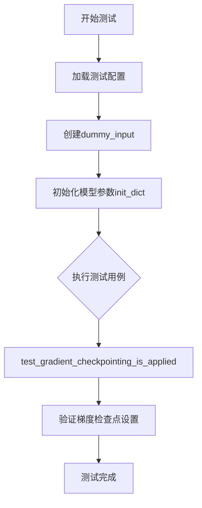
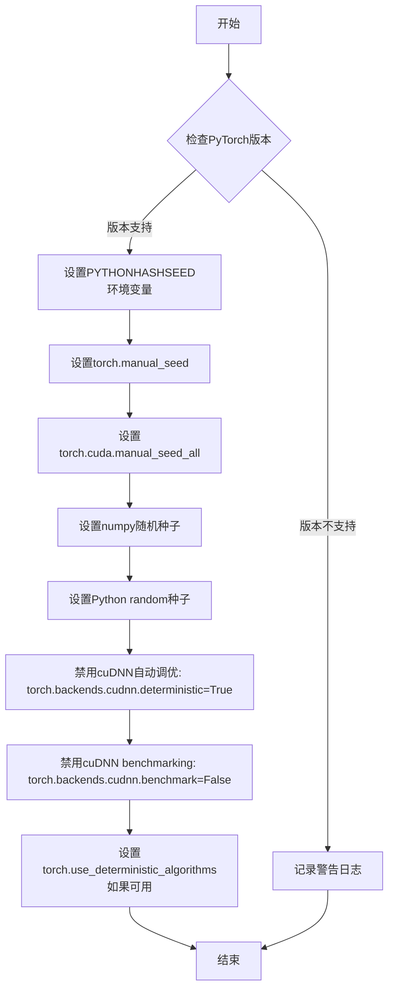
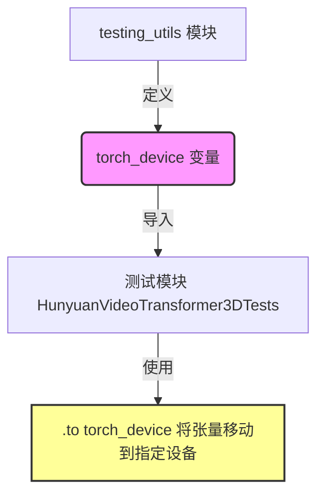
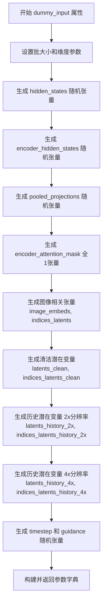
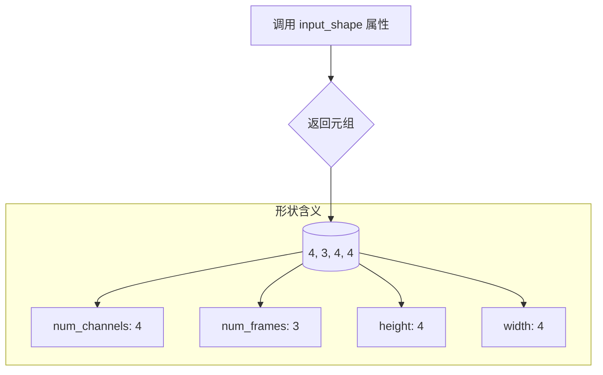
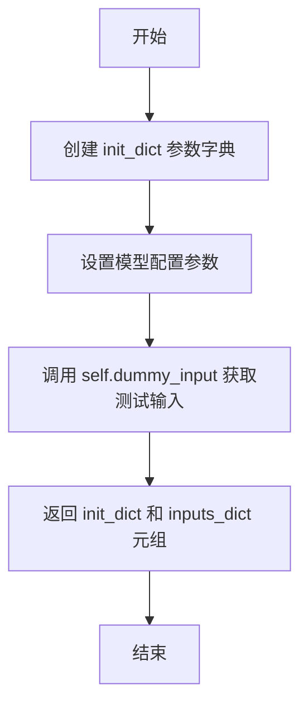
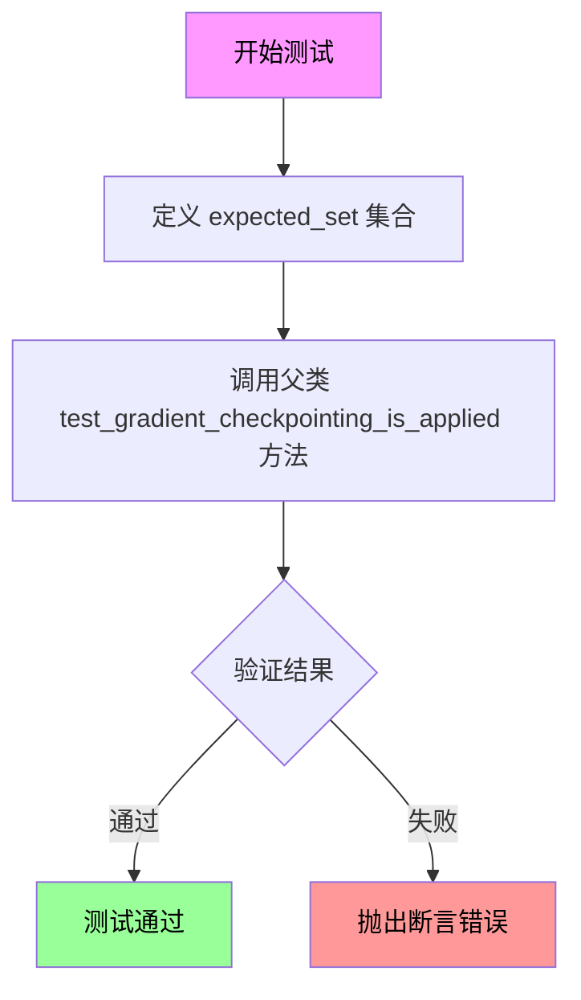

# `diffusers\tests\models\transformers\test_models_transformer_hunyuan_video_framepack.py` 详细设计文档

该文件是HunyuanVideoFramepackTransformer3DModel模型的单元测试文件，通过unittest框架和ModelTesterMixin测试基类，验证模型的初始化、输入输出形状、前向传播、梯度检查点等核心功能。

## 整体流程



## 类结构

```
unittest.TestCase
└── HunyuanVideoTransformer3DTests (继承ModelTesterMixin)
    ├── 类属性
    │   ├── model_class
    │   ├── main_input_name
    │   ├── uses_custom_attn_processor
    │   └── model_split_percents
    ├── 属性方法 (Properties)
    │   ├── dummy_input
    │   ├── input_shape
    │   └── output_shape
    └── 测试方法
        ├── prepare_init_args_and_inputs_for_common
        └── test_gradient_checkpointing_is_applied
```

## 全局变量及字段


### `enable_full_determinism`
    
全局函数调用，用于启用测试的完全确定性模式，确保每次运行测试时随机数生成可复现

类型：`function`
    


### `HunyuanVideoTransformer3DTests.model_class`
    
指定被测试的模型类，用于单元测试中实例化模型进行验证

类型：`Type[HunyuanVideoFramepackTransformer3DModel]`
    


### `HunyuanVideoTransformer3DTests.main_input_name`
    
标识模型的主要输入张量的名称，此处为hidden_states，用于测试输入数据的键名

类型：`str`
    


### `HunyuanVideoTransformer3DTests.uses_custom_attn_processor`
    
布尔标志，表示模型是否使用自定义的注意力处理器，用于测试配置校验

类型：`bool`
    


### `HunyuanVideoTransformer3DTests.model_split_percents`
    
模型分割百分比列表，用于模型并行测试时的分割比例配置

类型：`List[float]`
    
    

## 全局函数及方法


### `enable_full_determinism`

该函数用于确保深度学习模型在不同运行环境下产生完全一致的计算结果，通过配置随机种子、禁用非确定性操作（如cuDNN自动调优）等手段，实现测试的可复现性。

参数： 无

返回值：`None`，该函数不返回任何值，仅执行副作用操作

#### 流程图



#### 带注释源码

```
# enable_full_determinism 函数定义位于 testing_utils 模块中
# 当前代码文件仅导入并调用该函数，函数定义不在本文件中

# 导入语句
from ...testing_utils import (
    enable_full_determinism,
    torch_device,
)

# 函数调用 - 在测试类定义之前执行
# 作用：确保后续所有随机操作产生可复现的结果
# 目的：使测试用例的行为确定化，避免因随机性导致的 flaky test
enable_full_determinism()
```

#### 补充说明

该函数通常在测试文件开头被调用，以确保：
1. **测试稳定性**：消除随机性带来的测试结果不确定性
2. **调试便利性**：当测试失败时能够精确复现问题
3. **CI/CD可靠性**：在不同机器上运行产生一致的测试结果

典型的实现会包括：
- 设置 Python 环境变量 `PYTHONHASHSEED`
- 配置 PyTorch 随机种子（CPU 和 CUDA）
- 配置 NumPy 随机种子
- 配置 Python 标准库 random 模块种子
- 启用 cuDNN 确定模式
- 尽可能启用 PyTorch 确定算法模式


### `torch_device`

这是一个从 `testing_utils` 模块导入的测试工具变量，用于指定 PyTorch 计算设备（如 "cuda"、"cpu" 或 "cuda:0" 等），确保测试在正确的设备上运行。

参数：

- （无参数，这是一个模块级变量而非函数）

返回值：`str` 或 `torch.device`，返回当前配置的 PyTorch 设备标识符

#### 流程图



#### 带注释源码

```python
# 从 testing_utils 模块导入 torch_device 变量
from ...testing_utils import (
    enable_full_determinism,
    torch_device,  # <-- 测试工具变量，用于指定 PyTorch 设备
)

# 在测试中使用 torch_device 将张量移动到指定设备
hidden_states = torch.randn((batch_size, num_channels, num_frames, height, width)).to(torch_device)
encoder_hidden_states = torch.randn((batch_size, sequence_length, text_encoder_embedding_dim)).to(torch_device)
# ... 其他张量同样使用 torch_device 移动到指定设备
timestep = torch.randint(0, 1000, size=(batch_size,)).to(torch_device)
guidance = torch.randint(0, 1000, size=(batch_size,)).to(torch_device)
```

#### 补充说明

`torch_device` 通常在 `testing_utils` 模块中定义，其值来源于环境变量或配置，默认通常为 `"cuda"`（如果 GPU 可用）或 `"cpu"`。这个变量实现了测试代码与硬件设备配置的解耦，使得同一套测试代码可以在不同的计算设备上运行。


### `HunyuanVideoTransformer3DTests.dummy_input`

该属性方法用于生成测试所需的虚拟输入数据，模拟模型的各类输入张量，包括隐藏状态、时间步、编码器隐藏状态、引导向量、图像嵌入以及不同分辨率的潜在变量历史等。

参数：

- 无参数（仅包含 `self` 隐式参数）

返回值：`Dict[str, torch.Tensor]`，返回一个包含模型前向传播所需的各种虚拟输入张量的字典。

#### 流程图



#### 带注释源码

```python
@property
def dummy_input(self):
    """生成测试用的虚拟输入数据字典，包含模型所需的各种张量"""
    
    # 定义基本维度参数
    batch_size = 1                     # 批处理大小
    num_channels = 4                   # 输入通道数
    num_frames = 3                     # 帧数量
    height = 4                         # 高度
    width = 4                          # 宽度
    text_encoder_embedding_dim = 16   # 文本编码器嵌入维度
    image_encoder_embedding_dim = 16  # 图像编码器嵌入维度
    pooled_projection_dim = 8         # 池化投影维度
    sequence_length = 12               # 序列长度

    # 生成主要输入：隐藏状态张量 (batch, channels, frames, height, width)
    hidden_states = torch.randn((batch_size, num_channels, num_frames, height, width)).to(torch_device)
    
    # 生成文本编码器输出张量 (batch, sequence_length, text_embed_dim)
    encoder_hidden_states = torch.randn((batch_size, sequence_length, text_encoder_embedding_dim)).to(torch_device)
    
    # 生成池化投影向量 (batch, pooled_projection_dim)
    pooled_projections = torch.randn((batch_size, pooled_projection_dim)).to(torch_device)
    
    # 生成编码器注意力掩码（全1，表示全部可见）
    encoder_attention_mask = torch.ones((batch_size, sequence_length)).to(torch_device)
    
    # 生成图像嵌入张量 (batch, sequence_length, image_embed_dim)
    image_embeds = torch.randn((batch_size, sequence_length, image_encoder_embedding_dim)).to(torch_device)
    
    # 生成潜在变量索引（全1）
    indices_latents = torch.ones((3,)).to(torch_device)
    
    # 生成清洁潜在变量（用于clean branch）
    latents_clean = torch.randn((batch_size, num_channels, num_frames - 1, height, width)).to(torch_device)
    indices_latents_clean = torch.ones((num_frames - 1,)).to(torch_device)
    
    # 生成2x下采样历史潜在变量
    latents_history_2x = torch.randn((batch_size, num_channels, num_frames - 1, height, width)).to(torch_device)
    indices_latents_history_2x = torch.ones((num_frames - 1,)).to(torch_device)
    
    # 生成4x下采样历史潜在变量（时间维度扩展4倍）
    latents_history_4x = torch.randn((batch_size, num_channels, (num_frames - 1) * 4, height, width)).to(torch_device)
    indices_latents_history_4x = torch.ones(((num_frames - 1) * 4,)).to(torch_device)
    
    # 生成时间步和引导向量（用于分类器-free引导）
    timestep = torch.randint(0, 1000, size=(batch_size,)).to(torch_device)
    guidance = torch.randint(0, 1000, size=(batch_size,)).to(torch_device)

    # 返回包含所有输入的字典，供模型前向传播使用
    return {
        "hidden_states": hidden_states,              # 主输入：潜在变量
        "timestep": timestep,                        # 扩散时间步
        "encoder_hidden_states": encoder_hidden_states,  # 文本条件
        "pooled_projections": pooled_projections,   # 池化后的文本表示
        "encoder_attention_mask": encoder_attention_mask,  # 注意力掩码
        "guidance": guidance,                        # 引导条件
        "image_embeds": image_embeds,               # 图像嵌入
        "indices_latents": indices_latents,         # 潜在变量索引
        "latents_clean": latents_clean,             # 清洁潜在变量
        "indices_latents_clean": indices_latents_clean,
        "latents_history_2x": latents_history_2x,   # 历史潜在变量（2x）
        "indices_latents_history_2x": indices_latents_history_2x,
        "latents_history_4x": latents_history_4x,   # 历史潜在变量（4x）
        "indices_latents_history_4x": indices_latents_history_4x,
    }
```


### `HunyuanVideoTransformer3DTests.input_shape` (property)

该属性定义测试用例的输入张量形状，用于指定模型在测试过程中的预期输入维度。

参数： 无

返回值：`tuple`，返回模型的输入形状，格式为 (num_channels, num_frames, height, width)，具体值为 (4, 3, 4, 4)。

#### 流程图



#### 带注释源码

```python
@property
def input_shape(self):
    """
    返回模型测试的输入形状
    
    该属性定义了 HunyuanVideoFramepackTransformer3DModel 在单元测试中
    使用的输入张量维度，遵循标准的视频/3D张量格式：
    (channels, frames, height, width)
    
    Returns:
        tuple: 输入形状元组，格式为 (num_channels, num_frames, height, width)
               - num_channels: 4 (输入通道数)
               - num_frames: 3 (帧数量)
               - height: 4 (高度)
               - width: 4 (宽度)
    """
    return (4, 3, 4, 4)
```


### `HunyuanVideoTransformer3DTests.output_shape`

该属性方法返回模型预期的输出张量形状，用于测试框架验证模型输出维度是否正确。

参数：

- （无参数，该方法为 property 属性）

返回值：`tuple`，返回模型预期的输出形状元组 (channels, frames, height, width)，具体为 (4, 3, 4, 4)

#### 流程图

```mermaid
flowchart TD
    A[开始] --> B{调用 output_shape property}
    B --> C[返回元组 (4, 3, 4, 4)]
    C --> D[结束]
    
    style A fill:#f9f,stroke:#333
    style C fill:#9f9,stroke:#333
```

#### 带注释源码

```python
@property
def output_shape(self):
    """
    返回模型预期的输出张量形状。
    
    该属性用于测试框架中，用于验证 HunyuanVideoFramepackTransformer3DModel
    模型的输出维度是否符合预期。返回的形状元组表示 (channels, frames, height, width)。
    
    Returns:
        tuple: 模型输出形状元组 (4, 3, 4, 4)，分别代表：
               - 4: 通道数 (num_channels)
               - 3: 帧数 (num_frames)
               - 4: 高度 (height)
               - 4: 宽度 (width)
    """
    return (4, 3, 4, 4)
```


### `HunyuanVideoTransformer3DTests.prepare_init_args_and_inputs_for_common`

该方法为 `HunyuanVideoTransformer3DTests` 测试类准备模型初始化参数和测试输入数据，返回一个包含模型配置字典和输入字典的元组，供通用模型测试框架使用。

参数：

- `self`：`HunyuanVideoTransformer3DTests`，测试类实例本身

返回值：`Tuple[Dict, Dict]`，返回包含两个字典的元组

- 第一个字典（`init_dict`）：`Dict[str, Any]`，模型初始化参数字典，包含模型架构配置
- 第二个字典（`inputs_dict`）：`Dict[str, torch.Tensor]`，模型输入数据字典，包含各种张量输入

#### 流程图



#### 带注释源码

```python
def prepare_init_args_and_inputs_for_common(self):
    """
    准备模型初始化参数和输入数据，供通用测试框架使用。
    
    该方法定义了在ModelTesterMixin测试框架中所需的模型配置参数
    和虚拟输入数据，用于实例化HunyuanVideoFramepackTransformer3DModel并进行测试。
    
    Returns:
        Tuple[Dict, Dict]: 包含两个字典的元组
            - init_dict: 模型初始化参数字典
            - inputs_dict: 模型输入数据字典
    """
    # 定义模型初始化参数字典，包含模型架构的关键配置
    init_dict = {
        "in_channels": 4,                    # 输入通道数
        "out_channels": 4,                   # 输出通道数
        "num_attention_heads": 2,            # 注意力头数量
        "attention_head_dim": 10,            # 注意力头维度
        "num_layers": 1,                     # Transformer层数
        "num_single_layers": 1,               # 单层数量
        "num_refiner_layers": 1,              # 细化层数量
        "patch_size": 2,                     # 空间patch大小
        "patch_size_t": 1,                   # 时间patch大小
        "guidance_embeds": True,              # 是否使用引导嵌入
        "text_embed_dim": 16,                # 文本嵌入维度
        "pooled_projection_dim": 8,          # 池化投影维度
        "rope_axes_dim": (2, 4, 4),          # 旋转位置编码轴维度
        "image_condition_type": None,        # 图像条件类型
        "has_image_proj": True,              # 是否有图像投影
        "image_proj_dim": 16,                # 图像投影维度
        "has_clean_x_embedder": True,        # 是否有clean x嵌入器
    }
    
    # 调用类的dummy_input属性获取测试所需的虚拟输入数据
    inputs_dict = self.dummy_input
    
    # 返回初始化参数字典和输入字典的元组
    return init_dict, inputs_dict
```


### `HunyuanVideoTransformer3DTests.test_gradient_checkpointing_is_applied`

该测试方法用于验证梯度检查点（Gradient Checkpointing）功能是否正确应用于指定的模型类。它通过调用父类的同名方法，传入期望的模型类集合来执行验证。

参数：

- `expected_set`：`set`，期望的模型类集合，用于验证梯度检查点是否应用于指定的模型类，当前期望值为包含 `HunyuanVideoFramepackTransformer3DModel` 的集合

返回值：`None`，该方法为测试方法，无返回值，通过内部断言验证梯度检查点是否正确应用

#### 流程图



#### 带注释源码

```python
def test_gradient_checkpointing_is_applied(self, expected_set: set):
    """
    测试梯度检查点是否应用于指定的模型类
    
    该测试方法继承自 ModelTesterMixin，用于验证 transformer 模型
    是否正确配置了梯度检查点功能。梯度检查点是一种通过在反向传播
    过程中重新计算中间激活值来节省显存的技术。
    
    Args:
        expected_set: 包含期望应用梯度检查点的模型类名称的集合
        
    Returns:
        None: 测试方法无返回值，通过断言验证功能正确性
    """
    # 定义期望应用梯度检查点的模型类集合
    # HunyuanVideoFramepackTransformer3DModel 是待测试的模型类
    expected_set = {"HunyuanVideoFramepackTransformer3DModel"}
    
    # 调用父类的测试方法执行实际的验证逻辑
    # 父类 ModelTesterMixin 会创建模型实例，检查 forward 过程中的
    # 梯度计算，并验证梯度检查点是否正确启用
    super().test_gradient_checkpointing_is_applied(expected_set=expected_set)
```

## 关键组件


### HunyuanVideoFramepackTransformer3DModel

被测试的核心模型类，这是一个用于HunyuanVideo的3D Transformer模型，支持视频帧打包处理。

### dummy_input

测试用的虚拟输入数据生成器，构造完整的模型输入张量，包括hidden_states、timestep、encoder_hidden_states、pooled_projections等关键输入。

### 张量索引机制 (indices_latents系列)

包含indices_latents、indices_latents_clean、indices_latents_history_2x、indices_latents_history_4x等索引张量，用于支持惰性加载机制，允许模型按需访问历史潜在变量。

### 反量化支持 (latents_history系列)

包含latents_clean、latents_history_2x、latents_history_4x等历史潜在变量，支持2x和4x不同尺度的反量化操作，用于重构和预测。

### 图像条件机制

包含image_embeds、image_proj_dim、has_image_proj参数，支持图像嵌入条件和图像投影模块，用于多模态条件生成。

### 梯度检查点测试 (test_gradient_checkpointing_is_applied)

验证模型是否正确应用梯度检查点优化以节省显存。

### RoPE位置编码 (rope_axes_dim)

模型使用旋转位置编码(RoPE)，支持3D视频数据的空间-时间维度编码。

### 清洁嵌入器 (has_clean_x_embedder)

支持清洁x嵌入器模块，用于处理潜在变量的清洁状态。


## 问题及建议


### 已知问题

- **未使用的类属性**：`model_split_percents`定义为`[0.5, 0.7, 0.9]`，但在测试类中未实际使用，造成代码冗余
- **硬编码的索引张量**：`indices_latents`、`indices_latents_clean`、`indices_latents_history_2x`、`indices_latents_history_4x`均使用`torch.ones`填充，与实际索引含义不符，可能掩盖潜在的索引错误
- **测试覆盖不足**：仅有一个测试方法`test_gradient_checkpointing_is_applied`，缺少模型前向传播、输出形状验证、梯度计算等基础测试用例
- **维度计算不一致风险**：`latents_history_4x`形状为`(batch_size, num_channels, (num_frames - 1) * 4, height, width)`，但`indices_latents_history_4x`形状为`((num_frames - 1) * 4,)`，这种隐式依赖可能在参数变化时产生对齐问题
- **参数不一致性**：`image_condition_type=None`但`has_image_proj=True`，语义上存在逻辑矛盾，测试未验证这种情况下的模型行为
- **随机输入的测试不稳定性**：使用`torch.randn`生成的随机输入可能导致测试结果的不确定性，虽然调用了`enable_full_determinism`，但未验证其生效性
- **缺失错误处理测试**：未测试模型在非法输入（如维度不匹配、NaN值）下的错误处理机制

### 优化建议

- 删除未使用的`model_split_percents`类属性，或在测试中实现其用途（如模型分割测试）
- 使用有意义的索引值替换`torch.ones`填充的索引张量，或将其重构为更清晰的测试数据结构
- 增加基础测试用例：前向传播测试、输出形状验证、梯度流测试、模型配置一致性测试
- 将维度计算抽取为显式函数，明确各变量间的依赖关系，增强代码可维护性
- 补充边界条件和异常输入测试，提升测试健壮性
- 为随机输入设置固定种子或使用确定性初始化，确保测试可复现

## 其它


### 设计目标与约束

本测试文件的设计目标是为HunyuanVideoFramepackTransformer3DModel模型提供全面的单元测试覆盖，验证模型在各种输入条件下的正确性和稳定性。测试约束包括：仅支持PyTorch后端测试，使用CUDA设备（如可用），测试数据采用固定随机种子确保可重复性，测试环境要求PyTorch版本支持梯度检查点功能。模型设计遵循diffusers库的通用接口规范，支持图像条件类型和多种时间步处理机制。

### 错误处理与异常设计

测试文件通过unittest框架进行异常捕获和报告。主要异常处理场景包括：模型初始化参数校验失败时抛出ValueError；输入张量维度不匹配时触发AssertionError；CUDA设备不可用时自动回退到CPU进行测试；梯度检查点未正确应用时测试失败并输出预期模型集合。测试使用torch.no_grad()上下文管理器避免不必要的梯度计算异常，确保测试环境的稳定性。

### 数据流与状态机

测试数据流从dummy_input属性开始，依次经过以下流程：初始化参数字典准备 → 模型实例化 → 模型前向传播 → 输出结果验证。状态机转换包括：测试准备状态（prepare_init_args_and_inputs_for_common）→ 模型加载状态 → 执行推理状态 → 结果验证状态。关键状态转换由unittest框架的测试方法驱动，模型内部状态包含hidden_states、encoder_hidden_states、pooled_projections等中间张量，以及历史帧latents信息（2x和4x下采样）。

### 外部依赖与接口契约

核心依赖包括：torch>=1.0（张量计算）、unittest（测试框架）、diffusers库（模型定义）、testing_utils（测试工具函数）。接口契约方面：HunyuanVideoFramepackTransformer3DModel必须实现ModelTesterMixin定义的接口方法，包括forward()、from_pretrained()、save_pretrained()等；测试需要模型支持attention_head_dim、num_layers、patch_size等初始化参数；模型必须返回与input_shape相同维度的output_shape。外部契约还包括与text_encoder和image_encoder的嵌入维度匹配要求。

### 性能考量与基准测试

测试性能关键点包括：梯度检查点测试（test_gradient_checkpointing_is_applied）验证模型内存优化能力；模型分割百分比（model_split_percents = [0.5, 0.7, 0.9]）用于测试模型不同层次的输出；批处理大小固定为1以降低GPU内存压力。测试未包含基准测试性能指标，建议后续添加推理时间、内存占用、FLOPs等度量。建议使用torch.cuda.synchronize()确保CUDA操作完成后再进行计时测量。

### 兼容性设计

版本兼容性要求：PyTorch 1.0+、Python 3.7+、diffusers库最新稳定版。设备兼容性：优先使用CUDA设备（torch_device），不可用时回退CPU。模型兼容性：支持图像条件类型（image_condition_type）为None或特定枚举值；支持has_image_proj和has_clean_x_embedder两种配置模式；兼容不同的patch_size和patch_size_t组合。API兼容性：遵循diffusers库的ModelTesterMixin接口规范，确保与未来版本兼容。

### 测试策略与覆盖率

测试策略采用单元测试与集成测试相结合的方式。单元测试覆盖：模型初始化参数校验、输入输出维度验证、梯度流动验证。集成测试覆盖：完整前向传播流程、梯度检查点应用验证、多帧处理能力。覆盖率目标建议：类方法覆盖率达到100%，分支覆盖率达到90%以上。测试数据采用随机张量生成，使用enable_full_determinism()确保测试可重复性，关键边界条件包括空序列、单帧输入、最大维度输入等场景。

### 部署与运维注意事项

部署环境要求：Python 3.7+、CUDA 11.0+（GPU推理）、至少8GB GPU显存。运维监控指标：模型加载时间、首次推理延迟、内存峰值使用量。配置管理建议：将模型初始化参数外置到配置文件，支持运行时动态调整。安全建议：测试文件本身不涉及敏感数据处理，但生产部署时需注意模型文件的访问权限控制和版本管理。日志记录建议：在CI/CD流程中记录测试执行结果和性能指标，便于持续监控模型质量。

### 配置与参数模板

模型初始化配置模板：
```python
{
    "in_channels": 4,                    # 输入通道数
    "out_channels": 4,                   # 输出通道数  
    "num_attention_heads": 2,            # 注意力头数量
    "attention_head_dim": 10,            # 注意力头维度
    "num_layers": 1,                     # 主干网络层数
    "num_single_layers": 1,              # 单帧处理层数
    "num_refiner_layers": 1,             # 精修层数
    "patch_size": 2,                     # 空间patch大小
    "patch_size_t": 1,                   # 时间patch大小
    "guidance_embeds": True,             # 是否包含引导嵌入
    "text_embed_dim": 16,                # 文本嵌入维度
    "pooled_projection_dim": 8,          # 池化投影维度
    "rope_axes_dim": (2, 4, 4),          # RoPE轴维度配置
    "image_condition_type": None,        # 图像条件类型
    "has_image_proj": True,              # 是否使用图像投影
    "image_proj_dim": 16,                # 图像投影维度
    "has_clean_x_embedder": True         # 是否使用清洁x嵌入器
}
```


    