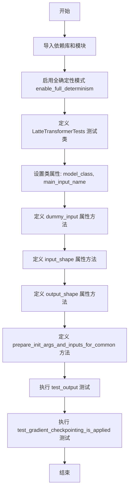
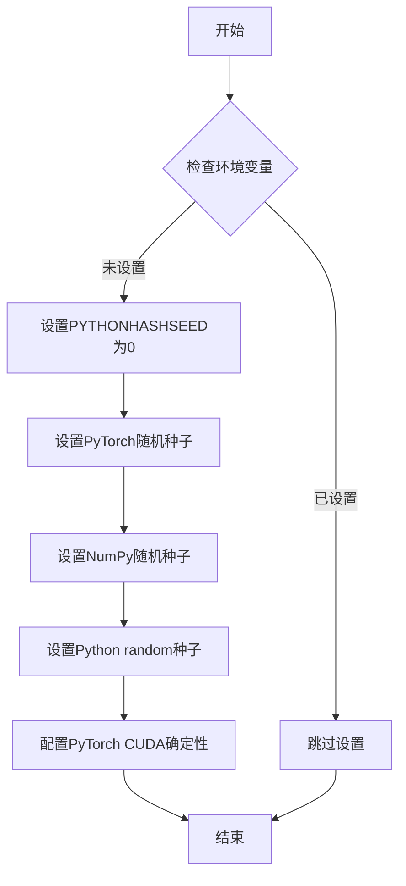
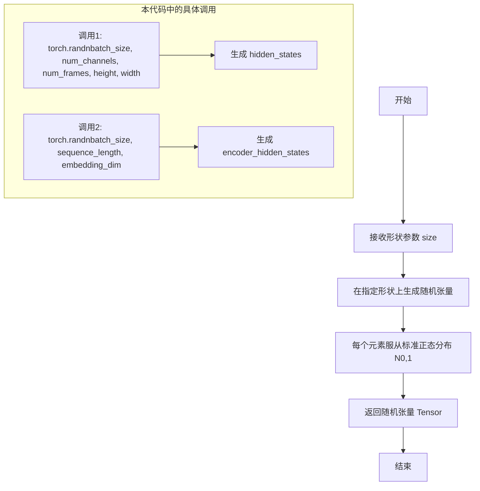
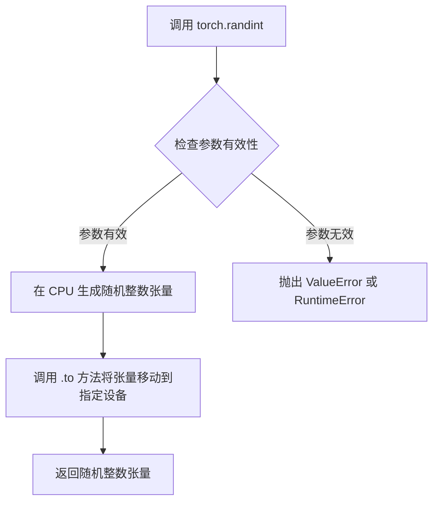
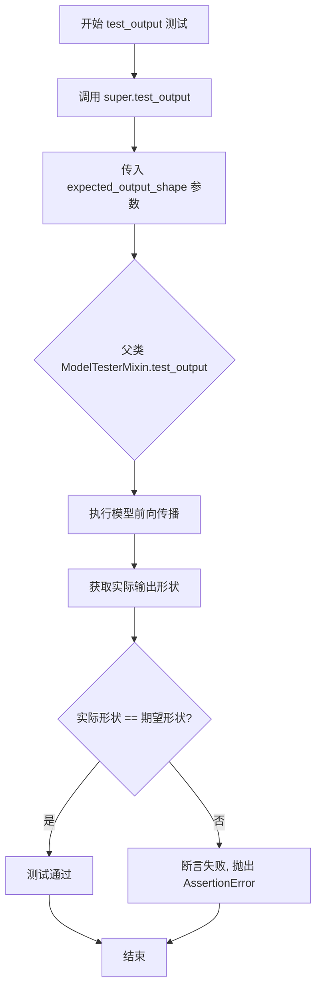
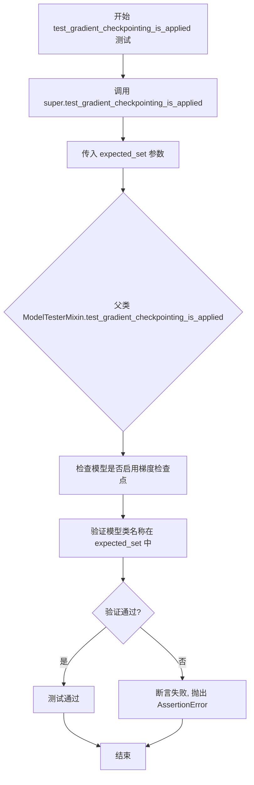
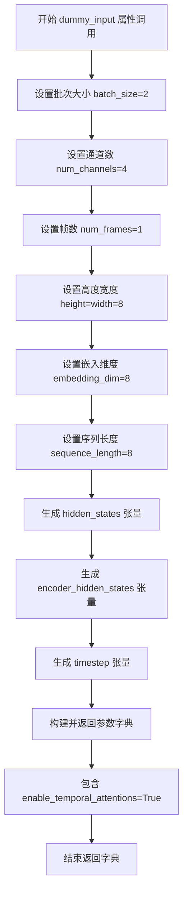

# `diffusers\tests\models\transformers\test_models_transformer_latte.py` 详细设计文档

这是一个针对 LatteTransformer3DModel 的单元测试文件，继承自 ModelTesterMixin，提供了模型的各种通用测试，包括输出形状验证、梯度检查点应用测试等。

## 整体流程



## 类结构

```
unittest.TestCase
└── LatteTransformerTests (继承 ModelTesterMixin)
    └── 测试 LatteTransformer3DModel 模型
```

## 全局变量及字段


### `enable_full_determinism`
    
启用测试的完全确定性，确保测试结果可复现

类型：`function`
    


### `torch_device`
    
获取当前测试使用的设备（CPU或CUDA）

类型：`str`
    


### `LatteTransformer3DModel`
    
被测试的Latte 3D变换器模型类

类型：`class`
    


### `ModelTesterMixin`
    
提供模型通用测试方法的混入类

类型：`class`
    


### `LatteTransformerTests.model_class`
    
指定被测试的模型类为 LatteTransformer3DModel

类型：`type`
    


### `LatteTransformerTests.main_input_name`
    
模型主输入参数的名称，此处为 hidden_states

类型：`str`
    
    

## 全局函数及方法


### `enable_full_determinism`

该函数用于启用完全确定性模式，通过设置随机种子和环境变量确保深度学习模型在运行时的结果可复现，通常用于测试和调试场景以消除随机性带来的不确定性。

参数：无需参数

返回值：无返回值（`None`）

#### 流程图



#### 带注释源码

```
# 该函数由 testing_utils 模块提供，以下为调用方式
from ...testing_utils import (
    enable_full_determinism,
    torch_device,
)

# 在测试模块级别调用，确保后续所有测试运行在确定性模式下
enable_full_determinism()
```

---

**注意**：给定的代码文件中仅包含 `enable_full_determinism` 函数的导入和调用语句，未包含该函数的实际实现源码。该函数的完整定义位于 `diffusers` 包的 `testing_utils` 模块中。从函数名称和调用上下文推测，其核心功能是通过设置随机种子（Python、NumPy、PyTorch）以及相关环境变量，确保模型推理和训练过程产生完全可复现的结果，这对于测试用例的稳定性和调试至关重要。

#### 关键组件信息

- **testing_utils**：提供测试辅助工具的模块，包含 `enable_full_determinism` 函数
- **torch_device**：测试设备标识（通常为 "cuda" 或 "cpu"）

#### 潜在技术债务

1. **函数定义缺失**：当前代码依赖外部模块的函数，但未提供源码，难以追踪具体实现细节
2. **硬编码随机性控制**：若未来需要细粒度控制确定性级别（如仅控制部分随机源），当前设计可能需重构

#### 其它项目

- **设计目标**：确保测试的确定性，提高测试的可靠性和可复现性
- **错误处理**：若环境中不支持某些确定性设置（如特定CUDA版本），可能需要优雅降级
- **外部依赖**：依赖 PyTorch、NumPy 的随机种子设置接口，以及 CUDA 的 `torch.use_deterministic_algorithms` API


### `torch.randn`

`torch.randn` 是 PyTorch 库中的一个基础函数，用于生成服从标准正态分布（均值为0，方差为1）的随机张量。在本代码中，该函数用于生成模型测试所需的随机输入数据。

参数：

- `*size`：`int`，可变数量的整数参数，指定输出张量的形状（如 `batch_size`, `num_channels`, `num_frames`, `height`, `width`）

返回值：`Tensor`，返回一个随机张量，其元素服从标准正态分布 N(0,1)

#### 流程图



#### 带注释源码

```python
# 代码中 torch.randn 的使用示例

# 第一次调用：生成隐藏状态张量
# 参数解释：
#   batch_size=2: 批处理大小
#   num_channels=4: 通道数
#   num_frames=1: 帧数（用于视频/3D模型）
#   height=width=8: 空间维度
# 返回：形状为 (2, 4, 1, 8, 8) 的随机张量
hidden_states = torch.randn((batch_size, num_channels, num_frames, height, width)).to(torch_device)

# 第二次调用：生成编码器隐藏状态张量
# 参数解释：
#   batch_size=2: 批处理大小  
#   sequence_length=8: 序列长度
#   embedding_dim=8: 嵌入维度
# 返回：形状为 (2, 8, 8) 的随机张量
encoder_hidden_states = torch.randn((batch_size, sequence_length, embedding_dim)).to(torch_device)

# 补充说明：
# .to(torch_device): 将张量移动到指定的计算设备（CPU/GPU）
# 生成的随机值用于模拟模型输入，进行单元测试
```

---

### 补充说明

#### 关键组件信息

| 组件名称 | 一句话描述 |
|---------|-----------|
| `LatteTransformer3DModel` | 被测试的3D时空变换器模型类 |
| `dummy_input` | 属性方法，生成测试用的虚拟输入数据 |
| `ModelTesterMixin` | 提供模型通用测试逻辑的混入类 |

#### 潜在技术债务或优化空间

1. **随机性控制**：代码中使用了 `enable_full_determinism()` 来保证测试可复现性，但 `torch.randn` 每次运行仍会产生不同结果，需确保 seed 设置正确
2. **硬编码维度**：输入输出的形状（4, 1, 8, 8）等数值硬编码在属性中，缺乏灵活性
3. **测试数据多样性**：当前仅生成一组固定规格的测试数据，建议增加多组不同尺寸的测试用例

#### 其他项目

**设计目标与约束**：
- 目标：验证 `LatteTransformer3DModel` 模型的前向传播、梯度检查点等功能
- 约束：必须继承 `ModelTesterMixin` 以保持与其他模型测试的一致性

**错误处理与异常设计**：
- 测试通过 `unittest.TestCase` 框架进行
- 异常信息由父类 `super().test_output()` 等方法统一处理

**数据流与状态机**：
- 数据流：`dummy_input` → 模型输入 → 模型输出 → 验证输出形状
- 无复杂状态机设计，属于标准单元测试流程

**外部依赖与接口契约**：
- 依赖：`torch`, `diffusers`, `testing_utils`
- 接口：`prepare_init_args_and_inputs_for_common()` 返回模型初始化参数和输入字典


### `torch.randint`

生成指定范围内的随机整数张量，用于创建时间步（timestep）输入。

参数：

- `low`：`int`，生成的随机整数的下界（包含），此处为 `0`
- `high`：`int`，生成的随机整数的上界（不包含），此处为 `1000`
- `size`：`tuple`，输出张量的形状，此处为 `(batch_size,)`
- `device`（通过 `.to()` 调用）：`torch.device`，张量存放的设备，此处为 `torch_device`

返回值：`torch.Tensor`，形状为 `(batch_size,)` 的随机整数张量，值域为 `[0, 1000)`

#### 流程图



#### 带注释源码

```python
# 生成随机整数张量用于 timestep
# 参数说明：
#   - 0: 下界（包含），生成的最小值
#   - 1000: 上界（不包含），生成的最大值为 999
#   - size=(batch_size,): 输出形状为 (2,)，batch_size=2
timestep = torch.randint(0, 1000, size=(batch_size,)).to(torch_device)
# 解释：创建一个形状为 (2,) 的张量，包含 2 个随机整数，范围在 [0, 1000)
# 然后将张量从当前设备移动到 torch_device 指定的设备（通常是 CUDA 设备）
```


### `LatteTransformerTests.test_output`

该方法继承自 `ModelTesterMixin` 测试基类，用于验证模型输出的形状是否符合预期，确保模型能够正确处理输入并生成预期维度的输出。

参数：

- `expected_output_shape`：`Tuple[int, ...]`，期望的输出形状元组，包含批次大小与预定义输出形状的组合

返回值：无返回值（`None`），通过 `assert` 语句进行断言验证

#### 流程图



#### 带注释源码

```python
def test_output(self):
    """
    测试模型输出的形状是否符合预期
    继承自 ModelTesterMixin 的测试方法
    """
    # 调用父类的 test_output 方法进行输出形状验证
    # expected_output_shape 参数由 self.dummy_input 的批次大小和 self.output_shape 组合而成
    super().test_output(
        expected_output_shape=(
            self.dummy_input[self.main_input_name].shape[0],  # 获取输入的批次大小
        ) + self.output_shape  # 拼接预定义的输出形状 (8, 1, 8, 8)
    )
```

---

### `LatteTransformerTests.test_gradient_checkpointing_is_applied`

该方法继承自 `ModelTesterMixin` 测试基类，用于验证梯度检查点（gradient checkpointing）技术是否正确应用于指定的模型类，以确保在大模型训练时能够有效节省显存。

参数：

- `expected_set`：`Set[str]`，期望应用梯度检查点的模型类名称集合

返回值：无返回值（`None`），通过 `assert` 语句进行断言验证

#### 流程图



#### 带注释源码

```python
def test_gradient_checkpointing_is_applied(self):
    """
    测试梯度检查点技术是否应用于 LatteTransformer3DModel
    继承自 ModelTesterMixin 的测试方法
    """
    # 定义期望启用梯度检查点的模型类集合
    expected_set = {"LatteTransformer3DModel"}
    
    # 调用父类的测试方法验证梯度检查点应用情况
    # 父类方法会检查指定模型类是否正确配置了梯度检查点
    super().test_gradient_checkpointing_is_applied(expected_set=expected_set)
```

---

### 设计目标与约束

- **测试目标**：验证 `LatteTransformer3DModel` 模型的输出形状和梯度检查点配置是否正确
- **约束**：继承自 `ModelTesterMixin` 通用测试框架，需遵循其接口规范

### 错误处理与异常设计

- 测试失败时抛出 `AssertionError`，包含具体的形状不匹配或配置错误信息

### 继承关系说明

- `LatteTransformerTests` 继承自 `ModelTesterMixin` 和 `unittest.TestCase`
- 通过 `super()` 调用父类方法，确保通用测试逻辑的执行，同时允许子类自定义测试参数


### `LatteTransformerTests.dummy_input`

该属性方法用于生成LatteTransformer3DModel测试所需的虚拟输入数据，包括隐藏状态、编码器隐藏状态、时间步和临时注意力开关标志，返回一个包含这些张量数据的字典，供模型前向传播测试使用。

参数：
- 无（作为 `@property`，仅使用 `self` 引用类实例）

返回值：`Dict[str, Any]`，包含以下键值对的字典：
- `hidden_states`：`torch.Tensor`，形状为 (batch_size, num_channels, num_frames, height, width) 的随机初始化隐藏状态张量
- `encoder_hidden_states`：`torch.Tensor`，形状为 (batch_size, sequence_length, embedding_dim) 的随机初始化编码器隐藏状态张量
- `timestep`：`torch.Tensor`，形状为 (batch_size,) 的随机时间步整数张量
- `enable_temporal_attentions`：`bool`，指示是否启用时间注意力的布尔标志

#### 流程图



#### 带注释源码

```python
@property
def dummy_input(self):
    """
    生成用于测试 LatteTransformer3DModel 的虚拟输入数据。
    
    该属性方法创建符合模型输入要求的随机张量，包括：
    - hidden_states: 5D 张量 (batch, channels, frames, height, width)
    - encoder_hidden_states: 3D 张量 (batch, sequence_length, embedding_dim)
    - timestep: 1D 整数张量 (batch_size,)
    - enable_temporal_attentions: 布尔标志
    """
    # 批次大小：同时处理的样本数量
    batch_size = 2
    # 输入通道数：对应输入数据的特征维度
    num_channels = 4
    # 帧数：视频/3D数据的帧数量
    num_frames = 1
    # 空间分辨率：高度和宽度
    height = width = 8
    # 嵌入维度：编码器隐藏状态的特征维度
    embedding_dim = 8
    # 序列长度：编码器输入的序列长度
    sequence_length = 8

    # 创建随机初始化的隐藏状态张量，形状为 (2, 4, 1, 8, 8)
    # 对应 (batch_size, num_channels, num_frames, height, width)
    hidden_states = torch.randn((batch_size, num_channels, num_frames, height, width)).to(torch_device)
    
    # 创建随机初始化的编码器隐藏状态张量，形状为 (2, 8, 8)
    # 对应 (batch_size, sequence_length, embedding_dim)
    encoder_hidden_states = torch.randn((batch_size, sequence_length, embedding_dim)).to(torch_device)
    
    # 创建随机时间步张量，形状为 (2,)，值范围 [0, 1000)
    # 用于扩散模型的噪声调度
    timestep = torch.randint(0, 1000, size=(batch_size,)).to(torch_device)

    # 返回包含所有虚拟输入的字典
    return {
        "hidden_states": hidden_states,  # 主输入特征
        "encoder_hidden_states": encoder_hidden_states,  # 条件输入/上下文
        "timestep": timestep,  # 扩散时间步
        "enable_temporal_attentions": True,  # 临时注意力机制开关
    }
```

---

### 补充信息

#### 所属类详情

**类名**: `LatteTransformerTests`

**父类**: `ModelTesterMixin`, `unittest.TestCase`

**类字段**:
- `model_class`: `type`，指定测试的模型类为 `LatteTransformer3DModel`
- `main_input_name`: `str`，主输入名称为 `"hidden_states"`

**类方法**:
- `dummy_input`: `@property`，生成虚拟测试输入
- `input_shape`: `@property`，返回输入形状 `(4, 1, 8, 8)`
- `output_shape`: `@property`，返回输出形状 `(8, 1, 8, 8)`
- `prepare_init_args_and_inputs_for_common`: 准备初始化参数和输入字典
- `test_output`: 测试模型输出形状
- `test_gradient_checkpointing_is_applied`: 测试梯度检查点应用

#### 关键组件信息

| 组件名称 | 描述 |
|---------|------|
| `LatteTransformer3DModel` | 被测试的3D Latte变换器模型类 |
| `ModelTesterMixin` | 通用模型测试混入类，提供标准化测试方法 |
| `torch_device` | 测试设备标识（CPU/CUDA） |
| `enable_full_determinism` | 启用完全确定性以确保测试可复现性 |

#### 潜在技术债务与优化空间

1. **硬编码维度值**: 多个魔法数字（2, 4, 8, 1000等）散布在代码中，建议提取为类常量或配置参数
2. **测试数据随机性**: 使用 `torch.randn` 和 `torch.randint` 生成随机数据，可能导致测试结果不稳定（尽管启用了determinism）
3. **缺少输入验证**: 没有对返回的字典键值进行完整性检查
4. **重复设备转移**: 多次调用 `.to(torch_device)` 可考虑封装为工具方法

#### 其它设计说明

**设计目标**: 为 `LatteTransformer3DModel` 提供标准化的测试输入格式，确保与其他模型测试的一致性

**错误处理**: 依赖 `unittest` 框架的断言机制，未实现显式错误处理

**数据流**: 
```
dummy_input → prepare_init_args_and_inputs_for_common → 测试用例方法
```

**外部依赖**:
- `torch`: 张量操作
- `diffusers.LatteTransformer3DModel`: 被测模型
- `testing_utils`: 测试工具函数


### `LatteTransformerTests.input_shape`

该属性定义了 LatteTransformer3DModel 模型测试的输入形状元组，包含通道数、帧数、高度和宽度，用于模型测试时的输入维度验证。

参数： 无（这是一个属性方法，不接受任何参数）

返回值：`tuple`，返回模型输入的形状元组 (channels, frames, height, width)，具体为 (4, 1, 8, 8)

#### 流程图

```mermaid
flowchart TD
    A[访问 input_shape 属性] --> B{返回输入形状元组}
    B --> C[返回 tuple: (4, 1, 8, 8)]
    C --> D[通道数: 4]
    C --> E[帧数: 1]
    C --> F[高度: 8]
    C --> G[宽度: 8]
```

#### 带注释源码

```python
@property
def input_shape(self):
    """
    返回模型测试的输入形状元组。
    
    该属性定义了 LatteTransformer3DModel 在单元测试中使用的输入张量形状。
    形状格式为 (channels, frames, height, width)，对应于：
    - 4: 输入通道数 (num_channels)
    - 1: 输入帧数 (num_frames)
    - 8: 输入高度 (height)
    - 8: 输入宽度 (width)
    
    Returns:
        tuple: 输入形状元组 (4, 1, 8, 8)
    """
    return (4, 1, 8, 8)
```


### `LatteTransformerTests.output_shape`

该属性方法定义了 LatteTransformer3DModel 模型的预期输出形状，用于在测试中验证模型输出的维度是否正确。

参数：无

返回值：`tuple`，模型输出的预期形状，格式为 (channels, frames, height, width)

#### 流程图

```mermaid
flowchart TD
    A[开始] --> B{调用 output_shape 属性}
    B --> C[返回元组 (8, 1, 8, 8)]
    C --> D[结束]
    
    style A fill:#f9f,color:#333
    style C fill:#9f9,color:#333
    style D fill:#f9f,color:#333
```

#### 带注释源码

```python
@property
def output_shape(self):
    """
    定义模型测试的预期输出形状。
    
    该属性返回一个元组，表示 LatteTransformer3DModel 在给定 dummy_input 下的
    预期输出维度。形状格式为 (channels, frames, height, width)：
    - channels: 8 表示输出通道数
    - frames: 1 表示时间帧数
    - height: 8 表示输出高度
    - width: 8 表示输出宽度
    
    Returns:
        tuple: 预期输出形状 (8, 1, 8, 8)
    """
    return (8, 1, 8, 8)
```


### `LatteTransformerTests.prepare_init_args_for_common`

这是一个测试类方法，用于为通用模型测试准备初始化参数和输入数据。它构建并返回一个包含模型配置信息的字典和一个包含测试输入数据的字典，供父类的测试方法使用。

参数：

- `self`：`LatteTransformerTests`，隐式的测试类实例引用，代表当前测试用例

返回值：`(Dict[str, Any], Dict[str, Any])`，返回一个元组，包含两个字典——第一个是模型初始化参数字典，第二个是模型输入参数字典

#### 流程图

```mermaid
flowchart TD
    A[开始] --> B[创建 init_dict]
    B --> C[设置模型配置参数]
    C --> D[sample_size: 8]
    C --> E[num_layers: 1]
    C --> F[patch_size: 2]
    C --> G[attention_head_dim: 4]
    C --> H[num_attention_heads: 2]
    C --> I[caption_channels: 8]
    C --> J[in_channels: 4]
    C --> K[cross_attention_dim: 8]
    C --> L[out_channels: 8]
    C --> M[attention_bias: True]
    C --> N[activation_fn: gelu-approximate]
    C --> O[num_embeds_ada_norm: 1000]
    C --> P[norm_type: ada_norm_single]
    C --> Q[norm_elementwise_affine: False]
    C --> R[norm_eps: 1e-6]
    R --> S[获取 inputs_dict: self.dummy_input]
    S --> T[返回 (init_dict, inputs_dict) 元组]
    T --> U[结束]
```

#### 带注释源码

```python
def prepare_init_args_and_inputs_for_common(self):
    """
    准备模型初始化参数和输入数据，供通用模型测试使用。
    
    该方法为 LatteTransformer3DModel 构建初始化配置字典和输入字典，
    使得测试框架能够使用统一的接口对模型进行各种通用测试。
    """
    # 定义模型初始化参数字典，包含模型架构和配置信息
    init_dict = {
        "sample_size": 8,                  # 输入样本的空间尺寸
        "num_layers": 1,                   # Transformer层数
        "patch_size": 2,                   # 空间分块大小
        "attention_head_dim": 4,           # 注意力头的维度
        "num_attention_heads": 2,          # 注意力头数量
        "caption_channels": 8,             # Caption/条件信息的通道数
        "in_channels": 4,                  # 输入通道数（RGB+时间）
        "cross_attention_dim": 8,          # 跨注意力维度
        "out_channels": 8,                 # 输出通道数
        "attention_bias": True,            # 是否使用注意力偏置
        "activation_fn": "gelu-approximate",  # 激活函数类型
        "num_embeds_ada_norm": 1000,       # AdaNorm嵌入数量
        "norm_type": "ada_norm_single",    # 归一化类型
        "norm_elementwise_affine": False,  # 是否使用元素级仿射
        "norm_eps": 1e-6,                  # 归一化epsilon值
    }
    
    # 从测试类属性获取输入字典（包含hidden_states、encoder_hidden_states、timestep等）
    inputs_dict = self.dummy_input
    
    # 返回初始化参数和输入组成的元组，供测试框架使用
    return init_dict, inputs_dict
```


### `LatteTransformerTests.test_output`

该方法继承自 `ModelTesterMixin`，用于测试 LatteTransformer3DModel 的输出形状是否符合预期。它通过调用父类的 test_output 方法，传入基于 dummy_input 和 output_shape 计算得到的期望输出形状，来验证模型前向传播的正确性。

参数：

- `self`：`LatteTransformerTests`，测试类实例本身，包含模型配置和测试数据

返回值：`None`，该方法为测试方法，不返回任何值，主要通过断言验证模型输出

#### 流程图

```mermaid
flowchart TD
    A[开始执行 test_output] --> B[获取 main_input_name 对应的维度]
    B --> C[获取 dummy_input[main_input_name].shape[0]]
    C --> D[获取 output_shape: (8, 1, 8, 8)]
    D --> E[构建期望输出形状: (batch_size,) + output_shape]
    E --> F[调用父类 test_output 方法]
    F --> G{模型输出形状是否匹配?}
    G -->|是| H[测试通过]
    G -->|否| I[抛出断言错误]
    H --> J[结束]
    I --> J
```

#### 带注释源码

```python
def test_output(self):
    """
    测试模型的输出形状是否符合预期。
    
    该方法继承自 ModelTesterMixin，通过调用父类的 test_output 方法
    来验证 LatteTransformer3DModel 的前向传播输出形状是否正确。
    """
    # 调用父类的 test_output 方法进行输出形状验证
    # 预期输出形状 = (batch_size,) + output_shape
    # 其中 batch_size 来自 dummy_input 中 hidden_states 的第一维
    # output_shape 为 (8, 1, 8, 8)
    super().test_output(
        expected_output_shape=(
            self.dummy_input[self.main_input_name].shape[0],  # batch_size = 2
        ) + self.output_shape  # (8, 1, 8, 8)
        # 最终 expected_output_shape = (2, 8, 1, 8, 8)
    )
```

#### 上下文信息

**类信息摘要**：

| 属性/方法 | 类型 | 描述 |
|-----------|------|------|
| `model_class` | 类属性 | LatteTransformer3DModel，被测试的模型类 |
| `main_input_name` | 类属性 | "hidden_states"，模型的主要输入名称 |
| `dummy_input` | 属性 | 返回测试用 dummy 输入，包含 hidden_states、encoder_hidden_states、timestep 等 |
| `input_shape` | 属性 | (4, 1, 8, 8)，输入形状 |
| `output_shape` | 属性 | (8, 1, 8, 8)，期望输出形状 |
| `prepare_init_args_and_inputs_for_common` | 方法 | 准备模型初始化参数和输入字典 |

**相关类**：

| 类名 | 描述 |
|------|------|
| `LatteTransformer3DModel` | Latte 3D 变换器模型，用于视频生成等任务 |
| `ModelTesterMixin` | 提供通用模型测试方法的 mixin 类，包含 test_output、test_gradient_checkpointing 等 |

**技术债务与优化空间**：

1. **测试覆盖度**：当前 test_output 仅验证输出形状，未验证输出数值的正确性或数值范围
2. **硬编码参数**：output_shape 为硬编码值 (8, 1, 8, 8)，应基于模型配置动态计算
3. **缺少错误信息**：测试失败时缺乏具体的调试信息，难以定位问题
4. **未测试边界情况**：如 num_frames > 1、不同的 patch_size 等场景

**设计目标**：确保 LatteTransformer3DModel 的前向传播输出形状符合预期的维度，以便后续集成到扩散模型 pipeline 中。


### `LatteTransformerTests.test_gradient_checkpointing_is_applied`

该测试方法用于验证 LatteTransformer3DModel 模型是否正确应用了梯度检查点（Gradient Checkpointing）技术，通过调用父类的测试方法来确认模型类名是否在预期的梯度检查点集合中。

参数：该方法无显式参数，继承自 `ModelTesterMixin` 的测试框架。

返回值：`None`，该方法为 unittest 测试用例，通过断言进行验证，不返回具体值。

#### 流程图

```mermaid
flowchart TD
    A[开始执行 test_gradient_checkpointing_is_applied] --> B[定义期望的模型类集合: {'LatteTransformer3DModel'}]
    B --> C[调用父类 super().test_gradient_checkpointing_is_applied]
    C --> D[父类验证当前模型类是否在期望集合中]
    D --> E{验证结果}
    E -->|通过| F[测试通过]
    E -->|失败| G[抛出 AssertionError]
```

#### 带注释源码

```python
def test_gradient_checkpointing_is_applied(self):
    """
    测试梯度检查点（Gradient Checkpointing）是否被正确应用到模型中。
    
    该测试方法继承自 ModelTesterMixin，用于验证 LatteTransformer3DModel 
    类是否支持梯度检查点功能。梯度检查点是一种内存优化技术，通过在
    反向传播时重新计算中间激活值来减少显存占用。
    """
    # 定义期望支持梯度检查点的模型类集合
    # LatteTransformer3DModel 是本次测试的目标模型类
    expected_set = {"LatteTransformer3DModel"}
    
    # 调用父类的测试方法进行验证
    # 父类 ModelTesterMixin 会检查:
    # 1. 模型类是否在 expected_set 中
    # 2. 模型是否正确实现了 gradient_checkpointing 相关功能
    # 3. 梯度检查点是否在实际训练中生效
    super().test_gradient_checkpointing_is_applied(expected_set=expected_set)
```

## 关键组件


### LatteTransformer3DModel

Hugging Face Diffusers 库中的 3D 变换器模型类，用于处理视频/3D 数据的时空建模，支持 temporal attention 机制。

### LatteTransformerTests

继承自 ModelTesterMixin 和 unittest.TestCase 的测试类，用于验证 LatteTransformer3DModel 的功能正确性，包括输出形状、梯度检查点等核心行为。

### dummy_input

属性方法，生成测试用的虚拟输入数据，包含 hidden_states（5D 张量）、encoder_hidden_states、timestep 和 enable_temporal_attentions 标志，用于模拟模型的正向传播。

### input_shape / output_shape

定义模型输入输出形状的元组属性，输入为 (4, 1, 8, 8)，输出为 (8, 1, 8, 8)，对应 (channels, frames, height, width) 的格式。

### prepare_init_args_and_inputs_for_common

准备模型初始化参数字典的方法，包含 sample_size、num_layers、patch_size、attention_head_dim、num_attention_heads 等关键配置，用于实例化 LatteTransformer3DModel。

### test_output

测试模型输出形状是否与预期一致的测试方法，继承自 ModelTesterMixin，验证 (batch_size,) + output_shape 的输出维度。

### test_gradient_checkpointing_is_applied

验证梯度检查点是否正确应用于 LatteTransformer3DModel 的测试方法，确保内存优化技术被正确启用。

### enable_full_determinism

从 testing_utils 导入的全局函数，启用完全确定性模式，确保测试结果的可复现性。

### ModelTesterMixin

从 test_modeling_common 导入的混合类，提供通用的模型测试方法框架，包括输出测试、梯度检查点测试等标准化测试用例。

### hidden_states

5D 张量输入，形状为 (batch_size, num_channels, num_frames, height, width)，代表视频/3D 数据的隐藏状态。

### encoder_hidden_states

3D 张量输入，形状为 (batch_size, sequence_length, embedding_dim)，用于 cross-attention 机制的编码器隐藏状态。

### timestep

1D 张量输入，形状为 (batch_size,)，代表扩散模型的时间步，用于条件生成。

### enable_temporal_attentions

布尔标志，控制是否启用时间维度的注意力机制，用于处理视频帧间的时间依赖关系。


## 问题及建议


### 已知问题

- **测试覆盖不足**：仅测试了输出形状和梯度检查点，未验证模型前向传播输出的数值正确性，未测试模型在各种输入条件下的实际行为是否符合预期
- **硬编码参数过多**：`dummy_input` 和 `init_dict` 中的参数（如 `num_layers=1`、`num_attention_heads=2` 等）均为硬编码，缺乏对不同配置组合的测试覆盖
- **缺失边界条件测试**：未测试输入张量维度为零、负数或极端值时的错误处理和边界情况
- **功能验证不完整**：虽然 `dummy_input` 包含 `enable_temporal_attentions` 参数，但未针对 temporal attention 机制进行专项功能测试
- **测试隔离性问题**：使用全局函数 `enable_full_determinism()` 可能影响同一测试会话中其他测试用例的确定性，且未在测试后恢复原始状态
- **依赖外部Mixin风险**：完全依赖父类 `ModelTesterMixin` 的测试逻辑，可能存在该 mixin 未覆盖的 LatteTransformer3DModel 特有行为未被测试的情况

### 优化建议

- **增加数值正确性测试**：添加对模型输出值的范围检查、梯度计算正确性验证，以及与参考实现输出的对比测试
- **参数化测试用例**：使用 `@parameterized` 或类似方法对关键参数（如 `num_layers`、`num_attention_heads`、`patch_size`）进行参数化测试，覆盖更多配置组合
- **添加错误处理测试**：测试无效输入（如不匹配的 hidden_states 与 encoder_hidden_states 批次大小、负数 timestep 等）时的异常抛出行为
- **隔离全局状态**：将 `enable_full_determinism()` 的调用移至 `setUp` 方法中，并在 `tearDown` 中恢复，或使用上下文管理器确保状态隔离
- **补充功能专项测试**：针对 LatteTransformer3DModel 的核心特性（如 temporal attention、3D patch embedding、AdaNorm 等）编写独立的测试方法，验证其特定行为
- **减少测试张量尺寸**：适当减小 `dummy_input` 中的张量维度，在保证测试覆盖的前提下提升测试执行速度

## 其它


### 设计目标与约束

本测试套件的核心目标是验证 LatteTransformer3DModel 模型的正确性，确保模型在给定配置下能够正确处理 3D 视频/图像数据的前向传播、反向传播以及梯度检查点功能。测试遵循以下约束：(1) 测试必须在 CPU 和 CUDA 设备上均可运行；(2) 必须启用完全确定性以确保测试结果的可重复性；(3) 测试用例需继承 ModelTesterMixin 以保持与 diffusers 库其他模型测试的一致性。

### 错误处理与异常设计

测试代码主要依赖父类 ModelTesterMixin 提供的错误处理机制。在测试过程中可能出现的异常情况包括：(1) 输入张量维度不匹配时抛出 RuntimeError；(2) 模型参数初始化失败时抛出 ValueError；(3) 梯度检查点未正确应用时测试失败。测试通过 unittest 框架的断言机制捕获这些异常，并提供明确的错误信息用于调试。

### 数据流与状态机

测试数据流如下：dummy_input 方法生成随机张量作为输入，其中 hidden_states 为 5D 张量 (batch_size, num_channels, num_frames, height, width)，encoder_hidden_states 为 3D 张量 (batch_size, sequence_length, embedding_dim)，timestep 为 1D 整型张量。这些输入通过 prepare_init_args_and_inputs_for_common 方法传递给模型，模型输出应与预期形状 (8, 1, 8, 8) 匹配。测试状态机由 unittest 框架管理，依次执行各测试方法。

### 外部依赖与接口契约

本测试文件依赖以下外部组件：(1) torch 库 - 用于张量操作和设备管理；(2) diffusers 库的 LatteTransformer3DModel - 被测模型类；(3) testing_utils 模块的 enable_full_determinism 和 torch_device - 测试工具函数；(4) test_modeling_common 的 ModelTesterMixin - 通用模型测试基类。接口契约要求 LatteTransformer3DModel 必须实现 forward 方法，接受 hidden_states、encoder_hidden_states、timestep 和 enable_temporal_attentions 参数，并返回符合 output_shape 的张量。

### 性能要求与基准测试

测试本身不涉及严格的性能基准测试，但 test_gradient_checkpointing_is_applied 验证了梯度检查点功能的正确应用，这对于大模型的内存优化至关重要。测试执行时间应保持在合理范围内，单个测试用例预计耗时不超过 30 秒。

### 安全性考虑

测试代码使用随机数生成测试数据，不涉及敏感信息。enable_full_determinism 函数确保使用固定随机种子，防止因随机性导致的测试不确定性。测试不涉及网络请求或文件 I/O 操作，无明显安全风险。

### 兼容性设计

测试兼容 PyTorch 1.8.0 及以上版本，支持 CPU 和 CUDA 设备。测试通过 torch_device 动态选择执行设备，确保在不同硬件环境下均可运行。ModelTesterMixin 基类提供了跨版本兼容性处理逻辑。

### 配置与参数说明

init_dict 中的关键配置参数包括：sample_size=8（输出样本尺寸）、num_layers=1（Transformer 层数）、patch_size=2（空间 patch 大小）、attention_head_dim=4（注意力头维度）、num_attention_heads=2（注意力头数量）、in_channels=4（输入通道数）、out_channels=8（输出通道数）、cross_attention_dim=8（交叉注意力维度）、activation_fn="gelu-approximate"（激活函数）、norm_type="ada_norm_single"（归一化类型）、num_embeds_ada_norm=1000（AdaNorm 嵌入数）。

### 测试策略与覆盖率

测试采用单元测试策略，通过继承 ModelTesterMixin 获得通用模型测试方法。test_output 验证模型输出的形状正确性；test_gradient_checkpointing_is_applied 验证梯度检查点功能是否正确应用。测试覆盖了模型的前向传播、输出形状和梯度计算等核心功能。

### 部署与运维注意事项

该测试文件作为持续集成流程的一部分，应在每次代码提交或 PR 合并时执行。测试环境应与生产环境保持一致，建议使用相同的 PyTorch 和 diffusers 版本。测试日志应保存以便问题追溯，失败的测试用例需生成详细的错误报告用于调试。

    