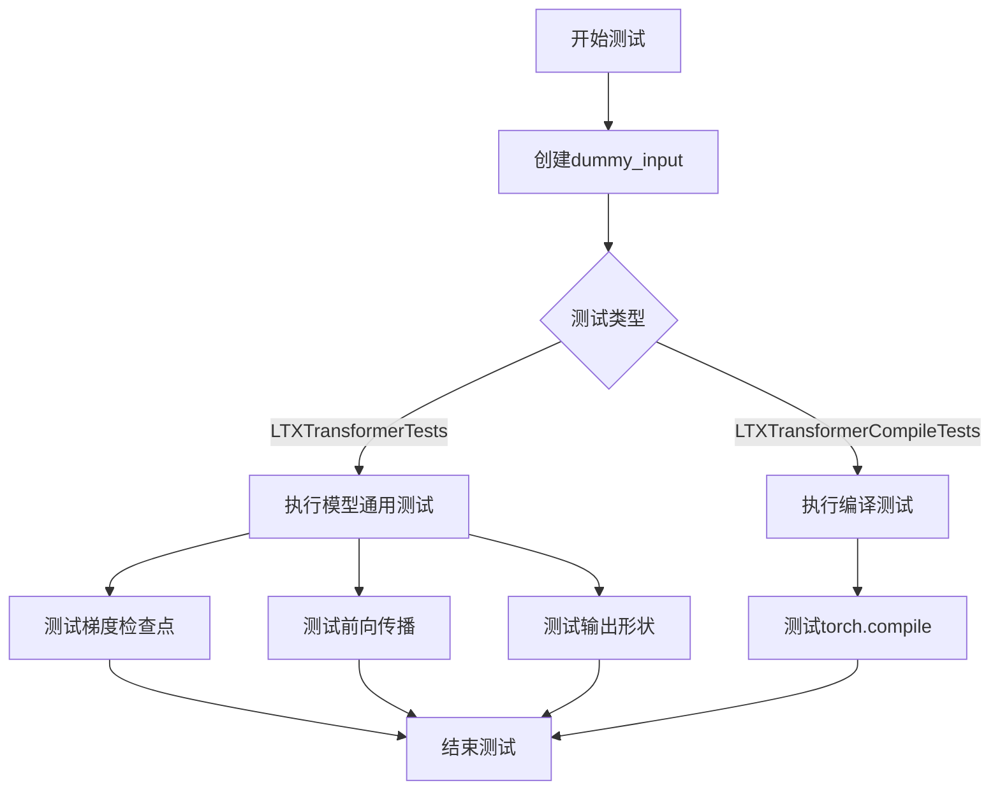
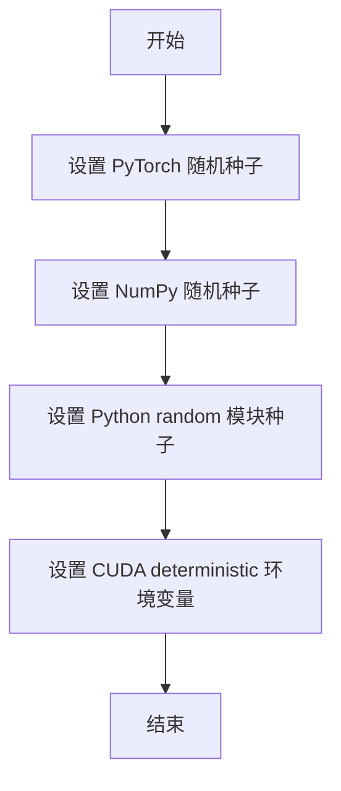
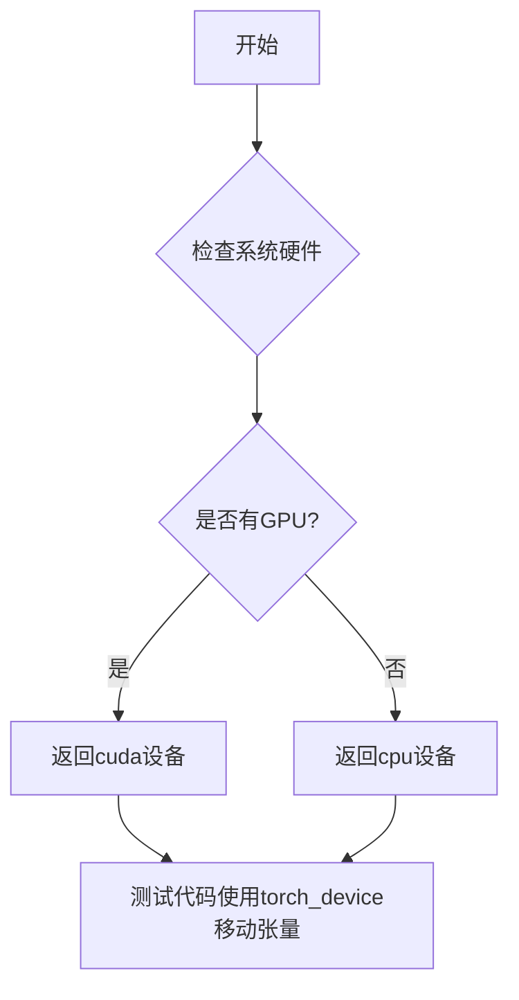
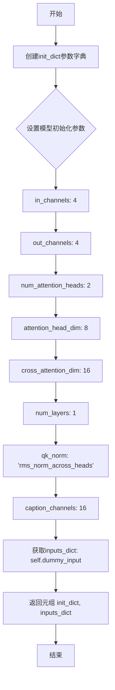

# `diffusers\tests\models\transformers\test_models_transformer_ltx.py` 详细设计文档

该文件是针对LTXVideoTransformer3DModel的单元测试模块，包含两个测试类：LTXTransformerTests用于验证模型的基本功能、梯度检查点等通用特性；LTXTransformerCompileTests用于验证模型的torch.compile编译功能。测试通过ModelTesterMixin和TorchCompileTesterMixin混入类提供标准化的模型测试流程。

## 整体流程



## 类结构

```
unittest.TestCase
├── LTXTransformerTests (继承ModelTesterMixin)
│   ├── model_class: LTXVideoTransformer3DModel
│   ├── dummy_input: 属性方法
│   ├── input_shape: 属性方法
│   ├── output_shape: 属性方法
│   └── prepare_init_args_and_inputs_for_common: 方法
└── LTXTransformerCompileTests (继承TorchCompileTesterMixin)
├── model_class: LTXVideoTransformer3DModel
└── prepare_init_args_and_inputs_for_common: 方法
```

## 全局变量及字段


### `unittest`
    
Python标准库单元测试框架

类型：`module`
    


### `torch`
    
PyTorch深度学习库

类型：`module`
    


### `LTXVideoTransformer3DModel`
    
LTXVideo 3D变换器模型类,从diffusers导入

类型：`class`
    


### `enable_full_determinism`
    
启用完全确定性测试的函数,从testing_utils导入

类型：`function`
    


### `torch_device`
    
PyTorch设备标识符,从testing_utils导入

类型：`str`
    


### `ModelTesterMixin`
    
模型通用测试混合类,从test_modeling_common导入

类型：`class`
    


### `TorchCompileTesterMixin`
    
Torch编译测试混合类,从test_modeling_common导入

类型：`class`
    


### `LTXTransformerTests.model_class`
    
测试的模型类LTXVideoTransformer3DModel

类型：`class`
    


### `LTXTransformerTests.main_input_name`
    
主输入名称为hidden_states

类型：`str`
    


### `LTXTransformerTests.uses_custom_attn_processor`
    
标记是否使用自定义注意力处理器

类型：`bool`
    


### `LTXTransformerCompileTests.model_class`
    
测试的模型类LTXVideoTransformer3DModel

类型：`class`
    
    

## 全局函数及方法


### `enable_full_determinism`

启用完全确定性，确保测试可复现。该函数通过设置 PyTorch、NumPy 和 Python 的随机种子，以及配置 CUDA 环境变量，确保在运行测试时能够获得完全确定性的结果，从而实现测试的可复现性。

参数：

- `seed`：`int`，随机种子值，默认为 42，用于设置所有随机数生成器的种子

返回值：`None`，该函数没有返回值，仅执行副作用（设置随机种子）

#### 流程图



#### 带注释源码

```python
def enable_full_determinism(seed: int = 42):
    """
    启用完全确定性，确保测试可复现。
    
    该函数通过设置各种随机种子和环境变量来确保测试结果的一致性。
    
    参数:
        seed: 随机种子，默认为 42
        
    返回值:
        None
    """
    # 设置 PyTorch 的随机种子，确保 CUDA 和 CPU 操作的可复现性
    torch.manual_seed(seed)
    
    # 如果使用 CUDA，设置所有 GPU 的随机种子
    if torch.cuda.is_available():
        torch.cuda.manual_seed_all(seed)
    
    # 设置 NumPy 的随机种子
    import numpy as np
    np.random.seed(seed)
    
    # 设置 Python 内置 random 模块的种子
    import random
    random.seed(seed)
    
    # 设置 PyTorch 使用确定性算法
    # 启用后会影响某些操作的性能，但确保结果可复现
    torch.backends.cudnn.deterministic = True
    torch.backends.cudnn.benchmark = False
    
    # 设置环境变量，强制 CUDA 使用确定性算法
    import os
    os.environ["CUBLAS_WORKSPACE_CONFIG"] = ":4096:8"
    
    # 禁用非确定性算法
    torch.use_deterministic_algorithms(True, warn_only=True)
```


### `torch_device`

描述：全局变量，测试使用的设备，通常为cuda或cpu，从testing_utils导入。在测试中用于将张量移动到指定的计算设备上。

参数：无

返回值：`str` 或 `torch.device`，返回测试设备标识符（如"cuda"、"cpu"）

#### 流程图



#### 带注释源码

```python
# 导入语句（在文件头部）
from ...testing_utils import enable_full_determinism, torch_device

# torch_device 是从 testing_utils 模块导入的全局变量
# 其具体定义不在当前文件中，需要查看 testing_utils 模块

# 在测试中的使用方式：
# torch_device 用于将张量移动到指定的计算设备（CPU或GPU）

hidden_states = torch.randn((batch_size, num_frames * height * width, num_channels)).to(torch_device)
# 将随机初始化的隐藏状态张量移动到测试设备

encoder_hidden_states = torch.randn((batch_size, sequence_length, embedding_dim)).to(torch_device)
# 将随机初始化的编码器隐藏状态张量移动到测试设备

encoder_attention_mask = torch.ones((batch_size, sequence_length)).bool().to(torch_device)
# 将编码器注意力掩码张量移动到测试设备

timestep = torch.randint(0, 1000, size=(batch_size,)).to(torch_device)
# 将随机生成的时间步张量移动到测试设备
```


### `LTXTransformerTests.dummy_input`

该属性方法用于创建虚拟输入数据，为LTXVideoTransformer3DModel模型的单元测试提供所需的全部输入张量，包括隐藏状态、编码器隐藏状态、时间步、注意力掩码以及帧数和空间维度信息。

参数：无（该属性方法不接受显式参数，仅通过`self`隐式访问测试类实例）

返回值：`Dict[str, Union[torch.Tensor, int]]`，返回一个包含以下键值对的字典：
- `hidden_states`：torch.Tensor，视频/图像的隐藏状态张量
- `encoder_hidden_states`：torch.Tensor，编码器输出的隐藏状态
- `timestep`：torch.Tensor，用于扩散模型的时间步
- `encoder_attention_mask`：torch.Tensor，编码器注意力掩码
- `num_frames`：int，视频帧数
- `height`：int，输入高度
- `width`：int，输入宽度

#### 流程图

```mermaid
flowchart TD
    A[开始] --> B[设置批处理参数<br/>batch_size=2, num_channels=4<br/>num_frames=2, height=16<br/>width=16, embedding_dim=16<br/>sequence_length=16]
    B --> C[创建hidden_states张量<br/>shape: (2, 512, 4)<br/>随机初始化]
    C --> D[创建encoder_hidden_states张量<br/>shape: (2, 16, 16)<br/>随机初始化]
    D --> E[创建encoder_attention_mask<br/>shape: (2, 16)<br/>全1布尔值]
    E --> F[创建timestep张量<br/>shape: (2,)<br/>随机整数0-999]
    F --> G[组装返回字典<br/>包含7个键值对]
    G --> H[返回字典对象]
```

#### 带注释源码

```python
@property
def dummy_input(self):
    """
    创建虚拟输入数据，用于模型测试。
    
    该属性方法生成符合LTXVideoTransformer3DModel输入要求的
    虚拟张量数据，包括隐藏状态、编码器状态、时间步等信息。
    """
    # 批处理大小
    batch_size = 2
    # 输入通道数
    num_channels = 4
    # 视频帧数
    num_frames = 2
    # 输入高度
    height = 16
    # 输入宽度
    width = 16
    # 嵌入维度
    embedding_dim = 16
    # 序列长度
    sequence_length = 16

    # 创建隐藏状态张量
    # 形状: (batch_size, num_frames * height * width, num_channels)
    # 即 (2, 2*16*16, 4) = (2, 512, 4)
    hidden_states = torch.randn((batch_size, num_frames * height * width, num_channels)).to(torch_device)
    
    # 创建编码器隐藏状态张量
    # 形状: (batch_size, sequence_length, embedding_dim)
    # 即 (2, 16, 16)
    encoder_hidden_states = torch.randn((batch_size, sequence_length, embedding_dim)).to(torch_device)
    
    # 创建编码器注意力掩码
    # 形状: (batch_size, sequence_length)
    # 即 (2, 16)，全为True
    encoder_attention_mask = torch.ones((batch_size, sequence_length)).bool().to(torch_device)
    
    # 创建时间步张量
    # 形状: (batch_size,)
    # 即 (2,)，值为0-999的随机整数
    timestep = torch.randint(0, 1000, size=(batch_size,)).to(torch_device)

    # 返回包含所有输入数据的字典
    return {
        "hidden_states": hidden_states,           # 主输入张量
        "encoder_hidden_states": encoder_hidden_states,  # 条件输入
        "timestep": timestep,                      # 扩散时间步
        "encoder_attention_mask": encoder_attention_mask,  # 注意力掩码
        "num_frames": num_frames,                  # 视频帧数元数据
        "height": height,                          # 高度元数据
        "width": width,                            # 宽度元数据
    }
```


### `LTXTransformerTests.input_shape`

该属性方法用于返回 LTXTransformerTests 测试类的输入形状，固定返回 (512, 4) 的元组，表示输入的序列长度和通道数。

参数：

- `self`：`LTXTransformerTests`，隐式参数，表示类的实例本身

返回值：`Tuple[int, int]`，返回固定值 (512, 4)，其中 512 表示序列长度，4 表示通道数

#### 流程图

```mermaid
flowchart TD
    A[开始] --> B{访问 input_shape 属性}
    B --> C[返回元组 (512, 4)]
    C --> D[结束]
```

#### 带注释源码

```python
@property
def input_shape(self):
    """
    返回测试模型的输入形状。
    
    该属性定义了在单元测试中使用的固定输入形状，
    用于验证 LTXVideoTransformer3DModel 的输入维度兼容性。
    
    Returns:
        tuple: 输入形状元组 (序列长度, 通道数)，固定为 (512, 4)
    """
    return (512, 4)
```


### LTXTransformerTests.output_shape

该属性方法用于返回LTXVideoTransformer3DModel模型的输出形状，固定返回(512, 4)的元组，表示输出序列长度为512，通道数为4。

参数： 无

返回值：`tuple`，返回模型输出形状元组 (512, 4)

#### 流程图

```mermaid
flowchart TD
    A[开始] --> B[返回元组 (512, 4)]
    B --> C[结束]
```

#### 带注释源码

```python
@property
def output_shape(self):
    """
    返回模型输出形状的元组。
    
    该属性定义了LTXVideoTransformer3DModel在给定输入下的输出形状。
    输出形状为(batch_size, sequence_length, num_channels)格式的元组表示。
    固定返回(512, 4)，表示512维序列长度和4个通道。
    
    Returns:
        tuple: 输出形状元组 (512, 4)
    """
    return (512, 4)
```


### `LTXTransformerTests.prepare_init_args_and_inputs_for_common`

准备LTXVideoTransformer3DModel模型的初始化参数和输入数据，用于测试框架中的通用测试方法。

参数：

- `self`：测试类实例本身，无需显式传递

返回值：`Tuple[Dict, Dict]`，返回两个字典组成的元组——第一个字典包含模型初始化参数，第二个字典包含模型输入数据。

#### 流程图



#### 带注释源码

```python
def prepare_init_args_and_inputs_for_common(self):
    """
    准备LTXVideoTransformer3DModel的初始化参数和输入数据。
    此方法为ModelTesterMixin测试框架提供必要的配置数据。
    
    Returns:
        Tuple[Dict, Dict]: 包含以下两个字典的元组:
            - init_dict: 模型初始化参数配置
            - inputs_dict: 模型输入数据(含hidden_states, encoder_hidden_states等)
    """
    # 定义模型初始化参数字典
    init_dict = {
        "in_channels": 4,                   # 输入通道数
        "out_channels": 4,                   # 输出通道数
        "num_attention_heads": 2,            # 注意力头数量
        "attention_head_dim": 8,             # 每个注意力头的维度
        "cross_attention_dim": 16,           # 交叉注意力维度
        "num_layers": 1,                     # Transformer层数
        "qk_norm": "rms_norm_across_heads",  # QK归一化方式
        "caption_channels": 16,              # caption嵌入通道数
    }
    # 从测试类属性获取输入数据字典
    # dummy_input属性定义了批大小为2、4通道、2帧、16x16分辨率的随机输入
    inputs_dict = self.dummy_input
    # 返回初始化参数和输入字典的元组
    return init_dict, inputs_dict
```


### `LTXTransformerTests.test_gradient_checkpointing_is_applied`

该测试方法用于验证梯度检查点（Gradient Checkpointing）技术是否正确应用于 `LTXVideoTransformer3DModel` 模型，通过调用父类的测试方法来检查模型的 forward 过程是否使用了梯度检查点来节省显存。

参数：

- `expected_set`：`Set[str]`，期望的模型类名称集合，用于验证梯度检查点是否应用在指定的模型类上，此处为 `{"LTXVideoTransformer3DModel"}`

返回值：`None`，测试方法不返回任何值，通过断言来验证结果

#### 流程图

```mermaid
flowchart TD
    A[开始测试] --> B[定义期望模型集合 expected_set = {'LTXVideoTransformer3DModel'}]
    B --> C[调用父类 test_gradient_checkpointing_is_applied 方法]
    C --> D{检查 LTXVideoTransformer3DModel 是否应用梯度检查点}
    D -->|是| E[测试通过]
    D -->|否| F[测试失败, 抛出断言错误]
```

#### 带注释源码

```python
def test_gradient_checkpointing_is_applied(self):
    """
    测试梯度检查点是否被应用到 LTXVideoTransformer3DModel 模型上。
    
    梯度检查点是一种用计算换显存的技术，通过在反向传播时重新计算前向传播的中间结果，
    来避免在前向传播时保存所有的中间激活值，从而节省显存开销。
    """
    # 定义期望应用梯度检查点的模型类集合
    # LTXVideoTransformer3DModel 是该测试类对应的模型类
    expected_set = {"LTXVideoTransformer3DModel"}
    
    # 调用父类 (ModelTesterMixin) 的测试方法
    # 父类方法会执行以下检查:
    # 1. 创建模型实例
    # 2. 启用梯度检查点 (通过 torch.utils.checkpoint.checkpoint 或 model.enable_gradient_checkpointing)
    # 3. 执行前向传播
    # 4. 执行反向传播
    # 5. 验证梯度是否正确计算
    # 6. 验证显存使用是否减少
    super().test_gradient_checkpointing_is_applied(expected_set=expected_set)
```


### `LTXTransformerCompileTests.prepare_init_args_and_inputs_for_common`

准备LTXVideoTransformer3DModel模型的初始化参数和输入数据，通过调用LTXTransformerTests类的同名方法获取测试所需的配置和输入数据。

参数：

- 该方法无显式参数（隐式参数`self`为类实例引用）

返回值：`tuple[dict, dict]`，返回包含模型初始化参数字典和输入数据字典的元组。其中第一个字典包含模型架构配置（输入输出通道数、注意力头维度、层数等），第二个字典包含实际的输入张量（hidden_states、encoder_hidden_states、timestep等）。

#### 流程图

```mermaid
flowchart TD
    A[开始 prepare_init_args_and_inputs_for_common] --> B[创建LTXTransformerTests实例]
    B --> C[调用LTXTransformerTests.prepare_init_args_and_inputs_for_common]
    C --> D{返回结果}
    D --> E[返回tuple: (init_dict, inputs_dict)]
    E --> F[结束]
```

#### 带注释源码

```python
def prepare_init_args_and_inputs_for_common(self):
    """
    准备LTXVideoTransformer3DModel模型测试所需的初始化参数和输入数据。
    该方法通过委托调用LTXTransformerTests类的方法来获取标准化的测试配置，
    以确保LTXTransformerCompileTests与LTXTransformerTests使用相同的测试数据源。
    
    Returns:
        tuple: 包含两个字典的元组
            - init_dict: 模型初始化参数字典
            - inputs_dict: 模型输入数据字典
    """
    # 创建LTXTransformerTests测试类的实例
    # 该实例包含标准化的dummy_input和prepare_init_args_and_inputs_for_common方法
    ltx_transformer_tests = LTXTransformerTests()
    
    # 调用LTXTransformerTests的prepare_init_args_and_inputs_for_common方法
    # 返回模型初始化参数(init_dict)和测试输入(inputs_dict)
    return ltx_transformer_tests.prepare_init_args_and_inputs_for_common()
```

## 关键组件


### LTXVideoTransformer3DModel

被测试的核心模型类，这是一个用于LTXVideo的3D变换器模型，负责处理视频数据的变换器架构。

### dummy_input

测试输入生成方法，创建一个包含hidden_states、encoder_hidden_states、timestep和encoder_attention_mask的字典，用于模型的前向传播测试。

### ModelTesterMixin

通用的模型测试混入类，提供了一系列模型相关的测试方法，包括梯度检查点、参数初始化等通用测试逻辑。

### TorchCompileTesterMixin

PyTorch编译测试混入类，用于测试模型的torch.compile兼容性，支持模型的JIT编译优化。

### LTXTransformerTests

主要的模型测试类，继承自ModelTesterMixin和unittest.TestCase，用于验证LTXVideoTransformer3DModel的功能正确性。

### LTXTransformerCompileTests

模型编译测试类，继承自TorchCompileTesterMixin，用于测试LTXVideoTransformer3DModel的torch.compile编译支持。

### enable_full_determinism

测试工具函数，启用完全确定性模式，确保测试结果的可重复性。

### test_gradient_checkpointing_is_applied

梯度检查点测试方法，验证模型是否正确支持梯度检查点技术以节省显存。

### 张量索引与惰性加载

通过torch.randn创建测试张量，hidden_states使用(batch_size, num_frames * height * width, num_channels)的3D视频张量展平形式，支持视频帧的空间-时间维度索引。

### 量化策略支持

模型类LTXVideoTransformer3DModel支持量化配置，通过attention_head_dim=8和num_attention_heads=2的设置，为后续量化优化提供基础结构。


## 问题及建议


### 已知问题

- **维度不匹配问题**：`input_shape` 和 `output_shape` 属性返回固定值 (512, 4)，但与 `dummy_input` 方法中构造的实际张量维度不匹配。实际 hidden_states 形状为 (batch_size=2, num_frames*height*width=2*16*16=512, num_channels=4)，而属性返回 (512, 4)，缺少 batch 维度
- **测试实例化冗余**：`LTXTransformerCompileTests.prepare_init_args_and_inputs_for_common()` 每次调用都会创建新的 `LTXTransformerTests()` 实例，然后在内部调用 `prepare_init_args_and_inputs_for_common()`，造成不必要的对象创建开销
- **测试覆盖不足**：代码仅继承了 ModelTesterMixin 和 TorchCompileTesterMixin 的测试方法，但未显式添加任何实际的功能测试用例，如模型前向传播、输出形状验证等
- **魔法数字问题**：多处使用硬编码数值（如 `batch_size=2`、`num_frames=2`、`height=16` 等），缺乏常量定义，降低了代码可维护性和可读性
- **属性冗余定义**：`main_input_name` 和 `uses_custom_attn_processor` 类属性定义后在整个测试类中未被使用

### 优化建议

- 修正 `input_shape` 和 `output_shape` 属性，使其返回与 `dummy_input` 一致的三维元组，如 `(2, 512, 4)`，或使用 `@property` 动态计算
- 将 `LTXTransformerCompileTests` 改为直接复用 `LTXTransformerTests` 的静态方法或共享配置，而非每次实例化测试类
- 添加显式的测试方法，例如 `test_model_forward` 来验证模型实际功能，增强测试的诊断能力
- 提取硬编码配置为类级别常量或配置字典，例如定义 `DEFAULT_BATCH_SIZE = 2`、`DEFAULT_FRAME_CONFIG = {...}` 等
- 移除未使用的类属性，或在测试中加以利用以提高代码整洁度

## 其它


### 设计目标与约束

本测试文件的设计目标是验证 LTXVideoTransformer3DModel 模型的正确性，确保模型能够在给定的输入参数下正确运行，并支持梯度检查点（gradient checkpointing）和 torch.compile 优化。测试约束包括：必须使用 PyTorch 框架，需要 GPU 环境支持（通过 torch_device 指定），测试输入的维度必须与模型配置相匹配，且测试用例设计遵循 HuggingFace diffusers 库的测试规范。

### 错误处理与异常设计

测试文件中的错误处理主要体现在两个方面：一是使用 unittest 框架的断言机制来验证模型输出的正确性，当测试失败时会自动抛出 AssertionError；二是通过继承的 ModelTesterMixin 和 TorchCompileTesterMixin 类提供的通用测试方法来捕获潜在的异常情况。测试未显式定义自定义异常，但在测试过程中会捕获并报告模型运行时的各类异常，如维度不匹配、类型错误、设备不兼容等。

### 外部依赖与接口契约

本测试文件依赖于以下外部组件：1) torch >= 1.8.0，用于张量操作和模型计算；2) diffusers 库中的 LTXVideoTransformer3DModel 类，这是被测试的核心模型；3) testing_utils 模块中的 enable_full_determinism 函数，用于确保测试的可重复性；4) test_modeling_common 模块中的 ModelTesterMixin 和 TorchCompileTesterMixin 类，提供通用的模型测试方法。接口契约要求 LTXVideoTransformer3DModel 必须实现 forward 方法，接受 hidden_states、encoder_hidden_states、timestep、encoder_attention_mask、num_frames、height、width 等参数，并返回与输入形状相匹配的张量。

### 性能考虑

测试文件中包含了对模型性能的间接测试，即 TorchCompileTesterMixin 的测试用于验证模型是否支持 torch.compile 优化。此外，测试使用固定随机种子（通过 enable_full_determinism 设置）来确保测试的可重复性。在实际测试执行时，输入张量的 batch_size 为 2，序列长度为 512，通道数为 4，属于较小的测试规模，以平衡测试覆盖率和执行时间。

### 测试覆盖范围

当前测试文件主要覆盖以下测试场景：模型初始化参数验证、输入输出形状一致性测试、梯度检查点功能测试、torch.compile 编译支持测试。测试通过 ModelTesterMixin 提供的通用方法间接验证了模型的 forward pass、参数配置、设备迁移等功能。测试覆盖范围相对基础，未包含边界条件测试（如极端输入尺寸）、并发测试、长时间运行稳定性测试等高级场景。


    