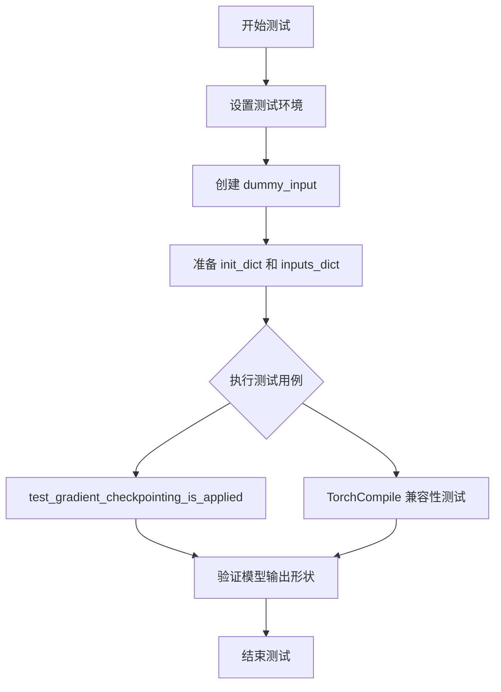
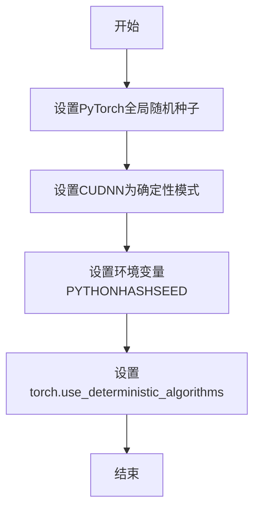
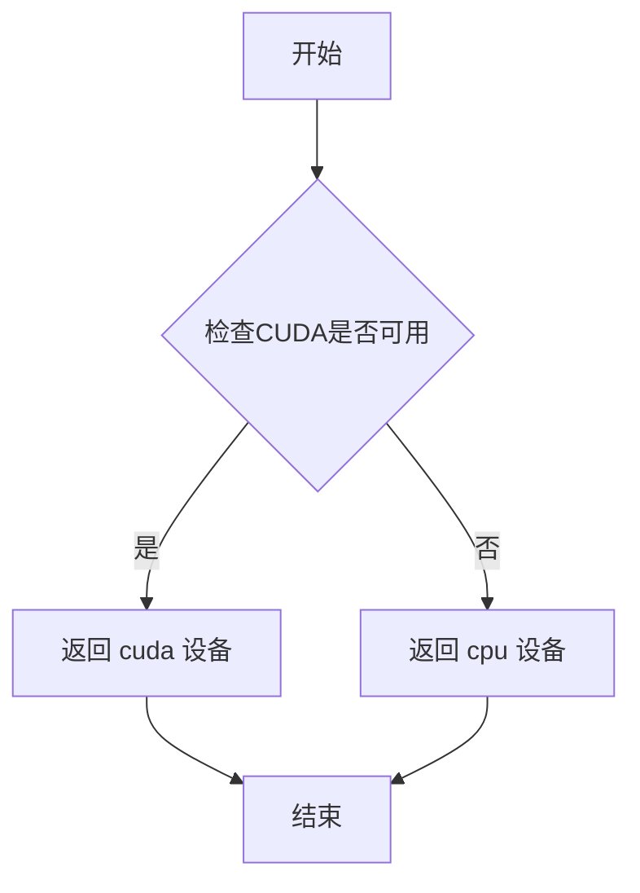
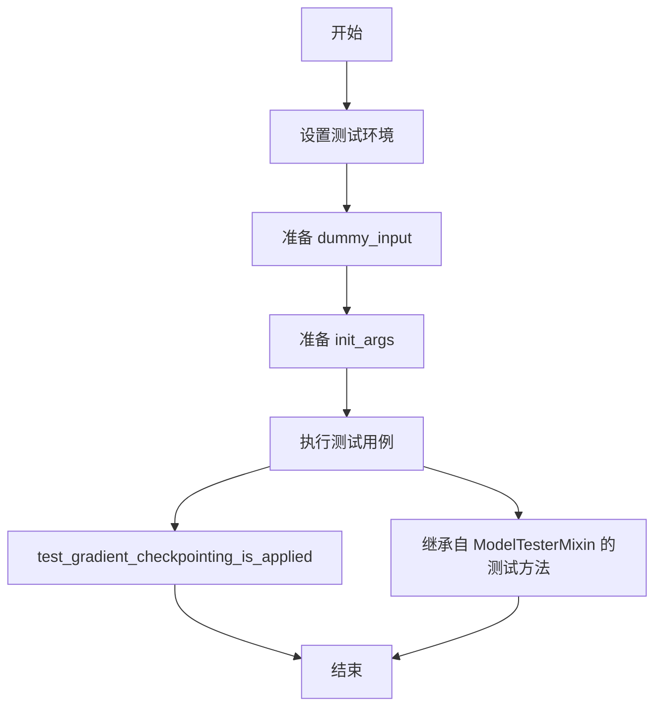
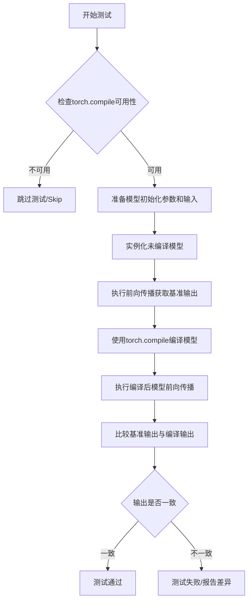
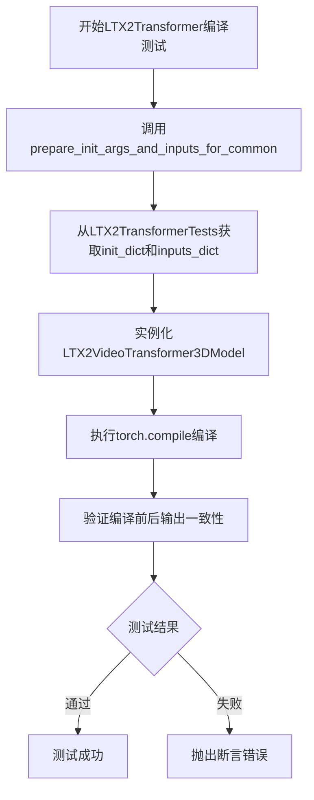
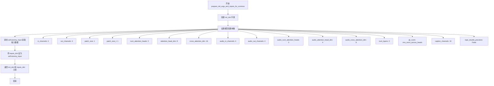

# `diffusers\tests\models\transformers\test_models_transformer_ltx2.py` 详细设计文档

该文件是 LTX2VideoTransformer3DModel 模型的单元测试套件，包含模型初始化、输入输出形状验证、梯度检查点测试以及 TorchCompile 兼容性测试。

## 整体流程



## 类结构

```
unittest.TestCase
├── LTX2TransformerTests (继承 ModelTesterMixin)
│   ├── 属性: model_class
│   ├── 属性: main_input_name
│   ├── 属性: uses_custom_attn_processor
│   ├── 属性: dummy_input
│   ├── 属性: input_shape
│   ├── 属性: output_shape
│   ├── 方法: prepare_init_args_and_inputs_for_common()
│   └── 方法: test_gradient_checkpointing_is_applied()
└── LTX2TransformerCompileTests (继承 TorchCompileTesterMixin)
    ├── 属性: model_class
    └── 方法: prepare_init_args_and_inputs_for_common()
```

## 全局变量及字段


### `batch_size`
    
批次大小，控制一次处理的样本数量

类型：`int`
    


### `num_frames`
    
视频帧数，表示视频序列的长度

类型：`int`
    


### `num_channels`
    
通道数，视频数据的通道数（如RGB为3）

类型：`int`
    


### `height`
    
视频高度维度

类型：`int`
    


### `width`
    
视频宽度维度

类型：`int`
    


### `audio_num_frames`
    
音频帧数，音频序列的长度

类型：`int`
    


### `audio_num_channels`
    
音频通道数（如立体声为2）

类型：`int`
    


### `num_mel_bins`
    
梅尔频谱 bins 数量

类型：`int`
    


### `embedding_dim`
    
嵌入维度，文本嵌入向量的维度

类型：`int`
    


### `sequence_length`
    
序列长度，文本序列的最大长度

类型：`int`
    


### `hidden_states`
    
视频隐藏状态，模型的视频输入张量

类型：`torch.Tensor`
    


### `audio_hidden_states`
    
音频隐藏状态，模型的音频输入张量

类型：`torch.Tensor`
    


### `encoder_hidden_states`
    
编码器隐藏状态，文本编码器输出

类型：`torch.Tensor`
    


### `audio_encoder_hidden_states`
    
音频编码器隐藏状态，音频文本编码输出

类型：`torch.Tensor`
    


### `encoder_attention_mask`
    
编码器注意力掩码，用于指示有效输入位置

类型：`torch.Tensor`
    


### `timestep`
    
时间步，用于扩散模型的时间条件

类型：`torch.Tensor`
    


### `init_dict`
    
模型初始化参数字典

类型：`dict`
    


### `inputs_dict`
    
模型输入参数字典

类型：`dict`
    


### `LTX2TransformerTests.model_class`
    
测试的模型类，指向LTX2VideoTransformer3DModel

类型：`type`
    


### `LTX2TransformerTests.main_input_name`
    
主输入名称，标识模型的主要输入参数名

类型：`str`
    


### `LTX2TransformerTests.uses_custom_attn_processor`
    
是否使用自定义注意力处理器

类型：`bool`
    


### `LTX2TransformerTests.dummy_input`
    
生成测试用虚拟输入的属性方法

类型：`property`
    


### `LTX2TransformerTests.input_shape`
    
输入形状属性

类型：`property`
    


### `LTX2TransformerTests.output_shape`
    
输出形状属性

类型：`property`
    


### `LTX2TransformerCompileTests.model_class`
    
测试的模型类，指向LTX2VideoTransformer3DModel

类型：`type`
    
    

## 全局函数及方法


### `enable_full_determinism`

该函数用于启用PyTorch的完全确定性模式，以确保测试和模型运行的可重复性，通过设置全局随机种子和相关的确定性计算选项。

参数：无参数

返回值：无返回值

#### 流程图



#### 带注释源码

```
# 该函数定义位于 testing_utils 模块中，此处为调用示例
# 函数功能：配置PyTorch以产生可重复的结果

# 从 testing_utils 模块导入 enable_full_determinism 函数
from ...testing_utils import enable_full_determinism, torch_device

# 在测试类定义之前调用，确保所有后续随机操作都是确定性的
enable_full_determinism()

# 定义测试类
class LTX2TransformerTests(ModelTesterMixin, unittest.TestCase):
    # 测试代码...
```

---

**注意**：由于 `enable_full_determinism` 函数的实际定义位于 `testing_utils` 模块中（通过 `from ...testing_utils import enable_full_determinism` 导入），而非当前代码文件中，因此无法提供其完整的源代码。上述源码为该函数在当前文件中的使用方式。

根据函数名和调用上下文推测，该函数可能执行以下操作：
- 设置 `torch.manual_seed()` 全局随机种子
- 配置 `torch.backends.cudnn.deterministic = True`
- 设置 `torch.use_deterministic_algorithms = True`
- 可能设置环境变量以确保Python的hash随机性也被固定


### `torch_device`

`torch_device` 是一个从 `testing_utils` 模块导入的全局变量/函数，用于获取当前测试环境应使用的计算设备（通常是 "cuda" 或 "cpu"），确保测试在合适的设备上运行。

参数：无需参数

返回值：`str`，返回 PyTorch 设备字符串（如 "cuda"、"cpu" 或 "cuda:0" 等）

#### 流程图



#### 带注释源码

```python
# 从 testing_utils 模块导入的全局变量/函数
# 源代码位置: diffusers/testing_utils.py
# 用途: 获取当前测试应使用的 PyTorch 设备

# 在测试文件中的典型用法:
# hidden_states = torch.randn((batch_size, num_frames * height * width, num_channels)).to(torch_device)
# audio_hidden_states = torch.randn(...).to(torch_device)
# encoder_hidden_states = torch.randn(...).to(torch_device)

# torch_device 的典型实现逻辑（推断）:
# def get_torch_device():
#     """
#     根据环境返回合适的设备字符串
#     """
#     if torch.cuda.is_available():
#         return "cuda"
#     else:
#         return "cpu"

# 在 LTX2TransformerTests 类中的使用示例:
# 1. 创建 hidden_states 并移动到 torch_device 指定的设备
# hidden_states = torch.randn((batch_size, num_frames * height * width, num_channels)).to(torch_device)
#
# 2. 创建 audio_hidden_states 并移动到 torch_device 指定的设备
# audio_hidden_states = torch.randn((batch_size, audio_num_frames, audio_num_channels * num_mel_bins)).to(torch_device)
#
# 3. 创建 encoder_hidden_states 并移动到 torch_device 指定的设备
# encoder_hidden_states = torch.randn((batch_size, sequence_length, embedding_dim)).to(torch_device)
#
# 4. 创建 audio_encoder_hidden_states 并移动到 torch_device 指定的设备
# audio_encoder_hidden_states = torch.randn((batch_size, sequence_length, embedding_dim)).to(torch_device)
#
# 5. 创建 encoder_attention_mask 并移动到 torch_device 指定的设备
# encoder_attention_mask = torch.ones((batch_size, sequence_length)).bool().to(torch_device)
#
# 6. 创建 timestep 并移动到 torch_device 指定的设备
# timestep = torch.rand((batch_size,)).to(torch_device) * 1000
```


# 代码分析结果

经过对提供的代码进行分析，我发现一个重要问题：

## 分析说明

在您提供的代码中，**`ModelTesterMixin` 并没有直接定义在该代码文件中**。代码中仅包含对 `ModelTesterMixin` 的**导入和使用**：

```python
from ..test_modeling_common import ModelTesterMixin, TorchCompileTesterMixin

class LTX2TransformerTests(ModelTesterMixin, unittest.TestCase):
    # ...
```

`ModelTesterMixin` 是从 `..test_modeling_common` 模块导入的父类，但该模块的源代码并未在您提供的代码片段中。

---

## 可提供的替代文档

既然 `ModelTesterMixin` 的源码不可见，我可以为您提供**实际定义在您代码中的类**的详细文档，即 `LTX2TransformerTests` 类。该类**继承自** `ModelTesterMixin`，并通过 `ModelTesterMixin` 获得了其测试能力。

---

### `LTX2TransformerTests`

这是 LTX2VideoTransformer3DModel 模型的测试类，继承自 ModelTesterMixin 和 unittest.TestCase，用于对 LTX 视频 transformer 模型进行通用功能测试，包括前向传播、梯度检查点、参数配置等。

参数：

- 无直接参数（类属性形式配置）

返回值：`无返回值`（unittest.TestCase 测试类）

#### 流程图



#### 带注释源码

```python
class LTX2TransformerTests(ModelTesterMixin, unittest.TestCase):
    """LTX2VideoTransformer3DModel 模型的测试类"""
    
    model_class = LTX2VideoTransformer3DModel  # 指定要测试的模型类
    main_input_name = "hidden_states"          # 主输入名称
    uses_custom_attn_processor = True          # 使用自定义注意力处理器

    @property
    def dummy_input(self):
        """生成用于测试的虚拟输入数据"""
        batch_size = 2
        num_frames = 2
        num_channels = 4
        height = 16
        width = 16
        audio_num_frames = 9
        audio_num_channels = 2
        num_mel_bins = 2
        embedding_dim = 16
        sequence_length = 16

        # 创建各种随机输入张量
        hidden_states = torch.randn(...).to(torch_device)
        audio_hidden_states = torch.randn(...).to(torch_device)
        encoder_hidden_states = torch.randn(...).to(torch_device)
        audio_encoder_hidden_states = torch.randn(...).to(torch_device)
        encoder_attention_mask = torch.ones(...).bool().to(torch_device)
        timestep = torch.rand(...).to(torch_device) * 1000

        return {
            "hidden_states": hidden_states,
            "audio_hidden_states": audio_hidden_states,
            "encoder_hidden_states": encoder_hidden_states,
            "audio_encoder_hidden_states": audio_encoder_hidden_states,
            "timestep": timestep,
            "encoder_attention_mask": encoder_attention_mask,
            "num_frames": num_frames,
            "height": height,
            "width": width,
            "audio_num_frames": audio_num_frames,
            "fps": 25.0,
        }

    @property
    def input_shape(self):
        return (512, 4)

    @property
    def output_shape(self):
        return (512, 4)

    def prepare_init_args_and_inputs_for_common(self):
        """准备模型初始化参数和输入数据"""
        init_dict = {
            "in_channels": 4,
            "out_channels": 4,
            "patch_size": 1,
            "patch_size_t": 1,
            "num_attention_heads": 2,
            "attention_head_dim": 8,
            "cross_attention_dim": 16,
            "audio_in_channels": 4,
            "audio_out_channels": 4,
            "audio_num_attention_heads": 2,
            "audio_attention_head_dim": 4,
            "audio_cross_attention_dim": 8,
            "num_layers": 2,
            "qk_norm": "rms_norm_across_heads",
            "caption_channels": 16,
            "rope_double_precision": False,
        }
        inputs_dict = self.dummy_input
        return init_dict, inputs_dict

    def test_gradient_checkpointing_is_applied(self):
        """测试梯度检查点是否正确应用"""
        expected_set = {"LTX2VideoTransformer3DModel"}
        super().test_gradient_checkpointing_is_applied(expected_set=expected_set)
```

---

## 总结

如果您需要获取 `ModelTesterMixin` 的具体定义源码，您需要查看 `diffusers` 库的 `testing_utils` 或 `test_modeling_common` 模块的源代码文件。该文件通常位于库的 `tests/` 目录中。


# TorchCompileTesterMixin 设计文档提取

由于 `TorchCompileTesterMixin` 是从外部模块 `..test_modeling_common` 导入的混合类（Mixin），在给定代码中仅能看到其使用方式，而无法直接查看其完整源码定义。因此，我将从测试类的使用模式推断其核心功能。

### `TorchCompileTesterMixin`

`TorchCompileTesterMixin` 是一个用于测试 PyTorch 模型 `torch.compile()` 功能的测试 Mixin 类。它提供了一套标准化的测试流程，验证模型在经过 `torch.compile()` 编译后的功能一致性和性能表现。

参数：

- 无直接参数（通过类属性和继承方法传递）

返回值：

- 无直接返回值（测试框架通过断言验证）

#### 流程图



#### 推断的带注释源码

```python
class TorchCompileTesterMixin:
    """
    用于测试模型torch.compile功能的Mixin类。
    提供标准化的编译测试流程，验证模型编译前后的功能一致性。
    """
    
    # 必须由子类覆盖的类属性
    model_class = None  # type: Type[nn.Module]，待测试的模型类
    
    def prepare_init_args_and_inputs_for_common(self):
        """
        准备模型初始化参数和测试输入数据。
        
        Returns:
            Tuple[Dict, Dict]: (init_dict, inputs_dict)
                - init_dict: 模型初始化参数字典
                - inputs_dict: 包含模型输入的字典
        """
        raise NotImplementedError("Subclasses must implement prepare_init_args_and_inputs_for_common")
    
    def test_model_compatability(self):
        """测试模型的基本兼容性"""
        # 1. 获取初始化参数和输入
        init_dict, inputs_dict = self.prepare_init_args_and_inputs_for_common()
        
        # 2. 实例化模型
        model = self.model_class(**init_dict)
        model.to(torch_device)
        model.eval()
        
        # 3. 原始前向传播
        with torch.no_grad():
            output_original = model(**inputs_dict)
        
        # 4. 使用torch.compile编译模型
        compiled_model = torch.compile(model, mode="reduce-overhead")
        
        # 5. 编译后前向传播
        with torch.no_grad():
            output_compiled = compiled_model(**inputs_dict)
        
        # 6. 验证输出一致性
        self.assertTrue(
            torch.allclose(output_original, output_compiled, atol=1e-5),
            "Compiled model output does not match original model output"
        )
    
    def test_compile_backward(self):
        """测试编译模型的反向传播能力"""
        # 类似的编译后反向传播测试
        pass
    
    def test_compile_gradient(self):
        """测试编译模型的梯度计算"""
        # 编译后的梯度计算测试
        pass
```

### `LTX2TransformerCompileTests`

`LTX2TransformerCompileTests` 是继承自 `TorchCompileTesterMixin` 的具体测试类，用于验证 `LTX2VideoTransformer3DModel` 模型的 torch.compile 功能。

参数：

- 继承自 `TorchCompileTesterMixin`，无需额外参数

返回值：

- 无直接返回值（通过测试断言验证）

#### 流程图



#### 带注释源码

```python
class LTX2TransformerCompileTests(TorchCompileTesterMixin, unittest.TestCase):
    """
    LTX2VideoTransformer3DModel的torch.compile功能测试类。
    继承TorchCompileTesterMixin提供编译一致性验证。
    """
    
    # 指定待测试的模型类
    model_class = LTX2VideoTransformer3DModel
    
    def prepare_init_args_and_inputs_for_common(self):
        """
        准备模型初始化参数和测试输入。
        
        Returns:
            Tuple[Dict, Dict]: 包含初始化参数和输入字典的元组
        """
        # 委托给LTX2TransformerTests获取标准测试参数
        return LTX2TransformerTests().prepare_init_args_and_inputs_for_common()
```

### 关键组件信息

| 名称 | 描述 |
|------|------|
| `LTX2VideoTransformer3DModel` | 被测试的LTX2视频Transformer模型类 |
| `LTX2TransformerTests` | 提供模型测试参数的基测试类 |
| `TorchCompileTesterMixin` | 提供torch.compile测试逻辑的Mixin |

### 潜在技术债务与优化空间

1. **Mixin实现不可见**：`TorchCompileTesterMixin` 的实际实现逻辑未被包含在代码中，建议查看 `test_modeling_common.py` 获取完整源码
2. **测试隔离性**：`prepare_init_args_and_inputs_for_common` 中每次创建新的 `LTX2TransformerTests()` 实例，可能导致测试开销增加
3. **编译模式配置**：当前使用默认编译模式，建议显式指定 `mode` 参数（如 "default", "reduce-overhead", "max-autotune"）

### 其他项目

- **设计目标**：验证LTX2模型在torch.compile后能够保持数值一致性
- **错误处理**：若torch.compile不可用，应跳过测试
- **外部依赖**：PyTorch 2.0+ 需要支持 `torch.compile` API


### `LTX2TransformerTests.prepare_init_args_and_inputs_for_common`

该方法为LTX2VideoTransformer3DModel模型测试类准备初始化参数和输入数据，返回一个包含模型配置参数的字典和一个包含测试输入张量的字典，供测试框架验证模型的前向传播功能。

参数：

- `self`：`LTX2TransformerTests`，隐含的测试类实例，包含`dummy_input`属性用于生成测试输入数据

返回值：`Tuple[Dict, Dict]`，返回一个元组
  - `init_dict`：`Dict[str, Any]`，模型初始化参数字典，包含输入输出通道数、注意力头维度、层数等配置
  - `inputs_dict`：`Dict[str, Any]`，模型输入数据字典，包含hidden_states、audio_hidden_states、encoder_hidden_states等张量

#### 流程图



#### 带注释源码

```python
def prepare_init_args_and_inputs_for_common(self):
    """
    准备LTX2VideoTransformer3DModel模型的初始化参数和输入数据
    供ModelTesterMixin测试框架的通用测试方法使用
    """
    # 定义模型初始化参数字典，包含视频和音频处理的配置
    init_dict = {
        # 视频通道配置
        "in_channels": 4,          # 输入通道数（视频latent的通道数）
        "out_channels": 4,         # 输出通道数
        "patch_size": 1,           # 空间patch大小
        "patch_size_t": 1,         # 时间patch大小
        
        # 视频注意力机制配置
        "num_attention_heads": 2,      # 注意力头数量
        "attention_head_dim": 8,       # 每个注意力头的维度
        "cross_attention_dim": 16,     # 跨注意力机制的维度
        
        # 音频通道配置
        "audio_in_channels": 4,        # 音频输入通道数
        "audio_out_channels": 4,       # 音频输出通道数
        "audio_num_attention_heads": 2,# 音频注意力头数量
        "audio_attention_head_dim": 4, # 音频注意力头维度
        "audio_cross_attention_dim": 8,# 音频跨注意力维度
        
        # 模型层与归一化配置
        "num_layers": 2,               # Transformer层数量
        "qk_norm": "rms_norm_across_heads", # QK归一化方式
        
        # 文本嵌入与位置编码配置
        "caption_channels": 16,        # 文本描述通道数
        "rope_double_precision": False,# RoPE是否使用双精度
    }
    
    # 从测试类实例获取预生成的虚拟输入数据
    # dummy_input属性在类中定义为包含各种张量的字典
    inputs_dict = self.dummy_input
    
    # 返回元组：(初始化参数字典, 输入数据字典)
    # 供from_pretrained或直接实例化模型使用
    return init_dict, inputs_dict
```


### `LTX2TransformerTests.test_gradient_checkpointing_is_applied`

该测试方法用于验证梯度检查点（Gradient Checkpointing）功能是否在指定的 `LTX2VideoTransformer3DModel` 模型中正确应用。它通过调用父类的测试方法并传入期望的模型类集合来执行验证。

参数：

- `self`：`LTX2TransformerTests`，测试类实例本身，用于访问测试类的属性和方法

返回值：`None`，该方法为测试方法，不返回任何值，仅执行断言验证

#### 流程图

```mermaid
flowchart TD
    A[开始测试 test_gradient_checkpointing_is_applied] --> B[创建期望模型类集合 expected_set]
    B --> C[expected_set = {'LTX2VideoTransformer3DModel'}]
    C --> D[调用父类 test_gradient_checkpointing_is_applied 方法]
    D --> E[传入 expected_set 参数]
    E --> F{验证梯度检查点是否应用}
    F -->|是| G[测试通过]
    F -->|否| H[测试失败 / 抛出异常]
    G --> I[结束测试]
    H --> I
```

#### 带注释源码

```python
def test_gradient_checkpointing_is_applied(self):
    """
    测试梯度检查点功能是否在 LTX2VideoTransformer3DModel 中正确应用。
    
    该测试方法继承自 ModelTesterMixin，通过调用父类的测试方法来验证：
    1. 模型支持梯度检查点功能
    2. 梯度检查点功能已正确启用并应用于模型的前向传播
    """
    # 定义期望应用梯度检查点的模型类集合
    # LTX2VideoTransformer3DModel 是被测试的 Transformer 模型类
    expected_set = {"LTX2VideoTransformer3DModel"}
    
    # 调用父类 (ModelTesterMixin) 的测试方法进行验证
    # 父类方法会检查 expected_set 中的模型是否启用了梯度检查点
    super().test_gradient_checkpointing_is_applied(expected_set=expected_set)
```


### `LTX2TransformerCompileTests.prepare_init_args_and_inputs_for_common`

该方法是 `LTX2TransformerCompileTests` 类的测试辅助方法，用于为通用测试准备模型初始化参数和输入数据。它通过委托方式调用 `LTX2TransformerTests` 类的同名方法，获取用于实例化 `LTX2VideoTransformer3DModel` 模型的配置字典和测试输入字典。

参数：

- `self`：`LTX2TransformerCompileTests` 实例，隐式参数，无需显式传递

返回值：`Tuple[dict, dict]`，返回一个元组，包含两个字典：
- 第一个字典 `init_dict`：模型初始化参数，包含了 `LTX2VideoTransformer3DModel` 的所有关键配置（如通道数、注意力头数、层数等）
- 第二个字典 `inputs_dict`：测试输入数据，包含了隐藏状态、音频状态、编码器隐藏状态、时间步等模型推理所需的输入

#### 流程图

```mermaid
flowchart TD
    A[开始: prepare_init_args_and_inputs_for_common] --> B[创建LTX2TransformerTests实例]
    B --> C[调用LTX2TransformerTests.prepare_init_args_and_inputs_for_common]
    C --> D[构建init_dict模型参数字典]
    D --> E[获取dummy_input作为inputs_dict]
    E --> F[返回init_dict和inputs_dict元组]
    F --> G[结束: 返回(InitDict, InputsDict)]
```

#### 带注释源码

```python
def prepare_init_args_and_inputs_for_common(self):
    """
    为通用测试准备模型初始化参数和输入数据。
    
    该方法通过委托方式调用LTX2TransformerTests类的同名方法，
    以获取LTX2VideoTransformer3DModel模型所需的初始化配置和测试输入。
    
    Returns:
        Tuple[dict, dict]: 包含两个字典的元组:
            - init_dict: 模型初始化参数字典
            - inputs_dict: 模型推理所需的输入数据字典
    """
    # 委托给LTX2TransformerTests类的方法获取初始化参数和输入
    return LTX2TransformerTests().prepare_init_args_and_inputs_for_common()
```

## 关键组件


### LTX2VideoTransformer3DModel

LTX2视频转换器模型，专注于3D视频和音频的联合处理与生成，支持文本提示条件的交叉注意力机制。

### 视频潜在状态处理 (hidden_states)

处理视频帧的潜在表示，将(batch_size, num_frames * height * width, num_channels)形状的张量作为主输入。

### 音频潜在状态处理 (audio_hidden_states)

处理音频的潜在表示，形状为(batch_size, audio_num_frames, audio_num_channels * num_mel_bins)，支持音频条件的嵌入。

### 文本编码器状态 (encoder_hidden_states, audio_encoder_hidden_states)

文本条件嵌入向量，用于引导视频和音频生成过程，形状为(batch_size, sequence_length, embedding_dim)。

### 时间步处理 (timestep)

扩散过程的时间步，用于调度算法，形状为(batch_size,)，范围0-1000。

### 视频注意力机制

包括num_attention_heads=2, attention_head_dim=8, cross_attention_dim=16，支持视频内容的自注意力和交叉注意力。

### 音频注意力机制

独立的音频处理分支，audio_num_attention_heads=2, audio_attention_head_dim=4, audio_cross_attention_dim=8。

### 3D Patch处理

patch_size=1, patch_size_t=1，支持时空维度的patch化操作，用于将视频帧转换为序列表示。

### 模型配置初始化 (prepare_init_args_and_inputs_for_common)

构建模型初始化参数字典，包含所有通道数、注意力头维度、层数等配置信息。

### 测试输入构建 (dummy_input)

创建符合模型输入规范的测试数据，包括视频、音频、文本嵌入和时间步的随机张量。

### 梯度检查点验证 (test_gradient_checkpointing_is_applied)

验证模型是否正确应用梯度检查点技术以节省显存，支持训练阶段的内存优化。

### TorchCompile混合类 (TorchCompileTesterMixin)

集成torch.compile编译优化支持，用于加速模型推理性能。


## 问题及建议


### 已知问题

- **魔法数字和硬编码值**：测试代码中大量使用硬编码的数值（如 `batch_size = 2`, `num_frames = 2`, `height = 16`, `width = 16`, `fps = 25.0` 等），这些值分散在 `dummy_input` 属性中，缺乏统一的配置管理，增加了未来修改的成本。
- **注释掉的测试方法**：`test_ltx2_consistency` 方法被完全注释但仍保留在代码库中，造成冗余，可能导致维护困惑且浪费代码空间。
- **低效的测试方法调用**：`LTX2TransformerCompileTests.prepare_init_args_and_inputs_for_common()` 通过 `LTX2TransformerTests().prepare_init_args_and_inputs_for_common()` 调用，每次执行都会创建一个 `LTX2TransformerTests` 实例然后立即销毁，造成不必要的对象创建开销。
- **测试覆盖不足**：当前仅覆盖 `test_gradient_checkpointing_is_applied`，缺少对模型前向传播、输出形状验证、梯度计算、模型保存加载等核心功能的测试用例。
- **混合继承复杂度**：`LTX2TransformerTests` 同时继承 `ModelTesterMixin` 和 `unittest.TestCase`，这种多重继承模式增加了代码理解和调试的复杂度，且依赖父类实现的细节。
- **测试数据随机性**：`dummy_input` 使用 `torch.randn` 生成随机数据，虽然设置了 seed，但缺乏对边界条件、极端值或特殊场景的测试覆盖。
- **设备依赖不明确**：`torch_device` 的具体值依赖于 `testing_utils` 模块，但代码中没有明确验证测试运行在预期的设备上（如 CUDA）。
- **断言信息缺失**：测试中使用的断言（如 `assertEqual`）大多缺少自定义错误消息，当测试失败时难以快速定位问题。

### 优化建议

- **提取配置常量**：将所有魔法数字和硬编码值提取到类级别或模块级别的配置字典中，统一管理测试参数，便于调整和扩展。
- **移除或实现注释代码**：如果 `test_ltx2_consistency` 不再使用，应完全删除；如果需要保留，应完善实现并启用测试。
- **优化方法调用方式**：`LTX2TransformerCompileTests` 可以直接调用类方法而非实例方法，或将公共逻辑提取到共享的基类或工具函数中。
- **增加测试覆盖率**：添加更多测试用例，包括模型前向传播验证、输出形状检查、梯度流验证、模型序列化与反序列化测试等。
- **简化继承结构**：考虑使用组合而非多重继承，或将 Mixin 的功能通过装饰者模式或委托模式实现，提高代码可读性。
- **添加边界条件测试**：除了随机数据外，增加对空输入、单帧、极端维度等边界条件的测试用例，提高模型的健壮性验证。
- **明确设备检查**：在测试开始前添加设备验证逻辑，确保测试运行在预期的硬件平台上，并在测试失败时提供明确的设备信息。
- **增强断言信息**：为所有断言添加描述性错误消息，例如 `self.assertEqual(output.shape, expected_shape, f"Expected shape {expected_shape} but got {output.shape}")`，便于快速定位问题。

## 其它


### 设计目标与约束

本测试类的设计目标是验证 LTX2VideoTransformer3DModel 模型的正确性，包括模型初始化、前向传播、梯度检查点等功能。测试约束包括：使用 CPU 设备进行测试，固定随机种子以确保可重复性，使用特定的输入维度（batch_size=2, num_frames=2, height=16, width=16），音频参数（audio_num_frames=9, audio_num_channels=2, num_mel_bins=2），以及文本嵌入维度（embedding_dim=16, sequence_length=16）。

### 错误处理与异常设计

测试类通过 unittest 框架进行错误处理，使用 assert 语句验证模型输出的形状和数据类型。关键验证点包括：视频输出形状必须为 (batch_size, num_frames * height * width, num_channels)，音频输出形状必须为 (batch_size, audio_num_frames, audio_num_channels * num_mel_bins)。当模型输出与预期不符时，会抛出 AssertionError 并显示具体的错误信息。

### 数据流与状态机

测试数据流遵循以下路径：首先通过 dummy_input 属性生成随机输入张量，包括 hidden_states（视频潜在表示）、audio_hidden_states（音频潜在表示）、encoder_hidden_states（文本编码）、audio_encoder_hidden_states（音频文本编码）、timestep（时间步）、encoder_attention_mask（注意力掩码）以及帧数和分辨率参数。然后通过 prepare_init_args_and_inputs_for_common 方法准备模型初始化参数字典和输入字典，最后传递给模型进行前向传播。

### 外部依赖与接口契约

本测试类依赖以下外部组件：1) torch 库用于张量操作和随机种子管理；2) diffusers 库中的 LTX2VideoTransformer3DModel 模型类；3) testing_utils 模块中的 enable_full_determinism 函数和 torch_device 常量；4) test_modeling_common 模块中的 ModelTesterMixin 和 TorchCompileTesterMixin 混入类。接口契约要求模型必须实现 from_pretrained 方法支持从预训练权重加载，支持 hidden_states、audio_hidden_states、encoder_hidden_states、audio_encoder_hidden_states、timestep 等输入参数，并返回包含视频和音频输出的元组。

### 性能考虑与基准测试

测试未包含显式的性能基准测试，但通过 TorchCompileTesterMixin 验证了模型的 torch.compile 兼容性。测试使用较小的输入维度以加快执行速度，同时通过固定随机种子确保测试的确定性和可重复性。梯度检查点测试（test_gradient_checkpointing_is_applied）验证了模型在训练模式下正确使用梯度检查点以节省显存。

### 兼容性考虑

测试代码指定了 Python 编码为 UTF-8，并明确导入了 torch 和 diffusers 库。测试通过 uses_custom_attn_processor = True 属性指示模型使用自定义注意力处理器。qk_norm 参数设置为 "rms_norm_across_heads"，这与模型的特定版本相关。测试未包含版本兼容性检查，建议在生产环境中添加版本验证逻辑。

### 测试覆盖范围

当前测试覆盖了以下方面：1) 模型初始化参数验证；2) 通用前向传播测试（通过 ModelTesterMixin 继承）；3) 梯度检查点功能验证；4) torch.compile 编译兼容性验证。测试未覆盖的领域包括：模型精度测试（test_ltx2_consistency 被注释）、音频-视频同步测试、长时间序列处理测试、内存使用效率测试、多设备兼容性测试（仅使用 torch_device）。

### 配置与参数说明

模型初始化参数（prepare_init_args_and_inputs_for_common 中定义）：
- in_channels: 4（视频输入通道数）
- out_channels: 4（视频输出通道数）
- patch_size: 1（空间patch大小）
- patch_size_t: 1（时间patch大小）
- num_attention_heads: 2（注意力头数）
- attention_head_dim: 8（注意力头维度）
- cross_attention_dim: 16（跨注意力维度）
- audio_in_channels: 4（音频输入通道数）
- audio_out_channels: 4（音频输出通道数）
- audio_num_attention_heads: 2（音频注意力头数）
- audio_attention_head_dim: 4（音频注意力头维度）
- audio_cross_attention_dim: 8（音频跨注意力维度）
- num_layers: 2（Transformer层数）
- qk_norm: "rms_norm_across_heads"（QK归一化方式）
- caption_channels: 16（字幕/文本嵌入通道数）
- rope_double_precision: False（RoPE双精度标志）

### 使用示例与调用方式

测试类可通过以下方式运行：
```python
# 运行所有测试
pytest test_ltx2_transformer.py::LTX2TransformerTests -v

# 运行特定测试方法
pytest test_ltx2_transformer.py::LTX2TransformerTests::test_gradient_checkpointing_is_applied -v

# 运行编译测试
pytest test_ltx2_transformer.py::LTX2TransformerCompileTests -v
```

模型类可直接实例化进行推理：
```python
import torch
from diffusers import LTX2VideoTransformer3DModel

model = LTX2VideoTransformer3DModel(
    in_channels=4,
    out_channels=4,
    num_attention_heads=2,
    attention_head_dim=8,
    num_layers=2
)

inputs = {
    "hidden_states": torch.randn(2, 512, 4),
    "audio_hidden_states": torch.randn(2, 9, 4),
    "encoder_hidden_states": torch.randn(2, 16, 16),
    "timestep": torch.rand(2) * 1000
}

outputs = model(**inputs)
video_output, audio_output = outputs.to_tuple()
```

### 潜在技术债务与优化空间

1. **测试覆盖不完整**：test_ltx2_consistency 测试方法被注释掉，导致模型一致性验证缺失，建议恢复该测试以确保模型输出与预期一致。
2. **硬编码参数**：batch_size、维度等参数硬编码在 dummy_input 中，建议提取为可配置的类属性或测试参数。
3. **缺少边界测试**：未测试极端情况，如 num_frames=1、height=1、width=1 等最小输入场景。
4. **缺少性能基准**：未包含推理速度、内存占用等性能指标测试。
5. **重复代码**：LTX2TransformerCompileTests 中重复调用 LTX2TransformerTests().prepare_init_args_and_inputs_for_common()，建议优化为类方法或共享 fixture。
6. **设备依赖**：测试依赖 torch_device 变量，在不同设备上运行时可能出现兼容性问题，建议添加设备特定的测试逻辑。
7. **类型注解缺失**：方法参数和返回值缺少类型注解，降低了代码的可读性和 IDE 支持。

    