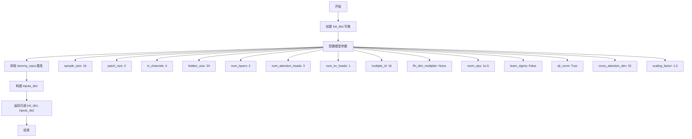
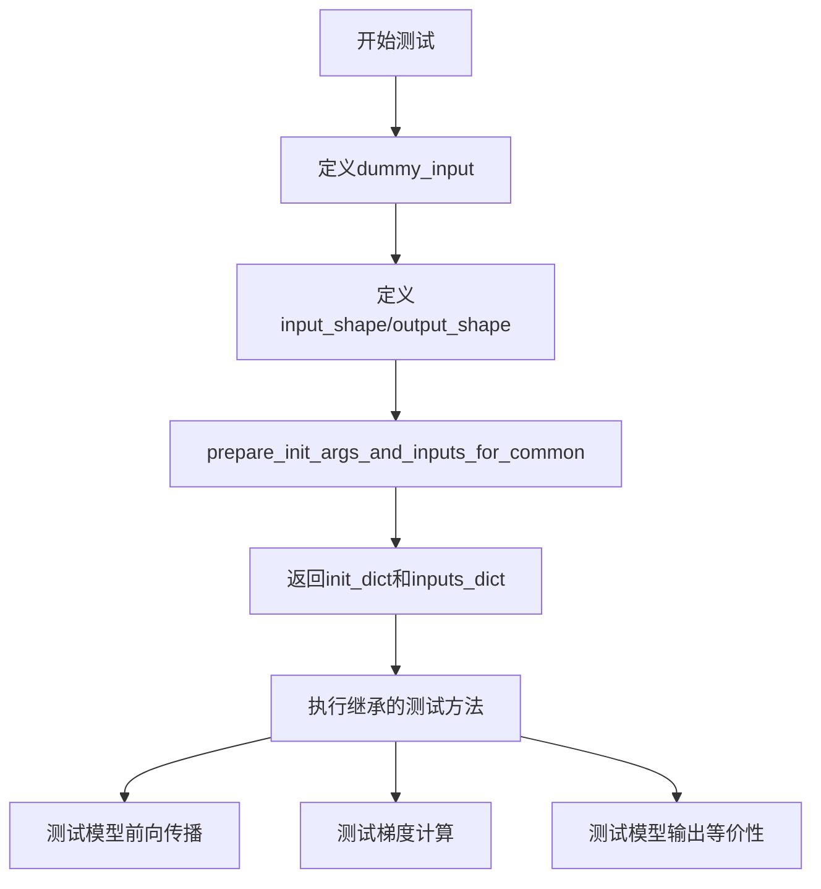

# `diffusers\tests\models\transformers\test_models_transformer_lumina.py` 详细设计文档

该代码文件定义了一个名为 LuminaNextDiT2DModelTransformerTests 的单元测试类，用于对 LuminaNextDiT2DModel 模型进行通用功能测试（继承自 ModelTesterMixin），验证其输出形状、参数初始化及前向传播等核心逻辑。

## 整体流程

```mermaid
graph TD
    A[测试开始] --> B[加载依赖 (torch, diffusers)]
    B --> C[定义测试类: LuminaNextDiT2DModelTransformerTests]
    C --> D{运行测试用例}
    D --> E[准备模型初始化参数: sample_size=16, patch_size=2, hidden_size=24...]
    E --> F[构建虚拟输入: hidden_states, encoder_hidden_states, timestep...]
    F --> G[执行模型前向传播 (通过 ModelTesterMixin 调用)]
    G --> H{断言验证}
    H -- 输出形状正确 --> I[测试通过]
    H -- 输出形状错误 --> J[抛出 AssertionError]
    I --> K[测试结束]
    J --> K
```

## 类结构

```
LuminaNextDiT2DModelTransformerTests (测试类)
├── unittest.TestCase (Python 标准库基类)
└── ModelTesterMixin (Diffusers 测试混入类)
```

## 全局变量及字段


### `torch`
    
PyTorch深度学习库，提供张量操作和神经网络构建功能

类型：`module`
    


### `LuminaNextDiT2DModel`
    
LuminaNext DiT 2D模型类，是被测试的核心模型

类型：`class`
    


### `enable_full_determinism`
    
启用完全确定性模式的函数，确保测试可复现

类型：`function`
    


### `torch_device`
    
PyTorch设备字符串，指定计算设备（如'cpu'或'cuda'）

类型：`str`
    


### `ModelTesterMixin`
    
模型测试混合类，提供通用模型测试方法和断言

类型：`class`
    


### `LuminaNextDiT2DModelTransformerTests.model_class`
    
指定要测试的模型类为LuminaNextDiT2DModel

类型：`type`
    


### `LuminaNextDiT2DModelTransformerTests.main_input_name`
    
模型主输入的名称，用于测试时定位输入张量

类型：`str`
    


### `LuminaNextDiT2DModelTransformerTests.uses_custom_attn_processor`
    
标志位，指示模型是否使用自定义注意力处理器

类型：`bool`
    


### `LuminaNextDiT2DModelTransformerTests.dummy_input`
    
生成虚拟输入字典，包含hidden_states、encoder_hidden_states、timestep、encoder_mask和image_rotary_emb等测试所需的张量

类型：`property`
    


### `LuminaNextDiT2DModelTransformerTests.input_shape`
    
返回模型的输入形状元组(4, 16, 16)

类型：`property`
    


### `LuminaNextDiT2DModelTransformerTests.output_shape`
    
返回模型的输出形状元组(4, 16, 16)

类型：`property`
    


### `LuminaNextDiT2DModelTransformerTests.prepare_init_args_and_inputs_for_common`
    
准备模型初始化参数字典和输入字典，用于通用测试场景

类型：`method`
    
    

## 全局函数及方法


### `LuminaNextDiT2DModelTransformerTests.prepare_init_args_and_inputs_for_common`

该方法用于准备模型初始化参数和测试输入数据，返回一个包含模型配置字典和测试输入张量字典的元组，供通用测试用例使用。

参数：

- 无（仅包含 `self` 隐式参数）

返回值：`Tuple[Dict, Dict]`，返回两个字典组成的元组——第一个字典包含模型初始化参数配置，第二个字典包含测试输入张量数据

#### 流程图



#### 带注释源码

```python
def prepare_init_args_and_inputs_for_common(self):
    """
    Args:
        None

    Returns:
        Tuple: (Dict, Dict) - 包含初始化参数字典和输入字典的元组
    """
    # 步骤1: 构建模型初始化参数字典
    # 配置 LuminaNextDiT2DModel 模型的各种超参数
    init_dict = {
        "sample_size": 16,              # 输入样本的空间尺寸
        "patch_size": 2,                # 图像分块大小
        "in_channels": 4,               # 输入通道数
        "hidden_size": 24,              # 隐藏层维度
        "num_layers": 2,                # Transformer 层数
        "num_attention_heads": 3,       # 注意力头数量
        "num_kv_heads": 1,              # Key-Value 头数量
        "multiple_of": 16,              # FFN 维度倍数
        "ffn_dim_multiplier": None,     # FFN 维度乘数（可选）
        "norm_eps": 1e-5,               # LayerNorm epsilon 值
        "learn_sigma": False,           # 是否学习 sigma 参数
        "qk_norm": True,                # 是否使用 QK 归一化
        "cross_attention_dim": 32,      # 跨注意力维度
        "scaling_factor": 1.0,          # 缩放因子
    }

    # 步骤2: 获取测试输入数据
    # 调用类属性 dummy_input 获取预定义的测试输入张量
    inputs_dict = self.dummy_input
    
    # 步骤3: 返回初始化参数和输入字典的元组
    return init_dict, inputs_dict
```

## 关键组件


### 一段话描述

该代码是一个针对LuminaNextDiT2DModel（基于Diffusion Transformer架构的图像生成模型）的单元测试文件，通过unittest框架验证模型的基本功能，包括前向传播、梯度计算、参数配置等核心行为。

### 文件的整体运行流程

1. 导入必要的测试框架和diffusers模型
2. 配置测试环境参数（enable_full_determinism）
3. 定义测试类LuminaNextDiT2DModelTransformerTests，继承ModelTesterMixin和unittest.TestCase
4. 在测试类中定义模型类、输入输出shape、虚拟输入数据
5. 实现prepare_init_args_and_inputs_for_common方法准备模型初始化参数和输入数据
6. unittest框架自动发现并执行继承自ModelTesterMixin的测试方法（如test_forward_pass、test_model_outputs_equivalence等）

### 类的详细信息

#### LuminaNextDiT2DModelTransformerTests

**类字段：**

| 名称 | 类型 | 描述 |
|------|------|------|
| model_class | type | 指定测试的模型类为LuminaNextDiT2DModel |
| main_input_name | str | 模型主输入名称为"hidden_states" |
| uses_custom_attn_processor | bool | 标识使用自定义注意力处理器 |

**类方法：**

| 名称 | 参数 | 返回值 | 描述 |
|------|------|--------|------|
| dummy_input | None | Dict | 生成虚拟输入数据，包含hidden_states、encoder_hidden_states、timestep、encoder_mask、image_rotary_emb、cross_attention_kwargs等张量 |
| input_shape | None | Tuple | 返回输入shape为(4, 16, 16) |
| output_shape | None | Tuple | 返回输出shape为(4, 16, 16) |
| prepare_init_args_and_inputs_for_common | None | Tuple | 准备模型初始化参数字典和输入字典，包含sample_size、patch_size、in_channels、hidden_size、num_layers等模型配置 |

**Mermaid流程图：**



**带注释源码：**

```python
class LuminaNextDiT2DModelTransformerTests(ModelTesterMixin, unittest.TestCase):
    model_class = LuminaNextDiT2DModel  # 测试的模型类
    main_input_name = "hidden_states"   # 主输入名称
    uses_custom_attn_processor = True   # 使用自定义注意力处理器

    @property
    def dummy_input(self):
        """生成虚拟输入数据用于测试"""
        batch_size = 2  # N
        num_channels = 4  # C
        height = width = 16  # H, W
        embedding_dim = 32  # D
        sequence_length = 16  # L

        # 创建随机初始化的隐藏状态
        hidden_states = torch.randn((batch_size, num_channels, height, width)).to(torch_device)
        # 创建编码器隐藏状态
        encoder_hidden_states = torch.randn((batch_size, sequence_length, embedding_dim)).to(torch_device)
        # 创建时间步
        timestep = torch.rand(size=(batch_size,)).to(torch_device)
        # 创建编码器掩码
        encoder_mask = torch.randn(size=(batch_size, sequence_length)).to(torch_device)
        # 创建图像旋转嵌入
        image_rotary_emb = torch.randn((384, 384, 4)).to(torch_device)

        return {
            "hidden_states": hidden_states,
            "encoder_hidden_states": encoder_hidden_states,
            "timestep": timestep,
            "encoder_mask": encoder_mask,
            "image_rotary_emb": image_rotary_emb,
            "cross_attention_kwargs": {},
        }

    @property
    def input_shape(self):
        """返回输入shape (C, H, W)"""
        return (4, 16, 16)

    @property
    def output_shape(self):
        """返回输出shape (C, H, W)"""
        return (4, 16, 16)

    def prepare_init_args_and_inputs_for_common(self):
        """准备模型初始化参数和测试输入"""
        init_dict = {
            "sample_size": 16,
            "patch_size": 2,
            "in_channels": 4,
            "hidden_size": 24,
            "num_layers": 2,
            "num_attention_heads": 3,
            "num_kv_heads": 1,
            "multiple_of": 16,
            "ffn_dim_multiplier": None,
            "norm_eps": 1e-5,
            "learn_sigma": False,
            "qk_norm": True,
            "cross_attention_dim": 32,
            "scaling_factor": 1.0,
        }

        inputs_dict = self.dummy_input
        return init_dict, inputs_dict
```

### 关键组件信息

| 名称 | 一句话描述 |
|------|-----------|
| LuminaNextDiT2DModel | Hugging Face diffusers库中的Diffusion Transformer 2D模型，用于图像生成任务 |
| ModelTesterMixin | diffusers测试框架提供的混合类，包含标准模型测试方法 |
| hidden_states | 主输入张量，代表图像的潜在表示 |
| encoder_hidden_states | 编码器隐藏状态，用于条件生成 |
| timestep | 扩散过程的时间步，控制去噪进程 |
| image_rotary_emb | 图像旋转位置嵌入，用于增强位置感知 |
| cross_attention_kwargs | 交叉注意力相关参数 |

### 潜在的技术债务或优化空间

1. **测试覆盖不足**：当前测试主要依赖ModelTesterMixin的通用测试方法，缺乏针对LuminaNextDiT2DModel特定架构（如DiT的patchify、位置编码、KV缓存等）的专项测试
2. **虚拟输入真实度**：dummy_input使用随机张量，未考虑实际扩散模型输入的统计特性（如timestep分布、encoder_mask的稀疏性）
3. **缺少定性测试**：没有验证模型输出的具体特性（如输出范围、数值稳定性）
4. **配置参数测试缺失**：未测试不同配置组合（如不同的num_kv_heads、qk_norm设置）对模型行为的影响

### 其它项目

**设计目标与约束：**

- 遵循diffusers库的测试规范，使用ModelTesterMixin确保与其他模型测试的一致性
- 支持CPU和GPU设备测试（通过torch_device配置）
- 确保测试可复现（通过enable_full_determinism）

**错误处理与异常设计：**

- 依赖unittest框架的标准断言机制
- 通过ModelTesterMixin统一处理常见错误场景

**数据流与状态机：**

- 输入数据流：dummy_input → prepare_init_args_and_inputs_for_common → 模型前向传播
- 测试状态：初始化 → 输入准备 → 执行测试断言

**外部依赖与接口契约：**

- 依赖diffusers库的LuminaNextDiT2DModel实现
- 依赖diffusers testing_utils模块的环境配置
- 依赖test_modeling_common.ModelTesterMixin的标准测试接口


## 问题及建议


### 已知问题

-   **硬编码的Magic Numbers**：`image_rotary_emb = torch.randn((384, 384, 4))` 中的维度 `384, 384, 4` 是硬编码的，与配置参数（如 `hidden_size: 24`）的关系不明确，缺乏注释说明其计算逻辑
- **测试输入验证缺失**：`dummy_input` 生成的输入张量形状与模型配置参数之间没有一致性检查，可能导致测试失败或隐藏配置错误
- **测试覆盖不完整**：缺少对模型输出的验证（如输出形状、梯度流等），也没有边界情况测试（如 batch_size=1、极端输入尺寸等）
- **测试方法使用不规范**：使用 `@property` 定义测试输入而非标准的 `setUp` 方法或 pytest fixture，不够灵活且无法传递参数
- **隐藏的外部依赖**：`ModelTesterMixin` 的行为不透明，其继承的测试逻辑对外部可见性差，配置参数与实际测试行为的关系不清晰
- **缺乏错误处理测试**：没有测试模型在异常输入（如 NaN、Inf、维度不匹配等）下的行为
- **性能测试缺失**：没有基准测试来验证模型的推理性能是否符合预期

### 优化建议

-   为 `image_rotary_emb` 等硬编码维度添加明确的计算公式注释，说明其与模型配置的关联关系
-   在 `prepare_init_args_and_inputs_for_common` 中添加输入与配置参数的一致性验证逻辑
-   增加对模型输出的断言验证，包括输出形状检查、梯度计算验证等
-   添加边界条件和异常输入的测试用例
-   考虑添加性能基准测试，记录关键指标（如推理时间、内存占用）
-   将 `@property` 装饰的输入生成方法重构为可配置的方法，支持参数化测试
-   为 `ModelTesterMixin` 的关键行为添加文档或显式的测试方法覆盖

## 其它


### 设计目标与约束

验证 LuminaNextDiT2DModel 变换器模型在扩散模型中的核心功能，包括前向传播、梯度计算、模型配置加载等关键能力。测试需兼容 CPU 和 CUDA 设备，确保模型在不同硬件平台上的正确性。使用 ModelTesterMixin 提供的一致性测试框架，确保与其他扩散模型测试的标准化。

### 错误处理与异常设计

测试使用 unittest 框架的断言机制进行错误检测。对于模型初始化错误，通过 `prepare_init_args_and_inputs_for_common` 方法捕获配置参数异常。对于前向传播错误，通过调用模型并比对输出形状进行验证。测试假设 diffusers 库已正确安装且版本兼容，若导入失败将触发 ModuleNotFoundError。

### 数据流与状态机

测试数据流从 dummy_input 属性生成随机张量，经过模型前向传播，输出与输入形状相同的变换结果。模型内部状态包括：hidden_states（图像特征）、encoder_hidden_states（条件信息）、timestep（去噪时间步）、encoder_mask（条件掩码）、image_rotary_emb（旋转嵌入）。测试不涉及显式状态机，状态转换由模型内部 transformer 层自动处理。

### 外部依赖与接口契约

依赖 diffusers 库的 LuminaNextDiT2DModel 类、torch 库、testing_utils 模块中的 enable_full_determinism 和 torch_device 工具函数、以及 test_modeling_common 中的 ModelTesterMixin。接口契约要求模型实现 forward 方法，接收指定签名的参数并返回变换后的 hidden_states。

### 性能考虑与基准测试

测试使用较小的模型配置（num_layers=2, hidden_size=24）以加快测试速度。未包含显式性能基准测试，但通过 enable_full_determinism 确保结果可复现性，便于性能回归检测。建议在实际 CI 环境中添加模型推理时间和内存占用的基准测试。

### 兼容性考虑

代码指定 Python 编码为 UTF-8，兼容 Python 3 环境。测试通过 torch_device 动态选择计算设备（CPU/CUDA），确保跨平台兼容。模型参数支持不同的 num_attention_heads 和 num_kv_heads 组合，兼容多种模型配置变体。

### 测试策略与覆盖率

采用 ModelTesterMixin 提供的标准化测试策略，包括：模型初始化测试、前向传播测试、输出形状验证、梯度计算测试、模型参数一致性测试等。测试覆盖模型的主要输入输出接口，但未涵盖边界条件（如 batch_size=1、极端分辨率等）和长时间去噪流程的端到端测试。

### 安全性考虑

测试使用随机张量生成 dummy_input，不涉及真实用户数据或敏感信息。代码来源于 Apache 2.0 许可的 HuggingFace diffusers 库，符合开源安全规范。未发现明显安全漏洞。

### 部署与运维 Considerations

此测试文件作为持续集成（CI）的一部分运行，不直接参与生产部署。建议通过 pytest 或 unittest 框架执行，配合 CI/CD 流水线实现自动化测试。测试失败时应生成详细错误信息，便于快速定位问题。

### 文档与注释

代码包含完整的 docstring 说明每个方法的功能、参数和返回值。类属性（model_class、main_input_name、uses_custom_attn_processor）有明确用途标注。dummy_input 方法详细说明了各张量的维度含义（batch_size、num_channels、height、width、embedding_dim、sequence_length）。

### 版本管理与变更历史

文件头部包含版权声明和 Apache 2.0 许可协议。版本历史由 diffusers 仓库管理，建议查阅 HuggingFace diffusers 仓库获取完整的变更记录。

### 潜在扩展方向

可添加的测试场景包括：1）不同 patch_size 和 sample_size 组合；2）learn_sigma=True 的变体测试；3）不同 ffn_dim_multiplier 配置；4）模型保存和加载的序列化测试；5）与完整扩散管线集成的集成测试。


    