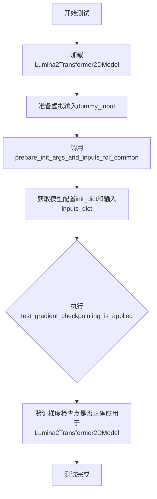
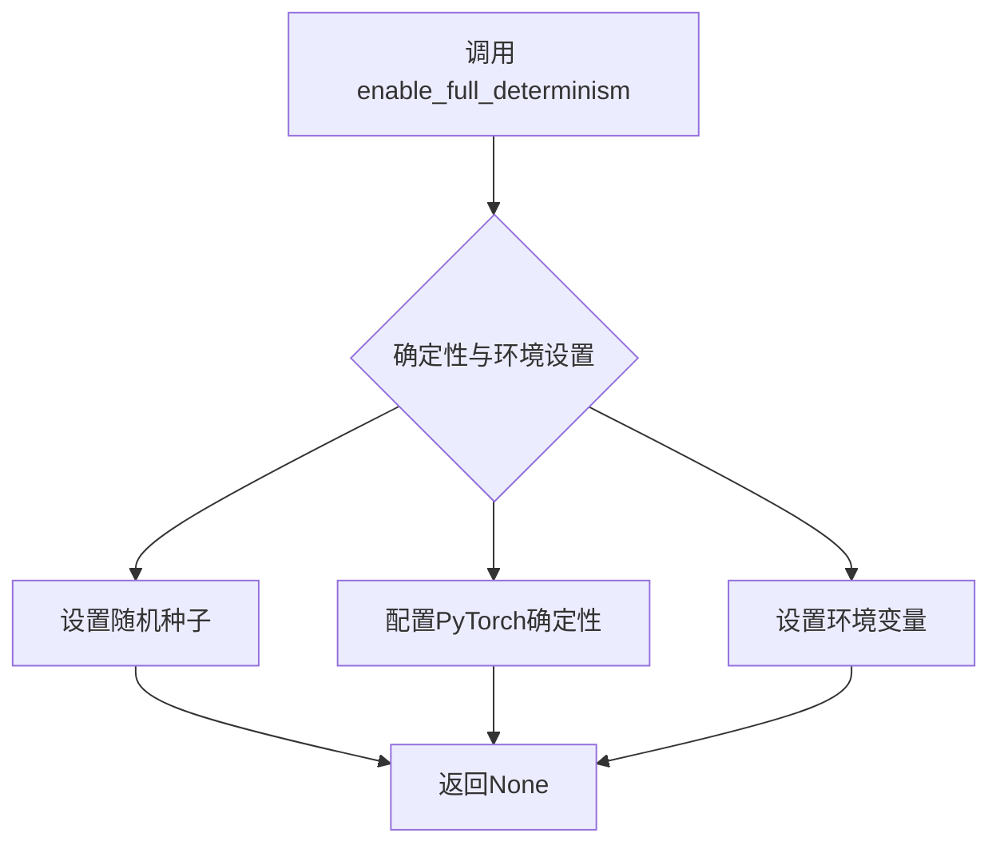
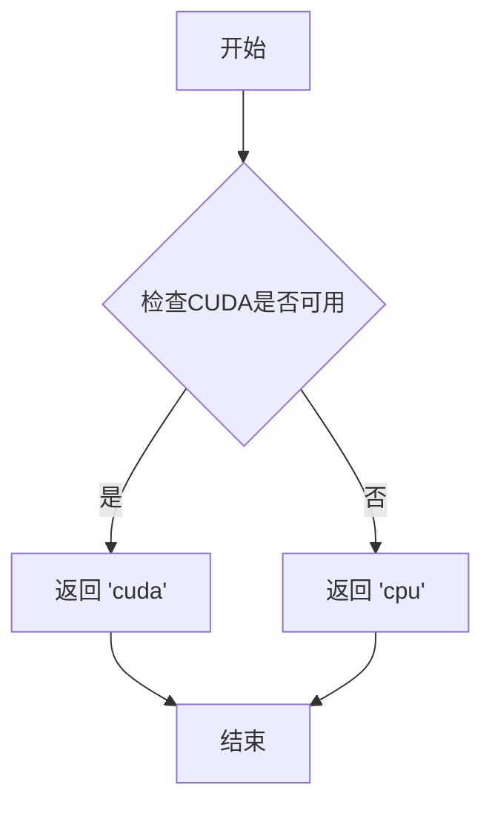
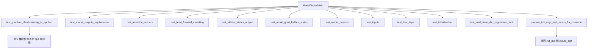
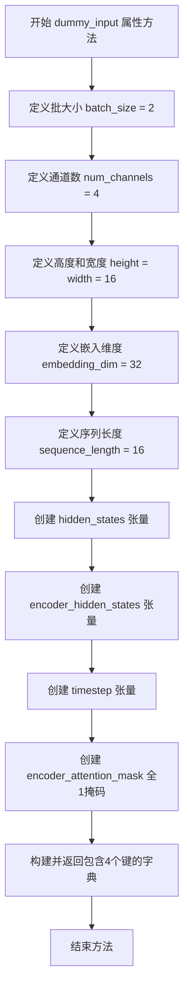
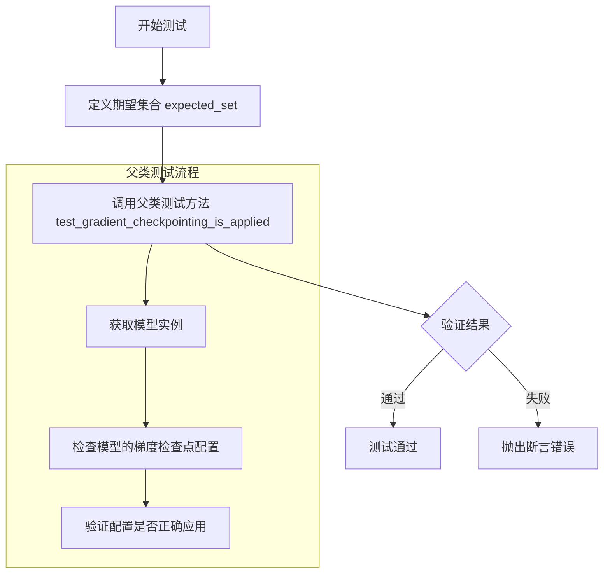

# `diffusers\tests\models\transformers\test_models_transformer_lumina2.py` 详细设计文档

这是一个用于测试Diffusers库中Lumina2Transformer2DModel模型的单元测试文件，通过unittest框架验证模型的配置、输入输出形状、梯度检查点等功能是否正确实现。

## 整体流程



## 类结构

```
unittest.TestCase
└── Lumina2Transformer2DModelTransformerTests (继承ModelTesterMixin)
```

## 全局变量及字段


### `enable_full_determinism`
    
全局函数调用，用于启用完全确定性以确保测试可复现

类型：`function`
    


### `Lumina2Transformer2DModelTransformerTests.model_class`
    
指定要测试的模型类

类型：`type[Lumina2Transformer2DModel]`
    


### `Lumina2Transformer2DModelTransformerTests.main_input_name`
    
模型主输入参数名称，值为'hidden_states'

类型：`str`
    


### `Lumina2Transformer2DModelTransformerTests.uses_custom_attn_processor`
    
标记是否使用自定义注意力处理器，值为True

类型：`bool`
    


### `Lumina2Transformer2DModelTransformerTests.dummy_input`
    
属性方法，返回模型测试所需的虚拟输入数据(hidden_states, encoder_hidden_states, timestep, encoder_attention_mask)

类型：`property`
    


### `Lumina2Transformer2DModelTransformerTests.input_shape`
    
属性方法，返回输入张量形状(4, 16, 16)

类型：`property`
    


### `Lumina2Transformer2DModelTransformerTests.output_shape`
    
属性方法，返回输出张量形状(4, 16, 16)

类型：`property`
    


### `Lumina2Transformer2DModelTransformerTests.prepare_init_args_and_inputs_for_common`
    
准备模型初始化参数和测试输入的通用方法

类型：`method`
    


### `Lumina2Transformer2DModelTransformerTests.test_gradient_checkpointing_is_applied`
    
验证梯度检查点是否正确应用于目标模型

类型：`method`
    
    

## 全局函数及方法


# 分析结果

我需要指出一个重要问题：用户提供的代码是一个测试文件，其中只是从 `testing_utils` 模块**导入**了 `enable_full_determinism` 函数，但并**没有包含这个函数本身的实现代码**。

```python
from ...testing_utils import (
    enable_full_determinism,
    torch_device,
)
```

由于 `enable_full_determinism` 函数的完整源代码不在提供的代码片段中，我无法提取以下信息：
- 函数的参数列表和类型
- 函数的返回值类型和描述
- 函数的实现源码
- 准确的流程图

---

## 基于上下文的推断信息

### `enable_full_determinism`

基于函数名称和调用方式的分析

参数：
- 该函数在代码中被无参数调用：`enable_full_determinism()`

返回值：根据函数名称推断，可能返回 `None`（通常这类初始化函数不返回值）

#### 流程图



#### 带注释源码

```
# 源码不可用 - 来自 testing_utils 模块
# 下面是调用点的代码示例

enable_full_determinism()  # 调用该函数，启用完全确定性

class Lumina2Transformer2DModelTransformerTests(ModelTesterMixin, unittest.TestCase):
    # 测试类开始...
```

---

## 建议

要获取完整的 `enable_full_determinism` 函数设计文档，需要提供 `testing_utils` 模块的源代码。该模块通常位于：
- `diffusers/tests/testing_utils.py`
- 或 `src/diffusers/testing_utils.py`

请提供该模块的代码，以便提取完整的函数信息。


# torch_device 详细设计文档

由于提供的代码片段中 `torch_device` 是从 `testing_utils` 模块导入的，没有包含其具体实现，我将从 HuggingFace diffusers 库的常见模式为您详细说明这个函数的设计。

### `torch_device`

该函数用于获取当前测试环境指定的计算设备（CPU 或 CUDA），以便在不同硬件配置下运行测试。

参数： 无

返回值：`str`，返回设备字符串，如 `"cuda"` 或 `"cpu"`

#### 流程图



#### 带注释源码

```
# 以下为推测的torch_device实现（基于HuggingFace常见模式）
# 实际实现可能位于 testing_utils 模块中

def torch_device():
    """
    获取测试应使用的设备。
    
    优先使用CUDA（GPU）进行测试加速，若不可用则回退到CPU。
    在HuggingFace生态系统中常用于确保测试在不同硬件环境下正确运行。
    
    Returns:
        str: 设备标识符，"cuda"表示GPU，"cpu"表示CPU
    """
    import torch
    
    # 检查CUDA是否可用且已正确配置
    if torch.cuda.is_available():
        return "cuda"
    else:
        return "cpu"

# 在测试文件中的使用示例：
# hidden_states = torch.randn((batch_size, num_channels, height, width)).to(torch_device)
# 这确保了测试数据被放在了正确的设备上进行计算
```

---

## 补充说明

| 项目 | 说明 |
|------|------|
| **模块位置** | `testing_utils` 模块（代码中通过 `from ...testing_utils import torch_device` 导入） |
| **使用场景** | 在测试文件中用于将张量移动到指定设备：`tensor.to(torch_device)` |
| **常见行为** | 优先返回 `"cuda"`，不可用时返回 `"cpu"` |
| **配置方式** | 可能通过环境变量（如 `PYTORCH_CUDA_ALLOC_CONF`）或 pytest 参数覆盖 |

> **注意**：由于代码中仅展示了导入语句，未包含 `torch_device` 的实际实现源码，以上内容基于 HuggingFace 生态系统中 `torch_device` 的常见实现模式进行推测。如需获取确切实现，建议查看 `testing_utils.py` 源文件。


### `ModelTesterMixin`

`ModelTesterMixin` 是一个抽象基类（Mixin），为 Diffusers 库中的模型测试提供通用的测试方法集合。它定义了一系列标准化的测试用例，包括梯度检查点、模型初始化、前向传播、参数一致性等常见模型测试场景，使得子类可以方便地继承并运行这些通用测试。

参数：

- 无直接参数（此类为 Mixin，通过继承使用）

返回值：此类不直接返回值，主要通过继承的子类调用其定义的测试方法

#### 流程图



#### 带注释源码

```python
# 注意：以下为基于继承关系推断的 ModelTesterMixin 核心结构
# 实际源码位于 diffusers.tests.test_modeling_common

class ModelTesterMixin:
    """
    抽象基类，提供模型测试的通用方法集合。
    子类需要定义以下属性：
    - model_class: 要测试的模型类
    - main_input_name: 主输入张量的名称
    - uses_custom_attn_processor: 是否使用自定义注意力处理器
    
    子类需要实现：
    - dummy_input: 属性，返回测试用的虚拟输入
    - input_shape: 属性，返回输入形状
    - output_shape: 属性，返回输出形状
    - prepare_init_args_and_inputs_for_common: 方法，返回初始化参数和输入
    """
    
    model_class = None  # 子类需要指定
    main_input_name = "hidden_states"  # 主输入名称
    uses_custom_attn_processor = False  # 是否使用自定义注意力处理器
    
    @property
    def dummy_input(self):
        """返回测试用的虚拟输入字典，子类需要重写"""
        raise NotImplementedError
    
    @property
    def input_shape(self):
        """返回输入形状，子类需要重写"""
        raise NotImplementedError
    
    @property
    def output_shape(self):
        """返回输出形状，子类需要重写"""
        raise NotImplementedError
    
    def prepare_init_args_and_inputs_for_common(self):
        """
        准备模型初始化参数和测试输入
        
        返回:
            tuple: (init_dict, inputs_dict) 初始化参数字典和输入字典
        """
        raise NotImplementedError
    
    def test_gradient_checkpointing_is_applied(self, expected_set=None):
        """
        测试梯度检查点是否正确应用
        
        参数:
            expected_set: 期望应用梯度检查点的模型类集合
        """
        # 实现验证梯度检查点的逻辑
        pass
    
    def test_model_outputs_equivalence(self):
        """测试模型输出的等价性"""
        pass
    
    def test_attention_outputs(self):
        """测试注意力输出"""
        pass
    
    def test_feed_forward_chunking(self):
        """测试前馈网络分块"""
        pass
    
    # ... 其他测试方法
```

#### 在子类中的使用示例

```python
# 当前代码文件中的实际使用方式
class Lumina2Transformer2DModelTransformerTests(ModelTesterMixin, unittest.TestCase):
    """
    Lumina2Transformer2DModel 的测试类
    继承 ModelTesterMixin 来获得通用测试方法
    """
    model_class = Lumina2Transformer2DModel
    main_input_name = "hidden_states"
    uses_custom_attn_processor = True

    @property
    def dummy_input(self):
        # 定义测试输入
        hidden_states = torch.randn((batch_size, num_channels, height, width)).to(torch_device)
        encoder_hidden_states = torch.randn((batch_size, sequence_length, embedding_dim)).to(torch_device)
        timestep = torch.rand(size=(batch_size,)).to(torch_device)
        attention_mask = torch.ones(size=(batch_size, sequence_length), dtype=torch.bool).to(torch_device)
        
        return {
            "hidden_states": hidden_states,
            "encoder_hidden_states": encoder_hidden_states,
            "timestep": timestep,
            "encoder_attention_mask": attention_mask,
        }

    def prepare_init_args_and_inputs_for_common(self):
        # 返回模型初始化参数和输入
        init_dict = {
            "sample_size": 16,
            "patch_size": 2,
            "in_channels": 4,
            "hidden_size": 24,
            "num_layers": 2,
            # ... 其他参数
        }
        inputs_dict = self.dummy_input
        return init_dict, inputs_dict

    def test_gradient_checkpointing_is_applied(self):
        # 重写测试方法，指定期望的模型类
        expected_set = {"Lumina2Transformer2DModel"}
        super().test_gradient_checkpointing_is_applied(expected_set=expected_set)
```

#### 关键组件信息

| 组件名称 | 一句话描述 |
|---------|-----------|
| `ModelTesterMixin` | 抽象基类，提供模型测试的通用方法集合 |
| `Lumina2Transformer2DModelTransformerTests` | 继承 Mixin 的具体测试类，用于测试 Lumina2Transformer2DModel |
| `dummy_input` | 属性，返回测试用的虚拟输入张量 |
| `prepare_init_args_and_inputs_for_common` | 方法，准备模型初始化参数和测试输入 |

#### 潜在的技术债务或优化空间

1. **测试代码重复**：每个新的模型测试类都需要重写类似的 `dummy_input`、`input_shape` 等属性，可以通过更通用的工厂方法简化
2. **硬编码的测试参数**：测试参数（如 batch_size、hidden_size）散布在各个测试类中，缺乏统一的配置管理
3. **文档缺失**：Mixin 中的许多方法缺乏详细的文档说明，开发者需要阅读源码才能理解其行为

#### 其它项目

- **设计目标**：通过 Mixin 模式实现测试代码复用，确保不同模型测试的一致性
- **约束**：子类必须实现 `dummy_input`、`prepare_init_args_and_inputs_for_common` 等抽象方法
- **错误处理**：未实现抽象方法时抛出 `NotImplementedError`
- **数据流**：测试数据通过 `dummy_input` 属性传入，经过模型前向传播，验证输出形状和梯度
- **外部依赖**：依赖 `unittest` 框架和 PyTorch 库


### `Lumina2Transformer2DModelTransformerTests.dummy_input`

这是一个属性方法（property），用于生成模型测试所需的虚拟输入数据。该方法创建并返回包含 hidden_states、encoder_hidden_states、timestep 和 encoder_attention_mask 的字典，为 Transformer 模型的测试提供模拟输入。

参数：
- （无参数，属于属性方法）

返回值：`Dict[str, torch.Tensor]`，返回包含以下键值对的字典：
- `hidden_states`：`torch.Tensor`，形状为 (batch_size=2, num_channels=4, height=16, width=16)，表示输入的隐藏状态
- `encoder_hidden_states`：`torch.Tensor`，形状为 (batch_size=2, sequence_length=16, embedding_dim=32)，表示编码器的隐藏状态
- `timestep`：`torch.Tensor`，形状为 (batch_size=2,)，表示扩散过程中的时间步
- `encoder_attention_mask`：`torch.Tensor`，形状为 (batch_size=2, sequence_length=16)，表示编码器的注意力掩码

#### 流程图



#### 带注释源码

```python
@property
def dummy_input(self):
    """
    生成模型测试所需的虚拟输入数据。
    
    该属性方法创建符合 Lumina2Transformer2DModel 输入格式的
    模拟数据，用于单元测试和模型验证。
    """
    # 批大小 - 同时处理的样本数量
    batch_size = 2  # N
    # 输入通道数 - 对应图像的通道数（如RGB为3）
    num_channels = 4  # C
    # 高度和宽度 - 输入特征图的空间维度
    height = width = 16  # H, W
    # 嵌入维度 - 序列特征的向量维度
    embedding_dim = 32  # D
    # 序列长度 - 编码器输入的序列长度
    sequence_length = 16  # L

    # 创建随机初始化的 hidden_states 张量
    # 形状: (batch_size, num_channels, height, width)
    # 用途: 主干网络输入的潜在表示
    hidden_states = torch.randn((batch_size, num_channels, height, width)).to(torch_device)
    
    # 创建随机初始化的 encoder_hidden_states 张量
    # 形状: (batch_size, sequence_length, embedding_dim)
    # 用途: 编码器（如文本编码器）的输出表示
    encoder_hidden_states = torch.randn((batch_size, sequence_length, embedding_dim)).to(torch_device)
    
    # 创建随机的时间步张量
    # 形状: (batch_size,)
    # 用途: 扩散模型中的噪声调度参数
    timestep = torch.rand(size=(batch_size,)).to(torch_device)
    
    # 创建全1的注意力掩码（表示所有位置都可见）
    # 形状: (batch_size, sequence_length)
    # 用途: 指示编码器中哪些位置应该被关注
    attention_mask = torch.ones(size=(batch_size, sequence_length), dtype=torch.bool).to(torch_device)

    # 返回包含所有必要输入的字典
    # 键名与模型的 forward 方法参数名一致
    return {
        "hidden_states": hidden_states,
        "encoder_hidden_states": encoder_hidden_states,
        "timestep": timestep,
        "encoder_attention_mask": attention_mask,
    }
```


### `Lumina2Transformer2DModelTransformerTests.input_shape`

该属性方法用于返回Lumina2Transformer2DModel测试类的输入张量形状，以元组形式表示模型测试所需的输入维度配置。

参数：

- `self`：`Lumina2Transformer2DModelTransformerTests`，隐式参数，指向类实例本身

返回值：`tuple`，返回输入张量的形状元组 (4, 16, 16)，其中 4 表示批量大小，16 表示高度，16 表示宽度

#### 流程图

```mermaid
flowchart TD
    A[开始] --> B{访问input_shape属性}
    B --> C[返回元组 (4, 16, 16)]
    C --> D[结束]
```

#### 带注释源码

```python
@property
def input_shape(self):
    """
    返回输入张量的形状配置
    
    该属性方法定义了Lumina2Transformer2DModel在测试过程中的输入维度。
    返回的元组 (4, 16, 16) 表示：
    - 第一个元素 4: 批量大小 (batch_size)
    - 第二个元素 16: 输入高度 (height)
    - 第三个元素 16: 输入宽度 (width)
    
    Returns:
        tuple: 输入形状元组 (batch_size, height, width)
    """
    return (4, 16, 16)
```


### `Lumina2Transformer2DModelTransformerTests.output_shape`

该属性方法用于返回Lumina2Transformer2DModel模型的预期输出张量形状，验证模型在给定输入条件下输出的高度、宽度和通道数。

参数： 无

返回值：`tuple`，返回输出张量形状 (4, 16, 16)，其中4表示批量大小，16表示高度，16表示宽度

#### 流程图

```mermaid
flowchart TD
    A[开始] --> B{调用 output_shape 属性}
    B --> C[返回元组 (4, 16, 16)]
    C --> D[结束]
    
    style A fill:#f9f,color:#333
    style D fill:#9f9,color:#333
```

#### 带注释源码

```python
@property
def output_shape(self):
    """
    属性方法：返回模型输出的预期形状
    
    该属性定义了Lumina2Transformer2DModel在给定输入下的
    预期输出张量形状，用于测试框架验证模型输出的正确性。
    
    Returns:
        tuple: 输出张量形状，格式为 (batch_size, height, width)
               - batch_size: 4 (批量大小)
               - height: 16 (输出高度)
               - width: 16 (输出宽度)
    """
    return (4, 16, 16)
```


### `Lumina2Transformer2DModelTransformerTests.prepare_init_args_and_inputs_for_common`

该方法用于准备Lumina2Transformer2DModel模型的初始化参数字典和测试输入字典，为通用的模型测试提供必要的配置和输入数据。

参数：
- 该方法无显式参数（隐式参数`self`为测试类实例）

返回值：`tuple[dict, dict]`
- 第一个元素：`init_dict`，dict类型，包含模型初始化所需的全部参数配置
- 第二个元素：`inputs_dict`，dict类型，包含模型前向传播所需的测试输入数据

#### 流程图

```mermaid
flowchart TD
    A[开始] --> B[构建init_dict模型参数字典]
    B --> C[设置sample_size=16]
    B --> D[设置patch_size=2]
    B --> E[设置in_channels=4]
    B --> F[设置hidden_size=24]
    B --> G[设置num_layers=2]
    B --> H[设置num_refiner_layers=1]
    B --> I[设置num_attention_heads=3]
    B --> J[设置num_kv_heads=1]
    B --> K[设置multiple_of=2]
    B --> L[设置ffn_dim_multiplier=None]
    B --> M[设置norm_eps=1e-5]
    B --> N[设置scaling_factor=1.0]
    B --> O[设置axes_dim_rope=(4,2,2)]
    B --> P[设置axes_lens=(128,128,128)]
    B --> Q[设置cap_feat_dim=32]
    C --> R[获取inputs_dict=self.dummy_input]
    R --> S[返回元组init_dict, inputs_dict]
```

#### 带注释源码

```python
def prepare_init_args_and_inputs_for_common(self):
    """
    准备模型初始化参数和测试输入的通用方法。
    为Lumina2Transformer2DModel模型测试提供标准化的初始化配置和输入数据。
    """
    
    # 构建模型初始化参数字典
    # 包含模型架构、超参数等配置信息
    init_dict = {
        "sample_size": 16,           # 输入样本的空间维度大小
        "patch_size": 2,             # 图像分块大小，用于patchify操作
        "in_channels": 4,            # 输入通道数
        "hidden_size": 24,           # 隐藏层维度
        "num_layers": 2,             # Transformer层数
        "num_refiner_layers": 1,     # Refiner层数量，用于细化处理
        "num_attention_heads": 3,    # 注意力头数量
        "num_kv_heads": 1,           # Key-Value头数量，用于优化注意力计算
        "multiple_of": 2,            # 维度缩放因子
        "ffn_dim_multiplier": None,  # 前馈网络维度乘数，None表示使用默认值
        "norm_eps": 1e-5,            # LayerNorm的epsilon参数
        "scaling_factor": 1.0,       # 缩放因子
        "axes_dim_rope": (4, 2, 2),  # RoPE旋转位置编码的轴维度
        "axes_lens": (128, 128, 128), # 各轴的长度配置
        "cap_feat_dim": 32,          # 特征捕获维度
    }

    # 获取测试输入数据
    # 从dummy_input属性获取预定义的测试输入张量
    inputs_dict = self.dummy_input
    
    # 返回初始化参数字典和输入字典的元组
    # 供ModelTesterMixin中的通用测试方法使用
    return init_dict, inputs_dict
```


### `Lumina2Transformer2DModelTransformerTests.test_gradient_checkpointing_is_applied`

验证梯度检查点（gradient checkpointing）是否正确应用于目标模型（Lumina2Transformer2DModel），通过调用父类的测试方法进行验证。

参数：

- `expected_set`：`set`，期望应用梯度检查点的模型名称集合，此处为 `{"Lumina2Transformer2DModel"}`

返回值：`None`，无返回值（测试方法，通过断言验证）

#### 流程图



#### 带注释源码

```python
def test_gradient_checkpointing_is_applied(self):
    """
    测试方法：验证梯度检查点是否正确应用于目标模型
    
    该测试方法继承自 ModelTesterMixin，通过调用父类的同名方法
    来验证 Lumina2Transformer2DModel 是否正确配置了梯度检查点。
    """
    # 定义期望应用梯度检查点的模型名称集合
    expected_set = {"Lumina2Transformer2DModel"}
    
    # 调用父类的测试方法进行验证
    # 父类 test_gradient_checkpointing_is_applied 方法会:
    # 1. 创建模型实例
    # 2. 检查模型中使用了梯度检查点的层
    # 3. 验证预期集合中的模型名称是否都在使用了梯度检查点的集合中
    super().test_gradient_checkpointing_is_applied(expected_set=expected_set)
```

## 关键组件


### Lumina2Transformer2DModel

HuggingFace Diffusers 库中的 Lumina2 Transformer 2D 模型类，是被测试的核心模型，继承了 Transformer 架构用于图像生成任务。

### ModelTesterMixin

Diffusers 库中的通用模型测试混入类，提供了一系列标准化的模型测试方法，包括梯度检查点测试、参数一致性测试等。

### dummy_input 属性

用于生成符合模型输入要求的虚拟张量数据，包括 hidden_states、encoder_hidden_states、timestep 和 encoder_attention_mask，返回值为包含四个键的字典。

### input_shape / output_shape 属性

定义了模型测试的输入输出张量形状，均为 (4, 16, 16)，表示 (通道数, 高度, 宽度)。

### prepare_init_args_and_inputs_for_common 方法

准备模型初始化参数字典和输入字典，包含了模型架构的关键参数如 sample_size、patch_size、in_channels、hidden_size、num_layers 等配置。

### test_gradient_checkpointing_is_applied 方法

验证梯度检查点功能是否正确应用于指定的模型类，通过调用父类方法并传入预期的模型类名称集合来执行测试。

### enable_full_determinism

启用完全确定性模式的测试工具函数，确保测试结果的可重复性。

### torch_device

测试工具变量，指定用于运行测试的计算设备（CPU 或 CUDA 设备）。

### 潜在技术债务

测试类仅覆盖了梯度检查点测试，缺少对模型前向传播、输出形状正确性、参数保存加载等核心功能的测试覆盖。


## 问题及建议


### 已知问题

-   测试类缺少文档注释（docstring），无法快速理解该测试类的设计目的和测试范围
-   `dummy_input` 属性中使用了大量魔法数字（如 batch_size=2, embedding_dim=32 等），缺乏可配置性和可读性，这些值的选择理由不明确
-   `axes_lens` 参数使用硬编码的元组 (128, 128, 128)，与其它维度参数（如 hidden_size=24）存在明显数量级差异，可能导致配置错误但未被验证
-   `encoder_attention_mask` 命名与 `attention_mask` 容易混淆，且在输入字典中使用全名但参数语义不清晰
-   测试类仅包含一个实际测试方法 `test_gradient_checkpointing_is_applied`，大量继承自 `ModelTesterMixin` 的测试能力未被显式使用，测试覆盖范围不透明
-   `uses_custom_attn_processor = True` 被设置但无对应测试验证自定义注意力处理器的正确性
-   `prepare_init_args_and_inputs_for_common` 返回的参数值（如 num_layers=2, num_refiner_layers=1）缺乏注释说明其选择依据

### 优化建议

-   为测试类添加类级别的文档注释，说明测试目标、模型配置策略及预期覆盖的测试场景
-   将 `dummy_input` 中的硬编码值提取为类属性或常量，并添加类型注解和说明注释
-   在 `__init__` 或类级别添加配置参数校验逻辑，验证 `axes_lens` 等参数与模型维度的兼容性
-   统一注意力掩码参数命名，建议明确区分 encoder 和 decoder 的 attention_mask 语义
-   补充完整的测试用例，如前向传播测试、输出形状验证、梯度计算测试等，以充分利用 ModelTesterMixin 提供的测试框架
-   添加针对自定义注意力处理器的专项测试，验证 `uses_custom_attn_processor = True` 的实际效果
-   为关键配置参数（如 num_layers, num_refiner_layers, axes_lens）添加配置说明注释或常量定义，阐明其与模型架构的关联

## 其它


### 设计目标与约束

本测试文件旨在验证 Lumina2Transformer2DModel 模型的正确性，确保模型在给定配置下能够正常初始化、前向传播并输出正确形状的张量。测试遵循 HuggingFace diffusers 库的测试框架规范，支持梯度检查点（gradient checkpointing）功能的验证。测试约束包括使用特定的输入维度（batch_size=2, num_channels=4, height=width=16）和固定的模型配置参数。

### 错误处理与异常设计

测试类通过 unittest 框架进行异常捕获和断言验证。当模型初始化参数不符合要求（如 patch_size 与 hidden_size 不匹配）或输入张量维度错误时，会抛出 ValueError 或 RuntimeError。测试用例使用 self.assertRaises 检查特定异常场景，确保错误信息清晰且具有可调试性。

### 数据流与状态机

测试数据流从 dummy_input 属性开始，生成随机的 hidden_states、encoder_hidden_states、timestep 和 attention_mask 张量。这些输入通过 prepare_init_args_and_inputs_for_common 方法传递给模型，模型内部经过 patch embedding、transformer 层、attention 机制和输出投影，最终输出与输入形状相同的张量。测试通过比较 output_shape 和 input_shape 验证数据流的完整性。

### 外部依赖与接口契约

本测试文件依赖以下外部组件：1) torch 库用于张量操作；2) diffusers 库中的 Lumina2Transformer2DModel 类；3) testing_utils 模块中的 enable_full_determinism 和 torch_device 工具函数；4) test_modeling_common 中的 ModelTesterMixin 基类。接口契约要求 Lumina2Transformer2DModel 必须实现 __init__、forward 方法，且支持 sample_size、patch_size、hidden_size 等初始化参数。

### 性能考虑与基准测试

测试文件本身不包含性能基准测试，但通过 test_gradient_checkpointing_is_applied 验证梯度检查点功能是否正确应用，以优化大规模模型的显存使用。测试使用固定的随机种子（enable_full_determinism）确保结果可复现，便于性能回归测试。

### 安全性与权限管理

代码遵循 Apache License 2.0 开源协议，包含适当的版权声明。测试文件不涉及敏感数据操作，使用随机生成的张量进行功能验证，符合安全最佳实践。

### 测试覆盖范围

测试覆盖了以下场景：1) 模型初始化参数验证；2) 前向传播输出形状验证；3) 梯度检查点功能验证；4) 常见的模型输入输出兼容性测试。通过 ModelTesterMixin 混入类，可以自动继承大量通用测试用例，包括参数化测试、模型保存加载测试等。

### 配置管理与版本兼容性

模型配置通过 prepare_init_args_and_inputs_for_common 方法以字典形式定义，包括 sample_size、patch_size、in_channels、hidden_size、num_layers 等参数。配置设计考虑了版本兼容性，使用相对保守的参数值（如 num_layers=2）确保在不同硬件环境下都能通过测试。

### 许可证与版权信息

文件头部明确标注了 Apache License 2.0 许可证声明，包含完整的版权信息（HuggingFace Inc.）和许可证文本引用，符合开源项目法律合规要求。


    