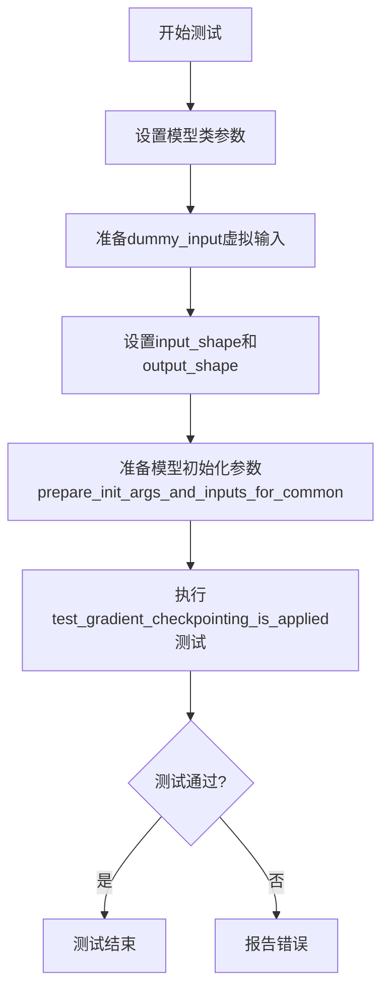
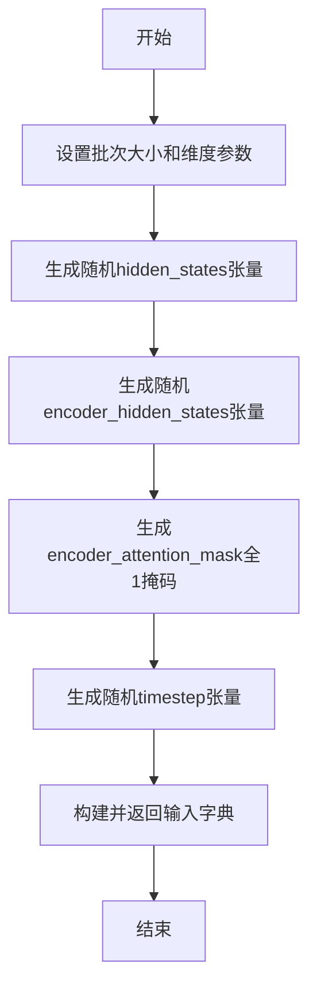
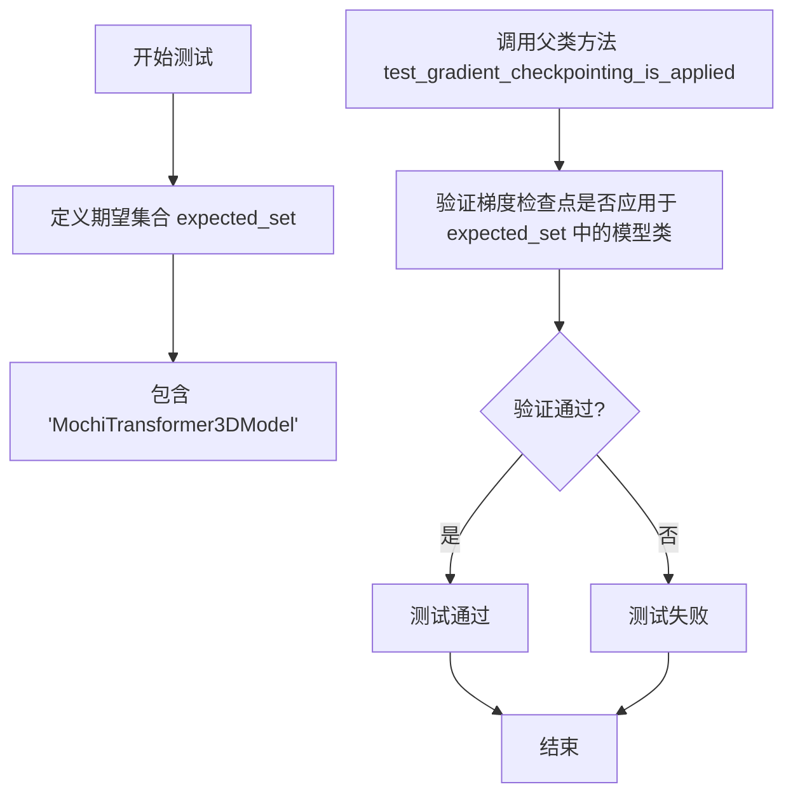

# `diffusers\tests\models\transformers\test_models_transformer_mochi.py` 详细设计文档

这是一个用于测试diffusers库中MochiTransformer3DModel模型的单元测试文件，继承自ModelTesterMixin和unittest.TestCase，提供了模型初始化参数、虚拟输入数据以及梯度检查点相关的测试用例。

## 整体流程



## 类结构

```
MochiTransformerTests (测试类)
└── 继承自 ModelTesterMixin, unittest.TestCase
```

## 全局变量及字段


### `enable_full_determinism`
    
启用完整确定性的全局函数，用于确保测试结果可重复

类型：`function`
    


### `MochiTransformerTests.model_class`
    
被测试的模型类MochiTransformer3DModel

类型：`class`
    


### `MochiTransformerTests.main_input_name`
    
主输入名称hidden_states

类型：`str`
    


### `MochiTransformerTests.uses_custom_attn_processor`
    
是否使用自定义注意力处理器

类型：`bool`
    


### `MochiTransformerTests.model_split_percents`
    
模型分割百分比[0.7, 0.6, 0.6]

类型：`list`
    


### `MochiTransformerTests.dummy_input`
    
返回虚拟输入数据的属性

类型：`property`
    


### `MochiTransformerTests.input_shape`
    
返回输入形状的属性

类型：`property`
    


### `MochiTransformerTests.output_shape`
    
返回输出形状的属性

类型：`property`
    
    

## 全局函数及方法


### `MochiTransformerTests.dummy_input`

该属性为 MochiTransformer3DModel 的单元测试生成虚拟输入数据，包括隐藏状态、编码器隐藏状态、时间步和注意力掩码，用于模型的前向传播测试。

参数：

- 该属性无显式参数（通过 `self` 隐式访问类实例）

返回值：`Dict[str, torch.Tensor]`，返回一个包含四个键的字典，分别代表模型所需的 hidden_states、encoder_hidden_states、timestep 和 encoder_attention_mask

#### 流程图



#### 带注释源码

```python
@property
def dummy_input(self):
    """生成用于测试MochiTransformer3DModel的虚拟输入数据"""
    # 定义批量大小为2
    batch_size = 2
    # 定义输入通道数为4
    num_channels = 4
    # 定义帧数为2（用于视频/3D数据）
    num_frames = 2
    # 定义高度和宽度为16
    height = 16
    width = 16
    # 定义嵌入维度为16
    embedding_dim = 16
    # 定义序列长度为16
    sequence_length = 16

    # 创建形状为(batch_size, num_channels, num_frames, height, width)的随机隐藏状态张量
    hidden_states = torch.randn((batch_size, num_channels, num_frames, height, width)).to(torch_device)
    # 创建形状为(batch_size, sequence_length, embedding_dim)的随机编码器隐藏状态张量
    encoder_hidden_states = torch.randn((batch_size, sequence_length, embedding_dim)).to(torch_device)
    # 创建形状为(batch_size, sequence_length)的全1布尔注意力掩码
    encoder_attention_mask = torch.ones((batch_size, sequence_length)).bool().to(torch_device)
    # 创建形状为(batch_size,)的随机整数时间步，范围[0, 1000)
    timestep = torch.randint(0, 1000, size=(batch_size,)).to(torch_device)

    # 返回包含所有虚拟输入的字典
    return {
        "hidden_states": hidden_states,
        "encoder_hidden_states": encoder_hidden_states,
        "timestep": timestep,
        "encoder_attention_mask": encoder_attention_mask,
    }
```


### `MochiTransformerTests.input_shape`

该属性返回模型测试所使用的输入张量形状，定义了一个四维元组表示（通道数、时间帧数、高度、宽度），用于在测试中验证模型输入维度。

参数：
- （无参数，该属性不需要外部输入）

返回值：`tuple`，返回模型预期输入的形状元组 (num_channels, num_frames, height, width)，具体值为 (4, 2, 16, 16)

#### 流程图

```mermaid
flowchart TD
    A[开始] --> B{调用 input_shape 属性}
    B --> C[返回元组 (4, 2, 16, 16)]
    C --> D[结束]
    
    style B fill:#e1f5fe
    style C fill:#c8e6c9
```

#### 带注释源码

```python
@property
def input_shape(self):
    """
    返回模型测试的输入形状。
    
    该属性定义了在单元测试中用于测试 MochiTransformer3DModel 的输入张量维度。
    返回的四维元组表示:
    - 4: num_channels (通道数)
    - 2: num_frames (时间帧数/视频帧数)
    - 16: height (高度)
    - 16: width (宽度)
    
    Returns:
        tuple: 包含 (通道数, 时间帧数, 高度, 宽度) 的四维元组
    """
    return (4, 2, 16, 16)
```


### `MochiTransformerTests.output_shape`

该属性定义了MoChiTransformer3DModel测试的预期输出形状，返回一个表示(批量大小, 通道数, 帧数, 高度/宽度)的元组，用于验证模型输出维度是否符合预期。

参数：

- `self`：`MochiTransformerTests`，表示该属性属于测试类实例本身，无需显式传递参数

返回值：`Tuple[int, int, int, int]`，返回包含4个整数的元组 (4, 2, 16, 16)，分别代表批量大小为4、通道数为2、帧数为2、空间维度为16×16

#### 流程图

```mermaid
flowchart TD
    A[开始访问 output_shape 属性] --> B{获取 self 实例}
    B --> C[返回元组 (4, 2, 16, 16)]
    C --> D[结束]
    
    style A fill:#f9f,color:#333
    style C fill:#9f9,color:#333
    style D fill:#ff9,color:#333
```

#### 带注释源码

```python
@property
def output_shape(self):
    """
    定义测试模型的预期输出形状。
    
    该属性返回模型在给定输入情况下期望输出的张量维度。
    返回值表示: (batch_size, num_channels, num_frames, height/width)
    
    Returns:
        Tuple[int, int, int, int]: 包含四个整数的元组
            - 第一个元素 (4): 批量大小 (batch_size)
            - 第二个元素 (2): 通道数 (num_channels/num_frames)
            - 第三个元素 (16): 高度 (height)
            - 第四个元素 (16): 宽度 (width)
            对应输入形状 (4, 2, 16, 16) 的输出维度
    """
    return (4, 2, 16, 16)
```


### `MochiTransformerTests.prepare_init_args_and_inputs_for_common`

该方法用于为通用测试准备模型初始化参数字典和输入数据字典，返回一个包含模型配置参数和测试输入的元组，供测试框架初始化和运行 MochiTransformer3DModel 模型测试使用。

参数：

- `self`：隐式参数，测试类实例本身，无需显式传递

返回值：`Tuple[Dict, Dict]`，返回包含初始化参数字典和输入数据字典的元组

- `init_dict`：Dict，包含模型初始化所需的所有配置参数
- `inputs_dict`：Dict，包含模型前向传播所需的输入数据

#### 流程图

```mermaid
flowchart TD
    A[开始] --> B[创建 init_dict 参数字典]
    B --> C[设置 patch_size=2]
    C --> D[设置 num_attention_heads=2]
    D --> E[设置 attention_head_dim=8]
    E --> F[设置 num_layers=2]
    F --> G[设置 pooled_projection_dim=16]
    G --> H[设置 in_channels=4]
    H --> I[设置 out_channels=None]
    I --> J[设置 qk_norm='rms_norm']
    J --> K[设置 text_embed_dim=16]
    K --> L[设置 time_embed_dim=4]
    L --> M[设置 activation_fn='swiglu']
    M --> N[设置 max_sequence_length=16]
    N --> O[调用 self.dummy_input 获取输入数据]
    O --> P[返回 (init_dict, inputs_dict) 元组]
```

#### 带注释源码

```python
def prepare_init_args_and_inputs_for_common(self):
    """
    准备模型初始化参数和测试输入数据
    
    该方法为测试用例提供完整的模型配置参数和输入数据，
    使得测试框架能够正确初始化 MochiTransformer3DModel 并执行前向传播测试。
    
    Returns:
        Tuple[Dict, Dict]: 包含以下两个字典的元组:
            - init_dict: 模型初始化参数字典
            - inputs_dict: 模型输入数据字典
    """
    # 定义模型初始化参数字典，包含transformer模型的所有关键配置
    init_dict = {
        "patch_size": 2,                    # 补丁大小，用于将图像分割为补丁
        "num_attention_heads": 2,           # 注意力头的数量
        "attention_head_dim": 8,            # 每个注意力头的维度
        "num_layers": 2,                    # Transformer层数
        "pooled_projection_dim": 16,        # 池化投影维度
        "in_channels": 4,                   # 输入通道数
        "out_channels": None,               # 输出通道数，None表示自动推断
        "qk_norm": "rms_norm",              # QK归一化方法
        "text_embed_dim": 16,               # 文本嵌入维度
        "time_embed_dim": 4,                # 时间嵌入维度
        "activation_fn": "swiglu",          # 激活函数类型
        "max_sequence_length": 16,          # 最大序列长度
    }
    
    # 从测试类获取预定义的虚拟输入数据
    inputs_dict = self.dummy_input
    
    # 返回初始化参数和输入数据元组，供测试框架使用
    return init_dict, inputs_dict
```


### `MochiTransformerTests.test_gradient_checkpointing_is_applied`

该测试方法用于验证梯度检查点（Gradient Checkpointing）技术是否正确应用于 `MochiTransformer3DModel` 模型类，通过调用父类的测试方法来确认指定的模型类已启用梯度检查点功能。

参数：

- `expected_set`：`Set[str]`，期望的模型类名称集合，用于验证梯度检查点是否应用到了正确的模型类

返回值：`None`，无返回值（测试方法，通过调用父类方法进行验证）

#### 流程图



#### 带注释源码

```python
def test_gradient_checkpointing_is_applied(self):
    """
    测试梯度检查点（Gradient Checkpointing）是否正确应用于 MochiTransformer3DModel。
    
    该方法继承自 ModelTesterMixin，用于验证模型类是否正确配置了梯度检查点。
    梯度检查点是一种通过在反向传播时重新计算中间激活值来节省显存的技术。
    """
    # 定义期望应用梯度检查点的模型类集合
    expected_set = {"MochiTransformer3DModel"}
    
    # 调用父类的测试方法，验证梯度检查点是否正确应用
    # 父类方法会检查 expected_set 中的模型类是否启用了梯度检查点
    super().test_gradient_checkpointing_is_applied(expected_set=expected_set)
```


### `MochiTransformerTests.prepare_init_args_and_inputs_for_common`

该方法为 `MochiTransformer3DModel` 测试类提供模型初始化参数和输入数据，准备测试所需的配置和输入张量。

参数：

- `self`：`MochiTransformerTests`，测试类实例本身

返回值：`Tuple[Dict, Dict]`，返回包含模型初始化参数和输入数据的元组

- `init_dict`：`Dict[str, Any]`，模型初始化参数字典，包含 patch_size、num_attention_heads、attention_head_dim、num_layers、pooled_projection_dim、in_channels、out_channels、qk_norm、text_embed_dim、time_embed_dim、activation_fn、max_sequence_length 等配置
- `inputs_dict`：`Dict[str, torch.Tensor]`，模型输入参数字典，包含 hidden_states、encoder_hidden_states、timestep、encoder_attention_mask 等张量

#### 流程图

```mermaid
flowchart TD
    A[开始] --> B[创建 init_dict 字典]
    B --> C[设置 patch_size=2]
    C --> D[设置 num_attention_heads=2]
    D --> E[设置 attention_head_dim=8]
    E --> F[设置 num_layers=2]
    F --> G[设置 pooled_projection_dim=16]
    G --> H[设置 in_channels=4]
    H --> I[设置 out_channels=None]
    I --> J[设置 qk_norm='rms_norm']
    J --> K[设置 text_embed_dim=16]
    K --> L[设置 time_embed_dim=4]
    L --> M[设置 activation_fn='swiglu']
    M --> N[设置 max_sequence_length=16]
    N --> O[调用 self.dummy_input 获取 inputs_dict]
    O --> P[返回 (init_dict, inputs_dict) 元组]
```

#### 带注释源码

```python
def prepare_init_args_and_inputs_for_common(self):
    """
    准备模型初始化参数和输入数据，用于通用测试场景。
    
    返回:
        Tuple[Dict, Dict]: 包含初始化参数和输入参数的元组
    """
    # 定义模型初始化参数字典
    init_dict = {
        "patch_size": 2,                # 补丁大小，用于图像分块
        "num_attention_heads": 2,       # 注意力头数量
        "attention_head_dim": 8,        # 注意力头维度
        "num_layers": 2,                # Transformer 层数
        "pooled_projection_dim": 16,    # 池化投影维度
        "in_channels": 4,               # 输入通道数
        "out_channels": None,           # 输出通道数（无输出）
        "qk_norm": "rms_norm",          # Query/Key 归一化方法
        "text_embed_dim": 16,           # 文本嵌入维度
        "time_embed_dim": 4,            # 时间嵌入维度
        "activation_fn": "swiglu",      # 激活函数类型
        "max_sequence_length": 16,      # 最大序列长度
    }
    
    # 获取测试输入数据（从 dummy_input 属性）
    inputs_dict = self.dummy_input
    
    # 返回初始化参数字典和输入参数字典
    return init_dict, inputs_dict
```


### `MochiTransformerTests.test_gradient_checkpointing_is_applied`

该函数用于验证 MochiTransformer3DModel 模型是否正确应用了梯度检查点（Gradient Checkpointing）技术，通过调用父类的测试方法并传入预期的模型类名称集合来确认梯度检查点功能已启用。

参数：

- `expected_set`：`Set[str]`，期望的模型类名称集合，用于验证梯度检查点是否正确应用于指定的模型类

返回值：`None`，该方法为 unittest 测试方法，通过内部断言验证，不返回具体值

#### 流程图

```mermaid
flowchart TD
    A[开始测试 test_gradient_checkpointing_is_applied] --> B[创建 expected_set = {'MochiTransformer3DModel'}]
    B --> C[调用父类方法 super.test_gradient_checkpointing_is_applied]
    C --> D{验证结果}
    D -->|通过| E[测试通过]
    D -->|失败| F[抛出 AssertionError]
    E --> G[结束测试]
    F --> G
```

#### 带注释源码

```python
def test_gradient_checkpointing_is_applied(self):
    """
    测试梯度检查点（Gradient Checkpointing）是否在 MochiTransformer3DModel 中正确应用。
    
    梯度检查点是一种内存优化技术，通过在前向传播中保存部分中间结果，
    在反向传播时重新计算这些结果，从而减少显存占用。
    """
    # 定义期望应用梯度检查点的模型类集合
    # MochiTransformer3DModel 是本次测试的目标模型类
    expected_set = {"MochiTransformer3DModel"}
    
    # 调用父类 ModelTesterMixin 的测试方法
    # 父类方法会执行以下验证：
    # 1. 检查模型是否支持梯度检查点
    # 2. 验证模型的前向传播是否使用了梯度检查点
    # 3. 确认 expected_set 中的模型类都已正确配置梯度检查点
    super().test_gradient_checkpointing_is_applied(expected_set=expected_set)
```

## 关键组件


### MochiTransformer3DModel

被测试的核心模型类，是一个3D Transformer模型，用于视频/图像生成任务。

### MochiTransformerTests

测试类，继承自ModelTesterMixin和unittest.TestCase，负责MochiTransformer3DModel模型的单元测试。

### ModelTesterMixin

测试混入类，提供通用的模型测试方法，包括梯度检查点测试、参数一致性测试等。

### dummy_input

虚拟输入生成属性，返回包含hidden_states、encoder_hidden_states、timestep和encoder_attention_mask的字典，用于模型前向传播测试。

### prepare_init_args_and_inputs_for_common

初始化参数和输入准备方法，返回模型初始化参数字典和测试输入字典，包含patch_size、num_attention_heads、attention_head_dim、num_layers等配置。

### test_gradient_checkpointing_is_applied

梯度检查点测试方法，验证模型是否正确应用了梯度检查点优化技术以节省显存。

### enable_full_determinism

确定性配置函数，启用PyTorch的完全确定性模式，确保测试结果可复现。

### 张量索引与形状处理

代码中包含批量张量索引操作(batch_size=2, num_channels=4, num_frames=2, height=16, width=16)和hidden_states的5维张量形状处理。

### 量化策略支持

测试配置中uses_custom_attn_processor = True表明支持自定义注意力处理器，可用于量化推理优化。

### 输入输出形状定义

input_shape返回(4, 2, 16, 16)，output_shape返回相同形状，定义了模型的标准输入输出维度。


## 问题及建议


### 已知问题

- **测试覆盖不完整**：测试类主要依赖父类 `ModelTesterMixin` 的测试方法，但缺少显式的单元测试来验证模型的前向传播、输出形状、梯度计算等功能
- **硬编码的 Magic Numbers**：大量使用硬编码的数值（如 `batch_size=2`、`num_channels=4`、`num_frames=2`、`height=16`、`width=16` 等），缺乏对这些值选择原因的说明和注释
- **测试参数缺乏变化**：使用固定的测试参数，未进行参数化测试或使用不同的配置组合来验证模型的健壮性
- **逻辑不清晰**：`input_shape` 和 `output_shape` 返回相同的值 `return (4, 2, 16, 16)`，对于 3D Transformer 模型通常会有空间或时间维度的变化，这种设计可能不符合预期
- **缺失的测试用例**：未测试模型的保存/加载功能、模型配置序列化/反序列化、梯度是否正确计算等常见场景
- **缺少断言**：没有显式的 `assert` 语句来验证模型行为，所有验证都委托给父类，测试意图不明确

### 优化建议

- 添加显式的前向传播测试，验证输出形状和数值合理性
- 使用 `unittest.parametrize` 或配置文件来管理多组测试参数，提高测试覆盖率
- 将 Magic Numbers 提取为类常量或配置常量，并添加注释说明其含义和选择依据
- 修正 `input_shape` 和 `output_shape` 的逻辑，确保它们正确反映模型的实际输入输出维度变化
- 增加模型保存/加载、配置序列化等功能的测试用例
- 添加自定义的断言逻辑，明确测试意图和预期行为
- 考虑添加性能基准测试，验证模型在推理和训练模式下的效率

## 其它


### 设计目标与约束

本测试文件旨在验证MochiTransformer3DModel模型的功能正确性，测试遵循HuggingFace Diffusers库的测试规范。测试设计目标包括：验证模型的前向传播能力、梯度检查点功能、模型初始化参数等。约束条件：测试环境需要PyTorch支持，模型为3D变换器架构，输入为5D张量(hidden_states: batch, channel, frames, height, width)。

### 错误处理与异常设计

测试使用unittest框架进行异常捕获和断言验证。主要测试场景包括：模型参数字效验、输入形状兼容性、梯度计算正确性。测试通过ModelTesterMixin提供的基础测试方法统一管理异常情况，确保模型在各种输入条件下都能正确处理或给出明确的错误提示。

### 数据流与状态机

测试数据流：dummy_input方法生成测试所需的虚拟输入数据，包括hidden_states(5D张量)、encoder_hidden_states(3D张量)、timestep(1D张量)和encoder_attention_mask(2D张量)。数据通过prepare_init_args_and_inputs_for_common方法传递给模型，模型执行前向传播后返回输出张量。状态转换：初始化状态 -> 输入准备状态 -> 前向传播状态 -> 输出验证状态。

### 外部依赖与接口契约

主要依赖：torch库、diffusers库中的MochiTransformer3DModel、ModelTesterMixin、enable_full_determinism、torch_device等。接口契约：model_class指定被测模型类，main_input_name为"hidden_states"，uses_custom_attn_processor=True表示使用自定义注意力处理器。测试类需要实现dummy_input、input_shape、output_shape和prepare_init_args_and_inputs_for_common四个接口方法。

### 测试策略与覆盖范围

测试策略采用单元测试结合混合测试类(Mixin)的方式，覆盖范围包括：模型前向传播测试(test_forward)、模型输出形状验证、梯度检查点测试(test_gradient_checkpointing_is_applied)、模型参数初始化验证。测试使用ModelTesterMixin提供的通用测试方法，实现代码复用和测试一致性。model_split_percents设置用于模型分割测试的比例为[0.7, 0.6, 0.6]。

### 性能考虑与基准

测试使用较小的模型配置(num_layers=2, num_attention_heads=2, attention_head_dim=8)以加快测试执行速度。batch_size设为2，图像尺寸为16x16，帧数为2，在保证测试覆盖的同时控制计算资源消耗。测试设计为可重复执行，使用torch_device确保设备兼容性。

### 配置与参数说明

关键配置参数：patch_size=2(图像块大小)、num_attention_heads=2(注意力头数)、attention_head_dim=8(注意力头维度)、num_layers=2(变换器层数)、pooled_projection_dim=16(池化投影维度)、in_channels=4(输入通道数)、out_channels=None(输出通道数)、qk_norm="rms_norm"(查询键归一化方法)、text_embed_dim=16(文本嵌入维度)、time_embed_dim=4(时间嵌入维度)、activation_fn="swiglu"(激活函数)、max_sequence_length=16(最大序列长度)。

### 使用示例与调用方式

测试可通过python -m pytest命令执行：pytest tests/models/mochi/test_modeling_mochi.py::MochiTransformerTests。也可直接运行测试类：python -m unittest MochiTransformerTests。测试支持单独运行某个测试方法，如test_gradient_checkpointing_is_applied。测试结果将显示每个测试用例的通过/失败状态。

### 关键实现细节

测试继承自ModelTesterMixin和unittest.TestCase，获取通用模型测试能力。@property装饰器用于定义dummy_input、input_shape、output_shape，使其成为可调用的属性。enable_full_determinism()确保测试的可重复性，设置随机种子以保证结果一致性。torch.randn生成符合正态分布的随机张量作为测试输入。


    