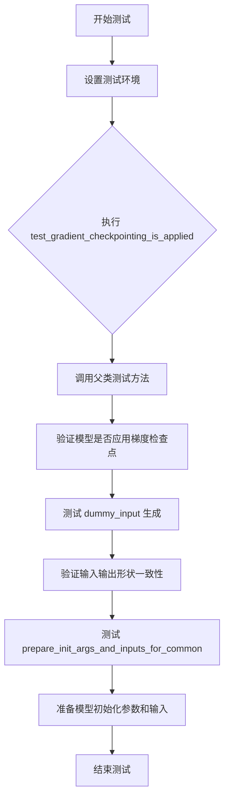
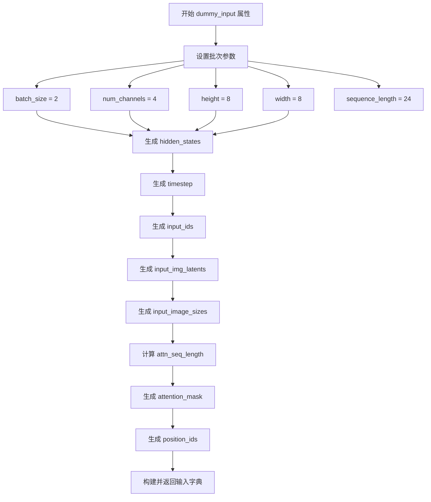
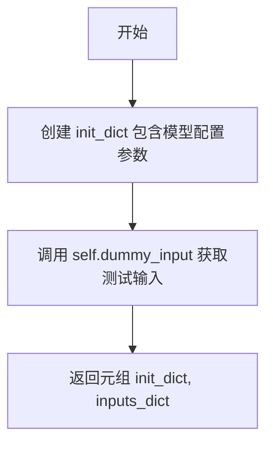

# `diffusers\tests\models\transformers\test_models_transformer_omnigen.py` 详细设计文档

这是一个针对 OmniGenTransformer2DModel 的单元测试文件，继承自 ModelTesterMixin，用于验证 Transformer 模型的各项功能，包括梯度检查点、模型初始化、输入输出形状等核心功能。

## 整体流程



## 类结构

```
unittest.TestCase
└── OmniGenTransformerTests (继承 ModelTesterMixin)
    ├── 类属性
    │   ├── model_class
    │   ├── main_input_name
    │   ├── uses_custom_attn_processor
    │   └── model_split_percents
    ├── 属性方法 (property)
    │   ├── dummy_input
    │   ├── input_shape
    │   └── output_shape
    └── 测试方法
        ├── prepare_init_args_and_inputs_for_common()
        └── test_gradient_checkpointing_is_applied()
```

## 全局变量及字段


### `enable_full_determinism`
    
启用完全确定性测试的函数，确保测试结果可复现

类型：`function`
    


### `torch_device`
    
测试设备标识，指定运行测试的设备（如 'cuda' 或 'cpu'）

类型：`str`
    


### `ModelTesterMixin`
    
模型测试混合类，提供模型通用测试方法和断言

类型：`class`
    


### `OmniGenTransformer2DModel`
    
OmniGen变换器2D模型类，用于图像生成任务

类型：`class`
    


### `OmniGenTransformerTests.model_class`
    
OmniGenTransformer2DModel 类引用，指定要测试的模型类

类型：`Type[OmniGenTransformer2DModel]`
    


### `OmniGenTransformerTests.main_input_name`
    
字符串，主输入名称为 'hidden_states'，标识模型的主要输入张量

类型：`str`
    


### `OmniGenTransformerTests.uses_custom_attn_processor`
    
布尔值，是否使用自定义注意力处理器，指示模型是否使用自定义注意力机制

类型：`bool`
    


### `OmniGenTransformerTests.model_split_percents`
    
列表，模型分割百分比 [0.1, 0.1, 0.1]，用于模型并行测试时的分割比例

类型：`list[float]`
    
    

## 全局函数及方法


### `OmniGenTransformerTests.dummy_input`

该属性方法用于生成虚拟输入字典，模拟 OmniGenTransformer2DModel 所需的各类输入数据，包括隐藏状态、时间步、输入ID、图像潜在向量、图像尺寸、注意力掩码和位置ID，以便进行模型测试。

参数：
- （无参数，作为 `@property` 装饰的属性方法）

返回值：`Dict[str, Union[torch.Tensor, List[torch.Tensor], Dict]]`，返回包含模型测试所需全部输入数据的字典

#### 流程图

```mermaid
flowchart TD
    A[开始] --> B[设置基础参数: batch_size=2, num_channels=4, height=8, width=8, sequence_length=24]
    B --> C[生成 hidden_states: 随机张量 shape: (2, 4, 8, 8)]
    C --> D[生成 timestep: 随机张量 shape: (2,)]
    D --> E[生成 input_ids: 随机整数张量 shape: (2, 24), 值域 0-9]
    E --> F[生成 input_img_latents: 列表包含1个随机张量 shape: (1, 4, 8, 8)]
    F --> G[生成 input_image_sizes: 字典 {0: [[0, 32]]}]
    G --> H[计算 attn_seq_length = 24 + 1 + 16 = 41]
    H --> I[生成 attention_mask: 全1张量 shape: (2, 41, 41)]
    I --> J[生成 position_ids: LongTensor shape: (2, 41), 值 0-40]
    J --> K[组装返回字典]
    K --> L[结束]
```

#### 带注释源码

```python
@property
def dummy_input(self):
    # 基础维度参数设置
    batch_size = 2        # 批次大小
    num_channels = 4      # 通道数
    height = 8            # 高度
    width = 8             # 宽度
    sequence_length = 24  # 序列长度（文本token数量）

    # hidden_states: 模型的主要输入特征
    # shape: (batch_size, num_channels, height, width) = (2, 4, 8, 8)
    hidden_states = torch.randn((batch_size, num_channels, height, width)).to(torch_device)
    
    # timestep: 用于扩散模型的时间步信息
    # shape: (batch_size,) = (2,)
    timestep = torch.rand(size=(batch_size,), dtype=hidden_states.dtype).to(torch_device)
    
    # input_ids: 文本输入的token ID序列
    # shape: (batch_size, sequence_length) = (2, 24), 值为0-9的整数
    input_ids = torch.randint(0, 10, (batch_size, sequence_length)).to(torch_device)
    
    # input_img_latents: 输入图像的潜在表示（VAE编码后的结果）
    # 列表，每个元素 shape: (1, num_channels, height, width) = (1, 4, 8, 8)
    input_img_latents = [torch.randn((1, num_channels, height, width)).to(torch_device)]
    
    # input_image_sizes: 输入图像的尺寸信息
    # 字典格式，键为批次索引，值为图像位置坐标列表
    input_image_sizes = {0: [[0, 0 + height * width // 2 // 2]]}

    # 计算注意力序列长度 = 文本序列 + 1(CLS token) + 图像patch数
    # height * width // 2 // 2 = 8 * 8 // 2 // 2 = 16 (ViT风格的空间patch)
    attn_seq_length = sequence_length + 1 + height * width // 2 // 2
    
    # attention_mask: 注意力掩码矩阵，用于区分有效/无效位置
    # shape: (batch_size, attn_seq_length, attn_seq_length) = (2, 41, 41)
    attention_mask = torch.ones((batch_size, attn_seq_length, attn_seq_length)).to(torch_device)
    
    # position_ids: 位置编码的索引
    # shape: (batch_size, attn_seq_length) = (2, 41), 值为0-40的递增序列
    position_ids = torch.LongTensor([list(range(attn_seq_length))] * batch_size).to(torch_device)

    # 返回包含全部输入的字典，供模型前向传播使用
    return {
        "hidden_states": hidden_states,      # 模型主输入
        "timestep": timestep,                 # 扩散时间步
        "input_ids": input_ids,              # 文本token ID
        "input_img_latents": input_img_latents,  # 图像潜在向量
        "input_image_sizes": input_image_sizes,  # 图像尺寸信息
        "attention_mask": attention_mask,    # 注意力掩码
        "position_ids": position_ids,        # 位置编码索引
    }
```


### `OmniGenTransformerTests.input_shape`

该属性方法用于返回OmniGenTransformer2DModel测试类的输入张量形状，固定返回(4, 8, 8)，其中4表示批量大小，8x8表示输入图像的高度和宽度。

参数：

- `self`：`OmniGenTransformerTests`，隐式参数，指向测试类实例本身

返回值：`tuple`，返回输入张量的形状，值为(4, 8, 8)，其中4为批量大小，8为高度，8为宽度

#### 流程图

```mermaid
flowchart TD
    A[开始] --> B{调用input_shape属性}
    B --> C[返回元组 (4, 8, 8)]
    C --> D[结束]
```

#### 带注释源码

```python
@property
def input_shape(self):
    """
    返回测试模型的输入张量形状。
    
    返回值说明:
        - 4: 批量大小 (batch_size)
        - 8: 输入高度
        - 8: 输入宽度
    
    注意: 此属性为固定值,用于测试目的,代表典型的输入形状配置。
    """
    return (4, 8, 8)
```


### `OmniGenTransformerTests.output_shape`

该属性方法用于返回OmniGenTransformer2DModel模型的预期输出张量形状，形状为(batch_size, height, width)，即(4, 8, 8)。

参数： 无（该方法为属性方法，无参数）

返回值：`Tuple[int, int, int]`，返回模型输出张量的形状 (4, 8, 8)，其中4表示批次大小，8表示高度，8表示宽度。

#### 流程图

```mermaid
flowchart TD
    A[开始] --> B{调用output_shape属性}
    B --> C[返回元组 (4, 8, 8)]
    C --> D[结束]
```

#### 带注释源码

```python
@property
def output_shape(self):
    """
    返回模型的输出张量形状。
    
    该属性定义了OmniGenTransformer2DModel在给定输入下的预期输出维度。
    输出形状为(batch_size, height, width)，其中：
    - batch_size = 4: 表示一次处理4个样本
    - height = 8: 输出高度为8
    - width = 8: 输出宽度为8
    
    Returns:
        tuple: 包含三个整数的元组 (batch_size, height, width)，即 (4, 8, 8)
    """
    return (4, 8, 8)
```


### `prepare_init_args_and_inputs_for_common`

该方法是 OmniGenTransformerTests 测试类的核心初始化方法，用于构建模型配置字典和输入字典，包含模型的隐藏层大小、注意力头数、KV 头数、中间层大小、层数等关键参数，并返回包含 hidden_states、timestep、input_ids、input_img_latents 等的输入字典，供模型测试使用。

参数：

- `self`：OmniGenTransformerTests 类实例本身，无需显式传递

返回值：`Tuple[Dict, Dict]`，返回两个字典组成的元组——第一个 init_dict 包含模型初始化所需的配置参数（如 hidden_size、num_attention_heads、intermediate_size 等），第二个 inputs_dict 包含模型前向传播所需的输入数据（如 hidden_states、timestep、input_ids、attention_mask 等）

#### 流程图

```mermaid
flowchart TD
    A[开始 prepare_init_args_and_inputs_for_common] --> B[构建 init_dict 配置字典]
    B --> B1[设置 hidden_size=16]
    B --> B2[设置 num_attention_heads=4]
    B --> B3[设置 num_key_value_heads=4]
    B --> B4[设置 intermediate_size=32]
    B --> B5[设置 num_layers=20]
    B --> B6[设置 pad_token_id=0]
    B --> B7[设置 vocab_size=1000]
    B --> B8[设置 in_channels=4]
    B --> B9[设置 time_step_dim=4]
    B --> B10[设置 rope_scaling 参数]
    B --> C[调用 self.dummy_input 获取输入字典]
    C --> D[返回 (init_dict, inputs_dict) 元组]
```

#### 带注释源码

```python
def prepare_init_args_and_inputs_for_common(self):
    """
    为通用测试准备模型初始化参数和输入数据。
    
    返回:
        tuple: 包含两个字典的元组
            - init_dict: 模型配置参数字典
            - inputs_dict: 模型输入数据字典
    """
    # 构建模型初始化配置字典，包含 Transformer 模型的核心架构参数
    init_dict = {
        "hidden_size": 16,              # 隐藏层维度，决定模型表示能力
        "num_attention_heads": 4,       # 注意力头的数量
        "num_key_value_heads": 4,        # KV 头的数量，用于 GQA 优化
        "intermediate_size": 32,        # 前馈网络中间层维度
        "num_layers": 20,               # Transformer 层的数量
        "pad_token_id": 0,              # 填充 token 的 ID
        "vocab_size": 1000,             # 词汇表大小
        "in_channels": 4,               # 输入通道数
        "time_step_dim": 4,             # 时间步维度
        # RoPE (Rotary Position Embedding) 缩放配置，用于处理长序列
        "rope_scaling": {
            "long_factor": list(range(1, 3)),   # 长距离位置编码缩放因子
            "short_factor": list(range(1, 3))   # 短距离位置编码缩放因子
        },
    }
    
    # 获取测试用的虚拟输入数据
    # 该数据由 dummy_input 属性生成，包含模型所需的各种输入张量
    inputs_dict = self.dummy_input
    
    # 返回配置字典和输入字典的元组，供测试框架使用
    return init_dict, inputs_dict
```


### `OmniGenTransformerTests.test_gradient_checkpointing_is_applied`

该方法用于验证 `OmniGenTransformer2DModel` 类的梯度检查点（Gradient Checkpointing）功能是否正确应用，通过调用父类的测试方法来确认梯度检查点策略在指定模型上生效。

#### 参数

- `expected_set`：`set`，期望应用梯度检查点的模型类名称集合，此处为 `{"OmniGenTransformer2DModel"}`

#### 返回值

- `None`，该方法无显式返回值，主要通过父类方法执行断言验证

#### 流程图

```mermaid
flowchart TD
    A[开始 test_gradient_checkpointing_is_applied] --> B[定义 expected_set 集合]
    B --> C[设置 expected_set = {'OmniGenTransformer2DModel'}]
    C --> D[调用父类方法 super&#40;&#41;.test_gradient_checkpointing_is_applied]
    D --> E{父类方法执行验证}
    E -->|通过| F[测试通过]
    E -->|失败| G[抛出断言异常]
```

#### 带注释源码

```python
def test_gradient_checkpointing_is_applied(self):
    """
    测试梯度检查点是否被正确应用到模型上。
    
    该测试方法继承自 ModelTesterMixin，通过调用父类的测试方法
    验证指定模型类是否正确启用了梯度检查点功能，以减少显存占用。
    """
    # 定义期望应用梯度检查点的模型类集合
    expected_set = {"OmniGenTransformer2DModel"}
    
    # 调用父类的同名测试方法进行验证
    # 父类方法会检查 expected_set 中的模型类是否启用了 gradient_checkpointing
    super().test_gradient_checkpointing_is_applied(expected_set=expected_set)
```

#### 详细说明

| 项目 | 说明 |
|------|------|
| **所属类** | `OmniGenTransformerTests` |
| **继承关系** | 继承自 `unittest.TestCase` 和 `ModelTesterMixin` |
| **调用链** | 本方法 → 父类 `ModelTesterMixin.test_gradient_checkpointing_is_applied()` |
| **测试目的** | 验证 `OmniGenTransformer2DModel` 模型在训练时正确启用了梯度检查点，以降低显存消耗 |
| **相关配置** | 父类方法通常会检查模型的 `gradient_checkpointing` 属性或配置 |

#### 潜在技术债务

1. **硬编码模型名称**：将 `"OmniGenTransformer2DModel"` 硬编码在测试中，若类名变更需同步修改测试
2. **缺乏参数化能力**：当前只支持单一模型验证，无法批量测试多个模型类的梯度检查点配置


### `OmniGenTransformerTests.dummy_input`

该属性方法用于生成 OmniGenTransformer2DModel 模型测试所需的虚拟输入数据，构造包含隐藏状态、时间步、输入ID、图像潜在向量、图像尺寸、注意力掩码和位置ID的完整测试输入字典。

参数：无（通过 `self` 访问类属性）

返回值：`Dict[str, Any]`，返回包含以下键的字典：
- `hidden_states`：torch.Tensor，形状为 (batch_size, num_channels, height, width)，随机初始化的隐藏状态
- `timestep`：torch.Tensor，形状为 (batch_size,)，随机生成的时间步
- `input_ids`：torch.Tensor，形状为 (batch_size, sequence_length)，整数类型的输入ID
- `input_img_latents`：List[torch.Tensor]，图像潜在向量列表
- `input_image_sizes`：Dict[int, List[List[int]]]，图像尺寸信息
- `attention_mask`：torch.Tensor，形状为 (attn_seq_length, attn_seq_length)，全1注意力掩码
- `position_ids`：torch.Tensor，形状为 (batch_size, attn_seq_length)，位置ID

#### 流程图



#### 带注释源码

```python
@property
def dummy_input(self):
    """生成测试用的虚拟输入数据字典"""
    # 批次级别参数
    batch_size = 2          # 批次大小
    num_channels = 4        # 通道数
    height = 8              # 高度
    width = 8               # 宽度
    sequence_length = 24    # 序列长度

    # 生成随机隐藏状态，形状: (batch_size, num_channels, height, width)
    hidden_states = torch.randn((batch_size, num_channels, height, width)).to(torch_device)
    
    # 生成随机时间步，形状: (batch_size,)，与 hidden_states 数据类型一致
    timestep = torch.rand(size=(batch_size,), dtype=hidden_states.dtype).to(torch_device)
    
    # 生成整数输入ID，范围 [0, 10)，形状: (batch_size, sequence_length)
    input_ids = torch.randint(0, 10, (batch_size, sequence_length)).to(torch_device)
    
    # 生成图像潜在向量列表，每个元素形状: (1, num_channels, height, width)
    input_img_latents = [torch.randn((1, num_channels, height, width)).to(torch_device)]
    
    # 图像尺寸字典，键为批次索引，值为坐标范围列表
    input_image_sizes = {0: [[0, 0 + height * width // 2 // 2]]}

    # 计算注意力序列长度 = 序列长度 + 1 + (高度 * 宽度 / 4)
    attn_seq_length = sequence_length + 1 + height * width // 2 // 2
    
    # 生成全1注意力掩码，形状: (attn_seq_length, attn_seq_length)
    attention_mask = torch.ones((batch_size, attn_seq_length, attn_seq_length)).to(torch_device)
    
    # 生成位置ID，形状: (batch_size, attn_seq_length)，值为 0 到 attn_seq_length-1
    position_ids = torch.LongTensor([list(range(attn_seq_length))] * batch_size).to(torch_device)

    # 返回包含所有测试输入的字典
    return {
        "hidden_states": hidden_states,       # 模型主输入
        "timestep": timestep,                   # 去噪时间步
        "input_ids": input_ids,                 # 文本/条件输入ID
        "input_img_latents": input_img_latents, # 图像潜在向量
        "input_image_sizes": input_image_sizes, # 输入图像尺寸
        "attention_mask": attention_mask,       # 注意力掩码
        "position_ids": position_ids,           # 位置编码ID
    }
```


### `OmniGenTransformerTests.input_shape`

这是一个属性方法，用于返回 OmniGenTransformer2DModel 的输入形状。该属性返回一个元组 (4, 8, 8)，其中 4 表示批量大小，8 表示高度，8 表示宽度。

参数：无参数（property 装饰器定义的无参属性方法）

返回值：`tuple`，返回输入形状元组 (4, 8, 8)，表示模型的预期输入维度

#### 流程图

```mermaid
flowchart TD
    A[调用 input_shape 属性] --> B{属性 getter 被触发}
    B --> C[返回元组 (4, 8, 8)]
    C --> D[调用方获得输入形状]
    
    style B fill:#f9f,color:#333
    style C fill:#9f9,color:#333
```

#### 带注释源码

```python
@property
def input_shape(self):
    """
    返回模型的输入形状。
    
    该属性定义了测试用例中使用的输入张量的预期形状。
    返回值 (4, 8, 8) 表示:
    - 第一个维度 4: 批量大小 (batch_size)
    - 第二个维度 8: 输入高度 (height)
    - 第三个维度 8: 输入宽度 (width)
    
    Returns:
        tuple: 输入形状元组 (batch_size, height, width)，即 (4, 8, 8)
    """
    return (4, 8, 8)
```


### `OmniGenTransformerTests.output_shape`

该属性方法用于返回 OmniGenTransformer2DModel 模型的输出形状，固定返回元组 (4, 8, 8)，表示批量大小为 4，通道数为 8，高度为 8 的四维张量形状。

参数：
- （无参数）

返回值：`tuple`，返回模型输出形状 (4, 8, 8)，其中 4 表示批量大小，8 表示通道数，8 表示特征图的高度和宽度

#### 流程图

```mermaid
flowchart TD
    A[访问 output_shape 属性] --> B{执行 getter 方法}
    B --> C[返回元组 (4, 8, 8)]
    C --> D[调用者获得输出形状]
    
    style A fill:#f9f,stroke:#333
    style C fill:#9f9,stroke:#333
    style D fill:#9ff,stroke:#333
```

#### 带注释源码

```python
@property
def output_shape(self):
    """
    返回模型的输出形状。
    
    该属性定义了在测试用例中期望的模型输出张量维度。
    输出形状为 (4, 8, 8)，对应于：
    - 批量大小 (batch_size): 4
    - 通道数 (num_channels): 8
    - 高度 (height): 8
    - 宽度 (width): 8
    
    Returns:
        tuple: 包含四个整数的元组，固定返回 (4, 8, 8)
    """
    return (4, 8, 8)
```


### OmniGenTransformerTests.prepare_init_args_and_inputs_for_common

准备模型初始化参数和测试输入数据，返回包含模型配置字典和测试输入字典的元组，用于通用测试场景的模型初始化。

参数：

- `self`：`OmniGenTransformerTests`，测试类实例本身，包含模型配置和测试工具方法

返回值：`tuple[dict, dict]`，返回包含初始化参数字典（模型配置）和测试输入字典的元组

#### 流程图



#### 带注释源码

```python
def prepare_init_args_and_inputs_for_common(self):
    """准备模型初始化参数和测试输入，用于通用测试场景"""
    
    # 定义模型初始化参数字典，包含模型架构配置
    init_dict = {
        "hidden_size": 16,           # 隐藏层大小
        "num_attention_heads": 4,    # 注意力头数量
        "num_key_value_heads": 4,    # 键值头数量
        "intermediate_size": 32,     # 中间层大小（FFN）
        "num_layers": 20,            # 层数
        "pad_token_id": 0,           # 填充 token ID
        "vocab_size": 1000,          # 词汇表大小
        "in_channels": 4,            # 输入通道数
        "time_step_dim": 4,          # 时间步维度
        # RoPE 缩放配置，包含长因子和短因子
        "rope_scaling": {"long_factor": list(range(1, 3)), "short_factor": list(range(1, 3))},
    }
    
    # 获取测试输入字典（通过 self.dummy_input 属性）
    # 包含：hidden_states, timestep, input_ids, input_img_latents, 
    # input_image_sizes, attention_mask, position_ids
    inputs_dict = self.dummy_input
    
    # 返回初始化参数字典和测试输入字典的元组
    return init_dict, inputs_dict
```


### `OmniGenTransformerTests.test_gradient_checkpointing_is_applied`

该测试方法用于验证 `OmniGenTransformer2DModel` 模型是否正确应用了梯度检查点（Gradient Checkpointing）技术，以确保在训练过程中通过节省显存来支持更大的模型规模。

参数：

- `self`：测试类实例本身，无需显式传递

返回值：`None`，该方法为测试用例，通过断言验证梯度检查点配置，不返回具体值

#### 流程图

```mermaid
flowchart TD
    A[开始测试] --> B[定义期望集合 expected_set]
    B --> C[设置 expected_set = {'OmniGenTransformer2DModel'}]
    C --> D[调用父类测试方法]
    D --> E[super.test_gradient_checkpointing_is_applied expected_set]
    E --> F{父类方法执行验证}
    F -->|通过| G[测试通过]
    F -->|失败| H[测试失败/抛出异常]
    G --> I[结束]
    H --> I
```

#### 带注释源码

```python
def test_gradient_checkpointing_is_applied(self):
    """
    测试梯度检查点是否被正确应用于模型。
    
    该测试方法继承自 ModelTesterMixin，用于验证模型在配置
    梯度检查点后能够正确保存和恢复梯度检查点状态。
    """
    # 定义期望应用梯度检查点的模型类集合
    # OmniGenTransformer2DModel 是被测试的主模型类
    expected_set = {"OmniGenTransformer2DModel"}
    
    # 调用父类（ModelTesterMixin）的测试方法进行实际验证
    # 父类方法会检查模型是否正确配置了 gradient_checkpointing 属性
    # 并验证前向传播过程中梯度检查点功能是否生效
    super().test_gradient_checkpointing_is_applied(expected_set=expected_set)
```

## 关键组件


### OmniGenTransformer2DModel

被测试的核心模型类，是一个2D变换器模型，用于OmniGen图像生成任务。

### ModelTesterMixin

测试混入类，提供了模型测试的通用功能和方法，包括梯度检查点测试等。

### dummy_input 属性

生成测试用的虚拟输入数据，包含hidden_states、timestep、input_ids、input_img_latents、input_image_sizes、attention_mask和position_ids等关键输入。

### prepare_init_args_and_inputs_for_common 方法

准备模型初始化参数和测试输入的方法，配置了hidden_size、num_attention_heads、num_key_value_heads、intermediate_size、num_layers等模型超参数，以及rope_scaling等位置编码配置。

### test_gradient_checkpointing_is_applied 方法

验证OmniGenTransformer2DModel是否正确应用了梯度检查点优化技术。

### 虚拟输入组件

包括batch_size=2、num_channels=4、height=8、width=8、sequence_length=24的hidden_states张量，timestep向量，input_ids，input_img_latents列表，input_image_sizes字典，以及attention_mask和position_ids张量。

### 模型配置组件

包含hidden_size=16、num_attention_heads=4、num_key_value_heads=4、intermediate_size=32、num_layers=20、vocab_size=1000、in_channels=4、time_step_dim=4等核心配置参数。

### RoPE缩放配置

rope_scaling配置，包含long_factor和short_factor，用于长序列和短序列的位置编码扩展。


## 问题及建议


### 已知问题

-   **测试数据构造不一致**：`input_img_latents` 是长度为 1 的列表（`[torch.randn(...)]`），但 `input_image_sizes` 使用了 `{0: [[0, 0 + height * width // 2 // 2]]}`，这种构造方式缺乏明确的业务逻辑说明，且两者之间的维度关系不清晰。
-   **魔法数字和硬编码**：`attn_seq_length = sequence_length + 1 + height * width // 2 // 2` 中的数字 `1`、`// 2 // 2` 缺乏解释，可读性差，应提取为有意义的常量。
-   **缺少核心功能测试**：该测试类仅重写了 `test_gradient_checkpointing_is_applied` 方法，但没有编写实际的模型前向传播、输出形状验证等核心测试用例，无法验证模型是否正确工作。
-   **模型分割百分比用途不明**：`model_split_percents = [0.1, 0.1, 0.1]` 被定义但未在当前代码中体现其具体用途，可能导致测试行为不明确。
-   **缺乏类型注解**：所有方法参数和返回值都缺少类型注解，不利于代码维护和 IDE 辅助。
-   **测试输入维度耦合**：dummy_input 中的多个参数（sequence_length、height、width、attention_mask、position_ids）相互耦合，修改一个可能需要同步修改其他，增加测试维护成本。

### 优化建议

-   将 `attn_seq_length` 的计算逻辑提取为独立方法或添加详细注释，解释 `+1` 和 `// 2 // 2` 的业务含义。
-   确保 `input_img_latents` 列表长度与 `input_image_sizes` 字典的键范围一致，或通过参数传入以保持灵活性。
-   补充核心功能测试用例，如 `test_forward_pass`、`test_output_shape` 等，验证模型实际输出是否符合预期。
-   若 `model_split_percents` 无实际用途，建议移除以避免代码冗余；否则应添加注释说明其使用场景。
-   为关键方法和属性添加类型注解（如 `-> dict`、`SequenceLength: int` 等），提升代码可读性和可维护性。
-   将测试输入参数的构造逻辑封装为独立方法或工厂类，降低参数间的耦合度。


## 其它


### 设计目标与约束

验证OmniGenTransformer2DModel模型的前向传播、梯度检查点、模型输出形状等核心功能是否符合预期，确保模型在给定输入配置下能够正确运行。

### 错误处理与异常设计

测试类使用unittest框架的断言机制进行错误检测，当模型输出与预期不符时抛出AssertionError。继承的ModelTesterMixin提供了标准化的错误检测流程，包括参数验证、形状检查等。

### 外部依赖与接口契约

- **torch**: 深度学习框架依赖
- **diffusers库**: OmniGenTransformer2DModel来源于此库
- **ModelTesterMixin**: 提供模型测试的标准接口契约，包括test_gradient_checkpointing_is_applied等方法
- **testing_utils**: 提供enable_full_determinism和torch_device工具函数

### 配置与参数说明

测试配置通过prepare_init_args_and_inputs_for_common方法定义核心参数：hidden_size=16, num_attention_heads=4, num_key_value_heads=4, intermediate_size=32, num_layers=20, pad_token_id=0, vocab_size=1000, in_channels=4, time_step_dim=4, rope_scaling配置等。

### 测试覆盖率说明

覆盖范围包括：模型初始化、梯度检查点、前向传播输出形状验证、参数一致性检查等。model_split_percents = [0.1, 0.1, 0.1]定义了模型分割测试比例。

### 性能要求与基准

使用torch_device确定计算设备，通过enable_full_determinism确保测试可复现性，batch_size=2的轻量级配置用于快速验证。

### 版本兼容性说明

依赖Python unittest框架、torch以及diffusers库，需要兼容Apache License 2.0开源协议。

    