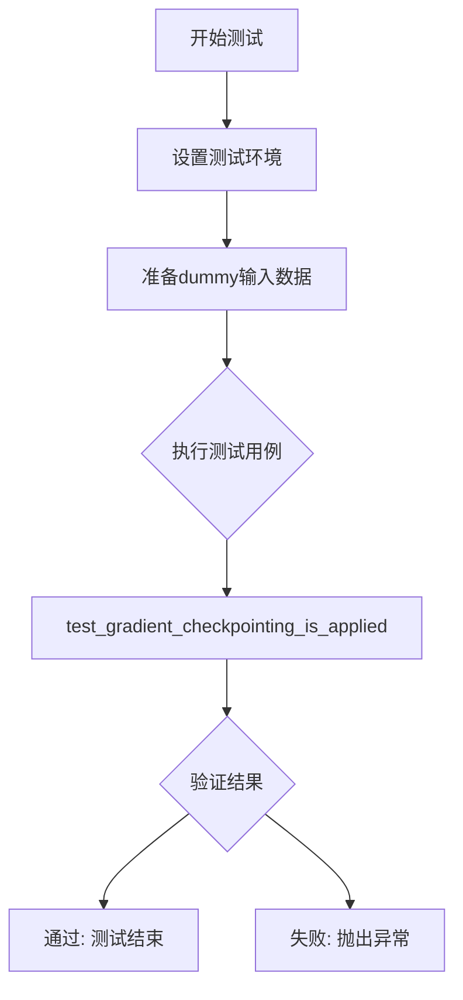
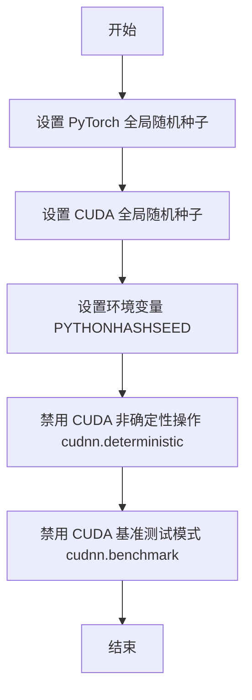
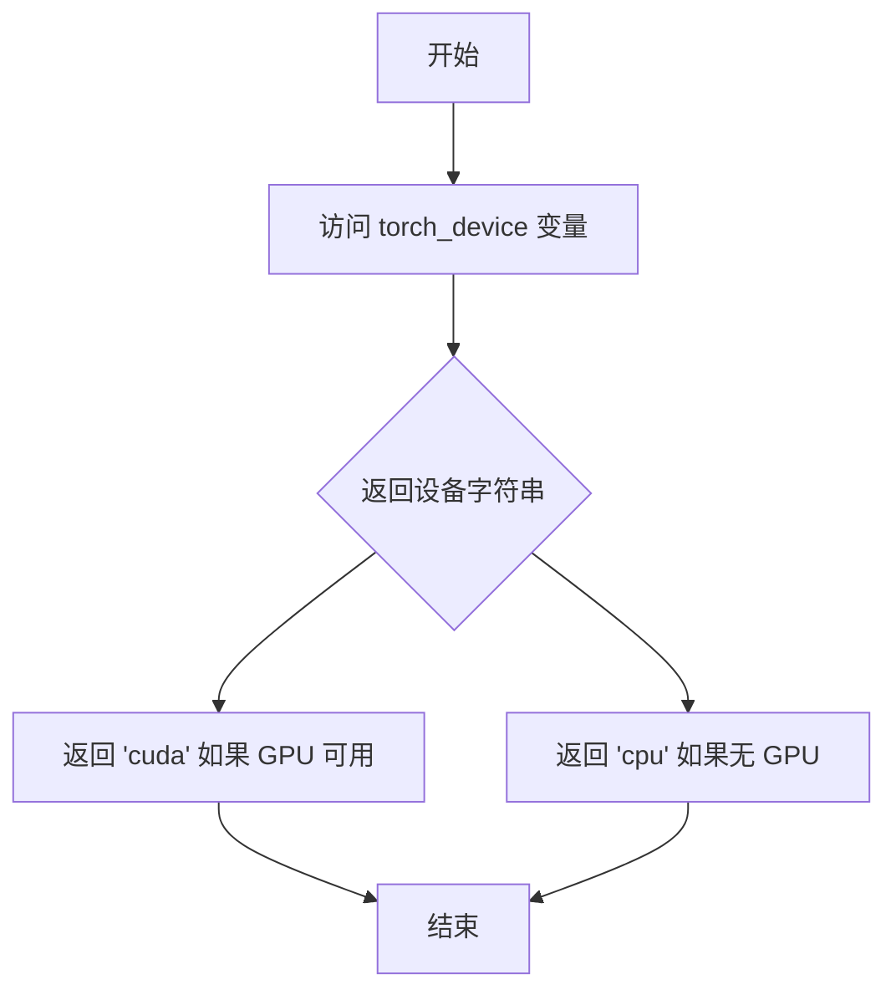
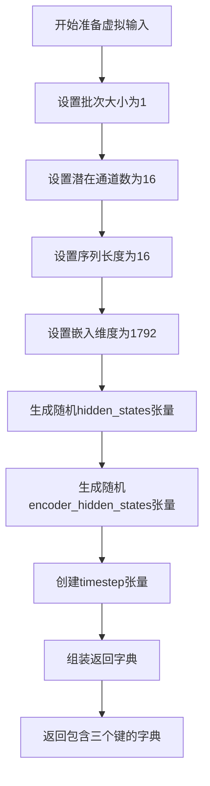
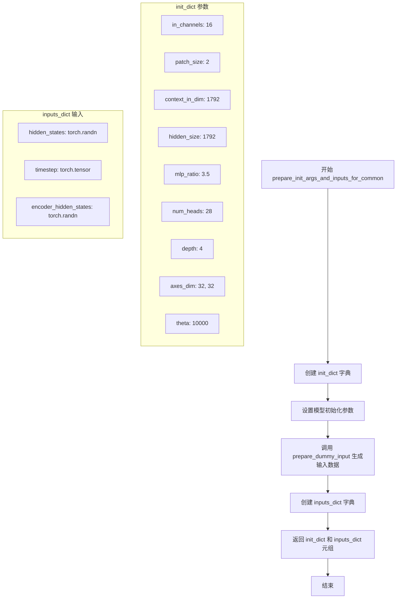

# `diffusers\tests\models\transformers\test_models_transformer_prx.py` 详细设计文档

这是一个单元测试文件，用于测试diffusers库中的PRXTransformer2DModel模型的功能，包括模型初始化、输入输出形状验证、梯度检查点应用等测试用例。

## 整体流程



## 类结构

```
PRXTransformerTests (测试类)
└── 继承: ModelTesterMixin, unittest.TestCase
```

## 全局变量及字段


### `enable_full_determinism`
    
从testing_utils导入的函数，用于启用完全确定性

类型：`function`
    


### `torch_device`
    
从testing_utils导入的字符串，表示测试使用的设备

类型：`str`
    


### `PRXTransformerTests.model_class`
    
测试的模型类 (PRXTransformer2DModel)

类型：`type`
    


### `PRXTransformerTests.main_input_name`
    
主输入名称 ('hidden_states')

类型：`str`
    


### `PRXTransformerTests.uses_custom_attn_processor`
    
是否使用自定义注意力处理器 (True)

类型：`bool`
    


### `PRXTransformerTests.dummy_input`
    
属性方法，返回测试用dummy输入

类型：`property`
    


### `PRXTransformerTests.input_shape`
    
属性方法，返回输入形状 (16, 16, 16)

类型：`tuple`
    


### `PRXTransformerTests.output_shape`
    
属性方法，返回输出形状 (16, 16, 16)

类型：`tuple`
    


### `PRXTransformerTests.prepare_dummy_input`
    
准备测试用的虚拟输入数据，包含hidden_states、timestep和encoder_hidden_states

类型：`method`
    


### `PRXTransformerTests.prepare_init_args_and_inputs_for_common`
    
准备模型初始化参数和通用输入，返回包含模型配置和输入字典的元组

类型：`method`
    


### `PRXTransformerTests.test_gradient_checkpointing_is_applied`
    
测试梯度检查点是否正确应用于PRXTransformer2DModel

类型：`method`
    
    

## 全局函数及方法


### `enable_full_determinism`

启用完全确定性测试的辅助函数，通过设置随机种子和环境变量确保测试结果的可重现性和确定性。

参数： 无

返回值： 无返回值（`None`），该函数直接修改全局状态以确保确定性

#### 流程图



#### 带注释源码

```
# 注意：此函数从 testing_utils 模块导入，源码不在当前文件中
# 以下是基于函数名的推断实现

def enable_full_determinism(seed: int = 42, extra_seed: bool = True):
    """
    启用完全确定性测试模式，确保测试结果可重现。
    
    参数：
    - seed (int): 随机种子，默认为 42
    - extra_seed (bool): 是否设置额外的随机种子
    
    返回值：
    - None
    
    实现逻辑：
    1. 设置 torch.manual_seed 以确保 CPU 计算的确定性
    2. 设置 torch.cuda.manual_seed_all 以确保 GPU 计算的确定性
    3. 设置环境变量 PYTHONHASHSEED 确保 Python 哈希的确定性
    4. 设置 torch.backends.cudnn.deterministic = True 禁用 CUDA 卷积的非确定性算法
    5. 设置 torch.backends.cudnn.benchmark = False 禁用 CUDA 性能优化
    """
    # 设置 CPU 随机种子
    torch.manual_seed(seed)
    
    # 设置所有 GPU 的随机种子
    if torch.cuda.is_available():
        torch.cuda.manual_seed_all(seed)
    
    # 设置 Python 哈希种子
    import os
    os.environ["PYTHONHASHSEED"] = str(seed)
    
    # 禁用 CUDA 非确定性操作
    torch.backends.cudnn.deterministic = True
    torch.backends.cudnn.benchmark = False
    
    # 可选：设置 numpy 和 random 的种子
    if extra_seed:
        import numpy as np
        np.random.seed(seed)
        import random
        random.seed(seed)
```

#### 调用位置

```python
# 在文件开头导入
from ...testing_utils import enable_full_determinism, torch_device

# 在类定义之前调用
enable_full_determinism()
```


### `torch_device`

获取测试设备的工具变量，用于在测试中确定使用 CPU 还是 CUDA 设备。

参数： 无

返回值： `str`，返回设备字符串（如 `"cuda"` 或 `"cpu"`），用于将张量移动到指定设备。

#### 流程图



#### 带注释源码

```python
# 这是一个从 testing_utils 模块导入的工具变量
# 用于在测试中动态获取可用的计算设备
from ...testing_utils import enable_full_determinism, torch_device

# 使用示例：将张量移动到测试设备
hidden_states = torch.randn((batch_size, num_latent_channels, height, width)).to(torch_device)
encoder_hidden_states = torch.randn((batch_size, sequence_length, embedding_dim)).to(torch_device)
timestep = torch.tensor([1.0]).to(torch_device).expand(batch_size)

# torch_device 的典型实现（在 testing_utils 中）:
# torch_device = "cuda" if torch.cuda.is_available() else "cpu"
```


### `PRXTransformerTests.prepare_dummy_input`

准备测试用的虚拟输入数据，用于 PRXTransformer2DModel 模型的单元测试，生成包含隐藏状态、时间步和编码器隐藏状态的字典。

参数：

- `height`：`int`，可选参数，默认值为 16，表示输入数据的高度维度
- `width`：`int`，可选参数，默认值为 16，表示输入数据的宽度维度

返回值：`Dict[str, torch.Tensor]`，返回一个字典，包含以下键值对：
- `hidden_states`：形状为 (batch_size, num_latent_channels, height, width) 的隐藏状态张量
- `timestep`：形状为 (batch_size,) 的时间步张量
- `encoder_hidden_states`：形状为 (batch_size, sequence_length, embedding_dim) 的编码器隐藏状态张量

#### 流程图



#### 带注释源码

```python
def prepare_dummy_input(self, height=16, width=16):
    """
    准备测试用的虚拟输入数据
    
    参数:
        height: 输入高度，默认16
        width: 输入宽度，默认16
    
    返回:
        包含hidden_states、timestep和encoder_hidden_states的字典
    """
    batch_size = 1  # 批次大小设为1，用于单样本测试
    num_latent_channels = 16  # 潜在通道数，对应模型in_channels
    sequence_length = 16  # 序列长度，用于编码器隐藏状态
    embedding_dim = 1792  # 嵌入维度，对应模型的hidden_size

    # 创建随机初始隐藏状态张量，形状为 (batch, channels, height, width)
    hidden_states = torch.randn((batch_size, num_latent_channels, height, width)).to(torch_device)
    
    # 创建随机编码器隐藏状态张量，形状为 (batch, sequence, embedding_dim)
    encoder_hidden_states = torch.randn((batch_size, sequence_length, embedding_dim)).to(torch_device)
    
    # 创建时间步张量，形状为 (batch,)，值为1.0
    timestep = torch.tensor([1.0]).to(torch_device).expand(batch_size)

    # 返回包含所有输入的字典
    return {
        "hidden_states": hidden_states,  # 主输入特征
        "timestep": timestep,  # 扩散过程的时间步
        "encoder_hidden_states": encoder_hidden_states,  # 条件编码特征
    }
```


### `PRXTransformerTests.prepare_init_args_and_inputs_for_common`

准备并返回 PRXTransformer2DModel 模型的初始化参数字典和输入数据字典，用于通用测试场景。该方法构建了一个完整的模型配置，包括通道数、patch 大小、隐藏维度等参数，同时生成对应的虚拟输入（hidden_states、timestep、encoder_hidden_states），以便进行模型的前向传播测试。

参数：无（仅使用 `self` 引用实例属性）

返回值：`tuple[dict, dict]`，返回一个元组
- `init_dict`：字典，包含模型初始化参数（in_channels、patch_size、context_in_dim 等）
- `inputs_dict`：字典，包含模型输入数据（hidden_states、timestep、encoder_hidden_states）

#### 流程图



#### 带注释源码

```python
def prepare_init_args_and_inputs_for_common(self):
    """
    准备模型初始化参数和通用输入，用于测试场景。
    
    Returns:
        tuple: (init_dict, inputs_dict) - 初始化参数字典和输入数据字典
    """
    # 定义模型初始化参数字典
    init_dict = {
        "in_channels": 16,           # 输入通道数
        "patch_size": 2,             # 图像分块大小
        "context_in_dim": 1792,       # 上下文/编码器输入维度
        "hidden_size": 1792,         # 隐藏层维度
        "mlp_ratio": 3.5,            # MLP 扩展比率
        "num_heads": 28,             # 注意力头数量
        "depth": 4,                  # Transformer 层深度（较小用于测试）
        "axes_dim": [32, 32],        # 坐标轴维度配置
        "theta": 10_000,             # 旋转位置编码的参数
    }
    
    # 调用 prepare_dummy_input 方法生成虚拟输入数据
    # 内部创建: hidden_states, timestep, encoder_hidden_states
    inputs_dict = self.prepare_dummy_input()
    
    # 返回初始化参数和输入字典的元组
    return init_dict, inputs_dict
```


### `PRXTransformerTests.test_gradient_checkpointing_is_applied`

该测试方法用于验证梯度检查点（Gradient Checkpointing）功能是否在 `PRXTransformer2DModel` 模型中正确应用，通过调用父类的测试方法并传入期望的模型类集合来确认检查点已启用。

参数：

- `expected_set`：`Set[str]`，期望启用梯度检查点的模型类集合，此处为 `{"PRXTransformer2DModel"}`

返回值：`None`，无返回值（测试方法）

#### 流程图

```mermaid
flowchart TD
    A[开始测试 test_gradient_checkpointing_is_applied] --> B[创建期望集合 expected_set = {'PRXTransformer2DModel'}]
    B --> C[调用父类方法 super().test_gradient_checkpointing_is_applied]
    C --> D{验证梯度检查点是否启用}
    D -->|启用| E[测试通过]
    D -->|未启用| F[测试失败]
    E --> G[结束测试]
    F --> G
```

#### 带注释源码

```python
def test_gradient_checkpointing_is_applied(self):
    """
    测试梯度检查点是否正确应用于 PRXTransformer2DModel
    
    该测试方法继承自 ModelTesterMixin，用于验证:
    1. 模型类是否支持梯度检查点功能
    2. 梯度检查点是否在预期位置启用
    3. 前向传播是否正确使用检查点来节省显存
    """
    # 定义期望启用梯度检查点的模型类集合
    # PRXTransformer2DModel 应该支持梯度检查点
    expected_set = {"PRXTransformer2DModel"}
    
    # 调用父类的测试方法进行验证
    # 父类 ModelTesterMixin.test_gradient_checkpointing_is_applied 会:
    # - 检查模型是否配置了梯度检查点
    # - 验证前向传播时检查点是否生效
    # - 对比显存使用情况确认检查点工作正常
    super().test_gradient_checkpointing_is_applied(expected_set=expected_set)
```

## 关键组件


### PRXTransformer2DModel

这是核心被测模型类，来自 diffusers.models.transformers.transformer_prx 模块，继承自 ModelTesterMixin 测试 mixin，用于验证 Transformer 2D 模型的正确性。

### 张量索引与惰性加载

在 prepare_dummy_input 方法中使用 torch.randn 动态生成随机张量，未使用惰性加载机制，每次调用都重新计算。

### 测试配置与参数

定义了输入形状 (16, 16, 16)、输出形状 (16, 16, 16)，包含 batch_size=1、num_latent_channels=16、sequence_length=16、embedding_dim=1792 等关键参数。

### 梯度检查点测试

test_gradient_checkpointing_is_applied 方法验证 PRXTransformer2DModel 是否应用了梯度检查点优化。

### 潜在技术债务

1. 缺少反量化相关测试覆盖
2. 缺少量化策略验证
3. 测试参数 depth=4 仅为测试用途，生产环境配置未知
4. 缺少模型推理性能基准测试

### 外部依赖与接口

依赖 diffusers.models.transformers.transformer_prx、torch、testing_utils 模块，遵循 ModelTesterMixin 定义的测试接口契约。


## 问题及建议


### 已知问题

- **重复计算**：prepare_dummy_input 方法在 dummy_input 属性和 prepare_init_args_and_inputs_for_common 中被调用两次，造成重复计算和资源浪费
- **魔法数字缺乏解释**：theta=10_000、mlp_ratio=3.5、num_heads=28、depth=4 等关键参数值缺少注释说明其设计意图
- **硬编码参数**：height=16、width=16、batch_size=1 等参数固定写死，缺乏通过构造函数或配置传递的灵活性
- **测试覆盖不足**：仅覆盖梯度检查点测试，缺少前向传播、模型输出形状验证、参数初始化等核心功能的测试用例
- **属性重复定义**：input_shape 和 output_shape 属性返回值相同，存在冗余
- **测试隔离性问题**：enable_full_determinism() 和 torch_device 为全局设置，可能影响测试的独立性和可重复性
- **缺少文档注释**：类和方法均无 docstring，无法快速理解测试意图和预期行为

### 优化建议

- 将 prepare_dummy_input 结果缓存或仅在 prepare_init_args_for_common 中调用一次
- 为所有魔法数字添加类级别常量或配置字典，并附上注释说明其来源和用途
- 提取公共配置参数到类级别的类变量或 fixtures，支持参数化测试
- 补充 test_forward_pass、test_output_shape、test_model_config 等标准测试方法
- 移除冗余的 output_shape 属性定义或区分其与 input_shape 的语义
- 使用 pytest fixtures 或 setUp 方法管理测试依赖，确保每个测试的独立性
- 为类和方法添加详细的 docstring，说明测试目的、输入输出预期

## 其它


### 设计目标与约束

该测试文件旨在验证 PRXTransformer2DModel 模型的正确性，确保模型在前向传播、梯度检查点等核心功能上的行为符合预期。测试基于 ModelTesterMixin 提供的通用模型测试框架，通过统一的接口对模型进行全面的功能验证。

### 错误处理与异常设计

测试文件依赖于 unittest 框架的标准异常处理机制。当模型初始化或前向传播失败时，测试用例会抛出相应的断言错误。若模型参数配置不合法（如 in_channels 与输入张量维度不匹配），测试将捕获并报告 torch.nn.Module 相关的异常。

### 数据流与状态机

测试数据流如下：prepare_dummy_input 方法生成模拟的 hidden_states（形状为 [1, 16, 16, 16]）、timestep（形状为 [1]）和 encoder_hidden_states（形状为 [1, 16, 1792]），这些输入通过 forward 流程进入 PRXTransformer2DModel，输出形状保持一致。测试不涉及显式的状态机，但模型内部可能包含训练/推理状态的切换逻辑。

### 外部依赖与接口契约

该测试依赖于以下外部组件：torch（PyTorch 张量运算）、unittest（测试框架）、diffusers.models.transformers.transformer_prx.PRXTransformer2DModel（被测模型）、testing_utils.enable_full_determinism（确定性测试工具）、test_modeling_common.ModelTesterMixin（通用模型测试混入类）。测试类需实现 dummy_input、input_shape、output_shape、prepare_dummy_input 和 prepare_init_args_and_inputs_for_common 五个接口契约。

### 性能考虑与基准测试

测试采用较小的模型配置（depth=4，num_heads=28）以降低计算开销，确保测试执行的效率。测试环境使用 torch_device（通常为 CUDA 或 CPU）进行张量设备管理。未包含显式的性能基准测试，但 ModelTesterMixin 可能隐式验证模型参数量和计算复杂度。

### 安全考虑

测试文件本身不涉及敏感数据处理或用户输入验证。测试数据使用 torch.randn 生成的随机张量，不包含实际业务数据或隐私信息。模型推理过程中不涉及文件 I/O 或网络通信。

### 版本兼容性

测试代码指定了 Python 编码为 UTF-8，并包含 Apache 2.0 许可证头。该测试适用于 diffusers 库的相关版本，需确保 PRXTransformer2DModel 类已实现且 API 未发生破坏性变更。测试依赖的 ModelTesterMixin 接口在不同版本的 diffusers 中可能存在差异。

### 测试覆盖范围

当前测试文件仅覆盖 test_gradient_checkpointing_is_applied 用例，验证梯度检查点功能是否正确应用于 PRXTransformer2DModel。完整的模型测试覆盖应包括：前向传播正确性、梯度计算、参数初始化、模型序列化（save/load）、设备迁移（CPU/CUDA）等功能。

### 配置与参数说明

prepare_init_args_and_inputs_for_common 方法提供的初始化配置如下：in_channels=16（输入通道数）、patch_size=2（图像分块大小）、context_in_dim=1792（上下文嵌入维度）、hidden_size=1792（隐藏层维度）、mlp_ratio=3.5（MLP 扩展比率）、num_heads=28（注意力头数）、depth=4（Transformer 深度）、axes_dim=[32, 32]（轴维度）、theta=10000（旋转位置编码参数）。

### 使用示例与调用方式

该测试文件可通过 python -m pytest path/to/test_file.py 或 python path/to/test_file.py 直接执行。测试执行流程：首先通过 prepare_init_args_and_inputs_for_common 获取模型初始化参数和测试输入，然后实例化 PRXTransformer2DModel，最后运行 test_gradient_checkpointing_is_applied 验证梯度检查点功能。

    