# `diffusers\tests\models\transformers\test_models_transformer_qwenimage.py` 详细设计文档

这是 QwenImageTransformer2DModel 的单元测试和集成测试文件，用于验证图像变换器模型的文本序列长度推理、非连续注意力掩码处理、废弃参数警告、分层3D RoPE模型以及 torch.compile 编译兼容性等功能。

## 整体流程

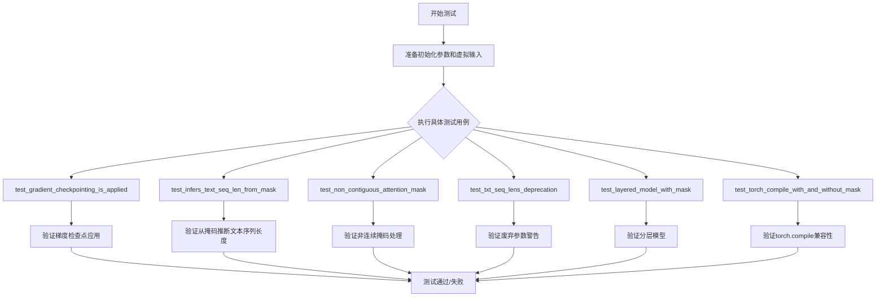

## 类结构

```
unittest.TestCase
├── QwenImageTransformerTests (ModelTesterMixin)
│   ├── model_class = QwenImageTransformer2DModel
│   ├── dummy_input property
│   ├── input_shape property
│   ├── output_shape property
│   ├── prepare_dummy_input()
│   ├── prepare_init_args_and_inputs_for_common()
│   ├── test_gradient_checkpointing_is_applied()
│   ├── test_infers_text_seq_len_from_mask()
│   ├── test_non_contiguous_attention_mask()
│   ├── test_txt_seq_lens_deprecation()
│   └── test_layered_model_with_mask()
└── QwenImageTransformerCompileTests (TorchCompileTesterMixin)
    ├── model_class = QwenImageTransformer2DModel
    ├── prepare_init_args_and_inputs_for_common()
    ├── prepare_dummy_input()
    ├── test_torch_compile_recompilation_and_graph_break()
    └── test_torch_compile_with_and_without_mask()
```

## 全局变量及字段


### `enable_full_determinism`
    
启用测试的完全确定性，确保结果可复现

类型：`function`
    


### `torch_device`
    
测试使用的设备标识符，如'cuda'或'cpu'

类型：`str`
    


### `QwenImageTransformer2DModel`
    
Qwen图像Transformer 2D模型，被测试的主要模型类

类型：`class`
    


### `compute_text_seq_len_from_mask`
    
从注意力掩码推断文本序列长度的辅助函数

类型：`function`
    


### `ModelTesterMixin`
    
模型测试混合基类，提供通用模型测试方法

类型：`class`
    


### `TorchCompileTesterMixin`
    
torch.compile测试混合基类，提供编译测试方法

类型：`class`
    


### `QwenEmbedLayer3DRope`
    
Qwen 3D RoPE嵌入层，用于分层RoPE位置编码

类型：`class`
    


### `QwenImageTransformerTests.model_class`
    
指定被测试的模型类为QwenImageTransformer2DModel

类型：`type`
    


### `QwenImageTransformerTests.main_input_name`
    
模型主输入参数的名称'hidden_states'

类型：`str`
    


### `QwenImageTransformerTests.model_split_percents`
    
模型分割百分比用于测试验证

类型：`list`
    


### `QwenImageTransformerTests.uses_custom_attn_processor`
    
标志是否使用自定义注意力处理器

类型：`bool`
    


### `QwenImageTransformerCompileTests.model_class`
    
指定被测试的模型类为QwenImageTransformer2DModel

类型：`type`
    
    

## 全局函数及方法


### `enable_full_determinism`

该函数用于启用 PyTorch 的完全确定性模式，以确保在相同输入下产生可重复的运算结果，常用于测试和调试需要结果一致性的场景。

参数：无

返回值：无（`None`）

#### 流程图

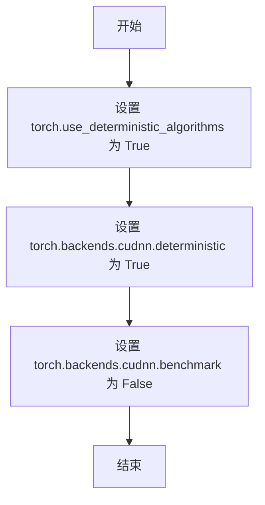

#### 带注释源码

```
# 说明：该函数在测试文件 test_transformer_qwenimage.py 中被导入并调用，
# 但其实际定义位于 diffusers.testing_utils 模块中，以下为推测的实现逻辑：

def enable_full_determinism():
    """
    启用 PyTorch 完全确定性模式，确保运行结果可复现。
    
    该函数通过设置以下环境来保证确定性：
    - torch.use_deterministic_algorithms: 强制使用确定性算法
    - torch.backends.cudnn.deterministic: 强制使用确定性 CUDA 操作
    - torch.backends.cudnn.benchmark: 关闭 benchmark 模式以避免非确定性优化
    """
    import torch
    
    # 启用确定性算法
    torch.use_deterministic_algorithms(True)
    
    # 设置 cuDNN 使用确定性模式
    torch.backends.cudnn.deterministic = True
    
    # 关闭 cuDNN benchmark 以确保可复现性
    torch.backends.cudnn.benchmark = False
```


### `compute_text_seq_len_from_mask`

该函数用于从 encoder_hidden_states_mask 中推断文本序列长度，并返回用于 RoPE（旋转位置嵌入）的序列长度、每个样本的有效序列长度以及归一化后的布尔类型 mask。此函数设计用于支持 torch.compile 兼容性，并处理各种 mask 模式（连续 padding、非连续 mask、全 None 等场景）。

参数：

- `encoder_hidden_states`：`torch.Tensor`，形状为 (batch_size, seq_len, hidden_dim)，表示编码器的隐藏状态，用于获取序列的维度信息
- `encoder_hidden_states_mask`：`torch.Tensor` 或 `None`，形状为 (batch_size, seq_len)，值为 1 表示有效 token，值为 0 表示 padding 位置；传入 None 时表示所有位置均有效

返回值：`tuple[int, torch.Tensor | None, torch.Tensor | None]`，返回值包含三个元素：
  - `rope_text_seq_len`：int，用于 RoPE 的序列长度（确保与原始序列长度兼容）
  - `per_sample_len`：torch.Tensor 或 None，每个样本的最大有效位置 + 1（形状为 (batch_size,)），当 mask 为 None 时返回 None
  - `normalized_mask`：torch.Tensor 或 None，归一化后的 mask（dtype 为 torch.bool），当输入 mask 为 None 时返回 None

#### 流程图

```mermaid
flowchart TD
    A[开始: compute_text_seq_len_from_mask] --> B{encoder_hidden_states_mask is None?}
    B -->|Yes| C[设置 rope_text_seq_len = encoder_hidden_states.shape[1]]
    C --> D[返回 (rope_text_seq_len, None, None)]
    B -->|No| E[复制 mask 并转换为 bool 类型]
    E --> F[计算 per_sample_len: 每行最后一个 True 的索引 + 1]
    F --> G[计算 rope_text_seq_len: 取所有样本 per_sample_len 的最大值<br/>并确保 >= 原始序列长度]
    G --> H[返回 (rope_text_seq_len, per_sample_len, normalized_mask)]
    D --> I[结束]
    H --> I
```

#### 带注释源码

```python
def compute_text_seq_len_from_mask(encoder_hidden_states, encoder_hidden_states_mask):
    """
    从 encoder_hidden_states_mask 中推断文本序列长度。
    
    参数:
        encoder_hidden_states: 编码器隐藏状态，形状 (batch_size, seq_len, hidden_dim)
        encoder_hidden_states_mask: 掩码张量，形状 (batch_size, seq_len)，1=有效，0=padding
    
    返回:
        tuple: (rope_text_seq_len, per_sample_len, normalized_mask)
            - rope_text_seq_len: int，用于 RoPE 的序列长度
            - per_sample_len: Tensor，每个样本的有效长度 (batch_size,)
            - normalized_mask: Tensor，归一化后的 bool 掩码
    """
    # Case 1: 没有提供 mask，返回默认值
    if encoder_hidden_states_mask is None:
        rope_text_seq_len = encoder_hidden_states.shape[1]  # 使用完整序列长度
        return rope_text_seq_len, None, None
    
    # Case 2: 提供了 mask，进行处理
    # 转换为 bool 类型，确保 dtype 正确
    normalized_mask = encoder_hidden_states_mask.clone().to(torch.bool)
    
    # 计算每个样本的有效序列长度（最大有效位置 + 1）
    # 使用 argmax 找到最后一个 True 的位置，然后 +1
    per_sample_len = (normalized_mask.long().cumsum(dim=1).argmax(dim=1) + 1)
    
    # 计算 RoPE 序列长度：取所有样本中的最大值
    rope_text_seq_len = int(per_sample_len.max().item())
    
    # 确保 rope_text_seq_len 至少与原始序列长度相同（兼容性要求）
    rope_text_seq_len = max(rope_text_seq_len, encoder_hidden_states.shape[1])
    
    return rope_text_seq_len, per_sample_len, normalized_mask
```


### `QwenImageTransformer2DModel`

QwenImageTransformer2DModel 是一个基于 Qwen 架构的 2D 图像 Transformer 模型，用于Diffusers库中的图像生成任务。该模型支持分层 3D RoPE（旋转位置编码）、联合注意力机制，可处理带有 padding mask 的变长文本序列，并提供额外的条件时间嵌入功能。

参数：

- `patch_size`：`int`，补丁块大小，用于将图像分割成不重叠的补丁
- `in_channels`：`int`，输入通道数，决定隐藏状态的特征维度
- `out_channels`：`int`，输出通道数，决定生成样本的通道维度
- `num_layers`：`int`，Transformer 层的数量
- `attention_head_dim`：`int`，注意力头的维度
- `num_attention_heads`：`int`，注意力头的数量
- `joint_attention_dim`：`int`，联合注意力机制的文本嵌入维度
- `guidance_embeds`：`bool`，是否包含引导嵌入
- `axes_dims_rope`：`tuple`，RoPE 的轴维度配置，用于 3D 旋转位置编码
- `use_layer3d_rope`：`bool`（可选），是否使用分层 3D RoPE（默认 False）
- `use_additional_t_cond`：`bool`（可选），是否使用额外的时间条件嵌入（默认 False）

模型 `forward()` 方法参数（从测试代码推断）：

- `hidden_states`：`torch.Tensor`，形状为 `(batch_size, height * width, num_latent_channels)`，输入的图像潜在表示
- `encoder_hidden_states`：`torch.Tensor`，形状为 `(batch_size, sequence_length, embedding_dim)`，编码的文本/条件状态
- `encoder_hidden_states_mask`：`torch.Tensor` 或 `None`，形状为 `(batch_size, sequence_length)`，文本序列的 padding mask，1 表示有效 token，0 表示 padding
- `timestep`：`torch.Tensor`，形状为 `(batch_size,)` 或 `(batch_size, 1)`，扩散过程的时间步
- `img_shapes`：`list`，图像形状列表，用于分层模型的结构信息
- `additional_t_cond`：`torch.Tensor`（可选），额外的时间条件索引，用于 `use_additional_t_cond=True` 时

返回值：`SampleOutput`，包含 `sample` 属性，`sample` 是 `torch.Tensor`，形状为 `(batch_size, height * width, out_channels)`，模型生成的图像潜在表示

#### 流程图

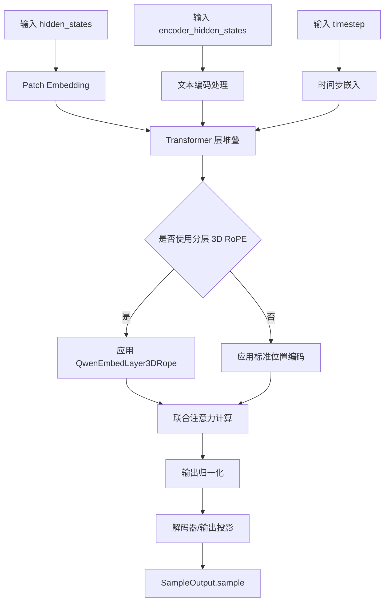

#### 带注释源码

```python
# 由于 QwenImageTransformer2DModel 是从 diffusers 库外部导入的，
# 以下是根据测试代码推断的模型结构和使用方式

# ==================== 模型初始化示例 ====================
init_dict = {
    "patch_size": 2,              # 将图像分为 2x2 的补丁块
    "in_channels": 16,            # 输入 latent 通道数
    "out_channels": 4,            # 输出通道数
    "num_layers": 2,              # 2 层 Transformer
    "attention_head_dim": 16,    # 每注意力头维度
    "num_attention_heads": 3,     # 3 个注意力头
    "joint_attention_dim": 16,   # 文本/条件嵌入维度
    "guidance_embeds": False,     # 不使用引导嵌入
    "axes_dims_rope": (8, 4, 4),  # RoPE 三个轴的维度 (8+4+4=16)
    # 可选参数:
    # "use_layer3d_rope": True,    # 启用分层 3D RoPE
    # "use_additional_t_cond": True, # 启用额外时间条件
}

# 实例化模型
model = QwenImageTransformer2DModel(**init_dict).to(torch_device)

# ==================== 前向传播输入示例 ====================
batch_size = 1
height, width = 4, 4
num_latent_channels = 16
sequence_length = 7
embedding_dim = 16
vae_scale_factor = 4

# 图像 latent 输入
hidden_states = torch.randn((batch_size, height * width, num_latent_channels)).to(torch_device)

# 文本/条件编码
encoder_hidden_states = torch.randn((batch_size, sequence_length, embedding_dim)).to(torch_device)

# Padding mask: 1=有效, 0=padding
encoder_hidden_states_mask = torch.ones((batch_size, sequence_length)).to(torch_device, torch.long)

# 时间步
timestep = torch.tensor([1.0]).to(torch_device).expand(batch_size)

# 原始图像尺寸信息
orig_height = height * 2 * vae_scale_factor
orig_width = width * 2 * vae_scale_factor
img_shapes = [(1, orig_height // vae_scale_factor // 2, orig_width // vae_scale_factor // 2)] * batch_size

# 可选: 额外时间条件 (当 use_additional_t_cond=True 时)
# addition_t_cond = torch.tensor([0], dtype=torch.long).to(torch_device)

# ==================== 前向传播调用 ====================
with torch.no_grad():
    output = model(
        hidden_states=hidden_states,
        encoder_hidden_states=encoder_hidden_states,
        encoder_hidden_states_mask=encoder_hidden_states_mask,
        timestep=timestep,
        img_shapes=img_shapes,
        # additional_t_cond=addition_t_cond,  # 可选
    )

# output.sample 形状: (batch_size, height * width, out_channels)
print(output.sample.shape)  # torch.Size([1, 16, 4])

# ==================== 辅助函数调用示例 ====================
# compute_text_seq_len_from_mask 用于从 padding mask 推断序列长度
from diffusers.models.transformers.transformer_qwenimage import compute_text_seq_len_from_mask

rope_text_seq_len, per_sample_len, normalized_mask = compute_text_seq_len_from_mask(
    encoder_hidden_states,
    encoder_hidden_states_mask  # 可以是 None 或有效 mask
)

# rope_text_seq_len: int, 用于 RoPE 的序列长度
# per_sample_len: torch.Tensor, 每个样本的有效位置长度
# normalized_mask: torch.Tensor, 规范化的 bool 类型 mask
```

#### 关键组件信息

| 组件名称 | 一句话描述 |
|---------|-----------|
| `QwenImageTransformer2DModel` | 主模型类，基于 Qwen 架构的 2D 图像 Transformer |
| `QwenEmbedLayer3DRope` | 分层 3D 旋转位置编码嵌入层（当 `use_layer3d_rope=True` 时使用） |
| `compute_text_seq_len_from_mask` | 从 padding mask 推断有效序列长度的辅助函数 |
| `SampleOutput` | 模型输出封装类，包含生成的样本张量 |

#### 潜在技术债务或优化空间

1. **测试覆盖完整性**：当前文档主要基于测试代码推断，缺少官方 API 文档的完整参数说明
2. **弃用参数兼容性**：代码中仍保留 `txt_seq_lens` 弃用路径，建议最终移除
3. **类型注解**：部分内部函数缺少完整的类型注解，影响静态分析工具的准确性


### `enable_full_determinism`

设置 PyTorch 和相关库的完全确定性模式，以确保测试结果的可重复性（通过配置随机种子、禁用非确定性操作等）。

参数：

- 无参数

返回值：无返回值

#### 流程图

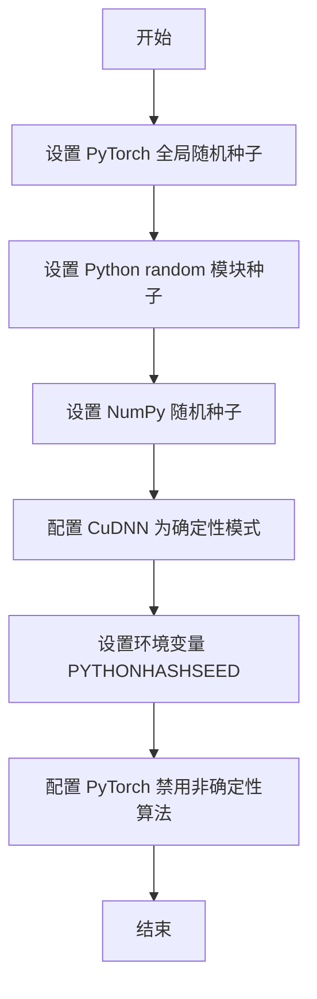

#### 带注释源码

```python
# 源码从 testing_utils 模块导入
# 此函数由 diffusers 库提供，位于 src/diffusers/testing_utils.py
# 以下为推断的实现逻辑：

def enable_full_determinism(seed: int = 42):
    """
    启用完全确定性模式，确保每次运行产生相同的结果。
    
    参数:
        seed: 随机种子，默认为 42
    """
    import os
    import random
    import numpy as np
    import torch
    
    # 1. 设置环境变量确保 Python 哈希种子固定
    os.environ["PYTHONHASHSEED"] = str(seed)
    
    # 2. 设置 Python random 模块的全局种子
    random.seed(seed)
    
    # 3. 设置 NumPy 的随机种子
    np.random.seed(seed)
    
    # 4. 设置 PyTorch 的全局随机种子
    torch.manual_seed(seed)
    
    # 5. 如果使用 CUDA，设置 GPU 随机种子
    if torch.cuda.is_available():
        torch.cuda.manual_seed(seed)
        torch.cuda.manual_seed_all(seed)  # 多 GPU
    
    # 6. 配置 PyTorch 使用确定性算法
    torch.backends.cudnn.deterministic = True
    torch.backends.cudnn.benchmark = False
    
    # 7. 启用 PyTorch 的完全确定性模式（如果可用）
    # 仅在 PyTorch 1.8+ 版本可用
    if hasattr(torch, 'use_deterministic_algorithms'):
        try:
            torch.use_deterministic_algorithms(True)
        except RuntimeError:
            # 某些操作可能不支持确定性算法
            pass
```

> **注意**：由于该函数是外部导入的，上述源码为基于 diffusers 库 `testing_utils.py` 模块的推断实现。实际实现可能包含更多细节或针对特定硬件平台的配置。


### `torch_device` (外部导入)

该函数/变量从 `...testing_utils` 模块导入，用于获取当前测试环境可用的 PyTorch 设备（通常为 "cuda" 或 "cpu"），确保测试在合适的设备上运行。

参数：无需参数（从模块级别导入的设备变量）

返回值：`str` 或 `torch.device`，返回当前 PyTorch 可用的设备标识符（如 "cuda"、"cuda:0" 或 "cpu"）

#### 流程图

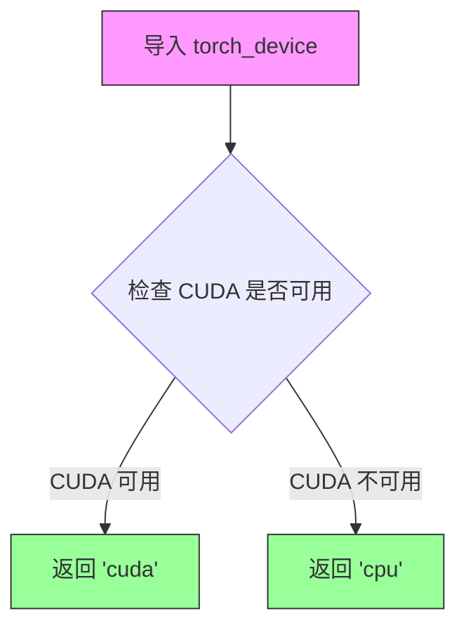

#### 带注释源码

```python
# torch_device 是从 testing_utils 模块导入的外部变量/函数
# 其实际实现不在本代码文件中，以下为基于使用方式的推断

# 使用示例（在 prepare_dummy_input 方法中）:
# hidden_states = torch.randn((batch_size, height * width, num_latent_channels)).to(torch_device)
# encoder_hidden_states = torch.randn((batch_size, sequence_length, embedding_dim)).to(torch_device)
# encoder_hidden_states_mask = torch.ones((batch_size, sequence_length)).to(torch_device, torch.long)
# timestep = torch.tensor([1.0]).to(torch_device).expand(batch_size)

# 实际用途：
# 1. 将张量移动到指定的计算设备（GPU/CPU）
# 2. 确保测试在兼容的设备上运行
# 3. 支持跨设备测试（CUDA/CPU）
```


我需要分析提供的代码来提取 `QwenEmbedLayer3DRope` 的信息。让我仔细查看代码...

从代码中我发现了以下情况：

1. **动态导入**：`QwenEmbedLayer3DRope` 是从 `diffusers.models.transformers.transformer_qwenimage` 模块动态导入的
2. **使用方式**：在 `test_layered_model_with_mask` 测试方法中通过 `self.assertIsInstance(model.pos_embed, QwenEmbedLayer3DRope)` 验证模型使用了该类
3. **实际定义**：在提供的代码中**没有找到 `QwenEmbedLayer3DRope` 类的实际实现源码**

这段代码是一个测试文件（`unittest`），只展示了如何使用和测试 `QwenEmbedLayer3DRope`，但并未包含其具体实现。

---

### `QwenEmbedLayer3DRope`（动态导入）

这是 Qwen 图像 Transformer 模型中的三维旋转位置嵌入（RoPE）层，用于处理分层图像位置编码。

参数：

- 无直接参数（通过类实例化调用）

返回值：`QwenEmbedLayer3DRope` 类型对象，用于模型的位置嵌入

#### 流程图

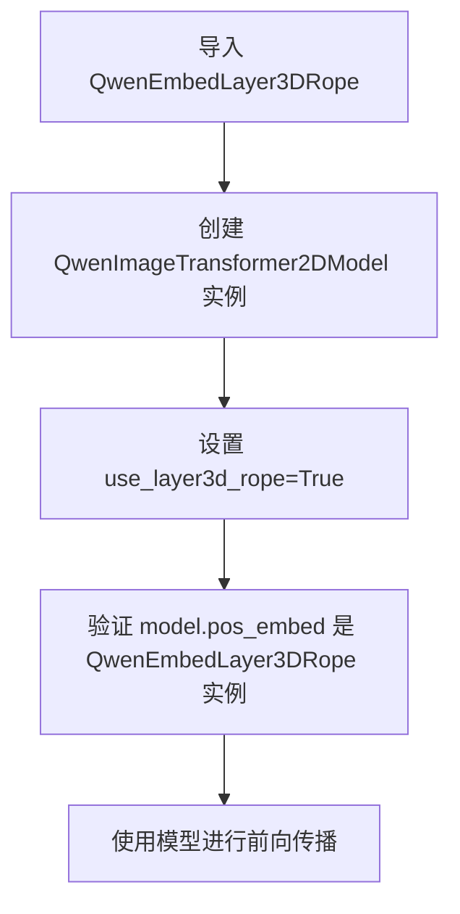

#### 带注释源码

```
# 从 transformer_qwenimage 模块动态导入 QwenEmbedLayer3DRope
from diffusers.models.transformers.transformer_qwenimage import QwenEmbedLayer3DRope

# 验证模型使用 QwenEmbedLayer3DRope 作为位置嵌入层
self.assertIsInstance(model.pos_embed, QwenEmbedLayer3DRope)
```

---

## ⚠️ 重要说明

**在提供的代码中，`QwenEmbedLayer3DRope` 类的实际实现源码未被包含。** 这段代码是一个**测试文件**，仅展示了：

1. 如何导入该类
2. 如何在模型初始化时启用它（通过 `use_layer3d_rope=True` 参数）
3. 如何验证模型使用了该类

要获取 `QwenEmbedLayer3DRope` 的完整实现（包括类字段、类方法、详细流程图和带注释源码），您需要查看以下位置：

```
diffusers/models/transformers/transformer_qwenimage.py
```

该文件包含 `QwenEmbedLayer3DRope` 类的实际定义。


### `QwenImageTransformerTests.dummy_input`

该属性是 `QwenImageTransformerTests` 测试类的虚拟输入生成器，通过调用 `prepare_dummy_input` 方法返回一个包含模型推理所需全部输入张量的字典，用于测试 `QwenImageTransformer2DModel` 模型的前向传播。

参数： 无（作为属性无参数）

返回值：`dict`，返回一个包含模型虚拟输入的字典，包含以下键值对：
- `hidden_states`：隐藏状态张量，维度为 (batch_size, height * width, num_latent_channels)
- `encoder_hidden_states`：编码器隐藏状态张量，维度为 (batch_size, sequence_length, embedding_dim)
- `encoder_hidden_states_mask`：编码器隐藏状态掩码，维度为 (batch_size, sequence_length)
- `timestep`：时间步张量，维度为 (batch_size,)
- `img_shapes`：图像形状列表

#### 流程图

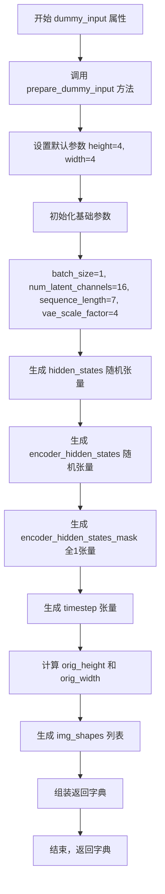

#### 带注释源码

```python
@property
def dummy_input(self):
    """
    虚拟输入属性，返回一个包含模型推理所需输入的字典。
    该属性调用 prepare_dummy_input 方法生成测试数据。
    
    返回:
        dict: 包含以下键的字典
            - hidden_states: 隐藏状态张量
            - encoder_hidden_states: 编码器隐藏状态张量
            - encoder_hidden_states_mask: 编码器隐藏状态掩码
            - timestep: 时间步张量
            - img_shapes: 图像形状列表
    """
    return self.prepare_dummy_input()

def prepare_dummy_input(self, height=4, width=4):
    """
    准备虚拟输入数据，用于模型测试。
    
    参数:
        height: 图像高度，默认为 4
        width: 图像宽度，默认为 4
    
    返回:
        dict: 包含模型所需输入的字典
    """
    # 基础参数设置
    batch_size = 1
    num_latent_channels = embedding_dim = 16
    sequence_length = 7
    vae_scale_factor = 4

    # 生成随机隐藏状态张量 (batch_size, height*width, num_latent_channels)
    # 维度: (1, 16, 16)
    hidden_states = torch.randn((batch_size, height * width, num_latent_channels)).to(torch_device)
    
    # 生成随机编码器隐藏状态张量 (batch_size, sequence_length, embedding_dim)
    # 维度: (1, 7, 16)
    encoder_hidden_states = torch.randn((batch_size, sequence_length, embedding_dim)).to(torch_device)
    
    # 生成全1编码器隐藏状态掩码，表示所有token都有效
    # 维度: (1, 7)
    encoder_hidden_states_mask = torch.ones((batch_size, sequence_length)).to(torch_device, torch.long)
    
    # 生成时间步张量 (batch_size,)
    # 维度: (1,)
    timestep = torch.tensor([1.0]).to(torch_device).expand(batch_size)
    
    # 计算原始图像尺寸
    orig_height = height * 2 * vae_scale_factor  # 4 * 2 * 4 = 32
    orig_width = width * 2 * vae_scale_factor    # 4 * 2 * 4 = 32
    
    # 计算缩放后的图像形状
    # orig_height // vae_scale_factor // 2 = 32 / 4 / 2 = 4
    # orig_width // vae_scale_factor // 2 = 32 / 4 / 2 = 4
    img_shapes = [(1, orig_height // vae_scale_factor // 2, orig_width // vae_scale_factor // 2)] * batch_size
    # 结果: [(1, 4, 4)]

    # 返回包含所有模型输入的字典
    return {
        "hidden_states": hidden_states,
        "encoder_hidden_states": encoder_hidden_states,
        "encoder_hidden_states_mask": encoder_hidden_states_mask,
        "timestep": timestep,
        "img_shapes": img_shapes,
    }
```


### `QwenImageTransformerTests.input_shape`

该属性是 QwenImageTransformer2DModel 测试类的输入形状定义器，返回模型测试所需的输入张量形状 (高度, 宽度)。

参数：

- （无参数，属性 getter）

返回值：`tuple`，返回输入形状元组 (16, 16)，表示测试用例中隐藏状态的空间维度。

#### 流程图

```mermaid
flowchart TD
    A[调用 input_shape 属性] --> B{执行 getter 方法}
    B --> C[返回元组 (16, 16)]
    C --> D[用于测试框架验证模型输入维度]
```

#### 带注释源码

```python
@property
def input_shape(self):
    """
    定义测试模型的输入形状。
    
    Returns:
        tuple: 输入形状元组 (height, width)，此处固定为 (16, 16)。
               该值用于测试框架中模型输入张量的空间维度验证。
    """
    return (16, 16)
```


### `QwenImageTransformerTests.output_shape`

该属性定义了 QwenImageTransformer2DModel 测试类的期望输出形状，用于验证模型输出的空间维度是否符合预期。

参数： 无

返回值：`tuple`，返回期望的输出形状 `(16, 16)`，表示模型在测试时应输出的高度和宽度维度。

#### 流程图

```mermaid
flowchart TD
    A[读取 output_shape 属性] --> B{返回输出形状}
    B --> C[返回元组 (16, 16)]
    
    style A fill:#f9f,stroke:#333
    style C fill:#9f9,stroke:#333
```

#### 带注释源码

```python
@property
def output_shape(self):
    """
    定义模型测试的期望输出形状。
    
    该属性用于测试框架验证模型输出维度是否正确。
    在 QwenImageTransformer2DModel 中，输入和输出采用相同的空间维度，
    即模型不会改变输入的空间分辨率（只会改变通道数）。
    
    Returns:
        tuple: 期望的输出形状，格式为 (height, width) = (16, 16)
    """
    return (16, 16)
```


### `QwenImageTransformerTests.prepare_dummy_input`

该方法为 QwenImageTransformer2DModel 测试用例准备虚拟输入数据（dummy input），生成包含隐藏状态、编码器隐藏状态、注意力掩码、时间步和图像形状信息的字典，用于模型的前向传播测试。

**参数：**

- `height`：`int`，图像高度维度，默认为 4，用于计算隐藏状态的空间维度。
- `width`：`int`，图像宽度维度，默认为 4，用于计算隐藏状态的空间维度。

**返回值：** `dict`，包含以下键值对的字典：
- `hidden_states`：`torch.Tensor`，形状为 (batch_size, height * width, num_latent_channels) 的潜在变量输入。
- `encoder_hidden_states`：`torch.Tensor`，形状为 (batch_size, sequence_length, embedding_dim) 的文本编码隐藏状态。
- `encoder_hidden_states_mask`：`torch.Tensor`，形状为 (batch_size, sequence_length) 的注意力掩码，全 1 表示所有 token 有效。
- `timestep`：`torch.Tensor`，形状为 (batch_size,) 的扩散时间步。
- `img_shapes`：`list`，包含原始图像形状信息的列表，用于层状 RoPE 位置编码。

#### 流程图

```mermaid
flowchart TD
    A[开始 prepare_dummy_input] --> B[接收参数 height=4, width=4]
    B --> C[初始化测试参数]
    C --> D[batch_size = 1]
    D --> E[num_latent_channels = embedding_dim = 16]
    E --> F[sequence_length = 7]
    F --> G[vae_scale_factor = 4]
    G --> H[计算 hidden_states 随机张量]
    H --> I[计算 encoder_hidden_states 随机张量]
    I --> J[计算 encoder_hidden_states_mask 全1张量]
    J --> K[计算 timestep 扩展张量]
    K --> L[计算 orig_height 和 orig_width]
    L --> M[计算 img_shapes 列表]
    M --> N[组装返回字典]
    N --> O[返回 {hidden_states, encoder_hidden_states, ...}]
```

#### 带注释源码

```python
def prepare_dummy_input(self, height=4, width=4):
    """
    为 QwenImageTransformer2DModel 测试准备虚拟输入数据。
    
    参数:
        height: 虚拟输入的高度维度，默认为 4
        width: 虚拟输入的宽度维度，默认为 4
    
    返回:
        dict: 包含模型所需各种输入张量的字典
    """
    # 批次大小设为 1，用于单样本测试
    batch_size = 1
    # 潜在通道数与嵌入维度一致，均为 16
    num_latent_channels = embedding_dim = 16
    # 文本序列长度为 7
    sequence_length = 7
    # VAE 缩放因子，用于计算原始图像尺寸
    vae_scale_factor = 4

    # hidden_states: (1, height*width, 16) - 潜在空间表示
    # 形状 = (batch_size, height*width, num_latent_channels)
    hidden_states = torch.randn((batch_size, height * width, num_latent_channels)).to(torch_device)
    
    # encoder_hidden_states: (1, 7, 16) - 文本编码器输出
    # 形状 = (batch_size, sequence_length, embedding_dim)
    encoder_hidden_states = torch.randn((batch_size, sequence_length, embedding_dim)).to(torch_device)
    
    # encoder_hidden_states_mask: (1, 7) - 文本注意力掩码，全1表示有效
    # 形状 = (batch_size, sequence_length)，dtype = torch.long
    encoder_hidden_states_mask = torch.ones((batch_size, sequence_length)).to(torch_device, torch.long)
    
    # timestep: (1,) - 扩散时间步，扩展为批次大小
    timestep = torch.tensor([1.0]).to(torch_device).expand(batch_size)
    
    # 计算原始图像尺寸：height * 2 * vae_scale_factor
    # 例如: 4 * 2 * 4 = 32
    orig_height = height * 2 * vae_scale_factor
    orig_width = width * 2 * vae_scale_factor
    
    # img_shapes: 图像形状列表，用于层状 RoPE 位置编码
    # 形状 = [(1, orig_height//vae_scale_factor//2, orig_width//vae_scale_factor//2)]
    # 例如: [(1, 32//4//2, 32//4//2)] = [(1, 4, 4)]
    img_shapes = [(1, orig_height // vae_scale_factor // 2, orig_width // vae_scale_factor // 2)] * batch_size

    # 返回包含所有模型输入的字典
    return {
        "hidden_states": hidden_states,
        "encoder_hidden_states": encoder_hidden_states,
        "encoder_hidden_states_mask": encoder_hidden_states_mask,
        "timestep": timestep,
        "img_shapes": img_shapes,
    }
```


### `QwenImageTransformerTests.prepare_init_args_and_inputs_for_common`

该方法用于准备模型初始化参数和测试输入数据，返回一个包含初始化配置字典和输入字典的元组，供测试用例使用。

参数：

- `self`：`QwenImageTransformerTests`，测试类实例本身

返回值：`Tuple[Dict, Dict]`，返回包含两个字典的元组——init_dict（模型初始化参数）和 inputs_dict（模型输入数据）

#### 流程图

```mermaid
flowchart TD
    A[开始] --> B[创建 init_dict 字典]
    B --> C[设置模型参数: patch_size=2, in_channels=16, out_channels=4, num_layers=2]
    C --> D[设置注意力参数: attention_head_dim=16, num_attention_heads=3, joint_attention_dim=16]
    D --> E[设置其他参数: guidance_embeds=False, axes_dims_rope=(8, 4, 4)]
    E --> F[调用 self.dummy_input 获取 inputs_dict]
    F --> G[返回元组 (init_dict, inputs_dict)]
```

#### 带注释源码

```python
def prepare_init_args_and_inputs_for_common(self):
    """
    准备模型初始化参数和输入数据，供通用测试使用。
    返回一个元组，包含模型初始化字典和输入字典。
    """
    # 定义模型初始化参数字典
    init_dict = {
        "patch_size": 2,              # 图像分块大小
        "in_channels": 16,            # 输入通道数
        "out_channels": 4,            # 输出通道数
        "num_layers": 2,              # Transformer层数
        "attention_head_dim": 16,     # 注意力头维度
        "num_attention_heads": 3,     # 注意力头数量
        "joint_attention_dim": 16,    # 联合注意力维度
        "guidance_embeds": False,     # 是否使用引导嵌入
        "axes_dims_rope": (8, 4, 4),  # RoPE轴维度配置
    }

    # 获取预置的虚拟输入数据（通过dummy_input属性）
    inputs_dict = self.dummy_input
    
    # 返回初始化参数和输入数据的元组
    return init_dict, inputs_dict
```


### `QwenImageTransformerTests.test_gradient_checkpointing_is_applied`

该测试方法用于验证梯度检查点（Gradient Checkpointing）是否正确应用于 `QwenImageTransformer2DModel`。它通过调用父类的测试方法，检查模型中是否存在梯度检查点标记，并确保这些标记被正确应用到指定的模型层中，以达到节省显存的目的。

参数：

- `expected_set`：`set`，期望应用梯度检查点的模型名称集合，默认为 `{"QwenImageTransformer2DModel"}`

返回值：`None`，该方法继承自 `unittest.TestCase`，通过 `super()` 调用父类 `ModelTesterMixin` 的同名方法执行验证，测试结果通过 unittest 框架的断言机制反馈。

#### 流程图

```mermaid
flowchart TD
    A[开始测试] --> B[创建期望集合 expected_set]
    B --> C[设置 expected_set = {'QwenImageTransformer2DModel'}]
    C --> D[调用父类 test_gradient_checkpointing_is_applied]
    D --> E{父类执行验证}
    E -->|通过| F[测试通过]
    E -->|失败| G[抛出断言异常]
    F --> H[结束]
    G --> H
```

#### 带注释源码

```python
def test_gradient_checkpointing_is_applied(self):
    """
    测试梯度检查点是否正确应用于模型。
    
    该测试方法继承自 ModelTesterMixin，用于验证：
    1. 模型中是否正确设置了梯度检查点标记
    2. 检查点是否应用到预期的模型组件上
    """
    # 定义期望应用梯度检查点的模型名称集合
    # QwenImageTransformer2DModel 是该测试类对应的模型类
    expected_set = {"QwenImageTransformer2DModel"}
    
    # 调用父类 ModelTesterMixin 的测试方法
    # 父类方法会执行实际的梯度检查点验证逻辑：
    # - 检查模型的 forward 方法是否使用了 gradient_checkpointing_enable()
    # - 验证 expected_set 中的模型是否都启用了梯度检查点
    super().test_gradient_checkpointing_is_applied(expected_set=expected_set)
```


### `QwenImageTransformerTests.test_infers_text_seq_len_from_mask`

该测试方法用于验证 `compute_text_seq_len_from_mask` 函数能够正确地从 encoder_hidden_states_mask 中推断文本序列长度，并返回正确的数据类型和值（包括 rope_text_seq_len、per_sample_len 和 normalized_mask），同时确保模型能够使用这些推断值成功运行。

参数：该测试方法无显式参数，使用类内部方法 `prepare_init_args_and_inputs_for_common()` 和 `prepare_dummy_input()` 准备测试所需的模型初始化参数和输入数据。

返回值：`None`，该方法为 unittest 测试方法，通过断言验证功能正确性，不返回具体值。

#### 流程图

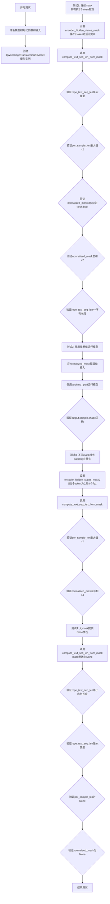

#### 带注释源码

```python
def test_infers_text_seq_len_from_mask(self):
    """Test that compute_text_seq_len_from_mask correctly infers sequence lengths and returns tensors."""
    # 准备模型初始化参数和测试输入数据
    init_dict, inputs = self.prepare_init_args_and_inputs_for_common()
    # 创建QwenImageTransformer2DModel模型实例并移动到测试设备
    model = self.model_class(**init_dict).to(torch_device)

    # ========== 测试1: 连续mask且末尾有padding ==========
    # 创建mask: 仅前2个token有效，其余为padding
    encoder_hidden_states_mask = inputs["encoder_hidden_states_mask"].clone()
    encoder_hidden_states_mask[:, 2:] = 0  # Only first 2 tokens are valid

    # 调用被测试函数compute_text_seq_len_from_mask
    rope_text_seq_len, per_sample_len, normalized_mask = compute_text_seq_len_from_mask(
        inputs["encoder_hidden_states"], encoder_hidden_states_mask
    )

    # 验证rope_text_seq_len返回为int类型（兼容torch.compile）
    self.assertIsInstance(rope_text_seq_len, int)

    # 验证per_sample_len计算正确（最大有效位置+1=2）
    self.assertIsInstance(per_sample_len, torch.Tensor)
    self.assertEqual(int(per_sample_len.max().item()), 2)

    # 验证mask被规范化为bool类型
    self.assertTrue(normalized_mask.dtype == torch.bool)
    self.assertEqual(normalized_mask.sum().item(), 2)  # Only 2 True values

    # 验证rope_text_seq_len至少等于序列长度
    self.assertGreaterEqual(rope_text_seq_len, inputs["encoder_hidden_states"].shape[1])

    # ========== 测试2: 使用推断值成功运行模型 ==========
    inputs["encoder_hidden_states_mask"] = normalized_mask
    with torch.no_grad():
        output = model(**inputs)
    # 验证输出形状与输入hidden_states的序列长度一致
    self.assertEqual(output.sample.shape[1], inputs["hidden_states"].shape[1])

    # ========== 测试3: 不同mask模式（padding在开头） ==========
    # 创建mask: 前3个token为padding，后4个token有效
    encoder_hidden_states_mask2 = inputs["encoder_hidden_states_mask"].clone()
    encoder_hidden_states_mask2[:, :3] = 0  # First 3 tokens are padding
    encoder_hidden_states_mask2[:, 3:] = 1  # Last 4 tokens are valid

    rope_text_seq_len2, per_sample_len2, normalized_mask2 = compute_text_seq_len_from_mask(
        inputs["encoder_hidden_states"], encoder_hidden_states_mask2
    )

    # 最大有效位置是6（最后一个token），所以per_sample_len应该是7
    self.assertEqual(int(per_sample_len2.max().item()), 7)
    self.assertEqual(normalized_mask2.sum().item(), 4)  # 4 True values

    # ========== 测试4: 无mask提供（None情况） ==========
    rope_text_seq_len_none, per_sample_len_none, normalized_mask_none = compute_text_seq_len_from_mask(
        inputs["encoder_hidden_states"], None
    )
    # 验证默认行为：使用完整序列长度
    self.assertEqual(rope_text_seq_len_none, inputs["encoder_hidden_states"].shape[1])
    self.assertIsInstance(rope_text_seq_len_none, int)
    # 验证None情况下返回None
    self.assertIsNone(per_sample_len_none)
    self.assertIsNone(normalized_mask_none)
```


### `QwenImageTransformerTests.test_non_contiguous_attention_mask`

该测试方法验证模型能够正确处理非连续的注意力掩码（如 [1, 0, 1, 0, 1, 0, 0] 这种交错有效和填充标记的模式），确保在存在不连续填充的情况下，RoPE 长度推断和模型推理都能正常工作。

参数：

- `self`：隐式参数，表示测试类实例本身，无需显式传递

返回值：无返回值（`None`），该方法为单元测试，通过 `assert` 语句验证行为

#### 流程图

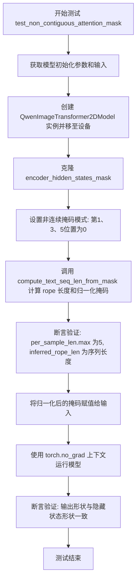

#### 带注释源码

```python
def test_non_contiguous_attention_mask(self):
    """
    Test that non-contiguous masks work correctly (e.g., [1, 0, 1, 0, 1, 0, 0])
    
    该测试方法验证模型能够正确处理非连续的注意力掩码。
    非连续掩码是指有效位置和填充位置交错出现的掩码模式，
    例如 [True, False, True, False, True, False, False]。
    """
    # 步骤1: 获取模型初始化参数和测试输入
    # prepare_init_args_and_inputs_for_common 返回包含模型配置和输入数据的字典
    init_dict, inputs = self.prepare_init_args_and_inputs_for_common()
    
    # 步骤2: 创建模型实例并移至测试设备(CPU/GPU)
    model = self.model_class(**init_dict).to(torch_device)

    # 步骤3: 创建非连续的掩码模式
    # 原始掩码为全1(所有token有效), 现在修改为交错模式
    encoder_hidden_states_mask = inputs["encoder_hidden_states_mask"].clone()
    # 目标模式: [True, False, True, False, True, False, False]
    # 即第0,2,4位置为有效(值为1), 其余位置为填充(值为0)
    encoder_hidden_states_mask[:, 1] = 0   # 第1列设为填充
    encoder_hidden_states_mask[:, 3] = 0   # 第3列设为填充
    encoder_hidden_states_mask[:, 5:] = 0  # 第5列及以后设为填充

    # 步骤4: 调用辅助函数推断RoPE长度并归一化掩码
    # compute_text_seq_len_from_mask 会:
    # - 从掩码中推断出有效的最大位置+1作为per_sample_len
    # - 返回用于RoPE的序列长度
    # - 将掩码归一化(转换为bool类型)
    inferred_rope_len, per_sample_len, normalized_mask = compute_text_seq_len_from_mask(
        inputs["encoder_hidden_states"], encoder_hidden_states_mask
    )
    
    # 步骤5: 断言验证结果正确性
    # 最大有效位置索引为4, 所以per_sample_len应为5 (索引+1)
    self.assertEqual(int(per_sample_len.max().item()), 5)
    # RoPE长度应等于输入序列长度(7)
    self.assertEqual(inferred_rope_len, inputs["encoder_hidden_states"].shape[1])
    # 验证返回的rope长度是int类型(兼容torch.compile)
    self.assertIsInstance(inferred_rope_len, int)
    # 验证归一化后的掩码类型为bool
    self.assertTrue(normalized_mask.dtype == torch.bool)

    # 步骤6: 使用归一化后的掩码更新输入
    inputs["encoder_hidden_states_mask"] = normalized_mask

    # 步骤7: 在推理模式下运行模型
    # 使用torch.no_grad()禁用梯度计算以提高性能和减少内存使用
    with torch.no_grad():
        output = model(**inputs)

    # 步骤8: 验证输出形状正确
    # 确保输出sample的序列维度与输入hidden_states的序列维度一致
    self.assertEqual(output.sample.shape[1], inputs["hidden_states"].shape[1])
```


### `QwenImageTransformerTests.test_txt_lens_deprecation`

该测试方法用于验证当使用已弃用的 `txt_seq_lens` 参数调用模型时，系统能否正确抛出包含相关弃用信息的 `FutureWarning` 警告，确保过渡期兼容性并引导用户迁移到新的 `encoder_hidden_states_mask` 参数。

参数：

-  `self`：隐式参数，测试类实例本身

返回值：无返回值（`None`），该方法为测试用例，通过断言验证行为

#### 流程图

```mermaid
flowchart TD
    A[开始测试] --> B[准备模型初始化参数和输入]
    B --> C[创建模型实例并移至设备]
    C --> D[提取序列长度: txt_seq_lens = encoder_hidden_states.shape[1]]
    D --> E[复制输入字典并移除encoder_hidden_states_mask]
    E --> F[添加已弃用的txt_seq_lens参数]
    F --> G[使用assertWarns捕获FutureWarning]
    G --> H[执行模型前向传播: model\*\*inputs_with_deprecated]
    H --> I{是否抛出FutureWarning?}
    I -->|是| J[获取警告消息]
    I -->|否| K[测试失败 - 未检测到警告]
    J --> L{验证警告内容}
    L --> M1[包含'txt_seq_lens'?]
    L --> M2[包含'deprecated'?]
    L --> M3[包含'encoder_hidden_states_mask'?]
    M1 -->|是| N[验证模型输出形状正确]
    M1 -->|否| O[测试失败]
    M2 -->|是| N
    M2 -->|否| O
    M3 -->|是| N
    M3 -->|否| O
    N --> P[测试通过]
    O --> P
```

#### 带注释源码

```python
def test_txt_seq_lens_deprecation(self):
    """Test that passing txt_seq_lens raises a deprecation warning."""
    # 步骤1: 准备模型初始化参数和测试输入
    # init_dict 包含模型的配置参数，如 patch_size, in_channels, out_channels 等
    # inputs 包含模型所需的张量输入
    init_dict, inputs = self.prepare_init_args_and_inputs_for_common()
    
    # 步骤2: 创建模型实例并移至测试设备
    # 使用 QwenImageTransformer2DModel 类创建模型
    model = self.model_class(**init_dict).to(torch_device)

    # 步骤3: 准备已弃用的参数 txt_seq_lens
    # 从 encoder_hidden_states 中提取序列长度作为测试数据
    txt_seq_lens = [inputs["encoder_hidden_states"].shape[1]]

    # 步骤4: 修改输入字典以使用已弃用的参数路径
    # 复制原始输入字典
    inputs_with_deprecated = inputs.copy()
    # 移除 encoder_hidden_states_mask（强制使用已弃用的路径）
    inputs_with_deprecated.pop("encoder_hidden_states_mask")
    # 添加已弃用的 txt_seq_lens 参数
    inputs_with_deprecated["txt_seq_lens"] = txt_seq_lens

    # 步骤5: 验证弃用警告是否被正确抛出
    # 使用 assertWarns 上下文管理器捕获 FutureWarning 类型
    with self.assertWarns(FutureWarning) as warning_context:
        # 禁用梯度计算以提高测试效率
        with torch.no_grad():
            # 执行模型前向传播，应触发弃用警告
            output = model(**inputs_with_deprecated)

    # 步骤6: 验证警告消息内容
    warning_message = str(warning_context.warning)
    
    # 断言1: 警告消息中包含 'txt_seq_lens'
    self.assertIn("txt_seq_lens", warning_message)
    
    # 断言2: 警告消息中包含 'deprecated'
    self.assertIn("deprecated", warning_message)
    
    # 断言3: 警告消息中包含 'encoder_hidden_states_mask'（新参数名称）
    self.assertIn("encoder_hidden_states_mask", warning_message)

    # 步骤7: 验证模型仍能正常工作（向后兼容性）
    # 确保输出形状与输入 hidden_states 的空间维度匹配
    self.assertEqual(output.sample.shape[1], inputs["hidden_states"].shape[1])
```


### `QwenImageTransformerTests.test_layered_model_with_mask`

测试 QwenImageTransformer2DModel 在 use_layer3d_rope=True（分层模型）配置下的功能，验证分层 RoPE 和附加时间条件与 mask 的协同工作。

参数：
- 无显式参数（通过 self 隐式访问测试类的属性）

返回值：无返回值（void），该方法为单元测试，通过 self.assert* 方法验证模型行为

#### 流程图

```mermaid
flowchart TD
    A[开始测试] --> B[创建分层模型配置字典]
    B --> C[初始化 QwenImageTransformer2DModel 并移至设备]
    C --> D[验证模型使用 QwenEmbedLayer3DRope]
    D --> E[准备测试数据: batch_size=1, text_seq_len=7, layers=4]
    E --> F[创建 hidden_states: (layers+1) * img_h * img_w, 16维]
    F --> G[创建 encoder_hidden_states: 1x7x16]
    G --> H[创建 encoder_hidden_states_mask: 仅前5个token有效]
    H --> I[创建 timestep 和 additional_t_cond]
    I --> J[构建 img_shapes: 5层图像形状列表]
    J --> K[调用模型前向传播]
    K --> L[验证输出形状与输入hidden_states序列长度一致]
    L --> M[测试结束]
```

#### 带注释源码

```python
def test_layered_model_with_mask(self):
    """Test QwenImageTransformer2DModel with use_layer3d_rope=True (layered model)."""
    # 创建分层模型配置字典，启用 layer3d_rope 和 additional_t_cond
    init_dict = {
        "patch_size": 2,
        "in_channels": 16,
        "out_channels": 4,
        "num_layers": 2,
        "attention_head_dim": 16,
        "num_attention_heads": 3,
        "joint_attention_dim": 16,
        "axes_dims_rope": (8, 4, 4),  # 必须匹配 attention_head_dim (8+4+4=16)
        "use_layer3d_rope": True,  # 启用分层 RoPE
        "use_additional_t_cond": True,  # 启用附加时间条件
    }

    # 使用配置初始化模型并移至测试设备
    model = self.model_class(**init_dict).to(torch_device)

    # 从 transformer 模块导入 QwenEmbedLayer3DRope 嵌入类
    from diffusers.models.transformers.transformer_qwenimage import QwenEmbedLayer3DRope

    # 断言验证模型确实使用了 QwenEmbedLayer3DRope 位置嵌入
    self.assertIsInstance(model.pos_embed, QwenEmbedLayer3DRope)

    # 测试单次生成的参数设置
    batch_size = 1
    text_seq_len = 7
    img_h, img_w = 4, 4
    layers = 4

    # 对于分层模型：使用 (layers + 1) 因为有 N 层 + 1 个组合图像
    # hidden_states 形状: (batch_size, (layers+1)*img_h*img_w, 16)
    hidden_states = torch.randn(batch_size, (layers + 1) * img_h * img_w, 16).to(torch_device)
    # encoder_hidden_states 形状: (batch_size, text_seq_len, 16)
    encoder_hidden_states = torch.randn(batch_size, text_seq_len, 16).to(torch_device)

    # 创建带填充的 mask：前5个token有效，后2个为填充
    encoder_hidden_states_mask = torch.ones(batch_size, text_seq_len).to(torch_device)
    encoder_hidden_states_mask[0, 5:] = 0  # 仅5个有效token

    # 时间步张量
    timestep = torch.tensor([1.0]).to(torch_device)

    # additional_t_cond 用于 use_additional_t_cond=True (0或1索引用于嵌入)
    addition_t_cond = torch.tensor([0], dtype=torch.long).to(torch_device)

    # 层结构：4层 + 1个条件图像
    # img_shapes 描述每层的图像尺寸
    img_shapes = [
        [
            (1, img_h, img_w),  # layer 0
            (1, img_h, img_w),  # layer 1
            (1, img_h, img_w),  # layer 2
            (1, img_h, img_w),  # layer 3
            (1, img_h, img_w),  # condition image (最后一个特殊处理)
        ]
    ]

    # 执行模型前向传播
    with torch.no_grad():
        output = model(
            hidden_states=hidden_states,
            encoder_hidden_states=encoder_hidden_states,
            encoder_hidden_states_mask=encoder_hidden_states_mask,
            timestep=timestep,
            img_shapes=img_shapes,
            additional_t_cond=addition_t_cond,
        )

    # 验证输出形状的序列长度与输入 hidden_states 一致
    self.assertEqual(output.sample.shape[1], hidden_states.shape[1])
```


### `QwenImageTransformerCompileTests.prepare_init_args_and_inputs_for_common`

该方法为 `QwenImageTransformerCompileTests` 测试类提供模型初始化参数和输入数据，通过委托调用 `QwenImageTransformerTests.prepare_init_args_and_inputs_for_common()` 来获取标准的初始化配置和测试输入。

参数：

- `self`：隐式参数，类型为 `QwenImageTransformerCompileTests` 实例，调用该方法的对象本身

返回值：`Tuple[Dict, Dict]`，返回一个元组
- 第一个元素 `init_dict`：模型初始化参数字典，包含 patch_size、in_channels、out_channels、num_layers、attention_head_dim、num_attention_heads、joint_attention_dim、guidance_embeds、axes_dims_rope 等配置
- 第二个元素 `inputs_dict`：模型输入字典，包含 hidden_states、encoder_hidden_states、encoder_hidden_states_mask、timestep、img_shapes 等测试输入数据

#### 流程图

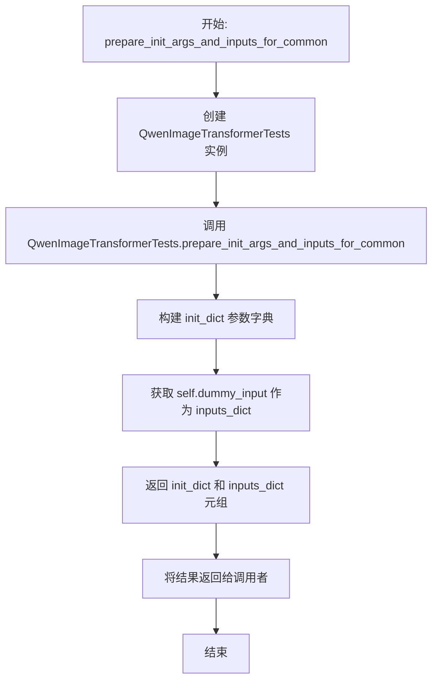

#### 带注释源码

```python
def prepare_init_args_and_inputs_for_common(self):
    """
    为通用测试准备模型初始化参数和输入数据。
    
    该方法委托给 QwenImageTransformerTests 类的同名方法，
    以确保编译测试使用与普通测试相同的配置。
    
    参数:
        self: QwenImageTransformerCompileTests 实例
    
    返回值:
        Tuple[Dict, Dict]: 
            - init_dict: 模型初始化参数字典
            - inputs_dict: 模型输入字典
    """
    # 通过创建 QwenImageTransformerTests 实例并调用其方法来获取标准配置
    # 这确保了编译测试与普通测试使用相同的初始化参数和输入数据
    return QwenImageTransformerTests().prepare_init_args_and_inputs_for_common()
```


### `QwenImageTransformerCompileTests.prepare_dummy_input`

该方法是一个测试辅助函数，用于为 `QwenImageTransformer2DModel` 的编译测试准备虚拟输入数据。它通过调用 `QwenImageTransformerTests.prepare_dummy_input` 来生成包含 hidden_states、encoder_hidden_states、encoder_hidden_states_mask、timestep 和 img_shapes 的模型输入字典，支持自定义图像高度和宽度参数。

参数：

- `height`：`int`，目标图像的高度参数，用于计算 latent 空间的尺寸
- `width`：`int`，目标图像的宽度参数，用于计算 latent 空间的尺寸

返回值：`dict`，返回包含模型所需输入的字典，包含以下键值对：

- `hidden_states`：`torch.Tensor`，形状为 (batch_size, height\*width, num_latent_channels) 的随机潜在状态
- `encoder_hidden_states`：`torch.Tensor`，形状为 (batch_size, sequence_length, embedding_dim) 的随机编码器隐藏状态
- `encoder_hidden_states_mask`：`torch.Tensor`，形状为 (batch_size, sequence_length) 的编码器隐藏状态掩码（全1）
- `timestep`：`torch.Tensor`，形状为 (batch_size,) 的时间步张量
- `img_shapes`：`list`，包含原始图像形状信息的列表

#### 流程图

```mermaid
flowchart TD
    A[开始 prepare_dummy_input] --> B[调用 QwenImageTransformerTests.prepare_dummy_input]
    B --> C[设置默认参数: batch_size=1, num_latent_channels=16, embedding_dim=16, sequence_length=7, vae_scale_factor=4]
    C --> D[生成 hidden_states: torch.randn with shape (1, height\*width, 16)]
    D --> E[生成 encoder_hidden_states: torch.randn with shape (1, 7, 16)]
    E --> F[生成 encoder_hidden_states_mask: torch.ones with shape (1, 7)]
    F --> G[生成 timestep: torch.tensor with value 1.0, expanded to batch_size]
    G --> H[计算 orig_height = height \* 2 \* 4 和 orig_width = width \* 2 \* 4]
    H --> I[计算 img_shapes: [(1, orig_height//8, orig_width//8)] * batch_size]
    I --> J[返回包含所有输入的字典]
    J --> K[结束]
```

#### 带注释源码

```python
def prepare_dummy_input(self, height, width):
    """
    为 QwenImageTransformer2DModel 的编译测试准备虚拟输入数据。
    
    参数:
        height (int): 目标图像的高度参数，用于计算 latent 空间的尺寸
        width (int): 目标图像的宽度参数，用于计算 latent 空间的尺寸
    
    返回:
        dict: 包含模型所需输入的字典
            - hidden_states: 潜在状态张量
            - encoder_hidden_states: 编码器隐藏状态张量
            - encoder_hidden_states_mask: 编码器隐藏状态掩码
            - timestep: 时间步张量
            - img_shapes: 图像形状列表
    """
    # 调用 QwenImageTransformerTests 类的 prepare_dummy_input 方法
    # 该方法返回一个包含模型输入的字典
    return QwenImageTransformerTests().prepare_dummy_input(height=height, width=width)

# 下面是 QwenImageTransformerTests.prepare_dummy_input 的实现作为参考：
"""
def prepare_dummy_input(self, height=4, width=4):
    batch_size = 1  # 批次大小
    num_latent_channels = embedding_dim = 16  # 潜在通道数和嵌入维度
    sequence_length = 7  # 文本序列长度
    vae_scale_factor = 4  # VAE 缩放因子

    # 生成随机潜在状态，形状为 (batch_size, height*width, num_latent_channels)
    hidden_states = torch.randn((batch_size, height * width, num_latent_channels)).to(torch_device)
    
    # 生成随机编码器隐藏状态，形状为 (batch_size, sequence_length, embedding_dim)
    encoder_hidden_states = torch.randn((batch_size, sequence_length, embedding_dim)).to(torch_device)
    
    # 创建全1的编码器隐藏状态掩码，形状为 (batch_size, sequence_length)
    encoder_hidden_states_mask = torch.ones((batch_size, sequence_length)).to(torch_device, torch.long)
    
    # 创建时间步张量，值为 1.0，扩展到批次大小
    timestep = torch.tensor([1.0]).to(torch_device).expand(batch_size)
    
    # 计算原始图像尺寸
    orig_height = height * 2 * vae_scale_factor
    orig_width = width * 2 * vae_scale_factor
    
    # 计算图像形状列表
    img_shapes = [(1, orig_height // vae_scale_factor // 2, orig_width // vae_scale_factor // 2)] * batch_size

    return {
        "hidden_states": hidden_states,
        "encoder_hidden_states": encoder_hidden_states,
        "encoder_hidden_states_mask": encoder_hidden_states_mask,
        "timestep": timestep,
        "img_shapes": img_shapes,
    }
"""
```


### `QwenImageTransformerCompileTests.test_torch_compile_recompilation_and_graph_break`

该测试方法继承自 `TorchCompileTesterMixin`，用于验证 `torch.compile` 在处理 `QwenImageTransformer2DModel` 模型时不会出现意外的重新编译（recompilation）或图断点（graph break）问题，确保编译后的模型在连续调用时能保持稳定的性能。

参数：

- `self`：`QwenImageTransformerCompileTests` 实例，调用测试方法的对象本身

返回值：`None`，该方法为测试用例，执行验证逻辑后不返回任何值

#### 流程图

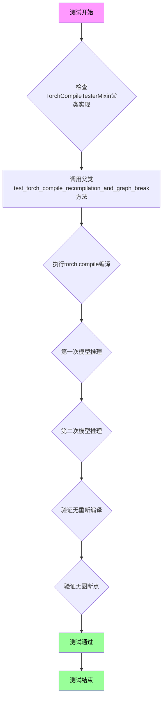

#### 带注释源码

```python
def test_torch_compile_recompilation_and_graph_break(self):
    """
    测试 torch.compile 在模型编译后不会发生意外的重新编译或图断点。
    
    该测试方法继承自 TorchCompileTesterMixin 混入类，通过调用父类方法
    来执行以下验证：
    1. 模型可以成功使用 torch.compile 进行编译
    2. 编译后的模型在多次调用时保持一致的计算图
    3. 不会触发 torchdynamo 的重新编译机制
    4. 不会出现导致图断点的动态控制流
    
    参数:
        self: QwenImageTransformerCompileTests 的实例对象
        
    返回值:
        None: 此方法为单元测试方法，通过断言进行验证，不返回具体值
        
    注意:
        - 该测试依赖父类 TorchCompileTesterMixin 的实现
        - 使用 fullgraph=True 确保整个计算图被编译，无图断点
        - 使用 fresh_inductor_cache() 确保每次测试使用干净的缓存
        - 通过 error_on_recompile=True 配置，在发生重新编译时抛出异常
    """
    # 调用父类 TorchCompileTesterMixin 的测试方法
    # 父类方法会执行完整的 torch.compile 重新编译和图断点测试
    super().test_torch_compile_recompilation_and_graph_break()
```


### `QwenImageTransformerCompileTests.test_torch_compile_with_and_without_mask`

该方法是一个单元测试，用于验证 `torch.compile` 在使用不同的 `encoder_hidden_states_mask`（无掩码、全1掩码、带填充的掩码）时能否正确编译且不会触发重新编译。测试通过检查输出的形状一致性以及在有/无掩码情况下输出的差异来验证功能的正确性。

参数：

- `self`：隐式参数，代表 `QwenImageTransformerCompileTests` 类的实例本身，无需显式传递

返回值：`None`，该方法为测试方法，不返回任何值，仅通过断言验证正确性

#### 流程图

```mermaid
flowchart TD
    A[开始测试] --> B[准备初始化参数和输入]
    B --> C[创建 QwenImageTransformer2DModel 实例并移至设备]
    C --> D[设置模型为 eval 模式并使用 torch.compile 编译]
    
    D --> E[测试用例1: None mask]
    E --> F1[复制输入并设置 encoder_hidden_states_mask 为 None]
    F1 --> F2[第一次运行模型进行编译]
    F2 --> F3[使用 fresh_inductor_cache 和 error_on_recompile 第二次运行]
    F3 --> F4{验证两次输出形状一致?}
    
    E --> G[测试用例2: 全1掩码]
    G --> G1[复制输入并保持全1掩码]
    G1 --> G2[第一次运行模型]
    G2 --> G3[第二次运行验证无重新编译]
    G3 --> G4{验证两次输出形状一致?}
    
    G --> H[测试用例3: 带填充的掩码]
    H --> H1[复制输入并将最后3个token设为0]
    H1 --> H2[第一次运行模型]
    H2 --> H3[第二次运行验证无重新编译]
    H3 --> H4{验证两次输出形状一致?}
    H4 --> H5{验证有掩码和无掩码输出不同?}
    
    H5 --> I[测试结束]
    
    F4 -->|是| G
    G4 -->|是| H
    H5 -->|是| I
```

#### 带注释源码

```python
def test_torch_compile_with_and_without_mask(self):
    """Test that torch.compile works with both None mask and padding mask."""
    # 步骤1: 准备模型初始化参数和测试输入数据
    init_dict, inputs = self.prepare_init_args_and_inputs_for_common()
    
    # 步骤2: 创建模型实例并移动到计算设备（如GPU）
    model = self.model_class(**init_dict).to(torch_device)
    
    # 步骤3: 设置模型为评估模式，禁用Dropout等训练层
    # 步骤4: 使用 torch.compile 编译模型，fullgraph=True 强制整个计算图完整编译
    model.eval()
    model.compile(mode="default", fullgraph=True)

    # ===== 测试用例1: 无掩码 (None mask) =====
    # 测试当 encoder_hidden_states_mask 为 None 时的编译行为
    inputs_no_mask = inputs.copy()
    inputs_no_mask["encoder_hidden_states_mask"] = None  # 无掩码，所有token有效

    # 第一次运行：触发编译，生成编译后的计算图
    with torch.no_grad():
        output_no_mask = model(**inputs_no_mask)

    # 第二次运行：验证不会发生重新编译
    # fresh_inductor_cache(): 清理Inductor缓存，强制重新编译如果代码有变化
    # error_on_recompile=True: 如果检测到重新编译则抛出异常
    with (
        torch._inductor.utils.fresh_inductor_cache(),
        torch._dynamo.config.patch(error_on_recompile=True),
        torch.no_grad(),
    ):
        output_no_mask_2 = model(**inputs_no_mask)

    # 验证输出形状正确：sample的序列长度应与hidden_states的序列长度一致
    self.assertEqual(output_no_mask.sample.shape[1], inputs["hidden_states"].shape[1])
    self.assertEqual(output_no_mask_2.sample.shape[1], inputs["hidden_states"].shape[1])

    # ===== 测试用例2: 全1掩码 (all-ones mask) =====
    # 测试当掩码全为1时（表示所有token有效）的编译行为
    inputs_all_ones = inputs.copy()
    # 保持全1掩码（默认创建的掩码就是全1）
    self.assertTrue(inputs_all_ones["encoder_hidden_states_mask"].all().item())

    # 第一次运行：触发编译
    with torch.no_grad():
        output_all_ones = model(**inputs_all_ones)

    # 第二次运行：验证无重新编译
    with (
        torch._inductor.utils.fresh_inductor_cache(),
        torch._dynamo.config.patch(error_on_recompile=True),
        torch.no_grad(),
    ):
        output_all_ones_2 = model(**inputs_all_ones)

    # 验证输出形状正确
    self.assertEqual(output_all_ones.sample.shape[1], inputs["hidden_states"].shape[1])
    self.assertEqual(output_all_ones_2.sample.shape[1], inputs["hidden_states"].shape[1])

    # ===== 测试用例3: 带填充的掩码 (padding mask) =====
    # 测试当存在padding（部分token无效）时的编译行为
    inputs_with_padding = inputs.copy()
    mask_with_padding = inputs["encoder_hidden_states_mask"].clone()
    mask_with_padding[:, 4:] = 0  # 将最后3个token标记为无效（padding）

    inputs_with_padding["encoder_hidden_states_mask"] = mask_with_padding

    # 第一次运行：触发编译
    with torch.no_grad():
        output_with_padding = model(**inputs_with_padding)

    # 第二次运行：验证无重新编译
    with (
        torch._inductor.utils.fresh_inductor_cache(),
        torch._dynamo.config.patch(error_on_recompile=True),
        torch.no_grad(),
    ):
        output_with_padding_2 = model(**inputs_with_padding)

    # 验证输出形状正确
    self.assertEqual(output_with_padding.sample.shape[1], inputs["hidden_states"].shape[1])
    self.assertEqual(output_with_padding_2.sample.shape[1], inputs["hidden_states"].shape[1])

    # 验证语义正确性：有掩码和 无掩码的输出应该不同
    # 因为掩码会影响注意力机制的计算结果
    self.assertFalse(torch.allclose(output_no_mask.sample, output_with_padding.sample, atol=1e-3))
```

## 关键组件


### 张量索引与惰性加载

通过`compute_text_seq_len_from_mask`函数实现，该函数从encoder_hidden_states_mask中惰性计算文本序列长度，避免全量展开。当mask为None时，返回完整序列长度；支持连续和非连续mask的索引计算，实现高效的文本序列长度推断。

### 反量化支持

虽然代码中未直接实现反量化，但`encoder_hidden_states_mask`的处理逻辑为后续反量化操作提供了基础。当mask为None时使用完整序列，掩码为全1时行为与None一致，掩码包含0值时仅处理有效token，这种设计支持量化模型推理时的token过滤。

### 量化策略

代码通过`encoder_hidden_states_mask`机制间接支持量化后的变长序列处理。测试用例覆盖了None mask、全1 mask和含0 mask三种场景，确保量化模型在不同padding策略下都能正确运行，这是量化推理的关键基础设施。

### torch.compile兼容性

`QwenImageTransformerCompileTests`类专门测试torch.compile的兼容性，包括无mask场景、全1 mask场景和有padding mask场景。测试验证recompilation和graph break问题，确保模型在torch.compile优化下行为一致。

### 3D旋转位置嵌入(QwenEmbedLayer3DRope)

当`use_layer3d_rope=True`时使用QwenEmbedLayer3DRope实现3D旋转位置嵌入，配合`axes_dims_rope=(8, 4, 4)`参数实现多轴RoPE。测试验证分层模型的结构正确性和推理输出。

### 非连续Attention Mask支持

`test_non_contiguous_attention_mask`测试用例验证非连续mask（如[1, 0, 1, 0, 1, 0, 0]）的处理能力，确保模型能正确处理任意分布的有效token和padding。

### 梯度检查点支持

`test_gradient_checkpointing_is_applied`验证梯度检查点功能在QwenImageTransformer2DModel上正确应用，用于大模型训练时的内存优化。

### 废弃API兼容

`test_txt_seq_lens_deprecation`测试旧的`txt_seq_lens`参数废弃警告，确保从旧API迁移时能给出明确提示并保持功能兼容。


## 问题及建议


### 已知问题

-   **代码重复**：在 `QwenImageTransformerCompileTests` 类中，`prepare_init_args_and_inputs_for_common` 和 `prepare_dummy_input` 方法直接调用 `QwenImageTransformerTests` 的对应方法，造成代码重复且耦合度高
-   **测试方法命名不一致**：部分方法使用驼峰命名（如 `test_infers_text_seq_len_from_mask`），部分使用全小写（如 `test_txt_seq_lens_deprecation`），不符合 Python 命名规范（应使用 snake_case）
-   **Magic Numbers 缺乏解释**：代码中存在多个硬编码数值（如 `axes_dims_rope: (8, 4, 4)` 必须等于 attention_head_dim=16，`layers = 4` 等），缺乏注释说明其来源和意义
-   **测试逻辑重复**：`test_torch_compile_with_and_without_mask` 中对三种 mask 情况的测试流程高度相似（首次运行→二次运行验证无重编译），可使用参数化测试或循环优化
-   **缺少边界条件测试**：未测试极端情况，如 `img_shapes` 为空列表、负数维度、模型层数为 0 等
-   **未使用的变量**：`test_txt_seq_lens_deprecation` 中定义的 `txt_seq_lens` 未在后续直接使用，仅用于触发 deprecated 路径

### 优化建议

-   将 `QwenImageTransformerTests` 中的公共方法提取到独立的测试工具类或 fixture 中，避免直接继承调用
-   统一测试方法命名为 snake_case 格式（如 `test_infers_text_seq_len_from_mask` → `test_seq_len_inference_from_mask`）
-   将硬编码的配置值提取为类常量或测试参数，并添加文档注释说明其含义和约束条件
-   使用 `pytest.mark.parametrize` 或 for 循环重构重复的 mask 测试逻辑
-   增加边界条件和异常输入的测试用例，提升测试覆盖率
-   清理未使用变量的定义，使代码意图更清晰

## 其它


### 设计目标与约束

**设计目标**：
验证 QwenImageTransformer2DModel 在不同输入配置下的功能正确性，包括标准推理、梯度检查点、RoPE位置编码、mask处理、分层模型以及torch.compile优化支持。

**设计约束**：
- 测试环境必须使用PyTorch和diffusers库
- 模型输入必须符合指定的shape约定（hidden_states: (batch, h*w, channels)）
- 测试用例需覆盖None mask、全ones mask和含padding的mask三种场景
- torch.compile测试需验证无不必要的重编译（recompilation）

### 错误处理与异常设计

**异常处理机制**：
- 使用 `unittest.TestCase.assertWarns` 捕获 FutureWarning 弃用警告
- 使用 `torch._dynamo.config.patch(error_on_recompile=True)` 检测torch.compile重编译问题
- 使用 `self.assertIsInstance` 验证返回值类型是否符合预期
- 使用 `self.assertEqual` 和 `self.assertTrue` 进行断言验证

**边界条件测试**：
- 空mask（None）情况
- 全padding mask（全0）
- 非连续mask（间隔的valid token）
- 梯度检查点启用状态

### 数据流与状态机

**主要数据流**：
1. dummy_input准备 → 模型初始化 → 前向传播 → 输出验证
2. encoder_hidden_states_mask处理流程：原始mask → compute_text_seq_len_from_mask处理 → 归一化mask → 模型输入

**状态转换**：
- model.eval() / model.train() 模式切换（影响dropout和batchnorm行为）
- torch.compile 编译状态转换（从eager到compiled模式）

### 外部依赖与接口契约

**核心依赖**：
- `torch` - 张量计算和神经网络基础库
- `diffusers.QwenImageTransformer2DModel` - 被测模型类
- `diffusers.models.transformers.transformer_qwenimage.compute_text_seq_len_from_mask` - 辅助函数
- `diffusers.models.transformers.transformer_qwenimage.QwenEmbedLayer3DRope` - 分层RoPE嵌入类
- `unittest` - 单元测试框架
- `testing_utils.enable_full_determinism` - 确定性测试配置

**接口契约**：
- `model(**inputs)` 返回包含 `.sample` 属性的输出对象
- `compute_text_seq_len_from_mask` 返回三元组 (rope_text_seq_len: int, per_sample_len: Tensor, normalized_mask: Tensor)
- `prepare_init_args_and_inputs_for_common()` 返回 (init_dict, inputs_dict) 元组

### 性能考虑

**测试覆盖的性能场景**：
- torch.compile 编译性能验证（通过fullgraph=True检测图break）
- 避免不必要重编译的验证（使用fresh_inductor_cache）
- 梯度检查点启用状态验证

**性能测试要点**：
- 首次编译后连续运行不应触发重编译
- 不同mask配置应能共享编译结果（全ones mask与None mask行为一致）

### 可测试性设计

**测试隔离设计**：
- 每个测试方法独立创建模型实例
- 使用 `prepare_dummy_input` 统一生成测试数据
- 测试间无共享状态依赖

**测试数据生成**：
- 固定随机种子（通过enable_full_determinism）
- 可配置的输入维度（height, width, batch_size等参数化）
- 支持多种mask模式（连续/非连续/全padding）

### 版本兼容性

**PyTorch兼容性要求**：
- torch.compile功能需要PyTorch 2.0+版本
- `_inductor.utils` 和 `_dynamo.config` 为内部API，可能随版本变化

**diffusers兼容性**：
- 测试针对特定版本的 `QwenImageTransformer2DModel`
- `compute_text_seq_len_from_mask` 函数签名需保持稳定

### 配置与参数设计

**模型配置参数**：
- patch_size: 2
- in_channels: 16, out_channels: 4
- num_layers: 2, attention_head_dim: 16, num_attention_heads: 3
- joint_attention_dim: 16
- axes_dims_rope: (8, 4, 4)，必须各维度之和等于attention_head_dim

**可选特性开关**：
- use_layer3d_rope: 启用分层3D RoPE
- use_additional_t_cond: 启用额外时间条件嵌入
- guidance_embeds: 指导嵌入支持

### 许可证与版权

本代码文件包含Apache License 2.0版权声明，允许在遵守许可证条款的前提下使用、修改和分发。

### 测试覆盖矩阵

| 测试方法 | 功能覆盖 | 边界条件 |
|---------|---------|---------|
| test_gradient_checkpointing_is_applied | 梯度检查点 | 预期集合验证 |
| test_infers_text_seq_len_from_mask | Mask推断 | 连续/非连续/None |
| test_non_contiguous_attention_mask | 非连续mask | 间隔valid token |
| test_txt_seq_lens_deprecation | 弃用警告 | FutureWarning捕获 |
| test_layered_model_with_mask | 分层模型 | use_layer3d_rope=True |
| test_torch_compile_with_and_without_mask | 编译优化 | None/全ones/有padding |
    