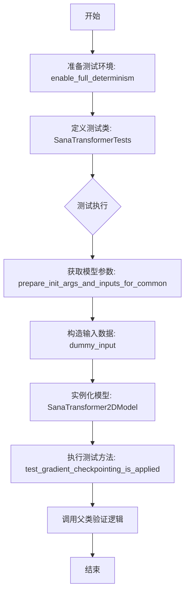
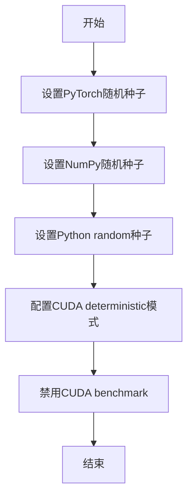
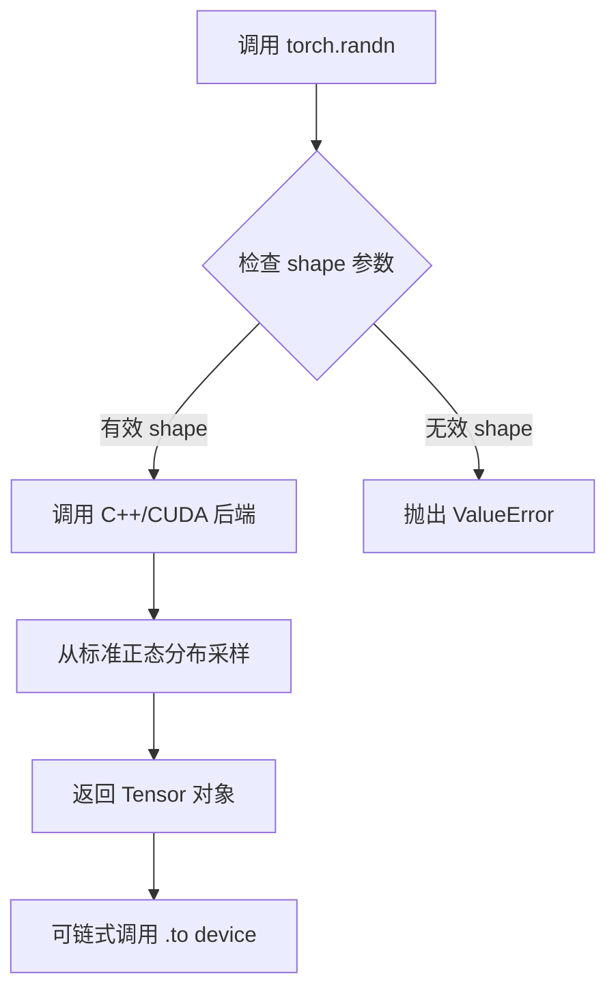
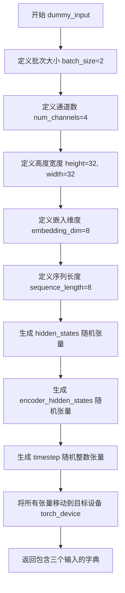
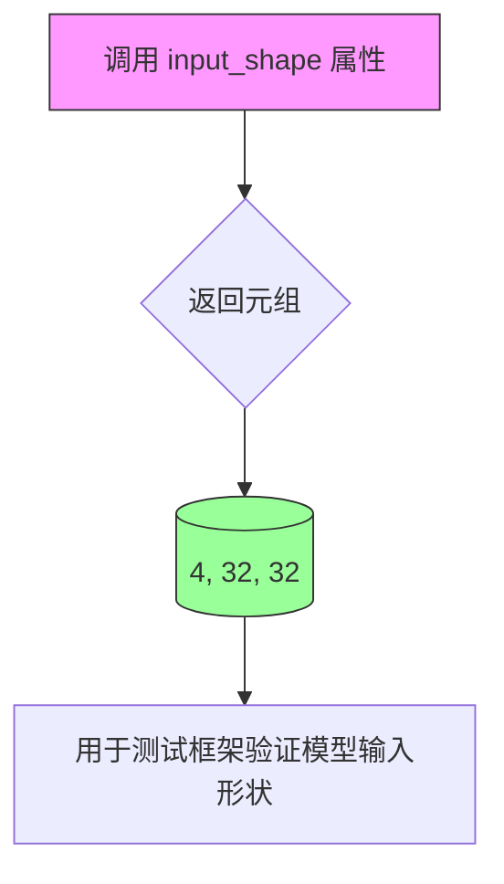
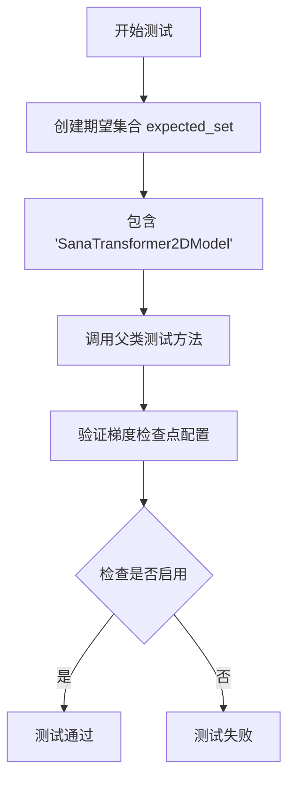

# `diffusers\tests\models\transformers\test_models_transformer_sana.py` 详细设计文档

该文件定义了一个针对Diffusers库中SanaTransformer2DModel的单元测试类SanaTransformerTests，继承自unittest.TestCase和ModelTesterMixin，用于通过提供模型配置、输入数据和测试用例来验证Transformer模型的结构、输入输出形状以及梯度检查点等功能。

## 整体流程



## 类结构

```
unittest.TestCase
├── ModelTesterMixin
│   └── SanaTransformerTests
SanaTransformer2DModel (被测模型)
```

## 全局变量及字段


### `torch_device`
    
设备字符串，表示测试使用的计算设备（通常为'cuda'或'cpu'）

类型：`str`
    


### `SanaTransformerTests.model_class`
    
待测试的模型类，指向SanaTransformer2DModel

类型：`type`
    


### `SanaTransformerTests.main_input_name`
    
主输入张量的名称，此处为'hidden_states'

类型：`str`
    


### `SanaTransformerTests.uses_custom_attn_processor`
    
标志位，指示模型是否使用自定义注意力处理器

类型：`bool`
    


### `SanaTransformerTests.model_split_percents`
    
模型分割百分比列表，用于测试时的模型切分验证

类型：`list[float]`
    
    

## 全局函数及方法


### enable_full_determinism

该函数用于启用PyTorch的完全确定性模式，确保深度学习模型在不同运行中产生完全一致的输出结果，主要通过设置随机种子和配置CUDAdeterministic选项来实现测试的可复现性。

参数： 无

返回值：无返回值

#### 流程图



#### 带注释源码

```
# enable_full_determinism 函数定义不在当前代码文件中
# 该函数从 testing_utils 模块导入
# 函数被调用在测试类定义之前

from ...testing_utils import (
    enable_full_determinism,  # 从上级目录的testing_utils模块导入
    torch_device,
)

# 在模块加载时调用，确保后续所有测试使用确定性计算
enable_full_determinism()

# 该函数通常实现以下功能：
# 1. torch.manual_seed(seed) - 设置PyTorch主随机种子
# 2. torch.cuda.manual_seed_all(seed) - 设置所有GPU的随机种子
# 3. np.random.seed(seed) - 设置NumPy随机种子
# 4. random.seed(seed) - 设置Python内置random种子
# 5. torch.backends.cudnn.deterministic = True - 启用cuDNN确定性模式
# 6. torch.backends.cudnn.benchmark = False - 禁用cuDNN auto-tuner
# 7. torch.use_deterministic_algorithms(True) - 强制使用确定性算法
```


### `torch.randn`

用于生成服从标准正态分布（均值0，方差1）的随机张量的PyTorch核心函数。

参数：

- `*shape`：`int...`，可变数量的整数，指定输出张量的形状（例如：(batch_size, num_channels, height, width)）
- `**kwargs`：`dict`，可选参数，如`dtype`（数据类型）、`device`（设备）等

返回值：`Tensor`，一个PyTorch张量，其元素服从标准正态分布N(0,1)

#### 流程图



#### 带注释源码

```python
# 代码中的实际调用示例（来自测试文件）

# 用法1：生成隐藏状态的随机张量
# batch_size=2, num_channels=4, height=32, width=32
hidden_states = torch.randn((batch_size, num_channels, height, width)).to(torch_device)
# 参数说明：
#   - (batch_size, num_channels, height, width): 张量形状元组
#   - .to(torch_device): 将张量移动到指定设备（CPU/CUDA）
# 返回值：4D张量，形状为 (2, 4, 32, 32)

# 用法2：生成编码器隐藏状态的随机张量
# batch_size=2, sequence_length=8, embedding_dim=8
encoder_hidden_states = torch.randn((batch_size, sequence_length, embedding_dim)).to(torch_device)
# 参数说明：
#   - (batch_size, sequence_length, embedding_dim): 张量形状元组
#   - .to(torch_device): 将张量移动到指定设备
# 返回值：3D张量，形状为 (2, 8, 8)
```

#### 补充说明

| 特性 | 描述 |
|------|------|
| 函数位置 | `torch` 模块的核心函数 |
| 分布类型 | 标准正态分布 N(0, 1) |
| 随机种子 | 全局通过 `torch.manual_seed()` 或 `enable_full_determinism()` 控制 |
| 设备支持 | 支持 CPU 和 CUDA 设备 |
| 梯度追踪 | 返回的 Tensor 默认开启 `requires_grad=False` |


### `torch.randint`

在给定代码中，`torch.randint` 用于生成随机整数张量，主要用于创建模型测试所需的随机时间步（timestep）数据。

参数：

- `low`：`int`，随机整数范围的下界（包含）
- `high`：`int`，随机整数范围的上界（不包含）
- `size`：`tuple` 或 `int`，输出张量的形状
- `*`：其他可选参数（如 dtype、device、generator 等）

返回值：`Tensor`，形状为 `size` 的随机整数张量，值域为 `[low, high)`

#### 流程图

```mermaid
flowchart TD
    A[开始] --> B[调用 torch.randint]
    B --> C{传入参数}
    C --> D[low=0: 下界]
    C --> E[high=1000: 上界]
    C --> F[size=(batch_size,): 输出形状]
    D --> G[生成随机整数张量]
    E --> G
    F --> G
    G --> H[值域: 0 <= x < 1000]
    H --> I[应用 .to(torch_device)]
    I --> J[返回整数张量]
    J --> K[用于模型测试的 timestep 输入]
```

#### 带注释源码

```python
# 在给定代码中的实际使用方式：
timestep = torch.randint(0, 1000, size=(batch_size,)).to(torch_device)

# 逐项解析：
# torch.randint        -> PyTorch 随机整数生成函数
# 0                    -> low 参数：随机数下界（包含）
# 1000                 -> high 参数：随机数上界（不包含），即 [0, 1000)
# size=(batch_size,)   -> 输出形状为一维张量，长度为 batch_size (值为 2)
# .to(torch_device)    -> 将张量移动到指定设备（CPU/CUDA）
# 
# 完整示例：
# batch_size = 2
# 结果示例：tensor([427, 853])  # 每次运行可能不同，值在 0-999 之间
```

#### 额外说明

| 项目 | 说明 |
|------|------|
| **使用场景** | 在扩散模型（如 SanaTransformer2DModel）测试中生成随机时间步 |
| **数据流** | 生成的 timestep 作为模型输入之一，用于条件扩散过程 |
| **设备迁移** | `.to(torch_device)` 确保张量在正确的计算设备上 |
| **可复现性** | 结合 `enable_full_determinism()` 可实现确定性测试 |


### `SanaTransformerTests.dummy_input`

该方法是一个 `@property` 装饰器属性，用于生成测试所需的虚拟输入数据。它创建随机张量作为 `hidden_states`（图像特征）、`encoder_hidden_states`（编码器隐藏状态）和 `timestep`（时间步），以供模型前向传播测试使用。

参数：

- 该方法无需参数（为属性方法，通过 `self` 访问类实例）

返回值：`dict`，包含三个键值对：

- `hidden_states`：`torch.Tensor`，形状为 `(batch_size, num_channels, height, width)` = `(2, 4, 32, 32)`，代表图像的隐藏状态特征
- `encoder_hidden_states`：`torch.Tensor`，形状为 `(batch_size, sequence_length, embedding_dim)` = `(2, 8, 8)`，代表编码器的输出隐藏状态
- `timestep`：`torch.Tensor`，形状为 `(batch_size,)` = `(2,)`，代表扩散过程中的时间步

#### 流程图



#### 带注释源码

```python
@property
def dummy_input(self):
    """
    生成用于模型测试的虚拟输入数据。
    该属性方法创建随机张量来模拟真实的模型输入，
    用于测试 SanaTransformer2DModel 的前向传播功能。
    """
    # 定义批量大小
    batch_size = 2
    # 定义输入通道数（对应图像的RGB通道加一个通道）
    num_channels = 4
    # 定义输入图像的高度和宽度
    height = 32
    width = 32
    # 定义编码器隐藏状态的嵌入维度
    embedding_dim = 8
    # 定义序列长度
    sequence_length = 8

    # 创建随机初始隐藏状态张量，形状为 (batch_size, num_channels, height, width)
    # 模拟图像经过编码器后的特征图
    hidden_states = torch.randn((batch_size, num_channels, height, width)).to(torch_device)
    
    # 创建编码器隐藏状态张量，形状为 (batch_size, sequence_length, embedding_dim)
    # 模拟文本编码器的输出，用于跨注意力机制
    encoder_hidden_states = torch.randn((batch_size, sequence_length, embedding_dim)).to(torch_device)
    
    # 创建时间步张量，形状为 (batch_size,)
    # 用于扩散模型的时间条件输入
    timestep = torch.randint(0, 1000, size=(batch_size,)).to(torch_device)

    # 返回包含所有测试输入的字典
    return {
        "hidden_states": hidden_states,          # 图像特征张量
        "encoder_hidden_states": encoder_hidden_states,  # 文本编码特征
        "timestep": timestep,                    # 扩散时间步
    }
```


### `SanaTransformerTests.input_shape`

该属性用于定义SanaTransformer2DModel的输入张量形状，返回一个包含通道数、高度和宽度的元组(4, 32, 32)，在测试用例中用于验证模型输入输出的维度一致性。

参数： 无

返回值：`tuple`，返回模型的输入形状元组，包含通道数(4)、高度(32)和宽度(32)

#### 流程图



#### 带注释源码

```python
@property
def input_shape(self):
    """
    定义模型输入张量的形状规格
    
    Returns:
        tuple: 包含三个整数的元组，表示 (通道数, 高度, 宽度)
               - 4: 输入通道数 (in_channels)
               - 32: 输入高度 (sample_size)
               - 32: 输入宽度 (sample_size)
    """
    return (4, 32, 32)
```


### `SanaTransformerTests.output_shape`

该属性方法用于定义 SanaTransformer2DModel 模型的输出张量形状，返回值为一个元组 (4, 32, 32)，表示模型在测试时预期输出的通道数、高度和宽度。

参数：无（该方法为属性方法，不接受任何参数）

返回值：`tuple`，返回模型预期输出的形状，格式为 (channels, height, width)，具体为 (4, 32, 32)

#### 流程图

```mermaid
flowchart TD
    A[开始访问 output_shape 属性] --> B[返回元组 (4, 32, 32)]
    B --> C[结束]
    
    style A fill:#f9f,stroke:#333
    style B fill:#9f9,stroke:#333
    style C fill:#9ff,stroke:#333
```

#### 带注释源码

```python
@property
def output_shape(self):
    """
    定义模型输出的形状。
    
    该属性方法返回模型在测试时期望的输出张量维度。
    包含三个维度：通道数、高度和宽度。
    
    Returns:
        tuple: 包含三个整数的元组，表示 (channels, height, width)
               - channels: 4 表示输出通道数
               - height: 32 表示输出高度
               - width: 32 表示输出宽度
    """
    return (4, 32, 32)
```


### `SanaTransformerTests.prepare_init_args_and_inputs_for_common`

该方法为 `SanaTransformer2DModel` 测试类准备通用的初始化参数字典和输入数据字典，用于单元测试中模型的初始化和前向传播验证。

参数：

- 无显式参数（隐式参数 `self` 为 `SanaTransformerTests` 实例）

返回值：`tuple[dict, dict]`，返回包含模型初始化参数字典和输入数据字典的元组

#### 流程图

```mermaid
flowchart TD
    A[开始 prepare_init_args_and_inputs_for_common] --> B[创建 init_dict 字典]
    B --> C[设置模型配置参数]
    C --> D{patch_size: 1}
    C --> E{in_channels: 4}
    C --> F{out_channels: 4}
    C --> G{num_layers: 1}
    C --> H{attention_head_dim: 4}
    C --> I{num_attention_heads: 2}
    C --> J{num_cross_attention_heads: 2}
    C --> K{cross_attention_head_dim: 4}
    C --> L{cross_attention_dim: 8}
    C --> M{caption_channels: 8}
    C --> N{sample_size: 32}
    N --> O[获取 self.dummy_input 作为 inputs_dict]
    O --> P[返回 (init_dict, inputs_dict) 元组]
```

#### 带注释源码

```python
def prepare_init_args_and_inputs_for_common(self):
    """
    准备通用的初始化参数和输入数据，用于模型测试。
    
    Returns:
        tuple: 包含两个字典的元组
            - init_dict: 模型初始化参数字典
            - inputs_dict: 模型输入数据字典
    """
    # 定义模型初始化参数字典，包含模型架构配置
    init_dict = {
        "patch_size": 1,                    # 图像分块大小
        "in_channels": 4,                    # 输入通道数
        "out_channels": 4,                  # 输出通道数
        "num_layers": 1,                     # Transformer 层数
        "attention_head_dim": 4,            # 注意力头维度
        "num_attention_heads": 2,           # 注意力头数量
        "num_cross_attention_heads": 2,     # 交叉注意力头数量
        "cross_attention_head_dim": 4,      # 交叉注意力头维度
        "cross_attention_dim": 8,           # 交叉注意力维度
        "caption_channels": 8,              #  caption 嵌入通道数
        "sample_size": 32,                  # 样本空间尺寸
    }
    
    # 从测试类获取预定义的虚拟输入数据
    # 包含 hidden_states, encoder_hidden_states, timestep
    inputs_dict = self.dummy_input
    
    # 返回初始化参数和输入数据的元组，供测试框架使用
    return init_dict, inputs_dict
```


### `SanaTransformerTests.test_gradient_checkpointing_is_applied`

该测试方法用于验证 `SanaTransformer2DModel` 类是否正确应用了梯度检查点（gradient checkpointing）技术，以确保在训练大型模型时能够有效节省显存。

参数：

- `expected_set`：`set`，包含预期启用梯度检查点的模型类名集合，此处为 `{"SanaTransformer2DModel"}`

返回值：`None`，该方法为 unittest 测试用例，通过测试框架的断言机制报告结果，不直接返回值。

#### 流程图



#### 带注释源码

```python
def test_gradient_checkpointing_is_applied(self):
    """
    测试方法：验证梯度检查点是否正确应用于 SanaTransformer2DModel
    
    该测试方法继承自 ModelTesterMixin，用于验证模型类是否配置了
    梯度检查点以节省显存开销。通过调用父类的同名测试方法执行
    实际的验证逻辑。
    
    参数:
        expected_set: 包含需要验证启用梯度检查点的模型类名的集合
    
    返回值:
        None (通过 unittest 框架的断言机制报告测试结果)
    """
    # 定义预期启用梯度检查点的模型类集合
    expected_set = {"SanaTransformer2DModel"}
    
    # 调用父类 test_gradient_checkpointing_is_applied 方法
    # 传递预期集合以验证模型类是否正确配置了梯度检查点
    super().test_gradient_checkpointing_is_applied(expected_set=expected_set)
```

## 关键组件


### SanaTransformer2DModel

SanaTransformer2DModel 是被测试的核心模型类，来自 diffusers 库，用于处理 2D 图像变换的 Transformer 模型。

### ModelTesterMixin

ModelTesterMixin 是测试混入类，提供通用的模型测试方法（如梯度检查点测试、模型初始化测试等），被测试类继承以获得标准化的测试能力。

### dummy_input

dummy_input 是一个属性方法，用于生成符合模型输入要求的虚拟测试数据，包括隐藏状态、编码器隐藏状态和时间步。

### prepare_init_args_and_inputs_for_common

prepare_init_args_and_inputs_for_common 方法用于准备模型初始化参数字典和对应的输入数据字典，供通用测试使用。

### test_gradient_checkpointing_is_applied

test_gradient_checkpointing_is_applied 方法验证模型是否正确应用了梯度检查点技术，用于降低显存占用。

### hidden_states

hidden_states 是模型的主输入张量，形状为 (batch_size, num_channels, height, width)，表示图像的潜在表示。

### encoder_hidden_states

encoder_hidden_states 是条件输入张量，来自编码器的隐藏状态，用于为生成过程提供额外的条件信息。

### timestep

timestep 是扩散过程的时间步张量，用于控制去噪过程的当前状态和条件强度。


## 问题及建议


### 已知问题

- **测试用例命名不规范**：测试方法名 `test_gradient_checkpointing_is_applied` 过于简单，未体现具体的测试场景和预期结果，缺乏可读性和可维护性
- **配置参数硬编码**：`model_split_percents = [0.7, 0.7, 0.9]` 等参数以硬编码方式存在，若这些值需要根据模型或测试环境调整，将导致代码修改不便
- **输入输出形状不一致**：`input_shape` 返回 `(4, 32, 32)` 但 `dummy_input` 中 `hidden_states` 的形状为 `(2, 4, 32, 32)`，batch 维度不匹配，可能导致测试失败或结果不准确
- **缺失设备管理**：使用全局 `torch_device` 但未显式处理 CPU/GPU 迁移逻辑，可能在多设备环境下产生隐藏 bug
- **测试覆盖不足**：仅有一个测试方法 `test_gradient_checkpointing_is_applied`，缺少对模型前向传播、梯度计算、输出形状验证等核心功能的测试
- **魔法数字**：`timestep = torch.randint(0, 1000, size=(batch_size,))` 中的 1000 作为时间步范围是魔法数字，应提取为类常量或配置参数

### 优化建议

- 重构测试方法名，采用更描述性的命名如 `test_model_supports_gradient_checkpointing` 以增强语义表达
- 将硬编码的配置参数提取为类属性或从配置文件加载，提高代码灵活性和可维护性
- 统一 `input_shape` / `output_shape` 与 `dummy_input` 的 batch 维度定义，确保数据流一致性
- 引入显式的设备管理逻辑，如使用 `to(torch_device)` 前增加设备有效性检查
- 补充更多测试用例，包括模型前向传播测试、输出维度验证、梯度流动检查等核心功能验证
- 将时间步范围 1000 定义为类常量 `MAX_TIMESTEP = 1000`，提高代码可读性和可配置性

## 其它


### 设计目标与约束

本测试文件旨在验证 SanaTransformer2DModel 在 diffusers 框架中的核心功能正确性，包括模型前向传播、梯度计算、参数初始化等关键行为。测试采用 unittest 框架，继承 ModelTesterMixin 提供通用模型测试方法。测试约束包括：使用 CPU/CUDA 设备（通过 torch_device 指定）、启用全确定性模式（enable_full_determinism）以确保测试可复现性、测试环境依赖 PyTorch 和 diffusers 库。

### 错误处理与异常设计

测试代码本身不包含显式的错误处理逻辑，错误捕获主要依赖 unittest 框架的断言机制。潜在异常包括：模型加载失败（ImportError）、设备不兼容（RuntimeError）、输入维度不匹配（ValueError）、梯度计算异常（AssertionError）。测试通过 ModelTesterMixin 提供的标准化断言进行错误检测，若模型行为不符合预期则测试失败并抛出相应异常。

### 数据流与状态机

测试数据流如下：1) prepare_init_args_and_inputs_for_common() 准备模型初始化参数字典 init_dict 和测试输入 inputs_dict；2) dummy_input 属性生成随机张量作为模拟输入，包含 hidden_states (batch_size, num_channels, height, width)、encoder_hidden_states (batch_size, sequence_length, embedding_dim) 和 timestep (batch_size,)；3) 测试框架将这些输入传递给模型进行前向传播，验证输出维度与输入维度一致 (output_shape = (4, 32, 32))。无显式状态机设计。

### 外部依赖与接口契约

主要外部依赖包括：1) torch (PyTorch 核心库)；2) diffusers.SanaTransformer2DModel (被测模型类)；3) ...testing_utils.enable_full_determinism 和 torch_device (测试工具函数和设备常量)；4) ..test_modeling_common.ModelTesterMixin (通用模型测试混入类)。接口契约方面：SanaTransformer2DModel 需接受 init_dict 中的参数并返回与 input_shape 对应的输出；ModelTesterMixin 约定 test_gradient_checkpointing_is_applied() 方法需接收 expected_set 参数用于验证梯度检查点覆盖范围。

### 测试用例设计

共设计 3 个测试用例：(1) test_gradient_checkpointing_is_applied - 验证梯度检查点是否应用于 SanaTransformer2DModel；(2) 继承自 ModelTesterMixin 的其他通用测试（模型初始化、前向传播、反向传播、参数一致性等）；(3) 隐含的输入输出形状验证测试。测试覆盖范围包括：模型参数初始化、梯度计算、内存优化（梯度检查点）、输入输出维度正确性。

### 性能基准与优化空间

当前测试未包含显式的性能基准测试。潜在优化方向：1) 可添加推理速度基准测试（使用 timeit 测量前向传播耗时）；2) 可添加内存占用测试（使用 torch.cuda.memory_allocated() 监测峰值内存）；3) 当前 model_split_percents = [0.7, 0.7, 0.9] 用于模型切分测试，可进一步扩展以覆盖更多内存优化场景。

### 兼容性考虑

测试代码需兼容 PyTorch 2.x 版本和最新 diffusers 库。当前设计支持 CPU 和 CUDA 设备（通过 torch_device 动态选择）。SanaTransformer2DModel 作为 diffusers 库的公共 API，其接口稳定性由 HuggingFace 维护团队保证。测试继承自 ModelTesterMixin 确保遵循 diffusers 框架的模型测试规范。

### 代码质量与可维护性

测试代码遵循 PEP 8 风格规范，使用清晰的属性命名（dummy_input、input_shape、output_shape）。可改进点：1) 可添加 docstring 描述类的作用；2) 可为每个属性添加类型注解；3) 魔法数字（batch_size=2、height=32 等）可提取为类常量以提高可读性；4) 当前仅覆盖梯度检查点测试，可考虑添加更多专项测试（如注意力机制测试、层归一化测试等）。

### 版本历史与变更记录

本测试文件为 SanaTransformer2DModel 的单元测试套件，属于 diffusers 框架的一部分。版本历史遵循 diffusers 仓库的版本管理。Copyright 2025 表明这是 HuggingFace Inc. 的最新测试代码。

### 参考文档与资源

测试设计参考了 diffusers 框架的通用模型测试模式（ModelTesterMixin），被测模型 SanaTransformer2DModel 的详细规格需查阅 diffusers 官方文档。enable_full_determinism() 函数确保测试在相同种子下可复现，详见 testing_utils 模块文档。


    