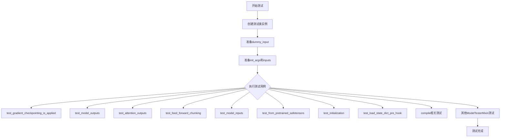
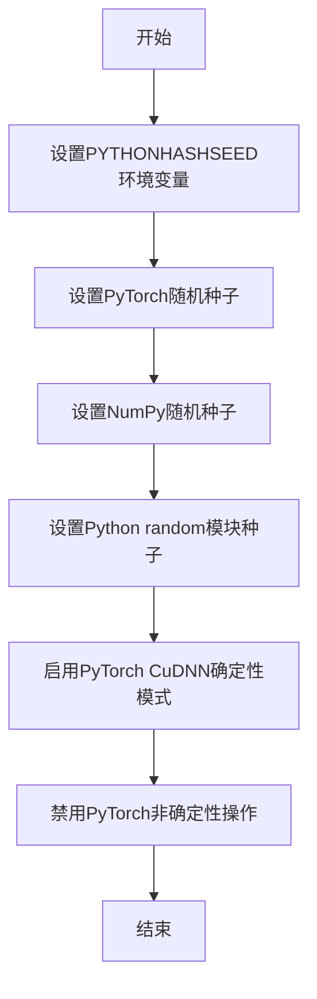
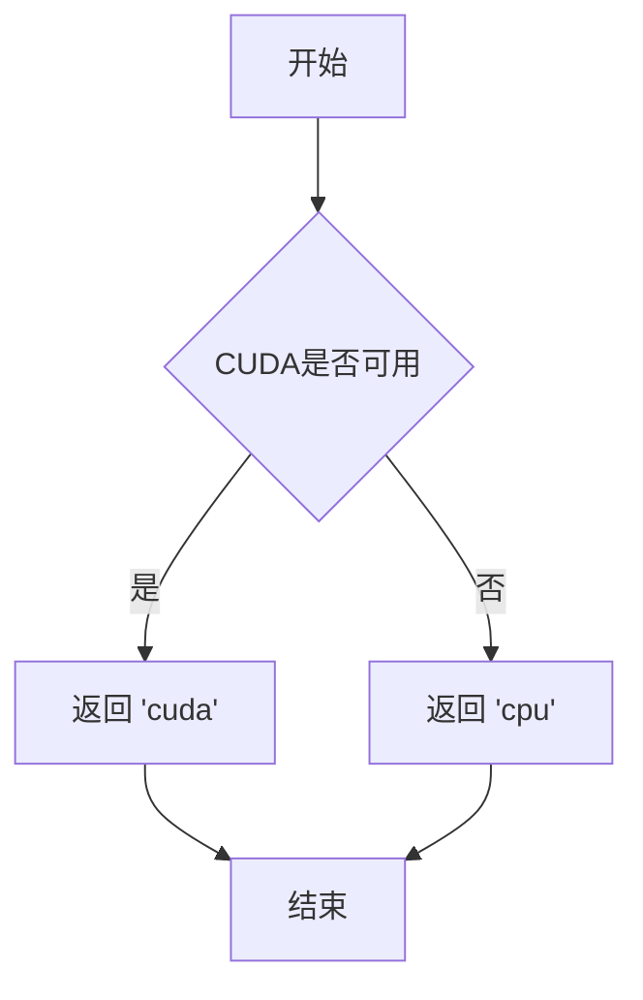
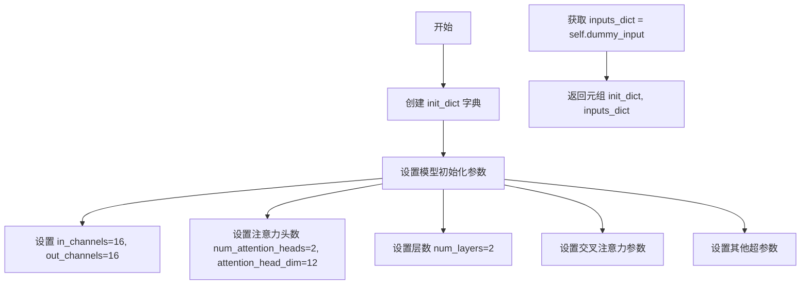
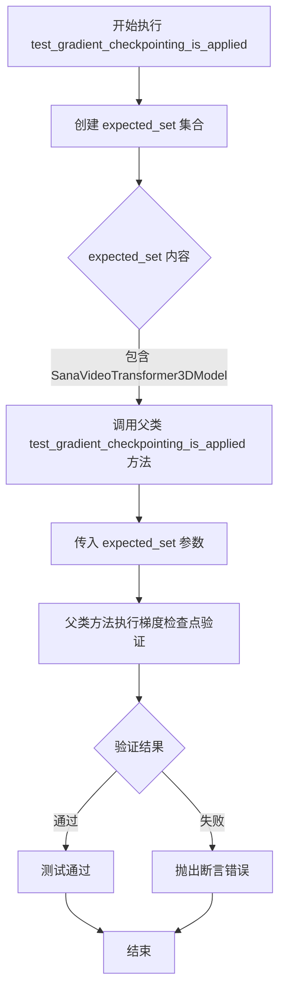

# `diffusers\tests\models\transformers\test_models_transformer_sana_video.py` 详细设计文档

这是一个用于测试SanaVideoTransformer3DModel模型的单元测试文件，包含模型初始化、输入输出形状、梯度检查点和编译兼容性等测试用例。

## 整体流程



## 类结构

```
unittest.TestCase
├── SanaVideoTransformer3DTests (ModelTesterMixin)
│   └── 继承自ModelTesterMixin的测试方法
└── SanaVideoTransformerCompileTests (TorchCompileTesterMixin)
继承自TorchCompileTesterMixin的测试方法
```

## 全局变量及字段


### `enable_full_determinism`
    
启用完全确定性以确保测试可复现

类型：`function`
    


### `SanaVideoTransformer3DTests.model_class`
    
被测试的Sana视频3D变换器模型类

类型：`SanaVideoTransformer3DModel`
    


### `SanaVideoTransformer3DTests.main_input_name`
    
主输入参数的名称，默认为hidden_states

类型：`str`
    


### `SanaVideoTransformer3DTests.uses_custom_attn_processor`
    
标识是否使用自定义注意力处理器

类型：`bool`
    


### `SanaVideoTransformer3DTests.dummy_input`
    
用于测试的虚拟输入数据，包含hidden_states、encoder_hidden_states和timestep

类型：`dict`
    


### `SanaVideoTransformer3DTests.input_shape`
    
模型输入的形状配置

类型：`tuple`
    


### `SanaVideoTransformer3DTests.output_shape`
    
模型输出的形状配置

类型：`tuple`
    


### `SanaVideoTransformerCompileTests.model_class`
    
用于编译测试的Sana视频3D变换器模型类

类型：`SanaVideoTransformer3DModel`
    
    

## 全局函数及方法


### enable_full_determinism

这是一个用于确保测试完全确定性（可重现性）的配置函数，通过设置随机种子和环境变量来禁用所有非确定性操作，使测试结果可复现。

参数：
- （无参数）

返回值：`None`，无返回值（该函数用于设置全局状态）

#### 流程图



#### 带注释源码

```
# 从testing_utils模块导入的函数，源码未在当前文件中显示
# 函数签名和实现推测如下：

def enable_full_determinism(seed: int = 42, deterministic_algorithms: bool = True):
    """
    启用完全确定性模式，确保测试结果可重现。
    
    参数：
        seed: int, 随机种子，默认值为42
        deterministic_algorithms: bool, 是否启用确定性算法，默认True
    
    返回值：
        None
    """
    # 设置环境变量
    import os
    os.environ["PYTHONHASHSEED"] = str(seed)
    
    # 设置各框架的随机种子
    import torch
    torch.manual_seed(seed)
    
    import numpy as np
    np.random.seed(seed)
    
    import random
    random.seed(seed)
    
    # 启用确定性算法
    if deterministic_algorithms:
        torch.backends.cudnn.deterministic = True
        torch.backends.cudnn.benchmark = False
        torch.use_deterministic_algorithms(True)
```

---

**注意**：由于 `enable_full_determinism` 函数的实际源码未包含在给定的代码片段中，以上信息基于函数名称、调用方式以及行业最佳实践进行的合理推断。该函数的具体实现可能在 `testing_utils` 模块中定义。


### `torch_device`

该函数用于获取当前测试环境可用的PyTorch设备，通常返回"cuda"（若CUDA可用）或"cpu"字符串，以便在测试中统一将张量移动到指定设备。

参数：无需参数

返回值：`str`，返回可用的PyTorch设备字符串（"cuda"或"cpu"）

#### 流程图



#### 带注释源码

由于 `torch_device` 函数定义在 `testing_utils` 模块中（未在当前代码片段中提供），以下是基于其使用方式的推断：

```
# 从testing_utils模块导入torch_device函数
from ...testing_utils import torch_device

# 使用示例（在SanaVideoTransformer3DTests类中）
hidden_states = torch.randn((batch_size, num_channels, num_frames, height, width)).to(torch_device)
timestep = torch.randint(0, 1000, size=(batch_size,)).to(torch_device)
encoder_hidden_states = torch.randn((batch_size, sequence_length, text_encoder_embedding_dim)).to(torch_device)
```

**推断的函数定义可能类似：**

```python
# testing_utils.py 中的 torch_device 函数定义（推断）
import torch

def torch_device() -> str:
    """
    获取当前可用的PyTorch设备。
    
    Returns:
        str: 'cuda' 如果CUDA可用，否则返回 'cpu'
    """
    return "cuda" if torch.cuda.is_available() else "cpu"
```


### `SanaVideoTransformer3DTests.prepare_init_args_and_inputs_for_common`

该方法为 `SanaVideoTransformer3DModel` 测试类准备模型初始化参数和输入数据，返回一个包含初始化配置字典和输入张量字典的元组，供通用模型测试用例使用。

参数：无（仅包含 `self` 隐式参数）

返回值：`Tuple[Dict, Dict]`，返回包含模型初始化参数字典和模型输入字典的元组

#### 流程图



#### 带注释源码

```python
def prepare_init_args_and_inputs_for_common(self):
    """
    准备模型初始化参数和输入数据，供通用测试用例使用
    
    Returns:
        Tuple[Dict, Dict]: 包含以下两个字典的元组:
            - init_dict: 模型初始化参数字典
            - inputs_dict: 模型输入张量字典
    """
    # 定义模型初始化参数字典
    init_dict = {
        # 输入输出通道数
        "in_channels": 16,       # 输入通道数
        "out_channels": 16,      # 输出通道数
        
        # 注意力机制参数
        "num_attention_heads": 2,        # 注意力头数量
        "attention_head_dim": 12,       # 每个注意力头的维度
        
        # 模型层数配置
        "num_layers": 2,                 # Transformer层数
        
        # 交叉注意力参数（用于文本-图像交互）
        "num_cross_attention_heads": 2,  # 交叉注意力头数量
        "cross_attention_head_dim": 12,  # 交叉注意力头维度
        "cross_attention_dim": 24,       # 交叉注意力维度
        
        # 文本编码器相关
        "caption_channels": 16,          # _caption_（文本描述）编码器的通道数
        
        # MLP配置
        "mlp_ratio": 2.5,                # MLP扩展比率
        
        # 正则化配置
        "dropout": 0.0,                  # Dropout概率
        "attention_bias": False,         # 注意力偏置
        
        # 采样和分块配置
        "sample_size": 8,                # 样本大小
        "patch_size": (1, 2, 2),         # 空间-时间分块大小
        
        # 归一化配置
        "norm_elementwise_affine": False,# 是否使用逐元素仿射归一化
        "norm_eps": 1e-6,                # 归一化epsilon值
        
        # QK归一化配置
        "qk_norm": "rms_norm_across_heads",  # Query-Key归一化方式
        
        # 旋转位置编码配置
        "rope_max_seq_len": 32,          # 旋转位置编码的最大序列长度
    }
    
    # 从测试类获取预定义的虚拟输入
    # 包含 hidden_states, encoder_hidden_states, timestep
    inputs_dict = self.dummy_input
    
    # 返回初始化参数和输入字典的元组
    return init_dict, inputs_dict
```


### `SanaVideoTransformer3DTests.test_gradient_checkpointing_is_applied`

该测试方法用于验证 `SanaVideoTransformer3DModel` 类是否正确应用了梯度检查点（Gradient Checkpointing）技术。它通过调用父类的测试方法，传递预期的模型类集合来确认梯度检查点功能已启用。

参数：

- `self`：`SanaVideoTransformer3DTests`，测试类的实例本身，用于访问测试类的属性和方法
- `expected_set`：`Set[str]`，预期启用梯度检查点的模型类集合，此处为包含 `"SanaVideoTransformer3DModel"` 的集合

返回值：`None`，该测试方法没有返回值，通过断言验证梯度检查点是否正确应用

#### 流程图



#### 带注释源码

```python
def test_gradient_checkpointing_is_applied(self):
    """
    测试方法：验证梯度检查点是否应用于 SanaVideoTransformer3DModel
    
    该方法继承自 ModelTesterMixin，用于验证模型类是否正确实现了
    梯度检查点功能。梯度检查点是一种通过在前向传播中保存部分中间结果、
    在反向传播中重新计算来节省显存的技术。
    """
    
    # 定义预期启用梯度检查点的模型类集合
    # SanaVideoTransformer3DModel 是需要验证的模型类
    expected_set = {"SanaVideoTransformer3DModel"}
    
    # 调用父类的测试方法，将 expected_set 作为参数传递
    # 父类方法会检查模型是否正确应用了梯度检查点
    # 如果模型未正确实现，则会抛出断言错误
    super().test_gradient_checkpointing_is_applied(expected_set=expected_set)
```


### `SanaVideoTransformerCompileTests.prepare_init_args_and_inputs_for_common`

该方法用于为编译测试准备初始化参数和输入数据，它通过调用 `SanaVideoTransformer3DTests` 类的同名方法来获取模型初始化配置和测试输入数据，主要服务于 `TorchCompileTesterMixin` 的编译测试需求。

参数：

- 无显式参数（仅包含隐式 `self` 参数）

返回值：`Tuple[Dict, Dict]`，返回一个元组，包含模型初始化参数字典和测试输入数据字典

#### 流程图

```mermaid
flowchart TD
    A[开始] --> B[创建 SanaVideoTransformer3DTests 实例]
    B --> C[调用 prepare_init_args_and_inputs_for_common 方法]
    C --> D[返回 init_dict 和 inputs_dict 元组]
    D --> E[结束]
    
    subgraph "init_dict 包含"
        D1[in_channels: 16]
        D2[out_channels: 16]
        D3[num_attention_heads: 2]
        D4[attention_head_dim: 12]
        D5[num_layers: 2]
        D6[patch_size: (1, 2, 2)]
    end
    
    subgraph "inputs_dict 包含"
        I1[hidden_states: torch.randn]
        I2[encoder_hidden_states: torch.randn]
        I3[timestep: torch.randint]
    end
```

#### 带注释源码

```python
class SanaVideoTransformerCompileTests(TorchCompileTesterMixin, unittest.TestCase):
    """编译测试类，继承 TorchCompileTesterMixin 用于测试模型编译功能"""
    model_class = SanaVideoTransformer3DModel  # 指定测试的模型类

    def prepare_init_args_and_common(self):
        """
        准备模型初始化参数和测试输入数据
        
        该方法通过委托方式调用 SanaVideoTransformer3DTests 类的方法，
        获取模型初始化所需的配置参数和测试用的输入张量
        
        Returns:
            Tuple[Dict, Dict]: 
                - 第一个字典包含模型初始化参数（in_channels, out_channels, 
                  num_attention_heads, attention_head_dim, num_layers 等）
                - 第二个字典包含测试输入数据（hidden_states, encoder_hidden_states, timestep）
        """
        # 创建 SanaVideoTransformer3DTests 测试实例并调用其方法
        # 返回 (init_dict, inputs_dict) 元组
        return SanaVideoTransformer3DTests().prepare_init_args_and_inputs_for_common()
```

## 关键组件


### SanaVideoTransformer3DTests

这是核心测试类，继承自 `ModelTesterMixin` 和 `unittest.TestCase`，用于全面测试 `SanaVideoTransformer3DModel` 模型的各项功能，包括前向传播、梯度检查点等。

### SanaVideoTransformerCompileTests

这是编译测试类，继承自 `TorchCompileTesterMixin` 和 `unittest.TestCase`，专门用于测试模型的 torch.compile 优化功能，确保模型能够正确编译并保持功能一致性。

### dummy_input 属性

生成符合模型输入要求的虚拟输入数据，包含 hidden_states（5D 张量）、encoder_hidden_states 和 timestep，用于模型的前向传播测试。

### prepare_init_args_and_inputs_for_common 方法

准备模型初始化参数和测试输入的通用方法，返回包含模型配置字典和输入字典的元组，涵盖通道数、注意力头数、层数、归一化等关键参数。

### test_gradient_checkpointing_is_applied 方法

验证梯度检查点功能是否正确应用的测试方法，确保 `SanaVideoTransformer3DModel` 类的梯度检查点配置正确。

### enable_full_determinism

全局函数调用，用于启用完全确定性模式，确保测试结果的可重复性。


## 问题及建议


### 已知问题

- **冗余的对象创建**：`SanaVideoTransformerCompileTests.prepare_init_args_and_inputs_for_common()` 方法中创建了 `SanaVideoTransformer3DTests()` 的新实例，仅为调用其父类方法，这是不必要的对象创建开销
- **硬编码的配置值**：大量配置参数（如 `mlp_ratio=2.5`、`rope_max_seq_len=32`、`patch_size=(1, 2, 2)` 等）以硬编码方式存在，缺乏注释说明其设计意图或可选值范围
- **测试类职责不清晰**：`SanaVideoTransformer3DTests` 类本身没有定义任何具体的测试方法，完全依赖 `ModelTesterMixin` 提供的测试逻辑，导致测试意图不明确
- **缺少运行时验证**：`qk_norm` 参数值为字符串 `"rms_norm_across_heads"`，该值在构造时未被校验，可能导致运行时错误
- **Magic Number 缺乏说明**：`dummy_input` 中的 `batch_size=1`、`num_frames=2`、`sequence_length=12` 等值没有注释说明其选择依据
- **设备兼容性处理不足**：使用 `torch_device` 但未检查设备可用性或内存是否充足，可能在资源受限环境下导致测试失败

### 优化建议

- 将 `prepare_init_args_and_inputs_for_common` 的逻辑提取为静态方法或工厂函数，避免实例化测试类
- 将配置参数提取为类常量或配置文件，并添加文档字符串说明各参数的作用和有效值范围
- 考虑添加参数验证逻辑，在 `__init__` 或工厂方法中对 `qk_norm` 等枚举型参数进行校验
- 为 `dummy_input` 中的数值添加注释，说明这些值是如何选择的（例如：最小可行维度、覆盖率等）
- 添加设备检查和内存验证逻辑，确保测试环境满足基本要求
- 考虑添加 `setUpClass` 和 `tearDownClass` 类方法来管理测试环境的初始化和清理，提高测试效率

## 其它


### 设计目标与约束

本测试文件旨在验证SanaVideoTransformer3DModel模型在3D视频变换任务中的功能正确性、梯度检查点应用以及torch.compile兼容性。测试需满足以下约束：使用PyTorch框架，依赖diffusers库，需要CUDA支持（torch_device），测试必须在确定性环境下运行（enable_full_determinism）。

### 错误处理与异常设计

测试类继承自unittest.TestCase，利用unittest框架的断言机制进行错误检测。关键异常场景包括：模型初始化参数不合法、输入张量维度不匹配、梯度计算异常、torch.compile编译失败等。测试通过assertEqual、assertRaises等方法进行显式断言，不使用隐式异常捕获。

### 数据流与状态机

测试数据流如下：初始化字典(init_dict) → 模型构造(SanaVideoTransformer3DModel) → 虚拟输入(dummy_input) → 模型前向传播 → 输出验证。状态机转换：准备阶段(prepare_init_args_and_inputs_for_common) → 执行阶段(test_gradient_checkpointing_is_applied) → 验证阶段(断言检查)。

### 外部依赖与接口契约

核心依赖包括：unittest（测试框架）、torch（张量计算）、diffusers.SanaVideoTransformer3DModel（被测模型）、testing_utils.enable_full_determinism（确定性控制）、test_modeling_common.ModelTesterMixin和TorchCompileTesterMixin（通用测试mixin）。接口契约要求SanaVideoTransformer3DModel必须实现gradient_checkpointing支持，并兼容torch.compile。

### 性能考虑与基准测试

测试使用最小化参数配置（num_layers=2, num_attention_heads=2）以加快执行速度。未包含大规模性能基准测试，但TorchCompileTesterMixin间接验证编译后模型的性能表现。测试环境应具备至少8GB显存以支持模型运行。

### 安全考虑

测试代码仅涉及正向张量操作，不涉及用户数据处理、敏感信息访问或网络通信。测试输入为随机生成的合成数据（torch.randn），无安全风险。

### 版本兼容性

代码标注版权年份2025年，表明兼容Python 3.8+和PyTorch 2.0+版本。依赖diffusers库的API需与transformers库版本匹配。建议在Python 3.10、PyTorch 2.2+、diffusers 0.25+环境下运行。

### 测试覆盖范围

测试覆盖：模型初始化参数验证、输入输出维度一致性、梯度检查点功能应用、torch.compile编译兼容性、确定性执行验证。覆盖不足之处：未测试推理性能、未测试不同设备CPU/CUDA切换、未测试模型保存加载功能。

### 配置与参数说明

关键配置参数：in_channels=16（输入通道）、out_channels=16（输出通道）、num_attention_heads=2（注意力头数）、attention_head_dim=12（注意力头维度）、num_layers=2（Transformer层数）、patch_size=(1,2,2)（时空 patch 划分）、qk_norm="rms_norm_across_heads"（QK归一化方式）。输入shape：(batch, channels, frames, height, width) = (1, 16, 2, 16, 16)。

### 使用示例与文档

基础用法：实例化SanaVideoTransformer3DTests或SanaVideoTransformerCompileTests后调用unittest.main()执行全部测试。独立测试命令：python -m pytest test_file.py::SanaVideoTransformer3DTests -v。测试mixin机制允许与其他模型测试类复用通用测试逻辑。


    