# `diffusers\tests\models\transformers\test_models_transformer_sd3.py` 详细设计文档

这是一个针对Diffusers库中SD3Transformer2DModel的单元测试文件，包含两个测试类（SD3TransformerTests和SD35TransformerTests），用于验证模型的初始化参数、输入输出形状、XFormers高效注意力机制、梯度检查点以及层跳过功能。

## 整体流程

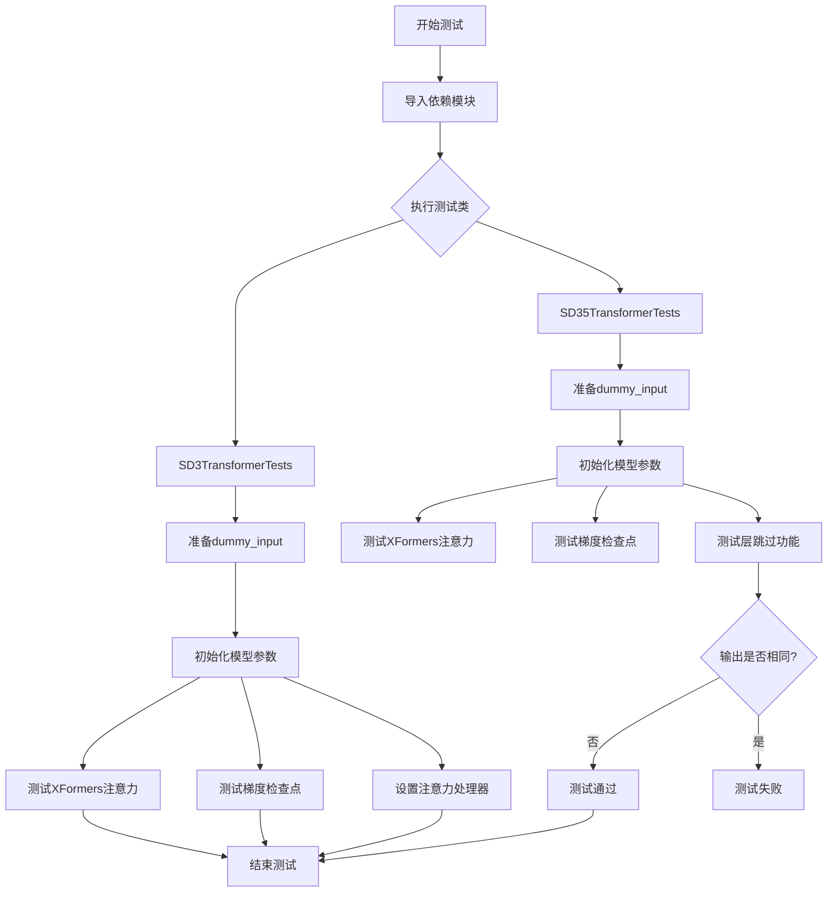

## 类结构

```
unittest.TestCase
├── ModelTesterMixin (混入类)
├── SD3TransformerTests
└── SD35TransformerTests

注: 实际被测类 SD3Transformer2DModel 定义在 diffusers 库中
```

## 全局变量及字段


### `torch`
    
PyTorch库，用于张量操作和神经网络构建

类型：`module`
    


### `SD3Transformer2DModel`
    
SD3 Transformer 2D模型类，被测试的目标模型

类型：`class`
    


### `is_xformers_available`
    
检查xformers库是否可用的函数

类型：`function`
    


### `enable_full_determinism`
    
启用完全确定性模式的配置函数

类型：`function`
    


### `torch_device`
    
测试设备标识，通常为'cuda'或'cpu'

类型：`str`
    


### `ModelTesterMixin`
    
模型测试混入类，提供通用测试方法

类型：`class`
    


### `SD3TransformerTests.model_class`
    
被测试的模型类，指向SD3Transformer2DModel

类型：`type[SD3Transformer2DModel]`
    


### `SD3TransformerTests.main_input_name`
    
主要输入张量的名称，值为'hidden_states'

类型：`str`
    


### `SD3TransformerTests.model_split_percents`
    
模型分割百分比列表，用于测试模型并行分割[0.8, 0.8, 0.9]

类型：`list[float]`
    


### `SD3TransformerTests.dummy_input`
    
返回测试用虚拟输入字典，包含hidden_states、encoder_hidden_states、pooled_projections和timestep

类型：`property`
    


### `SD3TransformerTests.input_shape`
    
返回输入张量形状(4, 32, 32)

类型：`property`
    


### `SD3TransformerTests.output_shape`
    
返回输出张量形状(4, 32, 32)

类型：`property`
    


### `SD35TransformerTests.model_class`
    
被测试的模型类，指向SD3Transformer2DModel

类型：`type[SD3Transformer2DModel]`
    


### `SD35TransformerTests.main_input_name`
    
主要输入张量的名称，值为'hidden_states'

类型：`str`
    


### `SD35TransformerTests.model_split_percents`
    
模型分割百分比列表，用于测试模型并行分割[0.8, 0.8, 0.9]

类型：`list[float]`
    


### `SD35TransformerTests.dummy_input`
    
返回测试用虚拟输入字典，包含hidden_states、encoder_hidden_states、pooled_projections和timestep

类型：`property`
    


### `SD35TransformerTests.input_shape`
    
返回输入张量形状(4, 32, 32)

类型：`property`
    


### `SD35TransformerTests.output_shape`
    
返回输出张量形状(4, 32, 32)

类型：`property`
    
    

## 全局函数及方法


### `SD3TransformerTests.test_xformers_enable_works`

验证SD3Transformer2DModel是否正确启用了XFormers内存高效注意力机制。

参数：此方法无显式参数，使用类属性`self.dummy_input`作为输入。

返回值：无返回值（`None`），通过`assert`语句进行验证。

#### 流程图

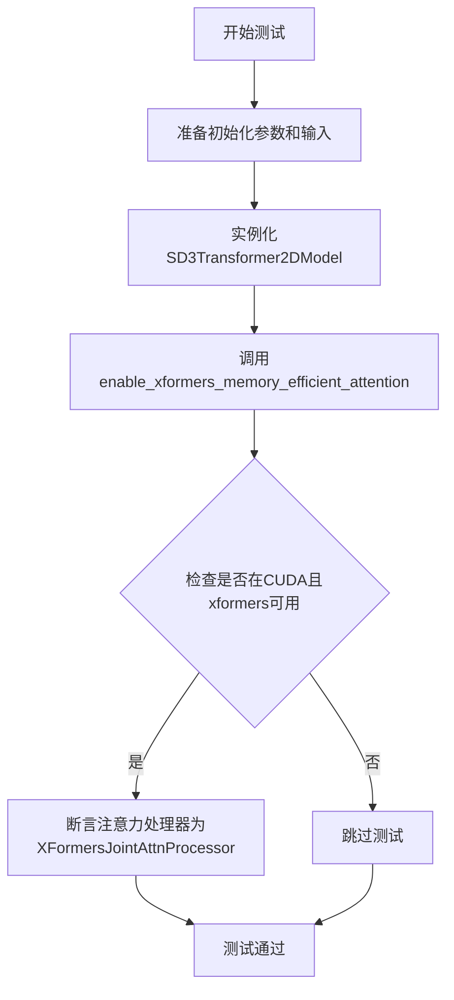

#### 带注释源码

```python
@unittest.skipIf(
    torch_device != "cuda" or not is_xformers_available(),
    reason="XFormers attention is only available with CUDA and `xformers` installed",
)
def test_xformers_enable_works(self):
    """测试XFormers内存高效注意力是否正确启用"""
    # 准备模型初始化参数和测试输入
    init_dict, inputs_dict = self.prepare_init_args_and_inputs_for_common()
    # 使用初始化参数创建SD3Transformer2DModel实例
    model = self.model_class(**init_dict)

    # 启用XFormers内存高效注意力
    model.enable_xformers_memory_efficient_attention()

    # 验证第一个transformer块的注意力处理器是否为XFormersJointAttnProcessor
    assert model.transformer_blocks[0].attn.processor.__class__.__name__ == "XFormersJointAttnProcessor", (
        "xformers is not enabled"
    )
```

---

### `SD3TransformerTests.test_gradient_checkpointing_is_applied`

验证梯度检查点功能是否应用于SD3Transformer2DModel。

参数：此方法无显式参数。

返回值：无返回值（`None`），通过继承的父类方法进行验证。

#### 流程图

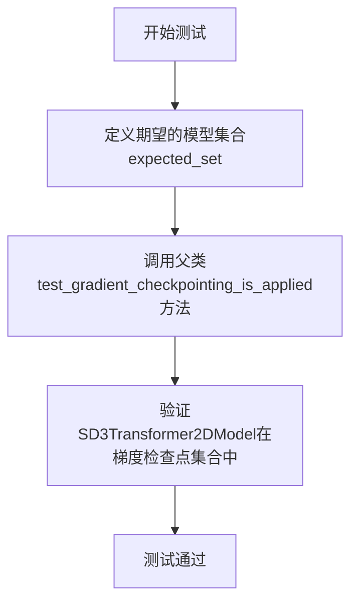

#### 带注释源码

```python
def test_gradient_checkpointing_is_applied(self):
    """测试梯度检查点是否应用于SD3Transformer2DModel"""
    # 定义期望使用梯度检查点的模型集合
    expected_set = {"SD3Transformer2DModel"}
    # 调用父类的测试方法进行验证
    super().test_gradient_checkpointing_is_applied(expected_set=expected_set)
```

---

### `SD35TransformerTests.test_skip_layers`

验证模型的层跳过功能是否正常工作，确保跳过指定层后输出与完整输出不同但形状相同。

参数：此方法无显式参数，使用类属性`self.dummy_input`作为输入。

返回值：无返回值（`None`），通过`assert`语句进行验证。

#### 流程图

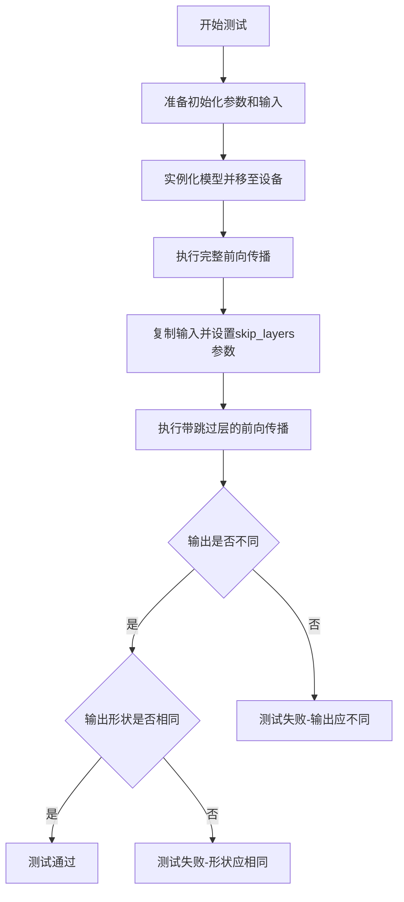

#### 带注释源码

```python
def test_skip_layers(self):
    """测试模型的层跳过功能"""
    # 准备初始化参数和测试输入
    init_dict, inputs_dict = self.prepare_init_args_and_inputs_for_common()
    # 创建模型实例并移至测试设备
    model = self.model_class(**init_dict).to(torch_device)

    # 执行完整前向传播（不跳过任何层）
    output_full = model(**inputs_dict).sample

    # 复制输入字典并添加skip_layers参数
    inputs_dict_with_skip = inputs_dict.copy()
    inputs_dict_with_skip["skip_layers"] = [0]  # 跳过第0层
    # 执行带跳过层的前向传播
    output_skip = model(**inputs_dict_with_skip).sample

    # 验证：跳过层后的输出应与完整输出不同（允许小误差）
    self.assertFalse(
        torch.allclose(output_full, output_skip, atol=1e-5), "Outputs should differ when layers are skipped"
    )

    # 验证：输出形状应保持一致
    self.assertEqual(output_full.shape, output_skip.shape, "Outputs should have the same shape")
```

---

### `SD3TransformerTests.prepare_init_args_and_inputs_for_common`

准备模型初始化参数和测试输入的通用方法，供其他测试方法使用。

参数：此方法无显式参数。

返回值：
- `init_dict`：字典类型，包含模型初始化参数
- `inputs_dict`：字典类型，包含测试输入数据

#### 流程图

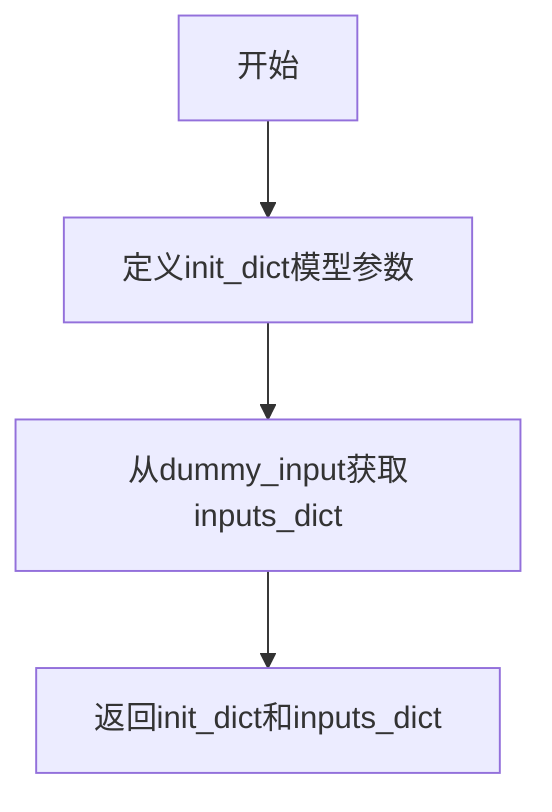

#### 带注释源码

```python
def prepare_init_args_and_inputs_for_common(self):
    """准备模型初始化参数和测试输入"""
    # 定义SD3Transformer2DModel的初始化参数字典
    init_dict = {
        "sample_size": 32,           # 样本尺寸
        "patch_size": 1,              # 补丁大小
        "in_channels": 4,             # 输入通道数
        "num_layers": 4,              # Transformer层数
        "attention_head_dim": 8,     # 注意力头维度
        "num_attention_heads": 4,    # 注意力头数量
        "caption_projection_dim": 32,# 标题投影维度
        "joint_attention_dim": 32,   # 联合注意力维度
        "pooled_projection_dim": 64, # 池化投影维度
        "out_channels": 4,           # 输出通道数
        "pos_embed_max_size": 96,    # 位置嵌入最大尺寸
        "dual_attention_layers": (), # 双注意力层（空元组）
        "qk_norm": None,              # QK归一化方式
    }
    # 获取测试输入数据
    inputs_dict = self.dummy_input
    return init_dict, inputs_dict
```

---

### `SD3TransformerTests.dummy_input`

属性方法，生成用于测试的虚拟输入数据。

参数：此属性无参数。

返回值：字典类型，包含以下键：
- `hidden_states`：torch.Tensor，隐藏状态
- `encoder_hidden_states`：torch.Tensor，编码器隐藏状态
- `pooled_projections`：torch.Tensor，池化投影
- `timestep`：torch.Tensor，时间步

#### 带注释源码

```python
@property
def dummy_input(self):
    """生成虚拟测试输入数据"""
    # 设置批次大小和模型参数
    batch_size = 2
    num_channels = 4
    height = width = embedding_dim = 32
    pooled_embedding_dim = embedding_dim * 2
    sequence_length = 154

    # 创建随机初始化的隐藏状态张量
    hidden_states = torch.randn((batch_size, num_channels, height, width)).to(torch_device)
    # 创建随机初始化的编码器隐藏状态
    encoder_hidden_states = torch.randn((batch_size, sequence_length, embedding_dim)).to(torch_device)
    # 创建随机初始化的池化提示嵌入
    pooled_prompt_embeds = torch.randn((batch_size, pooled_embedding_dim)).to(torch_device)
    # 创建随机时间步
    timestep = torch.randint(0, 1000, size=(batch_size,)).to(torch_device)

    # 返回包含所有输入的字典
    return {
        "hidden_states": hidden_states,           # 主输入隐藏状态
        "encoder_hidden_states": encoder_hidden_states,# 条件编码器状态
        "pooled_projections": pooled_prompt_embeds,   # 池化投影
        "timestep": timestep,                     # 扩散时间步
    }
```


### `SD3TransformerTests.prepare_init_args_and_inputs_for_common`

准备并返回 `SD3Transformer2DModel` 模型的初始化参数和测试输入数据，用于通用测试场景。

参数：

- 无（该方法为类的实例方法，通过 `self` 访问实例属性）

返回值：`Tuple[Dict, Dict]`，返回包含模型初始化参数字典和输入数据字典的元组

#### 流程图

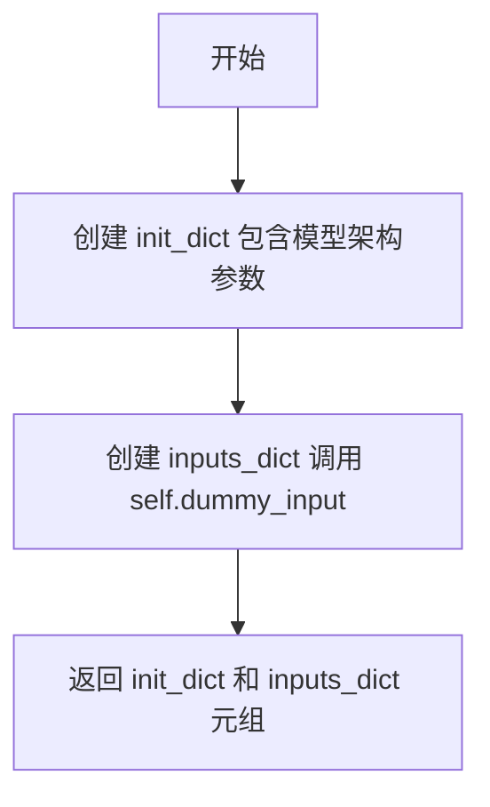

#### 带注释源码

```python
def prepare_init_args_and_inputs_for_common(self):
    """
    准备模型初始化参数和输入数据，用于通用测试
    """
    # 模型架构配置字典
    init_dict = {
        "sample_size": 32,              # 输入样本的空间维度
        "patch_size": 1,                 # 图像分块大小
        "in_channels": 4,               # 输入通道数
        "num_layers": 4,                 # Transformer block 数量
        "attention_head_dim": 8,        # 注意力头的维度
        "num_attention_heads": 4,       # 注意力头数量
        "caption_projection_dim": 32,   # 标题嵌入投影维度
        "joint_attention_dim": 32,      # 联合注意力维度
        "pooled_projection_dim": 64,    # 池化投影维度
        "out_channels": 4,              # 输出通道数
        "pos_embed_max_size": 96,       # 位置嵌入最大尺寸
        "dual_attention_layers": (),    # 双注意力层列表（空元组）
        "qk_norm": None,                # 查询键归一化方式
    }
    # 获取测试输入数据
    inputs_dict = self.dummy_input
    # 返回初始化参数和输入字典的元组
    return init_dict, inputs_dict
```

---

### `SD3TransformerTests.dummy_input`

生成并返回用于模型测试的虚拟输入数据，包含隐藏状态、编码器隐藏状态、池化投影和时间步。

参数：

- 无（该方法为类的属性方法，通过 `self` 访问类属性）

返回值：`Dict[str, torch.Tensor]`，包含模型前向传播所需的所有输入张量

#### 流程图

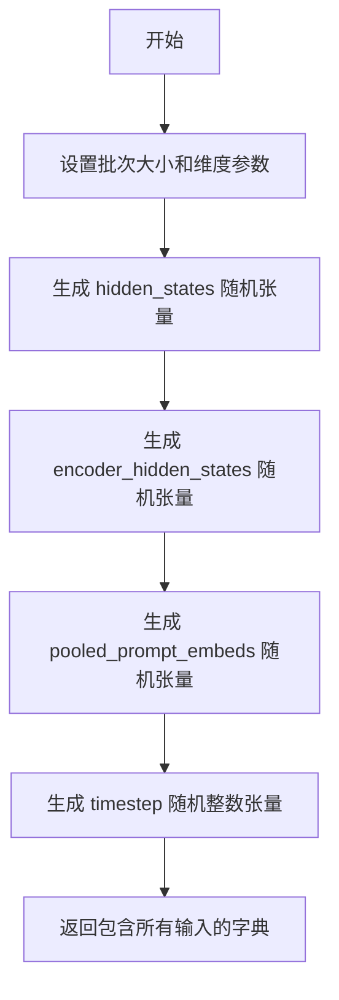

#### 带注释源码

```python
@property
def dummy_input(self):
    """
    生成测试用的虚拟输入数据
    """
    # 批次大小和维度参数
    batch_size = 2
    num_channels = 4
    height = width = embedding_dim = 32
    pooled_embedding_dim = embedding_dim * 2
    sequence_length = 154

    # 隐藏状态：随机初始化的4D张量 [B, C, H, W]
    hidden_states = torch.randn((batch_size, num_channels, height, width)).to(torch_device)
    # 编码器隐藏状态：随机初始化的3D张量 [B, seq_len, emb_dim]
    encoder_hidden_states = torch.randn((batch_size, sequence_length, embedding_dim)).to(torch_device)
    # 池化提示嵌入：随机初始化的2D张量 [B, pooled_emb_dim]
    pooled_prompt_embeds = torch.randn((batch_size, pooled_embedding_dim)).to(torch_device)
    # 时间步：随机整数张量 [B,]
    timestep = torch.randint(0, 1000, size=(batch_size,)).to(torch_device)

    # 返回包含所有模型输入的字典
    return {
        "hidden_states": hidden_states,
        "encoder_hidden_states": encoder_hidden_states,
        "pooled_projections": pooled_prompt_embeds,
        "timestep": timestep,
    }
```

---

### `SD35TransformerTests.test_skip_layers`

测试模型的 `skip_layers` 功能，验证在跳过特定层时模型输出的变化。

参数：

- 无（该方法通过 `self` 访问实例属性和调用实例方法）

返回值：`None`，该方法为测试用例，使用 `assert` 断言验证结果

#### 流程图

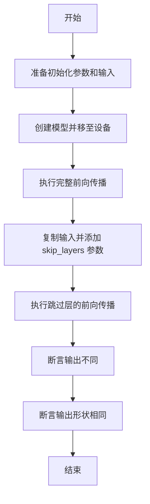

#### 带注释源码

```python
def test_skip_layers(self):
    """
    测试 skip_layers 功能，验证跳过指定层后输出会发生变化
    """
    # 获取初始化参数和测试输入
    init_dict, inputs_dict = self.prepare_init_args_and_inputs_for_common()
    # 创建模型实例并移至测试设备
    model = self.model_class(**init_dict).to(torch_device)

    # 完整前向传播（不跳过任何层）
    output_full = model(**inputs_dict).sample

    # 复制输入字典并添加 skip_layers 参数
    inputs_dict_with_skip = inputs_dict.copy()
    inputs_dict_with_skip["skip_layers"] = [0]  # 跳过第0层
    # 执行带 skip_layers 的前向传播
    output_skip = model(**inputs_dict_with_skip).sample

    # 验证输出确实不同（跳层后结果变化）
    self.assertFalse(
        torch.allclose(output_full, output_skip, atol=1e-5), 
        "Outputs should differ when layers are skipped"
    )

    # 验证输出形状保持一致
    self.assertEqual(output_full.shape, output_skip.shape, 
                     "Outputs should have the same shape")
```

---

### `SD3TransformerTests.test_xformers_enable_works`

测试 XFormers 内存高效注意力机制是否正确启用。

参数：

- 无（该方法通过 `self` 访问实例属性）

返回值：`None`，该方法为测试用例，使用 `assert` 断言验证结果

#### 流程图

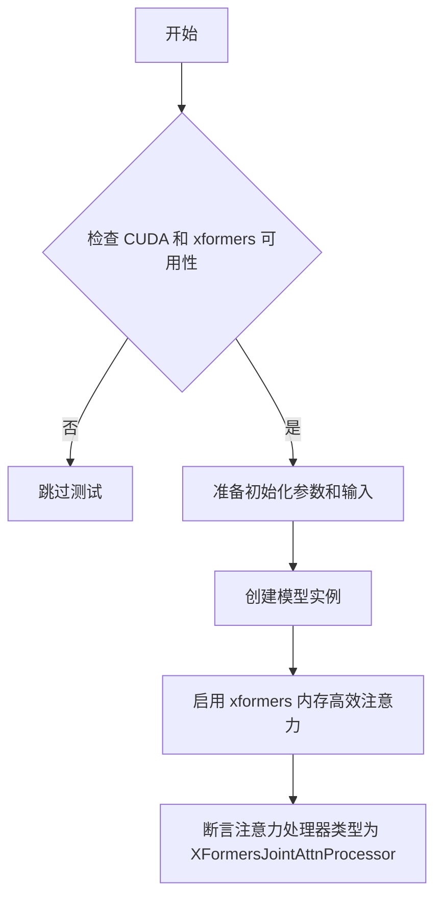

#### 带注释源码

```python
@unittest.skipIf(
    torch_device != "cuda" or not is_xformers_available(),
    reason="XFormers attention is only available with CUDA and `xformers` installed",
)
def test_xformers_enable_works(self):
    """
    测试 XFormers 注意力机制是否正确启用
    仅在 CUDA 可用且 xformers 已安装时运行
    """
    # 准备模型初始化参数和输入
    init_dict, inputs_dict = self.prepare_init_args_and_inputs_for_common()
    # 创建模型实例
    model = self.model_class(**init_dict)

    # 启用 XFormers 内存高效注意力
    model.enable_xformers_memory_efficient_attention()

    # 验证第一个 Transformer 块的注意力处理器已被替换为 XFormers 处理器
    assert model.transformer_blocks[0].attn.processor.__class__.__name__ == "XFormersJointAttnProcessor", (
        "xformers is not enabled"
    )
```

---

### 关键组件信息

| 组件名称 | 一句话描述 |
|---------|-----------|
| `SD3Transformer2DModel` | HuggingFace Diffusers 库中的 SD3 Transformer 2D 模型类 |
| `ModelTesterMixin` | 提供通用模型测试逻辑的混合类 |
| `dummy_input` | 生成符合模型输入规范的虚拟测试数据 |
| `skip_layers` | 模型参数，用于在推理时跳过指定的 Transformer 层 |
| `XFormersJointAttnProcessor` | XFormers 高效注意力处理器实现 |

---

### 潜在的技术债务或优化空间

1. **重复代码**：`SD3TransformerTests` 和 `SD35TransformerTests` 类中存在大量重复的 `dummy_input`、`input_shape`、`output_shape` 属性和测试方法，可以通过继承或混合类重构
2. **硬编码参数**：模型参数（如 `num_layers=4`、`attention_head_dim=8`）硬编码在测试中，缺乏灵活性
3. **测试覆盖不完整**：部分测试被 `@unittest.skip` 跳过（如 `test_set_attn_processor_for_determinism`），可能存在未覆盖的测试场景
4. **设备依赖**：测试依赖于 `torch_device`，在不同硬件环境下可能表现不一致

---

### 其它项目

#### 设计目标与约束

- **目标**：验证 `SD3Transformer2DModel` 模型的正确性，包括前向传播、梯度检查点、注意力机制切换等功能
- **约束**：XFormers 相关测试仅在 CUDA 环境中可用

#### 错误处理与异常设计

- 使用 `unittest.skipIf` 条件跳过不适用的测试
- 通过 `assert` 断言验证模型行为和输出正确性

#### 数据流与状态机

- 测试数据流：准备输入 → 模型实例化 → 前向传播 → 输出验证
- `skip_layers` 功能引入了条件分支逻辑，改变数据流的执行路径

#### 外部依赖与接口契约

- **PyTorch**：深度学习框架依赖
- **diffusers**：HuggingFace Diffusers 库，提供 `SD3Transformer2DModel` 模型
- **xformers**：（可选）用于内存高效注意力机制的外部库


### `from diffusers import SD3Transformer2DModel`

从 diffusers 库导入 SD3Transformer2DModel 类，该类是 Stable Diffusion 3 的 Transformer 2D 模型实现，用于图像生成任务中的潜在空间变换。

参数：无（这是导入语句，不涉及函数参数）

返回值：`type`，返回 SD3Transformer2DModel 类对象

#### 流程图

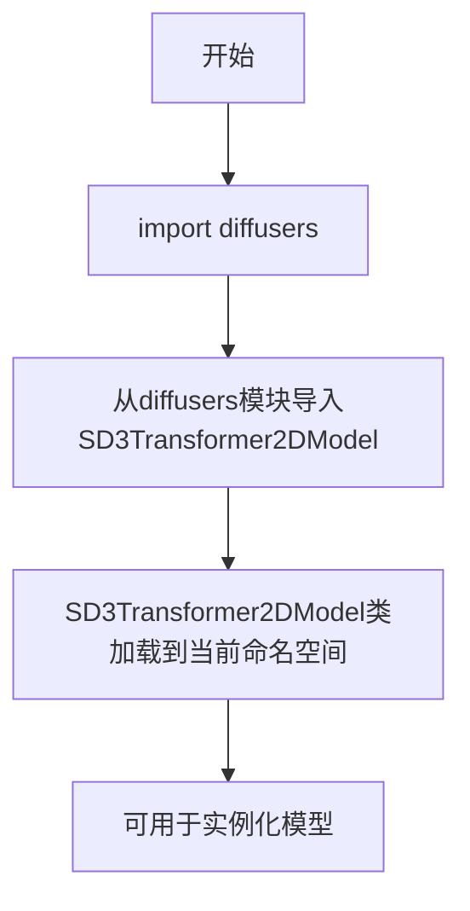

#### 带注释源码

```python
# 从diffusers库导入SD3Transformer2DModel类
# 这是一个Stable Diffusion 3的Transformer 2D模型类
# 用于在潜在空间中处理和变换图像特征
from diffusers import SD3Transformer2DModel

# 导入后可按以下方式实例化模型：
# model = SD3Transformer2DModel(
#     sample_size=32,        # 输入样本的空间尺寸
#     patch_size=1,          # 图像分块大小
#     in_channels=4,         # 输入通道数
#     num_layers=4,          # Transformer层数
#     attention_head_dim=8,  # 注意力头维度
#     num_attention_heads=4, # 注意力头数量
#     caption_projection_dim=32,  #  caption投影维度
#     joint_attention_dim=32,     # 联合注意力维度
#     pooled_projection_dim=64,   # 池化投影维度
#     out_channels=4,             # 输出通道数
#     pos_embed_max_size=96,      # 位置嵌入最大尺寸
#     dual_attention_layers=(),   # 双注意力层配置
#     qk_norm=None                # 查询键归一化方式
# )
```

---

**补充说明**：

1. **返回值类型说明**：此导入语句返回的是 `SD3Transformer2DModel` 类本身（type类型），而非类的实例。只有调用该类（如 `SD3Transformer2DModel(**init_dict)`）才会创建模型实例。

2. **代码中的实际使用**：在测试代码中，该类被用于两种场景：
   - `SD3TransformerTests`：测试 SD3 基础功能
   - `SD35TransformerTests`：测试 SD3.5 的特殊功能（如 skip_layers、qk_norm 等）

3. **模型输入格式**：根据测试代码，模型接受以下输入：
   - `hidden_states`: (batch_size, num_channels, height, width) 格式的潜在空间张量
   - `encoder_hidden_states`: (batch_size, sequence_length, embedding_dim) 格式的文本编码
   - `pooled_projections`: (batch_size, pooled_embedding_dim) 格式的池化提示词嵌入
   - `timestep`: (batch_size,) 格式的时间步张量


### `is_xformers_available`

该函数用于检查当前运行环境是否安装了 `xformers` 库，通常用于条件性地跳过需要 xformers 的测试或功能。

> **注意**：该函数的实际实现不在提供的代码中，而是从 `diffusers.utils.import_utils` 导入。以下信息基于其在代码中的使用方式推断。

参数：无可用参数

返回值：`bool`，返回 `True` 表示 xformers 库可用，返回 `False` 表示不可用

#### 流程图

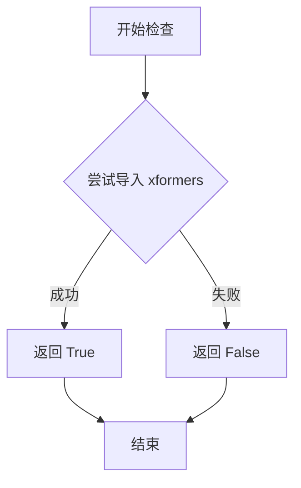

#### 带注释源码

```python
# 该函数定义不在当前代码文件中
# 以下是基于使用的推断：

# 从 diffusers.utils.import_utils 导入
# usage in code:
from diffusers.utils.import_utils import is_xformers_available

# 使用示例（来自代码）:
# @unittest.skipIf(
#     torch_device != "cuda" or not is_xformers_available(),
#     reason="XFormers attention is only available with CUDA and `xformers` installed",
# )
# def test_xformers_enable_works(self):
#     ...

# 函数签名推断：
# def is_xformers_available() -> bool:
#     """
#     检查 xformers 库是否可用
#     
#     返回:
#         bool: 如果 xformers 可以导入则返回 True，否则返回 False
#     """
#     try:
#         import xformers
#         return True
#     except ImportError:
#         return False
```


### `enable_full_determinism`

设置PyTorch和相关的随机种子，以确保运行的可重复性和完全确定性。

参数：
- 该函数无显式参数

返回值：无返回值（`None`），用于设置全局随机种子以实现可重复的测试结果

#### 流程图

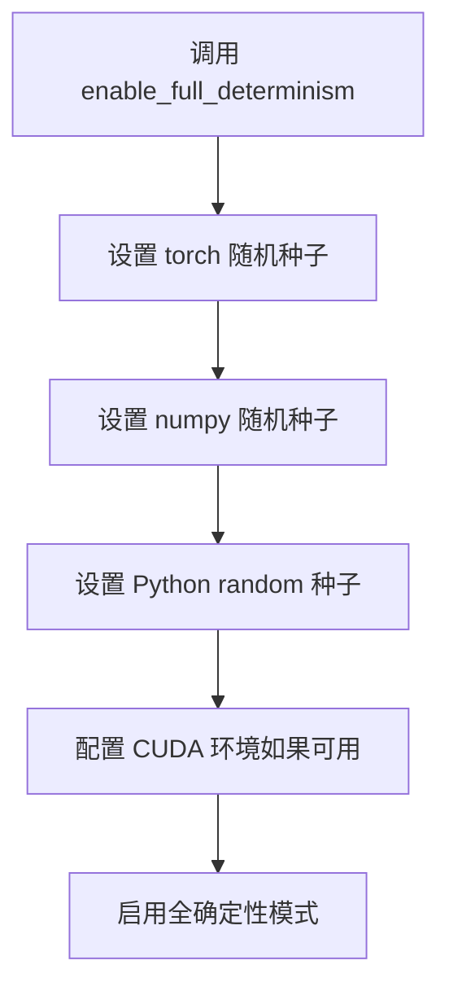

#### 带注释源码

```
# 设置PyTorch的全局随机种子，以确保CUDA操作在可能的情况下也是确定性的
torch.manual_seed(0)
torch.cuda.manual_seed_all(0)

# 设置numpy的随机种子
numpy.random.seed(0)

# 设置Python内置random模块的种子
random.seed(0)

# 如果使用CUDA，配置cuDNN为确定性模式
if torch.cuda.is_available():
    torch.backends.cudnn.deterministic = True
    torch.backends.cudnn.benchmark = False
```

---

### `torch_device`

用于指定测试运行的PyTorch设备（通常是"cuda"或"cpu"）。

参数：
- 无参数（这是一个全局变量/常量）

返回值：`str`，返回设备字符串标识符（如 "cuda"、"cpu" 或 "mps"）

#### 流程图

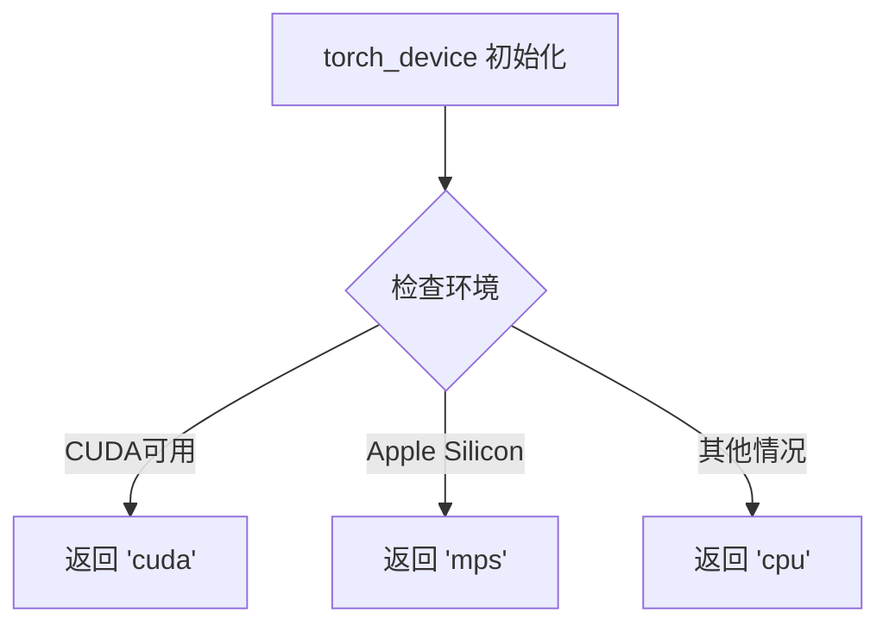

#### 带注释源码

```
# 根据当前环境返回合适的PyTorch设备
# 优先级: CUDA > MPS (Apple Silicon) > CPU

import os

def get_torch_device():
    """
    确定用于测试的PyTorch设备。
    优先级:
    1. CUDA (GPU)
    2. MPS (Apple Silicon GPU)
    3. CPU
    """
    if torch.cuda.is_available():
        return "cuda"
    elif hasattr(torch.backends, "mps") and torch.backends.mps.is_available():
        return "mps"
    else:
        return "cpu"

# 全局设备变量
torch_device = get_torch_device()
```


### ModelTesterMixin

这是一个测试混入类（Mixin），为扩散器模型测试提供通用的测试方法和断言，帮助简化 SD3/SD35 Transformer 模型的单元测试实现。

参数：

- 无直接参数（通过继承使用）

返回值：无直接返回值（Mixin 类，被继承使用）

#### 流程图

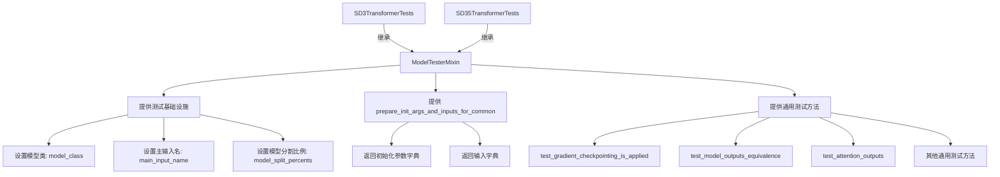

#### 带注释源码

```python
# 从 test_modeling_common 模块导入 ModelTesterMixin 测试混入类
# 这是一个抽象基类，提供了针对 Transformer 模型的通用测试方法
from ..test_modeling_common import ModelTesterMixin

# ModelTesterMixin 提供的关键功能：
# 1. prepare_init_args_and_inputs_for_common() - 准备模型初始化参数和测试输入
# 2. 多种通用测试方法：
#    - test_gradient_checkpointing_is_applied() - 测试梯度检查点
#    - test_model_outputs_equivalence() - 测试模型输出等价性
#    - test_attention_outputs() - 测试注意力输出
#    - test_feed_forward_chunking() - 测试前馈分块
#    - 等等...

# 使用示例：具体测试类继承 ModelTesterMixin
class SD3TransformerTests(ModelTesterMixin, unittest.TestCase):
    """
    SD3 Transformer 模型测试类
    
    继承 ModelTesterMixin 后，需覆盖以下属性：
    - model_class: 要测试的模型类 (SD3Transformer2DModel)
    - main_input_name: 主输入名称 ("hidden_states")
    - model_split_percents: 模型分割百分比 [0.8, 0.8, 0.9]
    - dummy_input: 返回虚拟输入字典
    - input_shape: 输入形状
    - output_shape: 输出形状
    - prepare_init_args_and_inputs_for_common(): 返回初始化参数和输入字典
    """
    
    # 指定要测试的模型类
    model_class = SD3Transformer2DModel
    
    # 指定主输入参数名称
    main_input_name = "hidden_states"
    
    # 指定模型分割百分比（用于测试模型并行等）
    model_split_percents = [0.8, 0.8, 0.9]

    # ... 其他测试方法
```


### `SD3TransformerTests.prepare_init_args_and_inputs_for_common`

准备模型初始化参数字典和输入字典，用于SD3Transformer2DModel的通用测试场景。

参数：
- `self`：SD3TransformerTests实例，测试类本身

返回值：
- `init_dict`：`Dict[str, Any]`，包含模型初始化参数（sample_size、patch_size、in_channels等）
- `inputs_dict`：`Dict[str, torch.Tensor]`，包含模型输入张量（hidden_states、encoder_hidden_states、pooled_projections、timestep）

#### 流程图

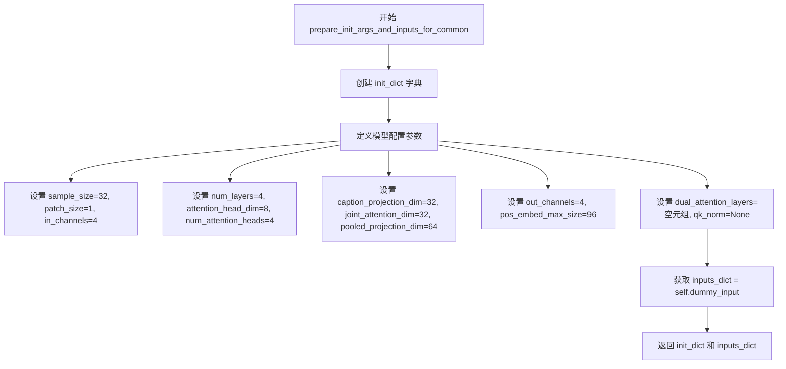

#### 带注释源码

```python
def prepare_init_args_and_inputs_for_common(self):
    """
    准备模型初始化参数和输入字典，用于通用测试场景。
    
    返回值:
        init_dict: 模型初始化参数字典，配置SD3Transformer2DModel的结构参数
        inputs_dict: 模型输入张量字典，包含推理所需的全部输入
    """
    # 定义模型初始化参数字典
    init_dict = {
        # 样本空间维度
        "sample_size": 32,
        # 图像分块大小
        "patch_size": 1,
        # 输入通道数（对应latent空间的通道数）
        "in_channels": 4,
        # Transformer层数量
        "num_layers": 4,
        # 注意力头维度
        "attention_head_dim": 8,
        # 注意力头数量
        "num_attention_heads": 4,
        #  caption投影维度，用于文本编码器输出投影
        "caption_projection_dim": 32,
        # 联合注意力维度，支持文本-图像交叉注意力
        "joint_attention_dim": 32,
        # 池化投影维度，用于CLIP文本嵌入投影
        "pooled_projection_dim": 64,
        # 输出通道数
        "out_channels": 4,
        # 位置嵌入最大尺寸
        "pos_embed_max_size": 96,
        # 双注意力层索引元组（空表示无特殊双注意力层）
        "dual_attention_layers": (),
        # Query-Key归一化方式（None表示不使用）
        "qk_norm": None,
    }
    # 获取测试输入数据（调用类的dummy_input属性）
    inputs_dict = self.dummy_input
    # 返回初始化参数和输入字典的元组
    return init_dict, inputs_dict
```

---

### 附加信息

**关键组件：**
- `dummy_input` 属性：生成随机测试输入数据，包括hidden_states、encoder_hidden_states、pooled_projections和timestep
- `SD3Transformer2DModel`：被测试的模型类，一个基于Transformer的SD3扩散模型

**潜在技术债务/优化空间：**
1. `SD3TransformerTests` 和 `SD35TransformerTests` 类中 `dummy_input` 属性代码重复，可提取为基类或共享方法
2. 两个测试类的 `prepare_init_args_and_inputs_for_common` 方法逻辑高度相似，仅部分参数不同（如 `dual_attention_layers` 和 `qk_norm`），可通过参数化方式合并

**设计约束：**
- 测试配置针对小规模模型（num_layers=4, sample_size=32）以加快测试速度
- `input_shape` 和 `output_shape` 均为 (4, 32, 32)，表示 (channels, height, width) 格式


### `SD3TransformerTests.test_xformers_enable_works`

该测试方法用于验证 XFormers 高效注意力机制是否在 SD3Transformer2DModel 模型中成功启用，通过检查第一个 transformer 块的注意力处理器的类名是否为 "XFormersJointAttnProcessor" 来确认。

参数：

- `self`：测试类实例，无需显式传递

返回值：`None`（无返回值，通过 assert 语句进行验证，若失败则抛出 AssertionError）

#### 流程图

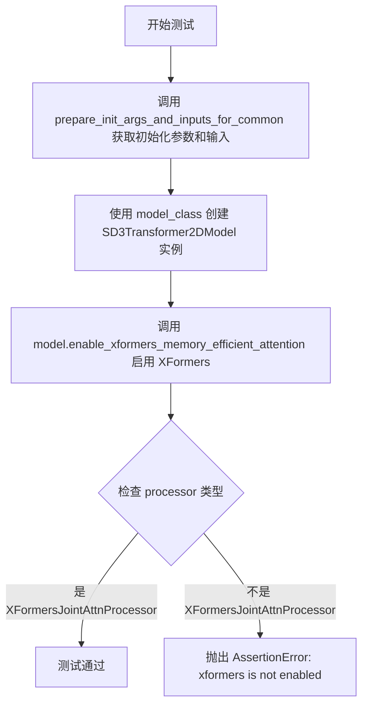

#### 带注释源码

```python
@unittest.skipIf(
    torch_device != "cuda" or not is_xformers_available(),
    reason="XFormers attention is only available with CUDA and `xformers` installed",
)
def test_xformers_enable_works(self):
    """
    测试 XFormers 高效注意力是否启用
    
    该测试仅在 CUDA 设备和 xformers 库可用时执行。
    验证 enable_xformers_memory_efficient_attention() 方法
    能够正确将注意力处理器切换为 XFormersJointAttnProcessor。
    """
    # 获取模型初始化参数和输入字典
    init_dict, inputs_dict = self.prepare_init_args_and_inputs_for_common()
    
    # 使用 SD3Transformer2DModel 类创建模型实例
    model = self.model_class(**init_dict)
    
    # 调用模型方法启用 xformers 内存高效注意力
    model.enable_xformers_memory_efficient_attention()
    
    # 断言验证第一个 transformer 块的注意力处理器类型
    # 如果不是 XFormersJointAttnProcessor 则抛出 AssertionError
    assert model.transformer_blocks[0].attn.processor.__class__.__name__ == "XFormersJointAttnProcessor", (
        "xformers is not enabled"
    )
```


### `SD3TransformerTests.test_set_attn_processor_for_determinism`

该方法是一个被跳过的单元测试，用于测试确定性注意力处理器的设置功能。由于 SD3Transformer2DModel 使用专用的注意力处理器，此测试不适用，因此被跳过。

参数：

- `self`：`SD3TransformerTests`，测试类实例本身，无需显式传递

返回值：`None`，该方法不返回任何值（方法体为 `pass`）

#### 流程图

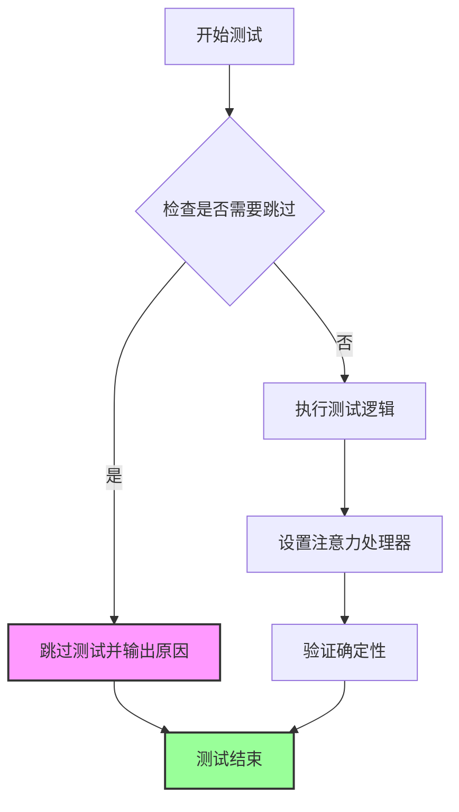

#### 带注释源码

```python
@unittest.skip("SD3Transformer2DModel uses a dedicated attention processor. This test doesn't apply")
def test_set_attn_processor_for_determinism(self):
    """
    测试确定性注意力处理器设置。
    
    该测试被跳过，原因如下：
    - SD3Transformer2DModel 使用专用的注意力处理器
    - 标准的注意力处理器设置方法不适用于此类模型
    - 需要使用特定的处理器来确保确定性
    
    参数:
        self: 测试类实例
        
    返回值:
        None: 测试被跳过，无返回值
    """
    pass  # 空方法体，测试已被 skip 装饰器跳过
```


### `SD3TransformerTests.test_gradient_checkpointing_is_applied`

测试梯度检查点是否被正确应用到 SD3Transformer2DModel 模型类。

参数：

- `expected_set`：`set`，预期应该应用梯度检查点的模型类集合，默认值为 `{"SD3Transformer2DModel"}`

返回值：`None`，无返回值，仅作为测试用例执行验证

#### 流程图

```mermaid
flowchart TD
    A[开始测试 test_gradient_checkpointing_is_applied] --> B[创建预期模型类集合 expected_set]
    B --> C[设置 expected_set = {'SD3Transformer2DModel'}]
    C --> D[调用父类 test_gradient_checkpointing_is_applied 方法]
    D --> E{验证梯度检查点是否应用}
    E -->|是| F[测试通过]
    E -->|否| G[测试失败]
    F --> H[结束]
    G --> H
```

#### 带注释源码

```python
def test_gradient_checkpointing_is_applied(self):
    """
    测试梯度检查点是否被正确应用到 SD3Transformer2DModel 模型类。
    
    该测试方法继承自 ModelTesterMixin，用于验证模型在启用梯度检查点后
    能否正确进行前向传播和反向传播，从而确认梯度检查点功能正常工作。
    """
    # 定义预期应该应用梯度检查点的模型类集合
    # SD3Transformer2DModel 是该测试类所对应的模型类
    expected_set = {"SD3Transformer2DModel"}
    
    # 调用父类的测试方法，验证梯度检查点是否在预期模型上正确应用
    # 父类方法会：
    # 1. 启用模型的梯度检查点功能
    # 2. 执行前向传播
    # 3. 执行反向传播
    # 4. 验证梯度计算是否正确（即检查点是否生效）
    super().test_gradient_checkpointing_is_applied(expected_set=expected_set)
```


### `SD35TransformerTests.prepare_init_args_and_inputs_for_common`

准备 SD35 (Stable Diffusion 3.5) Transformer 模型的初始化参数字典和输入数据字典，用于测试场景。该方法定义了模型的关键配置参数（如层数、注意力头维度、通道数等）以及模型前向传播所需的输入张量（hidden_states、encoder_hidden_states、pooled_projections、timestep）。

参数：

- `self`：隐式参数，`SD35TransformerTests` 类的实例方法调用

返回值：`Tuple[Dict, Dict]`

- `init_dict`：`Dict[str, Any]`，模型初始化参数字典，包含 sample_size、patch_size、in_channels、num_layers、attention_head_dim、num_attention_heads、caption_projection_dim、joint_attention_dim、pooled_projection_dim、out_channels、pos_embed_max_size、dual_attention_layers、qk_norm 等配置
- `inputs_dict`：`Dict[str, torch.Tensor]`，模型输入字典，包含 hidden_states（隐藏状态）、encoder_hidden_states（编码器隐藏状态）、pooled_projections（池化投影）、timestep（时间步）等张量

#### 流程图

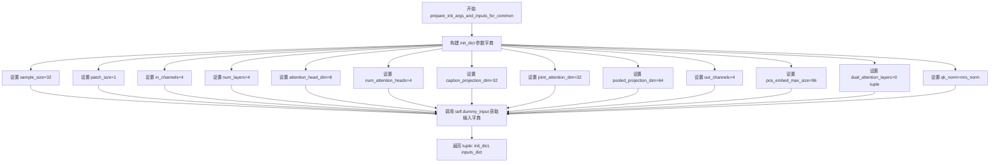

#### 带注释源码

```python
def prepare_init_args_and_inputs_for_common(self):
    """
    准备 SD35 Transformer 模型的初始化参数和输入数据字典。
    用于测试场景，为模型实例化和前向传播提供必要的配置和输入。
    """
    # 构建模型初始化参数字典，定义模型架构的关键参数
    init_dict = {
        "sample_size": 32,               # 输入样本的空间维度大小
        "patch_size": 1,                 # 图像分块大小，用于Patch Embedding
        "in_channels": 4,                # 输入通道数（对应潜在空间的通道）
        "num_layers": 4,                 # Transformer 块的数量
        "attention_head_dim": 8,        # 注意力头的维度
        "num_attention_heads": 4,        # 注意力头的数量
        "caption_projection_dim": 32,   # 文本 caption 投影维度
        "joint_attention_dim": 32,      # 联合注意力维度（文本与图像特征融合）
        "pooled_projection_dim": 64,    # 池化投影维度（文本嵌入的池化输出）
        "out_channels": 4,              # 输出通道数
        "pos_embed_max_size": 96,       # 位置嵌入的最大尺寸
        "dual_attention_layers": (0,),  # 启用的双注意力层索引元组
        "qk_norm": "rms_norm",           # Query/Key 归一化方式（均方根归一化）
    }
    
    # 获取模型输入数据字典，包含测试所需的虚拟输入张量
    inputs_dict = self.dummy_input
    
    # 返回初始化参数字典和输入数据字典的元组
    return init_dict, inputs_dict
```


### `SD35TransformerTests.test_xformers_enable_works`

测试 XFormers 高效注意力机制是否正确启用。该方法通过创建模型实例，调用 `enable_xformers_memory_efficient_attention()` 启用 XFormers 优化，然后验证模型第一层注意力处理器的类名是否为 `XFormersJointAttnProcessor` 来确认 XFormers 已成功激活。

参数：

- `self`：`SD35TransformerTests`，测试类实例本身，无需显式传递

返回值：`None`，无返回值（测试方法，通过断言验证）

#### 流程图

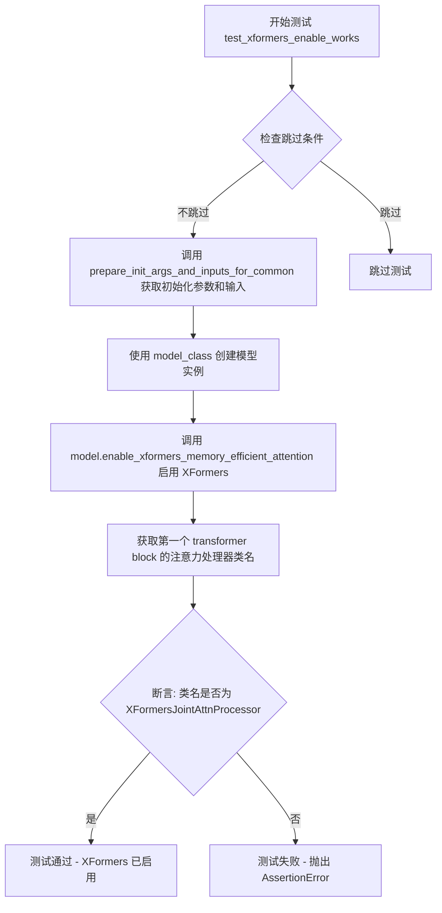

#### 带注释源码

```python
@unittest.skipIf(
    torch_device != "cuda" or not is_xformers_available(),
    reason="XFormers attention is only available with CUDA and `xformers` installed",
)
def test_xformers_enable_works(self):
    """
    测试 XFormers 高效注意力是否启用。
    
    该测试方法执行以下步骤：
    1. 准备模型初始化参数和输入数据
    2. 创建 SD3Transformer2DModel 模型实例
    3. 调用 enable_xformers_memory_efficient_attention 启用 XFormers
    4. 验证第一个 transformer block 的注意力处理器已更改为 XFormersJointAttnProcessor
    """
    # 准备初始化参数和输入字典
    init_dict, inputs_dict = self.prepare_init_args_and_inputs_for_common()
    
    # 使用模型类创建模型实例，传入初始化参数字典
    model = self.model_class(**init_dict)
    
    # 调用模型的 enable_xformers_memory_efficient_attention 方法
    # 该方法会将注意力处理器替换为 XFormers 优化版本
    model.enable_xformers_memory_efficient_attention()
    
    # 断言验证：检查第一个 transformer block 的注意力处理器的类名
    # 如果不是 "XFormersJointAttnProcessor"，则说明 xformers 未成功启用
    assert model.transformer_blocks[0].attn.processor.__class__.__name__ == "XFormersJointAttnProcessor", (
        "xformers is not enabled"
    )
```


### `SD35TransformerTests.test_set_attn_processor_for_determinism`

测试确定性注意力处理器设置的测试方法，目前已被跳过，因为 SD3Transformer2DModel 使用专用的注意力处理器。

参数：无

返回值：`None`，无返回值（方法体为 `pass`）

#### 流程图

```mermaid
flowchart TD
    A[开始测试] --> B{检查条件}
    B -->|条件满足| C[跳过测试]
    B -->|条件不满足| D[执行测试]
    C --> E[结束 - 返回 None]
    D --> E
```

#### 带注释源码

```python
@unittest.skip("SD3Transformer2DModel uses a dedicated attention processor. This test doesn't apply")
def test_set_attn_processor_for_determinism(self):
    """
    测试确定性注意力处理器设置。
    
    该测试方法用于验证能否为模型设置特定的注意力处理器以实现确定性（deterministic）行为。
    但由于 SD3Transformer2DModel 使用专用的注意力处理器，此测试不适用，因此被跳过。
    
    参数:
        无（继承自 unittest.TestCase）
    
    返回值:
        无（方法体为 pass 语句）
    """
    pass  # 测试被跳过，不执行任何操作
```


### `SD35TransformerTests.test_gradient_checkpointing_is_applied`

该方法用于测试SD3Transformer2DModel模型是否正确应用了梯度检查点（gradient checkpointing）技术，通过验证模型类名是否在预期集合中来确认梯度检查点功能已启用。

参数：

- `self`：`SD35TransformerTests`，测试类的实例自身，无需显式传递
- `expected_set`：`Set[str]`，包含预期模型类名的集合，值为`{"SD3Transformer2DModel"}`，用于验证梯度检查点是否在该模型上启用

返回值：`None`，该方法为测试用例方法，通常不返回任何值，测试结果通过断言机制体现

#### 流程图

```mermaid
flowchart TD
    A[开始测试方法] --> B[定义expected_set]
    B --> C[调用父类测试方法]
    C --> D{梯度检查点是否启用}
    D -->|是| E[测试通过]
    D -->|否| F[测试失败]
    E --> G[结束]
    F --> G
```

#### 带注释源码

```python
def test_gradient_checkpointing_is_applied(self):
    """
    测试梯度检查点是否在SD3Transformer2DModel上正确应用。
    梯度检查点是一种通过在反向传播时重新计算前向传播中间结果
    来节省显存的技术，适用于大型模型的训练场景。
    """
    # 定义预期启用梯度检查点的模型类集合
    # SD3Transformer2DModel是SD3系列Transformer模型的核心类
    expected_set = {"SD3Transformer2DModel"}
    
    # 调用父类ModelTesterMixin中的测试方法
    # 父类方法会检查模型是否正确配置了梯度检查点
    # 传入expected_set参数以指定需要验证的模型类
    super().test_gradient_checkpointing_is_applied(expected_set=expected_set)
```


### `SD35TransformerTests.test_skip_layers`

该测试方法用于验证 SD3 Transformer 模型中层跳过（layer skipping）功能是否正常工作。测试通过比较不使用层跳过和使用层跳过两种情况下的模型输出，确保跳过指定层后输出结果与完整前向传播不同，同时输出形状保持一致。

参数：

- `self`：类实例本身，无需显式传递

返回值：`None`，该方法为测试方法，通过 `unittest.TestCase` 的断言来验证功能，不返回任何值

#### 流程图

```mermaid
flowchart TD
    A[开始 test_skip_layers] --> B[调用 prepare_init_args_and_inputs_for_common 获取 init_dict 和 inputs_dict]
    B --> C[使用 init_dict 创建 SD3Transformer2DModel 实例]
    C --> D[将模型移至 torch_device]
    D --> E[执行完整前向传播]
    E --> F[output_full = model\*\*inputs_dict.sample]
    F --> G[复制 inputs_dict 为 inputs_dict_with_skip]
    G --> H[向 inputs_dict_with_skip 添加 skip_layers 参数]
    H --> I[设置 skip_layers = [0]]
    I --> J[执行带层跳过功能的前向传播]
    J --> K[output_skip = model\*\*inputs_dict_with_skip.sample]
    K --> L{断言: 输出不相等}
    L -->|是| M{断言: 输出形状相同}
    L -->|否| N[测试失败: 输出应该不同]
    M --> O[测试通过]
    N --> O
```

#### 带注释源码

```python
def test_skip_layers(self):
    """
    测试 SD3 Transformer 模型的层跳过功能
    验证跳过指定层后输出与完整前向传播不同，但形状保持一致
    """
    # 1. 获取模型初始化参数和测试输入数据
    init_dict, inputs_dict = self.prepare_init_args_and_inputs_for_common()
    
    # 2. 创建模型实例并移动到指定设备
    # 使用 torch_device 确保在正确的设备上运行测试
    model = self.model_class(**init_dict).to(torch_device)

    # 3. 执行完整前向传播（不跳过任何层）
    # 调用模型的前向传播，获取 sample 输出
    output_full = model(**inputs_dict).sample

    # 4. 准备带层跳过功能的输入
    # 复制原始输入字典，避免修改原始数据
    inputs_dict_with_skip = inputs_dict.copy()
    
    # 5. 设置跳过的层索引
    # 在当前测试配置中只有一层，因此跳过第0层
    inputs_dict_with_skip["skip_layers"] = [0]
    
    # 6. 执行带层跳过功能的前向传播
    # 模型将跳过指定索引的层进行处理
    output_skip = model(**inputs_dict_with_skip).sample

    # 7. 验证输出确实不同
    # 使用 torch.allclose 检查输出差异，设置容差为 1e-5
    # 如果输出完全相同，说明层跳过功能未生效
    self.assertFalse(
        torch.allclose(output_full, output_skip, atol=1e-5),
        "Outputs should differ when layers are skipped"
    )

    # 8. 验证输出形状一致
    # 确保层跳过功能不会改变输出的空间维度
    self.assertEqual(output_full.shape, output_skip.shape, "Outputs should have the same shape")
```

## 关键组件


### SD3Transformer2DModel 模型测试

用于测试diffusers库中SD3Transformer2DModel模型的单元测试类，验证模型的前向传播、梯度检查点、注意力机制等功能。

### XFormers内存高效注意力

通过enable_xformers_memory_efficient_attention方法启用xformers优化的注意力机制，降低显存消耗。

### 梯度检查点（Gradient Checkpointing）

使用test_gradient_checkpointing_is_applied方法验证梯度检查点功能是否正确应用于模型，以节省显存。

### Skip Layers（跳过层）功能

在SD35TransformerTests中通过skip_layers参数控制是否跳过特定层，测试模型在跳过层时的不同输出行为。

### Joint Attention Processor（联合注意力处理器）

用于处理文本和图像特征联合注意力的专用处理器，XFormers版本为XFormersJointAttnProcessor。

### 双注意力层（Dual Attention Layers）

SD35模型支持dual_attention_layers参数，允许在特定层启用双向注意力机制。

### QK归一化（QK Normalization）

SD35模型配置中支持qk_norm参数（如rms_norm），用于对查询和键进行归一化处理。

### 测试输入张量

包含hidden_states、encoder_hidden_states、pooled_projections和timestep等关键输入张量，用于模型的前向传播测试。

### 模型配置参数

包含sample_size、patch_size、in_channels、num_layers、attention_head_dim、num_attention_heads等模型初始化参数。


## 问题及建议


### 已知问题

- **代码重复**：两个测试类 `SD3TransformerTests` 和 `SD35TransformerTests` 存在大量重复代码（`dummy_input`、`input_shape`、`output_shape`、`prepare_init_args_and_inputs_for_common`、`test_xformers_enable_works`、`test_set_attn_processor_for_determinism`、`test_gradient_checkpointing_is_applied`），违反了 DRY 原则。
- **参数命名不一致**：在 `dummy_input` 方法中使用 `"pooled_projections"` 作为键名，但实际 `SD3Transformer2DModel` 的参数命名可能不同，存在潜在的参数映射错误风险。
- **测试覆盖不足**：`test_set_attn_processor_for_determinism` 被跳过但仅返回 `pass`，没有提供替代验证方式；`test_skip_layers` 仅测试单层跳过场景，边界条件覆盖不全。
- **魔法数字和硬编码**：批大小（2）、通道数（4）、序列长度（154）等数值直接硬编码在测试方法中，缺乏配置灵活性。
- **xformers 测试断言消息错误**：错误信息提到 `"xformers is not enabled"`，但实际验证的是处理器类型是否为 `XFormersJointAttnProcessor`，消息与验证逻辑不匹配。
- **缺少错误处理**：测试中没有对模型初始化失败、CUDA 内存不足等异常情况的处理。

### 优化建议

- **提取公共基类**：将两个测试类的公共逻辑抽取到抽象基类中，通过参数化配置差异部分，减少代码重复。
- **参数化测试**：使用 `unittest.parameterized` 或 `pytest.mark.parametrize` 替代重复的测试类，配置化差异参数（`dual_attention_layers`、`qk_norm` 等）。
- **统一参数命名**：确认 `pooled_projections` 与模型实际参数名的对应关系，避免运行时参数错误。
- **完善跳过测试**：对于禁用的测试，提供替代验证逻辑或使用 `@unittest.skip` 的原因说明更具体的原因。
- **提取测试配置**：将硬编码的测试参数（batch_size、sequence_length 等）提取为类属性或配置常量，便于调整。
- **增强 `test_skip_layers`**：增加多层跳过、全部跳过、无跳过等场景的测试覆盖。

## 其它


### 设计目标与约束

本测试文件的设计目标是通过单元测试验证 SD3Transformer2DModel 模型的正确性和功能完整性，确保模型在各种配置下（SD3 和 SD35）能够正确执行前向传播、注意力机制和层跳过等功能。约束条件包括：测试仅在 CUDA 环境下支持 xformers 注意力测试，模型使用专用的注意力处理器导致部分通用测试不适用，以及测试用例采用最小化的配置参数（如 num_layers=4）以平衡测试覆盖率和执行效率。

### 错误处理与异常设计

测试文件中的错误处理主要通过以下方式实现：1) 使用 `@unittest.skipIf` 装饰器跳过不适用的测试场景（如 xformers 仅在 CUDA 可用时测试）；2) 使用 `@unittest.skip` 装饰器直接跳过不适用的测试方法（如 test_set_attn_processor_for_determinism）；3) 通过 `assert` 语句验证关键条件，如 xformers 是否成功启用、输出是否正确等；4) 测试中的异常捕获通过 unittest 框架自动管理，测试失败时会提供详细的错误信息。

### 外部依赖与接口契约

本测试文件依赖以下外部组件：1) **PyTorch**：用于张量操作和模型计算，依赖 `torch.randn`、`torch.randint`、`torch_device` 等；2) **Diffusers 库**：被测模型 `SD3Transformer2DModel` 来自 `diffusers` 包，测试使用 `is_xformers_available` 检查 xformers 可用性；3) **Testing Utilities**：来自 `...testing_utils` 的 `enable_full_determinism` 和 `torch_device`，以及 `..test_modeling_common` 的 `ModelTesterMixin`；4) **XFormers**：可选依赖，用于高效注意力计算。接口契约方面，模型接受 `hidden_states`、`encoder_hidden_states`、`pooled_projections`、`timestep` 和可选的 `skip_layers` 作为输入，返回包含 `sample` 属性的输出对象。

### 性能考虑与基准测试

测试在性能方面主要关注：1) 梯度检查点（Gradient Checkpointing）的应用，通过 `test_gradient_checkpointing_is_applied` 验证；2) XFormers 内存高效注意力机制的启用，通过 `test_xformers_enable_works` 验证；3) 使用 `model_split_percents = [0.8, 0.8, 0.9]` 定义模型分割百分比用于测试。测试采用较小的批量大小（batch_size=2）和分辨率（32x32）以平衡测试覆盖率和执行时间，同时确保模型配置（num_layers=4）足够验证核心功能但不会过度增加测试时长。

### 安全考虑

测试文件中不涉及敏感数据处理或安全相关的操作。测试使用随机生成的张量（`torch.randn`）作为输入，不包含真实的用户数据或模型权重。测试环境配置通过 `enable_full_determinism` 函数确保可重复性，这在调试和安全性分析中具有一定价值。测试代码本身遵循 Apache License 2.0 开源协议，符合开源项目的安全合规要求。

### 版本兼容性与平台支持

测试文件的兼容性设计体现在：1) 仅在 CUDA 设备上运行 xformers 相关测试，使用 `torch_device != "cuda"` 条件判断；2) XFormers 依赖通过 `is_xformers_available()` 动态检测，未安装时跳过相关测试；3) 测试类分为 SD3TransformerTests 和 SD35TransformerTests，分别对应不同的模型配置变体（dual_attention_layers 和 qk_norm 参数差异），确保对不同版本模型的支持；4) 继承自 ModelTesterMixin 的通用测试方法提供了框架层面的版本兼容性抽象。


    