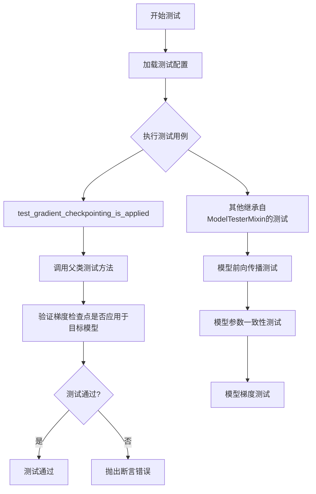
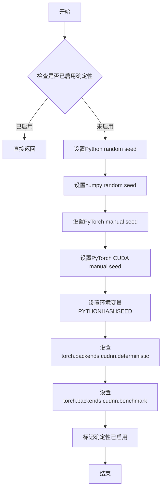
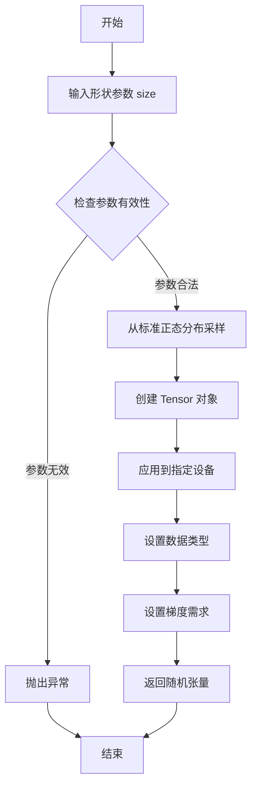

# `diffusers\tests\models\transformers\test_models_transformer_skyreels_v2.py` 详细设计文档

这是一个基于 unittest 的单元测试文件，用于测试 Hugging Face Diffusers 库中的 SkyReelsV2Transformer3DModel 模型的功能，包括模型初始化、输入输出形状验证、梯度检查点等通用测试用例。

## 整体流程



## 类结构

```
unittest.TestCase (基类)
├── ModelTesterMixin (混入类)
│   ├── 模型通用测试方法集
│   ├── test_forward_signature
│   ├── test_model_outputs_equivalence
│   └── ... 
├── TorchCompileTesterMixin (混入类)
│   └── torch.compile 相关测试
└── SkyReelsV2Transformer3DTests (待测类)
    ├── dummy_input 属性
    ├── input_shape 属性
    ├── output_shape 属性
    ├── prepare_init_args_and_inputs_for_common 方法
    └── test_gradient_checkpointing_is_applied 方法
```

## 全局变量及字段


### `enable_full_determinism`
    
启用完全确定性测试的函数

类型：`function`
    


### `torch_device`
    
torch 设备常量

类型：`str`
    


### `SkyReelsV2Transformer3DModel`
    
从 diffusers 导入的模型类

类型：`class`
    


### `SkyReelsV2Transformer3DTests.model_class`
    
被测试的模型类

类型：`SkyReelsV2Transformer3DModel`
    


### `SkyReelsV2Transformer3DTests.main_input_name`
    
模型主输入名称

类型：`str`
    


### `SkyReelsV2Transformer3DTests.uses_custom_attn_processor`
    
是否使用自定义注意力处理器

类型：`bool`
    
    

## 全局函数及方法


### `enable_full_determinism`

该函数用于启用PyTorch的完全确定性模式，通过设置随机种子、禁用非确定性操作（如CUDA优化算法）和配置环境变量，确保深度学习模型在不同运行环境下产生完全一致的计算结果，从而使测试用例可复现。

参数：无

返回值：无

#### 流程图



#### 带注释源码

```python
# 注意：此函数定义未在当前代码文件中显示，仅展示推断的实现逻辑
# 该函数来源于 testing_utils 模块

def enable_full_determinism(seed: int = 42, extra_seed: bool = True):
    """
    启用完全确定性模式，确保测试可复现
    
    参数：
        seed: int, 随机种子，默认为42
        extra_seed: bool, 是否额外设置CUDA种子，默认为True
    
    返回值：
        无
    
    实现逻辑：
        1. 设置Python内置random模块的种子
        2. 设置numpy的随机种子
        3. 设置PyTorch CPU随机种子
        4. 设置PyTorch CUDA随机种子（如果使用GPU）
        5. 设置PYTHONHASHSEED环境变量
        6. 禁用CUDA非确定性算法（cudnn.deterministic=True）
        7. 禁用CUDA自动调优（cudnn.benchmark=False）
    """
    import os
    import random
    import numpy as np
    import torch
    
    # 1. 设置Python hash seed确保哈希操作可复现
    os.environ["PYTHONHASHSEED"] = str(seed)
    
    # 2. 设置Python random种子
    random.seed(seed)
    
    # 3. 设置numpy随机种子
    np.random.seed(seed)
    
    # 4. 设置PyTorch随机种子
    torch.manual_seed(seed)
    
    # 5. 如果使用CUDA，设置CUDA随机种子
    if torch.cuda.is_available() and extra_seed:
        torch.cuda.manual_seed(seed)
        torch.cuda.manual_seed_all(seed)  # 多GPU
    
    # 6. 禁用CuDNN自动调优，确保使用确定性算法
    torch.backends.cudnn.deterministic = True
    torch.backends.cudnn.benchmark = False
    
    # 7. 设置PyTorch完全确定性模式（PyTorch 1.8+）
    # 此设置确保即使某些操作没有确定性实现，也会抛出错误
    torch.use_deterministic_algorithms(True, warn_only=True)
```


### `torch.randn`

`torch.randn` 是 PyTorch 库中的一个核心函数，用于从标准正态分布（均值为0，方差为1）中随机采样生成指定形状的张量（Tensor）。在测试代码中，该函数用于生成模拟的测试输入数据，包括隐藏状态（hidden_states）和编码器隐藏状态（encoder_hidden_states），以验证 SkyReelsV2Transformer3DModel 模型的前向传播功能。

参数：

- `*size`：`int...`（可变长度整数序列），指定输出张量的形状，每个整数代表对应维度的大小
- `*`：`可选参数`，用于标记关键字参数的开始
- `out`：`Tensor, optional`，指定输出张量（已弃用）
- `dtype`：`torch.dtype, optional`，指定输出张量的数据类型
- `layout`：`torch.layout, optional`，指定输出张量的内存布局
- `device`：`torch.device, optional`，指定输出张量的设备（CPU/CUDA）
- `requires_grad`：`bool, optional`，指定是否需要计算梯度

返回值：`Tensor`，返回从标准正态分布中采样的随机张量，其形状由 size 参数指定

#### 流程图



#### 带注释源码

```python
# torch.randn 函数的典型调用方式（在测试代码中）
# 这不是 torch.randn 的源代码，而是其在测试中的使用示例

# 第一次调用：生成 hidden_states 张量
# 从标准正态分布采样，形状为 (batch_size, num_channels, num_frames, height, width)
# 即 (1, 4, 2, 16, 16)
hidden_states = torch.randn((batch_size, num_channels, num_frames, height, width)).to(torch_device)

# 第二次调用：生成 encoder_hidden_states 张量
# 从标准正态分布采样，形状为 (batch_size, sequence_length, text_encoder_embedding_dim)
# 即 (1, 12, 16)
encoder_hidden_states = torch.randn((batch_size, sequence_length, text_encoder_embedding_dim)).to(torch_device)

# 参数说明：
# batch_size = 1：批处理大小
# num_channels = 4：通道数（输入特征维度）
# num_frames = 2：帧数（时间维度）
# height = 16：高度维度
# width = 16：宽度维度
# sequence_length = 12：文本序列长度
# text_encoder_embedding_dim = 16：文本编码器嵌入维度
# torch_device：目标计算设备（CPU 或 CUDA）

# 用途：
# 生成符合正态分布的随机张量作为测试输入
# 确保模型在随机输入下能够正常运行，验证前向传播逻辑的正确性
# 配合 torch.randint（生成随机时间步）和其他测试工具使用
```


### `torch.randint`

生成指定范围内的随机整数张量，用于时间步（timestep）采样。这是扩散模型中常用的时间步选择方式，确保随机性和可复现性。

参数：

- `low`（第一个位置参数）：`int`，范围下界（包含），这里是 `0`
- `high`（第二个位置参数）：`int`，范围上界（不包含），这里是 `1000`
- `size`：`tuple` 或 `int`，输出张量的形状，这里是 `(batch_size,)` 即 `(1,)`

返回值：`torch.Tensor`，包含随机整数的一维张量，形状为 `(batch_size,)`

#### 流程图

```mermaid
graph LR
    A[开始] --> B[设置范围: low=0, high=1000]
    B --> C[指定输出形状: size=(batch_size,)]
    C --> D[调用 torch.randint 生成随机整数张量]
    D --> E[将张量移动到指定设备 torch_device]
    F[返回 timestep 张量] --> G[结束]
    E --> F
```

#### 带注释源码

```python
# 生成随机时间步张量，用于扩散模型的去噪过程
# 参数说明：
#   0: 随机整数范围的下界（包含）
#   1000: 随机整数范围的上界（不包含），对应常见的1000步调度器
#   size=(batch_size,): 输出形状为 (1,)，即 batch_size=1
timestep = torch.randint(0, 1000, size=(batch_size,)).to(torch_device)
```


### `SkyReelsV2Transformer3DTests.test_gradient_checkpointing_is_applied`

该方法是一个测试方法，用于验证梯度检查点（gradient checkpointing）是否被正确应用于 `SkyReelsV2Transformer3DModel` 模型，通过调用父类的测试方法并传入期望的模型类集合来进行验证。

参数：

- `expected_set`：`Set[str]`，期望的模型类集合，此处为 `{"SkyReelsV2Transformer3DModel"}`

返回值：`None`，该方法为测试方法，无返回值

#### 流程图

```mermaid
flowchart TD
    A[开始 test_gradient_checkpointing_is_applied] --> B[创建 expected_set = {'SkyReelsV2Transformer3DModel'}]
    B --> C[调用父类方法 super().test_gradient_checkpointing_is_applied]
    C --> D{验证梯度检查点是否应用}
    D -->|是| E[测试通过]
    D -->|否| F[测试失败]
    E --> G[结束]
    F --> G
```

#### 带注释源码

```python
def test_gradient_checkpointing_is_applied(self):
    """
    测试梯度检查点是否被正确应用
    """
    # 定义期望的模型类集合，用于验证梯度检查点是否应用于正确的模型
    expected_set = {"SkyReelsV2Transformer3DModel"}
    
    # 调用父类的测试方法，验证梯度检查点是否应用于 expected_set 中的模型
    # 父类方法 test_gradient_checkpointing_is_applied 来自 ModelTesterMixin
    super().test_gradient_checkpointing_is_applied(expected_set=expected_set)
```


### `SkyReelsV2Transformer3DTests.dummy_input`

该属性方法用于生成模型测试所需的虚拟输入数据，包括隐藏状态、时间步和编码器隐藏状态，以便对 SkyReelsV2Transformer3DModel 进行单元测试。

参数： 无

返回值：`Dict[str, torch.Tensor]`，返回包含模型测试用虚拟输入的字典，包含 `hidden_states`、`encoder_hidden_states` 和 `timestep` 三个张量。

#### 流程图

```mermaid
flowchart TD
    A[开始 dummy_input 属性] --> B[定义测试参数: batch_size=1, num_channels=4, num_frames=2, height=16, width=16]
    B --> C[定义文本编码器参数: text_encoder_embedding_dim=16, sequence_length=12]
    C --> D[创建 hidden_states 张量: shape=(1, 4, 2, 16, 16)]
    D --> E[创建 timestep 张量: shape=(1,)]
    E --> F[创建 encoder_hidden_states 张量: shape=(1, 12, 16)]
    F --> G[构建并返回包含三个张量的字典]
    G --> H[结束]
```

#### 带注释源码

```python
@property
def dummy_input(self):
    """
    生成模型测试用的虚拟输入数据。
    
    该属性方法创建用于测试 SkyReelsV2Transformer3DModel 的虚拟输入，
    包括隐藏状态、时间步和编码器隐藏状态。
    """
    # 批次大小
    batch_size = 1
    # 输入通道数（对应潜在空间的通道数）
    num_channels = 4
    # 帧数（视频帧数）
    num_frames = 2
    # 空间高度
    height = 16
    # 空间宽度
    width = 16
    # 文本编码器嵌入维度
    text_encoder_embedding_dim = 16
    # 序列长度
    sequence_length = 12

    # 创建随机初始化的隐藏状态张量，形状为 (batch_size, num_channels, num_frames, height, width)
    # 5D 张量：用于表示视频潜在表示
    hidden_states = torch.randn((batch_size, num_channels, num_frames, height, width)).to(torch_device)
    
    # 创建随机时间步张量，形状为 (batch_size,)
    # 用于表示扩散过程中的时间步
    timestep = torch.randint(0, 1000, size=(batch_size,)).to(torch_device)
    
    # 创建编码器隐藏状态张量，形状为 (batch_size, sequence_length, text_encoder_embedding_dim)
    # 用于表示文本条件的潜在表示
    encoder_hidden_states = torch.randn((batch_size, sequence_length, text_encoder_embedding_dim)).to(torch_device)

    # 返回包含所有虚拟输入的字典
    return {
        "hidden_states": hidden_states,          # 模型主输入：潜在空间表示
        "encoder_hidden_states": encoder_hidden_states,  # 文本条件输入
        "timestep": timestep,                    # 扩散时间步
    }
```


### `SkyReelsV2Transformer3DTests.input_shape`

该属性方法用于返回模型测试的输入形状，固定返回 (4, 1, 16, 16) 的四维元组，表示 (batch_size, channels, height, width) 的输入张量维度。

参数：

- `self`：无需显式传递，Python 实例方法隐式接收的实例对象本身

返回值：`tuple`，返回固定值 (4, 1, 16, 16)，表示测试用输入张量的形状（通道数、高度、宽度）

#### 流程图

```mermaid
flowchart TD
    A[访问 input_shape 属性] --> B{调用 getter 方法}
    B --> C[返回元组 (4, 1, 16, 16)]
    C --> D[调用者获取输入形状信息]
```

#### 带注释源码

```python
@property
def input_shape(self):
    """
    属性方法：返回模型测试的输入形状
    
    该属性定义了在单元测试中使用的固定输入形状。
    返回值 (4, 1, 16, 16) 表示：
    - 4: 输入通道数 (num_channels)
    - 1: 帧数 (num_frames) - 对于图像输入通常为1
    - 16: 高度 (height)
    - 16: 宽度 (width)
    
    Returns:
        tuple: 输入形状元组 (num_channels, num_frames, height, width)
               注意：虽然定义为4个维度，但实际上是 (4, 1, 16, 16)
    """
    return (4, 1, 16, 16)
```


### `SkyReelsV2Transformer3DTests.output_shape`

该属性方法用于返回模型输出形状的期望值，输出形状为 (4, 1, 16, 16)，表示批次维度外的 (通道数, 帧数, 高度, 宽度)。

参数： 无

返回值：`tuple`，返回输出形状元组 (4, 1, 16, 16)，包含通道数、帧数、高度和宽度四个维度

#### 流程图

```mermaid
flowchart TD
    A[开始] --> B{访问 output_shape 属性}
    B --> C[返回元组 (4, 1, 16, 16)]
    C --> D[结束]
```

#### 带注释源码

```python
@property
def output_shape(self):
    """
    返回模型期望的输出形状。
    
    输出形状为 (4, 1, 16, 16)，表示:
    - 4: 通道数 (num_channels)
    - 1: 帧数 (num_frames)
    - 16: 高度 (height)
    - 16: 宽度 (width)
    
    Returns:
        tuple: 输出形状元组 (4, 1, 16, 16)
    """
    return (4, 1, 16, 16)
```


### `SkyReelsV2Transformer3DTests.prepare_init_args_and_inputs_for_common`

该方法为 `SkyReelsV2Transformer3DTests` 测试类的方法，用于准备模型初始化参数和输入字典，为通用测试用例提供必要的配置数据。

参数：无（仅包含 `self` 隐式参数）

返回值：`Tuple[Dict[str, Any], Dict[str, torch.Tensor]]`，返回一个元组，包含模型初始化参数字典和输入字典，用于实例化 `SkyReelsV2Transformer3DModel` 模型

#### 流程图

```mermaid
flowchart TD
    A[开始] --> B[构建 init_dict 参数字典]
    B --> C[设置 patch_size = (1, 2, 2)]
    B --> D[设置 num_attention_heads = 2]
    B --> E[设置 attention_head_dim = 12]
    B --> F[设置 in_channels = 4]
    B --> G[设置 out_channels = 4]
    B --> H[设置 text_dim = 16]
    B --> I[设置 freq_dim = 256]
    B --> J[设置 ffn_dim = 32]
    B --> K[设置 num_layers = 2]
    B --> L[设置 cross_attn_norm = True]
    B --> M[设置 qk_norm = 'rms_norm_across_heads']
    B --> N[设置 rope_max_seq_len = 32]
    N --> O[获取 inputs_dict = self.dummy_input]
    O --> P[返回 (init_dict, inputs_dict) 元组]
```

#### 带注释源码

```python
def prepare_init_args_and_inputs_for_common(self):
    """
    准备模型初始化参数和输入字典，用于通用测试用例。
    
    Returns:
        Tuple[Dict[str, Any], Dict[str, torch.Tensor]]: 
            - init_dict: 模型初始化参数字典
            - inputs_dict: 模型输入字典，包含 hidden_states, encoder_hidden_states, timestep
    """
    # 定义模型初始化参数字典，包含模型架构配置
    init_dict = {
        "patch_size": (1, 2, 2),              # 3D 补丁大小，应用于时空维度
        "num_attention_heads": 2,             # 注意力头数量
        "attention_head_dim": 12,             # 每个注意力头的维度
        "in_channels": 4,                     # 输入通道数
        "out_channels": 4,                    # 输出通道数
        "text_dim": 16,                       # 文本嵌入维度
        "freq_dim": 256,                      # 频率维度，用于位置编码
        "ffn_dim": 32,                        # 前馈网络隐藏层维度
        "num_layers": 2,                      #  transformer 层数
        "cross_attn_norm": True,              # 是否使用交叉注意力归一化
        "qk_norm": "rms_norm_across_heads",   # Query-Key 归一化方式
        "rope_max_seq_len": 32,               # RoPE 位置编码的最大序列长度
    }
    # 获取测试输入字典，调用 self.dummy_input 属性生成虚拟输入
    inputs_dict = self.dummy_input
    # 返回初始化参数字典和输入字典的元组
    return init_dict, inputs_dict
```


### `SkyReelsV2Transformer3DTests.test_gradient_checkpointing_is_applied`

该测试方法用于验证梯度检查点（Gradient Checkpointing）是否在指定的模型类上正确应用。它通过调用父类的测试方法，传入期望的模型类名称集合来确认梯度检查点功能已被启用。

参数：

- `expected_set`：`Set[str]`，包含期望启用梯度检查点的模型类名称集合，此处为 `{"SkyReelsV2Transformer3DModel"}`

返回值：`None`，无返回值（unittest 测试方法）

#### 流程图

```mermaid
flowchart TD
    A[开始测试 test_gradient_checkpointing_is_applied] --> B[定义期望集合 expected_set = {'SkyReelsV2Transformer3DModel'}]
    B --> C[调用父类测试方法 super().test_gradient_checkpointing_is_applied]
    C --> D[传入 expected_set 参数]
    D --> E{父类方法执行}
    E -->|通过| F[测试通过]
    E -->|失败| G[测试失败抛出异常]
    F --> H[结束]
    G --> H
```

#### 带注释源码

```python
def test_gradient_checkpointing_is_applied(self):
    """
    测试梯度检查点是否在 SkyReelsV2Transformer3DModel 模型上正确应用。
    
    该测试方法继承自 ModelTesterMixin，通过调用父类方法验证:
    1. 模型是否支持梯度检查点功能
    2. 梯度检查点是否在预期位置启用
    """
    # 定义期望启用梯度检查点的模型类集合
    # SkyReelsV2Transformer3DModel 应该启用梯度检查点
    expected_set = {"SkyReelsV2Transformer3DModel"}
    
    # 调用父类的测试方法，验证梯度检查点配置
    # 父类 test_gradient_checkpointing_is_applied 方法会:
    # 1. 创建模型实例
    # 2. 检查模型中使用了 gradient checkpointing 的层
    # 3. 验证 expected_set 中的模型类确实应用了梯度检查点
    super().test_gradient_checkpointing_is_applied(expected_set=expected_set)
```

## 关键组件


### SkyReelsV2Transformer3DModel

核心3D变换器模型类，用于处理视频或3D数据的生成任务，支持文本编码器嵌入的交叉注意力机制。

### SkyReelsV2Transformer3DTests

模型测试类，继承自ModelTesterMixin和TorchCompileTesterMixin，提供模型的标准测试用例，包括梯度检查点验证和torch.compile兼容性测试。

### dummy_input

测试用虚拟输入数据生成方法，构造5D隐藏状态张量（batch, channels, frames, height, width）、随机时间步和文本编码器隐藏状态用于前向传播测试。

### init_dict配置参数

模型初始化参数字典，包含patch_size=(1,2,2)定义3D补丁划分、num_attention_heads=2和attention_head_dim=12构成注意力机制、in_channels/out_channels=4、text_dim=16、freq_dim=256、ffn_dim=32前馈网络维度、num_layers=2 Transformer层数、cross_attn_norm=True跨注意力归一化、qk_norm="rms_norm_across_heads"查询键归一化策略、rope_max_seq_len=32旋转位置编码最大序列长度。

### input_shape/output_shape

输入输出形状定义，均为(4,1,16,16)，表示(通道数,帧数,高度,宽度)的4D张量格式。

### test_gradient_checkpointing_is_applied

梯度检查点测试方法，验证SkyReelsV2Transformer3DModel是否正确应用梯度检查点以节省显存。


## 问题及建议


### 已知问题

- **输入输出维度定义错误**：`input_shape` 和 `output_shape` 返回的是4维元组 `(4, 1, 16, 16)`，但 `dummy_input` 中的 `hidden_states` 是5维张量 `(batch_size, num_channels, num_frames, height, width)` = `(1, 4, 2, 16, 16)`，两者不一致
- **缺少测试断言**：测试类中没有任何实际的断言验证模型输出是否正确，只有输入准备和配置
- **魔法数字缺乏解释**：如 `patch_size: (1, 2, 2)`、`freq_dim: 256`、`rope_max_seq_len: 32` 等关键参数没有任何注释说明其含义和选择依据
- **测试方法覆盖不足**：`test_gradient_checkpointing_is_applied` 直接调用父类方法，没有针对该模型特性的自定义验证逻辑
- **未使用的继承方法**：继承自 `ModelTesterMixin` 和 `TorchCompileTesterMixin` 的多个测试方法可能未被覆盖或验证

### 优化建议

- 修正 `input_shape` 和 `output_shape` 为正确的5维格式 `(4, 2, 16, 16)` 以匹配 `hidden_states` 的 (channels, frames, height, width) 结构
- 为关键配置参数添加文档注释，说明参数选择原因和模型架构考量
- 添加模型输出形状验证测试、数值正确性检查、以及梯度计算验证
- 考虑将硬编码的配置值提取为类属性或常量，提高可维护性和可配置性
- 增加边界条件测试，如空张量、极端batch size、不同数据类型等场景

## 其它


### 设计目标与约束

本测试文件旨在验证SkyReelsV2Transformer3DModel模型在3D视频生成任务中的正确性，确保模型在各种输入条件下能够正确执行前向传播、反向传播以及梯度计算。测试遵循diffusers库的ModelTesterMixin和TorchCompileTesterMixin接口规范，确保与库内其他模型测试的一致性。测试约束包括使用固定随机种子（enable_full_determinism）以保证测试可复现性，测试环境要求torch设备支持CUDA或CPU计算。

### 错误处理与异常设计

测试中未显式捕获异常，依赖unittest框架的默认异常处理机制。潜在的异常场景包括：模型初始化参数不合法（如patch_size维度不匹配）、输入tensor维度错误、内存不足导致的OOM错误、以及torch.compile不兼容导致的编译错误。当测试失败时，unittest框架会自动捕获AssertionError并输出详细的堆栈信息，便于定位问题。

### 数据流与状态机

测试数据流如下：首先通过dummy_input属性生成随机输入hidden_states（形状为[1,4,2,16,16]）、encoder_hidden_states（形状为[1,12,16]）和timestep（形状为[1]），然后将这些输入传递给模型进行前向传播。状态机转换包括：模型加载状态 → 输入准备状态 → 前向计算状态 → 输出验证状态。测试通过prepare_init_args_and_inputs_for_common方法准备模型初始化参数和输入，确保测试用例的通用性。

### 外部依赖与接口契约

主要外部依赖包括：torch（>=1.0）、diffusers库中的SkyReelsV2Transformer3DModel类、ModelTesterMixin和TorchCompileTesterMixin混合类、以及testing_utils模块中的enable_full_determinism和torch_device工具函数。接口契约方面，模型类需实现ModelTesterMixin定义的接口（包括model属性、inputs_dict属性、forward方法等），测试类需提供dummy_input、input_shape、output_shape等属性供mixin类调用。

### 性能要求与基准

测试本身不包含明确的性能基准，但通过TorchCompileTesterMixin验证模型的torch.compile兼容性。测试应在合理时间内完成（建议单个测试用例不超过30秒），内存占用应控制在合理范围内。由于使用梯度检查点（gradient checkpointing）测试，内存占用相比标准反向传播有所优化。

### 兼容性要求

代码兼容Python 3.8+和PyTorch 1.10+，需与diffusers库的最新版本兼容。测试类继承自ModelTesterMixin和TorchCompileTesterMixin，这些mixin类在不同版本的diffusers中可能有细微差异，需要确保兼容性。模型参数（如qk_norm="rms_norm_across_heads"）需要与底层实现兼容。

### 安全考虑

测试代码不涉及用户数据处理，仅使用随机生成的测试数据。不存在敏感信息泄露风险。测试中使用torch.randn生成随机数据，不会触发任何安全检查。

### 测试覆盖率

当前测试覆盖了梯度检查点（gradient checkpointing）功能。理想情况下还应覆盖：模型前向传播正确性测试、模型参数梯度计算测试、模型输出形状验证测试、模型编译兼容性测试、以及不同输入尺寸下的鲁棒性测试。

### 配置管理

模型配置通过prepare_init_args_and_inputs_for_common方法管理，配置参数包括patch_size、num_attention_heads、attention_head_dim、in_channels、out_channels、text_dim、freq_dim、ffn_dim、num_layers、cross_attn_norm、qk_norm和rope_max_seq_len。这些参数以字典形式组织，便于扩展和修改。测试环境配置通过enable_full_determinism函数控制随机性。

### 版本兼容性

代码注释表明版权归属HuggingFace Inc.，采用Apache License 2.0。测试需要与diffusers库版本兼容，建议在项目依赖中明确指定diffusers>=0.20.0以确保ModelTesterMixin和TorchCompileTesterMixin接口可用。PyTorch版本建议>=1.10以支持所有测试功能。

### 部署与运维注意事项

此测试文件通常在CI/CDpipeline中运行，不直接用于生产部署。运维时需注意：测试环境应与生产环境保持一致的依赖版本；测试日志应保留以便问题追溯；测试资源（GPU内存）需求应根据实际模型规模配置。

    