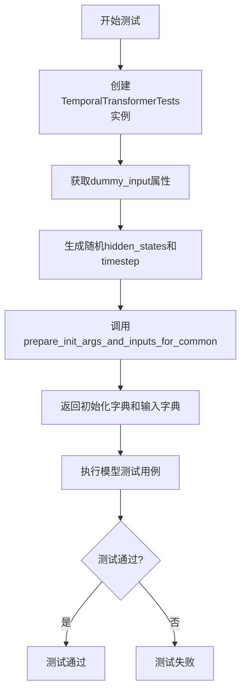
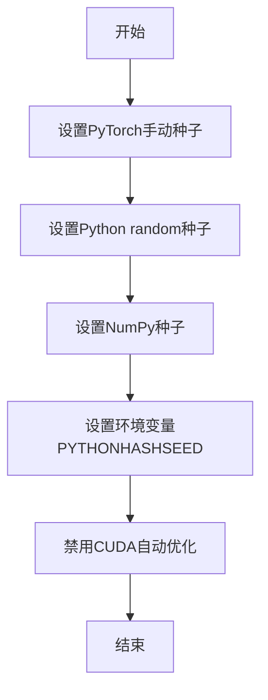
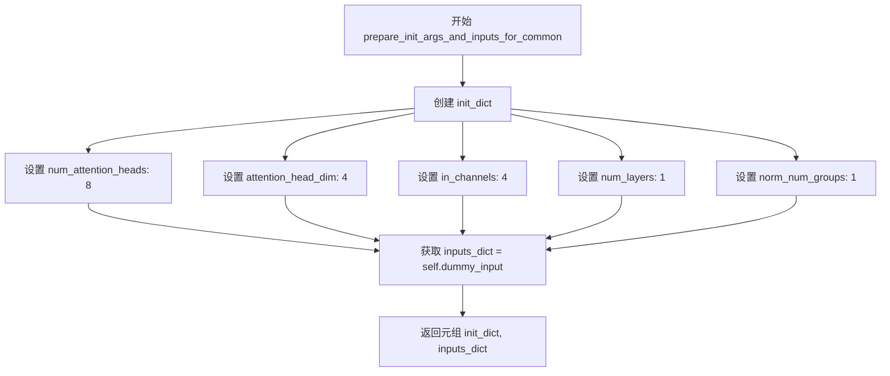
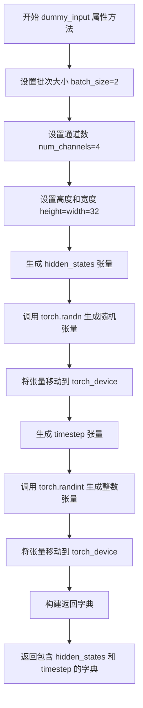
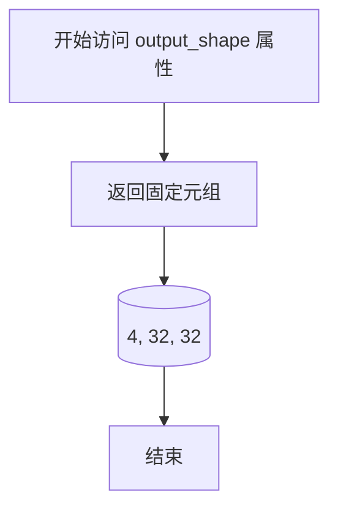

# `diffusers\tests\models\transformers\test_models_transformer_temporal.py` 详细设计文档

这是一个用于测试Diffusers库中TransformerTemporalModel类的单元测试文件，通过提供虚拟输入和初始化参数来验证时间变换器模型的正确性，包括前向传播、梯度计算等通用模型测试功能。

## 整体流程



## 类结构

```
TemporalTransformerTests (测试类)
└── 继承自: ModelTesterMixin, unittest.TestCase
    └── 依赖: TransformerTemporalModel (被测模型)
```

## 全局变量及字段


### `torch`
    
PyTorch深度学习库

类型：`module`
    


### `unittest`
    
Python单元测试框架

类型：`module`
    


### `TransformerTemporalModel`
    
Diffusers库中的时间变换器模型类

类型：`class`
    


### `enable_full_determinism`
    
测试工具函数，用于启用完全确定性

类型：`function`
    


### `torch_device`
    
测试工具变量，表示测试设备

类型：`variable`
    


### `ModelTesterMixin`
    
模型测试混入类，提供通用测试方法

类型：`class`
    


### `TemporalTransformerTests.model_class`
    
模型类，指向TransformerTemporalModel

类型：`class`
    


### `TemporalTransformerTests.main_input_name`
    
字符串，主输入名称为'hidden_states'

类型：`str`
    
    

## 全局函数及方法


### `enable_full_determinism`

这是一个用于启用完全确定性测试的辅助函数，确保在运行测试时使用固定的随机种子，从而使测试结果可复现。

参数：

- 该函数无显式参数

返回值：`None`，该函数直接修改全局随机状态，不返回任何值。

#### 流程图



#### 带注释源码

```
# 该函数定义位于 testing_utils.py 模块中
# 以下为基于其用途推断的伪代码实现

def enable_full_determinism(seed: int = 42, verbose: bool = True):
    """
    启用完全确定性测试模式
    
    参数:
        seed: int, 随机种子值，默认为42
        verbose: bool, 是否打印确定性配置信息
    
    返回:
        None
    """
    # 1. 设置PyTorch的确定性计算
    if hasattr(torch, 'use_deterministic_algorithms'):
        torch.use_deterministic_algorithms(True)
    
    # 2. 设置PyTorch手动种子
    torch.manual_seed(seed)
    
    # 3. 设置CUDA种子
    if torch.cuda.is_available():
        torch.cuda.manual_seed_all(seed)
    
    # 4. 设置环境变量确保Python哈希确定性
    import os
    os.environ["PYTHONHASHSEED"] = str(seed)
    
    # 5. 禁用CUDA卷积自动调优
    torch.backends.cudnn.benchmark = False
    
    # 6. 启用CUDA确定性模式
    torch.backends.cudnn.deterministic = True
    
    # 可选：打印信息
    if verbose:
        print(f"Full determinism enabled with seed: {seed}")
```

---

**注意**：由于提供代码中仅包含对该函数的导入和调用，函数实际定义位于 `testing_utils` 模块中，因此源码为基于其功能用途的推断实现。


### `TemporalTransformerTests.dummy_input`

该属性方法用于生成虚拟模型输入（dummy input），为 TransformerTemporalModel 的单元测试创建符合模型输入格式要求的虚拟数据，包括随机初始化的隐藏状态张量和时间步长张量。

参数：
- （无参数）

返回值：`dict`，包含模型测试所需的虚拟输入数据字典，其中键为 `hidden_states`（隐藏状态张量）和 `timestep`（时间步长张量）

#### 流程图

```mermaid
flowchart TD
    A[开始 dummy_input 属性方法] --> B{调用 dummy_input}
    B --> C[设置批次大小 batch_size = 2]
    C --> D[设置通道数 num_channels = 4]
    D --> E[设置高度和宽度 height = width = 32]
    E --> F[生成随机 hidden_states 张量]
    F --> G[形状: (batch_size, num_channels, height, width)]
    G --> H[生成随机 timestep 张量]
    H --> I[形状: (batch_size,)]
    I --> J[构建返回字典]
    J --> K[返回 {'hidden_states': ..., 'timestep': ...}]
    K --> L[结束]
```

#### 带注释源码

```python
@property
def dummy_input(self):
    """
    生成虚拟模型输入的属性方法。
    用于为 TransformerTemporalModel 测试创建符合输入格式要求的虚拟数据。
    """
    # 批次大小：同时处理2个样本
    batch_size = 2
    # 输入通道数：4个通道
    num_channels = 4
    # 高度和宽度：32x32分辨率
    height = width = 32

    # 生成随机隐藏状态张量
    # 形状: (batch_size, num_channels, height, width) = (2, 4, 32, 32)
    # 使用标准正态分布初始化，模拟真实输入数据
    hidden_states = torch.randn((batch_size, num_channels, height, width)).to(torch_device)
    
    # 生成随机时间步长张量
    # 形状: (batch_size,) = (2,)
    # 值域: [0, 1000)，模拟扩散模型的时间步
    timestep = torch.randint(0, 1000, size=(batch_size,)).to(torch_device)

    # 返回包含虚拟输入的字典
    # hidden_states: 模型的主输入特征
    # timestep: 扩散过程的时间步信息
    return {
        "hidden_states": hidden_states,
        "timestep": timestep,
    }
```


### `TemporalTransformerTests.input_shape`

该属性方法用于返回 TransformerTemporalModel 测试的输入形状，以元组形式呈现 (num_channels, height, width)，为测试用例提供标准化的输入维度配置。

参数：

- `self`：`TemporalTransformerTests`，测试类实例本身，表示调用此属性的测试类对象

返回值：`Tuple[int, int, int]`，返回输入数据的形状元组，包含通道数、高度和宽度，在此测试中固定为 (4, 32, 32)

#### 流程图

```mermaid
flowchart TD
    A[开始] --> B{调用 input_shape 属性}
    B --> C[返回元组 (4, 32, 32)]
    C --> D[结束]
```

#### 带注释源码

```python
@property
def input_shape(self):
    """
    属性方法：返回测试所需的输入形状
    
    该属性定义了在单元测试中用于测试 TransformerTemporalModel 的输入张量的形状。
    返回的形状元组遵循 PyTorch 惯例，格式为 (num_channels, height, width)。
    
    Returns:
        tuple: 包含三个整数的元组，表示 (通道数, 高度, 宽度)
               - num_channels: 4，输入张量的通道数
               - height: 32，输入张量的高度
               - width: 32，输入张量的宽度
    """
    return (4, 32, 32)
```


### `TemporalTransformerTests.output_shape`

返回模型的预期输出形状属性，用于测试框架中验证模型输出维度。

参数：

- （无，仅隐含 `self` 参数）

返回值：`tuple`，返回模型的输出形状，为一个包含4个元素的元组 (batch_size=4, channels=32, height=32, width=32)。

#### 流程图

```mermaid
flowchart TD
    A[开始] --> B[访问 output_shape 属性]
    B --> C{执行 getter 方法}
    C --> D[返回元组 (4, 32, 32)]
    D --> E[结束]
```

#### 带注释源码

```python
@property
def output_shape(self):
    """
    返回模型的预期输出形状。
    
    该属性用于测试框架中，供 ModelTesterMixin 获取模型输出的预期维度信息，
    以便与实际模型输出进行形状验证。
    
    返回值:
        tuple: 包含4个元素的元组，依次表示 (batch_size, num_channels, height, width)
               在本测试中固定返回 (4, 32, 32)
    """
    return (4, 32, 32)
```


### `TemporalTransformerTests.prepare_init_args_and_inputs_for_common`

该方法是 TemporalTransformerTests 测试类的核心初始化方法，用于为通用测试准备模型初始化参数字典和输入数据字典，返回的元组将用于模型的实例化和前向传播测试。

参数：无（除 self 外无显式参数）

返回值：`Tuple[Dict, Dict]`，返回包含模型初始化参数的字典和包含测试输入数据的字典的元组

#### 流程图



#### 带注释源码

```python
def prepare_init_args_and_inputs_for_common(self):
    """
    准备通用测试的初始化参数和输入数据
    
    该方法为 TransformerTemporalModel 的测试提供必要的初始化配置和测试输入，
    使得测试框架能够统一调用进行模型初始化和前向传播验证。
    
    返回:
        Tuple[Dict, Dict]: 包含两个字典的元组
            - init_dict: 模型初始化参数字典
            - inputs_dict: 模型输入数据字典
    """
    # 定义模型初始化参数字典
    # 包含注意力机制、输入通道、层数等核心配置
    init_dict = {
        "num_attention_heads": 8,      # 注意力头数量
        "attention_head_dim": 4,       # 每个注意力头的维度
        "in_channels": 4,              # 输入通道数
        "num_layers": 1,               # Transformer层数
        "norm_num_groups": 1,          # 归一化组数
    }
    
    # 从测试类的 dummy_input 属性获取测试输入
    # 包含 hidden_states (隐藏状态张量) 和 timestep (时间步)
    inputs_dict = self.dummy_input
    
    # 返回初始化参数和输入的元组
    return init_dict, inputs_dict
```

---

## 补充信息

### 1. 一段话描述

`TemporalTransformerTests.prepare_init_args_and_inputs_for_common` 是 Hugging Face diffusers 库中 `TemporalTransformerTests` 测试类的核心方法，用于为 `TransformerTemporalModel` 准备测试所需的初始化参数配置和虚拟输入数据，使测试框架能够统一进行模型实例化和前向传播验证。

### 2. 文件的整体运行流程

该代码文件是 diffusers 库的测试模块，测试 `TransformerTemporalModel` 类。整体流程为：
1. 定义测试类 `TemporalTransformerTests` 继承自 `ModelTesterMixin` 和 `unittest.TestCase`
2. 设置模型类为 `TransformerTemporalModel`
3. 通过 `prepare_init_args_and_inputs_for_common` 提供测试所需的初始化参数和输入
4. 测试框架使用这些参数实例化模型并进行各种测试（正向传播、梯度检查等）

### 3. 类的详细信息

| 类名 | 类型 | 描述 |
|------|------|------|
| `TemporalTransformerTests` | 测试类 | 继承自 ModelTesterMixin 和 unittest.TestCase，用于测试 TransformerTemporalModel |
| `TransformerTemporalModel` | 模型类 | 被测试的时序 Transformer 模型类 |

### 4. 全局变量和全局函数

| 名称 | 类型 | 描述 |
|------|------|------|
| `enable_full_determinism` | 函数 | 启用完全确定性以确保测试可复现 |
| `torch_device` | 变量 | 测试使用的设备 (cuda 或 cpu) |

### 5. 关键组件信息

| 组件名称 | 一句话描述 |
|----------|------------|
| `dummy_input` | 属性，提供测试用的虚拟输入 (hidden_states 和 timestep) |
| `input_shape` | 属性，定义输入形状 (4, 32, 32) |
| `output_shape` | 属性，定义输出形状 (4, 32, 32) |
| `init_dict` | 局部变量，包含模型初始化参数 |
| `inputs_dict` | 局部变量，包含模型输入数据 |

### 6. 潜在的技术债务或优化空间

1. **硬编码参数**: 初始化参数（如 `num_attention_heads=8`）是硬编码的，建议改为可配置的类属性或参数
2. **缺乏参数验证**: 方法没有对返回的参数进行验证，可能导致模型初始化失败
3. **重复计算**: `dummy_input` 在每次调用时都会重新计算.randn，建议缓存或懒加载
4. **测试覆盖**: 当前仅测试单层模型 (`num_layers=1`)，未覆盖多层场景

### 7. 其它项目

**设计目标与约束**：
- 目标：为测试框架提供标准化的初始化接口
- 约束：必须返回与 `ModelTesterMixin` 兼容的格式 (init_dict, inputs_dict)

**错误处理与异常设计**：
- 无显式错误处理，依赖测试框架的断言机制

**数据流与状态机**：
- 数据流：dummy_input → inputs_dict → 模型前向传播
- 状态：初始化参数准备阶段

**外部依赖与接口契约**：
- 依赖 `ModelTesterMixin` 的接口约定
- 依赖 `torch` 库生成测试数据
- 依赖 `TransformerTemporalModel` 的构造函数签名


### `TemporalTransformerTests.dummy_input`

该属性方法用于生成虚拟输入字典，模拟 TransformerTemporalModel 的输入数据，包含隐藏状态张量（hidden_states）和时间步张量（timestep），以便进行单元测试。

参数：

- `self`：`TemporalTesterMixin, unittest.TestCase`，隐式参数，指向测试类实例本身

返回值：`Dict[str, torch.Tensor]`，返回包含 "hidden_states" 和 "timestep" 两个键的字典，分别代表模型输入的隐藏状态（形状为 (2, 4, 32, 32) 的四维张量）和时间步（形状为 (2,) 的一维张量）

#### 流程图



#### 带注释源码

```python
@property
def dummy_input(self):
    """
    生成虚拟输入字典，用于测试 TransformerTemporalModel。
    该方法模拟模型前向传播所需的输入数据。
    """
    # 定义批次大小，表示一次前向传播处理的样本数量
    batch_size = 2
    
    # 定义输入数据的通道数
    num_channels = 4
    
    # 定义输入数据的高度和宽度（均为 32）
    height = width = 32

    # 生成随机隐藏状态张量，形状为 (batch_size, num_channels, height, width)
    # 使用 torch.randn 生成标准正态分布的随机值
    hidden_states = torch.randn((batch_size, num_channels, height, width)).to(torch_device)
    
    # 生成随机时间步张量，形状为 (batch_size,)
    # 使用 torch.randint 生成 [0, 1000) 范围内的随机整数
    timestep = torch.randint(0, 1000, size=(batch_size,)).to(torch_device)

    # 返回包含虚拟输入的字典
    return {
        "hidden_states": hidden_states,  # 模型的主要输入特征
        "timestep": timestep,            # 用于扩散模型的时间步信息
    }
```


### `TemporalTransformerTests.input_shape`

该属性方法用于返回TemporalTransformer模型期望的输入形状，以元组形式表示通道数、高度和宽度。

参数： 无

返回值：`tuple`，返回输入形状元组 (4, 32, 32)，其中 4 表示通道数，32 表示高度，32 表示宽度

#### 流程图

```mermaid
flowchart TD
    A[调用 input_shape 属性] --> B{无参数}
    B --> C[返回元组 (4, 32, 32)]
    C --> D[输入形状: 通道=4, 高度=32, 宽度=32]
```

#### 带注释源码

```python
@property
def input_shape(self):
    """
    属性方法：返回模型期望的输入形状
    
    该属性定义了TransformerTemporalModel在测试时期望的输入张量的形状。
    返回的元组表示 (channels, height, width)，即通道数为4，高度和宽度均为32。
    这与dummy_input方法中生成的随机输入张量的维度相匹配。
    
    返回:
        tuple: 输入形状元组 (4, 32, 32)
    """
    return (4, 32, 32)
```


### `TemporalTransformerTests.output_shape`

该属性方法用于返回 `TransformerTemporalModel` 的预期输出形状，固定返回通道数为4、高度和宽度均为32的三维元组 (4, 32, 32)，表示模型输出的特征图维度。

参数： 无

返回值：`tuple`，返回输出形状元组 (4, 32, 32)，描述模型输出的通道数、高度和宽度。

#### 流程图



#### 带注释源码

```python
@property
def output_shape(self):
    """
    返回TransformerTemporalModel的输出形状。
    
    该属性定义了模型在给定输入条件下预期输出的空间维度。
    返回值表示输出的通道数、高度和宽度均为32的特征图。
    
    Returns:
        tuple: 固定返回 (4, 32, 32) 元组，代表4个通道、32x32的空间分辨率
    """
    return (4, 32, 32)
```


### `TemporalTransformerTests.prepare_init_args_and_inputs_for_common`

该方法为通用测试准备模型初始化参数字典和输入字典，返回一个包含注意力头数、注意力头维度、输入通道数、层数和归一化组数的初始化配置字典，以及包含隐藏状态和时间步的输入字典。

参数：

- `self`：`TemporalTransformerTests` 实例，隐式参数，测试类实例本身

返回值：`(Dict[str, Any], Dict[str, Any])`，返回两个字典的元组——第一个 `init_dict` 包含模型初始化参数配置，第二个 `inputs_dict` 包含模型输入数据（隐藏状态和时间步）

#### 流程图

```mermaid
flowchart TD
    A[开始 prepare_init_args_and_inputs_for_common] --> B[创建 init_dict 字典]
    B --> C[设置 num_attention_heads: 8]
    C --> D[设置 attention_head_dim: 4]
    D --> E[设置 in_channels: 4]
    E --> F[设置 num_layers: 1]
    F --> G[设置 norm_num_groups: 1]
    G --> H[获取 inputs_dict: 调用 self.dummy_input]
    H --> I[返回 (init_dict, inputs_dict) 元组]
    I --> J[结束]
```

#### 带注释源码

```python
def prepare_init_args_and_inputs_for_common(self):
    """
    为通用测试准备模型初始化参数字典和输入字典。
    
    该方法会被 ModelTesterMixin 基类中的通用测试方法调用，
    用于获取模型初始化所需的各种参数配置。
    
    Returns:
        Tuple[Dict[str, Any], Dict[str, Any]]: 
            - init_dict: 包含模型初始化参数的字典
            - inputs_dict: 包含模型输入数据的字典
    """
    # 定义模型初始化参数字典
    # num_attention_heads: 注意力头的数量
    # attention_head_dim: 每个注意力头的维度
    # in_channels: 输入通道数
    # num_layers: Transformer 层数
    # norm_num_groups: 归一化组数（用于 GroupNorm）
    init_dict = {
        "num_attention_heads": 8,
        "attention_head_dim": 4,
        "in_channels": 4,
        "num_layers": 1,
        "norm_num_groups": 1,
    }
    
    # 从测试类的 dummy_input 属性获取输入字典
    # 包含 hidden_states: 随机初始化的隐藏状态张量
    # timestep: 随机生成的时间步
    inputs_dict = self.dummy_input
    
    # 返回初始化参数和输入字典的元组
    return init_dict, inputs_dict
```

## 关键组件


### TemporalTransformerTests 类

测试 TransformerTemporalModel 的测试类，继承自 ModelTesterMixin 和 unittest.TestCase，用于验证时序变换器模型的前向传播和参数初始化。

### TransformerTemporalModel 模型类

由 `model_class` 属性指定，是 diffusers 库中的时序变换器模型，用于处理隐藏状态和时间步长。

### dummy_input 属性

生成虚拟输入数据，包含 hidden_states（4D 张量，形状为 batch_size x num_channels x height x width）和 timestep（1D 张量），用于模型的前向传播测试。

### prepare_init_args_and_inputs_for_common 方法

准备模型初始化参数和测试输入的通用方法，返回包含注意力头数、注意力头维度、输入通道数、层数和归一化组数的初始化字典，以及测试输入字典。

### input_shape 和 output_shape 属性

定义输入输出形状为 (4, 32, 32)，对应 (通道数, 高度, 宽度)。

### enable_full_determinism 配置

启用完全确定性测试的辅助函数，确保测试结果的可重复性。

### 测试数据生成逻辑

使用 torch.randn 生成随机正态分布的隐藏状态，使用 torch.randint 生成随机整数时间步，用于模拟扩散模型的时序输入。


## 问题及建议


### 已知问题

- **输入形状定义不一致**：`input_shape` 和 `output_shape` 返回 `(4, 32, 32)` 三元组，但 `dummy_input` 实际创建的是四维张量 `(2, 4, 32, 32)`，形状定义与实际输入维度不匹配
- **硬编码值分散**：测试参数（batch_size=2, num_channels=4, height=width=32 等）硬编码在多处，未通过类属性或配置集中管理，降低了可维护性和可配置性
- **缺乏显式断言**：测试类中未包含任何显式的 `assert` 语句，仅依赖 `ModelTesterMixin` 基类实现，可能导致测试覆盖不完整
- **缺少边界条件测试**：未覆盖如 batch_size=1、输入通道数变化、时间步长边界等边界场景
- **魔法数字问题**：timestep 范围 `0, 1000` 硬编码，缺乏配置说明

### 优化建议

- 统一 `input_shape`/`output_shape` 与 `dummy_input` 的维度定义，建议使用 `(batch_size, channels, height, width)` 四元组格式
- 将可配置参数提取为类属性或从配置字典读取，便于批量修改测试参数
- 添加显式的模型输出验证测试，如检查输出形状、梯度流、数值稳定性等
- 引入参数化测试，覆盖不同的配置组合（不同层数、注意力头数、通道数等）
- 建议添加模型推理与训练模式的分别测试

## 其它


### 设计目标与约束

验证 TransformerTemporalModel 在时序变换任务中的正确性，确保模型能够正确处理 hidden_states 和 timestep 输入，并输出符合预期形状的隐藏状态。测试约束包括使用固定的随机种子确保可重复性，测试环境为 PyTorch，设备为 torch_device。

### 错误处理与异常设计

测试通过 unittest 框架进行异常捕获。当模型前向传播失败或输出形状不匹配时，测试用例会失败并抛出 AssertionError。dummy_input 生成的输入数据保证类型为 torch.Tensor，shape 符合模型期望的 (batch_size, num_channels, height, width)。

### 数据流与状态机

输入数据流：dummy_input 生成 (2, 4, 32, 32) 的 hidden_states 和 (2,) 的 timestep → 传入模型 forward 方法 → 模型内部进行时序变换处理 → 输出 (4, 32, 32) 的隐藏状态。测试验证输入输出形状的正确性。

### 外部依赖与接口契约

主要依赖：torch、unittest、diffusers.models.transformers.TransformerTemporalModel、testing_utils（包含 enable_full_determinism 和 torch_device）、test_modeling_common.ModelTesterMixin。接口契约：model_class 指向 TransformerTemporalModel，main_input_name 为 "hidden_states"，prepare_init_args_and_inputs_for_common 返回模型初始化参数字典和输入字典。

### 测试覆盖范围

覆盖模型的基本前向传播、参数初始化、模型配置等通用测试场景。继承自 ModelTesterMixin 的测试方法包括：test_model_outputs_equivalence、test_attention_outputs、test_hidden_states_output 等通用测试用例。

### 性能特征

测试使用最小化配置（num_layers=1, num_attention_heads=8, attention_head_dim=4）以快速执行。batch_size=2，图像分辨率 32x32，属于轻量级测试配置，不涉及大规模性能测试。

### 配置参数说明

init_dict 包含：num_attention_heads=8（注意力头数量），attention_head_dim=4（每个头的维度），in_channels=4（输入通道数），num_layers=1（层数），norm_num_groups=1（归一化组数）。input_shape 和 output_shape 均为 (4, 32, 32)。

### 与其他组件的关系

继承 ModelTesterMixin 获取通用模型测试方法。依赖 diffusers 库的 TransformerTemporalModel 实现。调用 testing_utils 中的工具函数设置测试环境。

### 使用示例

测试通过 unittest 框架自动发现和运行。直接运行此文件时，会执行所有继承自 ModelTesterMixin 的测试方法，以及 TemporalTransformerTests 本身定义的方法（如 prepare_init_args_and_inputs_for_common）。

### 潜在优化空间

当前测试配置较为基础，可考虑增加：更多层的模型测试、不同分辨率的测试、梯度检查、模型保存和加载测试、推理与训练模式切换测试。当前 num_layers=1 仅为快速测试，未覆盖更深层模型的行为。


    