# `diffusers\tests\models\transformers\test_models_transformer_wan.py` 详细设计文档

这是一个针对 Wan Transformer 3D 模型的全面测试套件，涵盖基础模型功能、内存优化、训练流程、注意力机制、Torch编译、量化（BitsAndBytes、TorchAO、GGUF）等多个维度的测试验证。

## 整体流程

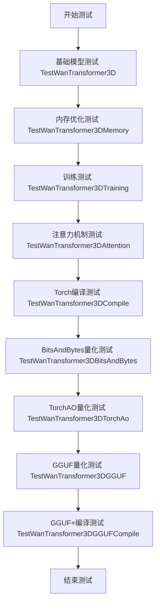

## 类结构

```
WanTransformer3DTesterConfig (配置基类)
├── TestWanTransformer3D (核心模型测试)
├── TestWanTransformer3DMemory (内存测试)
├── TestWanTransformer3DTraining (训练测试)
├── TestWanTransformer3DAttention (注意力测试)
├── TestWanTransformer3DCompile (编译测试)
├── TestWanTransformer3DBitsAndBytes (BitsAndBytes量化)
├── TestWanTransformer3DTorchAo (TorchAO量化)
├── TestWanTransformer3DGGUF (GGUF量化)
└── TestWanTransformer3DGGUFCompile (GGUF+编译)
```

## 全局变量及字段


### `pytest`
    
Python测试框架，用于编写和运行单元测试

类型：`module`
    


### `torch`
    
PyTorch深度学习库，提供张量运算和神经网络功能

类型：`module`
    


### `WanTransformer3DModel`
    
Wan 3D变换器模型类，用于图像/视频生成任务

类型：`class`
    


### `randn_tensor`
    
生成指定形状的随机张量，用于创建测试输入数据

类型：`function`
    


### `enable_full_determinism`
    
启用完全确定性模式，确保测试结果可复现

类型：`function`
    


### `torch_device`
    
指定PyTorch计算设备（CPU/CUDA）的全局变量

类型：`str`
    


### `AttentionTesterMixin`
    
注意力机制测试混入类，提供注意力相关测试功能

类型：`class`
    


### `BaseModelTesterConfig`
    
基础模型测试配置类，定义模型测试的通用配置和接口

类型：`class`
    


### `BitsAndBytesTesterMixin`
    
BitsAndBytes量化测试混入类，提供量化模型测试功能

类型：`class`
    


### `GGUFCompileTesterMixin`
    
GGUF编译测试混入类，提供GGUF量化与torch.compile组合测试

类型：`class`
    


### `GGUFTesterMixin`
    
GGUF量化测试混入类，提供GGUF格式模型测试功能

类型：`class`
    


### `MemoryTesterMixin`
    
内存优化测试混入类，提供内存使用相关测试功能

类型：`class`
    


### `ModelTesterMixin`
    
模型基础测试混入类，提供模型加载、保存、推理等核心测试

类型：`class`
    


### `TorchAoTesterMixin`
    
TorchAO量化测试混入类，提供TorchAO优化测试功能

类型：`class`
    


### `TorchCompileTesterMixin`
    
torch.compile编译测试混入类，提供模型编译优化测试功能

类型：`class`
    


### `TrainingTesterMixin`
    
训练测试混入类，提供模型训练相关测试功能

类型：`class`
    


### `WanTransformer3DTesterConfig.model_class`
    
返回WanTransformer3DModel类作为被测模型类

类型：`property`
    


### `WanTransformer3DTesterConfig.pretrained_model_name_or_path`
    
返回预训练模型名称或路径，用于加载测试模型

类型：`property`
    


### `WanTransformer3DTesterConfig.output_shape`
    
返回模型输出张量的形状元组

类型：`property`
    


### `WanTransformer3DTesterConfig.input_shape`
    
返回模型输入张量的形状元组

类型：`property`
    


### `WanTransformer3DTesterConfig.main_input_name`
    
返回模型主输入参数的名称（hidden_states）

类型：`property`
    


### `WanTransformer3DTesterConfig.generator`
    
返回随机数生成器，确保测试数据可复现

类型：`property`
    


### `WanTransformer3DTesterConfig.get_init_dict`
    
返回模型初始化参数字典，包含架构配置信息

类型：`method`
    


### `WanTransformer3DTesterConfig.get_dummy_inputs`
    
返回用于测试的虚拟输入数据字典

类型：`method`
    


### `TestWanTransformer3DBitsAndBytes.torch_dtype`
    
返回测试使用的torch数据类型（torch.float16）

类型：`property`
    


### `TestWanTransformer3DBitsAndBytes.get_dummy_inputs`
    
返回适配tiny Wan模型维度的虚拟输入数据

类型：`method`
    


### `TestWanTransformer3DTorchAo.torch_dtype`
    
返回测试使用的torch数据类型（torch.bfloat16）

类型：`property`
    


### `TestWanTransformer3DTorchAo.get_dummy_inputs`
    
返回适配tiny Wan模型维度的虚拟输入数据

类型：`method`
    


### `TestWanTransformer3DGGUF.gguf_filename`
    
返回GGUF量化模型的URL地址

类型：`property`
    


### `TestWanTransformer3DGGUF.torch_dtype`
    
返回测试使用的torch数据类型（torch.bfloat16）

类型：`property`
    


### `TestWanTransformer3DGGUF._create_quantized_model`
    
创建GGUF量化模型，指定模型路径和子文件夹

类型：`method`
    


### `TestWanTransformer3DGGUF.get_dummy_inputs`
    
返回适配真实Wan I2V模型维度的虚拟输入（in_channels=36, text_dim=4096）

类型：`method`
    


### `TestWanTransformer3DGGUFCompile.gguf_filename`
    
返回GGUF量化模型的URL地址

类型：`property`
    


### `TestWanTransformer3DGGUFCompile.torch_dtype`
    
返回测试使用的torch数据类型（torch.bfloat16）

类型：`property`
    


### `TestWanTransformer3DGGUFCompile._create_quantized_model`
    
创建GGUF量化模型，指定模型路径和子文件夹

类型：`method`
    


### `TestWanTransformer3DGGUFCompile.get_dummy_inputs`
    
返回适配真实Wan I2V模型维度的虚拟输入（in_channels=36, text_dim=4096）

类型：`method`
    
    

## 全局函数及方法


### `enable_full_determinism`

这是一个用于启用 PyTorch 完全确定性模式的函数，确保测试或实验在每次运行时产生完全相同的结果，从而保证可重复性。

参数：
- 无参数

返回值：`None`，该函数不返回任何值，直接修改全局状态以启用确定性。

#### 流程图

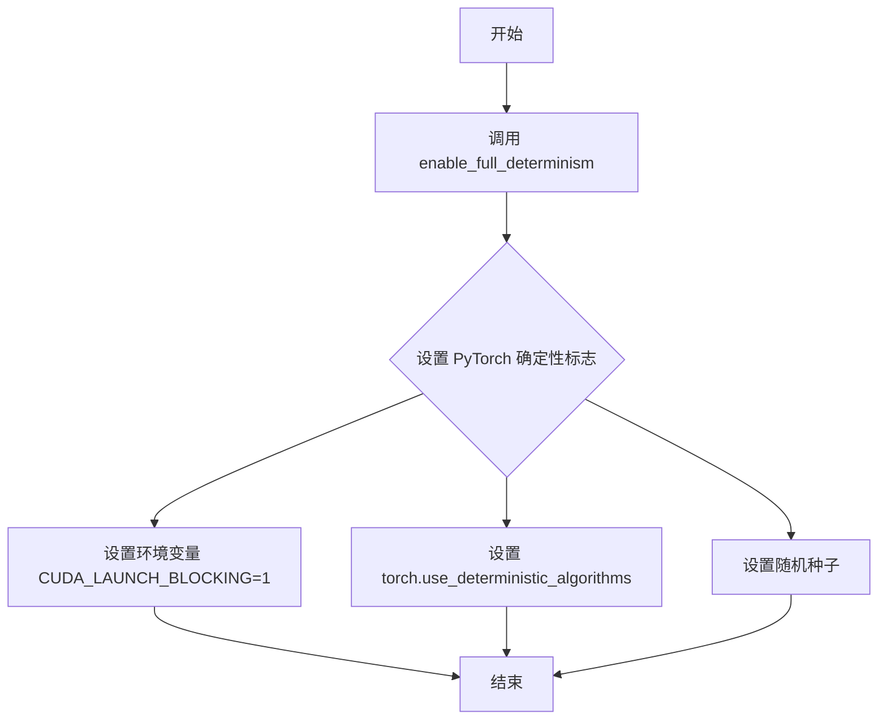

#### 带注释源码

```python
# 从上层目录的 testing_utils 模块导入 enable_full_determinism 函数
from ...testing_utils import enable_full_determinism, torch_device

# 调用 enable_full_determinism 启用完全确定性模式
# 这将确保后续的随机操作（如 randn_tensor）在每次运行时产生相同的值
# 对于 Wan Transformer 3D 模型测试至关重要，保证测试结果可复现
enable_full_determinism()
```

---

> **注意**：由于 `enable_full_determinism` 函数定义在 `diffusers` 库的 `testing_utils` 模块中（通过 `from ...testing_utils import` 导入），而非当前文件内，因此无法提供该函数的具体实现源码。以上信息基于函数名称、调用方式及行业惯例推断。


### `randn_tensor`

生成符合标准正态分布（均值=0，标准差=1）的随机张量，用于模型测试的虚拟输入。

参数：

- `shape`：`tuple[int, ...]`，张量的形状，指定每个维度的元素数量
- `generator`：`torch.Generator`（可选），用于生成确定性随机数的 PyTorch 随机数生成器
- `device`：`str` 或 `torch.device`（可选），指定张量应放置的设备（如 "cpu"、"cuda"）
- `dtype`：`torch.dtype`（可选），张量的数据类型（如 torch.float16、torch.bfloat16）

返回值：`torch.Tensor`，符合标准正态分布的随机张量

#### 流程图

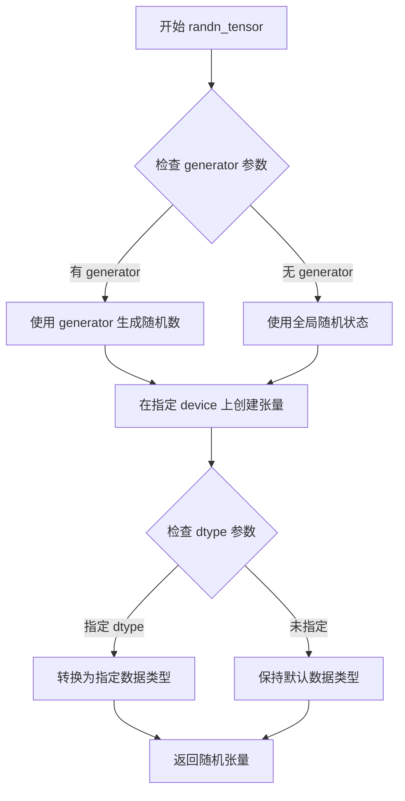

#### 带注释源码

```python
# 从 diffusers.utils.torch_utils 导入
# 这是一个工具函数，用于生成符合标准正态分布的随机张量
# 源代码位于 diffusers 库中，这里展示调用方式

# 调用示例 1: 基本用法
hidden_states = randn_tensor(
    (batch_size, num_channels, num_frames, height, width),  # shape: 张量形状
    generator=self.generator,  # generator: 可选的随机数生成器，确保可复现性
    device=torch_device,       # device: 目标设备（'cpu' 或 'cuda'）
)

# 调用示例 2: 指定数据类型
hidden_states = randn_tensor(
    (1, 36, 2, 64, 64),        # shape: 张量形状
    generator=self.generator,  # generator: 随机数生成器
    device=torch_device,       # device: 目标设备
    dtype=torch.float16        # dtype: 数据类型（可选）
)

# 调用示例 3: 仅指定形状和设备
encoder_hidden_states = randn_tensor(
    (batch_size, sequence_length, text_encoder_embedding_dim),
    generator=self.generator,
    device=torch_device,
)
```


### `WanTransformer3DTesterConfig.model_class`

该属性方法用于返回 WanTransformer3D 模型的具体类类型，以便测试框架能够实例化并测试对应的 3D 变换器模型。

参数： 无（该方法为属性方法，无显式参数）

返回值：`type`，返回 `WanTransformer3DModel` 类对象，供测试配置使用以实例化模型进行各类测试。

#### 流程图

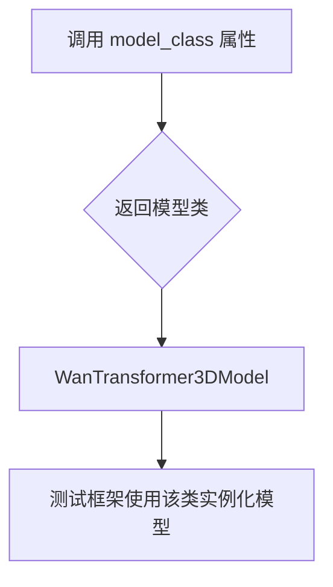

#### 带注释源码

```python
@property
def model_class(self):
    """
    返回 Wan Transformer 3D 模型的具体类类型。
    
    该属性被测试框架的混入类（Mixin）使用，用于：
    1. 动态实例化模型进行测试
    2. 验证模型加载、保存、推理等功能
    3. 为不同测试场景提供统一的模型类访问接口
    
    Returns:
        type: WanTransformer3DModel 类对象
    """
    return WanTransformer3DModel
```


### `WanTransformer3DTesterConfig.pretrained_model_name_or_path`

这是一个属性方法（Property），用于返回Wan 3D Transformer预训练模型的名称或路径，以便在测试中加载对应的模型权重。

参数：
- 无参数（这是一个只读属性）

返回值：`str`，返回预训练模型的HuggingFace Hub标识符或本地路径。

#### 流程图

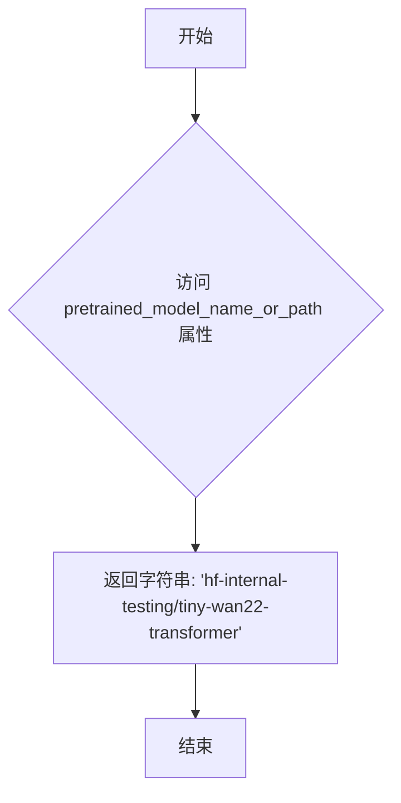

#### 带注释源码

```python
class WanTransformer3DTesterConfig(BaseModelTesterConfig):
    """Wan 3D Transformer模型的测试配置类，继承自基础测试配置"""
    
    @property
    def pretrained_model_name_or_path(self):
        """
        获取预训练模型的名称或路径
        
        Returns:
            str: HuggingFace Hub上的模型标识符或本地模型路径
                  这里使用 hf-internal-testing 组织下的 tiny-wan22-transformer 
                  这是一个用于测试目的的微型模型
        """
        return "hf-internal-testing/tiny-wan22-transformer"
```


### `WanTransformer3DTesterConfig.output_shape`

该属性方法定义了 Wan Transformer 3D 模型的输出形状，用于指定模型在推理时输出的隐藏状态的维度信息。

参数：
- 无显式参数（该方法为 `@property` 装饰器修饰，隐含参数为 `self`）

返回值：`tuple[int, ...]`，返回模型的输出形状元组，包含批量大小、通道数、帧数（视频场景下）和空间维度信息，本例中为 `(4, 2, 16, 16)`，即 batch_size=4, num_channels=2, height=16, width=16。

#### 流程图

```mermaid
flowchart TD
    A[开始] --> B{访问 output_shape 属性}
    B --> C[返回元组 (4, 2, 16, 16)]
    C --> D[结束]
```

#### 带注释源码

```python
@property
def output_shape(self) -> tuple[int, ...]:
    """返回模型的输出形状元组。
    
    Returns:
        tuple[int, ...]: 包含4个整数的元组，依次表示:
            - batch_size: 4
            - num_channels: 2
            - height: 16
            - width: 16
    """
    return (4, 2, 16, 16)
```


### `WanTransformer3DTesterConfig.input_shape`

该属性方法用于返回Wan Transformer 3D模型的输入张量形状配置，返回一个包含4个维度的元组，表示批量大小、通道数、帧数（时间步）和空间维度信息。

参数： 无（作为属性方法，仅通过`self`访问类实例）

返回值：`tuple[int, ...]`，返回模型输入的形状元组 `(4, 2, 16, 16)`，分别代表批量大小为4、通道数为2、帧数为16、空间高度和宽度各为16。

#### 流程图

```mermaid
flowchart TD
    A[开始访问 input_shape 属性] --> B{执行 property getter}
    B --> C[返回元组 (4, 2, 16, 16)]
    C --> D[结束]
```

#### 带注释源码

```python
@property
def input_shape(self) -> tuple[int, ...]:
    """
    定义Wan Transformer 3D模型的输入形状配置。
    
    Returns:
        tuple[int, ...]: 
            - 第一个元素 (4): 批量大小 (batch_size)
            - 第二个元素 (2): 输入通道数 (num_channels/frames)
            - 第三个元素 (16): 帧数或时间步数 (num_frames)
            - 第四个元素 (16): 空间高度/宽度 (height/width)
            
    注意: 此属性与 output_shape 返回值相同，表示该模型为自回归或等距输入输出结构。
    """
    return (4, 2, 16, 16)
```


### `WanTransformer3DTesterConfig.main_input_name`

该属性是 WanTransformer3DTesterConfig 测试配置类的核心属性之一，用于返回该 3D Transformer 模型的主输入张量的名称标识符，以便在模型测试和推理时正确引用对应的输入数据。

参数：

- `self`：`WanTransformer3DTesterConfig`，隐式参数，表示当前配置类的实例对象本身

返回值：`str`，返回字符串 `"hidden_states"`，表示 WanTransformer3D 模型的主输入张量的名称

#### 流程图

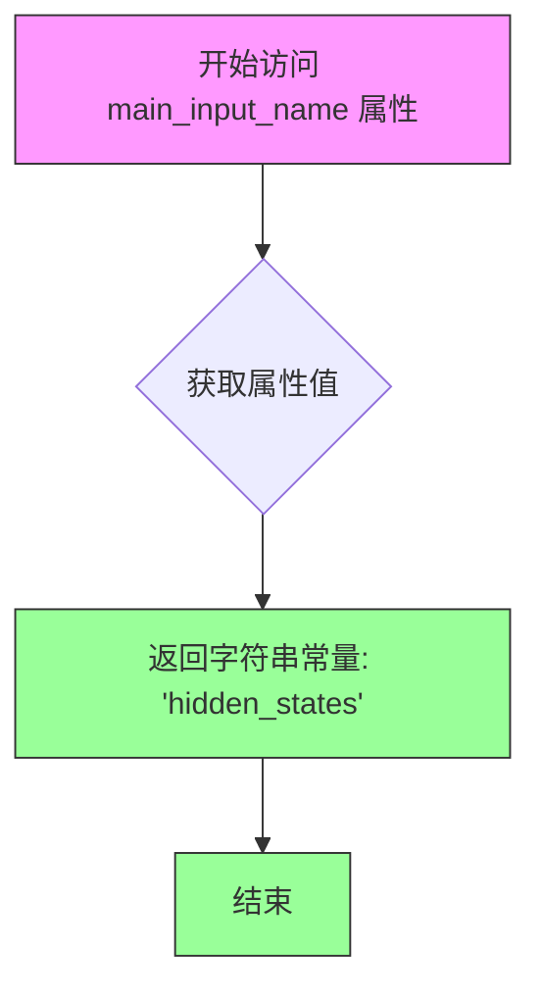

#### 带注释源码

```python
@property
def main_input_name(self) -> str:
    """
    主输入名称属性。
    
    该属性定义了 WanTransformer3DModel 模型在推理和测试时
    主要处理的输入张量的名称标识符。在本测试配置中，
    模型的主输入是 hidden_states（隐藏状态张量），
    这是一个包含批量大小、通道数、时间帧数、高度和宽度的 5D 张量。
    
    Returns:
        str: 返回主输入的名称，固定为 'hidden_states'
    """
    return "hidden_states"
```


### `WanTransformer3DTesterConfig.generator`

该属性用于创建一个带有固定种子值的 PyTorch 随机数生成器，确保测试过程中数据生成的可重复性和确定性。

参数：无（属性 getter 不接受参数）

返回值：`torch.Generator`，返回一个 CPU 设备上的随机数生成器实例，并设置种子为 0，用于生成可复现的伪随机张量数据。

#### 流程图

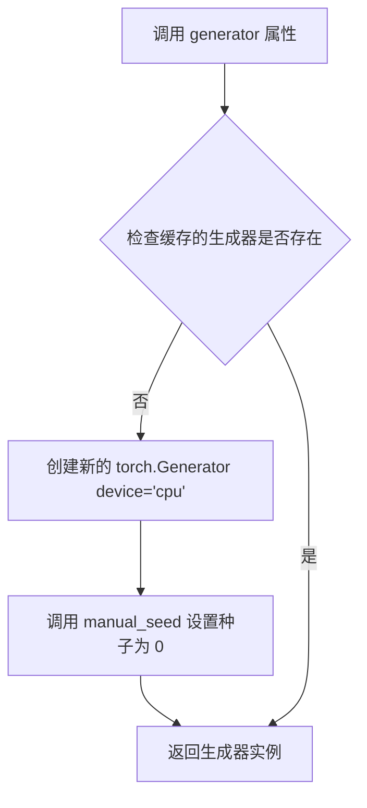

#### 带注释源码

```python
@property
def generator(self):
    """
    创建一个带有固定种子值的随机数生成器。
    
    返回值类型: torch.Generator
    返回值描述: 返回一个 CPU 设备上的 PyTorch 随机数生成器，种子固定为 0。
                 该生成器用于确保测试中随机数据的一致性和可复现性。
    
    注意: 每次调用都会创建新的生成器实例，这在多线程场景下可能不是最优的。
          考虑缓存生成器实例以提高性能。
    """
    return torch.Generator("cpu").manual_seed(0)
```


### `WanTransformer3DTesterConfig.get_init_dict`

该方法是一个配置类方法，用于返回 Wan Transformer 3D 模型的初始化参数字典，包含了模型的各种架构参数（如 patch_size、注意力头数、层数等），供测试框架在实例化模型时使用。

参数：
- 该方法无显式参数（隐式参数 `self` 为类实例）

返回值：`dict[str, int | list[int] | tuple | str | bool]`，返回一个包含模型初始化配置的字典，键为字符串类型的参数名，值为整数、列表、元组、字符串或布尔类型。

#### 流程图

```mermaid
flowchart TD
    A[开始 get_init_dict] --> B[创建配置字典]
    B --> C[设置 patch_size = (1, 2, 2)]
    C --> D[设置 num_attention_heads = 2]
    D --> E[设置 attention_head_dim = 12]
    E --> F[设置 in_channels = 4, out_channels = 4]
    F --> G[设置 text_dim = 16, freq_dim = 256, ffn_dim = 32]
    G --> H[设置 num_layers = 2]
    H --> I[设置 cross_attn_norm = True]
    I --> J[设置 qk_norm = 'rms_norm_across_heads']
    J --> K[设置 rope_max_seq_len = 32]
    K --> L[返回完整配置字典]
```

#### 带注释源码

```python
def get_init_dict(self) -> dict[str, int | list[int] | tuple | str | bool]:
    """
    返回 Wan Transformer 3D 模型的初始化参数字典。
    
    该方法提供模型实例化所需的所有架构配置参数，
    包括注意力机制、输入输出维度、网络层数等关键设置。
    
    返回值:
        dict[str, int | list[int] | tuple | str | bool]: 包含模型初始化的配置字典
    """
    return {
        "patch_size": (1, 2, 2),              # 3D patch 划分尺寸 (时间, 高度, 宽度)
        "num_attention_heads": 2,             # 注意力头的数量
        "attention_head_dim": 12,             # 每个注意力头的维度
        "in_channels": 4,                     # 输入通道数
        "out_channels": 4,                    # 输出通道数
        "text_dim": 16,                       # 文本嵌入维度
        "freq_dim": 256,                      # 频率维度（用于位置编码）
        "ffn_dim": 32,                        # 前馈网络隐藏层维度
        "num_layers": 2,                      # Transformer 层数
        "cross_attn_norm": True,              # 是否对交叉注意力进行归一化
        "qk_norm": "rms_norm_across_heads",  # QK 归一化方式
        "rope_max_seq_len": 32,               # RoPE 位置编码的最大序列长度
    }
```


### `WanTransformer3DTesterConfig.get_dummy_inputs`

该方法用于生成 WanTransformer3DModel 的虚拟输入数据，构造符合模型输入形状要求的随机张量（hidden_states、encoder_hidden_states 和 timestep），以便进行模型测试。

参数：

- 该方法无显式参数（仅隐式参数 `self`）

返回值：`dict[str, torch.Tensor]`，返回包含三个键的字典，分别为模型的 hidden_states、encoder_hidden_states 和 timestep 输入。

#### 流程图

```mermaid
flowchart TD
    A[开始 get_dummy_inputs] --> B[设置 batch_size = 1]
    B --> C[设置 num_channels = 4]
    C --> D[设置 num_frames = 2]
    D --> E[设置 height = 16]
    E --> F[设置 width = 16]
    F --> G[设置 text_encoder_embedding_dim = 16]
    G --> H[设置 sequence_length = 12]
    H --> I[生成 hidden_states 张量]
    I --> J[形状: (1, 4, 2, 16, 16)]
    J --> K[生成 encoder_hidden_states 张量]
    K --> L[形状: (1, 12, 16)]
    L --> M[生成 timestep 张量]
    M --> N[形状: (1,)]
    N --> O[返回输入字典]
```

#### 带注释源码

```python
def get_dummy_inputs(self) -> dict[str, torch.Tensor]:
    """
    生成用于测试 WanTransformer3DModel 的虚拟输入数据。
    
    返回:
        包含模型所需输入的字典，包括 hidden_states、encoder_hidden_states 和 timestep
    """
    # 批量大小
    batch_size = 1
    # 输入通道数
    num_channels = 4
    # 帧数（用于视频/3D输入）
    num_frames = 2
    # 高度
    height = 16
    # 宽度
    width = 16
    # 文本编码器嵌入维度
    text_encoder_embedding_dim = 16
    # 序列长度
    sequence_length = 12

    # 构建返回的输入字典
    return {
        # hidden_states: 模型的主要输入，形状为 (batch, channels, frames, height, width)
        "hidden_states": randn_tensor(
            (batch_size, num_channels, num_frames, height, width),
            generator=self.generator,
            device=torch_device,
        ),
        # encoder_hidden_states: 文本编码器的输出，形状为 (batch, sequence_length, text_dim)
        "encoder_hidden_states": randn_tensor(
            (batch_size, sequence_length, text_encoder_embedding_dim),
            generator=self.generator,
            device=torch_device,
        ),
        # timestep: 用于扩散模型的时间步，形状为 (batch,)
        "timestep": torch.randint(0, 1000, size=(batch_size,), generator=self.generator).to(torch_device),
    }
```


### `TestWanTransformer3D.test_from_save_pretrained_dtype_inference`

这是 Wan Transformer 3D 核心模型测试类中的一个测试方法，用于验证模型保存和加载时的数据类型推断功能。由于 fp16/bf16 需要非常高的容差才能通过测试，而数据类型保持功能已由其他测试覆盖，因此该测试被跳过。

参数：

- `self`：`TestWanTransformer3D`，测试类的实例，隐式参数
- `tmp_path`：`py.path.local`（pytest.TmpdirFixture），pytest 提供的临时目录，用于存放测试过程中生成的模型文件
- `dtype`：`torch.dtype`，要测试的数据类型，参数化为 `torch.float16` 和 `torch.bfloat16`

返回值：`None`，该方法使用 `pytest.skip()` 跳过了测试执行

#### 流程图

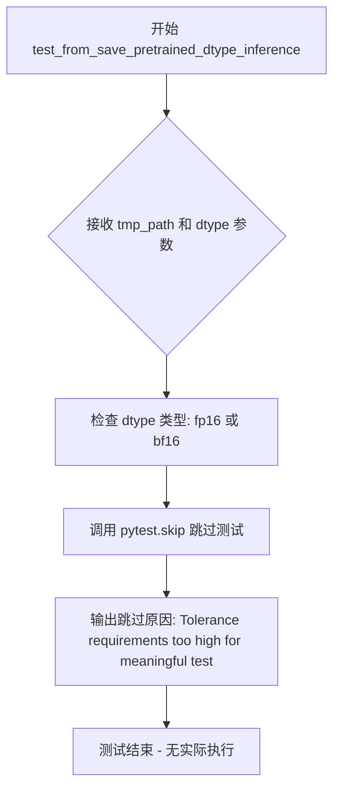

#### 带注释源码

```python
@pytest.mark.parametrize("dtype", [torch.float16, torch.bfloat16], ids=["fp16", "bf16"])
def test_from_save_pretrained_dtype_inference(self, tmp_path, dtype):
    # Skip: fp16/bf16 require very high atol to pass, providing little signal.
    # Dtype preservation is already tested by test_from_save_pretrained_dtype and test_keep_in_fp32_modules.
    pytest.skip("Tolerance requirements too high for meaningful test")
```


### `TestWanTransformer3DTraining.test_gradient_checkpointing_is_applied`

该测试方法用于验证 WanTransformer3DModel 是否正确应用了梯度检查点（Gradient Checkpointing）技术，以确保在训练过程中能够有效节省显存。

参数：

- `self`：`TestWanTransformer3DTraining` 类型，测试类实例本身

返回值：`None`（无返回值），该方法通过调用父类的测试方法进行验证

#### 流程图

```mermaid
flowchart TD
    A[开始测试] --> B[设置 expected_set]
    B --> C[expected_set = {'WanTransformer3DModel'}]
    C --> D[调用父类方法]
    D --> E[super().test_gradient_checkpointing_is_applied<br/>(expected_set=expected_set)]
    E --> F{验证梯度检查点是否应用}
    F -->|是| G[测试通过]
    F -->|否| H[测试失败]
    G --> I[结束]
    H --> I
```

#### 带注释源码

```python
def test_gradient_checkpointing_is_applied(self):
    """
    测试梯度检查点（Gradient Checkpointing）是否被正确应用于 WanTransformer3DModel。
    
    Gradient Checkpointing 是一种用计算换显存的技术，通过在前向传播时保存部分中间结果，
    在反向传播时重新计算未保存的部分，从而减少显存占用。
    """
    # 定义期望应用梯度检查点的模型集合
    # WanTransformer3DModel 是需要进行梯度检查点测试的目标模型类
    expected_set = {"WanTransformer3DModel"}
    
    # 调用父类 TrainingTesterMixin 的测试方法
    # 父类方法会遍历 expected_set 中的模型类，验证其是否正确配置了梯度检查点
    super().test_gradient_checkpointing_is_applied(expected_set=expected_set)
```


### `TestWanTransformer3DBitsAndBytes.torch_dtype`

该属性方法用于返回 BitsAndBytes 量化测试所需的 torch 数据类型（torch.float16），以确保测试使用半精度浮点数进行模型计算。

参数：无

返回值：`torch.dtype`，返回 `torch.float16`，表示测试使用的数值数据类型为半精度浮点数。

#### 流程图

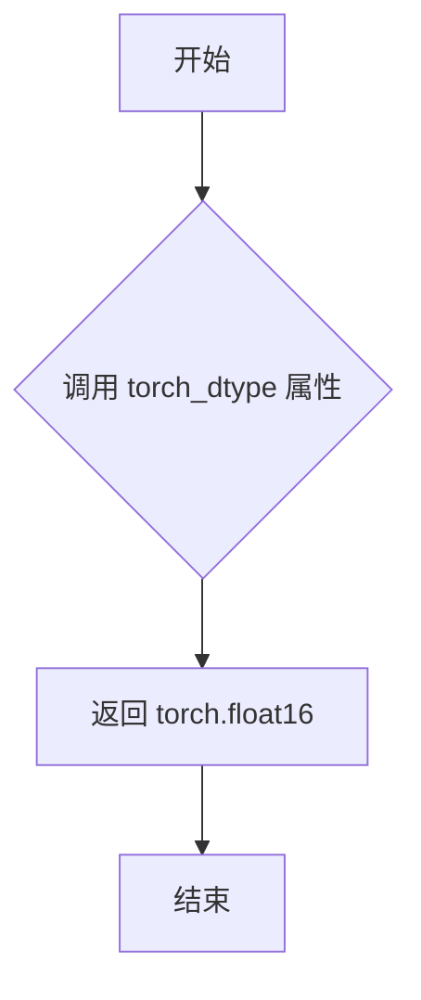

#### 带注释源码

```python
@property
def torch_dtype(self):
    """返回 BitsAndBytes 量化测试所需的 torch 数据类型。
    
    Returns:
        torch.dtype: 返回 torch.float16，用于 BitsAndBytes 量化测试的半精度浮点数类型。
    """
    return torch.float16
```


### `TestWanTransformer3DBitsAndBytes.get_dummy_inputs`

该方法重写了基类方法，用于生成适配 Wan Transformer 3D 模型（BitsAndBytes 量化测试场景）的虚拟输入数据。它创建了符合模型维度的随机张量，包括 hidden_states、encoder_hidden_states 和 timestep，并确保使用 float16 数据类型以匹配量化测试的要求。

参数：

- 该方法无显式参数（仅包含 self）

返回值：`dict[str, torch.Tensor]`，返回包含三个键的字典，分别对应模型的隐藏状态、编码器隐藏状态和时间步，用于模型的前向传播测试

#### 流程图

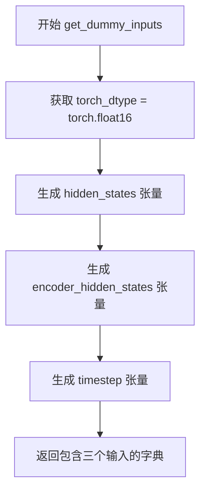

#### 带注释源码

```python
def get_dummy_inputs(self):
    """Override to provide inputs matching the tiny Wan model dimensions."""
    # 返回一个字典，包含模型前向传播所需的三个输入张量
    return {
        # hidden_states: (batch=1, channels=36, frames=2, height=64, width=64)
        "hidden_states": randn_tensor(
            (1, 36, 2, 64, 64),       # 张量形状：(batch, channels, frames, height, width)
            generator=self.generator, # 随机数生成器，确保可复现性
            device=torch_device,      # 计算设备（CPU/CUDA）
            dtype=self.torch_dtype    # 数据类型：torch.float16
        ),
        # encoder_hidden_states: (batch=1, seq_len=512, text_dim=4096)
        "encoder_hidden_states": randn_tensor(
            (1, 512, 4096),           # 张量形状：(batch, sequence_length, text_embedding_dim)
            generator=self.generator, 
            device=torch_device, 
            dtype=self.torch_dtype
        ),
        # timestep: (batch=1,) - 单个时间步张量
        "timestep": torch.tensor([1.0]).to(torch_device, self.torch_dtype),
    }
```


### `TestWanTransformer3DTorchAo.torch_dtype`

这是一个属性方法，用于返回 Wan Transformer 3D 模型在 TorchAO 量化测试中的默认数据类型。

参数：
- 无参数（属性方法）

返回值：`torch.dtype`，返回 `torch.bfloat16`，指定测试中使用的 PyTorch 数据类型为 bfloat16。

#### 流程图

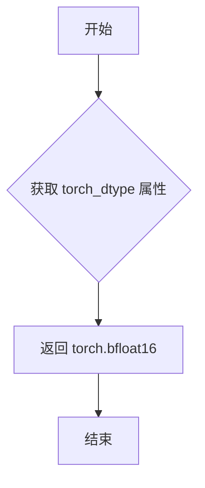

#### 带注释源码

```python
@property
def torch_dtype(self):
    """返回用于 TorchAO 量化测试的 torch 数据类型。
    
    该属性覆盖了基类配置，指定使用 bfloat16 数据类型进行测试。
    bfloat16 是针对深度学习优化的16位浮点格式，在保持数值范围的同时节省显存。
    
    Returns:
        torch.dtype: 用于测试的 PyTorch 数据类型 (torch.bfloat16)
    """
    return torch.bfloat16
```


### `TestWanTransformer3DTorchAo.get_dummy_inputs`

该方法用于为 TorchAO 量化测试生成符合 Wan Transformer 3D 模型尺寸的虚拟输入数据。它返回一个包含 `hidden_states`、`encoder_hidden_states` 和 `timestep` 三个键的字典，这些张量使用随机数生成并指定了特定的数据类型（bfloat16）和设备。

参数： 无（该方法不接受任何显式参数，但使用实例属性 `self.generator`、`self.torch_dtype` 和全局函数 `torch_device`、`randn_tensor`）

返回值： `dict[str, torch.Tensor]`，返回包含三个 PyTorch 张量的字典，分别为：
- `hidden_states`: 形状为 (1, 36, 2, 64, 64) 的输入隐状态张量
- `encoder_hidden_states`: 形状为 (1, 512, 4096) 的编码器隐状态张量
- `timestep`: 形状为 (1,) 的时间步张量

#### 流程图

```mermaid
flowchart TD
    A[开始 get_dummy_inputs] --> B[获取 torch_dtype 属性<br/>值为 torch.bfloat16]
    B --> C[生成 hidden_states 张量]
    C --> D[形状: (1, 36, 2, 64, 64)]
    D --> E[生成 encoder_hidden_states 张量]
    E --> F[形状: (1, 512, 4096)]
    F --> G[生成 timestep 张量]
    G --> H[值为 torch.tensor([1.0])<br/>转换为 bfloat16]
    H --> I[组装字典并返回]
```

#### 带注释源码

```python
def get_dummy_inputs(self):
    """Override to provide inputs matching the tiny Wan model dimensions."""
    # 生成隐藏状态张量：形状 (batch=1, 通道=36, 帧数=2, 高=64, 宽=64)
    # 使用随机张量生成器确保可重复性，指定设备为 torch_device，数据类型为 bfloat16
    "hidden_states": randn_tensor(
        (1, 36, 2, 64, 64), generator=self.generator, device=torch_device, dtype=self.torch_dtype
    ),
    # 生成编码器隐藏状态张量：形状 (batch=1, 序列长度=512, 文本嵌入维度=4096)
    # 对应 Wan 2.2 I2V 模型的 text_dim=4096
    "encoder_hidden_states": randn_tensor(
        (1, 512, 4096), generator=self.generator, device=torch_device, dtype=self.torch_dtype
    ),
    # 生成时间步张量：形状 (1,)，值为 1.0
    # 转换为指定设备和数据类型 (bfloat16)
    "timestep": torch.tensor([1.0]).to(torch_device, self.torch_dtype),
}
```


### `TestWanTransformer3DGGUF.gguf_filename`

该属性返回用于 GGUF 量化测试的 Wan Transformer 3D 模型的 GGUF 文件 URL 链接。

参数：无（这是一个属性装饰器方法，通过 `self` 访问实例）

返回值：`str`，Wan Transformer 3D GGUF 模型的远程文件 URL，指向 HuggingFace Hub 上的 Wan2.2-I2V-A14B-LowNoise-Q2_K.gguf 文件

#### 流程图

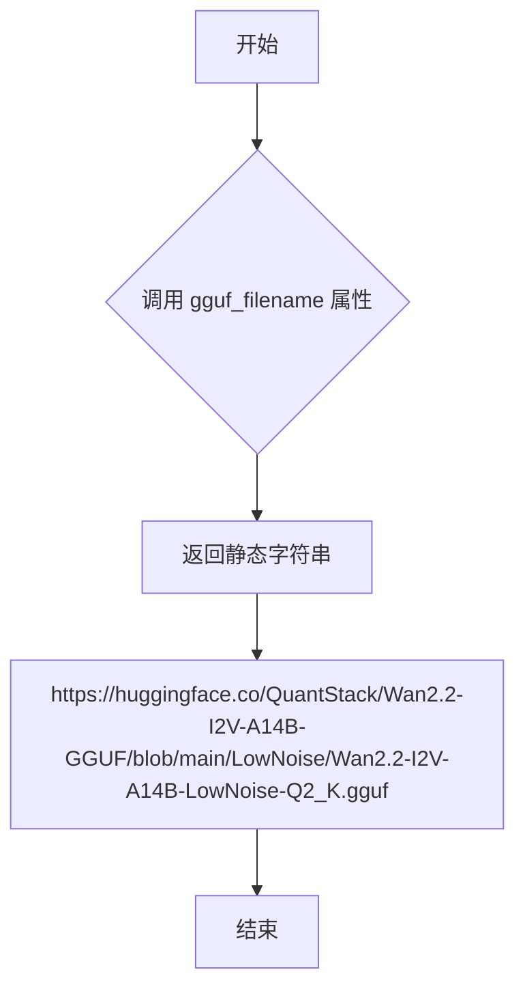

#### 带注释源码

```python
@property
def gguf_filename(self):
    """返回 Wan Transformer 3D GGUF 模型的 GGUF 文件 URL。
    
    该属性提供了用于 GGUF 量化测试的预训练模型文件地址。
    模型来源于 HuggingFace Hub 上的 QuantStack/Wan2.2-I2V-A14B-GGUF 仓库，
    使用 LowNoise 版本的 Q2_K 量化模型。
    
    Returns:
        str: GGUF 模型文件的完整 URL 地址
    """
    return "https://huggingface.co/QuantStack/Wan2.2-I2V-A14B-GGUF/blob/main/LowNoise/Wan2.2-I2V-A14B-LowNoise-Q2_K.gguf"
```


### `TestWanTransformer3DGGUF.torch_dtype`

这是一个属性方法（property），用于返回 GGUF 量化测试所需的 PyTorch 数据类型（dtype）。该属性指定了测试过程中使用的浮点精度类型。

参数：无（作为属性访问）

返回值：`torch.dtype`，返回 `torch.bfloat16`，指定测试使用 bfloat16 精度进行

#### 流程图

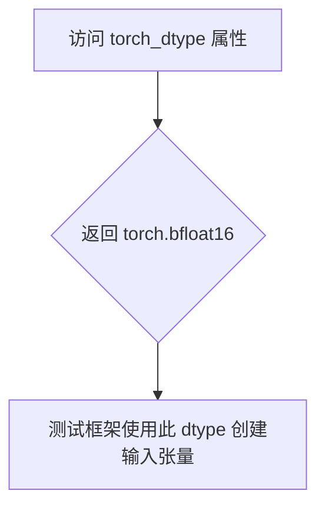

#### 带注释源码

```python
@property
def torch_dtype(self):
    """返回 GGUF 量化测试使用的 PyTorch 数据类型。
    
    Returns:
        torch.dtype: 使用 bfloat16 精度进行 GGUF 量化测试
    """
    return torch.bfloat16
```


### `TestWanTransformer3DGGUF._create_quantized_model`

该方法重写了父类的 `_create_quantized_model` 方法，用于创建支持 GGUF 量化格式的 Wan Transformer 3D 模型。它通过调用父类方法并指定特定的模型配置路径（"Wan-AI/Wan2.2-I2V-A14B-Diffusers"）和子文件夹（"transformer"），从而加载和实例化量化模型。

参数：

- `config_kwargs`：`dict` 或 `None`，可选参数，用于传递模型配置选项
- `**extra_kwargs`：`任意类型`，可变关键字参数，用于传递额外的配置参数（如 `torch_dtype`、`device` 等）

返回值：`任意类型`，返回父类 `GGUFTesterMixin._create_quantized_model` 方法的返回值，通常是一个量化后的模型实例

#### 流程图

```mermaid
flowchart TD
    A[开始 _create_quantized_model] --> B{config_kwargs 是否为 None?}
    B -->|是| C[创建空字典 config_dict]
    B -->|否| D[使用传入的 config_kwargs]
    D --> C
    C --> E[调用 super()._create_quantized_model]
    E --> F[传入参数: config_kwargs, config='Wan-AI/Wan2.2-I2V-A14B-Diffusers', subfolder='transformer', **extra_kwargs]
    F --> G[返回量化模型实例]
    G --> H[结束]
```

#### 带注释源码

```python
def _create_quantized_model(self, config_kwargs=None, **extra_kwargs):
    """
    创建支持 GGUF 量化格式的 Wan Transformer 3D 模型。
    
    该方法重写了父类 GGUFTesterMixin 的 _create_quantized_model 方法，
    用于指定特定的 Wan I2V (Image-to-Video) 模型配置。
    
    参数:
        config_kwargs: 可选的配置字典，用于自定义模型配置参数
        **extra_kwargs: 额外的关键字参数，会被传递给父类方法
    
    返回:
        返回量化后的 WanTransformer3DModel 实例
    """
    # 调用父类 GGUFTesterMixin 的 _create_quantized_model 方法
    # 传入配置参数：
    #   - config_kwargs: 原始配置字典
    #   - config: 指定使用 Wan-AI/Wan2.2-I2V-A14B-Diffusers 预训练模型
    #   - subfolder: 指定 transformers 子文件夹
    #   - **extra_kwargs: 转发所有额外参数（如 device, torch_dtype 等）
    return super()._create_quantized_model(
        config_kwargs, 
        config="Wan-AI/Wan2.2-I2V-A14B-Diffusers", 
        subfolder="transformer", 
        **extra_kwargs
    )
```


### `TestWanTransformer3DGGUF.get_dummy_inputs`

该方法用于为 GGUF 量化测试生成符合真实 Wan I2V 模型维度的虚拟输入数据，返回包含 hidden_states、encoder_hidden_states 和 timestep 的字典。

参数：

- 无（仅包含 self 参数）

返回值：`dict[str, torch.Tensor]`，返回一个包含三个张量的字典，分别代表模型的隐藏状态、编码器隐藏状态和时间步，用于测试 Wan 2.2 I2V 模型的 GGUF 量化推理流程。

#### 流程图

```mermaid
flowchart TD
    A[开始 get_dummy_inputs] --> B[生成 hidden_states 张量]
    B --> C[形状: (1, 36, 2, 64, 64)]
    C --> D[生成 encoder_hidden_states 张量]
    D --> E[形状: (1, 512, 4096)]
    E --> F[生成 timestep 张量]
    F --> G[值: torch.tensor([1.0])]
    G --> H[组装为字典返回]
    H --> I[结束]
```

#### 带注释源码

```
def get_dummy_inputs(self):
    """Override to provide inputs matching the real Wan I2V model dimensions.

    Wan 2.2 I2V: in_channels=36, text_dim=4096
    """
    # 返回包含模型虚拟输入的字典
    return {
        # hidden_states: 主输入张量，形状为 (batch_size, in_channels, num_frames, height, width)
        # 这里使用真实模型的 in_channels=36
        "hidden_states": randn_tensor(
            (1, 36, 2, 64, 64), generator=self.generator, device=torch_device, dtype=self.torch_dtype
        ),
        # encoder_hidden_states: 文本编码器输出的隐藏状态，形状为 (batch_size, sequence_length, text_dim)
        # 这里使用真实模型的 text_dim=4096
        "encoder_hidden_states": randn_tensor(
            (1, 512, 4096), generator=self.generator, device=torch_device, dtype=self.torch_dtype
        ),
        # timestep: 扩散过程的时间步，使用 torch_dtype 进行类型转换
        "timestep": torch.tensor([1.0]).to(torch_device, self.torch_dtype),
    }
```


### `TestWanTransformer3DGGUFCompile.gguf_filename`

该属性方法返回 Wan Transformer 3D 模型 GGUF 量化文件的具体 URL 地址，用于 GGUF+Compile 集成测试场景。

参数：

- 该方法无参数（为 `@property` 装饰器修饰的属性方法）

返回值：`str`，返回 GGUF 量化模型文件的 HuggingFace 下载链接地址

#### 流程图

```mermaid
flowchart TD
    A[访问 gguf_filename 属性] --> B{属性访问}
    B -->|触发 getter| C[返回静态字符串]
    C --> D["https://huggingface.co/QuantStack/Wan2.2-I2V-A14B-GGUF/blob/main/LowNoise/Wan2.2-I2V-A14B-LowNoise-Q2_K.gguf"]
```

#### 带注释源码

```python
class TestWanTransformer3DGGUFCompile(WanTransformer3DTesterConfig, GGUFCompileTesterMixin):
    """GGUF + compile tests for Wan Transformer 3D."""

    @property
    def gguf_filename(self):
        """
        返回 GGUF 量化模型文件的下载链接
        
        该属性用于指定 Wan2.2-I2V-A14B 模型的 GGUF 量化版本文件地址
        模型来源为 QuantStack 提供的 LowNoise 量化变体 (Q2_K 量化级别)
        """
        return "https://huggingface.co/QuantStack/Wan2.2-I2V-A14B-GGUF/blob/main/LowNoise/Wan2.2-I2V-A14B-LowNoise-Q2_K.gguf"

    @property
    def torch_dtype(self):
        """返回测试所使用的浮点数据类型"""
        return torch.bfloat16

    def _create_quantized_model(self, config_kwargs=None, **extra_kwargs):
        """
        创建量化模型实例
        
        参数:
            config_kwargs: 传递给模型配置的可选关键字参数
            **extra_kwargs: 额外的关键字参数
        
        返回:
            量化后的 WanTransformer3DModel 模型实例
        """
        return super()._create_quantized_model(
            config_kwargs, config="Wan-AI/Wan2.2-I2V-A14B-Diffusers", subfolder="transformer", **extra_kwargs
        )

    def get_dummy_inputs(self):
        """
        生成符合真实 Wan I2V 模型维度的虚拟输入数据
        
        Wan 2.2 I2V 模型规格:
        - in_channels: 36 (视频通道数)
        - text_dim: 4096 (文本编码器嵌入维度)
        
        返回:
            包含 hidden_states, encoder_hidden_states, timestep 的字典
        """
        return {
            "hidden_states": randn_tensor(
                (1, 36, 2, 64, 64), generator=self.generator, device=torch_device, dtype=self.torch_dtype
            ),
            "encoder_hidden_states": randn_tensor(
                (1, 512, 4096), generator=self.generator, device=torch_device, dtype=self.torch_dtype
            ),
            "timestep": torch.tensor([1.0]).to(torch_device, self.torch_dtype),
        }
```


### `TestWanTransformer3DGGUFCompile.torch_dtype`

这是一个属性方法（Property），用于返回 GGUF 编译测试所使用的数据类型（dtype），在这里固定返回 `torch.bfloat16`，以确保测试使用 bfloat16 精度进行。

参数：

- （无参数）

返回值：`torch.dtype`，返回 PyTorch 的 bfloat16 数据类型，用于指定模型和输入的张量精度。

#### 流程图

```mermaid
flowchart TD
    A[开始] --> B{调用 torch_dtype 属性}
    B --> C[返回 torch.bfloat16]
    C --> D[结束]
```

#### 带注释源码

```python
@property
def torch_dtype(self):
    """返回用于 GGUF 编译测试的 PyTorch 数据类型。
    
    Returns:
        torch.dtype: 返回 torch.bfloat16，用于测试的默认数据类型。
    """
    return torch.bfloat16
```


### `TestWanTransformer3DGGUFCompile._create_quantized_model`

该方法重写了父类的 `_create_quantized_model` 方法，用于创建 GGUF 量化格式的 Wan Transformer 3D 模型实例。通过指定特定的模型配置路径 "Wan-AI/Wan2.2-I2V-A14B-Diffusers" 和子文件夹 "transformer"，加载预训练的量化模型进行测试。

参数：

- `config_kwargs`：`dict` 或 `None`，可选的配置关键字参数字典，将传递给父类的 `_create_quantized_model` 方法，用于覆盖默认配置
- `**extra_kwargs`：`任意类型`，额外的关键字参数，将直接传递给父类的 `_create_quantized_model` 方法

返回值：任意类型，返回父类 `_create_quantized_model` 方法创建的对象，通常是量化后的模型实例

#### 流程图

```mermaid
flowchart TD
    A[开始 _create_quantized_model] --> B{config_kwargs 是否为 None}
    B -->|是| C[不传递 config_kwargs]
    B -->|否| D[传递 config_kwargs]
    C --> E[调用 super._create_quantized_model]
    D --> E
    E --> F[传入 config 参数: Wan-AI/Wan2.2-I2V-A14B-Diffusers]
    F --> G[传入 subfolder 参数: transformer]
    G --> H[传入 **extra_kwargs]
    H --> I[返回量化模型实例]
    I --> J[结束]
```

#### 带注释源码

```python
def _create_quantized_model(self, config_kwargs=None, **extra_kwargs):
    """
    创建 GGUF 量化格式的 Wan Transformer 3D 模型实例。
    
    该方法重写父类方法，指定了特定的模型配置路径和子文件夹，
    以加载 Wan 2.2 I2V (Image-to-Video) 预训练模型进行 GGUF 量化测试。
    
    参数:
        config_kwargs: 可选的配置关键字参数字典，用于覆盖默认配置
        **extra_kwargs: 额外的关键字参数，传递给父类方法
    
    返回:
        量化后的模型实例
    """
    # 调用父类的 _create_quantized_model 方法
    # 传入配置参数：指定 HuggingFace 模型路径为 Wan-AI/Wan2.2-I2V-A14B-Diffusers
    # 指定子文件夹为 transformer（Transformer 模型组件）
    return super()._create_quantized_model(
        config_kwargs,                          # 传递配置字典（可能为 None）
        config="Wan-AI/Wan2.2-I2V-A14B-Diffusers",  # 指定模型配置路径
        subfolder="transformer",                 # 指定子文件夹路径
        **extra_kwargs                           # 传递额外关键字参数
    )
```


### `TestWanTransformer3DGGUFCompile.get_dummy_inputs`

该方法用于生成符合真实 Wan I2V 模型维度的虚拟输入数据（hidden_states、encoder_hidden_states 和 timestep），以支持 GGUF 量化与 torch.compile 的测试场景。

参数：

- `self`：类的实例，继承自 `WanTransformer3DTesterConfig` 和 `GGUFCompileTesterMixin`，包含 `generator`、`torch_dtype` 等属性

返回值：`dict[str, torch.Tensor]`，返回包含三个键的字典，分别对应模型的隐藏状态、编码器隐藏状态和时间步

#### 流程图

```mermaid
flowchart TD
    A[开始 get_dummy_inputs] --> B[生成 hidden_states 张量]
    B --> C[生成 encoder_hidden_states 张量]
    C --> D[生成 timestep 张量]
    D --> E[返回包含三个张量的字典]
    
    B --> B1[形状: (1, 36, 2, 64, 64)<br/>设备: torch_device<br/>数据类型: torch_dtype]
    C --> C1[形状: (1, 512, 4096)<br/>设备: torch_device<br/>数据类型: torch_dtype]
    D --> D1[值: tensor([1.0])<br/>设备: torch_device<br/>数据类型: torch_dtype]
```

#### 带注释源码

```python
def get_dummy_inputs(self):
    """Override to provide inputs matching the real Wan I2V model dimensions.

    Wan 2.2 I2V: in_channels=36, text_dim=4096
    """
    # 生成隐藏状态张量，形状为 (batch=1, channels=36, frames=2, height=64, width=64)
    # 匹配 Wan 2.2 I2V 模型的 in_channels=36
    "hidden_states": randn_tensor(
        (1, 36, 2, 64, 64), generator=self.generator, device=torch_device, dtype=self.torch_dtype
    ),
    # 生成编码器隐藏状态张量，形状为 (batch=1, sequence_length=512, text_dim=4096)
    # 匹配 Wan 2.2 I2V 模型的 text_dim=4096
    "encoder_hidden_states": randn_tensor(
        (1, 512, 4096), generator=self.generator, device=torch_device, dtype=self.torch_dtype
    ),
    # 生成时间步张量，值为 1.0，数据类型为 torch_dtype
    "timestep": torch.tensor([1.0]).to(torch_device, self.torch_dtype),
}
```

## 关键组件


### WanTransformer3DTesterConfig

测试配置类，定义了WanTransformer3DModel的测试参数，包括模型路径、输入输出形状、模型参数字典（patch_size、注意力头数、隐藏维度等）以及虚拟输入数据的生成方法。

### TestWanTransformer3D

核心模型功能测试类，继承自ModelTesterMixin，用于验证Wan Transformer 3D模型的基本功能，包括模型加载、保存和精度推断等。

### TestWanTransformer3DMemory

内存优化测试类，继承自MemoryTesterMixin，用于测试Wan Transformer 3D模型的内存使用情况和优化效果。

### TestWanTransformer3DTraining

训练测试类，继承自TrainingTesterMixin，验证梯度检查点（gradient checkpointing）是否正确应用于WanTransformer3DModel。

### TestWanTransformer3DAttention

注意力处理器测试类，继承自AttentionTesterMixin，用于测试Wan Transformer 3D的注意力机制和相关处理器。

### TestWanTransformer3DCompile

Torch编译优化测试类，继承自TorchCompileTesterMixin，用于验证Wan Transformer 3D模型的torch.compile优化效果。

### TestWanTransformer3DBitsAndBytes

BitsAndBytes量化测试类，继承自BitsAndBytesTesterMixin，支持int8/int4量化推理，提供适配tiny Wan模型的虚拟输入。

### TestWanTransformer3DTorchAo

TorchAO量化测试类，继承自TorchAoTesterMixin，支持TorchAO量化方法（fp8、quark等），提供适配模型尺寸的虚拟输入。

### TestWanTransformer3DGGUF

GGUF量化测试类，继承自GGUFTesterMixin，支持GGUF格式量化模型加载，使用Wan2.2-I2V-A14B真实模型配置（in_channels=36, text_dim=4096）。

### TestWanTransformer3DGGUFCompile

GGUF量化与编译结合测试类，继承自GGUFCompileTesterMixin，验证GGUF量化模型与torch.compile的联合优化效果。


## 问题及建议


### 已知问题

- **代码重复严重**：多个测试类（`TestWanTransformer3DBitsAndBytes`、`TestWanTransformer3DTorchAo`、`TestWanTransformer3DGGUF`、`TestWanTransformer3DGGUFCompile`）的 `get_dummy_inputs` 方法完全相同，造成了大量重复代码。
- **类重复**：`TestWanTransformer3DGGUF` 和 `TestWanTransformer3DGGUFCompile` 除了类名外几乎完全相同，包括 `gguf_filename`、`torch_dtype`、`_create_quantized_model` 和 `get_dummy_inputs` 方法都一致，表明可能存在设计问题或测试职责划分不清。
- **测试跳过理由不明确**：`test_from_save_pretrained_dtype_inference` 方法直接使用 `pytest.skip()` 跳过测试，但没有在跳过消息中说明具体原因，降低了测试覆盖率的可追溯性。
- **配置信息分散**：测试配置分散在 `WanTransformer3DTesterConfig` 类和多个测试类中（如各测试类单独覆盖的 `torch_dtype` 属性），维护成本较高。
- **魔法数字和硬编码**：代码中存在大量硬编码的数值（如 `(1, 36, 2, 64, 64)`、`(1, 512, 4096)`、`torch.tensor([1.0])` 等），缺乏常量定义，影响可读性和可维护性。

### 优化建议

- **提取公共基类**：将 `get_dummy_inputs`、`torch_dtype`、`gguf_filename` 等重复定义提取到测试配置基类中，通过参数化或属性继承来区分不同测试场景。
- **合并重复测试类**：将 `TestWanTransformer3DGGUF` 和 `TestWanTransformer3DGGUFCompile` 合并，或通过参数化测试区分两种场景，减少代码冗余。
- **增强跳过说明**：在 `pytest.skip()` 调用中添加更详细的跳过原因，例如说明 tolerance 要求的合理性或未来可能的解决方案。
- **使用配置对象**：将硬编码的 tensor 形状、数值等提取为配置常量或从配置对象中读取，提高代码可维护性。
- **添加测试文档**：为每个测试类和方法添加 docstring，说明测试目的、预期行为和覆盖场景。


## 其它


### 设计目标与约束

本测试文件的核心设计目标是全面验证 WanTransformer3DModel 模型在多种场景下的功能正确性、性能表现和兼容性。测试覆盖了模型的基本推理、内存优化、训练流程、注意力机制、编译优化以及多种量化技术（BitsAndBytes、TorchAO、GGUF）。约束条件包括：必须使用指定的预训练模型 "hf-internal-testing/tiny-wan22-transformer"，测试输入维度需符合 (batch_size, num_channels, num_frames, height, width) 的 5D 张量格式，且所有测试需在 pytest 框架下运行。

### 错误处理与异常设计

测试文件中主要采用 pytest.skip() 来跳过不适用的测试场景，例如 test_from_save_pretrained_dtype_inference 中因精度要求过高而跳过测试。对于量化测试中的模型创建失败情况，通过 _create_quantized_model 方法的异常传播机制向上传递。测试配置类中的 get_init_dict 方法提供了完整的参数字典，确保模型初始化参数的有效性验证。

### 数据流与状态机

测试数据流遵循以下路径：首先通过 WanTransformer3DTesterConfig.get_dummy_inputs() 生成符合模型输入规范的随机张量，包括 hidden_states（5D 张量）、encoder_hidden_states（3D 张量）和 timestep（1D 张量）。这些输入被传递给对应的测试方法（如 test_from_save_pretrained_dtype_inference），测试方法再调用被测模型的相应接口。测试结果通过 pytest 的断言机制进行验证，内存测试通过 MemoryTesterMixin 追踪内存使用状态，训练测试通过 TrainingTesterMixin 验证梯度计算和参数更新。

### 外部依赖与接口契约

本测试文件依赖以下外部模块和接口：1) diffusers 库中的 WanTransformer3DModel 模型类；2) diffusers.utils.torch_utils.randn_tensor 用于生成随机张量；3) ...testing_utils 中的 enable_full_determinism、torch_device 用于测试环境配置；4) ..testing_utils 中的多个 Mixin 类（ModelTesterMixin、MemoryTesterMixin、TrainingTesterMixin、AttentionTesterMixin 等）提供了标准化的测试接口契约；5) pytest 框架作为测试执行环境；6) torch 库提供张量操作和随机数生成器。模型的 get_init_dict 方法定义了 13 个关键参数契约，包括 patch_size、num_attention_heads、attention_head_dim 等。

### 测试覆盖率分析

测试覆盖了以下功能维度：1) 模型基础功能（TestWanTransformer3D）：验证模型保存/加载和 dtype 推断；2) 内存优化（TestWanTransformer3DMemory）：验证内存占用和优化技术；3) 训练能力（TestWanTransformer3DTraining）：验证梯度检查点应用；4) 注意力机制（TestWanTransformer3DAttention）：验证注意力处理器；5) 编译优化（TestWanTransformer3DCompile）：验证 torch.compile 集成；6) 量化技术：覆盖 BitsAndBytes（8-bit）、TorchAO（优化版量化）、GGUF（GGML 格式量化）三种主流量化方案。

### 性能基准与要求

测试文件中定义的基准配置包括：默认 batch_size=1，hidden_states 形状为 (1, 36/4, 2, 64/16, 64/16)，encoder_hidden_states 形状为 (1, 512, 4096/16)。内存测试需验证峰值内存使用不超过预设阈值；量化测试需确保模型精度损失在可接受范围内（fp16/bf16 测试因精度要求过高被跳过）；编译测试需验证 torch.compile 成功应用且性能提升符合预期。

### 配置管理与环境要求

测试环境通过以下机制进行配置：1) enable_full_determinism() 确保测试可复现性，使用固定随机种子；2) torch_device 指定测试设备（通常为 cuda 或 cpu）；3) Generator 对象提供确定性随机数生成；4) 测试配置类通过 @property 装饰器提供动态配置能力，支持不同测试场景的参数覆盖（如量化测试覆盖 torch_dtype 和 get_dummy_inputs）。

### 与上游模块的关系

本测试文件作为 WanTransformer3DModel 的下游验证模块，测试对象为 diffusers 库中的 WanTransformer3DModel 类。测试配置中的 pretrained_model_name_or_path 指向 HuggingFace Hub 上的官方模型仓库，GGUF 量化测试通过 _create_quantized_model 方法调用 QuantStack 提供的预量化模型。测试通过继承 Mixin 类的方式与测试框架解耦，实现了测试逻辑的复用和模块化设计。

### 版本兼容性考虑

测试代码需考虑以下兼容性因素：1) torch 版本兼容性（torch.float16、torch.bfloat16 支持）；2) pytest 框架版本要求；3) diffusers 库版本兼容性（模型类、工具函数的 API 变化）；4) 量化库版本兼容性（BitsAndBytes、TorchAO、GGUF 的后端库版本）；5) CUDA/cuDNN 版本对特定精度测试的影响。测试通过条件跳过机制（如 pytest.skip）处理已知版本兼容性问题。

### 安全与权限考量

测试文件本身不涉及敏感操作，但量化测试（特别是 GGUF 测试）需从远程 URL 下载预量化模型文件，需确保网络访问权限和下载文件的完整性验证。测试中使用 torch_device 指定设备时需注意 CUDA 内存权限。测试文件遵循 Apache 2.0 许可证要求，版权声明完整。


    