# `diffusers\tests\models\transformers\test_models_transformer_wan_animate.py` 详细设计文档

这是一个针对 WanAnimateTransformer3DModel 的综合测试套件，涵盖了模型功能测试、内存优化、训练流程、注意力机制、编译优化、BitsAndBytes量化、TorchAO量化以及GGUF量化等多个维度的测试验证。

## 整体流程

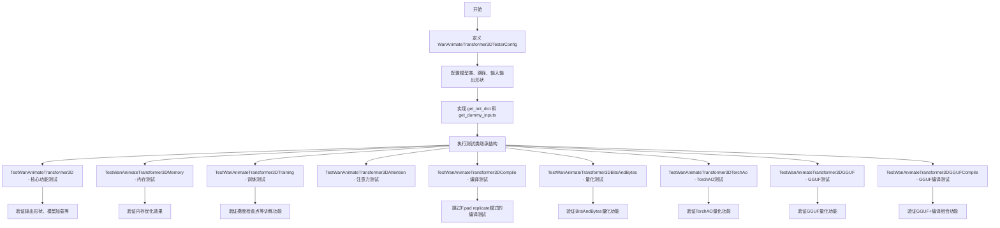

## 类结构

```
BaseModelTesterConfig (抽象基类)
└── WanAnimateTransformer3DTesterConfig
    ├── TestWanAnimateTransformer3D (继承 ModelTesterMixin)
    ├── TestWanAnimateTransformer3DMemory (继承 MemoryTesterMixin)
    ├── TestWanAnimateTransformer3DTraining (继承 TrainingTesterMixin)
    ├── TestWanAnimateTransformer3DAttention (继承 AttentionTesterMixin)
    ├── TestWanAnimateTransformer3DCompile (继承 TorchCompileTesterMixin)
    ├── TestWanAnimateTransformer3DBitsAndBytes (继承 BitsAndBytesTesterMixin)
    ├── TestWanAnimateTransformer3DTorchAo (继承 TorchAoTesterMixin)
    ├── TestWanAnimateTransformer3DGGUF (继承 GGUFTesterMixin)
    └── TestWanAnimateTransformer3DGGUFCompile (继承 GGUFCompileTesterMixin)
```

## 全局变量及字段


### `batch_size`
    
批次大小，定义每次处理的样本数量

类型：`int`
    


### `num_channels`
    
通道数量，表示输入数据的通道维度

类型：`int`
    


### `num_frames`
    
帧数量，用于视频/动画处理的时间维度

类型：`int`
    


### `height`
    
图像高度（像素单位）

类型：`int`
    


### `width`
    
图像宽度（像素单位）

类型：`int`
    


### `text_encoder_embedding_dim`
    
文本编码器嵌入维度，定义文本特征的向量长度

类型：`int`
    


### `sequence_length`
    
序列长度，表示文本序列的token数量

类型：`int`
    


### `clip_seq_len`
    
CLIP模型处理的序列长度

类型：`int`
    


### `clip_dim`
    
CLIP模型的特征维度

类型：`int`
    


### `inference_segment_length`
    
推理时段长度，用于人脸编码的段长度

类型：`int`
    


### `face_height`
    
人脸图像的高度尺寸（需为正方形）

类型：`int`
    


### `face_width`
    
人脸图像的宽度尺寸（需为正方形）

类型：`int`
    


### `channel_sizes`
    
通道尺寸字典，用于配置运动编码器的各层通道数

类型：`dict[str, int]`
    


    

## 全局函数及方法


### `enable_full_determinism`

该函数用于启用 PyTorch 的完全确定性模式，确保在支持 CUDA 的设备上运行时的运算结果可复现，通过设置相关的随机种子和环境变量来实现测试结果的一致性。

参数：无

返回值：`None`，该函数不返回任何值，主要通过副作用（设置全局状态）生效

#### 流程图

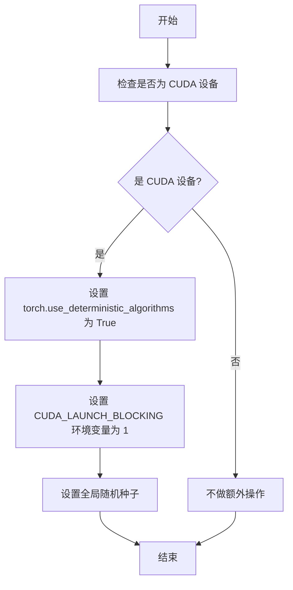

*注：实际流程图基于对该函数功能的推断，因函数定义在 `...testing_utils` 模块中，未直接出现在当前代码文件里。*

#### 带注释源码

```
# 导入语句（来自当前代码文件第17行）
from ...testing_utils import enable_full_determinism, torch_device

# 函数调用（来自当前代码文件第30行）
# 该调用启用完全确定性模式，确保测试结果可复现
# 通过设置 PyTorch 的确定性算法和 CUDA 相关环境变量实现
enable_full_determinism()

# 注：enable_full_determinism 函数的实际定义位于 testing_utils 模块中
# 当前代码文件仅导入并调用该函数，其典型实现逻辑如下（基于功能推断）:
#
# def enable_full_determinism(seed: int = 0):
#     """启用完全确定性模式以确保测试可复现"""
#     import os
#     import torch
#     
#     # 1. 设置 PyTorch 确定性算法
#     if torch.cuda.is_available():
#         torch.use_deterministic_algorithms(True)
#     
#     # 2. 设置 CUDA 阻塞模式（便于调试非确定性操作）
#     os.environ["CUDA_LAUNCH_BLOCKING"] = "1"
#     
#     # 3. 设置随机种子
#     torch.manual_seed(seed)
#     if torch.cuda.is_available():
#         torch.cuda.manual_seed_all(seed)
```

#### 附加说明

- **模块来源**：`...testing_utils`（相对导入路径，未在当前代码文件中定义）
- **调用场景**：在测试模块顶层调用，确保后续所有测试用例在确定性环境下运行
- **潜在优化**：当前实现假设使用固定种子 (0)，可考虑支持自定义种子参数以增强灵活性


### `randn_tensor`

生成符合标准正态分布（均值=0，方差=1）的随机张量，用于模型测试中的虚拟输入数据。

参数：

- `shape`：`tuple[int, ...]`，张量的形状，例如 `(batch_size, channels, height, width)`
- `generator`：`torch.Generator`，可选，用于控制随机数生成的可复现性
- `device`：`torch.device` 或 `str`，指定张量放置的设备（如 `"cuda"` 或 `"cpu"`）
- `dtype`：`torch.dtype`，可选，指定张量的数据类型（如 `torch.float16`）

返回值：`torch.Tensor`，符合标准正态分布的随机张量

#### 流程图

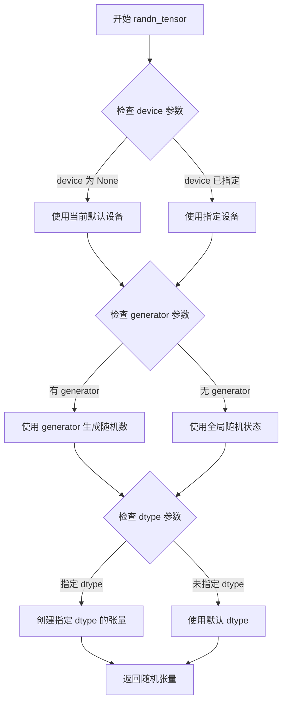

#### 带注释源码

```python
# 从 diffusers.utils.torch_utils 导入
# 以下是推断的函数实现逻辑

def randn_tensor(
    shape: tuple[int, ...],  # 张量形状，如 (batch_size, channels, height, width)
    generator: Optional[torch.Generator] = None,  # 可选的随机生成器，确保可复现性
    device: Optional[Union[torch.device, str]] = None,  # 目标设备 (cpu/cuda)
    dtype: Optional[torch.dtype] = None,  # 可选的数据类型，如 float16, bfloat16
) -> torch.Tensor:
    """生成符合标准正态分布的随机张量。
    
    参数:
        shape: 定义输出张量维度的元组
        generator: torch.Generator 对象，用于可复现的随机数生成
        device: 目标设备字符串或 torch.device 对象
        dtype: 期望的 tensor 数据类型
    
    返回:
        torch.Tensor: 形状为 shape 的随机张量，服从标准正态分布
    """
    # 如果未指定设备，使用当前默认设备
    if device is None:
        device = torch.device("cpu") if not torch.cuda.is_available() else torch.device("cuda")
    
    # 根据是否有生成器选择随机数生成方式
    if generator is not None:
        # 使用指定的生成器
        tensor = torch.randn(shape, generator=generator, device=device, dtype=dtype)
    else:
        # 使用全局随机状态
        tensor = torch.randn(shape, device=device, dtype=dtype)
    
    return tensor
```


### `WanAnimateTransformer3DTesterConfig.model_class`

这是一个属性方法，用于返回 Wan Animate Transformer 3D 模型的具体类类型。该属性在测试配置类中被多个测试类继承使用，为测试框架提供要测试的模型类。

参数： 无

返回值：`type[WanAnimateTransformer3DModel]`，返回 WanAnimateTransformer3DModel 类本身，供测试框架实例化模型进行测试。

#### 流程图

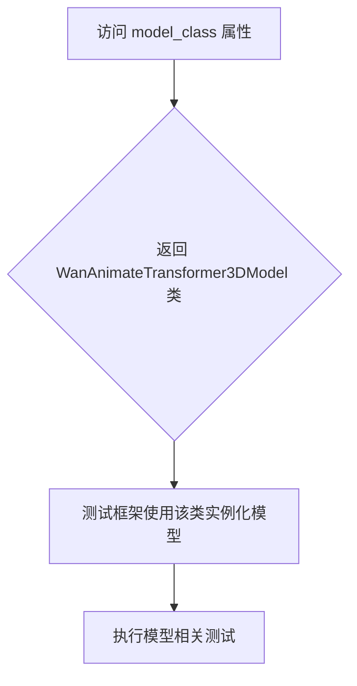

#### 带注释源码

```python
@property
def model_class(self):
    """
    返回要测试的模型类。
    
    该属性被测试类继承使用，测试框架通过此属性获取
    WanAnimateTransformer3DModel 类进行实例化和测试。
    
    Returns:
        type: WanAnimateTransformer3DModel 类类型
    """
    return WanAnimateTransformer3DModel
```


### `WanAnimateTransformer3DTesterConfig.pretrained_model_name_or_path`

这是一个属性方法（property），用于返回 Wan Animate Transformer 3D 测试配置的预训练模型名称或路径。该属性为测试框架提供模型标识符，使得测试能够从 Hugging Face Hub 加载指定的轻量级测试模型。

参数：
- （无显式参数，self 为隐含参数）

返回值：`str`，返回预训练模型的 Hugging Face Hub 标识符路径，用于模型加载。

#### 流程图

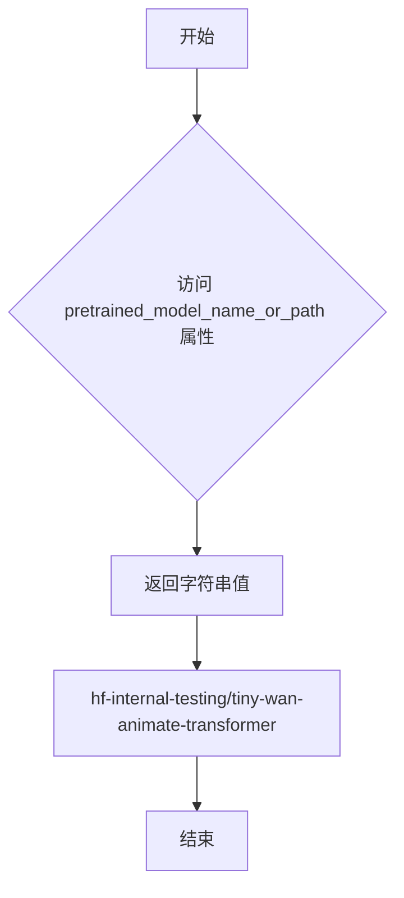

#### 带注释源码

```python
@property
def pretrained_model_name_or_path(self) -> str:
    """
    返回用于测试的预训练模型名称或路径。
    
    该属性提供了一个轻量级的测试模型标识符，
    指向 Hugging Face Hub 上的内部测试仓库。
    该模型用于单元测试和集成测试场景。
    
    Returns:
        str: 预训练模型的标识符，格式为 "hf-internal-testing/tiny-wan-animate-transformer"
    """
    return "hf-internal-testing/tiny-wan-animate-transformer"
```


### `WanAnimateTransformer3DTesterConfig.output_shape`

该属性方法定义了Wan Animate Transformer 3D模型的输出形状，返回一个包含4个维度的元组，表示输出张量的通道数、帧数、高度和宽度。

参数：

- `self`：`WanAnimateTransformer3DTesterConfig`，当前配置类的实例，用于访问类属性

返回值：`tuple[int, ...]`，模型输出的形状元组，包含通道数(4)、帧数(21)、高度(16)和宽度(16)

#### 流程图

```mermaid
flowchart TD
    A[开始访问 output_shape 属性] --> B{检查缓存}
    B -->|否| C[执行 @property 装饰器包装的方法]
    B -->|是| D[返回缓存的值]
    C --> E[执行方法体: return (4, 21, 16, 16)]
    E --> F[返回元组类型: tuple[int, ...]]
    D --> F
    F --> G[结束]
    
    style A fill:#e1f5fe
    style F fill:#e8f5e8
    style G fill:#fff3e0
```

#### 带注释源码

```python
@property
def output_shape(self) -> tuple[int, ...]:
    # Output has fewer channels than input (4 vs 12)
    # 注释说明输出通道数(4)少于输入通道数(12)
    # 输入形状为 (12, 21, 16, 16)，输出形状为 (4, 21, 16, 16)
    # 这是因为模型会对输入进行通道压缩处理
    return (4, 21, 16, 16)
```


### `WanAnimateTransformer3DTesterConfig.input_shape`

定义Wan Animate Transformer 3D模型的输入形状元组，指定输入张量的通道数、帧数、高度和宽度。

参数：

- 无（这是一个Python `@property` 装饰器定义的属性方法，不接受任何参数）

返回值：`tuple[int, ...]`，返回输入形状元组 `(12, 21, 16, 16)`，分别表示通道数（12）、时间帧数（21）、高度（16）和宽度（16）

#### 流程图

```mermaid
flowchart TD
    A[访问 input_shape 属性] --> B{执行 getter 方法}
    B --> C[返回 tuple[int, ...]]
    C --> D[(12, 21, 16, 16)]
    
    style A fill:#f9f,stroke:#333
    style C fill:#9f9,stroke:#333
    style D fill:#ff9,stroke:#333
```

#### 带注释源码

```python
@property
def input_shape(self) -> tuple[int, ...]:
    """定义 Wan Animate Transformer 3D 模型的输入形状。
    
    输入形状配置说明：
    - 12: 输入通道数 (in_channels)，由 2 * latent_channels + 4 计算得出
          其中 latent_channels=4，所以 2*4+4=12
    - 21: 时间帧数 (num_frames + 1)，用于处理视频/动画序列
    - 16: 输入高度
    - 16: 输入宽度
    
    该属性对应模型的 main_input_name = "hidden_states" 的输入形状。
    与 output_shape = (4, 21, 16, 16) 相比，输入通道数更多（12 vs 4），
    这是因为模型会将输入编码为潜在空间表示。
    
    Returns:
        tuple[int, ...]: 输入形状元组，格式为 (channels, frames, height, width)
    """
    return (12, 21, 16, 16)
```


### `WanAnimateTransformer3DTesterConfig.main_input_name`

该属性定义了 Wan Animate Transformer 3D 模型的主输入名称，用于标识模型的主要输入张量。在模型测试和推理过程中，此名称用于定位和传递关键的隐藏状态张量。

参数：无参数（为 property 属性）

返回值：`str`，返回主输入的名称 "hidden_states"

#### 流程图

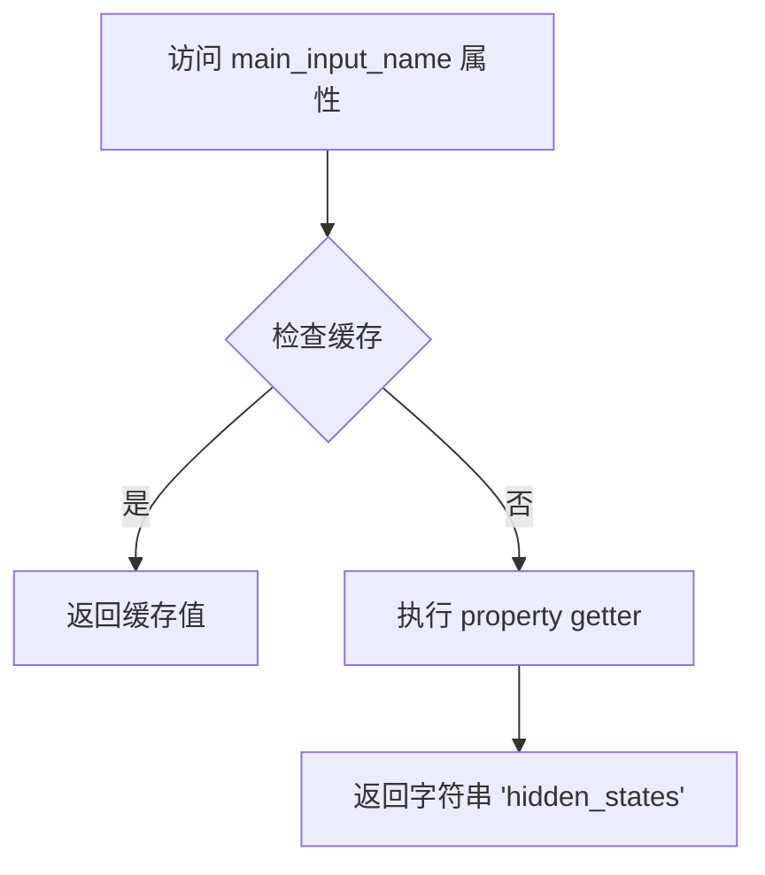

#### 带注释源码

```python
@property
def main_input_name(self) -> str:
    """返回主输入名称。
    
    该属性定义了 WanAnimateTransformer3DModel 的主输入张量的名称。
    在模型的前向传播过程中，hidden_states 是最主要的输入特征，
    包含了经过编码的潜在空间表示。
    
    Returns:
        str: 主输入的名称，固定为 'hidden_states'
    """
    return "hidden_states"
```


### `WanAnimateTransformer3DTesterConfig.generator`

该属性用于为测试用例提供一个可复现的随机数生成器，确保在测试过程中随机生成的张量数据保持一致性，便于调试和结果复现。

参数：无（仅包含隐式参数 `self`）

返回值：`torch.Generator`，返回一个CPU上的PyTorch随机数生成器，种子固定为0，用于生成确定性的随机测试数据

#### 流程图

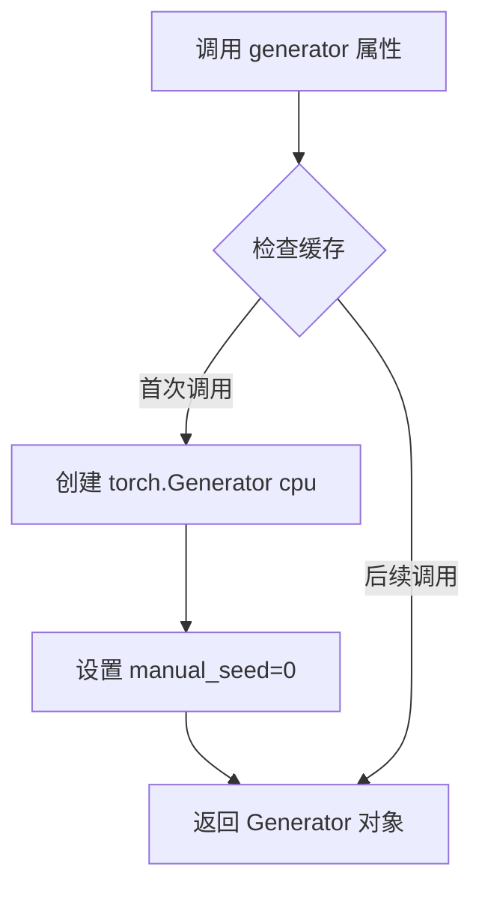

#### 带注释源码

```python
@property
def generator(self):
    """
    属性：generator
    
    描述：
        返回一个CPU上的PyTorch随机数生成器（torch.Generator），
        种子固定为0。该生成器用于确保测试中所有随机张量生成操作
        能够产生确定性的结果，便于测试的复现和调试。
    
    参数：
        无（仅包含隐式参数 self）
    
    返回值：
        torch.Generator：配置了固定种子的随机数生成器对象
    
    使用场景：
        - 在 get_dummy_inputs 方法中作为 generator 参数传递给 randn_tensor
        - 确保多次调用 get_dummy_inputs 时生成相同的随机张量
        - 用于测试结果的可复现性
    """
    return torch.Generator("cpu").manual_seed(0)
```


### `WanAnimateTransformer3DTesterConfig.get_init_dict`

该方法用于获取Wan Animate Transformer 3D模型的初始化配置字典。它定义了模型的各种参数，如注意力头数、通道数、层数等，并使用自定义通道大小以确保运动编码器在测试模型中不会占据绝大部分参数。

参数：

- `self`：隐式参数，表示类实例本身

返回值：`dict[str, int | list[int] | tuple | str | bool | float | dict]`，返回一个包含模型初始化参数的字典，包括patch_size、注意力头数、通道数、维度配置等。

#### 流程图

```mermaid
flowchart TD
    A[开始 get_init_dict] --> B[创建 channel_sizes 字典]
    B --> C[设置自定义通道大小: {"4": 16, "8": 16, "16": 16}]
    C --> D[构建配置字典]
    D --> E[包含基础模型参数: patch_size, num_attention_heads, attention_head_dim等]
    E --> F[添加Wan Animate特有参数: motion_encoder_channel_sizes, motion_encoder_size等]
    F --> G[返回完整配置字典]
```

#### 带注释源码

```python
def get_init_dict(self) -> dict[str, int | list[int] | tuple | str | bool | float | dict]:
    # 使用自定义通道大小，因为默认的Wan Animate通道大小会导致运动编码器
    # 在测试模型中占据绝大部分参数
    channel_sizes = {"4": 16, "8": 16, "16": 16}

    return {
        # 基础模型配置
        "patch_size": (1, 2, 2),              # 补丁大小，用于3D补丁嵌入
        "num_attention_heads": 2,             # 注意力头数量
        "attention_head_dim": 12,             # 每个注意力头的维度
        "in_channels": 12,                    # 输入通道数 (2 * C + 4 = 2 * 4 + 4 = 12)
        "latent_channels": 4,                 # 潜在空间通道数
        "out_channels": 4,                    # 输出通道数
        "text_dim": 16,                       # 文本编码器维度
        "freq_dim": 256,                      # 频率维度
        "ffn_dim": 32,                        # 前馈网络维度
        "num_layers": 2,                      # Transformer层数
        "cross_attn_norm": True,              # 是否对交叉注意力进行归一化
        "qk_norm": "rms_norm_across_heads",   # Query-Key归一化方式
        "image_dim": 16,                      # 图像维度
        "rope_max_seq_len": 32,               # 旋转位置编码最大序列长度
        
        # Wan Animate特有配置 (从motion_encoder_channel_sizes开始)
        "motion_encoder_channel_sizes": channel_sizes,  # 运动编码器通道大小
        "motion_encoder_size": 16,            # 运动编码器大小，确保有2个运动编码器resblocks
        "motion_style_dim": 8,                # 运动风格维度
        "motion_dim": 4,                      # 运动维度
        "motion_encoder_dim": 16,             # 运动编码器维度
        "face_encoder_hidden_dim": 16,        # 面部编码器隐藏层维度
        "face_encoder_num_heads": 2,           # 面部编码器注意力头数
        "inject_face_latents_blocks": 2,      # 注入面部潜变量的块数量
    }
```


### `WanAnimateTransformer3DTesterConfig.get_dummy_inputs`

该方法用于生成 Wan Animate Transformer 3D 模型测试所需的虚拟输入数据，构造包含隐藏状态、时间步、编码器隐藏状态、姿态隐藏状态和人脸像素值等多种张量的字典，以满足模型前向传播的输入需求。

参数：无（仅隐含参数 `self`）

返回值：`dict[str, torch.Tensor]`，返回一个字典，包含以下键值对：
- `hidden_states`：随机生成的隐藏状态张量，形状为 (batch_size, 2 * num_channels + 4, num_frames + 1, height, width)
- `timestep`：随机生成的时间步张量，形状为 (batch_size,)
- `encoder_hidden_states`：文本编码器的隐藏状态，形状为 (batch_size, sequence_length, text_encoder_embedding_dim)
- `encoder_hidden_states_image`：图像编码器的隐藏状态，形状为 (batch_size, clip_seq_len, clip_dim)
- `pose_hidden_states`：姿态隐藏状态，形状为 (batch_size, num_channels, num_frames, height, width)
- `face_pixel_values`：人脸像素值，形状为 (batch_size, 3, inference_segment_length, face_height, face_width)

#### 流程图

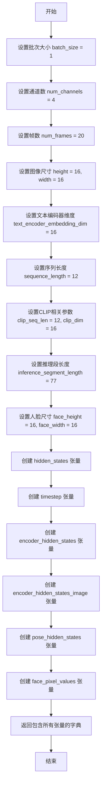

#### 带注释源码

```python
def get_dummy_inputs(self) -> dict[str, torch.Tensor]:
    """生成用于测试 Wan Animate Transformer 3D 模型的虚拟输入数据。
    
    Returns:
        dict[str, torch.Tensor]: 包含模型所需各种输入张量的字典
    """
    # 批次大小
    batch_size = 1
    # 通道数
    num_channels = 4
    # 帧数设置为20（为了使形状匹配，21需要能被num_frames+1整除）
    num_frames = 20  # To make the shapes work out; for complicated reasons we want 21 to divide num_frames + 1
    # 图像高度和宽度
    height = 16
    width = 16
    # 文本编码器嵌入维度
    text_encoder_embedding_dim = 16
    # 序列长度
    sequence_length = 12

    # CLIP 相关参数
    clip_seq_len = 12
    clip_dim = 16

    # 推理段长度（对应完整 Wan2.2-Animate-14B 模型）
    inference_segment_length = 77  # The inference segment length in the full Wan2.2-Animate-14B model
    # 人脸图像尺寸（应与 motion_encoder_size 匹配且为正方形）
    face_height = 16  # Should be square and match `motion_encoder_size`
    face_width = 16

    # 构建返回的输入字典
    return {
        # 隐藏状态：形状 (batch_size, 2*num_channels+4, num_frames+1, height, width)
        # 对应 (1, 12, 21, 16, 16)
        "hidden_states": randn_tensor(
            (batch_size, 2 * num_channels + 4, num_frames + 1, height, width),
            generator=self.generator,
            device=torch_device,
        ),
        # 时间步：形状 (batch_size,)
        "timestep": torch.randint(0, 1000, size=(batch_size,), generator=self.generator).to(torch_device),
        # 文本编码器隐藏状态：形状 (batch_size, sequence_length, text_encoder_embedding_dim)
        "encoder_hidden_states": randn_tensor(
            (batch_size, sequence_length, text_encoder_embedding_dim),
            generator=self.generator,
            device=torch_device,
        ),
        # 图像编码器隐藏状态：形状 (batch_size, clip_seq_len, clip_dim)
        "encoder_hidden_states_image": randn_tensor(
            (batch_size, clip_seq_len, clip_dim),
            generator=self.generator,
            device=torch_device,
        ),
        # 姿态隐藏状态：形状 (batch_size, num_channels, num_frames, height, width)
        "pose_hidden_states": randn_tensor(
            (batch_size, num_channels, num_frames, height, width),
            generator=self.generator,
            device=torch_device,
        ),
        # 人脸像素值：形状 (batch_size, 3, inference_segment_length, face_height, face_width)
        "face_pixel_values": randn_tensor(
            (batch_size, 3, inference_segment_length, face_height, face_width),
            generator=self.generator,
            device=torch_device,
        ),
    }
```


### `TestWanAnimateTransformer3D.test_output`

该方法是一个测试用例，用于验证 Wan Animate Transformer 3D 模型的输出形状是否符合预期。由于 Wan Animate Transformer 的输出通道数（4）少于输入通道数（12），因此需要覆盖父类的 test_output 方法以适配这一特殊情况。

参数：

- 无显式参数（`self` 为隐式参数）

返回值：`None`，该方法为 pytest 测试用例，通过调用父类方法进行验证，不返回具体值。

#### 流程图

```mermaid
flowchart TD
    A[开始 test_output] --> B[定义 expected_output_shape]
    B --> C{调用父类 test_output}
    C --> D[传入 expected_output_shape 参数]
    D --> E[执行父类测试逻辑]
    E --> F[验证输出形状为 (1, 4, 21, 16, 16)]
    F --> G[测试结束]
```

#### 带注释源码

```python
def test_output(self):
    # 由于 Wan Animate Transformer 的输出通道数（4）少于输入通道数（12），
    # 需要覆盖父类的 test_output 方法以指定正确的输出形状
    # 预期输出形状: (batch=1, channels=4, frames=21, height=16, width=16)
    expected_output_shape = (1, 4, 21, 16, 16)
    
    # 调用父类 ModelTesterMixin 的 test_output 方法，
    # 传入自定义的 expected_output_shape 参数进行形状验证
    super().test_output(expected_output_shape=expected_output_shape)
```


### `TestWanAnimateTransformer3D.test_from_save_pretrained_dtype_inference`

这是一个针对 Wan Animate Transformer 3D 模型的数据类型推理测试方法，用于验证模型在加载预训练权重时是否能正确保留 float16 或 bfloat16 数据类型。该方法目前被跳过，原因是 fp16/bf16 类型的容差要求过高（~1e-2），难以通过有意义的测试，且数据类型保留已由其他测试覆盖。

参数：

- `tmp_path`：`pytest.TempPathFactory`，pytest 提供的临时路径 fixture，用于创建临时目录以保存和加载模型
- `dtype`：`torch.dtype`，指定测试的数据类型，参数化为 `torch.float16` 或 `torch.bfloat16`

返回值：`None`，无返回值（该测试方法使用 `pytest.skip` 跳过执行）

#### 流程图

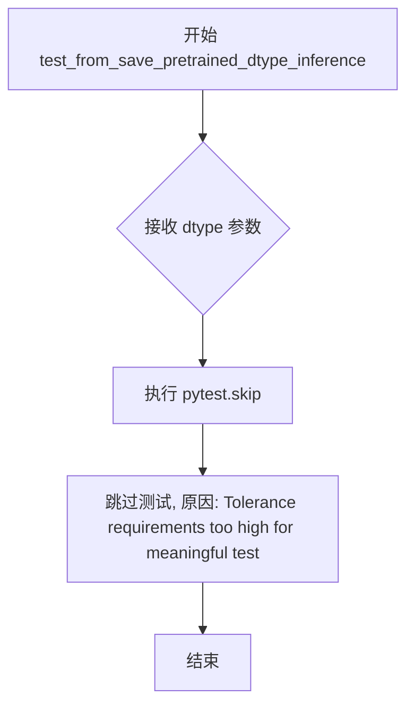

#### 带注释源码

```python
@pytest.mark.parametrize("dtype", [torch.float16, torch.bfloat16], ids=["fp16", "bf16"])
def test_from_save_pretrained_dtype_inference(self, tmp_path, dtype):
    # Skip: fp16/bf16 require very high atol (~1e-2) to pass, providing little signal.
    # Dtype preservation is already tested by test_from_save_pretrained_dtype and test_keep_in_fp32_modules.
    pytest.skip("Tolerance requirements too high for meaningful test")
```

#### 技术债务与优化空间

1. **测试占位符**：该方法目前是一个空的测试占位符，仅包含跳过逻辑，未来可能需要实现完整的 dtype 推理测试逻辑
2. **容差问题**：注释提到 fp16/bf16 需要约 1e-2 的高容差才能通过，这意味着测试的敏感度较低，可能无法有效检测数据类型相关的问题
3. **依赖覆盖**：虽然注释指出数据类型保留已由其他测试覆盖，但该测试的存在可能表明原始设计意图是独立验证此功能


### `TestWanAnimateTransformer3DTraining.test_gradient_checkpointing_is_applied`

该方法用于验证梯度检查点（Gradient Checkpointing）功能是否在 WanAnimateTransformer3DModel 模型训练中被正确启用，通过对比预期模型集合与实际启用的梯度检查点模型来确认配置生效。

参数：

- `self`：`TestWanAnimateTransformer3DTraining` 类型，测试类实例本身，包含测试配置和模型信息

返回值：`None`，无返回值（测试方法，通过 pytest 框架执行断言）

#### 流程图

```mermaid
flowchart TD
    A[开始执行 test_gradient_checkpointing_is_applied] --> B[创建 expected_set 集合<br/>包含 'WanAnimateTransformer3DModel']
    B --> C[调用父类方法 super\(\)<br/>test_gradient_checkpointing_is_applied]
    C --> D[父类方法执行验证逻辑<br/>检查梯度检查点是否启用]
    D --> E{验证结果}
    E -->|通过| F[测试通过]
    E -->|失败| G[抛出断言错误]
```

#### 带注释源码

```
def test_gradient_checkpointing_is_applied(self):
    """测试梯度检查点是否在模型训练中被正确应用。
    
    该测试方法验证 WanAnimateTransformer3DModel 是否正确配置了
    梯度检查点功能，用于在训练过程中节省显存开销。
    """
    # 定义期望启用梯度检查点的模型类集合
    # WanAnimateTransformer3DModel 是需要验证的主模型类
    expected_set = {"WanAnimateTransformer3DModel"}
    
    # 调用父类 TrainingTesterMixin 的测试方法
    # 父类方法会执行实际的梯度检查点验证逻辑
    # 传入 expected_set 作为期望的模型类集合
    super().test_gradient_checkpointing_is_applied(expected_set=expected_set)
```


### `TestWanAnimateTransformer3DCompile.test_torch_compile_recompilation_and_graph_break`

这是一个测试方法，用于验证 WanAnimateTransformer3DModel 在 torch.compile 下的重编译和图中断行为。由于 WanAnimateFaceEncoder 中使用了 F.pad 的 replicate 模式，会触发 importlib.import_module 内部调用，dynamo 不支持追踪，因此该测试被跳过。

参数：

- `self`：`TestWanAnimateTransformer3DCompile`，测试类实例本身，无需额外参数

返回值：`None`，该方法通过 pytest.skip 跳过测试，不返回任何值

#### 流程图

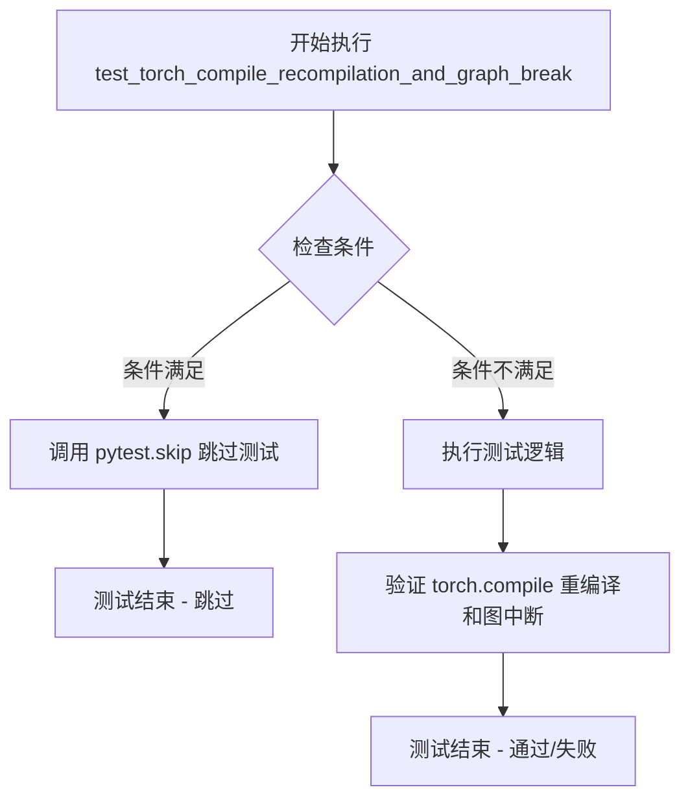

#### 带注释源码

```python
def test_torch_compile_recompilation_and_graph_break(self):
    # Skip: F.pad with mode="replicate" in WanAnimateFaceEncoder triggers importlib.import_module
    # internally, which dynamo doesn't support tracing through.
    # 跳过原因说明：
    # 1. WanAnimateFaceEncoder 中使用了 F.pad 的 mode="replicate" 参数
    # 2. 该操作在内部会触发 importlib.import_module 调用
    # 3. torch.compile 的 dynamo 引擎不支持追踪这个内部导入过程
    # 4. 因此该测试会被跳过，避免运行时错误
    pytest.skip("F.pad with replicate mode triggers unsupported import in torch.compile")
```


### `TestWanAnimateTransformer3DBitsAndBytes.torch_dtype`

该属性用于指定 BitsAndBytes 量化测试的 torch 数据类型，返回 `torch.float16`，确保测试使用半精度浮点数进行。

参数：无参数（这是一个 `@property` 装饰器定义的属性）

返回值：`torch.dtype`，返回用于测试的 torch 数据类型（半精度浮点数 float16）

#### 流程图

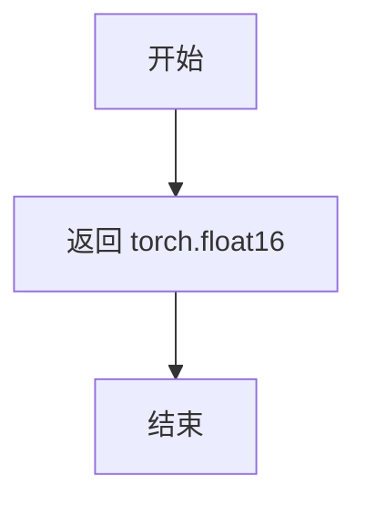

#### 带注释源码

```python
class TestWanAnimateTransformer3DBitsAndBytes(WanAnimateTransformer3DTesterConfig, BitsAndBytesTesterMixin):
    """BitsAndBytes quantization tests for Wan Animate Transformer 3D."""

    @property
    def torch_dtype(self):
        # 返回用于测试的 torch 数据类型
        # 这里使用 float16（半精度浮点数）进行 BitsAndBytes 量化测试
        return torch.float16
```


### `TestWanAnimateTransformer3DBitsAndBytes.get_dummy_inputs`

该方法是 `TestWanAnimateTransformer3DBitsAndBytes` 测试类的成员函数，用于重写基类的 `get_dummy_inputs` 方法。它生成与 Wan Animate Transformer 3D 模型的小尺寸版本相匹配的虚拟输入数据，专门用于 BitsAndBytes 量化测试场景。返回的字典包含模型前向传播所需的所有输入张量，包括隐藏状态、编码器隐藏状态、姿态隐藏状态、人脸像素值和时间步，所有张量均使用 float16 数据类型以适配量化测试需求。

参数：无参数（仅使用继承的 `self.generator`、`self.torch_dtype` 等属性）

返回值：`dict[str, torch.Tensor]`，返回一个字典，包含以下键值对：
- `hidden_states`：`torch.Tensor`，形状为 (1, 36, 21, 64, 64)，模型的主要输入张量
- `encoder_hidden_states`：`torch.Tensor`，形状为 (1, 512, 4096)，文本编码器的输出隐藏状态
- `encoder_hidden_states_image`：`torch.Tensor`，形状为 (1, 257, 1280)，图像编码器的输出隐藏状态
- `pose_hidden_states`：`torch.Tensor`，形状为 (1, 16, 20, 64, 64)，姿态估计的隐藏状态
- `face_pixel_values`：`torch.Tensor`，形状为 (1, 3, 77, 512, 512)，人脸图像像素值
- `timestep`：`torch.Tensor`，形状为 (1,)，扩散模型的时间步

#### 流程图

```mermaid
flowchart TD
    A[开始 get_dummy_inputs] --> B{创建 hidden_states}
    B --> C[randn_tensor 形状 (1, 36, 21, 64, 64)]
    C --> D{创建 encoder_hidden_states}
    D --> E[randn_tensor 形状 (1, 512, 4096)]
    E --> F{创建 encoder_hidden_states_image}
    F --> G[randn_tensor 形状 (1, 257, 1280)]
    G --> H{创建 pose_hidden_states}
    H --> I[randn_tensor 形状 (1, 16, 20, 64, 64)]
    I --> J{创建 face_pixel_values}
    J --> K[randn_tensor 形状 (1, 3, 77, 512, 512)]
    K --> L{创建 timestep}
    L --> M[torch.tensor([1.0]) 转换为 float16]
    M --> N[返回包含6个张量的字典]
```

#### 带注释源码

```python
def get_dummy_inputs(self):
    """Override to provide inputs matching the tiny Wan Animate model dimensions."""
    # 返回一个包含所有模型输入的字典，用于 BitsAndBytes 量化测试
    return {
        # hidden_states: 模型的主要输入，对应 in_channels=36 (2*16+4)
        # 形状: (batch=1, channels=36, frames=21, height=64, width=64)
        "hidden_states": randn_tensor(
            (1, 36, 21, 64, 64), generator=self.generator, device=torch_device, dtype=self.torch_dtype
        ),
        # encoder_hidden_states: 文本编码器的输出
        # 形状: (batch=1, sequence_length=512, text_dim=4096)
        "encoder_hidden_states": randn_tensor(
            (1, 512, 4096), generator=self.generator, device=torch_device, dtype=self.torch_dtype
        ),
        # encoder_hidden_states_image: 图像/CLIP 编码器的输出
        # 形状: (batch=1, clip_seq_len=257, image_dim=1280)
        "encoder_hidden_states_image": randn_tensor(
            (1, 257, 1280), generator=self.generator, device=torch_device, dtype=self.torch_dtype
        ),
        # pose_hidden_states: 姿态/运动编码器的输出
        # 形状: (batch=1, channels=16, frames=20, height=64, width=64)
        "pose_hidden_states": randn_tensor(
            (1, 16, 20, 64, 64), generator=self.generator, device=torch_device, dtype=self.torch_dtype
        ),
        # face_pixel_values: 人脸编码器的输入图像
        # 形状: (batch=1, channels=3, seq_len=77, height=512, width=512)
        "face_pixel_values": randn_tensor(
            (1, 3, 77, 512, 512), generator=self.generator, device=torch_device, dtype=self.torch_dtype
        ),
        # timestep: 扩散模型的时间步
        # 形状: (batch=1,)，值为 1.0
        "timestep": torch.tensor([1.0]).to(torch_device, self.torch_dtype),
    }
```


### `TestWanAnimateTransformer3DTorchAo.torch_dtype`

这是一个属性方法，用于返回 TorchAO 量化测试场景中所使用的 Torch 数据类型（bfloat16）。该属性重写了父类配置，指定了 `torch.bfloat16` 作为测试时模型运行的数据类型，以适配 TorchAO 量化测试的精度要求。

参数：
- 无（这是一个 `@property` 装饰的属性方法，只有隐含的 `self` 参数）

返回值：`torch.dtype`，返回 `torch.bfloat16`，指定模型测试使用 bfloat16 数据类型。

#### 流程图

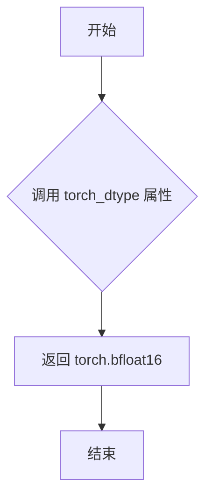

#### 带注释源码

```python
@property
def torch_dtype(self):
    """返回用于 TorchAO 量化测试的 Torch 数据类型。
    
    该属性重写了基类配置，将测试数据类型从默认的 float16 
    改为 bfloat16，以适配 TorchAO 量化测试场景的特殊需求。
    
    Returns:
        torch.dtype: torch.bfloat16 数据类型，用于测试时的模型精度控制。
    """
    return torch.bfloat16
```


### `TestWanAnimateTransformer3DTorchAo.get_dummy_inputs`

该方法为 TorchAO 量化测试生成符合 Wan Animate Transformer 3D 模型维度的虚拟输入数据，用于模型推理测试。

参数：无（该方法不接收任何参数，但使用实例属性 `self.generator`、`torch_device`、`self.torch_dtype`）

返回值：`dict[str, torch.Tensor]`，返回包含六个键的字典，分别对应模型的 `hidden_states`、`encoder_hidden_states`、`encoder_hidden_states_image`、`pose_hidden_states`、`face_pixel_values` 和 `timestep` 输入张量

#### 流程图

```mermaid
flowchart TD
    A[开始] --> B[获取 torch_dtype 属性<br/>返回 torch.bfloat16]
    B --> C[创建 hidden_states 张量<br/>形状 (1, 36, 21, 64, 64)]
    C --> D[创建 encoder_hidden_states 张量<br/>形状 (1, 512, 4096)]
    D --> E[创建 encoder_hidden_states_image 张量<br/>形状 (1, 257, 1280)]
    E --> F[创建 pose_hidden_states 张量<br/>形状 (1, 16, 20, 64, 64)]
    F --> G[创建 face_pixel_values 张量<br/>形状 (1, 3, 77, 512, 512)]
    G --> H[创建 timestep 张量<br/>形状 (1)]
    H --> I[返回包含所有张量的字典]
    I --> J[结束]
```

#### 带注释源码

```python
def get_dummy_inputs(self):
    """Override to provide inputs matching the tiny Wan Animate model dimensions."""
    # 返回一个包含模型所需所有输入张量的字典
    return {
        # hidden_states: 主输入隐藏状态，形状为 (batch_size, in_channels, num_frames+1, height, width)
        # in_channels=36 (2*16+4), num_frames+1=21, height=64, width=64
        "hidden_states": randn_tensor(
            (1, 36, 21, 64, 64), generator=self.generator, device=torch_device, dtype=self.torch_dtype
        ),
        # encoder_hidden_states: 文本编码器的隐藏状态，形状为 (batch_size, sequence_length, text_dim)
        # sequence_length=512, text_dim=4096
        "encoder_hidden_states": randn_tensor(
            (1, 512, 4096), generator=self.generator, device=torch_device, dtype=self.torch_dtype
        ),
        # encoder_hidden_states_image: 图像编码器的隐藏状态，形状为 (batch_size, clip_seq_len, image_dim)
        # clip_seq_len=257, image_dim=1280
        "encoder_hidden_states_image": randn_tensor(
            (1, 257, 1280), generator=self.generator, device=torch_device, dtype=self.torch_dtype
        ),
        # pose_hidden_states: 姿态编码器的隐藏状态，形状为 (batch_size, motion_channels, num_frames, height, width)
        # motion_channels=16, num_frames=20, height=64, width=64
        "pose_hidden_states": randn_tensor(
            (1, 16, 20, 64, 64), generator=self.generator, device=torch_device, dtype=self.torch_dtype
        ),
        # face_pixel_values: 人脸图像像素值，形状为 (batch_size, channels, seq_len, height, width)
        # channels=3 (RGB), seq_len=77, height=512, width=512
        "face_pixel_values": randn_tensor(
            (1, 3, 77, 512, 512), generator=self.generator, device=torch_device, dtype=self.torch_dtype
        ),
        # timestep: 扩散过程的时间步，形状为 (batch_size,)
        "timestep": torch.tensor([1.0]).to(torch_device, self.torch_dtype),
    }
```


### `TestWanAnimateTransformer3DGGUF.gguf_filename`

这是一个属性方法（用 `@property` 装饰），用于返回 Wan2.2-Animate-14B 模型 GGUF 量化版本的模型文件 URL 地址，供 GGUF 量化测试使用。

参数：

- 无（这是一个属性方法，不接受额外参数）

返回值：`str`，返回 GGUF 模型文件的 HuggingFace URL 字符串。

#### 流程图

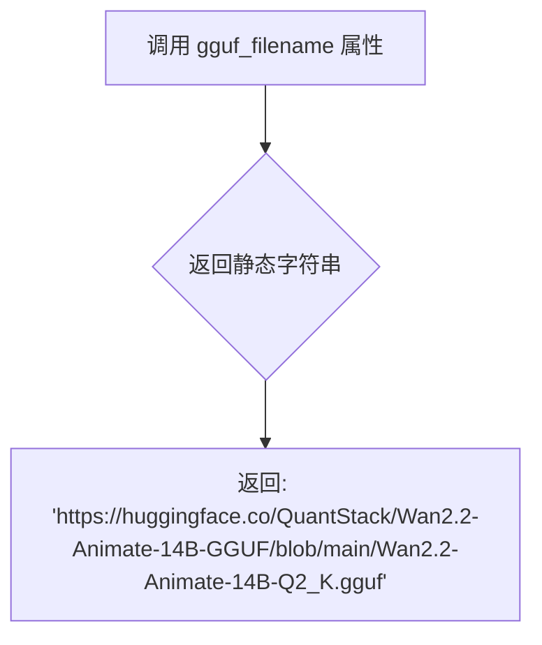

#### 带注释源码

```python
@property
def gguf_filename(self):
    """返回 Wan2.2-Animate-14B 模型 GGUF 量化版本的模型文件 URL 地址。
    
    该 URL 指向 HuggingFace 上的 QuantStack/Wan2.2-Animate-14B-GGUF 仓库中的
    Wan2.2-Animate-14B-Q2_K.gguf 文件，用于 GGUF 量化测试场景。
    
    Returns:
        str: GGUF 模型文件的完整 URL 字符串
    """
    return "https://huggingface.co/QuantStack/Wan2.2-Animate-14B-GGUF/blob/main/Wan2.2-Animate-14B-Q2_K.gguf"
```


### `TestWanAnimateTransformer3DGGUF.torch_dtype`

该属性用于返回 GGUF 量化测试的默认数据类型，确保测试过程中使用 `torch.bfloat16` 进行张量运算，以匹配 GGUF 量化模型的推理精度需求。

参数： 无

返回值：`torch.dtype`，返回 PyTorch 的 bfloat16 数据类型，用于指定测试中张量的默认精度。

#### 流程图

```mermaid
flowchart TD
    A[访问 torch_dtype 属性] --> B{返回数据类型}
    B --> C[返回 torch.bfloat16]
    C --> D[测试框架使用此 dtype 创建随机张量]
```

#### 带注释源码

```python
@property
def torch_dtype(self):
    """返回 GGUF 量化测试的默认数据类型。
    
    使用 bfloat16 是因为 GGUF 量化模型通常以 bfloat16 精度加载和推理，
    这能确保测试数据与实际模型推理的精度保持一致。
    """
    return torch.bfloat16
```


### `TestWanAnimateTransformer3DGGUF.get_dummy_inputs`

该方法用于生成符合真实Wan Animate模型维度（in_channels=36, text_dim=4096, image_dim=1280）的虚拟输入数据，以支持GGUF量化测试场景。

参数：**无**（该方法不接收任何显式参数，依赖于类的内部属性）

返回值：`dict[str, torch.Tensor]`，返回一个字典，包含模型推理所需的所有虚拟输入张量

#### 流程图

```mermaid
flowchart TD
    A[开始] --> B[获取torch_dtype属性<br/>torch.bfloat16]
    B --> C[生成hidden_states张量<br/>shape: (1, 36, 21, 64, 64)]
    C --> D[生成encoder_hidden_states张量<br/>shape: (1, 512, 4096)]
    D --> E[生成encoder_hidden_states_image张量<br/>shape: (1, 257, 1280)]
    E --> F[生成pose_hidden_states张量<br/>shape: (1, 16, 20, 64, 64)]
    F --> G[生成face_pixel_values张量<br/>shape: (1, 3, 77, 512, 512)]
    G --> H[生成timestep张量<br/>shape: (1)]
    H --> I[返回包含6个键的字典]
```

#### 带注释源码

```python
def get_dummy_inputs(self):
    """Override to provide inputs matching the real Wan Animate model dimensions.

    Wan 2.2 Animate: in_channels=36 (2*16+4), text_dim=4096, image_dim=1280
    """
    # 返回一个包含所有模型输入的字典，用于测试
    return {
        # 主输入张量：隐藏状态，维度匹配 in_channels=36 (2*16+4)
        "hidden_states": randn_tensor(
            (1, 36, 21, 64, 64), generator=self.generator, device=torch_device, dtype=self.torch_dtype
        ),
        # 文本编码器的隐藏状态，维度匹配 text_dim=4096
        "encoder_hidden_states": randn_tensor(
            (1, 512, 4096), generator=self.generator, device=torch_device, dtype=self.torch_dtype
        ),
        # 图像编码器的隐藏状态，维度匹配 image_dim=1280
        "encoder_hidden_states_image": randn_tensor(
            (1, 257, 1280), generator=self.generator, device=torch_device, dtype=self.torch_dtype
        ),
        # 姿态隐藏状态，用于运动编码器
        "pose_hidden_states": randn_tensor(
            (1, 16, 20, 64, 64), generator=self.generator, device=torch_device, dtype=self.torch_dtype
        ),
        # 人脸像素值，用于面部编码器
        "face_pixel_values": randn_tensor(
            (1, 3, 77, 512, 512), generator=self.generator, device=torch_device, dtype=self.torch_dtype
        ),
        # 时间步，用于扩散过程
        "timestep": torch.tensor([1.0]).to(torch_device, self.torch_dtype),
    }
```


### `TestWanAnimateTransformer3DGGUFCompile.gguf_filename`

该属性返回 Wan2.2-Animate-14B 模型 GGUF 量化版本（Q2_K）的 HuggingFace 模型文件 URL 地址，用于 GGUF 编译测试场景。

参数：

- （无参数，该方法为属性 getter）

返回值：`str`，返回 GGUF 模型的下载链接 URL，指向 `QuantStack/Wan2.2-Animate-14B-GGUF` 仓库中的 `Wan2.2-Animate-14B-Q2_K.gguf` 文件。

#### 流程图

```mermaid
flowchart TD
    A[开始] --> B{读取 gguf_filename 属性}
    B --> C[返回静态字符串 URL]
    C --> D[结束]
    
    style A fill:#f9f,stroke:#333
    style D fill:#9f9,stroke:#333
```

#### 带注释源码

```python
class TestWanAnimateTransformer3DGGUFCompile(WanAnimateTransformer3DTesterConfig, GGUFCompileTesterMixin):
    """GGUF + compile tests for Wan Animate Transformer 3D."""

    @property
    def gguf_filename(self):
        """返回 GGUF 模型文件的 HuggingFace URL 地址
        
        该属性用于指定测试所使用的 GGUF 量化模型文件路径。
        模型为 Wan2.2-Animate-14B 的 Q2_K 量化版本，来自 QuantStack 仓库。
        
        Returns:
            str: 完整的 HuggingFace 模型文件 URL 链接
        """
        return "https://huggingface.co/QuantStack/Wan2.2-Animate-14B-GGUF/blob/main/Wan2.2-Animate-14B-Q2_K.gguf"
```


### `TestWanAnimateTransformer3DGGUFCompile.torch_dtype`

该属性定义了在 GGUF 编译测试中使用的 PyTorch 数据类型（dtype），用于确保模型以 bfloat16 精度运行。

参数：

- 无（这是一个属性，不是方法）

返回值：`torch.dtype`，返回 `torch.bfloat16`，表示使用 bfloat16 精度进行测试

#### 流程图

```mermaid
flowchart TD
    A[读取 torch_dtype 属性] --> B{是否已定义}
    B -->|是| C[返回 torch.bfloat16]
    B -->|否| D[继承父类或默认]
    C --> E[测试框架使用此 dtype 创建输入张量]
```

#### 带注释源码

```python
class TestWanAnimateTransformer3DGGUFCompile(WanAnimateTransformer3DTesterConfig, GGUFCompileTesterMixin):
    """GGUF + compile tests for Wan Animate Transformer 3D."""

    @property
    def gguf_filename(self):
        # 返回 GGUF 模型文件的 URL 地址
        return "https://huggingface.co/QuantStack/Wan2.2-Animate-14B-GGUF/blob/main/Wan2.2-Animate-14B-Q2_K.gguf"

    @property
    def torch_dtype(self):
        """返回用于测试的 torch 数据类型
        
        返回值:
            torch.dtype: 使用 bfloat16 精度进行 GGUF 编译测试
        """
        return torch.bfloat16

    def get_dummy_inputs(self):
        """Override to provide inputs matching the real Wan Animate model dimensions.

        Wan 2.2 Animate: in_channels=36 (2*16+4), text_dim=4096, image_dim=1280
        """
        return {
            "hidden_states": randn_tensor(
                (1, 36, 21, 64, 64), generator=self.generator, device=torch_device, dtype=self.torch_dtype
            ),
            "encoder_hidden_states": randn_tensor(
                (1, 512, 4096), generator=self.generator, device=torch_device, dtype=self.torch_dtype
            ),
            "encoder_hidden_states_image": randn_tensor(
                (1, 257, 1280), generator=self.generator, device=torch_device, dtype=self.torch_dtype
            ),
            "pose_hidden_states": randn_tensor(
                (1, 16, 20, 64, 64), generator=self.generator, device=torch_device, dtype=self.torch_dtype
            ),
            "face_pixel_values": randn_tensor(
                (1, 3, 77, 512, 512), generator=self.generator, device=torch_device, dtype=self.torch_dtype
            ),
            "timestep": torch.tensor([1.0]).to(torch_device, self.torch_dtype),
        }
```


### `TestWanAnimateTransformer3DGGUFCompile.get_dummy_inputs`

该方法用于生成符合真实Wan Animate模型尺寸的虚拟输入数据，以支持GGUF量化与torch.compile组合测试场景。

参数：

- 该方法无显式参数，依赖继承的实例属性：
  - `self.generator`：`torch.Generator`，随机数生成器（继承自`WanAnimateTransformer3DTesterConfig`）
  - `self.torch_dtype`：`torch.dtype`，指定张量数据类型（返回`torch.bfloat16`）
  - `torch_device`：全局变量，设备标识（来自`testing_utils`模块）

返回值：`dict[str, torch.Tensor]`，包含6个键值对，键为字符串类型，值为`torch.Tensor`对象。

#### 流程图

```mermaid
flowchart TD
    A[开始 get_dummy_inputs] --> B[设置 batch_size=1]
    B --> C[定义 hidden_states 形状 (1, 36, 21, 64, 64)]
    C --> D[定义 encoder_hidden_states 形状 (1, 512, 4096)]
    D --> E[定义 encoder_hidden_states_image 形状 (1, 257, 1280)]
    E --> F[定义 pose_hidden_states 形状 (1, 16, 20, 64, 64)]
    F --> G[定义 face_pixel_values 形状 (1, 3, 77, 512, 512)]
    G --> H[定义 timestep 张量 [1.0]]
    H --> I[使用 randn_tensor 和 generator 生成各张量]
    I --> J[统一设置 device=torch_device 和 dtype=self.torch_dtype]
    J --> K[返回包含6个输入的字典]
```

#### 带注释源码

```python
def get_dummy_inputs(self):
    """Override to provide inputs matching the real Wan Animate model dimensions.

    Wan 2.2 Animate: in_channels=36 (2*16+4), text_dim=4096, image_dim=1280
    """
    # 使用 randn_tensor 生成符合真实模型尺寸的随机张量
    # hidden_states: (batch, in_channels, frames, height, width)
    # in_channels=36 对应 2*16+4（2*text_image_dim + 4）
    return {
        "hidden_states": randn_tensor(
            (1, 36, 21, 64, 64), generator=self.generator, device=torch_device, dtype=self.torch_dtype
        ),
        # encoder_hidden_states: (batch, sequence_length, text_dim)
        # 序列长度512，文本维度4096
        "encoder_hidden_states": randn_tensor(
            (1, 512, 4096), generator=self.generator, device=torch_device, dtype=self.torch_dtype
        ),
        # encoder_hidden_states_image: (batch, clip_seq_len, clip_dim)
        # CLIP序列长度257，CLIP维度1280
        "encoder_hidden_states_image": randn_tensor(
            (1, 257, 1280), generator=self.generator, device=torch_device, dtype=self.torch_dtype
        ),
        # pose_hidden_states: (batch, channels, frames, height, width)
        # 姿态编码器通道数16，帧数20
        "pose_hidden_states": randn_tensor(
            (1, 16, 20, 64, 64), generator=self.generator, device=torch_device, dtype=self.torch_dtype
        ),
        # face_pixel_values: (batch, channels, seq_len, height, width)
        # 人脸推理片段长度77，人脸尺寸512x512
        "face_pixel_values": randn_tensor(
            (1, 3, 77, 512, 512), generator=self.generator, device=torch_device, dtype=self.torch_dtype
        ),
        # timestep: 单个时间步张量
        "timestep": torch.tensor([1.0]).to(torch_device, self.torch_dtype),
    }
```

## 关键组件


### WanAnimateTransformer3DTesterConfig

测试配置类，定义了Wan Animate Transformer 3D模型的测试参数和虚拟输入数据，包含模型类、预训练路径、输入输出形状、注意力头维度、层数等核心配置。

### TestWanAnimateTransformer3D

核心模型测试类，继承自ModelTesterMixin，验证模型的基本输出功能并覆盖test_output方法以适应输出通道数少于输入通道数的场景。

### TestWanAnimateTransformer3DMemory

内存优化测试类，继承自MemoryTesterMixin，用于测试模型的内存占用和优化策略。

### TestWanAnimateTransformer3DTraining

训练测试类，继承自TrainingTesterMixin，包含梯度检查点验证测试，预期模型名称为"WanAnimateTransformer3DModel"。

### TestWanAnimateTransformer3DAttention

注意力处理器测试类，继承自AttentionTesterMixin，用于测试模型的注意力机制实现。

### TestWanAnimateTransformer3DCompile

Torch编译测试类，继承自TorchCompileTesterMixin，包含torch.compile重编译和图断点测试（当前跳过F.pad replicate模式的测试）。

### TestWanAnimateTransformer3DBitsAndBytes

BitsAndBytes量化测试类，继承自BitsAndBytesTesterMixin，支持fp16 dtype的量化推理测试。

### TestWanAnimateTransformer3DTorchAo

TorchAO量化测试类，继承自TorchAoTesterMixin，支持bf16 dtype的量化策略测试。

### TestWanAnimateTransformer3DGGUF

GGUF量化测试类，继承自GGUFTesterMixin，支持从HuggingFace加载GGUF格式的量化模型进行测试。

### TestWanAnimateTransformer3DGGUFCompile

GGUF量化与编译结合测试类，继承自GGUFCompileTesterMixin，测试量化模型在torch.compile下的兼容性。

### get_dummy_inputs 方法

生成虚拟输入张量的方法，返回hidden_states、timestep、encoder_hidden_states、encoder_hidden_states_image、pose_hidden_states和face_pixel_values等6个关键输入张量。

### output_shape / input_shape 属性

定义模型输出形状为(4, 21, 16, 16)，输入形状为(12, 21, 16, 16)，体现通道数从12减少到4的降维设计。

### motion_encoder_channel_sizes 配置

运动编码器通道尺寸配置，使用自定义的较小通道尺寸（"4": 16, "8": 16, "16": 16）以确保测试模型中运动编码器不会占据绝大部分参数。


## 问题及建议


### 已知问题

- **重复代码**：多个测试类（`TestWanAnimateTransformer3DBitsAndBytes`、`TestWanAnimateTransformer3DTorchAo`、`TestWanAnimateTransformer3DGGUF`、`TestWanAnimateTransformer3DGGUFCompile`）中存在完全相同的 `get_dummy_inputs()` 方法和 `torch_dtype` 属性，造成代码冗余
- **维度定义不一致**：`input_shape` 属性返回 4 维元组 `(12, 21, 16, 16)`，但 `get_dummy_inputs()` 返回的是 5 维张量，维度定义存在潜在混淆
- **硬编码数值**：`get_init_dict()` 和 `get_dummy_inputs()` 中存在大量硬编码的数值（如 `num_frames = 20`、`face_height = 16`、`inference_segment_length = 77` 等），缺乏可配置性
- **跳过测试缺乏后续跟进**：`test_from_save_pretrained_dtype_inference` 和 `test_torch_compile_recompilation_and_graph_break` 被跳过，但未提供后续跟进计划或 Issue 追踪
- **外部依赖**：GGUF 测试依赖外部 URL（`https://huggingface.co/QuantStack/Wan2.2-Animate-14B-GGUF/...`），网络不可用时测试会失败
- **注释不完整**：代码中存在 "for complicated reasons we want 21 to divide num_frames + 1" 这样的注释，但未解释具体原因，导致后续维护困难
- **属性覆盖分散**：`output_shape` 和 `input_shape` 属性在配置类中定义，但 `test_output()` 方法中又硬编码了 `expected_output_shape`，造成配置分散

### 优化建议

- **提取公共配置**：将重复的 `get_dummy_inputs()` 方法和 `torch_dtype` 属性提取到基类或混入类中，通过参数化配置不同测试场景的维度
- **统一维度管理**：确保 `input_shape`、`output_shape` 与 `get_dummy_inputs()` 返回的张量维度保持一致，考虑使用数据类或配置对象集中管理
- **配置外部化**：将硬编码的数值（如帧数、尺寸、通道数等）提取为配置类的可配置属性，提高测试灵活性
- **完善跳过机制**：为跳过的测试添加 Issue 链接或 TODO 注释，说明跳过原因和后续解决计划
- **增加输入验证**：在 `get_dummy_inputs()` 中添加维度验证逻辑，确保生成的张量符合模型期望
- **文档补充**：补充 "complicated reasons" 等注释的具体解释，提升代码可维护性

## 其它


### 设计目标与约束

本测试文件的核心设计目标是验证 WanAnimateTransformer3DModel（ Wan Animate Transformer 3D 模型）的功能正确性、内存优化、训练支持、注意力机制、编译优化、量化支持等各类特性。约束条件包括：1）必须使用特定的测试配置（hf-internal-testing/tiny-wan-animate-transformer）；2）输入输出维度需符合模型架构要求（输出通道数少于输入通道数）；3）部分测试因技术限制需跳过（如 fp16/bf16 精度测试、torch.compile 的 F.pad 模式支持）；4）需兼容多种量化方式（BitsAndBytes、TorchAo、GGUF）。

### 错误处理与异常设计

测试中的错误处理主要通过 pytest 框架的跳过机制实现。对于已知的技术限制，采用 `pytest.skip()` 明确标记不可执行的测试用例，例如 `test_from_save_pretrained_dtype_inference` 因精度容差要求过高而被跳过，`test_torch_compile_recompilation_and_graph_break` 因 F.pad 的 replicate 模式不支持而被跳过。测试配置中的 `get_init_dict` 方法通过硬编码的 channel_sizes 规避了默认配置导致的参数分布不均问题。

### 数据流与状态机

数据流主要通过 `get_dummy_inputs` 方法生成，以字典形式返回各类输入张量：hidden_states（批大小 1，12 通道，21 帧，16x16 空间分辨率）、timestep（整数时间步）、encoder_hidden_states（文本编码器隐藏状态）、encoder_hidden_states_image（图像编码器隐藏状态）、pose_hidden_states（姿态隐藏状态）、face_pixel_values（人脸像素值）。不同测试类（Memory、Training、Attention、Compile、BitsAndBytes、TorchAo、GGUF、GGUFCompile）根据各自需求覆盖不同的输入维度配置。

### 外部依赖与接口契约

主要外部依赖包括：1）pytest 测试框架；2）torch 深度学习库；3）diffusers 库中的 WanAnimateTransformer3DModel 模型类；4）diffusers.utils.torch_utils 中的 randn_tensor 工具函数；5）testing_utils 和 testing_utils 中的各类测试 Mixin（ModelTesterMixin、MemoryTesterMixin、TrainingTesterMixin 等）。接口契约要求测试类必须实现 model_class、pretrained_model_name_or_path、output_shape、input_shape、main_input_name、generator、get_init_dict、get_dummy_inputs 等属性和方法。

### 安全性考虑

测试代码本身不涉及敏感数据处理，使用的均为随机生成的测试数据（通过 torch.Generator 固定种子确保可复现性）。模型路径引用公开的 HuggingFace 测试模型，不涉及私有模型或认证凭据。代码遵循 Apache 2.0 开源许可证声明。

### 性能考量

测试设计考虑了多种性能优化场景的验证：1）梯度检查点（gradient checkpointing）通过 test_gradient_checkpointing_is_applied 验证；2）内存优化通过 MemoryTesterMixin 覆盖；3）torch.compile 编译优化通过 TorchCompileTesterMixin 覆盖；4）量化支持通过 BitsAndBytesTesterMixin、TorchAoTesterMixin、GGUFTesterMixin、GGUFCompileTesterMixin 多角度验证。

### 测试策略

采用分层测试策略：1）基础功能测试（TestWanAnimateTransformer3D）验证核心模型输出；2）专项测试覆盖内存、训练、注意力、编译、量化等维度；3）使用 Mixin 模式实现测试代码复用；4）通过配置类（WanAnimateTransformer3DTesterConfig）统一管理测试参数；5）部分测试根据硬件支持和精度要求动态跳过。

### 版本兼容性

测试代码需要兼容的版本要求：1）torch 库需支持 F.pad 的 replicate 模式（影响 compile 测试）；2）diffusers 库需包含 WanAnimateTransformer3DModel 类；3）各类量化测试需要对应版本的 BitsAndBytes、TorchAo、GGUF 库支持。

### 配置管理

配置管理通过 WanAnimateTransformer3DTesterConfig 类集中实现，采用 @property 装饰器定义动态属性。关键配置项包括：patch_size、num_attention_heads、attention_head_dim、in_channels/out_channels、text_dim、freq_dim、ffn_dim、num_layers、motion_encoder_channel_sizes 等。不同测试场景可通过覆盖 get_dummy_inputs 方法提供定制化输入。

### 部署注意事项

本测试文件为开发阶段的质量保障代码，不直接用于生产部署。部署时需注意：1）生产环境需使用完整的预训练模型（而非测试用 tiny 模型）；2）需根据实际硬件配置调整批大小和精度设置；3）量化部署需验证 GGUF/Q4_K 等格式的兼容性；4）torch.compile 部署需确认目标平台的 Python 版本和库依赖。

    