# `diffusers\tests\models\transformers\test_models_transformer_wan_vace.py` 详细设计文档

这是一个用于测试WanVACETransformer3DModel模型的测试套件，包含核心模型测试、内存优化测试、训练测试、注意力机制测试、torch编译测试、BitsAndBytes量化测试、TorchAO量化测试以及GGUF量化测试等多种测试场景。

## 整体流程

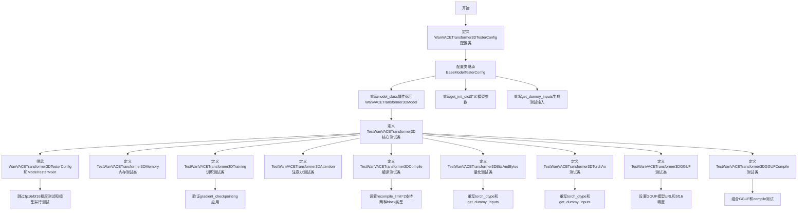

## 类结构

```
WanVACETransformer3DTesterConfig (配置类)
├── BaseModelTesterConfig (基类)
├── TestWanVACETransformer3D (核心模型测试)
│   └── ModelTesterMixin
├── TestWanVACETransformer3DMemory (内存测试)
│   └── MemoryTesterMixin
├── TestWanVACETransformer3DTraining (训练测试)
│   └── TrainingTesterMixin
├── TestWanVACETransformer3DAttention (注意力测试)
│   └── AttentionTesterMixin
├── TestWanVACETransformer3DCompile (编译测试)
│   └── TorchCompileTesterMixin
├── TestWanVACETransformer3DBitsAndBytes (BitsAndBytes量化)
│   └── BitsAndBytesTesterMixin
├── TestWanVACETransformer3DTorchAo (TorchAO量化)
│   └── TorchAoTesterMixin
├── TestWanVACETransformer3DGGUF (GGUF量化)
│   └── GGUFTesterMixin
└── TestWanVACETransformer3DGGUFCompile (GGUF+编译)
└── GGUFCompileTesterMixin
```

## 全局变量及字段


### `enable_full_determinism`
    
用于启用测试的完全确定性，确保随机操作可复现的测试工具函数

类型：`function`
    


    

## 全局函数及方法


### `WanVACETransformer3DTesterConfig.model_class`

该属性是一个Python `@property`装饰器定义的方法，用于返回WanVACETransformer3DModel类本身，以便测试框架能够实例化对应的模型进行测试。

参数：

- `self`：`WanVACETransformer3DTesterConfig`，隐式参数，指向配置类实例本身

返回值：`type`，返回WanVACETransformer3DModel类，供测试框架用于模型实例化

#### 流程图

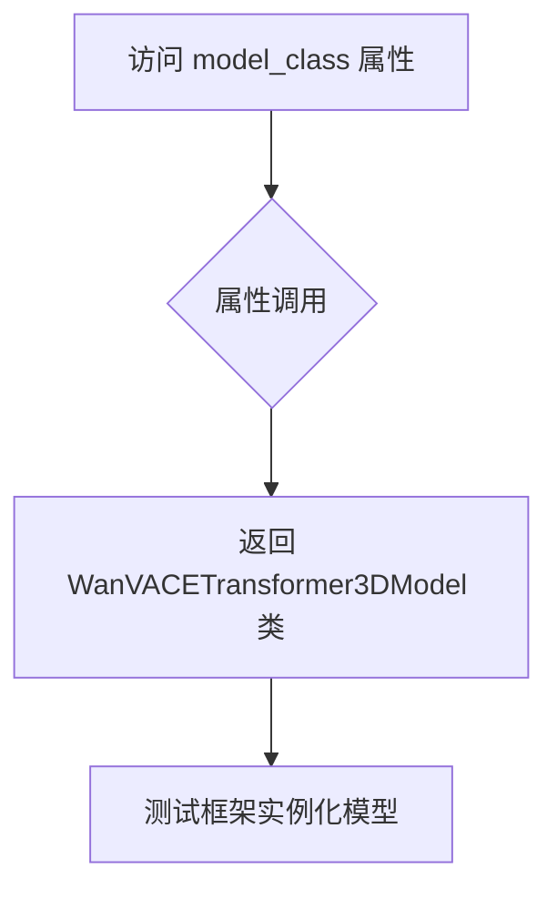

#### 带注释源码

```python
@property
def model_class(self):
    """
    返回WanVACE Transformer 3D模型的类对象。
    
    该属性被测试框架（ModelTesterMixin)用于动态创建模型实例，
    以便执行各种模型功能测试（如前向传播、保存加载、内存占用等）。
    
    Returns:
        type: WanVACETransformer3DModel类
    """
    return WanVACETransformer3DModel
```


### `WanVACETransformer3DTesterConfig.pretrained_model_name_or_path`

这是一个配置类属性方法，用于返回Wan VACE 3D Transformer模型的预训练模型名称或路径，指向HuggingFace测试用的小型模型。

参数：

- `self`：调用此属性的实例对象，无需显式传递

返回值：`str`，返回预训练模型的HuggingFace Hub路径或本地路径

#### 流程图

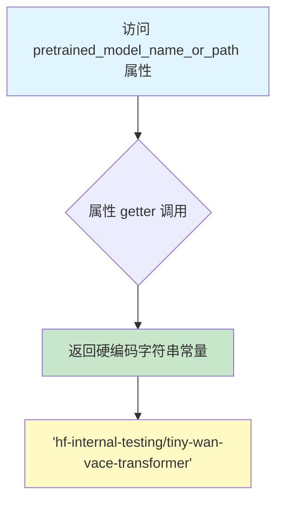

#### 带注释源码

```python
@property
def pretrained_model_name_or_path(self):
    """返回预训练模型的名称或路径。
    
    此属性提供WanVACETransformer3DModel的预训练权重路径。
    使用HuggingFace Hub上的测试用微小模型，用于单元测试和开发验证。
    
    Returns:
        str: HuggingFace Hub模型标识符，格式为"hf-internal-testing/tiny-wan-vace-transformer"
    """
    return "hf-internal-testing/tiny-wan-vace-transformer"
```


### `WanVACETransformer3DTesterConfig.output_shape`

这是一个属性方法，用于返回 Wan VACE Transformer 3D 模型的预期输出张量形状配置。该属性定义了在测试场景下模型输出应遵循的维度规范。

参数：

- （无参数 - 这是一个 `@property` 装饰器修饰的属性方法，隐式接收 `self` 参数）

返回值：`tuple[int, ...]`，返回模型的输出张量形状元组，格式为 (批量大小, 通道数, 帧数, 高度, 宽度)，当前配置为 (16, 2, 16, 16)

#### 流程图

```mermaid
flowchart TD
    A[开始] --> B{读取 output_shape 属性}
    B --> C[返回 tuple: (16, 2, 16, 16)]
    C --> D[结束]
    
    style A fill:#f9f,color:#333
    style D fill:#9f9,color:#333
```

#### 带注释源码

```python
@property
def output_shape(self) -> tuple[int, ...]:
    """返回模型的输出张量形状配置。
    
    该属性定义了 WanVACETransformer3DModel 在测试时的预期输出维度。
    形状为 (batch_size, channels, frames, height, width) 的元组形式。
    
    Returns:
        tuple[int, ...]: 包含四个整数的元组，表示 (16, 2, 16, 16)
                       - 16: 批量大小 (batch_size)
                       - 2:  通道数/帧数 (channels 或 frames)
                       - 16: 高度 (height)
                       - 16: 宽度 (width)
    """
    return (16, 2, 16, 16)
```


### `WanVACETransformer3DTesterConfig.input_shape`

该属性定义了 WanVACETransformer3D 模型的输入形状配置，返回一个元组表示输入张量的维度结构。

参数：
- （无参数，该方法为属性方法）

返回值：`tuple[int, ...]`，返回模型输入数据的形状元组，格式为 (batch_size, channels, frames, height, width)。

#### 流程图

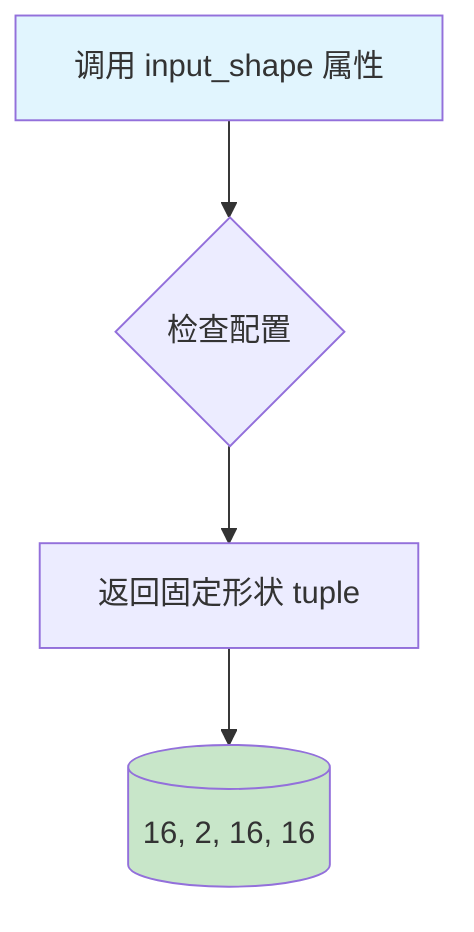

#### 带注释源码

```python
@property
def input_shape(self) -> tuple[int, ...]:
    """
    定义 WanVACETransformer3D 模型的输入形状配置。
    
    返回值说明:
    - tuple[int, ...]: 返回形状元组 (16, 2, 16, 16)
      * 16: 通常表示批量大小(batch_size)或通道数
      * 2: 表示时间帧数(num_frames)
      * 16: 表示高度(height)
      * 16: 表示宽度(width)
    
    注意: 此形状与 output_shape 相同,表示模型在测试配置下的
    输入输出保持一致的维度结构。
    """
    return (16, 2, 16, 16)
```


### `WanVACETransformer3DTesterConfig.main_input_name`

该属性方法定义在测试配置类中，用于指定 Wan VACE Transformer 3D 模型的主输入名称。它返回一个字符串常量 "hidden_states"，表明模型的正向传播过程中主要关注的输入张量是 hidden_states（隐藏状态）。

参数： 无

返回值：`str`，返回主输入的名称 "hidden_states"，用于标识模型的主要输入张量。

#### 流程图

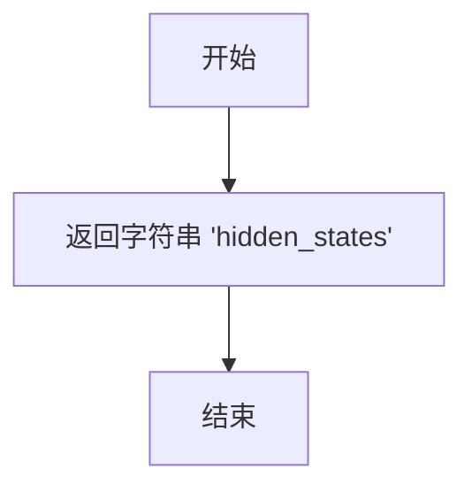

#### 带注释源码

```python
@property
def main_input_name(self) -> str:
    """主输入名称属性。
    
    返回该模型的主输入张量的名称。在 WanVACETransformer3DModel 的前向传播中，
    hidden_states 被视为主要输入，用于处理视频/图像的潜在特征表示。
    
    Returns:
        str: 主输入名称，固定为 'hidden_states'
    """
    return "hidden_states"
```


### `WanVACETransformer3DTesterConfig.generator`

该属性方法返回一个 PyTorch 随机数生成器（Generator），用于确保测试中随机生成数据的可重复性，通过固定种子（0）来保证多次运行结果的一致性。

参数：

- 该方法为属性方法，无显式参数（`self` 为隐式参数）

返回值：`torch.Generator`，返回一个已设置随机种子为 0 的 CPU 设备 PyTorch 随机数生成器对象

#### 流程图

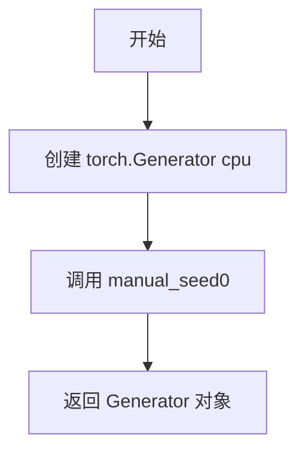

#### 带注释源码

```python
@property
def generator(self):
    """返回一个设置了随机种子为 0 的 CPU 随机数生成器。
    
    该生成器用于确保测试中所有随机张量生成操作的可重复性，
    使得每次运行测试时使用相同的随机数据，便于调试和复现问题。
    
    Returns:
        torch.Generator: PyTorch 随机数生成器，设备为 CPU，种子固定为 0
    """
    return torch.Generator("cpu").manual_seed(0)
```


### `WanVACETransformer3DTesterConfig.get_init_dict`

该方法用于返回 WanVACE Transformer 3D 模型的初始化参数字典，包含了模型的关键配置信息，如 patch_size、注意力头数、输入输出通道数、VACE 层配置等。

参数：

- 该方法无参数（仅包含 `self` 参数）

返回值：`dict[str, int | list[int] | tuple | str | bool | None]`，返回一个包含模型初始化配置的字典，用于配置 WanVACE Transformer 3D 模型的各项参数。

#### 流程图

```mermaid
flowchart TD
    A[开始 get_init_dict] --> B[创建并返回初始化参数字典]
    
    B --> B1[patch_size: (1, 2, 2)]
    B --> B2[num_attention_heads: 2]
    B --> B3[attention_head_dim: 12]
    B --> B4[in_channels: 16]
    B --> B5[out_channels: 16]
    B --> B6[text_dim: 32]
    B --> B7[freq_dim: 256]
    B --> B8[ffn_dim: 32]
    B --> B9[num_layers: 4]
    B --> B10[cross_attn_norm: True]
    B --> B11[qk_norm: rms_norm_across_heads]
    B --> B12[rope_max_seq_len: 32]
    B --> B13[vace_layers: [0, 2]]
    B --> B14[vace_in_channels: 48]
    
    B1 --> C[结束]
    B2 --> C
    B3 --> C
    B4 --> C
    B5 --> C
    B6 --> C
    B7 --> C
    B8 --> C
    B9 --> C
    B10 --> C
    B11 --> C
    B12 --> C
    B13 --> C
    B14 --> C
```

#### 带注释源码

```python
def get_init_dict(self) -> dict[str, int | list[int] | tuple | str | bool | None]:
    """
    返回 WanVACE Transformer 3D 模型的初始化参数字典。
    
    该字典包含了模型的关键配置信息，用于实例化 WanVACETransformer3DModel。
    这些参数定义了模型的架构、输入输出维度、注意力机制配置以及 VACE 相关设置。
    
    Returns:
        dict[str, int | list[int] | tuple | str | bool | None]: 
            包含以下键值的字典:
            - patch_size: tuple[int, ...] - 三维补丁大小 (时间, 高度, 宽度)
            - num_attention_heads: int - 注意力头数量
            - attention_head_dim: int - 每个注意力头的维度
            - in_channels: int - 输入通道数
            - out_channels: int - 输出通道数
            - text_dim: int - 文本编码器嵌入维度
            - freq_dim: int - 频率维度
            - ffn_dim: int - 前馈网络隐藏层维度
            - num_layers: int - Transformer 层数量
            - cross_attn_norm: bool - 是否启用交叉注意力归一化
            - qk_norm: str - Query/Key 归一化方法
            - rope_max_seq_len: int - RoPE 位置编码最大序列长度
            - vace_layers: list[int] - 启用 VACE 功能的层索引列表
            - vace_in_channels: int - VACE 输入通道数 (通常为 in_channels 的 3 倍)
    """
    return {
        "patch_size": (1, 2, 2),              # 补丁分割尺寸：时间维度1，高度2，宽度2
        "num_attention_heads": 2,             # 多头注意力头数：2个
        "attention_head_dim": 12,             # 每个注意力头的维度：12
        "in_channels": 16,                    # 输入通道数：16
        "out_channels": 16,                   # 输出通道数：16
        "text_dim": 32,                       # 文本编码器嵌入维度：32
        "freq_dim": 256,                      # 频率维度：用于位置编码
        "ffn_dim": 32,                        # 前馈神经网络隐藏层维度：32
        "num_layers": 4,                      # Transformer 层数：4层
        "cross_attn_norm": True,              # 是否启用交叉注意力归一化：是
        "qk_norm": "rms_norm_across_heads",   # Query/Key 归一化方式：跨头 RMS 归一化
        "rope_max_seq_len": 32,               # RoPE 位置编码最大序列长度：32
        "vace_layers": [0, 2],                # VACE 激活的层索引：第0层和第2层
        "vace_in_channels": 48,               # VACE 输入通道数：48 (3 * 16 = 48，即3倍输入通道)
    }
```


### `WanVACETransformer3DTesterConfig.get_dummy_inputs`

该方法用于生成 Wan VACE Transformer 3D 模型的虚拟输入（dummy inputs），返回一个包含 `hidden_states`、`encoder_hidden_states`、`control_hidden_states` 和 `timestep` 四个键的字典，用于模型测试。

参数：

-  `self`：`WanVACETransformer3DTesterConfig` 实例本身，包含 `generator` 属性用于生成随机张量

返回值：`dict[str, torch.Tensor]`，返回包含以下键的字典：
- `hidden_states`：形状为 (1, 16, 2, 16, 16) 的随机张量，表示主输入的隐藏状态
- `encoder_hidden_states`：形状为 (1, 12, 32) 的随机张量，表示文本编码器的隐藏状态
- `control_hidden_states`：形状为 (1, 48, 2, 16, 16) 的随机张量，用于 VACE 控制的隐藏状态
- `timestep`：形状为 (1,) 的随机整数张量，范围在 0-1000 之间，表示扩散过程的时间步

#### 流程图

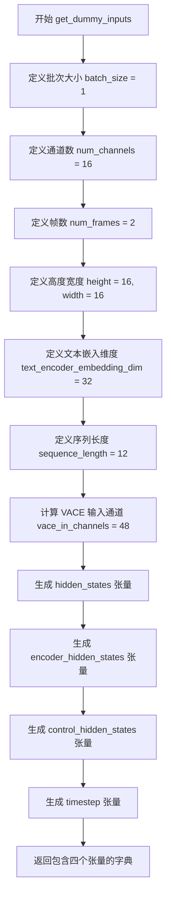

#### 带注释源码

```python
def get_dummy_inputs(self) -> dict[str, torch.Tensor]:
    """生成 Wan VACE Transformer 3D 模型的虚拟输入测试数据"""
    # 批次大小
    batch_size = 1
    # 输入通道数
    num_channels = 16
    # 帧数（视频/3D数据的帧数）
    num_frames = 2
    # 空间高度和宽度
    height = 16
    width = 16
    # 文本编码器嵌入维度
    text_encoder_embedding_dim = 32
    # 序列长度（文本token数量）
    sequence_length = 12

    # VACE 需要 control_hidden_states，其通道数为 in_channels 的 3 倍
    # 3 * 16 = 48
    vace_in_channels = 48

    # 返回包含四个输入键的字典
    return {
        # 主输入的隐藏状态，形状为 (batch, channels, frames, height, width)
        "hidden_states": randn_tensor(
            (batch_size, num_channels, num_frames, height, width),
            generator=self.generator,
            device=torch_device,
        ),
        # 文本编码器的输出隐藏状态，形状为 (batch, sequence_length, text_dim)
        "encoder_hidden_states": randn_tensor(
            (batch_size, sequence_length, text_encoder_embedding_dim),
            generator=self.generator,
            device=torch_device,
        ),
        # VACE 控制信号的隐藏状态，形状为 (batch, vace_channels, frames, height, width)
        "control_hidden_states": randn_tensor(
            (batch_size, vace_in_channels, num_frames, height, width),
            generator=self.generator,
            device=torch_device,
        ),
        # 扩散过程的时间步，形状为 (batch,)
        "timestep": torch.randint(0, 1000, size=(batch_size,), generator=self.generator).to(torch_device),
    }
```


### `TestWanVACETransformer3D.test_from_save_pretrained_dtype_inference`

该测试方法用于验证从保存的预训练模型加载时的数据类型推断功能，但由于 fp16/bf16 精度要求过高而被跳过执行。

参数：

- `self`：隐式参数，`TestWanVACETransformer3D`，测试类实例
- `tmp_path`：`py.path.local`（pytest fixture），pytest 提供的临时目录路径，用于存放测试过程中生成的临时文件
- `dtype`：`torch.dtype`，参数化测试的数据类型，支持 `torch.float16`（fp16）和 `torch.bfloat16`（bf16）

返回值：无（`None`），该方法使用 `pytest.skip()` 跳过测试，不返回任何值

#### 流程图

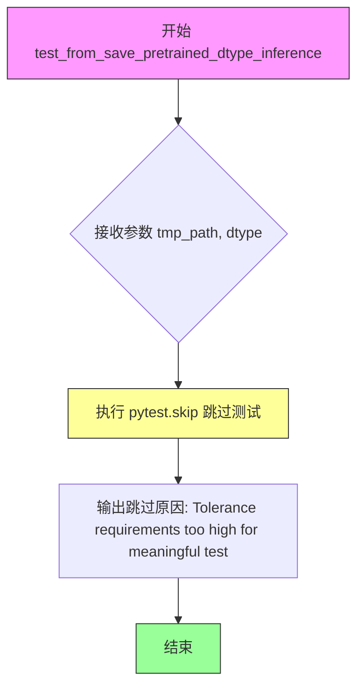

#### 带注释源码

```python
@pytest.mark.parametrize("dtype", [torch.float16, torch.bfloat16], ids=["fp16", "bf16"])
def test_from_save_pretrained_dtype_inference(self, tmp_path, dtype):
    """测试从保存的预训练模型加载时的数据类型推断功能
    
    注意：该测试由于精度要求过高而被跳过，dtype 保持功能已由 
    test_from_save_pretrained_dtype 和 test_keep_in_fp32_modules 测试覆盖
    """
    # Skip: fp16/bf16 require very high atol to pass, providing little signal.
    # Dtype preservation is already tested by test_from_save_pretrained_dtype and test_keep_in_fp32_modules.
    pytest.skip("Tolerance requirements too high for meaningful test")
```


### `TestWanVACETransformer3D.test_model_parallelism`

该方法用于测试 WanVACE Transformer 3D 模型的并行处理能力，但由于 VACE 控制流中存在 cuda:0 和 cuda:1 设备不匹配的问题，该测试目前被跳过。

参数：

- `self`：`TestWanVACETransformer3D`，测试类实例本身
- `tmp_path`：`py.path.local`，pytest 提供的临时目录路径，用于保存测试过程中的临时文件

返回值：`None`，该方法被 pytest.skip() 跳过，不执行任何测试逻辑

#### 流程图

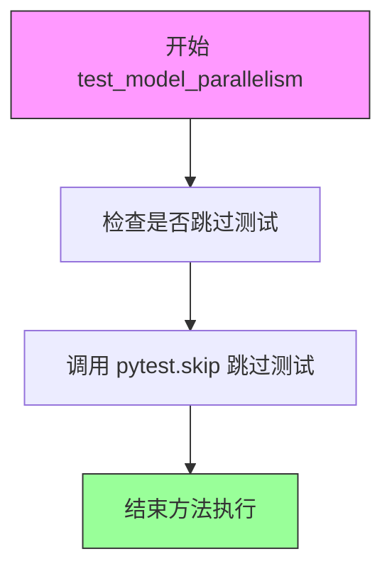

#### 带注释源码

```python
def test_model_parallelism(self, tmp_path):
    """测试 WanVACE Transformer 3D 模型的并行处理能力。
    
    该测试用于验证模型在多设备（如 cuda:0 和 cuda:1）上的并行运行能力。
    由于当前 VACE 控制流实现中存在设备不匹配的问题，该测试被跳过。
    
    Args:
        tmp_path: pytest 提供的临时目录路径，用于测试过程中的文件IO操作
        
    Returns:
        None: 该方法被跳过，不返回任何值
        
    Note:
        跳过原因：Device mismatch between cuda:0 and cuda:1 in VACE control flow
        这是一个已知的限制，需要在未来版本中修复以支持模型并行
    """
    # Skip: Device mismatch between cuda:0 and cuda:1 in VACE control flow
    # 设备不匹配问题：VACE 控制流在 cuda:0 和 cuda:1 之间存在设备不一致
    pytest.skip("Model parallelism not yet supported for WanVACE")
```


### `TestWanVACETransformer3DTraining.test_gradient_checkpointing_is_applied`

这是一个测试方法，用于验证梯度检查点（Gradient Checkpointing）是否被正确应用于 WanVACETransformer3DModel 模型。该测试通过调用父类的测试方法来检查指定的模型类是否启用了梯度检查点功能。

参数：

- `expected_set`：`set`，期望启用梯度检查点的模型类集合，此处为 `{"WanVACETransformer3DModel"}`

返回值：`None`，该方法通过 pytest 断言来验证结果，不返回具体值

#### 流程图

```mermaid
flowchart TD
    A[开始测试 test_gradient_checkpointing_is_applied] --> B[创建期望模型集合 expected_set = {'WanVACETransformer3DModel'}]
    B --> C[调用父类方法 super().test_gradient_checkpointing_is_applied]
    C --> D{父类测试验证}
    D -->|通过| E[测试通过]
    D -->|失败| F[测试失败并抛出异常]
```

#### 带注释源码

```python
class TestWanVACETransformer3DTraining(WanVACETransformer3DTesterConfig, TrainingTesterMixin):
    """Training tests for Wan VACE Transformer 3D."""

    def test_gradient_checkpointing_is_applied(self):
        """
        测试梯度检查点是否被正确应用。
        
        该测试方法验证 WanVACETransformer3DModel 类是否启用了
        PyTorch 的梯度检查点（gradient checkpointing）功能。
        梯度检查点是一种通过牺牲计算时间来节省显存的技术。
        """
        # 定义期望启用梯度检查点的模型类集合
        expected_set = {"WanVACETransformer3DModel"}
        
        # 调用父类 TrainingTesterMixin 的测试方法进行验证
        # 父类方法会检查 expected_set 中的模型类是否都启用了梯度检查点
        super().test_gradient_checkpointing_is_applied(expected_set=expected_set)
```


### TestWanVACETransformer3DCompile.test_torch_compile_repeated_blocks

该测试方法用于验证 WanVACE Transformer 3D 模型在 torch compile 场景下对重复块的处理能力。由于 WanVACE 包含两种块类型（WanTransformerBlock 和 WanVACETransformerBlock），需要将 recompile_limit 设置为 2 以确保两种块类型都能被正确编译测试。

参数：
- 该方法本身仅包含 `self` 参数，无其他显式参数。但在调用父类方法时传递了 `recompile_limit=2`。

返回值：无返回值（测试方法通常返回 None）

#### 流程图

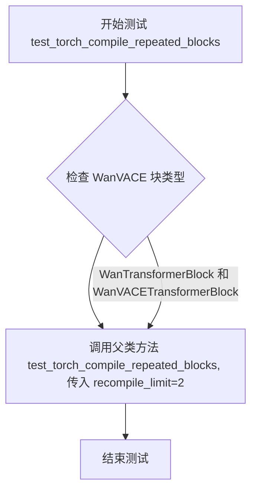

#### 带注释源码

```python
def test_torch_compile_repeated_blocks(self):
    # WanVACE has two block types (WanTransformerBlock and WanVACETransformerBlock),
    # so we need recompile_limit=2 instead of the default 1.
    # 注释说明：WanVACE 模型包含两种不同类型的块，因此需要增加 recompile_limit 参数值
    # 以确保 torch compile 能够处理这两种块类型，避免因默认限制导致编译不完整
    super().test_torch_compile_repeated_blocks(recompile_limit=2)
    # 调用父类 TorchCompileTesterMixin 中的 test_torch_compile_repeated_blocks 方法
    # 并传递 recompile_limit=2 参数，覆盖默认值为 1 的设置
```


### `TestWanVACETransformer3DBitsAndBytes.torch_dtype`

这是一个属性方法（使用 `@property` 装饰器），用于返回 BitsAndBytes 量化测试所需的 torch 数据类型。

参数：

- 无显式参数（`self` 为隐式参数）

返回值：`torch.dtype`，返回 `torch.float16`，用于指定测试中张量的数据类型。

#### 流程图

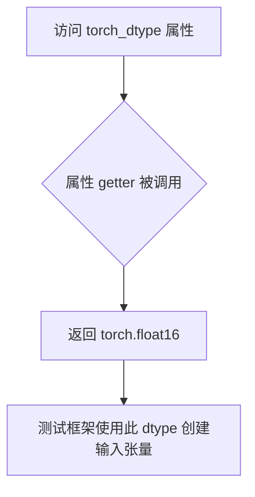

#### 带注释源码

```python
@property
def torch_dtype(self):
    """返回用于 BitsAndBytes 量化测试的 torch 数据类型。
    
    Returns:
        torch.dtype: 用于测试的浮点数据类型 (torch.float16)
    """
    return torch.float16
```


### `TestWanVACETransformer3DBitsAndBytes.get_dummy_inputs`

该方法为 BitsAndBytes 量化测试场景重写基类的虚拟输入方法，生成匹配 Wan VACE Transformer 3D 小型模型尺寸的虚拟输入张量（hidden_states、encoder_hidden_states、control_hidden_states 和 timestep），用于量化测试场景下的模型前向传播验证。

参数：

- `self`：隐式参数，TestWanVACETransformer3DBitsAndBytes 实例本身

返回值：`dict[str, torch.Tensor]`，返回一个包含四个键的字典，分别对应模型所需的隐藏状态、编码器隐藏状态、控制隐藏状态和时间步

#### 流程图

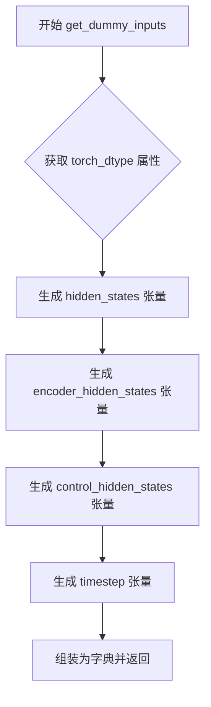

#### 带注释源码

```python
def get_dummy_inputs(self):
    """Override to provide inputs matching the tiny Wan VACE model dimensions."""
    # 从类属性获取目标数据类型（用于 BitsAndBytes 测试场景）
    # 返回 torch.float16
    
    # 构建返回字典，包含模型前向传播所需的全部输入
    return {
        # hidden_states: 主输入 hidden states，形状为 (batch, channels, frames, height, width)
        # 形状 (1, 16, 2, 64, 64) 对应 1 个样本、16 通道、2 帧、64x64 空间分辨率
        "hidden_states": randn_tensor(
            (1, 16, 2, 64, 64),       # 张量形状：(batch_size=1, num_channels=16, num_frames=2, height=64, width=64)
            generator=self.generator, # 随机数生成器，确保可复现性
            device=torch_device,      # 计算设备（cuda/cpu）
            dtype=self.torch_dtype    # 数据类型：torch.float16（BitsAndBytes 测试专用）
        ),
        
        # encoder_hidden_states: 文本编码器的输出，形状为 (batch, seq_len, text_dim)
        # 形状 (1, 512, 4096) 对应 1 个样本、512 序列长度、4096 文本嵌入维度
        "encoder_hidden_states": randn_tensor(
            (1, 512, 4096),            # 张量形状：(batch_size=1, sequence_length=512, text_encoder_embedding_dim=4096)
            generator=self.generator,
            device=torch_device,
            dtype=self.torch_dtype
        ),
        
        # control_hidden_states: VACE 控制信号，形状为 (batch, vace_in_channels, frames, height, width)
        # 形状 (1, 96, 2, 64, 64) 中 96 = 3 * 32（假设 in_channels=32，实际代码中 vace_in_channels=48 或 96）
        "control_hidden_states": randn_tensor(
            (1, 96, 2, 64, 64),        # 张量形状：(batch_size=1, vace_in_channels=96, num_frames=2, height=64, width=64)
            generator=self.generator,
            device=torch_device,
            dtype=self.torch_dtype
        ),
        
        # timestep: 扩散过程的时间步，形状为 (batch,)
        # 单个时间步值 1.0，用于调度器计算噪声调度
        "timestep": torch.tensor([1.0]).to(torch_device, self.torch_dtype),
    }
```


### `TestWanVACETransformer3DTorchAo.torch_dtype`

这是一个属性方法（property），用于返回测试类使用的数据类型（dtype）。

参数：
- 无参数（property 方法，只包含隐式参数 `self`）

返回值：`torch.dtype`，返回 `torch.bfloat16`，表示测试中使用 bfloat16 浮点精度。

#### 流程图

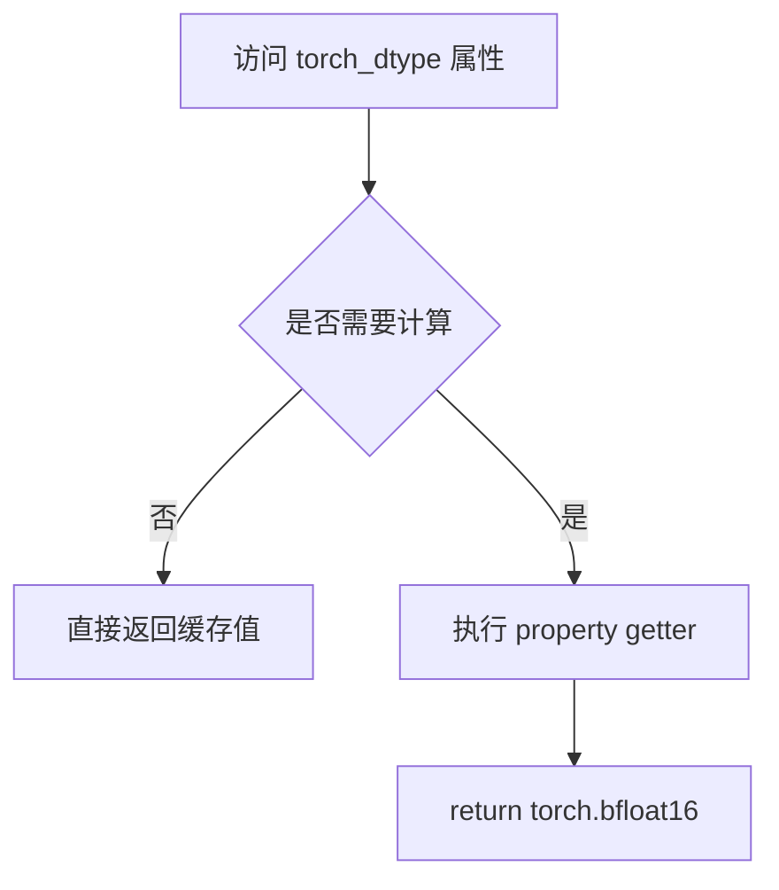

#### 带注释源码

```python
class TestWanVACETransformer3DTorchAo(WanVACETransformer3DTesterConfig, TorchAoTesterMixin):
    """TorchAO quantization tests for Wan VACE Transformer 3D."""

    @property
    def torch_dtype(self):
        """返回测试使用的数据类型为 bfloat16。
        
        该属性用于指定模型和输入张量的数据类型，
        在 TorchAO 量化测试场景下使用 bfloat16 精度。
        
        Returns:
            torch.dtype: torch.bfloat16 数据类型
        """
        return torch.bfloat16
```


### `TestWanVACETransformer3DTorchAo.get_dummy_inputs`

该方法为 TorchAO 量化测试提供虚拟输入数据，生成匹配 Wan VACE Transformer 3D 模型（tiny 版本）维度的测试张量，包括隐藏状态、编码器隐藏状态、控制隐藏状态和时间步。

参数：

- 该方法无显式参数（隐式使用 `self`）

返回值：`dict[str, torch.Tensor]`，返回包含以下键的字典：

- `hidden_states`：`torch.Tensor`，形状 (1, 16, 2, 64, 64)，模型主输入
- `encoder_hidden_states`：`torch.Tensor`，形状 (1, 512, 4096)，文本编码器输出
- `control_hidden_states`：`torch.Tensor`，形状 (1, 96, 2, 64, 64)，VACE 控制信号输入
- `timestep`：`torch.Tensor`，形状 (1,)，扩散时间步

#### 流程图

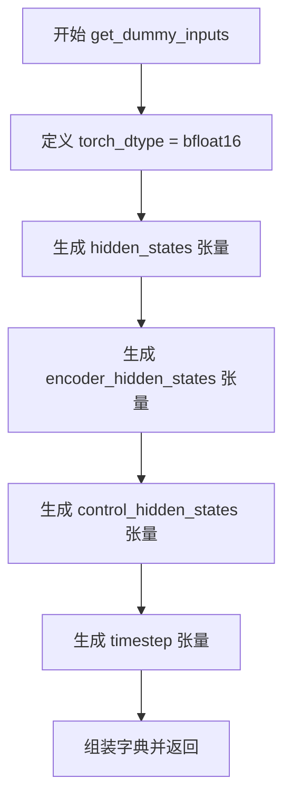

#### 带注释源码

```python
def get_dummy_inputs(self):
    """Override to provide inputs matching the tiny Wan VACE model dimensions."""
    return {
        # hidden_states: 主输入张量，形状 (batch, channels, frames, height, width)
        "hidden_states": randn_tensor(
            (1, 16, 2, 64, 64), generator=self.generator, device=torch_device, dtype=self.torch_dtype
        ),
        # encoder_hidden_states: 文本编码器输出，形状 (batch, sequence_length, text_dim)
        "encoder_hidden_states": randn_tensor(
            (1, 512, 4096), generator=self.generator, device=torch_device, dtype=self.torch_dtype
        ),
        # control_hidden_states: VACE 控制信号，形状 (batch, vace_in_channels, frames, height, width)
        # vace_in_channels = 3 * in_channels = 3 * 32 = 96 (实际模型使用 32)
        "control_hidden_states": randn_tensor(
            (1, 96, 2, 64, 64), generator=self.generator, device=torch_device, dtype=self.torch_dtype
        ),
        # timestep: 扩散过程的时间步，形状 (batch,)
        "timestep": torch.tensor([1.0]).to(torch_device, self.torch_dtype),
    }
```


### `TestWanVACETransformer3DGGUF.gguf_filename`

这是一个属性方法（property），用于返回 GGUF 量化模型文件的 URL 路径，以便测试框架下载并使用该模型进行 GGUF 量化相关的测试验证。

参数：

- 无显式参数（隐式参数 `self` 为类实例引用）

返回值：`str`，返回 GGUF 量化模型文件的 HuggingFace URL 链接字符串

#### 流程图

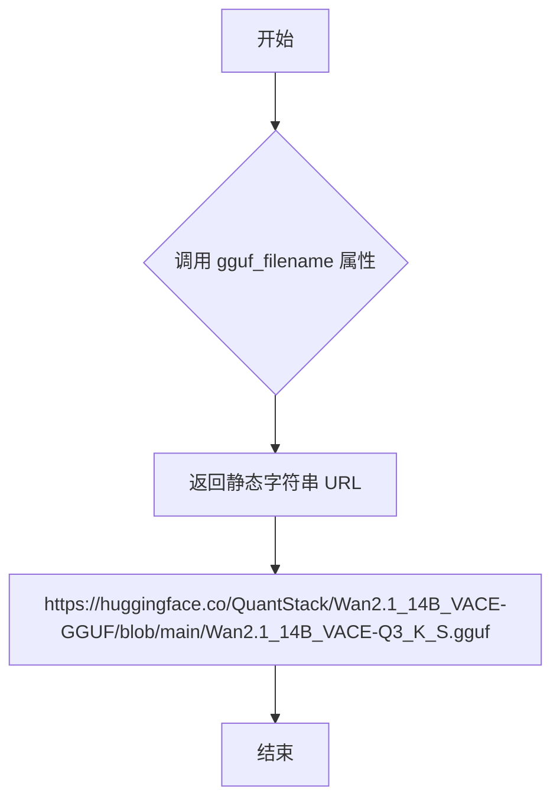

#### 带注释源码

```python
class TestWanVACETransformer3DGGUF(WanVACETransformer3DTesterConfig, GGUFTesterMixin):
    """GGUF quantization tests for Wan VACE Transformer 3D."""

    @property
    def gguf_filename(self):
        # 返回 Wan 2.1 14B VACE 模型的 GGUF 量化版本 URL
        # 该模型托管在 HuggingFace QuantStack 组织下
        # 使用 Q3_K_S 量化级别，适合测试 GGUF 量化功能
        return "https://huggingface.co/QuantStack/Wan2.1_14B_VACE-GGUF/blob/main/Wan2.1_14B_VACE-Q3_K_S.gguf"
```


### `TestWanVACETransformer3DGGUF.torch_dtype`

这是一个属性方法，用于返回 GGUF 量化测试所需的 torch 数据类型（dtype）。该属性为测试用例提供正确的数据类型配置，以确保测试使用 bfloat16 进行。

参数：

- （无参数，作为属性方法访问）

返回值：`torch.dtype`，返回 `torch.bfloat16`，用于指定测试中张量的数据类型

#### 流程图

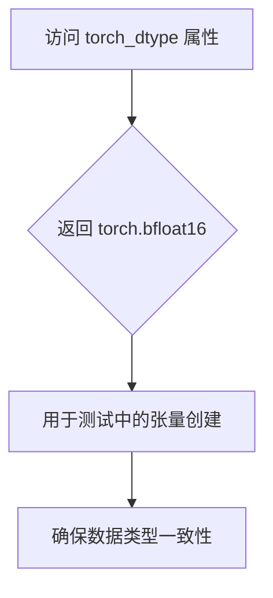

#### 带注释源码

```python
@property
def torch_dtype(self):
    """返回 GGUF 量化测试所需的 torch 数据类型。
    
    该属性方法被测试框架用于：
    1. 指定 get_dummy_inputs() 中创建的张量的数据类型
    2. 确保模型加载和推理使用正确的精度
    
    Returns:
        torch.dtype: torch.bfloat16，用于 GGUF 量化测试
    """
    return torch.bfloat16
```


### `TestWanVACETransformer3DGGUF.get_dummy_inputs`

该方法是 Wan VACE Transformer 3D 模型 GGUF 量化测试的配置类方法，用于生成符合真实 Wan 2.1 VACE 模型维度的测试输入数据（hidden_states、encoder_hidden_states、control_hidden_states 和 timestep），以支持 GGUF 量化测试场景。

参数：
- 该方法无显式参数（隐式使用实例属性 `self.generator`、`self.torch_dtype` 等）

返回值：`dict[str, torch.Tensor]`，返回一个包含四个键的字典，分别是 hidden_states、encoder_hidden_states、control_hidden_states 和 timestep，均为 torch.Tensor 类型

#### 流程图

```mermaid
flowchart TD
    A[开始 get_dummy_inputs] --> B[使用实例属性 torch_dtype: torch.bfloat16]
    B --> C[生成 hidden_states 张量]
    C --> D[形状: (1, 16, 2, 64, 64)]
    D --> E[生成 encoder_hidden_states 张量]
    E --> F[形状: (1, 512, 4096)]
    F --> G[生成 control_hidden_states 张量]
    G --> H[形状: (1, 96, 2, 64, 64)]
    H --> I[生成 timestep 张量]
    I --> J[形状: (1,)]
    J --> K[返回包含四个键的字典]
```

#### 带注释源码

```python
def get_dummy_inputs(self):
    """Override to provide inputs matching the real Wan VACE model dimensions.

    Wan 2.1 VACE: in_channels=16, text_dim=4096, vace_in_channels=96
    """
    return {
        # 主输入：隐藏状态，形状为 (batch=1, channels=16, frames=2, height=64, width=64)
        "hidden_states": randn_tensor(
            (1, 16, 2, 64, 64), generator=self.generator, device=torch_device, dtype=self.torch_dtype
        ),
        # 文本编码器输出：编码器隐藏状态，形状为 (batch=1, sequence=512, text_dim=4096)
        "encoder_hidden_states": randn_tensor(
            (1, 512, 4096), generator=self.generator, device=torch_device, dtype=self.torch_dtype
        ),
        # VACE 控制信号：控制隐藏状态，形状为 (batch=1, vace_in_channels=96, frames=2, height=64, width=64)
        # vace_in_channels = 3 * in_channels = 3 * 16 = 48，但实际模型使用 96
        "control_hidden_states": randn_tensor(
            (1, 96, 2, 64, 64), generator=self.generator, device=torch_device, dtype=self.torch_dtype
        ),
        # 时间步：用于扩散模型调度，形状为 (batch=1,)
        "timestep": torch.tensor([1.0]).to(torch_device, self.torch_dtype),
    }
```


### `TestWanVACETransformer3DGGUFCompile.gguf_filename`

该属性返回用于GGUF量化测试的Wan VACE Transformer 3D模型的GGUF文件URL地址，用于验证模型在与GGUF量化格式结合时的兼容性。

参数： 无

返回值：`str`，返回Wan2.1 14B VACE模型的GGUF量化文件下载URL（Q3_K_S量化版本）

#### 流程图

```mermaid
flowchart TD
    A[调用 gguf_filename 属性] --> B{返回GGUF文件URL}
    B --> C["https://huggingface.co/QuantStack/Wan2.1_14B_VACE-GGUF/blob/main/Wan2.1_14B_VACE-Q3_K_S.gguf"]
```

#### 带注释源码

```python
@property
def gguf_filename(self):
    """返回用于GGUF量化测试的Wan VACE Transformer 3D模型的GGUF文件URL。
    
    该URL指向HuggingFace上QuantStack提供的Wan2.1 14B VACE模型的GGUF量化文件（Q3_K_S量化版本），
    用于测试模型在与GGUF量化格式结合时的兼容性和正确性。
    
    Returns:
        str: GGUF模型文件的完整URL地址
    """
    return "https://huggingface.co/QuantStack/Wan2.1_14B_VACE-GGUF/blob/main/Wan2.1_14B_VACE-Q3_K_S.gguf"
```


### `TestWanVACETransformer3DGGUFCompile.torch_dtype`

这是一个属性方法，用于获取 GGUF 编译测试的默认 torch 数据类型。

参数：

- （无参数 - 这是一个属性方法）

返回值：`torch.dtype`，返回模型推理使用的 torch 数据类型（bfloat16）

#### 流程图

```mermaid
flowchart TD
    A[调用 torch_dtype 属性] --> B{返回数据类型}
    B --> C[torch.bfloat16]
```

#### 带注释源码

```python
@property
def torch_dtype(self):
    """返回 GGUF 编译测试使用的 torch 数据类型。
    
    Returns:
        torch.dtype: 使用 bfloat16 进行模型推理测试
    """
    return torch.bfloat16
```


### `TestWanVACETransformer3DGGUFCompile.get_dummy_inputs`

该方法用于生成符合真实 Wan VACE 模型维度的虚拟输入数据，以支持 GGUF 量化与编译测试场景。

参数：无（该方法不接受任何外部参数）

返回值：`dict[str, torch.Tensor]`，返回一个包含模型所需输入张量的字典，包含 `hidden_states`、`encoder_hidden_states`、`control_hidden_states` 和 `timestep` 四个键

#### 流程图

```mermaid
flowchart TD
    A[开始] --> B[读取类属性 torch_dtype]
    C[读取类属性 generator]
    D[读取全局变量 torch_device]
    
    B --> E[生成 hidden_states 张量]
    C --> E
    D --> E
    
    E --> F[生成 encoder_hidden_states 张量]
    
    F --> G[生成 control_hidden_states 张量]
    
    G --> H[生成 timestep 张量]
    
    H --> I[组装为字典返回]
    I --> J[结束]
```

#### 带注释源码

```
def get_dummy_inputs(self):
    """Override to provide inputs matching the real Wan VACE model dimensions.

    Wan 2.1 VACE: in_channels=16, text_dim=4096, vace_in_channels=96
    """
    # 使用类属性 torch_dtype（bfloat16）作为张量数据类型
    return {
        # hidden_states: 主输入张量，形状 (batch, channels, frames, height, width)
        # 对应 in_channels=16, 典型分辨率 64x64
        "hidden_states": randn_tensor(
            (1, 16, 2, 64, 64), 
            generator=self.generator, 
            device=torch_device, 
            dtype=self.torch_dtype
        ),
        
        # encoder_hidden_states: 文本编码器输出，形状 (batch, sequence_length, text_dim)
        # 对应 text_dim=4096（真实模型维度）
        "encoder_hidden_states": randn_tensor(
            (1, 512, 4096), 
            generator=self.generator, 
            device=torch_device, 
            dtype=self.torch_dtype
        ),
        
        # control_hidden_states: VACE 控制隐藏状态，形状 (batch, vace_in_channels, frames, height, width)
        # 对应 vace_in_channels=96（3 * in_channels = 3 * 32）
        "control_hidden_states": randn_tensor(
            (1, 96, 2, 64, 64), 
            generator=self.generator, 
            device=torch_device, 
            dtype=self.torch_dtype
        ),
        
        # timestep: 时间步长，形状 (batch,)
        # 值为 1.0，用于模型的时间嵌入
        "timestep": torch.tensor([1.0]).to(torch_device, self.torch_dtype),
    }
```

## 关键组件


### WanVACETransformer3DTesterConfig

测试配置类，定义了 WanVACE 3D 变换器模型的测试参数，包括输入输出形状、模型类、预训练模型路径、注意力头维度、层数、VACE层配置等核心参数。

### WanVACE 3D Transformer 模型

支持视频动画和控制的3D变换器模型（WanVACETransformer3DModel），具有VACE_layers=[0, 2]配置，支持控制隐藏状态（control_hidden_states）输入，用于条件视频生成。

### VACE控制流机制

VACE（Video Animation and Control Extension）控制流机制，通过vace_in_channels=48（3倍in_channels）接收控制隐藏状态，实现对生成过程的控制。

### 量化策略支持

支持多种量化策略：BitsAndBytes（8-bit量化）、TorchAo（Torch优化量化）、GGUF（通用量化格式），用于模型压缩和推理加速。

### 梯度检查点

通过test_gradient_checkpointing_is_applied测试验证梯度检查点应用于WanVACETransformer3DModel，用于减少训练显存占用。

### Torch编译优化

通过test_torch_compile_repeated_blocks测试，支持WanTransformerBlock和WanVACETransformerBlock两种块类型的重复编译优化。

### 内存优化测试

TestWanVACETransformer3DMemory类用于测试模型的内存优化特性。

### 训练测试

TestWanVACETransformer3DTraining类用于测试模型的训练相关功能，包括梯度计算、参数更新等。


## 问题及建议


### 已知问题

-   **测试配置重复**：多个测试类（`TestWanVACETransformer3DBitsAndBytes`、`TestWanVACETransformer3DTorchAo`、`TestWanVACETransformer3DGGUF`、`TestWanVACETransformer3DGGUFCompile`）中的 `get_dummy_inputs` 方法存在大量重复代码，违反了 DRY 原则
-   **输入维度不一致**：不同测试类使用的输入张量维度不同（如 `TestWanVACETransformer3D` 使用 `(1, 16, 2, 16, 16)`，而 `BitsAndBytes` 测试使用 `(1, 16, 2, 64, 64)`），可能导致测试行为不一致和维护困难
-   **硬编码配置**：`get_init_dict` 方法中包含大量硬编码的配置值（如 `patch_size: (1, 2, 2)`、`num_layers: 4` 等），缺乏灵活的配置机制
-   **跳过的测试缺少文档**：`test_from_save_pretrained_dtype_inference` 和 `test_model_parallelism` 被无条件跳过，但缺少详细的文档说明具体原因和后续计划
-   **属性重复定义**：`gguf_filename` 和 `torch_dtype` 属性在 `TestWanVACETransformer3DGGUF` 和 `TestWanVACETransformer3DGGUFCompile` 中完全重复

### 优化建议

-   **提取公共测试工具类**：将 `get_dummy_inputs` 方法中的公共逻辑抽取到 mixin 或基类中，通过参数化配置来处理不同测试场景的维度差异
-   **统一配置管理**：引入配置类或工厂方法来集中管理模型参数，减少硬编码值，提高配置的可维护性和可测试性
-   **补充跳过测试的说明**：在跳过测试的方法中添加详细的 `pytest.skip` 理由，说明是临时跳过还是已知限制，以及可能的解决方案
-   **使用数据类或配置对象**：将配置参数封装为数据类，简化 `get_init_dict` 方法并提供类型安全和默认值支持

## 其它


### 设计目标与约束

验证WanVACETransformer3DModel在3D视频生成任务中的核心功能、内存优化、训练流程、注意力机制、模型编译、量化推理（BitsAndBytes、TorchAO、GGUF）等多维度特性。约束：跳过模型并行测试（设备不匹配）、跳过精度要求过高的dtype推理测试。

### 错误处理与异常设计

测试使用pytest框架的标准断言机制，通过pytest.skip()跳过不支持的场景，使用pytest.mark.parametrize进行参数化测试。异常信息来源于torch和diffusers库的原始异常，测试失败时提供清晰的断言错误信息。

### 数据流与状态机

测试数据流：配置类(WanVACETransformer3DTesterConfig)定义模型参数和虚拟输入 → get_dummy_inputs()生成符合维度要求的随机张量 → 各测试类调用模型前向传播 → 验证输出shape和属性。无显式状态机，模型在测试间无状态保留。

### 外部依赖与接口契约

依赖：torch、pytest、diffusers(WanVACETransformer3DModel、randn_tensor)、testing_utils中的各种Mixin类。接口契约：测试类需继承对应Mixin并实现model_class、pretrained_model_name_or_path、get_init_dict()、get_dummy_inputs()等属性/方法。

### 测试覆盖分析

覆盖：模型加载保存、dtype推理、内存占用、梯度检查点、注意力处理器、torch.compile、量化（BitsAndBytes/TorchAO/GGUF）。未覆盖：模型并行推理、真实数据集测试、端到端生成流程。

### 配置管理策略

采用配置类(WanVACETransformer3DTesterConfig)集中管理模型架构参数(patch_size、num_attention_heads、attention_head_dim等)、输入输出shape、预训练模型路径、随机种子。子类可override属性以适配不同测试场景。

### 跳过测试的详细理由

test_from_save_pretrained_dtype_inference：fp16/bf16的atol要求过高，意义有限。test_model_parallelism：VACE控制流在cuda:0和cuda:1间存在设备不匹配。TorchCompile测试：需要recompile_limit=2以适应两种block类型。

### 量化测试特殊处理

BitsAndBytes、TorchAo、GGUF测试需override torch_dtype和get_dummy_inputs以匹配真实模型维度(in_channels=16, text_dim=4096, vace_in_channels=96)，确保量化输入分布与实际部署一致。

### 测试继承结构

采用MixIn模式实现横切关注点分离：ModelTesterMixin(核心功能)、MemoryTesterMixin(内存)、TrainingTesterMixin(训练)、AttentionTesterMixin(注意力)、TorchCompileTesterMixin(编译)、BitsAndBytesTesterMixin(量化)等，各测试类多继承对应Mixin。

### 性能基准与阈值

未显式定义性能基准，内存测试依赖MemoryTesterMixin的内部阈值，量化测试通过对比FP16/BF16基线验证精度损失。Torch compile测试验证重复block的编译兼容性。
    