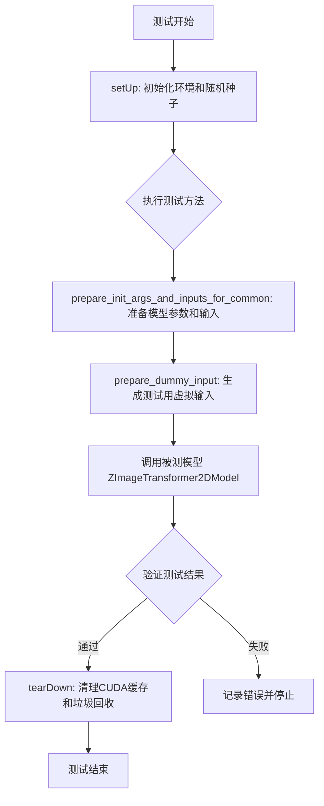
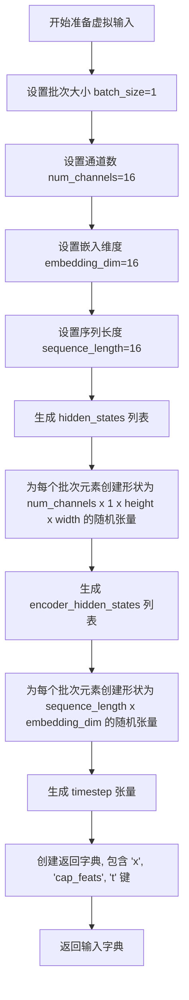
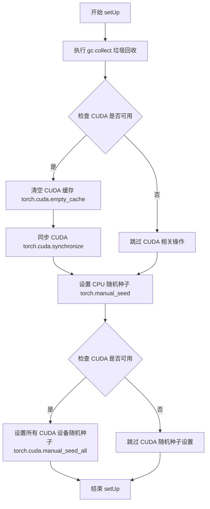
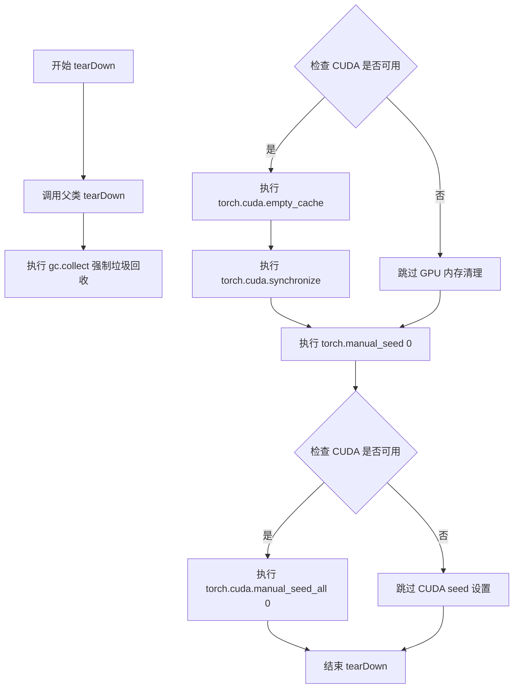
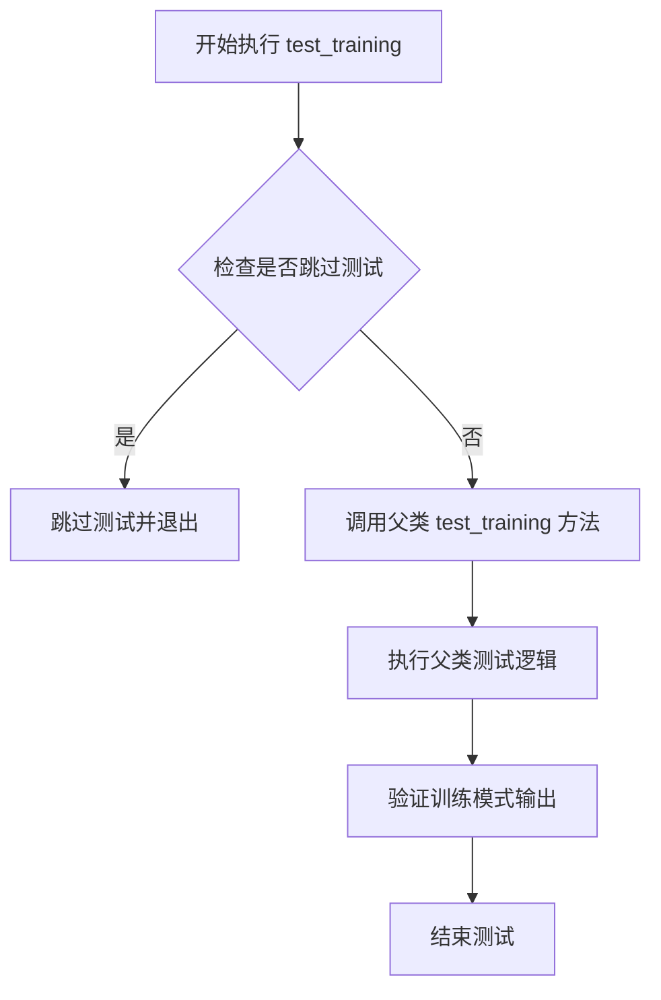
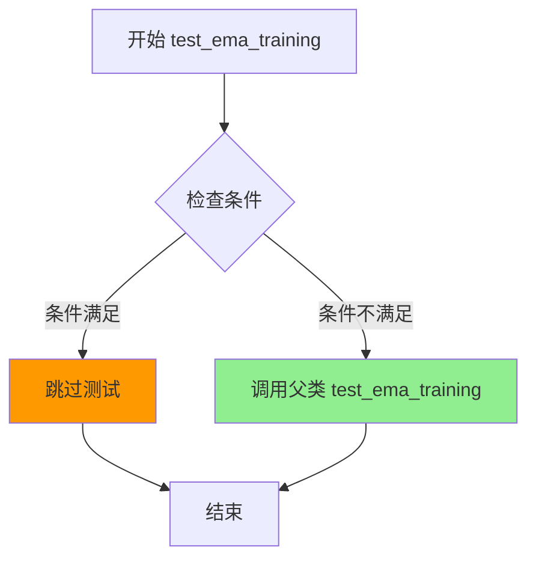
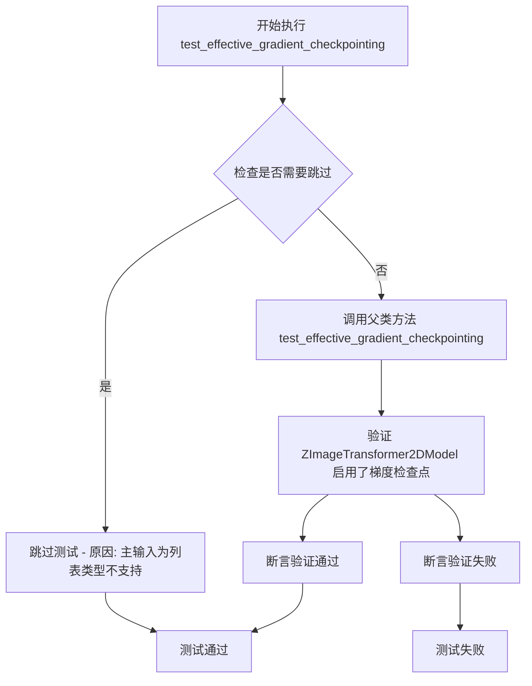
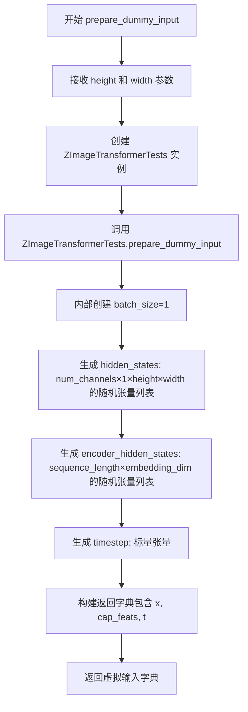

# `diffusers\tests\models\transformers\test_models_transformer_z_image.py` 详细设计文档

该文件是 ZImageTransformer2DModel 的单元测试套件，包含模型初始化验证、梯度检查点测试、输出等价性测试以及 PyTorch JIT 编译兼容性测试，通过 ModelTesterMixin 和 TorchCompileTesterMixin 提供通用测试框架的扩展实现。

## 整体流程



## 类结构

```
unittest.TestCase
├── ZImageTransformerTests (继承 ModelTesterMixin, unittest.TestCase)
└── ZImageTransformerCompileTests (继承 TorchCompileTesterMixin, unittest.TestCase)
```

## 全局变量及字段


### `IS_GITHUB_ACTIONS`
    
标记当前是否在GitHub Actions环境中运行

类型：`bool`
    


### `torch_device`
    
PyTorch计算设备标识符

类型：`str`
    


### `ZImageTransformerTests.model_class`
    
指定被测试的模型类 ZImageTransformer2DModel

类型：`type`
    


### `ZImageTransformerTests.main_input_name`
    
模型主输入参数名称 'x'

类型：`str`
    


### `ZImageTransformerTests.model_split_percents`
    
模型分割百分比 [0.9, 0.9, 0.9]

类型：`list`
    


### `ZImageTransformerTests.dummy_input`
    
虚拟输入数据属性

类型：`dict`
    


### `ZImageTransformerTests.input_shape`
    
输入形状 (4, 32, 32)

类型：`tuple`
    


### `ZImageTransformerTests.output_shape`
    
输出形状 (4, 32, 32)

类型：`tuple`
    


### `ZImageTransformerCompileTests.model_class`
    
指定被测试的模型类 ZImageTransformer2DModel

类型：`type`
    


### `ZImageTransformerCompileTests.different_shapes_for_compilation`
    
用于编译测试的不同形状列表 [(4, 4), (4, 8), (8, 8)]

类型：`list`
    
    

## 全局函数及方法


### `ZImageTransformerTests.prepare_dummy_input`

准备虚拟输入数据，用于ZImageTransformer2DModel的单元测试。该方法生成包含hidden_states、encoder_hidden_states和timestep的字典格式测试数据。

参数：

- `height`：`int`，输入图像的高度，默认为16
- `width`：`int`，输入图像的宽度，默认为16

返回值：`Dict`，包含模型所需输入的字典，具体包括：
- `x`：`List[Tensor]`（hidden_states），形状为(num_channels, 1, height, width)的张量列表
- `cap_feats`：`List[Tensor]`（encoder_hidden_states），形状为(sequence_length, embedding_dim)的张量列表
- `t`：`Tensor`（timestep），形状为(1,)的时间步张量

#### 流程图



#### 带注释源码

```python
def prepare_dummy_input(self, height=16, width=16):
    """
    准备虚拟输入数据，用于ZImageTransformer2DModel的测试。
    
    参数:
        height: 输入图像的高度，默认为16
        width: 输入图像的宽度，默认为16
    
    返回:
        包含模型输入的字典，包含 'x', 'cap_feats', 't' 三个键
    """
    # 批次大小为1，用于单样本测试
    batch_size = 1
    # 输入通道数，与模型配置中的 in_channels=16 对应
    num_channels = 16
    # 编码器隐藏状态的嵌入维度，与 cap_feat_dim=16 对应
    embedding_dim = 16
    # 序列长度，用于条件输入
    sequence_length = 16

    # 生成 hidden_states 列表（主输入 x）
    # 形状: (num_channels, 1, height, width)
    # 这里生成一个批次（batch_size=1）的随机张量
    hidden_states = [torch.randn((num_channels, 1, height, width)).to(torch_device) for _ in range(batch_size)]
    
    # 生成 encoder_hidden_states 列表（条件输入 cap_feats）
    # 形状: (sequence_length, embedding_dim)
    # 用于为模型提供额外的条件信息（如文本嵌入）
    encoder_hidden_states = [
        torch.randn((sequence_length, embedding_dim)).to(torch_device) for _ in range(batch_size)
    ]
    
    # 生成 timestep 张量
    # 形状: (1,) - 包含单个时间步的标量张量
    # 用于扩散模型的时间步调度
    timestep = torch.tensor([0.0]).to(torch_device)

    # 返回输入字典，键名与模型前向传播参数对应
    # 'x' -> hidden_states (主输入)
    # 'cap_feats' -> encoder_hidden_states (条件特征)
    # 't' -> timestep (时间步)
    return {"x": hidden_states, "cap_feats": encoder_hidden_states, "t": timestep}
```


### `ZImageTransformerTests.prepare_init_args_and_inputs_for_common`

该方法为 ZImageTransformer2DModel 测试准备模型初始化参数字典和输入字典，返回的字典包含模型配置参数和测试用的虚拟输入数据。

参数：

- `self`：`ZImageTransformerTests`，测试类实例，用于访问类的其他属性和方法（如 `self.dummy_input`）

返回值：`Tuple[Dict, Dict]`，返回包含两个字典的元组

- 第一个字典（init_dict）：模型初始化参数字典，包含 all_patch_size、all_f_patch_size、in_channels、dim、n_layers、n_refiner_layers、n_heads、n_kv_heads、qk_norm、cap_feat_dim、rope_theta、t_scale、axes_dims、axes_lens 等配置
- 第二个字典（inputs_dict）：模型输入字典，包含 x（隐藏状态列表）、cap_feats（编码器隐藏状态列表）、t（时间步张量）

#### 流程图

```mermaid
flowchart TD
    A[开始 prepare_init_args_and_inputs_for_common] --> B[构建 init_dict 字典]
    B --> C[设置 all_patch_size = (2,)]
    C --> D[设置 all_f_patch_size = (1,)]
    D --> E[设置 in_channels = 16, dim = 16]
    E --> F[设置 n_layers = 1, n_refiner_layers = 1]
    F --> G[设置 n_heads = 1, n_kv_heads = 2]
    G --> H[设置 qk_norm = True, cap_feat_dim = 16]
    H --> I[设置 rope_theta = 256.0, t_scale = 1000.0]
    I --> J[设置 axes_dims = [8, 4, 4], axes_lens = [256, 32, 32]]
    J --> K[调用 self.dummy_input 获取 inputs_dict]
    K --> L[返回 init_dict 和 inputs_dict 元组]
```

#### 带注释源码

```python
def prepare_init_args_and_inputs_for_common(self):
    """
    准备模型初始化参数和输入字典，用于通用测试场景。
    
    Returns:
        Tuple[Dict, Dict]: 包含初始化参数字典和输入字典的元组
    """
    # 定义模型初始化参数字典，包含Transformer的各种配置
    init_dict = {
        "all_patch_size": (2,),        # 所有patch的大小，用于图像分块
        "all_f_patch_size": (1,),      # 频率patch大小
        "in_channels": 16,             # 输入通道数
        "dim": 16,                     # 模型维度
        "n_layers": 1,                 # Transformer层数
        "n_refiner_layers": 1,         # Refiner层数
        "n_heads": 1,                  # 注意力头数
        "n_kv_heads": 2,               # Key-Value头数（用于GQA）
        "qk_norm": True,               # 是否使用QK归一化
        "cap_feat_dim": 16,            # 条件特征的维度
        "rope_theta": 256.0,            # RoPE旋转位置编码的基础频率
        "t_scale": 1000.0,             # 时间步缩放因子
        "axes_dims": [8, 4, 4],        # RoPE各轴的维度
        "axes_lens": [256, 32, 32],    # RoPE各轴的长度
    }
    # 获取测试用的虚拟输入数据
    # dummy_input 包含: x (隐藏状态), cap_feats (编码器特征), t (时间步)
    inputs_dict = self.dummy_input
    # 返回初始化参数字典和输入字典
    return init_dict, inputs_dict
```


### `ZImageTransformerTests.setUp`

该方法用于在每个测试用例运行前初始化测试环境，通过垃圾回收清理内存、清理CUDA缓存以确保测试隔离性，并设置随机种子以保证测试结果的可重复性。

参数：

- `self`：隐式参数，`ZImageTransformerTests` 类实例，表示测试类本身

返回值：`None`，该方法不返回任何值，仅执行测试环境初始化操作

#### 流程图



#### 带注释源码

```python
def setUp(self):
    """
    初始化测试环境，设置随机种子并清理 CUDA 缓存
    """
    # 执行垃圾回收，释放不再使用的内存资源
    gc.collect()
    
    # 检查 CUDA 是否可用
    if torch.cuda.is_available():
        # 清空 CUDA 缓存，释放 GPU 显存
        torch.cuda.empty_cache()
        # 同步 CUDA 操作，确保所有 GPU 操作完成
        torch.cuda.synchronize()
    
    # 设置 CPU 随机种子为 0，确保测试结果可重复
    torch.manual_seed(0)
    
    # 如果 CUDA 可用，为所有 CUDA 设备设置相同的随机种子
    if torch.cuda.is_available():
        torch.cuda.manual_seed_all(0)
```


### `ZImageTransformerTests.tearDown`

该方法为测试类 ZImageTransformerTests 的清理方法，在每个测试用例执行完毕后被调用，用于回收测试过程中产生的 GPU 内存和 Python 垃圾，确保测试环境不会因资源泄漏而影响后续测试的执行结果。

参数：

- `self`：`ZImageTransformerTests`，隐式参数，代表当前测试类实例本身

返回值：`None`，无返回值，该方法仅执行清理操作不返回任何数据

#### 流程图



#### 带注释源码

```python
def tearDown(self):
    """
    测试后清理资源方法。
    在每个测试用例执行完毕后调用，确保释放测试过程中分配的 GPU 内存、
    强制进行 Python 垃圾回收，并将随机种子重置为固定值以保证测试可复现性。
    """
    # 调用父类的 tearDown 方法，执行基类定义的清理逻辑
    super().tearDown()
    
    # 强制执行 Python 垃圾回收，释放不再使用的对象内存
    gc.collect()
    
    # 检查当前环境是否支持 CUDA（即是否有可用的 GPU 设备）
    if torch.cuda.is_available():
        # 清空 CUDA 缓存，释放未使用的 GPU 显存
        torch.cuda.empty_cache()
        # 同步 CUDA 流，确保所有 GPU 操作已完成
        torch.cuda.synchronize()
    
    # 设置 PyTorch CPU 全局随机种子为 0，保证测试结果可复现
    torch.manual_seed(0)
    
    # 再次检查 CUDA 可用性，若可用则设置所有 GPU 的随机种子
    if torch.cuda.is_available():
        torch.cuda.manual_seed_all(0)
```


### ZImageTransformerTests.test_gradient_checkpointing_is_applied

该方法用于验证梯度检查点（Gradient Checkpointing）是否正确应用到 ZImageTransformer2DModel 模型中，通过调用父类的测试方法并指定期望的模型类名称来确认梯度检查点功能是否正常工作。

参数：无（仅包含 self 隐式参数）

返回值：`None`，无返回值（测试方法）

#### 流程图

```mermaid
flowchart TD
    A[开始 test_gradient_checkpointing_is_applied] --> B[创建 expected_set = {'ZImageTransformer2DModel'}]
    B --> C[调用父类 test_gradient_checkpointing_is_applied 方法]
    C --> D{父类方法执行验证}
    D -->|通过| E[测试通过]
    D -->|失败| F[测试失败]
    E --> G[结束]
    F --> G
```

#### 带注释源码

```python
def test_gradient_checkpointing_is_applied(self):
    """
    验证梯度检查点是否正确应用到 ZImageTransformer2DModel 模型
    
    该测试方法继承自 ModelTesterMixin，用于检查：
    1. 模型是否支持梯度检查点功能
    2. 梯度检查点是否在模型的前向传播中被正确使用
    """
    
    # 定义期望启用梯度检查点的模型类集合
    # ZImageTransformer2DModel 是被测试的模型类
    expected_set = {"ZImageTransformer2DModel"}
    
    # 调用父类 ModelTesterMixin 的测试方法
    # 父类方法会执行以下验证：
    # 1. 检查模型是否实现了梯度检查点相关的配置
    # 2. 验证在启用梯度检查点后，模型是否正确减少了内存使用
    # 3. 确认梯度检查点确实减少了显存占用但保持了计算的正确性
    super().test_gradient_checkpointing_is_applied(expected_set=expected_set)
```

#### 关键信息补充

| 项目 | 描述 |
|------|------|
| **测试目的** | 验证 ZImageTransformer2DModel 模型是否正确应用了梯度检查点技术 |
| **调用父类** | ModelTesterMixin.test_gradient_checkpointing_is_applied(expected_set) |
| **期望模型** | ZImageTransformer2DModel |
| **技术背景** | 梯度检查点是一种用计算换内存的技术，通过在反向传播时重新计算部分激活值来减少显存占用 |
| **测试跳过原因** | 该测试在 CI 环境中被跳过，因为模型在初始化时使用了 `torch.empty()` |


### `ZImageTransformerTests.test_training`

该测试方法用于验证 ZImageTransformer2DModel 在训练模式下的前向传播功能，但由于该模型的主输入为列表类型，而测试框架不支持此种输入形式，故当前被跳过。

参数：

- `self`：`ZImageTransformerTests`，隐式参数，代表测试类实例本身

返回值：`None`，该方法为 unittest 测试方法，不返回任何值，仅执行测试逻辑

#### 流程图



#### 带注释源码

```python
@unittest.skip("Test is not supported for handling main inputs that are lists.")
def test_training(self):
    """
    测试训练模式的前向传播功能。
    
    该测试方法被跳过，原因如下：
    1. ZImageTransformer2DModel 的主输入 x 是一个列表类型 (List[Tensor])
    2. 父类 ModelTesterMixin.test_training() 不支持处理列表类型的主输入
    3. 需要对测试框架进行扩展以支持列表输入的测试
    
    跳过装饰器说明:
    - @unittest.skip: Python unittest 框架提供的跳过装饰器
    - 跳过原因字符串: "Test is not supported for handling main inputs that are lists."
    """
    # 调用父类 ModelTesterMixin 的 test_training 方法
    # 父类方法会执行以下操作:
    # 1. 设置模型为训练模式 (model.train())
    # 2. 执行前向传播
    # 3. 验证输出形状和梯度计算
    # 4. 验证损失反向传播
    super().test_training()
```


### `ZImageTransformerTests.test_ema_training`

验证EMA（指数移动平均）训练功能的测试方法，已被跳过。

参数：

- `self`：`ZImageTransformerTests`，测试类实例本身

返回值：`None`，无返回值（测试方法）

#### 流程图



#### 带注释源码

```python
@unittest.skip("Test is not supported for handling main inputs that are lists.")
def test_ema_training(self):
    """
    测试 EMA 训练功能。
    
    该测试方法用于验证模型的 EMA（指数移动平均）训练功能。
    由于主输入是列表类型，此测试当前不被支持，因此被跳过。
    
    Args:
        self: ZImageTransformerTests 的实例对象
        
    Returns:
        None: 无返回值，该方法被 @unittest.skip 装饰器跳过执行
        
    Raises:
        unittest.SkipTest: 当装饰器条件满足时抛出跳过异常
    """
    # 调用父类的 test_ema_training 方法
    # 父类 ModelTesterMixin 提供了 EMA 训练测试的标准实现
    super().test_ema_training()
```

---

### 补充信息

#### 1. 核心功能描述

该测试类 `ZImageTransformerTests` 用于测试 `ZImageTransformer2DModel` 模型的功能，包括前向传播、梯度检查点、EMA训练等多种场景的验证。

#### 2. 类字段信息

| 字段名称 | 类型 | 描述 |
|---------|------|------|
| `model_class` | `type` | 指定测试的模型类为 `ZImageTransformer2DModel` |
| `main_input_name` | `str` | 主输入名称为 `"x"` |
| `model_split_percents` | `list` | 模型分割百分比 `[0.9, 0.9, 0.9]` |

#### 3. 关键技术细节

- **跳过原因**：该测试被标记为跳过，因为主输入（`hidden_states`）是列表类型，而基类测试框架不支持这种输入格式
- **装饰器**：`@unittest.skip` 装饰器用于跳过测试执行
- **父类调用**：通过 `super().test_ema_training()` 调用父类 `ModelTesterMixin` 的实现

#### 4. 潜在优化空间

- 如果需要支持 EMA 训练测试，需要修改 `prepare_dummy_input` 方法，使其返回非列表格式的输入
- 或者在 `ZImageTransformer2DModel` 模型层面支持批量列表输入的处理


### `ZImageTransformerTests.test_effective_gradient_checkpointing`

验证有效梯度检查点（Gradient Checkpointing）的测试方法，用于确认梯度检查点技术在该模型中正确应用，以在训练过程中节省显存。

参数：

- `self`：无（Python类方法隐式参数），代表测试类实例本身

返回值：`None`，该方法为测试方法，通过断言验证梯度检查点是否生效，不返回任何值

#### 流程图



#### 带注释源码

```python
@unittest.skip("Test is not supported for handling main inputs that are lists.")
def test_effective_gradient_checkpointing(self):
    """
    验证有效梯度检查点测试。
    
    该测试方法用于验证模型的梯度检查点功能是否正确工作。
    梯度检查点是一种通过在前向传播中丢弃中间激活值、
    在反向传播时重新计算来节省显存的技术。
    
    注意: 由于该模型的主输入 'x' 是列表类型 (List[Tensor])，
    与基类测试框架不兼容，因此该测试被跳过。
    """
    # 调用父类的测试方法进行验证
    # 父类方法会检查 ZImageTransformer2DModel 是否正确应用了梯度检查点
    super().test_effective_gradient_checkpointing()
```

#### 详细说明

| 项目 | 详情 |
|------|------|
| **所属类** | `ZImageTransformerTests` |
| **方法类型** | 实例方法（TestCase测试方法） |
| **访问修饰符** | 公开（public） |
| **跳过状态** | 已跳过（`@unittest.skip` 装饰器） |
| **跳过原因** | 主输入为列表类型，测试框架不支持 |
| **功能描述** | 验证ZImageTransformer2DModel模型在训练时正确启用梯度检查点功能 |
| **依赖父类** | `ModelTesterMixin.test_effective_gradient_checkpointing()` |
| **预期模型类** | `ZImageTransformer2DModel` |

#### 技术债务与优化空间

1. **测试覆盖缺失**：该测试被永久跳过，导致无法验证梯度检查点功能是否真正生效，这是一个测试覆盖的技术债务
2. **输入格式不兼容**：模型设计使用列表作为主输入（`List[Tensor]`），与通用的测试框架不兼容，建议统一输入格式
3. **文档缺失**：未提供为何主输入必须是列表的技术说明文档


### `ZImageTransformerTests.test_layerwise_casting_training`

该测试方法用于验证逐层类型转换训练（layerwise casting training）功能，确保在训练过程中不同层的参数能够正确地进行类型转换和梯度传播。由于测试需要重新审视，且涉及 `x_pad_token` 和 `cap_pad_token` 需要转换为目标张量相同的数据类型，当前已被跳过。

参数：

- `self`：隐式参数，`ZImageTransformerTests` 类的实例方法，无需显式传递

返回值：`None`，该方法为测试用例，被 `@unittest.skip` 装饰器跳过，不执行实际测试逻辑

#### 流程图

```mermaid
flowchart TD
    A[开始 test_layerwise_casting_training] --> B{检查跳过的装饰器}
    B -->|是| C[跳过测试并退出]
    B -->|否| D[调用 super().test_layerwise_casting_training]
    D --> E{执行基类测试逻辑}
    E -->|成功| F[测试通过]
    E -->|失败| G[抛出断言错误]
    
    style C fill:#f9f,stroke:#333
    style F fill:#9f9,stroke:#333
    style G fill:#f99,stroke:#333
```

#### 带注释源码

```python
@unittest.skip(
    "Test needs to be revisited. But we need to ensure `x_pad_token` and `cap_pad_token` are cast to the same dtype as the destination tensor before they are assigned to the padding indices."
)
def test_layerwise_casting_training(self):
    """
    验证逐层类型转换训练功能。
    
    该测试方法用于检查在训练过程中，模型的各层参数是否能够正确地进行
    类型转换（casting），特别是确保 x_pad_token 和 cap_pad_token 在
    赋值给 padding indices 之前被转换为与目标张量相同的数据类型。
    
    当前测试被跳过，原因是：
    1. 需要重新审视测试逻辑
    2. 需要确保 x_pad_token 和 cap_pad_token 在赋值前被正确转换为
       目标张量的数据类型
    
    Args:
        self: ZImageTransformerTests 类的实例
        
    Returns:
        None: 测试被跳过，不返回任何结果
        
    Raises:
        unittest.SkipTest: 由于装饰器标记，该测试被跳过
    """
    super().test_layerwise_casting_training()
    # 调用父类的 test_layerwise_casting_training 方法
    # 基类 ModelTesterMixin 提供了该测试的标准实现
```


### `ZImageTransformerTests.test_outputs_equivalence`

该测试方法用于验证模型输出的等价性，但由于主输入是列表类型，当前不支持此测试，因此被跳过。

参数：

- `self`：无，测试类实例本身

返回值：`None`，无返回值（测试方法）

#### 流程图

```mermaid
flowchart TD
    A[开始执行 test_outputs_equivalence] --> B{检查跳过装饰器}
    B -->|存在 @unittest.skip| C[跳过测试并输出原因]
    C --> D["Test is not supported for handling main inputs that are lists."]
    B -->|无跳过装饰器| E[调用 super().test_outputs_equivalence]
    E --> F[执行父类测试逻辑]
    F --> G[结束]
    
    style C fill:#ffcccc
    style D fill:#ffcccc
```

#### 带注释源码

```python
@unittest.skip("Test is not supported for handling main inputs that are lists.")
def test_outputs_equivalence(self):
    """
    测试方法：验证输出等价性
    
    该测试用于检查模型在不同输入情况下输出的一致性。
    当前实现被跳过，原因如下：
    - 主输入 x 是列表类型 (List[Tensor])
    - 测试框架不支持处理列表类型的主输入
    - 需要对父类测试逻辑进行修改以支持列表输入
    
    调用父类测试方法执行实际的等价性验证逻辑
    """
    super().test_outputs_equivalence()
```


### `ZImageTransformerTests.test_group_offloading`

该方法用于验证 ZImageTransformer2DModel 的组卸载（group offloading）功能是否正常工作，通过调用父类的测试方法来执行相关的卸载逻辑验证。由于模型内部使用了 `torch.empty()` 导致测试被跳过。

参数：无

返回值：无（`None`，测试方法不返回任何值）

#### 流程图

```mermaid
flowchart TD
    A[开始 test_group_offloading] --> B{检查测试是否被跳过}
    B -->|是| C[输出跳过信息: Test will pass if we change to deterministic values instead of empty in the DiT.]
    B -->|否| D[调用 super().test_group_offloading 执行父类测试]
    C --> E[结束测试]
    D --> E
    
    style B fill:#ff9999,stroke:#333,stroke-width:2px
    style C fill:#ffe6cc,stroke:#333,stroke-width:2px
    style E fill:#99ff99,stroke:#333,stroke-width:2px
```

#### 带注释源码

```python
@unittest.skip("Test will pass if we change to deterministic values instead of empty in the DiT.")
def test_group_offloading(self):
    """
    测试 ZImageTransformer2DModel 的组卸载功能。
    
    该测试方法继承自 ModelTesterMixin，用于验证模型在启用组卸载时的行为。
    当前实现中被跳过，原因是模型在初始化过程中使用了 torch.empty()，
    这会导致测试使用非确定性值而非确定性值，从而无法通过测试。
    只有当 DiT 中改用确定性值替代 empty() 后，此测试才能通过。
    
    参数:
        无（继承自 unittest.TestCase 的 self 参数隐式传递）
    
    返回值:
        无（测试方法不返回任何值）
    """
    # 调用父类的 test_group_offloading 方法执行实际的测试逻辑
    # 由于当前方法被 @unittest.skip 装饰器跳过，父类方法不会被执行
    super().test_group_offloading()
```


### `ZImageTransformerTests.test_group_offloading_with_disk`

该测试方法用于验证 ZImageTransformer2DModel 模型的磁盘组卸载（disk group offloading）功能。由于测试环境限制（需要在 DiT 中使用确定性值而非 empty），该测试目前被跳过。

参数：无（隐含 `self` 参数）

返回值：`None`，无返回值（测试方法）

#### 流程图

```mermaid
flowchart TD
    A[开始 test_group_offloading_with_disk] --> B{检查是否跳过测试}
    B -->|是| C[跳过测试 - 输出跳过原因]
    B -->|否| D[调用父类 super().test_group_offloading_with_disk]
    D --> E[执行父类磁盘组卸载测试逻辑]
    E --> F[结束测试]
```

#### 带注释源码

```python
@unittest.skip("Test will pass if we change to deterministic values instead of empty in the DiT.")
def test_group_offloading_with_disk(self):
    """
    测试 ZImageTransformer2DModel 的磁盘组卸载功能
    
    该测试方法继承自 ModelTesterMixin，用于验证模型在启用磁盘组卸载时的正确性。
    当前实现：由于测试环境约束（需要确定性值而非 torch.empty()），
    该测试被标记为跳过。
    
    参数:
        self: 测试类实例本身
        
    返回值:
        None: 测试方法无返回值，通过 super() 调用执行实际测试逻辑
    """
    super().test_group_offloading_with_disk()
    # 调用父类 ModelTesterMixin 的 test_group_offloading_with_disk 方法
    # 执行实际的磁盘组卸载验证逻辑
```


### ZImageTransformerCompileTests.prepare_init_args_and_inputs_for_common

该方法是一个测试辅助方法，用于准备 ZImageTransformer2DModel 模型的初始化参数和输入数据。它通过调用 `ZImageTransformerTests` 类的同名方法来复用初始化参数准备逻辑，避免代码重复。

参数：

- 无显式参数（仅隐式参数 `self`，类型为 `ZImageTransformerCompileTests` 实例）

返回值：`Tuple[Dict, Dict]`，返回两个字典组成的元组——第一个字典包含模型初始化参数配置，第二个字典包含模型输入数据

#### 流程图

```mermaid
flowchart TD
    A[开始: prepare_init_args_and_inputs_for_common] --> B[创建 ZImageTransformerTests 实例]
    B --> C[调用 ZImageTransformerTests.prepare_init_args_and_inputs_for_common]
    C --> D[获取 init_dict 和 inputs_dict]
    D --> E[返回 Tuple[init_dict, inputs_dict]]
    E --> F[结束]
```

#### 带注释源码

```python
def prepare_init_args_and_inputs_for_common(self):
    """
    准备模型初始化参数和输入数据。
    
    该方法通过复用 ZImageTransformerTests 类的初始化参数准备逻辑，
    为 ZImageTransformer2DModel 的编译测试提供必要的配置和输入数据。
    
    参数:
        self: ZImageTransformerCompileTests 实例
        
    返回值:
        Tuple[Dict, Dict]: 
            - init_dict: 模型初始化参数字典，包含以下键值对:
                - all_patch_size: (2,)  # 图像分块大小
                - all_f_patch_size: (1,)  # 频率分块大小
                - in_channels: 16  # 输入通道数
                - dim: 16  # 模型维度
                - n_layers: 1  # transformer 层数
                - n_refiner_layers: 1  # 精炼层数
                - n_heads: 1  # 注意力头数
                - n_kv_heads: 2  # key/value 头数
                - qk_norm: True  # 是否使用 QK 归一化
                - cap_feat_dim: 16  # 条件特征维度
                - rope_theta: 256.0  # RoPE 基础频率
                - t_scale: 1000.0  # 时间步缩放因子
                - axes_dims: [8, 4, 4]  # RoPE 轴维度
                - axes_lens: [256, 32, 32]  # 轴长度
            - inputs_dict: 模型输入字典，包含:
                - x: hidden_states 列表，形状为 [num_channels, 1, height, width]
                - cap_feats: 编码器隐藏状态列表，形状为 [sequence_length, embedding_dim]
                - t: 时间步张量
    """
    # 调用 ZImageTransformerTests 的方法，复用初始化参数准备逻辑
    return ZImageTransformerTests().prepare_init_args_and_inputs_for_common()
```


### `ZImageTransformerCompileTests.prepare_dummy_input`

该方法是一个委托方法，用于准备虚拟输入数据。它调用 `ZImageTransformerTests` 类的 `prepare_dummy_input` 方法来生成测试所需的虚拟输入，包含隐藏状态、编码器特征和时间步信息，专门用于测试 ZImageTransformer 模型的编译功能。

参数：

- `height`：`int`，输入图像的高度参数
- `width`：`int`，输入图像的宽度参数

返回值：`dict`，返回包含 "x"、"cap_feats" 和 "t" 三个键的字典，分别对应隐藏状态、编码器隐藏状态和时间步

#### 流程图



#### 带注释源码

```python
def prepare_dummy_input(self, height, width):
    """
    准备虚拟输入数据，用于 ZImageTransformer 编译测试。
    
    参数:
        height: 输入图像的高度
        width: 输入图像的宽度
    
    返回:
        包含测试所需输入的字典
    """
    # 委托调用 ZImageTransformerTests 的 prepare_dummy_input 方法
    # 该方法内部实现如下:
    # 
    # batch_size = 1
    # num_channels = 16
    # embedding_dim = 16
    # sequence_length = 16
    #
    # hidden_states = [torch.randn((num_channels, 1, height, width)).to(torch_device) 
    #                  for _ in range(batch_size)]
    # # 生成形状为 (num_channels, 1, height, width) 的随机张量列表
    #
    # encoder_hidden_states = [
    #     torch.randn((sequence_length, embedding_dim)).to(torch_device) 
    #     for _ in range(batch_size)
    # ]
    # # 生成形状为 (sequence_length, embedding_dim) 的随机张量列表
    #
    # timestep = torch.tensor([0.0]).to(torch_device)
    # # 生成时间步张量
    #
    # return {"x": hidden_states, "cap_feats": encoder_hidden_states, "t": timestep}
    # 返回包含模型输入的字典
    
    return ZImageTransformerTests().prepare_dummy_input(height=height, width=width)
```


### `ZImageTransformerCompileTests.test_torch_compile_recompilation_and_graph_break`

该函数用于验证torch.compile在ZImageTransformer模型上的重编译行为和图中断情况。由于模型中存在重复块（ZImageTransformerBlock）被多次使用（noise_refiner、context_refiner和layers），编译时输入会变化，使用fullgraph=True会触发至少三次重编译，因此该测试被跳过。

参数：

- `self`：`ZImageTransformerCompileTests`，调用该方法的类实例本身

返回值：`None`，该测试方法被@unittest.skip装饰器跳过，不执行实际测试逻辑

#### 流程图

```mermaid
flowchart TD
    A[开始执行test_torch_compile_recompilation_and_graph_break] --> B{检查@unittest.skip装饰器}
    B -->|是| C[跳过测试并输出跳过原因]
    B -->|否| D[调用父类test_torch_compile_recompilation_and_graph_break方法]
    D --> E[返回None]
    C --> F[测试结束]
    E --> F
    
    style C fill:#f9f,stroke:#333,stroke-width:2px
    style F fill:#9f9,stroke:#333,stroke-width:2px
```

#### 带注释源码

```python
@unittest.skip(
    "The repeated block in this model is ZImageTransformerBlock, which is used for noise_refiner, context_refiner, and layers. As a consequence of this, the inputs recorded for the block would vary during compilation and full compilation with fullgraph=True would trigger recompilation at least thrice."
)
def test_torch_compile_recompilation_and_graph_break(self):
    """
    测试torch.compile的重编译和图中断功能
    
    跳过原因说明：
    - ZImageTransformerBlock在模型中被重复使用于noise_refiner、context_refiner和layers
    - 编译时记录的这个块的输入会各不相同
    - 使用fullgraph=True进行完整编译会触发至少三次重编译
    - 因此该测试被标记为跳过
    """
    super().test_torch_compile_recompilation_and_graph_break()
```


### `ZImageTransformerCompileTests.test_compile_works_with_aot`

验证AOT（Ahead-of-Time）编译功能是否正常工作。该测试方法继承自 `TorchCompileTesterMixin`，用于测试模型是否支持 `torch.compile` 的 AOT 编译模式。当前实现被跳过，原因是 "Fullgraph AoT is broken"。

参数：

- `self`：`ZImageTransformerCompileTests`，测试类实例本身，无需显式传递

返回值：`None`，测试方法无返回值，通过 `unittest.TestCase` 的断言机制验证功能

#### 流程图

```mermaid
flowchart TD
    A[开始执行 test_compile_works_with_aot] --> B{检查是否跳过测试}
    B -->|是| C[跳过测试并输出原因: Fullgraph AoT is broken]
    B -->|否| D[调用父类 super().test_compile_works_with_aot]
    D --> E[创建 ZImageTransformer2DModel 实例]
    E --> F[准备虚拟输入 prepare_dummy_input]
    F --> G[调用 torch.compile model with AOT]
    G --> H{编译是否成功}
    H -->|成功| I[验证编译后的模型输出]
    H -->|失败| J[报告编译错误]
    I --> K[测试通过]
    J --> K
    C --> K
```

#### 带注释源码

```python
@unittest.skip(
    "Fullgraph AoT is broken"
)
def test_compile_works_with_aot(self):
    """
    测试 AOT (Ahead-of-Time) 编译功能是否正常工作。
    
    该测试方法用于验证 ZImageTransformer2DModel 是否支持
    torch.compile 的 AOT 编译模式。AOT 编译允许在运行前
    将模型编译为优化的计算图，提高推理性能。
    
    当前测试被跳过，原因是 AOT 编译的全图 (fullgraph) 模式
    存在已知问题，需要后续修复。
    """
    # 调用父类的 test_compile_works_with_aot 方法执行实际测试逻辑
    # 父类 TorchCompileTesterMixin 实现了 AOT 编译验证的具体逻辑
    super().test_compile_works_with_aot()
```


### `ZImageTransformerCompileTests.test_compile_on_different_shapes`

该方法用于验证 ZImageTransformer2DModel 在不同输入形状下进行 torch.compile 编译是否正常工作。由于模型中存在 "Fullgraph is broken" 的问题，该测试已被跳过。

参数：

- `self`：无显式参数，隐式传入的测试类实例

返回值：`None`，测试方法无返回值（通过 unittest 框架执行）

#### 流程图

```mermaid
flowchart TD
    A[开始执行 test_compile_on_different_shapes] --> B{检查是否跳过测试}
    B -->|是| C[跳过测试 - Fullgraph is broken]
    B -->|否| D[调用父类方法 super().test_compile_on_different_shapes]
    D --> E[获取不同形状列表: different_shapes_for_compilation]
    E --> F[对每个形状编译模型]
    F --> G{编译是否成功}
    G -->|成功| H[验证输出形状正确性]
    G -->|失败| I[报告编译错误]
    H --> J[测试通过]
    I --> J
    C --> K[结束]
    J --> K
```

#### 带注释源码

```python
@unittest.skip("Fullgraph is broken")
def test_compile_on_different_shapes(self):
    """
    测试方法：验证模型在不同输入形状下的编译能力
    
    装饰器说明：
    - @unittest.skip("Fullgraph is broken"): 由于模型的完整图编译存在问题，
      该测试被跳过。问题源于 ZImageTransformerBlock 在模型中被重复使用
      （用于 noise_refiner、context_refiner 和 layers），导致编译时输入形状
      记录会发生变化，触发至少三次重新编译。
    
    父类调用：
    - 调用 TorchCompileTesterMixin.test_compile_on_different_shapes()
    - 该测试会使用 different_shapes_for_compilation 中定义的不同形状列表
    - 对每个形状验证模型的编译和输出正确性
    
    测试形状：
    - different_shapes_for_compilation = [(4, 4), (4, 8), (8, 8)]
    """
    super().test_compile_on_different_shapes()
```

## 关键组件


### ZImageTransformerTests

测试类，继承自 ModelTesterMixin 和 unittest.TestCase，用于全面测试 ZImageTransformer2DModel 模型的功能，包括梯度检查点、训练、EMA 训练、输出等价性等。

### ZImageTransformerCompileTests

编译测试类，继承自 TorchCompileTesterMixin 和 unittest.TestCase，用于测试模型的 torch.compile 编译功能，支持不同输入形状的编译测试。

### 环境配置组件

设置 CUDA 确定性和 TF32 相关配置，包括 CUDA_LAUNCH_BLOCKING、CUBLAS_WORKSPACE_CONFIG、use_deterministic_algorithms(False) 等，确保测试的可重复性和确定性。

### prepare_dummy_input 方法

准备测试用的虚拟输入数据，生成随机的 hidden_states、encoder_hidden_states 和 timestep 张量，用于模型的前向传播测试。

### prepare_init_args_and_inputs_for_common 方法

提供模型初始化参数和输入数据的配置，包含 all_patch_size、all_f_patch_size、in_channels、dim、n_layers、n_heads、n_kv_heads、qk_norm、cap_feat_dim、rope_theta、t_scale、axes_dims、axes_lens 等模型架构参数。

### 跳过测试用例

包含多个被跳过的测试：test_training、test_ema_training、test_effective_gradient_checkpointing、test_layerwise_casting_training、test_outputs_equivalence、test_group_offloading、test_group_offloading_with_disk、test_torch_compile_recompilation_and_graph_break、test_compile_works_with_aot、test_compile_on_different_shapes 等，主要原因是模型输入为列表格式不支持、torch.empty() 导致的问题、或编译功能尚未完全支持。

### 模型类引用

ZImageTransformer2DModel 是被测试的核心模型类，来自 diffusers 库，用于图像变换的 Transformer 架构。


## 问题及建议


### 已知问题

- **全局环境变量污染**：模块级别直接设置 `CUDA_LAUNCH_BLOCKING` 和 `CUBLAS_WORKSPACE_CONFIG`，影响整个测试环境，可能干扰其他测试用例
- **全局PyTorch状态修改**：在模块级别修改 `torch.use_deterministic_algorithms`、`cudnn.deterministic`、`cudnn.benchmark` 和 `allow_tf32` 等全局状态，可能对其他测试产生副作用
- **大量测试被跳过**：共10个测试被标记为跳过，涉及训练、等价性、梯度检查点、torch.compile等功能，表明模型实现与测试框架存在兼容性问题
- **test_layerwise_casting_training未完成**：测试被标记为需要重新访问，存在数据类型转换问题（`x_pad_token` 和 `cap_pad_token` 需要与目标tensor类型一致）
- **torch.compile支持不完整**：fullgraph AoT和不同形状编译均不可用，ZImageTransformerBlock重复使用导致重编译问题
- **test_group_offloading失败**：模型使用 `torch.empty()` 导致无法使用确定性算法
- **重复对象创建**：`ZImageTransformerCompileTests` 中通过 `ZImageTransformerTests()` 创建实例获取方法，增加不必要的开销
- **硬编码配置值**：`axes_dims`、`axes_lens`、`rope_theta` 等参数缺乏配置说明文档

### 优化建议

- 将环境变量和PyTorch后端设置移至测试fixture或conftest.py中，避免全局污染
- 补充被跳过测试的修复工作，特别是数据类型一致性和torch.compile兼容性
- 在模型实现中用 `torch.zeros()` 或其他确定性初始化替代 `torch.empty()`，以支持deterministic测试
- 重构 `ZImageTransformerCompileTests` 以复用 `ZImageTransformerTests` 的静态方法而非创建实例
- 为关键配置参数添加配置类或配置对象，统一管理超参数
- 增加测试方法的文档字符串，说明测试目的和跳过原因
- 考虑将重复的种子设置逻辑抽取为mixin或基类方法

## 其它


### 设计目标与约束

本测试代码的设计目标是验证 `ZImageTransformer2DModel` 模型的正确性、训练支持和编译兼容性。约束条件包括：需要禁用确定性算法以支持 complex64 RoPE 操作、必须在 CUDA 环境下运行、测试输入为列表类型（而非张量）、模型规模较小（使用特殊的 model_split_percents）。

### 错误处理与异常设计

测试代码通过 `unittest.skipIf` 和 `@unittest.skip` 装饰器跳过不支持的测试用例。跳过原因包括：主输入为列表类型不支持某些测试、模型初始化使用 `torch.empty()` 导致测试不通过、需要确保 padding token 类型转换一致性等。

### 数据流与状态机

测试数据流为：准备dummy输入（hidden_states列表、encoder_hidden_states列表、timestep）→ 初始化模型参数 → 执行前向传播 → 验证输出形状。状态机涉及：测试前setup（清理缓存、设置随机种子）、执行测试、tearDown（恢复环境）。

### 外部依赖与接口契约

依赖项包括：`torch`、`gc`、`unittest`、`diffusers.ZImageTransformer2DModel`、测试工具函数 `IS_GITHUB_ACTIONS`、`torch_device`、混合测试基类 `ModelTesterMixin`、`TorchCompileTesterMixin`。接口契约：模型类必须实现 `prepare_init_args_and_inputs_for_common` 方法返回初始化参数字典和输入字典。

### 性能考虑与基准测试

代码通过设置 `CUDA_LAUNCH_BLOCKING`、`CUBLAS_WORKSPACE_CONFIG`、禁用 TF32、设置 cudnn deterministic 和 benchmark=False 来确保可复现性。编译测试关注不同输入形状下的编译兼容性和重编译问题。

### 配置管理与参数说明

关键配置参数：all_patch_size=(2,)、all_f_patch_size=(1,)、in_channels=16、dim=16、n_layers=1、n_refiner_layers=1、n_heads=1、n_kv_heads=2、qk_norm=True、cap_feat_dim=16、rope_theta=256.0、t_scale=1000.0、axes_dims=[8,4,4]、axes_lens=[256,32,32]。

### 并发与线程安全

测试使用 torch.cuda.synchronize() 同步 CUDA 操作，确保测试顺序执行不产生竞态条件。随机种子通过 torch.manual_seed 和 torch.cuda.manual_seed_all 在每个测试前后设置，保证测试间独立性。

### 资源管理与内存优化

setup 和 tearDown 方法中执行 gc.collect()、torch.cuda.empty_cache() 和 torch.cuda.synchronize()，确保 GPU 内存及时释放，防止测试间内存泄漏。

### 安全考虑与权限控制

代码无直接安全风险，仅在 CI 环境判断时使用 `IS_GITHUB_ACTIONS` 标志跳过部分测试。

### 兼容性考虑

测试针对特定 PyTorch 版本和 CUDA 环境设计，使用 `torch_device` 抽象设备类型，确保跨平台兼容性。

### 测试覆盖率与边界条件

测试覆盖：梯度检查点、训练模式（跳过）、EMA训练（跳过）、有效梯度检查点（跳过）、层式类型转换（跳过）、输出等价性（跳过）、组卸载（跳过）、编译重编译（跳过）、AOT编译（跳过）、不同形状编译（跳过）。

### 版本演进与迁移策略

代码需要随着 `ZImageTransformer2DModel` 模型实现更新而调整，特别是当模型内部实现改变导致测试行为变化时。

### 日志与监控

测试代码本身无日志输出，依赖 unittest 框架的默认输出机制。

### 部署与运维

该测试代码通常作为持续集成（CI）的一部分运行，通过 GitHub Actions 执行，跳过 CI 环境中的某些测试。


    