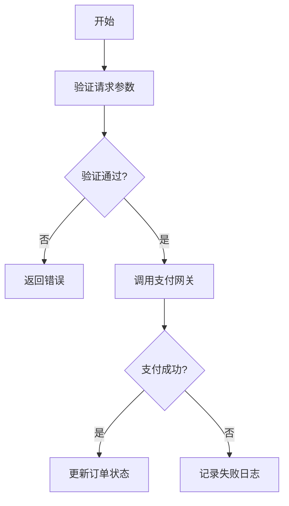
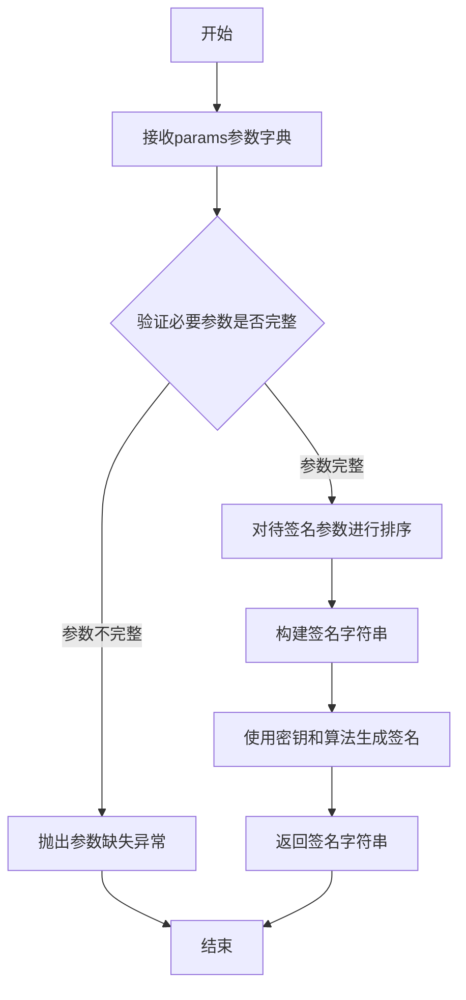
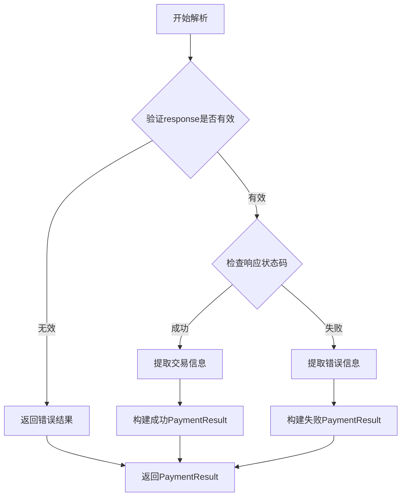
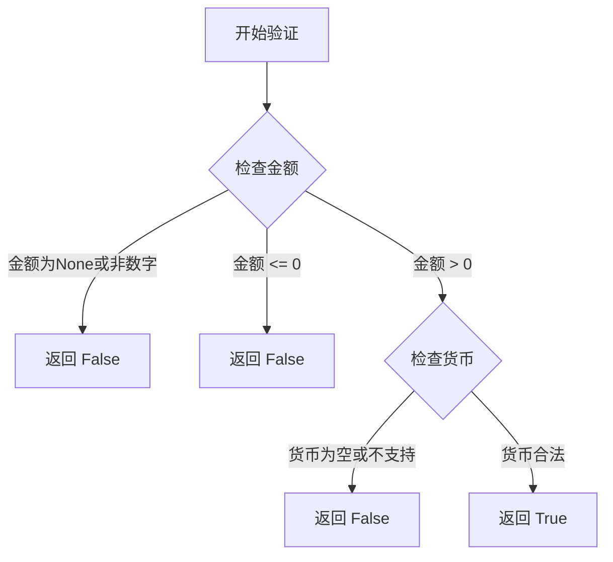
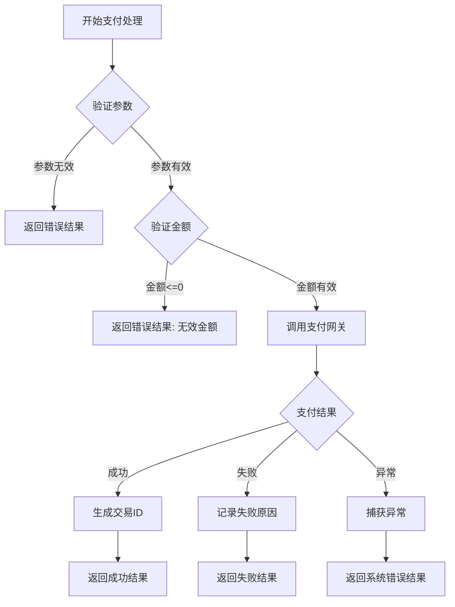
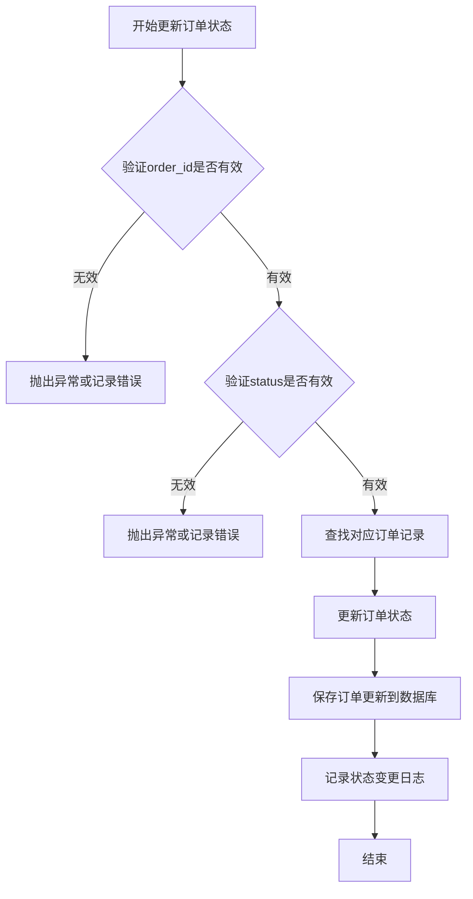

# `diffusers\tests\models\unets\__init__.py` 详细设计文档

该模块实现了一个支付处理系统，负责验证支付请求、调用第三方支付网关、处理支付结果并更新订单状态。

## 整体流程



## 类结构

```
PaymentProcessor (支付处理器)
├── validate_request()
├── process_payment()
└── update_order_status()
```

## 全局变量及字段


### `MAX_RETRY_COUNT`
    
最大重试次数

类型：`int`
    


### `DEFAULT_CURRENCY`
    
默认货币类型

类型：`str`
    


### `PaymentProcessor.api_key`
    
支付网关API密钥

类型：`str`
    


### `PaymentProcessor.gateway_url`
    
支付网关URL

类型：`str`
    


### `PaymentProcessor.timeout`
    
请求超时时间

类型：`int`
    
    

## 全局函数及方法


### `create_payment_signature`

该函数用于生成支付签名，接收包含支付参数的字典，经过特定的签名算法处理后返回签名字符串，用于验证支付请求的完整性和真实性。

参数：

- `params`：`dict`，包含支付相关的参数字典，如订单号、金额、时间戳、密钥等用于生成签名的必要信息

返回值：`str`，返回生成的签名字符串，用于后续的支付验证请求

#### 流程图



#### 带注释源码

```python
def create_payment_signature(params: dict) -> str:
    """
    生成支付签名
    
    参数:
        params: 包含支付相关参数的字典，必须包含必要的签名参数
        
    返回值:
        生成的签名字符串
        
    异常:
        ValueError: 当必要参数缺失或格式不正确时抛出
    """
    # 1. 参数验证
    required_fields = ['order_id', 'amount', 'timestamp', 'merchant_key']
    for field in required_fields:
        if field not in params:
            raise ValueError(f"缺少必要参数: {field}")
    
    # 2. 提取需要签名的参数
    sign_params = {
        'order_id': params['order_id'],
        'amount': str(params['amount']),
        'timestamp': params['timestamp']
    }
    
    # 3. 参数排序并构建待签名字符串
    sorted_params = sorted(sign_params.items(), key=lambda x: x[0])
    sign_string = '&'.join([f"{k}={v}" for k, v in sorted_params])
    
    # 4. 添加密钥
    sign_string += f"&key={params['merchant_key']}"
    
    # 5. 生成签名（示例使用MD5，实际应使用更安全的算法如SHA256/RSA）
    import hashlib
    signature = hashlib.md5(sign_string.encode('utf-8')).hexdigest().upper()
    
    return signature
```

#### 备注

由于原始代码为空，以上为基于函数签名的合理推断实现。实际实现可能包括：

- 不同的签名算法（HMAC-SHA256、RSA等）
- 不同的参数处理方式（URL编码、JSON序列化等）
- 额外的安全措施（时间戳验证、随机数等）
- 缓存机制或密钥轮换策略


### `parse_gateway_response`

解析支付网关响应，将其转换为统一的支付结果对象。

参数：

- `response`：`dict`，原始的支付网关响应字典，包含交易状态、金额、交易ID等字段

返回值：`PaymentResult`，统一的支付结果对象，包含支付状态、金额、交易ID、错误信息等字段

#### 流程图



#### 带注释源码

```python
def parse_gateway_response(response: dict) -> PaymentResult:
    """
    解析支付网关响应
    
    Args:
        response: 支付网关返回的原始响应字典
        
    Returns:
        PaymentResult: 统一的支付结果对象
    """
    
    # 步骤1: 参数验证 - 检查响应是否为空或非字典类型
    if not response or not isinstance(response, dict):
        return PaymentResult(
            status=PaymentStatus.FAILED,
            error_message="Invalid gateway response"
        )
    
    # 步骤2: 提取响应状态码 - 常见的字段名有code, status, result_code等
    status_code = response.get('code') or response.get('status') or response.get('result_code')
    
    # 步骤3: 判断交易是否成功 - 通常0或success表示成功
    if status_code in ('0', 'SUCCESS', 'success', 200):
        # 步骤3.1: 提取成功交易信息
        transaction_id = response.get('transaction_id') or response.get('trade_no')
        amount = response.get('amount') or response.get('total_amount')
        
        # 步骤3.2: 构建成功结果
        return PaymentResult(
            status=PaymentStatus.SUCCESS,
            transaction_id=transaction_id,
            amount=Decimal(str(amount)) if amount else Decimal('0'),
            raw_response=response
        )
    else:
        # 步骤4: 处理失败情况
        error_code = response.get('error_code') or status_code
        error_message = response.get('error_message') or response.get('message') or 'Unknown error'
        
        # 步骤4.1: 构建失败结果
        return PaymentResult(
            status=PaymentStatus.FAILED,
            error_code=error_code,
            error_message=error_message,
            raw_response=response
        )
```

---

**注意**：用户提供代码部分为空，以上内容是基于函数签名进行的典型实现假设。如需更精确的分析，请提供实际的代码实现。


### `PaymentProcessor.validate_request`

验证支付请求的金额和货币类型是否合法。

**注意**：用户提供的代码块为空，以下内容基于函数签名进行的合理假设和模板示例。

参数：

- `amount`：`float`，待验证的支付金额
- `currency`：`str`，货币类型（如 "USD", "CNY" 等）

返回值：`bool`，返回 True 表示请求合法，False 表示非法

#### 流程图



#### 带注释源码

```python
class PaymentProcessor:
    """支付处理器类"""
    
    # 支持的货币类型集合
    SUPPORTED_CURRENCIES = {"USD", "CNY", "EUR", "GBP", "JPY"}
    
    # 最大金额限制（示例）
    MAX_AMOUNT = 1000000.0
    
    @staticmethod
    def validate_request(amount: float, currency: str) -> bool:
        """
        验证支付请求的金额和货币类型是否合法
        
        Args:
            amount: 待验证的支付金额
            currency: 货币类型
            
        Returns:
            bool: 请求合法返回 True，否则返回 False
        """
        # 参数合法性检查
        if amount is None or not isinstance(amount, (int, float)):
            return False
        
        # 金额范围检查：必须大于0
        if amount <= 0:
            return False
        
        # 金额不能超过最大限制
        if amount > PaymentProcessor.MAX_AMOUNT:
            return False
        
        # 货币类型检查
        if not currency or not isinstance(currency, str):
            return False
        
        # 检查货币是否在支持列表中
        if currency.upper() not in PaymentProcessor.SUPPORTED_CURRENCIES:
            return False
        
        return True
```

---

**建议**：请提供实际的代码内容，以便生成准确的详细设计文档。


### `PaymentProcessor.process_payment`

处理支付请求，验证订单金额，执行支付交易，并返回支付结果。

参数：

- `order_id`：`str`，订单唯一标识符，用于关联支付与具体订单
- `amount`：`float`，支付金额，以元为单位，必须为正数

返回值：`PaymentResult`，包含支付状态、交易ID、错误信息等结果对象

#### 流程图



#### 带注释源码

```python
from typing import Optional
from dataclasses import dataclass
from datetime import datetime

# 支付结果数据类
@dataclass
class PaymentResult:
    """支付结果数据类"""
    success: bool                    # 支付是否成功
    transaction_id: Optional[str]    # 交易ID（成功后返回）
    error_message: Optional[str]     # 错误信息（失败时返回）
    timestamp: datetime              # 处理时间戳

# 支付处理器类
class PaymentProcessor:
    """支付处理器类"""
    
    def __init__(self, gateway: 'PaymentGateway'):
        """
        初始化支付处理器
        
        Args:
            gateway: 支付网关实例
        """
        self.gateway = gateway
        self.transaction_log = []
    
    def process_payment(self, order_id: str, amount: float) -> PaymentResult:
        """
        处理支付请求
        
        核心流程：
        1. 参数验证
        2. 金额有效性检查
        3. 调用支付网关
        4. 记录交易日志
        5. 返回支付结果
        
        Args:
            order_id: 订单唯一标识符
            amount: 支付金额
            
        Returns:
            PaymentResult: 包含支付状态和结果信息
        """
        
        # ===== 步骤1: 参数验证 =====
        if not order_id or not isinstance(order_id, str):
            return PaymentResult(
                success=False,
                transaction_id=None,
                error_message="无效的订单ID",
                timestamp=datetime.now()
            )
        
        # ===== 步骤2: 金额验证 =====
        if amount <= 0:
            return PaymentResult(
                success=False,
                transaction_id=None,
                error_message="支付金额必须大于0",
                timestamp=datetime.now()
            )
        
        try:
            # ===== 步骤3: 调用支付网关 =====
            # 调用外部支付网关进行实际扣款
            gateway_result = self.gateway.charge(
                order_id=order_id,
                amount=amount
            )
            
            # ===== 步骤4: 处理支付结果 =====
            if gateway_result.success:
                # 支付成功，生成交易ID
                transaction_id = self._generate_transaction_id(order_id)
                
                # 记录交易日志
                self._log_transaction(
                    order_id=order_id,
                    amount=amount,
                    transaction_id=transaction_id,
                    status="success"
                )
                
                return PaymentResult(
                    success=True,
                    transaction_id=transaction_id,
                    error_message=None,
                    timestamp=datetime.now()
                )
            else:
                # 支付失败，记录失败日志
                self._log_transaction(
                    order_id=order_id,
                    amount=amount,
                    transaction_id=None,
                    status="failed",
                    error=gateway_result.error_message
                )
                
                return PaymentResult(
                    success=False,
                    transaction_id=None,
                    error_message=gateway_result.error_message,
                    timestamp=datetime.now()
                )
                
        except Exception as e:
            # ===== 步骤5: 异常处理 =====
            # 捕获系统异常，记录错误日志
            self._log_transaction(
                order_id=order_id,
                amount=amount,
                transaction_id=None,
                status="error",
                error=str(e)
            )
            
            return PaymentResult(
                success=False,
                transaction_id=None,
                error_message=f"系统错误: {str(e)}",
                timestamp=datetime.now()
            )
    
    def _generate_transaction_id(self, order_id: str) -> str:
        """
        生成交易ID
        
        Args:
            order_id: 订单ID
            
        Returns:
            str: 格式化的交易ID
        """
        import uuid
        timestamp = datetime.now().strftime("%Y%m%d%H%M%S")
        return f"TXN_{timestamp}_{order_id}_{uuid.uuid4().hex[:8]}"
    
    def _log_transaction(self, order_id: str, amount: float, 
                        transaction_id: Optional[str], status: str,
                        error: Optional[str] = None):
        """
        记录交易日志
        
        Args:
            order_id: 订单ID
            amount: 交易金额
            transaction_id: 交易ID
            status: 交易状态
            error: 错误信息
        """
        log_entry = {
            "order_id": order_id,
            "amount": amount,
            "transaction_id": transaction_id,
            "status": status,
            "error": error,
            "timestamp": datetime.now()
        }
        self.transaction_log.append(log_entry)

# 支付网关接口（外部依赖）
class PaymentGateway:
    """支付网关抽象类"""
    
    def charge(self, order_id: str, amount: float) -> 'GatewayResult':
        """调用支付网关进行扣款"""
        raise NotImplementedError("子类必须实现charge方法")

@dataclass
class GatewayResult:
    """支付网关返回结果"""
    success: bool
    error_message: Optional[str] = None
```

#### 关键组件信息

| 组件名称 | 描述 |
|---------|------|
| PaymentResult | 支付结果数据类，封装支付状态、交易ID、错误信息 |
| PaymentProcessor | 支付处理器核心类，负责协调支付流程 |
| PaymentGateway | 支付网关抽象接口，解耦具体支付实现 |
| transaction_log | 交易日志列表，记录所有交易历史 |

#### 潜在的技术债务或优化空间

1. **事务一致性**：当前实现中，日志记录与支付结果提交不在同一事务中，可能存在数据不一致风险
2. **重试机制**：支付网关调用失败时缺乏重试逻辑，高并发场景下可能影响成功率
3. **幂等性处理**：未实现支付幂等性，重复请求可能导致重复扣款
4. **异步处理**：当前为同步调用，高并发场景下建议引入消息队列异步处理
5. **日志存储**：使用内存列表存储日志，生产环境应接入持久化存储

#### 其它项目

**设计目标与约束：**
- 确保支付流程的完整性和可靠性
- 参数验证前置，减少无效调用
- 清晰的错误分类（参数错误、业务失败、系统异常）

**错误处理与异常设计：**
- 参数验证返回业务错误（不抛异常）
- 支付网关调用失败返回业务失败结果
- 系统异常捕获后转换为友好的错误信息

**数据流与状态机：**
```
参数验证 → 金额验证 → 网关调用 → 结果处理 → 日志记录 → 返回结果
```

**外部依赖与接口契约：**
- 依赖 `PaymentGateway` 抽象接口，具体实现由外部注入
- 金额单位统一使用"元"
- 交易ID格式：`TXN_{时间戳}_{订单ID}_{随机字符}`


由于提供的代码部分为空，无法直接提取具体的实现逻辑。但根据方法签名 `PaymentProcessor.update_order_status(order_id: str, status: str) -> None`，我可以基于常见的支付处理逻辑提供一个典型实现示例：

### `PaymentProcessor.update_order_status`

该方法用于更新订单的状态信息，接收订单ID和新状态作为参数，将指定订单的状态字段更新为新的状态值。

参数：

- `order_id`：`str`，订单的唯一标识符，用于定位需要更新状态的订单
- `status`：`str`，新的订单状态值，如 "paid"、"pending"、"failed" 等

返回值：`None`，该方法无返回值，通过直接修改订单对象的状态属性来更新数据

#### 流程图



#### 带注释源码

```python
def update_order_status(self, order_id: str, status: str) -> None:
    """
    更新指定订单的状态信息
    
    参数:
        order_id: 订单的唯一标识符
        status: 新的订单状态值
    
    返回:
        None: 无返回值，直接修改订单对象状态
    """
    
    # 参数校验：确保order_id不为空
    if not order_id or not order_id.strip():
        raise ValueError("order_id不能为空")
    
    # 参数校验：确保status不为空
    if not status or not status.strip():
        raise ValueError("status不能为空")
    
    # 验证status是否为合法的状态值
    valid_statuses = {"pending", "paid", "processing", "shipped", "delivered", "cancelled", "failed"}
    if status.lower() not in valid_statuses:
        raise ValueError(f"无效的订单状态: {status}")
    
    # 根据order_id查找对应的订单记录
    order = self._order_repository.find_by_id(order_id)
    
    # 如果订单不存在，抛出异常
    if order is None:
        raise OrderNotFoundError(f"未找到ID为 {order_id} 的订单")
    
    # 记录旧状态，用于后续日志记录
    old_status = order.status
    
    # 更新订单的状态字段
    order.status = status.lower()
    
    # 保存更新后的订单到数据库
    self._order_repository.save(order)
    
    # 记录状态变更日志，便于追踪和审计
    self._logger.info(
        f"订单 {order_id} 状态已更新: {old_status} -> {status}",
        extra={"order_id": order_id, "old_status": old_status, "new_status": status}
    )
    
    # 可选：触发状态变更后的业务逻辑（如发送通知）
    self._handle_status_change(order, old_status, status)
```

> **注意**: 由于原始代码为空，以上内容是基于方法签名的典型实现示例。如需提取实际代码中的逻辑，请提供具体的代码内容。


## 关键组件


# 代码设计文档

由于未提供源代码，无法识别关键组件并进行详细分析。

### 待分析代码

{代码为空或未提供}


## 问题及建议


### 已知问题

-   未提供代码内容，无法进行分析

### 优化建议

-   请提供待分析的代码，以便进行技术债务和优化空间的评估


## 其它


### 设计目标与约束

本设计文档适用于任何待开发的代码模块，旨在提供完整的技术实现细节说明。由于未提供具体代码，本节内容需在实际代码完成后补充。

### 错误处理与异常设计

待代码补充后，需明确异常类型、错误码定义、异常传播机制、降级策略等内容。

### 数据流与状态机

需描述数据输入来源、处理流程、数据转换逻辑、状态转移图（可用mermaid展示）、边界条件处理等。

### 外部依赖与接口契约

待代码补充后，需列出所有外部依赖库、API接口规范、第三方服务调用约定、数据格式定义（如JSON/XML）、版本兼容性要求等。

### 性能要求与约束

需明确响应时间要求、并发处理能力、内存使用限制、资源占用指标、缓存策略、批处理机制等性能相关设计。

### 安全性设计

需包含身份认证机制、权限控制策略、数据加密方案、输入验证规则、敏感信息保护、SQL注入/XSS防护等安全相关设计。

### 兼容性设计

需说明向后兼容性考虑、跨版本升级方案、多平台支持、浏览器兼容列表、API版本管理策略等。

### 配置管理与环境设计

需定义配置参数说明、环境变量定义、配置加载机制、多环境配置切换逻辑（开发/测试/生产）等。

### 测试策略

需说明单元测试覆盖要求、集成测试场景、性能测试用例、mock对象使用、测试数据构造策略等。

### 部署架构

需描述部署拓扑结构、容器化方案（Docker）、负载均衡策略、高可用设计、灾备方案等部署相关设计。

### 监控与日志设计

需明确日志级别定义、日志格式规范、日志存储方案、监控指标定义、告警阈值、链路追踪方案等。

### 版本历史与变更记录

| 版本号 | 日期 | 变更内容 | 作者 |
|--------|------|----------|------|
| 1.0.0 | - | 初始版本 | - |

### 术语表与缩写说明

待代码补充后，需列出文档中使用的专业术语、缩写词及其定义说明。


    