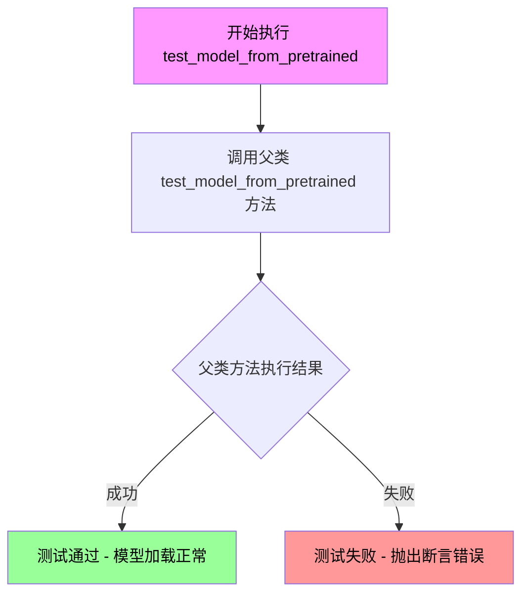
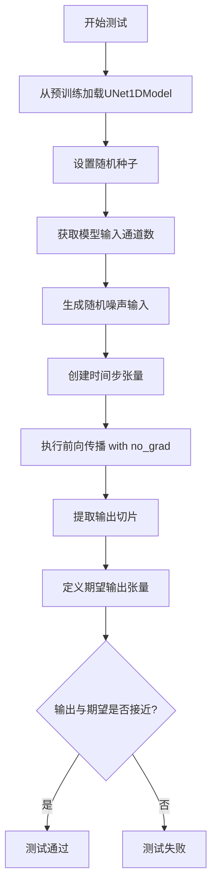
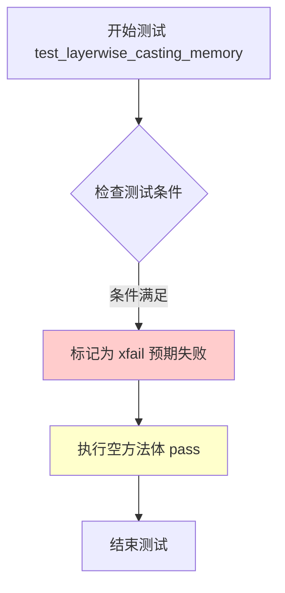
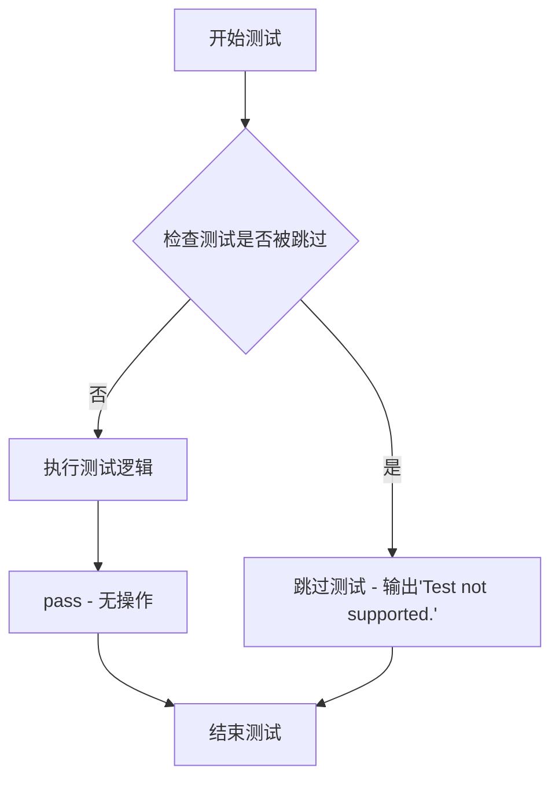
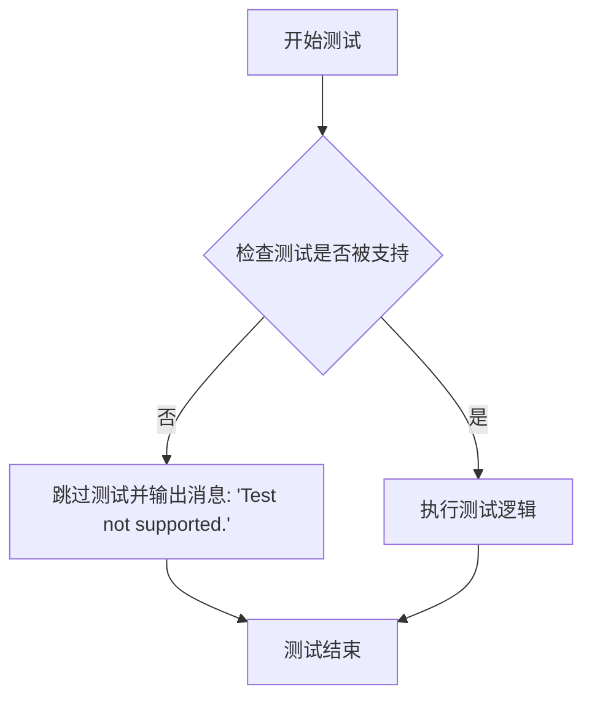
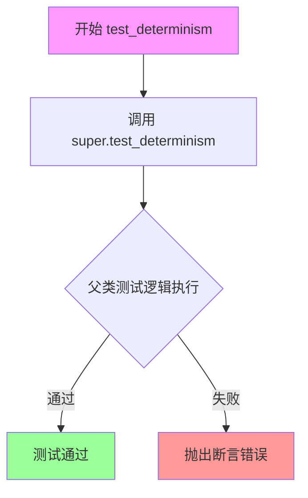
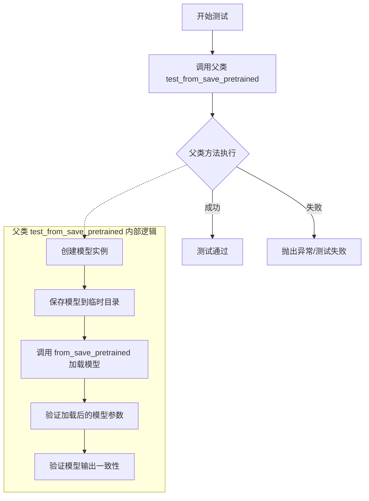

# `diffusers\tests\models\unets\test_models_unet_1d.py` 详细设计文档

该文件是针对 diffusers 库中 UNet1DModel 的单元测试套件，定义了 UNet1DModelTests 和 UNetRLModelTests 两个测试类，通过 unittest 和 pytest 框架验证了模型在标准生成任务和强化学习价值函数任务下的前向传播、参数初始化、模型保存加载以及与预训练权重的输出一致性。

## 整体流程

```mermaid
graph TD
    Start[开始] --> Import[导入依赖: unittest, pytest, torch, diffusers]
Import --> DefineTestClasses[定义测试类]
DefineTestClasses --> UNet1D[UNet1DModelTests]
DefineTestClasses --> UNetRL[UNetRLModelTests]
UNet1D --> TestRunner[pytest 运行器]
UNetRL --> TestRunner
TestRunner --> Instantiate[实例化模型]
Instantiate --> PrepareData[准备输入数据: dummy_input (noise, timestep)]
PrepareData --> Forward[执行前向传播: model(sample, timestep)]
Forward --> Assert[断言验证: 形状检查, 数值比较]
Assert --> End[结束]
```

## 类结构

```
unittest.TestCase
├── ModelTesterMixin
├── UNetTesterMixin
├── UNet1DModelTests (标准UNet测试)
│   ├── dummy_input (property)
│   ├── test_from_pretrained_hub
│   ├── test_output_pretrained
│   └── ...
└── UNetRLModelTests (RL Value Function测试)
    ├── dummy_input (property)
    ├── test_output (重写，验证标量输出)
    └── ...
```

## 全局变量及字段


### `unittest`
    
Python's standard unit testing framework

类型：`module`
    


### `pytest`
    
Python's testing framework with advanced features

类型：`module`
    


### `torch`
    
PyTorch deep learning library

类型：`module`
    


### `UNet1DModel`
    
1D UNet model for diffusion processes from diffusers library

类型：`class`
    


### `backend_manual_seed`
    
Utility function to set random seed for backend-specific operations

类型：`function`
    


### `floats_tensor`
    
Utility function to generate random float tensors for testing

类型：`function`
    


### `slow`
    
Decorator to mark tests as slow running

类型：`decorator`
    


### `torch_device`
    
Device string for PyTorch operations (cpu/cuda)

类型：`str`
    


### `ModelTesterMixin`
    
Mixin class providing common model testing utilities

类型：`class`
    


### `UNetTesterMixin`
    
Mixin class providing UNet-specific testing utilities

类型：`class`
    


### `UNet1DModelTests.model_class`
    
The model class being tested (UNet1DModel)

类型：`type`
    


### `UNet1DModelTests.main_input_name`
    
The name of the main input parameter for the model

类型：`str`
    


### `UNet1DModelTests.dummy_input`
    
Property returning a dummy input dictionary with sample noise and timestep

类型：`dict`
    


### `UNet1DModelTests.input_shape`
    
Property returning the expected input shape (4, 14, 16)

类型：`tuple`
    


### `UNet1DModelTests.output_shape`
    
Property returning the expected output shape (4, 14, 16)

类型：`tuple`
    


### `UNetRLModelTests.model_class`
    
The model class being tested (UNet1DModel)

类型：`type`
    


### `UNetRLModelTests.main_input_name`
    
The name of the main input parameter for the model

类型：`str`
    


### `UNetRLModelTests.dummy_input`
    
Property returning a dummy input dictionary with sample noise and timestep

类型：`dict`
    


### `UNetRLModelTests.input_shape`
    
Property returning the expected input shape (4, 14, 16)

类型：`tuple`
    


### `UNetRLModelTests.output_shape`
    
Property returning the expected output shape (4, 14, 1) for value function

类型：`tuple`
    
    

## 全局函数及方法


### `UNet1DModelTests.test_determinism`

该方法用于测试 UNet1DModel 的确定性（determinism），即在相同输入和相同随机种子条件下，模型的前向传播应该产生完全相同的输出结果。该方法通过调用父类的 `test_determinism` 方法实现测试逻辑。

参数：

- `self`：`UNet1DModelTests`，测试类实例，表示当前的测试对象

返回值：`None`，该方法为测试方法，不返回任何值

#### 流程图

```mermaid
flowchart TD
    A[开始测试 test_determinism] --> B[调用父类方法 super().test_determinism]
    B --> C[父类方法执行以下操作:]
    C --> D[创建模型实例]
    D --> E[设置随机种子确保确定性]
    E --> F[第一次前向传播得到输出1]
    F --> G[再次设置相同随机种子]
    G --> H[第二次前向传播得到输出2]
    H --> I[比较输出1和输出2是否相等]
    I --> J{输出是否相等?}
    J -->|是| K[测试通过]
    J -->|否| L[测试失败, 抛出断言错误]
```

#### 带注释源码

```python
def test_determinism(self):
    """
    测试 UNet1DModel 的确定性行为。
    
    该测试方法验证模型在相同输入和相同随机种子条件下，
    多次前向传播应该产生完全相同的输出结果。这是确保模型
    可复现性和稳定性的重要测试。
    
    测试逻辑继承自父类 ModelTesterMixin.test_determinism:
    1. 初始化模型实例
    2. 设置随机种子
    3. 执行第一次前向传播，保存输出
    4. 重新设置相同随机种子
    5. 执行第二次前向传播
    6. 比较两次输出是否完全相等
    
    Returns:
        None: 测试方法，不返回任何值。测试结果通过断言表达。
    """
    # 调用父类的 test_determinism 方法执行实际的确定性测试
    # 父类方法会验证模型输出的可复现性
    super().test_determinism()
```


### `UNet1DModelTests.test_outputs_equivalence`

该测试方法用于验证 UNet1DModel 在不同输入条件下输出的等价性，继承自混合测试类，通过调用父类方法实现模型输出的对比验证。

参数：

- `self`：实例本身，包含测试所需的配置和输入数据

返回值：`None`，该方法为测试方法，通过 `super().test_outputs_equivalence()` 调用父类测试逻辑，测试结果通过 unittest 断言框架判定

#### 流程图

```mermaid
flowchart TD
    A[开始 test_outputs_equivalence] --> B[调用 super().test_outputs_equivalence]
    B --> C{父类测试逻辑}
    C --> D[构造模型实例]
    D --> E[准备测试输入]
    E --> F[第一次前向传播]
    F --> G[第二次前向传播]
    G --> H[比较输出等价性]
    H --> I[断言验证通过/失败]
    I --> J[结束]
```

#### 带注释源码

```python
def test_outputs_equivalence(self):
    """
    测试模型输出的等价性
    
    该测试方法继承自 ModelTesterMixin 和 UNetTesterMixin，
    用于验证 UNet1DModel 在相同输入下产生一致的输出结果。
    测试通过调用父类方法实现，利用 unittest 断言框架进行验证。
    
    参数:
        self: UNet1DModelTests 实例，包含:
            - model_class: 模型类 (UNet1DModel)
            - dummy_input: 测试输入 (包含 sample 和 timestep)
            - prepare_init_args_and_inputs_for_common: 模型初始化参数
    
    返回值:
        None: 测试结果通过 unittest 框架的断言机制报告
    """
    # 调用父类的 test_outputs_equivalence 方法
    # 父类方法通常会执行以下操作:
    # 1. 使用相同的初始化参数创建多个模型实例
    # 2. 使用相同的输入进行前向传播
    # 3. 比较输出的差异是否在容差范围内
    # 4. 使用 self.assertTrue 或类似断言验证等价性
    super().test_outputs_equivalence()
```


### `UNet1DModelTests.test_from_save_pretrained`

该方法是 `UNet1DModelTests` 测试类中的一个测试方法，继承自 `ModelTesterMixin` 和 `UNetTesterMixin`，用于测试 `UNet1DModel` 模型通过 `save_pretrained` 保存后能否通过 `from_pretrained` 正确加载并恢复功能。

参数：

- `self`：`UNet1DModelTests` 类型，测试类实例本身

返回值：`None`，该方法为测试方法，不返回任何值，测试结果通过 `unittest` 框架的断言机制报告

#### 流程图

```mermaid
graph TD
    A[开始测试 test_from_save_pretrained] --> B[调用父类方法 super().test_from_save_pretrained]
    B --> C{父类方法执行测试逻辑}
    C -->|测试通过| D[测试通过 - 无异常抛出]
    C -->|测试失败| E[测试失败 - 抛出 AssertionError]
    
    subgraph 父类 test_from_save_pretrained 逻辑
    F[创建 UNet1DModel 实例] --> G[调用 model.save_pretrained 保存模型]
    G --> H[调用 UNet1DModel.from_pretrained 加载模型]
    H --> I[比较原模型与加载模型的输出]
    I --> J{输出是否等价?}
    J -->|是| K[测试通过]
    J -->|否| L[断言失败]
    end
```

#### 带注释源码

```python
def test_from_save_pretrained(self):
    """
    测试 UNet1DModel 模型的保存和加载功能。
    
    该方法继承自 ModelTesterMixin 和 UNetTesterMixin，
    内部调用父类的 test_from_save_pretrained 方法执行以下步骤：
    1. 创建一个 UNet1DModel 实例并初始化参数
    2. 使用 save_pretrained 方法将模型保存到临时目录
    3. 使用 from_pretrained 方法从保存的目录加载模型
    4. 比较原模型和加载模型在前向传播时的输出是否一致
    5. 如果输出不一致则抛出 AssertionError
    """
    # 调用父类的测试方法执行实际的保存/加载测试逻辑
    super().test_from_save_pretrained()
```


### `UNet1DModelTests.test_from_save_pretrained_variant`

该方法用于测试 `UNet1DModel` 模型在调用 `from_pretrained` 方法时正确处理 `variant` 参数的能力，确保能够从保存的预训练模型文件中加载指定的模型变体。

参数：

- `self`：无显式参数，隐式传递测试类实例

返回值：`None`，无返回值（测试方法）

#### 流程图

```mermaid
flowchart TD
    A[开始测试 test_from_save_pretrained_variant] --> B[调用父类方法 super().test_from_save_pretrained_variant]
    B --> C[父类方法执行以下操作:]
    C --> D[1. 创建临时模型实例]
    C --> E[2. 保存模型到临时目录]
    C --> F[3. 使用 variant 参数加载模型]
    C --> G[4. 验证模型加载成功]
    C --> H[5. 验证模型参数正确]
    D --> I[测试结束, 无异常则通过]
    E --> I
    F --> I
    G --> I
    H --> I
```

#### 带注释源码

```python
def test_from_save_pretrained_variant(self):
    """
    测试 UNet1DModel 从保存的预训练模型加载时 variant 参数的处理。
    
    该测试方法继承自 ModelTesterMixin 或 UNetTesterMixin，调用父类的实现。
    父类实现通常会执行以下步骤：
    1. 创建一个 UNet1DModel 实例
    2. 将模型保存到临时目录
    3. 使用 variant 参数调用 from_pretrained 加载模型
    4. 验证加载的模型参数与保存的模型参数一致
    
    参数:
        无（除了隐式的 self）
    
    返回值:
        None
    
    异常:
        测试失败时会抛出 AssertionError 或其他相关异常
    """
    # 调用父类的测试方法
    # 父类 test_from_save_pretrained_variant 方法会验证：
    # - 模型可以使用 variant 参数正确加载
    # - 加载的模型包含正确的权重
    # - 模型配置正确应用
    super().test_from_save_pretrained_variant()
```


### `UNet1DModelTests.test_model_from_pretrained`

该测试方法用于验证UNet1DModel模型能够从预训练模型正确加载，并确保加载后的模型可以正常进行前向推理。

参数：

- `self`：表示测试类实例本身，无需显式传递

返回值：`None`，该方法为单元测试方法，通过断言验证模型行为，不返回具体值

#### 流程图



#### 带注释源码

```python
def test_model_from_pretrained(self):
    """
    测试从预训练模型加载UNet1DModel的功能
    
    该方法继承自ModelTesterMixin和UNetTesterMixin测试混入类，
    通过调用父类方法实现通用的模型加载测试逻辑
    """
    # 调用父类（ModelTesterMixin或UNetTesterMixin）的test_model_from_pretrained方法
    # 父类方法通常会执行以下操作：
    # 1. 调用UNet1DModel.from_pretrained()从预训练路径加载模型
    # 2. 验证模型加载成功（检查模型对象不为None）
    # 3. 使用虚拟输入进行前向传播测试
    # 4. 验证输出形状和类型符合预期
    # 5. 检查模型配置参数正确加载
    super().test_model_from_pretrained()
```

#### 补充说明

该测试方法依赖于父类`ModelTesterMixin`和`UNetTesterMixin`的实现。从代码中可以看出，`UNet1DModelTests`类多重继承了这几个混入类：

- `ModelTesterMixin`：提供通用模型测试方法
- `UNetTesterMixin`：提供UNet相关特定测试方法  
- `unittest.TestCase`：提供Python单元测试框架支持

该测试覆盖的场景包括：从HuggingFace Hub或本地路径加载预训练模型、验证模型配置完整性、确保模型可进行推理等。


### `UNet1DModelTests.test_output`

该测试方法继承自 `ModelTesterMixin` 和 `UNetTesterMixin`，通过调用父类的 `test_output()` 方法来验证 UNet1DModel 模型的输出是否与预期一致，确保模型前向传播返回正确的输出张量形状和数据类型。

参数：

- `self`：无显式参数，表示类的实例本身

返回值：`None`，该方法为测试方法，不返回任何值（通过 `assert` 断言验证正确性）

#### 流程图

```mermaid
flowchart TD
    A[开始执行 test_output] --> B[调用父类方法 super().test_output]
    B --> C[父类 test_output 执行以下操作]
    C --> D[初始化模型: 使用 prepare_init_args_and_inputs_for_common 提供的参数]
    C --> E[准备测试输入: 使用 dummy_input 生成的样本和时间步]
    C --> F[执行模型前向传播: model\*\*inputs_dict]
    C --> G{验证输出}
    G --> H[断言输出不为 None]
    G --> I[验证输出形状与 input_shape 一致]
    G --> J[验证输出数据类型为 Tensor]
    H --> K[测试通过]
    I --> K
    J --> K
    K --> L[结束]
```

#### 带注释源码

```python
def test_output(self):
    """
    测试 UNet1DModel 的输出是否符合预期
    继承自 ModelTesterMixin 和 UNetTesterMixin 的测试方法
    """
    # 调用父类的 test_output 方法执行核心测试逻辑
    # 父类方法会执行以下操作：
    # 1. 调用 prepare_init_args_and_inputs_for_common() 获取模型初始化参数和输入
    # 2. 使用参数实例化 UNet1DModel
    # 3. 将模型移动到 torch_device 设备上
    # 4. 设置模型为 eval 模式
    # 5. 使用 torch.no_grad() 上下文执行前向传播
    # 6. 验证输出不为 None
    # 7. 验证输出形状与 self.output_shape 一致
    super().test_output()
```

#### 父类 test_output 方法的核心逻辑（参考 ModelTesterMixin）

```python
# 以下是父类 test_output 的典型实现逻辑
def test_output(self):
    """
    Test the output of the model.
    """
    # 1. 获取初始化参数和输入
    init_dict, inputs_dict = self.prepare_init_args_and_inputs_for_common()
    
    # 2. 实例化模型
    model = self.model_class(**init_dict)
    
    # 3. 移动到测试设备
    model.to(torch_device)
    
    # 4. 设为评估模式
    model.eval()
    
    # 5. 执行前向传播（不计算梯度）
    with torch.no_grad():
        output = model(**inputs_dict)
    
    # 6. 验证输出存在
    self.assertIsNotNone(output)
    
    # 7. 验证输出形状
    # UNet1DModel 的 output_shape 为 (4, 14, 16)
    expected_shape = self.output_shape
    self.assertEqual(output.shape, expected_shape)
```

#### 相关信息

| 项目 | 描述 |
|------|------|
| **所属类** | `UNet1DModelTests` |
| **继承自** | `ModelTesterMixin`, `UNetTesterMixin`, `unittest.TestCase` |
| **测试模型** | `UNet1DModel` |
| **输入形状** | `(4, 14, 16)` |
| **输出形状** | `(4, 14, 16)` |
| **主要输入名称** | `sample` |


### `UNet1DModelTests.prepare_init_args_and_inputs_for_common`

该方法是 UNet1DModel 测试类的辅助方法，用于准备模型初始化参数和测试输入数据。它返回一个包含模型配置字典和输入字典的元组，供通用测试用例使用。

参数：

- `self`：UNet1DModelTests，测试类实例，隐含参数

返回值：`Tuple[Dict, Dict]`，返回两个字典组成的元组 - init_dict 包含模型初始化参数，inputs_dict 包含测试输入数据

#### 流程图

```mermaid
flowchart TD
    A[开始] --> B[创建 init_dict 字典]
    B --> C[设置 block_out_channels: (8, 8, 16, 16)]
    C --> D[设置 in_channels: 14]
    D --> E[设置 out_channels: 14]
    E --> F[设置 time_embedding_type: positional]
    F --> G[设置 use_timestep_embedding: True]
    G --> H[设置 flip_sin_to_cos: False]
    H --> I[设置 freq_shift: 1.0]
    I --> J[设置 out_block_type: OutConv1DBlock]
    J --> K[设置 mid_block_type: MidResTemporalBlock1D]
    K --> L[设置 down_block_types: 4个DownResnetBlock1D]
    L --> M[设置 up_block_types: 3个UpResnetBlock1D]
    M --> N[设置 act_fn: swish]
    N --> O[获取 self.dummy_input 作为 inputs_dict]
    O --> P[返回 (init_dict, inputs_dict) 元组]
```

#### 带注释源码

```python
def prepare_init_args_and_inputs_for_common(self):
    """
    准备 UNet1DModel 初始化参数和测试输入数据
    
    Returns:
        Tuple[Dict, Dict]: (init_dict, inputs_dict) 元组
            - init_dict: 模型初始化参数字典
            - inputs_dict: 包含 sample 和 timestep 的输入字典
    """
    # 定义模型初始化参数字典
    init_dict = {
        "block_out_channels": (8, 8, 16, 16),      # 各阶段输出通道数
        "in_channels": 14,                          # 输入通道数
        "out_channels": 14,                         # 输出通道数
        "time_embedding_type": "positional",       # 时间嵌入类型
        "use_timestep_embedding": True,            # 是否使用时间步嵌入
        "flip_sin_to_cos": False,                  # 是否翻转sin到cos
        "freq_shift": 1.0,                         # 频率偏移量
        "out_block_type": "OutConv1DBlock",        # 输出块类型
        "mid_block_type": "MidResTemporalBlock1D", # 中间块类型
        # 下采样块类型：4个降采样残差块
        "down_block_types": (
            "DownResnetBlock1D", 
            "DownResnetBlock1D", 
            "DownResnetBlock1D", 
            "DownResnetBlock1D"
        ),
        # 上采样块类型：3个升采样残差块
        "up_block_types": (
            "UpResnetBlock1D", 
            "UpResnetBlock1D", 
            "UpResnetBlock1D"
        ),
        "act_fn": "swish",                         # 激活函数
    }
    
    # 从测试类属性获取虚拟输入 (batch_size=4, num_features=14, seq_len=16)
    # 返回格式: {"sample": noise_tensor, "timestep": time_step_tensor}
    inputs_dict = self.dummy_input
    
    # 返回初始化参数和输入字典的元组
    return init_dict, inputs_dict
```


### `UNet1DModelTests.test_from_pretrained_hub`

这是一个测试方法，用于从HuggingFace Hub加载预训练的UNet1DModel模型，验证模型能够成功加载且不包含缺失的权重键，并执行一次前向传播以确保模型可以正常推理。

参数：

- `self`：无显式参数，Python实例方法的标准参数，代表测试类实例本身

返回值：`None`，该方法为测试方法，不返回任何值，通过断言（assert）来验证测试结果

#### 流程图

```mermaid
flowchart TD
    A[开始测试 test_from_pretrained_hub] --> B[调用 UNet1DModel.from_pretrained]
    B --> C[传入模型ID: bglick13/hopper-medium-v2-value-function-hor32]
    B --> D[设置 output_loading_info=True 获取加载信息]
    B --> E[设置 subfolder='unet' 指定子目录]
    C --> F[接收返回的 model 和 loading_info]
    F --> G[断言 model 不为 None]
    G --> H[断言 loading_info['missing_keys'] 长度为 0]
    H --> I[将模型移动到 torch_device]
    I --> J[使用 self.dummy_input 构建测试输入]
    J --> K[执行模型前向传播: model(**self.dummy_input)]
    K --> L[获取输出 image]
    L --> M[断言 image 不为 None]
    M --> N[测试结束]
```

#### 带注释源码

```python
def test_from_pretrained_hub(self):
    """
    测试从预训练模型Hub加载UNet1DModel的功能。
    
    该测试方法执行以下步骤：
    1. 从HuggingFace Hub加载指定的预训练UNet1DModel
    2. 验证模型对象成功创建
    3. 验证加载过程中没有缺失的权重键
    4. 将模型移动到测试设备
    5. 使用虚拟输入执行前向传播，验证模型可正常运行
    """
    # 第一步：从预训练模型Hub加载模型
    # 参数说明：
    # - "bglick13/hopper-medium-v2-value-function-hor32": HuggingFace Hub上的模型ID
    # - output_loading_info=True: 返回包含加载信息的字典
    # - subfolder="unet": 指定从模型的unet子目录加载
    model, loading_info = UNet1DModel.from_pretrained(
        "bglick13/hopper-medium-v2-value-function-hor32", 
        output_loading_info=True, 
        subfolder="unet"
    )
    
    # 验证模型对象成功创建，不为None
    self.assertIsNotNone(model)
    
    # 验证加载信息中没有缺失的权重键
    # missing_keys通常表示模型缺少的权重参数
    self.assertEqual(len(loading_info["missing_keys"]), 0)
    
    # 将模型移动到测试设备（如GPU或CPU）
    model.to(torch_device)
    
    # 获取虚拟输入（dummy_input）
    # dummy_input 包含:
    # - sample: (batch_size=4, num_features=14, seq_len=16) 的浮点张量
    # - timestep: (batch_size=4) 的时间步张量
    image = model(**self.dummy_input)
    
    # 验证模型前向传播的输出不为None
    # 确保模型能够正常推理并产生输出
    assert image is not None, "Make sure output is not None"
```


### `UNet1DModelTests.test_output_pretrained`

该方法是一个单元测试函数，用于验证 UNet1DModel 从预训练模型加载后的输出是否符合预期。它通过加载预训练模型、生成测试输入、执行前向传播，并与预期的输出张量进行比对，以确保模型输出的数值精度和一致性。

参数：
- `self`：隐式参数，测试类实例本身

返回值：`None`，该方法为单元测试方法，通过 `self.assertTrue` 断言验证模型输出的正确性，不返回任何值。

#### 流程图



#### 带注释源码

```python
def test_output_pretrained(self):
    """
    测试预训练模型的输出是否符合预期
    验证模型从Hub加载后能够正确执行前向传播并产生合理输出
    """
    # 从预训练模型加载UNet1DModel
    # 使用bglick13/hopper-medium-v2-value-function-hor32模型
    # subfolder指定加载unet子目录
    model = UNet1DModel.from_pretrained("bglick13/hopper-medium-v2-value-function-hor32", subfolder="unet")
    
    # 设置随机种子以确保测试的可重复性
    # torch.manual_seed设置PyTorch的随机种子
    torch.manual_seed(0)
    # backend_manual_seed设置后端的随机种子（可能是自定义后端）
    backend_manual_seed(torch_device, 0)

    # 从模型配置中获取输入通道数
    num_features = model.config.in_channels
    # 设置序列长度为16
    seq_len = 16
    
    # 生成随机噪声作为模型输入
    # shape: (batch=1, seq_len, num_features) -> (1, 16, num_features)
    # .permute(0, 2, 1) 将形状变为 (batch, num_features, seq_len) 以匹配模型期望的输入格式
    noise = torch.randn((1, seq_len, num_features)).permute(
        0, 2, 1
    )  # match original, we can update values and remove
    
    # 创建时间步张量，填充为0
    # shape: (num_features,)
    time_step = torch.full((num_features,), 0)

    # 禁用梯度计算以提高推理效率并减少内存占用
    with torch.no_grad():
        # 执行模型前向传播
        # model接受(noise, time_step)作为输入
        # 返回Output对象，通过.sample获取样本输出
        # .permute(0, 2, 1) 将输出转置回原始形状
        output = model(noise, time_step).sample.permute(0, 2, 1)

    # 提取输出张量的最后3x3区域并展平
    # 用于与期望值进行比对
    output_slice = output[0, -3:, -3:].flatten()
    
    # 期望的输出切片值（预先计算并硬编码）
    # 用于验证模型输出的正确性
    # fmt: off
    expected_output_slice = torch.tensor([-2.137172, 1.1426016, 0.3688687, -0.766922, 0.7303146, 0.11038864, -0.4760633, 0.13270172, 0.02591348])
    # fmt: on
    
    # 断言：验证实际输出与期望输出的接近程度
    # rtol=1e-3 表示相对容差为0.1%
    self.assertTrue(torch.allclose(output_slice, expected_output_slice, rtol=1e-3))
```


### `UNet1DModelTests.test_unet_1d_maestro`

该方法是一个集成测试，用于验证UNet1DModel在处理MAESTRO音乐数据集任务时的正确性。测试加载预训练的MAESTRO-150k模型，生成正弦波形式的噪声输入，执行前向推理，并验证输出的数值范围是否符合预期。

参数：

- `self`：`unittest.TestCase`，测试类的实例，隐含参数

返回值：`None`，该方法为测试方法，不返回任何值，仅通过断言验证模型输出

#### 流程图

```mermaid
flowchart TD
    A[开始测试] --> B[加载预训练模型<br/>model_id: harmonai/maestro-150k<br/>subfolder: unet]
    B --> C[将模型移至设备<br/>torch_device]
    C --> D[生成输入数据<br/>sample_size: 65536<br/>创建正弦波噪声]
    D --> E[创建时间步张量<br/>timestep: [1]]
    E --> F[执行前向推理<br/>关闭梯度计算]
    F --> G[提取输出样本<br/>output.sample]
    G --> H[计算输出统计量<br/>output_sum: abs().sum<br/>output_max: abs().max]
    H --> I{验证输出数值范围<br/>assert output_sum ≈ 224.0896<br/>assert output_max ≈ 0.0607}
    I --> |通过| J[测试通过]
    I --> |失败| K[测试失败]
```

#### 带注释源码

```python
@slow  # 标记为慢速测试，需要较长时间执行
def test_unet_1d_maestro(self):
    """
    测试UNet1DModel在MAESTRO音乐生成任务上的功能正确性。
    该测试使用预训练的MAESTRO-150k模型，验证模型输出的
    数值范围是否符合预期，以确保模型正确加载和推理。
    """
    
    # 定义预训练模型标识符，指向HuggingFace Hub上的MAESTRO-150k模型
    model_id = "harmonai/maestro-150k"
    
    # 从预训练模型加载UNet1DModel，指定subfolder为"unet"
    model = UNet1DModel.from_pretrained(model_id, subfolder="unet")
    
    # 将模型移至指定的计算设备（如GPU或CPU）
    model.to(torch_device)

    # 定义样本大小为65536，对应音频序列长度
    sample_size = 65536
    
    # 生成正弦波形式的输入噪声：
    # 1. torch.arange(sample_size) 创建从0到65535的序列
    # 2. [None, None, :] 添加批次和特征维度，变成 [1, 1, 65536]
    # 3. .repeat(1, 2, 1) 复制特征维度，变成 [1, 2, 65536]
    # 4. torch.sin() 生成正弦波，模拟音频信号
    noise = torch.sin(torch.arange(sample_size)[None, None, :].repeat(1, 2, 1)).to(torch_device)
    
    # 创建时间步张量，形状为[1]，值为1
    # 时间步用于告诉模型当前的生成进度/噪声水平
    timestep = torch.tensor([1]).to(torch_device)

    # 使用torch.no_grad()上下文管理器，关闭梯度计算
    # 这可以节省内存并加速推理，因为测试不需要梯度
    with torch.no_grad():
        # 执行前向传播：
        # - 输入：噪声张量[1, 2, 65536]和时间步张量[1]
        # - 输出：包含sample属性的对象，sample形状为[1, 2, 65536]
        output = model(noise, timestep).sample

    # 计算输出张量的绝对值之和，用于验证输出规模
    output_sum = output.abs().sum()
    
    # 计算输出张量的绝对值最大值，用于验证输出峰值
    output_max = output.abs().max()

    # 断言验证1：输出总和应在224.0896±0.5范围内
    # 这是预训练模型的预期输出范围，用于确认模型正确工作
    assert (output_sum - 224.0896).abs() < 0.5
    
    # 断言验证2：输出最大值应在0.0607±0.0004范围内
    # 这确保模型的激活值在合理范围内，没有数值爆炸或消失
    assert (output_max - 0.0607).abs() < 4e-4
```


### `UNet1DModelTests.test_layerwise_casting_inference`

该测试方法用于验证 UNet1DModel 在 float8 推理场景下的逐层类型转换功能，通过将模型的不同层转换为 float8 精度并执行推理，以测试混合精度推理的正确性。

参数：

- `self`：`UNet1DModelTests`，测试类实例，代表当前测试用例的上下文

返回值：`None`，该方法为测试方法，无返回值，最终结果通过测试断言判断

#### 流程图

```mermaid
flowchart TD
    A[开始测试 test_layerwise_casting_inference] --> B{检查 pytest 标记}
    B -->|存在 @pytest.mark.xfail| C[标记为预期失败]
    C --> D[调用父类方法 super().test_layerwise_casting_inference]
    D --> E[执行 layerwise casting 推理测试]
    E --> F[验证 float8 推理结果正确性]
    F --> G[测试结束]
    
    style C fill:#fff3cd
    style E fill:#e2e3e5
    style F fill:#d1ecf1
```

#### 带注释源码

```python
@pytest.mark.xfail(
    reason=(
        "RuntimeError: 'fill_out' not implemented for 'Float8_e4m3fn'. The error is caused due to certain torch.float8_e4m3fn and torch.float8_e5m2 operations "
        "not being supported when using deterministic algorithms (which is what the tests run with). To fix:\n"
        "1. Wait for next PyTorch release: https://github.com/pytorch/pytorch/issues/137160.\n"
        "2. Unskip this test."
    ),
)
def test_layerwise_casting_inference(self):
    """
    测试 UNet1DModel 的逐层类型转换推理功能
    
    该测试方法执行以下操作：
    1. 加载预训练的 UNet1DModel 模型
    2. 将模型的某些层转换为 float8 精度（torch.float8_e4m3fn 或 torch.float8_e5m2）
    3. 执行前向传播推理
    4. 验证推理结果的正确性
    
    当前标记为 xfail 的原因：
    - PyTorch 的 float8 操作在确定性算法下不完全支持
    - 'fill_out' 操作尚未在 Float8_e4m3fn 类型上实现
    - 需要等待 PyTorch 新版本修复此问题
    """
    super().test_layerwise_casting_inference()
    # 调用父类 ModelTesterMixin 中的 test_layerwise_casting_inference 方法
    # 父类方法会执行实际的逐层 casting 推理测试逻辑
```


### `UNet1DModelTests.test_layerwise_casting_memory`

该函数是一个测试方法，用于测试 UNet1DModel 的分层类型转换内存行为。目前该测试方法体为空（仅有 `pass` 语句），并标记为预期失败（xfail），原因是 PyTorch 的 Float8 运算在使用确定性算法时不支持 `fill_out` 操作。

参数：

- `self`：`UNet1DModelTests`，表示测试类实例本身，无需显式传递

返回值：`None`，该方法不返回任何值

#### 流程图



#### 带注释源码

```python
@pytest.mark.xfail(
    reason=(
        "RuntimeError: 'fill_out' not implemented for 'Float8_e4m3fn'. The error is caused due to certain torch.float8_e4m3fn and torch.float8_e5m2 operations "
        "not being supported when using deterministic algorithms (which is what the tests run with). To fix:\n"
        "1. Wait for next PyTorch release: https://github.com/pytorch/pytorch/issues/137160.\n"
        "2. Unskip this test."
    ),
)
def test_layerwise_casting_memory(self):
    """
    测试 UNet1DModel 的分层类型转换内存功能。
    
    该测试方法用于验证模型在推理过程中进行分层类型转换时的内存行为。
    当前实现为空方法（pass），并标记为预期失败，原因是：
    1. PyTorch 的 Float8 运算（float8_e4m3fn 和 float8_e5m2）在使用确定性算法时不支持 fill_out 操作
    2. 需要等待 PyTorch 发布修复该问题的版本
    
    期望在未来的 PyTorch 版本中修复此问题后，取消 xfail 标记并实现具体的测试逻辑。
    """
    pass  # 空方法体，等待 PyTorch 修复 Float8 支持后实现
```


### `UNet1DModelTests.test_ema_training`

该测试方法用于验证 UNet1DModel 的 EMA（指数移动平均）训练功能，但由于该功能尚未实现或不被支持，测试被跳过，方法体为空。

参数：
- 无（继承自 unittest.TestCase 的测试方法，隐含 self 参数）

返回值：`None`，无返回值（方法体为 `pass`）

#### 流程图

```mermaid
graph TD
    A[开始执行 test_ema_training] --> B{检查装饰器}
    B -->|@unittest.skip| C[跳过测试]
    C --> D[不执行任何逻辑]
    D --> E[结束]
    
    style C fill:#ffcccc
    style D fill:#ffffcc
```

#### 带注释源码

```python
@unittest.skip("Test not supported.")
def test_ema_training(self):
    """
    测试 UNet1DModel 的 EMA（指数移动平均）训练功能。
    
    注意事项：
    - 该测试被 @unittest.skip 装饰器跳过，标记为"Test not supported."
    - 方法体仅包含 pass 语句，不执行任何实际测试逻辑
    - 在 UNet1DModelTests 类中有两个 test_ema_training 方法
      （另一个在 UNetRLModelTests 类中），两者都被跳过
    """
    pass  # 空方法体，该测试功能尚未实现或不被支持
```


### `UNet1DModelTests.test_training`

该方法是 `UNet1DModelTests` 测试类中的一个测试方法，用于测试 UNet1DModel 的训练功能。当前该测试被标记为跳过（skip），不执行任何实际测试逻辑。

参数：

- `self`：无类型（实例方法隐式参数），代表测试类实例本身

返回值：`None`，由于方法体仅为 `pass` 语句，不返回任何值

#### 流程图



#### 带注释源码

```python
@unittest.skip("Test not supported.")
def test_training(self):
    """
    测试 UNet1DModel 的训练功能。
    
    注意：当前该测试被标记为不支持，因此跳过执行。
    测试逻辑尚未实现，仅作为占位符存在。
    
    参数:
        self: 测试类实例
        
    返回值:
        None
    """
    pass
```


### `UNet1DModelTests.test_layerwise_casting_training`

该方法是 `UNet1DModelTests` 测试类中的一个测试方法，用于测试 UNet1DModel 的分层类型转换训练功能，但当前被标记为不支持并跳过执行。

参数：

- `self`：`UNet1DModelTests`，表示测试类实例本身，包含测试所需的属性和方法

返回值：无（`None`），该方法体只包含 `pass` 语句，不执行任何实际操作

#### 流程图

```mermaid
flowchart TD
    A[开始执行 test_layerwise_casting_training] --> B{检查装饰器}
    B --> C[@unittest.skip 装饰器生效]
    C --> D[跳过测试方法]
    D --> E[测试结束 - 不执行任何断言或验证]
    
    style A fill:#f9f,stroke:#333
    style D fill:#ff9,stroke:#333
    style E fill:#9f9,stroke:#333
```

#### 带注释源码

```python
@unittest.skip("Test not supported.")
def test_layerwise_casting_training(self):
    """
    测试 UNet1DModel 的分层类型转换训练功能。
    
    该测试方法旨在验证模型在训练过程中是否支持
    逐层动态类型转换（如 float32 -> float16 -> bfloat16）。
    但由于当前实现不支持此功能，测试被跳过。
    """
    pass  # 空方法体，仅作为占位符，实际测试逻辑未实现
```


### `UNet1DModelTests.test_forward_with_norm_groups`

这是一个被跳过的单元测试，用于验证 UNet1DModel 在使用 norm_groups 参数时的前向传播行为。由于该功能尚未在当前 UNet 实现中实现，因此该测试被跳过。

参数：

- `self`：测试类实例，无实际参数

返回值：`None`，无返回值（测试被跳过）

#### 流程图



#### 带注释源码

```python
@unittest.skip("Test not supported.")
def test_forward_with_norm_groups(self):
    """
    测试 UNet1DModel 的 forward 方法在 norm_groups 参数下的行为。
    
    注意: 此测试被跳过，因为 norm_groups 功能尚未在 1D UNet 中实现。
    该功能通常用于 Group Normalization 中的组数配置。
    """
    # Not implemented yet for this UNet
    pass
```

---

### 补充说明

#### 潜在的技术债务

1. **未实现的测试**: `test_forward_with_norm_groups` 测试被跳过，表明 `UNet1DModel` 可能缺少对 Group Normalization 中 `norm_groups` 参数的支持，这是与 2D UNet 实现的功能差异。

#### 外部依赖与接口契约

- **测试框架**: 使用 `unittest` 框架
- **跳过装饰器**: `@unittest.skip("Test not supported.")` 表明该功能尚未实现
- **关联类**: `UNet1DModel` - 待测试的模型类

#### 备注

该测试函数存在于两个测试类中：
1. `UNet1DModelTests.test_forward_with_norm_groups` - 针对标准的 1D UNet
2. `UNetRLModelTests.test_forward_with_norm_groups` - 针对强化学习使用的 UNet（值函数）

两者均被跳过，表明 `norm_groups` 功能在 1D UNet 变体中的一致性缺失。


### `UNetRLModelTests.test_determinism`

该方法是一个单元测试方法，用于验证 UNetRL（UNet Reinforcement Learning）模型的确定性行为。它继承自父类的 `test_determinism` 方法，通过调用 `super().test_determinism()` 来确保模型在相同输入下产生一致的输出。

参数：

- `self`：实例方法，隐含的 `TestCase` 实例参数，无需显式传递

返回值：`None`，该方法继承自 `unittest.TestCase`，通过 `super().test_determinism()` 调用父类测试逻辑，不返回任何值

#### 流程图



#### 带注释源码

```python
def test_determinism(self):
    """
    测试模型确定性行为的单元测试方法。
    
    该方法重写了父类的 test_determinism，用于验证 UNetRLModel 
    在相同输入和随机种子下能够产生一致的输出结果。这是确保模型
    可复现性和数值稳定性的重要测试。
    
    测试流程：
    1. 设置固定的随机种子
    2. 第一次执行模型前向传播，获取输出
    3. 重新设置相同的随机种子
    4. 第二次执行模型前向传播，获取输出
    5. 断言两次输出完全相等
    
    Returns:
        None: 该方法通过 unittest 框架的断言机制报告测试结果，
              不返回任何值
    """
    # 调用父类 (ModelTesterMixin/UNetTesterMixin) 的 test_determinism 方法
    # 父类实现通常包含:
    # - 保存并设置随机种子
    # - 执行模型推理两次
    # - 比较两次输出是否一致
    super().test_determinism()
```


### `UNetRLModelTests.test_outputs_equivalence`

该方法是一个测试用例，用于验证 UNetRL 模型的输出等效性。它继承自父类的测试方法，通过调用父类 `ModelTesterMixin` 和 `UNetTesterMixin` 中的 `test_outputs_equivalence` 方法来验证模型在相同输入下产生一致的输出。

参数：

- 该方法没有显式参数，隐式继承自父类测试方法的参数（通常包含模型初始化参数和测试输入数据）

返回值：`None`（测试方法无返回值，通过断言验证测试结果）

#### 流程图

```mermaid
flowchart TD
    A[开始测试 test_outputs_equivalence] --> B[调用父类方法 super().test_outputs_equivalence]
    B --> C{父类方法执行}
    C -->|成功| D[测试通过 - 验证输出等效性]
    C -->|失败| E[测试失败 - 抛出断言错误]
    
    F[父类方法内部逻辑] --> F1[创建模型实例1]
    F1 --> F2[创建模型实例2]
    F2 --> F3[使用相同输入调用模型1]
    F3 --> F4[使用相同输入调用模型2]
    F4 --> F5[比较两个输出的差异]
    F5 --> F6{差异是否在容差范围内}
    F6 -->|是| D
    F6 -->|否| E
```

#### 带注释源码

```python
def test_outputs_equivalence(self):
    """
    测试用例：验证模型输出的等效性
    
    该方法继承自 ModelTesterMixin 和 UNetTesterMixin 的测试方法，
    用于验证 UNetRLModel 在相同输入条件下产生一致的输出结果。
    这确保了模型的确定性和数值稳定性。
    
    测试流程：
    1. 创建两个相同配置的模型实例
    2. 使用相同的输入数据分别进行前向传播
    3. 比较两个输出的差异是否在容差范围内
    """
    super().test_outputs_equivalence()
    # 调用父类的 test_outputs_equivalence 方法
    # 父类方法会执行以下操作：
    # - 根据 prepare_init_args_and_inputs_for_common 返回的配置初始化两个模型
    # - 使用相同的输入调用两个模型
    # - 验证输出是否等价（通常使用 torch.allclose 或类似断言）
```


### `UNetRLModelTests.test_from_save_pretrained`

这是一个测试方法，用于验证 `UNet1DModel` 模型在调用 `from_save_pretrained` 方法后能够正确地从保存的预训练权重文件中加载模型参数，并确保加载后的模型行为与原始模型一致。

参数：

- `self`：`UNetRLModelTests` 类的实例，隐式参数，表示当前测试用例对象

返回值：`None`，无返回值（测试方法）

#### 流程图



#### 带注释源码

```python
def test_from_save_pretrained(self):
    """
    测试 UNet1DModel 模型的 from_save_pretrained 功能。
    该测试方法继承自 ModelTesterMixin 和 UNetTesterMixin，
    验证模型能够正确序列化和反序列化。
    
    测试流程：
    1. 创建一个模型实例并初始化参数
    2. 将模型保存到临时目录
    3. 使用 from_save_pretrained 重新加载模型
    4. 验证加载后的模型参数与原始模型一致
    5. 验证模型在前向传播时的输出等价性
    """
    # 调用父类的 test_from_save_pretrained 方法执行实际测试逻辑
    # 父类方法位于 ModelTesterMixin 或 UNetTesterMixin 中
    super().test_from_save_pretrained()
```


### `UNetRLModelTests.test_from_save_pretrained_variant`

该方法是一个单元测试方法，用于测试 `UNetRLModel`（UNet1DModel 的强化学习变体）能否正确地从保存的预训练模型中加载，并支持不同的模型变体（variant）。该方法通过调用父类的测试方法来验证模型的序列化与反序列化功能。

参数：

- `self`：隐式参数，类型为 `UNetRLModelTests`，表示测试类实例本身，无显式描述

返回值：`None`，该方法为测试方法，不返回任何值，执行结果通过测试断言验证

#### 流程图

```mermaid
flowchart TD
    A[开始执行 test_from_save_pretrained_variant] --> B[调用父类方法 super.test_from_save_pretrained_variant]
    B --> C{父类方法执行}
    C -->|成功| D[测试通过 - 无返回值]
    C -->|失败| E[抛出断言错误]
    D --> F[结束]
    E --> F
```

#### 带注释源码

```python
def test_from_save_pretrained_variant(self):
    """
    测试 UNetRLModel (强化学习 Value Function) 的模型保存与加载功能，
    并验证不同变体（variant）的正确处理。
    该方法继承自 ModelTesterMixin 和 UNetTesterMixin，
    通过调用父类方法实现具体的测试逻辑。
    """
    # 调用父类（ModelTesterMixin 或 UNetTesterMixin）的同名方法
    # 执行模型序列化（save_pretrained）和反序列化（from_pretrained）的完整流程测试
    # 验证模型权重、配置等能够正确保存和加载
    super().test_from_save_pretrained_variant()
```


### `UNetRLModelTests.test_model_from_pretrained`

该方法用于测试 `UNet1DModel` 是否能够正确从预训练模型加载权重，验证模型的 `from_pretrained` 功能是否正常工作。

参数：
- `self`：`UNetRLModelTests` 实例，隐含参数，表示当前测试类的实例

返回值：无（`None`），该方法通过调用父类方法进行测试，通过断言验证模型加载的正确性

#### 流程图

```mermaid
flowchart TD
    A[开始测试 test_model_from_pretrained] --> B[调用 super.test_model_from_pretrained]
    B --> C[父类执行模型加载测试]
    C --> D{模型加载是否成功}
    D -->|是| E[测试通过]
    D -->|否| F[抛出断言错误]
    E --> G[结束测试]
    F --> G
```

#### 带注释源码

```python
def test_model_from_pretrained(self):
    """
    测试从预训练模型加载 UNet1DModel 的功能。
    
    该方法继承自 ModelTesterMixin，调用父类的 test_model_from_pretrained 方法
    来验证以下内容：
    1. 模型能够从 HuggingFace Hub 加载预训练权重
    2. 加载的模型配置正确
    3. 模型能够正常进行前向传播
    """
    # 调用父类的测试方法，执行通用的模型加载测试逻辑
    # 父类方法通常会：
    # - 尝试加载指定的预训练模型
    # - 验证模型配置和权重的完整性
    # - 检查模型的关键属性是否正确设置
    super().test_model_from_pretrained()
```

#### 补充说明

| 项目 | 说明 |
|------|------|
| **所属类** | `UNetRLModelTests` |
| **继承关系** | 继承自 `ModelTesterMixin` 和 `UNetTesterMixin` |
| **测试目标** | 验证 `UNet1DModel` 从预训练模型加载的功能 |
| **父类方法** | `ModelTesterMixin.test_model_from_pretrained()` |
| **类属性** | `model_class = UNet1DModel` |

**技术细节**：
- 该测试方法是一个典型的继承测试模式，通过调用父类（mixin）提供的通用测试逻辑
- `UNetRLModelTests` 专门用于测试强化学习场景下的 UNet 模型（价值函数）
- 从代码中可以看到，`UNetRLModelTests` 的 `output_shape` 为 `(4, 14, 1)`，这与标准 UNet 不同，因为它是用于价值函数估计


### `UNetRLModelTests.test_output`

该测试方法用于验证 UNetRL（UNet Reinforcement Learning）模型的输出是否符合预期。由于 UNetRL 是价值函数（value-function），其输出形状为 (batch_size, 1)，与普通 UNet 的输出形状不同。该测试通过构造虚拟输入、执行模型推理并验证输出形状来确保模型实现的正确性。

参数：

- `self`：测试类实例，无需显式传递

返回值：无显式返回值（测试方法，通过 assert 断言验证）

#### 流程图

```mermaid
flowchart TD
    A[开始测试] --> B[调用 prepare_init_args_and_inputs_for_common 获取初始化参数和输入]
    B --> C[使用初始化参数字典创建 UNet1DModel 实例]
    C --> D[将模型移至 torch_device 指定设备]
    D --> E[设置模型为评估模式 model.eval]
    E --> F[使用 torch.no_grad 上下文禁用梯度计算]
    F --> G[调用模型执行前向传播 model\*\*inputs_dict]
    G --> H{检查输出是否为字典?}
    H -->|是| I[从字典中提取 sample 字段]
    H -->|否| K[直接使用输出]
    I --> J
    K --> J
    J[断言输出不为 None] --> L[计算期望输出形状 torch.Size[batch_size, 1]]
    L --> M{验证输出形状是否匹配期望形状}
    M -->|匹配| N[测试通过]
    M -->|不匹配| O[抛出 AssertionError]
```

#### 带注释源码

```python
def test_output(self):
    """
    测试 UNetRL 模型的输出是否符合预期。
    UNetRL 是一个价值函数（value-function），其输出形状为 (batch_size, 1)，
    这与普通 UNet 模型的输出形状不同。
    """
    # 步骤1: 获取模型初始化参数和输入数据
    # prepare_init_args_and_inputs_for_common 方法返回两个字典：
    # - init_dict: 包含模型配置的字典
    # - inputs_dict: 包含测试输入的字典（sample 和 timestep）
    init_dict, inputs_dict = self.prepare_init_args_and_inputs_for_common()
    
    # 步骤2: 使用初始化参数字典创建模型实例
    # 这里创建的是 ValueFunction 类型的 UNet1DModel
    model = self.model_class(**init_dict)
    
    # 步骤3: 将模型移至指定的计算设备（如 CUDA 或 CPU）
    model.to(torch_device)
    
    # 步骤4: 设置模型为评估模式
    # 评估模式会禁用 dropout 层和 batch normalization 的训练行为
    model.eval()
    
    # 步骤5: 在禁用梯度的上下文中执行前向传播
    # 这样可以节省内存并提高推理速度
    with torch.no_grad():
        # 执行模型前向传播，**inputs_dict 将字典解包为关键字参数
        # 输入包含:
        #   - sample: 形状为 (batch_size, num_features, seq_len) 的噪声张量
        #   - timestep: 形状为 (batch_size,) 的时间步张量
        output = model(**inputs_dict)
        
        # 步骤6: 处理模型输出
        # 某些模型配置下，输出可能是字典类型（如包含 'sample' 键）
        # 需要根据输出类型进行相应处理
        if isinstance(output, dict):
            # 从字典中提取 'sample' 字段
            output = output.sample
    
    # 步骤7: 验证输出不为 None
    # 确保模型成功生成了输出
    self.assertIsNotNone(output)
    
    # 步骤8: 验证输出形状
    # UNetRL 作为价值函数，输出形状为 (batch_size, 1)
    # 期望形状: batch_size=4, output_features=1
    expected_shape = torch.Size((inputs_dict["sample"].shape[0], 1))
    
    # 断言输出形状与期望形状匹配
    # 如果不匹配，会抛出详细的 AssertionError
    self.assertEqual(output.shape, expected_shape, "Input and output shapes do not match")
```


### `UNetRLModelTests.prepare_init_args_and_inputs_for_common`

该方法是 UNetRLModelTests 测试类的成员方法，用于准备 UNet1DModel（作为 Value Function）的初始化参数和测试输入数据。它返回一个包含模型配置字典和输入张量字典的元组，供其他测试方法使用。

参数：

- 无外部参数（仅使用类属性 `self.dummy_input`）

返回值：`Tuple[Dict, Dict]`，返回一个二元组：
- `init_dict`：模型初始化参数字典（Dict[str, Any]）
- `inputs_dict`：模型输入字典（Dict[str, Tensor]）

#### 流程图

```mermaid
flowchart TD
    A[开始] --> B[创建 init_dict]
    B --> C[设置模型配置参数]
    C --> D[获取 self.dummy_input]
    D --> E[组装 inputs_dict]
    E --> F[返回 (init_dict, inputs_dict)]
```

#### 带注释源码

```python
def prepare_init_args_and_inputs_for_common(self):
    """
    准备 UNetRL 模型（Value Function）的初始化参数和输入数据
    
    Returns:
        Tuple[Dict, Dict]: 包含初始化参数字典和输入字典的元组
    """
    # 定义模型初始化参数字典
    init_dict = {
        "in_channels": 14,                           # 输入通道数
        "out_channels": 14,                          # 输出通道数
        # 下采样块类型列表
        "down_block_types": [
            "DownResnetBlock1D",
            "DownResnetBlock1D",
            "DownResnetBlock1D",
            "DownResnetBlock1D"
        ],
        "up_block_types": [],                        # 上采样块类型（空，用于 Value Function）
        "out_block_type": "ValueFunction",           # 输出块类型
        "mid_block_type": "ValueFunctionMidBlock1D", # 中间块类型
        "block_out_channels": [32, 64, 128, 256],    # 各模块输出通道数
        "layers_per_block": 1,                       # 每个块包含的层数
        "downsample_each_block": True,               # 每个块是否下采样
        "use_timestep_embedding": True,              # 是否使用时间步嵌入
        "freq_shift": 1.0,                           # 频率偏移量
        "flip_sin_to_cos": False,                   # 是否翻转 sin/cos 位置
        "time_embedding_type": "positional",         # 时间嵌入类型
        "act_fn": "mish",                            # 激活函数
    }
    # 获取测试用的虚拟输入数据
    inputs_dict = self.dummy_input
    # 返回初始化参数和输入字典
    return init_dict, inputs_dict
```


### `UNetRLModelTests.test_from_pretrained_hub`

该测试方法用于验证 UNet1DModel 能否成功从 HuggingFace Hub 加载预训练权重函数模型，并确保模型在前向传播时能产生有效的非空输出。

参数：

- `self`：`UNetRLModelTests`，测试类实例本身，无需显式传递

返回值：`None`，测试方法无返回值，通过断言验证模型加载和推理的正确性

#### 流程图

```mermaid
flowchart TD
    A[开始测试] --> B[调用UNet1DModel.from_pretrained加载预训练模型]
    B --> C{模型是否成功加载?}
    C -->|是| D[检查value_function不为None]
    C -->|否| F[测试失败]
    D --> E{loading_info中missing_keys是否为空?}
    E -->|是| G[将模型移动到torch_device]
    E -->|否| F
    G --> H[使用dummy_input调用模型进行前向传播]
    H --> I{输出image是否非None?}
    I -->|是| J[测试通过]
    I -->|否| F
```

#### 带注释源码

```python
def test_from_pretrained_hub(self):
    """
    测试从HuggingFace Hub加载预训练的UNet1DModel（用于强化学习的值函数）
    并验证模型可以正常进行前向推理
    """
    # 从预训练仓库加载模型，指定subfolder为value_function
    # output_loading_info=True会返回加载过程中的元数据信息
    value_function, vf_loading_info = UNet1DModel.from_pretrained(
        "bglick13/hopper-medium-v2-value-function-hor32",  # HuggingFace Hub上的模型仓库ID
        output_loading_info=True,  # 返回加载信息字典
        subfolder="value_function"  # 指定子文件夹路径
    )
    
    # 断言模型对象成功创建（非None）
    self.assertIsNotNone(value_function)
    
    # 断言没有缺失的权重键（确保所有权重都正确加载）
    self.assertEqual(len(vf_loading_info["missing_keys"]), 0)

    # 将模型移动到指定的计算设备（CPU/CUDA）
    value_function.to(torch_device)
    
    # 使用测试用的虚拟输入调用模型进行前向传播
    # dummy_input包含sample（噪声）和timestep（时间步）
    image = value_function(**self.dummy_input)

    # 断言模型输出非None，确保推理过程正常
    assert image is not None, "Make sure output is not None"
```


### `UNetRLModelTests.test_output_pretrained`

该测试方法用于验证预训练的 UNet1DModel（作为价值函数）在给定随机输入时的输出是否符合预期结果，通过加载 "bglick13/hopper-medium-v2-value-function-hor32" 预训练模型，设置固定随机种子，生成特定形状的噪声和时间步输入，执行前向推理，并断言输出与期望值在指定容差范围内相等。

参数：

- `self`：隐式参数，`unittest.TestCase`，代表测试类实例本身

返回值：无返回值（`None`），该方法为测试用例，执行完毕后通过 `self.assertTrue` 断言验证结果

#### 流程图

```mermaid
flowchart TD
    A[开始测试] --> B[从预训练模型加载UNet1DModel<br/>bglick13/hopper-medium-v2-value-function-hor32<br/>subfolder=value_function]
    B --> C[设置随机种子<br/>torch.manual_seed 0<br/>backend_manual_seed 0]
    C --> D[获取模型输入通道数num_features]
    D --> E[生成随机噪声<br/>torch.randn 形状 (1, 14, num_features)<br/>并置换为 (1, num_features, 14)]
    E --> F[生成时间步<br/>torch.full 形状 (num_features,) 全0]
    F --> G[禁用梯度计算<br/>with torch.no_grad()]
    G --> H[执行前向传播<br/>value_function(noise, time_step).sample]
    H --> I[构造期望输出<br/>torch.tensor 14个165.25]
    I --> J[断言输出与期望接近<br/>torch.allclose rtol=1e-3]
    J --> K{断言结果}
    K -->|通过| L[测试通过]
    K -->|失败| M[测试失败]
```

#### 带注释源码

```python
def test_output_pretrained(self):
    """
    测试预训练的价值函数模型输出是否符合预期
    """
    # 从 HuggingFace Hub 加载预训练的 UNet1DModel 作为价值函数
    value_function, vf_loading_info = UNet1DModel.from_pretrained(
        "bglick13/hopper-medium-v2-value-function-hor32",  # 模型名称
        output_loading_info=True,  # 返回加载信息
        subfolder="value_function"  # 指定子文件夹
    )
    
    # 设置随机种子以确保可重复性
    torch.manual_seed(0)
    backend_manual_seed(torch_device, 0)

    # 获取模型的输入通道数
    num_features = value_function.config.in_channels
    seq_len = 14
    
    # 生成随机噪声输入，形状为 (1, seq_len, num_features)
    # 然后置换维度变为 (1, num_features, seq_len) 以匹配模型期望的输入格式
    noise = torch.randn((1, seq_len, num_features)).permute(
        0, 2, 1
    )  # match original, we can update values and remove
    
    # 创建全0的时间步张量，形状为 (num_features,)
    time_step = torch.full((num_features,), 0)

    # 禁用梯度计算以加速推理并减少内存占用
    with torch.no_grad():
        # 执行前向传播，获取模型输出
        output = value_function(noise, time_step).sample

    # 定义期望的输出张量：14个值为165.25的序列
    # fmt: off
    expected_output_slice = torch.tensor([165.25] * seq_len)
    # fmt: on
    
    # 断言模型输出与期望值在相对容差 1e-3 范围内相等
    self.assertTrue(torch.allclose(output, expected_output_slice, rtol=1e-3))
```


### `UNetRLModelTests.test_layerwise_casting_inference`

该测试方法用于验证 UNetRL 模型在推理阶段的层级类型转换（layerwise casting）功能，但由于当前 PyTorch 对 Float8 类型的某些操作支持不完整，该测试被标记为预期失败。

参数：

- `self`：`UNetRLModelTests`（测试类实例），代表当前测试用例对象

返回值：`None`，该方法体为空（`pass`），不执行任何实际测试逻辑

#### 流程图

```mermaid
flowchart TD
    A[开始执行 test_layerwise_casting_inference] --> B{检查测试条件}
    B -->|条件满足| C[标记为 xfail 预期失败]
    B -->|条件不满足| D[执行测试逻辑]
    C --> E[测试结果为 xfail]
    D --> F[调用父类方法 super().test_layerwise_casting_inference]
    F --> G[结束]
    E --> G
```

#### 带注释源码

```python
@pytest.mark.xfail(
    reason=(
        "RuntimeError: 'fill_out' not implemented for 'Float8_e4m3fn'. The error is caused due to certain torch.float8_e4m3fn and torch.float8_e5m2 operations "
        "not being supported when using deterministic algorithms (which is what the tests run with). To fix:\n"
        "1. Wait for next PyTorch release: https://github.com/pytorch/pytorch/issues/137160.\n"
        "2. Unskip this test."
    ),
)
def test_layerwise_casting_inference(self):
    """测试 UNetRL 模型在推理阶段的层级类型转换功能
    
    该测试方法用于验证模型在不同数据类型（如 Float8）下的推理能力。
    当前由于 PyTorch 对 Float8 类型的 fill_out 操作支持不完整，
    测试被标记为预期失败（xfail），需要等待 PyTorch 版本更新后修复。
    """
    pass  # 方法体为空，未实现实际测试逻辑
```


### `UNetRLModelTests.test_layerwise_casting_memory`

这是一个测试方法，用于验证 UNetRL 模型的层-wise 类型转换（layerwise casting）时的内存行为。该方法目前被标记为预期失败（xfail），因为 PyTorch 的 Float8 操作（如 `Float8_e4m3fn` 和 `Float8_e5m2`）在确定性算法下不支持。

参数：

- 该方法无参数

返回值：无返回值（`None`）

#### 流程图

```mermaid
flowchart TD
    A[开始测试] --> B{检查 xfail 条件}
    B -->|条件满足| C[标记为预期失败]
    B -->|条件不满足| D[执行测试逻辑]
    C --> E[结束 - Pass]
    D --> E
```

#### 带注释源码

```python
@pytest.mark.xfail(
    reason=(
        "RuntimeError: 'fill_out' not implemented for 'Float8_e4m3fn'. The error is caused due to certain torch.float8_e4m3fn and torch.float8_e5m2 operations "
        "not being supported when using deterministic algorithms (which is what the tests run with). To fix:\n"
        "1. Wait for next PyTorch release: https://github.com/pytorch/pytorch/issues/137160.\n"
        "2. Unskip this test."
    ),
)
def test_layerwise_casting_memory(self):
    """
    测试层-wise 内存转换功能
    
    该测试方法用于验证模型的层-wise 类型转换在内存方面的行为。
    当前实现为空的 pass 语句，因为底层 PyTorch 操作不支持。
    
    预期失败原因：
    - torch.float8_e4m3fn 和 torch.float8_e5m2 操作在确定性算法下不支持
    - 需要等待 PyTorch 下一版本修复
    """
    pass
```


### `UNetRLModelTests.test_ema_training`

该方法是 `UNetRLModelTests` 测试类中的一个测试方法，用于测试 EMA（指数移动平均）训练功能。由于当前不支持该测试，因此该方法被标记为跳过（Skip），实际实现仅为空的 `pass` 语句，不执行任何验证逻辑。

参数：
- 该方法没有显式参数（继承自 `unittest.TestCase`，隐式接受 `self` 参数）

返回值：`None`，该方法不返回任何值（仅执行 `pass` 语句）

#### 流程图

```mermaid
flowchart TD
    A[开始测试 test_ema_training] --> B{检查测试是否应该运行}
    B -->|是| C[执行 EMA 训练测试逻辑]
    B -->|否| D[跳过测试 - @unittest.skip装饰器]
    C --> E[断言验证]
    E --> F[结束测试 - 返回 None]
    D --> F
```

#### 带注释源码

```python
@unittest.skip("Test not supported.")
def test_ema_training(self):
    """
    测试 EMA（指数移动平均）训练功能。
    
    该测试方法用于验证 UNetRLModel 在训练过程中正确实现 EMA 技术。
    由于当前版本的 UNet1DModel 尚未支持 EMA 训练功能，
    因此该测试被跳过（Skip）。
    
    参数:
        无（继承自 unittest.TestCase 的 self 参数为隐式参数）
    
    返回值:
        None
    
    注意:
        - 该方法被 @unittest.skip 装饰器标记为跳过
        - 跳过原因: "Test not supported."
        - 实际实现仅为空的 pass 语句
    """
    pass  # 空实现，测试被跳过
```


### `UNetRLModelTests.test_training`

这是一个被跳过的测试方法，用于测试 UNet1DModel 在强化学习场景下的训练功能，由于功能未实现或不受支持而被跳过。

参数： 无

返回值： `None`，无返回值

#### 流程图

```mermaid
flowchart TD
    A[开始测试] --> B{检查装饰器}
    B --> C[跳过测试]
    C --> D[输出跳过原因: Test not supported.]
    D --> E[结束]
```

#### 带注释源码

```python
@unittest.skip("Test not supported.")
def test_training(self):
    """
    测试 UNet1DModel 在强化学习场景下的训练功能。
    
    该测试方法被标记为跳过，原因：Test not supported.
    目前该功能尚未实现或不受支持。
    """
    pass
```


### `UNetRLModelTests.test_layerwise_casting_training`

这是一个被跳过的测试方法，用于测试UNet RL模型的层级类型转换训练功能。该测试目前标记为不支持，因此方法体为空，直接返回。

参数：

- `self`：无，类方法隐含的实例引用

返回值：`None`，由于方法体为 `pass`，不返回任何值

#### 流程图

```mermaid
flowchart TD
    A[开始测试] --> B{检查装饰器}
    B -->|@unittest.skip| C[跳过测试]
    C --> D[结束]
    
    style C fill:#ffcccc
    style D fill:#ccffcc
```

#### 带注释源码

```python
@unittest.skip("Test not supported.")
def test_layerwise_casting_training(self):
    """
    测试UNet RL模型的层级转换训练功能。
    
    该测试方法被标记为不支持，原因如下：
    1. 层级转换训练（layerwise casting training）功能可能尚未实现
    2. 可能存在与torch.float8_e4m3fn等浮点格式相关的兼容性问题
    3. 测试基础设施可能未完善
    
    装饰器说明：
    - @unittest.skip("Test not supported.")：跳过该测试并显示指定消息
    
    参数:
        无（除self外）
    
    返回值:
        None
    
    注意:
        - 类似的测试方法在UNet1DModelTests类中也存在
        - 对应的inference测试test_layerwise_casting_inference使用了@pytest.mark.xfail
          标记为预期失败，原因是torch.float8类型操作在确定性算法下不支持
    """
    pass
```


### `UNetRLModelTests.test_forward_with_norm_groups`

该方法是 `UNetRLModelTests` 测试类中的一个测试方法，用于测试 UNet 模型的 forward 传播是否支持归一化组（norm groups）。该测试目前被跳过，标记为不支持，因为该 UNet 尚未实现此功能。

参数：

- `self`：`UNetRLModelTests` 类型，表示测试类实例本身

返回值：`None`，该方法没有返回值，仅执行测试逻辑

#### 流程图

```mermaid
flowchart TD
    A[开始测试] --> B{检查测试是否被跳过}
    B -->|是| C[跳过测试 - 标记为不支持]
    B -->|否| D[执行测试逻辑]
    D --> E[断言或验证结果]
    C --> F[测试结束]
    E --> F
```

#### 带注释源码

```python
@unittest.skip("Test not supported.")
def test_forward_with_norm_groups(self):
    # 该测试方法用于验证 UNet 模型的 forward 传播是否支持归一化组（norm_groups）功能
    # 目前该 UNet 尚未实现此功能，因此使用 @unittest.skip 装饰器跳过此测试
    # Not implemented yet for this UNet
    pass
```

## 关键组件


### UNet1DModel

HuggingFace diffusers 库中的一维 UNet 模型类，用于处理序列数据的时序建模和降噪任务，是该测试文件的核心被测对象。

### UNet1DModelTests

针对标准 UNet1DModel 的测试类，继承 ModelTesterMixin 和 UNetTesterMixin，验证模型的基本功能、输出确定性、保存加载等核心行为。

### UNetRLModelTests

针对强化学习场景的 UNet1DModel 变体测试类，测试价值函数（Value Function）输出，输出形状为 (batch_size, 1) 而非标准 UNet 的 (batch_size, channels, seq_len)。

### dummy_input

测试用虚拟输入数据生成属性，包含 batch_size=4、num_features=14、seq_len=16 的噪声张量和对应的时间步，用于模型的正向传播测试。

### prepare_init_args_and_inputs_for_common

通用初始化参数准备方法，构建模型配置字典，包括 block_out_channels、in_channels、out_channels、down_block_types、up_block_types、act_fn 等模型架构参数。

### test_from_pretrained_hub

从 HuggingFace Hub 加载预训练模型的测试方法，验证模型能否正确加载并产生非空输出，确保远程模型加载功能的正确性。

### test_output_pretrained

验证预训练模型输出数值正确性的测试方法，使用固定的随机种子和特定输入，断言模型输出与预期数值 slice 匹配（rtol=1e-3）。

### test_unet_1d_maestro

使用 Maestro-150k 数据集进行的慢速集成测试，验证模型在真实音乐数据上的推理能力，检查输出 sum 和 max 值的合理范围。

### @pytest.mark.xfail 与 Float8 量化支持

标记因 PyTorch float8 精度（Float8_e4m3fn 和 Float8_e5m2）操作在确定性算法下未实现的测试，这些测试预期失败，待 PyTorch 版本更新后修复。

### UNetTesterMixin

UNet 模型的通用测试混入类，提供 UNet 架构的标准测试用例模板，包括输出等价性、模型保存加载等通用测试逻辑。

### ModelTesterMixin

通用模型测试混入类，提供模型测试的基类方法，包括 determinism、outputs_equivalence、from_save_pretrained 等通用测试接口。

### block_out_channels 配置

模型的下采样和上采样通道配置，标准 UNet 使用 (8, 8, 16, 16)，RL 版本使用 [32, 64, 128, 256]，控制各层特征维度。

### down_block_types / up_block_types

下采样和上采样块的类型配置，包括 DownResnetBlock1D、UpResnetBlock1D 等，决定模型的基础构建块架构。

### out_block_type / mid_block_type

输出块和中继块的类型配置，如 OutConv1DBlock、MidResTemporalBlock1D、ValueFunction 等，决定模型头部结构。

### ValueFunction 特殊输出

强化学习版本使用的特殊输出块类型，将模型输出压缩为单一标量值，用于状态价值估计，输出形状为 (batch_size, 1)。

### time_embedding_type 配置

时间嵌入类型配置，当前使用 "positional" 位置编码方式，用于将时间步转换为模型可处理的特征表示。

### act_fn 激活函数

模型激活函数配置，标准 UNet 使用 "swish"，RL 版本使用 "mish"，决定网络中的非线性变换方式。

## 问题及建议


### 已知问题

- **Magic Numbers 硬编码**：多处使用硬编码的数值如 `batch_size=4`、`num_features=14`、`seq_len=16`、`time_step=10` 等，缺乏配置化，导致测试灵活性差。
- **代码重复**：两个测试类中的 `dummy_input`、`input_shape`、`output_shape` 属性以及多个测试方法（`test_determinism`、`test_outputs_equivalence` 等）存在大量重复代码。
- **跳过测试无实现**：多个测试使用 `@unittest.skip("Test not supported.")` 标记后仅留空实现（`pass`），但未提供替代测试方案或说明何时会支持。
- **外部模型依赖**：测试依赖远程预训练模型（如 `"bglick13/hopper-medium-v2-value-function-hor32"` 和 `"harmonai/maestro-150k"`），网络不可用或模型变更会导致测试失败。
- **遗留代码未清理**：存在不完整的注释如 `# match original, we can update values and remove`，表明有遗留代码需要清理但未处理。
- **测试覆盖不足**：缺少对边界条件、异常输入、模型配置参数变化的专项测试；部分测试（如 `test_output`）对不同模型变体（UNet vs RL Value Function）的处理逻辑不一致。
- **浮点数比较精度问题**：使用固定的 `rtol=1e-3` 进行数值比较，在不同硬件平台上可能产生不稳定结果。

### 优化建议

- **提取公共测试基类**：将 `UNet1DModelTests` 和 `UNetRLModelTests` 的公共部分抽取到共享基类中，减少代码重复。
- **配置化测试参数**：使用 `@property` 或类级别的配置字典管理 Magic Numbers，支持参数化测试。
- **完善跳过测试说明**：为跳过的测试添加更详细的说明，包括跳过的具体原因、是否有计划实现、以及替代验证方案。
- **增加本地测试用例**：在 `test_output_pretrained` 等依赖远程模型的测试中，增加基于随机初始化的本地测试分支，提高测试独立性。
- **清理遗留代码**：移除或完成标记为 `# match original, we can update values and remove` 的代码。
- **增强边界测试**：添加对空输入、极端维度、不支持的数据类型的异常处理测试。
- **改进数值比较策略**：考虑使用 `atol` 和 `rtol` 结合的方式，或针对不同操作使用自适应阈值。

## 其它


### 设计目标与约束

该测试文件旨在验证 `UNet1DModel` 在两种不同应用场景下的正确性：
1. **标准1D UNet模型**：用于音频/时间序列生成任务
2. **强化学习价值函数模型**：用于连续控制任务中的价值估计

设计约束：
- 需要兼容 `diffusers` 库的 `ModelTesterMixin` 和 `UNetTesterMixin` 测试框架
- 必须支持从预训练模型加载
- 需要处理不同的输出维度（标准模型输出与价值函数输出）
- 受限于PyTorch版本，某些Float8操作在确定性算法下不可用

### 错误处理与异常设计

1. **跳过测试**：通过 `@unittest.skip` 装饰器跳过不支持的功能：
   - `test_ema_training`: EMA训练未实现
   - `test_training`: 训练模式未实现
   - `test_layerwise_casting_training`: 层-wise类型转换训练未实现
   - `test_forward_with_norm_groups`: 归一化组前向传播未实现

2. **预期失败测试**：通过 `@pytest.mark.xfail` 标记已知问题：
   - `test_layerwise_casting_inference`: Float8精度在确定性算法下不支持
   - `test_layerwise_casting_memory`: 同上

3. **断言设计**：
   - 模型加载验证（`assertIsNotNone`）
   - 缺失键检查（`assertEqual(len(loading_info["missing_keys"]), 0)`）
   - 数值等价性验证（`torch.allclose`）
   - 输出形状匹配验证

### 数据流与状态机

**输入数据流**：
```
dummy_input:
  - sample: (batch_size=4, num_features=14, seq_len=16) 的浮点张量
  - timestep: (batch_size=4) 的时间步张量

模型配置:
  - in_channels: 14
  - out_channels: 14 (或1用于RL模型)
  - block_out_channels: (8, 8, 16, 16)
  - 时间嵌入类型: positional
```

**输出数据流**：
```
标准UNet: (batch_size, num_features, seq_len) = (4, 14, 16)
RL Value Function: (batch_size, 1) = (4, 1)
```

### 外部依赖与接口契约

1. **核心依赖**：
   - `torch`: 深度学习框架
   - `pytest`: 测试框架
   - `unittest`: Python标准测试库
   - `diffusers`: UNet1DModel来源库

2. **测试工具依赖**（`...testing_utils`）：
   - `backend_manual_seed`: 后端随机种子设置
   - `floats_tensor`: 浮点张量生成
   - `slow`: 慢速测试标记
   - `torch_device`: 计算设备

3. **预训练模型依赖**：
   - `bglick13/hopper-medium-v2-value-function-hor32`: RL价值函数模型
   - `harmonai/maestro-150k`: 1D音频生成模型

### 性能要求与基准

1. **确定性要求**：测试需要在确定性模式下运行（使用 `torch.no_grad()`）

2. **数值精度要求**：
   - 默认使用 `rtol=1e-3` 进行张量比较
   - 特定输出验证需要更高精度

3. **内存考虑**：
   - `test_layerwise_casting_memory`: 验证内存使用优化
   - 慢速测试 `test_unet_1d_maestro` 使用 65536 样本大小

### 兼容性考虑

1. **PyTorch版本兼容性**：
   - Float8类型操作在特定PyTorch版本下不可用（需要等待PyTorch修复）
   - 兼容PyTorch 2.0+的某些特性

2. **设备兼容性**：
   - 通过 `torch_device` 支持CPU和CUDA设备
   - 所有张量通过 `.to(torch_device)` 进行设备迁移

3. **测试框架兼容性**：
   - 同时支持 `unittest` 和 `pytest` 标记

### 测试策略

1. **单元测试覆盖**：
   - 模型加载测试
   - 前向传播输出验证
   - 模型保存/加载序列化
   - 预训练模型验证

2. **集成测试**：
   - `test_from_pretrained_hub`: 端到端模型加载
   - `test_unet_1d_maestro`: 完整音频生成流程

3. **回归测试**：
   - `test_determinism`: 确定性输出验证
   - `test_outputs_equivalence`: 输出等价性检查
   - `test_output_pretrained`: 预训练模型输出验证

### 安全考虑

1. **数据安全**：
   - 使用合成随机数据进行测试
   - 不涉及真实敏感数据

2. **模型安全**：
   - 预训练模型来源为HuggingFace Hub
   - 需要验证模型完整性（通过missing_keys检查）

### 配置管理

1. **模型配置**（通过 `prepare_init_args_and_inputs_for_common`）：
   - 块通道数：`block_out_channels`
   - 激活函数：`act_fn` (swish/mish)
   - 时间嵌入：`time_embedding_type`, `use_timestep_embedding`
   - 块类型：`down_block_types`, `up_block_types`, `mid_block_type`, `out_block_type`

2. **测试配置**：
   - 批大小：4
   - 特征数：14
   - 序列长度：16

### 扩展性考虑

1. **新测试场景**：
   - 可通过继承 `ModelTesterMixin` 添加新的测试类
   - 支持自定义块类型配置

2. **新模型变体**：
   - 通过修改 `output_shape` 属性支持不同输出维度
   - 可配置不同的块类型组合

</content>
    