# `diffusers\tests\models\unets\test_models_unet_2d.py` 详细设计文档

该文件是diffusers库中UNet2DModel的单元测试套件，包含三个测试类分别验证UNet2DModel在基础功能、Latent Diffusion Models (LDM) 和 Noise Conditional Score Network (NCSN++) 三种场景下的正确性，包括模型初始化、前向传播、梯度检查点、预训练加载等核心功能的测试。

## 整体流程

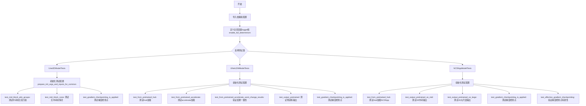

## 类结构

```
unittest.TestCase (Python标准测试基类)
├── ModelTesterMixin (测试混合类)
├── UNetTesterMixin (UNet测试混合类)
└── Unet2DModelTests (UNet2D基础测试)
├── UNetLDMModelTests (LDM场景测试)
└── NCSNppModelTests (NCSN++场景测试)
```

## 全局变量及字段


### `logger`
    
日志记录器对象，用于输出测试过程中的日志信息

类型：`logging.Logger`
    


### `enable_full_determinism`
    
启用完全确定性以确保测试可复现

类型：`function call`
    


### `Unet2DModelTests.model_class`
    
测试的模型类，值为UNet2DModel

类型：`type`
    


### `Unet2DModelTests.main_input_name`
    
主输入名称，值为'sample'

类型：`str`
    


### `Unet2DModelTests.dummy_input`
    
属性方法，返回模拟输入数据

类型：`property method`
    


### `Unet2DModelTests.input_shape`
    
属性方法，返回输入形状(3, 32, 32)

类型：`property method`
    


### `Unet2DModelTests.output_shape`
    
属性方法，返回输出形状(3, 32, 32)

类型：`property method`
    


### `UNetLDMModelTests.model_class`
    
测试的模型类，值为UNet2DModel

类型：`type`
    


### `UNetLDMModelTests.main_input_name`
    
主输入名称，值为'sample'

类型：`str`
    


### `UNetLDMModelTests.dummy_input`
    
属性方法，返回模拟输入数据(4通道)

类型：`property method`
    


### `UNetLDMModelTests.input_shape`
    
属性方法，返回输入形状(4, 32, 32)

类型：`property method`
    


### `UNetLDMModelTests.output_shape`
    
属性方法，返回输出形状(4, 32, 32)

类型：`property method`
    


### `NCSNppModelTests.model_class`
    
测试的模型类，值为UNet2DModel

类型：`type`
    


### `NCSNppModelTests.main_input_name`
    
主输入名称，值为'sample'

类型：`str`
    


### `NCSNppModelTests.dummy_input`
    
属性方法，返回模拟输入数据，支持自定义尺寸

类型：`property method`
    


### `NCSNppModelTests.input_shape`
    
属性方法，返回输入形状(3, 32, 32)

类型：`property method`
    


### `NCSNppModelTests.output_shape`
    
属性方法，返回输出形状(3, 32, 32)

类型：`property method`
    
    

## 全局函数及方法


### `enable_full_determinism`

启用完全确定性模式，确保测试结果可复现，通过设置随机种子和禁用非确定性操作来保证测试的一致性。

参数： 无

返回值：`None`，该函数不返回任何值，主要通过副作用生效

#### 流程图

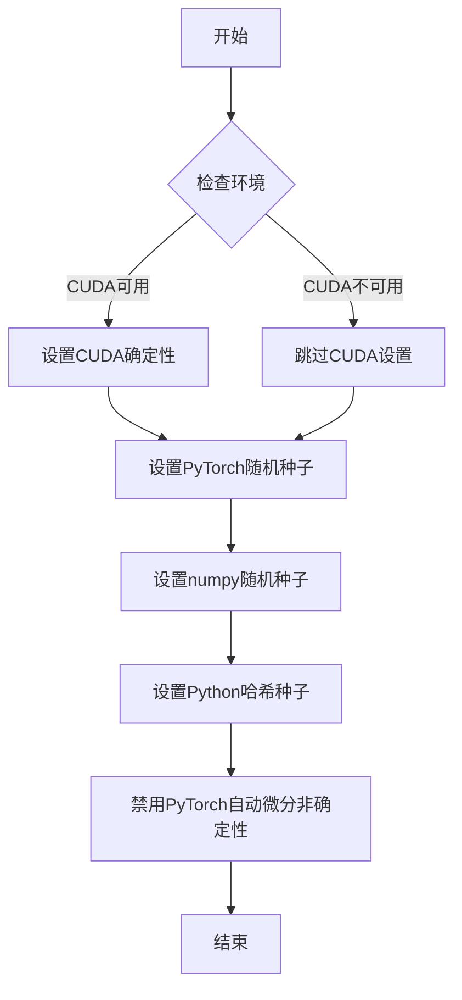

#### 带注释源码

```
# 该函数定义在 testing_utils 模块中
# 当前文件通过以下方式导入：
from ...testing_utils import enable_full_determinism

# 在模块级别调用，启用完全确定性模式
enable_full_determinism()

# 作用说明：
# 1. 设置 torch.manual_seed() 确保PyTorch随机数可复现
# 2. 设置 numpy.random.seed() 确保NumPy随机数可复现
# 3. 可能设置环境变量 PYTHONHASHSEED 确保Python哈希随机性可复现
# 4. 可能调用 torch.backends.cudnn.deterministic = True 确保CuDNN使用确定性算法
# 5. 可能调用 torch.backends.cudnn.benchmark = False 禁用CuDNN自动优化
#
# 调用时机：在测试模块加载时立即执行，确保后续所有测试都使用确定性随机数
```


# 日志记录器获取函数设计文档

## 1. 核心功能概述

`logging.get_logger` 是 diffusers 库的工具模块提供的日志记录器获取函数，它根据传入的模块名称返回一个配置好的 Python Logger 对象，用于在 diffusers 库中进行统一的日志管理和输出控制。

---

## 2. 函数详细信息

### `logging.get_logger`

获取 diffusers 库的日志记录器实例。

**参数：**

- `name`：`str`，日志记录器的名称，通常使用 `__name__` 变量传入，表示调用该函数的模块路径。

**返回值：** `logging.Logger`，Python 标准日志记录器对象，用于后续的日志输出（如 `logger.info()`, `logger.warning()`, `logger.error()` 等）。

**使用示例（来自代码）：**

```python
from diffusers.utils import logging

logger = logging.get_logger(__name__)
```

---

## 3. 流程图

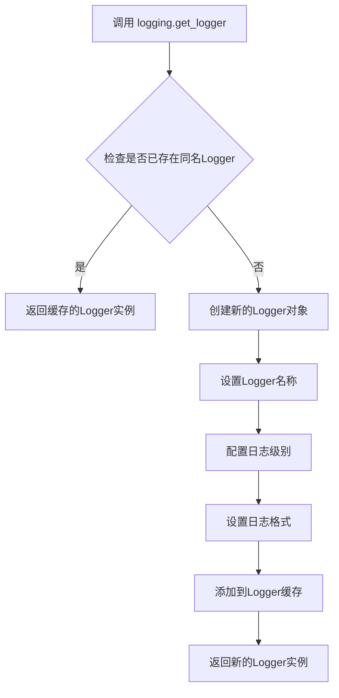

---

## 4. 带注释源码

由于当前代码文件中仅包含 `logging.get_logger` 的**调用代码**，未包含其具体实现源码，以下是调用示例代码：

```
# 从 diffusers.utils 模块导入 logging 对象
from diffusers.utils import logging

# 使用 __name__ 变量调用 get_logger 函数
# __name__ 是 Python 内置变量，表示当前模块的完全限定名
# 例如：如果此文件路径为 tests/test_unet.py，则 __name__ 为 'tests.test_unet'
logger = logging.get_logger(__name__)

# 后续可使用 logger 对象进行日志输出
logger.info("UNet2DModel loading started...")
logger.warning("Memory usage is high")
logger.error("Failed to load model")
```

---

## 5. 技术说明

| 项目 | 说明 |
|------|------|
| **模块来源** | `diffusers.utils.logging` |
| **实现位置** | 位于 `diffusers` 库的 utils 模块中，是 Python 标准 `logging` 模块的封装或直接导出 |
| **设计模式** | 单例模式（缓存机制）- 相同名称的 Logger 只创建一次，后续调用返回缓存实例 |
| **日志级别** | 通常默认设置为 WARNING 级别，以减少不必要的日志输出 |

---

## 6. 代码上下文分析

在提供的测试代码中，`logging.get_logger` 的使用场景：

```python
# 第37行：获取当前测试模块的日志记录器
logger = logging.get_logger(__name__)

# 用途：用于在测试执行过程中输出日志信息
# 虽然代码中未直接调用 logger 进行输出，但这是 diffusers 库的通用日志模式
```

---

## 7. 补充说明

**注意：** 当前提供的代码文件是测试文件（`test_unet2d_model.py`），仅包含对 `logging.get_logger` 函数的调用。如需查看该函数的完整实现源代码，需要查看 `diffusers/utils/logging.py` 源文件。


### `backend_empty_cache`

该函数是测试工具函数，用于清空GPU/CUDA缓存以释放显存，通常在测试中模型卸载后调用，以确保内存被正确释放。

参数：

- `device`：`str` 或 `torch.device`，目标设备标识符，用于指定需要清空缓存的设备（如 'cuda', 'cuda:0', 'cpu' 等）

返回值：`None`，该函数直接操作GPU缓存，不返回任何值

#### 流程图

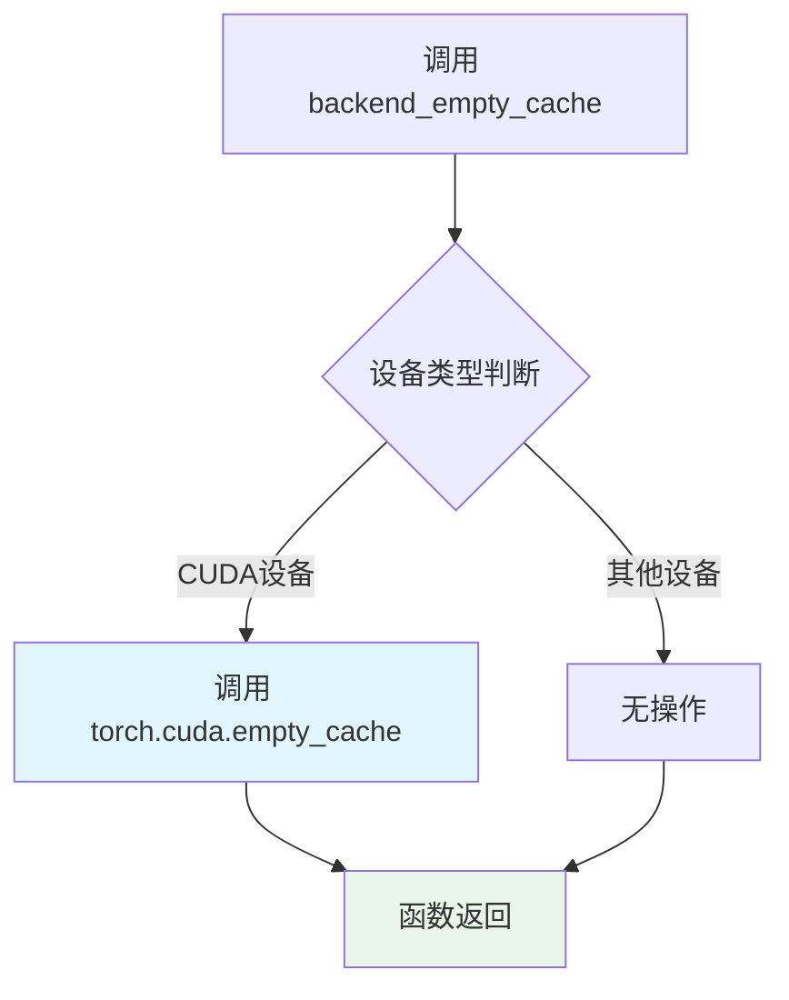

#### 带注释源码

```
# 注意: 此函数从 testing_utils 模块导入,以下是推断的实现逻辑

def backend_empty_cache(device):
    """
    清空指定设备的后端缓存以释放显存
    
    参数:
        device: torch_device, 目标设备 (如 'cuda', 'cuda:0', 'cpu' 等)
        
    返回:
        None
        
    使用场景:
        在测试中删除大模型后调用,以确保GPU显存被释放
        示例:
            del model_accelerate
            backend_empty_cache(torch_device)
            gc.collect()
    """
    # 根据设备类型执行不同的清理操作
    if torch_device == 'cuda' or torch_device.startswith('cuda:'):
        # CUDA设备: 清空GPU缓存
        torch.cuda.empty_cache()
    else:
        # CPU或其他设备: 无需操作
        pass
    
    # 注意: 此函数通常与 gc.collect() 配合使用
    # 以确保Python对象的内存被完全释放
```

#### 备注

该函数的具体实现位于 `diffusers` 包的 `testing_utils` 模块中。由于代码中仅导入了该函数而未展示其完整定义，上述源码为基于函数名称和使用方式的逻辑推断。实际实现可能略有差异，建议查阅 `testing_utils.py` 文件获取准确源码。


### `floats_tensor`

生成浮点张量的测试工具函数，用于在模型测试中创建随机初始化的输入数据。

参数：

-  `shape`：`Tuple[int, ...]`，张量的形状，通常为 (batch_size, num_channels, height, width) 这样的元组

返回值：`torch.Tensor`，返回一个指定形状的浮点类型 PyTorch 张量，默认值通常为 [-1, 1] 范围内的随机浮点数

#### 流程图

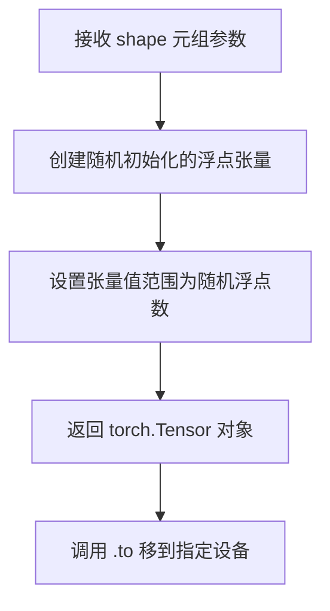

#### 带注释源码

```python
# 从 testing_utils 导入 floats_tensor 函数
# 该函数用于生成测试用的随机浮点张量
# 使用方式: floats_tensor(shape).to(torch_device)

# 示例调用（在代码中）:
# batch_size = 4
# num_channels = 3
# sizes = (32, 32)
# noise = floats_tensor((batch_size, num_channels) + sizes).to(torch_device)
# 生成形状为 (4, 3, 32, 32) 的随机浮点张量并移动到指定设备
```


### `require_torch_accelerator`

该函数是一个装饰器，用于标记需要Torch GPU加速的测试方法。当测试环境存在CUDA设备时，被装饰的测试将正常运行；若不存在CUDA设备，则跳过该测试。

#### 参数

由于 `require_torch_accelerator` 是从外部模块 `...testing_utils` 导入的装饰器函数，其完整源码不在当前代码文件中。以下信息基于其在代码中的使用方式推断：

- **func**：被装饰的函数对象，需要Torch加速器支持的测试方法

#### 返回值

- **Callable**，返回装饰后的函数，若无加速器则跳过测试

#### 流程图

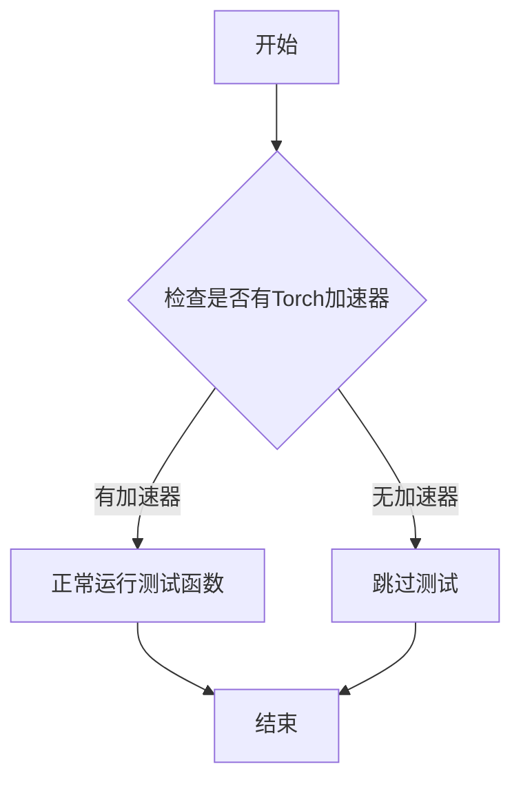

#### 带注释源码

由于该函数定义不在当前代码文件中，以下为从 `testing_utils` 导入的装饰器在代码中的典型使用方式：

```python
# 从 testing_utils 导入 require_torch_accelerator 装饰器
from ...testing_utils import (
    require_torch_accelerator,
    # ... 其他导入
)

# 使用装饰器标记需要 torch 加速器的测试方法
class UNetLDMModelTests(ModelTesterMixin, UNetTesterMixin, unittest.TestCase):
    model_class = UNet2DModel
    main_input_name = "sample"
    
    # ... 其他测试方法 ...

    @require_torch_accelerator  # 装饰器：要求有Torch加速器才执行
    def test_from_pretrained_accelerate(self):
        """测试使用accelerate加载模型"""
        model, _ = UNet2DModel.from_pretrained("fusing/unet-ldm-dummy-update", output_loading_info=True)
        model.to(torch_device)
        image = model(**self.dummy_input).sample

        assert image is not None, "Make sure output is not None"

    @require_torch_accelerator  # 装饰器：验证accelerate加载结果与普通加载一致
    def test_from_pretrained_accelerate_wont_change_results(self):
        # 使用 accelerate 加载模型
        model_accelerate, _ = UNet2DModel.from_pretrained("fusing/unet-ldm-dummy-update", output_loading_info=True)
        model_accelerate.to(torch_device)
        model_accelerate.eval()

        noise = torch.randn(
            1,
            model_accelerate.config.in_channels,
            model_accelerate.config.sample_size,
            model_accelerate.config.sample_size,
            generator=torch.manual_seed(0),
        )
        noise = noise.to(torch_device)
        time_step = torch.tensor([10] * noise.shape[0]).to(torch_device)

        arr_accelerate = model_accelerate(noise, time_step)["sample"]

        # 删除模型释放内存
        del model_accelerate
        backend_empty_cache(torch_device)
        gc.collect()

        # 使用普通方式加载模型
        model_normal_load, _ = UNet2DModel.from_pretrained(
            "fusing/unet-ldm-dummy-update", output_loading_info=True, low_cpu_mem_usage=False
        )
        model_normal_load.to(torch_device)
        model_normal_load.eval()
        arr_normal_load = model_normal_load(noise, time_step)["sample"]

        # 验证两种方式结果一致
        assert torch_all_close(arr_accelerate, arr_normal_load, rtol=1e-3)
```

#### 关键组件信息

| 组件名称 | 一句话描述 |
|---------|----------|
| `require_torch_accelerator` | 装饰器，标记需要Torch GPU加速的测试方法 |
| `UNetLDMModelTests` | 使用该装饰器的测试类，验证UNet2DModel的accelerate加载功能 |

#### 技术债务与优化空间

1. **装饰器源码不可见**：当前代码文件未包含 `require_torch_accelerator` 的实现源码，建议查阅 `testing_utils` 模块获取完整实现
2. **测试环境依赖**：该装饰器使测试依赖于特定的硬件环境（Torch GPU），在CI/CD中需确保配置相应的测试环境


### `slow`

描述：`slow` 是一个测试装饰器，用于标记需要长时间运行的测试方法。在测试运行时，被 `@slow` 装饰的测试会被特殊对待，通常用于标记那些需要从远程加载大型模型或执行复杂计算的测试用例。

#### 带注释源码

```
# 从 testing_utils 模块导入 slow 装饰器
from ...testing_utils import (
    backend_empty_cache,
    enable_full_determinism,
    floats_tensor,
    require_torch_accelerator,
    slow,  # <-- slow 装饰器从此处导入
    torch_all_close,
    torch_device,
)

# 在 NCSNppModelTests 类中，slow 装饰器被用于标记慢速测试方法
class NCSNppModelTests(ModelTesterMixin, UNetTesterMixin, unittest.TestCase):
    model_class = UNet2DModel
    main_input_name = "sample"

    # ... 其他代码 ...

    @slow  # <-- 使用 slow 装饰器标记该测试为慢速测试
    def test_from_pretrained_hub(self):
        model, loading_info = UNet2DModel.from_pretrained("google/ncsnpp-celebahq-256", output_loading_info=True)
        self.assertIsNotNone(model)
        self.assertEqual(len(loading_info["missing_keys"]), 0)

        model.to(torch_device)
        inputs = self.dummy_input
        noise = floats_tensor((4, 3) + (256, 256)).to(torch_device)
        inputs["sample"] = noise
        image = model(**inputs)

        assert image is not None, "Make sure output is not None"

    @slow  # <-- 另一个使用 slow 装饰器的测试方法
    def test_output_pretrained_ve_mid(self):
        model = UNet2DModel.from_pretrained("google/ncsnpp-celebahq-256")
        model.to(torch_device)

        batch_size = 4
        num_channels = 3
        sizes = (256, 256)

        noise = torch.ones((batch_size, num_channels) + sizes).to(torch_device)
        time_step = torch.tensor(batch_size * [1e-4]).to(torch_device)

        with torch.no_grad():
            output = model(noise, time_step).sample

        output_slice = output[0, -3:, -3:, -1].flatten().cpu()
        # fmt: off
        expected_output_slice = torch.tensor([-4836.2178, -6487.1470, -3816.8196, -7964.9302, -10966.3037, -20043.5957, 8137.0513, 2340.3328, 544.6056])
        # fmt: on

        self.assertTrue(torch_all_close(output_slice, expected_output_slice, rtol=1e-2))
```

#### 流程图

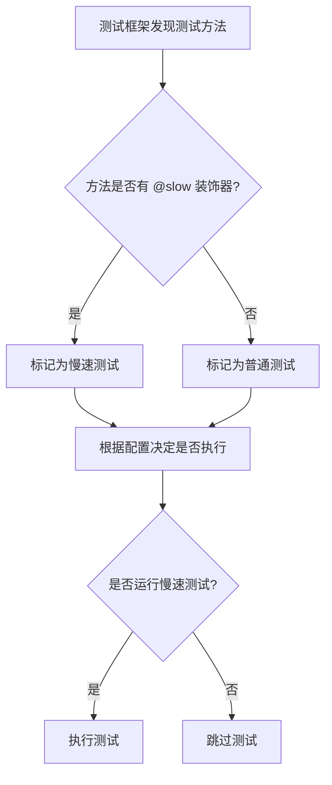

#### 使用示例

在当前代码文件中，`slow` 装饰器的使用场景：

1. **`NCSNppModelTests.test_from_pretrained_hub`**: 
   - 该测试需要从 HuggingFace Hub 下载大型预训练模型 "google/ncsnpp-celebahq-256"
   - 模型参数量大，下载和加载时间长

2. **`NCSNppModelTests.test_output_pretrained_ve_mid`**:
   - 同样需要加载 "google/ncsnpp-celebahq-256" 模型
   - 执行 256x256 分辨率的推理操作
   - 计算量大，耗时长

#### 注意事项

- `slow` 装饰器的具体实现位于 `...testing_utils` 模块中，在当前代码文件中仅导入并使用
- 被 `@slow` 装饰的测试在默认情况下可能被跳过，需要显式配置才会运行
- 这种设计允许开发者在本地开发时快速运行普通测试，而不会因大型模型的测试而浪费时间


### `torch_all_close`

PyTorch张量近似相等判断函数，用于测试场景中比较两个张量是否在指定容差范围内相等（从testing_utils导入）。

参数：

-  `tensor1`：`torch.Tensor`，第一个要比较的张量
-  `tensor2`：`torch.Tensor`，第二个要比较的张量
-  `rtol`：`float`（可选，默认为`1e-5`），相对容差（relative tolerance）
-  `atol`：`float`（可选，默认为`1e-8`），绝对容差（absolute tolerance）
-  `equal_nan`：`bool`（可选，默认为`True`），是否将NaN视为相等

返回值：`bool`，如果两个张量在指定容差范围内近似相等则返回`True`，否则返回`False`

#### 流程图

```mermaid
flowchart TD
    A[开始 torch_all_close] --> B{输入验证}
    B -->|tensor1或tensor2为None| C[返回 False]
    B -->|验证通过| D{检查形状}
    D -->|形状不同| E[返回 False]
    D -->|形状相同| F{计算绝对差值}
    F --> G{计算容差阈值}
    G --> H[max(rtol * |tensor2|, atol)]
    H --> I{比较是否满足条件}
    I -->|所有元素满足| J[返回 True]
    I -->|存在元素不满足| K[返回 False]
```

#### 带注释源码

```python
# 由于torch_all_close是从testing_utils导入的外部函数，
# 以下是基于使用方式推断的函数签名和实现逻辑

def torch_all_close(
    tensor1: torch.Tensor,    # 第一个要比较的张量
    tensor2: torch.Tensor,    # 第二个要比较的张量
    rtol: float = 1e-5,       # 相对容差，默认1e-5
    atol: float = 1e-8,      # 绝对容差，默认1e-8
    equal_nan: bool = True   # 是否将NaN视为相等，默认True
) -> bool:
    """
    检查两个张量是否在指定容差范围内近似相等。
    
    比较逻辑: |tensor1 - tensor2| <= atol + rtol * |tensor2|
    
    参数:
        tensor1: 第一个要比较的张量
        tensor2: 第二个要比较的张量
        rtol: 相对容差，用于处理不同量级的数值比较
        atol: 绝对容差，用于处理接近零的数值比较
        equal_nan: 是否将NaN视为相等
    
    返回:
        bool: 如果两个张量近似相等返回True，否则返回False
    """
    # 注意：实际实现在 testing_utils 模块中
    # 此处为基于使用方式的推断实现
    return torch.allclose(tensor1, tensor2, rtol=rtol, atol=atol, equal_nan=equal_nan)
```

#### 使用示例

```python
# 代码中的实际使用示例
# 示例1: 比较两个模型输出是否近似相等
assert torch_all_close(arr_accelerate, arr_normal_load, rtol=1e-3)

# 示例2: 验证模型输出与预期值是否匹配
self.assertTrue(torch_all_close(output_slice, expected_output_slice, rtol=1e-3))

# 示例3: 使用不同容差进行比较
self.assertTrue(torch_all_close(output_slice, expected_output_slice, rtol=1e-2))
```


### `torch_device`

获取测试设备（CPU 或 CUDA），用于将张量和模型移动到指定的计算设备上。

参数： 无

返回值： `torch.device`，返回适合当前测试环境的 PyTorch 设备对象。

#### 流程图

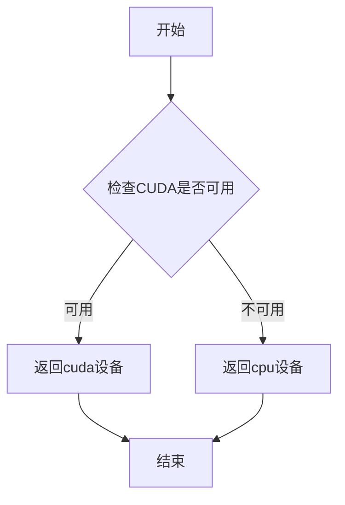

#### 带注释源码

```python
# torch_device 是从 testing_utils 模块导入的设备定义函数/变量
# 由于源代码未在此文件中给出定义，它来自于外部模块
# 以下是基于使用方式的推断实现：

def torch_device():
    """
    获取测试设备。
    
    优先返回 CUDA 设备（如果可用），否则返回 CPU 设备。
    这确保了测试可以在 GPU 上加速运行，同时保持向后兼容性。
    
    Returns:
        torch.device: 适合当前环境的计算设备
    """
    if torch.cuda.is_available():
        return torch.device("cuda")
    else:
        return torch.device("cpu")
```

#### 使用示例

在提供的代码中，`torch_device` 的典型用法如下：

```python
# 将张量移动到测试设备
noise = floats_tensor((batch_size, num_channels) + sizes).to(torch_device)

# 将模型移动到测试设备
model.to(torch_device)

# 作为参数指定设备
time_step = torch.tensor([10]).to(dtype=torch.int32, device=torch_device)
```

---

**注意**：由于 `torch_device` 是外部导入的函数/变量（定义在 `testing_utils` 模块中），其具体实现可能因版本而异。上述源码是基于其使用方式的推断实现。


### `UNet2DModel.from_pretrained`

从预训练模型加载 UNet2DModel 实例，支持从 HuggingFace Hub 或本地路径加载模型权重，并可选择输出加载信息。

参数：

- `pretrained_model_name_or_path`：`str`，模型名称（如 "fusing/unet-ldm-dummy-update"）或本地模型路径
- `output_loading_info`：`bool`（可选，默认为 `False`），是否返回加载信息字典，包含 missing_keys、unexpected_keys 等
- `low_cpu_mem_usage`：`bool`（可选，默认为 `True`），是否使用低内存占用模式加载模型
- `**kwargs`：其他关键字参数，用于传递给模型的配置和加载逻辑

返回值：`tuple` 或 `UNet2DModel`，当 `output_loading_info=True` 时返回 (model, loading_info) 元组，其中 loading_info 是包含 missing_keys、unexpected_keys 等信息的字典；否则直接返回 UNet2DModel 实例

#### 流程图

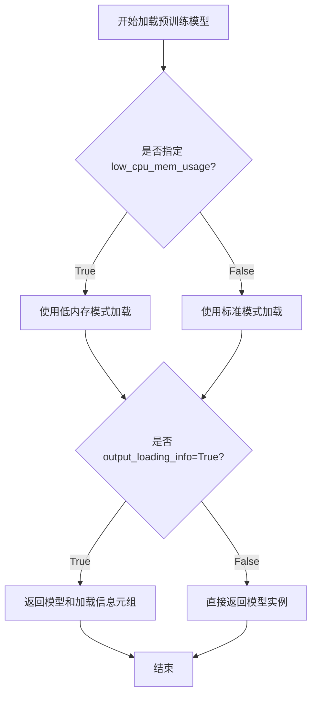

#### 带注释源码

```python
# 测试代码中 from_pretrained 的调用示例

# 1. 基础加载（不带加载信息）
model = UNet2DModel.from_pretrained("fusing/unet-ldm-dummy-update")

# 2. 带加载信息的加载
model, loading_info = UNet2DModel.from_pretrained("fusing/unet-ldm-dummy-update", output_loading_info=True)

# 3. 禁用低内存使用模式的标准加载
model_normal_load, _ = UNet2DModel.from_pretrained(
    "fusing/unet-ldm-dummy-update", 
    output_loading_info=True, 
    low_cpu_mem_usage=False
)

# 4. 从官方模型库加载（带慢速测试标记）
model, loading_info = UNet2DModel.from_pretrained("google/ncsnpp-celebahq-256", output_loading_info=True)

# 使用示例：加载后进行推理
model.to(torch_device)
image = model(**self.dummy_input).sample
```


### `Unet2DModelTests.prepare_init_args_and_inputs_for_common`

准备 UNet2DModel 测试类的初始化参数和输入数据，用于通用模型测试场景。该方法定义了不同测试类（Unet2DModelTests、UNetLDMModelTests、NCSNppModelTests）的模型配置和测试输入。

参数：无（仅包含 self 参数）

返回值：`Tuple[Dict, Dict]`
- 第一个字典 (`init_dict`)：包含 UNet2DModel 初始化参数
- 第二个字典 (`inputs_dict`)：包含模型输入数据（sample 和 timestep）

#### 流程图

```mermaid
flowchart TD
    A[开始 prepare_init_args_and_inputs_for_common] --> B{判断测试类类型}
    B -->|Unet2DModelTests| C[构建基础配置字典]
    B -->|UNetLDMModelTests| D[构建LDM配置字典]
    B -->|NCSNppModelTests| E[构建NCSNpp配置字典]
    
    C --> F[设置 block_out_channels: (4, 8)]
    C --> G[设置 norm_num_groups: 2]
    C --> H[设置 down_block_types 和 up_block_types]
    C --> I[设置 attention_head_dim: 3]
    C --> J[设置通道数和层数]
    
    D --> K[设置 sample_size: 32]
    D --> L[设置 in_channels: 4, out_channels: 4]
    D --> M[设置 block_out_channels: (32, 64)]
    D --> N[设置 attention_head_dim: 32]
    
    E --> O[设置 block_out_channels: [32, 64, 64, 64]]
    E --> P[设置 time_embedding_type: fourier]
    E --> Q[设置 norm_eps: 1e-6]
    E --> R[设置 mid_block_scale_factor: sqrt(2.0)]
    E --> S[设置 norm_num_groups: None]
    
    J --> T[获取 self.dummy_input]
    N --> T
    S --> T
    
    T --> U[返回 init_dict 和 inputs_dict 元组]
    U --> V[结束]
```

#### 带注释源码

```python
def prepare_init_args_and_inputs_for_common(self):
    """
    准备 UNet2DModel 的初始化参数和输入数据，供通用测试使用。
    根据不同测试类返回相应的模型配置和测试输入。
    
    返回:
        Tuple[Dict, Dict]: (init_dict, inputs_dict)
            - init_dict: 模型初始化参数字典
            - inputs_dict: 包含 sample 和 timestep 的输入字典
    """
    
    # ============================================================
    # 测试类 1: Unet2DModelTests 的配置
    # 用于基础 UNet2D 模型测试
    # ============================================================
    if isinstance(self, Unet2DModelTests):
        init_dict = {
            "block_out_channels": (4, 8),        # 下采样/上采样通道数
            "norm_num_groups": 2,                 # 归一化组数
            "down_block_types": (                # 下采样块类型
                "DownBlock2D",                    # 标准下采样块
                "AttnDownBlock2D"                 # 带注意力下采样块
            ),
            "up_block_types": (                  # 上采样块类型
                "AttnUpBlock2D",                  # 带注意力上采样块
                "UpBlock2D"                       # 标准上采样块
            ),
            "attention_head_dim": 3,             # 注意力头维度
            "out_channels": 3,                   # 输出通道数
            "in_channels": 3,                     # 输入通道数
            "layers_per_block": 2,               # 每个块的层数
            "sample_size": 32,                    # 样本空间尺寸
        }
        inputs_dict = self.dummy_input           # 获取测试输入数据
        return init_dict, inputs_dict
    
    # ============================================================
    # 测试类 2: UNetLDMModelTests 的配置
    # 用于潜在扩散模型 (LDM) 测试
    # ============================================================
    elif isinstance(self, UNetLDMModelTests):
        init_dict = {
            "sample_size": 32,                    # 样本空间尺寸
            "in_channels": 4,                     # 输入通道数 (LDM使用4通道)
            "out_channels": 4,                    # 输出通道数
            "layers_per_block": 2,                # 每个块的层数
            "block_out_channels": (32, 64),       # 块输出通道数
            "attention_head_dim": 32,             # 注意力头维度
            "down_block_types": (                 # 下采样块类型
                "DownBlock2D", 
                "DownBlock2D"
            ),
            "up_block_types": (                   # 上采样块类型
                "UpBlock2D", 
                "UpBlock2D"
            ),
        }
        inputs_dict = self.dummy_input
        return init_dict, inputs_dict
    
    # ============================================================
    # 测试类 3: NCSNppModelTests 的配置
    # 用于噪声条件得分网络 (NCSN++) 测试
    # ============================================================
    elif isinstance(self, NCSNppModelTests):
        init_dict = {
            "block_out_channels": [32, 64, 64, 64],  # 多级通道配置
            "in_channels": 3,                         # 输入通道数
            "layers_per_block": 1,                    # 每块层数
            "out_channels": 3,                        # 输出通道数
            "time_embedding_type": "fourier",        # 时间嵌入类型
            "norm_eps": 1e-6,                         # 归一化 epsilon
            "mid_block_scale_factor": math.sqrt(2.0), # 中间块缩放因子
            "norm_num_groups": None,                  # 归一化组数 (不使用)
            "down_block_types": [                     # 下采样块类型列表
                "SkipDownBlock2D",                    # 跳跃连接下采样块
                "AttnSkipDownBlock2D",                # 带注意力跳跃下采样
                "SkipDownBlock2D", 
                "SkipDownBlock2D"
            ],
            "up_block_types": [                       # 上采样块类型列表
                "SkipUpBlock2D",                      # 跳跃连接上采样块
                "SkipUpBlock2D", 
                "AttnSkipUpBlock2D",                  # 带注意力跳跃上采样
                "SkipUpBlock2D"
            ],
        }
        inputs_dict = self.dummy_input
        return init_dict, inputs_dict
    
    # ============================================================
    # 默认情况: 抛出异常
    # ============================================================
    else:
        raise ValueError(f"Unknown test class: {type(self)}")
```

#### 关键组件信息

| 组件名称 | 一句话描述 |
|---------|-----------|
| `dummy_input` | 属性方法，生成用于测试的随机噪声输入和时间步 |
| `input_shape` | 属性方法，返回输入张量形状 (通道数, 高度, 宽度) |
| `output_shape` | 属性方法，返回输出张量形状 |
| `block_out_channels` | UNet 各层级输出通道数配置 |
| `down_block_types` / `up_block_types` | 下采样/上采样块的具体实现类型 |
| `attention_head_dim` | 多头注意力机制中每个头的维度 |
| `time_embedding_type` | 时间步嵌入方式 (fourier 或 standard) |
| `norm_num_groups` | Group Normalization 的组数配置 |

#### 潜在技术债务与优化空间

1. **代码重复**: 三个测试类的 `prepare_init_args_and_inputs_for_common` 方法存在大量重复逻辑，可考虑使用模板方法模式或工厂模式重构
2. **硬编码配置**: 模型配置参数硬编码在方法中，建议提取为类属性或配置文件
3. **类型检查使用 isinstance**: 使用运行时类型检查不够优雅，可考虑使用抽象基类或协议类
4. **魔法数字**: 某些参数（如 `math.sqrt(2.0)`）的含义不够明确，应添加注释说明

#### 其它项目

**设计目标与约束**:
- 为 `UNet2DModel` 提供标准化的测试初始化参数
- 支持不同变体模型 (基础UNet、LDM、NCSN++) 的测试
- 确保不同测试场景下输入输出形状一致性

**错误处理**:
- 未知测试类类型时抛出 `ValueError` 异常
- `dummy_input` 依赖 `floats_tensor` 和 `torch_device` 工具函数

**数据流**:
```
测试框架 → prepare_init_args_and_inputs_for_common() 
         → 返回 (init_dict, inputs_dict) 
         → model_class(**init_dict) 创建模型
         → model(**inputs_dict) 执行前向传播
```

**外部依赖**:
- `torch`: 张量运算
- `diffusers.UNet2DModel`: 被测试的模型类
- `testing_utils`: 测试工具函数 (floats_tensor, torch_device 等)


### `Unet2DModelTests.test_mid_block_attn_groups`

该测试方法用于验证 UNet2DModel 中间块（mid_block）的注意力机制是否正确配置了 group_norm 参数。具体流程为：准备包含注意力配置的初始化参数，创建模型实例，验证中间块注意力层的 group_norm 存在且组数正确，最后运行前向传播验证输入输出形状一致。

参数：

- 该方法无显式参数，依赖继承的测试框架和类属性（`self.model_class`、`self.prepare_init_args_and_inputs_for_common()`等）

返回值：`None`（测试方法无返回值，通过 `assert` 语句进行验证）

#### 流程图

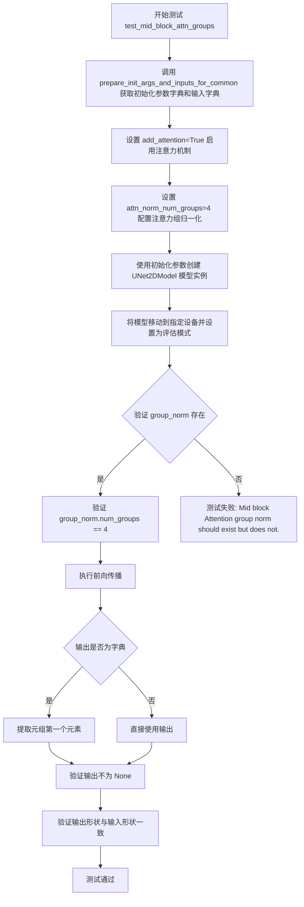

#### 带注释源码

```python
def test_mid_block_attn_groups(self):
    """
    测试中间块注意力组的归一化配置
    
    该测试验证 UNet2DModel 的中间块（mid_block）是否正确配置了
    注意力层的 group_norm 参数，包括：
    1. group_norm 层是否存在
    2. group_norm 的组数是否与配置一致
    3. 模型前向传播是否正常工作
    """
    # 步骤1: 获取基础的初始化参数和输入字典
    # prepare_init_args_and_inputs_for_common 返回两个字典：
    # - init_dict: 包含模型初始化所需的配置参数
    # - inputs_dict: 包含测试输入（sample噪声和timestep）
    init_dict, inputs_dict = self.prepare_init_args_and_inputs_for_common()

    # 步骤2: 配置注意力相关参数
    # add_attention=True 启用注意力机制
    init_dict["add_attention"] = True
    # attn_norm_num_groups=4 设置注意力层归一化的组数
    # 这个参数控制 GroupNorm 的 num_groups 属性
    init_dict["attn_norm_num_groups"] = 4

    # 步骤3: 创建模型实例
    # 使用配置好的参数实例化 UNet2DModel
    model = self.model_class(**init_dict)
    # 将模型移动到指定的计算设备（如GPU/CPU）
    model.to(torch_device)
    # 设置为评估模式，禁用dropout等训练特定的操作
    model.eval()

    # 步骤4: 验证中间块注意力层的 group_norm 存在
    # assertIsNotNone 验证 group_norm 对象不为空
    self.assertIsNotNone(
        model.mid_block.attentions[0].group_norm, 
        "Mid block Attention group norm should exist but does not."
    )
    
    # 步骤5: 验证 group_norm 的组数配置正确
    # 确认 group_norm.num_groups 与初始化参数 attn_norm_num_groups 一致
    self.assertEqual(
        model.mid_block.attentions[0].group_norm.num_groups,
        init_dict["attn_norm_num_groups"],
        "Mid block Attention group norm does not have the expected number of groups.",
    )

    # 步骤6: 执行前向传播测试
    # 使用 torch.no_grad() 禁用梯度计算，节省内存和计算资源
    with torch.no_grad():
        # 将输入字典解包传递给模型
        output = model(**inputs_dict)

        # 处理输出格式：可能返回字典或元组
        # 如果是字典，提取元组中的第一个元素（即输出张量）
        if isinstance(output, dict):
            output = output.to_tuple()[0]

    # 步骤7: 验证输出有效性
    # 确保模型前向传播有输出（不为None）
    self.assertIsNotNone(output)
    
    # 获取期望的输出形状（与输入样本形状相同）
    expected_shape = inputs_dict["sample"].shape
    # 验证输出形状与输入形状完全匹配
    self.assertEqual(
        output.shape, 
        expected_shape, 
        "Input and output shapes do not match"
    )
```


### `Unet2DModelTests.test_mid_block_none`

测试当 UNet2DModel 的中间块类型（mid_block_type）设置为 None 时的行为，验证中间块被正确省略且模型输出与带中间块的模型输出不同。

参数：
- `self`：隐式参数，`Unet2DModelTests` 类的实例

返回值：`None`，无返回值（测试方法）

#### 流程图

```mermaid
flowchart TD
    A[开始测试] --> B[调用 prepare_init_args_and_inputs_for_common 获取初始化参数和输入]
    B --> C[复制初始化参数字典]
    C --> D[设置 mid_none_init_dict['mid_block_type'] = None]
    E[创建普通模型] --> F[移动到 torch_device 并设置为 eval 模式]
    G[创建 mid_block_type=None 的模型] --> H[移动到 torch_device 并设置为 eval 模式]
    F --> I[断言 mid_none_model.mid_block 为 None]
    H --> I
    I --> J[使用 torch.no_grad 运行普通模型获取输出]
    J --> K[使用 torch.no_grad 运行 mid_none 模型获取输出]
    K --> L[断言两个输出不完全相等]
    L --> M[结束测试]
```

#### 带注释源码

```python
def test_mid_block_none(self):
    """
    测试当 mid_block_type 设置为 None 时的行为。
    验证：
    1. 中间块被正确省略（mid_block 为 None）
    2. 有中间块和无中间块的模型输出不同
    """
    # 获取标准的初始化参数和输入字典
    init_dict, inputs_dict = self.prepare_init_args_and_inputs_for_common()
    
    # 创建第二组参数用于测试中间块为 None 的情况
    mid_none_init_dict, mid_none_inputs_dict = self.prepare_init_args_and_inputs_for_common()
    
    # 设置中间块类型为 None
    mid_none_init_dict["mid_block_type"] = None

    # 创建带中间块的普通模型
    model = self.model_class(**init_dict)
    model.to(torch_device)
    model.eval()

    # 创建不带中间块的模型（mid_block_type=None）
    mid_none_model = self.model_class(**mid_none_init_dict)
    mid_none_model.to(torch_device)
    mid_none_model.eval()

    # 断言：验证中间块确实被省略
    self.assertIsNone(mid_none_model.mid_block, "Mid block should not exist.")

    # 在 no_grad 模式下运行普通模型
    with torch.no_grad():
        output = model(**inputs_dict)
        
        # 如果输出是字典，转换为元组并取第一个元素
        if isinstance(output, dict):
            output = output.to_tuple()[0]

    # 在 no_grad 模式下运行无中间块的模型
    with torch.no_grad():
        mid_none_output = mid_none_model(**mid_none_inputs_dict)
        
        # 如果输出是字典，转换为元组并取第一个元素
        if isinstance(output, dict):
            mid_none_output = mid_none_output.to_tuple()[0]

    # 断言：验证两个模型的输出不同（允许一定的浮点误差）
    self.assertFalse(
        torch.allclose(output, mid_none_output, rtol=1e-3), 
        "outputs should be different."
    )
```


### `Unet2DModelTests.test_gradient_checkpointing_is_applied`

该测试方法用于验证 UNet2DModel 中是否正确应用了梯度检查点（Gradient Checkpointing）技术。它通过检查模型的前馈块（UpBlock/DownBlock）和中间块（MidBlock）是否支持梯度检查点来确保该优化功能被正确启用。

参数：

- `self`：隐式参数，`unittest.TestCase` 实例，代表测试类本身

返回值：`None`，该方法为单元测试方法，通过 `assert` 语句验证结果，不返回任何值

#### 流程图

```mermaid
flowchart TD
    A[开始测试] --> B[定义期望的块类型集合 expected_set]
    B --> C[设置 attention_head_dim = 8]
    C --> D[设置 block_out_channels = (16, 32)]
    D --> E[调用父类 test_gradient_checkpointing_is_applied 方法]
    E --> F{验证结果}
    F -->|通过| G[测试通过]
    F -->|失败| H[测试失败并抛出异常]
```

#### 带注释源码

```python
def test_gradient_checkpointing_is_applied(self):
    # 定义期望支持梯度检查点的UNet块类型集合
    # 包含注意力上采样块、注意力下采样块、中间块、标准上/下采样块
    expected_set = {
        "AttnUpBlock2D",
        "AttnDownBlock2D",
        "UNetMidBlock2D",
        "UpBlock2D",
        "DownBlock2D",
    }

    # 注意：与UNet2DConditionModel不同，UNet2DModel当前不支持
    # attention_head_dim为元组形式
    attention_head_dim = 8  # 设置注意力头维度为8
    block_out_channels = (16, 32)  # 设置块输出通道数：(下采样16通道, 下采样32通道)

    # 调用父类(ModelTesterMixin)的梯度检查点测试方法
    # 传入期望的块类型集合、注意力头维度和块输出通道数
    super().test_gradient_checkpointing_is_applied(
        expected_set=expected_set, 
        attention_head_dim=attention_head_dim, 
        block_out_channels=block_out_channels
    )
```


### `UNetLDMModelTests.prepare_init_args_and_inputs_for_common`

准备LDM（Latent Diffusion Model）场景的UNet2DModel模型初始化参数和测试输入数据，为通用模型测试提供必要的配置。

参数：无显式参数（仅使用self）

返回值：`Tuple[Dict, Dict]`，返回包含模型初始化参数字典和输入数据字典的元组

- `init_dict`：`Dict`，包含UNet2DModel的初始化参数字典
- `inputs_dict`：`Dict`，包含模型输入数据的字典（sample和timestep）

#### 流程图

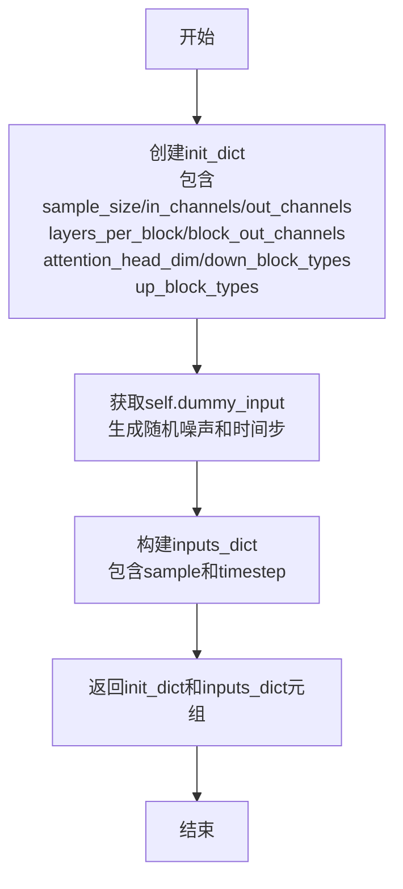

#### 带注释源码

```python
def prepare_init_args_and_inputs_for_common(self):
    """
    准备LDM场景的UNet2DModel初始化参数和输入数据
    
    该方法为UNet2DModel测试类提供标准的初始化配置和输入数据，
    用于通用的模型测试场景（如前向传播、梯度检查点等测试）
    """
    # 定义模型初始化参数字典
    init_dict = {
        "sample_size": 32,           # 输入样本的空间尺寸（宽高）
        "in_channels": 4,            # 输入通道数（LDM通常使用4通道latent空间）
        "out_channels": 4,           # 输出通道数
        "layers_per_block": 2,       # 每个分辨率级别中的层数
        "block_out_channels": (32, 64),  # 各级别输出通道数配置
        "attention_head_dim": 32,   # 注意力头的维度
        # 下采样块类型：使用标准的2D下采样块
        "down_block_types": ("DownBlock2D", "DownBlock2D"),
        # 上采样块类型：使用标准的2D上采样块
        "up_block_types": ("UpBlock2D", "UpBlock2D"),
    }
    # 获取测试输入数据（从dummy_input属性获取）
    inputs_dict = self.dummy_input
    # 返回初始化参数和输入字典的元组
    return init_dict, inputs_dict
```


### `UNetLDMModelTests.test_from_pretrained_hub`

该测试方法验证了从HuggingFace Hub加载UNet2DModel预训练模型的功能，涵盖模型加载、配置验证、设备迁移及推理能力测试，确保模型能够正确实例化并生成有效输出。

参数：

- `self`：`UNetLDMModelTests`，测试类实例本身，包含模型配置和测试输入

返回值：`None`，该方法为单元测试方法，通过断言验证模型加载和推理的正确性，无显式返回值

#### 流程图

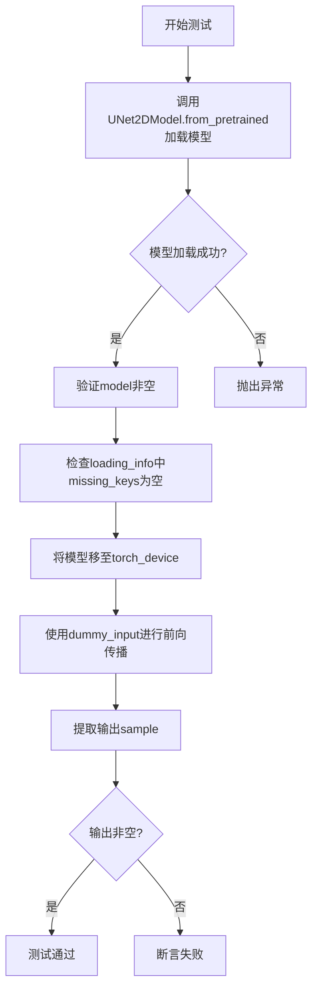

#### 带注释源码

```python
def test_from_pretrained_hub(self):
    """
    测试从HuggingFace Hub加载预训练UNet2DModel模型
    验证点：模型加载、配置完整性、设备迁移、前向推理
    """
    # 步骤1: 从预训练仓库加载模型，获取模型实例和加载信息
    # 参数: "fusing/unet-ldm-dummy-update"为HuggingFace Hub上的模型仓库ID
    # output_loading_info=True表示同时返回加载过程中的元信息
    model, loading_info = UNet2DModel.from_pretrained(
        "fusing/unet-ldm-dummy-update",  # 模型仓库标识符
        output_loading_info=True          # 返回加载详情包括missing_keys等
    )

    # 步骤2: 断言模型成功加载且非空
    self.assertIsNotNone(model)

    # 步骤3: 验证加载信息中不存在缺失的权重键
    # 预期模型权重完整，无缺失项
    self.assertEqual(len(loading_info["missing_keys"]), 0)

    # 步骤4: 将模型迁移至指定计算设备
    # torch_device为测试环境配置的设备(CPU/CUDA)
    model.to(torch_device)

    # 步骤5: 执行前向传播推理
    # 使用类属性dummy_input作为测试输入
    # dummy_input包含sample(噪声张量)和timestep(时间步)
    # 访问sample属性获取生成的图像张量
    image = model(**self.dummy_input).sample

    # 步骤6: 断言推理输出有效非空
    # 确保模型能够正常推理并产生输出
    assert image is not None, "Make sure output is not None"
```


### `UNetLDMModelTests.test_from_pretrained_accelerate`

该测试方法用于验证使用 `accelerate` 库（通过 `low_cpu_mem_usage=True` 默认方式）从预训练模型加载 UNet2DModel 的功能，并确保模型能够正确执行前向传播生成图像。

参数：无（仅包含 `self`）

返回值：无（`None`），该方法为测试方法，通过断言验证模型输出

#### 流程图

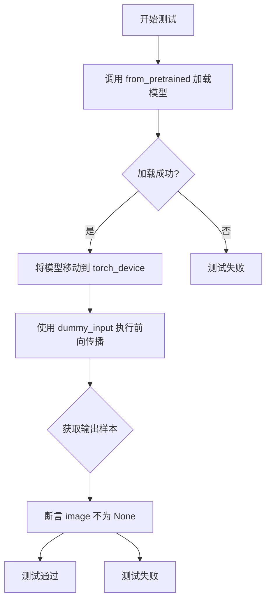

#### 带注释源码

```python
@require_torch_accelerator  # 装饰器：仅在有torch加速器设备时运行此测试
def test_from_pretrained_accelerate(self):
    """
    测试使用 accelerate 方式加载预训练模型
    
    该测试验证：
    1. 能够从 HuggingFace Hub 加载 UNet2DModel
    2. 使用 accelerate（默认 low_cpu_mem_usage=True）加载
    3. 模型能够正确执行前向传播
    """
    
    # 使用 from_pretrained 加载模型，设置 output_loading_info=True 获取加载信息
    # 默认使用 accelerate 方式加载（low_cpu_mem_usage=True）
    model, _ = UNet2DModel.from_pretrained("fusing/unet-ldm-dummy-update", output_loading_info=True)
    
    # 将模型移动到指定的计算设备（如 GPU）
    model.to(torch_device)
    
    # 使用测试用的虚拟输入执行前向传播
    # dummy_input 包含 sample（噪声）和 timestep
    image = model(**self.dummy_input).sample
    
    # 断言确保模型输出不为空
    assert image is not None, "Make sure output is not None"
```


### `UNetLDMModelTests.test_from_pretrained_accelerate_wont_change_results`

该测试方法验证使用 `accelerate` 库加载预训练模型（通过 `low_cpu_mem_usage=True`）与普通加载方式（`low_cpu_mem_usage=False`）产生的推理结果保持一致，确保优化加载机制不会改变模型的数值输出。

参数：
- `self`：unittest.TestCase，表示测试用例实例本身，无额外参数

返回值：无返回值（void），该方法为测试用例，通过断言验证 `accelerate` 加载与普通加载的输出结果在指定容差范围内相等。

#### 流程图

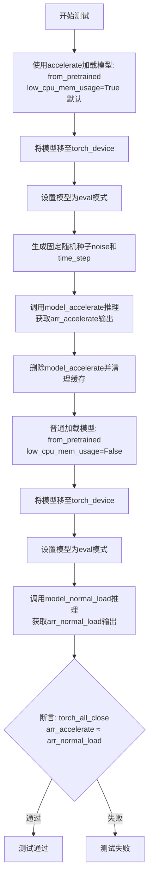

#### 带注释源码

```python
@require_torch_accelerator  # 装饰器：仅在有torch accelerator可用时运行此测试
def test_from_pretrained_accelerate_wont_change_results(self):
    """
    测试使用 accelerate 加载模型不会改变结果
    验证 low_cpu_mem_usage=True（默认使用accelerate）与
    low_cpu_mem_usage=False（普通加载）的输出一致性
    """
    
    # 步骤1: 使用 accelerate 方式加载模型（默认 low_cpu_mem_usage=True）
    # 这会使用 accelerate 库的优化加载机制
    model_accelerate, _ = UNet2DModel.from_pretrained(
        "fusing/unet-ldm-dummy-update",  # 预训练模型路径或Hub ID
        output_loading_info=True          # 同时返回加载信息
    )
    
    # 步骤2: 将模型移至指定计算设备（如GPU）
    model_accelerate.to(torch_device)
    
    # 步骤3: 设置为评估模式，禁用dropout等训练特定操作
    model_accelerate.eval()

    # 步骤4: 生成确定性的随机输入（固定随机种子以保证可复现性）
    noise = torch.randn(
        1,  # batch_size=1
        model_accelerate.config.in_channels,   # 输入通道数
        model_accelerate.config.sample_size,   # 样本宽度
        model_accelerate.config.sample_size,   # 样本高度
        generator=torch.manual_seed(0),         # 固定随机种子=0
    )
    # 将输入移至计算设备
    noise = noise.to(torch_device)
    
    # 步骤5: 创建时间步张量（用于UNet的时间条件）
    time_step = torch.tensor([10] * noise.shape[0]).to(torch_device)

    # 步骤6: 使用 accelerate 加载的模型进行推理
    arr_accelerate = model_accelerate(noise, time_step)["sample"]

    # 步骤7: 清理内存 - 删除模型并清空缓存
    # 两个模型不需要同时存在于设备内存中
    del model_accelerate
    backend_empty_cache(torch_device)  # 后端特定的缓存清理
    gc.collect()                        # 强制Python垃圾回收

    # 步骤8: 使用普通方式加载模型（禁用 accelerate 优化）
    model_normal_load, _ = UNet2DModel.from_pretrained(
        "fusing/unet-ldm-dummy-update",  # 相同的预训练模型
        output_loading_info=True,
        low_cpu_mem_usage=False         # 禁用低CPU内存使用模式
    )
    
    # 步骤9: 同样将模型移至计算设备并设为eval模式
    model_normal_load.to(torch_device)
    model_normal_load.eval()
    
    # 步骤10: 使用相同输入进行推理
    arr_normal_load = model_normal_load(noise, time_step)["sample"]

    # 步骤11: 断言验证两种加载方式的输出在容差范围内相等
    # rtol=1e-3 表示相对容差为0.1%
    assert torch_all_close(arr_accelerate, arr_normal_load, rtol=1e-3)
```


### `UNetLDMModelTests.test_output_pretrained`

该测试方法用于验证从预训练模型加载的 UNet2DModel 在给定噪声输入和时间步的情况下，输出结果与期望值一致，确保模型权重正确加载且推理逻辑正常。

参数：该测试方法无显式参数，通过类属性 `self.dummy_input` 和模型配置获取输入数据。

返回值：`None`，该方法为单元测试，使用断言验证模型输出的正确性，不返回任何值。

#### 流程图

```mermaid
flowchart TD
    A[开始测试] --> B[从预训练模型加载UNet2DModel: fusing/unet-ldm-dummy-update]
    B --> C[设置模型为eval模式]
    C --> D[将模型移至torch_device]
    D --> E[生成随机噪声输入<br/>使用generator=torch.manual_seed(0)<br/>形状: 1 x in_channels x 32 x 32]
    E --> F[创建时间步张量<br/>torch.tensor([10] * noise.shape[0])]
    F --> G[使用torch.no_grad()禁用梯度计算]
    G --> H[调用模型进行推理<br/>model(noise, time_step).sample]
    H --> I[提取输出切片<br/>output[0, -1, -3:, -3:].flatten().cpu()]
    I --> J[定义期望输出张量<br/>expected_output_slice]
    J --> K[使用torch_all_close断言验证输出与期望值接近<br/>rtol=1e-3]
    K --> L{验证通过?}
    L -->|是| M[测试通过]
    L -->|否| N[测试失败抛出AssertionError]
    M --> O[结束测试]
    N --> O
```

#### 带注释源码

```python
def test_output_pretrained(self):
    # 从预训练模型路径加载UNet2DModel
    # 模型配置包含: sample_size=32, in_channels=4, out_channels=4等
    model = UNet2DModel.from_pretrained("fusing/unet-ldm-dummy-update")
    
    # 设置模型为评估模式，禁用dropout和batch normalization的训练行为
    model.eval()
    
    # 将模型参数移至指定的计算设备(CPU/GPU)
    model.to(torch_device)

    # 使用固定随机种子生成噪声输入，确保测试可重复性
    # 形状: [batch_size=1, in_channels, sample_size, sample_size]
    noise = torch.randn(
        1,
        model.config.in_channels,      # 模型输入通道数(从配置获取)
        model.config.sample_size,      # 样本尺寸(从配置获取)
        model.config.sample_size,
        generator=torch.manual_seed(0), # 固定随机种子确保可复现性
    )
    
    # 将噪声张量移至计算设备
    noise = noise.to(torch_device)
    
    # 创建时间步张量，形状与batch_size匹配
    # 值为10，对应扩散过程的特定时间步
    time_step = torch.tensor([10] * noise.shape[0]).to(torch_device)

    # 禁用梯度计算以提升推理性能并减少内存占用
    with torch.no_grad():
        # 调用模型进行前向传播
        # 返回字典 {"sample": output, ...}，提取sample属性获取输出张量
        output = model(noise, time_step).sample

    # 提取输出张量的特定切片用于验证
    # 选择第一个样本、最后一个通道、右下角3x3区域
    output_slice = output[0, -1, -3:, -3:].flatten().cpu()

    # 期望的输出切片值(预先计算并硬编码)
    # 用于验证模型输出的正确性
    # fmt: off
    expected_output_slice = torch.tensor(
        [-13.3258, -20.1100, -15.9873, -17.6617, -23.0596, -17.9419, -13.3675, -16.1889, -12.3800]
    )
    # fmt: on

    # 使用相对容差验证输出与期望值的接近程度
    # rtol=1e-3 表示相对容差为0.1%
    self.assertTrue(
        torch_all_close(output_slice, expected_output_slice, rtol=1e-3),
        "Model output does not match expected pretrained output"
    )
```


### `UNetLDMModelTests.test_gradient_checkpointing_is_applied`

该方法用于测试 UNet2DModel（LDM版本）的梯度检查点（Gradient Checkpointing）是否正确应用到模型的特定组件中。通过调用父类的测试方法，验证 DownBlock2D、UNetMidBlock2D 和 UpBlock2D 这些块类型是否启用了梯度检查点功能。

参数：

- `self`：隐式参数，`UNetLDMModelTests` 类型，代表测试类实例本身

返回值：`None`，该方法为测试方法，通过断言验证梯度检查点应用情况，测试失败时抛出 `AssertionError`

#### 流程图

```mermaid
flowchart TD
    A[开始测试 test_gradient_checkpointing_is_applied] --> B[定义期望的块类型集合 expected_set]
    B --> C[设置 attention_head_dim = 32]
    C --> D[设置 block_out_channels = (32, 64)]
    D --> E[调用父类 test_gradient_checkpointing_is_applied 方法]
    E --> F{父类方法执行结果}
    F -->|成功| G[测试通过 - 验证所有期望块类型都应用了梯度检查点]
    F -->|失败| H[测试失败 - 抛出 AssertionError]
    G --> I[结束]
    H --> I
```

#### 带注释源码

```python
def test_gradient_checkpointing_is_applied(self):
    """
    测试梯度检查点是否被正确应用于 UNet2DModel 的特定组件。
    
    该测试方法验证以下块类型是否启用了梯度检查点：
    - DownBlock2D: 下采样块
    - UNetMidBlock2D: 中间块
    - UpBlock2D: 上采样块
    """
    
    # 定义期望启用梯度检查点的块类型集合
    expected_set = {"DownBlock2D", "UNetMidBlock2D", "UpBlock2D"}

    # NOTE: 与 UNet2DConditionModel 不同，UNet2DModel 当前不支持 
    # attention_head_dim 为元组形式
    attention_head_dim = 32  # 注意力头维度
    block_out_channels = (32, 64)  # 块的输出通道数

    # 调用父类的测试方法进行实际验证
    # 父类方法会创建模型并检查指定块类型是否应用了梯度检查点
    super().test_gradient_checkpointing_is_applied(
        expected_set=expected_set,  # 期望的块类型集合
        attention_head_dim=attention_head_dim,  # 注意力头维度
        block_out_channels=block_out_channels  # 块输出通道数
    )
```


### `NCSNppModelTests.prepare_init_args_and_inputs_for_common`

该方法为 NCSNpp（Noise Conditional Score Networks with Pretrained Prior）模型测试场景准备初始化参数字典和输入数据字典，返回的初始化参数包含特定的块结构、注意力机制配置和归一化设置，用于实例化 UNet2DModel 进行 NCSNpp 场景下的模型测试。

参数：

- 该方法无外部参数（仅使用类属性 `self.dummy_input`）

返回值：`Tuple[Dict[str, Any], Dict[str, torch.Tensor]]`，返回包含模型初始化配置和测试输入的元组

#### 流程图

```mermaid
flowchart TD
    A[开始] --> B[创建 init_dict 字典]
    B --> C[配置 block_out_channels: [32, 64, 64, 64]]
    C --> D[配置 in_channels: 3]
    D --> E[配置 layers_per_block: 1]
    E --> F[配置 out_channels: 3]
    F --> G[配置 time_embedding_type: fourier]
    G --> H[配置 norm_eps: 1e-6]
    H --> I[配置 mid_block_scale_factor: math.sqrt(2.0)]
    I --> J[配置 norm_num_groups: None]
    J --> K[配置 down_block_types 列表]
    K --> L[配置 up_block_types 列表]
    L --> M[获取 inputs_dict = self.dummy_input]
    M --> N[返回 init_dict 和 inputs_dict 元组]
    N --> O[结束]
```

#### 带注释源码

```python
def prepare_init_args_and_inputs_for_common(self):
    """
    准备 NCSNpp 场景的初始化参数和输入数据
    
    该方法为 NCSNpp (Noise Conditional Score Networks with Pretrained Prior) 
    模型测试准备必要的初始化配置和测试输入数据。
    
    返回值:
        Tuple[Dict[str, Any], Dict[str, torch.Tensor]]: 
            - init_dict: 包含 UNet2DModel 初始化所需的参数字典
            - inputs_dict: 包含测试输入的字典，包含 sample 和 timestep
    """
    # 定义 UNet2DModel 初始化参数字典
    # 针对 NCSNpp 架构的特定配置
    init_dict = {
        # 下采样和上采样块的输出通道数列表
        # 四层结构: [32, 64, 64, 64]
        "block_out_channels": [32, 64, 64, 64],
        
        # 输入图像的通道数 (RGB 图像为 3)
        "in_channels": 3,
        
        # 每个块中包含的层数
        "layers_per_block": 1,
        
        # 输出图像的通道数
        "out_channels": 3,
        
        # 时间嵌入类型，使用傅里叶嵌入
        # NCSNpp 模型通常使用 fourier 类型的时间嵌入
        "time_embedding_type": "fourier",
        
        # 归一化的 epsilon 值，防止除零
        "norm_eps": 1e-6,
        
        # 中间块的缩放因子
        # 使用 math.sqrt(2.0) 进行 Residual 块缩放
        "mid_block_scale_factor": math.sqrt(2.0),
        
        # 归一化组的数量
        # NCSNpp 架构中设置为 None，禁用分组归一化
        "norm_num_groups": None,
        
        # 下采样块的类型列表
        # 包含 SkipDownBlock2D 和 AttnSkipDownBlock2D 的组合
        "down_block_types": [
            "SkipDownBlock2D",      # 跳跃连接的下采样块
            "AttnSkipDownBlock2D",  # 带注意力机制的跳跃连接下采样块
            "SkipDownBlock2D",      # 跳跃连接的下采样块
            "SkipDownBlock2D",      # 跳跃连接的下采样块
        ],
        
        # 上采样块的类型列表
        # 与下采样块对应，包含跳跃连接的上采样块
        "up_block_types": [
            "SkipUpBlock2D",        # 跳跃连接的上采样块
            "SkipUpBlock2D",        # 跳跃连接的上采样块
            "AttnSkipUpBlock2D",    # 带注意力机制的跳跃连接上采样块
            "SkipUpBlock2D",        # 跳跃连接的上采样块
        ],
    }
    
    # 获取测试输入数据
    # dummy_input 属性返回包含 sample 和 timestep 的字典
    # sample: (batch_size, num_channels, height, width) = (4, 3, 32, 32)
    # timestep: (batch_size,) = (4,)
    inputs_dict = self.dummy_input
    
    # 返回初始化参数字典和输入字典的元组
    # 供测试类中的其他测试方法使用
    return init_dict, inputs_dict
```


### `NCSNppModelTests.test_from_pretrained_hub`

测试从预训练模型仓库加载 google/ncsnpp-celebahq-256 模型，验证模型加载成功、无缺失键，并通过模型推理验证输出非空。

参数：

- `self`：`NCSNppModelTests`（unittest.TestCase），测试类实例本身，包含测试所需的配置和工具方法

返回值：`None`，该方法为单元测试方法，通过断言验证模型加载和推理的正确性，不返回具体数值

#### 流程图

```mermaid
flowchart TD
    A[开始测试] --> B[调用UNet2DModel.from_pretrained加载google/ncsnpp-celebahq-256模型]
    B --> C{模型是否成功加载?}
    C -->|是| D[断言模型不为None]
    C -->|否| E[测试失败]
    D --> F[检查loading_info中missing_keys长度为0]
    F --> G[将模型移动到torch_device]
    G --> H[准备dummy_input]
    H --> I[生成4x3x256x256的噪声张量]
    I --> J[更新inputs中的sample为噪声张量]
    J --> K[调用model执行前向推理]
    K --> L{推理是否成功?}
    L -->|是| M[断言输出image不为None]
    L -->|否| N[测试失败]
    M --> O[测试通过]
```

#### 带注释源码

```python
@slow  # 标记为慢速测试，需要较长执行时间
def test_from_pretrained_hub(self):
    """
    测试从预训练模型仓库加载 google/ncsnpp-celebahq-256 模型
    验证模型加载成功、无缺失键，并通过前向传播验证输出有效性
    """
    # 从HuggingFace Hub加载预训练的UNet2DModel模型
    # 同时返回加载信息，包含missing_keys等元数据
    model, loading_info = UNet2DModel.from_pretrained(
        "google/ncsnpp-celebahq-256",  # 模型仓库标识符
        output_loading_info=True       # 请求返回加载详细信息
    )
    
    # 断言模型对象成功创建，不为None
    self.assertIsNotNone(model)
    
    # 断言模型加载过程中没有缺失的权重键
    # 即模型权重完整加载，没有缺失的层或参数
    self.assertEqual(len(loading_info["missing_keys"]), 0)
    
    # 将模型移动到指定的计算设备（如GPU）
    model.to(torch_device)
    
    # 获取测试用的dummy输入，包含sample和timestep
    inputs = self.dummy_input
    
    # 生成随机噪声张量作为输入样本
    # 形状为 (batch_size=4, channels=3, height=256, width=256)
    noise = floats_tensor((4, 3) + (256, 256)).to(torch_device)
    
    # 用新生成的噪声替换dummy_input中的样本
    inputs["sample"] = noise
    
    # 将输入传递给模型，执行前向推理
    # 返回包含sample键的输出字典
    image = model(**inputs)
    
    # 断言模型输出不为None，确保前向传播成功产生有效输出
    assert image is not None, "Make sure output is not None"
```


### `NCSNppModelTests.test_output_pretrained_ve_mid`

测试预训练的VE（Variational Energy）中等规模模型（google/ncsnpp-celebahq-256）的输出，验证模型在256x256分辨率输入下的前向传播是否符合预期输出。

参数：

- `self`：`NCSNppModelTests`，测试类的实例本身，用于访问类属性和方法

返回值：`None`，无返回值，测试通过断言验证输出正确性

#### 流程图

```mermaid
graph TD
    A[开始测试] --> B[从预训练模型加载UNet2DModel]
    B --> C[将模型移动到torch_device]
    C --> D[创建输入噪声张量: shape=(4, 3, 256, 256)]
    D --> E[创建时间步长张量: tensor([1e-4, 1e-4, 1e-4, 1e-4])]
    E --> F[使用torch.no_grad禁用梯度计算]
    F --> G[执行模型前向传播: model(noise, time_step)]
    G --> H[提取输出sample字段]
    H --> I[提取输出切片: output[0, -3:, -3:, -1].flatten()]
    I --> J[定义期望输出张量]
    J --> K{断言: torch_all_close}
    K -->|通过| L[测试通过]
    K -->|失败| M[测试失败]
```

#### 带注释源码

```python
@slow  # 标记为慢速测试，需要较长时间运行
def test_output_pretrained_ve_mid(self):
    """
    测试预训练的VE中等规模模型输出
    
    该测试验证从google/ncsnpp-celebahq-256加载的UNet2DModel
    在给定特定输入时能产生预期的输出结果
    """
    # 从预训练模型加载UNet2DModel
    # google/ncsnpp-celebahq-256是一个用于图像生成的VE模型
    model = UNet2DModel.from_pretrained("google/ncsnpp-celebahq-256")
    
    # 将模型移动到指定的计算设备（CPU/GPU）
    model.to(torch_device)

    # 定义批处理大小为4
    batch_size = 4
    # 定义输入通道数为3（RGB图像）
    num_channels = 3
    # 定义输入图像尺寸为256x256
    sizes = (256, 256)

    # 创建输入噪声张量，形状为 (batch_size, num_channels, height, width)
    # 使用torch.ones初始化为全1的张量
    noise = torch.ones((batch_size, num_channels) + sizes).to(torch_device)
    
    # 创建时间步长张量，用于扩散模型的时间嵌入
    # 使用非常小的值1e-4，模拟扩散过程的初始时刻
    time_step = torch.tensor(batch_size * [1e-4]).to(torch_device)

    # 使用torch.no_grad()上下文管理器禁用梯度计算
    # 这样可以减少内存占用并提高推理速度
    with torch.no_grad():
        # 执行模型前向传播
        # 输入: noise (噪声图像), time_step (时间步长)
        # 输出: 包含sample字段的字典
        output = model(noise, time_step).sample

    # 提取输出张量的特定切片进行验证
    # output[0, -3:, -3:, -1] 表示:
    #   - 第一个样本 (batch index 0)
    #   - 最后三个维度 (空间维度)
    #   - 最后一个通道
    # 形状: (3, 3, 1) -> flatten后为(9,)
    output_slice = output[0, -3:, -3:, -1].flatten().cpu()
    
    # fmt: off
    # 期望的输出切片值，这些值是通过预先运行模型得到的基准值
    # 用于验证模型输出的正确性
    expected_output_slice = torch.tensor([-4836.2178, -6487.1470, -3816.8196, 
                                          -7964.9302, -10966.3037, -20043.5957, 
                                          8137.0513, 2340.3328, 544.6056])
    # fmt: on

    # 断言输出切片与期望值在相对误差容忍度1e-2下接近
    # 如果不接近，测试将失败
    self.assertTrue(torch_all_close(output_slice, expected_output_slice, rtol=1e-2))
```


### `NCSNppModelTests.test_output_pretrained_ve_large`

该测试方法用于验证 VE（Variational Equations）大规模预训练模型在给定噪声输入和时间步条件下的输出是否与预期值一致，确保模型能够正确加载并产生合理的推理结果。

参数：

- `self`：`NCSNppModelTests`，测试类实例本身，无需显式传递

返回值：`None`，该方法为测试用例，通过 `self.assertTrue` 断言验证输出正确性，无显式返回值

#### 流程图

```mermaid
flowchart TD
    A[开始测试] --> B[从预训练模型加载UNet2DModel]
    B --> C[将模型移动到torch_device]
    C --> D[创建测试输入: batch_size=4, num_channels=3, sizes=32x32]
    D --> E[生成全1噪声张量]
    E --> F[生成时间步张量: 1e-4]
    F --> G[使用torch.no_grad禁用梯度计算]
    G --> H[调用model推理获取输出]
    H --> I[提取输出切片: output[0, -3:, -3:, -1]]
    I --> J[定义期望输出切片]
    J --> K{输出与期望是否接近?}
    K -->|是| L[断言通过 - 测试成功]
    K -->|否| M[断言失败 - 测试失败]
```

#### 带注释源码

```python
def test_output_pretrained_ve_large(self):
    """
    测试VE大规模预训练模型的输出
    验证模型能够正确加载并产生与预期一致的输出
    """
    # 从预训练模型路径加载UNet2DModel模型
    model = UNet2DModel.from_pretrained("fusing/ncsnpp-ffhq-ve-dummy-update")
    # 将模型移动到指定的计算设备（如GPU）
    model.to(torch_device)

    # 定义输入参数
    batch_size = 4      # 批次大小
    num_channels = 3    # 输入通道数（RGB图像）
    sizes = (32, 32)    # 空间分辨率

    # 创建全1噪声张量作为输入样本
    # 形状: (batch_size, num_channels, height, width)
    noise = torch.ones((batch_size, num_channels) + sizes).to(torch_device)
    # 创建时间步张量，使用极小值1e-4模拟扩散过程的初始阶段
    time_step = torch.tensor(batch_size * [1e-4]).to(torch_device)

    # 禁用梯度计算以提高推理效率并减少内存占用
    with torch.no_grad():
        # 执行前向传播，调用模型的__call__方法
        # 返回字典格式，取sample键获取去噪后的样本
        output = model(noise, time_step).sample

    # 提取输出切片用于验证
    # 取第一个样本的后3x3像素区域及最后一个通道
    # 形状从 (batch, channels, h, w) -> (9,)
    output_slice = output[0, -3:, -3:, -1].flatten().cpu()

    # 预期的输出切片值（已预先计算）
    # fmt: off  # 禁用自动格式化以保持数值精度
    expected_output_slice = torch.tensor(
        [-0.0325, -0.0900, -0.0869, -0.0332, -0.0725, -0.0270, -0.0101, 0.0227, 0.0256]
    )
    # fmt: on

    # 断言：验证模型输出与预期值的接近程度
    # 使用相对容差rtol=1e-2（即1%）进行近似比较
    self.assertTrue(torch_all_close(output_slice, expected_output_slice, rtol=1e-2))
```


### `NCSNppModelTests.test_forward_with_norm_groups`

该方法是一个被跳过的单元测试，用于测试 UNet2DModel 在归一化组（norm groups）情况下的前向传播功能。由于 NCSNpp 模型架构不支持此特性，测试被标记为跳过。

参数：

- `self`：`NCSNppModelTests`，隐式参数，表示测试类实例本身

返回值：`None`，无返回值（方法体为空的 `pass` 语句）

#### 流程图

```mermaid
flowchart TD
    A[测试开始] --> B{装饰器检查}
    B -->|跳过测试| C[输出跳过信息: Test not supported.]
    C --> D[测试结束]
```

#### 带注释源码

```python
@unittest.skip("Test not supported.")
def test_forward_with_norm_groups(self):
    """
    测试方法：test_forward_with_norm_groups
    
    用途：
    - 测试带归一化组（norm groups）的前向传播功能
    - 该测试在 NCSNpp 模型中不被支持，因此被跳过
    
    参数：
    - self: NCSNppModelTests 实例，继承自 unittest.TestCase
    
    返回值：
    - None（无返回值，使用 pass 占位）
    
    注意事项：
    - 使用 @unittest.skip 装饰器跳过测试
    - 跳过原因：NCSNpp 模型架构不需要此测试
    - 方法体只包含 pass 语句，不执行任何实际测试逻辑
    """
    # not required for this model
    pass
```


### `NCSNppModelTests.test_gradient_checkpointing_is_applied`

该测试方法用于验证 NCSNpp (Noise Conditional Score Network with Progressive Upsampling) 模型中的梯度检查点（Gradient Checkpointing）功能是否正确应用。它通过检查特定的 UNet 组件（如 `UNetMidBlock2D`）是否启用了梯度检查点来确保内存优化功能正常工作。

参数： 该方法无直接参数，但内部调用父类的 `test_gradient_checkpointing_is_applied` 方法时传递了以下参数：

- `expected_set`：`Set[str]`，期望启用梯度检查点的组件集合
- `block_out_channels`：`Tuple[int, ...]`，UNet 各阶段的输出通道数

返回值：`None`，该方法为单元测试方法，无返回值（测试结果通过 `unittest.TestCase` 的断言机制反馈）

#### 流程图

```mermaid
flowchart TD
    A[开始测试 test_gradient_checkpointing_is_applied] --> B[定义 expected_set = {'UNetMidBlock2D'}]
    B --> C[设置 block_out_channels = (32, 64, 64, 64)]
    C --> D[调用父类 test_gradient_checkpointing_is_applied 方法]
    D --> E[传入 expected_set 和 block_out_channels 参数]
    E --> F[父类方法执行:]
    F --> G[创建 UNet2DModel 实例]
    G --> H[检查模型组件是否启用梯度 checkpointing]
    H --> I{所有 expected_set 中的组件<br/>是否都启用了 checkpointing?}
    I -->|是| J[测试通过]
    I -->|否| K[测试失败, 抛出 AssertionError]
    J --> L[结束]
    K --> L
```

#### 带注释源码

```python
def test_gradient_checkpointing_is_applied(self):
    """
    测试梯度检查点是否被正确应用于 NCSNpp 模型的特定组件。
    
    该测试方法验证 UNet2DModel 在 NCSNpp 配置下，指定的组件
    (如 UNetMidBlock2D) 是否启用了梯度检查点以节省显存。
    """
    # 定义期望启用梯度检查点的 UNet 组件集合
    # 对于 NCSNpp 模型，主要关注中间块 (UNetMidBlock2D)
    expected_set = {
        "UNetMidBlock2D",
    }

    # 定义 UNet 各阶段的输出通道数
    # 包含 4 个阶段: [32, 64, 64, 64]
    block_out_channels = (32, 64, 64, 64)

    # 调用父类的测试方法，验证梯度检查点应用情况
    # 父类 ModelTesterMixin 提供了通用的梯度检查点验证逻辑
    super().test_gradient_checkpointing_is_applied(
        expected_set=expected_set, 
        block_out_channels=block_out_channels
    )
```


### `NCSNppModelTests.test_effective_gradient_checkpointing`

验证有效梯度检查点是否正确应用于NCSNpp模型，通过调用父类的测试方法并跳过特定的权重参数进行测试。

参数：

- `self`：无，Python实例方法的标准参数，表示类的实例对象

返回值：`None`，无返回值（unittest.TestCase的测试方法不返回值）

#### 流程图

```mermaid
flowchart TD
    A[开始测试] --> B[调用父类test_effective_gradient_checkpointing方法]
    B --> C[传入skip参数: time_proj.weight]
    C --> D[执行父类测试逻辑]
    D --> E[验证梯度检查点有效性]
    E --> F[测试结束]
```

#### 带注释源码

```python
def test_effective_gradient_checkpointing(self):
    """
    测试有效梯度检查点是否正确应用。
    
    该测试方法验证NCSNpp模型中梯度检查点功能是否正常工作。
    通过调用父类的test_effective_gradient_checkpointing方法进行验证，
    并指定跳过检查'time_proj.weight'权重的梯度检查点应用情况。
    """
    # 调用父类(ModelTesterMixin)的test_effective_gradient_checkpointing方法
    # 传递skip参数，跳过time_proj.weight权重的检查
    # 这通常是因为该权重可能不支持或不需要梯度检查点
    super().test_effective_gradient_checkpointing(skip={"time_proj.weight"})
```


### `NCSNppModelTests.test_layerwise_casting_inference`

该测试方法用于测试 layerwise casting（逐层类型转换）推理功能，但由于当前 NCSNpp 模型不支持该功能，测试被跳过。测试跳过原因在于要使该模型支持 layerwise casting 需要更新实现，而由于使用率可能较低，目前暂不支持此功能。

参数：该方法没有参数

返回值：`None`，该方法不返回任何值（方法体为 `pass`）

#### 流程图

```mermaid
flowchart TD
    A[开始测试] --> B{检查测试是否被跳过}
    B -->|是| C[跳过测试并标记为跳过]
    B -->|否| D[执行测试逻辑]
    C --> E[结束]
    D --> E
```

#### 带注释源码

```python
@unittest.skip(
    "To make layerwise casting work with this model, we will have to update the implementation. Due to potentially low usage, we don't support it here."
)
def test_layerwise_casting_inference(self):
    """
    测试 layerwise casting 推理功能。
    
    该测试方法被标记为跳过，原因如下：
    1. 需要更新实现才能使该模型支持 layerwise casting
    2. 由于该模型的使用率可能较低，暂时不计划支持此功能
    
    参数:
        self: 测试类实例本身，包含模型配置和测试数据
    
    返回值:
        None: 该方法不执行任何测试逻辑，直接跳过
    """
    pass
```


### `NCSNppModelTests.test_layerwise_casting_memory`

该测试方法用于验证 UNet2DModel 在 NCSNpp 架构下的逐层类型转换（layerwise casting）内存优化功能，但由于实现需要更新且使用率较低，该测试目前被跳过。

参数：

- `self`：`unittest.TestCase`，表示测试类实例本身，用于访问测试框架的相关功能

返回值：`None`，该方法为空实现，不返回任何值

#### 流程图

```mermaid
flowchart TD
    A[开始测试] --> B{检查装饰器}
    B -->|有@unittest.skip| C[跳过测试]
    B -->|无装饰器| D[执行测试逻辑]
    C --> E[测试结束]
    D --> E
```

#### 带注释源码

```python
@unittest.skip(
    "To make layerwise casting work with this model, we will have to update the implementation. Due to potentially low usage, we don't support it here."
)
def test_layerwise_casting_memory(self):
    """
    测试逐层类型转换的内存优化功能
    
    该测试用于验证 NCSNppModel 模型是否支持在推理过程中
    动态切换不同层的数据类型以优化内存使用。
    
    当前状态：已跳过
    跳过原因：需要更新实现以支持该功能，且当前使用率较低
    """
    pass
```

## 关键组件


### UNet2DModel 测试框架

用于测试 UNet2DModel 模型的不同配置和变体，包括基本UNet2D、LDM和NCSN++变体

### 模型配置管理

通过 init_dict 配置模型参数，如 block_out_channels、down_block_types、up_block_types、attention_head_dim 等，实现不同架构的测试覆盖

### 预训练模型加载

支持从 HuggingFace Hub 加载预训练权重，包括标准加载和加速加载（low_cpu_mem_usage=True）两种模式

### 梯度检查点验证

测试梯度检查点是否正确应用于 UNet 的各个组件（DownBlock、UpBlock、MidBlock 等），确保内存和计算平衡

### 输出一致性检验

通过 torch_all_close 验证不同加载方式（accelerate vs normal）下模型输出的数值一致性

### 内存管理机制

使用 gc.collect() 和 backend_empty_cache() 管理测试过程中的 GPU 内存，确保内存有效释放

### 潜在的技术债务或优化空间

代码中包含 @unittest.skip 的测试用例（如 test_layerwise_casting_inference 和 test_layerwise_casting_memory），表明层式类型转换功能尚未完全支持，可能需要后续实现。此外，测试主要关注功能正确性，缺少性能基准测试和边界条件测试。


## 问题及建议


### 已知问题

-   **代码重复**：三个测试类（`Unet2DModelTests`、`UNetLDMModelTests`、`NCSNppModelTests`）中重复定义了 `dummy_input`、`input_shape`、`output_shape` 和 `prepare_init_args_and_inputs_for_common` 属性，违反了 DRY 原则
-   **魔法数字和硬编码值**：多处使用硬编码的数值（如 `batch_size=4`、`rtol=1e-3`、`time_step=10`）和硬编码的预期输出张量（如 `expected_output_slice`），降低代码可维护性
-   **未使用的导入**：`logger` 变量被定义但从未使用，`enable_full_determinism()` 被调用但测试中未体现其效果
-   **外部依赖脆弱性**：多个测试依赖远程预训练模型（`fusing/unet-ldm-dummy-update`、`google/ncsnpp-celebahq-256`、`fusing/ncsnpp-ffhq-ve-dummy-update`），网络故障或模型变更会导致测试失败
-   **资源管理复杂**：`test_from_pretrained_accelerate_wont_change_results` 中手动调用 `gc.collect()` 和 `backend_empty_cache()`，表明内存管理逻辑侵入测试代码
-   **不一致的类型处理**：`NCSNppModelTests.dummy_input` 接受可选参数 `sizes`，而其他测试类的 `dummy_input` 无此设计，造成接口不一致
-   **跳过测试缺乏文档**：`NCSNppModelTests` 中跳过的 `test_layerwise_casting_inference` 和 `test_layerwise_casting_memory` 仅用简短注释说明，未提供更详细的上下文或 TODO
-   **测试隔离不足**：缺少 `setUp`/`tearDown` 方法，测试之间可能存在状态污染风险

### 优化建议

-   **提取公共基类或混入类**：将重复的属性定义提取到共享的混入类中，或使用 pytest fixtures 共享测试配置
-   **常量集中定义**：创建测试常量类或配置文件，集中管理魔法数字、阈值和预期输出值
-   **移除未使用代码**：删除未使用的 `logger` 变量和对测试无实际影响的 `enable_full_determinism()` 调用
-   **模拟外部依赖**：使用 `unittest.mock` 或本地虚拟模型替代远程模型加载，或添加网络异常的容错测试
-   **优化资源管理**：将内存清理逻辑封装到上下文管理器或自定义测试基类中，保持测试代码简洁
-   **统一接口设计**：标准化 `dummy_input` 方法签名，确保所有测试类一致
-   **完善跳过测试说明**：为跳过的测试添加更详细的说明，包括预计实现时间和影响范围
-   **添加测试隔离机制**：实现 `setUp` 方法确保每个测试使用独立的模型实例和随机种子

## 其它


### 设计目标与约束

本测试文件的设计目标是验证 UNet2DModel 在不同配置和场景下的功能正确性，包括标准UNet、LDM（Latent Diffusion Models）和NCSN++（Noise Conditional Score Network）三种变体的测试。约束条件包括：1）必须使用 PyTorch 和 diffusers 库；2）部分测试需要 CUDA 支持（通过 @require_torch_accelerator 装饰器标记）；3）某些测试被标记为慢速测试（@slow 装饰器）。

### 错误处理与异常设计

测试中使用了多种断言机制进行错误检测：self.assertIsNotNone() 验证对象存在性，self.assertEqual() 验证数值匹配，self.assertTrue() 和 self.assertFalse() 验证布尔条件，torch.allclose() 用于浮点数近似比较。对于预期不支持的测试，使用 @unittest.skip 装饰器跳过，避免误报。模型加载失败时会捕获异常并通过 loading_info 报告缺失的键。

### 数据流与状态机

测试数据流遵循固定模式：dummy_input 生成器创建随机噪声样本和时间步 → 模型初始化时传入配置参数 → 前向传播执行推理 → 输出与输入形状验证。状态转换包括：模型创建（model = model_class(**init_dict)）→ 设备转移（model.to(torch_device)）→ 评估模式（model.eval()）→ 推理（with torch.no_grad()）。测试间通过 del 和 gc.collect() 清理内存状态。

### 外部依赖与接口契约

主要外部依赖包括：1）torch 库提供张量操作和神经网络基础；2）diffusers 库提供 UNet2DModel 实现；3）testing_utils 模块提供测试工具函数（floats_tensor、torch_device、require_torch_accelerator 等）。接口契约方面：模型接受 sample（噪声张量）和 timestep（时间步张量）作为输入，返回包含 sample 键的字典或元组。

### 测试覆盖率分析

测试覆盖了以下场景：1）模型初始化与配置；2）前向传播正确性；3）梯度检查点功能（test_gradient_checkpointing_is_applied、test_effective_gradient_checkpointing）；4）预训练模型加载（from_pretrained）；5）不同块类型（DownBlock、UpBlock、AttentionBlock）的兼容性；6）中间块配置（attn_norm_num_groups、mid_block_type=None）；7）不同数据集变体（unet-ldm-dummy-update、ncsnpp-celebahq-256）。部分测试被跳过以保持与实现限制的兼容性。

### 性能基准与优化空间

性能相关测试包括：test_from_pretrained_accelerate 测试加速加载，test_from_pretrained_accelerate_wont_change_results 验证加速加载不影响结果，test_effective_gradient_checkpointing 验证梯度检查点有效性。潜在优化空间：1）可添加内存使用基准测试；2）可增加推理速度对比测试；3）可添加分布式训练兼容性测试；4）当前测试主要关注功能正确性，缺乏性能回归测试。

### 配置管理与参数说明

测试通过 prepare_init_args_and_inputs_for_common 方法统一管理配置参数，包括：block_out_channels（输出通道数列表）、norm_num_groups（归一化组数）、down_block_types/up_block_types（块类型）、attention_head_dim（注意力头维度）、in_channels/out_channels（输入输出通道数）、layers_per_block（每块层数）、sample_size（样本尺寸）。不同测试类使用不同配置组合以覆盖多种场景。

### 兼容性设计

代码考虑了多种兼容性需求：1）设备兼容性：通过 torch_device 适配不同硬件；2）精度兼容性：使用 rtol 参数允许浮点误差（rtol=1e-3 或 rtol=1e-2）；3）版本兼容性：通过 skip 装饰器跳过不支持的测试；4）框架兼容性：同时支持 unittest 和 pytest 写法。部分测试使用 @require_torch_accelerator 仅在有 GPU 时运行。

### 安全考虑

测试代码本身不涉及敏感数据处理，但包含安全相关设计：1）模型加载使用 trusted remote code 需谨慎；2）预训练模型来源需验证（fusing/google 官方或社区仓库）；3）内存清理通过 gc.collect() 防止泄漏；4）测试隔离通过独立模型实例避免状态污染。代码无用户输入处理，不存在注入风险。

### 可维护性与扩展性

代码采用 Mixin 模式（ModelTesterMixin、UNetTesterMixin）实现测试逻辑复用，便于扩展新测试场景。测试方法命名规范（test_功能_场景），易于理解和维护。配置字典结构化设计，新增配置项只需修改 init_dict。缺陷：1）硬编码的 expected_output_slice 值难以自动更新；2）测试间存在隐式依赖（如 test_from_pretrained_hub 的模型会被后续测试复用）；3）缺少测试数据版本管理机制。

    