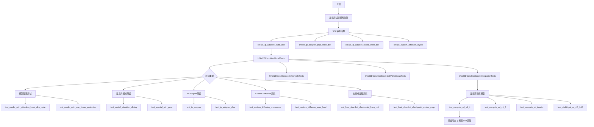
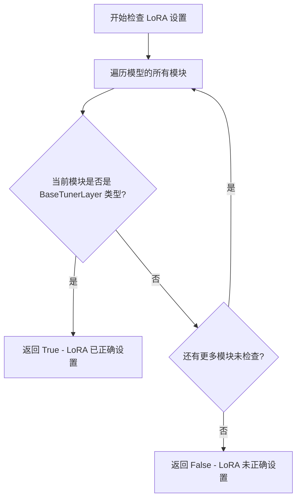
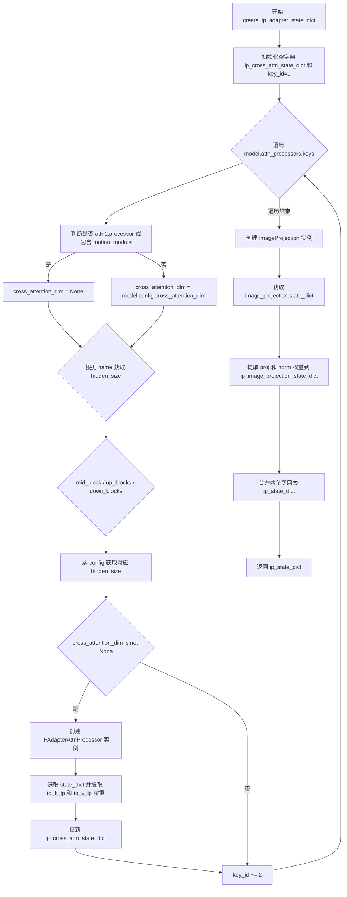
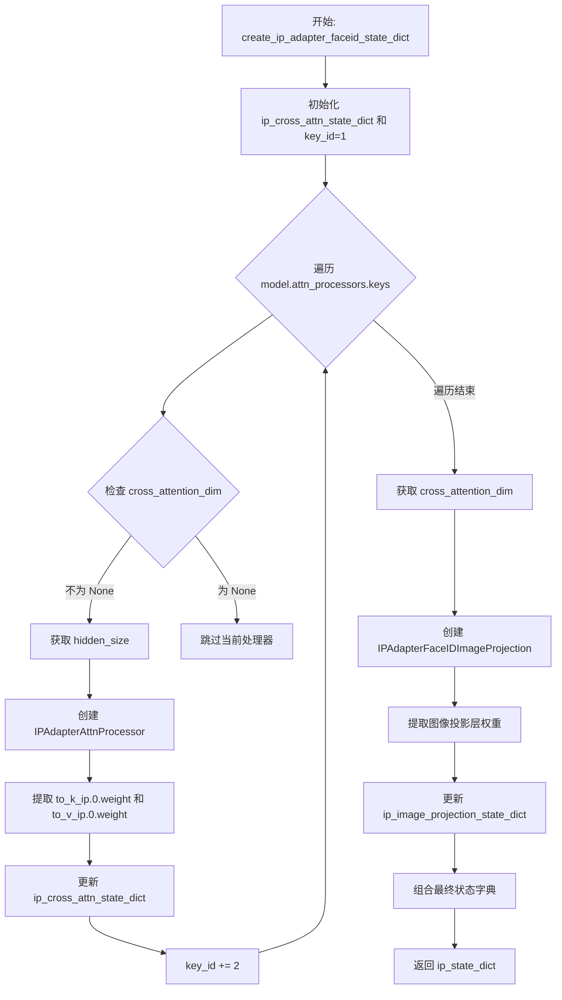
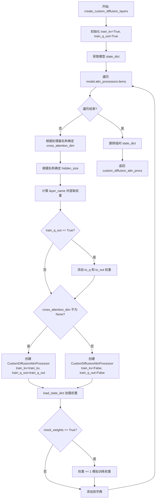
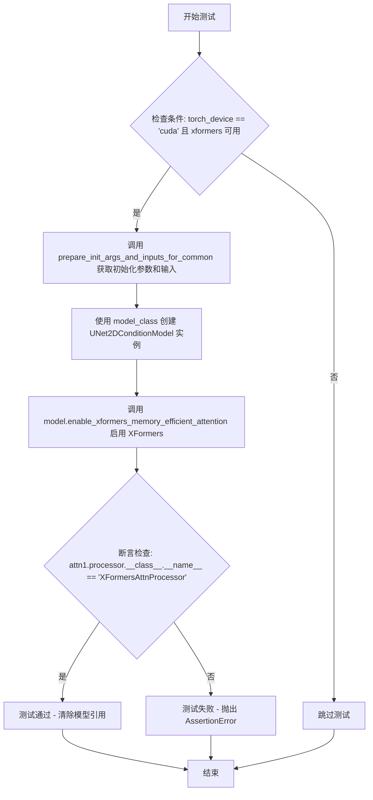
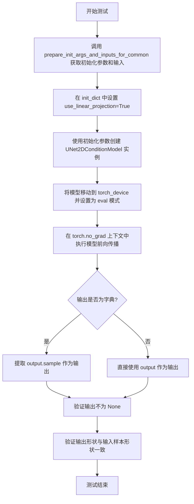
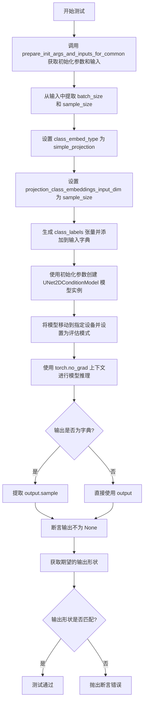
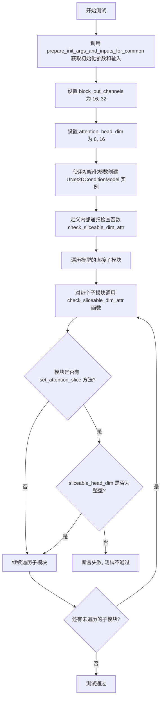

# `diffusers\tests\models\unets\test_models_unet_2d_condition.py` 详细设计文档

该文件是针对 UNet2DConditionModel 的全面测试套件，包含单元测试、编译测试、LoRA热交换测试和集成测试，验证模型在各种配置下（包括注意力机制、LoRA适配器、IP-Adapter、Custom Diffusion等功能）的正确性、稳定性和性能表现。

## 整体流程



## 类结构

```
UNet2DConditionModelTests (unittest.TestCase)
├── UNet2DConditionModelCompileTests (unittest.TestCase)
├── UNet2DConditionModelLoRAHotSwapTests (unittest.TestCase)
└── UNet2DConditionModelIntegrationTests (unittest.TestCase)
```

## 全局变量及字段


### `logger`
    
用于记录测试日志的日志记录器对象

类型：`logging.Logger`
    


### `enable_full_determinism`
    
启用完全确定性行为的函数，用于确保测试结果的可重复性

类型：`function`
    


### `UNet2DConditionModelTests.model_class`
    
测试所使用的UNet2DConditionModel模型类

类型：`type`
    


### `UNet2DConditionModelTests.main_input_name`
    
模型主输入参数的名称，此处为'sample'

类型：`str`
    


### `UNet2DConditionModelTests.model_split_percents`
    
用于模型分割测试的百分比列表

类型：`list`
    


### `UNet2DConditionModelCompileTests.model_class`
    
测试所使用的UNet2DConditionModel模型类

类型：`type`
    


### `UNet2DConditionModelLoRAHotSwapTests.model_class`
    
测试所使用的UNet2DConditionModel模型类

类型：`type`
    
    

## 全局函数及方法


### `get_unet_lora_config`

该函数用于创建并返回一个配置好的 LoRA（Low-Rank Adaptation）配置对象，专门用于 UNet2DConditionModel。它设置了 LoRA 的 rank、alpha、目标模块（注意力机制的 Query、Key、Value 和输出层），并禁用了默认的 LoRA 权重初始化和 DoRA 机制。

参数： 无

返回值：`LoraConfig`，返回配置好的 LoRA 配置对象，包含用于 UNet 的 LoRA 参数设置。

#### 流程图

```mermaid
flowchart TD
    A[开始] --> B[设置 rank = 4]
    B --> C[创建 LoraConfig 对象]
    C --> D[设置 r=rank]
    C --> E[设置 lora_alpha=rank]
    C --> F[设置 target_modules=['to_q', 'to_k', 'to_v', 'to_out.0']]
    C --> G[设置 init_lora_weights=False]
    C --> H[设置 use_dora=False]
    D --> I[返回 unet_lora_config]
    I --> J[结束]
```

#### 带注释源码

```python
def get_unet_lora_config():
    """
    创建 UNet 的 LoRA 配置。
    
    该函数返回一个 LoraConfig 对象，用于配置 UNet2DConditionModel 的 LoRA 微调参数。
    设置了较低的 rank 值（4）以减少参数量，target_modules 指定了需要应用 LoRA 的注意力层。
    """
    # 定义 LoRA 的 rank（秩），决定 LoRA 适配器的参数量
    rank = 4
    
    # 创建 LoraConfig 对象，配置 UNet 的 LoRA 参数
    unet_lora_config = LoraConfig(
        r=rank,                          # LoRA 秩，数值越小参数量越少
        lora_alpha=rank,                 # LoRA 缩放因子，通常与 rank 相同
        target_modules=["to_q", "to_k", "to_v", "to_out.0"],  # 目标模块：注意力机制的 Q、K、V 和输出层
        init_lora_weights=False,         # 是否初始化 LoRA 权重为默认值（False 以便后续加载预训练权重）
        use_dora=False,                  # 是否使用 DoRA（Decomposed Rank-Adaptation）技术
    )
    
    # 返回配置好的 LoraConfig 对象
    return unet_lora_config
```


### `check_if_lora_correctly_set`

检查模型中的 LoRA 层是否使用 PEFT 正确配置，通过遍历模型的所有模块来查找是否存在 `BaseTunerLayer` 类型的模块。

参数：

- `model`：`torch.nn.Module`，需要进行 LoRA 设置检查的模型实例

返回值：`bool`，如果模型中至少存在一个 PEFT 的 `BaseTunerLayer` 类型的模块（即 LoRA 层已正确设置），则返回 `True`，否则返回 `False`

#### 流程图



#### 带注释源码

```python
def check_if_lora_correctly_set(model) -> bool:
    """
    Checks if the LoRA layers are correctly set with peft
    """
    # 遍历传入模型的所有子模块
    for module in model.modules():
        # 检查当前模块是否为 PEFT 库中的 BaseTunerLayer 类型
        # BaseTunerLayer 是 PEFT 库中所有 LoRA 层的基类
        # 如果存在此类模块，说明 LoRA 已正确配置
        if isinstance(module, BaseTunerLayer):
            return True
    # 遍历完所有模块均未发现 LoRA 层配置
    return False
```


### `create_ip_adapter_state_dict`

该函数用于为 UNet2DConditionModel 创建 IP-Adapter 的状态字典，生成图像投影层（ImageProjection）和交叉注意力处理器（IPAdapterAttnProcessor）的权重字典，以便后续加载到模型中。

参数：

- `model`：`UNet2DConditionModel`，输入的 UNet 模型实例，需要从其中获取 attn_processors 和 config 信息来生成对应的状态字典

返回值：`dict`，包含两个键值对：`"image_proj"`（图像投影层的权重字典）和 `"ip_adapter"`（交叉注意力处理器的权重字典）

#### 流程图



#### 带注释源码

```python
def create_ip_adapter_state_dict(model):
    """
    为 UNet 模型创建 IP-Adapter 的状态字典。
    包含图像投影层权重和交叉注意力处理器权重。
    
    参数:
        model: UNet2DConditionModel 实例
        
    返回:
        包含 'image_proj' 和 'ip_adapter' 两个键的字典
    """
    # "ip_adapter" (cross-attention weights)
    # 初始化交叉注意力状态字典，用于存储 IP-Adapter 的注意力权重
    ip_cross_attn_state_dict = {}
    # key_id 用于生成唯一的权重键名，每次循环后增加 2
    key_id = 1

    # 遍历模型的所有注意力处理器
    for name in model.attn_processors.keys():
        # 确定交叉注意力维度：
        # 如果是 attn1.processor（自注意力）或包含 motion_module，则不需要 IP-Adapter
        cross_attention_dim = (
            None if name.endswith("attn1.processor") or "motion_module" in name else model.config.cross_attention_dim
        )

        # 根据处理器名称确定隐藏层大小
        if name.startswith("mid_block"):
            # 中间块使用最后一个通道数
            hidden_size = model.config.block_out_channels[-1]
        elif name.startswith("up_blocks"):
            # 上采样块需要反转通道列表来获取对应的大小
            block_id = int(name[len("up_blocks.")])
            hidden_size = list(reversed(model.config.block_out_channels))[block_id]
        elif name.startswith("down_blocks"):
            # 下采样块直接使用对应索引的通道数
            block_id = int(name[len("down_blocks.")])
            hidden_size = model.config.block_out_channels[block_id]

        # 如果存在交叉注意力维度，则创建 IP-Adapter 注意力处理器
        if cross_attention_dim is not None:
            # 创建 IPAdapterAttnProcessor 实例以获取默认权重
            sd = IPAdapterAttnProcessor(
                hidden_size=hidden_size, 
                cross_attention_dim=cross_attention_dim, 
                scale=1.0
            ).state_dict()
            # 提取 IP 适配器的 key 和 value 权重
            ip_cross_attn_state_dict.update(
                {
                    f"{key_id}.to_k_ip.weight": sd["to_k_ip.0.weight"],
                    f"{key_id}.to_v_ip.weight": sd["to_v_ip.0.weight"],
                }
            )

            # key_id 递增 2，为下一个处理器留出空间
            key_id += 2

    # "image_proj" (ImageProjection layer weights)
    # 从模型配置中获取交叉注意力维度
    cross_attention_dim = model.config["cross_attention_dim"]
    # 创建图像投影层实例
    image_projection = ImageProjection(
        cross_attention_dim=cross_attention_dim, 
        image_embed_dim=cross_attention_dim, 
        num_image_text_embeds=4
    )

    # 初始化图像投影状态字典
    ip_image_projection_state_dict = {}
    # 获取投影层的 state_dict
    sd = image_projection.state_dict()
    # 提取并映射投影层权重到目标键名
    ip_image_projection_state_dict.update(
        {
            "proj.weight": sd["image_embeds.weight"],
            "proj.bias": sd["image_embeds.bias"],
            "norm.weight": sd["norm.weight"],
            "norm.bias": sd["norm.bias"],
        }
    )

    # 释放临时变量
    del sd
    # 合并所有权重到最终状态字典
    ip_state_dict = {}
    ip_state_dict.update({
        "image_proj": ip_image_projection_state_dict, 
        "ip_adapter": ip_cross_attn_state_dict
    })
    return ip_state_dict
```


### `create_ip_adapter_plus_state_dict`

该函数用于为 UNet2DConditionModel 创建 IP-Adapter Plus 状态字典，提取图像投影层和交叉注意力处理器的权重，并进行键名映射以适配特定的模型结构。

参数：

- `model`：`UNet2DConditionModel`，需要进行 IP-Adapter Plus 权重提取的 UNet 模型实例

返回值：`dict`，包含 `"image_proj"` 和 `"ip_adapter"` 两个键的字典，分别存储图像投影层和交叉注意力处理器的权重状态

#### 流程图

```mermaid
flowchart TD
    A[开始] --> B[初始化 ip_cross_attn_state_dict 和 key_id=1]
    B --> C{遍历 model.attn_processors.keys}
    C --> D{判断处理器名称}
    D --> E1[mid_block: 获取 block_out_channels[-1]]
    D --> E2[up_blocks: 反转 block_out_channels 获取对应 block 的 hidden_size]
    D --> E3[down_blocks: 获取对应 block 的 hidden_size]
    E1 --> F{cross_attention_dim is not None}
    E2 --> F
    E3 --> F
    F -->|是| G[创建 IPAdapterAttnProcessor 并获取 state_dict]
    G --> H[提取 to_k_ip.0.weight 和 to_v_ip.0.weight]
    H --> I[key_id += 2]
    I --> C
    F -->|否| C
    C --> J[创建 IPAdapterPlusImageProjection]
    J --> K{遍历 image_projection.state_dict.items}
    K --> L{根据键名进行映射替换}
    L --> M[处理 to_k/to_v 合并为 to_kv]
    M --> K
    K --> N{遍历结束}
    N --> O[构建最终 ip_state_dict]
    O --> P[返回 ip_state_dict]
```

#### 带注释源码

```python
def create_ip_adapter_plus_state_dict(model):
    """
    为 UNet2DConditionModel 创建 IP-Adapter Plus 状态字典
    提取图像投影层和交叉注意力处理器的权重
    
    参数:
        model: UNet2DConditionModel 实例，需要提取 IP-Adapter 权重
        
    返回:
        dict: 包含 'image_proj' 和 'ip_adapter' 两个键的字典
    """
    
    # ========== 第一部分：提取 ip_adapter (交叉注意力权重) ==========
    # "ip_adapter" (cross-attention weights)
    ip_cross_attn_state_dict = {}
    key_id = 1

    # 遍历模型中所有的注意力处理器
    for name in model.attn_processors.keys():
        # 确定交叉注意力维度：attn1.processor 为自注意力，无交叉注意力维度
        cross_attention_dim = None if name.endswith("attn1.processor") else model.config.cross_attention_dim
        
        # 根据模块名称确定隐藏层大小
        if name.startswith("mid_block"):
            hidden_size = model.config.block_out_channels[-1]
        elif name.startswith("up_blocks"):
            block_id = int(name[len("up_blocks.")])
            hidden_size = list(reversed(model.config.block_out_channels))[block_id]
        elif name.startswith("down_blocks"):
            block_id = int(name[len("down_blocks.")])
            hidden_size = model.config.block_out_channels[block_id]
        
        # 只有具有交叉注意力维度的处理器才需要提取
        if cross_attention_dim is not None:
            # 创建 IPAdapterAttnProcessor 获取默认权重
            sd = IPAdapterAttnProcessor(
                hidden_size=hidden_size, cross_attention_dim=cross_attention_dim, scale=1.0
            ).state_dict()
            # 提取 to_k_ip 和 to_v_ip 权重
            ip_cross_attn_state_dict.update(
                {
                    f"{key_id}.to_k_ip.weight": sd["to_k_ip.0.weight"],
                    f"{key_id}.to_v_ip.weight": sd["to_v_ip.0.weight"],
                }
            )
            # key_id 跳 2，避免与 LoRA 权重冲突
            key_id += 2

    # ========== 第二部分：提取 image_proj (图像投影层权重) ==========
    # "image_proj" (ImageProjection layer weights)
    cross_attention_dim = model.config["cross_attention_dim"]
    # 创建 IP-Adapter Plus 专用的图像投影层
    image_projection = IPAdapterPlusImageProjection(
        embed_dims=cross_attention_dim, 
        output_dims=cross_attention_dim, 
        dim_head=32, 
        heads=2, 
        num_queries=4
    )

    ip_image_projection_state_dict = OrderedDict()

    # 遍历投影层状态字典并进行键名映射
    for k, v in image_projection.state_dict().items():
        # 处理层归一化层的键名映射（从新结构映射到旧结构）
        if "2.to" in k:
            k = k.replace("2.to", "0.to")
        elif "layers.0.ln0" in k:
            k = k.replace("layers.0.ln0", "layers.0.0.norm1")
        elif "layers.0.ln1" in k:
            k = k.replace("layers.0.ln1", "layers.0.0.norm2")
        elif "layers.1.ln0" in k:
            k = k.replace("layers.1.ln0", "layers.1.0.norm1")
        elif "layers.1.ln1" in k:
            k = k.replace("layers.1.ln1", "layers.1.0.norm2")
        elif "layers.2.ln0" in k:
            k = k.replace("layers.2.ln0", "layers.2.0.norm1")
        elif "layers.2.ln1" in k:
            k = k.replace("layers.2.ln1", "layers.2.0.norm2")
        elif "layers.3.ln0" in k:
            k = k.replace("layers.3.ln0", "layers.3.0.norm1")
        elif "layers.3.ln1" in k:
            k = k.replace("layers.3.ln1", "layers.3.0.norm2")
        # 处理注意力层键名映射
        elif "to_q" in k:
            parts = k.split(".")
            parts[2] = "attn"
            k = ".".join(parts)
        elif "to_out.0" in k:
            parts = k.split(".")
            parts[2] = "attn"
            k = ".".join(parts)
            k = k.replace("to_out.0", "to_out")
        else:
            # 处理前馈网络层键名映射
            k = k.replace("0.ff.0", "0.1.0")
            k = k.replace("0.ff.1.net.0.proj", "0.1.1")
            k = k.replace("0.ff.1.net.2", "0.1.3")

            k = k.replace("1.ff.0", "1.1.0")
            k = k.replace("1.ff.1.net.0.proj", "1.1.1")
            k = k.replace("1.ff.1.net.2", "1.1.3")

            k = k.replace("2.ff.0", "2.1.0")
            k = k.replace("2.ff.1.net.0.proj", "2.1.1")
            k = k.replace("2.ff.1.net.2", "2.1.3")

            k = k.replace("3.ff.0", "3.1.0")
            k = k.replace("3.ff.1.net.0.proj", "3.1.1")
            k = k.replace("3.ff.1.net.2", "3.1.3")

        # 处理键值映射：to_k 和 to_v 需要合并为 to_kv
        if "to_k" in k:
            parts = k.split(".")
            parts[2] = "attn"
            k = ".".join(parts)
            # 将 to_k 和 to_v 在 dim=0 维度拼接
            ip_image_projection_state_dict[k.replace("to_k", "to_kv")] = torch.cat([v, v], dim=0)
        elif "to_v" in k:
            # to_v 被跳过，因为已经合并到 to_kv 中
            continue
        else:
            ip_image_projection_state_dict[k] = v

    # ========== 第三部分：构建最终状态字典 ==========
    ip_state_dict = {}
    ip_state_dict.update({"image_proj": ip_image_projection_state_dict, "ip_adapter": ip_cross_attn_state_dict})
    return ip_state_dict
```


### `create_ip_adapter_faceid_state_dict`

该函数用于为 UNet2DConditionModel 生成 FaceID 类型的 IP-Adapter 状态字典，提取图像投影层和跨注意力处理器的权重，用于后续的 IP-Adapter 加载和推理。

参数：

- `model`：`UNet2DConditionModel`，需要提取 IP-Adapter 状态字典的 UNet 模型实例

返回值：`dict`，包含 `"image_proj"`（图像投影层权重）和 `"ip_adapter"`（跨注意力处理器权重）的状态字典

#### 流程图



#### 带注释源码

```python
def create_ip_adapter_faceid_state_dict(model):
    """
    为 FaceID 类型的 IP-Adapter 创建状态字典。
    该函数提取模型的跨注意力处理器权重和图像投影层权重，
    用于后续加载到 UNet 模型中支持 IP-Adapter 功能。
    
    参数:
        model: UNet2DConditionModel 实例，需要包含 attn_processors
        
    返回:
        dict: 包含 'image_proj' 和 'ip_adapter' 两个键的字典
    """
    
    # ===== 第一部分：提取 IP-Adapter 跨注意力权重 =====
    # "ip_adapter" (cross-attention weights)
    # 注意：FaceID 类型不包含 LoRA 权重
    ip_cross_attn_state_dict = {}
    key_id = 1  # 用于生成权重键名，每个处理器占用 key_id 和 key_id+1

    # 遍历模型的所有注意力处理器
    for name in model.attn_processors.keys():
        # 确定是否需要跨注意力维度
        # 如果是 attn1 处理器（自注意力）或包含 motion_module，则跳过
        cross_attention_dim = (
            None if name.endswith("attn1.processor") or "motion_module" in name 
            else model.config.cross_attention_dim
        )

        # 根据处理器名称确定 hidden_size（隐藏层大小）
        if name.startswith("mid_block"):
            # 中间块使用最后一个通道数
            hidden_size = model.config.block_out_channels[-1]
        elif name.startswith("up_blocks"):
            # 上采样块需要反转通道列表来获取对应索引的通道数
            block_id = int(name[len("up_blocks.")])
            hidden_size = list(reversed(model.config.block_out_channels))[block_id]
        elif name.startswith("down_blocks"):
            # 下采样块直接使用对应索引的通道数
            block_id = int(name[len("down_blocks.")])
            hidden_size = model.config.block_out_channels[block_id]

        # 如果当前处理器支持跨注意力
        if cross_attention_dim is not None:
            # 创建 IPAdapterAttnProcessor 实例并获取其权重
            sd = IPAdapterAttnProcessor(
                hidden_size=hidden_size, 
                cross_attention_dim=cross_attention_dim, 
                scale=1.0
            ).state_dict()
            
            # 提取 IP 相关的 k 和 v 权重
            ip_cross_attn_state_dict.update(
                {
                    f"{key_id}.to_k_ip.weight": sd["to_k_ip.0.weight"],
                    f"{key_id}.to_v_ip.weight": sd["to_v_ip.0.weight"],
                }
            )

            # key_id 递增 2，因为每个注意力层有 to_k 和 to_v 两个权重
            key_id += 2

    # ===== 第二部分：提取图像投影层权重 =====
    # "image_proj" (ImageProjection layer weights)
    cross_attention_dim = model.config["cross_attention_dim"]
    
    # 创建 FaceID 专用的图像投影层
    image_projection = IPAdapterFaceIDImageProjection(
        cross_attention_dim=cross_attention_dim,  # 跨注意力维度
        image_embed_dim=cross_attention_dim,      # 图像嵌入维度
        mult=2,                                     # 乘法因子
        num_tokens=4                                # token 数量
    )

    ip_image_projection_state_dict = {}
    sd = image_projection.state_dict()
    
    # 从投影层状态字典中提取特定权重并重命名键
    ip_image_projection_state_dict.update(
        {
            "proj.0.weight": sd["ff.net.0.proj.weight"],    # 前馈网络第一层投影权重
            "proj.0.bias": sd["ff.net.0.proj.bias"],          # 前馈网络第一层投影偏置
            "proj.2.weight": sd["ff.net.2.weight"],           # 前馈网络第二层权重
            "proj.2.bias": sd["ff.net.2.bias"],               # 前馈网络第二层偏置
            "norm.weight": sd["norm.weight"],                 # 归一化层权重
            "norm.bias": sd["norm.bias"],                     # 归一化层偏置
        }
    )

    # 释放临时变量以节省内存
    del sd
    
    # ===== 第三部分：组合最终状态字典 =====
    ip_state_dict = {}
    ip_state_dict.update({
        "image_proj": ip_image_projection_state_dict,  # 图像投影层权重
        "ip_adapter": ip_cross_attn_state_dict          # IP-Adapter 跨注意力权重
    })
    
    return ip_state_dict
```


### `create_custom_diffusion_layers`

该函数用于为 UNet2DConditionModel 创建自定义扩散层（Custom Diffusion Attention Processors）。它遍历模型的所有注意力处理器，根据每层的配置（hidden_size、cross_attention_dim 等）创建对应的 CustomDiffusionAttnProcessor 实例，并从模型权重中加载参数，可选地通过添加偏移量模拟已训练权重。

参数：

-  `model`：`UNet2DConditionModel`，需要添加自定义扩散层的 UNet 模型
-  `mock_weights`：`bool`，默认为 True，是否通过给权重加 1 来模拟已训练的状态

返回值：`Dict[str, CustomDiffusionAttnProcessor]`，返回包含所有自定义扩散注意力处理器的字典，键为处理器名称，值为 CustomDiffusionAttnProcessor 实例

#### 流程图



#### 带注释源码

```python
def create_custom_diffusion_layers(model, mock_weights: bool = True):
    """
    为模型创建自定义扩散注意力处理器层
    
    参数:
        model: UNet2DConditionModel 实例
        mock_weights: 是否模拟已训练的权重（通过给权重加1实现）
    
    返回:
        包含 CustomDiffusionAttnProcessor 的字典
    """
    # 训练键值投影和查询输出投影
    train_kv = True
    train_q_out = True
    
    # 存储自定义扩散注意力处理器的字典
    custom_diffusion_attn_procs = {}

    # 获取模型的完整状态字典
    st = model.state_dict()
    
    # 遍历模型中所有的注意力处理器
    for name, _ in model.attn_processors.items():
        # 确定 cross_attention_dim：对于 attn1 处理器（self-attention）为 None，否则使用模型配置
        cross_attention_dim = None if name.endswith("attn1.processor") else model.config.cross_attention_dim
        
        # 根据处理器名称确定 hidden_size（隐藏层维度）
        if name.startswith("mid_block"):
            # 中间块使用最后一个通道数
            hidden_size = model.config.block_out_channels[-1]
        elif name.startswith("up_blocks"):
            # 上采样块需要反转通道顺序并根据块ID获取
            block_id = int(name[len("up_blocks.")])
            hidden_size = list(reversed(model.config.block_out_channels))[block_id]
        elif name.startswith("down_blocks"):
            # 下采样块直接根据块ID获取
            block_id = int(name[len("down_blocks.")])
            hidden_size = model.config.block_out_channels[block_id]
        
        # 提取层名称（去除 .processor 后缀）
        layer_name = name.split(".processor")[0]
        
        # 从模型权重中提取自定义扩散需要的权重
        weights = {
            "to_k_custom_diffusion.weight": st[layer_name + ".to_k.weight"],
            "to_v_custom_diffusion.weight": st[layer_name + ".to_v.weight"],
        }
        
        # 如果需要训练查询输出投影
        if train_q_out:
            weights["to_q_custom_diffusion.weight"] = st[layer_name + ".to_q.weight"]
            weights["to_out_custom_diffusion.0.weight"] = st[layer_name + ".to_out.0.weight"]
            weights["to_out_custom_diffusion.0.bias"] = st[layer_name + ".to_out.0.bias"]
        
        # 根据是否有 cross_attention_dim 创建不同的处理器
        if cross_attention_dim is not None:
            # 对于有交叉注意力的层，创建可训练的自定义扩散处理器
            custom_diffusion_attn_procs[name] = CustomDiffusionAttnProcessor(
                train_kv=train_kv,
                train_q_out=train_q_out,
                hidden_size=hidden_size,
                cross_attention_dim=cross_attention_dim,
            ).to(model.device)
            
            # 加载提取的权重
            custom_diffusion_attn_procs[name].load_state_dict(weights)
            
            # 可选：模拟已训练的权重（给权重加1）
            if mock_weights:
                with torch.no_grad():
                    custom_diffusion_attn_procs[name].to_k_custom_diffusion.weight += 1
                    custom_diffusion_attn_procs[name].to_v_custom_diffusion.weight += 1
        else:
            # 对于没有交叉注意力的层（如 self-attention），创建不可训练的处理器
            custom_diffusion_attn_procs[name] = CustomDiffusionAttnProcessor(
                train_kv=False,
                train_q_out=False,
                hidden_size=hidden_size,
                cross_attention_dim=cross_attention_dim,
            )
    
    # 清理临时变量
    del st
    
    # 返回自定义扩散注意力处理器字典
    return custom_diffusion_attn_procs
```


### `UNet2DConditionModelTests.dummy_input`

该属性方法用于生成UNet2DConditionModel的虚拟输入数据，返回一个包含噪声样本、时间步和编码器隐藏状态的字典，供模型测试使用。

参数：无（该方法为属性方法，无需参数）

返回值：`Dict[str, torch.Tensor]`，返回包含三个键的字典：
- `sample`：形状为(4, 4, 16, 16)的噪声张量，作为UNet的输入样本
- `timestep`：形状为(1,)的时间步张量，表示扩散过程的时间步
- `encoder_hidden_states`：形状为(4, 4, 8)的编码器隐藏状态，用于条件生成

#### 流程图

```mermaid
flowchart TD
    A[开始] --> B[设置batch_size=4, num_channels=4, sizes=(16, 16)]
    B --> C[使用floats_tensor生成噪声张量: shape=(4, 4, 16, 16)]
    C --> D[创建时间步张量: torch.tensor([10])]
    D --> E[使用floats_tensor生成编码器隐藏状态: shape=(4, 4, 8)]
    E --> F[将所有张量移动到torch_device设备]
    F --> G[返回包含sample, timestep, encoder_hidden_states的字典]
    G --> H[结束]
```

#### 带注释源码

```python
@property
def dummy_input(self):
    """
    生成UNet2DConditionModel测试用的虚拟输入数据
    
    Returns:
        Dict[str, torch.Tensor]: 包含模型所需输入的字典
            - sample: 噪声样本张量，形状为(batch_size, num_channels, height, width)
            - timestep: 时间步张量，用于扩散过程
            - encoder_hidden_states: 条件编码隐藏状态
    """
    # 定义批次大小和通道数
    batch_size = 4
    num_channels = 4
    # 定义空间尺寸（高度和宽度）
    sizes = (16, 16)

    # 生成随机浮点噪声张量并移动到指定设备
    # 形状: (batch_size, num_channels, height, width) = (4, 4, 16, 16)
    noise = floats_tensor((batch_size, num_channels) + sizes).to(torch_device)
    
    # 创建时间步张量，值为10，形状为(1,)
    # 表示扩散过程中的特定时间点
    time_step = torch.tensor([10]).to(torch_device)
    
    # 生成编码器隐藏状态，用于条件生成
    # 形状: (batch_size, seq_len, embed_dim) = (4, 4, 8)
    encoder_hidden_states = floats_tensor((batch_size, 4, 8)).to(torch_device)

    # 返回包含所有输入的字典，供模型forward使用
    return {"sample": noise, "timestep": time_step, "encoder_hidden_states": encoder_hidden_states}
```


### `UNet2DConditionModelTests.input_shape`

该属性方法定义了 UNet2DConditionModel 在测试中的输入形状，返回一个包含批量大小和空间维度的元组，用于测试用例的输入数据维度验证。

参数：

- `self`：隐含参数，`UNet2DConditionModelTests` 实例本身，无需显式传递

返回值：`tuple`，返回 `(4, 16, 16)` 的元组，表示 (批量大小, 高度, 宽度) 的输入形状

#### 流程图

```mermaid
flowchart TD
    A[开始访问 input_shape 属性] --> B{检查缓存/计算属性}
    B -->|首次访问| C[返回元组 (4, 16, 16)]
    B -->|已缓存| D[直接返回缓存值]
    C --> E[结束]
    D --> E
```

#### 带注释源码

```python
@property
def input_shape(self):
    """
    定义 UNet2DConditionModel 测试的输入形状
    
    Returns:
        tuple: 输入形状元组，格式为 (batch_size, height, width)
              - batch_size: 4 表示每个测试批次处理 4 个样本
              - height: 16 表示输入图像的高度为 16 像素
              - width: 16 表示输入图像的宽度为 16 像素
    """
    return (4, 16, 16)
```


### `UNet2DConditionModelTests.output_shape`

这是一个测试类属性，用于定义 UNet2DConditionModel 的预期输出形状。

参数：
- 无参数（这是一个 `@property` 装饰器定义的属性）

返回值：`tuple`，返回模型输出的预期形状 `(4, 16, 16)`，表示 (batch_size, height, width)。

#### 流程图

```mermaid
flowchart TD
    A[访问 output_shape 属性] --> B{是否已缓存}
    B -->|否| C[返回元组 (4, 16, 16)]
    B -->|是| C
```

#### 带注释源码

```python
@property
def output_shape(self):
    """
    返回 UNet2DConditionModel 的预期输出形状。
    该属性用于测试框架中验证模型输出维度是否正确。
    
    Returns:
        tuple: 包含三个整数的元组 (batch_size, height, width)
               - batch_size: 4 (批量大小)
               - height: 16 (输出高度)
               - width: 16 (输出宽度)
    """
    return (4, 16, 16)
```

#### 说明

该属性是 `UNet2DConditionModelTests` 测试类的一部分，继承自 `ModelTesterMixin` 和 `UNetTesterMixin`。在测试框架中，`output_shape` 与 `input_shape` 配合使用，用于验证模型前向传播后输出的形状是否与输入形状一致，确保模型正确地保持了空间维度。


### `UNet2DConditionModelTests.prepare_init_args_and_inputs_for_common`

该方法是测试类 `UNet2DConditionModelTests` 的核心辅助方法，用于为 UNet2DConditionModel 的通用测试准备初始化参数和测试输入数据。它返回一个包含模型配置字典和输入字典的元组，供各类测试用例使用，确保测试环境的一致性和可重复性。

参数：

- `self`：`UNet2DConditionModelTests` 类实例，隐式参数，表示当前测试类对象

返回值：`Tuple[Dict, Dict]`，返回一个元组，包含：
  - `init_dict`：模型初始化参数字典，包含块输出通道数、归一化组数、上下块类型、交叉注意力维度、注意力头维度、输入输出通道数等配置
  - `inputs_dict`：测试输入字典，包含噪声样本、时间步长和编码器隐藏状态

#### 流程图

```mermaid
flowchart TD
    A[开始] --> B[构建 init_dict 参数字典]
    B --> C[设置 block_out_channels: (4, 8)]
    C --> D[设置 norm_num_groups: 4]
    D --> E[设置 down_block_types 和 up_block_types]
    E --> F[设置 cross_attention_dim: 8]
    F --> G[设置 attention_head_dim: 2]
    G --> H[设置 out_channels 和 in_channels: 4]
    H --> I[设置 layers_per_block: 1]
    I --> J[设置 sample_size: 16]
    J --> K[调用 self.dummy_input 获取 inputs_dict]
    K --> L[返回 (init_dict, inputs_dict) 元组]
```

#### 带注释源码

```python
def prepare_init_args_and_inputs_for_common(self):
    """
    准备用于 UNet2DConditionModel 通用测试的初始化参数和输入数据
    
    Returns:
        Tuple[Dict, Dict]: 包含模型初始化配置和测试输入的元组
    """
    # 定义模型初始化参数字典，包含 UNet2DConditionModel 所需的核心配置
    init_dict = {
        "block_out_channels": (4, 8),           # 输出通道数配置，每个块的输出通道
        "norm_num_groups": 4,                     # 归一化组数，用于组归一化
        "down_block_types": ("CrossAttnDownBlock2D", "DownBlock2D"),  # 下采样块类型
        "up_block_types": ("UpBlock2D", "CrossAttnUpBlock2D"),        # 上采样块类型
        "cross_attention_dim": 8,               # 交叉注意力维度
        "attention_head_dim": 2,                 # 注意力头维度
        "out_channels": 4,                       # 输出通道数
        "in_channels": 4,                        # 输入通道数
        "layers_per_block": 1,                  # 每个块的层数
        "sample_size": 16,                       # 样本空间尺寸
    }
    # 从测试类属性获取预定义的虚拟输入（包含噪声、时间步和编码器隐藏状态）
    inputs_dict = self.dummy_input
    # 返回初始化参数和输入字典的元组
    return init_dict, inputs_dict
```


### `UNet2DConditionModelTests.test_xformers_enable_works`

该测试方法用于验证 XFormers 内存高效注意力机制是否能在 UNet2DConditionModel 中正确启用。测试首先准备模型初始化参数和输入，然后创建模型实例，接着调用 `enable_xformers_memory_efficient_attention()` 方法启用 XFormers 注意力，最后通过断言检查模型中间块的注意力处理器的类名是否为 "XFormersAttnProcessor" 以确认启用成功。

参数：

- `self`：`UNet2DConditionModelTests`，表示类的实例本身，用于访问类属性和方法

返回值：`None`，该测试方法无返回值，通过断言进行验证

#### 流程图



#### 带注释源码

```python
@unittest.skipIf(
    torch_device != "cuda" or not is_xformers_available(),
    # 条件检查：仅在 CUDA 设备且 xformers 库可用时执行此测试
    reason="XFormers attention is only available with CUDA and `xformers` installed",
)
def test_xformers_enable_works(self):
    """
    测试 XFormers 内存高效注意力机制是否能在 UNet2DConditionModel 中正确启用。
    该测试验证 enable_xformers_memory_efficient_attention() 方法
    会将模型的注意力处理器正确切换为 XFormersAttnProcessor。
    """
    # 获取模型初始化所需的参数字典和输入数据
    init_dict, inputs_dict = self.prepare_init_args_and_inputs_for_common()
    
    # 使用初始化参数创建 UNet2DConditionModel 模型实例
    model = self.model_class(**init_dict)

    # 调用模型方法启用 XFormers 内存高效注意力机制
    model.enable_xformers_memory_efficient_attention()

    # 断言验证：检查模型中间块的第一个注意力模块的
    # transformer_blocks[0] 的 attn1 处理器是否已更改为 XFormersAttnProcessor
    assert (
        model.mid_block.attentions[0].transformer_blocks[0].attn1.processor.__class__.__name__
        == "XFormersAttnProcessor"
    ), "xformers is not enabled"
```


### `UNet2DConditionModelTests.test_model_with_attention_head_dim_tuple`

该测试方法用于验证 UNet2DConditionModel 在使用元组形式的 `attention_head_dim` 参数时能够正确运行，并确保模型输出的形状与输入形状一致。

参数：

- `self`：`UNet2DConditionModelTests`，测试类实例，包含模型配置和测试工具方法

返回值：`None`，测试方法无返回值，通过断言验证功能正确性

#### 流程图

```mermaid
flowchart TD
    A[开始测试] --> B[调用 prepare_init_args_and_inputs_for_common 获取初始化参数和输入]
    B --> C[设置 block_out_channels = (16, 32)]
    C --> D[设置 attention_head_dim = (8, 16)]
    D --> E[使用初始化参数创建 UNet2DConditionModel 实例]
    E --> F[将模型移至 torch_device 并设置为 eval 模式]
    F --> G[使用 torch.no_grad 上下文执行前向传播]
    G --> H{输出是否为字典?}
    H -->|是| I[从字典中提取 sample 字段]
    H -->|否| J[直接使用输出]
    I --> K[验证输出不为 None]
    J --> K
    K --> L[获取输入样本的期望形状]
    L --> M{输出形状是否等于期望形状?}
    M -->|是| N[测试通过]
    M -->|否| O[测试失败, 抛出 AssertionError]
```

#### 带注释源码

```python
def test_model_with_attention_head_dim_tuple(self):
    """
    测试 UNet2DConditionModel 在使用元组形式的 attention_head_dim 时是否正常工作。
    该测试验证模型能够正确处理不同层具有不同注意力头维度的配置。
    """
    # 获取基类方法提供的初始化参数和输入字典
    # 包含: block_out_channels, norm_num_groups, down_block_types, up_block_types,
    # cross_attention_dim, attention_head_dim, out_channels, in_channels, 
    # layers_per_block, sample_size 等配置
    init_dict, inputs_dict = self.prepare_init_args_and_inputs_for_common()

    # 覆盖默认配置，设置为两层结构，每层有不同的注意力头维度
    init_dict["block_out_channels"] = (16, 32)  # 两个输出块，通道数分别为16和32
    init_dict["attention_head_dim"] = (8, 16)   # 第一层8个注意力头，第二层16个注意力头

    # 使用修改后的配置实例化 UNet2DConditionModel
    model = self.model_class(**init_dict)
    
    # 将模型移至指定的计算设备（如 CUDA 或 CPU）
    model.to(torch_device)
    
    # 设置为评估模式，禁用 dropout 等训练特定操作
    model.eval()

    # 执行前向传播，计算输出
    with torch.no_grad():
        # 将输入字典解包后传入模型
        output = model(**inputs_dict)

        # 处理可能的输出格式：某些配置下返回字典而非直接的张量
        if isinstance(output, dict):
            output = output.sample

    # 验证模型确实产生了输出（非 None）
    self.assertIsNotNone(output)
    
    # 获取输入样本的期望形状
    expected_shape = inputs_dict["sample"].shape
    
    # 验证输出形状与输入形状完全匹配
    self.assertEqual(output.shape, expected_shape, "Input and output shapes do not match")
```


### `UNet2DConditionModelTests.test_model_with_use_linear_projection`

该测试方法用于验证 UNet2DConditionModel 在启用线性投影（use_linear_projection=True）配置下的前向传播功能，确保模型能够正确处理输入并输出与输入形状匹配的样本。

参数：

- `self`：隐式参数，类型为 `UNet2DConditionModelTests`，表示测试类实例本身

返回值：`None`，该方法为测试方法，无返回值，通过 unittest 断言验证模型正确性

#### 流程图



#### 带注释源码

```python
def test_model_with_use_linear_projection(self):
    """
    测试 UNet2DConditionModel 在使用线性投影时的前向传播功能。
    验证模型配置 use_linear_projection=True 时能够正常处理输入并输出正确形状的结果。
    """
    # 获取模型初始化参数和测试输入数据
    init_dict, inputs_dict = self.prepare_init_args_and_inputs_for_common()

    # 启用线性投影功能
    init_dict["use_linear_projection"] = True

    # 使用配置参数实例化 UNet2DConditionModel 模型
    model = self.model_class(**init_dict)
    # 将模型移动到指定的计算设备（如 CUDA 或 CPU）
    model.to(torch_device)
    # 设置模型为评估模式，禁用 Dropout 等训练特定的操作
    model.eval()

    # 禁用梯度计算以提高推理效率并减少内存占用
    with torch.no_grad():
        # 执行模型前向传播，将输入字典解包传递给模型
        output = model(**inputs_dict)

        # 如果输出是字典类型，则提取 sample 字段
        # UNet2DConditionModel 的前向传播可能返回包含 sample 的字典
        if isinstance(output, dict):
            output = output.sample

    # 断言验证输出不为空
    self.assertIsNotNone(output)
    # 获取输入样本的期望形状
    expected_shape = inputs_dict["sample"].shape
    # 验证模型输出的形状与输入样本的形状完全匹配
    self.assertEqual(output.shape, expected_shape, "Input and output shapes do not match")
```


### `UNet2DConditionModelTests.test_model_with_cross_attention_dim_tuple`

该方法是一个单元测试，用于验证 `UNet2DConditionModel` 在使用元组类型的 `cross_attention_dim` 参数时能够正确运行，并确保模型输出的形状与输入样本的形状一致。

参数：

- `self`：`UNet2DConditionModelTests`，测试类实例本身

返回值：`None`，该方法为单元测试方法，通过断言验证模型功能，不返回具体数值

#### 流程图

```mermaid
flowchart TD
    A[开始测试] --> B[调用 prepare_init_args_and_inputs_for_common 获取初始化参数和输入]
    B --> C[设置 cross_attention_dim 为元组 (8, 8)]
    C --> D[使用初始化参数实例化 UNet2DConditionModel]
    D --> E[将模型移动到 torch_device 并设置为 eval 模式]
    E --> F[在 torch.no_grad 上下文中执行模型前向传播]
    F --> G{输出是否为字典?}
    G -->|是| H[提取 output.sample]
    G -->|否| I[直接使用 output]
    H --> J[断言 output 不为 None]
    I --> J
    J --> K[获取输入样本的预期形状]
    K --> L{输出形状 == 预期形状?}
    L -->|是| M[测试通过]
    L -->|否| N[测试失败 - 抛出 AssertionError]
```

#### 带注释源码

```python
def test_model_with_cross_attention_dim_tuple(self):
    """
    测试 UNet2DConditionModel 使用元组类型的 cross_attention_dim 参数时的功能。
    验证模型能够正确处理交叉注意力维度配置并产生预期形状的输出。
    """
    # 准备模型初始化参数和测试输入数据
    init_dict, inputs_dict = self.prepare_init_args_and_inputs_for_common()

    # 设置 cross_attention_dim 为元组 (8, 8)，测试模型对元组参数的支持
    init_dict["cross_attention_dim"] = (8, 8)

    # 使用配置参数实例化 UNet2DConditionModel 模型
    model = self.model_class(**init_dict)
    # 将模型移动到指定的计算设备（如 CUDA）并设置为评估模式
    model.to(torch_device)
    model.eval()

    # 禁用梯度计算以提高推理效率并减少内存占用
    with torch.no_grad():
        # 执行模型前向传播，传入噪声样本、时间步和编码器隐藏状态
        output = model(**inputs_dict)

        # 处理输出格式：某些配置下输出为字典，需提取 sample 字段
        if isinstance(output, dict):
            output = output.sample

    # 验证模型输出不为空
    self.assertIsNotNone(output)
    # 获取输入样本的预期形状
    expected_shape = inputs_dict["sample"].shape
    # 断言输出形状与输入形状匹配，确保模型正确处理了空间维度
    self.assertEqual(output.shape, expected_shape, "Input and output shapes do not match")
```


### `UNet2DConditionModelTests.test_model_with_simple_projection`

该测试方法用于验证 UNet2DConditionModel 在使用简单投影（simple_projection）进行类嵌入时的功能是否正常工作。测试通过构建带有 class_labels 的输入数据，运行模型推理，并验证输出的形状与输入形状匹配。

参数：

- `self`：测试类实例本身，无需显式传递

返回值：`无返回值`（void），该方法为单元测试方法，通过 `self.assertEqual` 等断言验证模型行为

#### 流程图



#### 带注释源码

```python
def test_model_with_simple_projection(self):
    """
    测试 UNet2DConditionModel 使用简单投影（simple_projection）进行类嵌入时的功能。
    该测试验证模型能够正确处理 class_labels 输入并产生正确形状的输出。
    """
    
    # 步骤1: 获取初始化参数和输入数据
    # 调用父类方法获取标准的模型初始化字典和输入字典
    init_dict, inputs_dict = self.prepare_init_args_and_inputs_for_common()

    # 步骤2: 从输入数据中提取批次大小和样本尺寸
    # inputs_dict["sample"] 的形状为 (batch_size, num_channels, height, width)
    batch_size, _, _, sample_size = inputs_dict["sample"].shape

    # 步骤3: 配置 UNet 的类嵌入类型为 simple_projection
    # simple_projection 是一种将类标签投影到嵌入空间的方法
    init_dict["class_embed_type"] = "simple_projection"
    
    # 设置投影类嵌入的输入维度
    init_dict["projection_class_embeddings_input_dim"] = sample_size

    # 步骤4: 生成类标签并添加到输入字典
    # 使用 floats_tensor 生成随机浮点张量作为类标签
    inputs_dict["class_labels"] = floats_tensor((batch_size, sample_size)).to(torch_device)

    # 步骤5: 创建模型实例
    # 使用配置好的初始化参数创建 UNet2DConditionModel
    model = self.model_class(**init_dict)
    
    # 步骤6: 将模型移动到指定设备并设置为评估模式
    model.to(torch_device)
    model.eval()

    # 步骤7: 执行模型推理
    with torch.no_grad():
        output = model(**inputs_dict)

        # 步骤8: 处理输出
        # 模型输出可以是字典或直接的张量
        # 如果是字典，则提取 sample 字段
        if isinstance(output, dict):
            output = output.sample

    # 步骤9: 验证输出
    # 断言输出不为 None
    self.assertIsNotNone(output)
    
    # 获取期望的输出形状（与输入样本形状相同）
    expected_shape = inputs_dict["sample"].shape
    
    # 断言输出形状与期望形状匹配
    self.assertEqual(output.shape, expected_shape, "Input and output shapes do not match")
```


### `UNet2DConditionModelTests.test_model_with_class_embeddings_concat`

该测试方法用于验证 UNet2DConditionModel 在使用类嵌入拼接（class_embeddings_concat）功能时的正确性。测试通过配置 `class_embed_type="simple_projection"`、`projection_class_embeddings_input_dim` 和 `class_embeddings_concat=True` 来初始化模型，然后执行前向传播并验证输出形状与输入形状一致。

参数：

- `self`：隐式参数，类型为 `UNet2DConditionModelTests`，表示测试类实例本身

返回值：`None`，该方法为单元测试方法，通过断言验证模型功能，不返回任何值

#### 流程图

```mermaid
flowchart TD
    A[开始测试] --> B[调用 prepare_init_args_and_inputs_for_common 获取初始化参数和输入]
    B --> C[从 inputs_dict 中提取 batch_size 和 sample_size]
    C --> D[配置 init_dict: class_embed_type='simple_projection']
    D --> E[配置 init_dict: projection_class_embeddings_input_dim=sample_size]
    E --> F[配置 init_dict: class_embeddings_concat=True]
    F --> G[生成 class_labels 并添加到 inputs_dict]
    G --> H[使用 init_dict 实例化 UNet2DConditionModel]
    H --> I[将模型移动到 torch_device 并设置为 eval 模式]
    I --> J[使用 torch.no_grad 执行前向传播]
    J --> K{输出是否为字典?}
    K -->|是| L[提取 output.sample]
    K -->|否| M[直接使用 output]
    L --> N
    M --> N[断言 output 不为 None]
    N --> O[验证 output.shape 与 inputs_dict['sample'].shape 一致]
    O --> P[测试结束]
```

#### 带注释源码

```python
def test_model_with_class_embeddings_concat(self):
    """
    测试 UNet2DConditionModel 在使用 class_embeddings_concat 时的功能
    
    该测试验证模型能够正确处理类嵌入拼接（concatenation）场景，
    即 class_labels 与 encoder_hidden_states 进行拼接后作为条件输入
    """
    # 1. 获取基础初始化参数和输入字典
    # prepare_init_args_and_inputs_for_common 是从 ModelTesterMixin 继承的方法
    init_dict, inputs_dict = self.prepare_init_args_and_inputs_for_common()

    # 2. 从输入张量中获取批次大小和样本尺寸
    # inputs_dict["sample"] 的形状为 (batch_size, num_channels, height, width)
    batch_size, _, _, sample_size = inputs_dict["sample"].shape

    # 3. 配置模型初始化参数以启用类嵌入拼接功能
    # class_embed_type="simple_projection" 表示使用简单的投影层来处理类嵌入
    init_dict["class_embed_type"] = "simple_projection"
    # projection_class_embeddings_input_dim 指定投影层的输入维度
    init_dict["projection_class_embeddings_input_dim"] = sample_size
    # class_embeddings_concat=True 启用类嵌入与主条件嵌入的拼接
    init_dict["class_embeddings_concat"] = True

    # 4. 生成类标签并添加到输入字典
    # 类标签的形状为 (batch_size, sample_size)
    inputs_dict["class_labels"] = floats_tensor((batch_size, sample_size)).to(torch_device)

    # 5. 创建 UNet2DConditionModel 实例
    model = self.model_class(**init_dict)

    # 6. 将模型移动到指定设备并设置为评估模式
    model.to(torch_device)
    model.eval()

    # 7. 执行前向传播（使用 torch.no_grad 禁用梯度计算以提高性能）
    with torch.no_grad():
        output = model(**inputs_dict)

        # 8. 处理输出格式
        # UNet2DConditionModel 的 forward 方法返回 SampleOutput 对象
        # 如果是字典格式，需要提取 sample 属性
        if isinstance(output, dict):
            output = output.sample

    # 9. 验证输出不为空
    self.assertIsNotNone(output)
    
    # 10. 验证输入输出形状匹配
    expected_shape = inputs_dict["sample"].shape
    self.assertEqual(output.shape, expected_shape, "Input and output shapes do not match")
```


### `UNet2DConditionModelTests.test_model_attention_slicing`

该测试方法用于验证 UNet2DConditionModel 的注意力切片（attention slicing）功能，通过设置不同的切片模式（"auto"、"max"、整数）来确保模型能够正确运行并输出有效结果。

参数：

- `self`：隐式参数，UNet2DConditionModelTests 实例

返回值：`None`，该方法为测试方法，使用 assert 语句进行断言验证

#### 流程图

```mermaid
flowchart TD
    A[开始测试] --> B[准备初始化参数和输入]
    B --> C[设置 block_out_channels 为 (16, 32)]
    C --> D[设置 attention_head_dim 为 (8, 16)]
    D --> E[创建 UNet2DConditionModel 实例]
    E --> F[将模型移至 torch_device 并设置为 eval 模式]
    F --> G[设置注意力切片为 'auto']
    G --> H[执行前向传播]
    H --> I[断言输出不为 None]
    I --> J[设置注意力切片为 'max']
    J --> K[执行前向传播]
    K --> L[断言输出不为 None]
    L --> M[设置注意力切片为 2]
    M --> N[执行前向传播]
    N --> O[断言输出不为 None]
    O --> P[测试结束]
```

#### 带注释源码

```python
def test_model_attention_slicing(self):
    """
    测试 UNet2DConditionModel 的注意力切片功能
    注意力切片是一种内存优化技术，将注意力计算分块处理以减少显存占用
    """
    # 获取默认的初始化参数和输入数据
    init_dict, inputs_dict = self.prepare_init_args_and_inputs_for_common()

    # 配置模型参数：设置输出通道数和注意力头维度
    init_dict["block_out_channels"] = (16, 32)
    init_dict["attention_head_dim"] = (8, 16)

    # 创建 UNet2DConditionModel 模型实例
    model = self.model_class(**init_dict)
    # 将模型移至指定设备（如 CUDA）并设置为评估模式
    model.to(torch_device)
    model.eval()

    # 测试模式1：自动切片模式
    # "auto" 表示让模型自动选择最优的切片数量
    model.set_attention_slice("auto")
    with torch.no_grad():
        output = model(**inputs_dict)
    # 验证输出不为空
    assert output is not None

    # 测试模式2：最大切片模式
    # "max" 表示使用最大程度的切片以最小化显存使用
    model.set_attention_slice("max")
    with torch.no_grad():
        output = model(**inputs_dict)
    # 验证输出不为空
    assert output is not None

    # 测试模式3：指定切片数量
    # 设置切片数量为 2，将注意力计算分成2块处理
    model.set_attention_slice(2)
    with torch.no_grad():
        output = model(**inputs_dict)
    # 验证输出不为空
    assert output is not None
```


### `UNet2DConditionModelTests.test_model_sliceable_head_dim`

该测试方法用于验证 UNet2DConditionModel 中所有支持注意力切片（attention slicing）的模块是否正确设置了 `sliceable_head_dim` 属性。它通过递归遍历模型的所有子模块，检查每个具有 `set_attention_slice` 方法的模块是否包含整型的 `sliceable_head_dim` 属性，确保模型的注意力切片功能在各个层级都能正常工作。

参数：

- `self`：`UNet2DConditionModelTests` 实例本身，无需显式传入

返回值：无（`None`），该方法为 `unittest.TestCase` 的测试方法，通过断言进行验证，若验证失败则抛出异常

#### 流程图



#### 带注释源码

```python
def test_model_sliceable_head_dim(self):
    """
    测试 UNet2DConditionModel 的 sliceable_head_dim 属性是否正确设置。
    该测试验证所有支持注意力切片的模块都具有整型的 sliceable_head_dim 属性。
    """
    # 获取模型初始化参数和测试输入
    init_dict, inputs_dict = self.prepare_init_args_and_inputs_for_common()

    # 设置测试所需的模型配置参数
    # block_out_channels 定义每个分辨率级别的输出通道数
    init_dict["block_out_channels"] = (16, 32)
    # attention_head_dim 定义每个注意力头的维度
    init_dict["attention_head_dim"] = (8, 16)

    # 创建 UNet2DConditionModel 模型实例
    model = self.model_class(**init_dict)

    def check_sliceable_dim_attr(module: torch.nn.Module):
        """
        递归检查模块是否具有正确的 sliceable_head_dim 属性。
        
        参数:
            module: torch.nn.Module, 需要检查的模块
        """
        # 如果模块具有 set_attention_slice 方法,则该模块支持注意力切片
        if hasattr(module, "set_attention_slice"):
            # 验证 sliceable_head_dim 是整型数据类型
            assert isinstance(module.sliceable_head_dim, int)

        # 递归检查所有子模块
        for child in module.children():
            check_sliceable_dim_attr(child)

    # 遍历模型的直接子模块,对每个子模块执行检查
    # retrieve number of attention layers
    for module in model.children():
        check_sliceable_dim_attr(module)
```


### `UNet2DConditionModelTests.test_gradient_checkpointing_is_applied`

该测试方法用于验证 UNet2DConditionModel 中的梯度检查点（Gradient Checkpointing）功能是否被正确应用到指定的模块类型上。它通过定义一个包含预期模块类型的集合，并调用父类的测试方法来确保 CrossAttnUpBlock2D、CrossAttnDownBlock2D、UNetMidBlock2DCrossAttn、UpBlock2D、Transformer2DModel 和 DownBlock2D 等模块都正确启用了梯度检查点。

参数：

- `self`：隐式参数，`UNet2DConditionModelTests` 类的实例，表示测试对象本身

返回值：无（`None`），该方法为单元测试方法，通过断言验证梯度检查点是否被正确应用，不返回任何值

#### 流程图

```mermaid
flowchart TD
    A[开始测试] --> B[定义 expected_set 集合]
    B --> C[设置 attention_head_dim = (8, 16)]
    C --> D[设置 block_out_channels = (16, 32)]
    D --> E[调用父类 test_gradient_checkpointing_is_applied 方法]
    E --> F{验证结果}
    F -->|通过| G[测试通过]
    F -->|失败| H[抛出断言错误]
    G --> I[结束测试]
    H --> I
```

#### 带注释源码

```python
def test_gradient_checkpointing_is_applied(self):
    """
    测试方法：验证梯度检查点是否被正确应用到 UNet2DConditionModel 的指定模块上
    
    该测试方法继承自 ModelTesterMixin，用于验证:
    - CrossAttnUpBlock2D (交叉注意力上采样块)
    - CrossAttnDownBlock2D (交叉注意力下采样块)
    - UNetMidBlock2DCrossAttn (UNet 中间块)
    - UpBlock2D (上采样块)
    - Transformer2DModel (2D Transformer 模型)
    - DownBlock2D (下采样块)
    都正确启用了梯度检查点功能
    """
    
    # 定义预期应该应用梯度检查点的模块类型集合
    expected_set = {
        "CrossAttnUpBlock2D",      # 交叉注意力上采样块
        "CrossAttnDownBlock2D",    # 交叉注意力下采样块
        "UNetMidBlock2DCrossAttn", # UNet 中间交叉注意力块
        "UpBlock2D",               # 上采样块
        "Transformer2DModel",      # 2D Transformer 模型
        "DownBlock2D",             # 下采样块
    }
    
    # 设置注意力头维度为元组 (8, 16)
    attention_head_dim = (8, 16)
    
    # 设置模块输出通道数为 (16, 32)
    block_out_channels = (16, 32)
    
    # 调用父类的测试方法，传递预期集合和配置参数
    # 父类方法将执行实际的梯度检查点验证逻辑
    super().test_gradient_checkpointing_is_applied(
        expected_set=expected_set,              # 预期模块集合
        attention_head_dim=attention_head_dim,   # 注意力头维度
        block_out_channels=block_out_channels    # 模块输出通道数
    )
```


### `UNet2DConditionModelTests.test_special_attn_proc`

该方法用于测试 UNet2DConditionModel 是否能正确使用自定义的注意力处理器（Attention Processor）。它创建了一个简单的自定义注意力处理器类 `AttnEasyProc`，并验证该处理器能够被正确调用并传递参数。

参数：

- `self`：隐式参数，表示测试用例实例本身

返回值：`None`，该方法为测试用例，不返回任何值

#### 流程图

```mermaid
flowchart TD
    A[开始测试 test_special_attn_proc] --> B[创建自定义 AttnEasyProc 注意力处理器类]
    B --> C[准备模型初始化参数和输入]
    C --> D[创建 UNet2DConditionModel 模型并移动到设备]
    D --> E[实例化 AttnEasyProc 处理器, weight=5.0]
    E --> F[设置模型的注意力处理器为自定义处理器]
    F --> G[调用模型执行前向传播, 传入 cross_attention_kwargs]
    G --> H[验证处理器被调用次数为8]
    H --> I[验证处理器已执行 is_run=True]
    I --> J[验证传入的 number 参数为123]
    J --> K[测试通过]
```

#### 带注释源码

```python
def test_special_attn_proc(self):
    """
    测试 UNet2DConditionModel 是否能正确使用自定义注意力处理器
    """
    
    # 定义一个简单的自定义注意力处理器类
    class AttnEasyProc(torch.nn.Module):
        def __init__(self, num):
            """初始化处理器"""
            super().__init__()
            # 可学习的权重参数
            self.weight = torch.nn.Parameter(torch.tensor(num))
            # 标记处理器是否已执行
            self.is_run = False
            # 存储接收到的 number 参数
            self.number = 0
            # 计数器，记录调用次数
            self.counter = 0

        def __call__(self, attn, hidden_states, encoder_hidden_states=None, attention_mask=None, number=None):
            """
            自定义注意力处理器的调用方法
            
            参数:
                attn: 注意力模块实例
                hidden_states: 隐藏状态张量
                encoder_hidden_states: 编码器隐藏状态（可选）
                attention_mask: 注意力掩码（可选）
                number: 自定义参数
            """
            # 获取批次大小和序列长度
            batch_size, sequence_length, _ = hidden_states.shape
            # 准备注意力掩码
            attention_mask = attn.prepare_attention_mask(attention_mask, sequence_length, batch_size)

            # 计算 Query
            query = attn.to_q(hidden_states)

            # 如果没有提供编码器隐藏状态，则使用隐藏状态本身
            encoder_hidden_states = encoder_hidden_states if encoder_hidden_states is not None else hidden_states
            # 计算 Key 和 Value
            key = attn.to_k(encoder_hidden_states)
            value = attn.to_v(encoder_hidden_states)

            # 将 Query、Key、Value 从头维度转换为批次维度
            query = attn.head_to_batch_dim(query)
            key = attn.head_to_batch_dim(key)
            value = attn.head_to_batch_dim(value)

            # 计算注意力分数
            attention_probs = attn.get_attention_scores(query, key, attention_mask)
            # 应用注意力权重到 Value
            hidden_states = torch.bmm(attention_probs, value)
            # 恢复从头维度到批次维度的转换
            hidden_states = attn.batch_to_head_dim(hidden_states)

            # 线性投影
            hidden_states = attn.to_out[0](hidden_states)
            # Dropout
            hidden_states = attn.to_out[1](hidden_states)

            # 加上可学习权重
            hidden_states += self.weight

            # 更新状态
            self.is_run = True
            self.counter += 1
            self.number = number

            return hidden_states

    # 启用梯度检查点的确定性行为
    # 准备模型初始化参数和输入数据
    init_dict, inputs_dict = self.prepare_init_args_and_inputs_for_common()

    # 设置模型参数：块输出通道和注意力头维度
    init_dict["block_out_channels"] = (16, 32)
    init_dict["attention_head_dim"] = (8, 16)

    # 创建 UNet2DConditionModel 模型实例
    model = self.model_class(**init_dict)
    # 将模型移动到指定设备
    model.to(torch_device)

    # 实例化自定义注意力处理器，权重值为 5.0
    processor = AttnEasyProc(5.0)

    # 设置模型的注意力处理器为自定义处理器
    model.set_attn_processor(processor)
    
    # 执行前向传播，传入 cross_attention_kwargs 参数
    # 这会触发自定义注意力处理器的执行
    model(**inputs_dict, cross_attention_kwargs={"number": 123}).sample

    # 断言验证：处理器被调用了 8 次（UNet 中的注意力层数量）
    assert processor.counter == 8
    # 断言验证：处理器已执行
    assert processor.is_run
    # 断言验证：传入的 number 参数正确传递
    assert processor.number == 123
```


### `UNet2DConditionModelTests.test_model_xattn_mask`

该测试方法验证 UNet2DConditionModel 在使用不同数据类型的交叉注意力掩码（encoder_attention_mask）时能否正确处理条件输入，通过对比无掩码、全保留掩码、截断条件和掩码最后一个令牌等多种场景的输出，确保模型对掩码的处理逻辑正确。

参数：

- `self`：UNet2DConditionModelTests 实例，隐含参数，测试类实例本身
- `mask_dtype`：`torch.dtype`，掩码张量的数据类型，测试参数化支持 torch.bool、torch.long、torch.float 三种类型

返回值：`None`，该方法为单元测试，通过 assert 语句验证行为，不返回任何值

#### 流程图

```mermaid
flowchart TD
    A[开始测试 test_model_xattn_mask] --> B[准备 init_dict 和 inputs_dict]
    B --> C[创建 UNet2DConditionModel 并移至 torch_device]
    C --> D[设置模型为 eval 模式]
    D --> E[提取 encoder_hidden_states 条件]
    E --> F[无掩码前向传播: full_cond_out]
    F --> G[断言 full_cond_out 不为空]
    G --> H[创建 keepall_mask 全1掩码]
    H --> I[全掩码前向传播: full_cond_keepallmask_out]
    I --> J[断言全掩码输出 ≈ 无掩码输出]
    J --> K[截断条件: trunc_cond = cond[:, :-1, :]]
    K --> L[截断条件前向传播: trunc_cond_out]
    L --> M[断言截断输出 ≠ 无掩码输出]
    M --> N[创建 mask_last 掩码最后令牌]
    N --> O[mask_last 掩码前向传播: masked_cond_out]
    O --> P[断言 masked_cond_out ≈ trunc_cond_out]
    P --> Q[结束测试]
```

#### 带注释源码

```python
@parameterized.expand(
    [
        # fmt: off
        [torch.bool],   # 测试布尔类型掩码
        [torch.long],   # 测试长整型掩码
        [torch.float],  # 测试浮点型掩码
        # fmt: on
    ]
)
def test_model_xattn_mask(self, mask_dtype):
    """
    测试 UNet2DConditionModel 对交叉注意力掩码的处理能力。
    验证不同数据类型的掩码（bool/long/float）都能正确工作。
    """
    # 准备模型初始化参数和输入数据
    init_dict, inputs_dict = self.prepare_init_args_and_inputs_for_common()

    # 创建模型，配置特定的注意力头维度和块输出通道
    model = self.model_class(**{**init_dict, "attention_head_dim": (8, 16), "block_out_channels": (16, 32)})
    model.to(torch_device)  # 移至计算设备
    model.eval()  # 设置为评估模式，禁用 dropout 等训练特性

    # 获取条件嵌入
    cond = inputs_dict["encoder_hidden_states"]
    
    with torch.no_grad():  # 禁用梯度计算以加速和节省显存
        # 场景1：无掩码的基准前向传播
        full_cond_out = model(**inputs_dict).sample
        assert full_cond_out is not None  # 确保输出有效

        # 场景2：测试全保留掩码（所有位置为1，等同于无掩码）
        # 创建形状为 (batch, tokens) 的全1掩码
        keepall_mask = torch.ones(*cond.shape[:-1], device=cond.device, dtype=mask_dtype)
        # 使用全1掩码进行前向传播
        full_cond_keepallmask_out = model(**{**inputs_dict, "encoder_attention_mask": keepall_mask}).sample
        # 断言：全保留掩码应产生与无掩码相同的结果
        assert full_cond_keepallmask_out.allclose(full_cond_out, rtol=1e-05, atol=1e-05), (
            "a 'keep all' mask should give the same result as no mask"
        )

        # 场景3：测试截断条件（去掉最后一个 token）
        trunc_cond = cond[:, :-1, :]  # 移除最后一个 token
        trunc_cond_out = model(**{**inputs_dict, "encoder_hidden_states": trunc_cond}).sample
        # 断言：截断条件应产生不同的结果
        assert not trunc_cond_out.allclose(full_cond_out, rtol=1e-05, atol=1e-05), (
            "discarding the last token from our cond should change the result"
        )

        # 场景4：测试掩码最后令牌（等效于截断条件）
        batch, tokens, _ = cond.shape
        # 创建一个布尔掩码，除最后一个 token 外所有位置为 True
        mask_last = (torch.arange(tokens) < tokens - 1).expand(batch, -1).to(cond.device, mask_dtype)
        # 使用 mask_last 掩码进行前向传播
        masked_cond_out = model(**{**inputs_dict, "encoder_attention_mask": mask_last}).sample
        # 断言：掩码最后 token 等效于截断条件
        assert masked_cond_out.allclose(trunc_cond_out, rtol=1e-05, atol=1e-05), (
            "masking the last token from our cond should be equivalent to truncating that token out of the condition"
        )
```


### `UNet2DConditionModelTests.test_model_xattn_padding`

该测试方法用于验证 UNet2DConditionModel 在处理跨注意力（cross-attention）掩码时的行为，特别是验证掩码填充（padding）机制的正确性。

参数：

- `self`：测试类实例，无额外参数

返回值：无返回值（`None`），该方法为单元测试方法，通过 `assert` 语句验证逻辑正确性

#### 流程图

```mermaid
flowchart TD
    A[开始测试] --> B[准备初始化参数和输入]
    B --> C[创建UNet2DConditionModel模型实例]
    C --> D[将模型移至torch_device并设置为eval模式]
    E[获取encoder_hidden_states] --> F[使用无梯度上下文运行模型]
    F --> G[获取完整条件下的模型输出 full_cond_out]
    G --> H[断言输出不为空]
    H --> I[创建keeplast_mask: 仅保留最后一个token的掩码]
    I --> J[使用keeplast_mask运行模型]
    J --> K[断言keeplast_out与full_cond_out不同]
    K --> L[创建trunc_mask: 全零掩码]
    L --> M[使用trunc_mask运行模型]
    M --> N[断言trunc_mask_out与keeplast_out相近]
    N --> O[测试结束]
```

#### 带注释源码

```python
@mark.skip(
    reason="we currently pad mask by target_length tokens (what unclip needs), whereas stable-diffusion's cross-attn needs to instead pad by remaining_length."
)
def test_model_xattn_padding(self):
    """
    测试跨注意力掩码的填充行为
    
    测试场景:
    1. 完整条件 (无掩码) 下的输出作为基准
    2. 仅保留最后一个token的掩码应该改变输出
    3. 缺少最终token的全丢弃掩码 等同于 保留最后一个token的掩码
    """
    # 1. 准备初始化参数和输入数据
    init_dict, inputs_dict = self.prepare_init_args_and_inputs_for_common()

    # 2. 创建模型实例，设置attention_head_dim为(8, 16)
    model = self.model_class(**{**init_dict, "attention_head_dim": (8, 16)})
    
    # 3. 将模型移至指定设备并设置为评估模式
    model.to(torch_device)
    model.eval()

    # 4. 获取条件嵌入
    cond = inputs_dict["encoder_hidden_states"]
    
    # 5. 在无梯度上下文中进行前向传播
    with torch.no_grad():
        # 5.1 完整条件下的输出 (基准)
        full_cond_out = model(**inputs_dict).sample
        assert full_cond_out is not None

        # 5.2 创建"保留最后一个token"的掩码
        batch, tokens, _ = cond.shape
        # 创建一个布尔掩码，形状为[batch, tokens]
        # 只有最后一个token位置为True，其余为False
        keeplast_mask = (torch.arange(tokens) == tokens - 1).expand(batch, -1).to(cond.device, torch.bool)
        
        # 5.3 使用keeplast_mask运行模型
        keeplast_out = model(**{**inputs_dict, "encoder_attention_mask": keeplast_mask}).sample
        
        # 5.4 断言: 保留最后一个token的掩码应该改变结果
        assert not keeplast_out.allclose(full_cond_out), "a 'keep last token' mask should change the result"

        # 5.5 创建"丢弃所有"的截断掩码 (比条件少一个token)
        trunc_mask = torch.zeros(batch, tokens - 1, device=cond.device, dtype=torch.bool)
        
        # 5.6 使用trunc_mask运行模型
        trunc_mask_out = model(**{**inputs_dict, "encoder_attention_mask": trunc_mask}).sample
        
        # 5.7 断言: 缺少最终token的全丢弃掩码 等同于 保留最后一个token的掩码
        # 因为填充时使用'keep' tokens，所以这两种掩码效果相同
        assert trunc_mask_out.allclose(keeplast_out), (
            "a mask with fewer tokens than condition, will be padded with 'keep' tokens. "
            "a 'discard-all' mask missing the final token is thus equivalent to a 'keep last' mask."
        )
```


### `UNet2DConditionModelTests.test_custom_diffusion_processors`

该方法用于测试自定义扩散（Custom Diffusion）注意力处理器的设置和功能，验证其能够正确集成到 UNet2DConditionModel 中并产生有效的输出。

参数：

- `self`：无参数，测试类实例自身

返回值：`None`，无返回值（测试方法）

#### 流程图

```mermaid
flowchart TD
    A[开始测试] --> B[准备初始化参数和输入]
    B --> C[创建UNet2DConditionModel并移至设备]
    C --> D[使用默认注意力处理器进行前向传播得到sample1]
    D --> E[创建自定义扩散注意力处理器create_custom_diffusion_layers]
    E --> F[设置模型的注意力处理器为自定义处理器]
    F --> G[再次设置注意力处理器为其自身进行测试]
    G --> H[使用自定义处理器进行前向传播得到sample2]
    H --> I{检查sample1与sample2差异是否小于3e-3}
    I -->|是| J[测试通过]
    I -->|否| K[测试失败抛出断言错误]
    J --> L[结束测试]
```

#### 带注释源码

```python
def test_custom_diffusion_processors(self):
    # 启用梯度检查点的确定性行为
    # 获取模型初始化参数字典和输入字典
    init_dict, inputs_dict = self.prepare_init_args_and_inputs_for_common()

    # 配置模型参数：输出通道数和注意力头维度
    init_dict["block_out_channels"] = (16, 32)
    init_dict["attention_head_dim"] = (8, 16)

    # 使用指定参数实例化UNet2DConditionModel模型
    model = self.model_class(**init_dict)
    # 将模型移至指定的计算设备（如GPU）
    model.to(torch_device)

    # 禁用梯度计算，执行前向传播获取基准输出sample1
    # 使用默认的注意力处理器
    with torch.no_grad():
        sample1 = model(**inputs_dict).sample

    # 调用辅助函数创建自定义扩散注意力处理器层
    # mock_weights=False表示不模拟训练权重，使用实际权重
    custom_diffusion_attn_procs = create_custom_diffusion_layers(model, mock_weights=False)

    # 确保可以设置注意力处理器列表
    # 将模型的所有注意力处理器替换为自定义扩散处理器
    model.set_attn_processor(custom_diffusion_attn_procs)
    # 再次将模型移至设备确保设备一致性
    model.to(torch_device)

    # 测试注意力处理器可以设置为其自身（自引用测试）
    model.set_attn_processor(model.attn_processors)

    # 再次执行前向传播，此时使用自定义扩散注意力处理器
    with torch.no_grad():
        sample2 = model(**inputs_dict).sample

    # 断言：验证使用默认处理器和自定义处理器产生的输出差异在容差范围内
    # 最大绝对差值应小于3e-3，表明自定义处理器已正确集成
    assert (sample1 - sample2).abs().max() < 3e-3
```


### `UNet2DConditionModelTests.test_custom_diffusion_save_load`

该方法用于测试 Custom Diffusion 注意力处理器的保存和加载功能，验证模型在保存自定义扩散层权重后能够正确加载并产生相同的输出结果。

参数：

- `self`：测试类实例本身，无需显式传递

返回值：`None`，该方法为测试方法，通过断言验证功能，不返回任何值

#### 流程图

```mermaid
flowchart TD
    A[开始测试] --> B[准备初始化参数和输入]
    B --> C[设置block_out_channels和attention_head_dim]
    C --> D[设置随机种子并创建模型]
    D --> E[将模型移至torch_device]
    E --> F[使用torch.no_grad执行前向传播获取old_sample]
    F --> G[创建custom_diffusion_layers并设置注意力处理器]
    G --> H[再次执行前向传播获取sample]
    H --> I[创建临时目录保存注意力处理器权重]
    I --> J{检查文件是否保存成功}
    J -->|是| K[重置随机种子并创建新模型]
    J -->|否| L[测试失败]
    K --> M[加载保存的注意力处理器权重]
    M --> N[将新模型移至torch_device]
    N --> O[执行前向传播获取new_sample]
    O --> P{验证sample与new_sample差异小于1e-4}
    P -->|是| Q{验证sample与old_sample差异小于3e-3}
    P -->|否| L
    Q -->|是| R[测试通过]
    Q -->|否| L
```

#### 带注释源码

```python
def test_custom_diffusion_save_load(self):
    """
    测试 Custom Diffusion 注意力处理器的保存和加载功能
    
    该测试验证:
    1. Custom Diffusion 注意力处理器能够正确保存到磁盘
    2. 保存的权重能够正确加载到新模型中
    3. 加载后的模型输出与原始输出一致
    4. 有/无 Custom Diffusion 的输出应在合理范围内一致
    """
    # 启用梯度检查点的确定性行为
    # enable deterministic behavior for gradient checkpointing
    init_dict, inputs_dict = self.prepare_init_args_and_inputs_for_common()

    # 配置模型参数：使用较小的块输出通道和注意力头维度以加快测试速度
    # Configure model parameters: use smaller block_out_channels and attention_head_dim for faster testing
    init_dict["block_out_channels"] = (16, 32)
    init_dict["attention_head_dim"] = (8, 16)

    # 设置随机种子以确保可重复性
    # Set random seed for reproducibility
    torch.manual_seed(0)
    # 创建UNet2DConditionModel实例
    # Create UNet2DConditionModel instance
    model = self.model_class(**init_dict)
    # 将模型移至指定的计算设备
    # Move model to specified device (e.g., cuda, cpu)
    model.to(torch_device)

    # 禁用梯度计算以提高推理效率
    # Disable gradient computation for inference efficiency
    with torch.no_grad():
        # 执行前向传播，获取不带custom diffusion的输出
        # Perform forward pass, get output without custom diffusion
        old_sample = model(**inputs_dict).sample

    # 创建Custom Diffusion注意力处理器层
    # Create Custom Diffusion attention processor layers
    # mock_weights=False 表示使用实际权重而非模拟权重
    # mock_weights=False means using actual weights instead of mocked weights
    custom_diffusion_attn_procs = create_custom_diffusion_layers(model, mock_weights=False)
    # 设置模型的注意力处理器
    # Set model's attention processor
    model.set_attn_processor(custom_diffusion_attn_procs)

    # 再次执行前向传播，获取带custom diffusion的输出
    # Perform forward pass again, get output with custom diffusion
    with torch.no_grad():
        sample = model(**inputs_dict).sample

    # 创建临时目录用于保存权重
    # Create temporary directory for saving weights
    with tempfile.TemporaryDirectory() as tmpdirname:
        # 保存注意力处理器到指定目录，不使用安全序列化
        # Save attention processors to specified directory, without safe serialization
        model.save_attn_procs(tmpdirname, safe_serialization=False)
        # 验证权重文件是否成功保存
        # Verify that weight file was successfully saved
        self.assertTrue(os.path.isfile(os.path.join(tmpdirname, "pytorch_custom_diffusion_weights.bin")))
        # 重置随机种子以确保新模型初始化与原始模型一致
        # Reset random seed to ensure new model initialization matches original model
        torch.manual_seed(0)
        # 创建新的模型实例
        # Create new model instance
        new_model = self.model_class(**init_dict)
        # 从保存的目录加载注意力处理器权重
        # Load attention processor weights from saved directory
        new_model.load_attn_procs(tmpdirname, weight_name="pytorch_custom_diffusion_weights.bin")
        # 将新模型移至计算设备
        # Move new model to computation device
        new_model.to(torch_device)

    # 执行前向传播，获取加载权重后的模型输出
    # Perform forward pass, get output after loading weights
    with torch.no_grad():
        new_sample = new_model(**inputs_dict).sample

    # 断言：验证保存后加载的输出与原始输出差异小于阈值
    # Assert: verify that output after save-load matches original output within threshold
    assert (sample - new_sample).abs().max() < 1e-4

    # 断言：验证有/无Custom Diffusion的输出应在合理范围内一致
    # Assert: verify that outputs with/without Custom Diffusion should be within reasonable range
    assert (sample - old_sample).abs().max() < 3e-3
```


### `UNet2DConditionModelTests.test_custom_diffusion_xformers_on_off`

该方法是一个单元测试，用于验证自定义扩散（Custom Diffusion）注意力处理器在启用和禁用 xformers 内存高效注意力时的行为是否符合预期。测试创建模型、设置自定义注意力处理器，然后分别在默认模式、启用 xformers 和禁用 xformers 三种情况下进行前向传播，最后通过断言确保输出差异在可接受范围内。

参数：

- `self`：隐含的测试类实例参数，无类型描述

返回值：`None`，该方法为测试方法，无返回值，通过断言验证功能正确性

#### 流程图

```mermaid
flowchart TD
    A[开始测试] --> B[准备初始化参数和输入]
    B --> C[设置模型参数: block_out_channels=(16,32), attention_head_dim=(8,16)]
    C --> D[设置随机种子 torch.manual_seed(0)]
    D --> E[创建 UNet2DConditionModel 实例]
    E --> F[将模型移至 torch_device]
    F --> G[创建自定义扩散注意力处理器: create_custom_diffusion_layers]
    G --> H[设置模型注意力处理器: set_attn_processor]
    H --> I[默认模式前向传播: sample = model(\*\*inputs_dict).sample]
    I --> J[启用 xformers: enable_xformers_memory_efficient_attention]
    J --> K[启用模式前向传播: on_sample = model(\*\*inputs_dict).sample]
    K --> L[禁用 xformers: disable_xformers_memory_efficient_attention]
    L --> M[禁用模式前向传播: off_sample = model(\*\*inputs_dict).sample]
    M --> N[断言: |sample - on_sample| < 1e-4]
    N --> O[断言: |sample - off_sample| < 1e-4]
    O --> P[测试结束]
```

#### 带注释源码

```python
@unittest.skipIf(
    torch_device != "cuda" or not is_xformers_available(),
    reason="XFormers attention is only available with CUDA and `xformers` installed",
)
def test_custom_diffusion_xformers_on_off(self):
    # enable deterministic behavior for gradient checkpointing
    # 获取模型初始化参数字典和测试输入字典
    init_dict, inputs_dict = self.prepare_init_args_and_inputs_for_common()

    # 设置模型的块输出通道数和注意力头维度
    init_dict["block_out_channels"] = (16, 32)
    init_dict["attention_head_dim"] = (8, 16)

    # 设置随机种子以确保可重复性
    torch.manual_seed(0)
    # 使用初始化参数创建 UNet2DConditionModel 实例
    model = self.model_class(**init_dict)
    # 将模型移至指定的计算设备（cuda 或 cpu）
    model.to(torch_device)
    # 创建自定义扩散注意力处理器层，mock_weights=False 表示使用真实权重
    custom_diffusion_attn_procs = create_custom_diffusion_layers(model, mock_weights=False)
    # 为模型设置自定义注意力处理器
    model.set_attn_processor(custom_diffusion_attn_procs)

    # default
    # 使用 torch.no_grad() 禁用梯度计算以节省内存
    with torch.no_grad():
        # 默认模式下的前向传播（不使用 xformers）
        sample = model(**inputs_dict).sample

        # 启用 xformers 内存高效注意力
        model.enable_xformers_memory_efficient_attention()
        # 启用 xformers 后的前向传播
        on_sample = model(**inputs_dict).sample

        # 禁用 xformers 内存高效注意力
        model.disable_xformers_memory_efficient_attention()
        # 禁用 xformers 后的前向传播
        off_sample = model(**inputs_dict).sample

    # 断言：默认模式与启用 xformers 模式的输出差异应小于 1e-4
    assert (sample - on_sample).abs().max() < 1e-4
    # 断言：默认模式与禁用 xformers 模式的输出差异应小于 1e-4
    assert (sample - off_sample).abs().max() < 1e-4
```


### `UNet2DConditionModelTests.test_pickle`

该方法是一个单元测试，用于验证 UNet2DConditionModel 模型的输出张量是否可以通过 Python 的 copy 模块正确复制，确保模型在序列化/反序列化过程中数据完整性。

参数：

- `self`：隐式参数，UNet2DConditionModelTests 实例本身，无需显式传递

返回值：`None`，该方法为测试方法，通过断言验证，不返回具体数值

#### 流程图

```mermaid
flowchart TD
    A[开始测试 test_pickle] --> B[调用 prepare_init_args_and_inputs_for_common 获取初始化参数和输入]
    B --> C[配置模型参数: block_out_channels=(16,32), attention_head_dim=(8,16)]
    C --> D[实例化 UNet2DConditionModel 并移至 torch_device]
    D --> E[使用 torch.no_grad 上下文执行模型前向传播]
    E --> F[获取模型输出 sample]
    F --> G[使用 copy.copy 复制 sample 张量]
    G --> H[断言: sample 与 sample_copy 的最大绝对差值小于 1e-4]
    H --> I{断言结果}
    I -->|通过| J[测试通过]
    I -->|失败| K[抛出 AssertionError]
```

#### 带注释源码

```python
def test_pickle(self):
    """
    测试 UNet2DConditionModel 输出张量的可复制性
    
    该测试方法验证模型的输出可以通过 Python 标准库的 copy 模块
    进行浅拷贝，确保模型在推理过程中产生的张量数据完整性。
    """
    
    # 启用梯度检查点的确定性行为
    # enable deterministic behavior for gradient checkpointing
    init_dict, inputs_dict = self.prepare_init_args_and_inputs_for_common()

    # 配置模型结构参数
    # 配置块输出通道数
    init_dict["block_out_channels"] = (16, 32)
    # 配置注意力头维度
    init_dict["attention_head_dim"] = (8, 16)

    # 创建 UNet2DConditionModel 实例并移至指定设备
    model = self.model_class(**init_dict)
    model.to(torch_device)

    # 执行模型推理，关闭梯度计算以提高性能并确保确定性
    with torch.no_grad():
        sample = model(**inputs_dict).sample

    # 使用 copy.copy 对输出张量进行浅拷贝
    sample_copy = copy.copy(sample)

    # 验证原始张量与拷贝张量之间的数值差异
    # 断言最大绝对差值小于 1e-4，确保数据完整性
    assert (sample - sample_copy).abs().max() < 1e-4
```


### `UNet2DConditionModelTests.test_asymmetrical_unet`

该测试方法用于验证 UNet2DConditionModel 在非对称配置下（transformer_layers_per_block 和 reverse_transformer_layers_per_block 不同）能否正确运行，并确保输入输出形状一致。

参数：

- `self`：`UNet2DConditionModelTests`，表示测试类实例本身

返回值：`None`，该方法为测试用例，通过 `self.assertEqual` 断言验证模型输出形状与输入形状是否匹配

#### 流程图

```mermaid
flowchart TD
    A[开始执行 test_asymmetrical_unet] --> B[调用 prepare_init_args_and_inputs_for_common 获取初始化参数和输入]
    B --> C[设置非对称配置: transformer_layers_per_block=[[3, 2], 1]]
    C --> D[设置反向非对称配置: reverse_transformer_layers_per_block=[[3, 4], 1]]
    D --> E[设置随机种子: torch.manual_seed(0)]
    E --> F[使用初始化参数创建 UNet2DConditionModel 实例]
    F --> G[将模型移动到 torch_device]
    G --> H[执行前向传播: model\*\*inputs_dict]
    H --> I[获取输出样本: output.sample]
    I --> J[从输入中获取期望形状: expected_shape = inputs_dict['sample'].shape]
    J --> K[断言: output.shape == expected_shape]
    K --> L[结束测试]
```

#### 带注释源码

```python
def test_asymmetrical_unet(self):
    """
    测试非对称 UNet 配置下的模型功能。
    验证在设置不同的 transformer_layers_per_block 和 reverse_transformer_layers_per_block 时，
    模型能够正确处理并产生预期形状的输出。
    """
    # 1. 获取初始化参数和测试输入
    init_dict, inputs_dict = self.prepare_init_args_and_inputs_for_common()
    
    # 2. 添加非对称配置
    # transformer_layers_per_block: 控制每个块中 transformer 层的数量
    init_dict["transformer_layers_per_block"] = [[3, 2], 1]
    
    # reverse_transformer_layers_per_block: 控制反向 transformer 层的数量（用于上采样路径）
    init_dict["reverse_transformer_layers_per_block"] = [[3, 4], 1]

    # 3. 设置随机种子以确保结果可复现
    torch.manual_seed(0)
    
    # 4. 创建 UNet2DConditionModel 模型实例
    model = self.model_class(**init_dict)
    
    # 5. 将模型移动到指定设备（如 CUDA 或 CPU）
    model.to(torch_device)

    # 6. 执行前向传播，获取模型输出
    output = model(**inputs_dict).sample
    
    # 7. 从输入中获取期望的输出形状
    expected_shape = inputs_dict["sample"].shape

    # 8. 验证输入和输出形状是否一致
    # 使用 assertEqual 进行断言，失败时显示 "Input and output shapes do not match"
    self.assertEqual(output.shape, expected_shape, "Input and output shapes do not match")
```


### `UNet2DConditionModelTests.test_ip_adapter`

该测试方法用于验证 UNet2DConditionModel 的 IP-Adapter（图像提示适配器）功能是否正常工作，包括单/多 IP-Adapter 权重加载、图像嵌入处理、多图像条件注入等核心场景。

参数：

- `self`：隐式参数，`UNet2DConditionModelTests` 实例，测试类自身

返回值：`None`，无返回值（测试方法）

#### 流程图

```mermaid
flowchart TD
    A[开始测试 test_ip_adapter] --> B[准备模型初始化参数和输入]
    B --> C[创建 UNet2DConditionModel 并移至设备]
    C --> D[前向传播: 不带 IP-Adapter]
    D --> E[生成 image_embeds 并更新 inputs_dict]
    E --> F[创建 ip_adapter_1 状态字典]
    F --> G[创建 ip_adapter_2 状态字典: 在 ip_adapter_1 基础上加 1.0]
    G --> H[加载 ip_adapter_1 权重]
    H --> I[断言: encoder_hid_dim_type == ip_image_proj]
    I --> J[断言: encoder_hid_proj 不为 None]
    J --> K[断言: attn2 处理器为 IPAdapterAttnProcessor 类型]
    K --> L[前向传播: 带 ip_adapter_1]
    L --> M[加载 ip_adapter_2 权重]
    M --> N[前向传播: 带 ip_adapter_2]
    N --> O[重新加载 ip_adapter_1]
    O --> P[前向传播: 再次带 ip_adapter_1]
    P --> Q[加载多个 IP-Adapter: ip_adapter_1 + ip_adapter_2]
    Q --> R[设置 ip_adapter_2 权重为 0, 仅保留 ip_adapter_1]
    R --> S[准备多图像嵌入]
    S --> T[前向传播: 多图像条件]
    T --> U[准备 2D 图像嵌入张量]
    U --> V[前向传播: 2D 图像嵌入]
    V --> W[断言验证结果一致性]
    W --> X[结束测试]
```

#### 带注释源码

```python
def test_ip_adapter(self):
    """
    测试 IP-Adapter 功能: 包括单/多适配器加载、不同图像嵌入格式、多图像条件等场景
    """
    # 步骤 1: 获取模型初始化参数和测试输入
    init_dict, inputs_dict = self.prepare_init_args_and_inputs_for_common()

    # 步骤 2: 配置模型参数 (增大通道数和注意力头维度以更好测试)
    init_dict["block_out_channels"] = (16, 32)
    init_dict["attention_head_dim"] = (8, 16)

    # 步骤 3: 实例化模型并移至测试设备 (如 CUDA)
    model = self.model_class(**init_dict)
    model.to(torch_device)

    # 步骤 4: 前向传播 - 不使用 IP-Adapter (基准输出)
    # 保存原始输出用于后续对比
    with torch.no_grad():
        sample1 = model(**inputs_dict).sample

    # 步骤 5: 准备 IP-Adapter 所需的图像嵌入
    # 获取批次大小
    batch_size = inputs_dict["encoder_hidden_states"].shape[0]
    # IP-Adapter 的 image_embeds 形状: [batch_size, num_image, embed_dim]
    image_embeds = floats_tensor((batch_size, 1, model.config.cross_attention_dim)).to(torch_device)
    # 将图像嵌入添加到条件参数中
    inputs_dict["added_cond_kwargs"] = {"image_embeds": [image_embeds]}

    # 步骤 6: 创建第一个 IP-Adapter 状态字典
    # 该函数生成 IP-Adapter 的图像投影层和交叉注意力权重
    ip_adapter_1 = create_ip_adapter_state_dict(model)

    # 步骤 7: 创建第二个 IP-Adapter (在第一个基础上偏移权重, 产生不同输出)
    # 图像投影权重偏移
    image_proj_state_dict_2 = {k: w + 1.0 for k, w in ip_adapter_1["image_proj"].items()}
    # 交叉注意力权重偏移
    cross_attn_state_dict_2 = {k: w + 1.0 for k, w in ip_adapter_1["ip_adapter"].items()}
    ip_adapter_2 = {}
    ip_adapter_2.update({"image_proj": image_proj_state_dict_2, "ip_adapter": cross_attn_state_dict_2})

    # 步骤 8: 加载第一个 IP-Adapter 权重到模型
    model._load_ip_adapter_weights([ip_adapter_1])

    # 步骤 9: 验证 IP-Adapter 已正确加载
    assert model.config.encoder_hid_dim_type == "ip_image_proj"
    assert model.encoder_hid_proj is not None  # 图像投影层已初始化
    assert model.down_blocks[0].attentions[0].transformer_blocks[0].attn2.processor.__class__.__name__ in (
        "IPAdapterAttnProcessor",
        "IPAdapterAttnProcessor2_0",
    )

    # 步骤 10: 使用 IP-Adapter_1 进行前向传播
    with torch.no_grad():
        sample2 = model(**inputs_dict).sample

    # 步骤 11: 加载 IP-Adapter_2 并前向传播
    model._load_ip_adapter_weights([ip_adapter_2])
    with torch.no_grad():
        sample3 = model(**inputs_dict).sample

    # 步骤 12: 重新加载 IP-Adapter_1 并前向传播 (验证可重复加载)
    model._load_ip_adapter_weights([ip_adapter_1])
    with torch.no_grad():
        sample4 = model(**inputs_dict).sample

    # 步骤 13: 测试多 IP-Adapter + 多图像场景
    model._load_ip_adapter_weights([ip_adapter_1, ip_adapter_2])
    # 设置 ip_adapter_2 的权重为 0, 使输出与仅加载 ip_adapter_1 相同
    for attn_processor in model.attn_processors.values():
        if isinstance(attn_processor, (IPAdapterAttnProcessor, IPAdapterAttnProcessor2_0)):
            attn_processor.scale = [1, 0]  # [adapter_1_scale, adapter_2_scale]
    # 准备多图像嵌入: 复制为两份
    image_embeds_multi = image_embeds.repeat(1, 2, 1)
    inputs_dict["added_cond_kwargs"] = {"image_embeds": [image_embeds_multi, image_embeds_multi]}
    with torch.no_grad():
        sample5 = model(**inputs_dict).sample

    # 步骤 14: 测试单个 2D 图像嵌入 (非列表格式) 场景
    image_embeds = image_embeds.squeeze(1)  # 移除中间维度, 变为 2D 张量
    inputs_dict["added_cond_kwargs"] = {"image_embeds": image_embeds}

    model._load_ip_adapter_weights(ip_adapter_1)
    with torch.no_grad():
        sample6 = model(**inputs_dict).sample

    # 步骤 15: 断言验证 - 确保 IP-Adapter 功能符合预期
    assert not sample1.allclose(sample2, atol=1e-4, rtol=1e-4)  # 有/无 IP-Adapter 输出不同
    assert not sample2.allclose(sample3, atol=1e-4, rtol=1e-4)  # 不同 IP-Adapter 输出不同
    assert sample2.allclose(sample4, atol=1e-4, rtol=1e-4)      # 重复加载结果一致
    assert sample2.allclose(sample5, atol=1e-4, rtol=1e-4)      # 多适配器(权重为0)等效于单适配器
    assert sample2.allclose(sample6, atol=1e-4, rtol=1e-4)     # 2D 嵌入格式兼容
```


### `UNet2DConditionModelTests.test_ip_adapter_plus`

该测试方法验证 UNet2DConditionModel 的 IP-Adapter Plus 功能是否正常工作，包括单/多 IP-Adapter 加载、权重切换、多图像嵌入支持等场景。

参数：

- `self`：隐式参数，测试类实例本身

返回值：`None`，测试方法无返回值，通过断言验证功能正确性

#### 流程图

```mermaid
flowchart TD
    A[开始测试] --> B[准备模型初始化参数和输入]
    B --> C[创建UNet2DConditionModel并移至设备]
    C --> D[无IP-Adapter前向传播得到sample1]
    D --> E[准备IP-Adapter Plus图像嵌入image_embeds]
    E --> F[创建ip_adapter_1和ip_adapter_2状态字典]
    F --> G[加载ip_adapter_1权重]
    G --> H[验证encoder_hid_dim_type和encoder_hid_proj]
    H --> I[ip_adapter_1前向传播得到sample2]
    I --> J[加载ip_adapter_2权重]
    J --> K[ip_adapter_2前向传播得到sample3]
    K --> L[重新加载ip_adapter_1权重]
    L --> M[再次前向传播得到sample4]
    M --> N[加载多个IP-Adapter并设置scale]
    N --> O[多图像前向传播得到sample5]
    O --> P[单IP-Adapter单图像3D张量前向传播得到sample6]
    P --> Q[断言验证所有sample差异符合预期]
    Q --> R[结束测试]
```

#### 带注释源码

```python
def test_ip_adapter_plus(self):
    """
    测试 IP-Adapter Plus 功能的集成测试方法
    验证 IP-Adapter Plus 的加载、权重切换和多图像嵌入功能
    """
    # 准备模型初始化参数和输入数据（继承自测试基类）
    init_dict, inputs_dict = self.prepare_init_args_and_inputs_for_common()

    # 配置模型参数：定义块输出通道和注意力头维度
    init_dict["block_out_channels"] = (16, 32)
    init_dict["attention_head_dim"] = (8, 16)

    # 创建UNet2DConditionModel实例并移至指定设备
    model = self.model_class(**init_dict)
    model.to(torch_device)

    # 第一次前向传播：不使用IP-Adapter，获取基准输出
    with torch.no_grad():
        sample1 = model(**inputs_dict).sample

    # 准备IP-Adapter的图像嵌入
    # IP-Adapter Plus的image_embeds形状：[batch_size, num_image, sequence_length, embed_dim]
    batch_size = inputs_dict["encoder_hidden_states"].shape[0]
    image_embeds = floats_tensor((batch_size, 1, 1, model.config.cross_attention_dim)).to(torch_device)
    inputs_dict["added_cond_kwargs"] = {"image_embeds": [image_embeds]}

    # 创建两个IP-Adapter状态字典（通过权重偏移模拟不同适配器）
    ip_adapter_1 = create_ip_adapter_plus_state_dict(model)

    # 为第二个适配器创建偏移后的权重（权重值+1.0）
    image_proj_state_dict_2 = {k: w + 1.0 for k, w in ip_adapter_1["image_proj"].items()}
    cross_attn_state_dict_2 = {k: w + 1.0 for k, w in ip_adapter_1["ip_adapter"].items()}
    ip_adapter_2 = {}
    ip_adapter_2.update({"image_proj": image_proj_state_dict_2, "ip_adapter": cross_attn_state_dict_2})

    # 加载第一个IP-Adapter权重
    model._load_ip_adapter_weights([ip_adapter_1])
    
    # 验证IP-Adapter相关配置已正确设置
    assert model.config.encoder_hid_dim_type == "ip_image_proj"
    assert model.encoder_hid_proj is not None
    assert model.down_blocks[0].attentions[0].transformer_blocks[0].attn2.processor.__class__.__name__ in (
        "IPAdapterAttnProcessor",
        "IPAdapterAttnProcessor2_0",
    )
    
    # 使用ip_adapter_1进行前向传播
    with torch.no_grad():
        sample2 = model(**inputs_dict).sample

    # 加载第二个IP-Adapter权重
    model._load_ip_adapter_weights([ip_adapter_2])
    with torch.no_grad():
        sample3 = model(**inputs_dict).sample

    # 重新加载第一个IP-Adapter（测试权重切换可重复性）
    model._load_ip_adapter_weights([ip_adapter_1])
    with torch.no_grad():
        sample4 = model(**inputs_dict).sample

    # 测试多个IP-Adapter和多个图像的组合
    model._load_ip_adapter_weights([ip_adapter_1, ip_adapter_2])
    
    # 设置ip_adapter_2的scale为0，使其不影响输出（结果应等同于仅加载ip_adapter_1）
    for attn_processor in model.attn_processors.values():
        if isinstance(attn_processor, (IPAdapterAttnProcessor, IPAdapterAttnProcessor2_0)):
            attn_processor.scale = [1, 0]
    
    # 准备多图像嵌入（复制图像嵌入以模拟多张图片）
    image_embeds_multi = image_embeds.repeat(1, 2, 1, 1)
    inputs_dict["added_cond_kwargs"] = {"image_embeds": [image_embeds_multi, image_embeds_multi]}
    with torch.no_grad():
        sample5 = model(**inputs_dict).sample

    # 测试单个IP-Adapter配合3维张量image_embeds（压缩维度后）
    image_embeds = image_embeds[:,].squeeze(1)
    inputs_dict["added_cond_kwargs"] = {"image_embeds": image_embeds}

    model._load_ip_adapter_weights(ip_adapter_1)
    with torch.no_grad():
        sample6 = model(**inputs_dict).sample

    # 验证测试结果：
    # 1. 基准输出与IP-Adapter输出应不同
    assert not sample1.allclose(sample2, atol=1e-4, rtol=1e-4)
    # 2. 不同IP-Adapter权重应产生不同输出
    assert not sample2.allclose(sample3, atol=1e-4, rtol=1e-4)
    # 3. 重新加载相同权重应产生一致输出
    assert sample2.allclose(sample4, atol=1e-4, rtol=1e-4)
    # 4. 设置scale后，多IP-Adapter应等同于单IP-Adapter
    assert sample2.allclose(sample5, atol=1e-4, rtol=1e-4)
    # 5. 3维和4维image_embeds应产生一致结果
    assert sample2.allclose(sample6, atol=1e-4, rtol=1e-4)
```


### `UNet2DConditionModelTests.test_load_sharded_checkpoint_from_hub`

该测试方法用于验证能否从 HuggingFace Hub 正确加载分片（sharded）的 UNet2DConditionModel 检查点，并通过前向传播验证模型输出的形状是否符合预期。

参数：

- `repo_id`：`str`，HuggingFace Hub 上的模型仓库 ID（如 "hf-internal-testing/unet2d-sharded-dummy"）
- `variant`：`Optional[str]`，模型变体类型（如 "fp16" 或 None）

返回值：`None`，该方法为测试方法，无返回值，通过 assert 断言验证结果

#### 流程图

```mermaid
flowchart TD
    A[开始测试] --> B[调用 prepare_init_args_and_inputs_for_common 获取输入]
    B --> C[调用 from_pretrained 加载分片检查点]
    C --> D[将模型移至 torch_device]
    D --> E[执行前向传播 new_output = loaded_model(**inputs_dict)]
    E --> F{断言验证}
    F --> G[assert loaded_model 验证模型非空]
    G --> H[assert new_output.sample.shape == (4, 4, 16, 16) 验证输出形状]
    H --> I[测试结束]
```

#### 带注释源码

```python
@parameterized.expand(
    [
        # 参数化测试：测试两个不同的分片检查点仓库
        # 第一个使用默认精度，第二个使用 fp16 变体
        ("hf-internal-testing/unet2d-sharded-dummy", None),
        ("hf-internal-testing/tiny-sd-unet-sharded-latest-format", "fp16"),
    ]
)
@require_torch_accelerator  # 装饰器：仅在有 torch 加速器时运行
def test_load_sharded_checkpoint_from_hub(self, repo_id, variant):
    """
    测试从 HuggingFace Hub 加载分片检查点的功能
    
    参数:
        repo_id: 模型仓库 ID
        variant: 模型变体 (fp16 或 None)
    """
    # 1. 获取测试所需的输入数据 (dummy input)
    _, inputs_dict = self.prepare_init_args_and_inputs_for_common()
    
    # 2. 从 HuggingFace Hub 加载分片检查点
    # variant 参数指定加载的权重变体 (如 fp16)
    loaded_model = self.model_class.from_pretrained(repo_id, variant=variant)
    
    # 3. 将模型移动到指定的计算设备 (如 cuda)
    loaded_model = loaded_model.to(torch_device)
    
    # 4. 执行前向传播，获取模型输出
    new_output = loaded_model(**inputs_dict)
    
    # 5. 断言验证
    assert loaded_model  # 验证模型成功加载
    assert new_output.sample.shape == (4, 4, 16, 16)  # 验证输出形状正确
```


### `UNet2DConditionModelTests.test_load_sharded_checkpoint_from_hub_subfolder`

该测试方法用于验证从 HuggingFace Hub 加载带有 subfolder 参数的分片检查点（sharded checkpoint）功能是否正常工作，并检查模型输出形状是否符合预期。

参数：

- `self`：`UNet2DConditionModelTests`，测试类的实例（隐式参数）
- `repo_id`：`str`，HuggingFace Hub 上的模型仓库 ID
- `variant`：`Optional[str]`，可选参数，指定模型权重变体（如 "fp16"），如果为 None 则加载默认权重

返回值：无明确返回值（测试方法通过断言验证正确性）

#### 流程图

```mermaid
flowchart TD
    A[开始测试] --> B[调用 prepare_init_args_and_inputs_for_common 获取输入]
    B --> C[调用 model_class.from_pretrained 加载模型<br/>参数: repo_id, subfolder='unet', variant=variant]
    C --> D[将模型移动到 torch_device]
    D --> E[执行前向传播: loaded_model(**inputs_dict)]
    E --> F[断言 loaded_model 不为 None]
    F --> G[断言 new_output.sample.shape == (4, 4, 16, 16)]
    G --> H[测试结束]
```

#### 带注释源码

```python
@parameterized.expand(
    [
        # 参数化测试用例：测试不同的 repo_id 和 variant 组合
        ("hf-internal-testing/unet2d-sharded-dummy-subfolder", None),           # 默认权重
        ("hf-internal-testing/tiny-sd-unet-sharded-latest-format-subfolder", "fp16"),  # fp16 变体
    ]
)
@require_torch_accelerator  # 装饰器：仅在有 torch accelerator 时运行
def test_load_sharded_checkpoint_from_hub_subfolder(self, repo_id, variant):
    """
    测试从 HuggingFace Hub 加载带有 subfolder 参数的分片检查点。
    
    该测试验证:
    1. 能够成功从 Hub 加载指定 subfolder 的模型
    2. 模型能够正确处理 variant 参数
    3. 模型输出的形状符合预期 (4, 4, 16, 16)
    """
    # 准备测试所需的输入数据（从父类方法获取）
    _, inputs_dict = self.prepare_init_args_and_inputs_for_common()
    
    # 从预训练模型加载，指定 subfolder="unet" 和 variant
    loaded_model = self.model_class.from_pretrained(
        repo_id,       # HuggingFace Hub 仓库 ID
        subfolder="unet",  # 指定模型子文件夹
        variant=variant    # 指定权重变体（如 fp16）
    )
    
    # 将模型移动到指定的设备（如 CUDA）
    loaded_model = loaded_model.to(torch_device)
    
    # 执行前向传播，获取模型输出
    new_output = loaded_model(**inputs_dict)

    # 断言：验证模型已成功加载
    assert loaded_model
    
    # 断言：验证输出形状正确
    # 预期形状: (batch_size=4, channels=4, height=16, width=16)
    assert new_output.sample.shape == (4, 4, 16, 16)
```


### `UNet2DConditionModelTests.test_load_sharded_checkpoint_from_hub_local`

该测试方法用于验证从 HuggingFace Hub 下载并缓存到本地的分片检查点（sharded checkpoint）能否正确加载到 UNet2DConditionModel 中，并通过前向传播验证模型输出的正确性。

参数：

- `self`：`UNet2DConditionModelTests`，测试类的实例，隐式参数，用于访问类的属性和方法

返回值：`None`，该方法为测试方法，无显式返回值，通过 assert 语句进行验证

#### 流程图

```mermaid
flowchart TD
    A[开始测试] --> B[调用prepare_init_args_and_inputs_for_common获取输入]
    B --> C[snapshot_download下载hf-internal-testing/unet2d-sharded-dummy到本地缓存]
    C --> D[使用from_pretrained加载模型<br/>参数: ckpt_path, local_files_only=True]
    D --> E[将模型移到torch_device设备]
    E --> F[执行前向传播: loaded_model<br/>.sample.shape == (4, 4, 16, 16)<br/>**inputs_dict]
    F --> G{验证loaded_model<br/>非空}
    G -->|是| H{验证new_output<br/>.sample.shape}
    H -->|shape == (4,4,16,16)| I[测试通过]
    H -->|shape不匹配| J[断言失败]
    G -->|否| J
```

#### 带注释源码

```python
@require_torch_accelerator  # 装饰器：仅在有torch加速器时运行
def test_load_sharded_checkpoint_from_hub_local(self):
    """
    测试从本地缓存的Hub分片检查点加载UNet2DConditionModel的功能
    """
    # 准备测试所需的输入数据（噪声、时间步、编码器隐藏状态）
    _, inputs_dict = self.prepare_init_args_and_inputs_for_common()
    
    # 从HuggingFace Hub下载模型分片检查点到本地缓存
    # snapshot_download会返回本地缓存路径
    ckpt_path = snapshot_download("hf-internal-testing/unet2d-sharded-dummy")
    
    # 从本地路径加载预训练模型，local_files_only=True确保只从本地加载
    loaded_model = self.model_class.from_pretrained(ckpt_path, local_files_only=True)
    
    # 将模型移动到指定的计算设备（GPU/CPU）
    loaded_model = loaded_model.to(torch_device)
    
    # 执行前向传播，获取模型输出
    new_output = loaded_model(**inputs_dict)

    # 断言1：确保模型成功加载
    assert loaded_model
    
    # 断言2：确保输出的形状正确 (batch_size=4, channels=4, height=16, width=16)
    assert new_output.sample.shape == (4, 4, 16, 16)
```


### `UNet2DConditionModelTests.test_load_sharded_checkpoint_from_hub_local_subfolder`

该测试方法验证了 UNet2DConditionModel 能够从本地子文件夹加载分片检查点（sharded checkpoint），确保模型能够正确加载权重并生成预期形状的输出。

参数：

- `self`：隐式参数，指向测试类实例本身，无类型描述

返回值：无显式返回值（`None`），通过断言验证模型加载和输出正确性

#### 流程图

```mermaid
flowchart TD
    A[开始测试] --> B[准备测试输入]
    B --> C[从HuggingFace Hub下载分片检查点到本地缓存]
    C --> D[使用from_pretrained加载模型<br/>参数: ckpt_path, subfolder='unet', local_files_only=True]
    D --> E[将模型移动到指定设备<br/>torch_device]
    E --> F[执行前向传播<br/>输入: inputs_dict]
    F --> G{断言检查}
    G -->|通过| H[模型加载成功<br/>loaded_model非空]
    G -->|通过| I[输出形状正确<br/>new_output.sample.shape == 4,4,16,16]
    H --> J[测试通过]
    I --> J
```

#### 带注释源码

```python
@require_torch_accelerator  # 装饰器：仅在有torch加速器时运行
def test_load_sharded_checkpoint_from_hub_local_subfolder(self):
    """
    测试从本地子文件夹加载分片检查点的功能
    
    验证流程:
    1. 准备模型输入数据
    2. 下载远程分片检查点到本地缓存
    3. 从本地路径加载模型(含子文件夹)
    4. 执行前向传播验证功能正常
    """
    # 获取初始化参数和测试输入字典
    _, inputs_dict = self.prepare_init_args_and_inputs_for_common()
    
    # 从HuggingFace Hub下载分片检查点到本地缓存目录
    # 下载的模型: hf-internal-testing/unet2d-sharded-dummy-subfolder
    ckpt_path = snapshot_download("hf-internal-testing/unet2d-sharded-dummy-subfolder")
    
    # 从本地路径加载UNet2DConditionModel
    # 参数说明:
    #   - ckpt_path: 本地检查点路径
    #   - subfolder: 指定加载unet子文件夹中的权重
    #   - local_files_only: 仅使用本地文件,不尝试重新下载
    loaded_model = self.model_class.from_pretrained(
        ckpt_path, 
        subfolder="unet", 
        local_files_only=True
    )
    
    # 将加载的模型移动到指定的计算设备(CPU/GPU)
    loaded_model = loaded_model.to(torch_device)
    
    # 执行前向传播,验证模型可以正常推理
    # inputs_dict包含: sample(噪声), timestep, encoder_hidden_states
    new_output = loaded_model(**inputs_dict)

    # 断言1: 确认模型已成功加载(非空)
    assert loaded_model
    
    # 断言2: 验证输出形状符合预期
    # 期望形状: batch=4, channels=4, height=16, width=16
    assert new_output.sample.shape == (4, 4, 16, 16)
```


### `UNet2DConditionModelTests.test_load_sharded_checkpoint_device_map_from_hub`

该函数是一个单元测试方法，用于测试从HuggingFace Hub加载分片检查点（sharded checkpoint）并使用`device_map="auto"`自动分配设备到模型各个层的能力。它通过参数化测试验证不同仓库和模型变体下的加载功能，并确保加载后的模型能够正确执行前向传播且输出形状符合预期。

参数：

- `self`：隐式参数，`UNet2DConditionModelTests`类的实例，代表测试用例本身
- `repo_id`：`str`，HuggingFace Hub上的仓库标识符，用于指定要加载的模型仓库（如"hf-internal-testing/unet2d-sharded-dummy"）
- `variant`：`str` 或 `None`，模型变体类型，指定要加载的权重精度（如"fp16"表示半精度，None表示默认精度）

返回值：`None`，该方法为测试用例，通过assert断言验证结果，无显式返回值

#### 流程图

```mermaid
flowchart TD
    A[开始测试] --> B[调用 prepare_init_args_and_inputs_for_common 获取模型初始化参数和输入]
    B --> C[使用 from_pretrained 加载分片检查点<br/>参数: repo_id, variant, device_map='auto']
    C --> D[使用加载的模型执行前向传播<br/>inputs_dict 包含 sample, timestep, encoder_hidden_states]
    D --> E{断言验证}
    E --> F1[断言 loaded_model 存在]
    F1 --> F2[断言 new_output.sample.shape == (4, 4, 16, 16)]
    F2 --> G[测试结束]
    E --> H[测试失败]
```

#### 带注释源码

```python
@require_torch_accelerator  # 装饰器：确保测试在有torch加速器的环境中运行
@parameterized.expand(  # 装饰器：参数化测试，展开多组参数
    [
        # 第一组参数：使用基础dummy模型，不指定变体
        ("hf-internal-testing/unet2d-sharded-dummy", None),
        # 第二组参数：使用tiny-sd模型，指定fp16变体
        ("hf-internal-testing/tiny-sd-unet-sharded-latest-format", "fp16"),
    ]
)
def test_load_sharded_checkpoint_device_map_from_hub(self, repo_id, variant):
    """
    测试从HuggingFace Hub加载分片检查点并使用device_map='auto'自动设备映射的功能
    
    参数:
        repo_id: HuggingFace仓库ID
        variant: 模型变体（fp16或None）
    """
    # 获取模型初始化参数和测试输入数据
    _, inputs_dict = self.prepare_init_args_and_inputs_for_common()
    
    # 从预训练模型加载分片检查点
    # device_map='auto' 表示自动将模型层分配到可用设备（CPU/GPU）
    loaded_model = self.model_class.from_pretrained(
        repo_id, 
        variant=variant, 
        device_map="auto"
    )
    
    # 使用输入数据执行模型前向传播
    new_output = loaded_model(**inputs_dict)

    # 断言验证
    assert loaded_model  # 确保模型成功加载
    assert new_output.sample.shape == (4, 4, 16, 16)  # 验证输出形状正确
```


### `UNet2DConditionModelTests.test_load_sharded_checkpoint_device_map_from_hub_subfolder`

该测试方法用于验证从Hugging Face Hub加载带有分片检查点的UNet2DConditionModel，并使用自动设备映射（device_map="auto"）功能，同时支持从子文件夹加载模型。

参数：

- `self`：`UNet2DConditionModelTests`，测试类的实例，隐含参数
- `repo_id`：`str`，Hugging Face Hub上的模型仓库ID，指定要加载的模型仓库
- `variant`：`Optional[str]`，模型变体类型（如"fp16"），用于指定要加载的模型权重精度

返回值：`None`，无返回值（测试函数，通过assert语句验证）

#### 流程图

```mermaid
flowchart TD
    A[开始测试] --> B[准备初始化参数和输入]
    B --> C[从Hugging Face Hub加载模型<br/>使用device_map='auto'和subfolder='unet']
    C --> D[将模型移动到目标设备]
    D --> E[执行前向传播<br/>使用inputs_dict]
    E --> F{验证模型加载成功}
    F -->|是| G{验证输出形状}
    G -->|是| H[测试通过]
    F -->|否| I[抛出AssertionError]
    G -->|否| I
```

#### 带注释源码

```python
@require_torch_accelerator
@parameterized.expand(
    [
        # 参数化测试用例：测试不同的分片模型仓库和变体
        ("hf-internal-testing/unet2d-sharded-dummy-subfolder", None),      # 默认精度
        ("hf-internal-testing/tiny-sd-unet-sharded-latest-format-subfolder", "fp16"),  # FP16精度
    ]
)
def test_load_sharded_checkpoint_device_map_from_hub_subfolder(self, repo_id, variant):
    """
    测试从Hugging Face Hub加载带有分片检查点的UNet模型，并使用自动设备映射功能。
    
    测试流程：
    1. 准备模型初始化参数和测试输入
    2. 使用from_pretrained加载模型，指定device_map="auto"和subfolder="unet"
    3. 执行前向传播验证模型功能
    4. 断言模型加载成功且输出形状正确
    """
    # 获取模型初始化参数和测试输入
    _, inputs_dict = self.prepare_init_args_and_inputs_for_common()
    
    # 从Hugging Face Hub加载预训练模型
    # 参数说明：
    # - repo_id: 模型仓库ID
    # - variant: 模型变体（可选，用于指定权重精度）
    # - subfolder: 模型子文件夹路径（此处为"unet"）
    # - device_map: 自动设备映射，允许模型层自动分配到不同设备
    loaded_model = self.model_class.from_pretrained(
        repo_id, 
        variant=variant, 
        subfolder="unet", 
        device_map="auto"
    )
    
    # 使用准备好的输入执行模型前向传播
    new_output = loaded_model(**inputs_dict)

    # 断言验证
    assert loaded_model  # 验证模型成功加载
    assert new_output.sample.shape == (4, 4, 16, 16)  # 验证输出形状正确
```


### `UNet2DConditionModelTests.test_load_sharded_checkpoint_device_map_from_hub_local`

该测试方法验证了从 HuggingFace Hub 下载的分片检查点能够正确加载到本地，并使用 `device_map="auto"` 自动分配模型层到可用设备，同时确保模型能够成功执行前向传播并输出正确形状的预测结果。

参数：

- `self`：隐式参数，`UNet2DConditionModelTests` 类的实例，测试方法所属对象

返回值：`None`，该方法为单元测试，无返回值，通过断言验证模型加载和推理的正确性

#### 流程图

```mermaid
flowchart TD
    A[开始测试] --> B[调用 prepare_init_args_and_inputs_for_common 获取模型初始化参数和输入]
    B --> C[snapshot_download 从 HuggingFace Hub 下载 hf-internal-testing/unet2d-sharded-dummy 仓库到本地缓存]
    C --> D[调用 UNet2DConditionModel.from_pretrained 加载模型<br/>参数: local_files_only=True, device_map=auto]
    D --> E[将模型加载到 torch_device 设备]
    E --> F[使用 inputs_dict 执行模型前向传播 new_output = loaded_model.inputs_dict]
    F --> G[断言 loaded_model 非空, 验证模型加载成功]
    G --> H[断言 new_output.sample.shape == (4, 4, 16, 16)<br/>验证模型输出形状正确]
    H --> I[结束测试]
```

#### 带注释源码

```python
@require_torch_accelerator  # 装饰器：仅在有 torch accelerator（GPU）时运行
def test_load_sharded_checkpoint_device_map_from_hub_local(self):
    """
    测试从本地缓存的 HuggingFace Hub 分片检查点加载模型，
    并使用 device_map='auto' 自动设备映射的功能
    """
    # 1. 获取模型初始化参数和测试输入数据
    # 返回 (init_dict, inputs_dict)，此处使用 _ 忽略 init_dict
    _, inputs_dict = self.prepare_init_args_and_inputs_for_common()
    
    # 2. 使用 snapshot_download 从 HuggingFace Hub 下载指定的分片检查点模型
    # 该模型存储在 hf-internal-testing/unet2d-sharded-dummy 仓库
    ckpt_path = snapshot_download("hf-internal-testing/unet2d-sharded-dummy")
    
    # 3. 从下载的检查点路径加载 UNet2DConditionModel 模型
    # local_files_only=True: 仅使用本地缓存文件，不尝试重新下载
    # device_map="auto": 自动将模型层分配到可用设备（CPU/GPU）
    loaded_model = self.model_class.from_pretrained(
        ckpt_path, 
        local_files_only=True, 
        device_map="auto"
    )
    
    # 4. 将加载的模型移动到指定的计算设备（如 CUDA 设备）
    loaded_model = loaded_model.to(torch_device)
    
    # 5. 执行模型前向传播，传入预处理好的输入数据
    # inputs_dict 包含 sample(噪声), timestep, encoder_hidden_states 等
    new_output = loaded_model(**inputs_dict)
    
    # 6. 断言验证：确保模型对象成功加载（非空）
    assert loaded_model
    
    # 7. 断言验证：确保模型输出形状符合预期 (batch=4, channels=4, height=16, width=16)
    assert new_output.sample.shape == (4, 4, 16, 16)
```


### `UNet2DConditionModelTests.test_load_sharded_checkpoint_device_map_from_hub_local_subfolder`

该方法是一个集成测试，用于验证从 HuggingFace Hub 下载的分片检查点（包含本地子文件夹）能否正确加载，并使用 `device_map="auto"` 自动分配设备。

参数：

- `self`：测试类实例，无需显式传递

返回值：`None`，该方法为测试方法，通过断言验证模型加载和输出的正确性

#### 流程图

```mermaid
flowchart TD
    A[开始测试] --> B[准备虚拟输入]
    B --> C[snapshot_download 下载 hf-internal-testing/unet2d-sharded-dummy-subfolder]
    C --> D[from_pretrained 加载模型<br/>local_files_only=True<br/>subfolder=unet<br/>device_map=auto]
    D --> E[模型执行前向传播]
    E --> F[断言 loaded_model 存在]
    F --> G[断言 new_output.sample.shape == (4, 4, 16, 16)]
    G --> H[测试结束]
```

#### 带注释源码

```python
@require_torch_accelerator  # 装饰器：仅在有 torch accelerator 时运行
def test_load_sharded_checkpoint_device_map_from_hub_local_subfolder(self):
    """
    测试从 HuggingFace Hub 下载的分片检查点（本地子文件夹）并使用 device_map 加载的功能
    
    该测试验证：
    1. 能够从本地缓存加载分片检查点
    2. 支持从子文件夹 (subfolder="unet") 加载
    3. 支持自动设备映射 (device_map="auto")
    4. 模型能够正确执行前向传播并输出正确形状
    """
    # 获取用于测试的输入字典（来自父类方法）
    # 返回值为 (init_dict, inputs_dict)，使用 _ 忽略 init_dict
    _, inputs_dict = self.prepare_init_args_and_inputs_for_common()
    
    # 使用 snapshot_download 从 HuggingFace Hub 下载分片模型到本地缓存
    # 模型标识符：hf-internal-testing/unet2d-sharded-dummy-subfolder
    ckpt_path = snapshot_download("hf-internal-testing/unet2d-sharded-dummy-subfolder")
    
    # 从本地路径加载 UNet2DConditionModel
    # local_files_only=True: 仅使用本地缓存的文件
    # subfolder="unet": 从模型仓库的 unet 子文件夹加载
    # device_map="auto": 自动将模型层分配到可用设备（CPU/GPU）
    loaded_model = self.model_class.from_pretrained(
        ckpt_path, 
        local_files_only=True, 
        subfolder="unet", 
        device_map="auto"
    )
    
    # 使用测试输入执行模型前向传播
    new_output = loaded_model(**inputs_dict)
    
    # 断言：确保模型成功加载（非空）
    assert loaded_model
    
    # 断言：确保输出形状正确 (batch=4, channels=4, height=16, width=16)
    assert new_output.sample.shape == (4, 4, 16, 16)
```


### `UNet2DConditionModelTests.test_load_attn_procs_raise_warning`

该方法是一个单元测试，用于验证在加载注意力处理器（attention processors）时是否会正确触发关于`load_attn_procs()`方法已弃用的FutureWarning警告。测试首先创建一个带有LoRA配置的UNet2DConditionModel模型，然后保存注意力处理器，接着卸载LoRA并尝试重新加载已保存的处理器，在此过程中捕获并验证弃用警告是否被正确触发。

参数：

-  `self`：无，测试类实例方法的隐式参数

返回值：`None`，该方法为测试方法，无返回值，通过断言验证行为

#### 流程图

```mermaid
flowchart TD
    A[开始测试] --> B[准备初始化参数和输入]
    B --> C[创建UNet2DConditionModel模型并移至torch_device]
    C --> D[前向传播获取非LoRA输出: non_lora_sample]
    D --> E[获取UNet LoRA配置]
    E --> F[为模型添加LoRA适配器]
    F --> G[验证LoRA是否正确设置]
    G --> H[前向传播获取LoRA输出: lora_sample_1]
    H --> I[创建临时目录]
    I --> J[保存注意力处理器到临时目录]
    J --> K[卸载LoRA]
    K --> L[尝试加载注意力处理器并捕获FutureWarning]
    L --> M[验证警告消息包含弃用信息]
    M --> N[验证LoRA仍然正确设置]
    N --> O[前向传播获取加载后的输出: lora_sample_2]
    O --> P[断言non_lora_sample与lora_sample_1不同]
    P --> Q[断言lora_sample_1与lora_sample_2相同]
    Q --> R[结束测试]
```

#### 带注释源码

```python
@require_peft_backend  # 装饰器：仅在peft后端可用时运行此测试
def test_load_attn_procs_raise_warning(self):
    """
    测试加载注意力处理器时是否触发弃用警告
    """
    # 准备初始化参数和输入字典
    init_dict, inputs_dict = self.prepare_init_args_and_inputs_for_common()
    
    # 创建UNet2DConditionModel模型实例
    model = self.model_class(**init_dict)
    
    # 将模型移至指定的计算设备（如CUDA）
    model.to(torch_device)

    # ====== 第一部分：获取无LoRA的基准输出 ======
    # 前向传播，不使用LoRA，获取基准输出
    with torch.no_grad():
        non_lora_sample = model(**inputs_dict).sample

    # ====== 第二部分：添加LoRA适配器 ======
    # 获取UNet的LoRA配置
    unet_lora_config = get_unet_lora_config()
    
    # 为模型添加LoRA适配器
    model.add_adapter(unet_lora_config)

    # 断言验证LoRA是否正确设置到UNet中
    assert check_if_lora_correctly_set(model), "Lora not correctly set in UNet."

    # ====== 第三部分：获取带LoRA的输出 ======
    # 前向传播，使用LoRA，获取LoRA输出
    with torch.no_grad():
        lora_sample_1 = model(**inputs_dict).sample

    # ====== 第四部分：测试弃用警告 ======
    # 创建临时目录用于保存权重
    with tempfile.TemporaryDirectory() as tmpdirname:
        # 保存注意力处理器到临时目录
        model.save_attn_procs(tmpdirname)
        
        # 卸载LoRA权重
        model.unload_lora()

        # 使用assertWarns捕获FutureWarning警告
        with self.assertWarns(FutureWarning) as warning:
            # 尝试加载注意力处理器（这是已弃用的方法）
            model.load_attn_procs(os.path.join(tmpdirname, "pytorch_lora_weights.safetensors"))

        # 获取警告消息内容
        warning_message = str(warning.warnings[0].message)
        
        # 断言警告消息包含预期的弃用信息
        assert "Using the `load_attn_procs()` method has been deprecated" in warning_message

        # 导入并检查LoRA是否仍然正确设置
        assert check_if_lora_correctly_set(model), "Lora not correctly set in UNet."

        # 再次前向传播，获取加载权重后的输出
        with torch.no_grad():
            lora_sample_2 = model(**inputs_dict).sample

    # ====== 第五部分：验证结果 ======
    # 断言：LoRA注入的UNet应产生与无LoRA不同的结果
    assert not torch.allclose(non_lora_sample, lora_sample_1, atol=1e-4, rtol=1e-4), (
        "LoRA injected UNet should produce different results."
    )
    
    # 断言：从保存的检查点加载应产生相同的结果
    assert torch.allclose(lora_sample_1, lora_sample_2, atol=1e-4, rtol=1e-4), (
        "Loading from a saved checkpoint should produce identical results."
    )
```


### `UNet2DConditionModelTests.test_save_attn_procs_raise_warning`

该测试方法验证调用已弃用的 `save_attn_procs()` 方法时会触发 FutureWarning 警告，并确保警告消息包含正确的弃用提示信息。

参数：

- `self`：`UNet2DConditionModelTests` 实例，测试类本身，无需显式传递

返回值：`None`，该方法为测试方法，使用断言进行验证，不返回任何值

#### 流程图

```mermaid
flowchart TD
    A[开始测试] --> B[准备初始化参数和输入]
    B --> C[创建 UNet2DConditionModel 模型实例]
    C --> D[将模型移动到 torch_device]
    D --> E[获取 LoRA 配置]
    E --> F[调用 model.add_adapter 添加 LoRA]
    F --> G[断言 LoRA 正确设置]
    G --> H{使用 tempfile 创建临时目录}
    H --> I[调用 model.save_attn_procs 并捕获 FutureWarning]
    I --> J[获取警告消息内容]
    J --> K{断言警告消息包含弃用信息}
    K -->|是| L[测试通过]
    K -->|否| M[测试失败]
```

#### 带注释源码

```python
@require_peft_backend  # 装饰器：仅在 PEFT 后端可用时运行此测试
def test_save_attn_procs_raise_warning(self):
    """
    测试 save_attn_procs 方法是否正确触发 FutureWarning 弃用警告
    """
    # 1. 准备模型初始化参数和输入字典
    init_dict, _ = self.prepare_init_args_and_inputs_for_common()
    
    # 2. 使用初始化参数创建 UNet2DConditionModel 实例
    model = self.model_class(**init_dict)
    
    # 3. 将模型移动到指定的计算设备（CPU/CUDA）
    model.to(torch_device)

    # 4. 获取 UNet 的 LoRA 配置（包含 rank, alpha, target_modules 等）
    unet_lora_config = get_unet_lora_config()
    
    # 5. 向模型添加 LoRA 适配器
    model.add_adapter(unet_lora_config)

    # 6. 断言验证 LoRA 层是否正确设置
    assert check_if_lora_correctly_set(model), "Lora not correctly set in UNet."

    # 7. 使用临时目录上下文管理器
    with tempfile.TemporaryDirectory() as tmpdirname:
        # 8. 捕获 save_attn_procs 触发的 FutureWarning
        with self.assertWarns(FutureWarning) as warning:
            # 调用已弃用的 save_attn_procs 方法
            model.save_attn_procs(tmpdirname)

    # 9. 获取警告消息字符串
    warning_message = str(warning.warnings[0].message)
    
    # 10. 断言警告消息包含预期的弃用提示文本
    assert "Using the `save_attn_procs()` method has been deprecated" in warning_message
```


### `UNet2DConditionModelCompileTests.prepare_init_args_and_inputs_for_common`

该方法是一个测试辅助函数，用于为 UNet2DConditionModel 的编译测试准备初始化参数和输入数据。它委托给 `UNet2DConditionModelTests` 类的同名方法，返回模型初始化字典和输入字典的元组。

参数： 无

返回值：`Tuple[Dict, Dict]`
- 第一个元素 `init_dict`：包含 UNet2DConditionModel 初始化参数的字典
- 第二个元素 `inputs_dict`：包含模型输入数据的字典

#### 流程图

```mermaid
flowchart TD
    A[开始] --> B[创建UNet2DConditionModelTests实例]
    B --> C[调用prepare_init_args_and_inputs_for_common方法]
    C --> D[构建init_dict模型参数字典]
    C --> E[构建dummy_input输入字典]
    D --> F[返回init_dict和inputs_dict元组]
    E --> F
```

#### 带注释源码

```python
def prepare_init_args_and_inputs_for_common(self):
    """
    为UNet2DConditionModel编译测试准备初始化参数和输入数据。
    该方法委托给UNet2DConditionModelTests类的同名方法。
    
    Returns:
        Tuple[Dict, Dict]: 包含(init_dict, inputs_dict)的元组
            - init_dict: 模型初始化参数字典
            - inputs_dict: 模型输入数据字典
    """
    # 创建UNet2DConditionModelTests实例并调用其方法
    return UNet2DConditionModelTests().prepare_init_args_and_inputs_for_common()
```


### `UNet2DConditionModelLoRAHotSwapTests.prepare_init_args_and_inputs_for_common`

该方法用于为LoRA热交换测试准备UNet2DConditionModel的初始化参数和输入数据。它返回一个包含模型初始化配置字典和输入字典的元组，供测试用例初始化模型并进行前向传播测试。

参数：
- 该方法无显式参数（隐式接收`self`参数）

返回值：`Tuple[Dict, Dict]`，返回包含两个字典的元组——第一个字典包含UNet2DConditionModel的初始化参数，第二个字典包含模型前向传播所需的输入数据

#### 流程图

```mermaid
flowchart TD
    A[开始] --> B[创建init_dict配置字典]
    B --> C[设置block_out_channels: (4, 8)]
    B --> D[设置norm_num_groups: 4]
    B --> E[设置down_block_types和up_block_types]
    B --> F[设置cross_attention_dim: 8]
    B --> G[设置attention_head_dim: 2]
    B --> H[设置out_channels: 4]
    B --> I[设置in_channels: 4]
    B --> J[设置layers_per_block: 1]
    B --> K[设置sample_size: 16]
    K --> L[获取self.dummy_input]
    L --> M[构造inputs_dict]
    M --> N[返回init_dict和inputs_dict元组]
    N --> O[结束]
```

#### 带注释源码

```python
def prepare_init_args_and_inputs_for_common(self):
    """
    准备UNet2DConditionModel的初始化参数和输入数据，用于LoRA热交换测试。
    
    该方法首先构建一个包含模型配置的字典(init_dict)，定义了UNet2DConditionModel
    的结构参数。然后获取测试用的虚拟输入(inputs_dict)，包括噪声样本、时间步和
    编码器隐藏状态。最后返回这两个字典的元组，供测试用例使用。
    """
    # 定义UNet模型的初始化配置字典
    init_dict = {
        "block_out_channels": (4, 8),          # 输出通道数列表，定义每个块的输出通道
        "norm_num_groups": 4,                    # 归一化组的数量
        "down_block_types": ("CrossAttnDownBlock2D", "DownBlock2D"),  # 下采样块类型
        "up_block_types": ("UpBlock2D", "CrossAttnUpBlock2D"),       # 上采样块类型
        "cross_attention_dim": 8,               # 交叉注意力维度
        "attention_head_dim": 2,                # 注意力头维度
        "out_channels": 4,                       # 输出通道数
        "in_channels": 4,                        # 输入通道数
        "layers_per_block": 1,                  # 每个块的层数
        "sample_size": 16,                      # 样本空间尺寸
    }
    
    # 获取继承自UNet2DConditionModelTests的dummy_input属性
    # 该属性返回一个包含测试输入的字典
    inputs_dict = self.dummy_input
    
    # 返回初始化配置和输入数据的元组
    return init_dict, inputs_dict
```

#### 相关依赖源码（dummy_input属性）

```python
@property
def dummy_input(self):
    """
    创建用于测试的虚拟输入数据。
    
    生成随机噪声样本、时间步和编码器隐藏状态，用于模型的前向传播测试。
    """
    batch_size = 4                              # 批次大小
    num_channels = 4                            # 通道数量
    sizes = (16, 16)                           # 空间尺寸

    # 使用floats_tensor生成指定形状的随机浮点数张量作为噪声样本
    noise = floats_tensor((batch_size, num_channels) + sizes).to(torch_device)
    # 创建时间步张量
    time_step = torch.tensor([10]).to(torch_device)
    # 生成编码器隐藏状态张量
    encoder_hidden_states = floats_tensor((batch_size, 4, 8)).to(torch_device)

    # 返回包含所有输入的字典
    return {"sample": noise, "timestep": time_step, "encoder_hidden_states": encoder_hidden_states}
```


### `UNet2DConditionModelIntegrationTests.get_file_format`

该方法用于生成基于随机种子和形状的numpy文件名，用于加载预生成的测试数据（高斯噪声 latent 和 encoder hidden states）。

参数：

- `seed`：`int`，用于生成随机噪声的种子值
- `shape`：`tuple`，表示数据的形状（例如 (4, 4, 64, 64)）

返回值：`str`，返回格式化的文件名，格式为 `gaussian_noise_s={seed}_shape={shape[0]}_{shape[1]}_...npy`

#### 流程图

```mermaid
flowchart TD
    A[开始] --> B[接收 seed 和 shape 参数]
    B --> C[将 shape 中的每个维度转换为字符串]
    C --> D[使用下划线连接各维度字符串]
    D --> E[构造文件名: gaussian_noise_s={seed}_shape={连接后的维度}.npy]
    E --> F[返回文件名]
```

#### 带注释源码

```python
def get_file_format(self, seed, shape):
    """
    生成用于加载测试数据的文件名格式
    
    参数:
        seed (int): 随机种子，用于生成不同的高斯噪声
        shape (tuple): 数据的形状维度，例如 (4, 4, 64, 64)
    
    返回:
        str: 格式化的文件名，示例: gaussian_noise_s=33_shape=4_4_64_64.npy
    """
    return f"gaussian_noise_s={seed}_shape={'_'.join([str(s) for s in shape])}.npy"
```


### `UNet2DConditionModelIntegrationTests.tearDown`

该方法是 `UNet2DConditionModelIntegrationTests` 集成测试类的拆解（tearDown）方法，用于在每个测试用例执行完毕后清理 VRAM（显存）资源，防止内存泄漏。它继承自 `unittest.TestCase`，调用父类的 tearDown 方法，并使用 `gc.collect()` 和 `backend_empty_cache()` 清理 Python 垃圾回收和 GPU 缓存。

参数：

- `self`：实例方法的标准参数，表示测试类实例本身，无类型描述

返回值：`None`，该方法仅执行清理操作，不返回任何值

#### 流程图

```mermaid
flowchart TD
    A[开始 tearDown] --> B[调用 super.tearDown]
    B --> C[执行 gc.collect 清理 Python 垃圾对象]
    C --> D[调用 backend_empty_cache 清理 GPU 显存]
    D --> E[结束方法]
```

#### 带注释源码

```python
def tearDown(self):
    # clean up the VRAM after each test
    # 调用父类的 tearDown 方法，确保 unittest 框架的清理逻辑被执行
    super().tearDown()
    # 手动触发 Python 的垃圾回收，清理不再引用的对象
    gc.collect()
    # 调用后端特定的清空缓存函数，释放 GPU 显存
    backend_empty_cache(torch_device)
```


### `UNet2DConditionModelIntegrationTests.get_latents`

该方法用于从预定义的文件格式加载潜伏向量（latents）数据，并将其转换为指定数据类型的PyTorch张量。

参数：

- `self`：隐式参数，`UNet2DConditionModelIntegrationTests` 类实例
- `seed`：`int`，默认值为 `0`，用于生成文件名的随机种子
- `shape`：`tuple`，默认值为 `(4, 4, 64, 64)`，期望加载的张量形状
- `fp16`：`bool`，默认值为 `False`，是否使用 float16 数据类型

返回值：`torch.Tensor`，加载并转换后的潜伏向量（图像）张量

#### 流程图

```mermaid
flowchart TD
    A[开始 get_latents] --> B{fp16 参数为 True?}
    B -->|是| C[设置 dtype = torch.float16]
    B -->|否| D[设置 dtype = torch.float32]
    C --> E[调用 get_file_format 生成文件名]
    D --> E
    E --> F[调用 load_hf_numpy 加载 numpy 数组]
    F --> G[将 numpy 数组转换为 torch.Tensor]
    G --> H[移动到 torch_device 设备]
    H --> I[转换为指定 dtype]
    I --> J[返回 image tensor]
```

#### 带注释源码

```python
def get_latents(self, seed=0, shape=(4, 4, 64, 64), fp16=False):
    """
    加载潜伏向量（latents）数据
    
    参数:
        seed: int, 默认值 0
            用于生成文件名的随机种子，确保加载一致的测试数据
        shape: tuple, 默认值 (4, 4, 64, 64)
            期望加载的张量形状 (batch_size, channels, height, width)
        fp16: bool, 默认值 False
            是否使用 float16 数据类型（用于半精度测试）
    
    返回:
        torch.Tensor: 加载到指定设备的潜伏向量张量
    """
    # 根据 fp16 参数确定数据类型：float16 或 float32
    dtype = torch.float16 if fp16 else torch.float32
    
    # 调用 get_file_format 生成文件名格式，然后使用 load_hf_numpy 加载为 numpy 数组
    # 再转换为 PyTorch 张量，移动到指定设备，最后转换为指定数据类型
    image = torch.from_numpy(load_hf_numpy(self.get_file_format(seed, shape))).to(torch_device).to(dtype)
    
    return image
```


### `UNet2DConditionModelIntegrationTests.get_unet_model`

从给定的模型ID加载预训练的UNet2DConditionModel，并根据参数配置 dtype 和 variant。

参数：

- `self`：隐式参数，`UNet2DConditionModelIntegrationTests` 实例，当前测试类对象
- `fp16`：`bool`，可选，默认值为 `False`，是否使用 FP16（半精度）加载模型
- `model_id`：`str`，可选，默认值为 `"CompVis/stable-diffusion-v1-4"`，HuggingFace Hub 上的模型标识符

返回值：`UNet2DConditionModel`，加载并配置好的 UNet 模型对象

#### 流程图

```mermaid
flowchart TD
    A[开始] --> B{fp16 == True?}
    B -- 是 --> C[variant = "fp16"]
    B -- 否 --> D[variant = None]
    C --> E{fp16 == True?}
    D --> E
    E -- 是 --> F[torch_dtype = torch.float16]
    E -- 否 --> G[torch_dtype = torch.float32]
    F --> H[调用 UNet2DConditionModel.from_pretrained]
    G --> H
    H --> I[模型加载完成]
    I --> J[model.to torch_device]
    J --> K[model.eval]
    K --> L[返回 model]
```

#### 带注释源码

```python
def get_unet_model(self, fp16=False, model_id="CompVis/stable-diffusion-v1-4"):
    """
    从预训练模型加载 UNet2DConditionModel
    
    参数:
        fp16: bool, 是否使用 fp16 精度加载模型，默认为 False
        model_id: str, HuggingFace Hub 上的模型标识符，默认为 "CompVis/stable-diffusion-v1-4"
    
    返回:
        UNet2DConditionModel: 加载并配置好的 UNet 模型
    """
    # 根据 fp16 参数确定 variant 参数
    # 如果 fp16 为 True，则 variant 为 "fp16"，否则为 None
    variant = "fp16" if fp16 else None
    
    # 根据 fp16 参数确定 torch 的数据类型
    # fp16 模式下使用 torch.float16，否则使用 torch.float32
    torch_dtype = torch.float16 if fp16 else torch.float32

    # 调用 UNet2DConditionModel 的 from_pretrained 方法从预训练模型加载
    # 参数说明：
    #   - model_id: 模型在 HuggingFace Hub 上的标识
    #   - subfolder="unet": 从模型的 unet 子目录加载
    #   - torch_dtype: 指定张量的数据类型
    #   - variant: 指定模型的具体变体
    model = UNet2DConditionModel.from_pretrained(
        model_id, subfolder="unet", torch_dtype=torch_dtype, variant=variant
    )
    
    # 将模型移动到指定的计算设备（GPU/CPU）
    # 并设置为评估模式（eval mode），关闭 dropout 等训练时的层
    model.to(torch_device).eval()

    # 返回加载好的模型实例
    return model
```


### `UNet2DConditionModelIntegrationTests.test_set_attention_slice_auto`

该测试方法用于验证在使用 `"auto"` 模式设置 UNet2DConditionModel 的注意力切片（attention slice）功能时，模型在 GPU 上运行时占用的内存是否低于 5GB，以确保注意力切片功能可以有效降低显存占用。

参数：

- `self`：`UNet2DConditionModelIntegrationTests`，测试类的实例，包含了测试所需的辅助方法（如 `get_unet_model()`、`get_latents()`、`get_encoder_hidden_states()` 等）

返回值：`None`，该方法为测试方法，无返回值，通过断言（assert）验证内存使用是否符合预期。

#### 流程图

```mermaid
flowchart TD
    A[开始测试] --> B[清空GPU缓存: backend_empty_cache]
    B --> C[重置最大内存统计: backend_reset_max_memory_allocated]
    C --> D[重置峰值内存统计: backend_reset_peak_memory_stats]
    D --> E[加载UNet模型: get_unet_model]
    E --> F[设置注意力切片模式为auto: set_attention_slice]
    F --> G[获取输入数据: latents和encoder_hidden_states]
    G --> H[创建timestep张量: timestep=1]
    H --> I[执行前向传播: unet with torch.no_grad]
    I --> J[获取GPU最大内存占用: backend_max_memory_allocated]
    J --> K{内存是否小于5GB?}
    K -->|是| L[测试通过]
    K -->|否| M[测试失败]
```

#### 带注释源码

```python
@require_torch_accelerator  # 装饰器：仅在有CUDA加速器时运行
def test_set_attention_slice_auto(self):
    """
    测试使用 'auto' 模式设置注意力切片时，UNet模型的GPU内存占用是否低于5GB
    
    该测试验证 UNet2DConditionModel.set_attention_slice("auto") 方法
    可以有效降低扩散模型在推理时的显存占用
    """
    
    # 1. 清理GPU缓存，确保测试环境干净
    backend_empty_cache(torch_device)
    
    # 2. 重置最大内存分配统计
    backend_reset_max_memory_allocated(torch_device)
    
    # 3. 重置峰值内存统计
    backend_reset_peak_memory_stats(torch_device)

    # 4. 加载预训练的UNet2DConditionModel
    # 使用默认模型ID: "CompVis/stable-diffusion-v1-4"
    unet = self.get_unet_model()
    
    # 5. 设置注意力切片模式为 "auto"
    # "auto" 模式会自动选择最优的切片数量以平衡性能和内存
    unet.set_attention_slice("auto")

    # 6. 准备输入数据：latents（噪声隐向量）
    # 使用种子33加载预计算的latent数据
    latents = self.get_latents(33)
    
    # 7. 准备条件输入：encoder_hidden_states（文本编码）
    # 同样使用种子33确保与latents一致
    encoder_hidden_states = self.get_encoder_hidden_states(33)
    
    # 8. 设置时间步
    timestep = 1

    # 9. 执行前向传播（无需计算梯度）
    with torch.no_grad():
        # 调用UNet进行推理，提取sample输出
        _ = unet(latents, timestep=timestep, encoder_hidden_states=encoder_hidden_states).sample

    # 10. 获取测试期间GPU最大内存占用（字节）
    mem_bytes = backend_max_memory_allocated(torch_device)

    # 11. 断言验证：内存占用应小于5GB
    # 5GB = 5 * 10^9 字节
    assert mem_bytes < 5 * 10**9
```


### `UNet2DConditionModelIntegrationTests.test_set_attention_slice_max`

该测试方法用于验证在使用 `set_attention_slice("max")` 配置下，UNet2DConditionModel 的内存占用是否低于 5GB。该测试通过加载预训练模型、设置最大注意力切片模式、执行前向传播并检查峰值内存使用量来确保注意力切片功能正常工作且内存消耗在预期范围内。

参数：

- `self`：`UNet2DConditionModelIntegrationTests`，测试类的实例，隐式参数

返回值：`None`，无显式返回值，但通过断言验证内存使用量是否满足条件

#### 流程图

```mermaid
flowchart TD
    A[开始测试] --> B[清空GPU缓存]
    B --> C[重置内存统计]
    C --> D[获取UNet2DConditionModel模型]
    D --> E[设置注意力切片为'max']
    E --> F[获取latents张量]
    F --> G[获取encoder_hidden_states]
    G --> H[设置timestep=1]
    H --> I[执行前向传播]
    I --> J[获取峰值内存使用量]
    J --> K{内存 < 5GB?}
    K -->|是| L[测试通过]
    K -->|否| M[测试失败]
```

#### 带注释源码

```python
@require_torch_accelerator  # 仅在有torch加速器时运行
def test_set_attention_slice_max(self):
    """
    测试使用 set_attention_slice('max') 配置时的内存使用情况
    """
    # 1. 清空GPU缓存，释放之前测试残留的内存
    backend_empty_cache(torch_device)
    
    # 2. 重置最大内存分配跟踪器
    backend_reset_max_memory_allocated(torch_device)
    
    # 3. 重置峰值内存统计
    backend_reset_peak_memory_stats(torch_device)

    # 4. 加载预训练的UNet2DConditionModel
    unet = self.get_unet_model()
    
    # 5. 设置注意力切片模式为'max'，最大化切片数量以减少内存使用
    unet.set_attention_slice("max")

    # 6. 获取测试用的latent张量
    latents = self.get_latents(33)
    
    # 7. 获取编码器隐藏状态
    encoder_hidden_states = self.get_encoder_hidden_states(33)
    
    # 8. 设置时间步
    timestep = 1

    # 9. 执行前向传播（不计算梯度）
    with torch.no_grad():
        _ = unet(latents, timestep=timestep, encoder_hidden_states=encoder_hidden_states).sample

    # 10. 获取执行过程中的峰值内存使用量
    mem_bytes = backend_max_memory_allocated(torch_device)

    # 11. 断言：确保内存使用量低于5GB
    assert mem_bytes < 5 * 10**9
```


### `UNet2DConditionModelIntegrationTests.test_set_attention_slice_int`

该方法是一个集成测试用例，用于测试 `UNet2DConditionModel` 的 `set_attention_slice` 方法以整数参数（slice_num=2）调用时的行为。测试验证在启用注意力切片后，模型的内存消耗是否低于 5GB 的阈值，确保切片机制能够有效降低显存占用。

参数： 无显式参数（继承自 `unittest.TestCase`）

返回值：`None`，该方法无返回值，通过断言进行验证

#### 流程图

```mermaid
flowchart TD
    A[开始测试] --> B[清空GPU缓存 backend_empty_cache]
    B --> C[重置最大内存分配统计 backend_reset_max_memory_allocated]
    C --> D[重置峰值内存统计 backend_reset_peak_memory_stats]
    D --> E[加载UNet模型 get_unet_model]
    E --> F[设置注意力切片数为2 set_attention_slice 2]
    F --> G[获取潜向量数据 get_latents 33]
    G --> H[获取编码器隐藏状态 get_encoder_hidden_states 33]
    H --> I[设置时间步 timestep=1]
    I --> J[执行前向传播 with torch.no_grad]
    J --> K[获取峰值内存使用 backend_max_memory_allocated]
    K --> L{内存使用是否小于5GB}
    L -->|是| M[测试通过]
    L -->|否| N[测试失败抛出断言错误]
```

#### 带注释源码

```python
@require_torch_accelerator  # 仅在有CUDA加速器时运行
def test_set_attention_slice_int(self):
    """
    测试使用整数参数设置注意力切片的功能
    验证slice_num=2时模型内存消耗是否符合预期
    """
    # 步骤1: 清理GPU缓存，确保测试环境干净
    backend_empty_cache(torch_device)
    
    # 步骤2: 重置最大内存分配统计计数器
    backend_reset_max_memory_allocated(torch_device)
    
    # 步骤3: 重置峰值内存统计
    backend_reset_peak_memory_stats(torch_device)

    # 步骤4: 从预训练模型加载UNet2DConditionModel
    # 默认模型: CompVis/stable-diffusion-v1-4
    unet = self.get_unet_model()
    
    # 步骤5: 设置注意力切片数量为2
    # 这会将注意力计算分割为多个块以节省显存
    unet.set_attention_slice(2)

    # 步骤6: 准备测试输入数据
    # 使用固定种子33确保可复现性
    latents = self.get_latents(33)  # shape: (4, 4, 64, 64)
    encoder_hidden_states = self.get_encoder_hidden_states(33)  # shape: (4, 77, 768)
    timestep = 1

    # 步骤7: 执行前向传播（不计算梯度以节省显存）
    with torch.no_grad():
        # 调用模型执行推理，仅获取sample输出
        _ = unet(latents, timestep=timestep, encoder_hidden_states=encoder_hidden_states).sample

    # 步骤8: 获取测试期间的最大内存分配
    mem_bytes = backend_max_memory_allocated(torch_device)

    # 步骤9: 断言验证内存使用是否在预期范围内
    # 预期: 内存消耗应小于5GB (5 * 10^9 bytes)
    assert mem_bytes < 5 * 10**9
```


### `UNet2DConditionModelIntegrationTests.test_set_attention_slice_list`

这是一个集成测试方法，用于测试 UNet2DConditionModel 的注意力切片（attention slice）功能，通过传入整数列表来设置不同层次的切片数量，并验证内存使用是否在预期范围内。

参数：

- `self`：`UNet2DConditionModelIntegrationTests`，测试类的实例本身，包含模型获取和测试数据准备的方法

返回值：`None`，该方法为测试方法，通过断言验证内存使用是否符合预期

#### 流程图

```mermaid
flowchart TD
    A[开始测试 test_set_attention_slice_list] --> B[清空GPU缓存]
    B --> C[重置最大内存分配统计]
    C --> D[重置峰值内存统计]
    D --> E[创建切片列表: slice_list = 16*[2, 3]]
    E --> F[获取UNet模型: self.get_unet_model]
    F --> G[设置注意力切片: unet.set_attention_slice(slice_list)]
    G --> H[获取测试数据: latents, encoder_hidden_states, timestep]
    H --> I[执行前向传播: unet(latents, timestep, encoder_hidden_states)]
    I --> J[获取最大内存使用量: backend_max_memory_allocated]
    J --> K{内存使用量 < 5GB?}
    K -->|是| L[测试通过]
    K -->|否| M[测试失败]
```

#### 带注释源码

```python
@require_torch_accelerator
def test_set_attention_slice_list(self):
    """
    测试使用整数列表设置注意力切片功能
    
    该测试验证:
    1. 可以通过传入整数列表来分别为不同的注意力层设置切片数量
    2. 模型在启用切片注意力后能正常运行
    3. 内存使用量在预期范围内（<5GB）
    """
    # 步骤1: 清理GPU缓存，重置内存统计
    backend_empty_cache(torch_device)
    backend_reset_max_memory_allocated(torch_device)
    backend_reset_peak_memory_stats(torch_device)

    # 步骤2: 创建切片列表
    # 生成32个层的切片配置：[2, 3, 2, 3, ..., 2, 3] 重复16次
    # 这里 16 * [2, 3] = [2, 3, 2, 3, 2, 3, ..., 2, 3] 共32个元素
    slice_list = 16 * [2, 3]
    
    # 步骤3: 获取预训练的UNet2DConditionModel
    unet = self.get_unet_model()
    
    # 步骤4: 使用整数列表设置注意力切片
    # 这会为不同的注意力层应用不同大小的切片
    unet.set_attention_slice(slice_list)

    # 步骤5: 准备测试输入数据
    # 使用种子33加载预计算的latents (高斯噪声)
    latents = self.get_latents(33)
    # 加载对应的encoder_hidden_states (条件 embeddings)
    encoder_hidden_states = self.get_encoder_hidden_states(33)
    # 设置时间步
    timestep = 1

    # 步骤6: 执行前向传播（inference模式）
    with torch.no_grad():
        # 执行UNet前向传播，返回SampleOutput
        _ = unet(latents, timestep=timestep, encoder_hidden_states=encoder_hidden_states).sample

    # 步骤7: 获取推理过程中的最大内存使用量
    mem_bytes = backend_max_memory_allocated(torch_device)

    # 步骤8: 断言验证内存使用量在预期范围内
    # 注意力切片应该减少内存使用，此处验证 < 5GB
    assert mem_bytes < 5 * 10**9
```


### `UNet2DConditionModelIntegrationTests.get_encoder_hidden_states`

该方法用于生成或加载指定种子和形状的编码器隐藏状态（encoder hidden states），常用于 Stable Diffusion 模型的测试和推理过程中提供条件输入。

参数：

- `self`：`UNet2DConditionModelIntegrationTests`，类实例引用
- `seed`：`int`，默认值为 `0`，用于生成文件名的随机种子，确保可复现性
- `shape`：参数类型：tuple，默认值为 (4, 77, 768)，期望的隐藏状态张量形状（批大小、序列长度、特征维度）
- `fp16`：参数类型：bool，默认值为 `False`，是否使用半精度（float16）数据类型

返回值：`torch.Tensor`，加载并转换后的编码器隐藏状态张量

#### 流程图

```mermaid
flowchart TD
    A[开始 get_encoder_hidden_states] --> B{检查 fp16 参数?}
    B -->|True| C[设置 dtype = torch.float16]
    B -->|False| D[设置 dtype = torch.float32]
    C --> E[调用 get_file_format 生成文件名]
    D --> E
    E --> F[调用 load_hf_numpy 加载 numpy 数组]
    F --> G[从 numpy 数组创建 torch.Tensor]
    G --> H[移动张量到 torch_device]
    H --> I[转换张量数据类型为 dtype]
    I --> J[返回 hidden_states 张量]
```

#### 带注释源码

```python
def get_encoder_hidden_states(self, seed=0, shape=(4, 77, 768), fp16=False):
    """
    生成或加载编码器隐藏状态张量，用于 UNet 模型的测试输入。
    
    参数:
        seed (int): 随机种子，用于生成对应的文件名以加载预存的数据。默认为 0。
        shape (tuple): 期望输出的张量形状，默认为 (4, 77, 768)，对应批大小4、77个token、768维特征。
        fp16 (bool): 是否使用半精度浮点数。默认为 False（使用 float32）。
    
    返回:
        torch.Tensor: 形状为 shape 的隐藏状态张量，已移动到计算设备并转换为指定数据类型。
    """
    # 根据 fp16 参数决定使用的数据类型
    dtype = torch.float16 if fp16 else torch.float32
    
    # 从预存的文件中加载 numpy 数组，文件名由 seed 和 shape 决定
    hidden_states = torch.from_numpy(load_hf_numpy(self.get_file_format(seed, shape))).to(torch_device).to(dtype)
    
    return hidden_states
```


### `UNet2DConditionModelIntegrationTests.test_compvis_sd_v1_4`

该函数是UNet2DConditionModelIntegrationTests类中的一个集成测试方法，用于测试CompVis/stable-diffusion-v1-4模型在给定随机种子、时间步长和预期输出切片的情况下，UNet2DConditionModel是否能正确执行前向传播并产生符合预期的输出结果。

参数：

- `self`：UNet2DConditionModelIntegrationTests，测试类的实例本身
- `seed`：int，用于生成latents和encoder_hidden_states的随机种子
- `timestep`：float，用于去噪过程的时间步长
- `expected_slice`：list[float]，用于验证模型输出的预期值切片

返回值：`None`，该方法是一个测试用例，没有返回值，通过断言来验证正确性

#### 流程图

```mermaid
flowchart TD
    A[开始测试] --> B[获取UNet模型: model_id='CompVis/stable-diffusion-v1-4']
    B --> C[根据seed获取latents张量]
    C --> D[根据seed获取encoder_hidden_states张量]
    D --> E[将timestep转换为torch.tensor, dtype=torch.long]
    E --> F[禁用梯度计算, 执行模型前向传播]
    F --> G[获取模型输出的sample]
    G --> H[断言输出shape与输入latents shape一致]
    H --> I[提取输出切片: sample[-1, -2:, -2:, :2]]
    I --> J[将切片展平并转换为float.cpu]
    J --> K[将expected_slice转换为torch.tensor]
    K --> L[断言输出切片与预期切片近似相等, atol=1e-3]
    L --> M[测试结束]
```

#### 带注释源码

```python
@parameterized.expand(
    [
        # fmt: off
        [33, 4, [-0.4424, 0.1510, -0.1937, 0.2118, 0.3746, -0.3957, 0.0160, -0.0435]],
        [47, 0.55, [-0.1508, 0.0379, -0.3075, 0.2540, 0.3633, -0.0821, 0.1719, -0.0207]],
        [21, 0.89, [-0.6479, 0.6364, -0.3464, 0.8697, 0.4443, -0.6289, -0.0091, 0.1778]],
        [9, 1000, [0.8888, -0.5659, 0.5834, -0.7469, 1.1912, -0.3923, 1.1241, -0.4424]],
        # fmt: on
    ]
)
@require_torch_accelerator_with_fp16  # 需要CUDA加速器且支持FP16
def test_compvis_sd_v1_4(self, seed, timestep, expected_slice):
    """
    测试CompVis/stable-diffusion-v1-4模型的UNet2DConditionModel前向传播
    
    参数:
        seed: int, 随机种子，用于生成测试数据
        timestep: float, 去噪过程的时间步长
        expected_slice: list[float], 预期输出切片用于验证
    """
    # 使用模型ID获取UNet模型
    model = self.get_unet_model(model_id="CompVis/stable-diffusion-v1-4")
    
    # 根据seed获取latents（噪声潜在表示）
    latents = self.get_latents(seed)
    
    # 根据seed获取encoder_hidden_states（编码器隐藏状态）
    encoder_hidden_states = self.get_encoder_hidden_states(seed)
    
    # 将时间步长转换为torch tensor，dtype为long
    timestep = torch.tensor([timestep], dtype=torch.long, device=torch_device)
    
    # 禁用梯度计算，执行前向传播
    with torch.no_grad():
        # 调用模型进行推理，返回SampleOutput对象
        sample = model(latents, timestep=timestep, encoder_hidden_states=encoder_hidden_states).sample
    
    # 断言输出形状与输入latents形状一致
    assert sample.shape == latents.shape
    
    # 提取输出切片：取最后一个batch、最后2x2空间位置、前2个通道
    output_slice = sample[-1, -2:, -2:, :2].flatten().float().cpu()
    
    # 将预期切片转换为torch tensor
    expected_output_slice = torch.tensor(expected_slice)
    
    # 断言输出切片与预期切片近似相等，容差为1e-3
    assert torch_all_close(output_slice, expected_output_slice, atol=1e-3)
```


### `UNet2DConditionModelIntegrationTests.test_compvis_sd_v1_4_fp16`

该方法是一个集成测试，用于验证 UNet2DConditionModel 在 fp16（半精度）模式下加载 CompVis/stable-diffusion-v1-4 模型并进行推理的正确性。测试通过参数化方式使用不同的随机种子和时间步长，验证模型输出的数值精度是否在可接受的误差范围内。

参数：

- `self`：`UNet2DConditionModelIntegrationTests`，测试类实例
- `seed`：`int`，随机种子，用于生成测试输入数据
- `timestep`：`float`，扩散模型的时间步长
- `expected_slice`：`List[float]`（实际传入时是 `List[float]`），期望的输出切片值，用于与实际输出进行比对

返回值：`None`，该方法为测试方法，无返回值，通过断言进行验证

#### 流程图

```mermaid
flowchart TD
    A[开始测试 test_compvis_sd_v1_4_fp16] --> B[获取 fp16 UNet 模型]
    B --> C[使用 seed 生成 latents 潜在向量]
    C --> D[使用 seed 生成 encoder_hidden_states 编码隐藏状态]
    D --> E[将 timestep 转换为 torch.Tensor]
    E --> F[禁用梯度计算, 执行模型前向传播]
    F --> G[提取模型输出的 sample]
    G --> H{断言: sample.shape == latents.shape}
    H --> I[提取输出切片: sample[-1, -2:, -2:, :2]]
    I --> J[将切片转换为 float 类型]
    J --> K{断言: output_slice 与 expected_slice 数值接近}
    K --> L[测试通过]
    H --> M[测试失败 - 形状不匹配]
    K --> N[测试失败 - 数值不匹配]
```

#### 带注释源码

```python
@parameterized.expand(
    [
        # 参数化测试: (seed, timestep, expected_slice)
        # fmt: off
        [83, 4, [-0.2323, -0.1304, 0.0813, -0.3093, -0.0919, -0.1571, -0.1125, -0.5806]],
        [17, 0.55, [-0.0831, -0.2443, 0.0901, -0.0919, 0.3396, 0.0103, -0.3743, 0.0701]],
        [8, 0.89, [-0.4863, 0.0859, 0.0875, -0.1658, 0.9199, -0.0114, 0.4839, 0.4639]],
        [3, 1000, [-0.5649, 0.2402, -0.5518, 0.1248, 1.1328, -0.2443, -0.0325, -1.0078]],
        # fmt: on
    ]
)
@require_torch_accelerator_with_fp16  # 要求支持 fp16 的 torch accelerator
def test_compvis_sd_v1_4_fp16(self, seed, timestep, expected_slice):
    # 使用 fp16=True 加载 CompVis/stable-diffusion-v1-4 模型的 UNet 部分
    model = self.get_unet_model(model_id="CompVis/stable-diffusion-v1-4", fp16=True)
    
    # 根据 seed 获取 fp16 格式的 latents (潜在向量)
    latents = self.get_latents(seed, fp16=True)
    
    # 根据 seed 获取 fp16 格式的 encoder_hidden_states (编码器隐藏状态)
    encoder_hidden_states = self.get_encoder_hidden_states(seed, fp16=True)

    # 将 timestep 转换为 PyTorch 张量，指定为 long 类型并放置在测试设备上
    timestep = torch.tensor([timestep], dtype=torch.long, device=torch_device)

    # 禁用梯度计算以提高推理效率并减少内存占用
    with torch.no_grad():
        # 执行 UNet 模型前向传播，获取去噪样本
        sample = model(latents, timestep=timestep, encoder_hidden_states=encoder_hidden_states).sample

    # 断言: 确保输出的形状与输入 latents 的形状一致
    assert sample.shape == latents.shape

    # 提取输出切片: 取最后一个样本的最后 2x2 位置的前 2 个通道
    # 形状: [8] (2*2*2 = 8)
    output_slice = sample[-1, -2:, -2:, :2].flatten().float().cpu()
    
    # 将期望输出转换为 PyTorch 张量
    expected_output_slice = torch.tensor(expected_slice)

    # 断言: 验证输出数值与期望值的接近程度
    # 使用较大的容差 (atol=5e-3) 因为是 fp16 推理
    assert torch_all_close(output_slice, expected_output_slice, atol=5e-3)
```


### `UNet2DConditionModelIntegrationTests.test_compvis_sd_v1_5`

该方法是 `UNet2DConditionModelIntegrationTests` 类中的一个集成测试用例，用于验证 UNet2DConditionModel 在稳定扩散 v1.5 模型上的前向传播是否正确生成预期的输出结果。

参数：

- `seed`：`int`，用于生成确定性输入的随机种子
- `timestep`：`float`，扩散模型的时间步长
- `expected_slice`：`list[float]`（实际为 `torch.Tensor`），期望的输出切片数值，用于验证模型输出的正确性

返回值：`None`，该方法为测试用例，无返回值，通过断言验证模型输出

#### 流程图

```mermaid
flowchart TD
    A[开始测试] --> B[获取UNet模型: get_unet_model]
    B --> C[获取输入潜变量: get_latents seed]
    C --> D[获取编码器隐藏状态: get_encoder_hidden_states seed]
    D --> E[创建timestep张量]
    E --> F[禁用梯度计算 with torch.no_grad]
    F --> G[执行模型前向传播: model latents timestep encoder_hidden_states]
    G --> H[提取sample输出]
    H --> I{断言: sample.shape == latents.shape}
    I -->|是| J[提取输出切片: sample -1 -2: -2: :2 flatten]
    I -->|否| K[测试失败]
    J --> L[转换为float并移到CPU]
    L --> M[创建期望输出张量]
    M --> N{断言: torch_all_close output_slice expected_output_slice}
    N -->|是| O[测试通过]
    N -->|否| K
```

#### 带注释源码

```python
@parameterized.expand(
    [
        # fmt: off
        [33, 4, [-0.4430, 0.1570, -0.1867, 0.2376, 0.3205, -0.3681, 0.0525, -0.0722]],
        [47, 0.55, [-0.1415, 0.0129, -0.3136, 0.2257, 0.3430, -0.0536, 0.2114, -0.0436]],
        [21, 0.89, [-0.7091, 0.6664, -0.3643, 0.9032, 0.4499, -0.6541, 0.0139, 0.1750]],
        [9, 1000, [0.8878, -0.5659, 0.5844, -0.7442, 1.1883, -0.3927, 1.1192, -0.4423]],
        # fmt: on
    ]
)
@require_torch_accelerator  # 需要CUDA加速器
@skip_mps  # 跳过MPS后端
def test_compvis_sd_v1_5(self, seed, timestep, expected_slice):
    """
    集成测试：验证UNet2DConditionModel在Stable Diffusion v1.5模型上的输出正确性
    
    参数:
        seed: int - 随机种子，用于生成一致的测试数据
        timestep: float - 扩散过程的时间步长
        expected_slice: list[float] - 期望的输出切片数值
    """
    # 1. 从预训练模型加载UNet2DConditionModel
    model = self.get_unet_model(model_id="stable-diffusion-v1-5/stable-diffusion-v1-5")
    
    # 2. 使用指定种子加载或生成输入潜变量 (latents)
    latents = self.get_latents(seed)
    
    # 3. 使用指定种子加载或生成编码器隐藏状态 (encoder_hidden_states)
    encoder_hidden_states = self.get_encoder_hidden_states(seed)
    
    # 4. 将timestep转换为PyTorch张量，指定long类型和设备
    timestep = torch.tensor([timestep], dtype=torch.long, device=torch_device)
    
    # 5. 禁用梯度计算以提高推理效率并确保确定性行为
    with torch.no_grad():
        # 6. 执行模型前向传播，获取输出样本
        sample = model(latents, timestep=timestep, encoder_hidden_states=encoder_hidden_states).sample
    
    # 7. 验证输出形状与输入潜变量形状一致
    assert sample.shape == latents.shape
    
    # 8. 提取输出张量的特定切片用于验证
    # 取最后一个batch维度的最后2x2子块的前2个通道，展平为一维
    output_slice = sample[-1, -2:, -2:, :2].flatten().float().cpu()
    
    # 9. 将期望值转换为PyTorch张量
    expected_output_slice = torch.tensor(expected_slice)
    
    # 10. 使用torch_all_close验证输出与期望值的接近程度
    assert torch_all_close(output_slice, expected_output_slice, atol=1e-3)
```

---

### 相关辅助方法信息

#### `UNet2DConditionModelIntegrationTests.get_unet_model`

获取预训练的UNet2DConditionModel实例。

参数：

- `fp16`：`bool`，可选，是否使用半精度(FP16)模型，默认False
- `model_id`：`str`，可选，模型在HuggingFace Hub上的标识符，默认"CompVis/stable-diffusion-v1-4"

返回值：`UNet2DConditionModel`，加载并移动到指定设备且设置为评估模式的模型

#### `UNet2DConditionModelIntegrationTests.get_latents`

获取用于测试的潜变量张量。

参数：

- `seed`：`int`，可选，生成数据的种子，默认0
- `shape`：`tuple`，可选，潜变量的形状，默认(4, 4, 64, 64)
- `fp16`：`bool`，可选，是否使用半精度，默认False

返回值：`torch.Tensor`，形状为shape的潜变量张量

#### `UNet2DConditionModelIntegrationTests.get_encoder_hidden_states`

获取用于测试的编码器隐藏状态。

参数：

- `seed`：`int`，可选，生成数据的种子，默认0
- `shape`：`tuple`，可选，隐藏状态的形状，默认(4, 77, 768)
- `fp16`：`bool`，可选，是否使用半精度，默认False

返回值：`torch.Tensor`，形状为shape的编码器隐藏状态张量


### `UNet2DConditionModelIntegrationTests.test_compvis_sd_v1_5_fp16`

该函数是一个集成测试方法，用于验证 UNet2DConditionModel 在 Stable Diffusion v1-5 模型上使用 FP16（半精度）推理的正确性。测试通过加载预训练模型、执行前向传播，并比对输出与预期值来确保模型的数值准确性。

参数：

- `self`：集成测试类实例，无显式描述
- `seed`：`int`，随机种子，用于生成测试所需的潜在向量和文本嵌入
- `timestep`：`float`，扩散过程中的时间步长
- `expected_slice`：`list`，期望输出切片值，用于验证模型输出的正确性

返回值：`None`，该方法为测试用例，通过断言验证模型行为而非返回值

#### 流程图

```mermaid
flowchart TD
    A[开始测试] --> B[获取UNet模型 fp16=True]
    C[获取latents数据 fp16=True]
    D[获取encoder_hidden_states fp16=True]
    B --> E[创建timestep张量]
    C --> E
    D --> E
    E --> F[禁用梯度计算 with torch.no_grad]
    F --> G[执行模型前向传播 model.forward]
    G --> H[获取sample输出]
    H --> I[验证输出shape与输入latents一致]
    I --> J[提取输出切片 sample[-1, -2:, -2:, :2]]
    J --> K[转换为float CPU张量]
    K --> L[与expected_slice比对]
    L --> M{数值接近?}
    M -->|是| N[测试通过]
    M -->|否| O[测试失败]
```

#### 带注释源码

```python
@parameterized.expand(
    [
        # fmt: off
        # 参数化测试用例：[seed, timestep, expected_slice]
        [83, 4, [-0.2695, -0.1669, 0.0073, -0.3181, -0.1187, -0.1676, -0.1395, -0.5972]],
        [17, 0.55, [-0.1290, -0.2588, 0.0551, -0.0916, 0.3286, 0.0238, -0.3669, 0.0322]],
        [8, 0.89, [-0.5283, 0.1198, 0.0870, -0.1141, 0.9189, -0.0150, 0.5474, 0.4319]],
        [3, 1000, [-0.5601, 0.2411, -0.5435, 0.1268, 1.1338, -0.2427, -0.0280, -1.0020]],
        # fmt: on
    ]
)
@require_torch_accelerator_with_fp16  # 需要支持FP16的加速器
def test_compvis_sd_v1_5_fp16(self, seed, timestep, expected_slice):
    # 加载 Stable Diffusion v1-5 的 UNet 模型，使用 FP16 精度
    model = self.get_unet_model(model_id="stable-diffusion-v1-5/stable-diffusion-v1-5", fp16=True)
    
    # 获取测试用的潜在向量（latents），使用指定种子和FP16精度
    latents = self.get_latents(seed, fp16=True)
    
    # 获取编码器隐藏状态（文本嵌入），使用指定种子和FP16精度
    encoder_hidden_states = self.get_encoder_hidden_states(seed, fp16=True)

    # 将 timestep 转换为 PyTorch 张量，指定为 long 类型并放置在指定设备上
    timestep = torch.tensor([timestep], dtype=torch.long, device=torch_device)

    # 禁用梯度计算以节省内存并提高推理速度
    with torch.no_grad():
        # 执行模型前向传播，获取输出样本
        sample = model(latents, timestep=timestep, encoder_hidden_states=encoder_hidden_states).sample

    # 验证输出形状与输入 latents 形状一致
    assert sample.shape == latents.shape

    # 从输出中提取特定切片用于验证：取最后一批次的最后2x2像素的前2个通道
    output_slice = sample[-1, -2:, -2:, :2].flatten().float().cpu()
    
    # 将期望输出转换为 PyTorch 张量
    expected_output_slice = torch.tensor(expected_slice)

    # 验证输出与期望值的接近程度，使用绝对容差 5e-3
    assert torch_all_close(output_slice, expected_output_slice, atol=5e-3)
```


### `UNet2DConditionModelIntegrationTests.test_compvis_sd_inpaint`

该方法是 `UNet2DConditionModelIntegrationTests` 类的集成测试方法，用于测试 UNet2DConditionModel 在图像修复（inpainting）任务上的推理功能，验证模型输出的数值正确性。

参数：

- `self`：测试类实例本身，无需显式传递
- `seed`：`int`，随机种子，用于生成测试数据和验证结果
- `timestep`：`float`，扩散模型的时间步长
- `expected_slice`：`list`，期望的输出切片数值，用于验证模型输出的正确性

返回值：`None`，该方法为单元测试，通过断言验证模型行为，不返回具体值。

#### 流程图

```mermaid
flowchart TD
    A[开始测试] --> B[获取UNet模型<br/>model_id: stable-diffusion-v1-5/stable-diffusion-inpainting]
    B --> C[获取输入latents<br/>shape: 4x9x64x64]
    C --> D[获取encoder_hidden_states]
    D --> E[将timestep转换为torch.Tensor<br/>dtype: long]
    E --> F[禁用梯度计算<br/>with torch.no_grad]
    F --> G[执行模型前向传播<br/>model(latents, timestep, encoder_hidden_states)]
    G --> H[提取sample输出<br/>output.sample]
    H --> I[验证输出shape<br/>assert 4x4x64x64]
    I --> J[提取输出切片<br/>sample[-1, -2:, -2:, :2].flatten()]
    J --> K[转换为float并移动到CPU]
    K --> L[创建期望输出张量]
    L --> M[断言数值接近<br/>torch_all_close with atol=3e-3]
    M --> N[结束测试]
```

#### 带注释源码

```python
@parameterized.expand(
    [
        # fmt: off
        # 参数化测试用例: (seed, timestep, expected_slice)
        [33, 4, [-0.7639, 0.0106, -0.1615, -0.3487, -0.0423, -0.7972, 0.0085, -0.4858]],
        [47, 0.55, [-0.6564, 0.0795, -1.9026, -0.6258, 1.8235, 1.2056, 1.2169, 0.9073]],
        [21, 0.89, [0.0327, 0.4399, -0.6358, 0.3417, 0.4120, -0.5621, -0.0397, -1.0430]],
        [9, 1000, [0.1600, 0.7303, -1.0556, -0.3515, -0.7440, -1.2037, -1.8149, -1.8931]],
        # fmt: on
    ]
)
@require_torch_accelerator  # 要求有GPU加速器
@skip_mps                 # 跳过Apple MPS后端
def test_compvis_sd_inpaint(self, seed, timestep, expected_slice):
    # 1. 从HuggingFace Hub加载inpainting专用的UNet2DConditionModel
    model = self.get_unet_model(model_id="stable-diffusion-v1-5/stable-diffusion-inpainting")
    
    # 2. 获取测试用的latent向量，shape为(4, 9, 64, 64)
    # 注：inpainting模型接受9通道输入（原始4通道 + mask指导4通道 + 原始图像1通道）
    latents = self.get_latents(seed, shape=(4, 9, 64, 64))
    
    # 3. 获取编码器隐藏状态，作为文本条件的向量表示
    encoder_hidden_states = self.get_encoder_hidden_states(seed)

    # 4. 将timestep转换为PyTorch张量，指定dtype为long，device为测试设备
    timestep = torch.tensor([timestep], dtype=torch.long, device=torch_device)

    # 5. 禁用梯度计算以提高推理效率并减少内存占用
    with torch.no_grad():
        # 6. 执行模型前向传播，获取去噪后的样本
        sample = model(latents, timestep=timestep, encoder_hidden_states=encoder_hidden_states).sample

    # 7. 验证输出形状：inpainting输出应为(4, 4, 64, 64)
    assert sample.shape == (4, 4, 64, 64)

    # 8. 提取输出张量的特定切片用于数值验证
    # 取最后一个batch维、最后2x2空间维、最后2个特征通道，然后展平
    output_slice = sample[-1, -2:, -2:, :2].flatten().float().cpu()
    
    # 9. 将期望输出转换为PyTorch张量
    expected_output_slice = torch.tensor(expected_slice)

    # 10. 验证输出与期望值的数值接近程度
    # 使用torch_all_close进行断言，允许绝对误差为3e-3
    assert torch_all_close(output_slice, expected_output_slice, atol=3e-3)
```


### `UNet2DConditionModelIntegrationTests.test_compvis_sd_inpaint_fp16`

该方法是一个集成测试用例，用于验证 UNet2DConditionModel 在 FP16 精度下对 Stable Diffusion Inpainting 模型的推理能力是否符合预期。测试通过加载预训练的 inpainting 模型，执行前向传播，并比对输出与预期值来确保模型的正确性。

参数：

- `self`：UNet2DConditionModelIntegrationTests 测试类实例，无需显式传递
- `seed`：`int`，随机种子，用于生成测试数据和验证输出的确定性
- `timestep`：`float`，扩散过程的时间步长，用于控制去噪过程
- `expected_slice`：`List[float]`（在装饰器中定义），期望的输出切片值，用于验证模型输出的正确性

返回值：`None`，该方法为测试用例，通过断言验证模型行为，不返回任何值

#### 流程图

```mermaid
flowchart TD
    A[开始测试] --> B[获取FP16 inpainting模型]
    B --> C[加载FP16 latent向量]
    C --> D[加载FP16 encoder hidden states]
    D --> E[创建timestep张量]
    E --> F[禁用梯度计算 with torch.no_grad]
    F --> G[执行模型前向传播]
    G --> H[提取sample输出]
    H --> I{验证输出形状}
    I -->|通过| J[提取输出切片]
    I -->|失败| K[抛出断言错误]
    J --> L[与期望值比对]
    L --> M{断言是否通过}
    M -->|通过| N[测试通过]
    M -->|失败| O[抛出断言错误]
```

#### 带注释源码

```python
@parameterized.expand(
    [
        # 参数化测试：每组参数 [seed, timestep, expected_slice]
        # fmt: off
        [83, 4, [-0.1047, -1.7227, 0.1067, 0.0164, -0.5698, -0.4172, -0.1388, 1.1387]],
        [17, 0.55, [0.0975, -0.2856, -0.3508, -0.4600, 0.3376, 0.2930, -0.2747, -0.7026]],
        [8, 0.89, [-0.0952, 0.0183, -0.5825, -0.1981, 0.1131, 0.4668, -0.0395, -0.3486]],
        [3, 1000, [0.4790, 0.4949, -1.0732, -0.7158, 0.7959, -0.9478, 0.1105, -0.9741]],
        # fmt: on
    ]
)
@require_torch_accelerator_with_fp16  # 仅在支持FP16的加速器上运行
def test_compvis_sd_inpaint_fp16(self, seed, timestep, expected_slice):
    """
    测试 CompVis Stable Diffusion Inpainting 模型在 FP16 精度下的推理
    
    参数:
        seed: 随机种子，用于生成测试数据
        timestep: 扩散过程的时间步长
        expected_slice: 期望的输出切片值，用于验证输出正确性
    """
    # 使用FP16精度加载inpainting模型
    model = self.get_unet_model(
        model_id="stable-diffusion-v1-5/stable-diffusion-inpainting",  # 模型ID
        fp16=True  # 启用FP16精度
    )
    
    # 获取FP16精度的latent向量，shape=(4, 9, 64, 64)
    # 9个通道包含原始4通道 + 4通道mask + 1通道masked图像
    latents = self.get_latents(seed, shape=(4, 9, 64, 64), fp16=True)
    
    # 获取FP16精度的encoder hidden states
    encoder_hidden_states = self.get_encoder_hidden_states(seed, fp16=True)
    
    # 创建时间步张量，转移到指定设备
    timestep = torch.tensor([timestep], dtype=torch.long, device=torch_device)
    
    # 禁用梯度计算，减少内存占用并加速推理
    with torch.no_grad():
        # 执行模型前向传播，返回SampleOutput对象
        sample = model(
            latents,              # 输入latent向量
            timestep=timestep,    # 时间步长
            encoder_hidden_states=encoder_hidden_states  # 条件编码
        ).sample  # 提取sample输出
    
    # 验证输出形状：inpainting模型输出4通道，64x64分辨率
    assert sample.shape == (4, 4, 64, 64)
    
    # 提取输出切片进行验证
    # 取最后一个batch、最后2x2空间位置、前2个通道，展平为1D张量
    output_slice = sample[-1, -2:, -2:, :2].flatten().float().cpu()
    
    # 将期望值转换为PyTorch张量
    expected_output_slice = torch.tensor(expected_slice)
    
    # 验证输出与期望值的接近程度，FP16允许较大误差
    assert torch_all_close(output_slice, expected_output_slice, atol=5e-3)
```


### `UNet2DConditionModelIntegrationTests.test_stabilityai_sd_v2_fp16`

该方法是集成测试用例，用于验证 UNet2DConditionModel 在 Stability AI Stable Diffusion 2 模型（fp16 精度）上的前向传播是否符合预期。测试通过加载预训练模型、执行推理并与预期输出切片进行比较来确保模型正确性。

参数：

- `self`：集成测试类实例，包含测试所需的辅助方法
- `seed`：`int`，随机种子，用于生成测试所需的潜在向量和文本嵌入
- `timestep`：`float`，扩散过程的时间步长
- `expected_slice`：`List[float]`，期望的输出切片值，用于验证模型输出的正确性

返回值：`None`，该方法为测试用例，通过断言验证模型行为，不返回任何值

#### 流程图

```mermaid
flowchart TD
    A[开始测试 test_stabilityai_sd_v2_fp16] --> B[获取模型: get_unet_model with fp16=True]
    B --> C[获取潜在向量: get_latents with fp16=True]
    C --> D[获取编码器隐藏状态: get_encoder_hidden_states with fp16=True]
    D --> E[创建时间步张量: torch.tensor with dtype=torch.long]
    E --> F[禁用梯度计算: torch.no_grad]
    F --> G[执行前向传播: model forward pass]
    G --> H[验证输出形状: assert sample.shape == latents.shape]
    H --> I[提取输出切片: sample[-1, -2:, -2:, :2].flatten()]
    I --> J[转换为float和CPU: .float().cpu()]
    J --> K[创建期望张量: torch.tensor(expected_slice)]
    K --> L[断言验证: torch_all_close with atol=5e-3]
    L --> M[测试结束]
```

#### 带注释源码

```python
@parameterized.expand(
    [
        # fmt: off
        # 测试参数：(seed, timestep, expected_output_slice)
        [83, 4, [0.1514, 0.0807, 0.1624, 0.1016, -0.1896, 0.0263, 0.0677, 0.2310]],
        [17, 0.55, [0.1164, -0.0216, 0.0170, 0.1589, -0.3120, 0.1005, -0.0581, -0.1458]],
        [8, 0.89, [-0.1758, -0.0169, 0.1004, -0.1411, 0.1312, 0.1103, -0.1996, 0.2139]],
        [3, 1000, [0.1214, 0.0352, -0.0731, -0.1562, -0.0994, -0.0906, -0.2340, -0.0539]],
        # fmt: on
    ]
)
@require_torch_accelerator_with_fp16  # 需要 fp16 支持的 CUDA 加速器
def test_stabilityai_sd_v2_fp16(self, seed, timestep, expected_slice):
    """
    测试 Stability AI Stable Diffusion 2 UNet 模型的 fp16 精度推理
    
    参数:
        seed: 随机种子，用于生成测试数据
        timestep: 扩散模型的时间步长
        expected_slice: 期望的输出切片值，用于验证模型输出的正确性
    """
    # 从 HuggingFace Hub 加载 Stable Diffusion 2 的 UNet 模型，使用 fp16 精度
    model = self.get_unet_model(model_id="stabilityai/stable-diffusion-2", fp16=True)
    
    # 获取测试用的潜在向量 (latents)，形状为 (4, 4, 96, 96)，使用 fp16
    latents = self.get_latents(seed, shape=(4, 4, 96, 96), fp16=True)
    
    # 获取编码器隐藏状态，形状为 (4, 77, 1024)，使用 fp16
    # 77 是文本嵌入的序列长度，1024 是嵌入维度
    encoder_hidden_states = self.get_encoder_hidden_states(seed, shape=(4, 77, 1024), fp16=True)
    
    # 将时间步长转换为 PyTorch 张量，指定为 long 类型设备
    timestep = torch.tensor([timestep], dtype=torch.long, device=torch_device)
    
    # 禁用梯度计算以提高推理效率并减少内存使用
    with torch.no_grad():
        # 执行模型前向传播
        # 输入: latents (噪声), timestep (时间步), encoder_hidden_states (文本条件)
        # 输出: SampleOutput 对象，包含 sample 属性
        sample = model(latents, timestep=timestep, encoder_hidden_states=encoder_hidden_states).sample
    
    # 验证输出形状与输入潜在向量形状一致
    assert sample.shape == latents.shape
    
    # 提取输出切片用于验证
    # 取最后一个样本的最后 2x2 像素位置的前 2 个通道，展平为一维向量
    output_slice = sample[-1, -2:, -2:, :2].flatten().float().cpu()
    
    # 将期望输出转换为 PyTorch 张量
    expected_output_slice = torch.tensor(expected_slice)
    
    # 使用宽松的容差 (5e-3) 验证输出与期望值的接近程度
    # fp16 精度计算会有一定的数值误差
    assert torch_all_close(output_slice, expected_output_slice, atol=5e-3)
```

## 关键组件


### IP Adapter 状态字典创建

用于创建不同类型 IP Adapter 的状态字典，支持标准 IP Adapter、IP Adapter Plus 和 FaceID IP Adapter 三种变体，通过遍历模型的注意力处理器并根据模块名称映射隐藏层大小和交叉注意力维度。

### Custom Diffusion 注意力处理器

通过 `create_custom_diffusion_layers` 函数创建自定义 Diffusion 注意力处理器，支持训练 KV 和 Q-Out 映射，将自定义权重加载到模型的注意力处理器中，并可选择使用模拟权重进行测试。

### 张量索引与注意力切片

通过 `set_attention_slice` 方法支持自动、最大和自定义切片数量的内存高效注意力计算，使用 `sliceable_head_dim` 属性追踪可切片维度，在 `test_attention_slicing` 等测试中验证不同切片策略的功能正确性。

### XFormers 内存高效注意力

支持启用和禁用 XFormers 提供的内存高效注意力实现，通过 `enable_xformers_memory_efficient_attention` 和 `disable_xformers_memory_efficient_attention` 方法切换，在 `test_custom_diffusion_xformers_on_off` 中验证其与 Custom Diffusion 处理器兼容性。

### 梯度检查点

通过 `test_gradient_checkpointing_is_applied` 验证在 CrossAttnUpBlock、CrossAttnDownBlock、UNetMidBlock、Transformer2DModel 等关键模块上应用梯度检查点以节省显存。

### IP Adapter 图像投影

支持三种图像投影层：标准 ImageProjection、IPAdapterPlusImageProjection 和 IPAdapterFaceIDImageProjection，分别通过 `create_ip_adapter_state_dict`、`create_ip_adapter_plus_state_dict` 和 `create_ip_adapter_faceid_state_dict` 函数创建对应的状态字典。

### LoRA 配置与适配器

提供 `get_unet_lora_config` 函数生成 LoRA 配置（rank=4, target_modules 包含 to_q/to_k/to_v/to_out），通过 `check_if_lora_correctly_set` 验证 LoRA 层是否正确设置，支持 LoRA 热交换测试。

### 自定义注意力处理器

通过 `test_special_attn_proc` 测试自定义注意力处理器的注册和使用，允许用户定义任意注意力计算逻辑并通过 `set_attn_processor` 方法注入到模型中。

### 交叉注意力掩码

支持encoder_hidden_states 的交叉注意力掩码 (`encoder_attention_mask`)，在 `test_model_xattn_mask` 中验证不同掩码类型（保留全部、截断、选择性掩码）的正确性。

### 内存监控与峰值统计

使用 `backend_max_memory_allocated`、`backend_reset_max_memory_allocated` 和 `backend_reset_peak_memory_stats` 监控不同注意力切片模式下的显存使用情况，确保内存消耗在预期范围内。

### 分片检查点加载

支持从 HuggingFace Hub 加载分片检查点，包括本地缓存加载、带子文件夹加载、device_map 自动设备映射等多种场景的测试。


## 问题及建议


### 已知问题

-   **代码重复严重**：`create_ip_adapter_state_dict`、`create_ip_adapter_plus_state_dict`、`create_ip_adapter_faceid_state_dict` 三个函数中处理 `attn_processors` 的循环逻辑高度重复，约40行代码几乎完全一致
-   **魔法数字与硬编码**：存在大量硬编码值如 `rank = 4`、`key_id = 1`、`scale=1.0`、`dim_head=32, heads=2, num_queries=4` 等，缺乏配置常量统一管理
-   **注释代码未清理**：`create_ip_adapter_plus_state_dict` 中存在被注释掉的代码块（关于 `norm_cross` 和 `layer_norm` 的处理），影响代码可读性
-   **资源泄漏风险**：测试中多次调用 `.to(device)` 但未在测试结束后显式清理，如 `custom_diffusion_attn_procs` 和 `image_projection` 对象使用后虽调用 `del` 但未强制 GC
-   **API 返回值不一致**：`model(**inputs_dict)` 的返回值有时是字典（如 `{sample: ...}`），有时是直接的张量对象，调用方需要额外判断
-   **过度内存占用**：集成测试类 `UNet2DConditionModelIntegrationTests` 在每个测试方法中重新加载完整模型，未使用类级别缓存或模型共享机制
-   **测试隔离不足**：多个测试共享 `inputs_dict` 字典并在测试中直接修改（如 `inputs_dict["added_cond_kwargs"]`），可能产生测试间隐式依赖
-   **异常处理缺失**：核心函数如 `create_custom_diffusions_layers` 访问 `model.state_dict()` 和 `model.attn_processors.keys()` 时无防护，模型状态异常时会导致测试崩溃

### 优化建议

-   **提取公共逻辑**：将三个 IP Adapter 状态字典创建函数中关于 `attn_processors` 遍历和 `hidden_size` 计算的公共逻辑抽取为独立函数 `compute_attn_processor_params(name, model)`
-   **配置外置**：创建配置类或常量文件统一管理 LoRA 秩、IP Adapter 缩放因子、图像投影维度等参数
-   **清理注释代码**：移除被注释的代码块或补充注释说明保留原因
-   **使用上下文管理器**：在集成测试中采用 `@torch.no_grad()` 和模型缓存机制，或实现类级别的 `setUpClass` 预加载共享模型
-   **统一返回类型**：在测试辅助函数中进行结果标准化，确保始终返回同类型数据
-   **添加深拷贝**：对 `inputs_dict` 使用 `copy.deepcopy()` 避免测试间状态污染
-   **增强错误处理**：在访问模型属性前添加 `hasattr` 检查或 try-except 包装，提供更有意义的测试失败信息

## 其它


### 设计目标与约束

本测试套件的设计目标是全面验证UNet2DConditionModel的功能正确性、性能表现和兼容性。核心约束包括：1) 必须支持CUDA和CPU两种设备环境；2) 依赖xformers时需要CUDA环境；3) 部分测试需要PEFT后端支持LoRA测试；4) 集成测试标记为slow，需要单独运行；5) 测试使用的模型参数规模较小以加快执行速度。

### 错误处理与异常设计

测试代码中的错误处理主要通过以下方式实现：1) 使用unittest的assert方法进行断言验证，如assertIsNotNone、assertEqual、assertTrue等；2) 使用pytest的mark.skip装饰器跳过不适用的测试场景，如test_model_xattn_padding因实现限制被跳过；3) 使用assertWarns捕获预期的警告信息，如测试load_attn_procs和save_attn_procs的弃用警告；4) 使用require_torch_accelerator、require_peft_backend等装饰器确保测试前置条件满足。

### 数据流与状态机

测试数据流遵循以下路径：首先通过dummy_input属性生成随机噪声、时间步和编码器隐藏状态作为输入；然后创建UNet2DConditionModel实例并传入初始化参数；最后调用模型前向传播获取输出。状态转换主要体现在：1) 注意力处理器的动态切换（标准、xformers、自定义）；2) LoRA适配器的加载与卸载；3) IP-Adapter权重的动态切换；4) 注意力切片模式的变更（auto、max、int、list）。

### 外部依赖与接口契约

本测试文件依赖以下外部包和模块：1) diffusers库的核心模块（UNet2DConditionModel、attention_processor、embeddings）；2) huggingface_hub用于从Hub下载分片检查点；3) peft库用于LoRA相关测试；4) pytest和parameterized用于测试组织和参数化；5) torch用于张量操作。接口契约包括：模型输入必须包含sample、timestep、encoder_hidden_states；输出为包含sample键的字典或直接返回张量；attention_processor需要实现特定的接口方法。

### 测试覆盖矩阵

测试覆盖了以下维度：1) 模型配置维度（block_out_channels、attention_head_dim、cross_attention_dim、use_linear_projection等）；2) 注意力机制维度（xformers、sliceable_head_dim、attention_mask）；3) 适配器维度（LoRA、IP-Adapter、IP-Adapter-Plus、IP-Adapter-FaceID、Custom Diffusion）；4) 序列化维度（保存/加载检查点、分片检查点、safe serialization）；5) 性能维度（梯度检查点、attention slice、torch compile）；6) 集成维度（CompVis SD v1.4/v1.5、stabilityai SD v2、inpainting变体）。

### 配置驱动测试设计

测试采用配置驱动设计模式，通过prepare_init_args_and_inputs_for_common方法集中管理模型初始化参数和输入数据。配置参数包括：block_out_channels=(4, 8)、norm_num_groups=4、down_block_types、up_block_types、cross_attention_dim=8、attention_head_dim=2、out_channels=4、in_channels=4、layers_per_block=1、sample_size=16。这种设计允许通过修改init_dict灵活调整测试配置，同时保持测试代码的简洁性。

### 资源管理与清理

测试代码中的资源管理体现在：1) 使用tearDown方法清理VRAM（gc.collect()和backend_empty_cache）；2) 使用tempfile.TemporaryDirectory创建临时目录存储模型权重，测试结束后自动清理；3) 使用torch.no_grad()禁用梯度计算减少内存占用；4) 在集成测试中使用backend_reset_max_memory_allocated和backend_reset_peak_memory_stats管理内存统计。

### 性能基准与回归检测

集成测试部分包含严格的性能基准检测：1) test_set_attention_slice_*系列测试验证内存使用低于5GB；2) test_compvis_sd_*系列测试使用固定的随机种子和精确的输出切片值进行回归检测；3) 使用torch_all_close进行数值比较，设置atol和rtol容差确保FP16计算的精度要求。

### 测试隔离与可重复性

测试隔离机制包括：1) 每个测试方法独立创建模型实例；2) 使用torch.manual_seed确保随机数可重复；3) enable_full_determinism()函数确保确定性执行；4) 集成测试使用@slow标记分离快速单元测试和慢速集成测试；5) 使用独立的临时目录避免文件冲突。

### 兼容性与平台特定测试

代码处理了多种平台兼容性需求：1) 使用skip_mps装饰器跳过MPS后端不适用的测试；2) 使用unittest.skipIf在xformers不可用时跳过相关测试；3) 根据torch_device判断运行环境；4) 针对FP16和FP32分别进行测试验证精度差异；5) 处理不同模型变体（fp16、sharded、subfolder等）的加载场景。

### 关键测试场景识别

最重要的测试场景包括：1) test_ip_adapter和test_ip_adapter_plus验证多适配器混合使用和动态切换；2) test_custom_diffusion_processors验证自定义注意力处理器的注入；3) test_asymmetrical_unet验证非对称UNet结构；4) test_load_attn_procs_raise_warning和test_save_attn_procs_raise_warning验证弃用警告；5) 集成测试验证真实模型（SD v1.4/v1.5、SD 2、inpainting）的输出正确性。


    