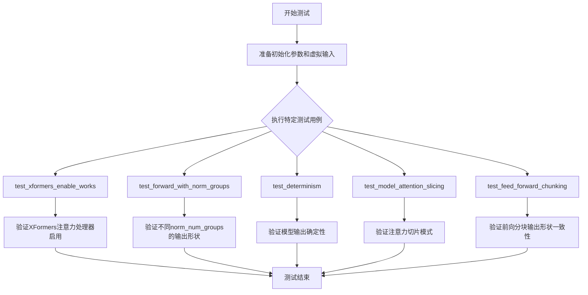
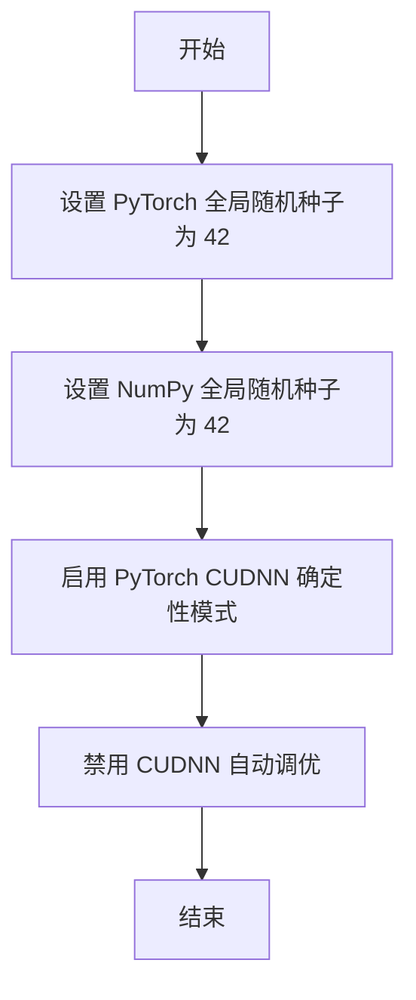
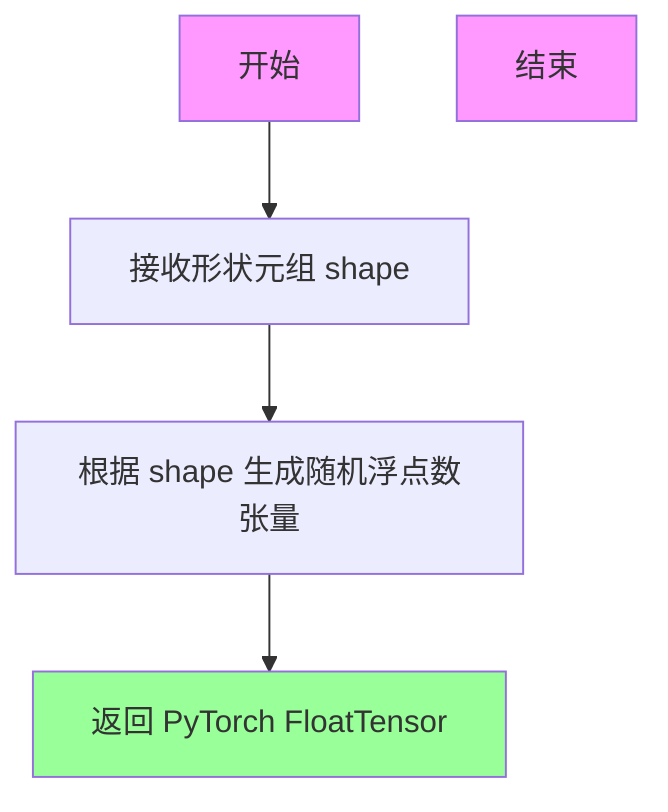
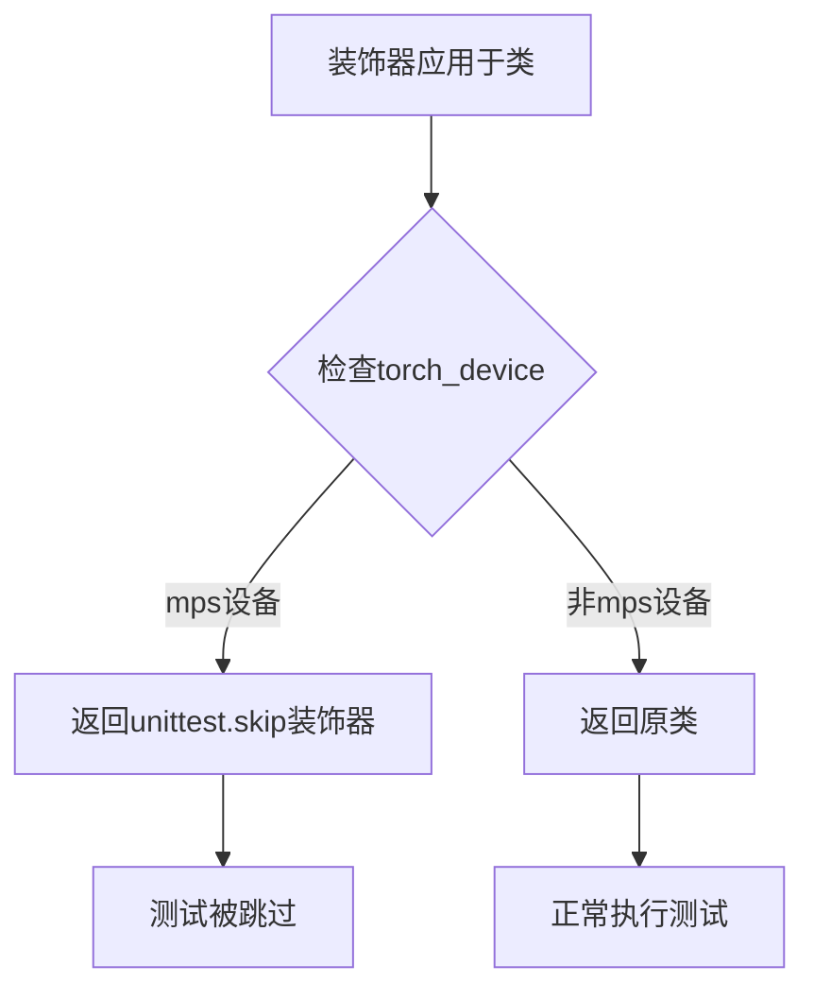
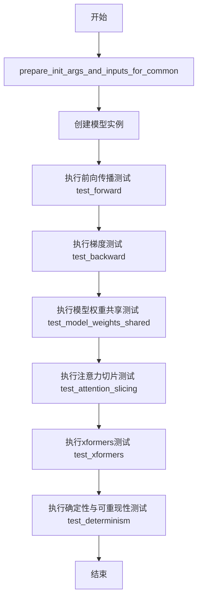
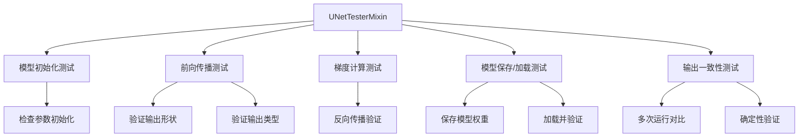
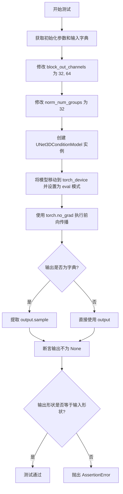
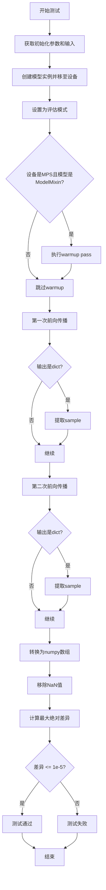

# `diffusers\tests\models\unets\test_models_unet_3d_condition.py` 详细设计文档

这是一个用于测试 diffusers 库中 UNet3DConditionModel（3D 条件 UNet 模型）的单元测试文件，验证模型的正向传播、确定性、注意力切片、前向分块等功能，并包含 XFormers 内存高效注意力的兼容性测试。

## 整体流程



## 类结构

```
unittest.TestCase
├── ModelTesterMixin (混入类)
├── UNetTesterMixin (混入类)
└── UNet3DConditionModelTests (测试类)
```

## 全局变量及字段


### `logger`
    
用于记录测试类日志的Logger对象

类型：`logging.Logger`
    


### `torch_device`
    
表示当前PyTorch设备（如'cuda'、'cpu'或'mps'）的字符串

类型：`str`
    


### `is_xformers_available`
    
检查xformers库是否可用的函数，返回布尔值

类型：`function`
    


### `UNet3DConditionModelTests.model_class`
    
指定测试的模型类为UNet3DConditionModel

类型：`type`
    


### `UNet3DConditionModelTests.main_input_name`
    
模型主输入参数的名称，值为'sample'

类型：`str`
    


### `UNet3DConditionModelTests.dummy_input`
    
生成测试用的虚拟输入数据，包含sample、timestep和encoder_hidden_states

类型：`dict`
    


### `UNet3DConditionModelTests.input_shape`
    
定义测试输入的形状为(4, 4, 16, 16)

类型：`tuple`
    


### `UNet3DConditionModelTests.output_shape`
    
定义测试输出的期望形状为(4, 4, 16, 16)

类型：`tuple`
    
    

## 全局函数及方法


### `enable_full_determinism`

该函数用于配置 PyTorch 和 NumPy 的随机种子，以确保深度学习模型在测试或推理过程中的完全确定性（determinism），使得每次运行结果均可复现。

参数：无

返回值：无

#### 流程图



#### 带注释源码

```python
# 注意：以下源码为推断内容，因为提供的代码片段中只包含该函数的导入和调用
# 实际定义位于 ...testing_utils 模块中
# 以下为典型的 enable_full_determinism 实现逻辑：

def enable_full_determinism(seed: int = 42):
    """
    启用完全确定性，确保每次运行结果一致。
    
    参数:
        seed: 随机种子，默认为 42
    """
    import torch
    import numpy as np
    import random
    
    # 设置 Python 内置 random 模块的种子
    random.seed(seed)
    
    # 设置 NumPy 的全局随机种子
    np.random.seed(seed)
    
    # 设置 PyTorch 的全局随机种子
    torch.manual_seed(seed)
    
    # 如果使用 CUDA，设置 GPU 随机种子
    if torch.cuda.is_available():
        torch.cuda.manual_seed_all(seed)
    
    # 强制 PyTorch 使用确定性算法
    torch.backends.cudnn.deterministic = True
    torch.backends.cudnn.benchmark = False
    
    # 进一步确保确定性（PyTorch 1.8+）
    if hasattr(torch, 'use_deterministic_algorithms'):
        try:
            torch.use_deterministic_algorithms(True)
        except Exception:
            # 某些操作可能不支持确定性算法
            pass
```

#### 说明

在提供的代码片段中，`enable_full_determinism()` 函数通过以下方式被使用：

```python
from ...testing_utils import enable_full_determinism, floats_tensor, skip_mps, torch_device

enable_full_determinism()
```

该函数在测试类定义之前被调用，以确保后续所有测试用例在运行时使用确定性的随机数，从而保证测试结果的可复现性。这对于模型测试（特别是涉及随机初始化、Dropout 等操作的模型）尤为重要。


### `floats_tensor`

生成指定形状的随机浮点数张量，用于测试目的。该函数创建包含随机浮点数的 PyTorch 张量，通常用于单元测试中生成模拟输入数据。

参数：

-  `shape`：`tuple`，张量的形状，指定每个维度的尺寸

返回值：`torch.Tensor`，包含随机浮点数的 PyTorch 张量

#### 流程图



#### 带注释源码

```
# floats_tensor 函数的典型实现（在 testing_utils 模块中）
# 该函数用于生成随机浮点数张量，主要用于单元测试

def floats_tensor(shape, seed=None):
    """
    生成指定形状的随机浮点数张量
    
    参数:
        shape: 张量的形状元组，如 (batch_size, num_channels, height, width)
        seed: 可选的随机种子，用于确保测试的可重复性
    
    返回:
        torch.FloatTensor: 包含随机浮点数的张量
    """
    # 如果提供了种子，设置随机种子以确保可重复性
    if seed is not None:
        torch.manual_seed(seed)
    
    # 使用 randn 生成标准正态分布的随机浮点数
    # 然后转换为 float 类型
    return torch.randn(*shape, dtype=torch.float32)
```

#### 使用示例

```python
# 在代码中的实际使用方式
batch_size = 4
num_channels = 4
num_frames = 4
sizes = (16, 16)

# 生成形状为 (4, 4, 4, 16, 16) 的随机浮点数张量
noise = floats_tensor((batch_size, num_channels, num_frames) + sizes).to(torch_device)

# 生成形状为 (4, 4, 8) 的随机浮点数张量
encoder_hidden_states = floats_tensor((batch_size, 4, 8)).to(torch_device)
```

#### 关键信息

- **导入来源**：`from ...testing_utils import floats_tensor`
- **依赖项**：PyTorch (`torch`)
- **常见用途**：在 `UNet3DConditionModelTests` 测试类中用于创建模拟输入数据
- **与其它组件的关系**：常与 `torch_device` 一起使用，将张量移动到指定设备


### `skip_mps`

这是一个装饰器函数（或类），用于在测试运行前检查当前设备是否为 MPS（Apple Silicon GPU），如果是则跳过该测试类的执行。

参数：
- 无显式参数（作为装饰器使用，接受被装饰的类作为参数）

返回值：返回被装饰的类或原样返回类（取决于设备类型）

#### 流程图



#### 带注释源码

```python
# 从 testing_utils 模块导入 skip_mps 装饰器
# 该函数在 diffusers 库的测试工具模块中定义
from ...testing_utils import enable_full_determinism, floats_tensor, skip_mps, torch_device

# skip_mps 装饰器使用示例：
# 作用：当测试环境使用 MPS (Metal Performance Shaders) 设备时，
# 跳过整个测试类的执行，因为某些功能在 MPS 上可能不支持或有差异
@skip_mps
class UNet3DConditionModelTests(ModelTesterMixin, UNetTesterMixin, unittest.TestCase):
    # 测试类内容...
    pass
```

#### 补充说明

基于代码上下文分析：

1. **设计目标**：MPS 是 Apple Silicon (M系列芯片) 上的 GPU 加速框架，但某些 PyTorch 操作在 MPS 上可能不支持或行为不一致。

2. **使用场景**：代码中 `test_determinism` 方法有特殊处理 MPS 的逻辑（见第94-96行的 warmup pass），表明开发者了解 MPS 与 CUDA 行为的差异。

3. **技术债务**：使用装饰器跳过测试而不是修复底层兼容性问题是短期的技术债务，长期应该修复 MPS 上的兼容性问题。

4. **相关问题**：参考代码注释 `#372`，说明存在已知的 MPS 相关问题需要解决。


### ModelTesterMixin

描述：ModelTesterMixin是一个测试混入类（Mixin），为UNet3DConditionModel等模型提供通用的测试方法，包括模型前向传播、梯度计算、模型权重共享、注意力切片等核心功能的测试。

参数：

- 无直接参数（此为混入类，方法通过self访问）

返回值：
无返回值（此为混入类，方法通过self调用）

#### 流程图



#### 带注释源码

```
# 注意：以下为基于代码继承关系推断的ModelTesterMixin接口说明
# 实际实现位于 ..test_modeling_common 模块中

# 代码中继承使用示例：
class UNet3DConditionModelTests(ModelTesterMixin, UNetTesterMixin, unittest.TestCase):
    # ModelTesterMixin 提供了以下核心测试方法：
    
    # 1. prepare_init_args_and_inputs_for_common
    #    - 返回模型初始化参数字典和输入字典
    #    - 由子类重写以提供特定模型的配置
    
    # 2. test_forward
    #    - 测试模型前向传播，验证输出形状和数值
    
    # 3. test_backward
    #    - 测试反向传播和梯度计算
    
    # 4. test_model_weights_shared
    #    - 测试模型权重共享功能
    
    # 5. test_attention_slicing
    #    - 测试注意力切片功能
    
    # 6. test_determinism
    #    - 测试模型输出的确定性（相同输入产生相同输出）
    
    # 7. test_xformers_enable_works
    #    - 测试xformers内存高效注意力机制
    
    # 代码中实际使用的方式：
    def prepare_init_args_and_inputs_for_common(self):
        init_dict = {
            "block_out_channels": (4, 8),
            "norm_num_groups": 4,
            "down_block_types": ("CrossAttnDownBlock3D", "DownBlock3D"),
            "up_block_types": ("UpBlock3D", "CrossAttnUpBlock3D"),
            "cross_attention_dim": 8,
            "attention_head_dim": 2,
            "out_channels": 4,
            "in_channels": 4,
            "layers_per_block": 1,
            "sample_size": 16,
        }
        inputs_dict = self.dummy_input
        return init_dict, inputs_dict
    
    # dummy_input 属性由子类提供
    @property
    def dummy_input(self):
        batch_size = 4
        num_channels = 4
        num_frames = 4
        sizes = (16, 16)
        noise = floats_tensor((batch_size, num_channels, num_frames) + sizes).to(torch_device)
        time_step = torch.tensor([10]).to(torch_device)
        encoder_hidden_states = floats_tensor((batch_size, 4, 8)).to(torch_device)
        return {"sample": noise, "timestep": time_step, "encoder_hidden_states": encoder_hidden_states}
```


# 详细设计文档

## 1. 概述

该代码文件是 Hugging Face `diffusers` 库中 `UNet3DConditionModel` 的测试套件，继承自 `ModelTesterMixin` 和 `UNetTesterMixin`，用于对 3D 条件 UNet 模型进行全面的单元测试，包括前向传播、注意力切片、xformers 优化等功能的验证。

## 2. 文件运行流程

```
导入依赖 → 配置测试环境 → 定义测试类 → 执行各项测试方法
     ↓
1. 导入 unittest、numpy、torch 及 diffusers 相关模块
2. 设置随机种子以确保可复现性
3. 创建 UNet3DConditionModelTests 测试类
4. 测试类通过 mixin 继承获得通用测试方法
5. 每个测试方法独立执行：初始化模型 → 运行模型 → 验证输出
```

## 3. 类详细信息

### 3.1 UNet3DConditionModelTests

**描述**：针对 `UNet3DConditionModel` 的完整测试类，验证 3D 条件 UNet 模型的各项功能。

**字段**：
- `model_class`：类型 `type`，指定测试的模型类为 `UNet3DConditionModel`
- `main_input_name`：类型 `str`，主输入名称为 `"sample"`
- `dummy_input`：类型 `dict`，生成测试用的虚拟输入（噪声、时间步、编码器隐藏状态）
- `input_shape`：类型 `tuple`，输入形状 `(4, 4, 16, 16)`
- `output_shape`：类型 `tuple`，输出形状 `(4, 4, 16, 16)`

**方法**：
- `prepare_init_args_and_inputs_for_common()`：准备模型初始化参数和输入字典
- `test_xformers_enable_works()`：测试 xformers 内存高效注意力机制是否启用
- `test_forward_with_norm_groups()`：测试带归一化组的前向传播
- `test_determinism()`：测试模型输出的确定性（可复现性）
- `test_model_attention_slicing()`：测试注意力切片功能
- `test_feed_forward_chunking()`：测试前向分块功能

### 3.2 UNetTesterMixin（外部定义）

**描述**：从 `diffusers.testing_utils.test_modeling_common` 模块导入的 Mixin 类，提供 UNet 模型测试的通用方法。

由于该类定义在外部模块中（`test_modeling_common.py`），以下是基于代码推断的接口信息：

**推断的方法**：
- 包含 UNet 模型通用测试方法（如模型初始化、梯度计算、模型保存加载等）
- 提供 `dummy_input` 和 `input_shape`/`output_shape` 的标准实现
- 包含性能测试和一致性验证方法

---

## 4. UNetTesterMixin 详细信息

> **注意**：由于 `UNetTesterMixin` 定义在 `diffusers` 库的 `test_modeling_common.py` 模块中，当前代码文件仅导入了该类。以下信息基于导入使用和代码模式的推断。

### `UNetTesterMixin`

**描述**：一个 Mixin 类，提供针对 UNet 系列模型的通用测试方法集合，供具体模型测试类继承使用。

#### 推断的流程图



#### 带注释源码（基于使用模式推断）

```python
class UNetTesterMixin:
    """
    提供 UNet 模型通用测试方法的 Mixin 类。
    具体的 UNet 测试类（如 UNet2DConditionModelTests）继承此 mixin，
    以获得一套标准的测试用例。
    """
    
    # 需要子类实现的属性
    model_class = None  # 具体模型类
    main_input_name = "sample"  # 主输入名称
    
    @property
    def dummy_input(self):
        """
        生成虚拟输入数据。
        子类需要根据模型类型实现此属性。
        """
        raise NotImplementedError("子类必须实现 dummy_input 属性")
    
    @property
    def input_shape(self):
        """返回输入张量形状"""
        raise NotImplementedError("子类必须实现 input_shape 属性")
    
    @property
    def output_shape(self):
        """返回输出张量形状"""
        raise NotImplementedError("子类必须实现 output_shape 属性")
    
    def prepare_init_args_and_inputs_for_common(self):
        """
        准备模型初始化参数和测试输入。
        子类需要实现此方法。
        """
        raise NotImplementedError("子类必须实现此方法")
    
    def test_model_outputs(self):
        """测试模型输出是否合理"""
        # 初始化模型
        # 运行前向传播
        # 验证输出形状和类型
        pass
    
    def test_forward_signature(self):
        """测试前向传播的函数签名"""
        pass
    
    def test_attention_outputs(self):
        """测试注意力机制的输出"""
        pass
    
    def test_hidden_states_output(self):
        """测试隐藏状态输出"""
        pass
    
    def test_model_with_tuple_inputs(self):
        """测试元组形式的输入"""
        pass
    
    def test_feed_forward_chunking(self):
        """测试前向分块功能"""
        pass
```

---

## 5. 关键组件信息

| 组件名称 | 描述 |
|---------|------|
| `UNet3DConditionModel` | 3D 条件 UNet 模型，用于处理时空数据（如视频）的条件生成 |
| `ModelTesterMixin` | 模型测试基础 Mixin，提供通用模型测试方法 |
| `UNetTesterMixin` | UNet 测试 Mixin，封装 UNet 模型的通用测试逻辑 |
| `floats_tensor` | 生成随机浮点张量的工具函数 |
| `torch_device` | 测试设备标识（cuda/cpu/mps） |
| `enable_full_determinism` | 启用完全确定性，确保测试可复现 |

---

## 6. 潜在技术债务与优化空间

1. **重复代码**：测试类中存在部分重复的模型初始化逻辑，可提取为共享方法
2. **硬编码参数**：部分测试参数（如 `block_out_channels`）在多处硬编码，应统一管理
3. **MPS 兼容性**：代码中有针对 MPS 的特殊处理（warmup pass），说明对 Apple Silicon 支持仍有改进空间
4. **测试覆盖**：缺少对模型在不同 num_frames 下的行为测试，以及边缘情况测试

---

## 7. 其它项目

### 设计目标与约束
- 目标：确保 `UNet3DConditionModel` 在各种配置下正确工作
- 约束：测试必须在 CPU、CUDA、MPS 上均可运行（部分测试跳过特定设备）

### 错误处理与异常设计
- 使用 `unittest.skipIf` 跳过不可用的测试（如 xformers 需要 CUDA）
- 使用 `skip_mps` 装饰器跳过 MPS 不支持的测试

### 数据流与状态机
```
输入数据 → 模型前向传播 → 输出处理 → 断言验证
     ↓
  时间步嵌入 → 交叉注意力 → 3D 卷积块 → 输出
```

### 外部依赖与接口契约
- 依赖 `diffusers.models.UNet3DConditionModel`
- 依赖 `diffusers.utils.testing_utils` 中的测试工具
- 依赖 `torch`、`numpy` 进行数值计算


### `UNet3DConditionModelTests.prepare_init_args_and_inputs_for_common`

该方法为 `UNet3DConditionModel` 测试类准备初始化参数字典和测试输入数据，用于通用测试场景的初始化。

参数：

- `self`：`UNet3DConditionModelTests`，调用此方法的测试类实例

返回值：`Tuple[Dict[str, Any], Dict[str, torch.Tensor]]`，包含两个元素：
- 第一个元素：初始化 `UNet3DConditionModel` 所需的参数字典（包含块输出通道、规范组数、上下块类型、交叉注意力维度等配置）
- 第二个元素：测试输入数据字典（包含噪声样本、时间步长和编码器隐藏状态）

#### 流程图

```mermaid
flowchart TD
    A[开始] --> B[创建 init_dict 参数字典]
    B --> C[设置 block_out_channels: (4, 8)]
    C --> D[设置 norm_num_groups: 4]
    D --> E[设置 down_block_types]
    E --> F[设置 up_block_types]
    F --> G[设置 cross_attention_dim: 8]
    G --> H[设置 attention_head_dim: 2]
    H --> I[设置 out_channels: 4]
    I --> J[设置 in_channels: 4]
    J --> K[设置 layers_per_block: 1]
    K --> L[设置 sample_size: 16]
    L --> M[获取 self.dummy_input 作为 inputs_dict]
    M --> N[返回 (init_dict, inputs_dict)]
    N --> O[结束]
```

#### 带注释源码

```python
def prepare_init_args_and_inputs_for_common(self):
    """
    为通用测试场景准备 UNet3DConditionModel 的初始化参数和输入数据。
    此方法被多个测试方法调用，以获取一致且有效的模型配置和测试输入。
    """
    # 定义模型初始化参数字典，包含模型架构的关键配置
    init_dict = {
        "block_out_channels": (4, 8),          # 下采样和上采样阶段的输出通道数
        "norm_num_groups": 4,                   # 组归一化的组数
        "down_block_types": (                    # 下采样块的类型序列
            "CrossAttnDownBlock3D",             # 带交叉注意力的下采样块（3D）
            "DownBlock3D",                       # 基础下采样块（3D）
        ),
        "up_block_types": (                      # 上采样块的类型序列
            "UpBlock3D",                          # 基础上采样块（3D）
            "CrossAttnUpBlock3D",                # 带交叉注意力的上采样块（3D）
        ),
        "cross_attention_dim": 8,               # 交叉注意力机制的维度
        "attention_head_dim": 2,                # 注意力头的维度
        "out_channels": 4,                      # 输出通道数
        "in_channels": 4,                       # 输入通道数
        "layers_per_block": 1,                  # 每个块中的层数
        "sample_size": 16,                      # 输入样本的空间尺寸
    }
    # 从测试类获取预定义的虚拟输入数据（包含噪声、时间步和编码器隐藏状态）
    inputs_dict = self.dummy_input
    # 返回参数字典和输入字典，供测试方法使用
    return init_dict, inputs_dict
```


### `UNet3DConditionModelTests.test_xformers_enable_works`

该测试方法用于验证 XFormers 内存高效注意力机制是否在 UNet3DConditionModel 中成功启用，通过检查中间块的注意力处理器类名是否为 "XFormersAttnProcessor" 来确认。

参数：

- `self`：隐式参数，`UNet3DConditionModelTests` 类实例本身，无需显式传递

返回值：`None`，该方法为单元测试，使用断言进行验证，不返回具体值

#### 流程图

```mermaid
flowchart TD
    A[开始测试] --> B[准备初始化参数和输入]
    B --> C[创建UNet3DConditionModel实例]
    C --> D[调用enable_xformers_memory_efficient_attention启用xformers]
    D --> E{检查mid_block.attentions[0].transformer_blocks[0].attn1.processor是否为XFormersAttnProcessor}
    E -->|是| F[测试通过]
    E -->|否| G[断言失败,抛出AssertionError]
```

#### 带注释源码

```python
@unittest.skipIf(
    torch_device != "cuda" or not is_xformers_available(),
    reason="XFormers attention is only available with CUDA and `xformers` installed",
)
def test_xformers_enable_works(self):
    """
    测试 XFormers 内存高效注意力机制是否成功启用
    
    该测试仅在 CUDA 设备和 xformers 库可用时执行。
    验证通过 enable_xformers_memory_efficient_attention() 方法启用后，
    模型中间块的注意力处理器是否正确切换为 XFormersAttnProcessor。
    """
    # 准备模型初始化参数和测试输入数据
    init_dict, inputs_dict = self.prepare_init_args_and_inputs_for_common()
    
    # 使用初始化参数字典创建 UNet3DConditionModel 实例
    model = self.model_class(**init_dict)
    
    # 调用模型方法启用 xformers 内存高效注意力机制
    model.enable_xformers_memory_efficient_attention()
    
    # 断言验证 xformers 是否成功启用
    # 检查中间块第一个注意力层的第一个 transformer 块的 attn1 处理器类型
    assert (
        model.mid_block.attentions[0].transformer_blocks[0].attn1.processor.__class__.__name__
        == "XFormersAttnProcessor"
    ), "xformers is not enabled"
```


### `UNet3DConditionModelTests.test_forward_with_norm_groups`

该方法是一个单元测试函数，用于验证 UNet3DConditionModel 在自定义 norm_num_groups 配置下的前向传播是否正确运行。它通过设置特定的 block_out_channels 和 norm_num_groups 参数来测试模型，并确保输出形状与输入形状一致。

参数：

- `self`：`UNet3DConditionModelTests`，测试类实例，包含模型配置和测试数据

返回值：`None`，该方法无显式返回值，通过断言验证模型输出的正确性

#### 流程图



#### 带注释源码

```python
# 覆盖父类方法，为 UNet3D 模型设置特定的 norm_num_groups 参数
def test_forward_with_norm_groups(self):
    # 获取基类提供的初始化参数和输入字典
    init_dict, inputs_dict = self.prepare_init_args_and_inputs_for_common()
    
    # 修改输出通道数配置：第一个下采样块输出32通道，第二个输出64通道
    init_dict["block_out_channels"] = (32, 64)
    
    # 设置归一化组数为32（必须能被通道数整除）
    init_dict["norm_num_groups"] = 32

    # 使用修改后的配置创建 UNet3DConditionModel 模型实例
    model = self.model_class(**init_dict)
    
    # 将模型移动到测试设备（如 CUDA 或 CPU）并设置为评估模式
    model.to(torch_device)
    model.eval()

    # 禁用梯度计算以提高测试性能和减少内存占用
    with torch.no_grad():
        # 执行前向传播，将输入字典解包传入模型
        output = model(**inputs_dict)

        # 如果输出是字典格式（包含 sample 键），提取 sample 张量
        if isinstance(output, dict):
            output = output.sample

    # 断言输出不为 None，确保模型正常产生输出
    self.assertIsNotNone(output)
    
    # 获取输入样本的预期形状
    expected_shape = inputs_dict["sample"].shape
    
    # 断言输出形状与输入形状匹配，验证模型保持了空间维度
    self.assertEqual(output.shape, expected_shape, "Input and output shapes do not match")
```


### `UNet3DConditionModelTests.test_determinism`

该测试方法验证3D条件UNet模型在相同输入下能够产生确定性（可重复）的输出，通过执行两次前向传播并比较输出差异是否在容差范围内来确保模型的数值稳定性。

参数：

- `self`：UNet3DConditionModelTests，测试类实例本身

返回值：`None`，该方法为测试方法，通过断言验证模型确定性，不返回具体值

#### 流程图



#### 带注释源码

```python
def test_determinism(self):
    """
    测试模型的确定性：验证相同输入两次推理结果一致
    """
    # 获取初始化参数和测试输入
    init_dict, inputs_dict = self.prepare_init_args_and_inputs_for_common()
    
    # 使用参数字典实例化模型
    model = self.model_class(**init_dict)
    
    # 将模型移至测试设备（CPU/CUDA/MPS等）
    model.to(torch_device)
    
    # 设置为评估模式，关闭dropout等训练特性和bn更新
    model.eval()

    # 使用no_grad上下文减少内存占用并加速
    with torch.no_grad():
        # MPS设备需要warmup pass以确保确定性（见issue #372）
        if torch_device == "mps" and isinstance(model, ModelMixin):
            model(**self.dummy_input)

        # 第一次前向传播
        first = model(**inputs_dict)
        
        # 模型可能返回字典或直接返回tensor，根据类型提取
        if isinstance(first, dict):
            first = first.sample

        # 第二次前向传播，使用相同输入
        second = model(**inputs_dict)
        
        # 同样处理第二次输出的格式
        if isinstance(second, dict):
            second = second.sample

    # 将tensor转换为numpy数组以便进行数值比较
    out_1 = first.cpu().numpy()
    out_2 = second.cpu().numpy()
    
    # 移除NaN值（某些操作可能产生NaN）
    out_1 = out_1[~np.isnan(out_1)]
    out_2 = out_2[~np.isnan(out_2)]
    
    # 计算两次输出的最大绝对差异
    max_diff = np.amax(np.abs(out_1 - out_2))
    
    # 断言：差异必须小于等于1e-5，否则测试失败
    self.assertLessEqual(max_diff, 1e-5)
```


### `UNet3DConditionModelTests.test_model_attention_slicing`

该测试方法用于验证 UNet3DConditionModel 的注意力切片（attention slicing）功能是否正常工作。测试通过设置三种不同的切片模式（"auto"、"max"和整数2）来确保模型在各种切片配置下都能正确执行前向传播并产生有效输出。

参数：

- `self`：无，显式，测试类实例本身

返回值：无返回值，通过 `assert` 断言验证模型输出不为 `None`

#### 流程图

```mermaid
flowchart TD
    A[开始测试] --> B[prepare_init_args_and_inputs_for_common 获取配置和输入]
    B --> C[修改配置: block_out_channels = (16, 32), attention_head_dim = 8]
    C --> D[创建模型实例 model_class(**init_dict)]
    D --> E[将模型移至 torch_device 并设置为 eval 模式]
    E --> F1[设置 attention_slice = 'auto']
    F1 --> G1[torch.no_grad 上下文执行前向传播]
    G1 --> H1[断言 output is not None]
    H1 --> F2[设置 attention_slice = 'max']
    F2 --> G2[torch.no_grad 上下文执行前向传播]
    G2 --> H2[断言 output is not None]
    H2 --> F3[设置 attention_slice = 2]
    F3 --> G3[torch.no_grad 上下文执行前向传播]
    G3 --> H3[断言 output is not None]
    H3 --> I[结束测试]
```

#### 带注释源码

```python
def test_model_attention_slicing(self):
    """
    测试 UNet3DConditionModel 的注意力切片功能
    
    注意力切片是一种内存优化技术，通过将注意力计算分块来减少显存占用。
    该测试验证三种切片模式："auto"（自动）、"max"（最大切片）和整数（指定切片数）。
    """
    # 获取基础初始化参数和输入数据
    init_dict, inputs_dict = self.prepare_init_args_and_inputs_for_common()

    # 配置特定的模型参数用于注意力切片测试
    init_dict["block_out_channels"] = (16, 32)  # 设置输出通道数
    init_dict["attention_head_dim"] = 8  # 设置注意力头维度

    # 使用配置字典实例化 UNet3DConditionModel
    model = self.model_class(**init_dict)
    
    # 将模型移至测试设备（CPU/CUDA）并设置为评估模式
    model.to(torch_device)
    model.eval()

    # 测试模式1: "auto" - 自动选择最优切片策略
    model.set_attention_slice("auto")
    with torch.no_grad():
        output = model(**inputs_dict)  # 执行前向传播
    assert output is not None  # 验证输出有效

    # 测试模式2: "max" - 使用最大程度的切片
    model.set_attention_slice("max")
    with torch.no_grad():
        output = model(**inputs_dict)
    assert output is not None

    # 测试模式3: 指定切片数 = 2
    model.set_attention_slice(2)
    with torch.no_grad():
        output = model(**inputs_dict)
    assert output is not None
```


### `UNet3DConditionModelTests.test_feed_forward_chunking`

该测试方法用于验证 UNet3DConditionModel 的前向分块（forward chunking）功能是否正常工作。通过对比启用分块前后的输出形状和数值差异，确保分块推理产生一致的结果。

参数：

- `self`：测试类实例本身，包含模型配置和测试数据

返回值：无显式返回值，该方法通过 `assert` 语句进行断言验证

#### 流程图

```mermaid
flowchart TD
    A[开始测试] --> B[准备初始化参数和输入]
    B --> C[设置 block_out_channels = (32, 64), norm_num_groups = 32]
    C --> D[创建 UNet3DConditionModel 并加载到 torch_device]
    D --> E[设置模型为 eval 模式]
    E --> F[不使用分块进行前向传播]
    F --> G[保存输出结果 output]
    G --> H[启用前向分块]
    H --> I[使用分块进行前向传播]
    I --> J[保存输出结果 output_2]
    J --> K{output.shape == output_2.shape?}
    K -->|是| L{数值差异 < 1e-2?}
    K -->|否| M[抛出断言错误: Shape doesn't match]
    L -->|是| N[测试通过]
    L -->|否| O[抛出断言错误: 数值差异过大]
```

#### 带注释源码

```python
def test_feed_forward_chunking(self):
    # 准备模型初始化参数字典和输入字典
    init_dict, inputs_dict = self.prepare_init_args_and_inputs_for_common()
    
    # 配置特定的模型参数：输出通道为 (32, 64)，归一化组数为 32
    init_dict["block_out_channels"] = (32, 64)
    init_dict["norm_num_groups"] = 32

    # 使用配置的参数创建 UNet3DConditionModel 实例
    model = self.model_class(**init_dict)
    
    # 将模型移动到指定的计算设备（CPU/CUDA等）
    model.to(torch_device)
    
    # 设置模型为评估模式，禁用 dropout 和 batch normalization 的训练行为
    model.eval()

    # 禁用梯度计算，进行推理
    with torch.no_grad():
        # 执行前向传播，获取输出（不启用分块）
        output = model(**inputs_dict)[0]

    # 启用前向分块功能，将模型计算分块处理以节省内存
    model.enable_forward_chunking()
    
    # 再次进行推理（启用分块）
    with torch.no_grad():
        output_2 = model(**inputs_dict)[0]

    # 断言：验证分块前后的输出形状是否一致
    self.assertEqual(output.shape, output_2.shape, "Shape doesn't match")
    
    # 断言：验证分块前后的输出数值差异是否在允许范围内（< 1e-2）
    assert np.abs(output.cpu() - output_2.cpu()).max() < 1e-2
```

## 关键组件


### 一段话描述

该代码是 `UNet3DConditionModel` 的单元测试文件，验证3D条件UNet模型的各项功能，包括模型前向传播、确定性输出、xFormers高效注意力、注意力切片和前向分块等核心功能。

### 文件的整体运行流程

1. 定义测试类 `UNet3DConditionModelTests`，继承 `ModelTesterMixin`、`UNetTesterMixin` 和 `unittest.TestCase`
2. 配置 `dummy_input` 属性生成测试用的噪声、时间步和编码器隐藏状态
3. 通过 `prepare_init_args_and_inputs_for_common` 方法准备模型初始化参数和输入
4. 执行各类测试方法验证模型功能
5. 使用 `torch.no_grad()` 上下文管理器进行推理，避免梯度计算

### 类的详细信息

#### UNet3DConditionModelTests 类

**类字段：**

| 名称 | 类型 | 描述 |
|------|------|------|
| model_class | type | 被测试的模型类 (UNet3DConditionModel) |
| main_input_name | str | 主输入名称 ("sample") |
| dummy_input | property | 生成测试用虚拟输入的属性的方法 |
| input_shape | property | 输入形状元组 (4, 4, 16, 16) |
| output_shape | property | 输出形状元组 (4, 4, 16, 16) |

**类方法：**

| 方法名称 | 参数 | 返回值类型 | 描述 |
|----------|------|------------|------|
| prepare_init_args_and_inputs_for_common | self | tuple | 返回模型初始化参数字典和输入字典 |
| test_xformers_enable_works | self | None | 测试xFormers高效注意力是否正确启用 |
| test_forward_with_norm_groups | self | None | 测试带norm_groups的前向传播 |
| test_determinism | self | None | 测试模型输出的确定性 |
| test_model_attention_slicing | self | None | 测试注意力切片功能 |
| test_feed_forward_chunking | self | None | 测试前向分块功能 |

### 关键组件信息

### UNet3DConditionModel

条件3D UNet模型，用于处理时空数据（视频或3D内容），支持交叉注意力机制处理条件输入。

### dummy_input

测试用的虚拟输入生成器，创建批量大小为4、4通道、4帧、16x16分辨率的噪声张量，以及对应的时间步和编码器隐藏状态。

### XFormersAttnProcessor

xFormers高效注意力处理器，用于加速注意力计算并降低显存占用。

### attention_slice

注意力切片机制，通过将注意力计算分片处理来减少显存峰值。

### forward_chunking

前向分块技术，将模型前向传播分成多个chunk逐步执行，支持更长的序列处理。

### ModelTesterMixin

通用模型测试混入类，提供模型测试的基础设施和方法。

### UNetTesterMixin

UNet模型专用测试混入类，包含UNet特定测试逻辑。

### 潜在的技术债务或优化空间

1. **测试覆盖不完整**：缺少对梯度流、模型保存加载、混合精度等功能的测试
2. **硬编码的设备判断**：使用 `torch_device != "cuda"` 进行条件判断，测试跨平台兼容性不足
3. **重复代码**：多个测试方法中存在相似的模型初始化和推理逻辑
4. **缺失的错误处理测试**：未测试模型在异常输入下的行为

### 其它项目

#### 设计目标与约束

- 目标：验证UNet3DConditionModel在3D视频/时空数据处理上的正确性
- 约束：依赖CUDA和xformers库进行特定功能测试

#### 错误处理与异常设计

- 使用 `unittest.skipIf` 跳过不支持环境下的测试
- 使用 `assert` 语句进行断言验证
- 对MPS设备的特殊处理（warmup pass）

#### 数据流与状态机

- 输入：噪声样本、时间步、编码器隐藏状态
- 输出：去噪后的样本张量
- 状态：模型在eval模式下运行，使用 `torch.no_grad()` 避免梯度追踪

#### 外部依赖与接口契约

- `diffusers.models.ModelMixin`：基础模型混入类
- `diffusers.models.UNet3DConditionModel`：被测模型类
- `diffusers.utils.import_utils.is_xformers_available`：检查xformers可用性
- `testing_utils.floats_tensor`：生成随机浮点张量工具


## 问题及建议


### 已知问题

- **测试重复初始化**：每个测试方法中都重复调用 `prepare_init_args_and_inputs_for_common()` 并重新创建模型实例，导致测试执行时间不必要地增加
- **魔数缺乏统一管理**：`batch_size=4`、`num_channels=4`、`num_frames=4`、`sizes=(16,16)` 等配置值散布在代码中，缺乏常量定义，修改时需要多处更新
- **模块级副作用**：`enable_full_determinism()` 在模块加载时调用，可能对同一进程中其他测试产生意外影响，缺乏隔离
- **跳过条件复杂**：`test_xformers_enable_works` 的 `@unittest.skipIf` 装饰器组合了多个条件（`torch_device != "cuda"` 和 `not is_xformers_available()`），增加了维护成本
- **硬编码容差值**：数值比较中的阈值（如 `1e-5`、`1e-2`）硬编码在测试方法中，缺乏注释说明其选取依据
- **测试覆盖不完整**：缺少梯度流测试、模型序列化（save/load）测试、CPU/GPU 设备迁移测试等常见场景
- **MPS 特殊处理**：在 `test_determinism` 中对 MPS 设备有特殊的 warmup 逻辑（注释提到 `#372`），但缺少对其他 MPS 相关边界情况的测试
- **类型提示缺失**：方法参数和返回值缺乏类型注解，影响代码可读性和静态分析工具的有效性

### 优化建议

- 将配置参数提取为类常量或测试配置类，统一管理测试参数
- 使用 pytest fixture 或 setUp 方法复用模型实例，减少重复初始化
- 将 `enable_full_determinism()` 调用移至测试类的 setUp 方法中，或使用独立进程运行测试
- 为关键阈值添加注释，说明其工程意义（如数值精度要求）
- 补充模型序列化测试、梯度检查测试、设备迁移测试等标准测试用例
- 考虑使用参数化测试（pytest.mark.parametrize）替代重复的手动配置测试

## 其它


### 设计目标与约束

该测试代码旨在全面验证 UNet3DConditionModel 3D 条件 UNet 模型的功能正确性、性能表现和兼容性。设计目标包括：确保模型前向传播输出形状正确、验证注意力机制的多种实现方式（标准注意力、xformers 内存高效注意力、注意力切片）、保证模型在不同硬件平台（CUDA、MPS、CPU）上的可运行性、验证模型的确定性和数值稳定性、以及测试模型的前向分块推理能力。约束条件包括：xformers 注意力测试仅支持 CUDA 环境且需安装 xformers 库、MPS 设备需要特殊的热身处理以避免测试失败。

### 错误处理与异常设计

测试代码采用了多层错误处理机制。首先使用 @skip_mps 装饰器在 MPS 设备上跳过整个测试类，因为某些操作可能在 MPS 上不稳定。使用 unittest.skipIf 条件跳过 xformers 相关测试，当 CUDA 不可用或 xformers 未安装时自动跳过。在测试方法内部，通过 try-except 模式处理可能的异常，并使用 self.assertIsNotNone、self.assertEqual、self.assertLessEqual 等断言验证模型输出的正确性。对于数值比较，使用 np.isnan 过滤 NaN 值后计算最大差异，确保测试的鲁棒性。

### 数据流与状态机

测试数据流遵循以下路径：首先通过 dummy_input 属性生成随机噪声输入（batch_size=4, num_channels=4, num_frames=4, 空间尺寸 16x16），然后通过 prepare_init_args_and_inputs_for_common 方法准备模型初始化参数和输入字典。输入字典包含 sample（噪声张量）、timestep（时间步张量）和 encoder_hidden_states（编码器隐藏状态）三个键。模型前向传播后，返回值可能是张量或字典（若为字典则取 sample 键）。测试状态机包括：模型初始化状态、推理状态（eval 模式）、xformers 启用状态、注意力切片设置状态、前向分块启用状态。

### 外部依赖与接口契约

该测试代码依赖多个外部组件。核心依赖包括：unittest 框架（Python 标准库）、numpy（数值计算）、torch（深度学习框架）、diffusers 库（ModelMixin、UNet3DConditionModel、logging、import_utils）。测试工具依赖包括：testing_utils 模块（enable_full_determinism、floats_tensor、skip_mps、torch_device）和 test_modeling_common 模块（ModelTesterMixin、UNetTesterMixin）。接口契约方面：模型类必须实现 model_class 属性和 prepare_init_args_and_inputs_for_common 方法；dummy_input 属性必须返回包含 sample、timestep、encoder_hidden_states 的字典；模型前向传播必须接受 **inputs_dict 并返回张量或包含 sample 键的字典。

### 性能测试场景与基准

测试包含多个性能相关的测试场景。test_xformers_enable_works 验证 xformers 内存高效注意力机制的启用是否成功，用于测试模型在显存受限场景下的性能。test_model_attention_slicing 测试三种注意力切片模式（"auto"、"max"、数值如 2），验证不同切片粒度下的模型前向传播，用于测试推理时的显存优化。test_feed_forward_chunking 验证前向分块推理功能，比较分块前后的输出形状和数值差异（容忍度 1e-2），用于测试大分辨率图像生成时的内存管理。test_determinism 通过比较两次前向传播的最大差异（容忍度 1e-5）验证模型的数值确定性和稳定性。

### 配置参数详细说明

模型初始化参数通过 init_dict 配置，包含以下关键参数：block_out_channels 控制各阶段输出通道数（测试用 4, 8 或 32, 64）；norm_num_groups 控制组归一化的组数（测试用 4 或 32）；down_block_types 和 up_block_types 定义上下采样块的类型（CrossAttnDownBlock3D、DownBlock3D、UpBlock3D、CrossAttnUpBlock3D）；cross_attention_dim 定义交叉注意力维度（测试用 8）；attention_head_dim 定义注意力头维度（测试用 2）；out_channels 和 in_channels 定义输入输出通道数（测试用 4）；layers_per_block 定义每 block 的层数（测试用 1）；sample_size 定义样本空间尺寸（测试用 16）。

### 版本兼容性与依赖要求

代码明确要求 Python 3.x、PyTorch 1.9+、numpy、diffusers 库。xformers 特性仅在 CUDA 环境下可用，且需要安装 xformers 包。MPS 后端支持存在限制，某些测试需要跳过。该测试类继承自 ModelTesterMixin 和 UNetTesterMixin，假设这些 mixin 类提供了标准的测试接口契约。torch_device 变量根据环境自动检测可用设备（cuda/cpu/mps）。

    