# `diffusers\tests\models\unets\test_models_unet_controlnetxs.py` 详细设计文档

该文件是 UNetControlNetXSModel 的单元测试套件，测试了 ControlNet-XS 与 UNet 的集成模型功能，包括模型创建、参数冻结、梯度检查点、时间嵌入混合等核心功能。

## 整体流程

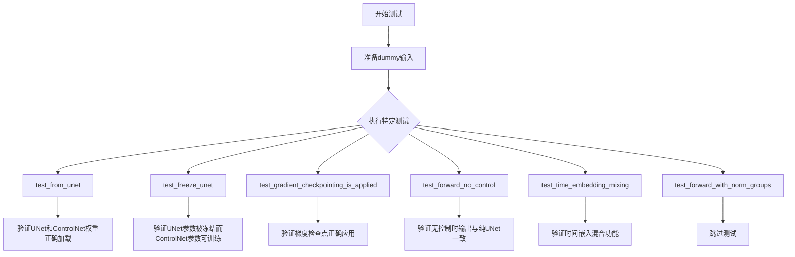

## 类结构

```
UNetControlNetXSModelTests (unittest.TestCase)
└── 继承: ModelTesterMixin, UNetTesterMixin
    ├── dummy_input (property) - 返回测试用dummy输入
    ├── input_shape (property) - 返回输入形状
    ├── output_shape (property) - 返回输出形状
    ├── prepare_init_args_and_inputs_for_common() - 准备初始化参数
    ├── get_dummy_unet() - 创建测试用UNet模型
    ├── get_dummy_controlnet_from_unet() - 从UNet创建ControlNet
    ├── test_from_unet() - 测试模型创建
    ├── test_freeze_unet() - 测试参数冻结
    ├── test_gradient_checkpointing_is_applied() - 测试梯度检查点
    ├── test_forward_no_control() - 测试无控制前向传播
    ├── test_time_embedding_mixing() - 测试时间嵌入混合
    └── test_forward_with_norm_groups() - 测试规范组(已跳过)
```

## 全局变量及字段


### `logger`
    
模块级日志记录器，用于输出测试过程中的日志信息

类型：`logging.Logger`
    


### `enable_full_determinism`
    
用于启用完全确定性测试的函数，确保测试结果可复现

类型：`function`
    


### `batch_size`
    
测试输入的批次大小，值为4

类型：`int`
    


### `num_channels`
    
输入噪声的通道数，值为4

类型：`int`
    


### `sizes`
    
输入样本的空间尺寸，值为(16, 16)

类型：`tuple[int, int]`
    


### `conditioning_image_size`
    
控制条件图像的尺寸，值为(3, 32, 32)

类型：`tuple[int, int, int]`
    


### `noise`
    
用于测试的随机噪声张量，形状为(batch_size, num_channels) + sizes

类型：`torch.Tensor`
    


### `time_step`
    
扩散过程的时间步张量

类型：`torch.Tensor`
    


### `encoder_hidden_states`
    
编码器的隐藏状态张量，用于条件生成

类型：`torch.Tensor`
    


### `controlnet_cond`
    
ControlNet的条件输入图像张量

类型：`torch.Tensor`
    


### `conditioning_scale`
    
控制网络条件影响的缩放因子

类型：`float`
    


### `init_dict`
    
模型初始化参数字典，包含UNetControlNetXSModel的构建配置

类型：`dict`
    


### `inputs_dict`
    
模型输入参数字典，包含测试所需的输入数据

类型：`dict`
    


### `unet`
    
虚拟的UNet2D条件模型实例，用于测试

类型：`UNet2DConditionModel`
    


### `controlnet`
    
虚拟的ControlNetXS适配器实例，用于测试

类型：`ControlNetXSAdapter`
    


### `model`
    
待测试的UNetControlNetXSModel模型实例

类型：`UNetControlNetXSModel`
    


### `model_state_dict`
    
模型的状态字典，包含所有模型参数

类型：`dict`
    


### `expected_set`
    
预期使用梯度检查点的模型组件名称集合

类型：`set[str]`
    


### `UNetControlNetXSModelTests.model_class`
    
被测试的模型类，指向UNetControlNetXSModel

类型：`type`
    


### `UNetControlNetXSModelTests.main_input_name`
    
模型主输入参数的名称，值为'sample'

类型：`str`
    
    

## 全局函数及方法


### `logging.get_logger`

获取或创建一个与指定模块名称关联的 logger 实例，用于在该模块中进行日志记录。该函数是 Python 标准库 logging 模块的封装，提供统一的日志管理接口。

参数：

- `name`：`str`，logger 的名称，通常使用 `__name__` 变量（当前模块的完全限定名）来标识日志来源

返回值：`logging.Logger`，返回一个 Logger 对象，可用于记录不同级别的日志信息（如 debug、info、warning、error、critical）

#### 流程图

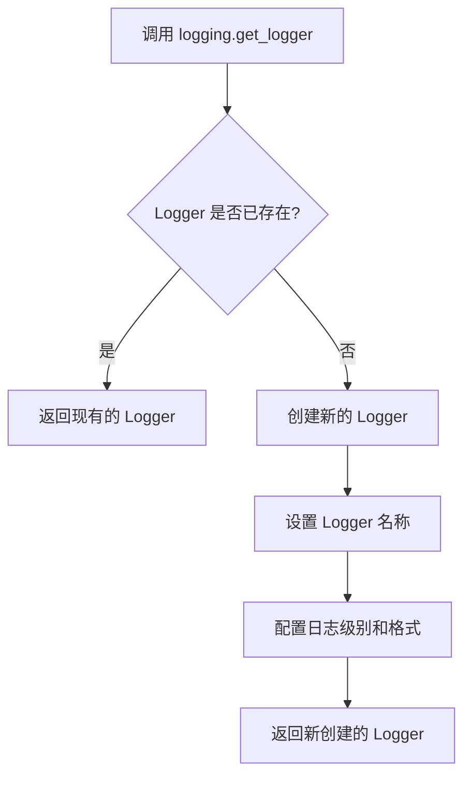

#### 带注释源码

```python
# 从 diffusers.utils 模块导入 logging 对象
# logging 对象封装了 Python 标准库的 logging 模块
from diffusers.utils import logging

# ... (其他代码)

# 使用 logging.get_logger 函数获取当前模块的 logger
# __name__ 是 Python 内置变量，表示当前模块的完全限定名
# 例如: 'diffusers.models.unet_controlnetxs_model'
logger = logging.get_logger(__name__)

# 获取的 logger 可用于以下日志级别:
# logger.debug("调试信息")     # 详细的调试信息
# logger.info("一般信息")       # 一般性信息
# logger.warning("警告信息")   # 警告信息
# logger.error("错误信息")     # 错误信息
# logger.critical("严重错误")  # 严重错误

# 示例用法:
# logger.info("模型正在初始化...")
# logger.warning("该功能处于实验阶段")
```

#### 补充说明

- **设计目标**：通过统一的日志接口，便于在 diffusers 库中进行日志记录和调试
- **调用位置**：在代码文件顶部全局调用，确保整个模块使用统一的 logger
- **日志级别**：通常默认为 WARNING 级别，可在运行时通过 `logging.set_verbosity()` 调整
- **输出目标**：日志通常输出到标准输出（stdout）或错误输出（stderr）


### `floats_tensor`

该函数是测试工具函数，用于生成指定形状的随机浮点数张量（通常为PyTorch张量），常用于单元测试中模拟输入数据。

参数：

- `shape`：`tuple` 或 `int`，张量的形状

返回值：`torch.Tensor`，包含随机浮点数的PyTorch张量

#### 流程图

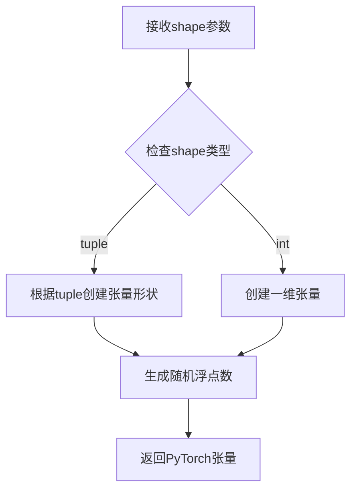

#### 带注释源码

```python
# floats_tensor 函数定义（位于 testing_utils 模块中）
# 代码中未直接给出定义，根据导入和使用方式推断：
def floats_tensor(shape, dtype=torch.float32, device='cpu'):
    """
    生成指定形状的随机浮点数张量。
    
    参数:
        shape: 张量的形状，可以是整数或元组
        dtype: 张量的数据类型，默认为 torch.float32
        device: 张量存放的设备，默认为 'cpu'
    
    返回:
        torch.Tensor: 包含随机浮点数的张量
    """
    # 使用 torch.randn 生成标准正态分布的随机浮点数
    return torch.randn(shape, dtype=dtype, device=device)
```

> **注意**: 源代码中 `floats_tensor` 是从 `...testing_utils` 模块导入的，该模块的具体实现未在当前代码文件中给出。以上源码是基于该函数在代码中的使用方式和常见测试工具函数的模式推断得出的。


### `is_flaky`

`is_flaky` 是一个测试装饰器，用于标记可能存在随机失败（flaky）的测试用例。该装饰器来自 `testing_utils` 模块，通常用于处理由于竞态条件、资源限制或随机初始化导致的不稳定测试，使其在失败时能够自动重试，从而提供更可靠的测试结果。

参数：

- 无参数（无参数装饰器形式）

返回值：`Callable`，返回装饰后的测试函数

#### 流程图

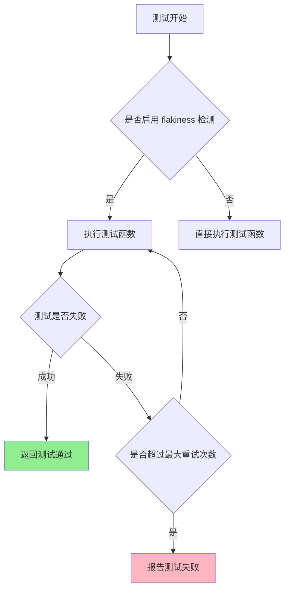

#### 带注释源码

```python
# is_flaky 装饰器源码（基于使用方式推断）
# 注意：以下代码是基于代码中使用方式推断的实现，实际实现在 testing_utils 模块中

def is_flaky(func):
    """
    装饰器：标记可能 flaky 的测试用例
    
    使用方式：
    @is_flaky
    def test_forward_no_control(self):
        # 测试逻辑
        ...
    
    功能说明：
    1. 当测试失败时自动重试指定次数
    2. 记录重试历史和失败信息
    3. 仅在测试真正稳定后才报告通过
    """
    
    # 内部实现可能包含：
    # - max_retries: 最大重试次数（默认 3 次）
    # - reraise: 重试失败后是否抛出异常
    # - decorators: 额外的装饰器配置
    
    def wrapper(*args, **kwargs):
        # 1. 设置重试计数器
        # 2. 执行测试函数
        # 3. 如果失败，检查是否应该重试
        # 4. 达到最大重试次数后报告最终结果
        return func(*args, **kwargs)
    
    return wrapper


# 在测试类中的实际使用方式
class UNetControlNetXSModelTests(ModelTesterMixin, UNetTesterMixin, unittest.TestCase):
    # ...
    
    @is_flaky  # 装饰器应用于测试方法
    def test_forward_no_control(self):
        """此测试可能因数值精度问题而不稳定，使用 is_flaky 装饰器处理"""
        unet = self.get_dummy_unet()
        controlnet = self.get_dummy_controlnet_from_unet(unet)
        model = UNetControlNetXSModel.from_unet(unet, controlnet)
        # ... 测试逻辑
```


### `torch_device`

该函数/变量用于获取当前测试环境应使用的 PyTorch 设备（通常为 "cuda" 或 "cpu"），以确保测试在正确的硬件设备上运行。

参数： 无

返回值： `str`，返回要使用的 PyTorch 设备名称（如 "cuda"、"cpu" 或 "cuda:0" 等）

#### 流程图

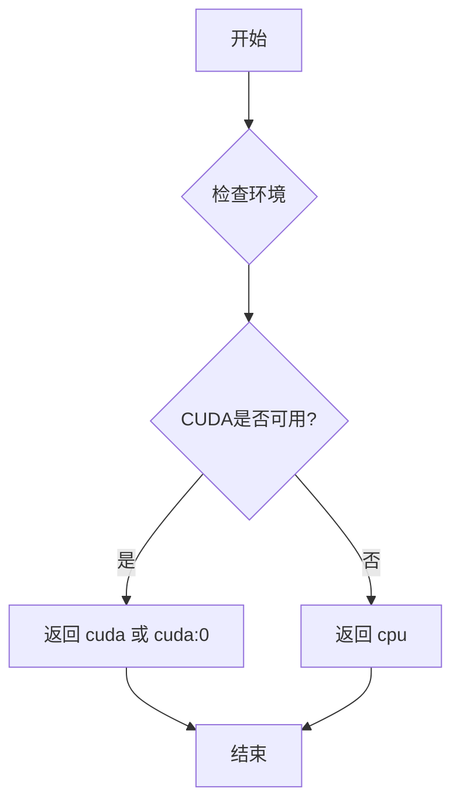

#### 带注释源码

```python
# torch_device 是从 testing_utils 模块导入的全局变量/函数
# 源代码不在本文件中，以下为根据使用方式的推断实现

# 使用示例（在测试文件中）:
# noise = floats_tensor((batch_size, num_channels) + sizes).to(torch_device)
# time_step = torch.tensor([10]).to(torch_device)
# encoder_hidden_states = floats_tensor((batch_size, 4, 8)).to(torch_device)
# controlnet_cond = floats_tensor((batch_size, *conditioning_image_size)).to(torch_device)

# model = model.to(torch_device)

# 推断的 torch_device 实现可能如下：
def get_torch_device():
    """
    返回用于测试的 PyTorch 设备。
    
    逻辑：
    1. 检查 CUDA 是否可用
    2. 如果可用，返回 'cuda' 或 'cuda:0'
    3. 如果不可用，返回 'cpu'
    
    Returns:
        str: 设备字符串，如 'cuda', 'cuda:0', 'cpu' 等
    """
    import torch
    if torch.cuda.is_available():
        return "cuda" if torch.cuda.device_count() == 1 else "cuda:0"
    return "cpu"
```

---

**备注**：`torch_device` 是在 `...testing_utils` 模块中定义的外部依赖，不在本代码文件内实现。它是 HuggingFace diffusers 测试框架中的通用工具函数，用于自动检测并返回合适的计算设备。


### `enable_full_determinism`

该函数用于在深度学习测试中启用完全确定性执行，通过设置随机种子、环境变量和PyTorch/CUDA的确定性选项，确保测试结果在不同运行之间保持一致。

参数：无

返回值：无

#### 流程图

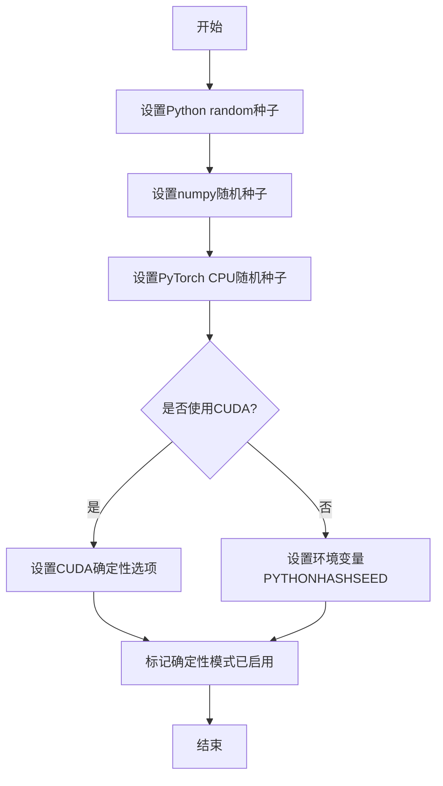

#### 带注释源码

```
# 该函数通常定义在 testing_utils 模块中
# 位置：src/diffusers/testing_utils.py

def enable_full_determinism(seed: int = 42, extra_seed: bool = True):
    """
    启用完全确定性执行，确保测试结果可复现。
    
    参数：
    - seed: int, 随机种子默认值，默认为42
    - extra_seed: bool, 是否设置额外的随机种子源
    
    返回值：无
    """
    import random
    import os
    
    # 1. 设置Python内置random模块的随机种子
    random.seed(seed)
    
    # 2. 设置numpy的随机种子
    import numpy as np
    np.random.seed(seed)
    
    # 3. 设置PyTorch CPU随机种子
    import torch
    torch.manual_seed(seed)
    
    # 4. 设置PYTHONHASHSEED环境变量确保Python哈希算法的确定性
    os.environ["PYTHONHASHSEED"] = str(seed)
    
    # 5. 如果使用CUDA，设置CUDA的确定性选项
    if torch.cuda.is_available():
        # 启用CUDA确定性算法，虽然可能影响性能但保证可复现性
        torch.backends.cudnn.deterministic = True
        torch.backends.cudnn.benchmark = False
        # 设置CUDA GPU随机种子
        torch.cuda.manual_seed_all(seed)
    
    # 6. (可选) 设置torch生成的额外随机源的种子
    if extra_seed:
        torch.manual_seed(seed)
```


### `UNetControlNetXSModelTests.test_from_unet.assert_equal_weights`

这是一个嵌套在 `test_from_unet` 测试方法内部的辅助函数，用于验证从 UNet 和 ControlNetXSAdapter 组合创建的 UNetControlNetXSModel 的权重是否正确匹配原始模型的权重。

参数：

- `module`：`torch.nn.Module`，要检查权重的 PyTorch 模块（例如 unet 的某个子模块）
- `weight_dict_prefix`：`str`，模型状态字典中权重的前缀路径，用于构建完整的权重键名

返回值：`None`，该函数通过 assert 断言进行验证，若权重不匹配则抛出 AssertionError

#### 流程图

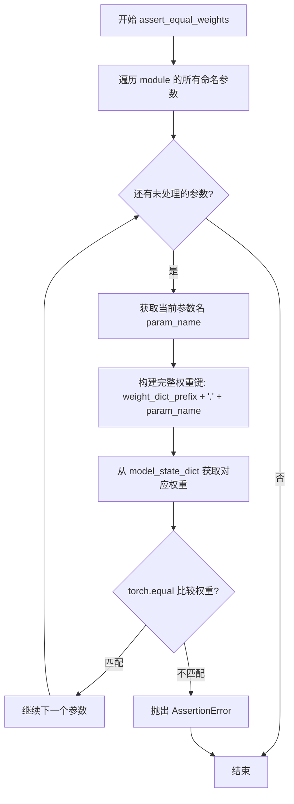

#### 带注释源码

```python
def assert_equal_weights(module, weight_dict_prefix):
    """
    验证指定模块的权重是否与模型状态字典中的权重完全匹配
    
    参数:
        module: PyTorch模块，要检查的子模块（如unet.time_embedding）
        weight_dict_prefix: 字符串，状态字典中的前缀路径（如'base_time_embedding'）
    
    注意:
        这是一个内部辅助函数，用于test_from_unet测试中验证
        UNetControlNetXSModel.from_unet()方法是否正确复制了UNet和ControlNet的权重
    """
    # 遍历传入模块的所有参数
    for param_name, param_value in module.named_parameters():
        # 拼接完整的权重键名：前缀 + 参数名（如 'base_time_embedding.time_embedding.linear_1.weight'）
        weight_key = weight_dict_prefix + "." + param_name
        # 从模型状态字典中获取对应的权重
        stored_weight = model_state_dict[weight_key]
        # 使用torch.equal比较两个张量是否完全相等，若不相等则assert失败
        assert torch.equal(stored_weight, param_value)
```


### `assert_frozen`

该函数是测试用例 `test_freeze_unet` 中的内部辅助函数，用于验证模型模块的所有参数是否已被冻结（`requires_grad` 设置为 `False`）。它通过遍历模块的所有参数并断言 `p.requires_grad` 为 `False` 来确保参数不可训练。

参数：

- `module`：`torch.nn.Module`，需要检查是否冻结的 PyTorch 模块

返回值：`None`，无返回值，仅通过断言检查参数状态

#### 流程图

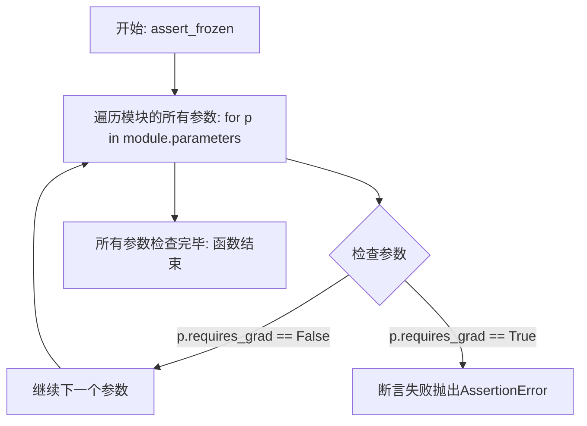

#### 带注释源码

```python
def assert_frozen(module):
    """
    断言检查传入的模块所有参数是否已被冻结（requires_grad=False）
    用于验证模型在调用 freeze_unet_params() 后，UNet相关参数确实被冻结
    
    参数:
        module: torch.nn.Module类型，需要检查的PyTorch模块
    返回:
        无返回值，如果任何参数requires_grad为True则抛出AssertionError
    """
    for p in module.parameters():
        # 断言每个参数的requires_grad为False，表示参数被冻结
        assert not p.requires_grad
```


### `assert_unfrozen`

该函数是一个嵌套辅助函数，用于验证给定模块的所有参数是否处于可训练状态（即 `requires_grad` 为 `True`）。它在 `test_freeze_unet` 测试方法中被调用，以确保 ControlNetXS 模型的某些部分（ControlNet 部分）保持可训练状态。

参数：

- `module`：`nn.Module`，要检查是否可训练的 PyTorch 模块

返回值：`None`，该函数通过断言验证参数可训练性，不返回任何值

#### 流程图

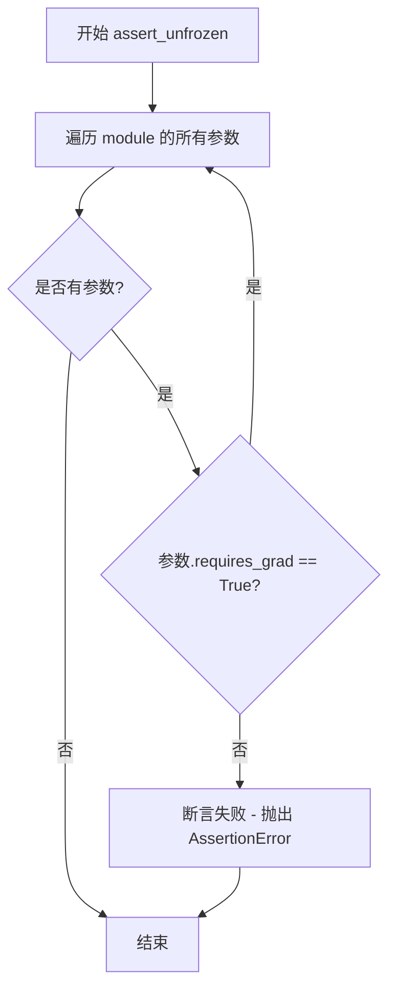

#### 带注释源码

```python
def assert_unfrozen(module):
    """
    验证模块的所有参数是否可训练（requires_grad 为 True）
    
    参数:
        module: 要检查的 PyTorch 模块
        
    返回值:
        None
        
    异常:
        AssertionError: 如果任何参数的 requires_grad 为 False
    """
    for p in module.parameters():
        # 断言每个参数都是可训练的
        assert p.requires_grad
```


由于给定的代码片段中并未直接包含 `ModelTesterMixin` 类的定义（该类是从 `..test_modeling_common` 模块导入的），我将从代码中提取与 `ModelTesterMixin` 相关的信息，并基于其使用方式来描述。


### ModelTesterMixin

`ModelTesterMixin` 是一个测试混入类（Mixin），为 UNet 系列模型提供通用的测试方法。它被 `UNetControlNetXSModelTests` 继承，用于标准化模型测试流程，包括梯度检查点测试、前向传播验证、参数冻结检查等。

参数：

- 无直接参数（作为混入类通过继承使用）

返回值：无直接返回值（作为混入类通过继承使用）

#### 流程图

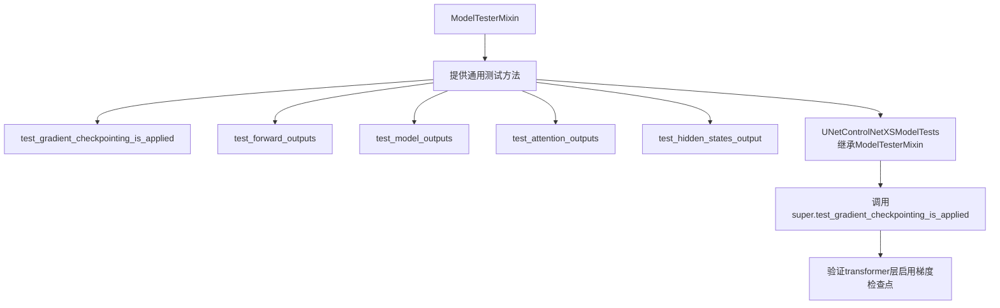

#### 带注释源码

```python
# ModelTesterMixin 是从 diffusers.testing_utils 模块导入的测试混入类
# 由于源代码未在本文件中提供，以下是基于使用方式的推断：

# 在 UNetControlNetXSModelTests 中的使用方式：
class UNetControlNetXSModelTests(ModelTesterMixin, UNetTesterMixin, unittest.TestCase):
    """
    UNetControlNetXSModel 的测试类，继承自 ModelTesterMixin
    继承关系：ModelTesterMixin 提供通用模型测试方法
    """
    
    def test_gradient_checkpointing_is_applied(self):
        """测试梯度检查点是否正确应用于特定的transformer层"""
        expected_set = {
            "Transformer2DModel",
            "UNetMidBlock2DCrossAttn",
            "ControlNetXSCrossAttnDownBlock2D",
            "ControlNetXSCrossAttnMidBlock2D",
            "ControlNetXSCrossAttnUpBlock2D",
        }
        # 调用父类 ModelTesterMixin 的方法进行测试
        super().test_gradient_checkpointing_is_applied(expected_set=expected_set)
```

#### 关键信息补充

**1. 类的继承关系**

```
ModelTesterMixin (提供通用测试方法)
    ↑
UNetControlNetXSModelTests (具体模型测试实现)
```

**2. 在代码中的使用**

`ModelTesterMixin` 在代码中通过以下方式被使用：

- 作为 `UNetControlNetXSModelTests` 的基类之一
- 提供 `test_gradient_checkpointing_is_applied()` 方法供子类调用
- 可能还提供了其他未在本代码片段中显式调用的测试方法

**3. 相关模块**

- 导入来源：`from ..test_modeling_common import ModelTesterMixin, UNetTesterMixin`
- 同级Mixin：`UNetTesterMixin`（专门针对UNet模型的测试Mixin）

**4. 潜在优化建议**

- 由于 `ModelTesterMixin` 是外部导入的测试框架，建议查看完整的 `test_modeling_common.py` 源码以获取完整的测试方法列表
- 可以考虑将测试用例的预期结果（expected_set）配置化，提高测试的可维护性
</think>

由于给定的代码片段中 `ModelTesterMixin` 类的完整源码未被包含（仅从 `..test_modeling_common` 导入），上述文档基于代码中使用该Mixin的方式进行了描述。如需获取 `ModelTesterMixin` 的完整实现细节，建议查看 `diffusers` 源码中的 `test_modeling_common.py` 文件。


# 分析结果

## 重要说明

在提供的代码中，**`UNetTesterMixin` 类的定义并未包含在内**。该类通过以下语句从外部模块导入：

```python
from ..test_modeling_common import ModelTesterMixin, UNetTesterMixin
```

这表明 `UNetTesterMixin` 定义在 `diffusers` 库的 `testing_utils/test_modeling_common.py` 文件中。当前文件仅展示了如何使用该Mixin（作为 `UNetControlNetXSModelTests` 类的基类之一）。

---

### `UNetTesterMixin`

由于源码不可见，以下信息基于类名和常见测试Mixin模式的合理推断。

参数：

- 无直接参数（Mixin类，被继承使用）

返回值：

- 无返回值（Mixin类不直接实例化）

#### 流程图

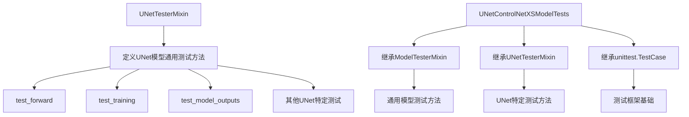

#### 带注释源码（基于导入推断）

```python
# 该类定义位于 diffusers.testing_utils.test_modeling_common 模块
# 典型的UNetTesterMixin可能包含以下测试方法模式：

class UNetTesterMixin:
    """
    UNet模型的测试Mixin，提供UNet2DConditionModel等模型
    的通用测试方法和断言辅助函数。
    """
    
    # 属性通常由子类覆盖
    model_class = None  # 例如: UNet2DConditionModel
    main_input_name = "sample"
    
    def test_forward(self):
        """测试模型前向传播"""
        pass
    
    def test_training(self):
        """测试模型训练模式"""
        pass
    
    # ... 其他UNet相关测试方法
```

---

## 补充说明

如需获取 `UNetTesterMixin` 的完整源代码实现，建议：

1. 在 `diffusers` 库源码中查找 `diffusers/testing_utils/test_modeling_common.py`
2. 或通过以下Python命令获取源码位置：

```python
import diffusers
import inspect
from diffusers.testing_utils import test_modeling_common
print(inspect.getfile(test_modeling_common))
```


### `UNetControlNetXSModelTests.dummy_input`

该属性用于生成测试所需的虚拟输入数据，构建了一个包含噪声、时间步、编码器隐藏状态、控制网络条件和条件缩放因子的字典，以支持UNetControlNetXSModel的前向传播测试。

参数：
- `self`：`UNetControlNetXSModelTests`（类实例本身），无实际参数

返回值：`Dict[str, Any]`，返回一个字典，包含以下键值对：
- `"sample"`：`torch.Tensor`，形状为(batch_size, num_channels, height, width)的噪声张量
- `"timestep"`：`torch.Tensor`，形状为(1,)的时间步张量
- `"encoder_hidden_states"`：`torch.Tensor`，形状为(batch_size, sequence_length, hidden_size)的编码器隐藏状态
- `"controlnet_cond"`：`torch.Tensor`，形状为(batch_size, channels, height, width)的控制网络条件图像
- `"conditioning_scale"`：`float`，条件缩放因子，值为1

#### 流程图

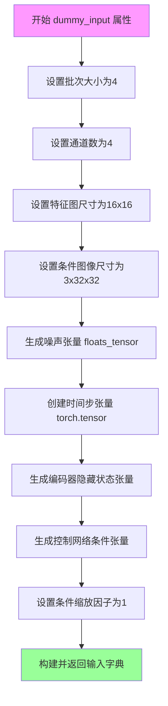

#### 带注释源码

```python
@property
def dummy_input(self):
    """
    生成用于模型测试的虚拟输入数据
    
    Returns:
        dict: 包含模型前向传播所需的所有输入张量的字典
    """
    # 批次大小，用于一次前向传播的样本数量
    batch_size = 4
    # 输入通道数，对应潜在空间的通道数
    num_channels = 4
    # 特征图的空间尺寸(height, width)
    sizes = (16, 16)
    # 控制网络条件图像的尺寸(channels, height, width)
    conditioning_image_size = (3, 32, 32)  # size of additional, unprocessed image for control-conditioning

    # 使用floats_tensor生成指定形状的随机噪声张量，并移动到指定设备
    noise = floats_tensor((batch_size, num_channels) + sizes).to(torch_device)
    # 创建时间步张量，用于扩散模型的噪声调度器
    time_step = torch.tensor([10]).to(torch_device)
    # 生成编码器隐藏状态，用于cross-attention机制
    encoder_hidden_states = floats_tensor((batch_size, 4, 8)).to(torch_device)
    # 生成控制网络的条件图像张量
    controlnet_cond = floats_tensor((batch_size, *conditioning_image_size)).to(torch_device)
    # 控制网络对UNet输出影响的缩放因子
    conditioning_scale = 1

    # 返回包含所有输入的字典，供模型前向传播使用
    return {
        "sample": noise,                    # 输入噪声/潜在表示
        "timestep": time_step,              # 扩散过程的时间步
        "encoder_hidden_states": encoder_hidden_states,  # 文本编码器的输出
        "controlnet_cond": controlnet_cond, # 控制网络的条件图像
        "conditioning_scale": conditioning_scale,        # 控制信号强度
    }
```


### `UNetControlNetXSModelTests.input_shape`

该属性方法定义了 UNetControlNetXSModel 测试的输入张量形状，返回一个包含批次大小和空间维度的元组，用于测试模型的前向传播功能。

参数：

- `self`：`UNetControlNetXSModelTests`，测试类实例本身，无需显式传递

返回值：`Tuple[int, int, int]`，返回输入形状元组 (4, 16, 16)，其中 4 表示批次大小，16 和 16 分别表示输入图像的高度和宽度。

#### 流程图

```mermaid
flowchart TD
    A[调用 input_shape 属性] --> B{属性方法}
    B -->|是| C[返回元组 (4, 16, 16)]
    C --> D[用于测试用例的 dummy_input 构建]
    D --> E[验证模型输入输出维度]
    
    style B fill:#f9f,stroke:#333
    style C fill:#9f9,stroke:#333
```

#### 带注释源码

```python
@property
def input_shape(self):
    """
    定义测试用例的输入形状。

    该属性返回一个元组，表示测试中使用的假输入数据的形状。
    形状为 (batch_size, height, width) = (4, 16, 16)。

    Returns:
        tuple: 输入形状元组 (4, 16, 16)
            - 第一个元素 4: 批次大小 (batch size)
            - 第二个元素 16: 输入高度
            - 第三个元素 16: 输入宽度
    """
    return (4, 16, 16)
```


### `UNetControlNetXSModelTests.output_shape`

这是一个测试类中的属性方法，用于定义UNetControlNetXSModel模型输出的预期形状。

参数：
- （无参数，这是一个属性方法）

返回值：`tuple`，返回模型输出的预期形状，为(4, 16, 16)的元组，表示批量大小为4，空间分辨率为16x16。

#### 流程图

```mermaid
flowchart TD
    A[访问 output_shape 属性] --> B{属性调用}
    B --> C[返回元组 (4, 16, 16)]
    
    subgraph 形状含义
    C --> D[batch_size: 4]
    C --> E[height: 16]
    C --> F[width: 16]
    end
    
    D --> G[用于测试用例中验证模型输出维度]
    E --> G
    F --> G
```

#### 带注释源码

```python
@property
def output_shape(self):
    """
    属性：output_shape
    
    描述：
        定义UNetControlNetXSModel模型在测试中的预期输出形状。
        该属性返回一个元组 (4, 16, 16)，其中：
        - 第一个元素 4 表示批量大小 (batch_size)
        - 第二个元素 16 表示输出高度 (height)
        - 第三个元素 16 表示输出宽度 (width)
    
    返回值：
        tuple: 包含三个整数的元组，表示 (batch_size, height, width)
    
    用途：
        此属性用于测试用例中验证模型forward方法返回的输出
        张量是否具有正确的形状维度。
    """
    return (4, 16, 16)
```


### `UNetControlNetXSModelTests.prepare_init_args_and_inputs_for_common`

该方法用于准备 `UNetControlNetXSModel` 测试所需的初始化参数字典和输入字典，返回一个包含模型配置和测试输入的元组，供通用模型测试使用。

参数：
- `self`：隐含的 `UNetControlNetXSModelTests` 实例引用，无需显式传递

返回值：元组 `(init_dict, inputs_dict)`，其中：
- `init_dict`：`Dict[str, Any]`，包含 `UNetControlNetXSModel` 初始化所需的所有参数，如 `sample_size`、`down_block_types`、`up_block_types`、`block_out_channels`、`cross_attention_dim`、`transformer_layers_per_block`、`num_attention_heads`、`norm_num_groups`、`upcast_attention`、`ctrl_block_out_channels`、`ctrl_num_attention_heads`、`ctrl_max_norm_num_groups`、`ctrl_conditioning_embedding_out_channels`
- `inputs_dict`：`Dict[str, Any]`，包含模型前向传播所需的测试输入，如 `sample`（噪声张量）、`timestep`（时间步）、`encoder_hidden_states`（编码器隐藏状态）、`controlnet_cond`（控制网络条件）、`conditioning_scale`（条件缩放因子）

#### 流程图

```mermaid
flowchart TD
    A[开始 prepare_init_args_and_inputs_for_common] --> B[创建 init_dict 包含模型初始化参数]
    B --> C[调用 self.dummy_input 获取测试输入]
    C --> D[将 inputs_dict 设置为 self.dummy_input]
    D --> E[返回 (init_dict, inputs_dict) 元组]
```

#### 带注释源码

```python
def prepare_init_args_and_inputs_for_common(self):
    # 定义模型初始化参数字典，包含UNet和ControlNetXS的关键配置
    init_dict = {
        "sample_size": 16,  # 输入样本的空间维度（高度和宽度）
        "down_block_types": ("DownBlock2D", "CrossAttnDownBlock2D"),  # 下采样块的类型元组
        "up_block_types": ("CrossAttnUpBlock2D", "UpBlock2D"),  # 上采样块的类型元组
        "block_out_channels": (4, 8),  # 每个块输出的通道数列表
        "cross_attention_dim": 8,  # 跨注意力机制的维度
        "transformer_layers_per_block": 1,  # 每个块中transformer层的数量
        "num_attention_heads": 2,  # 注意力头的数量
        "norm_num_groups": 4,  # 归一化组的数量
        "upcast_attention": False,  # 是否上cast注意力计算精度
        "ctrl_block_out_channels": [2, 4],  # ControlNetXS块的输出通道数
        "ctrl_num_attention_heads": 4,  # ControlNetXS的注意力头数
        "ctrl_max_norm_num_groups": 2,  # ControlNetXS的最大归一化组数
        "ctrl_conditioning_embedding_out_channels": (2, 2),  # 条件嵌入的输出通道数
    }
    # 获取测试用的虚拟输入数据
    inputs_dict = self.dummy_input
    # 返回初始化参数和输入字典的元组
    return init_dict, inputs_dict
```


### `UNetControlNetXSModelTests.get_dummy_unet`

该方法用于在测试场景中创建一个虚拟的 `UNet2DConditionModel` 实例，作为构建 `UNetControlNetXSModel` 的基础组件，供其他测试方法使用。

参数：
- 无（仅包含 `self` 参数）

返回值：`UNet2DConditionModel`，返回一个配置为测试专用的虚拟 UNet2DConditionModel 实例

#### 流程图

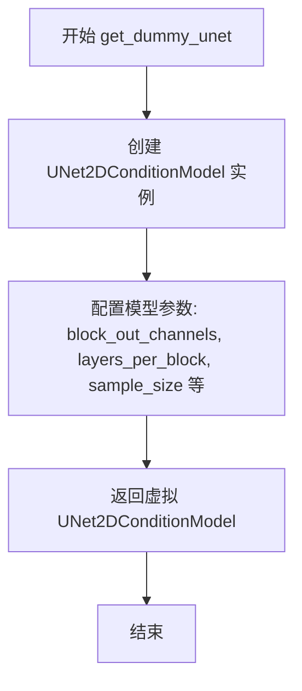

#### 带注释源码

```python
def get_dummy_unet(self):
    """For some tests we also need the underlying UNet. For these, we'll build the UNetControlNetXSModel from the UNet and ControlNetXS-Adapter"""
    # 创建一个虚拟的 UNet2DConditionModel 实例，用于测试目的
    # 该模型配置为小型化配置，以加快测试执行速度
    return UNet2DConditionModel(
        block_out_channels=(4, 8),          # 定义每个输出块的通道数
        layers_per_block=2,                  # 每个块中的层数
        sample_size=16,                      # 输入样本的空间尺寸
        in_channels=4,                       # 输入通道数（对应噪声维度）
        out_channels=4,                      # 输出通道数
        down_block_types=("DownBlock2D", "CrossAttnDownBlock2D"),  # 下采样块类型
        up_block_types=("CrossAttnUpBlock2D", "UpBlock2D"),       # 上采样块类型
        cross_attention_dim=8,               # 交叉注意力维度
        norm_num_groups=4,                   # 归一化组数
        use_linear_projection=True,          # 使用线性投影
    )
```


### `UNetControlNetXSModelTests.get_dummy_controlnet_from_unet`

该方法用于在测试中创建一个虚拟的 ControlNetXS-Adapter 实例。它接收一个 UNet2DConditionModel 对象作为基础，通过 ControlNetXSAdapter.from_unet 方法构建适配器，并返回生成的 ControlNetXSAdapter 实例。该方法主要用于测试场景，以便基于给定的 UNet 模型创建对应的 ControlNetXS 适配器进行后续测试验证。

参数：

- `self`：隐含的 TestCase 方法参数，代表当前测试类实例
- `unet`：`UNet2DConditionModel`，基础 UNet 模型，用于从中创建 ControlNetXS-Adapter
- `**kwargs`：可变关键字参数 dict，其他传递给 `ControlNetXSAdapter.from_unet` 的可选参数

返回值：`ControlNetXSAdapter`，根据给定的 UNet 创建的 ControlNetXS-Adapter 实例

#### 流程图

```mermaid
flowchart TD
    A[开始] --> B[接收 unet 参数和 kwargs]
    B --> C[调用 ControlNetXSAdapter.from_unet]
    C --> D[传入 unet 对象]
    C --> E[设置 size_ratio=1]
    C --> F[设置 conditioning_embedding_out_channels=(2, 2)]
    C --> G[展开传入 **kwargs]
    D --> H[返回 ControlNetXSAdapter 实例]
    E --> H
    F --> H
    G --> H
    I[结束]
```

#### 带注释源码

```python
def get_dummy_controlnet_from_unet(self, unet, **kwargs):
    """For some tests we also need the underlying ControlNetXS-Adapter. For these, we'll build the UNetControlNetXSModel from the UNet and ControlNetXS-Adapter"""
    # size_ratio and conditioning_embedding_out_channels chosen to keep model small
    return ControlNetXSAdapter.from_unet(unet, size_ratio=1, conditioning_embedding_out_channels=(2, 2), **kwargs)
```


### `UNetControlNetXSModelTests.test_from_unet`

该测试方法用于验证 `UNetControlNetXSModel.from_unet` 工厂方法能否正确地从独立的 UNet2DConditionModel 和 ControlNetXSAdapter 实例构建出 UNetControlNetXSModel，并通过权重对比确保所有基础模块（时间嵌入、卷积层、上下采样块等）和控制网络模块的权重被正确映射和初始化。

参数：

- `self`：测试类实例，无需显式传递

返回值：无（`None`），该方法通过断言验证模型构造正确性

#### 流程图

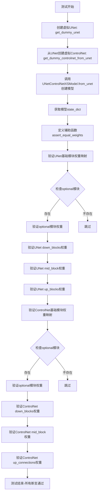

#### 带注释源码

```python
def test_from_unet(self):
    """
    测试 UNetControlNetXSModel.from_unet 工厂方法是否正确地从
    UNet2DConditionModel 和 ControlNetXSAdapter 构建模型，
    并验证所有权重是否正确映射。
    """
    # 步骤1: 创建一个虚拟的 UNet2DConditionModel 用于测试
    # 配置: 2个下采样块, 2个上采样块, 通道数为[4,8], 注意力头为2
    unet = self.get_dummy_unet()
    
    # 步骤2: 从虚拟 UNet 创建对应的 ControlNetXSAdapter
    # 使用 size_ratio=1 和 conditioning_embedding_out_channels=(2,2) 保持模型小巧
    controlnet = self.get_dummy_controlnet_from_unet(unet)
    
    # 步骤3: 调用工厂方法从 UNet 和 ControlNet 创建 UNetControlNetXSModel
    model = UNetControlNetXSModel.from_unet(unet, controlnet)
    
    # 步骤4: 获取模型的完整状态字典，用于后续权重比对
    model_state_dict = model.state_dict()
    
    # 辅助函数: 验证指定模块的参数是否与模型状态字典中的权重相等
    # 参数:
    #   - module: 要检查的 PyTorch 模块
    #   - weight_dict_prefix: 在 state_dict 中的权重前缀
    def assert_equal_weights(module, weight_dict_prefix):
        for param_name, param_value in module.named_parameters():
            # 拼接完整的权重键名并比对
            assert torch.equal(
                model_state_dict[weight_dict_prefix + "." + param_name], 
                param_value
            )
    
    # ==================== 验证来自 UNet 的权重 ====================
    # 核心模块（必须存在）: 时间嵌入、输入卷积、输出归一化、输出卷积
    modules_from_unet = [
        "time_embedding",  # 时间条件嵌入层
        "conv_in",         # 输入卷积层
        "conv_norm_out",   # 输出归一化层
        "conv_out",        # 输出卷积层
    ]
    for p in modules_from_unet:
        # 验证权重是否正确映射到 "base_" 前缀的键下
        assert_equal_weights(getattr(unet, p), "base_" + p)
    
    # 可选模块（可能不存在）: 类嵌入、时间投影、额外嵌入
    optional_modules_from_unet = [
        "class_embedding",   # 类别条件嵌入（SDXL用）
        "add_time_proj",     # 额外时间投影
        "add_embedding",     # 额外嵌入
    ]
    for p in optional_modules_from_unet:
        # 仅当模块存在且非 None 时才验证
        if hasattr(unet, p) and getattr(unet, p) is not None:
            assert_equal_weights(getattr(unet, p), "base_" + p)
    
    # 验证 UNet 的下采样块 (down_blocks)
    # 确保数量一致，然后逐个验证 resnets、attentions、downsamplers
    assert len(unet.down_blocks) == len(model.down_blocks)
    for i, d in enumerate(unet.down_blocks):
        # 基础残差块
        assert_equal_weights(d.resnets, f"down_blocks.{i}.base_resnets")
        # 注意力机制（如果存在）
        if hasattr(d, "attentions"):
            assert_equal_weights(d.attentions, f"down_blocks.{i}.base_attentions")
        # 下采样器（如果存在）
        if hasattr(d, "downsamplers") and getattr(d, "downsamplers") is not None:
            assert_equal_weights(d.downsamplers[0], f"down_blocks.{i}.base_downsamplers")
    
    # 验证 UNet 的中间块 (mid_block)
    assert_equal_weights(unet.mid_block, "mid_block.base_midblock")
    
    # 验证 UNet 的上采样块 (up_blocks)
    assert len(unet.up_blocks) == len(model.up_blocks)
    for i, u in enumerate(unet.up_blocks):
        assert_equal_weights(u.resnets, f"up_blocks.{i}.resnets")
        if hasattr(u, "attentions"):
            assert_equal_weights(u.attentions, f"up_blocks.{i}.attentions")
        if hasattr(u, "upsamplers") and getattr(u, "upsamplers") is not None:
            assert_equal_weights(u.upsamplers[0], f"up_blocks.{i}.upsamplers")
    
    # ==================== 验证来自 ControlNet 的权重 ====================
    # 核心控制网络模块
    modules_from_controlnet = {
        "controlnet_cond_embedding": "controlnet_cond_embedding",  # 条件图像嵌入
        "conv_in": "ctrl_conv_in",           # 控制网络输入卷积
        "control_to_base_for_conv_in": "control_to_base_for_conv_in",  # 控制到基础网络的投影
    }
    optional_modules_from_controlnet = {
        "time_embedding": "ctrl_time_embedding"  # 控制网络时间嵌入
    }
    
    for name_in_controlnet, name_in_unetcnxs in modules_from_controlnet.items():
        assert_equal_weights(getattr(controlnet, name_in_controlnet), name_in_unetcnxs)
    
    for name_in_controlnet, name_in_unetcnxs in optional_modules_from_controlnet.items():
        if hasattr(controlnet, name_in_controlnet) and getattr(controlnet, name_in_controlnet) is not None:
            assert_equal_weights(getattr(controlnet, name_in_controlnet), name_in_unetcnxs)
    
    # 验证 ControlNet 下采样块
    assert len(controlnet.down_blocks) == len(model.down_blocks)
    for i, d in enumerate(controlnet.down_blocks):
        assert_equal_weights(d.resnets, f"down_blocks.{i}.ctrl_resnets")
        assert_equal_weights(d.base_to_ctrl, f"down_blocks.{i}.base_to_ctrl")      # 基础到控制投影
        assert_equal_weights(d.ctrl_to_base, f"down_blocks.{i}.ctrl_to_base")      # 控制到基础投影
        if d.attentions is not None:
            assert_equal_weights(d.attentions, f"down_blocks.{i}.ctrl_attentions")
        if d.downsamplers is not None:
            assert_equal_weights(d.downsamplers, f"down_blocks.{i}.ctrl_downsamplers")
    
    # 验证 ControlNet 中间块
    assert_equal_weights(controlnet.mid_block.base_to_ctrl, "mid_block.base_to_ctrl")
    assert_equal_weights(controlnet.mid_block.midblock, "mid_block.ctrl_midblock")
    assert_equal_weights(controlnet.mid_block.ctrl_to_base, "mid_block.ctrl_to_base")
    
    # 验证 ControlNet 上连接
    assert len(controlnet.up_connections) == len(model.up_blocks)
    for i, u in enumerate(controlnet.up_connections):
        assert_equal_weights(u.ctrl_to_base, f"up_blocks.{i}.ctrl_to_base")
```


### `UNetControlNetXSModelTests.test_freeze_unet`

该测试方法用于验证 `UNetControlNetXSModel` 的 `freeze_unet_params()` 方法能够正确冻结 UNet 相关的参数（将 `requires_grad` 设置为 `False`），同时保持 ControlNet 相关的参数处于可训练状态（`requires_grad` 为 `True`）。

参数：

- `self`：`UNetControlNetXSModelTests`，隐式参数，测试类实例本身

返回值：`None`，无返回值（测试方法）

#### 流程图

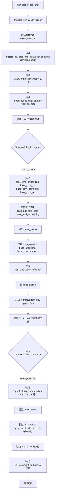

#### 带注释源码

```python
def test_freeze_unet(self):
    """测试 freeze_unet_params 方法能够正确冻结 UNet 参数并保持 ControlNet 参数可训练"""
    
    def assert_frozen(module):
        """辅助函数：验证模块的所有参数都被冻结（requires_grad=False）"""
        for p in module.parameters():
            assert not p.requires_grad

    def assert_unfrozen(module):
        """辅助函数：验证模块的所有参数都未冻结（requires_grad=True）"""
        for p in module.parameters():
            assert p.requires_grad

    # 获取初始化参数和输入
    init_dict, _ = self.prepare_init_args_and_inputs_for_common()
    
    # 创建 UNetControlNetXSModel 实例
    model = UNetControlNetXSModel(**init_dict)
    
    # 调用 freeze_unet_params 方法冻结 UNet 参数
    model.freeze_unet_params()

    # ==================== 验证 UNet 模块被冻结 ====================
    # 验证基础模块（不包括 down, mid, up blocks）
    modules_from_unet = [
        model.base_time_embedding,
        model.base_conv_in,
        model.base_conv_norm_out,
        model.base_conv_out,
    ]
    for m in modules_from_unet:
        assert_frozen(m)

    # 验证可选模块（如果存在）
    optional_modules_from_unet = [
        model.base_add_time_proj,
        model.base_add_embedding,
    ]
    for m in optional_modules_from_unet:
        if m is not None:
            assert_frozen(m)

    # 验证 down blocks 中的 UNet 部分
    for i, d in enumerate(model.down_blocks):
        assert_frozen(d.base_resnets)
        # attentions 可以是 None 或 nn.ModuleList
        if isinstance(d.base_attentions, nn.ModuleList):
            assert_frozen(d.base_attentions)
        if d.base_downsamplers is not None:
            assert_frozen(d.base_downsamplers)

    # 验证 mid block 中的 UNet 部分
    assert_frozen(model.mid_block.base_midblock)

    # 验证 up blocks 中的 UNet 部分
    for i, u in enumerate(model.up_blocks):
        assert_frozen(u.resnets)
        # attentions 可以是 None 或 nn.ModuleList
        if isinstance(u.attentions, nn.ModuleList):
            assert_frozen(u.attentions)
        if u.upsamplers is not None:
            assert_frozen(u.upsamplers)

    # ==================== 验证 ControlNet 模块未被冻结 ====================
    # 验证 ControlNet 基础模块
    modules_from_controlnet = [
        model.controlnet_cond_embedding,
        model.ctrl_conv_in,
        model.control_to_base_for_conv_in,
    ]
    optional_modules_from_controlnet = [model.ctrl_time_embedding]

    for m in modules_from_controlnet:
        assert_unfrozen(m)
    for m in optional_modules_from_controlnet:
        if m is not None:
            assert_unfrozen(m)

    # 验证 down blocks 中的 ControlNet 部分
    for d in model.down_blocks:
        assert_unfrozen(d.ctrl_resnets)
        assert_unfrozen(d.base_to_ctrl)
        assert_unfrozen(d.ctrl_to_base)
        if isinstance(d.ctrl_attentions, nn.ModuleList):
            assert_unfrozen(d.ctrl_attentions)
        if d.ctrl_downsamplers is not None:
            assert_unfrozen(d.ctrl_downsamplers)

    # 验证 mid block 中的 ControlNet 部分
    assert_unfrozen(model.mid_block.base_to_ctrl)
    assert_unfrozen(model.mid_block.ctrl_midblock)
    assert_unfrozen(model.mid_block.ctrl_to_base)

    # 验证 up blocks 中的 ControlNet 部分
    for u in model.up_blocks:
        assert_unfrozen(u.ctrl_to_base)
```


### `UNetControlNetXSModelTests.test_gradient_checkpointing_is_applied`

该方法用于测试梯度检查点（Gradient Checkpointing）功能是否被正确应用到 UNetControlNetXSModel 中的特定模块。测试定义了一组期望使用梯度检查点的模型类（Transformer2DModel、UNetMidBlock2DCrossAttn、ControlNetXSCrossAttnDownBlock2D、ControlNetXSCrossAttnMidBlock2D、ControlNetXSCrossAttnUpBlock2D），并通过调用父类的测试方法来验证这些模块是否正确启用了梯度检查点。

参数：

- `self`：隐式参数，UNetControlNetXSModelTests 实例本身

返回值：`None`，无返回值（测试方法）

#### 流程图

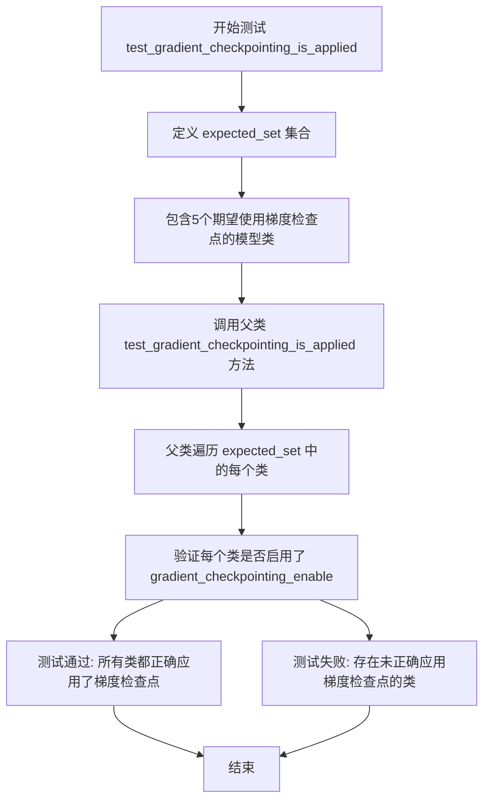

#### 带注释源码

```python
def test_gradient_checkpointing_is_applied(self):
    """
    测试梯度检查点是否被正确应用到指定的模型类。
    
    Gradient Checkpointing 是一种通过在反向传播时重新计算中间激活值
    来节省显存的技术。该测试确保 UNetControlNetXSModel 中的关键模块
    都正确启用了这一优化功能。
    """
    # 定义期望使用梯度检查点的模型类集合
    # 这些模块在训练时需要启用梯度检查点以节省显存
    expected_set = {
        "Transformer2DModel",                  # Transformer 2D 模型
        "UNetMidBlock2DCrossAttn",             # UNet 中间块（交叉注意力）
        "ControlNetXSCrossAttnDownBlock2D",    # ControlNet XS 下采样块（交叉注意力）
        "ControlNetXSCrossAttnMidBlock2D",     # ControlNet XS 中间块（交叉注意力）
        "ControlNetXSCrossAttnUpBlock2D",      # ControlNet XS 上采样块（交叉注意力）
    }
    # 调用父类的测试方法，验证这些类是否都正确启用了梯度检查点
    # 父类 test_gradient_checkpointing_is_applied 会检查:
    # 1. 每个类是否调用了 gradient_checkpointing_enable
    # 2. 前向传播是否正确使用了检查点
    super().test_gradient_checkpointing_is_applied(expected_set=expected_set)
```


### `UNetControlNetXSModelTests.test_forward_no_control`

该方法是 `UNetControlNetXSModelTests` 测试类中的一个测试用例，用于验证当 `apply_control=False` 时，`UNetControlNetXSModel` 的输出与底层 `UNet2DConditionModel` 的输出保持一致（忽略控制网络的影响）。

参数：

- `self`：隐式参数，`UNetControlNetXSModelTests` 类的实例方法

返回值：`None`，该方法为测试用例，使用断言验证输出，不返回任何值

#### 流程图

```mermaid
flowchart TD
    A[开始测试 test_forward_no_control] --> B[获取虚拟UNet模型]
    B --> C[获取虚拟ControlNetXS适配器]
    C --> D[从UNet和ControlNet创建UNetControlNetXSModel]
    D --> E[将模型移至torch_device]
    E --> F[获取虚拟输入dummy_input]
    F --> G[分离控制网络特定输入]
    G --> H[准备UNet输入: 排除controlnet_cond和conditioning_scale]
    H --> I[使用torch.no_grad禁用梯度]
    I --> J[执行UNet前向传播]
    J --> K[执行UNetControlNetXSModel前向传播 apply_control=False]
    K --> L[比较两个输出的差异]
    L --> M{差异 < 3e-4?}
    M -->|是| N[测试通过]
    M -->|否| O[测试失败抛出AssertionError]
```

#### 带注释源码

```python
@is_flaky  # 标记为可能 flaky 的测试
def test_forward_no_control(self):
    """
    测试当 apply_control=False 时，UNetControlNetXSModel 的输出应与普通 UNet 的输出相同。
    这验证了控制网络在禁用时不会影响基础 UNet 的前向传播。
    """
    # 步骤1: 获取一个虚拟的 UNet2DConditionModel 用于测试
    # 该方法创建一个小型测试用 UNet 模型
    unet = self.get_dummy_unet()
    
    # 步骤2: 从虚拟 UNet 创建对应的 ControlNetXS 适配器
    # ControlNetXSAdapter 用于提供额外的控制信号
    controlnet = self.get_dummy_controlnet_from_unet(unet)
    
    # 步骤3: 使用 from_unet 类方法将 UNet 和 ControlNet 组合成 UNetControlNetXSModel
    # 这是被测试的核心模型类
    model = UNetControlNetXSModel.from_unet(unet, controlnet)
    
    # 步骤4: 将模型移至指定的计算设备 (torch_device)
    # 确保测试在正确的设备上运行
    unet = unet.to(torch_device)
    model = model.to(torch_device)
    
    # 步骤5: 获取测试用的虚拟输入
    # dummy_input 包含: sample, timestep, encoder_hidden_states, controlnet_cond, conditioning_scale
    input_ = self.dummy_input
    
    # 步骤6: 定义控制网络特定的输入键
    # 这些是 UNetControlNetXSModel 特有的参数，基础 UNet 不需要
    control_specific_input = ["controlnet_cond", "conditioning_scale"]
    
    # 步骤7: 构建仅供基础 UNet 使用的输入字典
    # 排除 controlnet 特有参数，使基础 UNet 能够正常运行
    input_for_unet = {k: v for k, v in input_.items() if k not in control_specific_input}
    
    # 步骤8: 执行前向传播并比较输出
    # 使用 torch.no_grad() 禁用梯度计算以提高测试效率
    with torch.no_grad():
        # 8.1: 运行基础 UNet 的前向传播
        # 使用排除控制参数的输入
        unet_output = unet(**input_for_unet).sample.cpu()
        
        # 8.2: 运行 UNetControlNetXSModel 的前向传播
        # apply_control=False 表示禁用控制网络的影响
        # 使用完整输入包括 controlnet_cond 和 conditioning_scale
        unet_controlnet_output = model(**input_, apply_control=False).sample.cpu()
    
    # 步骤9: 验证两个输出的差异在可接受范围内
    # 当 apply_control=False 时，两者输出应该几乎完全相同
    # 使用最大绝对误差作为比较标准，阈值为 3e-4
    assert np.abs(unet_output.flatten() - unet_controlnet_output.flatten()).max() < 3e-4
```


### `UNetControlNetXSModelTests.test_time_embedding_mixing`

该测试方法用于验证 UNetControlNetXSModel 中时间嵌入混合（time embedding mixing）功能的正确性。测试通过构造带时间嵌入混合参数（time_embedding_mix=0.5, learn_time_embedding=True）和不带该参数的两种 ControlNetXSAdapter 配置，分别构建模型并执行前向传播，最后断言两种模型输出的形状一致，以确保时间嵌入混合功能不会破坏模型输出的维度正确性。

参数：

- `self`：`UNetControlNetXSModelTests`，测试类实例本身，包含测试所需的配置和辅助方法

返回值：`None`，测试方法无返回值，通过断言验证正确性

#### 流程图

```mermaid
flowchart TD
    A[开始测试 test_time_embedding_mixing] --> B[调用 get_dummy_unet 获取基础 UNet]
    B --> C[调用 get_dummy_controlnet_from_unet 获取标准 ControlNet]
    C --> D[调用 get_dummy_controlnet_from_unet 并传入 time_embedding_mix=0.5, learn_time_embedding=True 获取混合时间嵌入的 ControlNet]
    D --> E[使用 from_unet 方法构建标准模型 model]
    E --> F[使用 from_unet 方法构建混合时间嵌入模型 model_mix_time]
    F --> G[将模型移动到 torch_device 设备]
    G --> H[获取测试输入 dummy_input]
    H --> I[使用 torch.no_grad 上下文管理器]
    I --> J[执行模型前向传播: model(**input_).sample]
    J --> K[执行混合时间嵌入模型前向传播: model_mix_time(**input_).sample]
    K --> L{断言: output.shape == output_mix_time.shape}
    L -->|通过| M[测试通过]
    L -->|失败| N[测试失败]
```

#### 带注释源码

```python
def test_time_embedding_mixing(self):
    """
    测试时间嵌入混合功能。
    验证带时间嵌入混合参数的模型输出形状与不带该参数的模型输出形状一致。
    """
    # 1. 获取一个虚拟的基础 UNet2DConditionModel
    # 用于构建 UNetControlNetXSModel
    unet = self.get_dummy_unet()
    
    # 2. 使用默认参数构建一个标准 ControlNetXSAdapter
    # 不包含时间嵌入混合功能
    controlnet = self.get_dummy_controlnet_from_unet(unet)
    
    # 3. 使用时间嵌入混合参数构建另一个 ControlNetXSAdapter
    # time_embedding_mix=0.5: 控制时间嵌入混合比例
    # learn_time_embedding=True: 启用可学习的时间嵌入
    controlnet_mix_time = self.get_dummy_controlnet_from_unet(
        unet, time_embedding_mix=0.5, learn_time_embedding=True
    )

    # 4. 使用 from_unet 工厂方法构建两个 UNetControlNetXSModel
    # model: 基于标准 controlnet
    model = UNetControlNetXSModel.from_unet(unet, controlnet)
    # model_mix_time: 基于带时间嵌入混合的 controlnet
    model_mix_time = UNetControlNetXSModel.from_unet(unet, controlnet_mix_time)

    # 5. 将模型移动到指定的计算设备 (torch_device)
    unet = unet.to(torch_device)
    model = model.to(torch_device)
    model_mix_time = model_mix_time.to(torch_device)

    # 6. 获取测试输入，包含 sample, timestep, encoder_hidden_states 等
    input_ = self.dummy_input

    # 7. 使用 torch.no_grad 禁用梯度计算，减少内存占用
    with torch.no_grad():
        # 执行标准模型的前向传播
        output = model(**input_).sample
        # 执行带时间嵌入混合的模型前向传播
        output_mix_time = model_mix_time(**input_).sample

    # 8. 断言验证两种模型的输出形状一致
    # 确保时间嵌入混合功能不会改变输出维度
    assert output.shape == output_mix_time.shape
```


### `UNetControlNetXSModelTests.test_forward_with_norm_groups`

该测试方法用于验证 UNetControlNetXSModel 在不同 norm_num_groups 配置下的前向传播能力，但由于当前 UNetControlNetXSModel 仅支持 StableDiffusion 和 StableDiffusion-XL（两者的 norm_num_groups 固定为 32），该测试被跳过。

参数：

- `self`：`UNetControlNetXSModelTests`，当前测试类实例

返回值：`None`，测试方法无返回值

#### 流程图

```mermaid
flowchart TD
    A[开始 test_forward_with_norm_groups] --> B{检查测试是否需要执行}
    B -->|是| C[执行前向传播测试]
    B -->|否| D[跳过测试]
    C --> E[验证输出形状和数值]
    E --> F[结束]
    D --> F
    
    style A fill:#f9f,stroke:#333
    style D fill:#ff6,stroke:#333
    style F fill:#9f9,stroke:#333
```

#### 带注释源码

```python
@unittest.skip("Test not supported.")
def test_forward_with_norm_groups(self):
    """
    测试 UNetControlNetXSModel 在不同 norm_num_groups 配置下的前向传播。
    
    注意事项：
    - UNetControlNetXSModel 当前仅支持 StableDiffusion 和 StableDiffusion-XL
    - 这两个模型的 norm_num_groups 固定为 32
    - 因此不需要测试不同的 norm_num_groups 值
    
    参数:
        self: UNetControlNetXSModelTests 测试类实例
    
    返回值:
        None: 测试被跳过，无实际执行
    """
    # UNetControlNetXSModel currently only supports StableDiffusion 
    # and StableDiffusion-XL, both of which have norm_num_groups 
    # fixed at 32. So we don't need to test different values 
    # for norm_num_groups.
    pass
```

## 关键组件


### UNetControlNetXSModel

主模型类，结合了UNet2DConditionModel和ControlNetXSAdapter，实现了条件图像生成任务中的ControlNet控制功能。该模型支持从UNet和ControlNet组合构建，并提供了冻结UNet参数、时间嵌入混合等高级功能。

### ControlNetXSAdapter

ControlNet适配器模块，负责从预训练的UNet模型中提取ControlNet分支，用于条件控制信号的生成。支持从UNet模型通过`from_unet`方法构建，并可配置size_ratio和conditioning_embedding_out_channels参数。

### UNet2DConditionModel

条件UNet模型，是Stable Diffusion等扩散模型的核心组件。在UNetControlNetXSModel中作为基础模型(base model)，可以通过freeze_unet_params方法冻结其参数，仅训练ControlNet部分。

### freeze_unet_params

冻结UNet参数的功能方法。调用后，基础UNet的所有参数将被设置为不可训练(require_grad=False)，仅保留ControlNet分支可训练，实现基础模型固定、只训练控制器的训练策略。

### from_unet

类方法，用于从UNet和ControlNetXSAdapter构建UNetControlNetXSModel。该方法将UNet的权重映射到模型的base_前缀模块，将ControlNet的权重映射到对应的ctrl_前缀模块，实现权重共享和组合。

### 时间嵌入混合(Time Embedding Mixing)

通过time_embedding_mix参数控制时间嵌入的混合比例，配合learn_time_embedding=True可学习时间嵌入混合权重，实现对UNet和ControlNet时间嵌入的动态融合。

### 梯度检查点(Gradient Checkpointing)

一种内存优化技术，通过在前向传播中不保存中间激活值、而在反向传播时重新计算的方式，减少显存占用。代码中验证了Transformer2DModel、UNetMidBlock2DCrossAttn等模块正确应用了梯度检查点。

### 权重映射与共享

模型通过前缀约定(base_和ctrl_)实现权重映射：UNet权重映射到base_前缀的模块，ControlNet权重直接使用或映射到ctrl_前缀模块。这种设计允许在UNet和ControlNet之间共享部分权重结构。

### 条件控制(Conditional Control)

通过controlnet_cond和conditioning_scale参数实现条件控制。apply_control参数控制是否应用ControlNet的条件控制信号，实现基础输出与控制输出的切换。


## 问题及建议


### 已知问题

- **硬编码的测试参数**：`dummy_input` 属性中的 `batch_size=4`、`num_channels=4`、`sizes=(16, 16)` 等参数硬编码在属性中，缺乏灵活的配置方式，导致测试复用性低。
- **魔法数字缺乏解释**：`test_forward_no_control` 中使用 `3e-4` 作为比较阈值，没有定义常量或注释说明该数值的选取依据。
- **重复的权重检查逻辑**：`test_from_unet` 和 `test_freeze_unet` 方法中存在大量重复的模块遍历和断言逻辑，可提取为通用辅助方法以提高可维护性。
- **辅助函数作用域不当**：`test_from_unet` 方法内部定义的 `assert_equal_weights` 函数应在类级别或模块级别定义，以便复用。
- **测试跳过缺乏替代方案**：`test_forward_with_norm_groups` 被无条件跳过（`@unittest.skip`），没有提供相应的替代测试或解释文档。
- **缺少测试文档**：关键测试方法如 `test_gradient_checkpointing_is_applied`、`test_time_embedding_mixing` 等缺少文档字符串，难以理解测试意图和预期行为。
- **设备兼容性测试缺失**：测试仅使用 `torch_device` 运行，未显式测试不同设备（如 CPU、CUDA）的兼容性或边界情况。
- **断言错误信息不明确**：大量使用 `assert` 语句但缺乏自定义错误消息，测试失败时难以快速定位问题。

### 优化建议

- **参数化测试配置**：将 `dummy_input` 改为可接受参数的方法，或在类级别定义配置属性，允许子类或外部灵活覆盖。
- **提取常量**：将 `3e-4` 等阈值定义为类常量或模块级常量，并添加注释说明其含义（如容差范围）。
- **重构通用辅助方法**：将 `assert_equal_weights`、`assert_frozen`、`assert_unfrozen` 等逻辑提取为类方法或独立的测试工具函数。
- **完善测试文档**：为每个测试方法添加 docstring，说明测试目的、输入输出和预期结果。
- **改进跳过测试**：对于 `test_forward_with_norm_groups`，可添加说明文档解释为何跳过，或实现条件执行的替代测试。
- **增强断言信息**：在关键断言处添加自定义错误消息，如 `assert torch.equal(...), f"Weight mismatch for {param_name}"`。
- **添加设备测试**：考虑添加 `@torch.cuda.skip_if_no_cuda` 或类似装饰器显式测试多设备场景。
- **提取模型创建逻辑**：`get_dummy_unet` 和 `get_dummy_controlnet_from_unet` 方法的调用在多个测试中重复，可使用 `setUp` 方法或缓存机制避免重复创建。

## 其它


### 设计目标与约束

本测试文件旨在验证 `UNetControlNetXSModel` 类的功能正确性，包括模型权重正确性、参数冻结机制、时间嵌入混合等核心功能。设计约束包括：仅支持 StableDiffusion 和 StableDiffusion-XL（norm_num_groups 固定为 32），不支持其他 norm_groups 配置。

### 外部依赖与接口契约

**Python包依赖**：
- `unittest`：测试框架
- `numpy as np`：数值计算库
- `torch` (PyTorch)：深度学习框架
- `torch.nn`：神经网络模块

**diffusers库依赖**：
- `ControlNetXSAdapter`：ControlNet适配器类
- `UNet2DConditionModel`：UNet条件生成模型
- `UNetControlNetXSModel`：待测试的主模型类
- `logging`：日志工具
- `testing_utils`（`enable_full_determinism`, `floats_tensor`, `is_flaky`, `torch_device`）：测试工具函数
- `test_modeling_common`（`ModelTesterMixin`, `UNetTesterMixin`）：测试混入类

**接口契约**：
- `UNetControlNetXSModel.from_unet(unet, controlnet)`：类方法，从UNet和ControlNetXSAdapter创建模型
- `model.freeze_unet_params()`：实例方法，冻结UNet参数
- `model(**inputs)`：前向传播，支持 `apply_control` 参数控制是否应用ControlNet条件
- `model.state_dict()`：返回模型参数字典

### 错误处理与异常设计

测试中使用了以下断言机制进行错误检测：
- `assert torch.equal()`：验证权重相等性
- `assert not p.requires_grad`：验证参数冻结状态
- `assert p.requires_grad`：验证参数可训练状态
- `assert np.abs(...).max() < 3e-4`：数值精度验证
- `@unittest.skip("Test not supported.")`：跳过不支持的测试用例
- `@is_flaky`：标记可能不稳定测试

### 数据流与状态机

**输入数据流**：
1. `dummy_input` 属性生成测试输入：噪声样本、时间步、编码器隐藏状态、ControlNet条件、conditioning_scale
2. 输入格式：`{"sample": Tensor, "timestep": Tensor, "encoder_hidden_states": Tensor, "controlnet_cond": Tensor, "conditioning_scale": float}`

**模型状态**：
- 基础模式（apply_control=True）：正常应用ControlNet条件
- 无控制模式（apply_control=False）：跳过ControlNet条件，等同于纯UNet输出

### 性能考虑与测试策略

**性能测试指标**：
- 数值精度：使用 `np.abs().max() < 3e-4` 验证输出精度
- 模型参数量：通过 `block_out_channels=(4,8)`, `ctrl_block_out_channels=[2,4]` 等参数控制模型规模

**测试覆盖策略**：
- 权重一致性验证（test_from_unet）
- 参数冻结验证（test_freeze_unet）
- 梯度检查点验证（test_gradient_checkpointing_is_applied）
- 前向传播验证（test_forward_no_control）
- 时间嵌入混合验证（test_time_embedding_mixing）

### 配置与参数说明

**模型初始化参数**（prepare_init_args_and_inputs_for_common）：
- `sample_size`: 16
- `down_block_types`: ("DownBlock2D", "CrossAttnDownBlock2D")
- `up_block_types`: ("CrossAttnUpBlock2D", "UpBlock2D")
- `block_out_channels`: (4, 8)
- `cross_attention_dim`: 8
- `transformer_layers_per_block`: 1
- `num_attention_heads`: 2
- `norm_num_groups`: 4
- `upcast_attention`: False
- `ctrl_block_out_channels`: [2, 4]
- `ctrl_num_attention_heads`: 4
- `ctrl_max_norm_num_groups`: 2
- `ctrl_conditioning_embedding_out_channels`: (2, 2)

**UNet创建参数**（get_dummy_unet）：
- `block_out_channels`: (4, 8)
- `layers_per_block`: 2
- `in_channels`: 4
- `out_channels`: 4
- `use_linear_projection`: True

**ControlNetXSAdapter创建参数**：
- `size_ratio`: 1
- `conditioning_embedding_out_channels`: (2, 2)
- 可选参数：`time_embedding_mix`, `learn_time_embedding`

### 潜在扩展与兼容性

**版本兼容性**：
- 测试明确跳过 `test_forward_with_norm_groups`，因为当前仅支持 StableDiffusion 和 StableDiffusion-XL 的固定 norm_num_groups=32
- 代码兼容 PyTorch 和 NumPy 数组操作

**可扩展方向**：
- 支持更多条件生成任务
- 支持不同的 norm_num_groups 配置
- 优化梯度检查点策略


    