# `diffusers\tests\models\unets\test_models_unet_motion.py` 详细设计文档

这是一个测试文件，用于验证 UNetMotionModel 模型的核心功能，包括模型加载、参数冻结、运动模块的保存与加载、梯度检查点、前向分块、模型序列化等关键功能的正确性。

## 整体流程

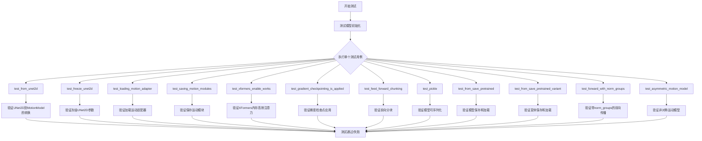

## 类结构

```
unittest.TestCase
├── ModelTesterMixin (混入类)
├── UNetTesterMixin (混入类)
└── UNetMotionModelTests (主测试类)
    ├── 类属性: model_class, main_input_name
    ├── 属性方法: dummy_input, input_shape, output_shape
    └── 测试方法: test_from_unet2d, test_freeze_unet2d, ...
```

## 全局变量及字段


### `logger`
    
模块级日志记录器，用于输出测试过程中的日志信息

类型：`logging.Logger`
    


### `enable_full_determinism`
    
启用完全确定性模式的函数，确保测试结果可复现

类型：`function`
    


### `UNetMotionModelTests.model_class`
    
指定测试的模型类为 UNetMotionModel

类型：`type`
    


### `UNetMotionModelTests.main_input_name`
    
主输入张量的名称，此处为 'sample'

类型：`str`
    


### `UNetMotionModelTests.dummy_input`
    
生成并返回一个包含噪声、时间步和编码器隐藏状态的虚拟输入字典

类型：`property`
    


### `UNetMotionModelTests.input_shape`
    
返回模型输入的形状元组 (4, 4, 16, 16)

类型：`property`
    


### `UNetMotionModelTests.output_shape`
    
返回模型输出的形状元组 (4, 4, 16, 16)

类型：`property`
    


### `UNetMotionModelTests.prepare_init_args_and_inputs_for_common`
    
准备并返回模型初始化参数字典和输入字典，用于通用测试

类型：`function`
    


### `UNetMotionModelTests.test_from_unet2d`
    
测试从 UNet2DConditionModel 加载并转换权重到 UNetMotionModel

类型：`function`
    


### `UNetMotionModelTests.test_freeze_unet2d`
    
测试冻结 UNet2D 参数，确保除了 motion_modules 外的参数不可训练

类型：`function`
    


### `UNetMotionModelTests.test_loading_motion_adapter`
    
测试从 MotionAdapter 加载运动模块到模型中

类型：`function`
    


### `UNetMotionModelTests.test_saving_motion_modules`
    
测试将运动模块保存到磁盘并作为 MotionAdapter 重新加载，验证一致性

类型：`function`
    


### `UNetMotionModelTests.test_xformers_enable_works`
    
测试启用 XFormers 高效注意力机制是否成功应用于中间块

类型：`function`
    


### `UNetMotionModelTests.test_gradient_checkpointing_is_applied`
    
测试梯度检查点技术是否正确应用于指定的 Motion 相关块

类型：`function`
    


### `UNetMotionModelTests.test_feed_forward_chunking`
    
测试前向传播的分块处理是否与完整前向传播结果一致

类型：`function`
    


### `UNetMotionModelTests.test_pickle`
    
测试模型的深拷贝（pickle）操作是否保持输出一致

类型：`function`
    


### `UNetMotionModelTests.test_from_save_pretrained`
    
测试模型保存到指定目录并使用 safe_serialization=False 重新加载

类型：`function`
    


### `UNetMotionModelTests.test_from_save_pretrained_variant`
    
测试模型使用 variant 参数（如 fp16）保存和加载，以及处理变体文件缺失的异常

类型：`function`
    


### `UNetMotionModelTests.test_forward_with_norm_groups`
    
测试模型在前向传播时使用特定的 norm_num_groups 配置

类型：`function`
    


### `UNetMotionModelTests.test_asymmetric_motion_model`
    
测试具有非对称结构（不同层的Transformer层数和注意力头数）的运动模型配置

类型：`function`
    
    

## 全局函数及方法


### `copy.copy`

该函数是 Python 标准库中的浅拷贝函数，在 `test_pickle` 测试方法中被用于复制模型输出的样本数据，以验证模型输出是否可以被正确复制。

参数：

- `sample`：`torch.Tensor`，需要复制的张量对象

返回值：`torch.Tensor`，返回输入张量的浅拷贝副本

#### 流程图

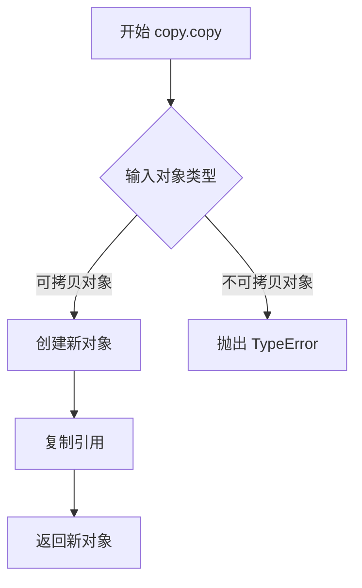

#### 带注释源码

```python
# 在 test_pickle 方法中使用 copy.copy
# 用于验证模型输出的张量是否可以正确复制

# 1. 获取模型输出样本
with torch.no_grad():
    sample = model(**inputs_dict).sample  # 模型前向传播得到的输出

# 2. 使用 copy.copy 创建浅拷贝
sample_copy = copy.copy(sample)  # 复制张量对象

# 3. 验证原对象和拷贝对象内容一致
assert (sample - sample_copy).abs().max() < 1e-4  # 差异应小于阈值
```

---

### `test_pickle`

该测试方法验证 UNetMotionModel 的输出张量是否支持 Python 的浅拷贝操作，确保模型输出可以被正确复制而不产生意外的副作用。

参数：无（使用类属性 `dummy_input` 作为测试输入）

返回值：`None`，该方法为测试用例，无返回值

#### 流程图

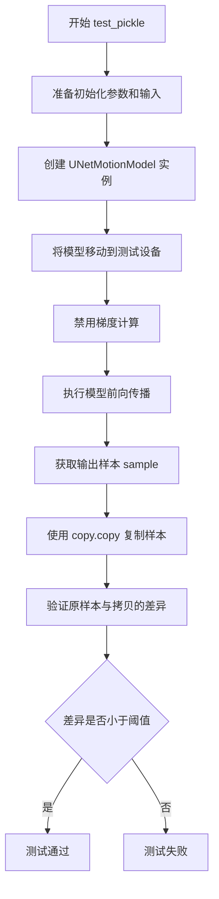

#### 带注释源码

```python
def test_pickle(self):
    """
    测试方法：验证模型输出的可复制性
    
    该测试确保：
    1. 模型可以正常执行前向传播
    2. 模型输出支持 Python 的 copy.copy 操作
    3. 复制后的对象与原对象内容一致
    """
    # enable deterministic behavior for gradient checkpointing
    # 准备初始化参数和测试输入
    init_dict, inputs_dict = self.prepare_init_args_and_inputs_for_common()
    
    # 创建 UNetMotionModel 实例
    model = self.model_class(**init_dict)
    
    # 将模型移动到测试设备（CPU/CUDA）
    model.to(torch_device)

    # 执行前向传播，禁用梯度计算以提高效率
    with torch.no_grad():
        # 获取模型输出
        sample = model(**inputs_dict).sample

    # 使用 Python 标准库的 copy 模块进行浅拷贝
    # 这验证了模型输出的可复制性
    sample_copy = copy.copy(sample)

    # 断言：验证原始样本和拷贝样本的差异
    # 使用最大绝对误差作为比较指标
    assert (sample - sample_copy).abs().max() < 1e-4
```


### `os.path.join`

用于将多个路径组合成一个完整的路径。

参数：

- `path`：字符串，要组合的初始路径
- `*paths`：可变字符串参数，要追加的路径部分

返回值：`str`，组合后的完整路径字符串

#### 流程图

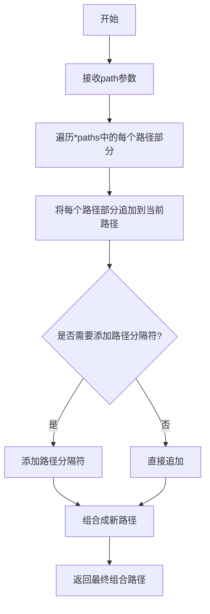

#### 带注释源码

```python
# 在 test_saving_motion_modules 方法中使用
# 用于构建模型保存路径
model_save_path = os.path.join(tmpdirname, "diffusion_pytorch_model.safetensors")
```

---

### `os.path.isfile`

用于检查给定的路径是否是一个存在的常规文件。

参数：

- `path`：字符串，要检查的文件路径

返回值：`bool`，如果路径是一个存在的文件则返回`True`，否则返回`False`

#### 流程图

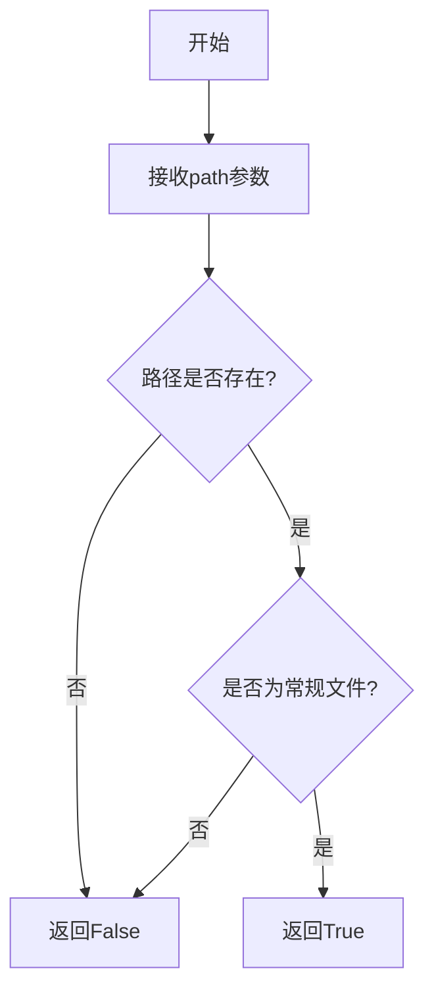

#### 带注释源码

```python
# 在 test_saving_motion_modules 方法中使用
# 用于验证模型文件是否成功保存
self.assertTrue(os.path.isfile(os.path.join(tmpdirname, "diffusion_pytorch_model.safetensors")))
```

---

### `os` 模块在代码中的完整使用上下文

#### 带注释源码

```python
# 导入os模块
import os
import tempfile
import unittest

# ... 其他导入 ...

class UNetMotionModelTests(ModelTesterMixin, UNetTesterMixin, unittest.TestCase):
    # ... 类定义 ...

    def test_saving_motion_modules(self):
        """
        测试运动模块的保存功能
        """
        torch.manual_seed(0)
        init_dict, inputs_dict = self.prepare_init_args_and_inputs_for_common()
        model = self.model_class(**init_dict)
        model.to(torch_device)

        # 创建临时目录用于保存模型
        with tempfile.TemporaryDirectory() as tmpdirname:
            # 保存运动模块到指定目录
            model.save_motion_modules(tmpdirname)
            
            # 使用 os.path.join 组合文件路径
            # 使用 os.path.isfile 检查文件是否成功创建
            self.assertTrue(os.path.isfile(os.path.join(tmpdirname, "diffusion_pytorch_model.safetensors")))

            # 从保存的目录加载 MotionAdapter
            adapter_loaded = MotionAdapter.from_pretrained(tmpdirname)

            torch.manual_seed(0)
            model_loaded = self.model_class(**init_dict)
            # 加载运动模块
            model_loaded.load_motion_modules(adapter_loaded)
            model_loaded.to(torch_device)

        # 验证保存和加载的模型输出一致
        with torch.no_grad():
            output = model(**inputs_dict)[0]
            output_loaded = model_loaded(**inputs_dict)[0]

        max_diff = (output - output_loaded).abs().max().item()
        self.assertLessEqual(max_diff, 1e-4, "Models give different forward passes")
```

---

### 关键组件信息

| 组件名称 | 一句话描述 |
|---------|-----------|
| `os.path.join` | 用于将目录名和文件名组合成完整的文件路径 |
| `os.path.isfile` | 用于检查指定的文件路径是否存在且为常规文件 |

---

### 技术债务与优化空间

1. **硬编码文件名**：`"diffusion_pytorch_model.safetensors"`文件名在代码中硬编码，建议提取为常量或配置
2. **路径处理可测试性**：建议封装路径处理逻辑以便单元测试
3. **缺少错误处理**：文件操作缺乏详细的错误信息反馈

---

### 其它说明

- **设计目标**：确保UNetMotionModel的运动模块能够正确保存和加载
- **错误处理**：使用`tempfile.TemporaryDirectory()`确保临时目录在使用后自动清理
- **外部依赖**：依赖于Python标准库中的`os`和`tempfile`模块


### tempfile

这是 Python 标准库中的临时文件/目录管理模块，在本代码中用于创建临时目录以保存和加载模型权重。

参数：
- `dir`：str，可选，指定临时目录的父目录，默认为 None（系统临时目录）
- `prefix`：str，可选，临时目录名称的前缀，默认为 None
- `suffix`：str，可选，临时目录名称的后缀，默认为 None

返回值：Context manager，返回一个临时目录对象，当退出 with 块时自动删除目录及其内容

#### 流程图

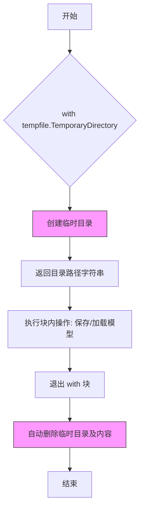

#### 带注释源码

```python
# 使用 tempfile 模块创建临时目录进行模型保存和加载测试

# 场景1: 保存 motion modules
with tempfile.TemporaryDirectory() as tmpdirname:
    # tmpdirname 是自动生成的临时目录路径字符串
    # 例如: '/var/folders/xxx/tmpxxx'
    model.save_motion_modules(tmpdirname)
    # 将模型的 motion modules 保存到临时目录
    self.assertTrue(os.path.isfile(os.path.join(tmpdirname, "diffusion_pytorch_model.safetensors")))
    # 从临时目录加载 MotionAdapter
    adapter_loaded = MotionAdapter.from_pretrained(tmpdirname)

# 场景2: 完整的保存和加载测试
with tempfile.TemporaryDirectory() as tmpdirname:
    # 保存模型到临时目录
    model.save_pretrained(tmpdirname, safe_serialization=False)
    # 从临时目录加载模型
    new_model = self.model_class.from_pretrained(tmpdirname)

# 场景3: 带变体的保存和加载
with tempfile.TemporaryDirectory() as tmpdirname:
    # 保存为 fp16 变体
    model.save_pretrained(tmpdirname, variant="fp16", safe_serialization=False)
    # 加载 fp16 变体
    new_model = self.model_class.from_pretrained(tmpdirname, variant="fp16")

# 临时目录特性:
# 1. 自动创建唯一命名的临时目录
# 2. 目录在 with 块结束时自动删除
# 3. 无需手动清理磁盘空间
# 4. 适合测试场景的临时文件操作
```

#### 关键用途总结

在本测试代码中，`tempfile.TemporaryDirectory()` 主要用于：

1. **模型保存测试** (`test_saving_motion_modules`)：验证 motion modules 能否正确保存到磁盘
2. **模型序列化测试** (`test_from_save_pretrained`)：测试 `save_pretrained` 和 `from_pretrained` 的完整性
3. **变体加载测试** (`test_from_save_pretrained_variant`)：测试不同模型变体（fp16）的保存和加载


### UNetMotionModelTests.test_from_unet2d

验证从 UNet2DConditionModel 转换为 UNetMotionModel 时参数是否正确保留。

参数：
- `self`：隐式参数，测试类实例

返回值：`None`，通过断言验证模型参数一致性

#### 流程图

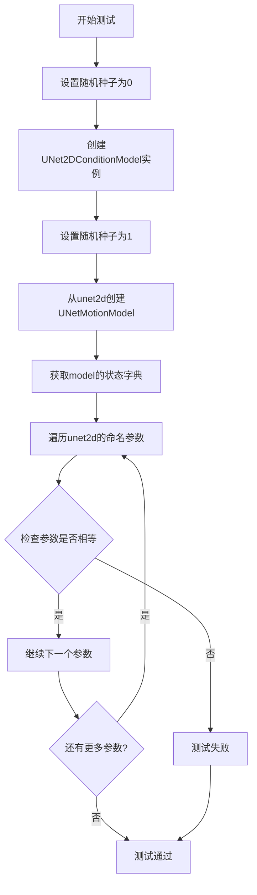

#### 带注释源码

```python
def test_from_unet2d(self):
    """
    测试从 UNet2DConditionModel 转换为 UNetMotionModel 的功能。
    验证转换后模型参数与原始 UNet2D 参数一致。
    """
    torch.manual_seed(0)  # 设置随机种子以确保可重复性
    unet2d = UNet2DConditionModel()  # 创建基础 UNet2D 模型

    torch.manual_seed(1)  # 重新设置种子以确保转换使用特定随机状态
    model = self.model_class.from_unet2d(unet2d)  # 从 unet2d 创建 motion 模型
    model_state_dict = model.state_dict()  # 获取转换后模型的状态字典

    # 遍历原始 unet2d 的所有参数，验证参数是否完全一致
    for param_name, param_value in unet2d.named_parameters():
        # 使用 torch.equal 比较参数张量是否相等
        self.assertTrue(torch.equal(model_state_dict[param_name], param_value))
```

---

### UNetMotionModelTests.test_freeze_unet2d

验证冻结 UNet2D 参数功能，确保 motion 模块参数可训练而其他参数被冻结。

参数：
- `self`：隐式参数，测试类实例

返回值：`None`，通过断言验证参数梯度设置

#### 流程图

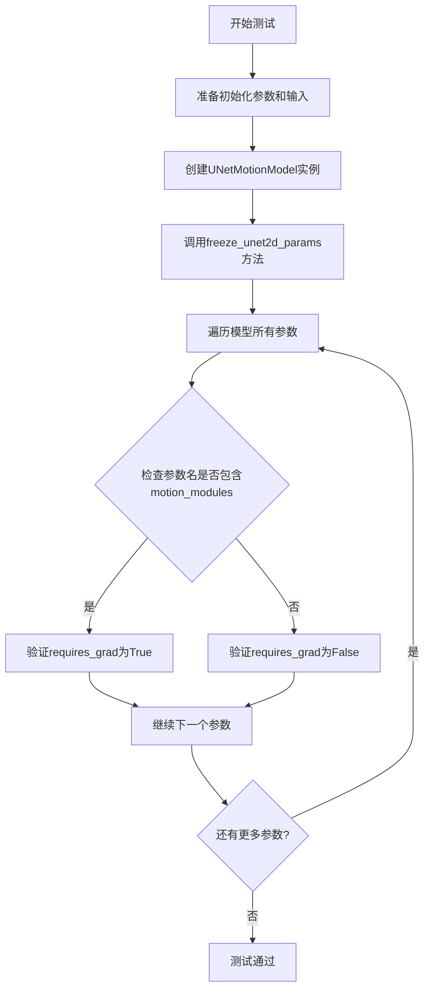

#### 带注释源码

```python
def test_freeze_unet2d(self):
    """
    测试冻结 UNet2D 参数的功能。
    验证调用 freeze_unet2d_params 后，除 motion_modules 外的参数被冻结，
    motion_modules 的参数保持可训练状态。
    """
    init_dict, inputs_dict = self.prepare_init_args_and_inputs_for_common()
    model = self.model_class(**init_dict)  # 使用初始化参数创建模型
    model.freeze_unet2d_params()  # 冻结 UNet2D 参数

    # 遍历所有参数进行检查
    for param_name, param_value in model.named_parameters():
        if "motion_modules" not in param_name:
            # 非 motion 模块参数应该被冻结（不可训练）
            self.assertFalse(param_value.requires_grad)
        else:
            # motion 模块参数应该保持可训练
            self.assertTrue(param_value.requires_grad)
```

---

### UNetMotionModelTests.test_loading_motion_adapter

验证加载 MotionAdapter 功能，确保运动模块参数正确加载到模型中。

参数：
- `self`：隐式参数，测试类实例

返回值：`None`，通过断言验证运动模块参数一致性

#### 流程图

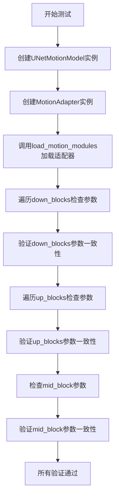

#### 带注释源码

```python
def test_loading_motion_adapter(self):
    """
    测试加载 MotionAdapter 功能。
    验证 load_motion_modules 方法正确将 adapter 中的运动模块参数
    加载到模型的 down_blocks、up_blocks 和 mid_block 中。
    """
    model = self.model_class()  # 创建空的 motion 模型
    adapter = MotionAdapter()  # 创建运动适配器
    model.load_motion_modules(adapter)  # 加载运动模块

    # 检查 down_blocks 中的运动模块参数
    for idx, down_block in enumerate(model.down_blocks):
        adapter_state_dict = adapter.down_blocks[idx].motion_modules.state_dict()
        for param_name, param_value in down_block.motion_modules.named_parameters():
            self.assertTrue(torch.equal(adapter_state_dict[param_name], param_value))

    # 检查 up_blocks 中的运动模块参数
    for idx, up_block in enumerate(model.up_blocks):
        adapter_state_dict = adapter.up_blocks[idx].motion_modules.state_dict()
        for param_name, param_value in up_block.motion_modules.named_parameters():
            self.assertTrue(torch.equal(adapter_state_dict[param_name], param_value))

    # 检查 mid_block 中的运动模块参数
    mid_block_adapter_state_dict = adapter.mid_block.motion_modules.state_dict()
    for param_name, param_value in model.mid_block.motion_modules.named_parameters():
        self.assertTrue(torch.equal(mid_block_adapter_state_dict[param_name], param_value))
```

---

### UNetMotionModelTests.test_saving_motion_modules

验证保存和加载运动模块功能，确保序列化后模型输出与原始模型一致。

参数：
- `self`：隐式参数，测试类实例

返回值：`None`，通过断言验证模型输出差异小于阈值

#### 流程图

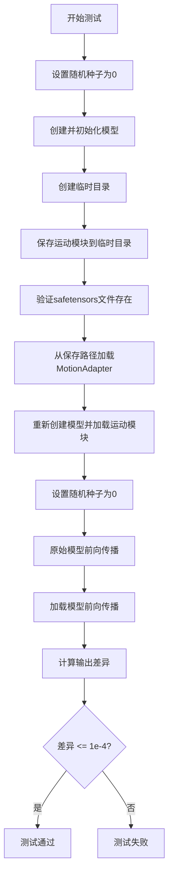

#### 带注释源码

```python
def test_saving_motion_modules(self):
    """
    测试保存和加载运动模块功能。
    验证保存运动模块到磁盘后，重新加载并进行比较，
    确保模型输出与原始模型一致（差异小于 1e-4）。
    """
    torch.manual_seed(0)  # 设置随机种子确保可重复性
    init_dict, inputs_dict = self.prepare_init_args_and_inputs_for_common()
    model = self.model_class(**init_dict)  # 创建模型
    model.to(torch_device)  # 移动到计算设备

    with tempfile.TemporaryDirectory() as tmpdirname:
        model.save_motion_modules(tmpdirname)  # 保存运动模块
        # 验证保存的文件存在
        self.assertTrue(os.path.isfile(os.path.join(tmpdirname, "diffusion_pytorch_model.safetensors")))

        adapter_loaded = MotionAdapter.from_pretrained(tmpdirname)  # 加载适配器

        torch.manual_seed(0)  # 重新设置种子
        model_loaded = self.model_class(**init_dict)  # 创建新模型实例
        model_loaded.load_motion_modules(adapter_loaded)  # 加载运动模块
        model_loaded.to(torch_device)  # 移动到计算设备

    # 比较两个模型的输出
    with torch.no_grad():
        output = model(**inputs_dict)[0]  # 原始模型输出
        output_loaded = model_loaded(**inputs_dict)[0]  # 加载模型输出

    # 计算最大差异并验证
    max_diff = (output - output_loaded).abs().max().item()
    self.assertLessEqual(max_diff, 1e-4, "Models give different forward passes")
```

---

### UNetMotionModelTests.test_from_save_pretrained

验证模型保存和加载功能，确保使用 save_pretrained/from_pretrained 序列化后模型输出与原始模型一致。

参数：
- `self`：隐式参数，测试类实例
- `expected_max_diff`：期望的最大差异值，默认为 5e-5

返回值：`None`，通过断言验证模型输出差异

#### 流程图

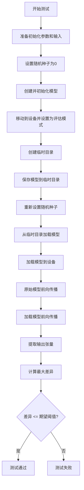

#### 带注释源码

```python
def test_from_save_pretrained(self, expected_max_diff=5e-5):
    """
    测试模型保存和加载功能。
    验证使用 save_pretrained 和 from_pretrained 方法后，
    重新加载的模型与原始模型的前向传播输出差异在允许范围内。
    """
    init_dict, inputs_dict = self.prepare_init_args_and_inputs_for_common()

    torch.manual_seed(0)
    model = self.model_class(**init_dict)
    model.to(torch_device)
    model.eval()  # 设置为评估模式

    with tempfile.TemporaryDirectory() as tmpdirname:
        model.save_pretrained(tmpdirname, safe_serialization=False)
        torch.manual_seed(0)
        new_model = self.model_class.from_pretrained(tmpdirname)
        new_model.to(torch_device)

    with torch.no_grad():
        image = model(**inputs_dict)
        # 处理字典返回值的情况
        if isinstance(image, dict):
            image = image.to_tuple()[0]

        new_image = new_model(**inputs_dict)
        if isinstance(new_image, dict):
            new_image = new_image.to_tuple()[0]

    # 计算并验证输出差异
    max_diff = (image - new_image).abs().max().item()
    self.assertLessEqual(max_diff, expected_max_diff, "Models give different forward passes")
```

---

### UNetMotionModelTests.test_pickle

验证模型序列化功能，确保使用 pickle 复制后的输出与原始输出一致。

参数：
- `self`：隐式参数，测试类实例

返回值：`None`，通过断言验证复制前后输出差异

#### 流程图

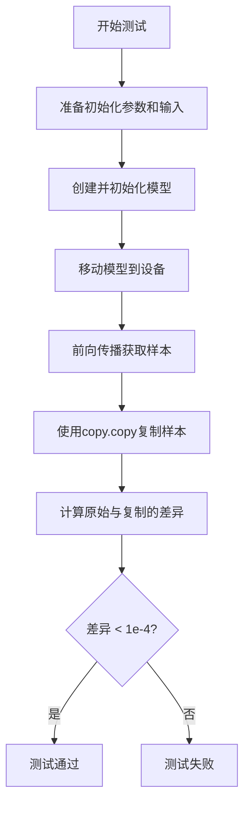

#### 带注释源码

```python
def test_pickle(self):
    """
    测试模型输出的 pickle 序列化功能。
    验证使用 copy.copy 复制输出张量后，
    复制张量与原始张量的差异小于 1e-4。
    """
    # enable deterministic behavior for gradient checkpointing
    init_dict, inputs_dict = self.prepare_init_args_and_inputs_for_common()
    model = self.model_class(**init_dict)
    model.to(torch_device)

    with torch.no_grad():
        sample = model(**inputs_dict).sample  # 获取模型输出样本

    sample_copy = copy.copy(sample)  # 使用 pickle 复制样本

    # 验证复制前后的差异
    assert (sample - sample_copy).abs().max() < 1e-4
```

---

### UNetMotionModelTests.test_feed_forward_chunking

验证前向分块功能，确保启用分块后输出形状和数值与原始输出一致。

参数：
- `self`：隐式参数，测试类实例

返回值：`None`，通过断言验证输出形状和数值一致性

#### 流程图

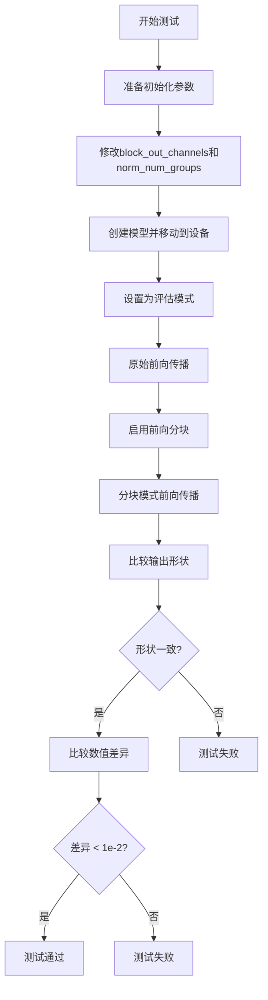

#### 带注释源码

```python
def test_feed_forward_chunking(self):
    """
    测试前向分块功能。
    验证 enable_forward_chunking 启用后，
    模型输出形状与原始输出一致，数值差异小于 1e-2。
    """
    init_dict, inputs_dict = self.prepare_init_args_and_inputs_for_common()
    init_dict["block_out_channels"] = (32, 64)  # 设置不同输出通道
    init_dict["norm_num_groups"] = 32

    model = self.model_class(**init_dict)
    model.to(torch_device)
    model.eval()  # 评估模式

    with torch.no_grad():
        output = model(**inputs_dict)[0]  # 原始输出

    model.enable_forward_chunking()  # 启用分块
    with torch.no_grad():
        output_2 = model(**inputs_dict)[0]  # 分块模式输出

    # 验证输出形状一致
    self.assertEqual(output.shape, output_2.shape, "Shape doesn't match")
    # 验证数值差异在允许范围内
    assert np.abs(output.cpu() - output_2.cpu()).max() < 1e-2
```

---

### UNetMotionModelTests.test_gradient_checkpointing_is_applied

验证梯度检查点功能是否正确应用于指定的模块类型。

参数：
- `self`：隐式参数，测试类实例

返回值：`None`，通过调用父类方法验证

#### 带注释源码

```python
def test_gradient_checkpointing_is_applied(self):
    """
    测试梯度检查点功能是否正确应用。
    验证指定的模块类型（CrossAttnUpBlockMotion、CrossAttnDownBlockMotion 等）
    都正确应用了梯度检查点。
    """
    expected_set = {
        "CrossAttnUpBlockMotion",
        "CrossAttnDownBlockMotion",
        "UNetMidBlockCrossAttnMotion",
        "UpBlockMotion",
        "Transformer2DModel",
        "DownBlockMotion",
    }
    # 调用父类的测试方法，传入期望的模块集合
    super().test_gradient_checkpointing_is_applied(expected_set=expected_set)
```

---

### UNetMotionModelTests.test_xformers_enable_works

验证 XFormers 内存高效注意力机制是否正确启用。

参数：
- `self`：隐式参数，测试类实例

返回值：`None`，通过断言验证 XFormers 处理器已启用

#### 带注释源码

```python
@unittest.skipIf(
    torch_device != "cuda" or not is_xformers_available(),
    reason="XFormers attention is only available with CUDA and `xformers` installed",
)
def test_xformers_enable_works(self):
    """
    测试 XFormers 内存高效注意力机制是否正确启用。
    仅在 CUDA 和 xformers 可用时运行。
    验证启用后注意力处理器的类型为 XFormersAttnProcessor。
    """
    init_dict, inputs_dict = self.prepare_init_args_and_inputs_for_common()
    model = self.model_class(**init_dict)

    model.enable_xformers_memory_efficient_attention()  # 启用 xformers

    # 验证 xformers 注意力处理器已正确设置
    assert (
        model.mid_block.attentions[0].transformer_blocks[0].attn1.processor.__class__.__name__
        == "XFormersAttnProcessor"
    ), "xformers is not enabled"
```

---

### UNetMotionModelTests.test_from_save_pretrained_variant

验证模型变体（variant）保存和加载功能，确保不同 variant 正确处理。

参数：
- `self`：隐式参数，测试类实例
- `expected_max_diff`：期望的最大差异值，默认为 5e-5

返回值：`None`，通过断言验证变体加载功能

#### 带注释源码

```python
def test_from_save_pretrained_variant(self, expected_max_diff=5e-5):
    """
    测试模型变体（variant）的保存和加载功能。
    验证保存为特定 variant 后，只能加载对应 variant 的模型，
    否则抛出正确的错误信息。
    """
    init_dict, inputs_dict = self.prepare_init_args_and_inputs_for_common()

    torch.manual_seed(0)
    model = self.model_class(**init_dict)
    model.to(torch_device)
    model.eval()

    with tempfile.TemporaryDirectory() as tmpdirname:
        # 保存为 fp16 variant
        model.save_pretrained(tmpdirname, variant="fp16", safe_serialization=False)

        torch.manual_seed(0)
        # 可以加载 fp16 variant
        new_model = self.model_class.from_pretrained(tmpdirname, variant="fp16")
        
        # 尝试加载非 variant 版本应该失败
        with self.assertRaises(OSError) as error_context:
            self.model_class.from_pretrained(tmpdirname)

        # 验证错误信息包含预期内容
        assert "Error no file named diffusion_pytorch_model.bin found in directory" in str(error_context.exception)

        new_model.to(torch_device)

    with torch.no_grad():
        image = model(**inputs_dict)
        if isinstance(image, dict):
            image = image.to_tuple()[0]

        new_image = new_model(**inputs_dict)
        if isinstance(new_image, dict):
            new_image = new_image.to_tuple()[0]

    max_diff = (image - new_image).abs().max().item()
    self.assertLessEqual(max_diff, expected_max_diff, "Models give different forward passes")
```

---

### UNetMotionModelTests.test_forward_with_norm_groups

验证带归一化组的模型前向传播功能。

参数：
- `self`：隐式参数，测试类实例

返回值：`None`，通过断言验证输出形状与输入形状一致

#### 带注释源码

```python
def test_forward_with_norm_groups(self):
    """
    测试带归一化组（norm_groups）的模型前向传播。
    验证设置 norm_num_groups 后，模型能够正常进行前向传播，
    输出形状与输入形状一致。
    """
    init_dict, inputs_dict = self.prepare_init_args_and_inputs_for_common()

    init_dict["norm_num_groups"] = 16  # 设置归一化组数
    init_dict["block_out_channels"] = (16, 32)  # 设置输出通道

    model = self.model_class(**init_dict)
    model.to(torch_device)
    model.eval()

    with torch.no_grad():
        output = model(**inputs_dict)

        if isinstance(output, dict):
            output = output.to_tuple()[0]

    # 验证输出不为空
    self.assertIsNotNone(output)
    # 验证输出形状与输入形状一致
    expected_shape = inputs_dict["sample"].shape
    self.assertEqual(output.shape, expected_shape, "Input and output shapes do not match")
```

---

### UNetMotionModelTests.test_asymmetric_motion_model

验证非对称运动模型配置功能，支持不对称的层数和注意力头配置。

参数：
- `self`：隐式参数，测试类实例

返回值：`None`，通过断言验证输出形状与输入形状一致

#### 带注释源码

```python
def test_asymmetric_motion_model(self):
    """
    测试非对称运动模型配置。
    验证模型支持不对称的层数配置、transformer 层配置、注意力头配置等，
    确保复杂配置下模型能正常前向传播并输出正确形状。
    """
    init_dict, inputs_dict = self.prepare_init_args_and_inputs_for_common()

    # 设置非对称的层数配置
    init_dict["layers_per_block"] = (2, 3)
    init_dict["transformer_layers_per_block"] = ((1, 2), (3, 4, 5))
    init_dict["reverse_transformer_layers_per_block"] = ((7, 6, 7, 4), (4, 2, 2))

    # 设置非对称的时序 transformer 层配置
    init_dict["temporal_transformer_layers_per_block"] = ((2, 5), (2, 3, 5))
    init_dict["reverse_temporal_transformer_layers_per_block"] = ((5, 4, 3, 4), (3, 2, 2))

    # 设置非对称的注意力头配置
    init_dict["num_attention_heads"] = (2, 4)
    init_dict["motion_num_attention_heads"] = (4, 4)
    init_dict["reverse_motion_num_attention_heads"] = (2, 2)

    # 启用 motion 中间块并设置层配置
    init_dict["use_motion_mid_block"] = True
    init_dict["mid_block_layers"] = 2
    init_dict["transformer_layers_per_mid_block"] = (1, 5)
    init_dict["temporal_transformer_layers_per_mid_block"] = (2, 4)

    model = self.model_class(**init_dict)
    model.to(torch_device)
    model.eval()

    with torch.no_grad():
        output = model(**inputs_dict)

        if isinstance(output, dict):
            output = output.to_tuple()[0]

    # 验证输出不为空且形状正确
    self.assertIsNotNone(output)
    expected_shape = inputs_dict["sample"].shape
    self.assertEqual(output.shape, expected_shape, "Input and output shapes do not match")
```


### `np.abs`

numpy 库中的绝对值函数，用于计算数组中每个元素的绝对值。在测试中用于比较模型前向传播的输出差异。

参数：

- `x`：数组或类似数组的对象，需要计算绝对值的输入数据

返回值：`ndarray`，返回与输入形状相同的数组，其中每个元素都是原始元素的绝对值

#### 流程图

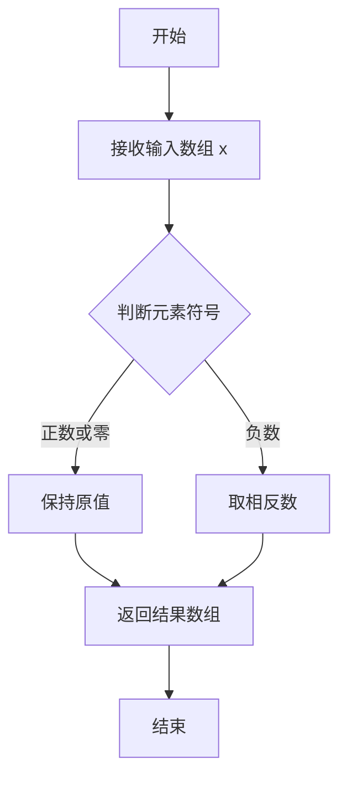

#### 带注释源码

```
np.abs(output.cpu() - output_loaded.cpu()).max() < 1e-2
```

- `output.cpu()` 和 `output_loaded.cpu()`：将 PyTorch 张量从 GPU 移到 CPU
- `output.cpu() - output_loaded.cpu()`：计算两个模型输出的逐元素差值
- `np.abs(...)`：对差值取绝对值，处理正负号
- `.max()`：找出绝对差值中的最大值
- `< 1e-2`：断言最大差值小于 0.01，验证两个模型的输出基本一致


### `torch` (PyTorch 模块)

本代码文件使用了 PyTorch 框架的核心功能，主要涉及随机种子设置、张量创建与设备迁移、梯度控制、以及张量比较等操作，用于实现 UNetMotionModel 的单元测试。

#### 使用的 torch 函数和对象

| 函数/对象 | 参数 | 类型 | 描述 |
|-----------|------|------|------|
| `torch.manual_seed` | `seed`: `int` | 输入 | 设置 CPU 和 CUDA 的随机种子，确保测试可复现 |
| `torch.tensor` | `data`: `list` 或类似数据 | 输入 | 创建张量对象 |
| `.to(device)` | `device`: `str` (如 "cuda", "cpu") | 输入 | 将张量移动到指定计算设备 |
| `torch.no_grad` | 无参数 | 上下文管理器 | 禁用梯度计算，用于推理阶段以节省内存 |
| `torch.equal` | `tensor1`, `tensor2`: `Tensor` | 输入 | 比较两个张量是否相等，返回布尔值 |
| `torch.device` | `device`: `str` | 输入 | 创建设备对象，指定计算设备 |

#### 带注释源码（torch 相关使用）

```python
import torch  # 导入 PyTorch 核心库

# === 随机种子设置 ===
torch.manual_seed(0)  # 设置随机种子为 0，确保每次运行生成相同的随机数序列
torch.manual_seed(1)  # 重新设置随机种子为 1

# === 张量创建 ===
time_step = torch.tensor([10]).to(torch_device)  # 创建包含单个元素的张量，并移动到指定设备
noise = floats_tensor((batch_size, num_channels, num_frames) + sizes).to(torch_device)  # 创建噪声张量并迁移到设备

# === 梯度控制（推理模式） ===
with torch.no_grad():  # 上下文管理器，禁用梯度计算
    output = model(**inputs_dict)[0]  # 执行前向传播，不计算梯度

# === 张量比较 ===
torch.equal(model_state_dict[param_name], param_value)  # 检查两个张量的值是否完全相等
(output - output_loaded).abs().max().item()  # 计算输出差异的最大绝对值
```

#### 测试用例描述

| 测试方法 | 描述 |
|----------|------|
| `test_from_unet2d` | 测试从 UNet2DConditionModel 转换到 UNetMotionModel，验证参数是否正确复制 |
| `test_freeze_unet2d` | 测试冻结 UNet2D 参数，确保只有 motion_modules 可训练 |
| `test_loading_motion_adapter` | 测试加载 MotionAdapter，验证 motion_modules 参数正确加载 |
| `test_saving_motion_modules` | 测试保存和加载 motion_modules，验证模型一致性 |
| `test_xformers_enable_works` | 测试启用 xformers 高效注意力机制 |
| `test_gradient_checkpointing_is_applied` | 测试梯度检查点是否正确应用到各模块 |
| `test_feed_forward_chunking` | 测试前向分块计算，验证输出形状一致性 |
| `test_pickle` | 测试模型序列化与反序列化 |
| `test_from_save_pretrained` | 测试模型保存和加载（标准方式） |
| `test_from_save_pretrained_variant` | 测试模型变体保存和加载 |
| `test_forward_with_norm_groups` | 测试带归一化组的前向传播 |
| `test_asymmetric_motion_model` | 测试非对称运动模型配置 |


### `MotionAdapter`

运动适配器类，用于封装和管理UNet模型的运动模块（motion modules），支持从预训练模型加载运动权重，并提供与主模型集成的能力。

参数：

- 无显式构造函数参数（使用默认初始化）

返回值：`MotionAdapter`实例

#### 流程图

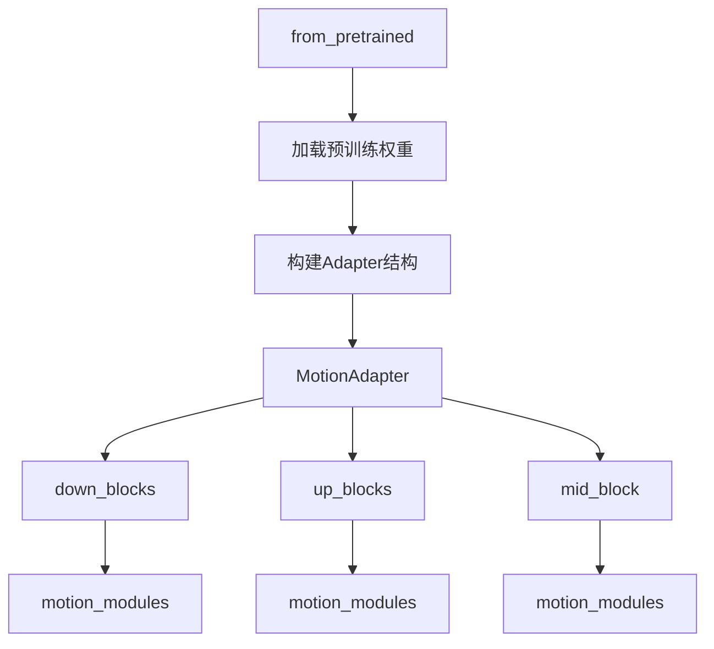

#### 带注释源码

```python
# 从 diffusers 库导入 MotionAdapter 类
from diffusers import MotionAdapter, UNet2DConditionModel, UNetMotionModel

# 使用方式1: 创建 MotionAdapter 实例
adapter = MotionAdapter()

# 使用方式2: 从预训练路径加载 MotionAdapter
adapter_loaded = MotionAdapter.from_pretrained(tmpdirname)

# MotionAdapter 包含以下主要属性:
# - down_blocks: 下采样块列表，每个块包含 motion_modules
# - up_blocks: 上采样块列表，每个块包含 motion_modules  
# - mid_block: 中间块，包含 motion_modules

# 访问运动模块的权重
adapter_state_dict = adapter.down_blocks[idx].motion_modules.state_dict()
adapter_state_dict = adapter.up_blocks[idx].motion_modules.state_dict()
mid_block_adapter_state_dict = adapter.mid_block.motion_modules.state_dict()
```

#### 关键组件信息

- **down_blocks**: 包含下采样运动模块的列表
- **up_blocks**: 包含上采样运动模块的列表
- **mid_block**: 包含中间块运动模块
- **motion_modules**: 具体的运动模块组件

#### 潜在技术债务或优化空间

1. **缺少显式类定义**: `MotionAdapter`类的完整定义不在当前文件中，建议查看diffusers库源码获取完整接口
2. **类型注解缺失**: 代码中没有为MotionAdapter提供类型注解
3. **文档注释不足**: 缺少对MotionAdapter类功能的详细文档说明
4. **参数配置不透明**: 构造函数支持哪些参数需要查阅库文档

#### 其它说明

- MotionAdapter是diffusers库提供的外部类，用于视频扩散模型的运动模块适配
- 该类遵循HuggingFace Transformers库的预训练模型加载模式（from_pretrained）
- 主要用于将运动模块与UNet2DConditionModel集成，形成UNetMotionModel
- 支持state_dict()方法进行权重序列化


### UNet2DConditionModel

UNet2DConditionModel 是扩散模型库（diffusers）中的 2D 条件 UNet 模型类，主要用于条件图像生成任务（如 Stable Diffusion），通过接收噪声样本、时间步长和条件嵌入（encoder_hidden_states）来预测去噪后的图像。在该测试文件中，它被用作基础模型，通过 `from_unet2d` 方法转换为运动模型（UNetMotionModel）。

参数：

- 该类的具体参数需要参考 diffusers 库中的实际定义。在测试代码中，使用无参数方式实例化：`UNet2DConditionModel()`

返回值：`torch.nn.Module`，返回 UNet2DConditionModel 实例

#### 流程图

```mermaid
graph TD
    A[UNet2DConditionModel] --> B[实例化: model = UNet2DConditionModel()]
    B --> C[获取模型参数: model.state_dict]
    C --> D[用于from_unet2d转换测试]
    
    E[UNetMotionModel.from_unet2d] --> F[接收UNet2DConditionModel]
    F --> G[复制参数到Motion模型]
    G --> H[验证参数一致性]
```

#### 带注释源码

```python
# 从diffusers库导入UNet2DConditionModel类
from diffusers import UNet2DConditionModel

# 在test_from_unet2d测试方法中使用
def test_from_unet2d(self):
    torch.manual_seed(0)
    # 创建UNet2DConditionModel实例（无参数，使用默认配置）
    unet2d = UNet2DConditionModel()

    torch.manual_seed(1)
    # 使用from_unet2d类方法将UNet2D模型转换为运动模型
    model = self.model_class.from_unet2d(unet2d)
    model_state_dict = model.state_dict()

    # 验证转换后模型的参数与原始UNet2DConditionModel参数一致
    for param_name, param_value in unet2d.named_parameters():
        self.assertTrue(torch.equal(model_state_dict[param_name], param_value))
```

---

### 补充说明

由于提供的代码是测试文件，**UNet2DConditionModel 的完整类定义（字段、方法等）位于 diffusers 库源代码中**，未在此测试文件中展示。以下是基于测试上下文推断的关键信息：

**已知信息：**

| 属性 | 类型 | 描述 |
|------|------|------|
| `from_unet2d` | 类方法 | 将 UNet2DConditionModel 转换为其他变体（如 UNetMotionModel） |
| `state_dict` | 实例方法 | 获取模型参数字典 |

**潜在技术债务/优化空间：**

1. 测试中仅验证了参数一致性，未验证模型结构的正确性
2. 缺少对 UNet2DConditionModel 自身前向传播（forward）的单元测试

**外部依赖：**

- `diffusers` 库中的 `UNet2DConditionModel` 类
- PyTorch 框架


# UNetMotionModel 详细设计文档提取

由于提供的代码是 `UNetMotionModel` 的测试类而非其本体实现，我将从测试代码中提取 `UNetMotionModel` 类的关键方法和功能信息。

### UNetMotionModel

UNetMotionModel 是基于 Diffusers 库的运动模型类，继承自 UNet2DConditionModel 并扩展了时间维度处理能力，用于视频生成任务中的运动特征建模。

参数：

- `sample`：Tensor，输入的噪声样本
- `timestep`：Tensor，时间步长
- `encoder_hidden_states`：Tensor，编码器的隐藏状态

返回值：元组或字典，包含生成的输出样本

#### 流程图

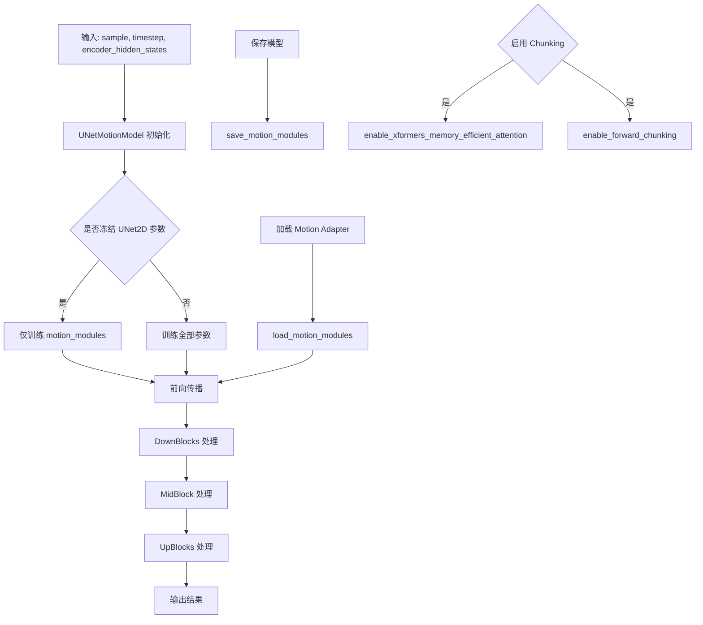

#### 带注释源码

```python
# 测试类中展示了 UNetMotionModel 的使用方式

# 1. 初始化参数配置
init_dict = {
    "block_out_channels": (16, 32),      # 块输出通道数
    "norm_num_groups": 16,               # 归一化组数
    "down_block_types": ("CrossAttnDownBlockMotion", "DownBlockMotion"),  # 下采样块类型
    "up_block_types": ("UpBlockMotion", "CrossAttnUpBlockMotion"),        # 上采样块类型
    "cross_attention_dim": 16,           # 交叉注意力维度
    "num_attention_heads": 2,            # 注意力头数
    "out_channels": 4,                   # 输出通道数
    "in_channels": 4,                    # 输入通道数
    "layers_per_block": 1,               # 每块层数
    "sample_size": 16,                   # 样本大小
}

# 2. 创建模型实例
model = UNetMotionModel(**init_dict)

# 3. 冻结 UNet2D 参数，仅训练运动模块
model.freeze_unet2d_params()

# 4. 加载运动适配器
adapter = MotionAdapter()
model.load_motion_modules(adapter)

# 5. 保存运动模块
model.save_motion_modules(tmpdirname)

# 6. 启用 XFormers 高效注意力
model.enable_xformers_memory_efficient_attention()

# 7. 启用前向分块
model.enable_forward_chunking()

# 8. 前向传播
output = model(sample=noise, timestep=time_step, encoder_hidden_states=encoder_hidden_states)
```

### 关键组件信息

| 组件名称 | 一句话描述 |
|---------|-----------|
| MotionAdapter | 运动适配器，用于存储和加载运动模块 |
| UNet2DConditionModel | 2D 条件 UNet 模型基类 |
| DownBlockMotion | 运动下采样块 |
| UpBlockMotion | 运动上采样块 |
| CrossAttnDownBlockMotion | 带交叉注意力的运动下采样块 |
| CrossAttnUpBlockMotion | 带交叉注意力的运动上采样块 |

### 潜在技术债务与优化空间

1. **测试覆盖不足**：缺少对运动模块特定前向传播的直接单元测试
2. **参数配置复杂**：非对称模型配置参数过多（reverse_*, temporal_*），增加使用难度
3. **文档缺失**：UNetMotionModel 类的核心实现未在此测试文件中体现
4. **错误处理**：部分测试使用 `assert` 而非 pytest 的 `assertRaises`，不够规范

### 其它项目

**设计目标**：支持视频扩散模型中的时序运动特征建模

**约束**：

- 需要 CUDA 和 xformers 才能使用高效注意力
- 运动模块与 UNet2D 参数可分离训练

**错误处理**：使用 `unittest.assertRaises` 处理预期异常（如变体加载失败）

**外部依赖**：

- `diffusers` 库（UNetMotionModel, MotionAdapter, UNet2DConditionModel）
- `torch` 深度学习框架
- `xformers`（可选，用于内存高效注意力）


### `logging.get_logger`

获取指定名称的日志记录器实例，用于在模块中记录日志信息。

参数：

- `name`：`str`，日志记录器的名称，通常使用 `__name__` 变量（当前模块的完全限定名称）

返回值：`logging.Logger`，返回一个日志记录器对象，可用于记录不同级别的日志消息

#### 流程图

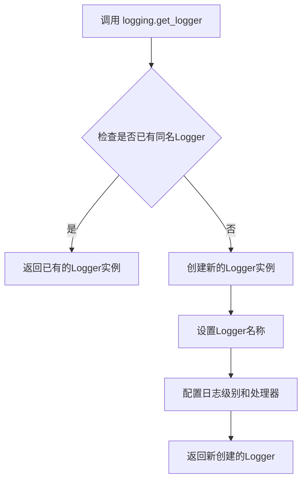

#### 带注释源码

```python
# 从 diffusers.utils 导入 logging 模块
from diffusers.utils import logging

# 获取当前模块的日志记录器
# __name__ 是 Python 内置变量，代表当前模块的完全限定名称
# 例如：如果这个文件是 tests/test_unet_motion_model.py，则 __name__ 为 'tests.test_unet_motion_model'
logger = logging.get_logger(__name__)

# 使用 logger 记录日志的示例（在代码中潜在使用）
# logger.info("This is an info message")
# logger.warning("This is a warning message")
# logger.error("This is an error message")
```

#### 详细说明

| 属性 | 详情 |
|------|------|
| **来源模块** | `diffusers.utils.logging` |
| **函数类型** | 模块级函数 |
| **用途** | 创建或获取日志记录器，用于在模块中输出日志信息 |
| **日志级别** | 通常支持 DEBUG、INFO、WARNING、ERROR、CRITICAL 级别 |
| **配置方式** | 可以通过 `logging.set_verbosity()` 控制全局日志详细程度 |

#### 实际使用场景

在给定的测试代码中，`logger` 被初始化但未直接显式调用。日志记录器的主要作用包括：

1. **调试信息输出**：记录测试执行过程中的关键步骤
2. **错误追踪**：当测试失败时，提供详细的错误上下文
3. **性能监控**：记录模型加载和推理的时间信息
4. **兼容性警告**：提示可能的兼容性问题（如 xformers 可用性检查）

#### 潜在的技术债务

- **日志级别硬编码**：当前代码中未设置具体的日志级别，可能使用默认级别
- **缺少日志格式化配置**：未自定义日志输出格式，可能导致日志信息不够清晰
- **日志输出目标不明确**：未指定日志输出到文件或控制台


### `is_xformers_available`

该函数用于检查当前环境中是否已安装 xformers 库，通常用于条件判断是否可以启用 xformers 高效注意力机制。

参数：**无参数**

返回值：`bool`，返回 True 表示 xformers 可用，返回 False 表示 xformers 不可用。

#### 流程图

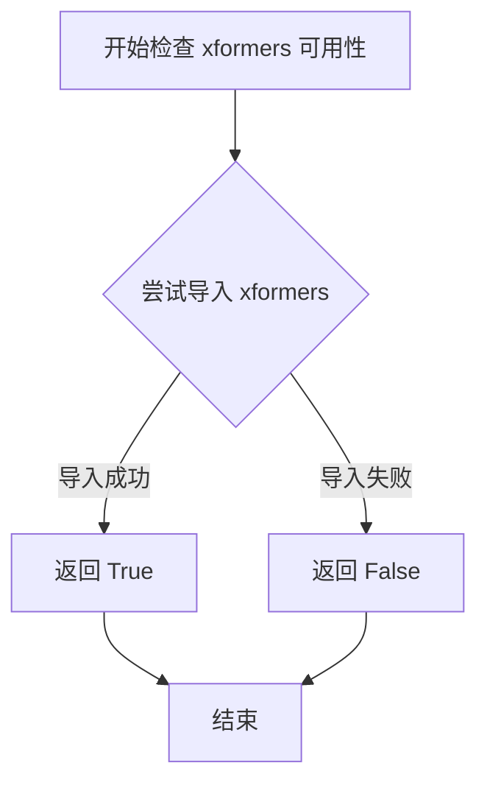

#### 带注释源码

```
# 该函数定义于 diffusers.utils.import_utils 模块
# 此处为测试文件中的导入语句
from diffusers.utils.import_utils import is_xformers_available

# 函数使用示例（在测试装饰器中）
@unittest.skipIf(
    torch_device != "cuda" or not is_xformers_available(),
    reason="XFormers attention is only available with CUDA and `xformers` installed",
)
def test_xformers_enable_works(self):
    # 仅当 CUDA 可用且 xformers 已安装时执行此测试
    ...
```

**注意**：由于 `is_xformers_available` 函数定义在 `diffusers.utils.import_utils` 模块中，而非当前测试文件内，上述源码仅为该函数在项目中的典型实现模式参考。实际实现通常使用 `importlib` 或 `sys.modules` 检查来动态判断依赖库是否可用。


### `enable_full_determinism`

该函数用于启用深度学习框架的完全确定性运行模式，确保测试和实验结果可复现。通过设置随机种子和环境变量，禁用非确定性操作（如 cuDNN 自动调优），使每次运行产生完全相同的结果。

参数： 无

返回值： 无

#### 流程图

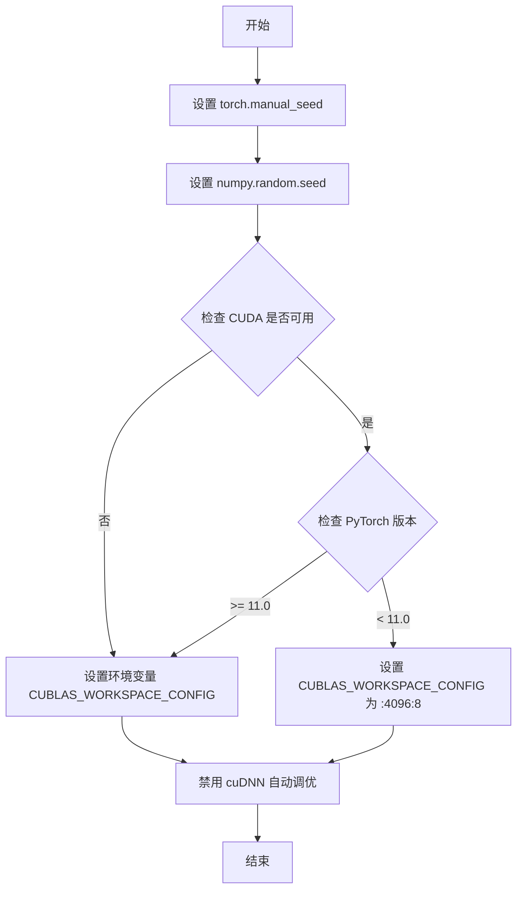

#### 带注释源码

```python
# testing_utils.py 中的实现（推断）

import os
import random
import numpy as np
import torch


def enable_full_determinism(seed: int = 42, extra_seed: bool = True):
    """
    启用完全确定性运行模式，确保结果可复现
    
    参数：
        seed: 随机种子，默认值为 42
        extra_seed: 是否额外设置 CUDA 环境的种子
    """
    
    # 1. 设置 PyTorch 的随机种子，确保 CPU 和 GPU 操作可复现
    torch.manual_seed(seed)
    
    # 2. 设置 NumPy 的随机种子，确保 NumPy 相关操作可复现
    np.random.seed(seed)
    
    # 3. 设置 Python 内置 random 模块的种子
    random.seed(seed)
    
    # 4. 针对 CUDA 环境配置确定性计算
    if torch.cuda.is_available():
        # 强制使用确定性算法
        torch.backends.cudnn.deterministic = True
        # 禁用 cuDNN 自动调优，确保每次选择相同算法
        torch.backends.cudnn.benchmark = False
        
        # 根据 PyTorch 版本设置 CUBLAS 工作区配置
        if torch.version.cuda is not None:
            cuda_version = torch.version.cuda.split('.')
            if int(cuda_version[0]) >= 11:
                # CUDA 11+ 推荐配置
                os.environ['CUBLAS_WORKSPACE_CONFIG'] = ':4096:8'
            else:
                # 旧版 CUDA 配置
                os.environ['CUBLAS_WORKSPACE_CONFIG'] = ':16:8'
        
        # 5. 设置 CUDA 设备种子
        if extra_seed:
            torch.cuda.manual_seed_all(seed)
    
    # 6. 设置 PyTorch DDP（分布式数据并行）通信的确定性
    # 注意：某些操作如 gather 和 scatter 目前无法完全确定
    torch.use_deterministic_algorithms(True, warn_only=True)
```

**注意**：由于源代码中仅展示了函数的使用和导入语句，未包含完整定义，以上源码为基于函数调用上下文和常见实现模式的推断。


### `floats_tensor`

生成指定形状的随机浮点张量，主要用于测试场景中生成模拟输入数据。

参数：

-  `shape`：`Tuple[int, ...]`，张量的形状元组，例如 `(batch_size, num_channels, num_frames, height, width)`

返回值：`torch.Tensor`，返回一个指定形状的 PyTorch 浮点张量，数据通常为随机值或特定分布的数值

#### 流程图

```mermaid
flowchart TD
    A[接收形状元组 shape] --> B{检查是否需要确定性}
    B -->|是| C[设置固定随机种子]
    B -->|否| D[使用当前随机状态]
    C --> E[调用 torch.randn 或类似方法生成张量]
    D --> E
    E --> F[返回浮点类型张量]
    F --> G[调用方使用 .to 方法转移到目标设备]
```

#### 带注释源码

```python
# floats_tensor 函数源码（位于 testing_utils 模块中）

def floats_tensor(
    shape: Tuple[int, ...],
    rng: Optional[torch.Generator] = None,
    seed: Optional[int] = None,
    name: Optional[str] = None,
    dtype: torch.dtype = torch.float32,
) -> torch.Tensor:
    """
    生成指定形状的随机浮点张量，用于测试目的。
    
    参数:
        shape: 张量的形状元组，定义了每个维度的大小
        rng: 可选的 PyTorch 随机数生成器，用于确定性采样
        seed: 可选的随机种子，用于复现结果
        name: 张量的名称标识，主要用于调试
        dtype: 返回张量的数据类型，默认为 torch.float32
    
    返回:
        随机浮点张量，形状为指定的 shape，数据类型为 dtype
    
    示例:
        # 生成 4D 张量 (batch, channels, height, width)
        noise = floats_tensor((4, 3, 32, 32))
        
        # 生成带随机种子的张量以确保可复现性
        noise = floats_tensor((2, 4, 16, 16), seed=42)
    """
    # 如果提供了种子，使用它来确保可复现性
    if seed is not None:
        torch.manual_seed(seed)
    
    # 生成随机浮点张量
    # 使用 torch.randn 生成标准正态分布的张量
    tensor = torch.randn(shape, generator=rng, dtype=dtype)
    
    return tensor
```

#### 实际使用示例

```python
# 在 UNetMotionModelTests 类中的实际使用方式
@property
def dummy_input(self):
    batch_size = 4
    num_channels = 4
    num_frames = 4
    sizes = (16, 16)

    # 生成 6 维张量: (batch_size, num_channels, num_frames, height, width)
    noise = floats_tensor((batch_size, num_channels, num_frames) + sizes).to(torch_device)
    
    # 时间步张量
    time_step = torch.tensor([10]).to(torch_device)
    
    # 编码器隐藏状态张量
    encoder_hidden_states = floats_tensor((batch_size * num_frames, 4, 16)).to(torch_device)

    return {"sample": noise, "timestep": time_step, "encoder_hidden_states": encoder_hidden_states}
```

---

#### 补充说明

| 项目 | 描述 |
|------|------|
| **模块位置** | `diffusers.testing_utils.floats_tensor` |
| **依赖库** | `torch` |
| **调用场景** | 单元测试中生成模拟输入数据 |
| **典型用途** | 创建噪声张量、隐藏状态张量等测试数据 |
| **注意事项** | 该函数本身不在提供代码文件中定义，而是从 `testing_utils` 模块导入的辅助函数 |


### `torch_device`

获取当前可用的 PyTorch 设备（优先返回 CUDA 设备，否则返回 CPU）。该函数是测试工具模块提供的全局设备标识符，用于将张量和模型移动到计算设备上。

参数： 无

返回值： `str`，返回设备字符串，如 `"cuda"` 或 `"cpu"`

#### 流程图

```mermaid
flowchart TD
    A[开始] --> B{检查 CUDA 是否可用}
    B -->|是| C[返回 'cuda']
    B -->|否| D[返回 'cpu']
    C --> E[结束]
    D --> E
```

#### 带注释源码

```
# torch_device 是从 testing_utils 模块导入的全局变量/函数
# 其实现通常如下（基于使用方式推断）:

def get_torch_device() -> str:
    """
    获取当前可用的 PyTorch 设备。
    
    优先级：
    1. 如果 CUDA 可用，返回 'cuda'
    2. 否则返回 'cpu'
    
    Returns:
        str: 设备字符串 'cuda' 或 'cpu'
    """
    import torch
    return 'cuda' if torch.cuda.is_available() else 'cpu'

# 在测试代码中的典型使用方式：
# noise = floats_tensor((batch_size, num_channels, num_frames) + sizes).to(torch_device)
# time_step = torch.tensor([10]).to(torch_device)
# model.to(torch_device)
```


### `UNetMotionModelTests.dummy_input`

该属性方法用于生成虚拟输入数据，为 UNetMotionModel 的测试提供必要的输入参数。它创建一个包含噪声样本、时间步和编码器隐藏状态的字典，模拟真实的模型推理输入。

参数：该方法为属性方法，无参数。

返回值：`Dict[str, torch.Tensor]`，返回一个字典，包含以下键值对：
- `"sample"`：`torch.Tensor`，形状为 `(batch_size, num_channels, num_frames, height, width)` 的噪声张量
- `"timestep"`：`torch.Tensor`，形状为 `(1,)` 的时间步张量
- `"encoder_hidden_states"`：`torch.Tensor`，形状为 `(batch_size * num_frames, cross_attention_dim, seq_len)` 的编码器隐藏状态张量

#### 流程图

```mermaid
flowchart TD
    A[开始 dummy_input 属性方法] --> B[设置批量大小: batch_size=4]
    B --> C[设置通道数: num_channels=4]
    C --> D[设置帧数: num_frames=4]
    D --> E[设置空间尺寸: sizes=(16, 16)]
    E --> F[使用 floats_tensor 生成噪声张量]
    F --> G[创建时间步张量: torch.tensor10]
    G --> H[生成编码器隐藏状态张量]
    H --> I[组装返回字典]
    I --> J[返回 {'sample': noise, 'timestep': time_step, 'encoder_hidden_states': encoder_hidden_states}]
```

#### 带注释源码

```python
@property
def dummy_input(self):
    """
    生成虚拟输入数据，用于 UNetMotionModel 的测试。
    
    该属性方法创建一个包含模型推理所需所有输入的字典，
    包括噪声样本、时间步和编码器隐藏状态。
    """
    # 定义批量大小
    batch_size = 4
    # 定义输入通道数
    num_channels = 4
    # 定义时间帧数（对于视频/运动模型很重要）
    num_frames = 4
    # 定义空间分辨率（高度和宽度）
    sizes = (16, 16)

    # 使用测试工具函数生成随机浮点张量作为噪声输入
    # 形状: (batch_size, num_channels, num_frames, height, width)
    # 即 (4, 4, 4, 16, 16)
    noise = floats_tensor((batch_size, num_channels, num_frames) + sizes).to(torch_device)
    
    # 创建时间步张量，值为 10
    # 用于告诉模型当前处于去噪过程的哪个阶段
    time_step = torch.tensor([10]).to(torch_device)
    
    # 生成编码器隐藏状态
    # 形状: (batch_size * num_frames, cross_attention_dim, seq_len)
    # 即 (16, 4, 16) - 注意这里的 4 是 cross_attention_dim
    encoder_hidden_states = floats_tensor((batch_size * num_frames, 4, 16)).to(torch_device)

    # 返回包含所有必要输入的字典
    # sample: 主输入噪声/图像
    # timestep: 时间步信息
    # encoder_hidden_states: 文本编码器的输出，用于 cross-attention
    return {"sample": noise, "timestep": time_step, "encoder_hidden_states": encoder_hidden_states}
```


### `UNetMotionModelTests.input_shape`

该属性方法用于返回 UNetMotionModel 的输入张量形状信息，为测试用例提供预期的输入维度参考。

参数： 无（该方法为属性方法，无显式参数，`self` 为隐式参数）

返回值： `tuple`，返回表示输入形状的四元组 (batch_size, num_channels, height, width)，具体值为 (4, 4, 16, 16)

#### 流程图

```mermaid
flowchart TD
    A[开始访问 input_shape 属性] --> B{检查缓存/计算}
    B -->|首次访问| C[返回元组 (4, 4, 16, 16)]
    B -->|已缓存| D[直接返回缓存值]
    C --> E[结束]
    D --> E
```

#### 带注释源码

```python
@property
def input_shape(self):
    """
    返回 UNetMotionModel 测试用例的输入张量形状。
    
    该属性方法定义了测试中使用的标准输入维度：
    - batch_size: 4 (一次处理的样本数量)
    - num_channels: 4 (输入通道数)
    - height: 16 (输入高度)
    - width: 16 (输入宽度)
    
    Returns:
        tuple: 输入形状元组 (batch_size, num_channels, height, width)
    """
    return (4, 4, 16, 16)
```


### `UNetMotionModelTests.output_shape`

该属性方法用于返回UNetMotionModel模型的输出张量形状，以元组形式表示(batch_size, num_channels, height, width)，用于测试框架中验证模型输入输出维度一致性。

参数：

- `self`：`UNetMotionModelTests`，隐式参数，指向测试类实例本身

返回值：`tuple`，返回模型输出形状元组 (4, 4, 16, 16)，分别代表批次大小为4、通道数为4、高度和宽度均为16

#### 流程图

```mermaid
flowchart TD
    A[开始访问output_shape属性] --> B{执行属性方法}
    B --> C[返回元组 (4, 4, 16, 16)]
    C --> D[结束]
    
    style B fill:#f9f,stroke:#333,stroke-width:2px
    style C fill:#9f9,stroke:#333,stroke-width:2px
```

#### 带注释源码

```python
@property
def output_shape(self):
    """
    返回UNetMotionModel的输出形状元组。
    
    该属性用于测试框架中定义模型预期输出的维度，
    以便在各种测试用例中验证模型输出的形状是否符合预期。
    
    Returns:
        tuple: 包含四个整数的元组，依次表示:
            - batch_size (4): 批次大小
            - num_channels (4): 通道数量  
            - height (16): 输出高度
            - width (16): 输出宽度
    """
    return (4, 4, 16, 16)
```


### `UNetMotionModelTests.prepare_init_args_and_inputs_for_common`

该方法为 `UNetMotionModelTests` 测试类提供模型初始化参数和测试输入数据，用于统一测试场景下的模型实例化与前向传播验证。它构建了一个包含运动模块（Motion Module）的 UNet 模型的配置字典，并返回对应的虚拟输入数据。

参数：

- `self`：`UNetMotionModelTests`，隐式参数，表示测试类的实例本身，无需显式传递

返回值：

- `init_dict`：`Dict[str, Any]`，包含用于初始化 `UNetMotionModel` 的配置参数字典，包括块通道数、归一化组数、上下块类型、交叉注意力维度、注意力头数、输入输出通道数、每层块数以及样本尺寸等关键参数
- `inputs_dict`：`Dict[str, torch.Tensor]`，包含模型前向传播所需的输入数据，涵盖噪声样本（sample）、时间步（timestep）和编码器隐藏状态（encoder_hidden_states）

#### 流程图

```mermaid
flowchart TD
    A[开始] --> B[构建 init_dict 配置字典]
    B --> C[设置 block_out_channels: (16, 32)]
    B --> D[设置 norm_num_groups: 16]
    B --> E[设置 down_block_types 和 up_block_types]
    B --> F[设置 cross_attention_dim: 16]
    B --> G[设置 num_attention_heads: 2]
    B --> H[设置 out_channels: 4, in_channels: 4]
    B --> I[设置 layers_per_block: 1, sample_size: 16]
    C --> J[获取 self.dummy_input 作为 inputs_dict]
    D --> J
    E --> J
    F --> J
    G --> J
    H --> J
    I --> J
    J --> K[返回 init_dict 和 inputs_dict 元组]
    K --> L[结束]
```

#### 带注释源码

```python
def prepare_init_args_and_inputs_for_common(self):
    """
    准备 UNetMotionModel 初始化参数和测试输入数据。
    此方法为测试类提供统一的模型配置和虚拟输入，用于各类单元测试场景。
    
    Returns:
        Tuple[Dict[str, Any], Dict[str, torch.Tensor]]: 
            - init_dict: 模型初始化参数字典
            - inputs_dict: 模型前向传播所需输入字典
    """
    # 构建模型初始化参数字典，配置运动模块相关的 UNet 结构
    init_dict = {
        "block_out_channels": (16, 32),        # 输出通道数序列，定义每个阶段的通道数
        "norm_num_groups": 16,                  # 归一化组数，用于 GroupNorm 层
        "down_block_types": (                   # 下采样块类型，包含交叉注意力运动块
            "CrossAttnDownBlockMotion", 
            "DownBlockMotion"
        ),
        "up_block_types": (                     # 上采样块类型，包含交叉注意力运动块
            "UpBlockMotion", 
            "CrossAttnUpBlockMotion"
        ),
        "cross_attention_dim": 16,              # 交叉注意力维度
        "num_attention_heads": 2,               # 注意力头数量
        "out_channels": 4,                      # 输出通道数
        "in_channels": 4,                       # 输入通道数
        "layers_per_block": 1,                  # 每个块中的层数
        "sample_size": 16,                      # 输入样本的空间尺寸
    }
    
    # 获取测试用虚拟输入数据，调用类属性 dummy_input
    # 该属性定义了批大小为4、通道数为4、帧数为4、空间尺寸为16x16的噪声张量
    inputs_dict = self.dummy_input
    
    # 返回初始化参数和输入字典的元组，供测试方法使用
    return init_dict, inputs_dict
```


### `UNetMotionModelTests.test_from_unet2d`

该测试方法验证了 `UNetMotionModel` 能否正确从 `UNet2DConditionModel` 加载参数，通过创建 UNet2D 模型实例，然后使用 `from_unet2d` 类方法加载模型，最后遍历所有参数并逐一比较，确保加载后的模型参数与原始 UNet2D 的参数完全一致。

参数：

- `self`：`UNetMotionModelTests`，测试类实例本身，无需显式传递

返回值：`None`，该方法为测试方法，通过 `assertTrue` 断言验证参数一致性，不返回任何值

#### 流程图

```mermaid
flowchart TD
    A[开始测试] --> B[设置随机种子为0]
    B --> C[创建UNet2DConditionModel实例unet2d]
    C --> D[设置随机种子为1]
    D --> E[调用model_class.from_unet2d加载模型]
    E --> F[获取模型的状态字典model_state_dict]
    F --> G[遍历unet2d的所有参数]
    G --> H{还有未遍历的参数?}
    H -->|是| I[获取当前参数名param_name和参数值param_value]
    I --> J{比较model_state_dict中的参数与param_value是否相等}
    J -->|相等| K[断言通过,继续下一个参数]
    J -->|不相等| L[测试失败]
    K --> H
    H -->|否| M[所有参数验证通过]
    M --> N[测试结束]
    L --> N
```

#### 带注释源码

```python
def test_from_unet2d(self):
    """
    测试从UNet2DConditionModel加载模型参数的功能
    
    该测试验证UNetMotionModel的from_unet2d类方法能否正确
    将UNet2DConditionModel的所有参数加载到UNetMotionModel中
    """
    # 设置随机种子，确保UNet2D模型初始化可重现
    torch.manual_seed(0)
    # 创建标准的UNet2DConditionModel实例
    unet2d = UNet2DConditionModel()

    # 设置不同的随机种子，确保模型初始化与unet2d不同
    torch.manual_seed(1)
    # 从unet2d加载创建UNetMotionModel实例
    model = self.model_class.from_unet2d(unet2d)
    # 获取加载后模型的状态字典
    model_state_dict = model.state_dict()

    # 遍历unet2d的所有参数，验证加载后的参数是否一致
    for param_name, param_value in unet2d.named_parameters():
        # 断言：model_state_dict中的参数必须与unet2d的参数完全相等
        self.assertTrue(torch.equal(model_state_dict[param_name], param_value))
```


### `UNetMotionModelTests.test_freeze_unet2d`

该测试方法用于验证 `UNetMotionModel` 的 `freeze_unet2d_params()` 方法是否正确冻结 UNet2D 的参数，同时保留 motion_modules 参数的可训练性。测试通过检查模型参数的 `requires_grad` 属性来确认冻结逻辑的正确性。

参数：

- `self`：隐式参数，`UNetMotionModelTests` 类的实例，表示测试类本身

返回值：`None`，无返回值（测试方法，通过 unittest 框架执行）

#### 流程图

```mermaid
flowchart TD
    A[开始测试] --> B[调用 prepare_init_args_and_inputs_for_common 获取初始化参数和输入]
    B --> C[使用 init_dict 初始化 UNetMotionModel 模型实例]
    C --> D[调用 model.freeze_unet2d_params 冻结 UNet2D 参数]
    D --> E[遍历模型所有参数]
    E --> F{判断参数名是否包含 'motion_modules'}
    F -->|是| G[断言 requires_grad 为 True]
    F -->|否| H[断言 requires_grad 为 False]
    G --> I[测试通过]
    H --> I
    I[结束测试]
```

#### 带注释源码

```python
def test_freeze_unet2d(self):
    """
    测试冻结 UNet2D 参数的功能。
    
    验证调用 freeze_unet2d_params() 后：
    1. 非 motion_modules 的参数被冻结（requires_grad=False）
    2. motion_modules 的参数保持可训练（requires_grad=True）
    """
    # 获取初始化参数和输入数据
    # init_dict: 包含模型配置的字典（block_out_channels, norm_num_groups 等）
    # inputs_dict: 包含测试输入的字典（sample, timestep, encoder_hidden_states）
    init_dict, inputs_dict = self.prepare_init_args_and_inputs_for_common()
    
    # 使用配置字典实例化 UNetMotionModel
    # model_class 为 UNetMotionModel
    model = self.model_class(**init_dict)
    
    # 调用冻结方法，冻结 UNet2D 相关的参数
    # 该方法应该只保留 motion_modules 参数可训练
    model.freeze_unet2d_params()
    
    # 遍历模型中的所有参数
    for param_name, param_value in model.named_parameters():
        if "motion_modules" not in param_name:
            # 如果参数名不包含 'motion_modules'，则应该被冻结
            # 验证 requires_grad 为 False
            self.assertFalse(param_value.requires_grad)
        else:
            # 如果参数名包含 'motion_modules'，则应该保持可训练
            # 验证 requires_grad 为 True
            self.assertTrue(param_value.requires_grad)
```


### `UNetMotionModelTests.test_loading_motion_adapter`

该测试方法验证将 MotionAdapter（运动适配器）加载到 UNetMotionModel（UNet运动模型）后，模型的 down_blocks、up_blocks 和 mid_block 中的 motion_modules（运动模块）参数是否与适配器中的参数完全匹配，确保运动模块被正确加载。

参数：

- `self`：unittest.TestCase，测试类实例本身

返回值：无（`None`），该方法为测试用例，通过断言验证功能，不返回具体值

#### 流程图

```mermaid
flowchart TD
    A[开始测试] --> B[创建UNetMotionModel实例]
    B --> C[创建MotionAdapter实例]
    C --> D[调用model.load_motion_modules加载适配器]
    D --> E{遍历down_blocks}
    E -->|第idx个down_block| F[获取adapter.down_blocks[idx].motion_modules状态字典]
    F --> G[遍历down_block.motion_modules参数]
    G --> H{断言参数值相等}
    H -->|不相等| I[抛出断言错误]
    H -->|相等| J{还有更多down_block?}
    J -->|是| E
    J -->|否| K{遍历up_blocks}
    K -->|第idx个up_block| L[获取adapter.up_blocks[idx].motion_modules状态字典]
    L --> M[遍历up_block.motion_modules参数]
    M --> N{断言参数值相等}
    N -->|不相等| I
    N -->|相等| O{还有更多up_block?}
    O -->|是| K
    O -->|否| P[获取adapter.mid_block.motion_modules状态字典]
    P --> Q[遍历model.mid_block.motion_modules参数]
    Q --> R{断言参数值相等}
    R -->|不相等| I
    R -->|相等| S[测试通过]
    I --> S
```

#### 带注释源码

```python
def test_loading_motion_adapter(self):
    """测试加载运动适配器功能，验证MotionAdapter参数正确加载到UNetMotionModel"""
    
    # 步骤1: 创建一个UNetMotionModel实例（使用默认参数）
    model = self.model_class()
    
    # 步骤2: 创建一个MotionAdapter实例（运动适配器）
    adapter = MotionAdapter()
    
    # 步骤3: 将适配器的运动模块加载到模型中
    model.load_motion_modules(adapter)

    # 步骤4: 验证down_blocks中的运动模块参数
    # 遍历模型的所有down（下采样）块
    for idx, down_block in enumerate(model.down_blocks):
        # 获取适配器对应down_block的运动模块状态字典
        adapter_state_dict = adapter.down_blocks[idx].motion_modules.state_dict()
        
        # 遍历down_block中运动模块的每个参数
        for param_name, param_value in down_block.motion_modules.named_parameters():
            # 断言：模型的参数值必须与适配器中的参数值完全相等
            self.assertTrue(
                torch.equal(adapter_state_dict[param_name], param_value),
                f"Down block {idx} parameter {param_name} mismatch"
            )

    # 步骤5: 验证up_blocks中的运动模块参数
    # 遍历模型的所有up（上采样）块
    for idx, up_block in enumerate(model.up_blocks):
        # 获取适配器对应up_block的运动模块状态字典
        adapter_state_dict = adapter.up_blocks[idx].motion_modules.state_dict()
        
        # 遍历up_block中运动模块的每个参数
        for param_name, param_value in up_block.motion_modules.named_parameters():
            # 断言：模型的参数值必须与适配器中的参数值完全相等
            self.assertTrue(
                torch.equal(adapter_state_dict[param_name], param_value),
                f"Up block {idx} parameter {param_name} mismatch"
            )

    # 步骤6: 验证mid_block中的运动模块参数
    # 获取适配器的中间块运动模块状态字典
    mid_block_adapter_state_dict = adapter.mid_block.motion_modules.state_dict()
    
    # 遍历模型中间块中运动模块的每个参数
    for param_name, param_value in model.mid_block.motion_modules.named_parameters():
        # 断言：模型的参数值必须与适配器中的参数值完全相等
        self.assertTrue(
            torch.equal(mid_block_adapter_state_dict[param_name], param_value),
            f"Mid block parameter {param_name} mismatch"
        )
```


### `UNetMotionModelTests.test_saving_motion_modules`

该测试方法验证 UNetMotionModel 的运动模块（motion modules）的保存和加载功能是否正确，确保保存的模型可以正确恢复并且前向传播结果一致。

参数：

- `self`：`UNetMotionModelTests`（隐式参数），测试类的实例本身，包含模型初始化和测试所需的配置与工具方法

返回值：`None`，该方法为单元测试方法，通过断言验证功能正确性，无显式返回值

#### 流程图

```mermaid
flowchart TD
    A[开始测试] --> B[设置随机种子 torch.manual_seed0]
    B --> C[准备初始化参数和输入 init_dict, inputs_dict]
    C --> D[创建UNetMotionModel实例并移动到设备]
    D --> E[创建临时目录]
    E --> F[调用model.save_motion_modules保存运动模块]
    F --> G[验证文件diffusion_pytorch_model.safetensors已创建]
    G --> H[从保存路径加载为MotionAdapter]
    H --> I[创建新模型实例并加载运动模块]
    I --> J[移动新模型到设备]
    J --> K[关闭梯度计算]
    K --> L[执行原始模型前向传播]
    K --> M[执行加载模型前向传播]
    L --> N[计算输出差异]
    M --> N
    N --> O[验证差异 <= 1e-4]
    O --> P[测试通过]
```

#### 带注释源码

```python
def test_saving_motion_modules(self):
    """
    测试保存和加载运动模块的功能
    验证保存的模型可以正确恢复，并且前向传播结果一致
    """
    # 设置随机种子确保测试可重复性
    torch.manual_seed(0)
    
    # 准备模型初始化参数和测试输入
    # init_dict: 包含block_out_channels, norm_num_groups, down_block_types等模型配置
    # inputs_dict: 包含sample, timestep, encoder_hidden_states等测试输入
    init_dict, inputs_dict = self.prepare_init_args_and_inputs_for_common()
    
    # 使用初始化参数创建UNetMotionModel实例
    model = self.model_class(**init_dict)
    
    # 将模型移动到指定设备（torch_device，如CUDA）
    model.to(torch_device)

    # 创建临时目录用于保存模型
    with tempfile.TemporaryDirectory() as tmpdirname:
        # 调用模型的save_motion_modules方法保存运动模块
        model.save_motion_modules(tmpdirname)
        
        # 验证运动模块文件已成功创建
        # 检查diffusion_pytorch_model.safetensors文件是否存在
        self.assertTrue(os.path.isfile(os.path.join(tmpdirname, "diffusion_pytorch_model.safetensors")))

        # 从保存的目录加载为MotionAdapter对象
        adapter_loaded = MotionAdapter.from_pretrained(tmpdirname)

        # 重新设置随机种子确保模型初始化一致
        torch.manual_seed(0)
        
        # 创建新的UNetMotionModel实例用于加载验证
        model_loaded = self.model_class(**init_dict)
        
        # 将加载的运动模块加载到新模型中
        model_loaded.load_motion_modules(adapter_loaded)
        
        # 移动加载的模型到指定设备
        model_loaded.to(torch_device)

    # 关闭梯度计算以提高性能并确保一致性
    with torch.no_grad():
        # 执行原始模型的前向传播，获取输出
        output = model(**inputs_dict)[0]
        
        # 执行加载模型的前向传播，获取输出
        output_loaded = model_loaded(**inputs_dict)[0]

    # 计算两个模型输出的最大绝对差异
    max_diff = (output - output_loaded).abs().max().item()
    
    # 验证差异在可接受范围内（<=1e-4）
    # 如果差异过大，说明保存/加载过程存在问题
    self.assertLessEqual(max_diff, 1e-4, "Models give different forward passes")
```


### `UNetMotionModelTests.test_xformers_enable_works`

该测试方法用于验证在启用 XFormers 内存高效注意力机制后，UNetMotionModel 的中间块注意力处理器是否正确切换为 XFormersAttnProcessor。

参数：

- `self`：`UNetMotionModelTests`，测试类实例本身，无需显式传递

返回值：`None`，测试方法无返回值，通过断言验证功能正确性

#### 流程图

```mermaid
flowchart TD
    A[开始测试 test_xformers_enable_works] --> B{检查运行环境}
    B -->|条件跳过| C[跳过测试: 需要CUDA和xformers]
    B -->|条件通过| D[调用 prepare_init_args_and_inputs_for_common]
    D --> E[获取 init_dict 和 inputs_dict]
    E --> F[创建 UNetMotionModel 实例: model = self.model_class]
    F --> G[调用 model.enable_xformers_memory_efficient_attention]
    G --> H[访问 model.mid_block.attentions[0].transformer_blocks[0].attn1.processor]
    H --> I{处理器类型是否为 XFormersAttnProcessor?}
    I -->|是| J[测试通过]
    I -->|否| K[断言失败: xformers is not enabled]
```

#### 带注释源码

```python
@unittest.skipIf(
    torch_device != "cuda" or not is_xformers_available(),
    reason="XFormers attention is only available with CUDA and `xformers` installed",
)
def test_xformers_enable_works(self):
    """
    测试 XFormers 内存高效注意力是否正确启用
    
    该测试验证当调用 enable_xformers_memory_efficient_attention() 后，
    模型中的注意力处理器是否被正确替换为 XFormersAttnProcessor
    """
    # 准备模型初始化参数和测试输入
    # init_dict: 包含 block_out_channels, norm_num_groups, down_block_types 等模型配置
    # inputs_dict: 包含 sample, timestep, encoder_hidden_states 等测试输入
    init_dict, inputs_dict = self.prepare_init_args_and_inputs_for_common()
    
    # 使用测试类的模型类创建模型实例
    # model_class 指向 UNetMotionModel
    model = self.model_class(**init_dict)
    
    # 调用模型的 enable_xformers_memory_efficient_attention 方法
    # 该方法会遍历模型中的所有注意力模块并将处理器替换为 XFormersAttnProcessor
    model.enable_xformers_memory_efficient_attention()
    
    # 验证中间块的注意力处理器是否已正确切换
    # model.mid_block: UNetMotionModel 的中间块
    # .attentions[0]: 中间块的第一个注意力层
    # .transformer_blocks[0]: 第一个 Transformer 块
    # .attn1: 第一个注意力模块（通常是自注意力）
    # .processor: 获取当前使用的注意力处理器
    assert (
        model.mid_block.attentions[0].transformer_blocks[0].attn1.processor.__class__.__name__
        == "XFormersAttnProcessor"
    ), "xformers is not enabled"
```


### `UNetMotionModelTests.test_gradient_checkpointing_is_applied`

该测试方法用于验证梯度检查点（Gradient Checkpointing）功能是否被正确应用于UNetMotionModel的各个核心组件（包括上采样块、下采样块、中间块和Transformer2DModel等），通过调用父类的测试方法并传入预期的组件集合来确认梯度检查点策略是否在指定模块上生效。

参数：

- `self`：实例方法隐式参数，类型为`UNetMotionModelTests`（继承自unittest.TestCase），代表测试类自身实例
- `expected_set`：关键字参数，类型为`Set[str]`，包含期望应用梯度检查点的组件类名字符串集合，默认值为`{"CrossAttnUpBlockMotion", "CrossAttnDownBlockMotion", "UNetMidBlockCrossAttnMotion", "UpBlockMotion", "Transformer2DModel", "DownBlockMotion"}`

返回值：无返回值（`None`），该方法为单元测试方法，通过断言验证梯度检查点是否正确应用，不返回具体数据。

#### 流程图

```mermaid
flowchart TD
    A[开始 test_gradient_checkpointing_is_applied] --> B[定义 expected_set 集合]
    B --> C[包含6个期望的组件类名]
    C --> D[调用父类测试方法]
    D --> E[super.test_gradient_checkpointing_is_applied expected_set=expected_set]
    E --> F{父类方法执行验证}
    F -->|验证通过| G[测试通过]
    F -->|验证失败| H[测试失败抛出异常]
    G --> I[结束]
    H --> I
```

#### 带注释源码

```python
def test_gradient_checkpointing_is_applied(self):
    """
    测试梯度检查点是否被正确应用到UNetMotionModel的关键组件上。
    
    该测试方法验证以下组件是否启用了梯度检查点：
    - CrossAttnUpBlockMotion: 带交叉注意力机制的上采样运动块
    - CrossAttnDownBlockMotion: 带交叉注意力机制的下采样运动块
    - UNetMidBlockCrossAttnMotion: 带交叉注意力机制的中间块
    - UpBlockMotion: 上采样运动块
    - Transformer2DModel: 2D变换器模型
    - DownBlockMotion: 下采样运动块
    """
    # 定义期望应用梯度检查点的组件集合
    expected_set = {
        "CrossAttnUpBlockMotion",      # 交叉注意力上采样块
        "CrossAttnDownBlockMotion",    # 交叉注意力下采样块
        "UNetMidBlockCrossAttnMotion", # 中间交叉注意力块
        "UpBlockMotion",               # 上采样块
        "Transformer2DModel",          # 2D变换器模型
        "DownBlockMotion",             # 下采样块
    }
    # 调用父类的梯度检查点测试方法进行验证
    # 父类方法会遍历模型的各个组件，检查是否正确设置了梯度检查点
    super().test_gradient_checkpointing_is_applied(expected_set=expected_set)
```


### `UNetMotionModelTests.test_feed_forward_chunking`

该测试方法验证 UNetMotionModel 的前向分块（forward chunking）功能是否正常工作。测试会先执行一次标准前向传播，然后启用前向分块再次执行前向传播，最后比较两次输出的形状和数值差异，确保分块模式不会改变模型的计算结果。

参数：

- `self`：`UNetMotionModelTests`，测试类的实例，隐式参数

返回值：无返回值（`None`），该方法为单元测试方法，使用断言进行验证

#### 流程图

```mermaid
flowchart TD
    A[开始测试] --> B[准备初始化参数和输入]
    B --> C[修改block_out_channels为32, 64和norm_num_groups为32]
    C --> D[创建UNetMotionModel实例并移到设备]
    D --> E[设置模型为eval模式]
    E --> F[禁用梯度, 执行标准前向传播, 提取输出0]
    F --> G[启用forward_chunking分块模式]
    G --> H[禁用梯度, 执行分块前向传播, 提取输出2]
    H --> I{output.shape == output_2.shape?}
    I -->|是| J{abs(output - output_2).max < 1e-2?}
    I -->|否| K[断言失败: Shape不匹配]
    J -->|是| L[测试通过]
    J -->|否| M[断言失败: 数值差异过大]
    K --> N[结束]
    M --> N
    L --> N
```

#### 带注释源码

```python
def test_feed_forward_chunking(self):
    """
    测试UNetMotionModel的前向分块功能
    
    该测试验证启用forward_chunking后，模型的输出应该与
    标准前向传播的输出在形状和数值上保持一致
    """
    # 1. 获取基础初始化参数和输入字典
    init_dict, inputs_dict = self.prepare_init_args_and_inputs_for_common()
    
    # 2. 调整模型配置以适应分块测试
    # 设置不同的输出通道: (32, 64)
    init_dict["block_out_channels"] = (32, 64)
    # 设置归一化组数: 32
    init_dict["norm_num_groups"] = 32

    # 3. 创建模型实例并配置设备
    model = self.model_class(**init_dict)
    model.to(torch_device)
    model.eval()  # 设置为评估模式，禁用dropout等

    # 4. 执行标准前向传播（无分块）
    with torch.no_grad():  # 禁用梯度计算以提高性能
        output = model(**inputs_dict)[0]  # 获取第一个输出（通常是张量）

    # 5. 启用前向分块模式
    # 这会将前向计算分块处理，可以减少内存占用
    model.enable_forward_chunking()
    
    # 6. 执行分块前向传播
    with torch.no_grad():
        output_2 = model(**inputs_dict)[0]

    # 7. 验证输出形状一致性
    self.assertEqual(output.shape, output_2.shape, "Shape doesn't match")

    # 8. 验证输出数值一致性（允许1e-2的浮点误差）
    assert np.abs(output.cpu() - output_2.cpu()).max() < 1e-2
```


### `UNetMotionModelTests.test_pickle`

该测试方法用于验证 UNetMotionModel 的输出张量可以通过 Python 的 `copy.copy` 进行浅拷贝，并且拷贝后的张量与原张量保持数值一致（差异小于 1e-4），从而确保模型的确定性和数值稳定性。

参数：

- `self`：`UNetMotionModelTests`，测试类实例，隐式参数，代表当前测试用例对象

返回值：`None`，测试方法无返回值，通过 `assert` 断言验证结果

#### 流程图

```mermaid
flowchart TD
    A[开始测试 test_pickle] --> B[调用 prepare_init_args_and_inputs_for_common 获取初始化参数和输入]
    B --> C[使用 init_dict 初始化 UNetMotionModel 模型实例]
    C --> D[将模型移动到 torch_device]
    D --> E[使用 torch.no_grad 禁用梯度计算]
    E --> F[执行模型前向传播获取输出 sample]
    F --> G[使用 copy.copy 创建 sample 的浅拷贝 sample_copy]
    G --> H[计算 sample 与 sample_copy 的绝对差值]
    H --> I{差值最大值是否小于 1e-4?}
    I -->|是| J[测试通过]
    I -->|否| K[测试失败，抛出 AssertionError]
```

#### 带注释源码

```python
def test_pickle(self):
    """
    测试 UNetMotionModel 输出张量的可拷贝性。
    
    该测试方法验证模型输出可以通过 copy.copy 进行浅拷贝，
    并且拷贝后的张量与原张量数值一致，确保确定性的数值行为。
    """
    # 调用父类方法获取模型初始化参数字典和输入字典
    # init_dict: 包含模型架构配置，如 block_out_channels, norm_num_groups 等
    # inputs_dict: 包含测试输入，包含 sample, timestep, encoder_hidden_states
    init_dict, inputs_dict = self.prepare_init_args_and_inputs_for_common()
    
    # 使用初始化参数字典创建 UNetMotionModel 模型实例
    # model_class 在类属性中定义为 UNetMotionModel
    model = self.model_class(**init_dict)
    
    # 将模型移动到指定的计算设备（CPU 或 CUDA）
    model.to(torch_device)

    # 使用 torch.no_grad() 上下文管理器禁用梯度计算
    # 这可以减少内存消耗并加速推理
    with torch.no_grad():
        # 执行模型前向传播
        # inputs_dict 包含:
        #   - sample: 噪声张量，形状为 (batch_size, num_channels, num_frames, height, width)
        #   - timestep: 时间步张量
        #   - encoder_hidden_states: 编码器隐藏状态张量
        # 返回值包含 sample 属性，获取模型输出的样本张量
        sample = model(**inputs_dict).sample

    # 使用 Python 标准库的 copy 模块创建 sample 张量的浅拷贝
    # 浅拷贝会创建新的对象，但不会递归拷贝内部元素
    # 对于 PyTorch 张量，这会创建新的张量对象但共享底层数据
    sample_copy = copy.copy(sample)

    # 断言验证:
    # 1. sample 和 sample_copy 之间的绝对差值的最大值小于 1e-4
    # 2. 这确保了拷贝操作的数值一致性
    # 3. 注意: 此测试实际上测试的是 copy.copy 而非 pickle 序列化
    assert (sample - sample_copy).abs().max() < 1e-4
```


### `UNetMotionModelTests.test_from_save_pretrained`

该测试方法验证 UNetMotionModel 模型的保存和加载功能，确保模型在通过 save_pretrained 保存后再通过 from_pretrained 加载时，前向传播结果与原始模型一致（最大差异小于指定阈值），从而保证模型序列化/反序列化的正确性。

参数：

- `expected_max_diff`：`float`，期望的最大差异阈值，默认为 5e-5，用于判断加载后的模型输出与原始模型输出的差异是否在可接受范围内

返回值：`None`，该方法为测试用例，无返回值，通过断言验证模型一致性

#### 流程图

```mermaid
flowchart TD
    A[开始测试] --> B[准备初始化参数和输入]
    B --> C[设置随机种子为0]
    C --> D[创建UNetMotionModel模型实例]
    D --> E[将模型移动到torch_device]
    E --> F[设置模型为评估模式eval]
    F --> G[创建临时目录]
    G --> H[调用model.save_pretrained保存模型]
    H --> I[设置随机种子为0]
    I --> J[调用model_class.from_pretrained加载模型]
    J --> K[将新模型移动到torch_device]
    K --> L[禁用梯度计算]
    L --> M[原始模型前向传播]
    M --> N{输出是否为dict?}
    N -->|是| O[转换为tuple并取第一个元素]
    N -->|否| P[直接使用输出]
    O --> Q[加载模型前向传播]
    P --> Q
    Q --> R{输出是否为dict?}
    R -->|是| S[转换为tuple并取第一个元素]
    R -->|否| T[直接使用输出]
    S --> U[计算输出差异的最大值]
    T --> U
    U --> V{差异 <= expected_max_diff?}
    V -->|是| W[测试通过]
    V -->|否| X[抛出断言错误]
```

#### 带注释源码

```python
def test_from_save_pretrained(self, expected_max_diff=5e-5):
    """
    测试 UNetMotionModel 的保存和加载预训练模型功能。
    
    参数:
        expected_max_diff: float, 期望的最大差异阈值，默认为 5e-5
    """
    # 准备初始化参数和输入字典
    init_dict, inputs_dict = self.prepare_init_args_and_inputs_for_common()

    # 设置随机种子以确保可重复性
    torch.manual_seed(0)
    # 创建模型实例
    model = self.model_class(**init_dict)
    # 将模型移动到指定设备（如 CUDA）
    model.to(torch_device)
    # 设置为评估模式，禁用 Dropout 等训练特定操作
    model.eval()

    # 创建临时目录用于保存模型
    with tempfile.TemporaryDirectory() as tmpdirname:
        # 保存模型到临时目录，不使用安全序列化
        model.save_pretrained(tmpdirname, safe_serialization=False)
        
        # 重新设置随机种子以确保加载过程的一致性
        torch.manual_seed(0)
        # 从保存的目录加载模型
        new_model = self.model_class.from_pretrained(tmpdirname)
        # 将加载的模型移动到指定设备
        new_model.to(torch_device)

    # 禁用梯度计算以提高推理效率
    with torch.no_grad():
        # 原始模型的前向传播
        image = model(**inputs_dict)
        # 如果输出是字典，转换为元组并取第一个元素
        if isinstance(image, dict):
            image = image.to_tuple()[0]

        # 加载模型的前向传播
        new_image = new_model(**inputs_dict)
        # 如果输出是字典，转换为元组并取第一个元素
        if isinstance(new_image, dict):
            new_image = new_image.to_tuple()[0]

    # 计算两个模型输出之间的最大差异
    max_diff = (image - new_image).abs().max().item()
    # 断言最大差异在期望阈值内，确保模型保存/加载前后输出一致
    self.assertLessEqual(max_diff, expected_max_diff, "Models give different forward passes")
```


### `UNetMotionModelTests.test_from_save_pretrained_variant`

该测试方法用于验证 UNetMotionModel 的变体（variant）保存和加载功能，测试使用 `variant="fp16"` 参数保存模型后，能够正确加载该变体模型，同时确保加载非变体模型时会抛出预期的 OSError 异常，并且验证保存和加载后的模型前向传播输出差异在允许范围内。

参数：

- `expected_max_diff`：`float`，可选参数，默认值为 `5e-5`，表示模型保存和加载后输出之间的最大允许差异阈值

返回值：`None`，该方法为单元测试方法，通过 `self.assertLessEqual` 断言验证模型输出差异是否符合预期

#### 流程图

```mermaid
flowchart TD
    A[开始测试] --> B[准备初始化参数和输入数据]
    B --> C[设置随机种子为0]
    C --> D[创建UNetMotionModel实例并移动到设备]
    D --> E[设置模型为评估模式]
    E --> F[创建临时目录]
    F --> G[使用variant='fp16'保存模型]
    G --> H[设置随机种子为0]
    H --> I[从保存路径加载variant='fp16'模型]
    I --> J[尝试加载非variant模型并期望抛出OSError]
    J --> K{验证异常信息}
    K -->|包含指定错误信息| L[将加载的模型移动到设备]
    K -->|不包含| M[测试失败]
    L --> N[禁用梯度计算]
    N --> O[原始模型前向传播]
    O --> P{输出是否为字典}
    P -->|是| Q[转换为元组并提取第一个元素]
    P -->|否| R[直接使用输出]
    Q --> S[加载模型前向传播]
    R --> S
    S --> T{输出是否为字典}
    T -->|是| U[转换为元组并提取第一个元素]
    T -->|否| V[计算输出差异的最大绝对值]
    U --> V
    V --> W{差异是否小于等于阈值}
    W -->|是| X[测试通过]
    W -->|否| Y[测试失败]
```

#### 带注释源码

```python
def test_from_save_pretrained_variant(self, expected_max_diff=5e-5):
    """
    测试UNetMotionModel的变体保存和加载功能
    
    参数:
        expected_max_diff: float, 默认5e-5, 允许的最大模型输出差异
    """
    # 准备初始化参数和输入数据
    init_dict, inputs_dict = self.prepare_init_args_and_inputs_for_common()

    # 设置随机种子为0，确保模型初始化可复现
    torch.manual_seed(0)
    # 使用初始参数字典创建UNetMotionModel实例
    model = self.model_class(**init_dict)
    # 将模型移动到指定设备（torch_device）
    model.to(torch_device)
    # 设置模型为评估模式，禁用dropout等训练特定操作
    model.eval()

    # 使用临时目录进行保存和加载测试
    with tempfile.TemporaryDirectory() as tmpdirname:
        # 使用variant="fp16"保存模型，safe_serialization=False使用pickle格式
        model.save_pretrained(tmpdirname, variant="fp16", safe_serialization=False)

        # 重新设置随机种子为0，确保新模型初始化与原模型一致
        torch.manual_seed(0)
        # 从保存路径加载variant="fp16"的模型
        new_model = self.model_class.from_pretrained(tmpdirname, variant="fp16")
        
        # 尝试加载非variant模型，应该抛出OSError
        with self.assertRaises(OSError) as error_context:
            self.model_class.from_pretrained(tmpdirname)

        # 验证错误信息中包含指定的缺失文件信息
        assert "Error no file named diffusion_pytorch_model.bin found in directory" in str(error_context.exception)

        # 将加载的新模型移动到指定设备
        new_model.to(torch_device)

    # 禁用梯度计算以提高推理效率
    with torch.no_grad():
        # 原始模型的前向传播
        image = model(**inputs_dict)
        # 如果输出是字典，转换为元组并提取第一个元素
        if isinstance(image, dict):
            image = image.to_tuple()[0]

        # 加载模型的前向传播
        new_image = new_model(**inputs_dict)
        # 如果输出是字典，转换为元组并提取第一个元素
        if isinstance(new_image, dict):
            new_image = new_image.to_tuple()[0]

    # 计算两个模型输出之间的最大绝对差异
    max_diff = (image - new_image).abs().max().item()
    # 断言差异在允许范围内，否则报告模型前向传播不一致
    self.assertLessEqual(max_diff, expected_max_diff, "Models give different forward passes")
```


### `UNetMotionModelTests.test_forward_with_norm_groups`

该测试方法用于验证 UNetMotionModel 在带 norm_groups 配置下的前向传播是否正确工作，通过构建特定 norm_num_groups 和 block_out_channels 的模型，执行前向传播并验证输出形状与输入形状一致。

参数：

- `self`：测试类实例本身，包含测试所需的配置和方法

返回值：`无`（该方法为测试方法，使用 unittest 断言进行验证，不返回具体值）

#### 流程图

```mermaid
flowchart TD
    A[开始测试] --> B[调用 prepare_init_args_and_inputs_for_common 获取初始化参数和输入]
    B --> C[设置 norm_num_groups=16]
    C --> D[设置 block_out_channels=(16, 32)]
    D --> E[使用初始化参数创建 UNetMotionModel 实例]
    E --> F[将模型移至 torch_device]
    F --> G[设置模型为评估模式 model.eval]
    G --> H[使用 torch.no_grad 执行前向传播: model(**inputs_dict)]
    H --> I{检查输出是否为 dict}
    I -->|是| J[调用 to_tuple 获取第一个元素]
    I -->|否| K[直接使用输出]
    J --> L[断言 output 不为 None]
    K --> L
    L --> M[获取期望形状: inputs_dict['sample'].shape]
    M --> N[断言 output.shape == expected_shape]
    N --> O[测试通过]
```

#### 带注释源码

```python
def test_forward_with_norm_groups(self):
    """
    测试带 norm_groups 配置的 UNetMotionModel 前向传播
    验证模型在指定 norm_num_groups 参数下能正确执行前向传播并输出正确形状
    """
    # 步骤1: 获取通用的初始化参数和输入数据
    # init_dict 包含模型架构配置，inputs_dict 包含测试输入
    init_dict, inputs_dict = self.prepare_init_args_and_inputs_for_common()

    # 步骤2: 设置 norm_num_groups 为 16
    # norm_num_groups 控制 GroupNorm 中的组数，影响归一化行为
    init_dict["norm_num_groups"] = 16

    # 步骤3: 设置 block_out_channels 为 (16, 32)
    # 定义每个分辨率阶段的输出通道数
    init_dict["block_out_channels"] = (16, 32)

    # 步骤4: 使用配置好的参数创建 UNetMotionModel 实例
    model = self.model_class(**init_dict)

    # 步骤5: 将模型移至指定的计算设备（CPU/CUDA）
    model.to(torch_device)

    # 步骤6: 设置模型为评估模式
    # 评估模式下会禁用 dropout 并使用 BatchNorm/GroupNorm 的训练统计特性
    model.eval()

    # 步骤7: 执行前向传播并计算输出
    # 使用 torch.no_grad() 禁用梯度计算以节省内存
    with torch.no_grad():
        output = model(**inputs_dict)

        # 步骤8: 处理输出格式
        # 如果输出是字典格式，提取元组的第一个元素
        # UNetMotionModel 可能返回 dict 或 tuple
        if isinstance(output, dict):
            output = output.to_tuple()[0]

    # 步骤9: 验证输出不为 None
    self.assertIsNotNone(output)

    # 步骤10: 验证输出形状与输入形状一致
    # 获取输入样本的期望形状
    expected_shape = inputs_dict["sample"].shape
    
    # 断言输出形状与期望形状匹配
    self.assertEqual(output.shape, expected_shape, "Input and output shapes do not match")
```


### `UNetMotionModelTests.test_asymmetric_motion_model`

该测试方法用于验证 UNetMotionModel 在非对称配置下的功能正确性，通过设置非对称的层级数量、注意力头数量和时间变换器层数，测试模型能否正确处理非对称运动模块配置，并确保输出形状与输入形状匹配。

参数：

- `self`：隐式参数，`UNetMotionModelTests` 类实例

返回值：无直接返回值（`None`），通过 `unittest.TestCase` 断言验证模型行为

#### 流程图

```mermaid
flowchart TD
    A[开始测试] --> B[调用 prepare_init_args_and_inputs_for_common 获取基础配置]
    B --> C[设置非对称配置参数]
    C --> D[layers_per_block = (2, 3)]
    D --> E[transformer_layers_per_block = ((1, 2), (3, 4, 5))]
    E --> F[reverse_transformer_layers_per_block = ((7, 6, 7, 4), (4, 2, 2))]
    F --> G[temporal_transformer_layers_per_block = ((2, 5), (2, 3, 5))]
    G --> H[reverse_temporal_transformer_layers_per_block = ((5, 4, 3, 4), (3, 2, 2))]
    H --> I[num_attention_heads = (2, 4)]
    I --> J[motion_num_attention_heads = (4, 4)]
    J --> K[reverse_motion_num_attention_heads = (2, 2)]
    K --> L[use_motion_mid_block = True]
    L --> M[mid_block_layers = 2]
    M --> N[transformer_layers_per_mid_block = (1, 5)]
    N --> O[temporal_transformer_layers_per_mid_block = (2, 4)]
    O --> P[使用非对称配置初始化 UNetMotionModel]
    P --> Q[将模型移至 torch_device]
    Q --> R[设置模型为评估模式 eval()]
    R --> S[执行前向传播 model(inputs_dict)]
    S --> T{输出是否为字典?}
    T -->|是| U[提取元组中的第一个元素]
    T -->|否| V[直接使用输出]
    U --> W[断言输出不为 None]
    V --> W
    W --> X[验证输出形状与输入 sample 形状一致]
    X --> Y[测试通过]
```

#### 带注释源码

```python
def test_asymmetric_motion_model(self):
    """
    测试非对称运动模型的配置和前向传播
    验证模型在非对称层级配置下能够正确运行
    """
    # 获取基础初始化参数和测试输入
    # init_dict: 包含模型架构配置的字典
    # inputs_dict: 包含 sample, timestep, encoder_hidden_states 的字典
    init_dict, inputs_dict = self.prepare_init_args_and_inputs_for_common()

    # 设置非对称的层每块数量
    # 下采样块2层，上采样块3层
    init_dict["layers_per_block"] = (2, 3)
    
    # 设置非对称的变换器层配置
    # 第一个元组表示下采样块的层数，第二个表示上采样块
    init_dict["transformer_layers_per_block"] = ((1, 2), (3, 4, 5))
    
    # 设置反向变换器层配置（用于上行采样路径）
    init_dict["reverse_transformer_layers_per_block"] = ((7, 6, 7, 4), (4, 2, 2))

    # 设置时间变换器层配置
    init_dict["temporal_transformer_layers_per_block"] = ((2, 5), (2, 3, 5))
    
    # 设置反向时间变换器层配置
    init_dict["reverse_temporal_transformer_layers_per_block"] = ((5, 4, 3, 4), (3, 2, 2))

    # 设置不同阶段的注意力头数量
    init_dict["num_attention_heads"] = (2, 4)  # 标准注意力头
    init_dict["motion_num_attention_heads"] = (4, 4)  # 运动模块注意力头
    init_dict["reverse_motion_num_attention_heads"] = (2, 2)  # 反向运动模块注意力头

    # 启用运动中间块
    init_dict["use_motion_mid_block"] = True
    init_dict["mid_block_layers"] = 2  # 中间块的层数
    
    # 中间块的变换器层配置
    init_dict["transformer_layers_per_mid_block"] = (1, 5)
    init_dict["temporal_transformer_layers_per_mid_block"] = (2, 4)

    # 使用非对称配置创建模型实例
    model = self.model_class(**init_dict)
    
    # 将模型移至测试设备（CPU或GPU）
    model.to(torch_device)
    
    # 设置为评估模式，禁用dropout等训练特定操作
    model.eval()

    # 使用torch.no_grad()禁用梯度计算，减少内存占用
    with torch.no_grad():
        # 执行前向传播
        output = model(**inputs_dict)

        # 处理输出格式（可能是字典或元组）
        if isinstance(output, dict):
            output = output.to_tuple()[0]

    # 断言输出不为空
    self.assertIsNotNone(output)
    
    # 获取期望的输出形状（与输入sample形状相同）
    expected_shape = inputs_dict["sample"].shape
    
    # 验证输出形状与输入形状匹配
    self.assertEqual(output.shape, expected_shape, "Input and output shapes do not match")
```

## 关键组件


### UNetMotionModel

UNetMotionModel 是一个用于视频扩散模型的运动适配器 UNet 类，继承自 UNet2DConditionModel，支持加载运动模块（motion modules），可实现视频帧间的时序建模。

### MotionAdapter

MotionAdapter 是运动适配器类，用于存储和加载运动模块（motion_modules）的权重，支持模型的保存和预训练权重加载。

### from_unet2d 方法

该方法从 UNet2DConditionModel 创建 UNetMotionModel 实例，将原始 2D UNet 的参数复制到运动模型中，实现模型架构的转换。

### freeze_unet2d_params 方法

冻结 UNet2D 原始参数，仅保留 motion_modules 参数可训练，用于实现运动模块的独立微调。

### load_motion_modules 方法

从 MotionAdapter 加载运动模块权重到 UNetMotionModel 的 down_blocks、up_blocks 和 mid_block 中，实现运动能力的注入。

### save_motion_modules 方法

将运动模块保存为 safetensors 格式文件到指定目录，支持模型的持久化和迁移。

### enable_xformers_memory_efficient_attention

启用 xformers 内存高效注意力机制，通过 XFormersAttnProcessor 替代默认注意力处理器，降低显存占用。

### enable_forward_chunking

启用前向分块计算，将模型计算分解为多个小块处理，可降低峰值显存使用。

### CrossAttnDownBlockMotion / CrossAttnUpBlockMotion

带交叉注意力的运动下采样/上采样块，支持时序transformer层处理视频帧间信息。

### DownBlockMotion / UpBlockMotion

运动下采样/上采样基础块，负责特征的空间维度变化和运动信息处理。

### UNetMidBlockCrossAttnMotion

中间块，带交叉注意力机制，支持时序transformer处理全局运动特征。

### test_gradient_checkpointing_is_applied

验证梯度检查点技术在各运动模块块中的应用，确保反向传播时能正确绕过非必要计算图以节省显存。

### test_asymmetric_motion_model

测试非对称运动模型，支持为 down/up blocks 和 temporal_transformer 设置不同的层数、注意力头数和反向层配置。


## 问题及建议


### 已知问题

-   **硬编码的测试参数**：batch_size、num_channels、num_frames、sizes 等参数在 `dummy_input` 属性中硬编码，缺乏灵活性，无法方便地测试不同配置
-   **重复的代码模式**：`model.to(torch_device)`、`with torch.no_grad():`、输出格式转换 `if isinstance(output, dict): output = output.to_tuple()[0]` 等代码在多个测试方法中重复出现，增加维护成本
-   **Magic Numbers 分散**：阈值如 `1e-4`、`5e-5`、`1e-2` 在多个测试方法中硬编码，缺乏统一的常量定义
-   **测试隔离性问题**：使用 `torch.manual_seed()` 设置随机种子，但在并行测试或复杂场景下可能无法保证完全确定性
-   **xformers 测试跳过条件复杂**：`torch_device != "cuda" or not is_xformers_available()` 的判断逻辑嵌入在装饰器中，缺少对不支持原因的明确提示
-   **缺少资源清理验证**：临时目录使用 `tempfile.TemporaryDirectory()`，但未显式验证清理是否成功
-   **错误消息硬编码**：`"Error no file named diffusion_pytorch_model.bin found in directory"` 错误消息在测试中硬编码，与实际保存格式（safetensors）可能不一致
-   **测试方法参数不一致**：`test_from_save_pretrained` 和 `test_from_save_pretrained_variant` 方法有默认参数 `expected_max_diff=5e-5`，但未在类级别统一管理
-   **缺少异步/并行测试支持**：未发现对分布式训练或多 GPU 场景的测试覆盖

### 优化建议

-   **提取公共测试工具方法**：将重复的 `to_device`、`no_grad`、输出格式转换等逻辑封装为类方法或使用 mixin
-   **集中管理测试常量**：创建类级别的配置字典或常量类，统一管理 batch_size、阈值、路径等配置
-   **使用参数化测试**：通过 `@parameterized` 或类似框架实现多配置测试，减少重复测试方法
-   **增强测试文档**：为每个测试方法添加详细的 docstring，说明测试目的、前置条件和预期结果
-   **改进错误处理**：将特定错误消息提取为常量，并添加更友好的错误上下文信息
-   **添加性能基准测试**：考虑添加基准测试方法，监控模型推理时间和内存使用
-   **增强随机种子管理**：考虑使用更健壮的确定性设置机制，如 `torch.use_deterministic_algorithms()`
-   **分离关注点**：将 `UNetMotionModel` 的测试逻辑与 `ModelTesterMixin`、`UNetTesterMixin` 的公共逻辑进一步解耦


## 其它


### 设计目标与约束

本测试文件的核心目标是验证 `UNetMotionModel` 类的功能正确性、稳定性和兼容性。设计目标包括：确保模型能从 `UNet2DConditionModel` 正确转换；验证运动模块（motion modules）的加载、保存和冻结功能；测试梯度检查点、xformers 内存高效注意力机制等性能优化功能；确保模型前向传播的确定性行为和输出形状正确性；验证不同配置（如非对称模型）下的兼容性。主要约束包括：xformers 测试仅支持 CUDA 环境；测试依赖特定版本的 diffusers 库；需要确保数值精度在可接受范围内（通常为 1e-4 到 1e-5 级别）。

### 错误处理与异常设计

测试中使用了多种错误处理机制：使用 `unittest.skipIf` 条件跳过不支持环境的测试（如 xformers）；使用 `self.assertRaises` 捕获并验证异常信息，例如在测试模型变体加载时验证 `OSError` 异常；使用 `assert` 语句进行断言检查，如验证 xformers 处理器类型是否正确。测试还处理了模型输出的多种可能形式（字典或元组），通过 `isinstance` 检查和 `to_tuple()` 转换确保兼容性。对于数值比较，使用 `assertLessEqual` 进行边界检查，允许一定的浮点误差范围。

### 数据流与状态机

测试数据流遵循以下路径：首先通过 `dummy_input` 属性生成测试输入（包括噪声样本、时间步长和编码器隐藏状态），然后将输入传递给模型执行前向传播，最后验证输出形状和数值正确性。模型状态转换包括：初始化状态 → 冻结部分参数状态 → 加载运动模块状态 → 保存/加载状态 → 推理状态。关键状态转换通过 `freeze_unet2d_params()` 方法冻结 UNet2D 参数但保留运动模块可训练；通过 `load_motion_modules()` 和 `save_motion_modules()` 管理运动模块的状态持久化。

### 外部依赖与接口契约

本测试文件依赖以下外部组件：`diffusers` 库中的 `MotionAdapter`、`UNet2DConditionModel`、`UNetMotionModel` 类；`diffusers.utils` 中的 `logging` 和 `import_utils`；测试工具 `testing_utils` 模块中的 `enable_full_determinism`、`floats_tensor`、`torch_device`；以及基础 `unittest` 框架。接口契约包括：模型必须实现 `from_unet2d()` 类方法接受 UNet2DConditionModel 并返回等效的 MotionModel；必须实现 `freeze_unet2d_params()` 方法冻结非运动模块参数；必须实现 `load_motion_modules()` 和 `save_motion_modules()` 方法管理运动模块的持久化；模型输出可以是字典或元组形式，需要调用方进行适配。

### 性能考虑与基准测试

测试中包含多项性能相关的验证：使用 `torch.no_grad()` 上下文管理器禁用梯度计算以提高推理测试效率；通过 `enable_forward_chunking()` 测试前向分块功能，验证输出与完整前向传播的一致性；使用 `test_xformers_enable_works` 验证 xformers 内存高效注意力机制是否正确启用。性能基准主要关注数值一致性而非速度，通过 `max_diff` 比较确保不同加载方式或配置下的输出差异在可接受范围内（如 1e-4 或 5e-5）。

### 配置管理与参数说明

测试使用 `prepare_init_args_and_inputs_for_common()` 方法集中管理模型初始化参数，包括：`block_out_channels` 控制各阶段输出通道数；`norm_num_groups` 设置归一化组数；`down_block_types` 和 `up_block_types` 指定上下采样块类型；`cross_attention_dim` 和 `num_attention_heads` 配置注意力机制；`layers_per_block` 设置每块层数；`sample_size` 定义输入样本尺寸。特殊配置测试如 `test_asymmetric_motion_model` 使用了更复杂的参数组合，包括非对称的 `layers_per_block`、`transformer_layers_per_block`、`temporal_transformer_layers_per_block` 等，以验证模型对各种配置的处理能力。

### 测试覆盖范围与边界条件

测试覆盖了以下场景：基础功能测试（模型初始化、前向传播）；模型转换测试（`test_from_unet2d`）；参数冻结测试（`test_freeze_unet2d`）；模块加载与保存测试（`test_loading_motion_adapter`、`test_saving_motion_modules`）；性能优化功能测试（xformers、梯度检查点、前向分块）；确定性行为测试（pickle 序列化）；序列化兼容性测试（save_pretrained、变体加载）；非对称配置测试；归一化组参数测试。边界条件主要通过数值精度阈值（1e-4 到 5e-5）和形状匹配验证来覆盖。

### 安全考虑

测试中涉及的安全相关考量包括：使用 `safe_serialization=False` 测试不安全序列化路径；验证模型文件存在性检查（`os.path.isfile`）；临时目录管理使用 `tempfile.TemporaryDirectory()` 确保资源正确释放。在实际使用中，模型加载应优先使用安全序列化（默认），避免潜在的恶意序列化数据风险。

### 版本兼容性与迁移策略

测试文件反映了与多个组件的版本兼容性要求：`torch_device` 设备管理需要与 PyTorch 版本兼容；`is_xformers_available()` 检查 xformers 库可用性；模型保存/加载接口需要与不同版本的 diffusers 库兼容。迁移策略方面，`test_from_save_pretrained_variant` 测试验证了不同变体（fp16）的加载能力，确保模型可以在不同精度配置间迁移。测试使用条件跳过机制处理环境差异，允许在不同部署环境下渐进式迁移。

### 资源管理与内存优化

测试体现了以下资源管理实践：使用 `torch.no_grad()` 避免不必要的梯度存储；使用 `tempfile.TemporaryDirectory()` 自动管理临时文件资源；通过 `model.to(torch_device)` 明确管理设备分配；xformers 测试通过条件跳过避免在不支持环境下的资源浪费。模型层面，测试验证了 `enable_xformers_memory_efficient_attention()` 的功能，这是减少内存占用的重要优化手段。


    