# `diffusers\tests\models\unets\test_models_unet_spatiotemporal.py` 详细设计文档

该代码是针对 UNetSpatioTemporalConditionModel 的单元测试文件，用于测试时空条件UNet模型在视频生成任务中的正确性，包括模型初始化、输入输出形状、注意力机制配置、梯度检查点等功能验证。

## 整体流程

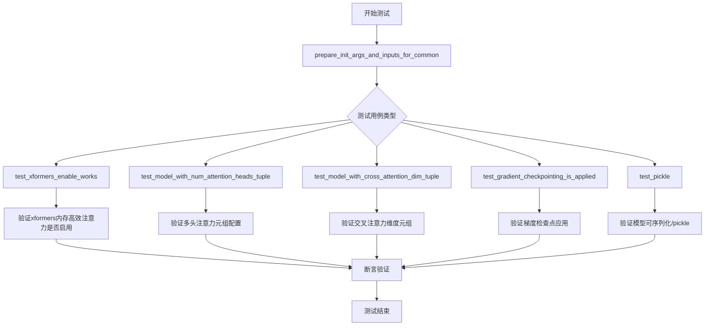

## 类结构

```
unittest.TestCase
└── UNetSpatioTemporalConditionModelTests (继承 ModelTesterMixin, UNetTesterMixin)
```

## 全局变量及字段


### `logger`
    
用于记录模块日志的日志记录器对象

类型：`logging.Logger`
    


### `enable_full_determinism`
    
启用完全确定性行为的配置函数，用于确保测试可复现性

类型：`Callable`
    


### `UNetSpatioTemporalConditionModelTests.model_class`
    
指定测试类所针对的模型类，即 UNetSpatioTemporalConditionModel

类型：`type`
    


### `UNetSpatioTemporalConditionModelTests.main_input_name`
    
模型主输入参数的名称，此处为 'sample'

类型：`str`
    
    

## 全局函数及方法


### `_get_add_time_ids`

该方法用于生成视频生成模型的时间标识（time IDs），包含帧率、运动桶ID和噪声增强强度等信息，并根据是否启用分类器自由引导（classifier-free guidance）来复制或连接时间嵌入向量。

参数：

- `self`：类的实例本身
- `do_classifier_free_guidance`：`bool`，指示是否进行分类器自由引导，默认为 `True`

返回值：`torch.Tensor`，返回形状为 `(2, 3)` 的张量，包含了根据配置生成的时间标识向量。

#### 流程图

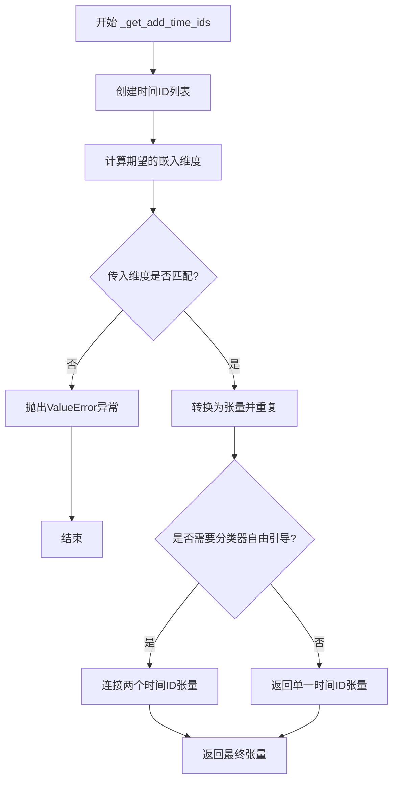

#### 带注释源码

```python
def _get_add_time_ids(self, do_classifier_free_guidance=True):
    """
    生成并返回时间标识（time IDs）张量，用于视频扩散模型的条件嵌入。
    
    参数:
        do_classifier_free_guidance (bool): 是否启用分类器自由引导。
            为True时返回的张量会在批次维度上复制并连接，以支持CFG。
    
    返回:
        torch.Tensor: 形状为 (2, 3) 的时间嵌入张量，包含fps、motion_bucket_id
            和 noise_aug_strength 三个时间相关的条件信息。
    """
    # 步骤1: 构建基础时间ID列表，包含帧率、运动桶ID和噪声增强强度
    add_time_ids = [self.fps, self.motion_bucket_id, self.noise_aug_strength]

    # 步骤2: 计算传入的时间嵌入维度（embedding dimension）
    # 将addition_time_embed_dim乘以时间ID列表的长度
    passed_add_embed_dim = self.addition_time_embed_dim * len(add_time_ids)

    # 步骤3: 获取模型配置期望的嵌入维度（应为addition_time_embed_dim * 3）
    expected_add_embed_dim = self.addition_time_embed_dim * 3

    # 步骤4: 验证嵌入维度是否匹配模型配置
    if expected_add_embed_dim != passed_add_embed_dim:
        raise ValueError(
            f"Model expects an added time embedding vector of length {expected_add_embed_dim},"
            f" but a vector of {passed_add_embed_dim} was created."
            f" The model has an incorrect config."
            f" Please check `unet.config.time_embedding_type` and"
            f" `text_encoder_2.config.projection_dim`."
        )

    # 步骤5: 将时间ID列表转换为PyTorch张量，并移动到计算设备上
    add_time_ids = torch.tensor([add_time_ids], device=torch_device)
    
    # 步骤6: 在第二个维度上重复张量（确保形状正确）
    add_time_ids = add_time_ids.repeat(1, 1)

    # 步骤7: 如果启用分类器自由引导，则复制并连接时间ID
    # 这样可以在推理时同时计算条件和无条件预测
    if do_classifier_free_guidance:
        add_time_ids = torch.cat([add_time_ids, add_time_ids])

    return add_time_ids
```


### `UNetSpatioTemporalConditionModelTests.test_xformers_enable_works`

该测试方法用于验证 XFormers 内存高效注意力机制是否正确启用。测试创建模型实例，启用 xformers 注意力处理器，然后检查模型的中 block 注意力层是否正确使用了 XFormersAttnProcessor。

参数：此方法无显式参数，使用类属性 `dummy_input` 和 `prepare_init_args_and_inputs_for_common` 方法获取输入。

返回值：`None`，该方法使用 `assert` 语句进行断言验证，不返回任何值。

#### 流程图

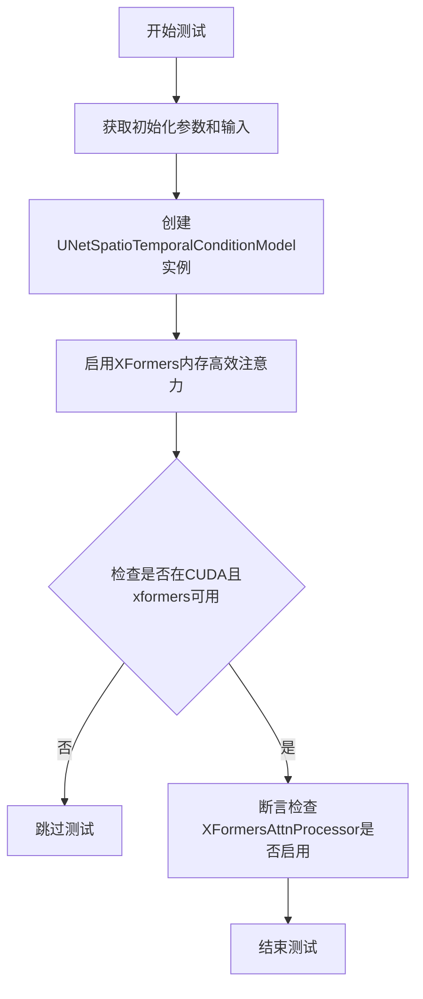

#### 带注释源码

```python
@unittest.skipIf(
    torch_device != "cuda" or not is_xformers_available(),
    reason="XFormers attention is only available with CUDA and `xformers` installed",
)
def test_xformers_enable_works(self):
    """
    测试XFormers内存高效注意力机制是否正确启用
    
    前提条件：
    - 必须在CUDA设备上运行
    - 必须安装xformers库
    
    测试步骤：
    1. 准备模型初始化参数和输入
    2. 创建模型实例
    3. 调用enable_xformers_memory_efficient_attention()启用xformers
    4. 验证模型的中block注意力层使用的是XFormersAttnProcessor
    """
    # 获取初始化参数和输入字典
    init_dict, inputs_dict = self.prepare_init_args_and_inputs_for_common()
    
    # 使用初始化参数创建UNetSpatioTemporalConditionModel模型实例
    model = self.model_class(**init_dict)

    # 启用XFormers内存高效注意力机制
    model.enable_xformers_memory_efficient_attention()

    # 断言验证xformers是否成功启用
    # 检查mid_block中第一个transformer block的attn1处理器类型
    assert (
        model.mid_block.attentions[0].transformer_blocks[0].attn1.processor.__class__.__name__
        == "XFormersAttnProcessor"
    ), "xformers is not enabled"
```

---

### `UNetSpatioTemporalConditionModelTests.test_model_with_num_attention_heads_tuple`

该测试方法用于验证当 num_attention_heads 参数为元组形式时，模型是否能正确处理多头注意力机制。测试创建带有元组类型 num_attention_heads 的模型，运行前向传播，并验证输出形状与输入形状一致。

参数：此方法无显式参数，使用类属性 `dummy_input` 和 `prepare_init_args_and_inputs_for_common` 方法获取输入。

返回值：`None`，该方法使用 `assert` 语句进行断言验证，不返回任何值。

#### 流程图

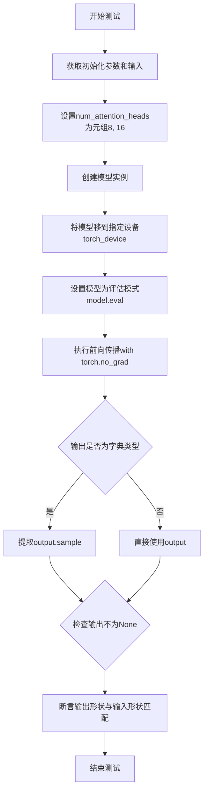

#### 带注释源码

```python
def test_model_with_num_attention_heads_tuple(self):
    """
    测试模型在num_attention_heads为元组时的行为
    
    测试目的：
    - 验证模型支持不同层使用不同数量的注意力头
    - 确保多头注意力在配置为元组时能正确运行
    - 验证输出形状与输入形状一致
    
    配置说明：
    - num_attention_heads = (8, 16) 表示不同层使用不同数量的头
    """
    # 获取标准的初始化参数和输入字典
    init_dict, inputs_dict = self.prepare_init_args_and_inputs_for_common()

    # 设置num_attention_heads为元组形式，指定不同层使用不同数量的注意力头
    # (8, 16) 表示第一层8个头，第二层16个头
    init_dict["num_attention_heads"] = (8, 16)
    
    # 使用修改后的参数创建模型实例
    model = self.model_class(**init_dict)
    
    # 将模型移动到指定的计算设备（如CUDA或CPU）
    model.to(torch_device)
    
    # 设置模型为评估模式，禁用dropout等训练特定的操作
    model.eval()

    # 在推理模式下执行前向传播
    with torch.no_grad():
        # 将输入字典解包传给模型，获取输出
        output = model(**inputs_dict)

        # 处理输出格式：如果是字典类型，则提取sample字段
        if isinstance(output, dict):
            output = output.sample

    # 断言输出不为None，确保模型正常产生输出
    self.assertIsNotNone(output)
    
    # 获取输入样本的形状用于比较
    expected_shape = inputs_dict["sample"].shape
    
    # 断言输出形状与输入形状完全匹配
    self.assertEqual(output.shape, expected_shape, "Input and output shapes do not match")
```

---

### `UNetSpatioTemporalConditionModelTests.test_model_with_cross_attention_dim_tuple`

该测试方法用于验证当 cross_attention_dim 参数为元组形式时，模型是否能正确处理跨注意力机制。测试创建带有元组类型 cross_attention_dim 的模型，运行前向传播，并验证输出形状与输入形状一致。

参数：此方法无显式参数，使用类属性 `dummy_input` 和 `prepare_init_args_and_inputs_for_common` 方法获取输入。

返回值：`None`，该方法使用 `assert` 语句进行断言验证，不返回任何值。

#### 流程图

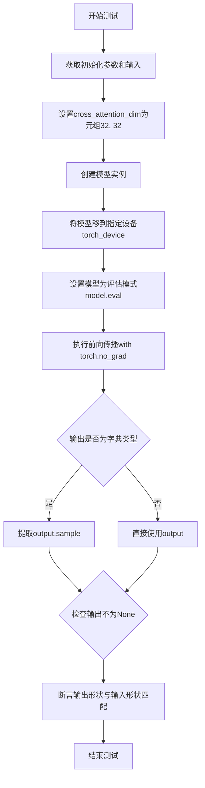

#### 带注释源码

```python
def test_model_with_cross_attention_dim_tuple(self):
    """
    测试模型在cross_attention_dim为元组时的行为
    
    测试目的：
    - 验证模型支持不同层使用不同维度的跨注意力
    - 确保跨注意力机制在配置为元组时能正确运行
    - 验证输出形状与输入形状一致
    
    配置说明：
    - cross_attention_dim = (32, 32) 表示不同层使用不同维度的跨注意力特征
    """
    # 获取标准的初始化参数和输入字典
    init_dict, inputs_dict = self.prepare_init_args_and_inputs_for_common()

    # 设置cross_attention_dim为元组形式，指定不同层使用不同维度的跨注意力
    # (32, 32) 表示第一层32维，第二层32维（可用于不同维度配置测试）
    init_dict["cross_attention_dim"] = (32, 32)

    # 使用修改后的参数创建模型实例
    model = self.model_class(**init_dict)
    
    # 将模型移动到指定的计算设备
    model.to(torch_device)
    
    # 设置模型为评估模式
    model.eval()

    # 在推理模式下执行前向传播
    with torch.no_grad():
        # 执行模型前向传播
        output = model(**inputs_dict)

        # 如果输出是字典类型，提取sample字段
        if isinstance(output, dict):
            output = output.sample

    # 验证输出不为None
    self.assertIsNotNone(output)
    
    # 获取期望的输出形状（与输入形状相同）
    expected_shape = inputs_dict["sample"].shape
    
    # 断言验证输出形状与输入形状匹配
    self.assertEqual(output.shape, expected_shape, "Input and output shapes do not match")
```

---

### `UNetSpatioTemporalConditionModelTests.test_gradient_checkpointing_is_applied`

该测试方法用于验证梯度检查点（Gradient Checkpointing）功能是否正确应用于时空Transformer模型的各种组件。测试检查特定的Transformer模块是否支持梯度检查点技术。

参数：此方法无显式参数，使用类属性和父类方法获取配置。

返回值：`None`，该方法调用父类测试方法进行验证，不返回任何值。

#### 流程图

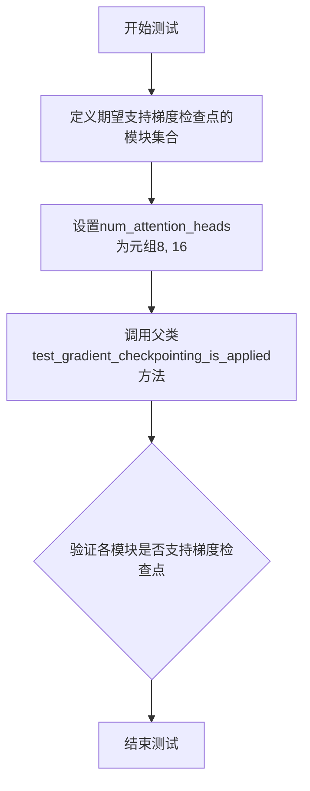

#### 带注释源码

```python
def test_gradient_checkpointing_is_applied(self):
    """
    测试梯度检查点技术是否正确应用于各Transformer模块
    
    测试目的：
    - 验证UNetSpatioTemporalConditionModel的各个组件支持梯度检查点
    - 确保在训练时可以节省显存同时保持梯度计算能力
    
    期望支持梯度检查点的模块：
    - TransformerSpatioTemporalModel: 时空Transformer模型
    - CrossAttnDownBlockSpatioTemporal: 跨注意力下采样块
    - DownBlockSpatioTemporal: 下采样块
    - UpBlockSpatioTemporal: 上采样块
    - CrossAttnUpBlockSpatioTemporal: 跨注意力上采样块
    - UNetMidBlockSpatioTemporal: UNet中间块
    
    梯度检查点技术说明：
    - 通过在反向传播时重新计算前向传播的中间结果来节省显存
    - 典型的用时间换空间的策略
    """
    # 定义期望支持梯度检查点的模块类型集合
    expected_set = {
        "TransformerSpatioTemporalModel",          # 时空Transformer模型
        "CrossAttnDownBlockSpatioTemporal",        # 跨注意力下采样块
        "DownBlockSpatioTemporal",                # 下采样块
        "UpBlockSpatioTemporal",                  # 上采样块
        "CrossAttnUpBlockSpatioTemporal",         # 跨注意力上采样块
        "UNetMidBlockSpatioTemporal",             # UNet中间块
    }
    
    # 设置注意力头数量为元组形式
    num_attention_heads = (8, 16)
    
    # 调用父类的测试方法进行验证
    # 父类方法会检查这些模块是否正确实现了梯度检查点功能
    super().test_gradient_checkpointing_is_applied(
        expected_set=expected_set, 
        num_attention_heads=num_attention_heads
    )
```

---

### `UNetSpatioTemporalConditionModelTests.test_pickle`

该测试方法用于验证模型的序列化（pickle）功能以及模型的确定性行为。测试创建模型，执行前向传播，然后通过比较原始输出和序列化后输出的差异来验证模型的稳定性和一致性。

参数：此方法无显式参数，使用类属性 `dummy_input` 和 `prepare_init_args_and_inputs_for_common` 方法获取输入。

返回值：`None`，该方法使用 `assert` 语句进行断言验证，不返回任何值。

#### 流程图

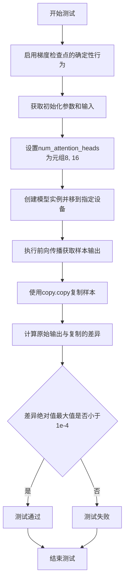

#### 带注释源码

```python
def test_pickle(self):
    """
    测试模型的pickle序列化功能和确定性行为
    
    测试目的：
    - 验证模型可以通过pickle进行序列化和反序列化
    - 验证模型在相同输入下产生确定性的输出
    - 确保模型复现性和一致性
    
    测试原理：
    - 使用copy.copy创建输出的浅拷贝
    - 比较原始输出和拷贝的差异
    - 如果差异极小（<1e-4），说明模型具有确定性行为
    """
    # 启用梯度检查点的确定性行为
    # 确保测试的可重复性
    init_dict, inputs_dict = self.prepare_init_args_and_inputs_for_common()

    # 设置注意力头数量为元组，与之前的测试保持一致
    init_dict["num_attention_heads"] = (8, 16)

    # 创建模型实例并移动到指定设备
    model = self.model_class(**init_dict)
    model.to(torch_device)

    # 执行前向传播获取样本输出
    # 使用torch.no_grad()禁用梯度计算，提高效率
    with torch.no_grad():
        sample = model(**inputs_dict).sample

    # 使用copy模块的copy函数创建输出的浅拷贝
    sample_copy = copy.copy(sample)

    # 断言验证：
    # 计算原始样本与拷贝样本的差异的绝对值
    # 如果差异最大值小于1e-4，说明模型输出是确定性的
    assert (sample - sample_copy).abs().max() < 1e-4
```

---

### `UNetSpatioTemporalConditionModelTests._get_add_time_ids`

这是一个辅助方法，用于生成时间嵌入的额外标识符（added time IDs）。该方法根据配置的帧率、运动桶ID和噪声增强强度生成时间嵌入向量，并支持分类器-free引导（classifier-free guidance）。

参数：
- `do_classifier_free_guidance`：`bool`，默认为 True，指定是否应用分类器-free引导技术

返回值：`torch.Tensor`，返回形状为 (2, 3) 或 (1, 3) 的时间标识符张量，包含 fps、motion_bucket_id 和 noise_aug_strength 信息

#### 流程图

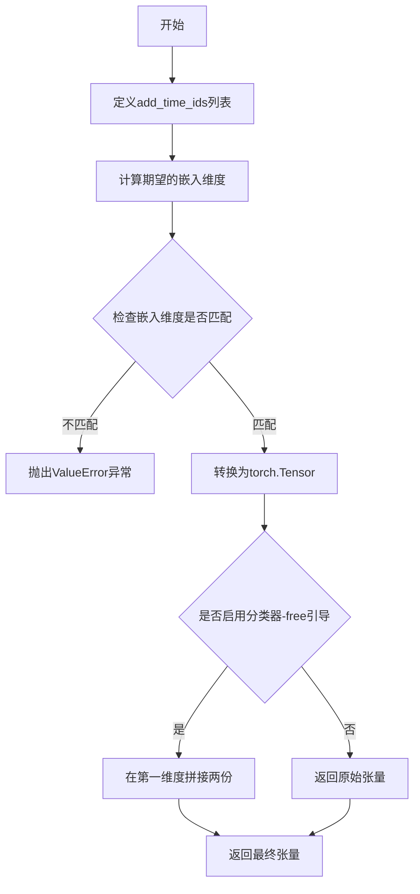

#### 带注释源码

```python
def _get_add_time_ids(self, do_classifier_free_guidance=True):
    """
    生成时间嵌入的额外标识符
    
    功能：
    - 根据fps、motion_bucket_id和noise_aug_strength生成时间相关嵌入
    - 用于UNetSpatioTemporalConditionModel的时间条件嵌入
    - 支持分类器-free引导（classifier-free guidance）
    
    参数：
    - do_classifier_free_guidance: 是否应用分类器-free引导
    
    返回：
    - torch.Tensor: 形状为(2, 3)或(1, 3)的张量，包含时间标识符
    
    时间标识符组成：
    - fps: 帧率，用于时间维度的建模
    - motion_bucket_id: 运动桶ID，用于控制运动强度
    - noise_aug_strength: 噪声增强强度，用于噪声调度
    """
    # 从类属性获取时间相关参数，组成列表
    add_time_ids = [self.fps, self.motion_bucket_id, self.noise_aug_strength]

    # 计算传入的嵌入维度 = 单个嵌入维度 * 时间ID数量
    passed_add_embed_dim = self.addition_time_embed_dim * len(add_time_ids)
    
    # 期望的嵌入维度 = 单个嵌入维度 * 3（固定为3个时间参数）
    expected_add_embed_dim = self.addition_time_embed_dim * 3

    # 验证维度是否匹配，如果不匹配说明配置有误
    if expected_add_embed_dim != passed_add_embed_dim:
        raise ValueError(
            f"Model expects an added time embedding vector of length {expected_add_embed_dim}, but a vector of {passed_add_embed_dim} was created. The model has an incorrect config. Please check `unet.config.time_embedding_type` and `text_encoder_2.config.projection_dim`."
        )

    # 将Python列表转换为PyTorch张量，指定设备
    add_time_ids = torch.tensor([add_time_ids], device=torch_device)
    
    # 在第一个维度重复一次（虽然这里重复后没有变化）
    add_time_ids = add_time_ids.repeat(1, 1)
    
    # 如果启用分类器-free引导，需要拼接两份相同的嵌入
    # 这是因为分类器-free引导需要同时处理有条件和无条件的输入
    if do_classifier_free_guidance:
        add_time_ids = torch.cat([add_time_ids, add_time_ids])

    return add_time_ids
```

---

### `UNetSpatioTemporalConditionModelTests.prepare_init_args_and_inputs_for_common`

这是一个测试辅助方法，用于准备模型初始化参数和测试输入数据。该方法为 UNetSpatioTemporalConditionModel 提供标准的配置字典和对应的输入数据，用于各种测试场景。

参数：此方法无显式参数，使用类属性获取配置值。

返回值：元组 `(dict, dict)`，第一个字典包含模型初始化参数，第二个字典包含测试输入数据。

#### 流程图

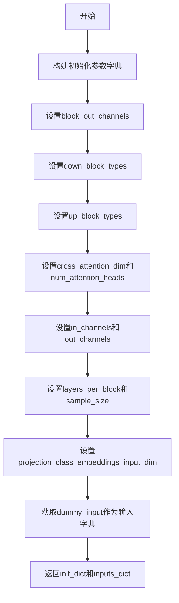

#### 带注释源码

```python
def prepare_init_args_and_inputs_for_common(self):
    """
    准备模型初始化参数和测试输入数据
    
    功能：
    - 构建完整的UNetSpatioTemporalConditionModel初始化配置
    - 提供与配置匹配的测试输入数据
    - 用于通用测试场景的初始化
    
    返回：
    - init_dict: 模型初始化参数字典
    - inputs_dict: 包含sample, timestep, encoder_hidden_states, added_time_ids的输入字典
    
    配置参数说明：
    - block_out_channels: (32, 64) - 下采样和上采样块的输出通道数
    - down_block_types: 时空下采样块类型
    - up_block_types: 时空上采样块类型
    - cross_attention_dim: 32 - 跨注意力维度
    - num_attention_heads: 8 - 注意力头数量
    - in_channels/out_channels: 4 - 输入输出通道数
    - layers_per_block: 2 - 每个块的层数
    - sample_size: 32 - 样本空间分辨率
    """
    # 构建模型初始化参数字典
    init_dict = {
        # 定义下采样块的输出通道数
        "block_out_channels": (32, 64),
        
        # 定义下采样块的类型（包含跨注意力和普通时空块）
        "down_block_types": (
            "CrossAttnDownBlockSpatioTemporal",
            "DownBlockSpatioTemporal",
        ),
        
        # 定义上采样块的类型
        "up_block_types": (
            "UpBlockSpatioTemporal",
            "CrossAttnUpBlockSpatioTemporal",
        ),
        
        # 跨注意力维度
        "cross_attention_dim": 32,
        
        # 注意力头数量
        "num_attention_heads": 8,
        
        # 输出通道数
        "out_channels": 4,
        
        # 输入通道数
        "in_channels": 4,
        
        # 每个块的层数
        "layers_per_block": 2,
        
        # 样本空间大小
        "sample_size": 32,
        
        # 类别嵌入投影输入维度 = addition_time_embed_dim * 3
        "projection_class_embeddings_input_dim": self.addition_time_embed_dim * 3,
        
        # 额外时间嵌入维度
        "addition_time_embed_dim": self.addition_time_embed_dim,
    }
    
    # 获取测试输入数据
    inputs_dict = self.dummy_input
    
    # 返回初始化参数和输入字典
    return init_dict, inputs_dict
```

---

### `UNetSpatioTemporalConditionModelTests.dummy_input`

这是一个测试属性方法，用于生成模型测试所需的虚拟输入数据。该属性返回一个包含噪声样本、时间步长、编码器隐藏状态和额外时间标识符的字典，用于测试 UNetSpatioTemporalConditionModel 的前向传播。

参数：此属性无显式参数。

返回值：`dict`，包含以下键值对：
- `sample`：`torch.Tensor`，形状为 (batch_size, num_frames, num_channels, height, width) 的噪声张量
- `timestep`：`torch.Tensor`，形状为 (1,) 的时间步张量
- `encoder_hidden_states`：`torch.Tensor`，形状为 (batch_size, 1, 32) 的编码器隐藏状态
- `added_time_ids`：`torch.Tensor`，额外的时间标识符

#### 流程图

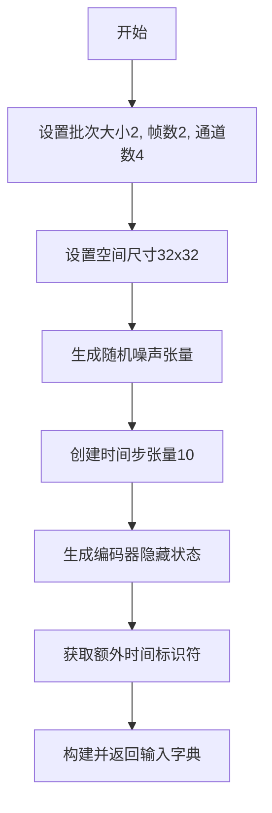

#### 带注释源码

```python
@property
def dummy_input(self):
    """
    生成虚拟测试输入数据
    
    功能：
    - 为UNetSpatioTemporalConditionModel生成符合格式要求的测试输入
    - 模拟真实的视频/图像去噪任务的输入
    
    输入参数说明：
    - batch_size: 2 - 批次大小
    - num_frames: 2 - 时间帧数（用于时空模型）
    - num_channels: 4 - 通道数（RGBA或潜在空间维度）
    - sizes: (32, 32) - 空间分辨率
    
    返回字典包含：
    - sample: 噪声输入，形状(2, 2, 4, 32, 32)
    - timestep: 时间步，值为10
    - encoder_hidden_states: 文本编码器输出，形状(2, 1, 32)
    - added_time_ids: 额外时间标识符，用于时间嵌入
    """
    # 设置输入参数
    batch_size = 2          # 批次大小
    num_frames = 2          # 时间维度帧数
    num_channels = 4        # 通道数（图像通道或潜在空间维度）
    sizes = (32, 32)        # 空间分辨率

    # 使用floats_tensor生成指定形状的随机浮点数噪声
    # 并移动到指定的计算设备
    noise = floats_tensor((batch_size, num_frames, num_channels) + sizes).to(torch_device)
    
    # 创建时间步张量，用于去噪调度
    time_step = torch.tensor([10]).to(torch_device)
    
    # 生成文本编码器的隐藏状态
    # 形状为(batch_size, sequence_length, embedding_dim)
    encoder_hidden_states = floats_tensor((batch_size, 1, 32)).to(torch_device)

    # 构建并返回输入字典
    return {
        "sample": noise,                          # 噪声样本
        "timestep": time_step,                    # 时间步
        "encoder_hidden_states": encoder_hidden_states,  # 编码器隐藏状态
        "added_time_ids": self._get_add_time_ids(),  # 额外时间标识符
    }
```


### `UNetSpatioTemporalConditionModelTests._get_add_time_ids`

该方法用于生成时间嵌入的附加时间ID（added time IDs），包括帧率、运动桶ID和噪声增强强度，并在分类器自由引导模式下进行张量拼接。

参数：

- `self`：测试类实例本身
- `do_classifier_free_guidance`：`bool`，是否进行分类器自由引导，默认为True

返回值：`torch.Tensor`，形状为 (2, 3) 的张量，包含扩展后的时间ID

#### 流程图

```mermaid
flowchart TD
    A[开始] --> B[获取基础时间IDs列表: fps, motion_bucket_id, noise_aug_strength]
    B --> C[计算期望的嵌入维度: addition_time_embed_dim * 3]
    C --> D[计算实际传入的嵌入维度: addition_time_embed_dim * len(add_time_ids)]
    D --> E{期望维度 == 实际维度?}
    E -->|否| F[抛出ValueError异常]
    E -->|是| G[将列表转换为torch.tensor]
    G --> H{do_classifier_free_guidance?}
    H -->|True| I[张量拼接: torch.cat add_time_ids + add_time_ids]
    H -->|False| J[直接返回add_time_ids]
    I --> K[返回最终时间IDs张量]
    J --> K
    F --> L[结束]
```

#### 带注释源码

```python
def _get_add_time_ids(self, do_classifier_free_guidance=True):
    # 定义基础时间参数：帧率、运动桶ID、噪声增强强度
    add_time_ids = [self.fps, self.motion_bucket_id, self.noise_aug_strength]

    # 计算模型期望的嵌入维度 = addition_time_embed_dim * 3
    passed_add_embed_dim = self.addition_time_embed_dim * len(add_time_ids)
    expected_add_embed_dim = self.addition_time_embed_dim * 3

    # 验证嵌入维度是否匹配，如果不匹配则抛出错误
    if expected_add_embed_dim != passed_add_embed_dim:
        raise ValueError(
            f"Model expects an added time embedding vector of length {expected_add_embed_dim}, "
            f"but a vector of {passed_add_embed_dim} was created. "
            f"The model has an incorrect config. Please check `unet.config.time_embedding_type` "
            f"and `text_encoder_2.config.projection_dim`."
        )

    # 将Python列表转换为torch.Tensor，指定设备为torch_device
    add_time_ids = torch.tensor([add_time_ids], device=torch_device)
    # 确保张量形状正确
    add_time_ids = add_time_ids.repeat(1, 1)
    
    # 如果启用分类器自由引导，则拼接两个相同的时间ID用于无条件和有条件两种情况
    if do_classifier_free_guidance:
        add_time_ids = torch.cat([add_time_ids, add_time_ids])

    return add_time_ids
```


### `UNetSpatioTemporalConditionModel`

UNetSpatioTemporalConditionModel 是来自 diffusers 库的时空条件 UNet 模型，专为视频生成任务设计，能够处理时间维度的卷积和注意力操作，将噪声样本根据时间步长和文本/图像条件进行去噪，输出与输入形状相同的去噪样本。

参数：

- `sample`：`torch.Tensor`，输入的噪声样本，形状为 (batch_size, num_frames, num_channels, height, width)
- `timestep`：`torch.Tensor` 或 `int`，扩散过程的时间步长
- `encoder_hidden_states`：`torch.Tensor`，条件编码器的隐藏状态，通常来自文本编码器
- `added_time_ids`：`torch.Tensor`，额外的时间标识，包含 fps、motion_bucket_id 和 noise_aug_strength 等信息
- `return_dict`：`bool`，可选，是否返回字典格式的输出

返回值：`torch.Tensor` 或 `dict`，去噪后的样本，形状与输入 sample 相同；如果 return_dict 为 True，返回包含 'sample' 键的字典

#### 流程图

```mermaid
flowchart TD
    A[输入: sample, timestep, encoder_hidden_states, added_time_ids] --> B[时间嵌入层处理timestep]
    B --> C[条件嵌入处理encoder_hidden_states和added_time_ids]
    C --> D[下采样路径Down Blocks]
    D --> E[中间层Mid Block处理]
    E --> F[上采样路径Up Blocks]
    F --> G[输出层生成sample]
    G --> H{return_dict?}
    H -->|True| I[返回字典 {'sample': torch.Tensor}]
    H -->|False| J[返回torch.Tensor]
```

#### 带注释源码

```python
# 这是一个测试文件，展示了如何使用 UNetSpatioTemporalConditionModel
# 该类从 diffusers 库导入，未在此文件中定义

# 导入 UNetSpatioTemporalConditionModel 类
from diffusers import UNetSpatioTemporalConditionModel

# 模型初始化参数（从测试代码中提取）
init_dict = {
    "block_out_channels": (32, 64),           # 输出通道数元组
    "down_block_types": (                      # 下采样块类型
        "CrossAttnDownBlockSpatioTemporal",    # 带交叉注意力的时空下采样块
        "DownBlockSpatioTemporal",             # 普通时空下采样块
    ),
    "up_block_types": (                        # 上采样块类型
        "UpBlockSpatioTemporal",               # 普通时空上采样块
        "CrossAttnUpBlockSpatioTemporal",      # 带交叉注意力的时空上采样块
    ),
    "cross_attention_dim": 32,                # 交叉注意力维度
    "num_attention_heads": 8,                  # 注意力头数
    "out_channels": 4,                         # 输出通道数
    "in_channels": 4,                          # 输入通道数
    "layers_per_block": 2,                     # 每个块的层数
    "sample_size": 32,                         # 样本空间尺寸
    "projection_class_embeddings_input_dim": 32 * 3,  # 类别嵌入投影维度
    "addition_time_embed_dim": 32,             # 额外时间嵌入维度
}

# 创建模型实例
model = UNetSpatioTemporalConditionModel(**init_dict)

# 准备输入数据（dummy_input 属性）
batch_size = 2
num_frames = 2
num_channels = 4
sizes = (32, 32)

noise = floats_tensor((batch_size, num_frames, num_channels) + sizes).to(torch_device)
time_step = torch.tensor([10]).to(torch_device)
encoder_hidden_states = floats_tensor((batch_size, 1, 32)).to(torch_device)

inputs_dict = {
    "sample": noise,                           # 噪声样本 (2,2,4,32,32)
    "timestep": time_step,                    # 时间步 [10]
    "encoder_hidden_states": encoder_hidden_states,  # 条件嵌入 (2,1,32)
    "added_time_ids": self._get_add_time_ids(),       # 额外时间ID
}

# 前向传播
with torch.no_grad():
    output = model(**inputs_dict)

# 处理输出
if isinstance(output, dict):
    output = output.sample  # 提取 sample 张量

# 输出形状应与输入 sample 形状相同
# expected_shape = inputs_dict["sample"].shape  # (2, 2, 4, 32, 32)
```

#### 关键组件信息

| 组件名称 | 一句话描述 |
|---------|-----------|
| CrossAttnDownBlockSpatioTemporal | 带交叉注意力的时空下采样块，用于提取多尺度特征 |
| DownBlockSpatioTemporal | 普通时空下采样块，处理特征下采样 |
| UpBlockSpatioTemporal | 普通时空上采样块，进行特征上采样 |
| CrossAttnUpBlockSpatioTemporal | 带交叉注意力的时空上采样块，融合条件信息 |
| UNetMidBlockSpatioTemporal | 中间块，处理最深层特征 |
| TransformerSpatioTemporalModel | 时空变换器模型，处理时空注意力 |

#### 潜在的技术债务或优化空间

1. **注意力机制优化**：当前支持 xformers 内存高效注意力，但可以进一步优化 Flash Attention 集成
2. **梯度检查点**：测试显示支持梯度检查点，但可验证其在实际训练中的内存节省效果
3. **配置灵活性**：测试中跳过了多个配置选项（如 norm_groups、linear_projection 等），表明某些高级特性未完全开放
4. **动态分辨率支持**：需验证模型对可变分辨率输入的处理能力

#### 其它项目

**设计目标与约束**：
- 专为视频扩散模型设计，支持时间维度的处理
- 遵循 SpatioTemporal 条件机制，处理帧序列

**错误处理与异常设计**：
- 在 `_get_add_time_ids` 中检查 embedding 维度匹配，不匹配时抛出 ValueError

**数据流与状态机**：
- 输入：噪声样本 + 时间步 + 条件嵌入 + 时间ID
- 处理流程：Down Blocks → Mid Block → Up Blocks
- 输出：去噪后的样本

**外部依赖与接口契约**：
- 依赖 diffusers 库
- 条件输入需来自文本编码器或图像编码器
- added_time_ids 格式必须为 [fps, motion_bucket_id, noise_aug_strength] 的 3 倍维度


### `logging.get_logger`

获取指定名称的logger实例，用于在模块中记录日志。

参数：

- `name`：`str`，logger的名称，通常使用`__name__`变量传入，以标识日志来源的模块

返回值：`logging.Logger`，返回Python标准库的Logger对象，用于记录日志

#### 流程图

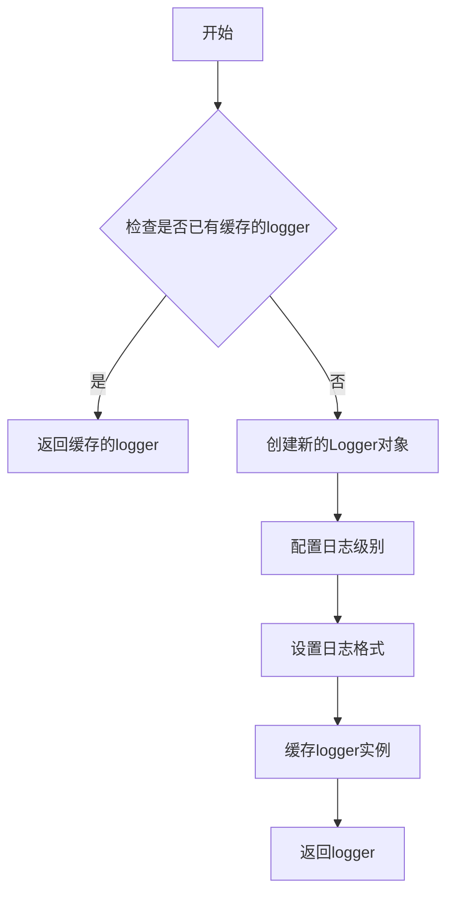

#### 带注释源码

```python
# 从diffusers.utils导入logging模块
from diffusers.utils import logging

# 获取当前模块的logger实例
# 参数: __name__ - Python内置变量，表示当前模块的全限定名
# 返回值: Logger对象，用于记录该模块的日志
logger = logging.get_logger(__name__)
```

---

### 相关类信息

在代码中还涉及以下logging相关的类和方法：

| 名称 | 类型 | 描述 |
|------|------|------|
| `logging` | 模块 | diffusers工具模块中的日志工具模块 |
| `logging.get_logger` | 函数 | 用于获取logger实例的工厂函数 |
| `logger` | 全局变量 | 当前模块的Logger实例，用于输出测试日志 |


### `is_xformers_available`

该函数用于检测当前环境中是否已安装并可用 `xformers` 库。`xformers` 是一个用于高效注意力机制的库，在 diffusers 中用于启用内存高效的注意力计算。

参数：
- 该函数无参数

返回值：`bool`，如果 xformers 库可用返回 `True`，否则返回 `False`

#### 流程图

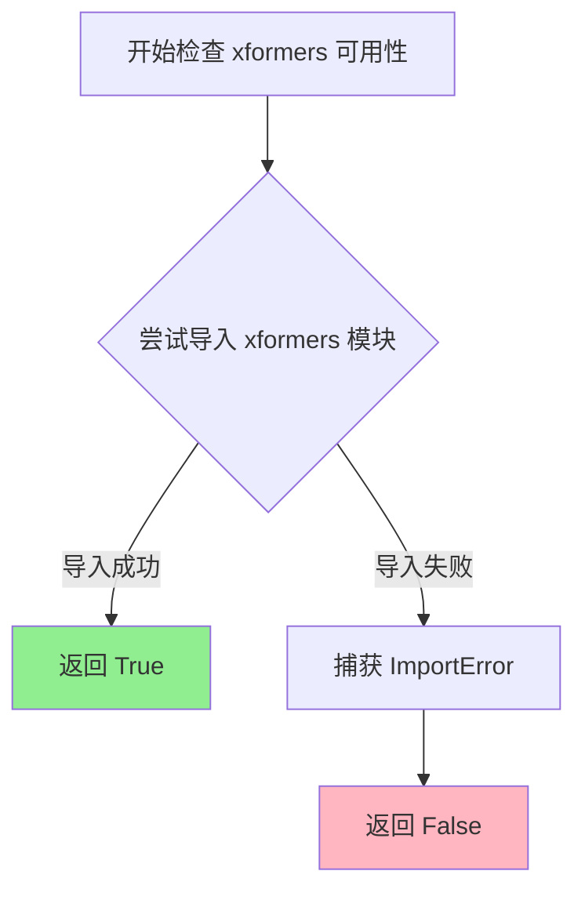

#### 带注释源码

```
# 该函数定义位于 diffusers.utils.import_utils 模块中
# 当前文件仅导入并使用该函数

# 导入语句（在文件顶部）
from diffusers.utils.import_utils import is_xformers_available

# 使用示例（在测试方法中）
@unittest.skipIf(
    torch_device != "cuda" or not is_xformers_available(),
    reason="XFormers attention is only available with CUDA and `xformers` installed",
)
def test_xformers_enable_works(self):
    init_dict, inputs_dict = self.prepare_init_args_and_inputs_for_common()
    model = self.model_class(**init_dict)

    model.enable_xformers_memory_efficient_attention()

    assert (
        model.mid_block.attentions[0].transformer_blocks[0].attn1.processor.__class__.__name__
        == "XFormersAttnProcessor"
    ), "xformers is not enabled"
```

#### 补充说明

**函数位置**：该函数并非在此代码文件中定义，而是从 `diffusers.utils.import_utils` 模块导入。

**典型实现逻辑**（基于常见模式）：
1. 尝试执行 `import xformers`
2. 如果成功导入，返回 `True`
3. 如果抛出 `ImportError` 或 `ModuleNotFoundError`，返回 `False`

**设计目的**：
- 提供一种安全检查机制，避免在 xformers 不可用的环境中调用相关功能
- 用于条件跳过需要 xformers 的测试用例
- 在运行时动态决定是否启用 xformers 内存高效注意力

**潜在优化空间**：
- 可以考虑缓存检查结果，避免重复导入开销
- 可以提供更详细的错误信息，说明如何安装 xformers


### enable_full_determinism

该函数用于启用PyTorch的完全确定性模式，通过设置随机种子和配置相关标志，确保深度学习模型在运行时产生可复现的结果，主要用于测试环境中保证测试用例的确定性行为。

参数：

- 该函数无参数

返回值：`None`，无返回值

#### 流程图

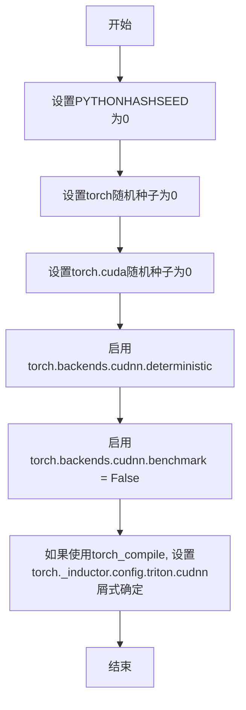

#### 带注释源码

```
# enable_full_determinism 函数定义（位于 testing_utils.py 中）
# 该函数通过以下方式确保确定性：
def enable_full_determinism(seed: int = 0, extra_seed: int = 0):
    """
    确保PyTorch运算完全可复现的辅助函数。
    
    参数:
        seed: 基础随机种子，默认为0
        extra_seed: 额外的随机种子，默认为0
    """
    # 1. 设置Python哈希种子，确保哈希运算可复现
    import os
    os.environ["PYTHONHASHSEED"] = str(seed)
    
    # 2. 设置PyTorch CPU随机种子
    torch.manual_seed(seed)
    
    # 3. 设置PyTorch CUDA随机种子
    torch.cuda.manual_seed_all(seed)
    
    # 4. 启用确定性算法（可能影响性能）
    torch.backends.cudnn.deterministic = True
    torch.backends.cudnn.benchmark = False
    
    # 5. 如果使用torch.compile，设置Triton的cuDNN算法选择为确定性
    if hasattr(torch, '_inductor'):
        torch._inductor.config.triton.cudnn_template = None  # 或其他相关配置
    
    # 6. 设置numpy和其他库的随机种子（如需要）
    try:
        import numpy as np
        np.random.seed(seed)
    except ImportError:
        pass
```


### `floats_tensor`

该函数是一个测试工具函数，用于生成指定形状的随机浮点数张量，通常用于深度学习模型的测试和验证。

参数：

-  `shape`：`tuple`，表示生成张量的形状，例如 `(batch_size, num_frames, num_channels, height, width)`

返回值：`torch.Tensor`，返回指定形状的随机浮点数张量

#### 流程图

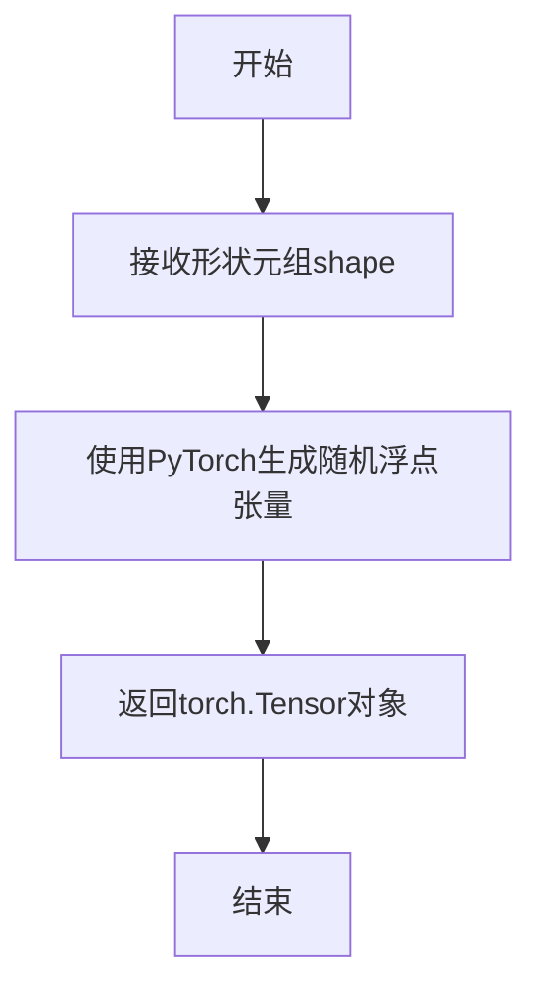

#### 带注释源码

```
# 注意：此函数定义不在当前代码文件中
# 而是从 testing_utils 模块导入
# 以下是基于使用方式推断的源码结构

def floats_tensor(shape, dtype=torch.float32, device='cpu'):
    """
    生成指定形状的随机浮点数张量
    
    参数:
        shape: 张量的形状元组
        dtype: 数据类型，默认为 torch.float32
        device: 设备，默认为 'cpu'
    
    返回:
        随机浮点张量
    """
    # 生成随机张量并返回
    return torch.randn(shape, dtype=dtype, device=device)
```

#### 说明

⚠️ **重要提示**：在提供的代码文件中，`floats_tensor` 函数并非在此文件中定义，而是从 `...testing_utils` 模块导入的。因此无法直接获取其完整源码。上述源码是根据该函数在代码中的使用方式推断得出的。

**在代码中的实际使用示例：**

```python
# 用于生成噪声张量
noise = floats_tensor((batch_size, num_frames, num_channels) + sizes).to(torch_device)

# 用于生成encoder隐藏状态
encoder_hidden_states = floats_tensor((batch_size, 1, 32)).to(torch_device)
```


### `skip_mps`

这是一个装饰器函数，用于在 Apple Silicon (MPS) 设备上跳过测试用例。由于 MPS 后端在某些情况下存在兼容性问题，该装饰器会检测运行环境，若检测到是 MPS 设备则跳过被装饰的测试。

参数：

- `func`：被装饰的函数或类，默认值为 `None`

返回值：无返回值（修改被装饰对象的某些属性或直接跳过执行）

#### 流程图

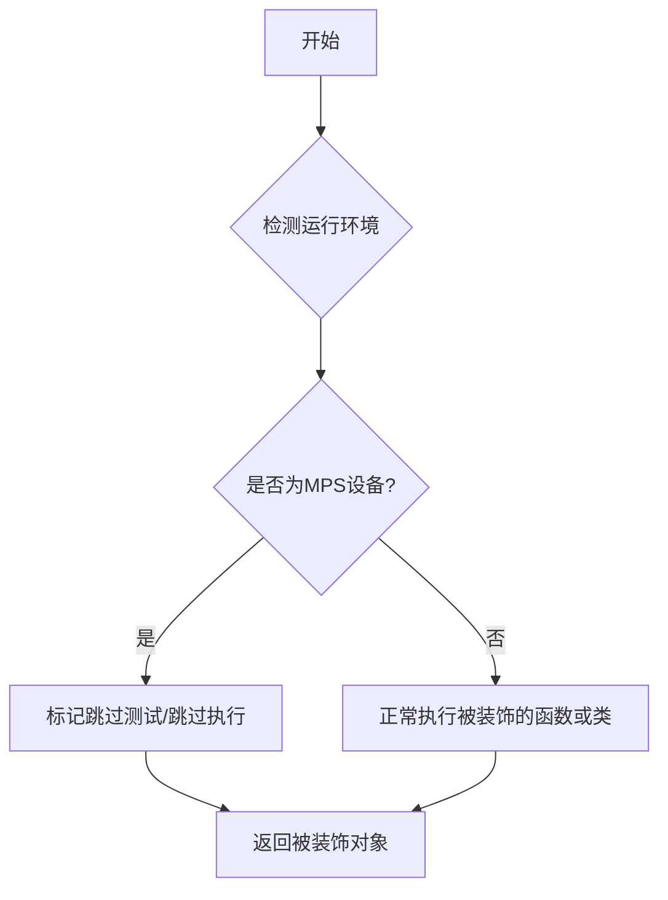

#### 带注释源码

```python
# 该函数的实际定义不在当前代码文件中
# 它是从 testing_utils 模块导入的装饰器
# 使用方式如下所示：

from ...testing_utils import skip_mps

# 作为装饰器使用在测试类上
@skip_mps
class UNetSpatioTemporalConditionModelTests(ModelTesterMixin, UNetTesterMixin, unittest.TestCase):
    # 测试类内容...
    pass

# 或者作为函数直接调用
# skip_mps(SomeTestClass)
# skip_mps(some_test_function)
```

> **注意**：由于 `skip_mps` 函数定义在 `...testing_utils` 模块中，而非当前代码文件内，因此无法获取其完整源码。上述源码展示了该函数在当前文件中的导入方式和使用方式。该函数通常通过检测 `torch.backends.mps.is_available()` 来判断是否为 Apple Silicon 设备，并使用 `unittest.skipIf` 或类似机制来跳过测试。


### `torch_device`

`torch_device` 是从 `testing_utils` 模块导入的全局变量或函数，用于获取当前测试环境的目标计算设备（如 "cpu"、"cuda" 等），确保测试张量在正确的设备上运行。

参数：

- 该函数无显式参数（如果为函数）或无参数（如果为变量）

返回值：`str` 或 `torch.device`，返回当前测试配置的目标设备

#### 流程图

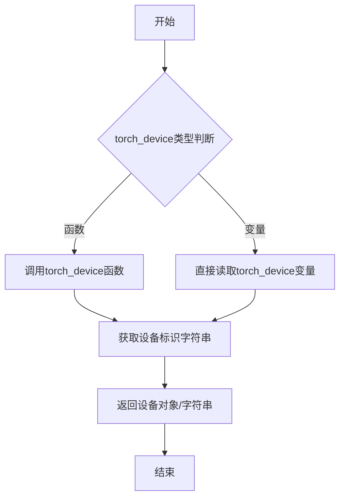

#### 带注释源码

```python
# torch_device 是从 testing_utils 模块导入的
# 在本文件中通过 import 语句引入：
from ...testing_utils import (
    enable_full_determinism,
    floats_tensor,
    skip_mps,
    torch_device,  # <-- 从 testing_utils 模块导入
)

# 在代码中的典型使用方式：
# 1. 将张量移动到目标设备
noise = floats_tensor((batch_size, num_frames, num_channels) + sizes).to(torch_device)

# 2. 将张量移动到目标设备
time_step = torch.tensor([10]).to(torch_device)

# 3. 将模型移动到目标设备
model = self.model_class(**init_dict)
model.to(torch_device)

# 4. 在目标设备上创建张量
add_time_ids = torch.tensor([add_time_ids], device=torch_device)
```

**注意**：由于 `torch_device` 定义在 `testing_utils` 模块中（未在当前代码文件中定义），上述源码基于其在当前文件中的使用方式进行了说明。它很可能是一个返回设备标识字符串（如 `"cuda"`、`"cpu"`、`"mps"`）的函数或全局变量，用于支持跨不同测试环境的设备配置。


### 注意事项

在提供的代码中，**`ModelTesterMixin` 并未在此文件中定义**。它是从 `..test_modeling_common` 模块导入的混合类（Mixin），在此代码中仅作为父类被继承使用。

但是，代码中定义了一个继承自 `ModelTesterMixin` 的测试类 `UNetSpatioTemporalConditionModelTests`。如果您需要了解该测试类的详细信息，请参考以下内容：

### `UNetSpatioTemporalConditionModelTests`

这是针对 `UNetSpatioTemporalConditionModel` 的测试类，继承自 `ModelTesterMixin` 和 `UNetTesterMixin`，用于验证时空条件 UNet 模型的正确性。

参数：

- 无直接参数（类定义）

返回值：无返回值（测试类）

#### 流程图

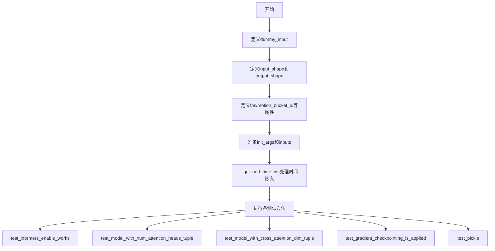

#### 带注释源码

```python
@skip_mps
class UNetSpatioTemporalConditionModelTests(ModelTesterMixin, UNetTesterMixin, unittest.TestCase):
    """UNetSpatioTemporalConditionModel的测试类"""
    model_class = UNetSpatioTemporalConditionModel  # 指定要测试的模型类
    main_input_name = "sample"  # 主输入名称

    @property
    def dummy_input(self):
        """生成用于测试的虚拟输入"""
        batch_size = 2
        num_frames = 2
        num_channels = 4
        sizes = (32, 32)

        # 生成随机噪声张量作为sample输入
        noise = floats_tensor((batch_size, num_frames, num_channels) + sizes).to(torch_device)
        time_step = torch.tensor([10]).to(torch_device)  # 时间步
        encoder_hidden_states = floats_tensor((batch_size, 1, 32)).to(torch_device)  # 编码器隐藏状态

        return {
            "sample": noise,
            "timestep": time_step,
            "encoder_hidden_states": encoder_hidden_states,
            "added_time_ids": self._get_add_time_ids(),  # 添加的时间ID
        }

    @property
    def input_shape(self):
        """输入形状: (batch, frames, channels, height, width)"""
        return (2, 2, 4, 32, 32)

    @property
    def output_shape(self):
        """输出形状: (channels, height, width)"""
        return (4, 32, 32)

    @property
    def fps(self):
        """帧率"""
        return 6

    @property
    def motion_bucket_id(self):
        """运动桶ID"""
        return 127

    @property
    def noise_aug_strength(self):
        """噪声增强强度"""
        return 0.02

    @property
    def addition_time_embed_dim(self):
        """额外时间嵌入维度"""
        return 32

    def prepare_init_args_and_inputs_for_common(self):
        """准备初始化参数和输入用于通用测试"""
        init_dict = {
            "block_out_channels": (32, 64),
            "down_block_types": (
                "CrossAttnDownBlockSpatioTemporal",
                "DownBlockSpatioTemporal",
            ),
            "up_block_types": (
                "UpBlockSpatioTemporal",
                "CrossAttnUpBlockSpatioTemporal",
            ),
            "cross_attention_dim": 32,
            "num_attention_heads": 8,
            "out_channels": 4,
            "in_channels": 4,
            "layers_per_block": 2,
            "sample_size": 32,
            "projection_class_embeddings_input_dim": self.addition_time_embed_dim * 3,
            "addition_time_embed_dim": self.addition_time_embed_dim,
        }
        inputs_dict = self.dummy_input
        return init_dict, inputs_dict

    def _get_add_time_ids(self, do_classifier_free_guidance=True):
        """获取添加的时间ID用于条件嵌入"""
        add_time_ids = [self.fps, self.motion_bucket_id, self.noise_aug_strength]

        # 验证嵌入维度是否匹配
        passed_add_embed_dim = self.addition_time_embed_dim * len(add_time_ids)
        expected_add_embed_dim = self.addition_time_embed_dim * 3

        if expected_add_embed_dim != passed_add_embed_dim:
            raise ValueError(
                f"Model expects an added time embedding vector of length {expected_add_embed_dim}, but a vector of {passed_add_embed_dim} was created. The model has an incorrect config. Please check `unet.config.time_embedding_type` and `text_encoder_2.config.projection_dim`."
            )

        add_time_ids = torch.tensor([add_time_ids], device=torch_device)
        add_time_ids = add_time_ids.repeat(1, 1)
        
        # 分类器自由引导：复制时间ID用于条件和非条件输入
        if do_classifier_free_guidance:
            add_time_ids = torch.cat([add_time_ids, add_time_ids])

        return add_time_ids
```


### `UNetTesterMixin`

由于提供的代码片段并未包含 `UNetTesterMixin` 类的实际定义（该类通过 `from ..test_modeling_common import ModelTesterMixin, UNetTesterMixin` 从 `test_modeling_common` 模块导入），因此无法从当前代码中提取其完整信息。

不过，从代码的使用方式可以推断出以下关键信息：

#### 类使用信息

`UNetTesterMixin` 是一个 **测试混入类（Test Mixin）**，用于为 `UNetSpatioTemporalConditionModelTests` 测试类提供通用的模型测试方法。它继承自 `ModelTesterMixin`，并针对 UNet 模型的时空条件变体进行了特定定制。

#### 调用关系

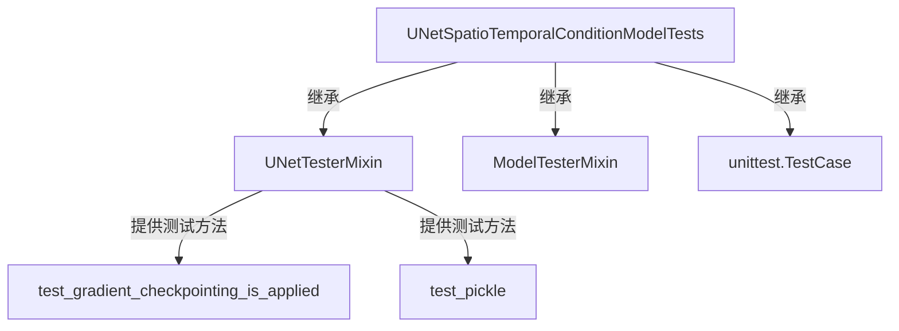

#### 当前代码中相关的测试方法

虽然 `UNetTesterMixin` 的定义不在当前代码中，但从 `UNetSpatioTemporalConditionModelTests` 类中可以推断出该 Mixin 提供的方法类型：

| 方法名 | 推断用途 |
|--------|----------|
| `test_gradient_checkpointing_is_applied` | 测试梯度检查点是否被正确应用 |
| `test_pickle` | 测试模型是否可以被序列化/反序列化 |

#### 带注释源码

```python
# 当前文件中的相关代码展示了 UNetTesterMixin 的使用方式
class UNetSpatioTemporalConditionModelTests(
    ModelTesterMixin,    # 提供通用模型测试方法
    UNetTesterMixin,     # 提供 UNet 特定的测试方法（定义在 test_modeling_common 模块中）
    unittest.TestCase    # 提供 unittest 框架功能
):
    model_class = UNetSpatioTemporalConditionModel
    
    # 使用 UNetTesterMixin 提供的测试方法进行模型测试
    def test_gradient_checkpointing_is_applied(self):
        # 测试梯度检查点是否正确应用于时空变换器模块
        expected_set = {
            "TransformerSpatioTemporalModel",
            "CrossAttnDownBlockSpatioTemporal",
            # ... 其他块类型
        }
        # 调用父类方法验证梯度检查点
        super().test_gradient_checkpointing_is_applied(
            expected_set=expected_set, 
            num_attention_heads=num_attention_heads
        )
```

#### 说明

如需获取 `UNetTesterMixin` 的完整定义（包含所有字段和方法），需要查看 `diffusers` 库中 `test_modeling_common.py` 文件的内容。该文件通常位于 `tests/src/diffusers/` 目录下。


### `UNetSpatioTemporalConditionModelTests.dummy_input`

该属性用于生成UNetSpatioTemporalConditionModel测试所需的虚拟输入数据，构造包含噪声样本、时间步、编码器隐藏状态和时间ID的字典，以支持模型的前向传播测试。

参数：无（该方法为属性装饰器，无显式参数）

返回值：`dict`，返回包含模型所需输入的字典，包含sample（噪声样本）、timestep（时间步）、encoder_hidden_states（编码器隐藏状态）和added_time_ids（时间ID）

#### 流程图

```mermaid
flowchart TD
    A[开始 dummy_input 属性] --> B[设置批次大小 batch_size=2]
    B --> C[设置帧数 num_frames=2]
    C --> D[设置通道数 num_channels=4]
    D --> E[设置空间尺寸 sizes=(32, 32)]
    E --> F[生成噪声张量: floats_tensor((2,2,4) + (32,32))]
    F --> G[生成时间步: torch.tensor([10])]
    G --> H[生成编码器隐藏状态: floats_tensor((2,1,32))]
    H --> I[调用_get_add_time_ids获取时间ID]
    I --> J[组装返回字典]
    J --> K[返回包含sample/timestep/encoder_hidden_states/added_time_ids的字典]
```

#### 带注释源码

```python
@property
def dummy_input(self):
    """
    生成用于测试UNetSpatioTemporalConditionModel的虚拟输入数据。
    该属性返回一个包含模型前向传播所需所有输入的字典。
    """
    # 定义批次大小
    batch_size = 2
    # 定义视频帧数
    num_frames = 2
    # 定义通道数
    num_channels = 4
    # 定义空间尺寸（高度和宽度）
    sizes = (32, 32)

    # 生成随机噪声张量，形状为 (batch_size, num_frames, num_channels) + sizes
    # 即 (2, 2, 4, 32, 32)，并移动到测试设备
    noise = floats_tensor((batch_size, num_frames, num_channels) + sizes).to(torch_device)
    # 创建时间步张量，值为[10]，形状为(1,)，并移动到测试设备
    time_step = torch.tensor([10]).to(torch_device)
    # 生成编码器隐藏状态张量，形状为 (batch_size, 1, 32)，并移动到测试设备
    encoder_hidden_states = floats_tensor((batch_size, 1, 32)).to(torch_device)

    # 返回包含所有模型输入的字典
    return {
        "sample": noise,                    # 输入噪声/样本张量，形状 (2,2,4,32,32)
        "timestep": time_step,              # 时间步张量，形状 (1,)
        "encoder_hidden_states": encoder_hidden_states,  # 编码器隐藏状态，形状 (2,1,32)
        "added_time_ids": self._get_add_time_ids(),     # 额外的时间ID，包含fps/motion_bucket_id/noise_aug_strength
    }
```


### `UNetSpatioTemporalConditionModelTests.input_shape`

该属性定义了 UNetSpatioTemporalConditionModel 在时空条件下的输入张量形状，返回一个包含批量大小、帧数、通道数和空间维度的元组，用于模型测试时的输入验证。

参数： 无

返回值：`tuple`，返回模型输入的形状元组 (batch_size, num_frames, num_channels, height, width)，其中 batch_size=2, num_frames=2, num_channels=4, height=32, width=32。

#### 流程图

```mermaid
flowchart TD
    A[访问 input_shape 属性] --> B{是否首次调用}
    B -->|是| C[返回元组 (2, 2, 4, 32, 32)]
    B -->|否| C
    C --> D[测试框架使用此形状验证模型输入输出维度]
```

#### 带注释源码

```python
@property
def input_shape(self):
    """
    定义测试模型的输入形状。
    
    返回值:
        tuple: 包含5个元素的元组，依次表示:
            - batch_size (int): 批量大小，值为2
            - num_frames (int): 帧数，值为2（用于时空模型）
            - num_channels (int): 通道数，值为4
            - height (int): 图像高度，值为32
            - width (int): 图像宽度，值为32
    """
    return (2, 2, 4, 32, 32)
```


### `UNetSpatioTemporalConditionModelTests.output_shape`

该属性定义了 UNetSpatioTemporalConditionModel 在测试中的预期输出形状，用于验证模型前向传播输出的维度是否正确。

参数：

- （无参数，该属性不接受任何输入）

返回值：`tuple`，返回模型输出的预期形状，格式为 (batch_size * num_frames, height, width)，即 (4, 32, 32)

#### 流程图

```mermaid
flowchart TD
    A[开始访问 output_shape 属性] --> B{属性调用}
    B --> C[返回元组 (4, 32, 32)]
    C --> D[结束]
```

#### 带注释源码

```python
@property
def output_shape(self):
    """
    属性: output_shape
    
    描述:
        定义模型输出的预期形状。
        在 UNetSpatioTemporalConditionModel 中，模型接受包含时序信息的输入
        (batch_size, num_frames, num_channels, height, width)，并输出去噪后的
        帧序列，形状为 (batch_size * num_frames, num_channels, height, width)。
        
        根据测试配置:
        - batch_size = 2 (来自 dummy_input)
        - num_frames = 2 (来自 dummy_input)
        - num_channels = 4 (来自 dummy_input)
        - 输出高度 = 32
        - 输出宽度 = 32
        
        因此输出形状为 (2 * 2, 4, 32, 32) = (4, 32, 32)
    
    参数:
        无
    
    返回值:
        tuple: 模型输出的预期形状，格式为 (channels, height, width)
               具体值为 (4, 32, 32)
    """
    return (4, 32, 32)
```


### `UNetSpatioTemporalConditionModelTests.fps`

该属性用于返回测试用例中使用的帧率（FPS）值，用于模拟视频生成任务中的时间维度信息。

参数：
- 无参数（这是一个属性方法）

返回值：`int`，返回测试所使用的帧率值（6 FPS）

#### 流程图

```mermaid
flowchart TD
    A[访问 fps 属性] --> B{返回帧率值}
    B --> C[返回整数 6]
    
    style A fill:#f9f,stroke:#333
    style C fill:#9f9,stroke:#333
```

#### 带注释源码

```python
@property
def fps(self):
    """
    返回测试用例中使用的帧率（FPS）值。
    
    该属性用于在测试 UNetSpatioTemporalConditionModel 时，
    提供时间维度相关的配置参数。帧率是视频生成任务中的
    重要参数，用于控制生成视频的时间流畅度。
    
    Returns:
        int: 帧率值，当前设置为 6 FPS
    """
    return 6
```


### `UNetSpatioTemporalConditionModelTests.motion_bucket_id`

该属性是测试类 `UNetSpatioTemporalConditionModelTests` 中的一个 `@property` 装饰器方法，用于返回运动桶ID（motion_bucket_id）。该ID值用于控制视频生成模型中的运动幅度，数值越大表示期望生成更大的运动量。在测试场景中，该属性固定返回 `127`，作为虚拟输入参数用于构建测试所需的 `added_time_ids` 向量。

参数： 无（该方法为属性访问器，无参数）

返回值：`int`，返回运动桶ID（Motion Bucket ID），用于告诉UNet模型期望生成的视频运动幅度。该值会影响时间嵌入向量的构建，进而影响模型对时序动态的建模能力。

#### 流程图

```mermaid
flowchart TD
    A[访问 motion_bucket_id 属性] --> B{检查是否为 property}
    B -->|是| C[调用 getter 方法]
    C --> D[返回整数值 127]
    D --> E[作为参数参与后续测试流程]
    
    style A fill:#f9f,stroke:#333
    style D fill:#9f9,stroke:#333
```

#### 带注释源码

```python
@property
def motion_bucket_id(self):
    """
    属性: motion_bucket_id
    
    该属性用于返回运动桶ID（Motion Bucket ID），这是一个用于控制视频生成模型
    运动幅度的参数。在文本到视频生成任务中，motion_bucket_id 告诉模型应该生成
    包含多大程度运动的视频。
    
    返回值:
        int: 运动桶ID，值为127，表示中等偏大的运动幅度
    """
    return 127
```

#### 上下文使用说明

该属性在 `_get_add_time_ids` 方法中被调用，用于构建时间嵌入向量：

```python
def _get_add_time_ids(self, do_classifier_free_guidance=True):
    # 组合三个时间相关参数：fps、motion_bucket_id、noise_aug_strength
    add_time_ids = [self.fps, self.motion_bucket_id, self.noise_aug_strength]
    
    # 验证嵌入维度是否正确
    passed_add_embed_dim = self.addition_time_embed_dim * len(add_time_ids)
    expected_add_embed_dim = self.addition_time_embed_dim * 3
    
    # ... 后续处理逻辑
```

#### 技术债务与优化空间

1. **硬编码值**: `motion_bucket_id` 固定返回 `127`，缺乏灵活性。建议考虑是否可以通过测试参数化来验证不同值的处理逻辑。

2. **魔法数字**: 数值 `127` 缺乏文档说明，建议添加注释解释该值的含义和取值范围。

3. **测试覆盖**: 当前该属性仅作为辅助参数使用，未针对其进行独立的单元测试。


### `UNetSpatioTemporalConditionModelTests.noise_aug_strength`

这是一个测试类中的属性方法（property），用于返回噪声增强强度值（noise augmentation strength）。该属性在测试中用于生成时间嵌入向量 `_get_add_time_ids`，模拟视频扩散模型中的噪声增强参数。

参数：

- `self`：`UNetSpatioTemporalConditionModelTests` 类型，指向测试类实例本身（隐式参数，无需显式传递）

返回值：`float` 类型，返回噪声增强强度值，当前固定返回 `0.02`，表示在2%的范围内进行噪声增强。

#### 流程图

```mermaid
flowchart TD
    A[访问 noise_aug_strength 属性] --> B{Property Getter}
    B --> C[返回常量值 0.02]
    C --> D[作为参数传递给 _get_add_time_ids 方法]
    D --> E[构建 add_time_ids 张量]
```

#### 带注释源码

```python
@property
def noise_aug_strength(self):
    """
    属性方法：返回噪声增强强度值
    
    该属性用于定义测试中的噪声增强参数，模拟扩散模型
    在时间条件嵌入中使用的噪声强度标量值。
    
    Returns:
        float: 噪声增强强度，固定返回 0.02 (2%)
    """
    return 0.02
```


### `UNetSpatioTemporalConditionModelTests.addition_time_embed_dim`

该属性用于返回时间嵌入维度（addition_time_embed_dim）的值，确保模型在初始化时使用正确的维度配置。

参数： 无

返回值：`int`，返回时间嵌入的维度大小，值为 32，用于模型的时间条件嵌入处理。

#### 流程图

```mermaid
flowchart TD
    A[访问 addition_time_embed_dim 属性] --> B{返回整数值}
    B --> C[返回 32]
```

#### 带注释源码

```python
@property
def addition_time_embed_dim(self):
    """
    时间嵌入维度属性
    
    返回值:
        int: 时间嵌入的维度大小，值为 32
    """
    return 32
```


### `UNetSpatioTemporalConditionModelTests.prepare_init_args_and_inputs_for_common`

该方法为 `UNetSpatioTemporalConditionModel` 测试类准备初始化参数字典和输入数据字典，用于通用模型测试场景。

参数：
- `self`：隐式参数，类型为 `UNetSpatioTemporalConditionModelTests`，表示测试类实例本身

返回值：`Tuple[dict, dict]`，返回一个元组，包含模型初始化参数字典 `init_dict` 和模型输入字典 `inputs_dict`

#### 流程图

```mermaid
flowchart TD
    A[开始] --> B[创建 init_dict 字典]
    B --> C[设置 block_out_channels: (32, 64)]
    B --> D[设置 down_block_types 和 up_block_types]
    B --> E[设置 cross_attention_dim: 32]
    B --> F[设置 num_attention_heads: 8]
    B --> G[设置 out_channels: 4, in_channels: 4]
    B --> H[设置 layers_per_block: 2, sample_size: 32]
    B --> I[设置 projection_class_embeddings_input_dim 和 addition_time_embed_dim]
    I --> J[获取 dummy_input 作为 inputs_dict]
    J --> K[返回 (init_dict, inputs_dict) 元组]
```

#### 带注释源码

```python
def prepare_init_args_and_inputs_for_common(self):
    """
    准备 UNetSpatioTemporalConditionModel 的初始化参数和输入数据
    用于通用的模型测试场景
    
    Returns:
        Tuple[dict, dict]: (init_dict, inputs_dict) 元组
            - init_dict: 模型初始化参数字典
            - inputs_dict: 模型输入数据字典
    """
    # 定义模型初始化参数字典
    init_dict = {
        # 下采样块的输出通道数
        "block_out_channels": (32, 64),
        # 下采样块类型，包含时空注意力机制
        "down_block_types": (
            "CrossAttnDownBlockSpatioTemporal",
            "DownBlockSpatioTemporal",
        ),
        # 上采样块类型
        "up_block_types": (
            "UpBlockSpatioTemporal",
            "CrossAttnUpBlockSpatioTemporal",
        ),
        # 交叉注意力维度
        "cross_attention_dim": 32,
        # 注意力头数量
        "num_attention_heads": 8,
        # 输出通道数
        "out_channels": 4,
        # 输入通道数
        "in_channels": 4,
        # 每个块的层数
        "layers_per_block": 2,
        # 样本空间尺寸
        "sample_size": 32,
        # 投影类嵌入输入维度，基于 addition_time_embed_dim * 3 计算
        "projection_class_embeddings_input_dim": self.addition_time_embed_dim * 3,
        # 额外时间嵌入维度
        "addition_time_embed_dim": self.addition_time_embed_dim,
    }
    # 从测试类的 dummy_input 属性获取输入数据
    inputs_dict = self.dummy_input
    # 返回初始化参数字典和输入数据字典的元组
    return init_dict, inputs_dict
```


### `UNetSpatioTemporalConditionModelTests._get_add_time_ids`

该方法用于生成并返回时间相关的附加信息张量（added time IDs），这些信息包括帧率（fps）、运动桶ID（motion_bucket_id）和噪声增强强度（noise_aug_strength），用于UNet时空条件模型的测试输入。在启用分类器无关引导（classifier-free guidance）时，会复制这些时间信息以支持双采样。

参数：

- `self`：隐式参数，测试类实例本身，包含 `fps`、`motion_bucket_id`、`noise_aug_strength` 和 `addition_time_embed_dim` 等属性
- `do_classifier_free_guidance`：`bool`，默认为 `True`，指示是否启用分类器无关引导；若为 `True`，则会将时间 IDs 复制一份并拼接

返回值：`torch.Tensor`，返回形状为 `(2, 3)` 的二维张量（当 `do_classifier_free_guidance=True` 时）或 `(1, 3)` 的二维张量（当 `do_classifier_free_guidance=False` 时），其中每行包含 `[fps, motion_bucket_id, noise_aug_strength]` 三个时间相关参数

#### 流程图

```mermaid
flowchart TD
    A[开始 _get_add_time_ids] --> B[获取时间相关参数列表: fps, motion_bucket_id, noise_aug_strength]
    B --> C[计算传入的embedding维度: addition_time_embed_dim * 3]
    C --> D{验证维度是否匹配}
    D -->|不匹配| E[抛出ValueError异常]
    D -->|匹配| F[将add_time_ids列表转换为torch.Tensor]
    F --> G{do_classifier_free_guidance?}
    G -->|True| H[复制并拼接张量: torch.cat([add_time_ids, add_time_ids])]
    G -->|False| I[直接返回张量]
    H --> J[返回最终张量]
    I --> J
    E --> K[结束]
    J --> K
```

#### 带注释源码

```python
def _get_add_time_ids(self, do_classifier_free_guidance=True):
    """
    生成并返回时间相关的附加信息张量（added time IDs），用于UNet时空条件模型的测试输入。
    
    参数:
        do_classifier_free_guidance (bool): 默认为True，指示是否启用分类器无关引导。
                                           若为True，则会将时间IDs复制一份并拼接。
    
    返回:
        torch.Tensor: 形状为(2, 3)的二维张量（当do_classifier_free_guidance=True时）
                      或(1, 3)的二维张量（当do_classifier_free_guidance=False时）。
                      每行包含[fps, motion_bucket_id, noise_aug_strength]。
    """
    # 从测试类属性中获取时间相关参数：帧率、运动桶ID、噪声增强强度
    add_time_ids = [self.fps, self.motion_bucket_id, self.noise_aug_strength]

    # 计算实际传入的embedding维度：addition_time_embed_dim * 时间ID列表长度
    passed_add_embed_dim = self.addition_time_embed_dim * len(add_time_ids)
    # 预期的embedding维度：addition_time_embed_dim * 3（固定为3个参数）
    expected_add_embed_dim = self.addition_time_embed_dim * 3

    # 验证模型配置的embedding维度是否与传入参数匹配
    if expected_add_embed_dim != passed_add_embed_dim:
        raise ValueError(
            f"Model expects an added time embedding vector of length {expected_add_embed_dim}, but a vector of {passed_add_embed_dim} was created. The model has an incorrect config. Please check `unet.config.time_embedding_type` and `text_encoder_2.config.projection_dim`."
        )

    # 将Python列表转换为PyTorch张量，指定设备为torch_device（如CUDA）
    add_time_ids = torch.tensor([add_time_ids], device=torch_device)
    # 对张量进行复制操作（repeat(1, 1)保持形状不变，但确保张量可被后续操作正确处理）
    add_time_ids = add_time_ids.repeat(1, 1)
    
    # 如果启用分类器无关引导，将时间IDs复制一份并在第一维度上拼接
    # 这通常用于同时处理有条件和无条件的输入
    if do_classifier_free_guidance:
        add_time_ids = torch.cat([add_time_ids, add_time_ids])

    return add_time_ids
```


### `UNetSpatioTemporalConditionModelTests.test_forward_with_norm_groups`

该测试方法用于验证 UNetSpatioTemporalConditionModel 在不同 norm groups 配置下的前向传播功能。由于当前模型实现中 Norm Groups 数量不可配置，该测试已被跳过。

参数：

- `self`：`UNetSpatioTemporalConditionModelTests`，测试类实例本身，包含模型配置和测试数据

返回值：`None`，该方法被 `@unittest.skip` 装饰器跳过，不执行任何操作

#### 流程图

```mermaid
flowchart TD
    A[开始执行 test_forward_with_norm_groups] --> B{检查装饰器}
    B --> C[被 @unittest.skip 装饰器跳过]
    C --> D[跳过原因: Number of Norm Groups is not configurable]
    D --> E[方法体不执行, 直接返回]
    E --> F[测试结束 - 标记为跳过]
```

#### 带注释源码

```python
@unittest.skip("Number of Norm Groups is not configurable")
def test_forward_with_norm_groups(self):
    """
    测试方法: test_forward_with_norm_groups
    
    目的: 
        验证 UNetSpatioTemporalConditionModel 在不同 norm groups 配置下的前向传播能力
    
    当前状态: 
        被 @unittest.skip 装饰器跳过，原因是模型实现中 Norm Groups 数量不可配置
    
    参数:
        self: UNetSpatioTemporalConditionModelTests - 测试类实例
    
    返回值:
        None - 方法不执行任何逻辑
    
    备注:
        该测试方法在 diffusers 库的当前版本中无法执行，因为 
        UNetSpatioTemporalConditionModel 类没有提供配置 norm groups 数量的接口。
        如果未来版本支持此功能，可以移除 @unittest.skip 装饰器并实现测试逻辑。
    """
    pass  # 方法体为空，被跳过
```

#### 上下文信息

该测试方法属于 `UNetSpatioTemporalConditionModelTests` 测试类，该类用于测试 `UNetSpatioTemporalConditionModel` 模型。测试类的其他属性和方法提供了测试所需的配置和输入数据：

- `dummy_input`：生成测试用的虚拟输入（噪声、时间步、encoder 隐藏状态、添加的时间 ID）
- `prepare_init_args_and_inputs_for_common`：准备模型初始化参数和输入数据
- `test_model_with_num_attention_heads_tuple`：测试不同注意力头数量的模型
- `test_model_with_cross_attention_dim_tuple`：测试不同 cross attention 维度的模型


### `UNetSpatioTemporalConditionModelTests.test_model_attention_slicing`

该测试方法用于验证 UNet 模型的注意力切片（Attention Slicing）功能是否正常工作。由于该功能已被标记为 Deprecated（弃用功能），该测试方法目前被跳过。

参数：

- `self`：`UNetSpatioTemporalConditionModelTests`，测试类实例本身，包含模型配置和测试所需的属性

返回值：`None`，测试方法无返回值（函数体为 `pass`）

#### 流程图

```mermaid
flowchart TD
    A[开始测试] --> B{检查装饰器}
    B --> C[跳过测试<br/>原因: Deprecated functionality]
    C --> D[结束]
    
    style C fill:#f9f,stroke:#333
    style D fill:#9f9,stroke:#333
```

#### 带注释源码

```python
@unittest.skip("Deprecated functionality")
def test_model_attention_slicing(self):
    """
    测试模型的注意力切片功能。
    
    注意力切片是一种内存优化技术，将注意力计算分割成较小的块，
    以减少显存占用。该测试方法用于验证该功能是否正常工作。
    
    由于该功能已被弃用，此测试目前被跳过。
    """
    pass
```


### `UNetSpatioTemporalConditionModelTests.test_model_with_use_linear_projection`

该方法是一个测试用例，用于验证 UNetSpatioTemporalConditionModel 是否支持 `use_linear_projection` 参数。由于该功能当前不被支持，此测试已被跳过。

参数：

- `self`：无，类实例方法隐式接收的实例对象

返回值：`None`，由于测试被跳过且方法体为 `pass`，不返回任何值

#### 流程图

```mermaid
flowchart TD
    A[开始测试] --> B{检查是否应该跳过测试}
    B -->|是| C[跳过测试并标记原因: Not supported]
    B -->|否| D[执行测试逻辑]
    D --> E[断言 use_linear_projection 功能]
    C --> F[结束]
    E --> F
    
    style C fill:#ffcccc
    style F fill:#ccffcc
```

#### 带注释源码

```python
@unittest.skip("Not supported")
def test_model_with_use_linear_projection(self):
    """
    测试模型是否支持 use_linear_projection 参数。
    
    该测试方法被设计用于验证 UNetSpatioTemporalConditionModel
    是否能够正确处理 use_linear_projection 配置选项。
    
    当前状态: 已跳过 (skip)
    原因: 该功能在 UNetSpatioTemporalConditionModel 中不被支持
    """
    pass
```

---

### 补充说明

由于该测试方法被 `@unittest.skip("Not supported")` 装饰器跳过，因此实际上不会执行任何测试逻辑。该测试方法的存在表明曾计划为此模型添加 `use_linear_projection` 功能支持，但目前尚未实现。如果需要启用此功能，需要对 `UNetSpatioTemporalConditionModel` 类进行相应的修改。


### `UNetSpatioTemporalConditionModelTests.test_model_with_simple_projection`

该方法是一个测试用例，用于验证UNetSpatioTemporalConditionModel是否支持简单的投影（simple projection）功能，但由于该功能当前不被支持，该测试已被跳过。

参数：无（仅包含隐式参数`self`）

返回值：`None`，该方法不返回任何值

#### 流程图

```mermaid
flowchart TD
    A[开始测试] --> B{检查是否支持simple_projection}
    B -->|不支持| C[跳过测试]
    B -->|支持| D[执行测试逻辑]
    C --> E[结束]
    D --> E
```

#### 带注释源码

```python
@unittest.skip("Not supported")  # 装饰器：标记该测试被跳过，原因是不支持该功能
def test_model_with_simple_projection(self):
    """
    测试模型是否支持simple projection。
    
    该测试方法用于验证 UNetSpatioTemporalConditionModel 是否实现了简单投影功能。
    由于当前版本的模型不支持该功能，因此使用 @unittest.skip 装饰器跳过此测试。
    
    参数:
        self: 测试类实例引用
        
    返回值:
        None: 该方法不返回任何值，直接跳过执行
    """
    pass  # 方法体为空，不执行任何测试逻辑
```


### `UNetSpatioTemporalConditionModelTests.test_model_with_class_embeddings_concat`

该测试方法用于验证模型是否支持类嵌入（class embeddings）的拼接功能，但由于该功能当前不被支持，测试被跳过。

参数：

- `self`：`UNetSpatioTemporalConditionModelTests`，测试类的实例对象，隐含的 `self` 参数用于访问类属性和方法

返回值：`None`，由于方法体为 `pass`，不返回任何有意义的值

#### 流程图

```mermaid
flowchart TD
    A[开始执行测试] --> B{检查装饰器}
    B --> C[跳过测试并标记原因: Not supported]
    C --> D[结束 - 不执行任何验证逻辑]
```

#### 带注释源码

```python
@unittest.skip("Not supported")
def test_model_with_class_embeddings_concat(self):
    """
    测试模型是否支持类嵌入的拼接功能。
    
    该测试方法旨在验证 UNetSpatioTemporalConditionModel 
    能否正确处理通过拼接方式传入的类嵌入（class embeddings）。
    由于当前版本的模型不支持此功能，测试被跳过。
    
    参数:
        self: 测试类实例，自动传入
    
    返回值:
        None: 方法体为空，不执行任何操作
    """
    pass  # 占位符，表示该测试功能暂不支持
```


### `UNetSpatioTemporalConditionModelTests.test_xformers_enable_works`

该测试方法用于验证 `UNetSpatioTemporalConditionModel` 模型是否成功启用了 xformers 内存高效注意力机制，通过检查中间块的注意力处理器的类型是否为 `XFormersAttnProcessor` 来确认功能是否正常工作。

参数：

- `self`：无，测试类实例本身

返回值：`None`，无返回值（该方法为测试用例，通过 assert 断言进行验证）

#### 流程图

```mermaid
flowchart TD
    A[开始测试] --> B{检查条件: CUDA设备且xformers可用?}
    B -->|否| C[跳过测试]
    B -->|是| D[准备模型初始化参数和输入]
    D --> E[创建UNetSpatioTemporalConditionModel实例]
    E --> F[调用model.enable_xformers_memory_efficient_attention]
    F --> G[获取mid_block.attentions[0].transformer_blocks[0].attn1.processor]
    G --> H{processor类型是否为XFormersAttnProcessor?}
    H -->|是| I[测试通过]
    H -->|否| J[抛出断言错误: xformers is not enabled]
```

#### 带注释源码

```python
@unittest.skipIf(
    torch_device != "cuda" or not is_xformers_available(),
    reason="XFormers attention is only available with CUDA and `xformers` installed",
)
def test_xformers_enable_works(self):
    """
    测试xformers内存高效注意力机制是否成功启用。
    
    该测试方法执行以下步骤：
    1. 准备模型初始化参数和输入数据
    2. 创建UNetSpatioTemporalConditionModel模型实例
    3. 调用enable_xformers_memory_efficient_attention方法启用xformers
    4. 验证模型中间块的注意力处理器是否已转换为XFormersAttnProcessor
    """
    # 准备模型初始化参数和测试输入
    init_dict, inputs_dict = self.prepare_init_args_and_inputs_for_common()
    
    # 使用初始化参数字典创建模型实例
    model = self.model_class(**init_dict)

    # 调用模型方法启用xformers内存高效注意力
    model.enable_xformers_memory_efficient_attention()

    # 断言验证：检查中间块第一个注意力组件的第一个transformer块的attn1处理器的类名
    # 如果成功启用，处理器的类名应该是"XFormersAttnProcessor"
    assert (
        model.mid_block.attentions[0].transformer_blocks[0].attn1.processor.__class__.__name__
        == "XFormersAttnProcessor"
    ), "xformers is not enabled"  # 如果不等于XFormersAttnProcessor，则抛出错误信息
```


### `UNetSpatioTemporalConditionModelTests.test_model_with_num_attention_heads_tuple`

该测试方法用于验证 `UNetSpatioTemporalConditionModel` 能够接受元组形式的 `num_attention_heads` 参数（如 `(8, 16)`），并成功执行前向传播，同时确保输出张量的形状与输入噪声张量的形状一致。

参数：

- `self`：测试类实例本身，无需显式传递

返回值：无返回值（`None`），该方法为测试用例，通过断言验证模型行为

#### 流程图

```mermaid
flowchart TD
    A[开始测试] --> B[调用 prepare_init_args_and_inputs_for_common 获取初始化参数和输入]
    B --> C[将 init_dict 中的 num_attention_heads 设置为元组 (8, 16)]
    C --> D[使用初始化参数创建 UNetSpatioTemporalConditionModel 模型实例]
    D --> E[将模型移至 torch_device 设备]
    E --> F[设置模型为 eval 评估模式]
    F --> G[在 torch.no_grad 上下文中执行模型前向传播]
    G --> H{输出是否为 dict 类型?}
    H -->|是| I[从 dict 中提取 sample 字段作为输出]
    H -->|否| J[直接使用输出]
    I --> K[断言输出不为 None]
    J --> K
    K --> L[获取输入样本的预期形状]
    L --> M{输出形状是否等于预期形状?}
    M -->|是| N[测试通过]
    M -->|否| O[抛出断言错误, 报告形状不匹配]
```

#### 带注释源码

```python
def test_model_with_num_attention_heads_tuple(self):
    """
    测试方法：验证模型支持元组形式的 num_attention_heads 参数
    
    该测试确保 UNetSpatioTemporalConditionModel 能够处理元组类型的注意力头数量配置，
    这在处理多分辨率或复杂注意力机制时是必要的。
    """
    # 步骤1: 获取标准的初始化参数和输入字典
    # 包含模型架构配置（如 block_out_channels, down_block_types 等）
    # 以及测试输入数据（如噪声样本、时间步、encoder_hidden_states 等）
    init_dict, inputs_dict = self.prepare_init_args_and_inputs_for_common()

    # 步骤2: 修改初始化参数，将 num_attention_heads 设置为元组 (8, 16)
    # 元组形式表示不同层使用不同数量的注意力头
    # 例如：第一个元素表示主注意力头数，第二个元素可能用于辅助注意力机制
    init_dict["num_attention_heads"] = (8, 16)
    
    # 步骤3: 使用修改后的配置创建模型实例
    model = self.model_class(**init_dict)
    
    # 步骤4: 将模型移至指定的计算设备（CPU/CUDA）
    model.to(torch_device)
    
    # 步骤5: 设置模型为评估模式，禁用 dropout 等训练特定操作
    model.eval()

    # 步骤6: 执行前向传播，计算模型输出
    # 使用 torch.no_grad() 上下文管理器禁用梯度计算，节省内存并加速
    with torch.no_grad():
        # 将输入字典解包传递给模型
        output = model(**inputs_dict)

        # 步骤7: 处理模型输出格式
        # 某些模型配置下输出可能为字典（包含 sample 等字段）
        # 需要统一处理为张量格式进行验证
        if isinstance(output, dict):
            output = output.sample

    # 步骤8: 验证输出非空
    # 确保模型成功生成了有效输出
    self.assertIsNotNone(output)
    
    # 步骤9: 验证输出形状与输入形状一致
    # 这是确保模型正确处理时空条件输入的关键验证
    expected_shape = inputs_dict["sample"].shape
    self.assertEqual(output.shape, expected_shape, "Input and output shapes do not match")
```


### `UNetSpatioTemporalConditionModelTests.test_model_with_cross_attention_dim_tuple`

该测试方法用于验证当 `cross_attention_dim` 参数设置为元组类型（如 `(32, 32)`）时，`UNetSpatioTemporalConditionModel` 模型能否正确处理并输出与输入形状匹配的样本，确保模型支持多元组形式的交叉注意力维度配置。

参数：无（仅使用 `self` 访问类属性和方法）

返回值：`None`（无显式返回值，该方法为单元测试，通过断言验证正确性）

#### 流程图

```mermaid
flowchart TD
    A[开始测试] --> B[调用 prepare_init_args_and_inputs_for_common 获取初始化参数字典和输入字典]
    B --> C[设置 init_dict['cross_attention_dim'] = (32, 32)]
    C --> D[使用模型类实例化模型: model = UNetSpatioTemporalConditionModel(**init_dict)]
    D --> E[将模型移至计算设备: model.to(torch_device)]
    E --> F[设置模型为评估模式: model.eval]
    F --> G[在 torch.no_grad 上下文中执行前向传播: output = model(**inputs_dict)]
    G --> H{output 是否为字典?}
    H -->|是| I[提取 output.sample 作为输出]
    H -->|否| J[直接使用 output 作为输出]
    I --> K
    J --> K[断言输出不为空: self.assertIsNotNone(output)]
    K --> L[获取输入形状: expected_shape = inputs_dict['sample'].shape]
    L --> M[断言输出形状与输入形状匹配: self.assertEqual(output.shape, expected_shape)]
    M --> N[测试通过]
```

#### 带注释源码

```python
def test_model_with_cross_attention_dim_tuple(self):
    """
    测试当 cross_attention_dim 参数为元组类型时模型是否正常工作
    
    该测试验证 UNetSpatioTemporalConditionModel 能够处理多元组形式的
    cross_attention_dim 配置，并正确输出与输入形状匹配的样本
    """
    # 步骤1: 获取标准的初始化参数字典和输入字典
    # prepare_init_args_and_inputs_for_common 方法返回:
    # - init_dict: 包含模型初始化所需的各种参数
    # - inputs_dict: 包含测试输入 (sample, timestep, encoder_hidden_states, added_time_ids)
    init_dict, inputs_dict = self.prepare_init_args_and_inputs_for_common()

    # 步骤2: 修改初始化字典，将 cross_attention_dim 设置为元组 (32, 32)
    # 这测试模型是否能处理多个交叉注意力维度的配置
    init_dict["cross_attention_dim"] = (32, 32)

    # 步骤3: 使用修改后的参数字典实例化模型
    model = self.model_class(**init_dict)
    
    # 步骤4: 将模型移动到指定的计算设备 (如 CUDA 或 CPU)
    model.to(torch_device)
    
    # 步骤5: 将模型设置为评估模式，禁用 dropout 等训练特定的操作
    model.eval()

    # 步骤6: 在 torch.no_grad 上下文中执行前向传播
    # 这会禁用梯度计算，节省内存并加速推理
    with torch.no_grad():
        # 使用输入字典解包的方式调用模型
        # inputs_dict 包含: sample, timestep, encoder_hidden_states, added_time_ids
        output = model(**inputs_dict)

        # 步骤7: 处理输出
        # 模型可能返回 dict (包含 sample 键) 或直接返回 tensor
        if isinstance(output, dict):
            output = output.sample

    # 步骤8: 断言输出不为 None
    # 确保模型成功生成了输出
    self.assertIsNotNone(output)
    
    # 步骤9: 获取期望的输出形状
    # 期望输出形状应与输入 sample 的形状相同
    expected_shape = inputs_dict["sample"].shape
    
    # 步骤10: 断言输出形状与输入形状匹配
    # 验证模型输出的空间维度与输入一致
    self.assertEqual(output.shape, expected_shape, "Input and output shapes do not match")
```


### `UNetSpatioTemporalConditionModelTests.test_gradient_checkpointing_is_applied`

该测试方法用于验证 `UNetSpatioTemporalConditionModel` 的梯度检查点（Gradient Checkpointing）是否正确应用于指定的时空模块。它定义了期望使用梯度检查点的模块类型集合，并通过调用父类的测试方法来验证实现是否正确。

参数：

- 无直接参数（方法自身参数为 `self`，隐式传入）

返回值：`None`，该方法为测试方法，不返回任何值，主要通过断言验证梯度检查点的应用情况。

#### 流程图

```mermaid
flowchart TD
    A[开始测试 test_gradient_checkpointing_is_applied] --> B[定义 expected_set 集合]
    B --> C[包含 6 种模块类型]
    C --> D[设置 num_attention_heads = (8, 16)]
    D --> E[调用父类 test_gradient_checkpointing_is_applied 方法]
    E --> F[传入 expected_set 和 num_attention_heads 参数]
    F --> G[父类方法执行验证逻辑]
    G --> H[测试通过或失败]
    H --> I[结束]
```

#### 带注释源码

```python
def test_gradient_checkpointing_is_applied(self):
    """
    测试梯度检查点是否正确应用于 UNetSpatioTemporalConditionModel 的各个模块。
    该测试方法继承自 ModelTesterMixin，用于验证梯度检查点功能的正确性。
    """
    # 定义期望使用梯度检查点的模块类型集合
    # 这些模块应该在模型的 forward 过程中使用梯度检查点来节省显存
    expected_set = {
        "TransformerSpatioTemporalModel",       # 时空Transformer模型
        "CrossAttnDownBlockSpatioTemporal",     # 跨注意力下采样块
        "DownBlockSpatioTemporal",              # 下采样块
        "UpBlockSpatioTemporal",                # 上采样块
        "CrossAttnUpBlockSpatioTemporal",       # 跨注意力上采样块
        "UNetMidBlockSpatioTemporal",           # UNet中间块
    }
    
    # 设置注意力头数量配置
    # 使用元组格式 (8, 16) 表示不同层的注意力头数
    num_attention_heads = (8, 16)
    
    # 调用父类的测试方法进行验证
    # 父类方法会检查模型中是否正确应用了梯度检查点
    super().test_gradient_checkpointing_is_applied(
        expected_set=expected_set,              # 期望的模块集合
        num_attention_heads=num_attention_heads # 注意力头数量
    )
```


### `UNetSpatioTemporalConditionModelTests.test_pickle`

该测试方法验证 UNetSpatioTemporalConditionModel 的序列化功能，通过创建模型、执行前向传播、复制输出样本，并断言原样本与副本之间的差异小于阈值（1e-4），确保模型输出具有确定性且可正确复制。

参数：

- `self`：`UNetSpatioTemporalConditionModelTests`，测试类实例，包含模型配置和测试所需的属性

返回值：`None`，测试方法无返回值，通过 `assert` 断言进行验证

#### 流程图

```mermaid
flowchart TD
    A[开始测试 test_pickle] --> B[调用 prepare_init_args_and_inputs_for_common 获取初始化参数和输入]
    B --> C[设置 num_attention_heads 为 (8, 16)]
    C --> D[使用模型类创建模型实例并移动到 torch_device]
    D --> E[在 torch.no_grad 上下文中执行模型前向传播]
    E --> F[获取模型输出的 sample]
    F --> G[使用 copy.copy 复制 sample]
    G --> H[断言 sample 与 sample_copy 的绝对差值最大值小于 1e-4]
    H --> I{断言是否通过}
    I -->|通过| J[测试通过]
    I -->|失败| K[抛出 AssertionError]
```

#### 带注释源码

```python
def test_pickle(self):
    # enable deterministic behavior for gradient checkpointing
    # 获取模型初始化参数和测试输入字典
    init_dict, inputs_dict = self.prepare_init_args_and_inputs_for_common()

    # 设置注意力头数量为元组 (8, 16)，用于配置模型
    init_dict["num_attention_heads"] = (8, 16)

    # 使用模型类和初始化参数字典创建模型实例
    model = self.model_class(**init_dict)
    # 将模型移动到指定的计算设备（torch_device）
    model.to(torch_device)

    # 禁用梯度计算以提高推理效率并确保确定性
    with torch.no_grad():
        # 执行模型前向传播，传入输入字典，获取输出
        # 输出为 SampleOutput 对象，包含 sample 属性
        sample = model(**inputs_dict).sample

    # 使用 Python 的 copy 模块创建样本的张量副本
    sample_copy = copy.copy(sample)

    # 断言：计算原样本与副本之间的绝对差值的最大元素
    # 验证两者差异小于 1e-4，确保模型输出具有确定性和可复制性
    assert (sample - sample_copy).abs().max() < 1e-4
```

## 关键组件


### UNetSpatioTemporalConditionModel

UNetSpatioTemporalConditionModel 是被测试的核心模型类，这是一个用于时空条件生成的UNet模型架构，常用于扩散模型中的时空图像/视频处理。

### dummy_input

用于生成测试所需的虚拟输入数据，包括噪声样本、时间步长、编码器隐藏状态和时间ID，模拟真实的模型推理输入。

### prepare_init_args_and_inputs_for_common

准备模型初始化参数字典和输入字典，包含UNet的块结构、注意力头数、通道数、层数等关键配置信息。

### _get_add_time_ids

处理时间相关嵌入向量的方法，生成fps、motion_bucket_id和noise_aug_strength组成的时间ID，支持classifier-free guidance的条件处理。

### xformers_memory_efficient_attention

XFormers高效注意力机制，通过test_xformers_enable_works测试验证xformers内存高效注意力是否正确启用。

### gradient_checkpointing

梯度检查点技术，通过test_gradient_checkpointing_is_applied测试验证TransformerSpatioTemporalModel等组件是否正确应用了梯度检查点。

### ModelTesterMixin & UNetTesterMixin

测试混合类，提供通用的模型测试方法，包括前向传播、梯度检查、序列化等标准测试功能。

### test_model_with_num_attention_heads_tuple

测试使用元组形式的注意力头数配置，验证模型能否正确处理不同尺度的注意力机制。

### test_model_with_cross_attention_dim_tuple

测试使用元组形式的交叉注意力维度配置，验证模型对多维度交叉注意力的支持。

### pickle

模型序列化测试，验证模型能否正确复制和序列化，确保确定性行为。


## 问题及建议


### 已知问题

- **冗余的Tensor操作**：`add_time_ids.repeat(1, 1)` 是无意义的操作，repeat(1, 1) 不会改变tensor的形状，增加不必要的计算开销
- **硬编码的魔法数字**：fps=6、motion_bucket_id=127、noise_aug_strength=0.02 等值没有注释说明其含义或来源，可读性差
- **多个测试被跳过但缺乏说明**：5个测试方法被skip，注释过于简单（如"Not supported"），未说明具体原因和后续计划
- **测试覆盖不完整**：缺少对梯度计算、训练模式、参数初始化、不同dtype（float16/bfloat16）的测试
- **xformers测试仅验证开关而非功能**：test_xformers_enable_works 只检查processor类型，未验证内存优化是否真正工作
- **测试间可能存在状态污染**：直接修改共享的init_dict，可能导致测试间隐式依赖
- **缺失负向测试**：没有测试错误输入（如shape不匹配、dtype错误）时的异常处理

### 优化建议

- 移除 `add_time_ids.repeat(1, 1)` 无效操作，或替换为有意义的reshape操作
- 为所有魔法数字添加类常量注释，说明其业务含义
- 补充skip测试的原因说明，或移除已废弃的测试用例
- 添加训练模式测试、dtype测试、梯度流测试等完善测试覆盖
- 改进xformers测试，增加内存使用量验证或与标准attention的输出一致性对比
- 每个测试前使用 `copy.deepcopy(init_dict)` 避免状态污染
- 添加 `test_invalid_input_shapes` 等负向测试用例验证错误处理

## 其它


### 设计目标与约束

验证 UNetSpatioTemporalConditionModel 在时空条件下的前向传播、梯度检查点、注意力机制配置等核心功能的正确性。测试约束：仅支持 CUDA 平台进行 xformers 注意力测试，不支持 MPS 平台。

### 错误处理与异常设计

在 `_get_add_time_ids` 方法中检测时间嵌入维度不匹配时抛出 ValueError 异常，包含详细的错误信息提示检查 `unet.config.time_embedding_type` 和 `text_encoder_2.config.projection_dim` 配置。

### 数据流与输入输出规范

输入数据包含：sample（噪声，形状 2×2×4×32×32）、timestep（时间步，形状 2×1）、encoder_hidden_states（编码器隐藏状态，形状 2×1×32）、added_time_ids（附加时间标识）。输出为 sample，形状应与输入噪声形状一致。

### 外部依赖与接口契约

依赖 diffusers 库的 UNetSpatioTemporalConditionModel、logging、is_xformers_available，以及 testing_utils 模块的 enable_full_determinism、floats_tensor、skip_mps、torch_device。模型类需实现 ModelTesterMixin 和 UNetTesterMixin 定义的接口契约。

### 配置参数说明

核心配置包括：block_out_channels=(32, 64)、down_block_types、up_block_types、cross_attention_dim=32、num_attention_heads=8、out_channels=4、in_channels=4、layers_per_block=2、sample_size=32、projection_class_embeddings_input_dim=96、addition_time_embed_dim=32。

### 测试覆盖范围

覆盖功能：梯度检查点应用验证、模型 pickle 序列化、xformers 内存高效注意力启用、num_attention_heads 元组配置、cross_attention_dim 元组配置。跳过的测试：Norm Groups 配置、注意力切片、线性投影、简单投影、类别嵌入拼接。

### 平台兼容性与环境要求

CUDA：支持 xformers 注意力测试。MPS：跳过全部测试。XFormers：需要 CUDA 且安装 xformers 库方可运行相关测试。

### 版本与弃用信息

test_forward_with_norm_groups 标记为跳过，理由为 "Number of Norm Groups is not configurable"。test_model_attention_slicing 标记为跳过，理由为 "Deprecated functionality"。其余多个测试标记为 "Not supported"。

    