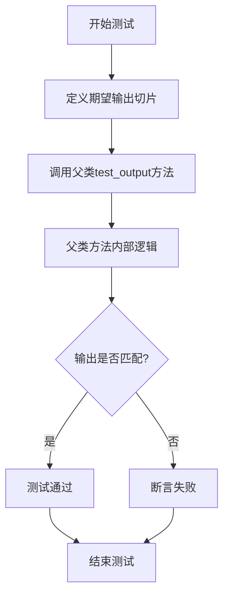
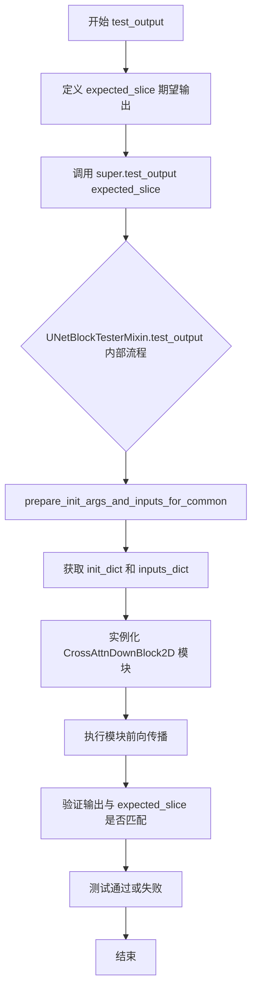
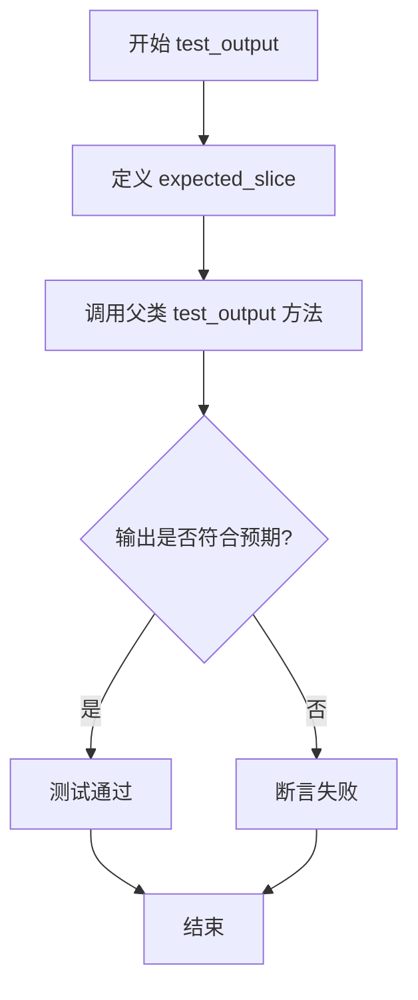
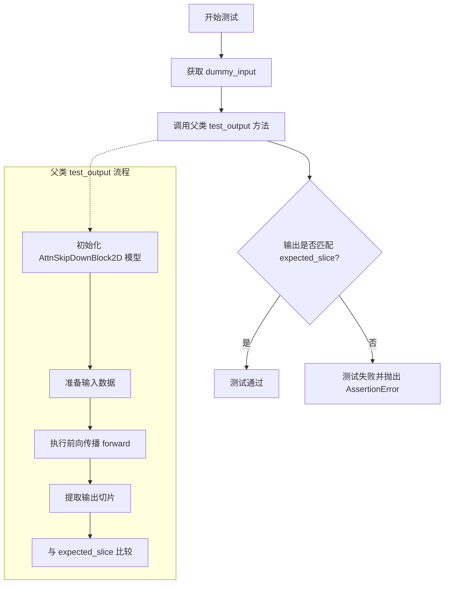
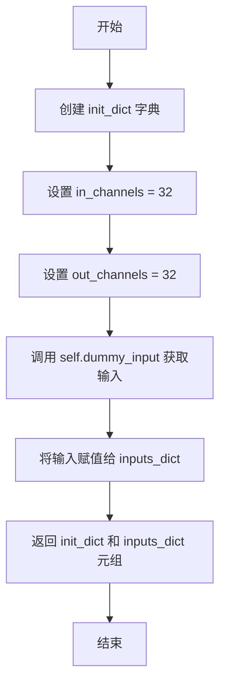

# `diffusers\tests\models\unets\test_unet_2d_blocks.py` 详细设计文档

这是一个针对Diffusers库中UNet 2D块（DownBlock、UpBlock、MidBlock及其变体）的单元测试文件，测试了各种下采样块、上采样块、编码器块、解码器块以及带注意力机制和跳跃连接的块的输出正确性。

## 整体流程

```mermaid
graph TD
    A[开始] --> B[导入依赖模块]
    B --> C[导入UNetBlockTesterMixin]
    B --> D[导入UNet 2D块类]
    D --> E[定义DownBlock2DTests]
    D --> F[定义ResnetDownsampleBlock2DTests]
    D --> G[定义AttnDownBlock2DTests]
    D --> H[定义CrossAttnDownBlock2DTests]
    D --> I[定义SimpleCrossAttnDownBlock2DTests]
    D --> J[定义SkipDownBlock2DTests]
    D --> K[定义AttnSkipDownBlock2DTests]
    D --> L[定义DownEncoderBlock2DTests]
    D --> M[定义AttnDownEncoderBlock2DTests]
    D --> N[定义UNetMidBlock2DTests]
    D --> O[定义UNetMidBlock2DCrossAttnTests]
    D --> P[定义UNetMidBlock2DSimpleCrossAttnTests]
    D --> Q[定义UpBlock2DTests]
    D --> R[定义ResnetUpsampleBlock2DTests]
    D --> S[定义CrossAttnUpBlock2DTests]
    D --> T[定义SimpleCrossAttnUpBlock2DTests]
    D --> U[定义AttnUpBlock2DTests]
    D --> V[定义SkipUpBlock2DTests]
    D --> W[定义AttnSkipUpBlock2DTests]
    D --> X[定义UpDecoderBlock2DTests]
    D --> Y[定义AttnUpDecoderBlock2DTests]
```



## 类结构

```
UNetBlockTesterMixin (测试混入类)
├── DownBlock2DTests
│   └── test_output()
├── ResnetDownsampleBlock2DTests
├── AttnDownBlock2DTests
├── CrossAttnDownBlock2DTests
├── SimpleCrossAttnDownBlock2DTests
├── SkipDownBlock2DTests
├── AttnSkipDownBlock2DTests
├── DownEncoderBlock2DTests
├── AttnDownEncoderBlock2DTests
├── UNetMidBlock2DTests
├── UNetMidBlock2DCrossAttnTests
├── UNetMidBlock2DSimpleCrossAttnTests
├── UpBlock2DTests
├── ResnetUpsampleBlock2DTests
├── CrossAttnUpBlock2DTests
├── SimpleCrossAttnUpBlock2DTests
├── AttnUpBlock2DTests
├── SkipUpBlock2DTests
├── AttnSkipUpBlock2DTests
├── UpDecoderBlock2DTests
└── AttnUpDecoderBlock2DTests
```

## 全局变量及字段


### `DownBlock2DTests.block_class`
    
The UNet block class being tested (e.g., DownBlock2D, CrossAttnUpBlock2D, etc.)

类型：`type`
    


### `DownBlock2DTests.block_type`
    
The type of UNet block indicating its position: 'up', 'down', or 'mid'

类型：`str`
    


### `ResnetDownsampleBlock2DTests.block_class`
    
The UNet block class being tested (e.g., DownBlock2D, CrossAttnUpBlock2D, etc.)

类型：`type`
    


### `ResnetDownsampleBlock2DTests.block_type`
    
The type of UNet block indicating its position: 'up', 'down', or 'mid'

类型：`str`
    


### `AttnDownBlock2DTests.block_class`
    
The UNet block class being tested (e.g., DownBlock2D, CrossAttnUpBlock2D, etc.)

类型：`type`
    


### `AttnDownBlock2DTests.block_type`
    
The type of UNet block indicating its position: 'up', 'down', or 'mid'

类型：`str`
    


### `CrossAttnDownBlock2DTests.block_class`
    
The UNet block class being tested (e.g., DownBlock2D, CrossAttnUpBlock2D, etc.)

类型：`type`
    


### `CrossAttnDownBlock2DTests.block_type`
    
The type of UNet block indicating its position: 'up', 'down', or 'mid'

类型：`str`
    


### `SimpleCrossAttnDownBlock2DTests.block_class`
    
The UNet block class being tested (e.g., DownBlock2D, CrossAttnUpBlock2D, etc.)

类型：`type`
    


### `SimpleCrossAttnDownBlock2DTests.block_type`
    
The type of UNet block indicating its position: 'up', 'down', or 'mid'

类型：`str`
    


### `SkipDownBlock2DTests.block_class`
    
The UNet block class being tested (e.g., DownBlock2D, CrossAttnUpBlock2D, etc.)

类型：`type`
    


### `SkipDownBlock2DTests.block_type`
    
The type of UNet block indicating its position: 'up', 'down', or 'mid'

类型：`str`
    


### `AttnSkipDownBlock2DTests.block_class`
    
The UNet block class being tested (e.g., DownBlock2D, CrossAttnUpBlock2D, etc.)

类型：`type`
    


### `AttnSkipDownBlock2DTests.block_type`
    
The type of UNet block indicating its position: 'up', 'down', or 'mid'

类型：`str`
    


### `DownEncoderBlock2DTests.block_class`
    
The UNet block class being tested (e.g., DownBlock2D, CrossAttnUpBlock2D, etc.)

类型：`type`
    


### `DownEncoderBlock2DTests.block_type`
    
The type of UNet block indicating its position: 'up', 'down', or 'mid'

类型：`str`
    


### `AttnDownEncoderBlock2DTests.block_class`
    
The UNet block class being tested (e.g., DownBlock2D, CrossAttnUpBlock2D, etc.)

类型：`type`
    


### `AttnDownEncoderBlock2DTests.block_type`
    
The type of UNet block indicating its position: 'up', 'down', or 'mid'

类型：`str`
    


### `UNetMidBlock2DTests.block_class`
    
The UNet block class being tested (e.g., DownBlock2D, CrossAttnUpBlock2D, etc.)

类型：`type`
    


### `UNetMidBlock2DTests.block_type`
    
The type of UNet block indicating its position: 'up', 'down', or 'mid'

类型：`str`
    


### `UNetMidBlock2DCrossAttnTests.block_class`
    
The UNet block class being tested (e.g., DownBlock2D, CrossAttnUpBlock2D, etc.)

类型：`type`
    


### `UNetMidBlock2DCrossAttnTests.block_type`
    
The type of UNet block indicating its position: 'up', 'down', or 'mid'

类型：`str`
    


### `UNetMidBlock2DSimpleCrossAttnTests.block_class`
    
The UNet block class being tested (e.g., DownBlock2D, CrossAttnUpBlock2D, etc.)

类型：`type`
    


### `UNetMidBlock2DSimpleCrossAttnTests.block_type`
    
The type of UNet block indicating its position: 'up', 'down', or 'mid'

类型：`str`
    


### `UpBlock2DTests.block_class`
    
The UNet block class being tested (e.g., DownBlock2D, CrossAttnUpBlock2D, etc.)

类型：`type`
    


### `UpBlock2DTests.block_type`
    
The type of UNet block indicating its position: 'up', 'down', or 'mid'

类型：`str`
    


### `ResnetUpsampleBlock2DTests.block_class`
    
The UNet block class being tested (e.g., DownBlock2D, CrossAttnUpBlock2D, etc.)

类型：`type`
    


### `ResnetUpsampleBlock2DTests.block_type`
    
The type of UNet block indicating its position: 'up', 'down', or 'mid'

类型：`str`
    


### `CrossAttnUpBlock2DTests.block_class`
    
The UNet block class being tested (e.g., DownBlock2D, CrossAttnUpBlock2D, etc.)

类型：`type`
    


### `CrossAttnUpBlock2DTests.block_type`
    
The type of UNet block indicating its position: 'up', 'down', or 'mid'

类型：`str`
    


### `SimpleCrossAttnUpBlock2DTests.block_class`
    
The UNet block class being tested (e.g., DownBlock2D, CrossAttnUpBlock2D, etc.)

类型：`type`
    


### `SimpleCrossAttnUpBlock2DTests.block_type`
    
The type of UNet block indicating its position: 'up', 'down', or 'mid'

类型：`str`
    


### `AttnUpBlock2DTests.block_class`
    
The UNet block class being tested (e.g., DownBlock2D, CrossAttnUpBlock2D, etc.)

类型：`type`
    


### `AttnUpBlock2DTests.block_type`
    
The type of UNet block indicating its position: 'up', 'down', or 'mid'

类型：`str`
    


### `SkipUpBlock2DTests.block_class`
    
The UNet block class being tested (e.g., DownBlock2D, CrossAttnUpBlock2D, etc.)

类型：`type`
    


### `SkipUpBlock2DTests.block_type`
    
The type of UNet block indicating its position: 'up', 'down', or 'mid'

类型：`str`
    


### `AttnSkipUpBlock2DTests.block_class`
    
The UNet block class being tested (e.g., DownBlock2D, CrossAttnUpBlock2D, etc.)

类型：`type`
    


### `AttnSkipUpBlock2DTests.block_type`
    
The type of UNet block indicating its position: 'up', 'down', or 'mid'

类型：`str`
    


### `UpDecoderBlock2DTests.block_class`
    
The UNet block class being tested (e.g., DownBlock2D, CrossAttnUpBlock2D, etc.)

类型：`type`
    


### `UpDecoderBlock2DTests.block_type`
    
The type of UNet block indicating its position: 'up', 'down', or 'mid'

类型：`str`
    


### `AttnUpDecoderBlock2DTests.block_class`
    
The UNet block class being tested (e.g., DownBlock2D, CrossAttnUpBlock2D, etc.)

类型：`type`
    


### `AttnUpDecoderBlock2DTests.block_type`
    
The type of UNet block indicating its position: 'up', 'down', or 'mid'

类型：`str`
    
    

## 全局函数及方法


### `DownBlock2DTests.test_output`

该方法用于测试 `DownBlock2D` 类的输出是否符合预期的数值范围，通过定义期望的输出切片并调用父类的测试方法进行验证。

参数：

- `self`：隐式参数，`DownBlock2DTests` 类的实例，无需额外描述

返回值：无显式返回值（`None`），该方法通过调用父类 `UNetBlockTesterMixin.test_output()` 方法进行测试验证，若测试失败则抛出 `AssertionError`

#### 流程图

```mermaid
flowchart TD
    A[开始 test_output] --> B[定义 expected_slice]
    B --> C[调用 super().test_output]
    C --> D{父类测试是否通过}
    D -->|通过| E[测试通过]
    D -->|失败| F[抛出 AssertionError]
```

#### 带注释源码

```python
def test_output(self):
    """
    测试 DownBlock2D 类的输出是否符合预期数值范围
    
    该方法继承自 UNetBlockTesterMixin 测试混入类，
    用于验证 DownBlock2D 模块在给定输入下的前向传播输出
    """
    # 定义期望的输出切片，用于与实际输出进行比对
    # 这些数值是 DownBlock2D 在标准配置下的预期输出值
    expected_slice = [-0.0232, -0.9869, 0.8054, -0.0637, -0.1688, -1.4264, 0.4470, -1.3394, 0.0904]
    
    # 调用父类的 test_output 方法进行实际验证
    # 父类方法会创建 DownBlock2D 实例，执行前向传播，
    # 并将实际输出与 expected_slice 进行比对
    super().test_output(expected_slice)
```


### `ResnetDownsampleBlock2DTests.test_output`

该测试方法用于验证 `ResnetDownsampleBlock2D` 模块的输出是否与预期的数值切片相匹配，通过调用父类的 `test_output` 方法执行通用的输出验证逻辑。

参数：

- `self`：测试类实例，无需显式传递

返回值：`None`，该方法为测试方法，通过断言验证输出，不返回任何值

#### 流程图



#### 带注释源码

```python
def test_output(self):
    """
    测试 ResnetDownsampleBlock2D 模块的输出是否符合预期
    
    该测试方法继承自 UNetBlockTesterMixin 混入类，
    通过对比实际输出与预设的期望切片值来验证模型正确性
    """
    # 定义期望的输出数值切片（共9个浮点数值）
    # 这些数值是通过预先运行模型并捕获正确输出得到的基准值
    expected_slice = [
        0.0710,   # 输出张量第0个位置的期望值
        0.2410,   # 输出张量第1个位置的期望值
        -0.7320,  # 输出张量第2个位置的期望值
        -1.0757,  # 输出张量第3个位置的期望值
        -1.1343,  # 输出张量第4个位置的期望值
        0.3540,   # 输出张量第5个位置的期望值
        -0.0133,  # 输出张量第6个位置的期望值
        -0.2576,  # 输出张量第7个位置的期望值
        0.0948    # 输出张量第8个位置的期望值
    ]
    
    # 调用父类 UNetBlockTesterMixin 的 test_output 方法
    # 父类方法会：
    # 1. 根据 block_class (ResnetDownsampleBlock2D) 创建模型实例
    # 2. 准备测试输入（来自 get_dummy_input 方法）
    # 3. 执行前向传播获取实际输出
    # 4. 将输出与 expected_slice 进行比对
    # 5. 使用 assert 验证数值是否在容差范围内
    super().test_output(expected_slice)
```


### `AttnDownBlock2DTests.test_output`

该方法是 `AttnDownBlock2D` 类的单元测试，用于验证 `AttnDownBlock2D` 模块的输出是否符合预期的数值切片。通过调用父类 `UNetBlockTesterMixin` 的 `test_output` 方法，使用预设的期望值 `[0.0636, 0.8964, -0.6234, -1.0131, 0.0844, 0.4935, 0.3437, 0.0911, -0.2957]` 进行输出验证，确保该下采样注意力块在给定输入下能产生正确的数值结果。

参数：

- 该方法无显式参数（继承自父类的测试框架）

返回值：`None`，该方法为 `void` 类型，执行测试断言而非返回具体数值

#### 流程图

```mermaid
flowchart TD
    A[开始 test_output] --> B[定义期望输出切片 expected_slice]
    B --> C[调用 super().test_output 传入 expected_slice]
    C --> D{父类 test_output 执行}
    D -->|初始化 AttnDownBlock2D| E[创建块实例]
    E --> F[获取虚拟输入 dummy_input]
    F --> G[执行 forward 方法]
    G --> H[提取输出特征图]
    H --> I[与 expected_slice 对比]
    I -->|数值匹配| J[测试通过]
    I -->|数值不匹配| K[测试失败]
    J --> L[返回 None]
    K --> L
```

#### 带注释源码

```python
class AttnDownBlock2DTests(UNetBlockTesterMixin, unittest.TestCase):
    """
    AttnDownBlock2D 的单元测试类
    继承自 UNetBlockTesterMixin 混入类和 unittest.TestCase 测试基类
    """
    block_class = AttnDownBlock2D  # noqa F405  # 待测试的块类
    block_type = "down"  # 块类型标识符

    def test_output(self):
        """
        测试 AttnDownBlock2D 的输出数值是否符合预期
        
        该方法通过以下步骤验证块的正确性：
        1. 定义期望的输出切片值（来自基准测试/黄金数据）
        2. 调用父类的 test_output 方法执行完整测试流程
        """
        # 期望的输出数值切片（9个元素的1D张量）
        expected_slice = [0.0636, 0.8964, -0.6234, -1.0131, 0.0844, 0.4935, 0.3437, 0.0911, -0.2957]
        # 调用父类测试方法，将期望值传递给父类进行验证
        super().test_output(expected_slice)
```


### `CrossAttnDownBlock2DTests.prepare_init_args_and_inputs_for_common`

该方法是测试类`CrossAttnDownBlock2DTests`中用于准备初始化参数和测试输入数据的成员方法，通过调用父类方法获取基础配置，并额外添加`cross_attention_dim`参数以支持交叉注意力机制。

参数：

- `self`：隐式参数，`CrossAttnDownBlock2DTests`实例对象，代表测试类本身

返回值：`Tuple[Dict, Dict]`，返回包含初始化参数字典和测试输入字典的元组，其中初始化参数字典包含父类基础参数以及新增的`cross_attention_dim=32`，输入字典来自父类方法。

#### 流程图

```mermaid
flowchart TD
    A[开始执行 prepare_init_args_and_inputs_for_common] --> B[调用父类方法 super().prepare_init_args_and_inputs_for_common]
    B --> C[获取父类返回的 init_dict 和 inputs_dict]
    C --> D[向 init_dict 中添加键值对: cross_attention_dim = 32]
    D --> E[返回更新后的 init_dict 和 inputs_dict 元组]
    E --> F[结束执行]
```

#### 带注释源码

```python
def prepare_init_args_and_inputs_for_common(self):
    """
    准备并返回用于通用测试的初始化参数和输入数据。
    
    该方法重写了父类 UNetBlockTesterMixin 的同名方法，为 CrossAttnDownBlock2D
    测试类添加交叉注意力维度参数。
    
    Returns:
        Tuple[Dict, Dict]: 包含以下两个元素的元组:
            - init_dict: 初始化参数字典，包含模型构造所需的所有参数
            - inputs_dict: 测试输入数据字典，包含样本输入张量等
    """
    # 调用父类的同名方法，获取基础初始化参数和输入数据
    # 父类方法返回 (init_dict, inputs_dict) 元组
    init_dict, inputs_dict = super().prepare_init_args_and_inputs_for_common()
    
    # 在初始化参数字典中添加交叉注意力维度参数
    # 交叉注意力维度是 CrossAttnDownBlock2D 类进行交叉注意力计算所必需的参数
    # 设置为 32 与测试用例中的期望输出一致
    init_dict["cross_attention_dim"] = 32
    
    # 返回更新后的初始化参数字典和输入字典
    return init_dict, inputs_dict
```


### `CrossAttnDownBlock2DTests.test_output`

该测试方法用于验证 `CrossAttnDownBlock2D` 模块的输出是否符合预期的数值切片，通过调用父类的测试方法完成前向传播和输出验证。

参数：
- `self`：隐式参数，`CrossAttnDownBlock2DTests` 类的实例

返回值：`None`（无返回值），该方法通过调用父类 `UNetBlockTesterMixin.test_output` 进行验证

#### 流程图



#### 带注释源码

```python
def test_output(self):
    """
    测试 CrossAttnDownBlock2D 模块的输出是否符合预期数值范围
    
    该方法继承自 UNetBlockTesterMixin，通过以下步骤进行测试：
    1. 调用 prepare_init_args_and_inputs_for_common 获取初始化参数和输入
    2. 实例化 CrossAttnDownBlock2D 模块
    3. 执行前向传播
    4. 验证输出与预期的数值切片是否匹配
    """
    # 定义期望的输出数值切片，用于验证模块输出的正确性
    # 这些数值是经过预先计算和验证的参考输出
    expected_slice = [0.2238, -0.7396, -0.2255, -0.3829, 0.1925, 1.1665, 0.0603, -0.7295, 0.1983]
    
    # 调用父类 UNetBlockTesterMixin 的 test_output 方法执行实际的测试逻辑
    # 父类方法会完成模块初始化、前向传播和输出验证的全过程
    super().test_output(expected_slice)
```


### `SimpleCrossAttnDownBlock2DTests.dummy_input`

该属性方法用于获取 `SimpleCrossAttnDownBlock2D` 测试类的虚拟输入数据，通过调用父类的 `get_dummy_input` 方法并传入 `include_encoder_hidden_states=True` 参数，以生成包含跨注意力机制所需的 encoder_hidden_states（编码器隐藏状态）的测试输入字典。

参数：

- `self`：隐式参数，指向类实例本身，无需显式传递

返回值：`Dict[str, Any]`，返回一个包含测试所需输入数据的字典，其中包含 `sample`（输入样本）、`temb`（时间嵌入）以及 `encoder_hidden_states`（编码器隐藏状态，用于跨注意力机制）等键值对。

#### 流程图

```mermaid
flowchart TD
    A[开始访问 dummy_input 属性] --> B{检查是否使用缓存}
    B -->|否| C[调用 super().get_dummy_input]
    C --> D[传入 include_encoder_hidden_states=True]
    D --> E[父类 UNetBlockTesterMixin.get_dummy_input]
    E --> F[生成包含 encoder_hidden_states 的输入字典]
    F --> G[返回输入字典]
    B -->|是| G
```

#### 带注释源码

```python
@property
def dummy_input(self):
    """
    获取测试用的虚拟输入数据。
    
    该属性覆盖父类方法，专门为 SimpleCrossAttnDownBlock2D 测试类生成
    包含跨注意力机制所需的 encoder_hidden_states（编码器隐藏状态）的输入。
    
    Returns:
        返回一个字典，包含以下键值对：
        - sample: 输入张量，形状为 (batch_size, channels, height, width)
        - temb: 时间嵌入向量，形状为 (batch_size, temb_channels)
        - encoder_hidden_states: 编码器隐藏状态，用于跨注意力计算
    """
    # 调用父类 UNetBlockTesterMixin 的 get_dummy_input 方法
    # include_encoder_hidden_states=True 表示生成的输入需包含 encoder_hidden_states
    # 这是测试 SimpleCrossAttnDownBlock2D（简单跨注意力下采样块）所必需的
    return super().get_dummy_input(include_encoder_hidden_states=True)
```


### `SimpleCrossAttnDownBlock2DTests.prepare_init_args_and_inputs_for_common`

该方法是 `SimpleCrossAttnDownBlock2DTests` 测试类的成员方法，用于准备测试所需的初始化参数和输入数据。它通过调用父类方法获取基础参数，并额外添加 `cross_attention_dim` 参数以支持交叉注意力机制的下采样块测试。

**注意**：由于该方法继承自 `UNetBlockTesterMixin`，其完整的参数定义需参考父类的实现。此处仅展示当前类中重写的部分。

参数：
-  无显式参数（隐式接收 `self`）
-  内部通过 `super().prepare_init_args_and_inputs_for_common()` 调用父类方法获取参数

返回值：
-  `Tuple[Dict, Dict]`：返回包含初始化参数字典和输入字典的元组
  - `init_dict`：包含模型初始化参数的字典，已添加 `cross_attention_dim=32`
  - `inputs_dict`：包含测试输入数据的字典

#### 流程图

```mermaid
flowchart TD
    A[开始] --> B[调用父类方法 prepare_init_args_and_inputs_for_common]
    B --> C[获取 init_dict 和 inputs_dict]
    C --> D[向 init_dict 添加 cross_attention_dim=32]
    D --> E[返回 (init_dict, inputs_dict) 元组]
    E --> F[结束]
```

#### 带注释源码

```python
def prepare_init_args_and_inputs_for_common(self):
    """
    准备测试所需的初始化参数和输入数据。
    
    该方法重写了父类方法，为 SimpleCrossAttnDownBlock2D 测试添加
    cross_attention_dim 参数，以支持交叉注意力机制的下采样块测试。
    
    Returns:
        Tuple[Dict, Dict]: 包含初始化参数字典和输入字典的元组
            - init_dict: 模型初始化参数，包含新增的 cross_attention_dim=32
            - inputs_dict: 测试输入数据
    """
    # 调用父类方法获取基础初始化参数和输入数据
    # 父类 UNetBlockTesterMixin.prepare_init_args_and_inputs_for_common() 
    # 会根据类属性 block_class 和 block_type 生成默认参数
    init_dict, inputs_dict = super().prepare_init_args_and_inputs_for_common()
    
    # 添加交叉注意力维度参数，这是 SimpleCrossAttnDownBlock2D 需要的特殊参数
    # 用于指定交叉注意力机制中 encoder_hidden_states 的维度
    init_dict["cross_attention_dim"] = 32
    
    # 返回修改后的初始化参数和输入数据
    return init_dict, inputs_dict
```

#### 上下文补充信息

**所属类信息**：
- 类名：`SimpleCrossAttnDownBlock2DTests`
- 继承自：`UNetBlockTesterMixin`, `unittest.TestCase`
- 测试目标：`SimpleCrossAttnDownBlock2D`（带简单交叉注意力机制的下采样块）

**相关属性**：
- `block_class = SimpleCrossAttnDownBlock2D`：被测试的模型类
- `block_type = "down"`：块类型标识

**设计意图**：
该方法是测试框架中常见的"准备测试数据"模式，通过重写父类方法来定制特定测试用例所需的参数。这种设计允许测试类复用通用逻辑，同时保留灵活性以适应不同模块的特定需求。


### `SimpleCrossAttnDownBlock2DTests.test_output`

该方法是 `SimpleCrossAttnDownBlock2DTests` 测试类中的测试方法，用于验证 `SimpleCrossAttnDownBlock2D` 类的输出是否与预期的张量切片值匹配。

参数：

- 该方法没有显式参数，但内部调用了 `super().test_output(expected_slice)`

返回值：`None`，该方法继承自 `UNetBlockTesterMixin`，通过断言验证输出，不返回任何值。

#### 流程图

```mermaid
flowchart TD
    A[开始 test_output] --> B[定义 expected_slice]
    B --> C{检查 torch_device 是否为 'mps'}
    C -->|是| D[跳过测试]
    C -->|否| E[调用 super().test_output]
    E --> F[验证模型输出与预期切片匹配]
    F --> G[结束]
```

#### 带注释源码

```python
@unittest.skipIf(torch_device == "mps", "MPS result is not consistent")
def test_output(self):
    """
    测试 SimpleCrossAttnDownBlock2D 类的输出是否与预期值匹配
    
    该方法继承自 UNetBlockTesterMixin，使用预定义的 expected_slice 
    来验证模型前向传播的输出是否在可接受的误差范围内
    """
    # 定义预期的输出张量切片值（9个浮点数）
    expected_slice = [
        0.7921, -0.0992, -0.1962,  # 第一行
        -0.7695, -0.4242, 0.7804,  # 第二行
        0.4737, 0.2765, 0.3338    # 第三行
    ]
    
    # 调用父类的 test_output 方法进行验证
    # 父类会创建 block_class 的实例，执行前向传播，
    # 并检查输出是否与 expected_slice 匹配
    super().test_output(expected_slice)
```


### `SkipDownBlock2DTests.dummy_input`

该属性方法继承自 `UNetBlockTesterMixin`，用于生成测试 `SkipDownBlock2D` 模块所需的虚拟输入数据。通过调用父类的 `get_dummy_input` 方法并设置 `include_skip_sample=True` 参数，返回包含跳跃连接采样输入的测试数据字典。

参数：

- `self`：`SkipDownBlock2DTests`，隐式参数，测试类实例本身

返回值：`dict`，返回包含模型输入的字典，其中包含 `sample`（输入张量）、`timestep`（时间步）、`skip_sample`（跳跃连接采样）等键值对，用于测试 `SkipDownBlock2D` 模块的前向传播。

#### 流程图

```mermaid
flowchart TD
    A[调用 dummy_input 属性] --> B{Property Getter}
    B --> C[调用 super().get_dummy_input]
    C --> D[传入 include_skip_sample=True]
    D --> E[生成包含 skip_sample 的输入字典]
    E --> F[返回测试用虚拟输入 dict]
    
    style A fill:#f9f,color:#333
    style F fill:#9f9,color:#333
```

#### 带注释源码

```python
@property
def dummy_input(self):
    """
    属性方法：生成测试 SkipDownBlock2D 模块的虚拟输入数据
    
    该属性继承自 UNetBlockTesterMixin 测试基类，
    通过调用父类的 get_dummy_input 方法生成测试所需的输入。
    
    参数:
        self: SkipDownBlock2DTests 实例，隐式参数
    
    返回值:
        dict: 包含以下键值的字典:
            - sample: 输入张量 [batch, channels, height, width]
            - timestep: 时间步张量 [batch]
            - skip_sample: 跳跃连接采样张量 [batch, channels, height, width]
    
    说明:
        include_skip_sample=True 参数确保生成的输入数据包含跳跃连接采样，
        这是 SkipDownBlock2D 模块区别于普通 DownBlock2D 的关键特征
    """
    return super().get_dummy_input(include_skip_sample=True)
```


### `SkipDownBlock2DTests.test_output`

该测试方法用于验证 `SkipDownBlock2D` 类在给定输入下的输出是否符合预期的数值切片，通过调用父类 `UNetBlockTesterMixin` 的 `test_output` 方法进行断言验证。

参数：

- `self`：无需显式传递的隐式参数，表示测试类实例本身

返回值：无显式返回值（`None`），通过父类方法内部进行断言验证

#### 流程图



#### 带注释源码

```python
class SkipDownBlock2DTests(UNetBlockTesterMixin, unittest.TestCase):
    """
    SkipDownBlock2D 的测试类，继承自 UNetBlockTesterMixin 和 unittest.TestCase
    用于验证 UNet 2D 跳跃下采样块的输出正确性
    """
    
    block_class = SkipDownBlock2D  # noqa F405
    block_type = "down"  # 指定为下采样块类型

    @property
    def dummy_input(self):
        """
        获取测试用的虚拟输入数据
        包含 skip_sample 参数以支持跳跃连接输入
        """
        return super().get_dummy_input(include_skip_sample=True)

    def test_output(self):
        """
        测试 SkipDownBlock2D 的前向传播输出
        验证输出张量的数值是否符合预期的切片值
        """
        # 期望的输出数值切片（9个浮点数值）
        expected_slice = [-0.0845, -0.2087, -0.2465, 0.0971, 0.1900, -0.0484, 0.2664, 0.4179, 0.5069]
        # 调用父类的 test_output 方法进行验证
        # 父类方法会执行前向传播并对比输出数值
        super().test_output(expected_slice)
```


### `AttnSkipDownBlock2DTests.dummy_input`

该属性方法用于生成 AttnSkipDownBlock2D 测试类的虚拟输入数据，通过调用父类的 `get_dummy_input` 方法并指定 `include_skip_sample=True` 参数，以获取包含跳跃采样（skip connection）功能的神经网络模块所需的测试输入。

参数：无（该方法为 property 类型，无显式参数）

返回值：`dict`，返回包含测试所需的虚拟输入数据的字典，包括 sample（输入张量）、temb（时间嵌入向量）等关键输入

#### 流程图

```mermaid
flowchart TD
    A[访问 dummy_input 属性] --> B{检查缓存}
    B -->|否| C[调用 super().get_dummy_input]
    C --> D[传入 include_skip_sample=True]
    D --> E[返回包含 skip_sample 的输入字典]
    E --> F[将结果缓存到实例属性]
    F --> G[返回虚拟输入字典]
    
    style A fill:#f9f,stroke:#333
    style E fill:#9f9,stroke:#333
    style G fill:#9f9,stroke:#333
```

#### 带注释源码

```python
class AttnSkipDownBlock2DTests(UNetBlockTesterMixin, unittest.TestCase):
    """
    AttnSkipDownBlock2D 的测试类，继承自 UNetBlockTesterMixin 和 unittest.TestCase
    用于测试带有注意力机制的跳跃下采样块
    """
    
    block_class = AttnSkipDownBlock2D  # noqa F405
    block_type = "down"  # 块类型为下采样块

    @property
    def dummy_input(self):
        """
        生成虚拟测试输入数据的属性方法
        
        该方法覆盖父类的 dummy_input 属性，通过设置 include_skip_sample=True
        来确保生成的输入包含跳跃采样所需的数据（skip_sample）
        
        Returns:
            dict: 包含虚拟输入的字典，键值对包括:
                - sample: 输入张量 [batch, channels, height, width]
                - temb: 时间嵌入向量 [batch, temb_channels]
                - skip_sample: 跳跃采样张量 [batch, skip_channels, height, width]
        """
        # 调用父类的 get_dummy_input 方法，传入 include_skip_sample=True
        # 这会返回一个包含 skip_sample 的输入字典
        return super().get_dummy_input(include_skip_sample=True)

    def test_output(self):
        """
        测试块的输出是否符合预期
        
        使用预定义的 expected_slice 与实际输出进行对比验证
        """
        expected_slice = [0.5539, 0.1609, 0.4924, 0.0537, -0.1995, 0.4050, 0.0979, -0.2721, -0.0642]
        super().test_output(expected_slice)
```


### `AttnSkipDownBlock2DTests.test_output`

该测试方法用于验证 `AttnSkipDownBlock2D` 类的输出是否与预期的数值切片匹配，确保模型在前向传播过程中产生正确的结果。测试通过调用父类的 `test_output` 方法来执行实际的验证逻辑。

参数：

- 该方法无显式参数（参数由继承的 `UNetBlockTesterMixin` 提供，通常包括：隐藏状态样本 `sample`、时间嵌入 `temb`、跳跃连接样本 `skip_sample` 等）

返回值：`无`（该方法为 `void` 类型，执行验证后通过 `unittest` 框架的断言来判断测试是否通过）

#### 流程图



#### 带注释源码

```python
class AttnSkipDownBlock2DTests(UNetBlockTesterMixin, unittest.TestCase):
    """
    AttnSkipDownBlock2D 的单元测试类
    继承自 UNetBlockTesterMixin 和 unittest.TestCase
    """
    block_class = AttnSkipDownBlock2D  # noqa F405  # 要测试的模块类
    block_type = "down"  # 模块类型为下采样模块

    @property
    def dummy_input(self):
        """
        获取虚拟输入数据
        重写父类方法，include_skip_sample=True 表示需要包含跳跃连接样本输入
        """
        return super().get_dummy_input(include_skip_sample=True)

    def test_output(self):
        """
        测试 AttnSkipDownBlock2D 的前向输出
        验证模型输出是否与预期的数值切片匹配
        """
        # 预期的输出数值切片（9个浮点数值）
        expected_slice = [0.5539, 0.1609, 0.4924, 0.0537, -0.1995, 0.4050, 0.0979, -0.2721, -0.0642]
        
        # 调用父类的 test_output 方法进行验证
        # 父类方法会完成：模型初始化 -> 前向传播 -> 输出比对
        super().test_output(expected_slice)
```

#### 关键依赖信息

- **测试基类**：`UNetBlockTesterMixin` - 提供通用的 UNet 模块测试逻辑
- **被测类**：`AttnSkipDownBlock2D` - 带有注意力机制的跳跃连接下采样块
- **预期输出**：`[0.5539, 0.1609, 0.4924, 0.0537, -0.1995, 0.4050, 0.0979, -0.2721, -0.0642]`
- **输入配置**：需要包含 `skip_sample`（跳跃连接样本）

#### 潜在的技术债务或优化空间

1. **魔法数字**：预期输出切片 `expected_slice` 作为硬编码值存储，缺乏对这些数值来源的文档说明
2. **测试隔离性**：测试依赖父类的 `get_dummy_input` 方法，参数不透明
3. **断言信息**：如果测试失败，标准的 `unittest` 断言可能不够直观，建议增强错误信息输出


### `DownEncoderBlock2DTests.dummy_input`

该属性用于获取 `DownEncoderBlock2D` 测试类的虚拟输入数据，通过调用父类的 `get_dummy_input` 方法生成，传入 `include_temb=False` 参数以排除时间嵌入（temb）信息。

参数： 无（这是一个 `@property` 装饰器定义的属性，没有显式参数）

返回值： `Dict`，返回包含测试所需输入数据的字典（调用父类 `get_dummy_input` 方法的结果，具体内容取决于父类 `UNetBlockTesterMixin` 的实现，通常包含 `sample` 等键值对）

#### 流程图

```mermaid
flowchart TD
    A[访问 dummy_input 属性] --> B{调用super().get_dummy_input}
    B --> C[include_temb=False]
    C --> D[返回包含sample等输入数据的字典]
```

#### 带注释源码

```python
@property
def dummy_input(self):
    """
    属性装饰器：将其定义为属性而非方法，使得访问时无需调用括号
    
    返回值说明：
        调用父类的 get_dummy_input 方法，传入 include_temb=False
        表示生成的虚拟输入不包含时间嵌入（temb）信息
    """
    return super().get_dummy_input(include_temb=False)
```


### `DownEncoderBlock2DTests.prepare_init_args_and_inputs_for_common`

该方法为 `DownEncoderBlock2D` 测试类准备初始化参数和输入数据。它创建包含 `in_channels` 和 `out_channels` 的初始化字典，并通过 `dummy_input` 属性获取测试所需的输入张量，用于验证编码器块的前向传播功能。

参数：

- `self`：`DownEncoderBlock2DTests` 类型，表示测试类实例本身，用于访问类属性和方法

返回值：`Tuple[Dict, Any]`，返回元组包含两个元素：
- 第一个元素 `init_dict`：字典类型，包含 `in_channels: 32` 和 `out_channels: 32`，用于初始化 `DownEncoderBlock2D`
- 第二个元素 `inputs_dict`：任意类型，从 `self.dummy_input` 属性获取的测试输入数据

#### 流程图



#### 带注释源码

```python
def prepare_init_args_and_inputs_for_common(self):
    """
    为 DownEncoderBlock2D 测试准备初始化参数和输入数据
    
    该方法重写了父类方法，专门为 DownEncoderBlock2D 编码器块
    配置特定的初始化参数和测试输入。
    """
    # 初始化参数字典，指定编码器块的输入输出通道数
    # 这些参数将用于实例化 DownEncoderBlock2D
    init_dict = {
        "in_channels": 32,    # 输入通道数，设置为32用于测试
        "out_channels": 32,   # 输出通道数，设置为32用于测试
    }
    
    # 从 self.dummy_input 属性获取测试所需的输入张量
    # dummy_input 是通过 get_dummy_input(include_temb=False) 生成的
    # 这里的 include_temb=False 表示不包含时间嵌入向量
    inputs_dict = self.dummy_input
    
    # 返回初始化参数字典和输入字典的元组
    # 供测试框架的 setup 方法使用
    return init_dict, inputs_dict
```


### `DownEncoderBlock2DTests.test_output`

该测试方法用于验证 `DownEncoderBlock2D` 类的输出是否符合预期，通过定义期望的输出切片并调用父类的测试方法来验证模型输出的正确性。

参数：无（继承自 `unittest.TestCase`，`self` 为隐含参数）

返回值：`None`，该方法为测试方法，不返回任何值

#### 流程图

```mermaid
flowchart TD
    A[开始 test_output] --> B[定义 expected_slice 期望输出值]
    B --> C[调用父类 super().test_output 验证输出]
    C --> D[父类方法内部创建模型实例]
    D --> E[传入输入数据进行前向传播]
    E --> F[比较实际输出与期望切片]
    G[断言输出正确性]
    C --> G
    G --> H[结束]
```

#### 带注释源码

```python
class DownEncoderBlock2DTests(UNetBlockTesterMixin, unittest.TestCase):
    """
    DownEncoderBlock2D 的单元测试类，继承自 UNetBlockTesterMixin 和 unittest.TestCase
    用于验证 DownEncoderBlock2D 模块的正确性
    """
    block_class = DownEncoderBlock2D  # noqa F405  # 指定要测试的模块类
    block_type = "down"  # 模块类型为 down（下采样）

    @property
    def dummy_input(self):
        """
        获取测试用的虚拟输入数据
        调用父类方法获取 dummy_input，include_temb=False 表示不包含时间嵌入
        """
        return super().get_dummy_input(include_temb=False)

    def prepare_init_args_and_inputs_for_common(self):
        """
        准备初始化参数和输入数据
        返回包含模型初始化参数字典和输入字典的元组
        """
        init_dict = {
            "in_channels": 32,    # 输入通道数
            "out_channels": 32,  # 输出通道数
        }
        inputs_dict = self.dummy_input  # 使用上面定义的虚拟输入
        return init_dict, inputs_dict

    def test_output(self):
        """
        测试方法：验证 DownEncoderBlock2D 的输出是否符合预期
        定义期望的输出切片值，然后调用父类的 test_output 方法进行验证
        """
        # 期望的输出切片值，用于验证模型输出的正确性
        expected_slice = [1.1102, 0.5302, 0.4872, -0.0023, -0.8042, 0.0483, -0.3489, -0.5632, 0.7626]
        # 调用父类的 test_output 方法进行实际验证
        super().test_output(expected_slice)
```


### `AttnDownEncoderBlock2DTests.dummy_input`

该属性用于获取 `AttnDownEncoderBlock2D` 测试类的虚拟输入数据，通过调用父类的 `get_dummy_input` 方法生成，但不包括时间嵌入（temb）信息。

参数：无

返回值：`dict`，包含测试所需的虚拟输入数据字典，具体包含 `sample`（输入样本张量）等键值对。

#### 流程图

```mermaid
flowchart TD
    A[访问 dummy_input 属性] --> B[调用 super().get_dummy_input]
    B --> C[传入 include_temb=False 参数]
    C --> D[父类 UNetBlockTesterMixin.get_dummy_input 执行]
    D --> E[生成包含 sample 等键的字典]
    E --> F[返回虚拟输入字典]
```

#### 带注释源码

```python
@property
def dummy_input(self):
    """
    获取测试用的虚拟输入数据。
    
    该属性覆盖父类方法，调用 get_dummy_input 并设置 include_temb=False，
    表示生成的虚拟输入不包含时间嵌入（temb）信息。
    这适用于 DownEncoderBlock2D 这类不需要时间嵌入的编码器块测试。
    
    Returns:
        dict: 包含虚拟输入数据的字典，通常包含 'sample' 键对应的张量。
    """
    return super().get_dummy_input(include_temb=False)
```


### `AttnDownEncoderBlock2DTests.prepare_init_args_and_inputs_for_common`

该方法用于为 `AttnDownEncoderBlock2D` 测试类准备初始化参数和测试输入数据，返回包含模型初始化配置字典和输入张量字典的元组。

参数：

- `self`：隐式参数，类型为 `AttnDownEncoderBlock2DTests`，表示测试类实例本身

返回值：`Tuple[Dict, Dict]`，返回两个字典组成的元组 - 第一个字典包含模型初始化参数（`in_channels` 和 `out_channels`），第二个字典包含测试输入数据

#### 流程图

```mermaid
flowchart TD
    A[开始] --> B[创建 init_dict 字典]
    B --> C[设置 in_channels: 32]
    C --> D[设置 out_channels: 32]
    D --> E[获取 inputs_dict = self.dummy_input]
    E --> F[返回 (init_dict, inputs_dict) 元组]
    F --> G[结束]
```

#### 带注释源码

```python
def prepare_init_args_and_inputs_for_common(self):
    """
    准备用于测试 AttnDownEncoderBlock2D 的初始化参数和输入数据
    
    该方法重写了父类方法，为注意力下采样编码器块提供特定的测试配置
    """
    # 定义模型初始化参数字典，指定输入输出通道数
    init_dict = {
        "in_channels": 32,    # 输入通道数，匹配测试张量的通道维度
        "out_channels": 32,  # 输出通道数，与输入通道数相同
    }
    
    # 获取测试输入数据，通过 dummy_input 属性获取虚拟输入张量
    # include_temb=False 表示不包含时间嵌入（temb）输入
    inputs_dict = self.dummy_input
    
    # 返回初始化参数和输入字典的元组，供测试框架使用
    return init_dict, inputs_dict
```


### `AttnDownEncoderBlock2DTests.test_output`

这是一个单元测试方法，用于测试 `AttnDownEncoderBlock2D` 类的输出是否符合预期。该方法定义了期望的输出切片值 `[0.8966, -0.1486, 0.8568, 0.8141, -0.9046, -0.1342, -0.0972, -0.7417, 0.1538]`，并调用父类的 `test_output` 方法进行验证。

参数：

- 无显式参数（但隐式使用 `self` 引用测试类实例）

返回值：`None`，该方法通过调用父类的 `test_output` 方法进行断言验证，不返回任何值。

#### 流程图

```mermaid
graph TD
    A[开始 test_output] --> B[定义 expected_slice]
    B --> C[调用 super().test_output(expected_slice)]
    C --> D[父类执行断言验证]
    D --> E[结束]
```

#### 带注释源码

```python
def test_output(self):
    """
    测试 AttnDownEncoderBlock2D 类的输出是否符合预期。
    
    该方法重写了父类的 test_output 方法，
    用于针对特定的 DownEncoder 块类型设置期望的输出值。
    """
    # 定义期望的输出切片值，用于验证模型输出
    # 这些值是针对特定输入配置计算得到的基准值
    expected_slice = [0.8966, -0.1486, 0.8568, 0.8141, -0.9046, -0.1342, -0.0972, -0.7417, 0.1538]
    
    # 调用父类的 test_output 方法进行实际的验证
    # 父类 UNetBlockTesterMixin.test_output 会执行前向传播并比对输出
    super().test_output(expected_slice)
```


### `UNetMidBlock2DTests.prepare_init_args_and_inputs_for_common`

该方法是 `UNetMidBlock2DTests` 测试类的核心方法，用于准备 UNetMidBlock2D 模块的初始化参数和测试输入数据。它创建包含 `in_channels` 和 `temb_channels` 的初始化字典，并获取虚拟输入用于后续的单元测试验证。

参数：

- `self`：`UNetMidBlock2DTests` 实例，隐含参数，表示测试类本身

返回值：`tuple[dict, dict]`，返回包含初始化参数字典和测试输入字典的元组

- `init_dict`：`dict`，包含模块初始化所需的参数字典，包含 `in_channels`（输入通道数，值为 32）和 `temb_channels`（时间嵌入通道数，值为 128）
- `inputs_dict`：`dict`，通过 `self.dummy_input` 获取的虚拟输入数据，用于测试模块的前向传播

#### 流程图

```mermaid
flowchart TD
    A[开始] --> B[创建 init_dict 字典]
    B --> C[设置 in_channels: 32]
    C --> D[设置 temb_channels: 128]
    D --> E[获取 inputs_dict = self.dummy_input]
    E --> F[返回 (init_dict, inputs_dict) 元组]
```

#### 带注释源码

```python
def prepare_init_args_and_inputs_for_common(self):
    """
    准备 UNetMidBlock2D 模块的初始化参数和测试输入数据
    
    该方法重写了父类方法，为 UNetMidBlock2D 测试用例设置特定的
    初始化参数，包括输入通道数和时间嵌入通道数
    """
    # 定义初始化参数字典
    init_dict = {
        "in_channels": 32,      # 输入特征通道数
        "temb_channels": 128,   # 时间嵌入（temporal embedding）通道数
    }
    # 获取虚拟输入数据（从父类继承的 dummy_input 属性）
    inputs_dict = self.dummy_input
    # 返回初始化参数和输入字典的元组
    return init_dict, inputs_dict
```


### `UNetMidBlock2DTests.test_output`

该方法是 `UNetMidBlock2D` 类的单元测试，用于验证 UNet 中间块（mid block）的输出是否与预期值匹配。它通过调用父类的 `test_output` 方法，传入期望的输出切片来执行断言验证。

参数：

- `self`：隐式参数，类型为 `UNetMidBlock2DTests`，表示测试类实例本身，无额外描述

返回值：`None`，该方法为测试用例，无返回值，通过断言验证输出正确性

#### 流程图

```mermaid
flowchart TD
    A[开始 test_output] --> B[定义 expected_slice]
    B --> C[调用 super().test_output]
    C --> D[父类创建 UNetMidBlock2D 实例]
    D --> E[执行前向传播]
    E --> F[获取输出张量]
    F --> G[提取 expected_slice 对应位置的值]
    G --> H{输出值是否匹配?}
    H -->|是| I[测试通过]
    H -->|否| J[抛出 AssertionError]
    I --> K[结束]
    J --> K
```

#### 带注释源码

```python
def test_output(self):
    """
    测试 UNetMidBlock2D 的输出是否符合预期
    
    该方法继承自 UNetBlockTesterMixin，通过与父类协同工作来验证
    UNetMidBlock2D 模块的前向传播输出是否在容差范围内匹配预期值。
    """
    # 定义期望的输出切片值（9个浮点数）
    # 这些值是通过预先运行模型并记录的预期输出
    expected_slice = [-0.1062, 1.7248, 0.3494, 1.4569, -0.0910, -1.2421, -0.9984, 0.6736, 1.0028]
    
    # 调用父类的 test_output 方法进行验证
    # 父类会完成以下工作：
    # 1. 根据 prepare_init_args_and_inputs_for_common 返回的参数初始化模型
    # 2. 准备输入数据（dummy_input）
    # 3. 执行前向传播
    # 4. 提取输出切片并与 expected_slice 进行比较
    # 5. 使用 assertTrue 或类似的断言验证两者是否接近（容差范围内）
    super().test_output(expected_slice)
```


### `UNetMidBlock2DCrossAttnTests.prepare_init_args_and_inputs_for_common`

该方法为 `UNetMidBlock2DCrossAttn` 测试类准备初始化参数和输入数据。它首先调用父类的同名方法获取基础配置，然后添加交叉注意力维度（cross_attention_dim=32）参数，以支持跨注意力块的测试场景。

参数：

- `self`：测试类实例本身，无显式参数

返回值：`Tuple[Dict, Dict]`，返回一个元组，包含：
- `init_dict`：字典，初始化参数配置
- `inputs_dict`：字典，输入数据配置

#### 流程图

```mermaid
flowchart TD
    A[开始] --> B[调用父类 prepare_init_args_and_inputs_for_common]
    B --> C[获取 init_dict 和 inputs_dict]
    C --> D[在 init_dict 中设置 cross_attention_dim = 32]
    D --> E[返回 (init_dict, inputs_dict)]
    E --> F[结束]
```

#### 带注释源码

```python
def prepare_init_args_and_inputs_for_common(self):
    """
    为 UNetMidBlock2DCrossAttn 测试准备初始化参数和输入数据。
    该方法重写父类方法，添加 cross_attention_dim 参数以支持交叉注意力机制。
    
    Returns:
        Tuple[Dict, Dict]: 包含初始化字典和输入字典的元组
    """
    # 调用父类方法获取基础初始化参数和输入数据
    # 父类 UNetBlockTesterMixin.prepare_init_args_and_inputs_for_common()
    # 会返回包含 in_channels, temb_channels 等基础参数的 init_dict
    init_dict, inputs_dict = super().prepare_init_args_and_inputs_for_common()
    
    # 在初始化参数字典中添加交叉注意力维度参数
    # 值为 32，表示交叉注意力机制使用的上下文向量维度
    # 这是 UNetMidBlock2DCrossAttn 块区别于普通 UNetMidBlock2D 的关键参数
    init_dict["cross_attention_dim"] = 32
    
    # 返回修改后的初始化参数字典和原始输入字典
    # init_dict: 包含 in_channels, temb_channels, cross_attention_dim 等
    # inputs_dict: 包含 dummy_input 等测试输入数据
    return init_dict, inputs_dict
```


### `UNetMidBlock2DTests.test_output`

该方法是 UNetMidBlock2D 类的单元测试，用于验证 UNet 中间块（Mid Block）的输出是否与预期值匹配。

参数：
- 无直接参数（通过类属性 `dummy_input` 和 `prepare_init_args_and_inputs_for_common` 方法提供测试所需数据）

返回值：`None`，通过 `unittest.TestCase` 的断言机制验证输出正确性

#### 流程图

```mermaid
flowchart TD
    A[开始 test_output] --> B[定义 expected_slice]
    B --> C[调用父类 test_output 方法]
    C --> D[创建 UNetMidBlock2D 实例]
    D --> E[准备输入: dummy_input]
    E --> F[执行前向传播]
    F --> G[获取输出张量]
    G --> H[提取 expected_slice 位置的值]
    H --> I[与 expected_slice 比较]
    I --> J{是否匹配?}
    J -->|是| K[测试通过]
    J -->|否| L[抛出 AssertionError]
```

#### 带注释源码

```python
class UNetMidBlock2DTests(UNetBlockTesterMixin, unittest.TestCase):
    """
    UNetMidBlock2D 的单元测试类
    继承自 UNetBlockTesterMixin 和 unittest.TestCase
    """
    block_class = UNetMidBlock2D  # noqa F405
    block_type = "mid"  # 块类型为中间块

    def prepare_init_args_and_inputs_for_common(self):
        """
        准备初始化参数和输入数据
        """
        # 初始化参数字典：输入通道为32，时间嵌入通道为128
        init_dict = {
            "in_channels": 32,
            "temb_channels": 128,
        }
        # 使用 dummy_input 作为测试输入
        inputs_dict = self.dummy_input
        return init_dict, inputs_dict

    def test_output(self):
        """
        测试 UNetMidBlock2D 的输出是否符合预期
        期望的输出切片值（9个元素的列表）
        """
        expected_slice = [-0.1062, 1.7248, 0.3494, 1.4569, -0.0910, -1.2421, -0.9984, 0.6736, 1.0028]
        # 调用父类的 test_output 方法进行验证
        super().test_output(expected_slice)
```


### `UNetMidBlock2DSimpleCrossAttnTests.dummy_input`

该属性方法用于获取测试 `UNetMidBlock2DSimpleCrossAttn` 模块所需的虚拟输入数据，通过调用父类的 `get_dummy_input` 方法生成包含编码器隐藏状态的输入字典。

参数：
- （无显式参数，隐含 `self` 参数）

返回值：`dict`，返回包含样本输入的字典，用于测试 `UNetMidBlock2DSimpleCrossAttn` 模块的前向传播，包含 `encoder_hidden_states`。

#### 流程图

```mermaid
flowchart TD
    A[访问 dummy_input 属性] --> B[调用 super().get_dummy_input]
    B --> C[参数 include_encoder_hidden_states=True]
    C --> D[生成包含 encoder_hidden_states 的输入字典]
    D --> E[返回输入字典]
```

#### 带注释源码

```python
@property
def dummy_input(self):
    """
    获取测试 UNetMidBlock2DSimpleCrossAttn 模块的虚拟输入。
    
    该属性方法覆盖父类的 get_dummy_input 方法，生成包含
    encoder_hidden_states 的输入，用于测试带有交叉注意力机制的
    UNet 中间块模块。
    
    Returns:
        dict: 包含测试所需的输入数据字典，包括 encoder_hidden_states
    """
    return super().get_dummy_input(include_encoder_hidden_states=True)
```


### `UNetMidBlock2DSimpleCrossAttnTests.prepare_init_args_and_inputs_for_common`

该方法重写了测试基类的 `prepare_init_args_and_inputs_for_common` 方法，用于为 `UNetMidBlock2DSimpleCrossAttn` 块测试准备初始化参数和输入数据。通过调用父类方法获取基础配置，并额外添加 `cross_attention_dim` 参数以支持交叉注意力机制。

参数：

- `self`：`UNetMidBlock2DSimpleCrossAttnTests`，隐式参数，测试类实例本身

返回值：`Tuple[Dict, Dict]`，返回包含初始化参数字典和输入字典的元组，用于实例化 `UNetMidBlock2DSimpleCrossAttn` 块并执行前向传播测试

#### 流程图

```mermaid
flowchart TD
    A[开始] --> B[调用父类 prepare_init_args_and_inputs_for_common]
    B --> C[获取 init_dict 和 inputs_dict]
    C --> D[向 init_dict 添加 cross_attention_dim=32]
    D --> E[返回 (init_dict, inputs_dict)]
    E --> F[结束]
```

#### 带注释源码

```python
def prepare_init_args_and_inputs_for_common(self):
    """
    为 UNetMidBlock2DSimpleCrossAttn 测试准备初始化参数和输入数据。
    
    该方法重写了父类方法，通过调用 super() 获取基础配置，
    然后添加 cross_attention_dim 参数以支持交叉注意力机制。
    """
    # 调用父类的 prepare_init_args_and_inputs_for_common 方法
    # 获取基础初始化参数字典和输入字典
    init_dict, inputs_dict = super().prepare_init_args_and_inputs_for_common()
    
    # 在初始化参数字典中添加 cross_attention_dim 参数
    # 设置为 32 以启用交叉注意力功能
    init_dict["cross_attention_dim"] = 32
    
    # 返回包含初始化参数和输入数据的元组
    return init_dict, inputs_dict
```


### `UNetMidBlock2DSimpleCrossAttnTests.test_output`

该测试方法用于验证 `UNetMidBlock2DSimpleCrossAttn` 类的输出是否符合预期，通过比较模型输出与预先定义的期望值切片来判断功能正确性。

参数：

- `self`：隐式参数，测试类实例本身

返回值：`None`，该方法继承自父类 `UNetBlockTesterMixin`，通过断言验证输出，不返回具体值

#### 流程图

```mermaid
flowchart TD
    A[开始 test_output] --> B[定义 expected_slice]
    B --> C[调用父类 test_output 方法]
    C --> D{输出是否匹配?}
    D -->|是| E[测试通过]
    D -->|否| F[测试失败 - 抛出 AssertionError]
```

#### 带注释源码

```python
def test_output(self):
    """
    测试 UNetMidBlock2DSimpleCrossAttn 的输出是否与预期值匹配
    
    该测试方法继承自 UNetBlockTesterMixin，会执行以下操作：
    1. 根据 prepare_init_args_and_inputs_for_common 准备的参数初始化模型
    2. 使用 dummy_input 进行前向传播
    3. 将输出与 expected_slice 进行比较
    """
    # 期望的输出切片，包含9个浮点数值
    # 这些值是针对特定输入（包含 encoder_hidden_states）预先计算得到的
    expected_slice = [0.7143, 1.9974, 0.5448, 1.3977, 0.1282, -1.1237, -1.4238, 0.5530, 0.8880]
    
    # 调用父类的 test_output 方法进行验证
    # 父类会创建 block_class 实例，执行前向传播，并比较输出
    super().test_output(expected_slice)
```


### `UpBlock2DTests.dummy_input`

该属性用于返回 UpBlock2D 测试类的虚拟输入数据，通过调用父类的 `get_dummy_input` 方法并指定包含残差隐藏状态元组来生成测试所需的输入参数。

参数：

- `self`：隐含的实例参数，表示测试类本身，无类型描述

返回值：`dict`（具体类型取决于父类 `UNetBlockTesterMixin.get_dummy_input` 方法的返回），返回包含测试所需的虚拟输入数据的字典，其中包含 `sample`（输入样本）、`temb`（时间嵌入）和 `res_hidden_states_tuple`（残差隐藏状态元组）等键值对。

#### 流程图

```mermaid
graph TD
    A[访问 dummy_input 属性] --> B[调用 super().get_dummy_input]
    B --> C[传入 include_res_hidden_states_tuple=True]
    C --> D[get_dummy_input 方法生成虚拟输入]
    D --> E[返回包含 sample, temb, res_hidden_states_tuple 的字典]
```

#### 带注释源码

```python
@property
def dummy_input(self):
    """
    属性：返回 UpBlock2D 测试所需的虚拟输入数据
    
    该属性重写了父类的 dummy_input，添加了 include_res_hidden_states_tuple=True 参数，
    以确保生成的测试输入包含残差隐藏状态元组，这是 UpBlock2D 模块所需的输入格式。
    
    Returns:
        dict: 包含测试输入的字典，包括 sample（输入张量）、temb（时间嵌入）和 
              res_hidden_states_tuple（残差隐藏状态元组）
    """
    return super().get_dummy_input(include_res_hidden_states_tuple=True)
```


### `UpBlock2DTests.test_output`

该方法是 `UpBlock2DTests` 类的测试方法，用于验证 `UpBlock2D` 类的输出是否符合预期。它定义了期望的输出切片值，并调用父类的 `test_output` 方法执行实际的测试断言。

参数：

- `self`：实例方法的标准参数，表示测试类实例本身，无额外描述

返回值：`None`，该方法不返回任何值，主要通过断言验证输出是否正确

#### 流程图

```mermaid
flowchart TD
    A[开始 test_output] --> B[定义 expected_slice 期望输出数组]
    B --> C[调用 super.test_output 传递 expected_slice]
    C --> D[父类 UNetBlockTesterMixin.test_output 执行]
    D --> E{输出是否匹配?}
    E -->|是| F[测试通过]
    E -->|否| G[断言失败/测试失败]
```

#### 带注释源码

```python
class UpBlock2DTests(UNetBlockTesterMixin, unittest.TestCase):
    """UpBlock2D 类的单元测试，继承自 UNetBlockTesterMixin 和 unittest.TestCase"""
    
    block_class = UpBlock2D  # noqa F405
    block_type = "up"  # 标记为上采样块类型

    @property
    def dummy_input(self):
        """重写 dummy_input 属性以包含 res_hidden_states_tuple"""
        # 调用父类方法，include_res_hidden_states_tuple=True 表示输入包含残差隐藏状态元组
        return super().get_dummy_input(include_res_hidden_states_tuple=True)

    def test_output(self):
        """测试 UpBlock2D 的输出是否符合预期的数值切片"""
        # 定义期望的输出数值切片，用于验证模型输出的正确性
        expected_slice = [-0.2041, -0.4165, -0.3022, 0.0041, -0.6628, -0.7053, 0.1928, -0.0325, 0.0523]
        # 调用父类的 test_output 方法执行实际的测试逻辑
        # 父类方法会创建 UpBlock2D 实例，传入输入，执行前向传播，并与期望值比较
        super().test_output(expected_slice)
```


### `ResnetUpsampleBlock2DTests.dummy_input`

该属性是 `ResnetUpsampleBlock2DTests` 测试类中的虚拟输入生成器，通过调用父类的 `get_dummy_input` 方法并指定 `include_res_hidden_states_tuple=True` 参数，为 ResNet 上采样块单元测试生成包含残差隐藏状态元组的虚拟输入数据，用于验证 `ResnetUpsampleBlock2D` 模块的前向传播功能是否正确。

参数：

- `self`：隐式参数，`ResnetUpsampleBlock2DTests` 类的实例对象

返回值：`dict`，包含用于测试 `ResnetUpsampleBlock2D` 模块所需的所有输入张量（如 `sample`、`temb`、`encoder_hidden_states` 以及 `res_hidden_states_tuple` 等）

#### 流程图

```mermaid
flowchart TD
    A[开始访问 dummy_input 属性] --> B{检查是否有缓存的 dummy_input}
    B -->|否| C[调用 super().get_dummy_input<br/>参数: include_res_hidden_states_tuple=True]
    C --> D[父类 UNetBlockTesterMixin.get_dummy_input<br/>生成包含残差隐藏状态的输入字典]
    D --> E[返回包含 sample/temb/encoder_hidden_states<br/>和 res_hidden_states_tuple 的字典]
    B -->|是| F[直接返回缓存的 dummy_input]
    E --> G[结束返回虚拟输入字典]
    F --> G
```

#### 带注释源码

```python
@property  # 装饰器：将方法转换为属性，使其可以通过 dummy_input 而非 dummy_input() 调用
def dummy_input(self):
    """
    生成用于测试 ResnetUpsampleBlock2D 模块的虚拟输入数据。
    该属性重写了父类的 dummy_input，以包含残差隐藏状态元组（res_hidden_states_tuple），
    这是上采样块处理层级间特征传递所需要的。
    
    返回值:
        dict: 包含以下键的字典：
            - sample: 输入特征张量 [batch, channels, height, width]
            - temb: 时间嵌入张量 [batch, temb_channels]
            - encoder_hidden_states: 编码器隐藏状态 [batch, seq_len, cross_attention_dim]
            - res_hidden_states_tuple: 残差隐藏状态元组，存储来自下采样层的特征
    """
    # 调用父类 UNetBlockTesterMixin 的 get_dummy_input 方法
    # 参数 include_res_hidden_states_tuple=True 表示生成的输入包含残差隐藏状态元组
    # 这对于测试上采样块处理跳跃连接（skip connections）的功能至关重要
    return super().get_dummy_input(include_res_hidden_states_tuple=True)
```


### `ResnetUpsampleBlock2DTests.test_output`

该测试方法用于验证 `ResnetUpsampleBlock2D` 上采样块的输出是否与预期的数值切片匹配，确保模型的前向传播计算正确。

参数： 无显式参数（继承自父类 `UNetBlockTesterMixin` 的 `test_output` 方法）

返回值：`None`，该方法为 `unittest.TestCase` 的测试方法，通过断言验证输出，不返回具体值

#### 流程图

```mermaid
flowchart TD
    A[开始 test_output] --> B[定义 expected_slice]
    B --> C[调用父类 test_output 方法]
    C --> D[创建测试实例]
    D --> E[准备初始化参数]
    E --> F[准备输入数据 get_dummy_input]
    F --> G[执行前向传播 forward]
    G --> H[获取输出张量]
    H --> I[验证输出与 expected_slice 是否匹配]
    I --> J{匹配?}
    J -->|是| K[测试通过]
    J -->|否| L[测试失败 - 抛出 AssertionError]
```

#### 带注释源码

```python
class ResnetUpsampleBlock2DTests(UNetBlockTesterMixin, unittest.TestCase):
    """
    ResnetUpsampleBlock2D 的单元测试类，继承自 UNetBlockTesterMixin 和 unittest.TestCase
    用于测试上采样 ResNet 块的输出是否符合预期
    """
    block_class = ResnetUpsampleBlock2D  # 被测试的块类
    block_type = "up"  # 块类型为上采样

    @property
    def dummy_input(self):
        """
        获取虚拟输入数据
        覆盖父类方法，include_res_hidden_states_tuple=True 表示包含残差隐藏状态元组
        """
        return super().get_dummy_input(include_res_hidden_states_tuple=True)

    def test_output(self):
        """
        测试 ResnetUpsampleBlock2D 的输出是否与预期值匹配
        expected_slice 包含9个浮点数值，作为期望输出的参考
        """
        # 定义期望的输出切片值（用于验证模型输出的准确性）
        expected_slice = [0.2287, 0.3549, -0.1346, 0.4797, -0.1715, -0.9649, 0.7305, -0.5864, -0.6244]
        
        # 调用父类的 test_output 方法执行实际的测试逻辑
        # 父类方法会：
        # 1. 根据 block_class 创建实例
        # 2. 使用 prepare_init_args_and_inputs_for_common 准备参数
        # 3. 执行前向传播
        # 4. 验证输出是否在容差范围内匹配 expected_slice
        super().test_output(expected_slice)
```


### `CrossAttnUpBlock2DTests.dummy_input`

该属性方法用于为 `CrossAttnUpBlock2D` 测试类生成虚拟输入数据，通过调用父类的 `get_dummy_input` 方法并指定包含残差隐藏状态元组（`include_res_hidden_states_tuple=True`）来构建测试所需的输入字典，以验证交叉注意力上采样块的正向传播逻辑。

参数：

- 该方法无显式参数（通过 `@property` 装饰器暴露）

返回值：`dict`，返回包含模型正向传播所需输入的字典，具体包含 `sample`（输入张量）、`temb`（时间嵌入）、`res_hidden_states_tuple`（残差隐藏状态元组）等键值对，具体结构由父类 `UNetBlockTesterMixin.get_dummy_input` 方法定义。

#### 流程图

```mermaid
flowchart TD
    A[CrossAttnUpBlock2DTests.dummy_input 被访问] --> B{Property Getter}
    B --> C[调用 super().get_dummy_input]
    C --> D[传入参数 include_res_hidden_states_tuple=True]
    D --> E[父类 UNetBlockTesterMixin.get_dummy_input]
    E --> F[构建包含 sample/temb/res_hidden_states_tuple 的字典]
    F --> G[返回输入字典]
    G --> H[用于测试 CrossAttnUpBlock2D 的正向传播]
```

#### 带注释源码

```python
class CrossAttnUpBlock2DTests(UNetBlockTesterMixin, unittest.TestCase):
    """
    CrossAttnUpBlock2D 的测试类，继承自 UNetBlockTesterMixin 和 unittest.TestCase
    用于验证交叉注意力上采样块的功能
    """
    block_class = CrossAttnUpBlock2D  # noqa F405
    block_type = "up"  # 标记为上采样块类型

    @property
    def dummy_input(self):
        """
        属性方法：生成测试用的虚拟输入数据
        
        通过调用父类的 get_dummy_input 方法生成输入字典，
        并指定 include_res_hidden_states_tuple=True 以包含残差隐藏状态元组，
        这对于上采样块的上采样和融合操作是必需的
        """
        return super().get_dummy_input(include_res_hidden_states_tuple=True)

    def prepare_init_args_and_inputs_for_common(self):
        init_dict, inputs_dict = super().prepare_init_args_and_inputs_for_common()
        init_dict["cross_attention_dim"] = 32  # 设置交叉注意力维度为32
        return init_dict, inputs_dict

    def test_output(self):
        expected_slice = [-0.1403, -0.3515, -0.0420, -0.1425, 0.3167, 0.5094, -0.2181, 0.5931, 0.5582]
        super().test_output(expected_slice)
```


### `CrossAttnUpBlock2DTests.prepare_init_args_and_inputs_for_common`

该方法为 `CrossAttnUpBlock2D` 测试类准备初始化参数和输入数据。它继承自父类的同名方法，并在初始化参数字典中添加了 `cross_attention_dim` 参数（设为 32），以支持交叉注意力机制的测试。

参数：

- `self`：隐式参数，测试类实例本身，无需显式传递

返回值：`Tuple[Dict, Dict]`，返回包含初始化参数字典和输入字典的元组。`init_dict` 包含用于初始化被测模块的配置参数，`inputs_dict` 包含用于执行前向传播的输入数据。

#### 流程图

```mermaid
flowchart TD
    A[开始] --> B[调用父类方法 prepare_init_args_and_inputs_for_common]
    B --> C[获取 init_dict 和 inputs_dict]
    C --> D[向 init_dict 添加 cross_attention_dim=32]
    E[返回 init_dict 和 inputs_dict]
    D --> E
```

#### 带注释源码

```python
def prepare_init_args_and_inputs_for_common(self):
    """
    为通用测试准备初始化参数和输入数据。
    该方法重写父类方法，添加交叉注意力维度参数以支持
    CrossAttnUpBlock2D 模块的测试。
    """
    # 调用父类方法获取基础初始化参数字典和输入字典
    init_dict, inputs_dict = super().prepare_init_args_and_inputs_for_common()
    
    # 在初始化参数字典中添加交叉注意力维度参数
    # 这对于需要cross-attention的UNet上采样块是必需的
    init_dict["cross_attention_dim"] = 32
    
    # 返回包含完整初始化参数和测试输入的元组
    return init_dict, inputs_dict
```


### `CrossAttnUpBlock2DTests.test_output`

这是一个单元测试方法，用于验证 `CrossAttnUpBlock2D` 上采样块类的输出是否符合预期的数值切片。该测试通过比较模型实际输出与预先定义的期望值来确认功能正确性。

参数：

- `self`：隐式参数，测试类实例本身，无类型描述

返回值：`None`，此方法为测试方法，不返回任何值，通过内部断言验证正确性

#### 流程图

```mermaid
flowchart TD
    A[开始 test_output] --> B[定义 expected_slice]
    B --> C[调用 super.test_output expected_slice]
    C --> D{父类测试执行}
    D -->|创建 CrossAttnUpBlock2D 实例| E[初始化模型]
    D -->|准备 dummy_input| F[生成测试输入]
    D -->|执行前向传播| G[获取模型输出]
    D -->|提取输出切片| H[比较输出与期望值]
    I[断言验证通过/失败]
    E --> I
    F --> I
    G --> I
    H --> I
```

#### 带注释源码

```python
def test_output(self):
    """
    测试 CrossAttnUpBlock2D 块的输出是否符合预期数值
    
    此方法继承自 UNetBlockTesterMixin，调用父类的 test_output 方法
    来验证模型的输出是否在容差范围内匹配预先计算的期望值
    """
    # 定义期望的输出数值切片，用于验证模型输出正确性
    # 这些数值是通过模型在特定输入下计算得到的基准值
    expected_slice = [-0.1403, -0.3515, -0.0420, -0.1425, 0.3167, 0.5094, -0.2181, 0.5931, 0.5582]
    
    # 调用父类的 test_output 方法执行实际的测试逻辑
    # 父类会进行以下操作：
    # 1. 根据 prepare_init_args_and_inputs_for_common 准备初始化参数和输入
    # 2. 实例化 block_class (即 CrossAttnUpBlock2D)
    # 3. 执行前向传播获取输出
    # 4. 提取输出切片并与 expected_slice 比较
    # 5. 使用断言验证两者是否在容差范围内相等
    super().test_output(expected_slice)
```


### `SimpleCrossAttnUpBlock2DTests.dummy_input`

该属性方法用于获取 `SimpleCrossAttnUpBlock2D` 测试类的虚拟输入数据，通过调用父类的 `get_dummy_input` 方法生成包含残差隐藏状态元组和编码器隐藏状态的测试输入字典，以供后续的 `test_output` 测试方法使用。

参数：

- `self`：`SimpleCrossAttnUpBlock2DTests`，属性所属的类实例（隐含参数，无需显式传递）

返回值：`Dict`，返回包含以下键值对的字典：

- `sample`：torch.Tensor，示例输入张量
- `temb`：torch.Tensor，时间嵌入张量（如果包含）
- `encoder_hidden_states`：torch.Tensor，编码器隐藏状态（因为 `include_encoder_hidden_states=True`）
- `res_hidden_states_tuple`：Tuple[torch.Tensor]，残差隐藏状态元组（因为 `include_res_hidden_states_tuple=True`）

#### 流程图

```mermaid
flowchart TD
    A[调用 dummy_input 属性] --> B[调用父类 get_dummy_input 方法]
    B --> C[参数: include_res_hidden_states_tuple=True]
    C --> D[参数: include_encoder_hidden_states=True]
    D --> E[返回包含 sample/temb/encoder_hidden_states/res_hidden_states_tuple 的字典]
```

#### 带注释源码

```python
@property
def dummy_input(self):
    """
    获取测试用的虚拟输入数据。
    
    该属性方法重写了父类的 dummy_input 属性，添加了对残差隐藏状态元组
    和编码器隐藏状态的支持，以满足 SimpleCrossAttnUpBlock2D 模块的测试需求。
    
    Returns:
        dict: 包含测试所需输入的字典，包括 sample、temb、encoder_hidden_states
              和 res_hidden_states_tuple
    """
    return super().get_dummy_input(include_res_hidden_states_tuple=True, include_encoder_hidden_states=True)
```


### `SimpleCrossAttnUpBlock2DTests.prepare_init_args_and_inputs_for_common`

该方法用于为测试用例准备初始化参数和输入数据，通过调用父类方法获取基础配置，并额外添加 `cross_attention_dim` 参数以支持跨注意力机制。

参数：

- `self`：测试类实例本身，无额外参数

返回值：

- `init_dict`：`Dict`，包含初始化参数的字典，新增了 `cross_attention_dim=32` 键值对
- `inputs_dict`：`Dict`，包含测试输入数据的字典，直接从父类方法继承

#### 流程图

```mermaid
flowchart TD
    A[开始] --> B[调用父类 prepare_init_args_and_inputs_for_common]
    B --> C[获取 init_dict 和 inputs_dict]
    C --> D[向 init_dict 添加 cross_attention_dim=32]
    E[返回 init_dict 和 inputs_dict]
    D --> E
```

#### 带注释源码

```python
def prepare_init_args_and_inputs_for_common(self):
    """
    为测试准备初始化参数和输入数据。
    
    该方法重写父类实现，添加跨注意力维度参数以支持
    SimpleCrossAttnUpBlock2D 模块的测试需求。
    """
    # 调用父类方法获取基础的初始化参数和输入字典
    init_dict, inputs_dict = super().prepare_init_args_and_inputs_for_common()
    
    # 添加跨注意力维度参数，值为32
    init_dict["cross_attention_dim"] = 32
    
    # 返回更新后的初始化参数和输入字典
    return init_dict, inputs_dict
```


### `SimpleCrossAttnUpBlock2DTests.test_output`

该方法为 `SimpleCrossAttnUpBlock2D`（带简单交叉注意力机制的 UpBlock）的输出测试用例，验证模型前向传播后的输出是否与预期的浮点数切片匹配。

参数：
- 该方法无显式参数（继承自 `unittest.TestCase`，通过 `super().test_output(expected_slice)` 调用父类方法）

返回值：`None`（无返回值，执行单元测试断言）

#### 流程图

```mermaid
flowchart TD
    A[开始 test_output] --> B[定义 expected_slice 期望输出]
    B --> C[调用 super().test_output 并传入 expected_slice]
    C --> D{父类 test_output 执行}
    D -->|通过| E[测试通过]
    D -->|失败| F[抛出 AssertionError]
```

#### 带注释源码

```python
class SimpleCrossAttnUpBlock2DTests(UNetBlockTesterMixin, unittest.TestCase):
    """测试 SimpleCrossAttnUpBlock2D 类的输出"""
    
    block_class = SimpleCrossAttnUpBlock2D  # noqa F405
    block_type = "up"  # 标记为上采样块类型

    @property
    def dummy_input(self):
        # 返回包含 res_hidden_states_tuple 和 encoder_hidden_states 的虚拟输入
        return super().get_dummy_input(include_res_hidden_states_tuple=True, include_encoder_hidden_states=True)

    def prepare_init_args_and_inputs_for_common(self):
        # 准备初始化参数和输入数据
        init_dict, inputs_dict = super().prepare_init_args_and_inputs_for_common()
        init_dict["cross_attention_dim"] = 32  # 设置交叉注意力维度为32
        return init_dict, inputs_dict

    def test_output(self):
        """测试块的输出是否符合预期"""
        # 预期输出浮点数切片（9个值）
        expected_slice = [0.2645, 0.1480, 0.0909, 0.8044, -0.9758, -0.9083, 0.0994, -1.1453, -0.7402]
        # 调用父类测试方法进行验证
        super().test_output(expected_slice)
```


### `AttnUpBlock2DTests.dummy_input`

该属性方法用于生成 AttnUpBlock2D 测试类的虚拟输入数据，通过调用父类的 `get_dummy_input` 方法并指定 `include_res_hidden_states_tuple=True` 参数来包含残差隐藏状态元组，以便正确测试带注意力机制的 UpBlock2D 模块。

参数：

- `self`：`AttnUpBlock2DTests` 类型，隐式参数，表示测试类实例本身

返回值：`dict`，返回包含模型输入的字典，其中包括 sample 输入、time embedding（可选）、encoder_hidden_states（可选）以及 `res_hidden_states_tuple`（残差隐藏状态元组），用于测试 UpBlock2D 模块的前向传播。

#### 流程图

```mermaid
flowchart TD
    A[AttnUpBlock2DTests.dummy_input 属性被访问] --> B[调用 super().get_dummy_input]
    B --> C[传入 include_res_hidden_states_tuple=True]
    C --> D[父类 UNetBlockTesterMixin 生成基础输入字典]
    D --> E[添加 res_hidden_states_tuple 到输入字典]
    E --> F[返回包含所有必要输入的字典]
```

#### 带注释源码

```python
@property
def dummy_input(self):
    """
    生成用于测试 AttnUpBlock2D 的虚拟输入数据。
    
    该属性覆盖父类的 dummy_input，通过设置 include_res_hidden_states_tuple=True
    来包含残差隐藏状态元组，这对于测试 UpBlock2D 类是必需的。
    
    Returns:
        dict: 包含以下键的字典:
            - sample: 随机初始化的样本张量
            - temb: 时间嵌入张量（如果包含）
            - encoder_hidden_states: 编码器隐藏状态（如果包含交叉注意力）
            - res_hidden_states_tuple: 残差隐藏状态元组（包含多个中间层的输出）
    """
    return super().get_dummy_input(include_res_hidden_states_tuple=True)
```


### `AttnUpBlock2DTests.test_output`

该测试方法用于验证`AttnUpBlock2D`上采样注意力块的输出是否符合预期，通过比较实际输出与预先定义的期望值切片来判断模块功能的正确性。

参数：
- `self`：隐式参数，测试类实例本身

返回值：`None`，该方法为测试用例，不返回任何值，仅通过断言验证输出

#### 流程图

```mermaid
flowchart TD
    A[开始 test_output] --> B[定义 expected_slice]
    B --> C{检查 torch_device 是否为 'mps'}
    C -->|是| D[跳过测试]
    C -->|否| E[调用 super().test_output]
    E --> F[验证输出是否匹配 expected_slice]
    F --> G[结束测试]
```

#### 带注释源码

```python
class AttnUpBlock2DTests(UNetBlockTesterMixin, unittest.TestCase):
    block_class = AttnUpBlock2D  # noqa F405
    block_type = "up"

    @property
    def dummy_input(self):
        # 获取测试所需的虚拟输入，包含res_hidden_states_tuple
        return super().get_dummy_input(include_res_hidden_states_tuple=True)

    @unittest.skipIf(torch_device == "mps", "MPS result is not consistent")
    def test_output(self):
        """
        测试 AttnUpBlock2D 块的输出是否符合预期
        
        该方法验证 AttnUpBlock2D 模块在给定输入下的前向传播输出
        是否与预期值匹配，用于确保模块实现的正确性
        """
        # 期望的输出切片值，用于验证模块输出
        expected_slice = [0.0979, 0.1326, 0.0021, 0.0659, 0.2249, 0.0059, 0.1132, 0.5952, 0.1033]
        
        # 调用父类的test_output方法进行验证
        # 父类 UNetBlockTesterMixin.test_output 会执行实际的前向传播
        # 并将输出与 expected_slice 进行比较
        super().test_output(expected_slice)
```


### `SkipUpBlock2DTests.dummy_input`

该属性是 `SkipUpBlock2DTests` 测试类的实例属性，用于生成测试所需的虚拟输入数据。它调用父类的 `get_dummy_input` 方法，并传入 `include_res_hidden_states_tuple=True` 参数以包含残差隐藏状态元组。

参数：

- `self`：`SkipUpBlock2DTests`，隐式的 self 参数，表示当前测试类实例

返回值：`dict`，包含用于测试的虚拟输入数据字典，可能包含 `sample`（输入样本）、`temb`（时间嵌入）、`res_hidden_states_tuple`（残差隐藏状态元组）等键值对。

#### 流程图

```mermaid
flowchart TD
    A[访问 dummy_input 属性] --> B{检查缓存}
    B -->|否| C[调用 super().get_dummy_input]
    C --> D[传入 include_res_hidden_states_tuple=True]
    D --> E[获取基础虚拟输入]
    E --> F[添加 res_hidden_states_tuple 到输入字典]
    F --> G[返回输入字典]
    B -->|是| H[返回缓存的输入字典]
```

#### 带注释源码

```python
@property
def dummy_input(self):
    """
    生成用于测试 SkipUpBlock2D 的虚拟输入数据。
    
    该属性调用父类的 get_dummy_input 方法，传入 include_res_hidden_states_tuple=True
    参数，以确保生成的输入包含残差隐藏状态元组，这是 SkipUpBlock2D 
    上采样块正常工作所需的输入。
    
    Returns:
        dict: 包含测试输入的字典，至少包含以下键:
            - sample: 输入的样本张量
            - temb: 时间嵌入向量
            - res_hidden_states_tuple: 残差隐藏状态元组
    """
    # 调用父类 UNetBlockTesterMixin 的 get_dummy_input 方法
    # include_res_hidden_states_tuple=True 表示需要生成残差隐藏状态元组
    # 这对于测试包含跳跃连接的上采样块是必需的
    return super().get_dummy_input(include_res_hidden_states_tuple=True)
```


### `SkipUpBlock2DTests.test_output`

该方法是 `SkipUpBlock2D` 上采样块类的单元测试，用于验证块的前向传播输出是否与预期值匹配。

参数：

- `self`：隐式参数，测试类实例本身，无需显式传递

返回值：`None`，该方法继承自 `unittest.TestCase`，通过断言验证输出，不返回任何值

#### 流程图

```mermaid
flowchart TD
    A[开始 test_output] --> B[定义 expected_slice 期望输出]
    B --> C[调用 super().test_output 进行验证]
    C --> D[内部流程: 创建测试实例]
    D --> E[内部流程: 准备初始化参数]
    E --> F[内部流程: 准备输入数据 dummy_input]
    F --> G[内部流程: 执行 SkipUpBlock2D 前向传播]
    G --> H[内部流程: 比对实际输出与 expected_slice]
    H --> I{输出是否匹配?}
    I -->|是| J[测试通过]
    I -->|否| K[测试失败并抛出断言错误]
    J --> L[结束]
    K --> L
```

#### 带注释源码

```python
class SkipUpBlock2DTests(UNetBlockTesterMixin, unittest.TestCase):
    """
    SkipUpBlock2D 的单元测试类，继承自 UNetBlockTesterMixin 和 unittest.TestCase
    用于验证上采样跳连块的输出是否符合预期
    """
    block_class = SkipUpBlock2D  # noqa F405  # 指定被测试的块类为 SkipUpBlock2D
    block_type = "up"  # 标记该块类型为上采样块

    @property
    def dummy_input(self):
        """
        获取测试用的虚拟输入数据
        覆盖父类方法，添加 include_res_hidden_states_tuple=True 参数
        """
        return super().get_dummy_input(include_res_hidden_states_tuple=True)

    def test_output(self):
        """
        测试 SkipUpBlock2D 的前向传播输出
        验证模型输出与预期数值切片是否匹配
        """
        # 定义期望的输出数值切片，用于验证模型输出的准确性
        # 这些数值是预先计算得到的正确输出
        expected_slice = [-0.0893, -0.1234, -0.1506, -0.0332, 0.0123, -0.0211, 0.0566, 0.0143, 0.0362]
        
        # 调用父类的 test_output 方法执行实际测试逻辑
        # 父类方法会创建 SkipUpBlock2D 实例，执行前向传播，并与 expected_slice 比对
        super().test_output(expected_slice)
```


### `AttnSkipUpBlock2DTests.dummy_input`

这是一个测试类中的属性方法，用于生成AttnSkipUpBlock2D模块的虚拟测试输入数据。该属性通过调用父类mixin的`get_dummy_input`方法生成包含残差隐藏状态元组的测试样本，作为UNet 2D块单元测试的输入数据。

参数：无（该属性不接受直接参数，但内部调用`get_dummy_input`时传入配置参数）

返回值：`dict`，返回包含测试所需输入数据的字典，通常包含`sample`（输入张量）和`res_hidden_states_tuple`（残差隐藏状态元组）等键值对。

#### 流程图

```mermaid
flowchart TD
    A[访问 dummy_input 属性] --> B{调用父类get_dummy_input}
    B --> C[传入include_res_hidden_states_tuple=True]
    C --> D[生成dummy_input字典]
    D --> E[包含sample张量]
    D --> F[包含res_hidden_states_tuple元组]
    E --> G[返回dict类型测试输入]
    F --> G
```

#### 带注释源码

```python
class AttnSkipUpBlock2DTests(UNetBlockTesterMixin, unittest.TestCase):
    """
    AttnSkipUpBlock2D的单元测试类，继承自UNetBlockTesterMixin和unittest.TestCase
    用于测试带注意力机制的Skip连接UpBlock模块
    """
    block_class = AttnSkipUpBlock2D  # noqa F405  # 指定要测试的块类
    block_type = "up"  # 块类型为上采样块

    @property
    def dummy_input(self):
        """
        属性方法：生成虚拟测试输入数据
        
        调用父类的get_dummy_input方法，配置include_res_hidden_states_tuple=True
        以生成包含残差隐藏状态元组的测试输入，用于测试带skip连接的UpBlock
        
        Returns:
            dict: 包含以下键的字典：
                - sample: 输入/输出样本张量
                - res_hidden_states_tuple: 残差隐藏状态元组（用于多层残差连接）
                - temb: 时间嵌入（如果需要）
        """
        return super().get_dummy_input(include_res_hidden_states_tuple=True)

    def test_output(self):
        """
        测试方法：验证模块输出与预期值是否一致
        
        AttnSkipUpBlock2D的预期输出切片值
        """
        expected_slice = [0.0361, 0.0617, 0.2787, -0.0350, 0.0342, 0.3421, -0.0843, 0.0913, 0.3015]
        super().test_output(expected_slice)
```


### `AttnSkipUpBlock2DTests.test_output`

该方法用于测试 `AttnSkipUpBlock2D` 上采样块的输出是否符合预期，通过调用父类的 `test_output` 方法验证模型输出的数值是否在预设的范围内。

参数：

- `self`：`AttnSkipUpBlock2DTests` 实例本身，无需显式传递

返回值：`None`，该方法为测试用例，执行后通过断言验证输出，不返回具体值

#### 流程图

```mermaid
flowchart TD
    A[开始 test_output] --> B[定义 expected_slice]
    B --> C[调用 super().test_output expected_slice]
    C --> D{断言输出是否匹配}
    D -->|匹配| E[测试通过]
    D -->|不匹配| F[测试失败]
```

#### 带注释源码

```python
class AttnSkipUpBlock2DTests(UNetBlockTesterMixin, unittest.TestCase):
    """测试 AttnSkipUpBlock2D 类的输出"""
    block_class = AttnSkipUpBlock2D  # noqa F405
    block_type = "up"

    @property
    def dummy_input(self):
        # 获取测试所需的虚拟输入，包含 res_hidden_states_tuple
        return super().get_dummy_input(include_res_hidden_states_tuple=True)

    def test_output(self):
        """测试 AttnSkipUpBlock2D 的输出是否符合预期"""
        # 定义期望的输出切片值
        expected_slice = [0.0361, 0.0617, 0.2787, -0.0350, 0.0342, 0.3421, -0.0843, 0.0913, 0.3015]
        # 调用父类的 test_output 方法进行验证
        super().test_output(expected_slice)
```


### `UpDecoderBlock2DTests.dummy_input`

该属性用于为`UpDecoderBlock2D`测试类生成虚拟输入数据，返回一个包含样本张量的字典，用于测试UpDecoderBlock2D模块的前向传播。

参数：
- 无显式参数（是一个属性，通过`super().get_dummy_input(include_temb=False)`调用父类方法）

返回值：`Dict[str, torch.Tensor]`，返回包含虚拟输入张量的字典，包括`sample`（输入样本张量）等键值对。

#### 流程图

```mermaid
flowchart TD
    A[访问 dummy_input 属性] --> B[调用 super().get_dummy_input]
    B --> C[传入 include_temb=False 参数]
    C --> D[返回包含 sample 张量的字典]
    D --> E[用于测试 UpDecoderBlock2D 的前向传播]
```

#### 带注释源码

```python
class UpDecoderBlock2DTests(UNetBlockTesterMixin, unittest.TestCase):
    """测试 UpDecoderBlock2D 类的单元测试"""
    block_class = UpDecoderBlock2D  # noqa F405
    block_type = "up"  # 块类型为上采样

    @property
    def dummy_input(self):
        """
        生成虚拟输入数据
        
        返回一个字典，包含用于测试的虚拟输入张量。
        这里不包含时间嵌入（temb），因为 UpDecoderBlock2D 
        在某些配置下可能不需要时间嵌入。
        
        Returns:
            dict: 包含 'sample' 键的字典，其值为虚拟输入张量
        """
        # 调用父类的 get_dummy_input 方法生成虚拟输入
        # include_temb=False 表示不包含时间嵌入
        return super().get_dummy_input(include_temb=False)
```


### `UpDecoderBlock2DTests.prepare_init_args_and_inputs_for_common`

该方法用于准备 UpDecoderBlock2D 测试类的初始化参数和输入数据。它创建包含输入通道和输出通道的初始化字典，并从 `dummy_input` 属性获取测试所需的输入字典，返回供父类测试框架使用的初始化参数和输入数据。

参数：

- 无显式参数（使用从父类继承的 `self.dummy_input` 属性）

返回值：`Tuple[Dict, Dict]`，返回两个字典——`init_dict` 包含模型的初始化参数（`in_channels` 和 `out_channels`），`inputs_dict` 包含测试输入数据

#### 流程图

```mermaid
flowchart TD
    A[开始 prepare_init_args_and_inputs_for_common] --> B[创建 init_dict<br/>in_channels: 32<br/>out_channels: 32]
    B --> C[获取 self.dummy_input 属性<br/>调用 get_dummy_input<br/>include_temb=False]
    C --> D[将 dummy_input 赋值给 inputs_dict]
    D --> E[返回 init_dict 和 inputs_dict 元组]
    E --> F[结束]
```

#### 带注释源码

```python
def prepare_init_args_and_inputs_for_common(self):
    """
    准备 UpDecoderBlock2D 测试的初始化参数和输入数据。
    该方法重写了父类的方法，为 UpDecoderBlock2D 测试类提供特定的配置。
    
    返回值:
        Tuple[Dict, Dict]: 
            - init_dict: 包含 in_channels 和 out_channels 的初始化参数字典
            - inputs_dict: 包含测试输入数据的字典
    """
    # 定义 UpDecoderBlock2D 的初始化参数
    # in_channels: 输入通道数
    # out_channels: 输出通道数
    init_dict = {"in_channels": 32, "out_channels": 32}

    # 获取测试输入数据
    # dummy_input 属性继承自 UNetBlockTesterMixin
    # 包含 sample 输入张量，可能包含 res_hidden_states_tuple 等
    # include_temb=False 表示不包含时间嵌入
    inputs_dict = self.dummy_input
    
    # 返回初始化参数和输入字典的元组
    # 供父类 UNetBlockTesterMixin 的测试方法使用
    return init_dict, inputs_dict
```


### `UpDecoderBlock2DTests.test_output`

该方法是一个单元测试用例，用于验证 `UpDecoderBlock2D` 上采样解码器模块的前向传播输出是否符合预期的数值切片。

参数：

- `self`：隐式参数，测试类实例本身

返回值：`None`，该方法为 `unittest.TestCase` 的测试方法，通过 `super().test_output(expected_slice)` 执行断言验证，不返回任何值。

#### 流程图

```mermaid
flowchart TD
    A[测试开始] --> B[定义 expected_slice 期望输出]
    B --> C[调用 super.test_output 父类测试方法]
    C --> D[获取模块初始化参数 init_dict]
    C --> E[获取测试输入 inputs_dict]
    D --> F[实例化 block_class 即 UpDecoderBlock2D 模块]
    E --> F
    F --> G[执行模块前向传播 forward]
    G --> H[获取实际输出 actual_output]
    H --> I{actual_output 是否接近 expected_slice}
    I -->|是| J[测试通过 PASSED]
    I -->|否| K[测试失败 FAILED 抛出 AssertionError]
```

#### 带注释源码

```python
def test_output(self):
    """
    测试 UpDecoderBlock2D 模块的前向输出是否符合预期
    
    该测试方法通过以下步骤验证模块功能：
    1. 定义期望的输出数值切片
    2. 调用父类的 test_output 方法执行完整验证流程
    """
    # 定义期望的输出数值切片，用于验证模块输出的正确性
    # 这些数值是经过预先计算或实验验证的正确输出
    expected_slice = [
        0.4404,   # 输出通道0的索引0
        0.1998,   # 输出通道0的索引1
        -0.9886,  # 输出通道0的索引2
        -0.3320,  # 输出通道1的索引0
        -0.3128,  # 输出通道1的索引1
        -0.7034,  # 输出通道1的索引2
        -0.6955,  # 输出通道2的索引0
        -0.2338,  # 输出通道2的索引1
        -0.3137   # 输出通道2的索引2
    ]
    
    # 调用父类 UNetBlockTesterMixin 的 test_output 方法
    # 父类方法会完成以下工作：
    # 1. 调用 prepare_init_args_and_inputs_for_common 获取初始化参数和输入
    # 2. 使用 init_dict 实例化 block_class (即 UpDecoderBlock2D)
    # 3. 使用 inputs_dict 执行前向传播
    # 4. 将实际输出与 expected_slice 进行比较验证
    super().test_output(expected_slice)
```


### `AttnUpDecoderBlock2DTests.dummy_input`

该属性方法用于为 `AttnUpDecoderBlock2D` 测试类生成虚拟输入数据，通过调用父类的 `get_dummy_input` 方法获取测试所需的输入字典，其中 `include_temb=False` 表示不包含时间嵌入（temb）输入。

参数：

- `self`：`AttnUpDecoderBlock2DTests`，测试类实例本身

返回值：`dict`，包含测试所需的虚拟输入数据字典

#### 流程图

```mermaid
flowchart TD
    A[测试类实例 AttnUpDecoderBlock2DTests] --> B[访问 dummy_input 属性]
    B --> C[调用父类 UNetBlockTesterMixin.get_dummy_input]
    C --> D[参数 include_temb=False]
    D --> E[生成虚拟输入字典]
    E --> F[返回 dummy_input]
```

#### 带注释源码

```python
class AttnUpDecoderBlock2DTests(UNetBlockTesterMixin, unittest.TestCase):
    """AttnUpDecoderBlock2D 的测试类"""
    block_class = AttnUpDecoderBlock2D  # noqa F405
    block_type = "up"

    @property
    def dummy_input(self):
        """
        生成虚拟输入数据的属性方法
        
        该属性覆盖父类的 dummy_input，通过调用 super().get_dummy_input()
        方法获取测试所需的虚拟输入。设置 include_temb=False 表示生成的
        虚拟输入不包含时间嵌入（temb）字段，这符合 AttnUpDecoderBlock2D
        块的测试需求（该块在 prepare_init_args_and_inputs_for_common 中
        也没有配置 temb_channels）。
        
        Returns:
            dict: 包含测试输入的字典，键通常包括 'sample'（输入张量）等
        """
        return super().get_dummy_input(include_temb=False)
```


### `AttnUpDecoderBlock2DTests.prepare_init_args_and_inputs_for_common`

该方法用于准备测试 `AttnUpDecoderBlock2D` 类所需的初始化参数和输入数据，设置输入通道和输出通道为 32，并获取对应的虚拟输入。

参数：

- `self`：隐式参数，`AttnUpDecoderBlock2DTests` 实例，代表当前测试类

返回值：`Tuple[Dict, Any]`，返回包含初始化参数字典和输入字典的元组。`init_dict` 包含 `in_channels` 和 `out_channels` 键，`inputs_dict` 包含测试所需的虚拟输入数据。

#### 流程图

```mermaid
flowchart TD
    A[开始] --> B[创建 init_dict 字典]
    B --> C[设置 in_channels: 32]
    C --> D[设置 out_channels: 32]
    D --> E[通过 dummy_input 属性获取 inputs_dict]
    E --> F[返回 init_dict 和 inputs_dict 元组]
    F --> G[结束]
```

#### 带注释源码

```python
def prepare_init_args_and_inputs_for_common(self):
    """
    准备测试 AttnUpDecoderBlock2D 所需的初始化参数和输入数据。
    
    Returns:
        Tuple[Dict, Any]: 包含初始化参数字典和输入字典的元组
    """
    # 初始化参数字典，指定输入输出通道数
    init_dict = {"in_channels": 32, "out_channels": 32}

    # 通过 dummy_input 属性获取虚拟输入数据（不包含 temb）
    inputs_dict = self.dummy_input
    
    # 返回初始化参数和输入字典的元组
    return init_dict, inputs_dict
```


### `AttnUpDecoderBlock2DTests.test_output`

该方法是一个单元测试，用于验证 `AttnUpDecoderBlock2D` 上采样解码器模块的输出是否符合预期的数值切片。

参数：

- `self`：测试类实例本身，无需显式传递

返回值：`None`，该方法为 `unittest.TestCase` 的测试方法，通过 `super().test_output(expected_slice)` 调用父类测试逻辑，测试结果通过 unittest 框架的断言机制反馈。

#### 流程图

```mermaid
flowchart TD
    A[开始 test_output] --> B[定义 expected_slice]
    B --> C[调用 super.test_output expected_slice]
    C --> D{父类测试逻辑}
    D -->|通过| E[测试通过]
    D -->|失败| F[抛出断言异常]
```

#### 带注释源码

```python
class AttnUpDecoderBlock2DTests(UNetBlockTesterMixin, unittest.TestCase):
    """AttnUpDecoderBlock2D 测试类，继承自 UNetBlockTesterMixin 和 unittest.TestCase"""
    block_class = AttnUpDecoderBlock2D  # noqa F405  # 待测试的模块类
    block_type = "up"  # 模块类型为上采样

    @property
    def dummy_input(self):
        """返回虚拟输入，不包含 temb（时间嵌入）"""
        return super().get_dummy_input(include_temb=False)

    def prepare_init_args_and_inputs_for_common(self):
        """准备初始化参数和输入"""
        init_dict = {"in_channels": 32, "out_channels": 32}  # 输入输出通道数均为 32
        inputs_dict = self.dummy_input  # 使用虚拟输入
        return init_dict, inputs_dict

    def test_output(self):
        """测试模块输出是否符合预期数值"""
        # 预期的输出数值切片（9个浮点数值）
        expected_slice = [0.6738, 0.4491, 0.1055, 1.0710, 0.7316, 0.3339, 0.3352, 0.1023, 0.3568]
        # 调用父类测试方法进行验证
        super().test_output(expected_slice)
```

## 关键组件


### DownBlock2D

下采样块的基础实现，用于UNet编码器部分，执行特征图的空间下采样操作。

### ResnetDownsampleBlock2D

带残差连接的下采样块，在下采样的同时通过残差连接保持梯度流动。

### AttnDownBlock2D

带注意力机制的下采样块，在下采样过程中引入自注意力以增强特征表示。

### CrossAttnDownBlock2D

带交叉注意力的下采样块，支持接收外部编码器隐藏状态进行条件特征提取。

### SimpleCrossAttnDownBlock2D

简化的交叉注意力下采样块，提供更轻量级的跨模态特征融合方式。

### SkipDownBlock2D

带跳跃连接的下采样块，将下采样前的特征保存以供解码器路径使用。

### AttnSkipDownBlock2D

结合注意力机制和跳跃连接的下采样块，同时具备注意力增强和特征保留能力。

### DownEncoderBlock2D

下编码器块，编码器路径的核心组成单元，执行主要的特征提取和降采样。

### AttnDownEncoderBlock2D

带注意力机制的下编码器块，在编码过程中引入空间注意力以提升特征质量。

### UNetMidBlock2D

UNet中间块，处理UNet架构的瓶颈部分，负责最深层的特征处理。

### UNetMidBlock2DCrossAttn

带交叉注意力的中间块，支持接收条件信息进行特征调制。

### UNetMidBlock2DSimpleCrossAttn

简化交叉注意力的中间块，提供更高效的条件特征融合。

### UpBlock2D

上采样块的基础实现，用于UNet解码器部分，执行特征图的空间上采样操作。

### ResnetUpsampleBlock2D

带残差连接的上采样块，在上采样过程中通过残差连接保持信息完整性。

### CrossAttnUpBlock2D

带交叉注意力的上采样块，利用编码器特征进行条件上采样。

### SimpleCrossAttnUpBlock2D

简化交叉注意力的上采样块，提供更轻量级的条件上采样方式。

### AttnUpBlock2D

带注意力机制的上采样块，通过注意力机制增强上采样特征。

### SkipUpBlock2D

带跳跃连接的上采样块，融合编码器路径的跳跃特征进行重建。

### AttnSkipUpBlock2D

结合注意力机制和跳跃连接的上采样块，同时具备注意力增强和特征融合能力。

### UpDecoderBlock2D

上解码器块，解码器路径的核心组成单元，执行特征上采样和重建。

### AttnUpDecoderBlock2D

带注意力机制的上解码器块，在解码过程中引入注意力以提升重建质量。


## 问题及建议


### 已知问题

- **过度使用全量导入（Wildcard Import）**：使用`from diffusers.models.unets.unet_2d_blocks import *`不符合最佳实践，隐藏了依赖关系，降低了代码可维护性
- **大量使用代码检查抑制注释**：多处使用`# noqa F403`和`# noqa F405`来抑制flake8警告，表明存在潜在的代码质量问题需要根本解决而非抑制
- **测试代码高度重复**：大量测试类结构几乎完全相同，包括`block_class`、`block_type`属性定义和`test_output`方法，只有少量参数不同，导致代码冗余
- **Magic Number缺乏解释**：硬编码的数值如`32`、`128`、`64`等散布在代码中，没有任何注释说明其含义或来源
- **缺少文档字符串**：整个文件没有任何类或方法的文档字符串，难以理解测试的设计意图和预期行为
- **测试数据与实现耦合**：测试期望的输出切片值硬编码在测试中，与具体实现紧密耦合，任何微小的算法调整都可能导致测试失败
- **跳过条件缺乏明确说明**：`@unittest.skipIf(torch_device == "mps", "MPS result is not consistent")`的跳过原因描述过于简略，未说明是哪种不一致以及是否计划修复

### 优化建议

- **消除wildcard导入**：改为显式导入所需的具体类，如`from diffusers.models.unets.unet_2d_blocks import DownBlock2D, ResnetDownsampleBlock2D, ...`
- **移除代码检查抑制注释**：通过重构代码来解决flake8警告，而非使用`noqa`抑制
- **引入参数化测试**：使用`unittest`或`pytest`的参数化功能，将重复的测试类合并，减少代码冗余
- **提取魔法数字为常量**：定义有意义的常量替代魔法数字，如`DEFAULT_CROSS_ATTENTION_DIM = 32`
- **添加文档字符串**：为每个测试类和关键方法添加文档字符串，说明测试目的、预期行为和边界条件
- **改进跳过条件注释**：详细说明MPS设备上的不一致原因、影响范围和后续计划
- **考虑使用测试数据工厂模式**：将硬编码的测试数据提取为可配置的工厂方法，提高测试的灵活性和可维护性

## 其它


### 设计目标与约束

本测试模块的设计目标是验证 diffusers 库中各种 UNet 2D 块（DownBlock、UpBlock、MidBlock、EncoderBlock、DecoderBlock 等）的功能正确性。测试覆盖了不同类型的块，包括标准块、带注意力机制的块、带交叉注意力的块、带跳跃连接的块等。约束条件包括：测试必须在 PyTorch 环境下运行，某些测试在 MPS 设备上会被跳过（MPS 结果不一致），测试使用特定的随机种子以确保可重复性。

### 错误处理与异常设计

测试类通过继承 `unittest.TestCase` 来利用 Python 标准单元测试框架的错误处理机制。测试方法 `test_output` 用于验证模型输出的数值正确性，使用 `super().test_output(expected_slice)` 调用基类测试逻辑。如果输出与预期不符，测试框架会自动报告断言错误。对于需要跳过特定设备（如 MPS）的测试，使用 `@unittest.skipIf` 装饰器来忽略这些环境下的测试执行。

### 数据流与状态机

测试数据流遵循以下路径：首先通过 `prepare_init_args_and_inputs_for_common` 方法准备初始化参数和输入数据，然后通过 `dummy_input` 属性获取测试用的虚拟输入，最后调用父类的 `test_output` 方法执行前向传播并验证输出。状态机转换通过测试类的继承层次体现：所有测试类都继承自 `UNetBlockTesterMixin` 和 `unittest.TestCase`，每个测试类定义特定的 `block_class` 和 `block_type`（down/mid/up）来表示不同的块类型和位置。

### 外部依赖与接口契约

本测试文件依赖于以下外部模块和包：`unittest`（Python 标准测试框架）、`diffusers.models.unets.unet_2d_blocks`（被测试的 UNet 块实现）、`testing_utils` 中的 `torch_device`（设备配置）、以及 `test_unet_blocks_common` 中的 `UNetBlockTesterMixin`（基础测试逻辑）。接口契约要求所有测试类必须提供 `block_class`（被测试的块类）、`block_type`（块类型标识）、`dummy_input` 属性（可选，返回测试输入）和 `prepare_init_args_and_inputs_for_common` 方法（可选，返回初始化参数字典和输入字典）。

### 测试覆盖范围与边界条件

测试覆盖了 24 种不同的 UNet 2D 块类型，包括：DownBlock2D、ResnetDownsampleBlock2D、AttnDownBlock2D、CrossAttnDownBlock2D、SimpleCrossAttnDownBlock2D、SkipDownBlock2D、AttnSkipDownBlock2D、DownEncoderBlock2D、AttnDownEncoderBlock2D、UNetMidBlock2D、UNetMidBlock2DCrossAttn、UNetMidBlock2DSimpleCrossAttn、UpBlock2D、ResnetUpsampleBlock2D、CrossAttnUpBlock2D、SimpleCrossAttnUpBlock2D、AttnUpBlock2D、SkipUpBlock2D、AttnSkipUpBlock2D、UpDecoderBlock2D、AttnUpDecoderBlock2D。边界条件测试包括：cross_attention_dim 参数的不同配置、include_encoder_hidden_states、include_skip_sample、include_res_hidden_states_tuple、include_temb 等可选输入参数的组合。

### 测试配置与参数

测试使用的关键配置参数包括：in_channels=32（输入通道数）、out_channels=32（输出通道数）、temb_channels=128（时间嵌入通道数）、cross_attention_dim=32（交叉注意力维度）。测试使用硬编码的 expected_slice 数组来验证输出数值的正确性，这些预期值是通过在特定随机种子下运行模型获得的参考输出。

### 可维护性与扩展性

测试代码采用混合继承模式（UNetBlockTesterMixin + unittest.TestCase），便于添加新的测试类型。每个测试类只需定义特定的 `block_class` 和 `block_type`，并可选地重写 `dummy_input` 属性和 `prepare_init_args_and_inputs_for_common` 方法来配置测试参数。这种设计允许轻松扩展新的 UNet 块类型测试，同时保持代码的 DRY（Don't Repeat Yourself）原则。

### 性能考量与测试效率

测试使用 get_dummy_input 方法生成虚拟输入，避免了大型真实数据的加载。某些在 MPS 设备上运行不稳定的测试被条件跳过，确保测试套件的可移植性。测试按块类型（down/mid/up）分组，便于批量执行和结果分析。

### 与其他模块的关系

本测试文件是 diffusers 库 UNet 模块测试套件的一部分，与 `test_unet_blocks_common.py` 中的共享测试逻辑紧密相关。被测试的块类定义在 `diffusers.models.unets.unet_2d_blocks` 模块中，这些块构成了 UNet 2D 架构的核心组件，用于扩散模型的编码器-解码器结构。


    