# `diffusers\tests\models\unets\test_unet_blocks_common.py` 详细设计文档

这是一个用于测试Diffusion模型中UNet模块的测试混入类(Mixin)，提供了生成虚拟输入、准备初始化参数、测试输出形状与数值、以及测试训练模式的通用方法。

## 整体流程

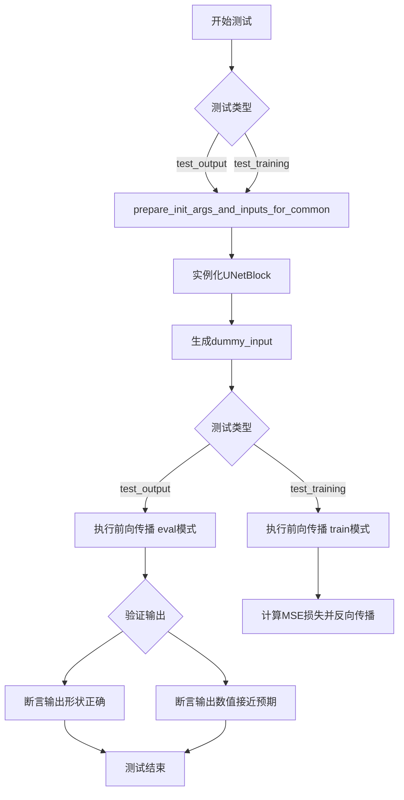

## 类结构

```
UNetBlockTesterMixin (测试混入类)
├── 属性: dummy_input
├── 属性: output_shape
├── 方法: get_dummy_input()
├── 方法: prepare_init_args_and_inputs_for_common()
├── 方法: test_output()
└── 方法: test_training()
```

## 全局变量及字段


### `batch_size`
    
批量大小，决定每次处理的样本数量

类型：`int`
    


### `num_channels`
    
通道数，表示输入数据的维度

类型：`int`
    


### `sizes`
    
空间尺寸，定义特征图的高度和宽度

类型：`Tuple[int, int]`
    


### `generator`
    
随机数生成器，用于生成可复现的随机张量

类型：`torch.Generator`
    


### `device`
    
计算设备，指定张量存储在CPU还是GPU上

类型：`torch.device`
    


### `shape`
    
张量形状，描述批量、通道和空间维度的元组

类型：`Tuple[int, int, int, int]`
    


### `hidden_states`
    
隐藏状态，表示网络中间层的输出

类型：`torch.Tensor`
    


### `dummy_input`
    
虚拟输入，包含模型所需的输入张量字典

类型：`Dict[str, torch.Tensor]`
    


### `temb_channels`
    
时间嵌入通道数，用于时间步信息的维度

类型：`int`
    


### `generator_1`
    
辅助随机数生成器，用于生成额外的随机状态

类型：`torch.Generator`
    


### `noise`
    
噪声张量，用于计算训练损失

类型：`torch.Tensor`
    


### `loss`
    
均方误差损失值，用于反向传播

类型：`torch.Tensor`
    


### `output_shape`
    
期望的输出形状，根据block_type动态确定

类型：`Tuple[int, int, int, int]`
    


### `init_dict`
    
模型初始化参数字典

类型：`Dict[str, Any]`
    


### `inputs_dict`
    
模型输入参数字典

类型：`Dict[str, torch.Tensor]`
    


### `output`
    
模型输出张量

类型：`torch.Tensor`
    


### `output_slice`
    
输出张量的切片，用于验证精度

类型：`torch.Tensor`
    


### `expected_slice`
    
期望的输出切片，用于比较验证

类型：`torch.Tensor`
    


### `UNetBlockTesterMixin.batch_size`
    
批量大小参数

类型：`int`
    


### `UNetBlockTesterMixin.num_channels`
    
通道数参数

类型：`int`
    


### `UNetBlockTesterMixin.sizes`
    
空间尺寸参数

类型：`Tuple[int, int]`
    


### `UNetBlockTesterMixin.generator`
    
随机数生成器

类型：`torch.Generator`
    


### `UNetBlockTesterMixin.device`
    
计算设备

类型：`torch.device`
    


### `UNetBlockTesterMixin.shape`
    
张量形状

类型：`Tuple[int, int, int, int]`
    


### `UNetBlockTesterMixin.hidden_states`
    
隐藏状态张量

类型：`torch.Tensor`
    


### `UNetBlockTesterMixin.dummy_input`
    
虚拟输入字典

类型：`Dict[str, torch.Tensor]`
    


### `UNetBlockTesterMixin.temb_channels`
    
时间嵌入通道数

类型：`int`
    


### `UNetBlockTesterMixin.generator_1`
    
辅助随机数生成器

类型：`torch.Generator`
    


### `UNetBlockTesterMixin.noise`
    
噪声张量

类型：`torch.Tensor`
    


### `UNetBlockTesterMixin.loss`
    
损失张量

类型：`torch.Tensor`
    


### `UNetBlockTesterMixin.output_shape`
    
输出形状属性

类型：`Tuple[int, int, int, int]`
    


### `UNetBlockTesterMixin.init_dict`
    
初始化参数字典

类型：`Dict[str, Any]`
    


### `UNetBlockTesterMixin.inputs_dict`
    
输入参数字典

类型：`Dict[str, torch.Tensor]`
    


### `UNetBlockTesterMixin.output`
    
输出张量

类型：`torch.Tensor`
    


### `UNetBlockTesterMixin.output_slice`
    
输出切片

类型：`torch.Tensor`
    


### `UNetBlockTesterMixin.expected_slice`
    
期望切片

类型：`torch.Tensor`
    
    

## 全局函数及方法


### `randn_tensor`

该函数是從 `diffusers.utils.torch_utils` 模組導入的隨機張量生成工具，用於生成服從標準正態分佈的隨機張量。

参数：

-  `shape`：`tuple`，張量的形狀，例如 `(batch_size, num_channels, height, width)`
-  `generator`：`torch.Generator`（可選），用於控制隨機數生成的生成器對象，預設為 `None`
-  `device`：`torch.device`（可選），指定生成張量應該放置的設備，預設為 `None`

返回值：`torch.Tensor`，一個服從標準正態分佈 N(0,1) 的隨機張量

#### 流程图

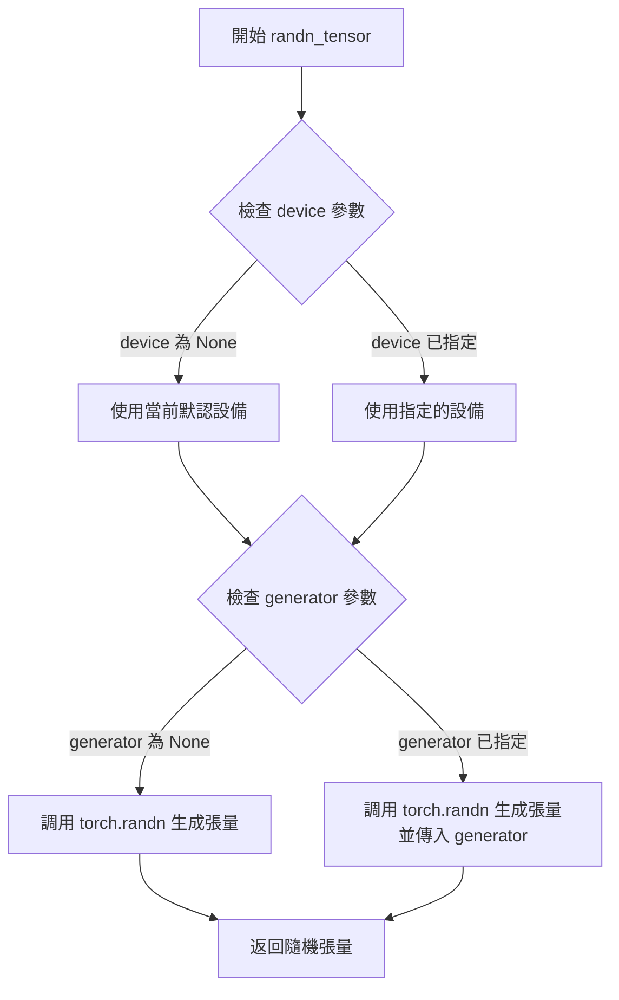

#### 带注释源码

```python
# 該函數是從 diffusers.utils.torch_utils 導入的
# 用於生成符合標準正態分佈的隨機張量
# 定義位置：diffusers.utils.torch_utils 模块中

def randn_tensor(
    shape: tuple,  # 張量的形狀，如 (batch_size, channels, height, width)
    generator: Optional[torch.Generator] = None,  # 隨機數生成器，用於確保可重現性
    device: Optional[torch.device] = None,  # 目標設備，決定張量存儲在 CPU 還是 GPU
) -> torch.Tensor:
    """
    生成服從標準正態分佈 N(0,1) 的隨機張量
    
    參數:
        shape: 張量的維度元組
        generator: 可選的 PyTorch 隨機生成器
        device: 可選的 PyTorch 設備對象
    
    返回:
        隨機張量
    """
    # 根據是否有指定的設備和生成器，調用底層的 torch.randn
    # 如果提供了 generator，則傳入以確保隨機數的可重現性
    # 如果提供了 device，則確保張量創建在正確的設備上
    tensor = torch.randn(shape, generator=generator, device=device)
    return tensor
```

> **注意**：由于 `randn_tensor` 函数定义在 `diffusers.utils.torch_utils` 模块中，而该模块未在提供的代码中展示，上述源码是基于代码中使用模式的推断定义。实际的函数签名和实现可能略有不同。从代码中的使用方式来看，该函数接受 `shape`、`generator` 和 `device` 三个参数，并返回一个随机张量。


### `floats_tensor`

生成指定形状的随机浮点数张量，主要用于测试场景中创建模拟输入数据。

参数：

-  `shape`：`Tuple[int, ...]` 或 `torch.Size`，要生成的张量的形状
-  `dtype`：`torch.dtype`，可选，返回张量的数据类型，默认为 `torch.float32`
-  `device`：`torch.device`，可选，张量应放置的设备，默认为 `cpu`

返回值：`torch.Tensor`，指定形状的随机浮点数张量

#### 流程图

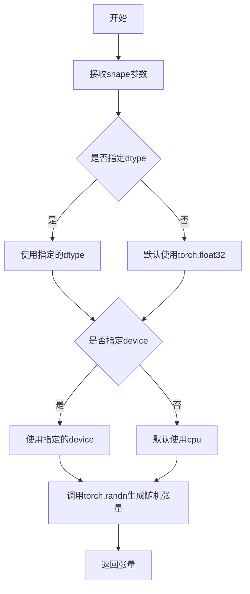

#### 带注释源码

```python
# 从testing_utils模块导入floats_tensor
# 该函数定义在diffusers库的testing_utils模块中
# 以下是基于使用方式的推断实现

def floats_tensor(
    shape: Union[Tuple[int, ...], torch.Size],
    dtype: torch.dtype = torch.float32,
    device: Optional[torch.device] = None,
    generator: Optional[torch.Generator] = None
) -> torch.Tensor:
    """
    生成指定形状的随机浮点数张量。
    
    参数:
        shape: 张量的形状，如 (batch_size, 32, 32)
        dtype: 张量的数据类型，默认为 torch.float32
        device: 张量应放置的设备，默认为 None (CPU)
        generator: 可选的随机数生成器，用于可重复的随机数生成
    
    返回:
        随机浮点数张量
    """
    # 使用 torch.randn 生成标准正态分布的随机数
    tensor = torch.randn(shape, generator=generator, device=device, dtype=dtype)
    return tensor

# 使用示例（在代码中）:
# dummy_input["encoder_hidden_states"] = floats_tensor((batch_size, 32, 32)).to(torch_device)
```

#### 备注

由于 `floats_tensor` 函数定义在 `...testing_utils` 模块中（该模块不在当前代码文件内），以上源码是基于其在代码中的使用方式进行的推断。该函数的核心功能是生成随机浮点数张量，常用于测试用例中创建模拟的输入数据，如 `encoder_hidden_states` 等。在当前代码中，调用时未显式指定 dtype 和 device 参数，使用了默认值。


### `require_torch`

这是一个装饰器函数，用于检查 PyTorch 是否可用。如果 PyTorch 不可用，则跳过被装饰的测试（类或函数）。

注意：在提供的代码片段中，仅包含 `require_torch` 的导入和使用示例，其实际实现位于 `...testing_utils` 模块中，未在当前代码片段中展示。

参数：

- 无显式参数（作为装饰器使用，接受被装饰的目标作为隐式参数）

返回值：无返回值（作为装饰器使用，返回被装饰的目标或跳过测试）

#### 流程图

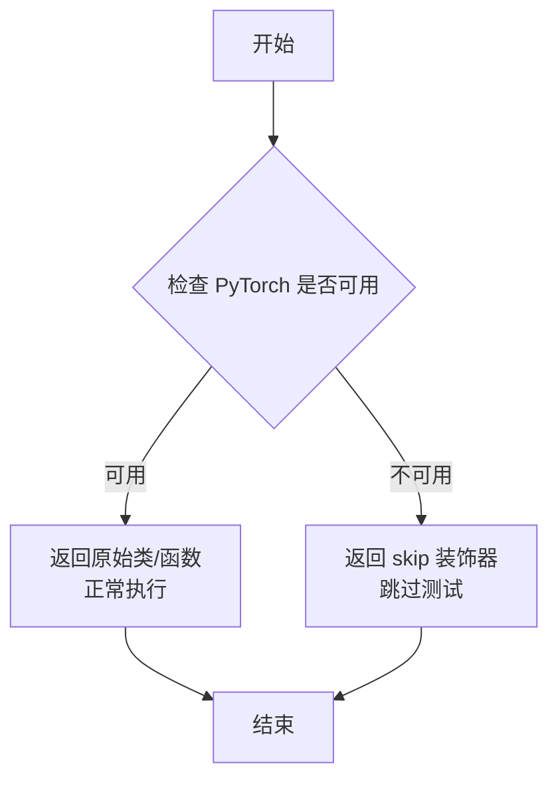

#### 带注释源码

```python
# 在当前代码片段中的使用方式
from ...testing_utils import (
    floats_tensor,
    require_torch,  # 从 testing_utils 模块导入
    require_torch_accelerator_with_training,
    torch_all_close,
    torch_device,
)

# require_torch 作为类装饰器使用
@require_torch
class UNetBlockTesterMixin:
    """
    测试 UNet 块的混入类
    
    注意：require_torch 装饰器确保只有当 PyTorch 可用时，
    此类才会被注册为测试类。如果 PyTorch 不可用，
    测试框架会跳过此类中的所有测试。
    """
    
    # ... 类的其他成员 ...
```

#### 实际实现说明

`require_torch` 函数的实际实现位于 `diffusers` 包的 `testing_utils` 模块中，通常是一个类似以下的装饰器：

```python
# 假设的实现（基于常见模式）
def require_torch(func_or_cls):
    """
    装饰器：检查 PyTorch 是否可用，如果不可用则跳过测试。
    
    实现模式：
    1. 检查 torch 是否可以导入
    2. 如果可以，返回原始函数/类
    3. 如果不可以，使用 unittest.skip 装饰器跳过测试
    """
    try:
        import torch
        return func_or_cls  # 返回原始对象，不做修改
    except ImportError:
        # 如果没有 PyTorch，返回一个被跳过的函数/类
        return unittest.skip("requires torch")(func_or_cls)
```


### `require_torch_accelerator_with_training`

该函数是一个装饰器，用于检查当前环境是否具有支持训练模式的 PyTorch 加速器（如 CUDA 或 MPS）。如果不满足条件，则跳过被装饰的测试方法。

参数：

- 被装饰的函数：`func`，`Callable`，被装饰的测试方法（隐式参数）

返回值：`Callable`，返回装饰后的函数，如果环境不支持训练则跳过测试

#### 流程图

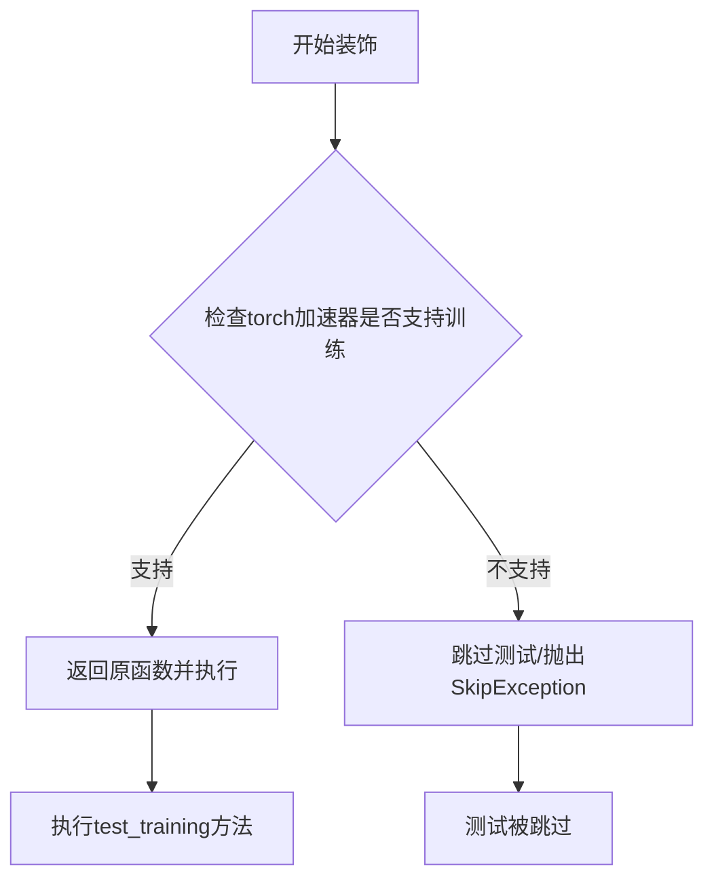

#### 带注释源码

```python
# 该函数从 testing_utils 模块导入
# 源码位于 diffusers/testing_utils.py 中
# 这是一个装饰器函数，用于条件性地跳过需要加速器训练支持的测试

@require_torch_accelerator_with_training  # 装饰器：检查CUDA/MPS等加速器是否可用且支持训练
def test_training(self):
    """测试UNet块在训练模式下的前向传播和反向传播"""
    init_dict, inputs_dict = self.prepare_init_args_and_inputs_for_common()
    model = self.block_class(**init_dict)
    model.to(torch_device)
    model.train()  # 切换到训练模式
    output = model(**inputs_dict)

    if isinstance(output, Tuple):
        output = output[0]

    device = torch.device(torch_device)
    noise = randn_tensor(output.shape, device=device)
    loss = torch.nn.functional.mse_loss(output, noise)
    loss.backward()  # 执行反向传播，验证梯度计算
```


### `torch_all_close`

用于比较两个 PyTorch 张量是否在指定容差范围内相等的测试工具函数，通常作为 `torch.allclose` 的封装或包装。

参数：

-  `a`：`torch.Tensor`，第一个要比较的张量
-  `b`：`torch.Tensor`，第二个要比较的张量  
-  `atol`：`float`，绝对误差容差（absolute tolerance），默认为 `5e-3`

返回值：`bool`，如果两个张量在容差范围内相等返回 `True`，否则返回 `False`

#### 流程图

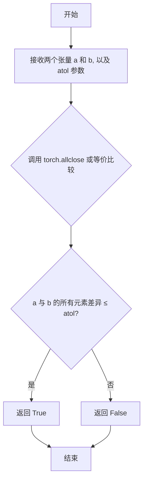

#### 带注释源码

```python
# 从代码中的使用方式推断出的函数签名和实现逻辑
def torch_all_close(a: torch.Tensor, b: torch.Tensor, atol: float = 5e-3) -> bool:
    """
    比较两个 PyTorch 张量是否在指定绝对误差容差范围内相等。
    
    参数:
        a: 第一个张量 (从 output_slice.flatten() 传入)
        b: 第二个张量 (从 expected_slice 传入) 
        atol: 绝对误差容差,默认为 5e-3
    
    返回:
        bool: 如果所有元素差异小于等于 atol 返回 True,否则返回 False
    """
    # 代码中的实际调用方式:
    # assert torch_all_close(output_slice.flatten(), expected_slice, atol=5e-3)
    
    # 内部实现可能是对 torch.allclose 的封装
    # return torch.allclose(a, b, atol=atol, rtol=0)  # rtol 默认为 0,只比较绝对误差
    pass
```

> **注意**: 该函数定义在 `...testing_utils` 模块中（本代码片段通过 import 引入），源码未在当前文件中提供。以上信息基于代码中的使用方式 `torch_all_close(output_slice.flatten(), expected_slice, atol=5e-3)` 推断得出。


### `torch_device`

该函数是测试工具模块中的一个便捷函数，用于获取当前测试环境可用的PyTorch设备（优先返回CUDA设备，否则返回CPU设备）。

参数：

- 无参数

返回值：`str`，返回表示设备类型的字符串（如"cuda"、"cpu"等）

#### 流程图

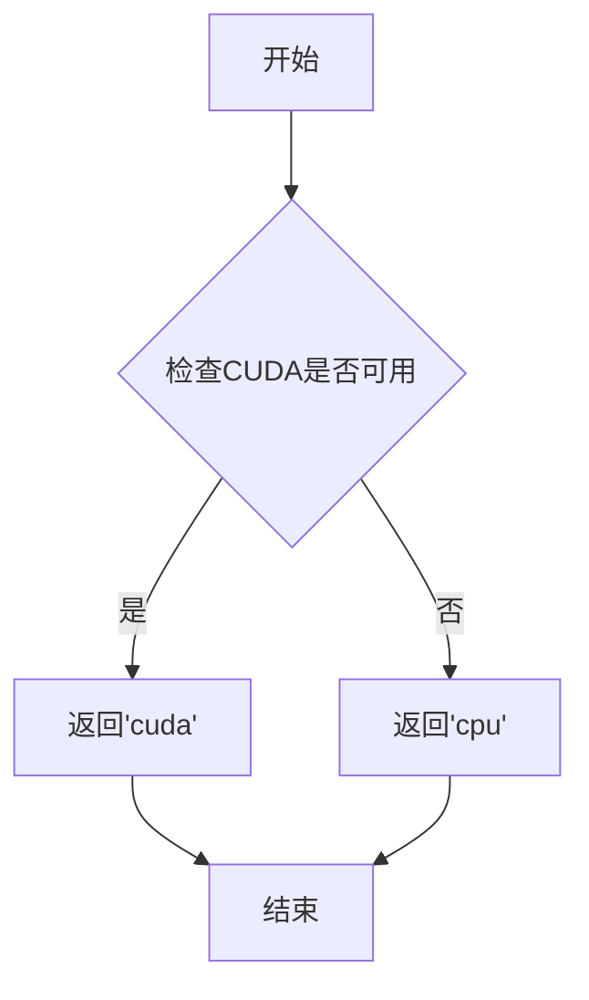

#### 带注释源码

```
# torch_device 是从 testing_utils 模块导入的便捷函数
# 它的实现通常如下（基于HuggingFace diffusers库的模式）：

def torch_device():
    """
    返回当前可用的PyTorch设备。
    
    优先返回CUDA设备（如果可用），否则返回CPU设备。
    这在编写跨设备测试时非常有用，确保测试能在GPU和CPU环境下运行。
    
    Returns:
        str: 设备字符串，'cuda' 或 'cpu'
    """
    # 检查CUDA是否可用
    if torch.cuda.is_available():
        # 返回CUDA设备
        return "cuda"
    else:
        # 返回CPU设备
        return "cpu"
```

#### 代码中的使用示例

在提供的代码中，`torch_device`被用于以下场景：

```python
# 创建设备对象
device = torch.device(torch_device)

# 创建隐藏状态张量，指定设备
hidden_states = randn_tensor(shape, generator=generator, device=device)

# 在测试中将模型移动到指定设备
unet_block.to(torch_device)

# 将张量移动到指定设备
expected_slice = torch.tensor(expected_slice).to(torch_device)
```

这种模式确保了测试代码可以在有GPU和没有GPU的环境中自动适配运行。


根据任务要求，我需要从给定代码中提取`torch.manual_seed`函数的信息。然而，需要说明的是：**`torch.manual_seed`不是在该代码文件中定义的，而是PyTorch库的预定义函数**。该代码只是调用了这个函数来生成随机数生成器。

### `torch.manual_seed`

设置CPU和CUDA随机种子，以确保结果可复现。

参数：

- `seed`：`int`，要设置的随机种子值

返回值：`torch.Generator`，返回一个torch.Generator对象，用于后续的随机数生成

#### 带注释源码

```python
# 这是 PyTorch 库的源码（简化版），不是本项目代码的一部分
# 函数位置：https://github.com/pytorch/pytorch/blob/main/torch/random.py

def manual_seed(seed):
    """
    设置全局随机种子，用于CPU和CUDA随机数生成器。
    
    参数:
        seed (int): 随机种子值
        
    返回值:
        torch.Generator: 返回一个Generator对象
    """
    # 设置CPU随机种子
    torch._C._set_seed(seed)
    # 为每个CUDA设备设置种子
    for i in range(torch.cuda.device_count()):
        torch.cuda._set_seed(seed)
    # 返回生成器对象
    return torch.Generator()
```

#### 在本项目代码中的使用示例

```python
# 在 UNetBlockTesterMixin.get_dummy_input 方法中:
generator = torch.manual_seed(0)  # 创建随机种子为0的生成器
hidden_states = randn_tensor(shape, generator=generator, device=device)  # 使用该生成器

# 另一个示例:
generator_1 = torch.manual_seed(1)  # 创建随机种子为1的生成器
dummy_input["res_hidden_states_tuple"] = (randn_tensor(shape, generator=generator_1, device=device),)
```

#### 流程图

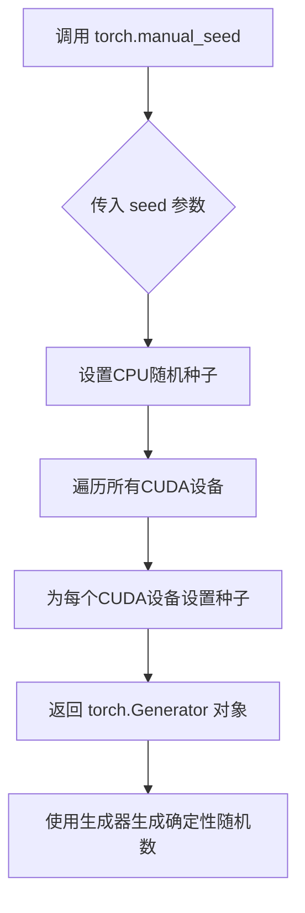

#### 说明

由于`torch.manual_seed`是PyTorch库的预定义函数，非本项目代码定义，因此：

1. **名称**：torch.manual_seed（来自PyTorch库）
2. **文件位置**：PyTorch源代码 `torch/random.py`
3. **使用场景**：在本项目代码中用于确保测试用例的随机输入可复现


### `torch.device`

这是 PyTorch 中用于表示计算设备（CPU 或 CUDA 设备）的类构造函数。在代码中用于根据 `torch_device` 全局变量创建具体的设备对象，以便将张量放置在指定的设备上。

参数：

- `device`：`str` 或 `int`，设备标识符。可以是 `"cpu"`、`"cuda"`、`"cuda:0"` 等形式，或者在支持设备索引的情况下使用整数索引

返回值：`torch.device`，返回一个设备对象，可用于指定张量或模型所在的设备

#### 流程图

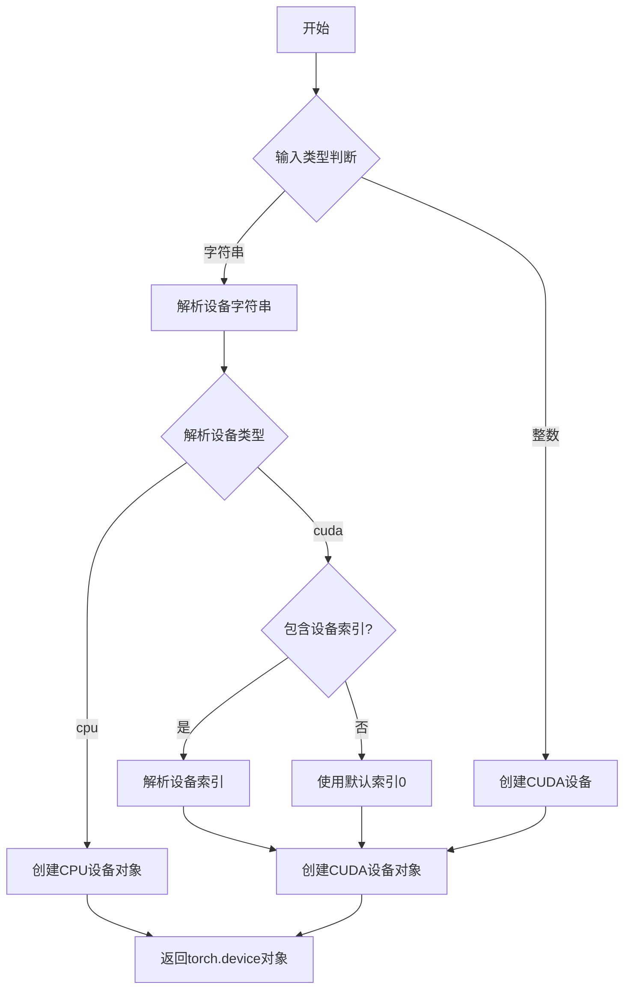

#### 带注释源码

```python
# 在 get_dummy_input 方法中使用 torch.device 的示例
def get_dummy_input(
    self,
    include_temb=True,
    include_res_hidden_states_tuple=False,
    include_encoder_hidden_states=False,
    include_skip_sample=False,
):
    batch_size = 4
    num_channels = 32
    sizes = (32, 32)

    generator = torch.manual_seed(0)
    
    # torch_device 是从 testing_utils 导入的全局变量/函数
    # 用于获取当前测试环境的目标设备（如 'cpu' 或 'cuda:0'）
    # torch.device() 构造函数将字符串设备标识符转换为 torch.device 对象
    device = torch.device(torch_device)
    
    # 创建指定形状的随机张量，并放置在指定的设备上
    shape = (batch_size, num_channels) + sizes
    hidden_states = randn_tensor(shape, generator=generator, device=device)
    dummy_input = {"hidden_states": hidden_states}

    # ... 其他输入准备逻辑
```

#### `torch_device` 全局变量

在测试代码中，`torch_device` 是从 `diffusers.testing_utils` 模块导入的全局变量：

- **名称**：`torch_device`
- **类型**：`str`
- **描述**：全局测试配置变量，表示当前测试环境的目标设备（通常为 `"cpu"` 或 `"cuda:0"`），通过 `torch.cuda.device_count()` 等机制自动检测可用的 GPU 设备


### `torch.nn.functional.mse_loss`

该函数是 PyTorch 官方的均方误差损失函数，用于计算预测值与目标值之间的均方误差损失，常用于回归任务和训练过程中的梯度计算。

参数：

- `input`：`torch.Tensor`，模型预测的输出张量，在代码中对应 `output`
- `target`：`torch.Tensor`，目标张量（真实值或噪声），在代码中对应 `noise`
- `reduction`：`str`，可选参数，指定损失值的聚合方式，可选值包括 `'mean'`（默认）、`'sum'`、`'none'`

返回值：`torch.Tensor`，计算后的损失值标量张量（当 reduction 为 'mean' 或 'sum' 时）或与输入形状相同的张量（当 reduction 为 'none' 时）

#### 流程图

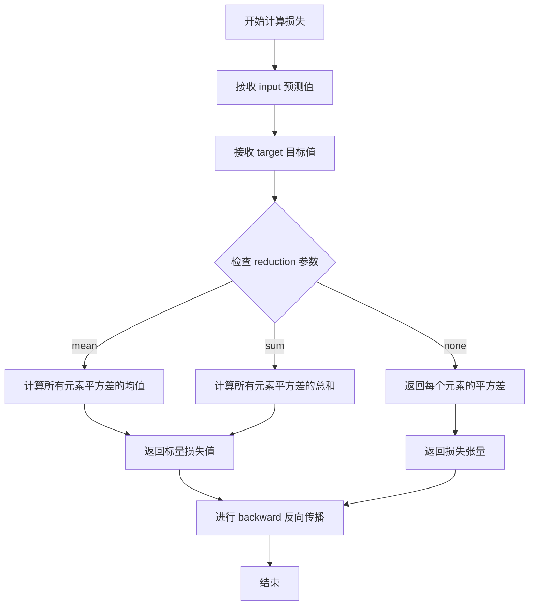

#### 带注释源码

```python
# 在 UNetBlockTesterMixin 类的 test_training 方法中使用
# 用于测试 UNet 模块在训练模式下的梯度计算功能

# 获取模型输出（预测值）
output = model(**inputs_dict)

# 处理元组输出（如果模型返回多元组）
if isinstance(output, Tuple):
    output = output[0]

# 生成与输出形状相同的随机噪声（作为目标值）
device = torch.device(torch_device)
noise = randn_tensor(output.shape, device=device)

# 调用 mse_loss 计算预测值与目标值之间的均方误差损失
# input=output: 模型的预测输出
# target=noise: 目标张量（随机噪声）
loss = torch.nn.functional.mse_loss(output, noise)

# 执行反向传播，计算梯度
# 这会触发模型的梯度计算，验证训练模式的正确性
loss.backward()
```


### `UNetBlockTesterMixin.dummy_input`

该属性方法是 UNetBlockTesterMixin 混入类的核心接口之一，用于返回测试所需的虚拟输入数据字典。它内部调用 `get_dummy_input()` 方法生成包含 hidden_states（隐藏状态）、temb（时间嵌入，可选）、res_hidden_states_tuple（残差隐藏状态元组，可选）、encoder_hidden_states（编码器隐藏状态，可选）以及 skip_sample（跳过样本，可选）等键的字典，以供模型测试使用。

参数： 无（该方法为属性方法，无显式参数）

返回值：`dict`，返回包含测试输入的字典，包含必选字段 `hidden_states` 以及可选字段 `temb`、`res_hidden_states_tuple`、`encoder_hidden_states`、`skip_sample`

#### 流程图

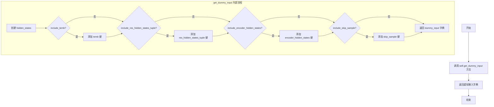

#### 带注释源码

```python
@property
def dummy_input(self):
    """
    属性方法，返回用于测试的虚拟输入字典。
    
    该属性是 UNetBlockTesterMixin 混入类的核心接口之一，
    内部委托调用 get_dummy_input() 方法生成测试所需的输入数据。
    
    返回值:
        dict: 包含测试输入的字典，至少包含 'hidden_states' 键，
              可能根据配置包含 'temb'、'res_hidden_states_tuple'、
              'encoder_hidden_states'、'skip_sample' 等可选键。
    """
    # 调用 get_dummy_input 方法获取虚拟输入
    # 默认参数：include_temb=True, include_res_hidden_states_tuple=False,
    #           include_encoder_hidden_states=False, include_skip_sample=False
    return self.get_dummy_input()
```


### `UNetBlockTesterMixin.output_shape`

该属性方法根据 `block_type` 的值返回 UNet 块在不同位置（down、mid、up）时的期望输出形状，用于测试验证模型输出的维度是否符合预期。

参数：

- `self`：`UNetBlockTesterMixin`，调用此属性的类实例，通过 `self.block_type` 获取块类型

返回值：`Tuple[int, int, int, int]`，返回期望的四维输出形状元组 (batch_size, channels, height, width)，具体值取决于 block_type 的值

#### 流程图

```mermaid
flowchart TD
    A[开始] --> B{self.block_type == 'down'?}
    B -- 是 --> C[返回 (4, 32, 16, 16)]
    B -- 否 --> D{self.block_type == 'mid'?}
    D -- 是 --> E[返回 (4, 32, 32, 32)]
    D -- 否 --> F{self.block_type == 'up'?}
    F -- 是 --> G[返回 (4, 32, 64, 64)]
    F -- 否 --> H[抛出 ValueError]
    C --> I[结束]
    E --> I
    G --> I
    H --> I
```

#### 带注释源码

```python
@property
def output_shape(self):
    """
    根据 block_type 返回期望的输出形状。
    
    该属性用于测试中验证 UNet 块输出的维度是否正确。
    不同位置的块（down/mid/up）具有不同的下采样/上采样倍数。
    """
    # 下采样块：输入被下采样 2 倍 (32 -> 16)
    if self.block_type == "down":
        return (4, 32, 16, 16)
    # 中间块：保持分辨率 (32 -> 32)
    elif self.block_type == "mid":
        return (4, 32, 32, 32)
    # 上采样块：输入被上采样 2 倍 (32 -> 64)
    elif self.block_type == "up":
        return (4, 32, 64, 64)

    # 如果 block_type 不受支持，抛出异常
    raise ValueError(f"'{self.block_type}' is not a supported block_type. Set it to 'up', 'mid', or 'down'.")
```


### `UNetBlockTesterMixin.get_dummy_input`

该方法用于生成测试 UNet 块的虚拟输入数据，根据传入的可选参数生成包含隐藏状态、时间嵌入、残差隐藏状态元组、编码器隐藏状态和跳过采样等不同组合的输入字典，以支持对不同类型 UNet 块（down、mid、up）的单元测试。

参数：

- `include_temb`：`bool`，可选参数，默认为 `True`，是否在返回的字典中包含时间嵌入（temb）数据
- `include_res_hidden_states_tuple`：`bool`，可选参数，默认为 `False`，是否在返回的字典中包含残差隐藏状态元组（res_hidden_states_tuple）
- `include_encoder_hidden_states`：`bool`，可选参数，默认为 `False`，是否在返回的字典中包含编码器隐藏状态（encoder_hidden_states）
- `include_skip_sample`：`bool`，可选参数，默认为 `False`，是否在返回的字典中包含跳过采样（skip_sample）

返回值：`dict`，返回包含测试所需虚拟输入的字典，字典键值对根据可选参数决定，至少包含 `hidden_states` 键

#### 流程图

```mermaid
flowchart TD
    A[开始] --> B[设置 batch_size=4, num_channels=32, sizes=(32,32)]
    B --> C[创建随机数生成器 generator]
    C --> D[获取设备 device]
    D --> E[生成形状为 (4, 32, 32, 32) 的 hidden_states]
    E --> F[创建 dummy_input 字典并放入 hidden_states]
    F --> G{include_temb?}
    G -->|是| H[生成 temb 形状 (4, 128)]
    H --> G
    G -->|否| I{include_res_hidden_states_tuple?}
    I -->|是| J[创建新生成器 generator_1, 生成 res_hidden_states_tuple]
    J --> I
    I -->|否| K{include_encoder_hidden_states?}
    K -->|是| L[生成 encoder_hidden_states 形状 (4, 32, 32)]
    L --> K
    K -->|否| M{include_skip_sample?}
    M -->|是| N[生成 skip_sample 形状 (4, 3, 32, 32)]
    N --> M
    M -->|否| O[返回 dummy_input 字典]
    O --> P[结束]
```

#### 带注释源码

```python
def get_dummy_input(
    self,
    include_temb=True,                       # 是否包含时间嵌入的标志
    include_res_hidden_states_tuple=False,   # 是否包含残差隐藏状态元组的标志
    include_encoder_hidden_states=False,     # 是否包含编码器隐藏状态的标志
    include_skip_sample=False,               # 是否包含跳过采样的标志
):
    """
    生成用于测试 UNet 块的虚拟输入数据
    
    参数:
        include_temb: bool, 是否包含时间嵌入
        include_res_hidden_states_tuple: bool, 是否包含残差隐藏状态元组
        include_encoder_hidden_states: bool, 是否包含编码器隐藏状态
        include_skip_sample: bool, 是否包含跳过采样
    
    返回:
        dict: 包含测试所需输入的字典
    """
    # 设置批次大小和通道数
    batch_size = 4
    num_channels = 32
    sizes = (32, 32)

    # 创建随机数生成器，种子设为 0 以保证可复现性
    generator = torch.manual_seed(0)
    # 获取计算设备（CPU 或 CUDA）
    device = torch.device(torch_device)
    # 构建输入形状：(batch_size, num_channels, height, width)
    shape = (batch_size, num_channels) + sizes
    # 生成随机隐藏状态张量
    hidden_states = randn_tensor(shape, generator=generator, device=device)
    # 初始化 dummy_input 字典，放入隐藏状态
    dummy_input = {"hidden_states": hidden_states}

    # 如果需要包含时间嵌入
    if include_temb:
        temb_channels = 128  # 时间嵌入通道数
        # 生成形状为 (batch_size, temb_channels) 的时间嵌入
        dummy_input["temb"] = randn_tensor((batch_size, temb_channels), generator=generator, device=device)

    # 如果需要包含残差隐藏状态元组
    if include_res_hidden_states_tuple:
        # 使用不同的种子创建另一个生成器
        generator_1 = torch.manual_seed(1)
        # 将残差隐藏状态作为元组放入字典
        dummy_input["res_hidden_states_tuple"] = (randn_tensor(shape, generator=generator_1, device=device),)

    # 如果需要包含编码器隐藏状态
    if include_encoder_hidden_states:
        # 生成编码器隐藏状态并移动到指定设备
        dummy_input["encoder_hidden_states"] = floats_tensor((batch_size, 32, 32)).to(torch_device)

    # 如果需要包含跳过采样
    if include_skip_sample:
        # 生成跳过采样张量，形状为 (batch_size, 3, 32, 32)
        dummy_input["skip_sample"] = randn_tensor(((batch_size, 3) + sizes), generator=generator, device=device)

    # 返回完整的虚拟输入字典
    return dummy_input
```


### `UNetBlockTesterMixin.prepare_init_args_and_inputs_for_common`

该方法用于为通用测试准备 UNet 块的初始化参数和输入数据，根据块类型（up、mid、down）动态调整初始化参数字典，并返回用于实例化块和执行前向传播所需的配置。

参数：
- `self`：隐式参数，`UNetBlockTesterMixin` 实例，方法的调用者

返回值：`Tuple[dict, dict]`，返回包含初始化参数字典和输入数据字典的元组。初始化参数字典包含模型构造所需的通道配置，输入数据字典包含前向传播所需的 hidden_states、temb 等张量。

#### 流程图

```mermaid
flowchart TD
    A[开始] --> B[创建基础 init_dict<br/>in_channels=32, out_channels=32<br/>temb_channels=128]
    B --> C{self.block_type == 'up'?}
    C -->|是| D[添加 prev_output_channel=32]
    C -->|否| E{self.block_type == 'mid'?}
    D --> E
    E -->|是| F[从 init_dict 中移除 out_channels]
    E -->|否| G[保持原状]
    F --> H[获取 inputs_dict = self.dummy_input]
    G --> H
    H --> I[返回 (init_dict, inputs_dict)]
    I --> J[结束]
```

#### 带注释源码

```python
def prepare_init_args_and_inputs_for_common(self):
    """
    为通用测试准备 UNet 块的初始化参数和输入数据。
    
    根据 self.block_type 的值动态调整初始化参数字典：
    - 'up' 块：添加 prev_output_channel
    - 'mid' 块：移除 out_channels
    - 'down' 块：保持基础配置
    """
    # 基础初始化参数字典，包含模型的基本通道配置
    init_dict = {
        "in_channels": 32,      # 输入通道数
        "out_channels": 32,     # 输出通道数
        "temb_channels": 128,   # 时间嵌入通道数
    }
    
    # 如果是 up 块，需要添加 prev_output_channel 参数
    if self.block_type == "up":
        init_dict["prev_output_channel"] = 32

    # 如果是 mid 块，需要移除 out_channels 参数
    # 因为中间块不直接产生输出通道配置
    if self.block_type == "mid":
        init_dict.pop("out_channels")

    # 从 mixin 的 dummy_input 属性获取输入数据
    # 包含 hidden_states、temb 等必要的输入张量
    inputs_dict = self.dummy_input
    
    # 返回元组：(初始化参数字典, 输入数据字典)
    return init_dict, inputs_dict
```


### `UNetBlockTesterMixin.test_output`

该方法为 UNet 块（down/mid/up 类型）的输出张量形状和数值正确性提供测试验证，通过构造虚拟输入，执行前向传播，并与预期切片进行数值比对以确保模型实现符合预期。

参数：

- `expected_slice`：任意类型，用于与模型输出切片进行数值比较的期望值（通常为列表或张量）

返回值：`None`，该方法为测试方法，无返回值，通过断言验证输出正确性

#### 流程图

```mermaid
flowchart TD
    A[开始 test_output] --> B[调用 prepare_init_args_and_inputs_for_common]
    B --> C[获取 init_dict 和 inputs_dict]
    C --> D[使用 init_dict 实例化 unet_block]
    D --> E[将 unet_block 移至 torch_device]
    E --> F[设置 unet_block.eval 模式]
    F --> G[使用 torch.no_grad 执行前向传播]
    G --> H{输出是否为 Tuple?}
    H -->|是| I[取 output[0]]
    H -->|否| J[保持 output 不变]
    I --> K[断言 output.shape 等于 self.output_shape]
    J --> K
    K --> L[提取输出切片 output[0, -1, -3:, -3:]]
    L --> M[将 expected_slice 转为张量并移至 torch_device]
    M --> N[断言输出切片与期望值数值接近 atol=5e-3]
    N --> O[结束]
```

#### 带注释源码

```python
def test_output(self, expected_slice):
    """
    测试 UNet 块的前向输出是否符合预期形状和数值
    
    参数:
        expected_slice: 期望的输出切片值，用于数值比对
    """
    # 步骤1: 获取初始化参数和输入数据
    # prepare_init_args_and_inputs_for_common 返回:
    #   - init_dict: 包含 in_channels, out_channels, temb_channels 等模型初始化参数
    #   - inputs_dict: 包含 hidden_states, temb, res_hidden_states_tuple 等输入数据
    init_dict, inputs_dict = self.prepare_init_args_and_inputs_for_common()
    
    # 步骤2: 根据初始化参数创建 UNet 块实例
    # block_class 是子类中定义的具体块类（如 DownBlock2D, UpBlock2D, MidBlock2D 等）
    unet_block = self.block_class(**init_dict)
    
    # 步骤3: 将模型移至指定的计算设备（如 CUDA, CPU 等）
    unet_block.to(torch_device)
    
    # 步骤4: 设置为评估模式，禁用 Dropout 等训练特定层
    unet_block.eval()
    
    # 步骤5: 在 no_grad 上下文中执行前向传播，节省显存
    with torch.no_grad():
        # 执行推理，输入包括 hidden_states, temb, encoder_hidden_states 等
        output = unet_block(**inputs_dict)
    
    # 步骤6: 处理输出格式
    # 某些块可能返回 Tuple（如 (output, )），需要解包获取实际张量
    if isinstance(output, Tuple):
        output = output[0]
    
    # 步骤7: 验证输出形状是否符合预期
    # down 块输出: (4, 32, 16, 16)
    # mid 块输出: (4, 32, 32, 32)
    # up 块输出:  (4, 32, 64, 64)
    self.assertEqual(output.shape, self.output_shape)
    
    # 步骤8: 提取输出切片进行数值验证
    # 取最后一个通道的右下角 3x3 区域
    output_slice = output[0, -1, -3:, -3:]
    
    # 将期望值转换为张量并移至计算设备
    expected_slice = torch.tensor(expected_slice).to(torch_device)
    
    # 步骤9: 断言输出数值与期望值接近（容差 5e-3）
    # 使用 torch_all_close 进行浮点数近似比较
    assert torch_all_close(output_slice.flatten(), expected_slice, atol=5e-3)
```


### `UNetBlockTesterMixin.test_training`

该方法是一个训练测试用例，用于验证 UNet 块在训练模式下的前向传播、损失计算和反向传播是否正常工作。它通过创建模型、执行推理、计算 MSE 损失并执行反向传播来确保模型可以正常训练。

参数：无（该方法只使用 `self` 隐式参数）

返回值：`None`，该方法没有返回值（执行训练步骤但不返回结果）

#### 流程图

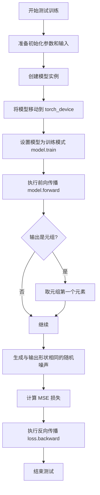

#### 带注释源码

```python
@require_torch_accelerator_with_training  # 装饰器：要求 torch 和加速器训练支持
def test_training(self):
    """
    测试 UNet 块在训练模式下的功能。
    验证前向传播、损失计算和反向传播是否正常工作。
    """
    # 步骤1: 获取模型的初始化参数和测试输入
    # init_dict: 包含 in_channels, out_channels, temb_channels 等模型配置
    # inputs_dict: 包含 hidden_states, temb, res_hidden_states_tuple 等输入数据
    init_dict, inputs_dict = self.prepare_init_args_and_inputs_for_common()
    
    # 步骤2: 使用初始化参数创建 UNet 块模型实例
    # self.block_class 是子类中定义的模型类（如 DownBlock2D, UpBlock2D 等）
    model = self.block_class(**init_dict)
    
    # 步骤3: 将模型移动到指定的计算设备（CPU 或 GPU）
    model.to(torch_device)
    
    # 步骤4: 设置模型为训练模式，启用 dropout 和 batch normalization 的训练行为
    model.train()
    
    # 步骤5: 执行前向传播，获取模型输出
    # inputs_dict 包含: hidden_states, temb, res_hidden_states_tuple, encoder_hidden_states, skip_sample 等
    output = model(**inputs_dict)
    
    # 步骤6: 处理输出（如果输出是元组，则取第一个元素）
    # 某些 UNet 块可能返回 (output, additional_outputs) 形式的元组
    if isinstance(output, Tuple):
        output = output[0]
    
    # 步骤7: 获取设备信息，用于生成噪声
    device = torch.device(torch_device)
    
    # 步骤8: 生成与模型输出形状相同的随机噪声
    # 用于计算 MSE 损失（模拟目标输出）
    noise = randn_tensor(output.shape, device=device)
    
    # 步骤9: 计算均方误差损失
    # 比较模型输出和随机噪声（这是测试用的目标，不是有意义的训练目标）
    loss = torch.nn.functional.mse_loss(output, noise)
    
    # 步骤10: 执行反向传播
    # 计算梯度，验证梯度计算是否正确
    loss.backward()
    
    # 方法没有返回值，这是测试方法，验证训练流程可以正常执行
```

## 关键组件


### UNetBlockTesterMixin

测试混合类，用于为 UNet 块（down、mid、up 类型）生成测试输入、验证输出形状和训练行为

### dummy_input 属性

返回通过 get_dummy_input() 生成的虚拟输入张量，用于模型测试

### output_shape 属性

根据块类型（down/mid/up）返回预期的输出张量形状，用于测试验证

### get_dummy_input 方法

生成包含 hidden_states、temb、res_hidden_states_tuple、encoder_hidden_states、skip_sample 等可选组件的测试输入字典，支持灵活的测试场景配置

### prepare_init_args_and_inputs_for_common 方法

准备 UNet 块的初始化参数（in_channels、out_channels、temb_channels、prev_output_channel 等）和输入数据，供通用测试使用

### test_output 方法

验证 UNet 块的前向传播输出形状是否符合预期，并使用 torch_all_close 断言输出值与期望值的接近程度（atol=5e-3）

### test_training 方法

在训练模式下验证模型可正确执行前向传播并计算损失并完成反向传播，验证梯度计算正确性

### randn_tensor 工具函数

从 diffusers.utils.torch_utils 导入的随机张量生成函数，用于创建符合指定形状和设备的随机张量

### 测试配置参数

包含 batch_size=4、num_channels=32、temb_channels=128、sizes=(32, 32) 等测试配置常量


## 问题及建议


### 已知问题

- **硬编码配置值**：代码中存在大量硬编码的魔法数字和配置值，如 `temb_channels=128`、`num_channels=32`、`batch_size=4`、`atol=5e-3` 等，分散在不同方法中，难以统一管理和配置
- **混合使用断言方式**：同时使用了 `self.assertEqual` 和 `assert torch_all_close` 两种断言方式，风格不统一，可能导致测试框架的兼容性问题
- **全局状态依赖**：代码依赖外部全局变量 `torch_device` 和 `randn_tensor` 等工具函数，降低了模块的自包含性和可测试性
- **缺少异常处理**：没有对 `randn_tensor` 等可能失败的调用进行异常捕获和错误处理
- **测试方法参数不足**：`test_output` 方法的 `expected_slice` 参数依赖外部传入，缺乏默认值或灵活的验证策略
- **类型注解不完整**：仅 `get_dummy_input` 方法有部分类型注解，其他方法缺少参数和返回值的类型提示
- **重复代码模式**：在 `test_output` 和 `test_training` 中存在重复的模型初始化、设备转移和输出处理逻辑
- **命名一致性差**：属性名使用 snake_case（如 `dummy_input`），但类名使用 PascalCase，风格不完全统一
- **测试覆盖不全面**：仅覆盖了 `output` 和 `training` 两个场景，缺少对梯度流、参数更新、边界条件等的验证
- **方法职责不单一**：`prepare_init_args_and_inputs_for_common` 同时负责准备参数和输入，职责过载

### 优化建议

- 将硬编码的配置值提取为类属性或配置常量，使用属性装饰器实现动态计算，减少魔法数字
- 统一断言方式，全部使用 pytest/ unittest 框架的断言方法，移除裸 `assert` 语句
- 消除全局状态依赖，通过依赖注入或参数传递的方式引入设备和随机种子，提高可测试性
- 添加完整的类型注解，使用 `typing` 模块明确标注所有方法参数和返回值类型
- 抽取公共初始化逻辑为独立方法，使用模板方法模式减少重复代码
- 增强 `test_output` 方法的参数验证，提供合理的默认值或抛出明确的异常信息
- 为关键方法添加 docstring 文档，说明参数、返回值和可能的异常情况
- 扩展测试覆盖范围，增加梯度检查、参数边界、多种设备（CPU/GPU）等场景的测试

## 其它


### 设计目标与约束

本代码作为UNetBlockTesterMixin测试混入类，旨在为diffusers库中的UNet块（down、mid、up三种类型）提供统一的测试框架。设计目标包括：(1) 通过混入方式为不同UNet块测试类提供可复用的测试方法；(2) 支持多种输入配置（temb、res_hidden_states_tuple、encoder_hidden_states、skip_sample）；(3) 验证模型输出维度与预期一致；(4) 支持训练模式测试。约束条件：依赖torch和diffusers相关工具函数，需要在有GPU环境下运行训练测试（require_torch_accelerator_with_training）。

### 错误处理与异常设计

代码中的错误处理主要体现在：output_shape属性中对不支持的block_type抛出ValueError异常，并提供清晰的错误信息指导用户使用正确的类型（'up'、'mid'或'down'）。test_output方法中使用assert进行断言验证，包括输出维度检查和数值接近度检查（torch_all_close），当数值差异超过阈值（atol=5e-3）时会触发AssertionError。建议：可为test_training方法添加梯度检查，对梯度为None的情况给出警告。

### 数据流与状态机

数据流主要经过get_dummy_input方法构建输入字典，包含hidden_states（必需）、temb（可选）、res_hidden_states_tuple（可选）、encoder_hidden_states（可选）、skip_sample（可选）。这些输入通过unet_block的forward传播产生输出，输出可能是Tensor或Tuple[Tensor, ...]。状态机方面，模型在test_output中切换到eval模式（self.model.eval()），在test_training中切换到train模式（self.model.train()），分别对应推理和训练两种状态。

### 外部依赖与接口契约

主要外部依赖包括：(1) torch库：核心张量操作和神经网络模块；(2) diffusers.utils.torch_utils.randn_tensor：用于生成随机张量；(3) testing_utils模块：包含floats_tensor、require_torch、require_torch_accelerator_with_training、torch_all_close、torch_device等测试工具。接口契约方面，混入类要求使用类具有block_class属性（待测试的UNet块类）和block_type属性（'down'/'mid'/'up'字符串），且block_class需接受in_channels、out_channels、temb_channels等初始化参数。

### 性能考量与基准测试

当前实现中test_output使用torch.no_grad()禁用梯度计算以提高推理测试效率，test_training中则进行完整的前向和反向传播。性能基准方面：dummy_input的batch_size=4，num_channels=32，spatial_size=32x32，可作为标准基准输入。测试中固定随机种子（torch.manual_seed(0)和torch.manual_seed(1)）以确保可复现性。优化建议：可考虑添加性能基准测试，记录不同block_type和输入配置下的推理时间与显存占用。

### 兼容性设计

代码通过@require_torch装饰器确保仅在PyTorch环境下运行，@require_torch_accelerator_with_training确保训练测试在有GPU加速的环境下执行。使用torch_device变量适配不同测试设备（CPU/CUDA）。与diffusers库版本兼容性需通过版本检测机制确保，建议在文档中标注支持的diffusers版本范围。

### 测试覆盖范围

当前测试覆盖了：(1) 输出维度验证（test_output）；(2) 训练模式下的前向传播与反向传播（test_training）；(3) 多种输入配置组合（通过get_dummy_input的参数控制）。测试覆盖缺口：未测试梯度流动的正确性、未验证中间激活值、未测试模型保存与加载流程、未进行边界条件测试（如batch_size=1、channels=最小值等）。

### 代码组织与模块化

UNetBlockTesterMixin采用混入（Mixin）模式设计，通过多重继承将测试能力注入到具体的测试类中。这种设计遵循了开放封闭原则，便于扩展新的测试类型。模块化优势：测试逻辑与具体UNet块实现解耦，可复用于不同架构的UNet块测试。建议：将版本信息和变更日志纳入文档管理。

### 安全与权限考虑

本测试代码主要涉及模型推理和训练，不涉及敏感数据处理或权限管理。代码运行需要读取diffusers库的内部模块和测试工具，需确保这些依赖库已正确安装且版本兼容。在分布式训练场景下需注意随机种子设置对结果一致性的影响。

### 配置与可扩展性

通过prepare_init_args_and_inputs_for_common方法统一管理初始化参数和输入配置，针对不同block_type动态调整参数（如up类型需要prev_output_channel，mid类型不需要out_channels）。可扩展性设计：可在子类中重写dummy_input、output_shape等属性以适应特殊测试需求，或通过重写prepare_init_args_and_inputs_for_common方法添加自定义参数。建议：考虑将硬编码的维度参数（32、128等）提取为类或模块级配置常量。

    