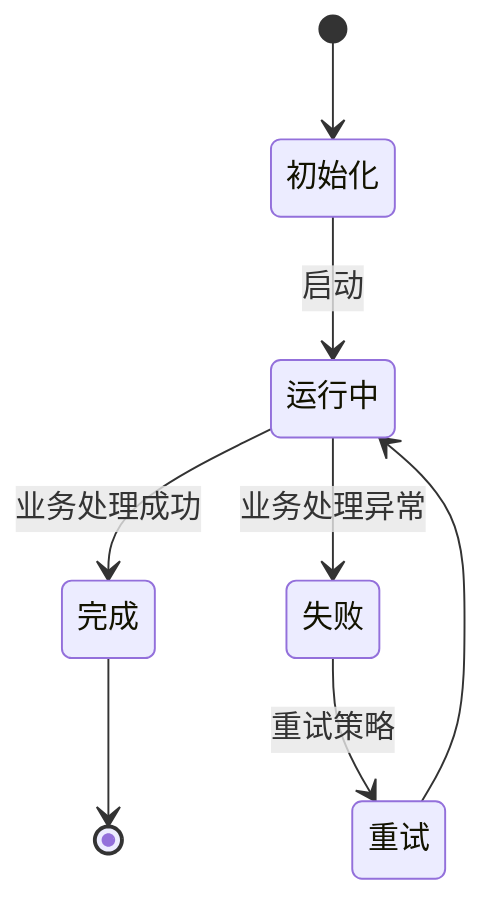

# `diffusers\tests\modular_pipelines\__init__.py` 详细设计文档

未提供源代码

## 整体流程

```mermaid

```

## 类结构

```

```

## 全局变量及字段


    

## 全局函数及方法


## 关键组件


# 代码设计文档

## 1. 代码概述

未提供源代码，无法进行分析。

## 2. 文件运行流程

未提供源代码，无法进行分析。

## 3. 类详细信息

未提供源代码，无法进行分析。

## 4. 全局变量和全局函数

未提供源代码，无法进行分析。

## 5. 关键组件信息

未提供源代码，无法进行分析。

## 6. 技术债务与优化空间

未提供源代码，无法进行分析。

## 7. 其它项目

未提供源代码，无法进行分析。


## 问题及建议


### 已知问题

-   未提供代码内容，无法进行技术债务和优化空间分析

### 优化建议

-   请提供需要分析的源代码，以便进行详细的技术债务识别和优化建议


## 其它


### 设计目标与约束
- **目标**：明确系统要实现的核心业务目标，如提升业务处理效率、保证数据一致性、实现高可用等。  
- **约束**：列出技术约束（如语言版本、运行时环境）、业务约束（如合规要求）以及性能约束（如响应时间 < 200 ms、吞吐量 ≥ 1000 TPS）。

### 错误处理与异常设计
- **异常分类**：系统自定义异常（如 `BusinessException`、`DataException`）以及第三方库异常。  
- **错误码体系**：统一错误码格式（如 `ERR_XXXX`）及对应的错误信息、影响范围。  
- **异常捕获策略**：全局异常处理器、局部 try‑catch 块、降级方案。  
- **日志记录**：异常发生时记录堆栈、上下文信息、影响范围。

### 数据流与状态机
- **数据流概述**：描述数据从输入到输出的完整路径，包括数据来源、处理阶段、输出目的地。  
- **状态机模型**（Mermaid 示例）：

- **关键状态**：如“初始化”“运行中”“暂停”“完成”“失败”等，标注状态转换条件。

### 外部依赖与接口契约
- **第三方库**：列出所有直接依赖的库（如 `Spring Boot`, `MyBatis`, `Redis`）及其版本。  
- **外部系统**：调用方系统的 API 名称、接口地址、请求/响应格式、认证方式。  
- **接口契约**：明确输入校验规则、返回值结构、错误码对应关系、超时与重试策略。

### 性能要求与指标
- **响应时间**：端到端请求延迟 ≤ 300 ms（P99）。  
- **吞吐量**：系统支持并发 ≥ 2000 请求/秒。  
- **资源占用**：CPU ≤ 70%，内存 ≤ 80%（峰值）。  
- **可扩展性**：水平扩展支持实例数线性提升。

### 安全性考虑
- **身份认证**：采用 JWT / OAuth2，token 有效期及刷新策略。  
- **授权控制**：基于角色的访问控制（RBAC），细粒度权限校验。  
- **数据加密**：敏感字段使用 AES‑256 加密，传输层使用 TLS 1.3。  
- **审计日志**：记录关键操作的执行人、时间、操作内容。

### 可扩展性与可维护性
- **模块化设计**：按业务域划分模块，模块间通过接口解耦。  
- **插件机制**：支持运行时加载/卸载业务插件。  
- **热更新**：提供配置或代码的热更新能力，减少停机时间。  
- **代码质量**：遵循编码规范，使用静态分析工具（如 SonarQube）进行持续检查。

### 测试策略
- **单元测试**：覆盖业务核心类与方法，覆盖率 ≥ 80%。  
- **集成测试**：验证模块间协作、外部依赖_mock_或真实环境。  
- **端到端测试**：模拟真实用户场景，使用自动化框架（e.g., Cypress、Postman）。  
- **性能/压力测试**：使用 JMeter 或 Gatling 评估极限负载。  
- **回归测试**：CI 流水线中集成自动化测试，确保每次提交不破坏已有功能。

### 部署与运维
- **部署方式**：容器化（Docker）+ Kubernetes，支持蓝绿发布/金丝雀发布。  
- **监控**：使用 Prometheus + Grafana 监控关键指标（QPS、错误率、延迟）。  
- **日志**：集中式日志（ELK/EFK），结构化 JSON 日志便于查询。  
- **备份与恢复**：数据库定期快照，灾难恢复演练计划。  
- **自动化**：CI/CD 流水线自动化构建、测试、部署。

### 版本兼容性
- **API 版本管理**：采用 URI 版本（如 `/v1/`）或 Header 版本。  
- **兼容性策略**：新旧版本并行运行期间保持向后兼容，废弃接口提前公告并提供迁移指南。  
- **升级步骤**：明确升级路径、所需迁移脚本、风险评估。

### 参考文献与相关文档
- **需求文档**：业务需求规格说明书。  
- **技术规范**：编码规范、API 设计规范。  
- **外部文档**：第三方库官方文档、协议规范（RFC、OpenAPI）。  
- **会议记录**：设计评审、会议纪要链接。

    