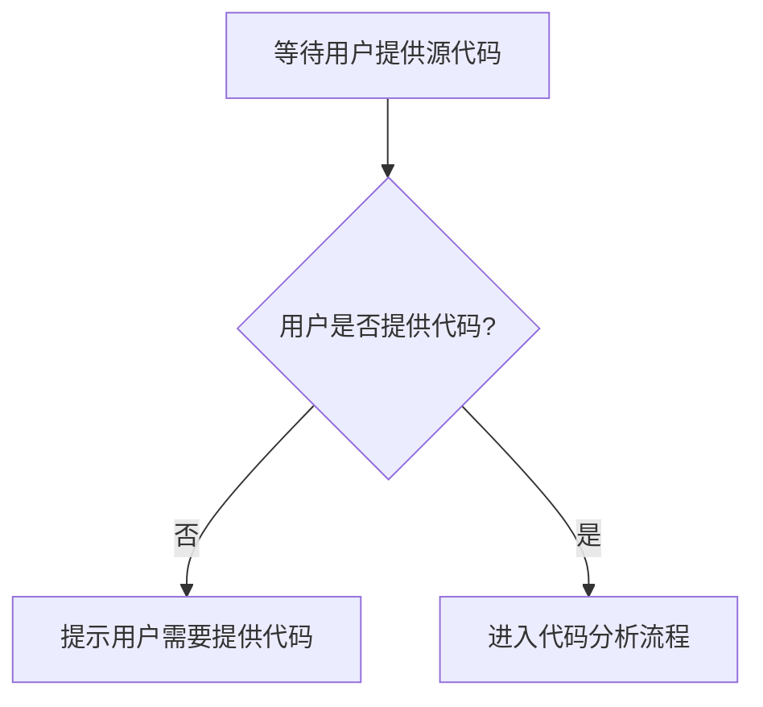

# `diffusers\tests\modular_pipelines\flux\__init__.py` 详细设计文档

未提供源代码，无法生成详细设计文档。

## 整体流程



## 类结构

```

```

## 全局变量及字段


    

## 全局函数及方法


## 关键组件


由于未提供源代码，无法识别关键组件。
请提供需要分析的代码。


## 问题及建议


### 已知问题

-   **代码缺失**：未提供任何代码内容，无法进行详细的技术债务和优化空间分析

### 优化建议

-   请提供待分析的源代码，以便进行完整的技术债务识别和优化建议
-   如有特定的技术栈或框架需求，请在提供代码时一并说明，以便进行针对性的分析
-   如果代码较大，建议提供关键模块或核心业务逻辑部分


## 其它


### 设计目标与约束

本代码的设计目标、约束条件、性能要求等待补充。

### 错误处理与异常设计

错误处理机制、异常类型定义、错误码规范等待补充。

### 数据流与状态机

数据流向、状态转换图、状态机定义等待补充。

### 外部依赖与接口契约

外部库依赖、API接口定义、模块间契约等待补充。

### 安全性考虑

安全审计点、权限控制、数据加密等待补充。

### 配置管理

配置文件格式、配置项说明、环境变量定义等待补充。

### 版本兼容性

版本号规则、向前向后兼容性策略等待补充。

### 测试策略

单元测试、集成测试、测试覆盖率目标等待补充。

### 部署注意事项

部署环境要求、依赖安装、启动脚本等待补充。

### 监控与日志

日志级别定义、监控指标、告警阈值等待补充。

### 扩展性设计

可扩展点、插件机制、模块化设计等待补充。


    