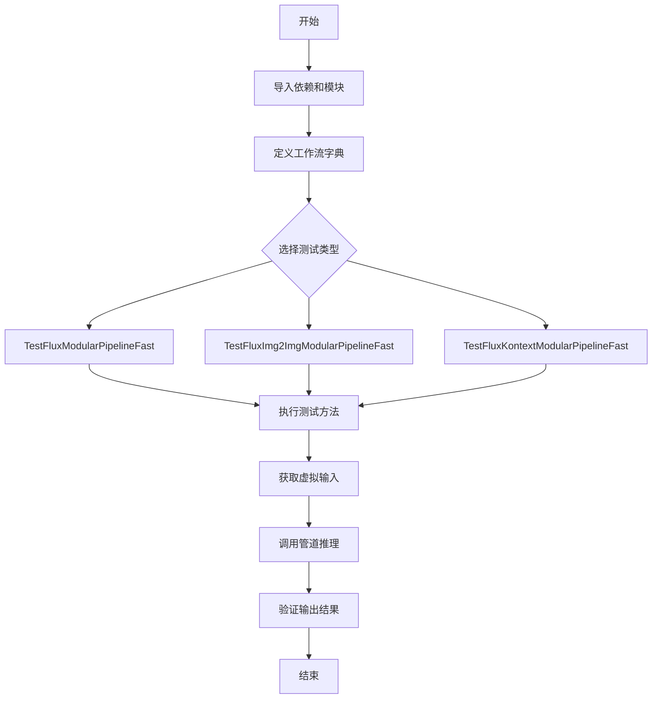
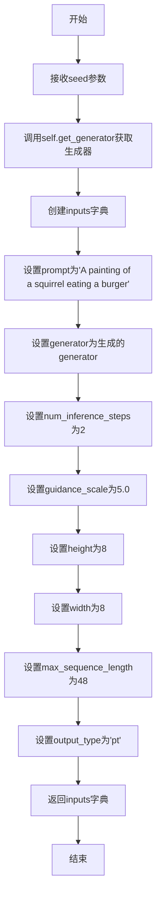
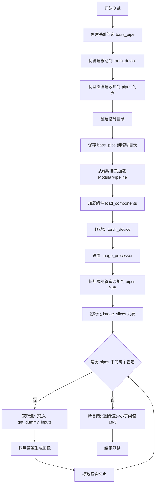
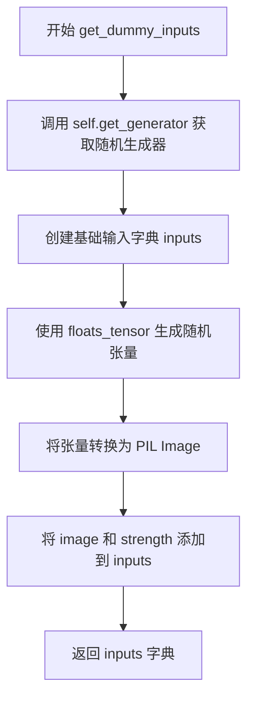
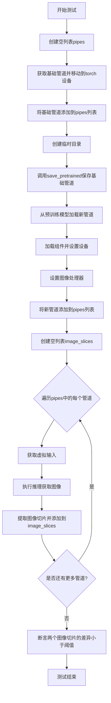
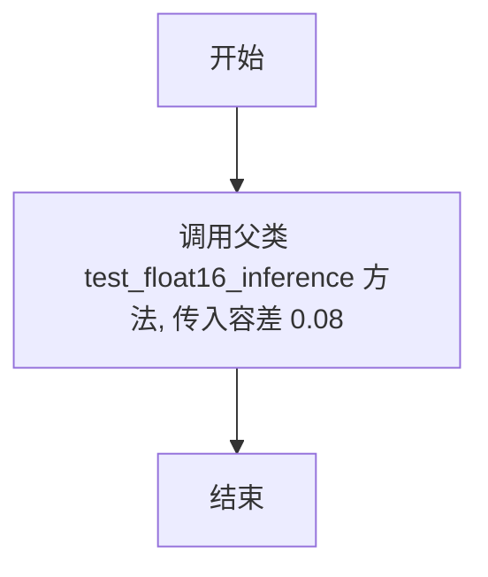
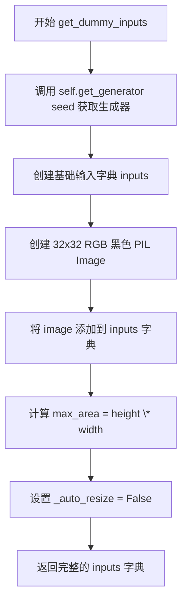
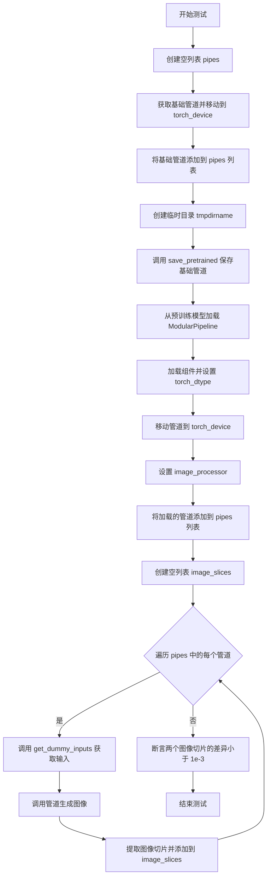
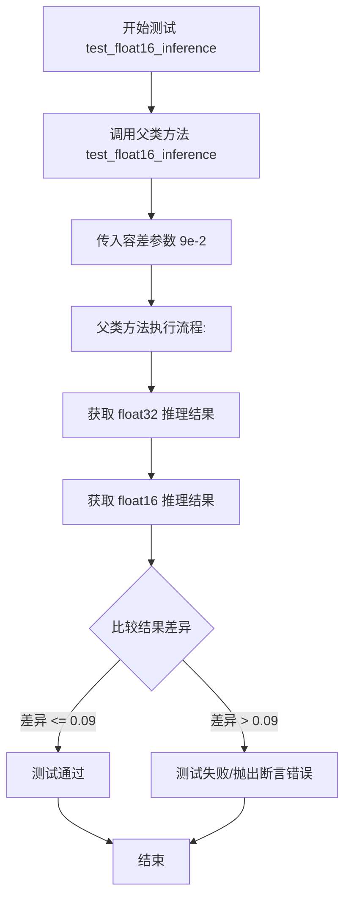

# `diffusers\tests\modular_pipelines\flux\test_modular_pipeline_flux.py` 详细设计文档

该文件是 Hugging Face diffusers 库中 Flux 模块化管道的快速测试套件，包含了文本到图像、图像到图像以及 Flux Kontext 三种工作流程的测试用例，用于验证 FluxModularPipeline、FluxKontextModularPipeline 等模块化管道的功能和性能。

## 整体流程



## 类结构

```
TestFluxModularPipelineFast (测试类)
├── params: frozenset
├── batch_params: frozenset
├── expected_workflow_blocks: dict
├── get_dummy_inputs()
└── test_float16_inference()
│
TestFluxImg2ImgModularPipelineFast (测试类)
├── params: frozenset
├── batch_params: frozenset
├── expected_workflow_blocks: dict
├── get_pipeline()
├── get_dummy_inputs()
├── test_save_from_pretrained()
└── test_float16_inference()
│
TestFluxKontextModularPipelineFast (测试类)
├── params: frozenset
├── batch_params: frozenset
├── expected_workflow_blocks: dict
├── get_dummy_inputs()
├── test_save_from_pretrained()
└── test_float16_inference()
```

## 全局变量及字段


### `FLUX_TEXT2IMAGE_WORKFLOWS`
    
定义Flux文本到图像推理的工作流步骤映射，包含编码器、潜在向量准备、去噪和解码等关键步骤

类型：`dict`
    


### `FLUX_IMAGE2IMAGE_WORKFLOWS`
    
定义Flux图像到图像推理的工作流步骤映射，包含图像预处理、VAE编码、文本输入、潜在向量准备、去噪和解码等完整流程

类型：`dict`
    


### `FLUX_KONTEXT_WORKFLOWS`
    
定义Flux Kontext推理的工作流步骤映射，包含文本到图像和图像条件两种模式的工作流步骤

类型：`dict`
    


### `TestFluxModularPipelineFast.pipeline_class`
    
指定测试所使用的模块化管道类

类型：`FluxModularPipeline`
    


### `TestFluxModularPipelineFast.pipeline_blocks_class`
    
指定管道所使用的自动块类

类型：`FluxAutoBlocks`
    


### `TestFluxModularPipelineFast.pretrained_model_name_or_path`
    
预训练模型的名称或路径

类型：`str`
    


### `TestFluxModularPipelineFast.params`
    
管道接受的参数字段集合

类型：`frozenset`
    


### `TestFluxModularPipelineFast.batch_params`
    
支持批处理的参数字段集合

类型：`frozenset`
    


### `TestFluxModularPipelineFast.expected_workflow_blocks`
    
预期的工作流块配置字典

类型：`dict`
    


### `TestFluxImg2ImgModularPipelineFast.pipeline_class`
    
指定测试所使用的模块化管道类

类型：`FluxModularPipeline`
    


### `TestFluxImg2ImgModularPipelineFast.pipeline_blocks_class`
    
指定管道所使用的自动块类

类型：`FluxAutoBlocks`
    


### `TestFluxImg2ImgModularPipelineFast.pretrained_model_name_or_path`
    
预训练模型的名称或路径

类型：`str`
    


### `TestFluxImg2ImgModularPipelineFast.params`
    
管道接受的参数字段集合

类型：`frozenset`
    


### `TestFluxImg2ImgModularPipelineFast.batch_params`
    
支持批处理的参数字段集合

类型：`frozenset`
    


### `TestFluxImg2ImgModularPipelineFast.expected_workflow_blocks`
    
预期的工作流块配置字典

类型：`dict`
    


### `TestFluxKontextModularPipelineFast.pipeline_class`
    
指定测试所使用的Kontext模块化管道类

类型：`FluxKontextModularPipeline`
    


### `TestFluxKontextModularPipelineFast.pipeline_blocks_class`
    
指定管道所使用的Kontext自动块类

类型：`FluxKontextAutoBlocks`
    


### `TestFluxKontextModularPipelineFast.pretrained_model_name_or_path`
    
预训练模型的名称或路径

类型：`str`
    


### `TestFluxKontextModularPipelineFast.params`
    
管道接受的参数字段集合

类型：`frozenset`
    


### `TestFluxKontextModularPipelineFast.batch_params`
    
支持批处理的参数字段集合

类型：`frozenset`
    


### `TestFluxKontextModularPipelineFast.expected_workflow_blocks`
    
预期的工作流块配置字典

类型：`dict`
    
    

## 全局函数及方法


### TestFluxModularPipelineFast.get_dummy_inputs

这是TestFluxModularPipelineFast类中的一个方法，用于生成文本到图像（text-to-image）推理测试所需的虚拟输入数据。该方法接收一个随机种子参数，生成包含提示词、生成器、推理步数、引导比例、图像尺寸等参数的字典，供管道推理测试使用。

参数：

- `seed`：`int`类型，默认值为`0`。随机种子，用于生成可重复的随机数，确保测试结果的一致性。

返回值：`dict`类型，返回一个包含文本到图像推理所需参数的字典，包含以下键值：
- `prompt`：字符串，输入文本提示
- `generator`：torch.Generator对象，PyTorch随机数生成器
- `num_inference_steps`：整数，推理步数
- `guidance_scale`：浮点数，CFG引导强度
- `height`：整数，生成图像高度
- `width`：整数，生成图像宽度
- `max_sequence_length`：整数，最大序列长度
- `output_type`：字符串，输出类型

#### 流程图



#### 带注释源码

```python
def get_dummy_inputs(self, seed=0):
    """
    生成用于Flux文本到图像管道推理测试的虚拟输入参数
    
    参数:
        seed: int, 随机种子, 默认值为0
    
    返回:
        dict: 包含推理所需参数的字典
    """
    # 使用seed参数获取一个随机数生成器，确保测试可重复性
    generator = self.get_generator(seed)
    
    # 构建输入字典，包含文本到图像推理所需的所有参数
    inputs = {
        "prompt": "A painting of a squirrel eating a burger",  # 输入文本提示
        "generator": generator,  # 随机数生成器，确保可重复性
        "num_inference_steps": 2,  # 推理步数，较少的步数用于快速测试
        "guidance_scale": 5.0,  # CFG引导强度，控制生成图像与提示词的相关性
        "height": 8,  # 生成图像高度，使用小尺寸用于快速测试
        "width": 8,  # 生成图像宽度，使用小尺寸用于快速测试
        "max_sequence_length": 48,  # 最大序列长度
        "output_type": "pt",  # 输出类型为PyTorch张量
    }
    
    # 返回完整的输入参数字典
    return inputs
```


# test_float16_inference 方法文档

由于代码中存在三个不同的测试类都包含 `test_float16_inference` 方法，我将分别提取每个方法的信息。

---

### TestFluxModularPipelineFast.test_float16_inference

该方法用于测试 Flux 模块化管道在 float16 推理模式下的功能，通过调用父类的测试方法并传入容差值 9e-2 来验证推理结果的准确性。

参数：无（仅包含隐式参数 `self`）

返回值：继承自父类 `ModularPipelineTesterMixin` 的测试返回值，通常为 `None` 或测试断言结果

#### 流程图

```mermaid
flowchart TD
    A[开始 test_float16_inference] --> B[调用父类测试方法]
    B --> C[super().test_float16_inference 9e-2]
    C --> D[执行 float16 推理测试]
    D --> E[验证输出结果与预期容差]
    E --> F[返回测试结果]
```

#### 带注释源码

```python
def test_float16_inference(self):
    """
    测试 Flux 模块化管道在 float16 推理模式下的功能
    
    该方法重写了父类的 test_float16_inference 方法，
    使用 9e-2 (0.09) 作为容差值来验证推理精度
    """
    # 调用父类 ModularPipelineTesterMixin 的 test_float16_inference 方法
    # 传入容差阈值 9e-2 用于比较输出差异
    super().test_float16_inference(9e-2)
```

---

### TestFluxImg2ImgModularPipelineFast.test_float16_inference

该方法用于测试 Flux 图像到图像（image2image）模块化管道在 float16 推理模式下的功能，通过调用父类的测试方法并传入容差值 8e-2 来验证推理结果的准确性。

参数：无（仅包含隐式参数 `self`）

返回值：继承自父类 `ModularPipelineTesterMixin` 的测试返回值，通常为 `None` 或测试断言结果

#### 流程图

```mermaid
flowchart TD
    A[开始 test_float16_inference] --> B[调用父类测试方法]
    B --> C[super().test_float16_inference 8e-2]
    C --> D[执行 float16 推理测试]
    D --> E[验证输出结果与预期容差]
    E --> F[返回测试结果]
```

#### 带注释源码

```python
def test_float16_inference(self):
    """
    测试 Flux 图像到图像模块化管道在 float16 推理模式下的功能
    
    该方法重写了父类的 test_float16_inference 方法，
    使用 8e-2 (0.08) 作为容差值来验证推理精度
    """
    # 调用父类 ModularPipelineTesterMixin 的 test_float16_inference 方法
    # 传入容差阈值 8e-2 用于比较输出差异
    super().test_float16_inference(8e-2)
```

---

### TestFluxKontextModularPipelineFast.test_float16_inference

该方法用于测试 Flux Kontext 模块化管道在 float16 推理模式下的功能，通过调用父类的测试方法并传入容差值 9e-2 来验证推理结果的准确性。

参数：无（仅包含隐式参数 `self`）

返回值：继承自父类 `ModularPipelineTesterMixin` 的测试返回值，通常为 `None` 或测试断言结果

#### 流程图

```mermaid
flowchart TD
    A[开始 test_float16_inference] --> B[调用父类测试方法]
    B --> C[super().test_float16_inference 9e-2]
    C --> D[执行 float16 推理测试]
    D --> E[验证输出结果与预期容差]
    E --> F[返回测试结果]
```

#### 带注释源码

```python
def test_float16_inference(self):
    """
    测试 Flux Kontext 模块化管道在 float16 推理模式下的功能
    
    该方法重写了父类的 test_float16_inference 方法，
    使用 9e-2 (0.09) 作为容差值来验证推理精度
    """
    # 调用父类 ModularPipelineTesterMixin 的 test_float16_inference 方法
    # 传入容差阈值 9e-2 用于比较输出差异
    super().test_float16_inference(9e-2)
```

---

## 综合分析

### 关键组件信息

| 组件名称 | 一句话描述 |
|---------|-----------|
| TestFluxModularPipelineFast | 测试 Flux 文本到图像模块化管道的测试类 |
| TestFluxImg2ImgModularPipelineFast | 测试 Flux 图像到图像模块化管道的测试类 |
| TestFluxKontextModularPipelineFast | 测试 Flux Kontext 上下文模块化管道的测试类 |
| ModularPipelineTesterMixin | 提供模块化管道通用测试方法的混入类 |

### 潜在的技术债务或优化空间

1. **测试代码重复**：三个测试类中的 `test_float16_inference` 方法实现完全相同，仅容差值不同，可以考虑使用参数化测试或配置方式来简化
2. **硬编码容差值**：容差值直接写死在代码中，如果需要调整需要修改多处
3. **缺少对父类方法的显式文档**：没有明确说明父类方法的具体实现和预期行为

### 设计目标与约束

- **设计目标**：验证不同 Flux 管道变体在 float16 精度下的推理功能
- **约束**：使用父类 `ModularPipelineTesterMixin` 提供的通用测试逻辑，仅通过容差参数进行差异化配置


### `TestFluxImg2ImgModularPipelineFast.test_save_from_pretrained`

该方法用于测试模块化管道（ModularPipeline）的保存和加载功能，验证从预训练模型保存后再加载的管道与原始管道在图像生成结果上的一致性。

参数：
- 无显式参数（使用类属性和 `self.get_dummy_inputs()` 获取测试数据）

返回值：`None`，通过断言验证图像一致性

#### 流程图



#### 带注释源码

```python
def test_save_from_pretrained(self):
    """
    测试模块化管道的保存和加载功能，验证序列化/反序列化后管道的一致性
    """
    pipes = []  # 存储所有需要测试的管道实例
    base_pipe = self.get_pipeline().to(torch_device)  # 创建原始管道并移至指定设备
    pipes.append(base_pipe)  # 将原始管道添加到列表

    with tempfile.TemporaryDirectory() as tmpdirname:  # 创建临时目录用于保存模型
        base_pipe.save_pretrained(tmpdirname)  # 将基础管道保存到临时目录

        # 从保存的路径加载模块化管道
        pipe = ModularPipeline.from_pretrained(tmpdirname).to(torch_device)
        pipe.load_components(torch_dtype=torch.float32)  # 加载各个组件
        pipe.to(torch_device)  # 确保管道在正确设备上
        # 重新设置 image_processor，因为加载时可能使用默认配置
        pipe.image_processor = VaeImageProcessor(vae_scale_factor=2)

    pipes.append(pipe)  # 将加载后的管道添加到列表

    image_slices = []  # 用于存储每个管道生成的图像切片
    for pipe in pipes:  # 遍历所有管道
        inputs = self.get_dummy_inputs()  # 获取测试输入数据
        image = pipe(**inputs, output="images")  # 执行管道生成图像

        # 提取图像右下角 3x3 区域的所有通道数据并展平
        image_slices.append(image[0, -3:, -3:, -1].flatten())

    # 断言：原始管道和加载后的管道生成的图像差异小于阈值
    assert torch.abs(image_slices[0] - image_slices[1]).max() < 1e-3
```


### `TestFluxImg2ImgModularPipelineFast.get_pipeline`

该方法用于获取并配置 Flux 模块化管道实例，在父类基础上覆盖 `vae_scale_factor` 以确保图像处理器使用正确的 VAE 缩放因子进行图像处理。

参数：

- `components_manager`：`Any`（可选），组件管理器，用于管理管道的各个组件
- `torch_dtype`：`torch.dtype`，指定管道模型的 torch 数据类型，默认为 `torch.float32`

返回值：`FluxModularPipeline`，返回配置好的 Flux 模块化管道实例，其中 `image_processor` 已根据 `vae_scale_factor=2` 进行了覆盖

#### 流程图

```mermaid
flowchart TD
    A[开始 get_pipeline] --> B{传入 components_manager?}
    B -->|是| C[使用 components_manager]
    B -->|否| D[使用 None]
    C --> E[调用父类 super().get_pipeline]
    D --> E
    E --> F[获取基础 pipeline]
    F --> G[创建 VaeImageProcessor<br/>vae_scale_factor=2]
    G --> H[pipeline.image_processor = VaeImageProcessor]
    H --> I[返回配置后的 pipeline]
    I --> J[结束]
```

#### 带注释源码

```python
def get_pipeline(self, components_manager=None, torch_dtype=torch.float32):
    """
    获取配置好的 Flux 模块化管道实例
    
    参数:
        components_manager: 可选的组件管理器，用于管理管道的各个组件
        torch_dtype: 指定管道模型的 torch 数据类型，默认为 torch.float32
    
    返回:
        FluxModularPipeline: 配置好的 Flux 模块化管道实例
    """
    # 调用父类的 get_pipeline 方法获取基础管道实例
    # 父类方法会负责加载预训练模型并初始化各个组件
    pipeline = super().get_pipeline(components_manager, torch_dtype)

    # 覆盖 vae_scale_factor，因为当前 image_processor 使用固定常量初始化
    # 而不是从模型配置中动态获取
    # 相关讨论见: https://github.com/huggingface/diffusers/blob/d54622c2679d700b425ad61abce9b80fc36212c0/src/diffusers/pipelines/flux/pipeline_flux_img2img.py#L230C9-L232C10
    pipeline.image_processor = VaeImageProcessor(vae_scale_factor=2)
    
    # 返回配置好的管道实例
    return pipeline
```


### `TestFluxModularPipelineFast.get_dummy_inputs`

该方法用于生成 Flux 模块化流水线的虚拟输入数据，通过指定随机种子生成可复现的测试参数集，包含提示词、生成器、推理步数、引导比例、图像尺寸等关键配置。

参数：

- `seed`：`int`，随机数生成器的种子，用于确保测试结果的可复现性，默认值为 0

返回值：`dict`，包含以下键值对：
- `prompt`：提示词文本
- `generator`：随机数生成器
- `num_inference_steps`：推理步数
- `guidance_scale`：引导比例
- `height`：生成图像的高度
- `width`：生成图像的宽度
- `max_sequence_length`：最大序列长度
- `output_type`：输出类型

#### 流程图

```mermaid
flowchart TD
    A[开始 get_dummy_inputs] --> B[调用 self.get_generator(seed)]
    B --> C[创建 inputs 字典]
    C --> D[设置 prompt 为 'A painting of a squirrel eating a burger']
    C --> E[设置 generator 为步骤B的结果]
    C --> F[设置 num_inference_steps 为 2]
    C --> G[设置 guidance_scale 为 5.0]
    C --> H[设置 height 为 8]
    C --> I[设置 width 为 8]
    C --> J[设置 max_sequence_length 为 48]
    C --> K[设置 output_type 为 'pt']
    K --> L[返回 inputs 字典]
```

#### 带注释源码

```python
def get_dummy_inputs(self, seed=0):
    """
    生成用于测试的虚拟输入参数
    
    参数:
        seed: 随机种子，用于生成可复现的测试数据
    
    返回:
        包含测试所需所有参数的字典
    """
    # 使用给定的种子获取随机数生成器，确保测试可复现
    generator = self.get_generator(seed)
    
    # 构建输入参数字典，包含模型推理所需的所有配置
    inputs = {
        "prompt": "A painting of a squirrel eating a burger",  # 文本提示词
        "generator": generator,  # PyTorch 随机数生成器
        "num_inference_steps": 2,  # 去噪推理的步数
        "guidance_scale": 5.0,  # Classifier-free guidance 的引导强度
        "height": 8,  # 生成图像的高度（像素）
        "width": 8,  # 生成图像的宽度（像素）
        "max_sequence_length": 48,  # 文本编码器的最大序列长度
        "output_type": "pt",  # 输出类型为 PyTorch 张量
    }
    
    # 返回完整的输入参数字典
    return inputs
```


### `TestFluxModularPipelineFast.test_float16_inference`

该方法是一个测试函数，用于验证 Flux 模块化管道在 float16（半精度）推理模式下的正确性，通过调用父类的 float16 推理测试并传入容差参数 0.09 来执行验证。

参数：

- `self`：`TestFluxModularPipelineFast`，表示类的实例对象本身

返回值：`无`（该方法没有显式返回值，通过调用父类方法 `super().test_float16_inference(9e-2)` 执行测试，测试结果通过断言验证）

#### 流程图

```mermaid
flowchart TD
    A[开始 test_float16_inference] --> B[调用父类方法 super().test_float16_inference]
    B --> C[传入容差参数 9e-2]
    C --> D[执行 float16 推理测试]
    D --> E[验证输出结果是否在容差范围内]
    E --> F[结束测试]
```

#### 带注释源码

```python
def test_float16_inference(self):
    """
    测试 Flux 模块化管道在 float16（半精度）推理模式下的功能正确性。
    
    该方法继承自 ModularPipelineTesterMixin 测试类，通过调用父类的
    test_float16_inference 方法来执行实际的测试逻辑。传入的参数 9e-2 
    表示输出结果与参考输出之间的最大容差（0.09）。
    """
    # 调用父类（ModularPipelineTesterMixin）的 test_float16_inference 方法
    # 参数 9e-2 (0.09) 是测试的容差阈值，用于验证 float16 推理结果与
    # float32 推理结果之间的差异是否在可接受范围内
    super().test_float16_inference(9e-2)
```


### `TestFluxImg2ImgModularPipelineFast.get_pipeline`

该方法是一个测试辅助方法，用于获取配置好的 Flux 图像到图像模块化管道实例。它调用父类的 `get_pipeline` 方法获取基础管道，然后覆盖 `image_processor` 的 `vae_scale_factor` 参数以确保正确的图像处理比例。

参数：

- `components_manager`：`Any`（实际类型取决于父类），默认值为 `None`，用于管理管道组件的管理器
- `torch_dtype`：`torch.dtype`，默认值为 `torch.float32`，指定模型使用的数据类型

返回值：`pipeline_class`（即 `FluxModularPipeline` 类型），返回配置好的 Flux 模块化管道实例，其中 `image_processor` 已根据图像到图像任务进行了 `vae_scale_factor` 的覆盖配置

#### 流程图

```mermaid
flowchart TD
    A[开始 get_pipeline] --> B{components_manager is None?}
    B -- 是 --> C[使用默认 components_manager]
    B -- 否 --> D[使用传入的 components_manager]
    C --> E[调用 super().get_pipeline<br/>传入 components_manager 和 torch_dtype]
    D --> E
    E --> F[获取基础 pipeline 对象]
    F --> G[创建 VaeImageProcessor<br/>vae_scale_factor=2]
    G --> H[覆盖 pipeline.image_processor]
    H --> I[返回修改后的 pipeline]
    I --> J[结束]
```

#### 带注释源码

```python
def get_pipeline(self, components_manager=None, torch_dtype=torch.float32):
    """
    获取配置好的 Flux 图像到图像模块化管道实例
    
    参数:
        components_manager: 用于管理管道组件的管理器，默认为 None
        torch_dtype: torch 数据类型，默认为 torch.float32
    
    返回:
        配置好的 FluxModularPipeline 实例
    """
    # 调用父类方法获取基础管道对象
    # 父类 ModularPipelineTesterMixin.get_pipeline 会创建完整的管道
    pipeline = super().get_pipeline(components_manager, torch_dtype)

    # 覆盖 vae_scale_factor，因为当前 image_processor 使用固定常量初始化
    # 而不是从管道配置中动态获取
    # 参考: https://github.com/huggingface/diffusers/.../pipeline_flux_img2img.py
    pipeline.image_processor = VaeImageProcessor(vae_scale_factor=2)
    
    # 返回配置好的管道实例
    return pipeline
```


### `TestFluxImg2ImgModularPipelineFast.get_dummy_inputs`

该方法为 Flux 图像到图像（Image-to-Image）模块化流水线测试生成虚拟输入数据，通过随机种子生成器创建包含提示词、图像、噪声强度等参数的测试字典，用于验证流水线的推理功能。

参数：

- `seed`：`int`，随机种子，用于生成可复现的随机数据，默认为 0

返回值：`dict`，包含以下键值的字典：
- `prompt` (str)：测试用提示词
- `generator` (torch.Generator)：PyTorch 随机生成器
- `num_inference_steps` (int)：推理步数
- `guidance_scale` (float)：引导强度
- `height` (int)：图像高度
- `width` (int)：图像宽度
- `max_sequence_length` (int)：最大序列长度
- `output_type` (str)：输出类型
- `image` (PIL.Image)：输入图像
- `strength` (float)：图像转换强度

#### 流程图



#### 带注释源码

```python
def get_dummy_inputs(self, seed=0):
    # 使用种子生成可复现的随机数生成器
    generator = self.get_generator(seed)
    
    # 构建基础输入参数字典
    inputs = {
        "prompt": "A painting of a squirrel eating a burger",  # 测试提示词
        "generator": generator,  # PyTorch 随机生成器对象
        "num_inference_steps": 4,  # 推理步数（img2img 需要更多步数）
        "guidance_scale": 5.0,  # CFG 引导强度
        "height": 8,  # 输出图像高度
        "width": 8,  # 输出图像宽度
        "max_sequence_length": 48,  # 文本编码器最大序列长度
        "output_type": "pt",  # 输出类型为 PyTorch 张量
    }
    
    # 生成随机图像张量 (1, 3, 32, 32) 并转换为设备张量
    image = floats_tensor((1, 3, 32, 32), rng=random.Random(seed)).to(torch_device)
    
    # 将张量从 (B, C, H, W) 转换为 (H, W, C) 格式并取第一张
    image = image.cpu().permute(0, 2, 3, 1)[0]
    
    # 将numpy数组转换为PIL RGB图像
    init_image = PIL.Image.fromarray(np.uint8(image)).convert("RGB")
    
    # 将图像和转换强度添加到输入字典
    inputs["image"] = init_image
    inputs["strength"] = 0.5  # 图像变换强度，0-1之间
    
    return inputs  # 返回完整的测试输入字典
```


### `TestFluxImg2ImgModularPipelineFast.test_save_from_pretrained`

该测试方法验证模块化管道（ModularPipeline）的保存和加载功能是否正常工作，通过对比原始管道和从预训练模型加载的管道生成的图像是否一致来确保序列化/反序列化过程的正确性。

参数：

- `self`：隐式参数，类型为`TestFluxImg2ImgModularPipelineFast`，表示测试类实例本身

返回值：`None`，该方法为测试方法，通过断言验证逻辑，不返回具体值

#### 流程图



#### 带注释源码

```python
def test_save_from_pretrained(self):
    """
    测试模块化管道的保存和加载功能。
    验证从预训练模型加载的管道与原始管道生成相同的结果。
    """
    # 用于存储两个管道实例：原始管道和加载后的管道
    pipes = []
    
    # 获取基础管道并移动到计算设备
    base_pipe = self.get_pipeline().to(torch_device)
    pipes.append(base_pipe)

    # 使用临时目录进行保存/加载测试
    with tempfile.TemporaryDirectory() as tmpdirname:
        # 第一步：保存管道到临时目录
        base_pipe.save_pretrained(tmpdirname)

        # 第二步：从保存的目录加载管道
        pipe = ModularPipeline.from_pretrained(tmpdirname).to(torch_device)
        
        # 加载各个组件
        pipe.load_components(torch_dtype=torch.float32)
        
        # 移动到计算设备
        pipe.to(torch_device)
        
        # 重新设置图像处理器（因为加载时可能未正确初始化）
        pipe.image_processor = VaeImageProcessor(vae_scale_factor=2)

    # 将加载后的管道添加到列表
    pipes.append(pipe)

    # 存储图像切片用于对比
    image_slices = []
    
    # 遍历两个管道，验证输出一致性
    for pipe in pipes:
        # 获取测试用的虚拟输入
        inputs = self.get_dummy_inputs()
        
        # 执行推理
        image = pipe(**inputs, output="images")

        # 提取图像的一部分用于对比（取最后3x3像素块）
        image_slices.append(image[0, -3:, -3:, -1].flatten())

    # 断言：两个管道生成的图像差异应该小于阈值
    # 确保保存/加载过程没有改变管道的输出
    assert torch.abs(image_slices[0] - image_slices[1]).max() < 1e-3
```


### `TestFluxImg2ImgModularPipelineFast.test_float16_inference`

该方法用于执行 float16 推理测试，通过调用父类 `ModularPipelineTesterMixin` 的 `test_float16_inference` 方法，并传入容差值 `0.08`（即 `8e-2`），验证模块化管道在 float16 推理模式下的正确性和数值稳定性。

参数：
- 该方法无显式参数（除 `self` 外）

返回值：`None`，该方法直接调用父类方法，不返回任何值。

#### 流程图



#### 带注释源码

```python
def test_float16_inference(self):
    # 调用父类 ModularPipelineTesterMixin 的 test_float16_inference 方法
    # 传入容差值 8e-2 (0.08) 用于验证 float16 推理的数值精度
    super().test_float16_inference(8e-2)
```


### `TestFluxKontextModularPipelineFast.get_dummy_inputs`

该方法用于生成 Flux Kontext 模块化流水线的虚拟输入数据，为测试目的构造包含提示词、生成器、推理步数、引导 scale、图像等完整参数集合的字典。

参数：

- `seed`：`int`，随机种子，用于生成可复现的随机数，默认为 0

返回值：`Dict`，返回包含以下键值对的字典：
  - `prompt`：字符串，提示词内容
  - `generator`：torch.Generator，用于控制随机数生成
  - `num_inference_steps`：int，推理步数
  - `guidance_scale`：float，引导 scale 值
  - `height`：int，生成图像高度
  - `width`：int，生成图像宽度
  - `max_sequence_length`：int，最大序列长度
  - `output_type`：str，输出类型
  - `image`：PIL.Image，条件图像
  - `max_area`：int，图像最大面积
  - `_auto_resize`：bool，是否自动调整大小

#### 流程图



#### 带注释源码

```python
def get_dummy_inputs(self, seed=0):
    """
    生成用于测试的虚拟输入数据。
    
    参数:
        seed (int): 随机种子，用于生成可复现的随机数。默认为 0。
    
    返回:
        dict: 包含完整输入参数的字典，用于 Flux Kontext 模块化流水线的测试。
    """
    # 根据 seed 获取一个随机数生成器，确保测试结果可复现
    generator = self.get_generator(seed)
    
    # 构建基础输入参数字典，包含提示词、生成器、推理步数等核心参数
    inputs = {
        "prompt": "A painting of a squirrel eating a burger",  # 测试用提示词
        "generator": generator,  # PyTorch 随机数生成器
        "num_inference_steps": 2,  # 推理步数（测试用较少步数）
        "guidance_scale": 5.0,  # classifier-free guidance 的引导权重
        "height": 8,  # 生成图像高度（测试用小尺寸）
        "width": 8,  # 生成图像宽度（测试用小尺寸）
        "max_sequence_length": 48,  # 文本编码器的最大序列长度
        "output_type": "pt",  # 输出类型为 PyTorch 张量
    }
    
    # 创建一个 32x32 的黑色 RGB 图像作为条件图像输入
    image = PIL.Image.new("RGB", (32, 32), 0)
    
    # 将条件图像添加到输入字典中
    inputs["image"] = image
    
    # 计算图像最大面积，用于控制生成图像的分辨率
    inputs["max_area"] = inputs["height"] * inputs["width"]
    
    # 禁用自动调整大小功能
    inputs["_auto_resize"] = False
    
    # 返回完整的输入参数字典
    return inputs
```


### `TestFluxKontextModularPipelineFast.test_save_from_pretrained`

该方法用于测试 Flux Kontext 模块化管道从预训练模型保存和加载的功能，通过比较原始管道和重新加载的管道生成的图像是否一致来验证序列化和反序列化的正确性。

参数：无（该方法只使用类继承的测试工具和 `get_dummy_inputs()` 方法获取输入）

返回值：`None`，该方法执行断言验证，不返回任何值。

#### 流程图



#### 带注释源码

```python
def test_save_from_pretrained(self):
    """
    测试模块化管道从预训练模型保存和加载的功能。
    验证保存-加载流程后管道仍能生成与原始管道一致的图像。
    """
    # 创建一个列表用于存储待测试的管道
    pipes = []
    
    # 获取基础管道并移动到指定的 torch 设备
    base_pipe = self.get_pipeline().to(torch_device)
    
    # 将基础管道添加到列表
    pipes.append(base_pipe)

    # 使用临时目录进行文件操作
    with tempfile.TemporaryDirectory() as tmpdirname:
        # 将基础管道保存到指定目录（序列化）
        base_pipe.save_pretrained(tmpdirname)

        # 从保存的目录加载模块化管道（反序列化）
        pipe = ModularPipeline.from_pretrained(tmpdirname).to(torch_device)
        
        # 加载各个组件，指定 torch 数据类型为 float32
        pipe.load_components(torch_dtype=torch.float32)
        
        # 将加载的管道移动到指定的 torch 设备
        pipe.to(torch_device)
        
        # 重新设置图像处理器，使用 VAE 缩放因子 2
        pipe.image_processor = VaeImageProcessor(vae_scale_factor=2)

    # 将加载后的管道也添加到测试列表
    pipes.append(pipe)

    # 用于存储各管道生成的图像切片
    image_slices = []
    
    # 遍历所有管道进行测试
    for pipe in pipes:
        # 获取测试用的虚拟输入
        inputs = self.get_dummy_inputs()
        
        # 调用管道生成图像，指定输出为图像
        image = pipe(**inputs, output="images")

        # 提取图像最后一个 patch 的像素值并展平
        image_slices.append(image[0, -3:, -3:, -1].flatten())

    # 断言：验证原始管道和加载后的管道生成的图像差异小于阈值
    # 确保保存-加载流程没有改变管道的输出行为
    assert torch.abs(image_slices[0] - image_slices[1]).max() < 1e-3
```


### `TestFluxKontextModularPipelineFast.test_float16_inference`

该方法是一个测试用例，用于验证 FluxKontextModularPipeline 在 float16（半精度）推理模式下的正确性。它通过调用父类的 `test_float16_inference` 方法，传入容差阈值 `9e-2`（0.09）来验证推理结果与 float32 结果之间的差异是否在可接受范围内。

参数：

- `self`：`TestFluxKontextModularPipelineFast`，隐式参数，表示当前测试类的实例本身

返回值：`None`，该方法为测试用例方法，没有显式返回值（测试框架通过断言判断成功与否）

#### 流程图



#### 带注释源码

```python
def test_float16_inference(self):
    """
    测试 float16 推理功能
    
    该方法继承自 ModularPipelineTesterMixin，用于验证在 float16（半精度）
    推理模式下，模型输出结果与 float32（单精度）的差异是否在容差范围内。
    对于 FluxKontextModularPipeline，容差阈值设为 9e-2 (0.09)。
    """
    # 调用父类的 test_float16_inference 方法
    # 参数 9e-2 表示允许 float16 和 float32 推理结果之间的最大差异为 0.09
    # 父类方法通常会：
    # 1. 获取 pipeline 的 float32 版本输出作为基准
    # 2. 获取 pipeline 的 float16 版本输出
    # 3. 比较两者差异，若超过容差则断言失败
    super().test_float16_inference(9e-2)
```

## 关键组件


### FluxModularPipeline

Flux模型的模块化管道实现，支持文本到图像（text2image）的生成任务。该管道继承自ModularPipelineTesterMixin，使用FluxAutoBlocks定义工作流块。

### FluxKontextModularPipeline

支持图像条件生成的Flux模块化管道，除了文本到图像外，还支持image_conditioned工作流，可接收图像作为输入条件。

### VaeImageProcessor

VAE图像处理器，负责图像的预处理和后处理。在代码中被覆盖使用vae_scale_factor=2进行初始化。

### FluxAutoBlocks

Flux标准自动块定义类，用于定义text2image和image2image的工作流程块。

### FluxKontextAutoBlocks

Flux Kontext版本的自动块定义类，支持更复杂的工作流，包括图像编码和分辨率设置等步骤。

### FLUX_TEXT2IMAGE_WORKFLOWS

定义Flux文本到图像的工作流，包含文本编码、潜在值准备、时间步设置、RoPE输入准备、去噪和解码等步骤。

### FLUX_IMAGE2IMAGE_WORKFLOWS

定义Flux图像到图像的工作流，在text2image基础上增加了VAE编码器步骤和图像到图像特定的潜在值准备步骤。

### FLUX_KONTEXT_WORKFLOWS

定义Flux Kontext的双工作流定义，包括text2image和image_conditioned两种模式，后者包含图像输入处理和分辨率设置等步骤。

### TestFluxModularPipelineFast

测试Flux模块化管道的快速测试类，验证float16推理功能，使用dummy输入进行测试。

### TestFluxImg2ImgModularPipelineFast

测试Flux图像到图像模块化管道的测试类，包含图像预处理、save_from_pretrained和float16推理测试。

### TestFluxKontextModularPipelineFast

测试Flux Kontext模块化管道的测试类，支持图像条件输入，验证模型保存和加载功能。

### ModularPipelineTesterMixin

模块化管道测试混入类，提供通用的测试方法（如test_float16_inference、get_pipeline等），供具体测试类继承使用。

### 量化策略与精度支持

代码中包含float16推理测试（test_float16_inference），通过继承父类的测试方法验证不同精度下的推理一致性。

### 工作流块命名约定

代码定义了标准化的步骤命名约定，如FluxTextEncoderStep、FluxPrepareLatentsStep、FluxDenoiseStep等，清晰地标识了各模块的职责。


## 问题及建议


### 已知问题

-   **硬编码的 vae_scale_factor**：在 `get_pipeline` 方法和 `test_save_from_pretrained` 中，`vae_scale_factor=2` 被硬编码，代码注释明确指出这应该从模型配置中动态获取而非使用固定常量，这是已知的技术债务。
-   **重复的测试代码**：`test_save_from_pretrained` 方法在 `TestFluxImg2ImgModularPipelineFast` 和 `TestFluxKontextModularPipelineFast` 中几乎完全相同，造成代码冗余。
-   **测试配置缺乏一致性**：浮点数推理测试使用了不同的容差值（9e-2、8e-2），且这些魔法数字没有明确的解释或常量定义。
-   **全局变量管理**：工作流定义（FLUX_TEXT2IMAGE_WORKFLOWS、FLUX_IMAGE2IMAGE_WORKFLOWS、FLUX_KONTEXT_WORKFLOWS）作为全局字典定义在类外部，缺乏适当的封装。
-   **缺少错误处理测试**：测试仅覆盖正常流程，没有验证边界条件、异常输入或错误情况下的管道行为。
-   **测试依赖隐藏**：大量依赖继承的 `ModularPipelineTesterMixin`，使得测试逻辑不够透明，新维护者难以理解完整的测试覆盖范围。

### 优化建议

-   将 `vae_scale_factor` 的获取逻辑统一到模块化管道的组件初始化流程中，消除硬编码。
-   提取 `test_save_from_pretrained` 为可重用的测试方法或 mixin，减少重复代码。
-   将容差值定义为类级别的常量，并添加文档说明不同容差值的依据。
-   考虑将工作流定义封装到配置类或从外部配置文件加载，提高可维护性。
-   增加边界条件测试和错误处理测试，提升测试覆盖率。

## 其它


### 设计目标与约束

本测试文件的设计目标是验证 Flux 模块化管道（FluxModularPipeline、FluxKontextModularPipeline）在不同工作流模式（text2image、image2image、image_conditioned）下的功能正确性和一致性。约束条件包括：(1) 必须继承自 ModularPipelineTesterMixin 以复用通用测试逻辑；(2) 测试使用的模型为 hf-internal-testing 下的轻量级测试模型（tiny-flux-modular、tiny-flux-kontext-pipe）；(3) Float16 推理精度要求：text2image 和 Kontext 模式误差阈值 ≤9e-2，image2image 模式误差阈值 ≤8e-2；(4) 输出类型必须为 PyTorch Tensor (output_type="pt")。

### 错误处理与异常设计

测试中的错误处理主要体现在以下几个方面：(1) **参数验证**：通过 `params` 和 `batch_params` frozenset 定义允许的调用参数，若传入未声明参数会导致测试失败；(2) **资源清理**：使用 `tempfile.TemporaryDirectory()` 确保临时文件在测试结束后自动清理；(3) **图像处理异常**：image2image 测试中使用 PIL.Image.fromarray 转换时可能抛出 ValueError 若输入数组格式不符合要求；(4) **模型加载异常**：save_pretrained 和 from_pretrained 操作可能抛出 OSError 若模型路径无效或组件加载失败。

### 数据流与状态机

测试数据流遵循以下路径：(1) **输入准备阶段**：get_dummy_inputs() 生成包含 prompt、generator、num_inference_steps、guidance_scale、height、width、max_sequence_length 等参数的字典，image2image 模式额外包含 image 和 strength 参数；(2) **管道执行阶段**：将输入字典解包传递给管道对象 (pipe(**inputs, output="images"))，管道内部依次执行 text_encoder → denoise → decode 步骤；(3) **输出验证阶段**：提取图像切片 (image[0, -3:, -3:, -1]) 进行数值比较，验证序列化/反序列化前后输出一致性。状态机方面，测试主要涉及"初始化"（get_pipeline）→ "执行"（调用管道）→ "验证"（断言输出）三个状态转换。

### 外部依赖与接口契约

本测试文件依赖以下外部组件：(1) **diffusers 库**：VaeImageProcessor、FluxAutoBlocks、FluxKontextAutoBlocks、FluxModularPipeline、FluxKontextModularPipeline、ModularPipeline 等核心类；(2) **测试工具**：floats_tensor、torch_device、ModularPipelineTesterMixin（位于 ..test_modular_pipelines_common）；(3) **预训练模型**：hf-internal-testing/tiny-flux-modular（用于 text2image 和 image2image 测试）、hf-internal-testing/tiny-flux-kontext-pipe（用于 Kontext 测试）。接口契约方面，管道类必须实现 __call__ 方法接受指定参数并返回包含 "images" 键的字典；VaeImageProcessor 构造时需指定 vae_scale_factor 参数（当前硬编码为 2）。

### 性能基准与验收标准

测试的验收标准包括：(1) **功能正确性**：save_pretrained/from_pretrained 序列化反序列化后管道输出与原始管道输出的最大绝对误差 < 1e-3；(2) **精度要求**：Float16 推理模式下输出误差需控制在指定阈值内（8e-2 至 9e-2 之间）；(3) **可重复性**：相同 seed (seed=0) 生成的 dummy_inputs 应产生确定性输出；(4) **工作流完整性**：expected_workflow_blocks 定义的步骤必须全部执行，包括 text_encoder、denoise.input、denoise.before_denoise、denoise.denoise、decode 等关键阶段。

### 测试覆盖范围分析

当前测试覆盖了三种主要工作流模式，但存在以下测试盲区：(1) 未测试 guidance_scale 为 0 的无分类器引导模式；(2) 未测试批量推理 (batch_size > 1) 场景；(3) 未测试 max_sequence_length 超过默认值 (48) 的长文本场景；(4) 未测试 output_type 为 "pil" 或 "np" 时的输出格式；(5) 未测试管道的中断恢复能力；(6) 未测试多步推理中中间步骤的 latent 输出。建议在未来补充这些边界情况和高风险场景的测试用例。
    