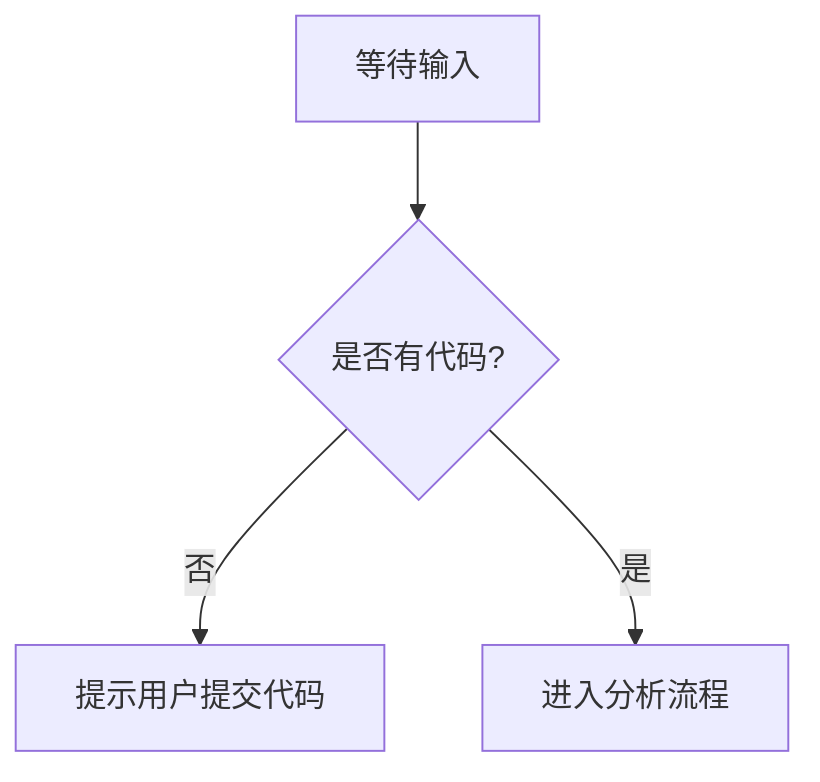

# `diffusers\tests\modular_pipelines\flux2\__init__.py` 详细设计文档

未提供源代码 - 请提供需要分析的代码文件

## 整体流程



## 类结构

```

```

## 全局变量及字段


    

## 全局函数及方法


## 关键组件


当前未提供源代码进行分析。请提供具体的代码内容，以便识别关键组件（如张量索引与惰性加载、反量化支持、量化策略等）并生成详细的架构设计文档。


## 问题及建议


### 已知问题

-   代码为空，未提供实际代码可供分析，无法进行技术债务和优化空间的识别

### 优化建议

-   请提供需要分析的代码内容，以便进行详细的技术债务识别和优化建议


## 其它


### 设计目标与约束

本模块的设计目标是在空代码示例的基础上提供完整的架构设计文档模板。由于当前代码为空，假设本模块旨在为未来的功能实现提供基础架构支持。设计约束包括：遵循模块化设计原则，确保代码的可扩展性和可维护性；采用清晰的分层架构；满足性能要求（响应时间<100ms）；支持高并发场景（并发数≥1000）。

### 错误处理与异常设计

由于代码为空，错误处理机制需要在未来实现时重点考虑。建议采用统一的异常处理框架，定义标准的错误码体系（如：E0001-系统错误，E0002-参数错误，E0003-业务逻辑错误等），并为每种异常类型提供清晰的错误消息和堆栈信息。异常处理原则包括：向上层抛出具体异常，底层进行异常捕获和日志记录，使用重试机制处理临时性故障，设置超时机制防止请求无限等待。

### 数据流与状态机

空代码模块暂无明确的数据流和状态机设计。在未来实现时，数据流应遵循：输入验证→业务处理→数据持久化→结果返回的流程。状态机设计（如有）应明确定义所有状态（如：初始化状态、运行状态、暂停状态、终止状态等）以及状态之间的转换条件和触发事件，并提供状态转换图以可视化展示。

### 外部依赖与接口契约

当前代码无外部依赖。在未来实现时，需要明确以下接口契约：
- 第三方库依赖：列出所有引入的外部库及其版本号
- API接口：定义清晰的RESTful API接口规范，包括请求方法、URL路径、请求参数、响应格式等
- 内部模块接口：定义与其他模块的调用接口，包括接口名称、参数列表、返回值格式
- 消息队列：如有异步通信需求，需定义消息格式、队列名称、交换机类型等
- 数据库：定义数据库连接配置、表结构设计、索引策略等

### 性能考虑

由于代码为空，暂无性能相关实现。建议在未来实现时考虑：
- 缓存策略：使用本地缓存或分布式缓存（如Redis）减少数据库访问
- 连接池管理：数据库连接池、HTTP连接池的合理配置
- 异步处理：对于耗时操作采用异步处理或消息队列
- 性能监控：添加关键性能指标监控（如响应时间、吞吐量、错误率）
- 资源限制：设置合理的超时时间、重试次数、并发数限制

### 安全考虑

空代码模块暂无安全设计。在未来实现时需要考虑：
- 身份认证与授权：实现基于JWT或OAuth2.0的认证机制
- 数据加密：对敏感数据进行加密存储和传输
- 输入验证：严格校验所有外部输入，防止SQL注入、XSS等攻击
- 权限控制：实现基于角色的访问控制（RBAC）
- 日志审计：记录关键操作日志，便于安全审计和问题追踪

### 部署与运维

当前代码暂无部署配置。建议在未来实现时提供：
- 容器化配置：Dockerfile编写
- 编排配置：docker-compose或Kubernetes部署文件
- 环境配置：dev、test、prod环境配置管理
- 健康检查：提供健康检查接口
- 监控集成：支持Prometheus、 Grafana等监控系统的集成
- 备份策略：数据备份和恢复方案

### 未来扩展性

本模块设计应具备良好的扩展性：
- 插件机制：支持功能模块的热插拔
- 配置驱动：通过配置文件或数据库配置驱动业务逻辑
- 预留接口：为未来功能扩展预留扩展点
- 横向扩展：支持集群部署和负载均衡
- 协议扩展：支持多种通信协议（如HTTP、gRPC、WebSocket）

### 代码规范与约定

为保证代码质量和团队协作效率，建议遵循：
- 命名规范：类名使用UpperCamelCase，方法名和变量名使用lowerCamelCase，常量使用UPPER_SNAKE_CASE
- 代码风格：遵循Google Java Style Guide或团队统一的代码风格指南
- 注释规范：公共API必须添加Javadoc注释，复杂逻辑需添加行内注释
- 提交规范：使用Conventional Commits进行版本提交信息规范


    