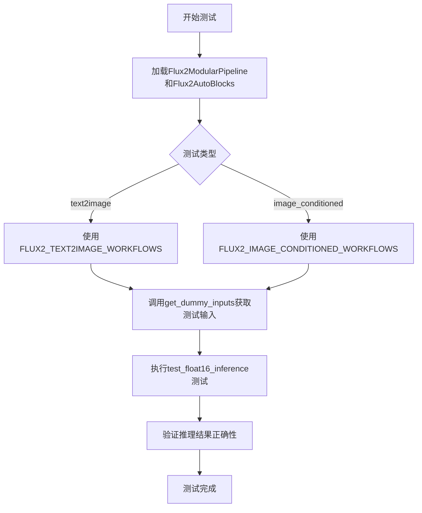
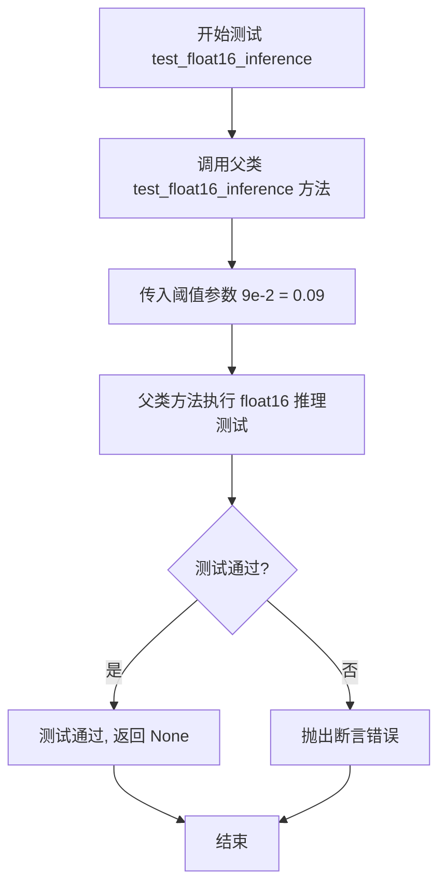
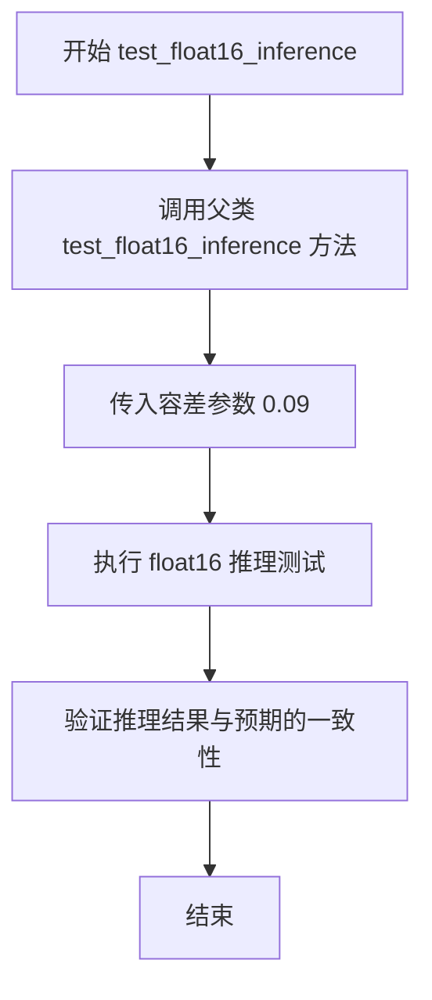

# `diffusers\tests\modular_pipelines\flux2\test_modular_pipeline_flux2.py` 详细设计文档

这是一个用于测试HuggingFace diffusers库中Flux2模块化流水线的测试文件，包含了text2image和image_conditioned两种工作流的单元测试，验证模块化管道的设计正确性和float16推理性能。

## 整体流程



## 类结构

```
TestFlux2ModularPipelineFast (text2image测试类)
└── TestFlux2ImageConditionedModularPipelineFast (image_conditioned测试类)
    └── ModularPipelineTesterMixin (父类/混入类)
```

## 全局变量及字段


### `FLUX2_TEXT2IMAGE_WORKFLOWS`
    
text2image工作流定义

类型：`dict`
    


### `FLUX2_IMAGE_CONDITIONED_WORKFLOWS`
    
image_conditioned工作流定义

类型：`dict`
    


### `TestFlux2ModularPipelineFast.pipeline_class`
    
流水线类

类型：`Flux2ModularPipeline`
    


### `TestFlux2ModularPipelineFast.pipeline_blocks_class`
    
流水线块类

类型：`Flux2AutoBlocks`
    


### `TestFlux2ModularPipelineFast.pretrained_model_name_or_path`
    
预训练模型路径

类型：`str`
    


### `TestFlux2ModularPipelineFast.params`
    
参数集合

类型：`frozenset`
    


### `TestFlux2ModularPipelineFast.batch_params`
    
批处理参数集合

类型：`frozenset`
    


### `TestFlux2ModularPipelineFast.expected_workflow_blocks`
    
预期工作流块

类型：`dict`
    


### `TestFlux2ImageConditionedModularPipelineFast.pipeline_class`
    
流水线类

类型：`Flux2ModularPipeline`
    


### `TestFlux2ImageConditionedModularPipelineFast.pipeline_blocks_class`
    
流水线块类

类型：`Flux2AutoBlocks`
    


### `TestFlux2ImageConditionedModularPipelineFast.pretrained_model_name_or_path`
    
预训练模型路径

类型：`str`
    


### `TestFlux2ImageConditionedModularPipelineFast.params`
    
参数集合

类型：`frozenset`
    


### `TestFlux2ImageConditionedModularPipelineFast.batch_params`
    
批处理参数集合

类型：`frozenset`
    


### `TestFlux2ImageConditionedModularPipelineFast.expected_workflow_blocks`
    
预期工作流块

类型：`dict`
    
    

## 全局函数及方法


### `TestFlux2ModularPipelineFast.get_dummy_inputs`

该方法为 Flux2 模块化管道测试生成虚拟输入数据，通过指定随机种子确保测试的可重复性，返回包含提示词、生成器、推理步数、引导 scale、图像尺寸等关键参数的字典，供后续单元测试使用。

参数：

- `seed`：`int`，随机种子，用于初始化生成器以确保测试结果可复现，默认值为 0

返回值：`Dict[str, Any]`，包含以下键值的字典：
- `prompt`：文本提示词
- `max_sequence_length`：最大序列长度
- `text_encoder_out_layers`：文本编码器输出层数
- `generator`：PyTorch 生成器对象
- `num_inference_steps`：推理步数
- `guidance_scale`：引导强度
- `height`：生成图像高度
- `width`：生成图像宽度
- `output_type`：输出类型

#### 流程图

```mermaid
flowchart TD
    A[开始 get_dummy_inputs] --> B[调用 self.get_generator(seed 获取生成器]
    B --> C[构建输入字典 inputs]
    C --> D[设置 prompt: 'A painting of a squirrel eating a burger']
    D --> E[设置 max_sequence_length: 8]
    E --> F[设置 text_encoder_out_layers: (1,)]
    F --> G[设置 generator: 生成器对象]
    G --> H[设置 num_inference_steps: 2]
    H --> I[设置 guidance_scale: 4.0]
    I --> J[设置 height: 32]
    J --> K[设置 width: 32]
    K --> L[设置 output_type: 'pt']
    L --> M[返回 inputs 字典]
```

#### 带注释源码

```python
def get_dummy_inputs(self, seed=0):
    """
    生成虚拟测试输入，用于 Flux2 模块化管道的单元测试。
    
    参数:
        seed (int): 随机种子，用于初始化生成器确保测试可复现，默认值为 0
    
    返回:
        dict: 包含测试所需各项参数的字典
    """
    # 使用传入的种子获取生成器，确保测试结果可重复
    generator = self.get_generator(seed)
    
    # 构建输入参数字典
    inputs = {
        "prompt": "A painting of a squirrel eating a burger",  # 测试用文本提示词
        # TODO (Dhruv): Update text encoder config so that vocab_size matches tokenizer
        "max_sequence_length": 8,  # 最大序列长度，临时解决方案以绕过词汇表大小不匹配问题
        "text_encoder_out_layers": (1,),  # 文本编码器输出层数元组
        "generator": generator,  # PyTorch 生成器对象，用于确定性随机生成
        "num_inference_steps": 2,  # 扩散模型推理步数
        "guidance_scale": 4.0,  # Classifier-free guidance 强度参数
        "height": 32,  # 生成图像高度（像素）
        "width": 32,  # 生成图像宽度（像素）
        "output_type": "pt",  # 输出类型，'pt' 表示返回 PyTorch 张量
    }
    
    # 返回完整的输入字典，供测试调用管道使用
    return inputs
```


### `TestFlux2ModularPipelineFast.test_float16_inference`

该测试方法用于验证 Flux2 模块化流水线在 float16（半精度）推理模式下的正确性，通过调用父类的测试方法并传入指定的误差容忍阈值（0.09）来执行测试。

参数：

- `self`：`TestFlux2ModularPipelineFast`，测试类的实例本身（隐含参数）

返回值：`None`，pytest 测试方法通常不返回值，测试结果通过断言或异常机制报告

#### 流程图



#### 带注释源码

```python
def test_float16_inference(self):
    """
    测试 float16 推理功能
    
    该方法重写了父类的 test_float16_inference 方法，
    用于验证 Flux2 模块化流水线在 float16（半精度）推理模式下的正确性。
    通过调用父类方法并传入自定义的误差容忍阈值（0.09）来执行测试。
    
    参数:
        self: TestFlux2ModularPipelineFast 的实例
        
    返回值:
        None: pytest 测试方法不返回具体值，结果通过断言机制报告
        
    异常:
        AssertionError: 当 float16 推理结果与预期误差超过阈值时抛出
    """
    # 调用父类 (ModularPipelineTesterMixin) 的 test_float16_inference 方法
    # 传入参数 9e-2 (0.09) 作为 float16 推理的误差容忍阈值
    super().test_float16_inference(9e-2)
```


### `TestFlux2ImageConditionedModularPipelineFast.get_dummy_inputs`

生成虚拟测试输入数据，用于测试 Flux2 图像条件模块化管道。该方法创建一个包含文本提示、图像和推理参数的字典，以支持自动化测试流程。

参数：

- `seed`：`int`，随机种子，用于生成可重复的测试数据（默认值：0）

返回值：`Dict`，包含虚拟测试输入的字典，包含以下键值对：
- `prompt`：文本提示
- `max_sequence_length`：最大序列长度
- `text_encoder_out_layers`：文本编码器输出层数
- `generator`：随机数生成器
- `num_inference_steps`：推理步数
- `guidance_scale`：引导尺度
- `height`：生成图像高度
- `width`：生成图像宽度
- `output_type`：输出类型
- `image`：输入图像（PIL.Image 对象）

#### 流程图

```mermaid
flowchart TD
    A[开始 get_dummy_inputs] --> B[获取生成器: generator = self.get_generator(seed)]
    B --> C[创建基础输入字典 inputs]
    C --> D[生成随机图像张量: floats_tensor]
    D --> E[转换图像张量形状和格式]
    E --> F[将numpy数组转换为PIL图像]
    F --> G[将图像添加到输入字典: inputs['image'] = init_image]
    G --> H[返回inputs字典]
```

#### 带注释源码

```python
def get_dummy_inputs(self, seed=0):
    # 获取随机数生成器，确保测试结果可复现
    generator = self.get_generator(seed)
    
    # 构建基础输入字典，包含文本生成所需的参数
    inputs = {
        "prompt": "A painting of a squirrel eating a burger",  # 测试用文本提示
        "max_sequence_length": 8,  # 最大序列长度，绕过词汇表大小不匹配的临时解决方案
        "text_encoder_out_layers": (1,),  # 文本编码器输出层数元组
        "generator": generator,  # 随机数生成器对象
        "num_inference_steps": 2,  # 扩散模型推理步数
        "guidance_scale": 4.0,  # CFG引导尺度参数
        "height": 32,  # 生成图像高度（像素）
        "width": 32,  # 生成图像宽度（像素）
        "output_type": "pt",  # 输出类型为PyTorch张量
    }
    
    # 生成随机图像张量：(1, 3, 64, 64) 形状，3通道，64x64分辨率
    image = floats_tensor((1, 3, 64, 64), rng=random.Random(seed)).to(torch_device)
    
    # 调整图像张量维度顺序：从 (B, C, H, W) 转为 (B, H, W, C)
    # 并取第一个样本，去掉批次维度
    image = image.cpu().permute(0, 2, 3, 1)[0]
    
    # 将归一化图像 [0,1] 转换为 [0,255] 的uint8类型
    # 并转换为RGB模式的PIL图像
    init_image = PIL.Image.fromarray(np.uint8(image * 255)).convert("RGB")
    
    # 将生成的图像添加到输入字典
    inputs["image"] = init_image
    
    # 返回完整的输入字典，用于管道调用
    return inputs
```


### `TestFlux2ImageConditionedModularPipelineFast.test_float16_inference`

该方法用于测试 Flux2 图像条件模块化管道在 float16（半精度）推理模式下的功能是否正常，通过调用父类的 test_float16_inference 方法并传入容差参数 0.09 来验证推理结果的准确性。

参数：

- `self`：`TestFlux2ImageConditionedModularPipelineFast`，当前测试类实例，代表图像条件模块化管道的快速测试用例

返回值：`None`，该方法继承自父类，没有显式返回值

#### 流程图



#### 带注释源码

```python
def test_float16_inference(self):
    """
    测试 float16 推理功能
    
    该方法重写了父类的 test_float16_inference 方法，用于验证
    Flux2ImageConditionedModularPipelineFast 在半精度（float16）
    推理模式下的正确性。容差值设为 0.09（9e-2），允许一定的数值误差。
    """
    # 调用父类（ModularPipelineTesterMixin）的 test_float16_inference 方法
    # 传入容差参数 9e-2 = 0.09，用于比较推理结果的差异阈值
    super().test_float16_inference(9e-2)
```


### `TestFlux2ImageConditionedModularPipelineFast.test_inference_batch_single_identical`

这是一个批处理推理一致性测试方法，用于验证当使用批处理大小为1时，批处理推理结果应与单次推理结果一致。由于当前版本不支持批处理推理，该测试被跳过。

参数：

- `self`：`TestFlux2ImageConditionedModularPipelineFast`，隐式参数，表示当前测试类实例
- `batch_size`：`int`，批处理大小，默认为2
- `expected_max_diff`：`float`，期望的最大差异阈值，默认为0.0001

返回值：`None`，该方法被跳过，不执行任何操作

#### 流程图

```mermaid
flowchart TD
    A[开始测试] --> B{检查装饰器}
    B --> C[被@pytest.mark.skip装饰]
    C --> D[跳过测试并返回]
    D --> E[测试结束]
    
    style C fill:#ffcccc
    style D fill:#ffcccc
    style E fill:#ccffcc
```

#### 带注释源码

```python
@pytest.mark.skip(reason="batched inference is currently not supported")
def test_inference_batch_single_identical(self, batch_size=2, expected_max_diff=0.0001):
    """
    测试批处理推理时，单个样本的输出应与单次推理输出一致。
    
    参数:
        batch_size: int, 批处理大小，默认值为2
        expected_max_diff: float, 期望的最大差异阈值，默认值为0.0001
    
    返回:
        None: 由于测试被跳过，不返回任何值
    """
    return
```

## 关键组件


### Flux2ModularPipeline

模块化管道类，协调Flux2模型的文本到图像和图像条件生成流程。

### Flux2AutoBlocks

自动构建和管理管道块的类，用于动态组合模型组件。

### Flux2TextEncoderStep

将文本提示编码为文本嵌入的步骤，为去噪过程提供文本条件。

### Flux2ProcessImagesInputStep

预处理输入图像的步骤，包括调整大小和归一化，以便后续处理。

### Flux2VaeEncoderStep

使用变分自编码器（VAE）编码图像的步骤，生成图像潜在表示。

### Flux2TextInputStep

准备文本输入的步骤，包括tokenization和嵌入处理。

### Flux2PrepareImageLatentsStep

准备图像潜在向量的步骤，将编码后的图像转换为去噪网络所需的格式。

### Flux2PrepareLatentsStep

准备初始潜在向量的步骤，初始化噪声或特定向量以开始去噪。

### Flux2SetTimestepsStep

设置扩散模型时间步的步骤，确定去噪过程的调度和迭代次数。

### Flux2PrepareGuidanceStep

准备引导条件的步骤，处理分类器-free guidance所需的向量。

### Flux2RoPEInputsStep

准备旋转位置编码（RoPE）输入的步骤，用于增强模型的上下文理解能力。

### Flux2DenoiseStep

执行去噪过程的步骤，通过迭代 refinement 从噪声生成潜在图像。

### Flux2UnpackLatentsStep

解包潜在向量的步骤，将打包的数据展开为标准格式以便后续处理。

### Flux2DecodeStep

将潜在向量解码为最终图像的步骤，使用VAE解码器生成像素输出。

## 问题及建议


### 已知问题

-   **硬编码的变通方案**：`max_sequence_length = 8` 是一个 hack，用于绕过词汇表大小不匹配的问题，代码中有 TODO 注释说明需要更新 text encoder 配置
-   **代码重复**：两个测试类中的 `get_dummy_inputs` 方法、几乎所有类属性（`pipeline_class`、`pipeline_blocks_class`、`pretrained_model_name_or_path`、`test_float16_inference`）完全重复
-   **工作流定义重复**：`FLUX2_TEXT2IMAGE_WORKFLOWS` 和 `FLUX2_IMAGE_CONDITIONED_WORKFLOWS` 存在大量重复的步骤定义
-   **硬编码的测试参数**：`num_inference_steps=2`、`guidance_scale=4.0`、`height=32`、`width=32` 等参数直接硬编码在 `get_dummy_inputs` 中，缺乏配置灵活性
-   **被跳过的测试**：`test_inference_batch_single_identical` 因"batched inference is currently not supported"被跳过，批量推理功能未验证
-   **魔法数字**：`9e-2` 作为 `test_float16_inference` 的 expected_max_diff 参数重复出现两次，无解释
-   **测试方法实现不完整**：跳过测试的方法返回 `return` 而不是使用 `pytest.skip()`，不符合测试规范
-   **缺失输入验证**：没有对 `get_dummy_inputs` 的输入参数进行校验或默认值处理

### 优化建议

-   将重复的类属性提取到基类或 mixin 中，使用继承或组合减少代码冗余
-   将 `get_dummy_inputs` 方法抽取为可配置的工具函数，支持参数化定制
-   使用配置类或数据驱动方式定义工作流，复用共同的基础工作流步骤
-   使用配置文件或环境变量管理模型路径和测试参数，提高可维护性
-   补充被跳过测试的实现，或在文档中明确标注为已知限制
-   将魔法数字定义为常量或配置参数，并添加注释说明其含义
-   修复跳过测试的方式，使用 `pytest.skip(reason=...)` 替代空返回
-   为 `get_dummy_inputs` 添加参数校验和默认值处理逻辑
-   补充测试类和方法的文档字符串，说明测试目的和约束条件

## 其它


### 设计目标与约束

本测试文件旨在验证 Flux2ModularPipeline 的模块化架构是否正确实现，支持文本到图像生成和图像条件生成两种工作流。设计约束包括：必须继承 ModularPipelineTesterMixin，使用预定义的工作流块名称，遵循 hf-internal-testing/tiny-fux2-modular 模型的接口规范。

### 错误处理与异常设计

测试用例中对潜在错误进行了处理：test_float16_inference 允许 9e-2 的误差阈值；test_inference_batch_single_identical 被标记为跳过，原因是当前不支持批量推理；get_dummy_inputs 方法中通过 max_sequence_length 参数绕过词汇表大小不匹配的问题（标记为 TODO）。

### 数据流与状态机

文本到图像工作流数据流：prompt → Flux2TextEncoderStep → Flux2TextInputStep → Flux2PrepareLatentsStep → Flux2SetTimestepsStep → Flux2PrepareGuidanceStep → Flux2RoPEInputsStep → Flux2DenoiseStep → Flux2UnpackLatentsStep → Flux2DecodeStep。图像条件工作流增加了图像预处理步骤：Flux2ProcessImagesInputStep → Flux2VaeEncoderStep → Flux2PrepareImageLatentsStep。

### 外部依赖与接口契约

依赖包括：diffusers.modular_pipelines 中的 Flux2AutoBlocks 和 Flux2ModularPipeline；测试工具 floats_tensor 和 torch_device；PIL 图像处理；numpy 数值计算；pytest 测试框架。接口契约要求 pipeline_class 必须是 Flux2ModularPipeline，pipeline_blocks_class 必须是 Flux2AutoBlocks，pretrained_model_name_or_path 必须是预定义的小型测试模型。

### 配置与参数说明

params 定义了单样本推理参数集合：prompt、height、width、guidance_scale。batch_params 定义了支持批处理的参数：prompt（文本到图像）或 prompt 和 image（图像条件）。expected_workflow_blocks 定义了每个工作流包含的步骤块名称序列。get_dummy_inputs 返回包含所有必需参数的字典，包括 generator、num_inference_steps、output_type 等。

### 性能基准与优化空间

当前测试使用极少的推理步数（num_inference_steps=2）和小尺寸图像（32x32）以加快测试速度。优化空间：可增加端到端性能基准测试；可添加内存占用测试；可增加推理时间测量。

### 安全考虑与潜在风险

测试代码不涉及实际模型权重下载，风险较低。潜在风险：依赖外部模型仓库 hf-internal-testing，可能存在可用性问题；跳过批处理推理测试可能导致相关功能回归。

### 测试覆盖范围

覆盖场景：文本到图像生成流程验证；图像条件生成流程验证；float16 推理精度测试。缺失覆盖：完整的批量推理测试；错误输入验证；边界条件测试（如空 prompt、极大分辨率等）。

### 版本与兼容性

代码使用 Python 3 编码声明，依赖 diffusers 库的模块化流水线接口。需确保与 Hugging Face diffusers 库的 Flux2 相关类保持接口兼容。

    