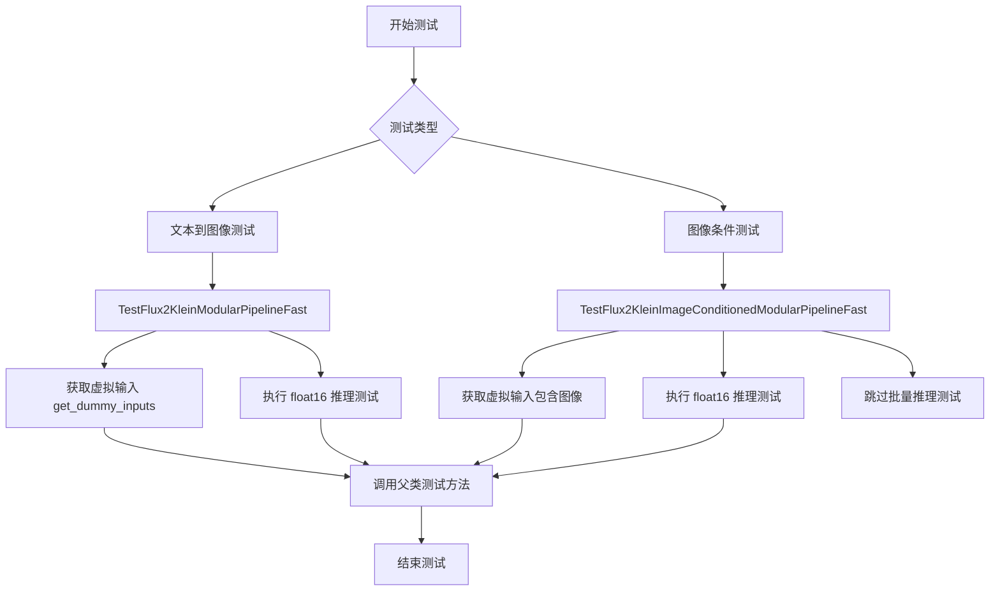
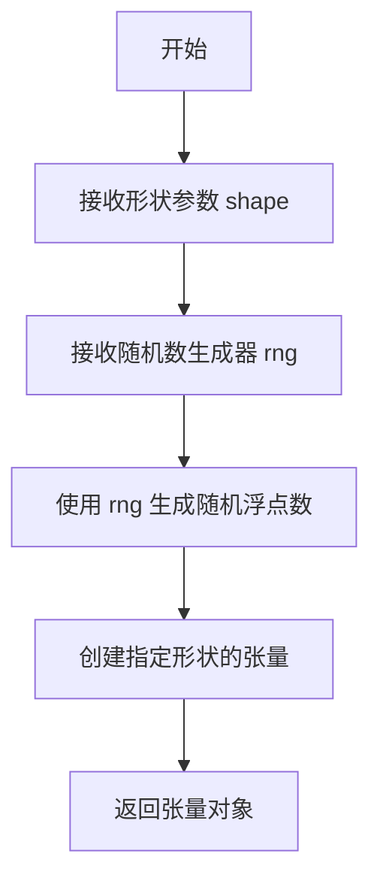
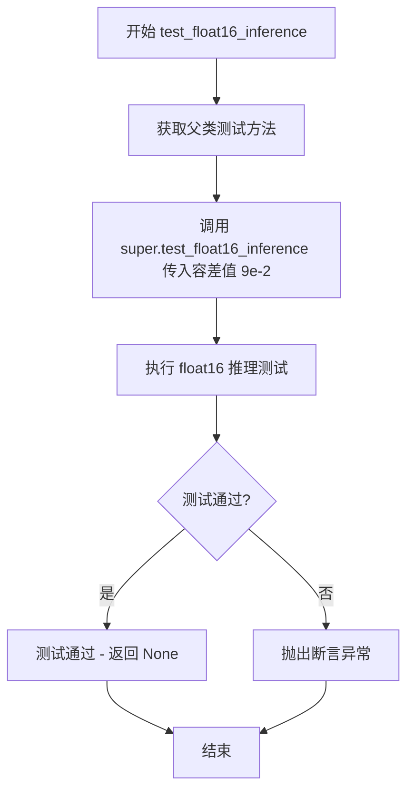
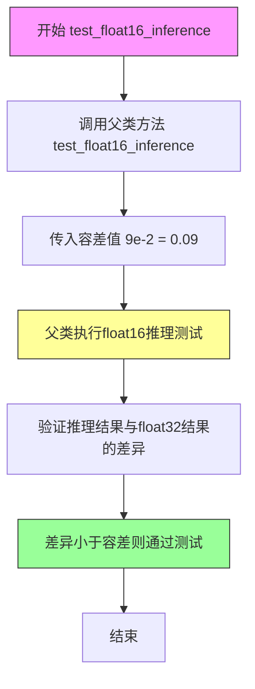
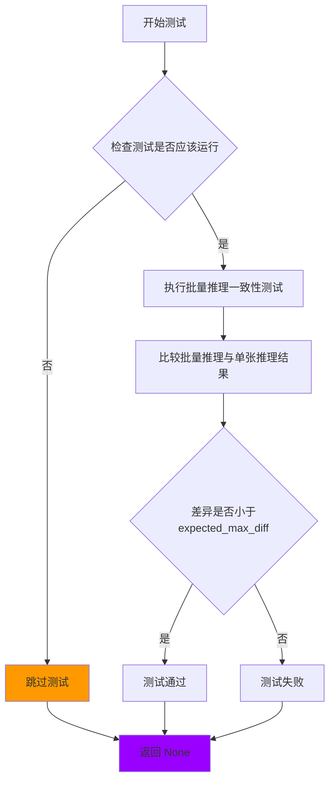

# `diffusers\tests\modular_pipelines\flux2\test_modular_pipeline_flux2_klein.py` 详细设计文档

这是一个测试文件，用于测试Flux2Klein模块化管道（Flux2KleinModularPipeline），包含文本到图像生成和图像条件生成两种工作流程的单元测试和集成测试。

## 整体流程



## 类结构

```
ModularPipelineTesterMixin (测试混入类)
└── TestFlux2KleinModularPipelineFast (文本到图像测试类)
└── TestFlux2KleinImageConditionedModularPipelineFast (图像条件测试类)
```

## 全局变量及字段


### `FLUX2_KLEIN_WORKFLOWS`
    
定义text2image任务的模块化管道工作流，包含文本编码、去噪、潜在向量准备、RoPE输入处理、去噪步骤和解码步骤的映射关系

类型：`dict`
    


### `FLUX2_KLEIN_IMAGE_CONDITIONED_WORKFLOWS`
    
定义图像条件任务的模块化管道工作流，在text2image基础上增加了图像预处理、VAE编码和图像潜在向量准备步骤

类型：`dict`
    


### `TestFlux2KleinModularPipelineFast.pipeline_class`
    
模块化管道的类对象，用于执行Flux2 Klein模型的推理

类型：`Flux2KleinModularPipeline`
    


### `TestFlux2KleinModularPipelineFast.pipeline_blocks_class`
    
自动块类，用于管理管道中各个处理步骤的自动组装

类型：`Flux2KleinAutoBlocks`
    


### `TestFlux2KleinModularPipelineFast.pretrained_model_name_or_path`
    
预训练模型的名称或路径，此处为hf-internal-testing/tiny-flux2-klein-modular

类型：`str`
    


### `TestFlux2KleinModularPipelineFast.params`
    
管道可接受的参数字段集合，包含prompt、height、width

类型：`frozenset`
    


### `TestFlux2KleinModularPipelineFast.batch_params`
    
支持批处理的参数字段集合，此处仅包含prompt

类型：`frozenset`
    


### `TestFlux2KleinModularPipelineFast.expected_workflow_blocks`
    
预期的工作流块字典，定义了管道执行时各个步骤的顺序和名称

类型：`dict`
    


### `TestFlux2KleinImageConditionedModularPipelineFast.pipeline_class`
    
模块化管道的类对象，用于执行Flux2 Klein模型的图像条件推理

类型：`Flux2KleinModularPipeline`
    


### `TestFlux2KleinImageConditionedModularPipelineFast.pipeline_blocks_class`
    
自动块类，用于管理图像条件管道中各个处理步骤的自动组装

类型：`Flux2KleinAutoBlocks`
    


### `TestFlux2KleinImageConditionedModularPipelineFast.pretrained_model_name_or_path`
    
预训练模型的名称或路径，此处为hf-internal-testing/tiny-flux2-klein-modular

类型：`str`
    


### `TestFlux2KleinImageConditionedModularPipelineFast.params`
    
管道可接受的参数字段集合，包含prompt、height、width、image

类型：`frozenset`
    


### `TestFlux2KleinImageConditionedModularPipelineFast.batch_params`
    
支持批处理的参数字段集合，包含prompt和image

类型：`frozenset`
    


### `TestFlux2KleinImageConditionedModularPipelineFast.expected_workflow_blocks`
    
预期的工作流块字典，定义了图像条件管道执行时各个步骤的顺序和名称

类型：`dict`
    
    

## 全局函数及方法


### `floats_tensor`

生成指定形状的随机浮点数张量，通常用于测试目的。

参数：

-  `shape`：元组，要生成的张量形状，如 `(1, 3, 64, 64)`
-  `rng`：`random.Random`，随机数生成器实例，用于控制随机性

返回值：`Tensor`，PyTorch 张量对象，包含指定形状的随机浮点数

#### 流程图



#### 带注释源码

```python
# 注意：floats_tensor 是从 testing_utils 模块导入的外部函数
# 下面是基于使用模式的推断实现

def floats_tensor(shape, rng=None):
    """
    生成指定形状的随机浮点数张量
    
    参数:
        shape: 张量的形状元组，如 (1, 3, 64, 64)
        rng: 随机数生成器，如果为 None 则使用默认随机生成器
    
    返回:
        包含随机浮点数的 PyTorch 张量
    """
    if rng is None:
        rng = random.Random()
    
    # 生成符合正态分布或均匀分布的随机数
    # 创建指定形状的张量
    # 返回张量对象
```

> **注意**：由于 `floats_tensor` 函数定义在 `...testing_utils` 模块中，而非当前代码文件内，上述源码是基于其使用方式和常见测试工具函数模式的推测实现。实际实现可能包含更多参数（如数据类型、分布类型等）。


### `torch_device`

`torch_device` 是一个从 `testing_utils` 模块导入的全局变量，用于指定 PyTorch 张量操作的目标计算设备（通常是 'cuda'、'cpu' 或 'mps' 等设备标识字符串或设备对象）。

#### 带注释源码

```
# 从 testing_utils 模块导入全局变量 torch_device
# 该变量在测试文件中被用于将张量移动到指定的计算设备
from ...testing_utils import floats_tensor, torch_device

# 使用示例：将张量移动到 torch_device 指定的设备上
image = floats_tensor((1, 3, 64, 64), rng=random.Random(seed)).to(torch_device)
```

#### 说明

由于 `torch_device` 是从外部模块 `testing_utils` 导入的全局变量，而非在本文件中定义，因此：

1. **变量类型**：根据 Hugging Face diffusers 项目的惯例，`torch_device` 通常是 `str` 类型，值为 `'cuda'`、`'cpu'` 或 `'mps'` 等设备标识符；在某些测试配置中也可能是 `torch.device` 类型。

2. **定义位置**：该变量通常在 `testing_utils` 模块中定义，可能通过环境变量或配置自动检测可用设备（优先 CUDA）。

3. **使用场景**：在测试代码中用于将张量、模型等移动到目标设备上进行推理测试，确保测试覆盖不同的设备场景。

4. **相关变量**：同模块导入的 `floats_tensor` 是用于生成随机浮点张量的测试工具函数。


### `TestFlux2KleinModularPipelineFast.get_dummy_inputs`

该方法用于生成 Flux2KleinModularPipeline 模块化管道的虚拟测试输入数据，通过接收一个随机种子参数来初始化生成器，并构建包含提示词、序列长度、推理步数、图像尺寸及输出类型等关键参数的字典，以供单元测试使用。

#### 参数

- `seed`：`int`，随机数生成器的种子值，用于确保测试结果的可重复性，默认值为 `0`

#### 流程图

```mermaid
flowchart TD
    A[开始 get_dummy_inputs] --> B[调用 self.get_generator(seed)]
    B --> C[创建包含测试参数的字典 inputs]
    C --> D[设置 prompt: 'A painting of a squirrel eating a burger']
    D --> E[设置 max_sequence_length: 8]
    E --> F[设置 text_encoder_out_layers: (1,)]
    F --> G[设置 generator: 使用 seed 创建的生成器]
    G --> H[设置 num_inference_steps: 2]
    H --> I[设置 height: 32]
    I --> J[设置 width: 32]
    J --> K[设置 output_type: 'pt']
    K --> L[返回 inputs 字典]
```

#### 带注释源码

```python
def get_dummy_inputs(self, seed=0):
    """
    生成用于 Flux2KleinModularPipeline 测试的虚拟输入参数
    
    参数:
        seed: 随机数生成器的种子，用于确保测试的可重复性
    
    返回:
        包含所有测试所需参数的字典
    """
    # 使用种子初始化随机数生成器，确保测试结果可复现
    generator = self.get_generator(seed)
    
    # 构建测试输入字典，包含管道所需的各种参数
    inputs = {
        "prompt": "A painting of a squirrel eating a burger",  # 测试用的提示词
        # TODO (Dhruv): Update text encoder config so that vocab_size matches tokenizer
        "max_sequence_length": 8,  # 最大序列长度（因词汇表大小不匹配的临时解决方案）
        "text_encoder_out_layers": (1,),  # 文本编码器输出层数
        "generator": generator,  # 随机数生成器
        "num_inference_steps": 2,  # 推理步数（测试用较少步数）
        "height": 32,  # 生成图像的高度
        "width": 32,  # 生成图像的宽度
        "output_type": "pt",  # 输出类型为 PyTorch 张量
    }
    return inputs
```


### `TestFlux2KleinModularPipelineFast.test_float16_inference`

这是一个单元测试方法，用于验证 Flux2KleinModularPipeline 在 float16（半精度）推理模式下的正确性，通过调用父类 `ModularPipelineTesterMixin` 的测试方法并传入容差参数 `9e-2` 来验证推理结果与预期值的一致性，确保管道在低精度模式下能够正常工作。

参数：

- `self`：`TestFlux2KleinModularPipelineFast`，测试类实例，调用该方法的当前对象

返回值：`None`，测试方法无返回值，通过测试框架的断言来验证结果

#### 流程图



#### 带注释源码

```python
def test_float16_inference(self):
    """
    测试 Flux2KleinModularPipeline 在 float16（半精度）推理模式下的正确性。
    
    该方法继承自 ModularPipelineTesterMixin，通过调用父类的测试方法
    来验证管道在 float16 模式下能否正确执行推理，并检查输出结果与
    预期值的一致性（容差为 9e-2）。
    """
    # 调用父类的 test_float16_inference 方法，传入容差值 9e-2
    # 父类方法会执行以下操作：
    # 1. 将模型和输入转换为 float16
    # 2. 执行完整的管道推理
    # 3. 比较 float16 输出与 float32 输出的差异是否在容差范围内
    super().test_float16_inference(9e-2)
```


### `TestFlux2KleinImageConditionedModularPipelineFast.get_dummy_inputs`

该方法用于生成图像条件模块化流水线的虚拟输入数据，构建包含文本提示、图像、生成器等参数的测试字典，以支持流水线推理测试。

参数：

- `seed`：`int`，默认值为0，用于初始化随机数生成器的种子，确保测试结果可复现

返回值：`dict`，返回包含以下键的字典：
- `prompt`：文本提示
- `max_sequence_length`：最大序列长度
- `text_encoder_out_layers`：文本编码器输出层数
- `generator`：随机生成器
- `num_inference_steps`：推理步数
- `height`：图像高度
- `width`：图像宽度
- `output_type`：输出类型
- `image`：输入图像

#### 流程图

```mermaid
flowchart TD
    A[开始] --> B[调用 get_generator(seed) 获取生成器]
    B --> C[创建基础输入字典 inputs]
    C --> D[使用 floats_tensor 生成随机图像张量]
    D --> E[将张量转换为 PIL.Image 图像]
    E --> F[将图像添加到 inputs 字典]
    F --> G[返回完整的 inputs 字典]
```

#### 带注释源码

```python
def get_dummy_inputs(self, seed=0):
    # 使用给定的种子获取随机数生成器，确保测试可复现
    generator = self.get_generator(seed)
    
    # 构建包含基本参数的输入字典
    # prompt: 文本提示，描述生成图像的内容
    # max_sequence_length: 文本编码的最大序列长度（8是绕过词汇表大小不匹配的临时解决方案）
    # text_encoder_out_layers: 文本编码器输出层数元组
    # generator: PyTorch随机数生成器
    # num_inference_steps: 扩散模型推理步数
    # height/width: 生成图像的尺寸
    # output_type: 输出张量类型（"pt"表示PyTorch张量）
    inputs = {
        "prompt": "A painting of a squirrel eating a burger",
        "max_sequence_length": 8,  # bit of a hack to workaround vocab size mismatch
        "text_encoder_out_layers": (1,),
        "generator": generator,
        "num_inference_steps": 2,
        "height": 32,
        "width": 32,
        "output_type": "pt",
    }
    
    # 使用随机张量生成形状为(1, 3, 64, 64)的图像数据
    # 转换为(64, 64, 3)格式以适配PIL图像
    image = floats_tensor((1, 3, 64, 64), rng=random.Random(seed)).to(torch_device)
    image = image.cpu().permute(0, 2, 3, 1)[0]
    
    # 将数值范围从[0,1]转换到[0,255]并创建RGB PIL图像
    init_image = PIL.Image.fromarray(np.uint8(image * 255)).convert("RGB")
    
    # 将生成的图像添加到输入字典中
    inputs["image"] = init_image

    # 返回完整的输入参数字典
    return inputs
```


### `TestFlux2KleinImageConditionedModularPipelineFast.test_float16_inference`

该方法是图像条件Flux2Klein模块化管道的float16推理测试用例，通过调用父类的test_float16_inference方法验证模型在float16精度下的推理正确性，使用容差值9e-2进行结果对比。

参数：

- `self`：隐式的 `TestFlux2KleinImageConditionedModularPipelineFast` 实例，代表当前测试类对象，无需显式传递

返回值：`None`，无返回值，该方法为测试用例，执行验证操作

#### 流程图



#### 带注释源码

```python
def test_float16_inference(self):
    """
    测试float16推理的测试方法。
    
    该方法继承自ModularPipelineTesterMixin父类，
    用于验证Flux2KleinModularPipeline在float16精度下的推理能力。
    
    测试流程：
    1. 将模型转换为float16精度
    2. 执行推理过程
    3. 将结果与float32精度下的结果进行对比
    4. 验证两者差异是否在容差范围内
    """
    # 调用父类的test_float16_inference方法
    # 参数9e-2表示允许的最大误差容差为0.09（即9%）
    super().test_float16_inference(9e-2)
```


### `TestFlux2KleinImageConditionedModularPipelineFast.test_inference_batch_single_identical`

该方法是一个测试方法，用于测试批量推理时单张图像与批量中相同图像的输出一致性。当前该测试被跳过，原因是批量推理目前不受支持。

参数：

- `self`：`TestFlux2KleinImageConditionedModularPipelineFast`，测试类的实例
- `batch_size`：`int`，默认为 2，批量推理的批次大小
- `expected_max_diff`：`float`，默认为 0.0001，批量推理与单张推理结果之间的最大允许差异

返回值：`None`，无返回值（方法直接返回）

#### 流程图



#### 带注释源码

```python
@pytest.mark.skip(reason="batched inference is currently not supported")
def test_inference_batch_single_identical(self, batch_size=2, expected_max_diff=0.0001):
    """
    测试批量推理时，单张图像在批量中与单独推理时的输出一致性。
    
    参数:
        self: 测试类实例
        batch_size: int, 批量大小，默认为 2
        expected_max_diff: float, 允许的最大差异值，默认为 0.0001
    
    返回:
        None: 该方法当前被跳过，不执行任何测试
    """
    return
```

## 关键组件


### Flux2KleinModularPipeline

模块化扩散管道实现，支持Flux2模型的text2image和image_conditioned生成任务，通过模块化架构将文本编码、去噪、VAE解码等步骤组合成完整推理流程。

### Flux2KleinAutoBlocks

自动块管理类，负责动态加载和组织管道中各个处理步骤的块结构，支持灵活的流水线配置和工作流调度。

### FLUX2_KLEIN_WORKFLOWS (text2image)

定义text2image生成的工作流结构，包含8个关键步骤：文本编码、噪声输入准备、潜在变量准备、时间步设置、RoPE输入准备、去噪处理、潜在变量解压以及最终解码。

### FLUX2_KLEIN_IMAGE_CONDITIONED_WORKFLOWS

定义图像条件生成的工作流结构，在text2image基础上增加了图像预处理、VAE编码和图像潜在变量准备步骤，共11个处理阶段。

### TestFlux2KleinModularPipelineFast

text2image模式的单元测试类，继承ModularPipelineTesterMixin，提供虚拟输入生成、float16推理测试等功能，验证管道在文本条件下的正确性。

### TestFlux2KleinImageConditionedModularPipelineFast

图像条件生成模式的单元测试类，继承ModularPipelineTesterMixin，支持图像输入处理，验证管道在文本+图像双条件下的正确性。

### Flux2KleinTextEncoderStep

文本编码步骤，负责将输入的prompt文本转换为模型可处理的文本嵌入表示，是管道的第一道处理环节。

### Flux2KleinDenoiseStep

去噪核心步骤，执行主要的U-Net或Transformer去噪推理过程，将带噪声的潜在变量逐步去噪为目标图像的潜在表示。

### Flux2PrepareLatentsStep

潜在变量准备步骤，负责初始化或准备去噪过程所需的初始潜在变量，包括随机噪声生成或特定 latent 的设置。

### Flux2VaeEncoderStep

VAE编码步骤，负责将输入图像编码为潜在空间表示，为图像条件生成提供图像特征 latent。

### Flux2PrepareImageLatentsStep

图像潜在变量准备步骤，处理和准备图像编码器输出的潜在变量，使其适配去噪网络的输入格式。

### Flux2DecodeStep

VAE解码步骤，负责将去噪完成后的潜在变量解码为最终的RGB图像输出。

### get_dummy_inputs

测试辅助函数，生成用于单元测试的虚拟输入数据，包含prompt、max_sequence_length、generator、推理步数、图像尺寸等参数。


## 问题及建议


### 已知问题

- **代码重复**：两个测试类 `TestFlux2KleinModularPipelineFast` 和 `TestFlux2KleinImageConditionedModularPipelineFast` 存在大量重复代码，特别是 `get_dummy_inputs` 和 `test_float16_inference` 方法几乎完全相同
- **硬编码的TODO未解决**：代码中存在 TODO 注释 `# TODO (Dhruv): Update text encoder config so that vocab_size matches tokenizer`，表明有已知问题但长期未修复
- **临时解决方案**：使用 `# bit of a hack to workaround vocab size mismatch` 注释承认 `max_sequence_length = 8` 是一个临时的变通方案，而非根本性解决
- **跳过的测试用例**：`test_inference_batch_single_identical` 被永久跳过且未说明何时可以恢复支持
- **魔法数字缺乏解释**：容差值 `9e-2`、`max_sequence_length = 8`、`height = 32`、`width = 32`、`num_inference_steps = 2` 等关键参数没有注释说明其选择依据
- **测试类缺少文档字符串**：两个测试类都没有类级别的文档说明其测试目的和范围

### 优化建议

- **提取公共基类**：将两个测试类的共同逻辑提取到一个基类中，减少代码重复
- **移除硬编码值**：将魔法数字提取为类属性或常量，提供配置化的方式
- **修复或记录TODO**：要么解决 vocab_size 不匹配的问题，要么创建一个正式的工单跟踪
- **添加文档字符串**：为类和方法添加文档说明其功能、参数含义和返回值
- **审视跳过的测试**：如果批处理推理是重要功能，应创建一个 Issue 跟踪并在代码中注明预计修复时间
- **参数化测试**：考虑使用 pytest 的参数化功能来测试不同的配置组合

## 其它


### 设计目标与约束

本测试文件旨在验证Flux2KleinModularPipeline模块化流水线的功能正确性，包括文本到图像生成和图像条件生成两种工作流程。测试约束包括：使用轻量级预训练模型"hf-internal-testing/tiny-flux2-klein-modular"进行快速测试，batch_size固定为1，推理步数限制为2步，输出图像尺寸为32x32像素。

### 错误处理与异常设计

测试文件中使用了pytest框架的异常处理机制。`test_float16_inference`方法通过调用父类方法执行float16推理测试，若精度不满足阈值(9e-2)会抛出断言错误。`test_inference_batch_single_identical`方法使用`@pytest.mark.skip`装饰器跳过batched推理测试，并在方法体内直接返回，避免执行不支持的操作。TODO注释标记了vocab_size不匹配的已知问题。

### 数据流与状态机

测试数据流遵循以下状态转换：初始化状态 → 输入准备状态 → 推理执行状态 → 输出验证状态。文本到图像流程：prompt → text_encoder → denoise(latents preparation → set_timesteps → rope_inputs → denoise process → unpack latents) → decode → output。图像条件流程：在文本流程基础上增加vae_encoder预处理和图像latents准备步骤。

### 外部依赖与接口契约

本测试依赖以下外部组件：diffusers库的modular_pipelines模块提供Flux2KleinAutoBlocks和Flux2KleinModularPipeline类；pytest框架提供测试运行和跳过机制；PIL库用于图像处理；numpy和random用于数值生成；testing_utils模块提供floats_tensor和torch_device工具函数。模块化流水线通过workflows字典定义各处理步骤的调用顺序和参数传递契约。

### 配置与参数说明

核心配置参数包括：pipeline_class指定待测流水线类为Flux2KleinModularPipeline；pipeline_blocks_class指定块类为Flux2KleinAutoBlocks；params定义了单样本参数集合(prompt, height, width)；batch_params定义了批处理参数集合(prompt)；expected_workflow_blocks定义了预期的workflow块执行顺序。get_dummy_inputs方法生成测试输入：prompt固定为"A painting of a squirrel eating a burger"，max_sequence_length设为8以规避vocab不匹配问题，num_inference_steps设为2，height和width设为32。

### 测试策略

采用继承ModularPipelineTesterMixin混合类的测试策略，实现测试代码复用。测试分为两个主要类：TestFlux2KleinModularPipelineFast测试纯文本生成流程，TestFlux2KleinImageConditionedModularPipelineFast测试图像条件生成流程。每个测试类验证不同的workflow配置，支持float16精度推理测试。测试使用确定性的随机种子(seed=0)确保结果可复现性。

### 性能考虑

测试采用轻量级模型和最小化参数配置以实现快速执行：推理步数仅2步，图像尺寸仅32x32，文本序列长度限制为8。float16推理测试使用较宽松的误差阈值(9e-2)以适应低精度计算的数值误差。跳过batched推理测试以避免内存和计算资源的高需求。

### 安全考虑

测试代码本身不涉及敏感数据处理，但需注意：测试使用的预训练模型来源需验证可靠性；测试过程中可能涉及临时文件创建需妥善处理；PIL.Image.fromarray操作需确保输入数据格式正确以防止图像处理异常。

### 版本兼容性

代码指定Python编码为utf-8，版权声明适用于Apache License 2.0。依赖库版本需与diffusers库版本兼容，特别是modular_pipelines模块的API设计。PIL库需确保支持numpy数组到图像的转换操作。Pytest框架版本需支持skip装饰器和混合类测试模式。

### 使用示例

基础文本生成测试执行流程：
```python
# 实例化测试类
test_instance = TestFlux2KleinModularPipelineFast()
# 获取测试输入
inputs = test_instance.get_dummy_inputs(seed=0)
# 执行float16推理测试
test_instance.test_float16_inference()
```
图像条件生成测试执行流程：
```python
# 实例化测试类
test_instance = TestFlux2KleinImageConditionedModularPipelineFast()
# 获取包含图像的测试输入
inputs = test_instance.get_dummy_inputs(seed=0)
# 执行float16推理测试
test_instance.test_float16_inference()
```


    