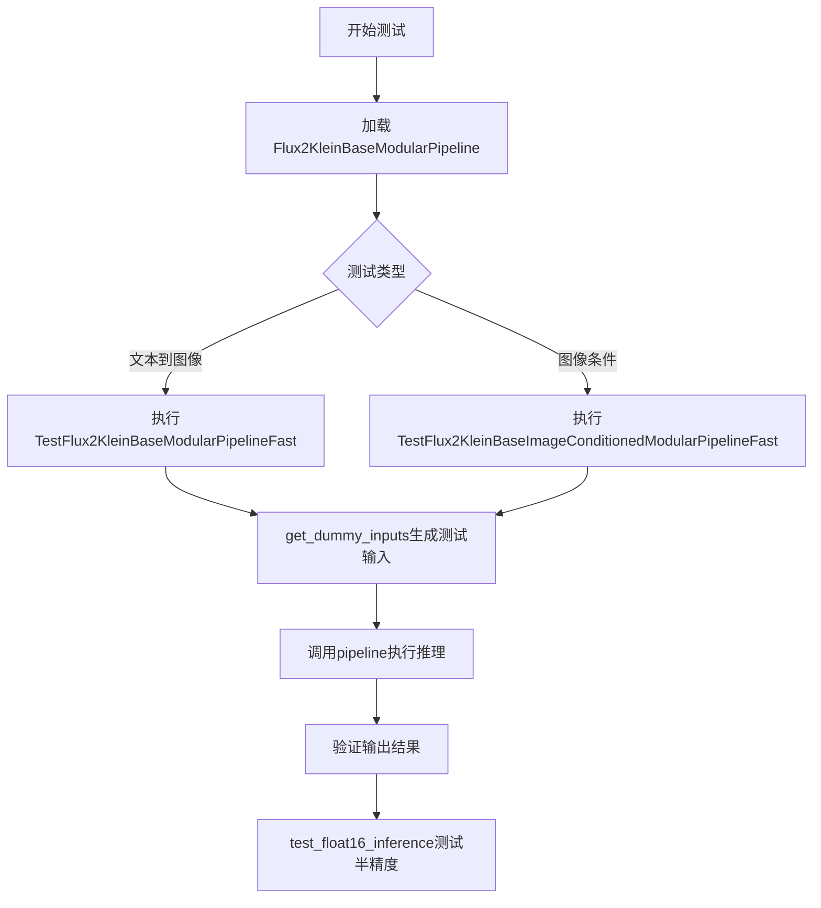
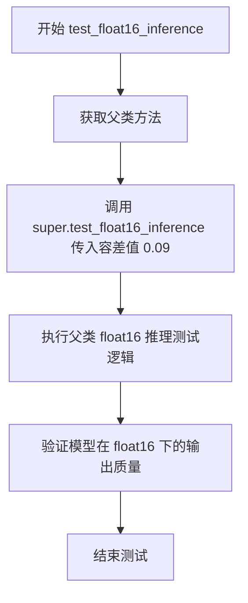
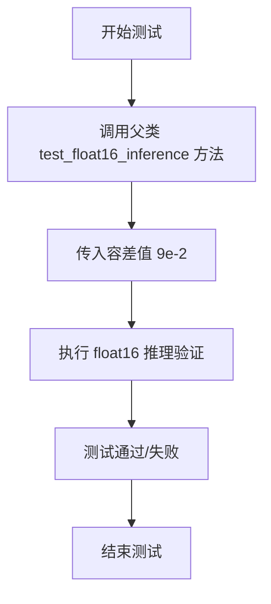
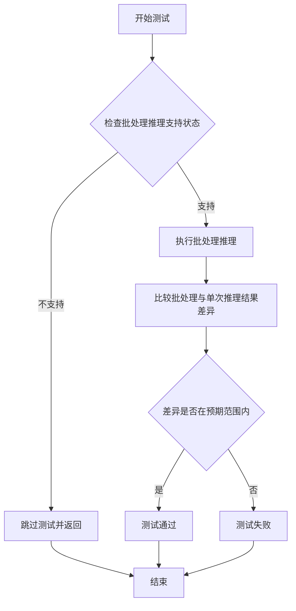

# `diffusers\tests\modular_pipelines\flux2\test_modular_pipeline_flux2_klein_base.py` 详细设计文档

该文件是Flux2KleinBase模块化管道的测试套件，包含了文本到图像生成和图像条件生成两种工作流程的测试用例，用于验证模块化管道的核心功能、工作流块集成以及float16推理能力。

## 整体流程



## 类结构

```
ModularPipelineTesterMixin (测试混入类)
├── TestFlux2KleinBaseModularPipelineFast
│   └── 文本到图像工作流测试
└── TestFlux2KleinBaseImageConditionedModularPipelineFast
    └── 图像条件工作流测试
```

## 全局变量及字段


### `FLUX2_KLEIN_BASE_WORKFLOWS`
    
Dictionary defining the text2image workflow blocks for Flux2 Klein Base modular pipeline, mapping pipeline stages to their corresponding step classes

类型：`dict`
    


### `FLUX2_KLEIN_BASE_IMAGE_CONDITIONED_WORKFLOWS`
    
Dictionary defining the image-conditioned workflow blocks for Flux2 Klein Base modular pipeline, including VAE encoder and image latents preparation steps

类型：`dict`
    


### `TestFlux2KleinBaseModularPipelineFast.pipeline_class`
    
The modular pipeline class being tested for Flux2 Klein Base text2image generation

类型：`Flux2KleinBaseModularPipeline`
    


### `TestFlux2KleinBaseModularPipelineFast.pipeline_blocks_class`
    
The auto blocks class that manages modular pipeline components for Flux2 Klein Base

类型：`Flux2KleinBaseAutoBlocks`
    


### `TestFlux2KleinBaseModularPipelineFast.pretrained_model_name_or_path`
    
The path or identifier of the pretrained tiny-flux2-klein-base-modular model for testing

类型：`str`
    


### `TestFlux2KleinBaseModularPipelineFast.params`
    
Frozenset of parameter names that the pipeline accepts: prompt, height, and width

类型：`frozenset`
    


### `TestFlux2KleinBaseModularPipelineFast.batch_params`
    
Frozenset of parameter names that support batch processing: prompt

类型：`frozenset`
    


### `TestFlux2KleinBaseModularPipelineFast.expected_workflow_blocks`
    
Dictionary containing the expected workflow block sequence for text2image pipeline validation

类型：`dict`
    


### `TestFlux2KleinBaseImageConditionedModularPipelineFast.pipeline_class`
    
The modular pipeline class being tested for Flux2 Klein Base image-conditioned generation

类型：`Flux2KleinBaseModularPipeline`
    


### `TestFlux2KleinBaseImageConditionedModularPipelineFast.pipeline_blocks_class`
    
The auto blocks class that manages modular pipeline components for Flux2 Klein Base

类型：`Flux2KleinBaseAutoBlocks`
    


### `TestFlux2KleinBaseImageConditionedModularPipelineFast.pretrained_model_name_or_path`
    
The path or identifier of the pretrained tiny-flux2-klein-base-modular model for testing

类型：`str`
    


### `TestFlux2KleinBaseImageConditionedModularPipelineFast.params`
    
Frozenset of parameter names that the pipeline accepts: prompt, height, width, and image

类型：`frozenset`
    


### `TestFlux2KleinBaseImageConditionedModularPipelineFast.batch_params`
    
Frozenset of parameter names that support batch processing: prompt and image

类型：`frozenset`
    


### `TestFlux2KleinBaseImageConditionedModularPipelineFast.expected_workflow_blocks`
    
Dictionary containing the expected workflow block sequence for image-conditioned pipeline validation

类型：`dict`
    
    

## 全局函数及方法


### `TestFlux2KleinBaseModularPipelineFast.get_dummy_inputs`

该方法为 Flux2KleinBase 模块化管道测试生成虚拟输入数据，通过接收一个随机种子(seed)来初始化生成器，并构建包含提示词、序列长度、推理步骤数、图像尺寸等参数的测试字典，用于管道的单元测试和集成测试。

参数：

- `seed`：`int`，随机种子，用于初始化生成器以确保测试的可重复性，默认为 0

返回值：`dict`，包含测试所需的所有输入参数字典，包括 prompt、max_sequence_length、text_encoder_out_layers、generator、num_inference_steps、height、width、output_type 等键值对

#### 流程图

```mermaid
flowchart TD
    A[开始 get_dummy_inputs] --> B[调用 self.get_generator(seed)]
    B --> C[创建 generator 对象]
    C --> D[构建 inputs 字典]
    D --> E[设置 prompt: 'A painting of a squirrel eating a burger']
    D --> F[设置 max_sequence_length: 8]
    D --> G[设置 text_encoder_out_layers: (1,)]
    D --> H[设置 generator: generator 对象]
    D --> I[设置 num_inference_steps: 2]
    D --> J[设置 height: 32]
    D --> K[设置 width: 32]
    D --> L[设置 output_type: 'pt']
    L --> M[返回 inputs 字典]
    M --> N[结束]
```

#### 带注释源码

```python
def get_dummy_inputs(self, seed=0):
    """
    生成用于测试 Flux2KleinBaseModularPipeline 的虚拟输入数据
    
    参数:
        seed: int, 随机种子,默认为0,用于确保测试结果的可重复性
    
    返回:
        dict: 包含管道推理所需参数的字典
    """
    # 使用种子初始化随机生成器,确保测试的可确定性
    generator = self.get_generator(seed)
    
    # 构建测试输入参数字典
    inputs = {
        # 文本提示词,用于生成图像的描述
        "prompt": "A painting of a squirrel eating a burger",
        
        # TODO (Dhruv): Update text encoder config so that vocab_size matches tokenizer
        # 序列最大长度,8是针对测试模型的较小值,用于解决词汇表大小不匹配的问题
        "max_sequence_length": 8,  # bit of a hack to workaround vocab size mismatch
        
        # 文本编码器输出层数,测试用元组
        "text_encoder_out_layers": (1,),
        
        # 随机生成器对象,用于扩散过程的随机性控制
        "generator": generator,
        
        # 推理步数,设置为2以加快测试速度
        "num_inference_steps": 2,
        
        # 生成图像的高度(像素)
        "height": 32,
        
        # 生成图像的宽度(像素)
        "width": 32,
        
        # 输出类型,'pt'表示PyTorch张量
        "output_type": "pt",
    }
    return inputs
```


### `TestFlux2KleinBaseModularPipelineFast.test_float16_inference`

该方法用于执行 float16（半精度）推理测试，验证模块化管道在低精度模式下的功能正确性，通过调用父类测试方法并传入容差值（0.09）进行数值比较。

参数：

- `self`：`TestFlux2KleinBaseModularPipelineFast`，测试类实例本身，包含测试所需的配置和工具方法

返回值：`None`，无返回值

#### 流程图



#### 带注释源码

```python
def test_float16_inference(self):
    """
    执行 float16（半精度）推理测试
    
    该测试方法继承自 ModularPipelineTesterMixin，用于验证模块化管道
    在 float16 精度下的推理能力。通过调用父类方法并传入容差值（9e-2）
    来允许一定的数值误差范围，以应对半精度计算带来的精度损失。
    """
    # 调用父类的 test_float16_inference 方法，传入容差值 0.09
    # 容差值用于控制 float16 推理结果与 float32 结果之间的最大允许差异
    super().test_float16_inference(9e-2)
```


### `TestFlux2KleinBaseImageConditionedModularPipelineFast.get_dummy_inputs`

该方法为图像条件化的Flux2KleinBase模块化管道测试生成虚拟输入数据，包括文本提示、图像数据、生成器配置及推理参数，用于验证管道各组件的功能正确性。

参数：

- `seed`：`int`，随机种子，用于生成可复现的随机数据（默认值为 `0`）

返回值：`dict`，包含测试所需的完整输入参数字典，包括提示词、图像、生成器、推理步数、输出类型等

#### 流程图

```mermaid
flowchart TD
    A[开始 get_dummy_inputs] --> B[获取随机生成器: generator = self.get_generator(seed)]
    C[构建基础输入字典 inputs] --> D{添加提示词和配置}
    D --> E[添加 max_sequence_length: 8]
    D --> F[添加 text_encoder_out_layers: (1,)]
    D --> G[添加 generator]
    D --> H[添加 num_inference_steps: 2]
    D --> I[添加 height: 32]
    D --> J[添加 width: 32]
    D --> K[添加 output_type: 'pt']
    
    B --> C
    
    L[生成随机图像: floats_tensor] --> M[转换为torch设备]
    M --> N[CPU转换与维度重排]
    N --> O[转换为PIL图像]
    O --> P[添加image到inputs字典]
    
    C --> P
    P --> Q[返回 inputs 字典]
```

#### 带注释源码

```python
def get_dummy_inputs(self, seed=0):
    """
    生成用于测试图像条件化Flux2KleinBase模块化管道的虚拟输入数据
    
    参数:
        seed: 随机种子，用于确保测试结果的可复现性
    
    返回:
        dict: 包含所有必要输入参数的字典，用于管道推理
    """
    # 使用指定种子获取随机数生成器，确保测试可复现
    generator = self.get_generator(seed)
    
    # 构建基础输入参数字典
    inputs = {
        "prompt": "A painting of a squirrel eating a burger",  # 文本提示词
        # TODO: 需要更新text encoder配置以匹配tokenizer的vocab_size
        "max_sequence_length": 8,  # 临时解决方案：绕过vocab大小不匹配问题
        "text_encoder_out_layers": (1,),  # text encoder输出层数
        "generator": generator,  # 随机数生成器
        "num_inference_steps": 2,  # 推理步数
        "height": 32,  # 输出图像高度
        "width": 32,  # 输出图像宽度
        "output_type": "pt",  # 输出类型为PyTorch张量
    }
    
    # 生成随机图像张量 (1, 3, 64, 64)
    image = floats_tensor((1, 3, 64, 64), rng=random.Random(seed)).to(torch_device)
    # 转换为CPU张量并调整维度顺序 (H, W, C)
    image = image.cpu().permute(0, 2, 3, 1)[0]
    # 转换为PIL图像格式 (0-255范围)
    init_image = PIL.Image.fromarray(np.uint8(image * 255)).convert("RGB")
    
    # 将生成的图像添加到输入字典
    inputs["image"] = init_image

    return inputs
```


### TestFlux2KleinBaseImageConditionedModularPipelineFast.test_float16_inference

执行 float16 推理测试，验证模型在 float16 精度下的推理能力，通过调用父类的测试方法并指定容差值 0.09 来进行测试。

参数：

- `self`：`TestFlux2KleinBaseImageConditionedModularPipelineFast`，隐含的实例自身参数

返回值：`None`，无返回值

#### 流程图



#### 带注释源码

```python
def test_float16_inference(self):
    """
    执行 float16 精度推理的测试方法。
    
    该方法继承自 ModularPipelineTesterMixin 测试基类，用于验证
    Flux2KleinBaseModularPipeline 在 float16（半精度）推理模式下的
    正确性和数值稳定性。
    
    测试通过调用父类方法实现，传入容差值 9e-2 用于控制
    float32 和 float16 推理结果之间的最大允许差异。
    """
    # 调用父类的 test_float16_inference 方法
    # 参数 9e-2 表示允许的最大误差容差为 0.09
    super().test_float16_inference(9e-2)
```


### TestFlux2KleinBaseImageConditionedModularPipelineFast.test_inference_batch_single_identical

该方法是一个测试用例，用于验证Flux2KleinBase模块化Pipeline在批处理推理时单样本与单次推理的一致性。由于当前版本不支持批处理推理，该测试被跳过。

参数：

- `batch_size`：`int`，批处理大小，默认为2
- `expected_max_diff`：`float`，期望的最大差异阈值，默认为0.0001

返回值：`None`，无返回值（测试被跳过）

#### 流程图



#### 带注释源码

```python
@pytest.mark.skip(reason="batched inference is currently not supported")
def test_inference_batch_single_identical(self, batch_size=2, expected_max_diff=0.0001):
    """
    测试批处理推理时单样本是否与单次推理结果完全相同。
    
    参数:
        batch_size: int - 批处理大小，默认值为2
        expected_max_diff: float - 期望的最大差异阈值，默认值为0.0001
    
    返回值:
        None - 该测试当前被跳过，因为批处理推理尚未支持
    """
    return
```

## 关键组件


### Flux2KleinBaseModularPipeline

模块化管道类，用于实现 Flux2 模型的模块化推理流程，支持文本到图像和图像条件生成任务。

### Flux2KleinBaseAutoBlocks

自动块类，负责管理和配置模块化管道中的各个处理步骤（steps），实现工作流步骤的自动注册和调用。

### FLUX2_KLEIN_BASE_WORKFLOWS

文本到图像工作流定义字典，描述了从文本编码到解码的完整处理流程，包含文本编码、潜在变量准备、去噪等步骤。

### FLUX2_KLEIN_BASE_IMAGE_CONDITIONED_WORKFLOWS

图像条件工作流定义字典，描述了带图像输入条件的生成流程，增加了图像预处理、VAE编码和图像潜在变量准备步骤。

### ModularPipelineTesterMixin

测试混入类，提供模块化管道的通用测试方法，包括推理一致性测试、float16推理测试等标准化测试流程。

### 关键步骤组件

文本编码步骤 (Flux2KleinBaseTextEncoderStep)、文本输入步骤 (Flux2KleinBaseTextInputStep)、潜在变量准备步骤 (Flux2PrepareLatentsStep)、时间步设置步骤 (Flux2SetTimestepsStep)、RoPE输入准备步骤 (Flux2KleinBaseRoPEInputsStep)、去噪步骤 (Flux2KleinBaseDenoiseStep)、潜在变量解包步骤 (Flux2UnpackLatentsStep)、解码步骤 (Flux2DecodeStep)、图像预处理步骤 (Flux2ProcessImagesInputStep)、VAE编码步骤 (Flux2VaeEncoderStep)、图像潜在变量准备步骤 (Flux2PrepareImageLatentsStep)。

### 虚拟模型配置

hf-internal-testing/tiny-flux2-klein-base-modular 是用于测试的虚拟小型 Flux2 模型，包含文本编码器、VAE 和去噪器等组件。

### 测试参数配置

params 和 batch_params 定义了管道接受的核心参数（prompt、height、width、image等），用于验证管道接口一致性。

### float16 推理测试

支持 float16 精度推理测试，设置容差阈值为 0.09，用于验证模型在低精度下的推理正确性。


## 问题及建议


### 已知问题

- **TODO 技术债务**：代码中存在 TODO 注释 `# TODO (Dhruv): Update text encoder config so that vocab_size matches tokenizer`，表明文本编码器配置与分词器词汇大小不匹配，需要更新配置
- **代码重复**：`get_dummy_inputs` 方法在两个测试类中高度重复，仅在图像条件版本中额外添加了 `image` 字段，可提取为基类方法或使用组合模式
- **魔法数字**：阈值 `9e-2`、`num_inference_steps=2`、`max_sequence_length=8`、图像尺寸 `32x32` 等均为硬编码，缺乏配置灵活性
- **跳过测试**：`test_inference_batch_single_identic` 被标记为跳过，原因是批量推理功能暂不支持，表明功能不完整
- **注释中的 hack**：代码注释 `# bit of a hack to workaround vocab size mismatch` 表明当前实现是一种临时绕过方案，非永久解决方案

### 优化建议

- **消除 TODO**：与相关团队协调，完成文本编码器配置更新，使词汇大小与分词器匹配
- **提取公共方法**：将 `get_dummy_inputs` 的公共逻辑提取到测试基类或工具函数中，减少重复代码
- **配置化参数**：将硬编码的数值（如推理步数、序列长度、图像尺寸、阈值）提取为类属性或 fixtures，提高测试可配置性
- **实现批量推理**：评估实现批量推理功能的可行性，移除 `@pytest.mark.skip` 跳过标记
- **移除临时 hack**：在修复 TODO 问题后，删除关于 vocab size 匹配的 workaround 代码
- **添加输入验证**：在 `get_dummy_inputs` 中添加参数类型和范围验证，提高测试健壮性

## 其它


### 设计目标与约束

本测试文件旨在验证 Flux2KleinBaseModularPipeline 模块化管道在不同工作流场景下的功能正确性。主要设计目标包括：1）验证 text2image 和 image_conditioned 两种工作流的完整执行流程；2）确保 float16 推理精度符合预期（阈值 9e-2）；3）测试模块化架构中各步骤块（Step）的正确调用和参数传递。约束条件包括：不支持批量推理（已明确跳过 test_inference_batch_single_identical）、依赖特定的预训练模型路径 "hf-internal-testing/tiny-flux2-klein-base-modular"、输入图像尺寸限制为 32x32。

### 错误处理与异常设计

测试代码通过继承 ModularPipelineTesterMixin 复用通用测试逻辑，隐式处理以下异常场景：模型加载失败时抛出异常并导致测试失败；输入参数（如 prompt、height、width、image）缺失或类型错误时会在 get_dummy_inputs 阶段体现；设备不兼容问题通过 torch_device 适配；float16 推理精度不达标时 assert 断言失败。TODO 注释显示存在 vocab_size 不匹配的潜在问题，通过 max_sequence_length=8 作为临时 workaround。

### 数据流与状态机

text2image 工作流数据流：prompt → TextEncoderStep 生成文本嵌入 → TextInputStep 处理文本输入 → PrepareLatentsStep 准备潜在向量 → SetTimestepsStep 设置去噪步数 → RoPEInputsStep 准备旋转位置编码 → DenoiseStep 执行去噪 → UnpackLatentsStep 解包潜在向量 → DecodeStep 解码生成图像。image_conditioned 工作流额外增加：ProcessImagesInputStep 预处理输入图像 → VaeEncoderStep 编码图像 → PrepareImageLatentsStep 准备图像潜在向量。各步骤块通过 (step_name, step_class) 元组定义执行顺序和依赖关系。

### 外部依赖与接口契约

核心依赖包括：diffusers 库的 modular_pipelines 模块提供 Flux2KleinBaseModularPipeline 和 Flux2KleinBaseAutoBlocks；pytest 框架提供测试装饰器（@pytest.mark.skip）；numpy 和 PIL 用于图像处理；random 和 testing_utils（floats_tensor、torch_device）用于测试数据生成。接口契约方面：pipeline_class 必须是 ModularPipelineTesterMixin 的子类；pipeline_blocks_class 需继承 AutoBlocks；params 和 batch_params 定义可批处理的参数集合；expected_workflow_blocks 规定工作流步骤的严格顺序。

### 性能要求与基准

测试未显式定义性能基准，但通过 get_dummy_inputs 中的 num_inference_steps=2 限制推理步数以加速测试。test_float16_inference 使用精度阈值 9e-2 验证 float16 与 float32 推理结果的一致性。预期性能目标：推理时间应在合理范围内完成（具体阈值未定义），内存占用应与模型规模匹配。

### 测试策略

采用单元测试与集成测试相结合的策略：通过 ModularPipelineTesterMixin 复用通用管道测试逻辑；针对特定功能编写专门的测试方法（如 test_float16_inference）；使用 get_dummy_inputs 统一管理测试输入数据；使用 @pytest.mark.skip 标记不支持的功能（如 batched inference）。测试覆盖范围：参数验证、工作流执行、精度验证、设备兼容性。

### 版本兼容性

代码指定 Python 编码格式为 utf-8，版权声明适用于 Apache License 2.0。未明确声明 Python 版本要求，但依赖的 diffusers 库通常支持 Python 3.8+。numpy 版本需支持 uint8 图像转换，PIL 版本需支持 Image.fromarray 方法。torch_device 根据环境自动选择 cuda 或 cpu 设备。

### 配置管理

测试配置通过类属性集中管理：pipeline_class 和 pipeline_blocks_class 指定被测管道；pretrained_model_name_or_path 指定模型路径；params 定义单样本参数集合；batch_params 定义可批处理的参数集合；expected_workflow_blocks 定义工作流结构。运行时配置通过 get_dummy_inputs 方法动态生成，支持 seed 参数实现测试确定性。

### 资源清理

测试框架自动管理资源清理：generator 对象在测试方法结束后被垃圾回收；torch_device 上的张量在测试间自动释放；PIL Image 对象通过引用计数自动回收。未显式调用 torch.cuda.empty_cache()，但 pytest 测试隔离机制确保资源不会跨测试泄漏。

### 安全考虑

测试代码主要关注功能验证，安全风险较低。潜在安全考虑包括：1）模型下载自 HuggingFace Hub，需验证模型来源可信；2）测试使用固定种子生成伪随机数据，不涉及真实敏感信息；3）未处理用户提供的自定义模型路径（实践中应由测试框架控制）。代码中无外部网络请求的具体实现，依赖预下载的模型。


    