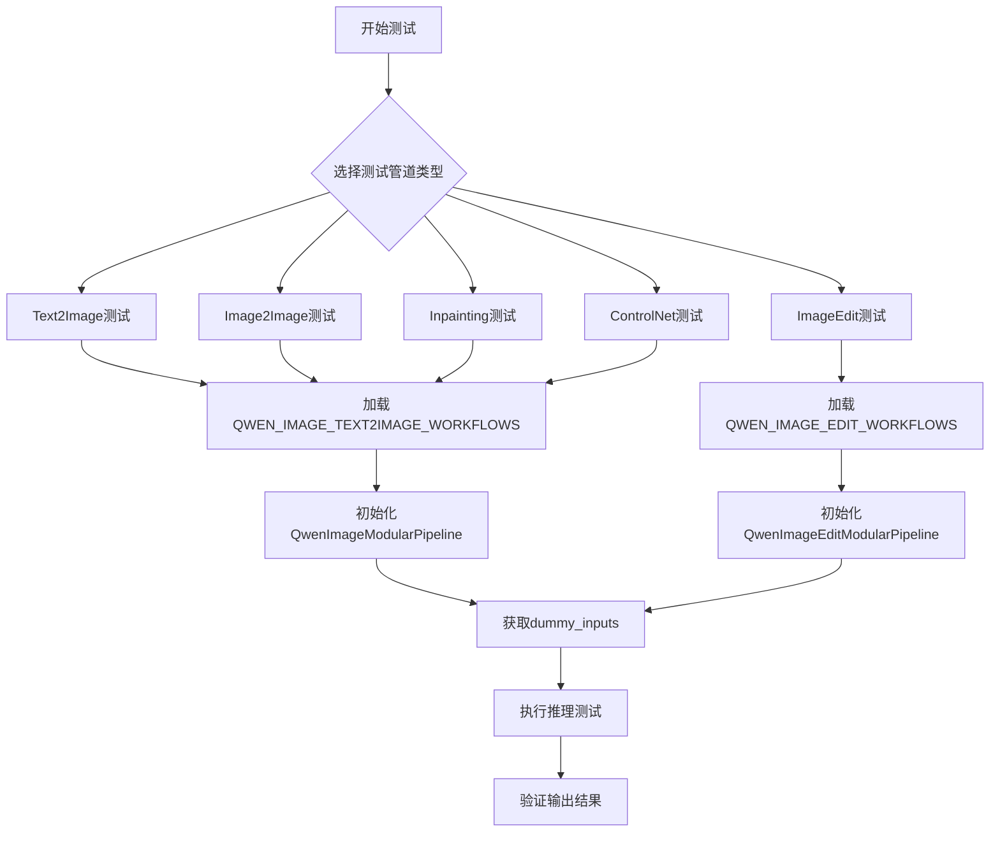
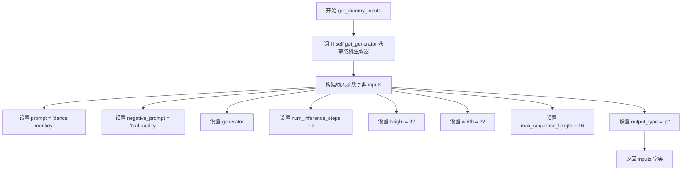
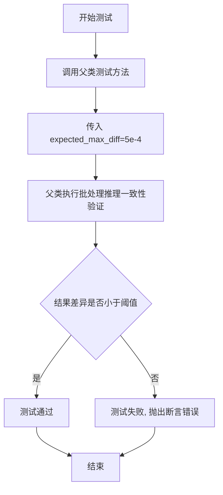
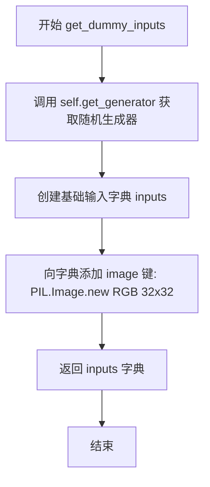
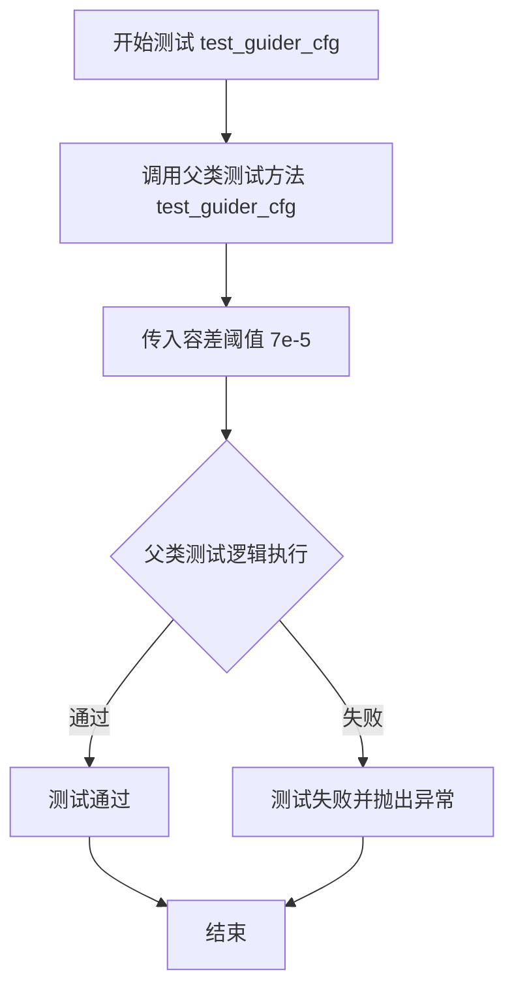
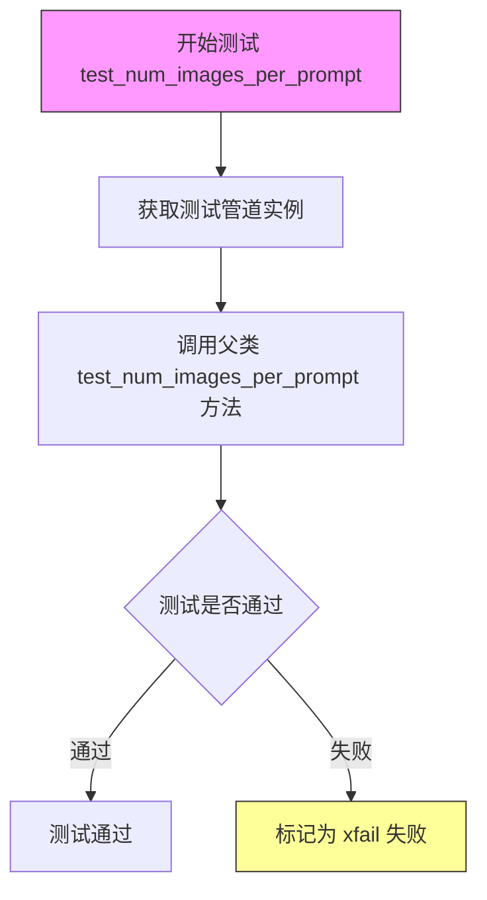
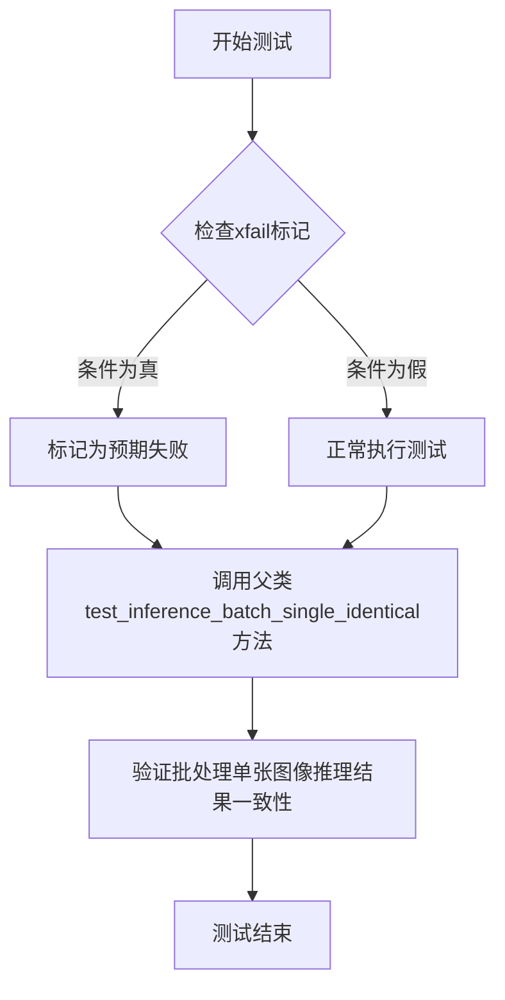

# `diffusers\tests\modular_pipelines\qwen\test_modular_pipeline_qwenimage.py` 详细设计文档

该文件是QwenImage模块化管道的测试套件，用于验证Qwen2.5-VL模型在文本到图像、图像到图像、修复以及ControlNet等不同工作流下的功能正确性，通过定义标准化的模块块（AutoBlocks）和工作流（Workflows）来实现模块化测试。

## 整体流程



## 类结构

```
TestQwenImageModularPipelineFast (继承ModularPipelineTesterMixin, ModularGuiderTesterMixin)
├── TestQwenImageEditModularPipelineFast (继承ModularPipelineTesterMixin, ModularGuiderTesterMixin)
└── TestQwenImageEditPlusModularPipelineFast (继承ModularPipelineTesterMixin, ModularGuiderTesterMixin)
```

## 全局变量及字段


### `QWEN_IMAGE_TEXT2IMAGE_WORKFLOWS`
    
定义text2image、image2image、inpainting、controlnet_text2image、controlnet_image2image、controlnet_inpainting等工作流

类型：`dict`
    


### `QWEN_IMAGE_EDIT_WORKFLOWS`
    
定义image_conditioned和image_conditioned_inpainting等编辑工作流

类型：`dict`
    


### `PIL`
    
Python Imaging Library，用于图像处理

类型：`module`
    


### `pytest`
    
Python测试框架

类型：`module`
    


### `torch_device`
    
PyTorch设备标识

类型：`str`
    


### `TestQwenImageModularPipelineFast.pipeline_class`
    
测试的管道类

类型：`type`
    


### `TestQwenImageModularPipelineFast.pipeline_blocks_class`
    
管道使用的模块块类

类型：`type`
    


### `TestQwenImageModularPipelineFast.pretrained_model_name_or_path`
    
预训练模型路径

类型：`str`
    


### `TestQwenImageModularPipelineFast.params`
    
管道参数集合

类型：`frozenset`
    


### `TestQwenImageModularPipelineFast.batch_params`
    
批处理参数集合

类型：`frozenset`
    


### `TestQwenImageModularPipelineFast.expected_workflow_blocks`
    
期望的工作流块定义

类型：`dict`
    


### `TestQwenImageEditModularPipelineFast.pipeline_class`
    
测试的编辑管道类

类型：`type`
    


### `TestQwenImageEditModularPipelineFast.pipeline_blocks_class`
    
编辑管道使用的模块块类

类型：`type`
    


### `TestQwenImageEditModularPipelineFast.pretrained_model_name_or_path`
    
预训练模型路径

类型：`str`
    


### `TestQwenImageEditModularPipelineFast.params`
    
管道参数集合

类型：`frozenset`
    


### `TestQwenImageEditModularPipelineFast.batch_params`
    
批处理参数集合

类型：`frozenset`
    


### `TestQwenImageEditModularPipelineFast.expected_workflow_blocks`
    
期望的工作流块定义

类型：`dict`
    


### `TestQwenImageEditPlusModularPipelineFast.pipeline_class`
    
测试的增强编辑管道类

类型：`type`
    


### `TestQwenImageEditPlusModularPipelineFast.pipeline_blocks_class`
    
增强编辑管道使用的模块块类

类型：`type`
    


### `TestQwenImageEditPlusModularPipelineFast.pretrained_model_name_or_path`
    
预训练模型路径

类型：`str`
    


### `TestQwenImageEditPlusModularPipelineFast.params`
    
管道参数集合

类型：`frozenset`
    


### `TestQwenImageEditPlusModularPipelineFast.batch_params`
    
批处理参数集合

类型：`frozenset`
    
    

## 全局函数及方法


### `TestQwenImageModularPipelineFast.get_dummy_inputs`

获取测试用的虚拟输入数据，用于 Qwen 图像模块化管道的快速测试场景。该方法构建并返回一个包含推理所需参数的字典，包括提示词、负提示词、生成器、推理步数、图像尺寸等配置。

参数：

- `self`：`TestQwenImageModularPipelineFast` 实例，隐式参数，无需额外描述

返回值：`Dict[str, Any]`，返回包含测试参数的字典，包括 prompt（提示词）、negative_prompt（负提示词）、generator（随机生成器）、num_inference_steps（推理步数）、height（图像高度）、width（图像宽度）、max_sequence_length（最大序列长度）、output_type（输出类型）。

#### 流程图



#### 带注释源码

```python
def get_dummy_inputs(self):
    """
    获取测试用的虚拟输入数据
    
    该方法用于生成 QwenImageModularPipeline 快速测试所需的虚拟输入参数，
    避免了每次测试时手动构建参数字典的重复工作。
    
    Returns:
        dict: 包含测试参数的字典，用于 pipeline 推理调用
    """
    # 获取随机数生成器，用于确保测试结果的可复现性
    generator = self.get_generator()
    
    # 构建完整的输入参数字典
    inputs = {
        "prompt": "dance monkey",           # 正向提示词，引导生成目标图像
        "negative_prompt": "bad quality",  # 负向提示词，避免生成低质量内容
        "generator": generator,             # 随机生成器，确保结果可复现
        "num_inference_steps": 2,           # 推理步数，值越小测试越快
        "height": 32,                       # 输出图像高度（像素）
        "width": 32,                        # 输出图像宽度（像素）
        "max_sequence_length": 16,          # 文本编码器的最大序列长度
        "output_type": "pt",                # 输出类型，'pt' 表示 PyTorch 张量
    }
    
    # 返回包含所有测试参数的字典
    return inputs
```


### `TestQwenImageModularPipelineFast.test_inference_batch_single_identical`

测试批处理单张图像推理一致性，验证使用批处理方式推理单张图像时，结果应与单独推理该图像的结果一致。

参数：

- `self`：`TestQwenImageModularPipelineFast`，测试类实例本身
- `expected_max_diff`：`float`，允许的最大差异阈值，默认为 `5e-4`（0.0005），用于比较推理结果的一致性

返回值：`None`，该方法为测试方法，通过断言验证推理一致性，不返回具体值

#### 流程图



#### 带注释源码

```python
def test_inference_batch_single_identical(self):
    """
    测试批处理单张图像推理一致性
    
    该测试方法验证当使用批处理方式（batch）对单张图像进行推理时，
    推理结果应与单独推理该图像的结果保持一致。
    主要用于确保管线在批处理模式下的数值稳定性。
    
    参数说明:
        self: TestQwenImageModularPipelineFast类的实例
        expected_max_diff: float类型, 允许的最大差异阈值,默认5e-4
                          用于比较批处理推理与单独推理的结果差异
    
    返回:
        无返回值,测试结果通过断言验证
    
    父类方法逻辑概述:
        1. 准备单张图像的推理输入
        2. 分别进行单独推理和批处理推理
        3. 比较两次推理结果的差异
        4. 断言差异小于等于expected_max_diff
    """
    # 调用父类ModularPipelineTesterMixin的同名测试方法
    # 传入预期的最大差异阈值为5e-4
    # 该阈值表示两张图像之间的平均像素差异应小于0.05%
    super().test_inference_batch_single_identical(expected_max_diff=5e-4)
```


### `TestQwenImageEditModularPipelineFast.get_dummy_inputs`

该方法用于获取 QwenImageEditModularPipeline 的测试虚拟输入数据，生成包含提示词、负提示词、生成器、推理步数、图像尺寸、输出类型和测试图像的字典，供单元测试调用。

参数：

- `self`：隐式参数，`TestQwenImageEditModularPipelineFast` 类型，代表类的实例本身

返回值：`Dict[str, Any]`，返回一个字典，包含以下键值对：
- `prompt`：提示词字符串 "dance monkey"
- `negative_prompt`：负提示词字符串 "bad quality"
- `generator`：随机数生成器对象
- `num_inference_steps`：推理步数，整数 2
- `height`：生成图像高度，整数 32
- `width`：生成图像宽度，整数 32
- `output_type`：输出类型字符串 "pt"（PyTorch 张量）
- `image`：PIL.Image 对象，新建的全黑 RGB 32x32 图像

#### 流程图



#### 带注释源码

```python
def get_dummy_inputs(self):
    """
    生成用于测试 QwenImageEditModularPipeline 的虚拟输入数据。
    
    Returns:
        Dict[str, Any]: 包含测试所需各项参数的字典
    """
    # 获取随机数生成器，用于后续生成过程中的随机操作
    generator = self.get_generator()
    
    # 构建基础输入参数字典，包含提示词、负提示词、生成器、推理步数、图像尺寸和输出类型
    inputs = {
        "prompt": "dance monkey",              # 正向提示词，描述期望生成的图像内容
        "negative_prompt": "bad quality",      # 负向提示词，指定需要避免的质量问题
        "generator": generator,                 # 随机数生成器，控制生成过程的可重复性
        "num_inference_steps": 2,              # 扩散模型推理步数，越多越精细但耗时
        "height": 32,                          # 生成图像的高度（像素）
        "width": 32,                           # 生成图像的宽度（像素）
        "output_type": "pt",                   # 输出类型，pt 表示 PyTorch 张量
    }
    
    # 添加输入图像，使用 PIL 创建一个 32x32 的黑色 RGB 图像作为测试输入
    inputs["image"] = PIL.Image.new("RGB", (32, 32), 0)
    
    # 返回完整的输入参数字典，供测试用例调用 pipeline 使用
    return inputs
```


### TestQwenImageEditModularPipelineFast.test_guider_cfg

该测试方法用于验证 QwenImageEditModularPipeline 的引导器（Guider）配置功能，通过调用父类测试方法检查引导器CFG（Classifier-Free Guidance）相关逻辑的正确性，并设定容差阈值为 7e-5 以确保数值精度。

参数：
- 该方法无显式参数，但内部调用父类 `test_guider_cfg(7e-5)` 时传入浮点数 `7e-5` 作为期望最大差异阈值（expected_max_diff）

返回值：无明确返回值（测试方法通常返回 None 或通过 pytest 断言验证）

#### 流程图



#### 带注释源码

```python
def test_guider_cfg(self):
    """
    测试引导器配置功能
    
    该测试方法继承自 ModularPipelineTesterMixin 和 ModularGuiderTesterMixin 混合类，
    用于验证 QwenImageEditModularPipeline 中引导器（Guider）的配置是否正确工作。
    调用父类方法时传入 7e-5 作为期望最大差异阈值，用于浮点数精度比较。
    """
    # 调用父类的 test_guider_cfg 方法，传入容差阈值 7e-5
    # super() 指向上层继承链中的 ModularGuiderTesterMixin 或 ModularPipelineTesterMixin
    # 7e-5 表示期望输出与参考值之间的最大差异必须小于该值
    super().test_guider_cfg(7e-5)
```


### TestQwenImageEditPlusModularPipelineFast.get_dummy_inputs

获取测试用的虚拟输入数据，用于实例化 QwenImageEditPlusModularPipeline 并执行推理测试。该方法构建了一个包含图像生成所需参数的字典，包括提示词、负提示词、生成器、推理步数、图像尺寸和输出类型等。

参数：

- `self`：`TestQwenImageEditPlusModularPipelineFast`，隐式参数，表示当前测试类实例

返回值：`Dict[str, Any]`，返回一个包含图像编辑推理所需参数的字典，包括 prompt（提示词）、negative_prompt（负提示词）、generator（随机数生成器）、num_inference_steps（推理步数）、height（图像高度）、width（图像宽度）、output_type（输出类型）以及 image（输入图像）

#### 流程图

```mermaid
flowchart TD
    A[开始 get_dummy_inputs] --> B[调用 self.get_generator 获取随机生成器]
    B --> C[创建基础输入字典 inputs]
    C --> D[设置 prompt 为 'dance monkey']
    D --> E[设置 negative_prompt 为 'bad quality']
    E --> F[设置 generator 为随机生成器]
    F --> G[设置 num_inference_steps 为 2]
    G --> H[设置 height 为 32]
    H --> I[设置 width 为 32]
    I --> J[设置 output_type 为 'pt']
    J --> K[创建 32x32 RGB 图像]
    K --> L[将图像赋值给 inputs['image']]
    L --> M[返回 inputs 字典]
```

#### 带注释源码

```python
def get_dummy_inputs(self):
    """
    获取测试用的虚拟输入数据
    
    该方法用于生成 QwenImageEditPlusModularPipeline 的测试输入，
    包含图像编辑所需的最小化参数集合。
    
    Returns:
        Dict[str, Any]: 包含测试参数的字典
            - prompt: 文本提示词
            - negative_prompt: 负向提示词
            - generator: 随机数生成器，用于确保可复现性
            - num_inference_steps: 推理步数
            - height: 生成图像高度
            - width: 生成图像宽度
            - output_type: 输出类型 ('pt' 表示 PyTorch 张量)
            - image: 输入图像 (32x32 RGB 图像)
    """
    # 获取随机数生成器，确保测试结果可复现
    generator = self.get_generator()
    
    # 构建基础输入参数字典
    inputs = {
        "prompt": "dance monkey",          # 文本提示词
        "negative_prompt": "bad quality",  # 负向提示词，用于引导模型避免生成不良特征
        "generator": generator,             # 随机生成器，确保可复现性
        "num_inference_steps": 2,           # 推理步数，较小值用于快速测试
        "height": 32,                       # 输出图像高度
        "width": 32,                        # 输出图像宽度
        "output_type": "pt",                # 输出类型：PyTorch 张量
    }
    
    # 创建虚拟输入图像 (32x32 RGB 黑色图像)
    inputs["image"] = PIL.Image.new("RGB", (32, 32), 0)
    
    # 返回完整的输入参数字典
    return inputs
```


### `TestQwenImageEditPlusModularPipelineFast.test_multi_images_as_input`

该方法是 `TestQwenImageEditPlusModularPipelineFast` 类中的一个测试用例，用于测试当输入多个图像时（列表形式），模块化管道是否能够正确处理多图像输入场景。

参数：无显式参数（使用 `self` 访问实例属性）

返回值：`None`，该方法为测试方法，不返回任何值，仅执行管道调用

#### 流程图

```mermaid
flowchart TD
    A[开始测试 test_multi_images_as_input] --> B[调用 get_dummy_inputs 获取基础输入]
    B --> C[从输入字典中弹出 image 字段]
    C --> D[将单个图像包装为列表: [image, image]]
    D --> E[调用 get_pipeline 获取管道实例]
    E --> F[将管道移动到 torch_device]
    F --> G[使用多图像输入调用管道: pipe(**inputs)]
    G --> H[结束测试]
```

#### 带注释源码

```python
def test_multi_images_as_input(self):
    """
    测试多图像输入功能
    验证管道能够接受图像列表作为输入并进行推理
    """
    # 步骤1: 获取基础虚拟输入
    inputs = self.get_dummy_inputs()
    # get_dummy_inputs 返回包含以下键的字典:
    # {
    #     "prompt": "dance monkey",
    #     "negative_prompt": "bad quality",
    #     "generator": generator,
    #     "num_inference_steps": 2,
    #     "height": 32,
    #     "width": 32,
    #     "output_type": "pt",
    #     "image": PIL.Image.new("RGB", (32, 32), 0)  # 32x32 黑色图像
    # }

    # 步骤2: 从输入字典中取出原始图像
    image = inputs.pop("image")
    # pop 操作会移除 "image" 键并返回对应的值

    # 步骤3: 将单个图像转换为图像列表，模拟批量输入
    inputs["image"] = [image, image]
    # 将同一个图像复制一份，形成 [image1, image2] 列表

    # 步骤4: 获取管道实例
    pipe = self.get_pipeline().to(torch_device)
    # self.get_pipeline() 方法继承自 ModularPipelineTesterMixin
    # .to(torch_device) 将模型移动到指定的计算设备

    # 步骤5: 使用多图像输入调用管道
    _ = pipe(
        **inputs,
    )
    # 将输入字典解包传递给管道
    # 返回值被赋值给 _，表示忽略返回值
    # 这是一个端到端测试，验证管道能处理多图像输入而不报错
```


### `TestQwenImageEditPlusModularPipelineFast.test_num_images_per_prompt`

测试每个提示的图像数量是否正确生成（当前标记为xfail，原因是批量图像处理需要重新审视）

参数：
- `self`：测试类实例本身，无显式参数

返回值：由于该方法调用了 `super().test_num_images_per_prompt()`，具体返回值取决于父类 `ModularPipelineTesterMixin` 的实现，通常为 `None`（测试方法）

#### 流程图



#### 带注释源码

```python
@pytest.mark.xfail(condition=True, reason="Batch of multiple images needs to be revisited", strict=True)
def test_num_images_per_prompt(self):
    """
    测试每个提示的图像数量
    
    该测试方法用于验证管道在给定单个提示时能够生成多个图像的功能。
    由于当前批量图像处理逻辑存在问题，该测试被标记为预期失败(xfail)。
    
    Args:
        self: 测试类实例，继承自 TestQwenImageEditPlusModularPipelineFast
        
    Returns:
        None: 测试方法无返回值，结果通过 pytest 框架报告
        
    Note:
        - 使用 @pytest.mark.xfail 装饰器标记为预期失败
        - strict=True 表示如果测试意外通过，会导致测试失败
        - 内部调用父类 ModularPipelineTesterMixin 的 test_num_images_per_prompt 方法
        - 原因：批量多个图像的处理逻辑需要重新审视和修复
    """
    super().test_num_images_per_prompt()
```


### `TestQwenImageEditPlusModularPipelineFast.test_inference_batch_consistent`

测试批处理推理一致性（标记为xfail），该测试方法继承自基类，用于验证批量推理时多个图像输入的输出结果是否保持一致性，但由于当前实现存在问题被标记为预期失败。

参数：

- `self`：`TestQwenImageEditPlusModularPipelineFast`，测试类的实例对象

返回值：`None`，测试方法无返回值，通过断言验证推理一致性

#### 流程图

```mermaid
flowchart TD
    A[开始执行 test_inference_batch_consistent] --> B[调用父类方法 super().test_inference_batch_consistent]
    B --> C{父类方法执行结果}
    C -->|通过| D[测试通过]
    C -->|失败| E[测试失败 - 但标记为 xfail 所以不报错]
```

#### 带注释源码

```python
@pytest.mark.xfail(condition=True, reason="Batch of multiple images needs to be revisited", strict=True)
def test_inference_batch_consistent():
    """
    测试批处理推理一致性
    
    该测试方法继承自基类 ModularPipelineTesterMixin，用于验证：
    - 当使用多张图像作为输入进行批量推理时
    - 输出结果应该保持一致性
    
    标记为 xfail 的原因：
    - 当前实现中批量多图像处理逻辑需要重新审视
    - strict=True 表示如果测试意外通过则报错
    """
    # 调用父类的测试方法进行批处理一致性验证
    super().test_inference_batch_consistent()
```


### `TestQwenImageEditPlusModularPipelineFast.test_inference_batch_single_identical`

这是一个测试方法，用于测试在使用批处理单张图像时推理结果的一致性。该测试方法被标记为xfail（预期失败），因为批处理多图像功能需要重新审视。

参数：

- `self`：TestQwenImageEditPlusModularPipelineFast，测试类实例本身

返回值：`None`，测试方法通常不返回任何值

#### 流程图



#### 带注释源码

```python
@pytest.mark.xfail(condition=True, reason="Batch of multiple images needs to be revisited", strict=True)
def test_inference_batch_single_identical():
    """
    测试批处理单张图像推理一致性
    
    该测试方法用于验证在使用批处理方式处理单张图像时，
    推理结果应该与单独处理该图像时的结果一致。
    
    标记为xfail原因：
    - 批处理多图像功能需要重新审视
    - 当前实现可能存在批次间一致性问题
    - strict=True表示如果测试意外通过，也会报告为失败
    """
    # 调用父类ModularPipelineTesterMixin的test_inference_batch_single_identical方法
    # 执行实际的批处理一致性测试逻辑
    super().test_inference_batch_single_identical()
```


### `TestQwenImageEditPlusModularPipelineFast.test_guider_cfg`

该方法用于测试 Qwen 图像编辑模块化管道的引导器配置（Guider Configuration）功能，通过调用父类的 `test_guider_cfg` 方法验证引导器在给定阈值下的正确性。

参数：
- 该方法无显式参数（继承自父类，参数由父类方法定义）

返回值：
- 该方法无返回值（继承自父类，测试通过或失败由 pytest 框架处理）

#### 流程图

```mermaid
flowchart TD
    A[开始测试 test_guider_cfg] --> B[调用 get_dummy_inputs 获取测试输入]
    B --> C[调用父类 super().test_guider_cfg 方法]
    C --> D{验证引导器配置}
    D -->|通过| E[测试通过]
    D -->|失败| F[测试失败]
```

#### 带注释源码

```python
def test_guider_cfg(self):
    """
    测试 QwenImageEditPlusModularPipeline 的引导器配置功能。
    
    该方法继承自 ModularGuiderTesterMixin，通过调用父类的 test_guider_cfg 方法
    来验证引导器（guider）在给定容差阈值下的正确性。
    
    参数容差值设为 1e-6，用于验证引导器配置的精度要求。
    """
    # 调用父类的 test_guider_cfg 方法，传入期望的最大容差值 1e-6
    super().test_guider_cfg(1e-6)
```

## 关键组件


### 模块化管道 (Modular Pipelines)

用于实现Qwen图像生成模型的模块化架构，支持text2image、image2image、inpainting等多种生成模式，通过解耦的管道组件实现灵活的工作流程编排。

### 自动块系统 (Auto Blocks)

QwenImageAutoBlocks、QwenImageEditAutoBlocks、QwenImageEditPlusAutoBlocks三个自动块类，负责管理和组合不同的处理步骤，实现管道步骤的自动化组装与配置。

### 文本编码步骤 (Text Encoder Steps)

QwenImageTextEncoderStep、QwenImageEditTextEncoderStep，负责将文本提示（prompt）转换为模型可处理的文本嵌入表示，是图像生成的条件输入核心组件。

### 潜在向量准备步骤 (Latent Preparation Steps)

QwenImagePrepareLatentsStep、QwenImagePrepareLatentsWithStrengthStep，负责初始化和准备去噪过程的潜在向量，包括添加噪声、强度控制等操作，是扩散模型去噪的输入准备阶段。

### 去噪步骤 (Denoise Steps)

QwenImageDenoiseStep、QwenImageInpaintDenoiseStep、QwenImageEditDenoiseStep等，是扩散模型的核心去噪过程，执行实际的图像生成迭代计算。

### VAE编解码步骤 (VAE Encoder/Decoder Steps)

QwenImageVaeEncoderStep负责将输入图像编码为潜在表示，QwenImageDecoderStep负责将潜在向量解码回图像空间，实现图像与潜在表示之间的转换。

### 图像预处理/后处理步骤 (Image Pre/Post Processing Steps)

包括QwenImageProcessImagesInputStep、QwenImageProcessImagesOutputStep、QwenImageInpaintProcessImagesInputStep等，负责输入图像的尺寸调整、归一化等预处理和输出图像的后处理工作。

### 控制网络集成步骤 (ControlNet Integration Steps)

QwenImageControlNetVaeEncoderStep、QwenImageControlNetInputsStep、QwenImageControlNetBeforeDenoiserStep、QwenImageControlNetDenoiseStep等，实现ControlNet条件控制图像生成功能。

### RoPE位置编码步骤 (RoPE Inputs Steps)

QwenImageRoPEInputsStep、QwenImageEditRoPEInputsStep，负责准备旋转位置编码（Rotary Position Embedding）的输入，用于增强模型的位置感知能力。

### 时间步设置步骤 (Timestep Steps)

QwenImageSetTimestepsStep、QwenImageSetTimestepsWithStrengthStep，负责配置扩散模型的时间步调度器，控制去噪过程的迭代策略。

### 遮罩处理步骤 (Mask Processing Steps)

QwenImageCreateMaskLatentsStep、QwenImagePrepareLatentsWithStrengthStep（支持inpainting），负责创建和处理修复任务的遮罩潜在向量。

### 工作流程配置字典 (Workflow Configuration)

QWEN_IMAGE_TEXT2IMAGE_WORKFLOWS和QWEN_IMAGE_EDIT_WORKFLOWS定义了不同生成模式下的完整步骤映射关系，支持text2image、image2image、inpainting、controlnet等多种工作流程。

### 测试框架组件

TestQwenImageModularPipelineFast、TestQwenImageEditModularPipelineFast、TestQwenImageEditPlusModularPipelineFast三个测试类，通过继承ModularPipelineTesterMixin和ModularGuiderTesterMixin实现对模块化管道的全面测试验证。


## 问题及建议


### 已知问题

-   **xfail测试方法调用语法错误**：`TestQwenImageEditPlusModularPipelineFast`类中的`test_inference_batch_consistent()`、`test_inference_batch_single_identical()`和`test_num_images_per_prompt()`三个方法缺少`self`参数，调用语法错误（写成`test_inference_batch_consistent()`而非`test_inference_batch_consistent(self)`），导致这些测试无法正确执行。
-   **缺失expected_workflow_blocks定义**：`TestQwenImageEditPlusModularPipelineFast`类没有定义`expected_workflow_blocks`类属性，而其他两个测试类都有定义，可能导致工作流验证不完整。
-   **get_dummy_inputs方法重复定义**：三个测试类都定义了几乎相同的`get_dummy_inputs`方法，仅在个别参数上有细微差异（如`max_sequence_length`），代码重复度高。
-   **硬编码的工作流步骤名称**：工作流步骤使用字符串元组定义（如`("text_encoder", "QwenImageTextEncoderStep")`），缺乏类型安全，步骤名称变化时维护成本高。
-   **缺少类型注解**：代码中没有任何类型提示（type hints），降低了代码的可读性和静态检查工具的效能。
-   **Magic Number和硬编码值**：测试中使用`expected_max_diff=5e-4`、`7e-5`、`1e-6`等阈值但未解释其含义或来源。

### 优化建议

-   修复`TestQwenImageEditPlusModularPipelineFast`中三个xfail方法的签名，添加`self`参数。
-   为`TestQwenImageEditPlusModularPipelineFast`添加`expected_workflow_blocks`定义，保持测试一致性。
-   提取公共的`get_dummy_inputs`逻辑到基类或mixin中，通过参数或配置差异化各测试类的输入。
-   考虑将工作流步骤定义为枚举或配置类，提供类型检查和IDE自动补全。
-   为关键参数、返回值和类方法添加类型注解。
-   将阈值常量提取为类常量或配置文件，并为每个魔法数字添加注释说明其用途。

## 其它


### 设计目标与约束

本测试文件旨在验证 QwenImage 系列模块化管道的功能正确性，包括 Text-to-Image、Image-to-Image、Inpainting 以及 ControlNet 相关的工作流。测试覆盖模块化管道的核心组件（AutoBlocks）、pipeline 类、参数传递、批次处理等关键功能点。约束条件包括使用虚拟模型（hf-internal-testing/tiny-qwenimage-*）进行快速测试，以及特定的输出精度要求（expected_max_diff 等）。

### 错误处理与异常设计

测试类中使用了 `@pytest.mark.xfail` 装饰器标记预期失败的测试用例，如 `test_num_images_per_prompt`、`test_inference_batch_consistent` 和 `test_inference_batch_single_identical`，这些测试因"批次多图像需要重新审视"而被标记为预期失败。测试通过继承 `ModularPipelineTesterMixin` 和 `ModularGuiderTesterMixin` 来复用通用的测试逻辑，利用父类的异常处理机制捕获并验证各类错误场景。

### 数据流与状态机

测试数据流遵循以下路径：首先通过 `get_dummy_inputs()` 方法构造虚拟输入（包含 prompt、negative_prompt、generator、num_inference_steps、height、width 等参数），然后传递给 `pipe()` 方法执行推理。不同的 `expected_workflow_blocks` 定义了各工作流的步骤顺序，例如 text2image 工作流包含 text_encoder、denoise、decode 三个主要阶段，每个阶段由特定的 Step 类（如 QwenImageTextEncoderStep、QwenImageDenoiseStep 等）实现。

### 外部依赖与接口契约

主要依赖包括：(1) `diffusers.modular_pipelines` 模块提供的模块化管道类（QwenImageModularPipeline、QwenImageEditModularPipeline、QwenImageEditPlusModularPipeline）及其对应的 AutoBlocks 类；(2) `PIL` 库用于创建测试图像；(3) `pytest` 框架用于测试执行；(4) `testing_utils` 模块提供的 `torch_device` 设备配置。接口契约方面，测试类需实现 `pipeline_class`、`pipeline_blocks_class`、`pretrained_model_name_or_path`、`params`、`batch_params` 和 `expected_workflow_blocks` 等类属性。

### 性能考虑

测试使用轻量级虚拟模型（tiny-* 前缀）以加快测试执行速度。`expected_max_diff` 参数用于验证推理结果的一致性精度要求（如 5e-4、7e-5、1e-6）。`num_inference_steps` 设置为 2 以减少推理时间。测试通过 `torch_device` 确保在不同设备上的一致性。

### 安全性考虑

测试代码遵循 Apache License 2.0 开源协议。代码中使用的模型均为 HuggingFace 官方测试模型（hf-internal-testing），不涉及真实敏感数据。测试过程不涉及网络请求或敏感操作。

### 测试策略

采用混合测试策略：(1) 单元测试验证各个 Step 组件的功能；(2) 集成测试验证完整 pipeline 的端到端推理；(3) 参数化测试通过不同的 params 和 batch_params 覆盖多种输入组合；(4) 工作流测试通过 expected_workflow_blocks 验证各工作流的步骤顺序和组件正确性。继承 `ModularPipelineTesterMixin` 和 `ModularGuiderTesterMixin` 实现测试逻辑复用。

### 配置与参数说明

关键配置参数包括：`params` 定义单次推理可接受参数（prompt、height、width、negative_prompt、attention_kwargs、image、mask_image）；`batch_params` 定义批次推理参数；`pretrained_model_name_or_path` 指定测试用模型路径；`expected_workflow_blocks` 定义各工作流的预期步骤映射。

### 版本历史与变更记录

该测试文件作为 diffusers 库的一部分，受 Apache License 2.0 约束。代码注释表明版权归属 HuggingFace Inc.。测试类命名包含 "Fast" 后缀，表明其为快速测试版本，与完整测试套件区分。

### 相关文档与参考资料

相关模块文档包括：`diffusers.modular_pipelines` 模块文档、pytest 框架文档、PIL 库文档。测试继承的父类 `ModularPipelineTesterMixin` 和 `ModularGuiderTesterMixin` 的实现定义在 `..test_modular_pipelines_common` 模块中。

### 关键组件信息

1. **QWEN_IMAGE_TEXT2IMAGE_WORKFLOWS**: 定义 text2image、image2image、inpainting、controlnet_text2image、controlnet_image2image、controlnet_inpainting 等六种工作流的步骤映射
2. **QWEN_IMAGE_EDIT_WORKFLOWS**: 定义 image_conditioned 和 image_conditioned_inpainting 两种编辑工作流的步骤映射
3. **TestQwenImageModularPipelineFast**: 测试 QwenImageModularPipeline 类的功能
4. **TestQwenImageEditModularPipelineFast**: 测试 QwenImageEditModularPipeline 类的功能
5. **TestQwenImageEditPlusModularPipelineFast**: 测试 QwenImageEditPlusModularPipeline 类的功能，包含多图像输入等高级功能

### 潜在的技术债务或优化空间

(1) 多个测试用例被标记为 xfail，表明多图像批次处理功能尚未完善，需要后续重构；(2) TestQwenImageEditPlusModularPipelineFast 缺少 `expected_workflow_blocks` 定义，测试覆盖不完整；(3) 测试类中硬编码了虚拟模型的路径，建议抽取为配置常量；(4) 部分测试精度要求（expected_max_diff）需要根据实际模型性能进行调整。


    