# `diffusers\tests\modular_pipelines\stable_diffusion_xl\test_modular_pipeline_stable_diffusion_xl.py` 详细设计文档

这是 Hugging Face diffusers 库的 Stable Diffusion XL (SDXL) 模块化管道测试套件，通过 Mixin 模式提供了 Text-to-Image、Image-to-Image 和 Inpainting 三种生成任务的测试用例，并支持 IP Adapter 和 ControlNet 等高级功能的集成测试。

## 整体流程

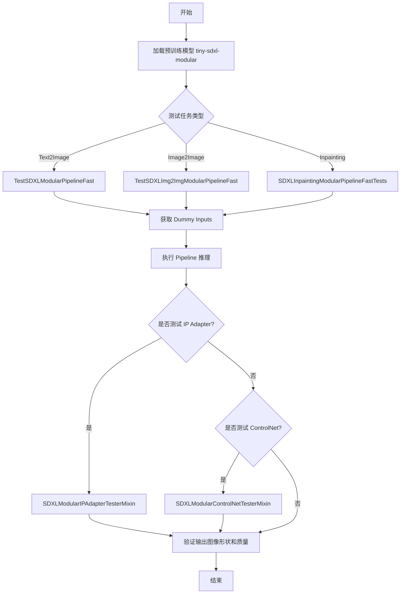

## 类结构

```
SDXLModularTesterMixin (测试基类)
├── _test_stable_diffusion_xl_euler
├── get_dummy_inputs
└── test_stable_diffusion_xl_euler
SDXLModularIPAdapterTesterMixin (IP Adapter 测试)
├── test_pipeline_inputs_and_blocks
├── _get_dummy_image_embeds
├── _get_dummy_faceid_image_embeds
├── _get_dummy_masks
├── _modify_inputs_for_ip_adapter_test
└── test_ip_adapter
SDXLModularControlNetTesterMixin (ControlNet 测试)
├── test_pipeline_inputs
├── _modify_inputs_for_controlnet_test
├── test_controlnet
└── test_controlnet_cfg
TestSDXLModularPipelineFast (Text2Image 测试)
├── 继承自 SDXLModularTesterMixin
├── 继承自 SDXLModularIPAdapterTesterMixin
├── 继承自 SDXLModularControlNetTesterMixin
├── 继承自 ModularGuiderTesterMixin
└── 继承自 ModularPipelineTesterMixin
TestSDXLImg2ImgModularPipelineFast (Image2Image 测试)
SDXLInpaintingModularPipelineFastTests (Inpainting 测试)
```

## 全局变量及字段


### `TEXT2IMAGE_WORKFLOWS`
    
A dictionary mapping text2image workflow names to lists of component name and step class pairs defining the pipeline execution order

类型：`Dict[str, List[Tuple[str, str]]]`
    


### `IMAGE2IMAGE_WORKFLOWS`
    
A dictionary mapping image-to-image workflow names to lists of component name and step class pairs defining the pipeline execution order

类型：`Dict[str, List[Tuple[str, str]]]`
    


### `INPAINTING_WORKFLOWS`
    
A dictionary mapping inpainting workflow names to lists of component name and step class pairs defining the pipeline execution order

类型：`Dict[str, List[Tuple[str, str]]]`
    


### `SDXLModularTesterMixin.pipeline_class`
    
The Stable Diffusion XL modular pipeline class being tested

类型：`Type[StableDiffusionXLModularPipeline]`
    


### `SDXLModularTesterMixin.pipeline_blocks_class`
    
The auto blocks class that defines the modular pipeline components

类型：`Type[StableDiffusionXLAutoBlocks]`
    


### `SDXLModularTesterMixin.pretrained_model_name_or_path`
    
The pretrained model identifier or path used for testing

类型：`str`
    


### `SDXLModularTesterMixin.params`
    
Frozen set of pipeline parameter names accepted by the pipeline

类型：`frozenset[str]`
    


### `SDXLModularTesterMixin.batch_params`
    
Frozen set of parameter names that support batch processing

类型：`frozenset[str]`
    


### `SDXLModularTesterMixin.expected_image_output_shape`
    
Expected shape of the output image tensor (batch, channels, height, width)

类型：`Tuple[int, ...]`
    


### `SDXLModularTesterMixin.expected_workflow_blocks`
    
Expected workflow block configurations mapping workflow type to component-step pairs

类型：`Dict[str, List[Tuple[str, str]]]`
    


### `TestSDXLModularPipelineFast.pipeline_class`
    
The Stable Diffusion XL modular pipeline class being tested

类型：`Type[StableDiffusionXLModularPipeline]`
    


### `TestSDXLModularPipelineFast.pipeline_blocks_class`
    
The auto blocks class that defines the modular pipeline components

类型：`Type[StableDiffusionXLAutoBlocks]`
    


### `TestSDXLModularPipelineFast.pretrained_model_name_or_path`
    
The pretrained model identifier or path used for testing

类型：`str`
    


### `TestSDXLModularPipelineFast.params`
    
Frozen set of pipeline parameter names accepted by the pipeline

类型：`frozenset[str]`
    


### `TestSDXLModularPipelineFast.batch_params`
    
Frozen set of parameter names that support batch processing

类型：`frozenset[str]`
    


### `TestSDXLModularPipelineFast.expected_image_output_shape`
    
Expected shape of the output image tensor (batch, channels, height, width)

类型：`Tuple[int, ...]`
    


### `TestSDXLModularPipelineFast.expected_workflow_blocks`
    
Expected workflow block configurations mapping workflow type to component-step pairs

类型：`Dict[str, List[Tuple[str, str]]]`
    


### `TestSDXLImg2ImgModularPipelineFast.pipeline_class`
    
The Stable Diffusion XL modular pipeline class being tested

类型：`Type[StableDiffusionXLModularPipeline]`
    


### `TestSDXLImg2ImgModularPipelineFast.pipeline_blocks_class`
    
The auto blocks class that defines the modular pipeline components

类型：`Type[StableDiffusionXLAutoBlocks]`
    


### `TestSDXLImg2ImgModularPipelineFast.pretrained_model_name_or_path`
    
The pretrained model identifier or path used for testing

类型：`str`
    


### `TestSDXLImg2ImgModularPipelineFast.params`
    
Frozen set of pipeline parameter names accepted by the pipeline

类型：`frozenset[str]`
    


### `TestSDXLImg2ImgModularPipelineFast.batch_params`
    
Frozen set of parameter names that support batch processing

类型：`frozenset[str]`
    


### `TestSDXLImg2ImgModularPipelineFast.expected_image_output_shape`
    
Expected shape of the output image tensor (batch, channels, height, width)

类型：`Tuple[int, ...]`
    


### `TestSDXLImg2ImgModularPipelineFast.expected_workflow_blocks`
    
Expected workflow block configurations mapping workflow type to component-step pairs

类型：`Dict[str, List[Tuple[str, str]]]`
    


### `SDXLInpaintingModularPipelineFastTests.pipeline_class`
    
The Stable Diffusion XL modular pipeline class being tested

类型：`Type[StableDiffusionXLModularPipeline]`
    


### `SDXLInpaintingModularPipelineFastTests.pipeline_blocks_class`
    
The auto blocks class that defines the modular pipeline components

类型：`Type[StableDiffusionXLAutoBlocks]`
    


### `SDXLInpaintingModularPipelineFastTests.pretrained_model_name_or_path`
    
The pretrained model identifier or path used for testing

类型：`str`
    


### `SDXLInpaintingModularPipelineFastTests.params`
    
Frozen set of pipeline parameter names accepted by the pipeline

类型：`frozenset[str]`
    


### `SDXLInpaintingModularPipelineFastTests.batch_params`
    
Frozen set of parameter names that support batch processing

类型：`frozenset[str]`
    


### `SDXLInpaintingModularPipelineFastTests.expected_image_output_shape`
    
Expected shape of the output image tensor (batch, channels, height, width)

类型：`Tuple[int, ...]`
    


### `SDXLInpaintingModularPipelineFastTests.expected_workflow_blocks`
    
Expected workflow block configurations mapping workflow type to component-step pairs

类型：`Dict[str, List[Tuple[str, str]]]`
    
    

## 全局函数及方法


### `SDXLModularTesterMixin._test_stable_diffusion_xl_euler`

该方法用于测试 Stable Diffusion XL 模块化管道的核心推理功能。它使用虚拟输入运行管道，验证生成的图像形状是否符合预期，并通过比较图像切片的最大差异来确保输出与参考值匹配。

参数：

- `expected_image_shape`：`tuple` 或 `torch.Size`，期望生成的图像形状，例如 `(1, 3, 64, 64)`
- `expected_slice`：`torch.Tensor`，期望的图像切片值，用于与实际输出进行比较
- `expected_max_diff`：`float`，允许的最大差异阈值，默认为 `1e-2`

返回值：`None`，该方法通过断言进行验证，不返回任何值

#### 流程图

```mermaid
flowchart TD
    A[开始] --> B[获取 Pipeline 实例并移至计算设备]
    C[获取虚拟输入] --> D[调用 Pipeline 进行推理]
    D --> E[提取图像切片: image[0, -3:, -3:, -1]]
    E --> F{断言: 图像形状是否匹配}
    F -->|是| G[计算实际切片与期望切片的最大差异]
    F -->|否| H[抛出断言错误]
    G --> I{断言: 最大差异是否小于阈值}
    I -->|是| J[测试通过]
    I -->|否| K[抛出断言错误: Image slice does not match]
```

#### 带注释源码

```python
def _test_stable_diffusion_xl_euler(self, expected_image_shape, expected_slice, expected_max_diff=1e-2):
    """
    测试 Stable Diffusion XL Euler 采样器的核心功能
    
    参数:
        expected_image_shape: 期望的输出图像形状
        expected_slice: 期望的图像切片数值（用于结果验证）
        expected_max_diff: 允许的最大差异阈值，默认为 1e-2
    
    返回:
        None（通过断言进行验证）
    """
    # 1. 获取 Pipeline 实例并移至指定计算设备
    #    self.get_pipeline() 由子类实现，返回配置好的 pipeline 对象
    sd_pipe = self.get_pipeline().to(torch_device)

    # 2. 获取测试用的虚拟输入数据
    #    包含 prompt、generator、num_inference_steps、output_type 等参数
    inputs = self.get_dummy_inputs()
    
    # 3. 执行推理，传入虚拟输入并指定输出为图像
    #    output="images" 表示返回 PIL Image 对象列表
    image = sd_pipe(**inputs, output="images")
    
    # 4. 提取图像切片用于验证
    #    取最后 3x3 像素区域，转换为 CPU 张量
    #    image[0] 取第一张图像，[-3:, -3:, -1] 取最后 3 行 3 列的最后一个通道
    image_slice = image[0, -3:, -3:, -1].cpu()

    # 5. 验证输出图像形状是否符合预期
    assert image.shape == expected_image_shape
    
    # 6. 计算实际输出与期望切片的最大绝对差异
    max_diff = torch.abs(image_slice.flatten() - expected_slice).max()
    
    # 7. 验证差异是否在允许范围内
    assert max_diff < expected_max_diff, f"Image slice does not match expected slice. Max Difference: {max_diff}"
```


### `TestSDXLModularPipelineFast.get_dummy_inputs`

该方法用于生成 Stable Diffusion XL 模块化管道的虚拟输入参数，创建一个包含提示词、生成器、推理步数和输出类型的字典，以供测试管道功能使用。

参数：

- `seed`：`int`，随机种子，用于生成可复现的随机数，默认值为 0

返回值：`Dict[str, Any]`，返回包含虚拟输入参数的字典，包括 prompt（提示词）、generator（随机生成器）、num_inference_steps（推理步数）和 output_type（输出类型）

#### 流程图

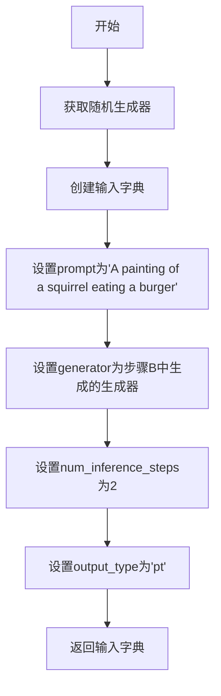

#### 带注释源码

```python
def get_dummy_inputs(self, seed=0):
    # 使用给定的种子获取一个随机生成器，确保结果可复现
    generator = self.get_generator(seed)
    
    # 构建包含测试所需基本参数的字典
    inputs = {
        "prompt": "A painting of a squirrel eating a burger",  # 测试用提示词
        "generator": generator,  # PyTorch随机生成器，用于控制随机性
        "num_inference_steps": 2,  # 推理步数，值较小用于快速测试
        "output_type": "pt",  # 输出类型为PyTorch张量
    }
    
    # 返回构建好的输入字典，供pipeline调用使用
    return inputs
```


### `TestSDXLModularPipelineFast.test_stable_diffusion_xl_euler`

这是一个测试 Stable Diffusion XL 模块化管道的测试方法，用于验证 Euler 采样器的输出是否符合预期。

参数：

- 无显式参数（使用类属性 `expected_image_output_shape` 和硬编码的张量值）

返回值：`无返回值`（该方法为测试方法，通过断言验证结果）

#### 流程图

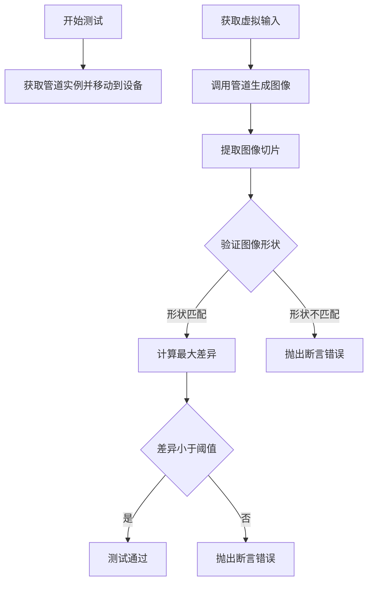

#### 带注释源码

```python
def test_stable_diffusion_xl_euler(self):
    """
    测试 Stable Diffusion XL 的 Euler 采样器输出是否符合预期。
    该方法调用内部 _test_stable_diffusion_xl_euler 方法进行验证。
    """
    # 调用私有测试方法，传入预期图像形状、张量值和最大允许差异
    self._test_stable_diffusion_xl_euler(
        expected_image_shape=self.expected_image_output_shape,  # 预期输出形状 (1, 3, 64, 64)
        expected_slice=torch.tensor(  # 预期的图像切片值（3x3 像素区域）
            [0.3886, 0.4685, 0.4953, 0.4217, 0.4317, 0.3945, 0.4847, 0.4704, 0.4731],
        ),
        expected_max_diff=1e-2,  # 允许的最大差异阈值 0.01
    )
```

---

### `SDXLModularTesterMixin._test_stable_diffusion_xl_euler`

这是实际的测试实现逻辑，被 `test_stable_diffusion_xl_euler` 调用。

参数：

- `expected_image_shape`：`Tuple[int, ...]` 或 `torch.Size`，预期输出图像的形状
- `expected_slice`：`torch.Tensor`，预期的图像切片值（用于数值比较）
- `expected_max_diff`：`float`，允许的最大差异阈值（默认为 1e-2）

返回值：`无返回值`（该方法为测试方法，通过断言验证结果）

#### 流程图

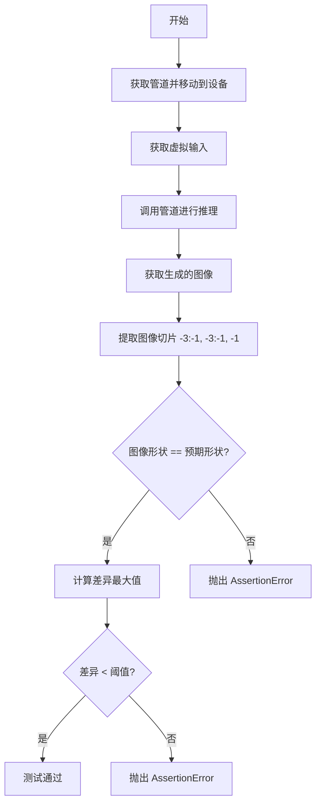

#### 带注释源码

```python
def _test_stable_diffusion_xl_euler(self, expected_image_shape, expected_slice, expected_max_diff=1e-2):
    """
    内部测试方法，验证 Stable Diffusion XL 管道输出的图像是否符合预期。
    
    参数:
        expected_image_shape: 预期的输出图像形状
        expected_slice: 预期的图像切片值（用于数值比较）
        expected_max_diff: 允许的最大差异（默认为 1e-2）
    """
    # 1. 获取管道实例并移动到指定设备（CPU/CUDA）
    sd_pipe = self.get_pipeline().to(torch_device)

    # 2. 获取测试用的虚拟输入（包含 prompt、generator、推理步数等）
    inputs = self.get_dummy_inputs()
    
    # 3. 调用管道进行推理，output="images" 指定输出图像
    image = sd_pipe(**inputs, output="images")
    
    # 4. 提取图像切片：从最后3个像素，通道维度取最后一个通道
    # image shape: (batch, height, width, channels) 或 (batch, channels, height, width)
    # 这里的索引 [0, -3:, -3:, -1] 表明是 (batch=0, h=-3:, w=-3:, c=-1)
    image_slice = image[0, -3:, -3:, -1].cpu()

    # 5. 断言：验证输出图像形状是否与预期形状匹配
    assert image.shape == expected_image_shape
    
    # 6. 计算生成的图像切片与预期切片之间的最大绝对差异
    max_diff = torch.abs(image_slice.flatten() - expected_slice).max()
    
    # 7. 断言：验证差异是否在允许范围内
    assert max_diff < expected_max_diff, f"Image slice does not match expected slice. Max Difference: {max_diff}"
```


### `SDXLModularTesterMixin.test_inference_batch_single_identical`

这是一个测试方法，用于验证批量推理时单个样本的输出与单独推理时的输出一致性。该方法通过比较批量推理和单独推理的结果，确保管道在两种推理模式下产生相同的输出。

参数：

- 无直接参数（但内部调用父类方法时传入 `expected_max_diff=3e-3`）

返回值：`None`，该方法为测试用例，通过断言验证结果

#### 流程图

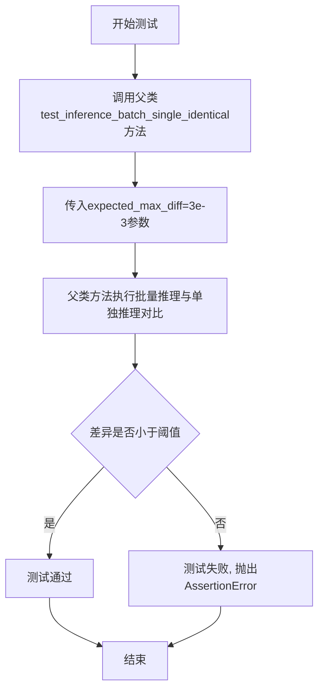

#### 带注释源码

```python
def test_inference_batch_single_identical(self):
    """
    测试批量推理时，单个样本的输出是否与单独推理时的输出一致。
    
    该测试方法验证管道在批量推理模式和单独推理模式下是否产生相同的结果，
    确保推理的一致性。允许的最大差异由expected_max_diff参数控制。
    """
    # 调用父类ModularPipelineTesterMixin的同名方法
    # 传入expected_max_diff=3e-3作为最大允许差异阈值
    super().test_inference_batch_single_identical(expected_max_diff=3e-3)
```


### `SDXLModularIPAdapterTesterMixin.test_pipeline_inputs_and_blocks`

该方法用于测试 IP Adapter 在 Stable Diffusion XL 模块化管道中的集成情况，验证 `ip_adapter_image` 参数和 `ip_adapter` 块是否被正确支持以及在移除后是否被正确清理。

参数：

- `self`：隐式参数，测试类实例本身，无需显式传递

返回值：`None`，该方法为测试方法，通过断言验证条件，不返回任何值

#### 流程图

```mermaid
flowchart TD
    A[开始测试] --> B[获取 pipeline blocks 实例]
    B --> C[获取 input_names 参数列表]
    C --> D{验证 pipeline_class 继承自 ModularIPAdapterMixin}
    D -->|是 --> E{检查 ip_adapter_image 在参数中}
    E -->|是 --> F{检查 ip_adapter 在 sub_blocks 中}
    F -->|是 --> G[从 sub_blocks 中移除 ip_adapter 块]
    G --> H[重新获取 input_names 参数列表]
    H --> I{验证 ip_adapter_image 不在参数中}
    I -->|是 --> J[测试通过]
    D -->|否 --> K[抛出 AssertionError]
    E -->|否 --> K
    F -->|否 --> K
    I -->|否 --> K
```

#### 带注释源码

```python
def test_pipeline_inputs_and_blocks(self):
    """
    测试 IP Adapter 在模块化管道中的输入和块配置。
    验证 ip_adapter_image 参数和 ip_adapter 块的存在性与一致性。
    """
    # 创建 pipeline blocks 实例，用于访问输入参数和子块信息
    blocks = self.pipeline_blocks_class()
    
    # 获取当前管道的输入参数名称列表
    parameters = blocks.input_names

    # 断言：验证管道类是否继承自 ModularIPAdapterMixin
    # 这是 IP Adapter 功能存在的前提条件
    assert issubclass(self.pipeline_class, ModularIPAdapterMixin)
    
    # 断言：验证 ip_adapter_image 参数是否在管道调用方法中支持
    # IP Adapter 需要通过图像输入来传递条件信息
    assert "ip_adapter_image" in parameters, (
        "`ip_adapter_image` argument must be supported by the `__call__` method"
    )
    
    # 断言：验证管道是否包含 IPAdapter 块
    # 这是 IP Adapter 功能实现的核心组件
    assert "ip_adapter" in blocks.sub_blocks, "pipeline must contain an IPAdapter block"

    # 从子块字典中移除 ip_adapter 块
    # 用于测试移除后的参数清理情况
    _ = blocks.sub_blocks.pop("ip_adapter")
    
    # 重新获取输入参数名称列表
    parameters = blocks.input_names
    
    # 断言：验证移除 ip_adapter 后，ip_adapter_image 参数也被正确移除
    # 确保参数与块配置的一致性
    assert "ip_adapter_image" not in parameters, (
        "`ip_adapter_image` argument must be removed from the `__call__` method"
    )
```


### `SDXLModularIPAdapterTesterMixin._get_dummy_image_embeds`

该方法用于生成虚拟的图像嵌入向量（dummy image embeddings），作为 IP Adapter 测试中的输入。在测试 IP Adapter 功能时，需要构造假的图像嵌入数据来验证管道的正确性。

参数：

- `cross_attention_dim`：`int`，交叉注意力维度（cross attention dimension），用于指定嵌入向量的维度大小，默认值为 `32`。

返回值：`torch.Tensor`，返回一个形状为 `(1, 1, cross_attention_dim)` 的随机张量，模拟 IP Adapter 的图像嵌入表示。

#### 流程图

```mermaid
flowchart TD
    A[开始] --> B{是否传入 cross_attention_dim?}
    B -->|是| C[使用传入的值]
    B -->|否| D[使用默认值 32]
    C --> E[调用 torch.randn 生成随机张量]
    D --> E
    E --> F[形状: (1, 1, cross_attention_dim)]
    F --> G[设备: torch_device]
    G --> H[返回张量]
    H --> I[结束]
```

#### 带注释源码

```python
def _get_dummy_image_embeds(self, cross_attention_dim: int = 32):
    """
    生成虚拟的图像嵌入向量，用于 IP Adapter 测试。
    
    该方法创建一个形状为 (1, 1, cross_attention_dim) 的随机张量，
    模拟 IP Adapter 在推理过程中需要的图像嵌入表示。
    在测试场景中，我们使用随机数据来验证管道逻辑的正确性，
    而非使用真实的图像编码结果。
    
    参数:
        cross_attention_dim (int): 交叉注意力维度，决定了嵌入向量的长度。
                                   默认为 32，这是测试中常用的较小维度。
    
    返回:
        torch.Tensor: 形状为 (1, 1, cross_attention_dim) 的随机张量，
                      位于指定的 torch_device 设备上。
    """
    # 使用 torch.randn 生成标准正态分布的随机张量
    # 形状解释:
    #   - 第一个维度 1: 批次大小 (batch size)
    #   - 第二个维度 1: 图像数量 (number of images)
    #   - 第三个维度 cross_attention_dim: 嵌入维度
    return torch.randn((1, 1, cross_attention_dim), device=torch_device)
```


### `SDXLModularIPAdapterTesterMixin._get_dummy_faceid_image_embeds`

该方法是一个测试辅助函数，用于生成虚拟的FaceID图像嵌入向量。在IP-Adapter测试中，需要准备假的图像嵌入来验证Pipeline正确处理IP-Adapter功能。该函数返回一个4D随机张量，专门为FaceID类型的IP-Adapter设计（区别于普通IP-Adapter的3D嵌入）。

参数：

- `cross_attention_dim`：`int`，默认值32，指定cross attention维度大小

返回值：`torch.Tensor`，形状为(1, 1, 1, cross_attention_dim)的4D随机张量，表示虚拟的FaceID图像嵌入

#### 流程图

```mermaid
flowchart TD
    A[开始] --> B{传入cross_attention_dim参数}
    B -->|默认值为32| C[使用torch.randn生成随机张量]
    C --> D[形状: (1, 1, 1, cross_attention_dim)]
    D --> E[设备: torch_device]
    E --> F[返回随机嵌入张量]
    F --> G[结束]
```

#### 带注释源码

```python
def _get_dummy_faceid_image_embeds(self, cross_attention_dim: int = 32):
    """
    生成虚拟的FaceID图像嵌入向量，用于IP-Adapter测试。
    
    FaceID嵌入与普通图像嵌入不同，使用4D张量(1,1,1,dim)而非3D张量(1,1,dim)，
    这反映了人脸识别特征的空间结构特性。
    
    参数:
        cross_attention_dim: int, cross attention维度，默认值为32
        
    返回:
        torch.Tensor: 形状为(1, 1, 1, cross_attention_dim)的随机张量，
                     模拟FaceID图像嵌入向量
    """
    return torch.randn((1, 1, 1, cross_attention_dim), device=torch_device)
```


### `SDXLModularIPAdapterTesterMixin._get_dummy_masks`

该方法用于生成用于 IP-Adapter 测试的虚拟掩码张量（dummy masks），创建一个形状为 (1, 1, input_size, input_size) 的掩码张量，其中左半部分值为 1，右半部分值为 0，常用于测试中的图像分割或区域控制。

参数：

- `input_size`：`int`，掩码张量的高度和宽度，默认为 64

返回值：`torch.Tensor`，形状为 (1, 1, input_size, input_size) 的 4D 张量，其中左半部分像素值为 1，右半部分像素值为 0

#### 流程图

```mermaid
flowchart TD
    A[开始] --> B[创建全零张量<br/>形状: (1, 1, input_size, input_size)]
    B --> C[设置左半部分为1<br/>索引: 0, :, :, :int(input_size/2)]
    C --> D[返回掩码张量]
```

#### 带注释源码

```python
def _get_dummy_masks(self, input_size: int = 64):
    """
    生成用于 IP-Adapter 测试的虚拟掩码张量。
    
    创建一个 4D 张量，形状为 (1, 1, input_size, input_size)，其中：
    - 左半部分（宽度的一半）的值为 1，表示需要关注的区域
    - 右半部分的值为 0，表示不关注的区域
    
    参数:
        input_size: int, 掩码的尺寸，默认为 64
        
    返回:
        torch.Tensor: 形状为 (1, 1, input_size, input_size) 的掩码张量
    """
    # 创建一个全零的4D张量，形状为 (batch=1, channels=1, height=input_size, width=input_size)
    # 使用 torch_device (如 'cuda' 或 'cpu') 作为设备
    _masks = torch.zeros((1, 1, input_size, input_size), device=torch_device)
    
    # 将掩码的左半部分设置为 1
    # 索引 [0, :, :, :int(input_size / 2)] 表示：
    #   - 第一个维度（batch）：取第 0 个样本
    #   - 第二个维度（channel）：取所有通道
    #   - 第三个维度（height）：取所有高度
    #   - 第四个维度（width）：取前一半的宽度
    _masks[0, :, :, : int(input_size / 2)] = 1
    
    # 返回生成的掩码张量
    return _masks
```


### `SDXLModularIPAdapterTesterMixin._modify_inputs_for_ip_adapter_test`

该方法用于在 IP-Adapter 测试前修改输入参数。它首先移除管道块中的 IP-Adapter 子块，然后根据管道参数设置推理步数，最后将输出类型设置为 PyTorch 张量格式。

参数：

- `self`：`SDXLModularIPAdapterTesterMixin`，调用此方法的类实例
- `inputs`：`Dict[str, Any]`（字典类型），包含管道推理所需参数的字典对象，需要对其进行修改以适配 IP-Adapter 测试场景

返回值：`Dict[str, Any]`，返回修改后的输入字典，包含调整后的推理步数和输出类型

#### 流程图

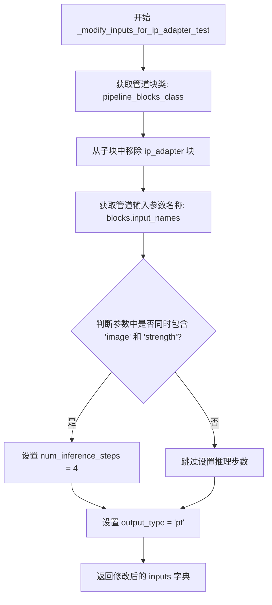

#### 带注释源码

```
def _modify_inputs_for_ip_adapter_test(self, inputs: Dict[str, Any]):
    """
    在进行 IP-Adapter 测试前，修改输入参数以适配测试需求。
    
    该方法执行以下操作：
    1. 移除管道块中的 IP-Adapter 子块，以便测试不带 IP-Adapter 的基准情况
    2. 检查管道是否支持 image 和 strength 参数（即是否为 image-to-image 任务）
       如果是，则设置推理步数为 4 以加快测试速度
    3. 将输出类型强制设置为 PyTorch 张量 (pt) 以便进行数值比较
    
    参数:
        inputs: Dict[str, Any] - 包含管道调用参数的字典，如 prompt、num_inference_steps 等
        
    返回:
        Dict[str, Any] - 修改后的输入字典，用于后续管道调用
    """
    # 获取管道块类，用于检查和修改其配置
    blocks = self.pipeline_blocks_class()
    
    # 移除 ip_adapter 子块，确保测试时不加载 IP-Adapter
    # 这样可以测试基准推理（不带 IP-Adapter）的输出
    _ = blocks.sub_blocks.pop("ip_adapter")
    
    # 获取修改后的管道输入参数名称列表
    parameters = blocks.input_names
    
    # 检查是否为 image-to-image 任务（同时支持 image 和 strength 参数）
    # 如果是图像到图像任务，需要设置合适的推理步数
    if "image" in parameters and "strength" in parameters:
        inputs["num_inference_steps"] = 4
    
    # 强制设置输出类型为 PyTorch 张量，便于进行数值比较和差异计算
    inputs["output_type"] = "pt"
    
    # 返回修改后的输入字典
    return inputs
```


### `SDXLModularIPAdapterTesterMixin.test_ip_adapter`

该方法用于测试 IP-Adapter（图像提示适配器）的功能，验证单IP-Adapter和多IP-Adapter在不同缩放因子下的行为是否符合预期，包括scale=0时应与正常推理结果一致，scale!=0时应产生明显不同的输出。

参数：

- `expected_max_diff`：`float`，默认 `1e-4`，测试中允许的最大差异容差
- `expected_pipe_slice`：`Any` 或 `None`，可选参数，用于与预期输出切片进行比较

返回值：`None`，该方法为测试方法，不返回任何值，通过断言验证正确性

#### 流程图

```mermaid
flowchart TD
    A[开始 test_ip_adapter 测试] --> B{检查设备类型}
    B -->|CPU| C[设置 expected_max_diff = 9e-4]
    B -->|GPU| D[保持 expected_max_diff = 1e-4]
    C --> E[获取 pipeline blocks 并移除 ip_adapter 子块]
    D --> E
    E --> F[初始化 pipeline 并加载组件]
    F --> G[获取 cross_attention_dim]
    G --> H[执行无 IP-Adapter 的前向传播]
    H --> I[测试场景1: 单IP-Adapter scale=0]
    I --> J[加载 IP-Adapter 权重]
    J --> K[设置 scale=0 并执行前向传播]
    K --> L[计算差异并断言 < expected_max_diff]
    L --> M[测试场景2: 单IP-Adapter scale!=0]
    M --> N[设置 scale=42 并执行前向传播]
    N --> O[计算差异并断言 > 1e-2]
    O --> P[测试场景3: 多IP-Adapter scale=0]
    P --> Q[加载两份 IP-Adapter 权重]
    Q --> R[设置 scale=[0.0, 0.0] 并执行前向传播]
    R --> S[计算差异并断言 < expected_max_diff]
    S --> T[测试场景4: 多IP-Adapter scale!=0]
    T --> U[设置 scale=[42.0, 42.0] 并执行前向传播]
    U --> V[计算差异并断言 > 1e-2]
    V --> W[结束测试]
```

#### 带注释源码

```python
def test_ip_adapter(self, expected_max_diff: float = 1e-4, expected_pipe_slice=None):
    r"""Tests for IP-Adapter.

    The following scenarios are tested:
      - Single IP-Adapter with scale=0 should produce same output as no IP-Adapter.
      - Multi IP-Adapter with scale=0 should produce same output as no IP-Adapter.
      - Single IP-Adapter with scale!=0 should produce different output compared to no IP-Adapter.
      - Multi IP-Adapter with scale!=0 should produce different output compared to no IP-Adapter.
    """
    # Raising the tolerance for this test when it's run on a CPU because we
    # compare against static slices and that can be shaky (with a VVVV low probability).
    # 如果在 CPU 上运行测试，提高容差以应对静态切片的抖动
    expected_max_diff = 9e-4 if torch_device == "cpu" else expected_max_diff

    # 获取 pipeline blocks 并临时移除 ip_adapter 子块进行测试
    blocks = self.pipeline_blocks_class()
    _ = blocks.sub_blocks.pop("ip_adapter")
    
    # 使用预训练模型路径初始化 pipeline
    pipe = blocks.init_pipeline(self.pretrained_model_name_or_path)
    
    # 加载组件，指定数据类型为 float32
    pipe.load_components(torch_dtype=torch.float32)
    
    # 将 pipeline 移动到指定设备
    pipe = pipe.to(torch_device)

    # 从 UNet 配置中获取 cross_attention_dim
    cross_attention_dim = pipe.unet.config.get("cross_attention_dim")

    # ========== 基础测试：无 IP-Adapter 的前向传播 ==========
    # 修改输入以适配 IP-Adapter 测试
    inputs = self._modify_inputs_for_ip_adapter_test(self.get_dummy_inputs())
    if expected_pipe_slice is None:
        # 执行无 IP-Adapter 的推理
        output_without_adapter = pipe(**inputs, output="images")
    else:
        # 使用预期切片作为基准输出
        output_without_adapter = expected_pipe_slice

    # ========== 1. 单 IP-Adapter 测试用例 ==========
    # 创建 IP-Adapter 状态字典并加载权重
    adapter_state_dict = create_ip_adapter_state_dict(pipe.unet)
    pipe.unet._load_ip_adapter_weights(adapter_state_dict)

    # 场景1a：单 IP-Adapter，scale=0（应无效果）
    inputs = self._modify_inputs_for_ip_adapter_test(self.get_dummy_inputs())
    # 设置正向和负向 IP-Adapter 嵌入
    inputs["ip_adapter_embeds"] = [self._get_dummy_image_embeds(cross_attention_dim)]
    inputs["negative_ip_adapter_embeds"] = [self._get_dummy_image_embeds(cross_attention_dim)]
    # 设置 scale 为 0.0
    pipe.set_ip_adapter_scale(0.0)
    # 执行推理
    output_without_adapter_scale = pipe(**inputs, output="images")
    # 如果有预期切片，则提取并展平输出
    if expected_pipe_slice is not None:
        output_without_adapter_scale = output_without_adapter_scale[0, -3:, -3:, -1].flatten()

    # 场景1b：单 IP-Adapter，scale!=0（应有效果）
    inputs = self._modify_inputs_for_ip_adapter_test(self.get_dummy_inputs())
    inputs["ip_adapter_embeds"] = [self._get_dummy_image_embeds(cross_attention_dim)]
    inputs["negative_ip_adapter_embeds"] = [self._get_dummy_image_embeds(cross_attention_dim)]
    # 设置较大的 scale 值
    pipe.set_ip_adapter_scale(42.0)
    output_with_adapter_scale = pipe(**inputs, output="images")
    if expected_pipe_slice is not None:
        output_with_adapter_scale = output_with_adapter_scale[0, -3:, -3:, -1].flatten()

    # 计算差异并断言
    max_diff_without_adapter_scale = torch.abs(output_without_adapter_scale - output_without_adapter).max()
    max_diff_with_adapter_scale = torch.abs(output_with_adapter_scale - output_without_adapter).max()

    # 断言：scale=0 时输出应与无 adapter 时相同
    assert max_diff_without_adapter_scale < expected_max_diff, (
        "Output without ip-adapter must be same as normal inference"
    )
    # 断言：scale!=0 时输出应与无 adapter 时不同
    assert max_diff_with_adapter_scale > 1e-2, "Output with ip-adapter must be different from normal inference"

    # ========== 2. 多 IP-Adapter 测试用例 ==========
    # 创建两份 IP-Adapter 状态字典
    adapter_state_dict_1 = create_ip_adapter_state_dict(pipe.unet)
    adapter_state_dict_2 = create_ip_adapter_state_dict(pipe.unet)
    # 加载多 IP-Adapter 权重
    pipe.unet._load_ip_adapter_weights([adapter_state_dict_1, adapter_state_dict_2])

    # 场景2a：多 IP-Adapter，scale=0（应无效果）
    inputs = self._modify_inputs_for_ip_adapter_test(self.get_dummy_inputs())
    # 设置两份嵌入
    inputs["ip_adapter_embeds"] = [self._get_dummy_image_embeds(cross_attention_dim)] * 2
    inputs["negative_ip_adapter_embeds"] = [self._get_dummy_image_embeds(cross_attention_dim)] * 2
    # 设置多 adapter scale 为 0
    pipe.set_ip_adapter_scale([0.0, 0.0])
    output_without_multi_adapter_scale = pipe(**inputs, output="images")
    if expected_pipe_slice is not None:
        output_without_multi_adapter_scale = output_without_multi_adapter_scale[0, -3:, -3:, -1].flatten()

    # 场景2b：多 IP-Adapter，scale!=0（应有效果）
    inputs = self._modify_inputs_for_ip_adapter_test(self.get_dummy_inputs())
    inputs["ip_adapter_embeds"] = [self._get_dummy_image_embeds(cross_attention_dim)] * 2
    inputs["negative_ip_adapter_embeds"] = [self._get_dummy_image_embeds(cross_attention_dim)] * 2
    # 设置多 adapter scale
    pipe.set_ip_adapter_scale([42.0, 42.0])
    output_with_multi_adapter_scale = pipe(**inputs, output="images")
    if expected_pipe_slice is not None:
        output_with_multi_adapter_scale = output_with_multi_adapter_scale[0, -3:, -3:, -1].flatten()

    # 计算差异并断言
    max_diff_without_multi_adapter_scale = torch.abs(
        output_without_multi_adapter_scale - output_without_adapter
    ).max()
    max_diff_with_multi_adapter_scale = torch.abs(output_with_multi_adapter_scale - output_without_adapter).max()
    
    # 断言：多 adapter scale=0 时输出应相同
    assert max_diff_without_multi_adapter_scale < expected_max_diff, (
        "Output without multi-ip-adapter must be same as normal inference"
    )
    # 断言：多 adapter scale!=0 时输出应不同
    assert max_diff_with_multi_adapter_scale > 1e-2, (
        "Output with multi-ip-adapter scale must be different from normal inference"
    )
```


### `SDXLModularControlNetTesterMixin.test_pipeline_inputs`

该方法用于测试 ControlNet 管道是否支持必要的输入参数（`control_image` 和 `controlnet_conditioning_scale`），确保这些参数在管道的 `__call__` 方法中被正确支持。

参数： 无（仅 `self`）

返回值：`None`，该方法通过断言验证参数支持，不返回任何值。

#### 流程图

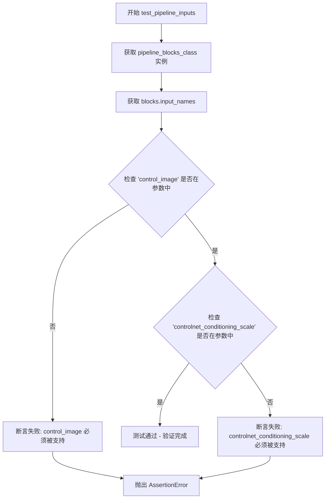

#### 带注释源码

```python
def test_pipeline_inputs(self):
    """
    测试 ControlNet 管道输入参数是否被正确支持。
    
    该测试方法验证以下内容:
    1. pipeline_class 继承自 ModularIPAdapterMixin
    2. 'control_image' 参数在管道的 __call__ 方法中被支持
    3. 'controlnet_conditioning_scale' 参数在管道的 __call__ 方法中被支持
    
    如果移除 ip_adapter block 后，'control_image' 参数应该被移除。
    """
    # 获取管道 blocks 类并实例化
    blocks = self.pipeline_blocks_class()
    
    # 获取管道的输入参数名称列表
    parameters = blocks.input_names

    # 断言验证 control_image 参数必须被支持
    assert "control_image" in parameters, "`control_image` argument must be supported by the `__call__` method"
    
    # 断言验证 controlnet_conditioning_scale 参数必须被支持
    assert "controlnet_conditioning_scale" in parameters, (
        "`controlnet_conditioning_scale` argument must be supported by the `__call__` method"
    )
```


### `SDXLModularControlNetTesterMixin._modify_inputs_for_controlnet_test`

该方法用于为 ControlNet 测试准备输入数据。它通过创建一个随机图像张量并将其添加到输入字典中，作为 `control_image` 参数，以支持 ControlNet 的推理测试。

参数：

- `inputs`：`Dict[str, Any]`，包含测试所需的输入参数字典（如 prompt、num_inference_steps 等）

返回值：`Dict[str, Any]`，返回添加了 `control_image` 键的输入字典

#### 流程图

```mermaid
flowchart TD
    A[开始] --> B[设置 controlnet_embedder_scale_factor = 2]
    B --> C[生成随机控制图像张量]
    C --> D[形状: (1, 3, 64, 64)]
    D --> E[将 control_image 添加到 inputs 字典]
    E --> F[返回修改后的 inputs]
    G[结束]
```

#### 带注释源码

```python
def _modify_inputs_for_controlnet_test(self, inputs: Dict[str, Any]):
    """
    为 ControlNet 测试准备输入数据。
    
    该方法生成一个随机图像张量作为 ControlNet 的控制图像，
    并将其添加到输入字典中用于后续的 ControlNet 推理测试。
    
    参数:
        inputs: 包含测试所需参数的字典，如 prompt、num_inference_steps 等
        
    返回:
        包含 control_image 的输入字典，用于 ControlNet 测试
    """
    # 定义 ControlNet 嵌入器的缩放因子，用于计算控制图像的尺寸
    controlnet_embedder_scale_factor = 2
    
    # 生成一个随机张量作为控制图像，形状为 (batch=1, channel=3, height=64, width=64)
    # 尺寸计算: 32 * 2 = 64
    image = torch.randn(
        (1, 3, 32 * controlnet_embedder_scale_factor, 32 * controlnet_embedder_scale_factor),
        device=torch_device,
    )
    
    # 将生成的图像添加到输入字典中，键名为 "control_image"
    inputs["control_image"] = image
    
    # 返回修改后的输入字典
    return inputs
```


### `SDXLModularControlNetTesterMixin.test_controlnet`

该方法用于测试 ControlNet 集成功能，验证单 ControlNet 在 scale=0 时输出应与无 ControlNet 相同，以及在 scale!=0 时输出应与无 ControlNet 明显不同。

参数：

- `expected_max_diff`：`float`，期望的最大差异阈值，默认为 1e-4，用于验证 scale=0 时输出应相同
- `expected_pipe_slice`：可选参数，预期输出切片，用于与实际输出比较，默认为 None

返回值：无返回值（`None`），该方法为测试用例，通过断言验证功能正确性

#### 流程图

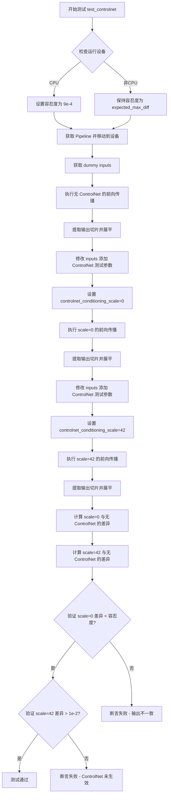

#### 带注释源码

```python
def test_controlnet(self, expected_max_diff: float = 1e-4, expected_pipe_slice=None):
    r"""Tests for ControlNet.

    The following scenarios are tested:
      - Single ControlNet with scale=0 should produce same output as no ControlNet.
      - Single ControlNet with scale!=0 should produce different output compared to no ControlNet.
    """
    # 当在 CPU 上运行时，静态切片的比较可能不稳定，因此提高容忍度
    expected_max_diff = 9e-4 if torch_device == "cpu" else expected_max_diff

    # 获取 Pipeline 实例并移动到测试设备
    pipe = self.get_pipeline().to(torch_device)

    # ===== 场景 1: 无 ControlNet 的基准测试 =====
    # 获取虚拟输入，执行不包含 ControlNet 的前向传播
    inputs = self.get_dummy_inputs()
    output_without_controlnet = pipe(**inputs, output="images")
    # 提取最后 3x3 像素区域并展平，用于后续比较
    output_without_controlnet = output_without_controlnet[0, -3:, -3:, -1].flatten()

    # ===== 场景 2: ControlNet scale=0 的测试 =====
    # scale=0 时 ControlNet 不应产生影响，输出应与无 ControlNet 相同
    inputs = self._modify_inputs_for_controlnet_test(self.get_dummy_inputs())
    inputs["controlnet_conditioning_scale"] = 0.0  # 设置 scale 为 0
    output_without_controlnet_scale = pipe(**inputs, output="images")
    output_without_controlnet_scale = output_without_controlnet_scale[0, -3:, -3:, -1].flatten()

    # ===== 场景 3: ControlNet scale!=0 的测试 =====
    # scale!=0 时 ControlNet 应影响输出，输出应与无 ControlNet 不同
    inputs = self._modify_inputs_for_controlnet_test(self.get_dummy_inputs())
    inputs["controlnet_conditioning_scale"] = 42.0  # 设置较大的 scale 值
    output_with_controlnet_scale = pipe(**inputs, output="images")
    output_with_controlnet_scale = output_with_controlnet_scale[0, -3:, -3:, -1].flatten()

    # ===== 验证逻辑 =====
    # 计算 scale=0 时的输出差异
    max_diff_without_controlnet_scale = torch.abs(
        output_without_controlnet_scale - output_without_controlnet
    ).max()
    # 计算 scale=42 时的输出差异
    max_diff_with_controlnet_scale = torch.abs(output_with_controlnet_scale - output_without_controlnet).max()

    # 断言 scale=0 时输出应相同（差异小于容忍度）
    assert max_diff_without_controlnet_scale < expected_max_diff, (
        "Output without controlnet must be same as normal inference"
    )
    # 断言 scale!=0 时输出应不同（差异大于阈值）
    assert max_diff_with_controlnet_scale > 1e-2, "Output with controlnet must be different from normal inference"
```


### `SDXLModularControlNetTesterMixin.test_controlnet_cfg`

该方法用于测试 ControlNet 与 Classifier-Free Guidance (CFG) 的结合效果。测试分别在不应用 CFG（guidance_scale=1.0）和应用 CFG（guidance_scale=7.5）两种情况下运行管道，验证输出形状一致且 CFG 产生的输出差异大于阈值。

参数：

- `self`：隐式参数，测试类实例本身

返回值：`None`，该方法为测试方法，通过断言验证行为，不返回具体值

#### 流程图

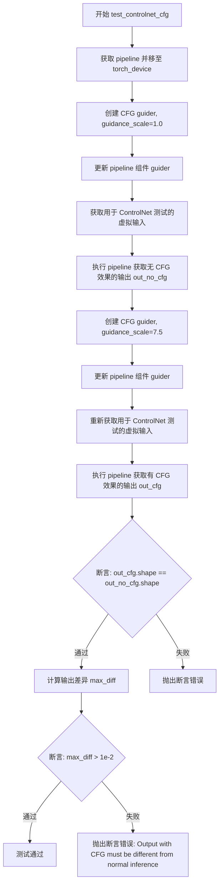

#### 带注释源码

```python
def test_controlnet_cfg(self):
    """
    测试 ControlNet 与 Classifier-Free Guidance (CFG) 的结合效果。
    验证在有/无 CFG 情况下管道的输出差异。
    """
    # 获取 pipeline 并移动到指定的计算设备
    pipe = self.get_pipeline().to(torch_device)

    # ===== 第一部分：不应用 CFG 的前向传播 =====
    # 创建 guidance_scale=1.0 的 guider，此时 CFG 不会产生显著效果
    guider = ClassifierFreeGuidance(guidance_scale=1.0)
    # 更新 pipeline 的组件，将 guider 设置为 ClassifierFreeGuidance
    pipe.update_components(guider=guider)

    # 获取经过 ControlNet 测试适配的虚拟输入（包含 control_image 等）
    inputs = self._modify_inputs_for_controlnet_test(self.get_dummy_inputs())
    # 执行 pipeline，获取无 CFG 效果时的输出
    out_no_cfg = pipe(**inputs, output="images")

    # ===== 第二部分：应用 CFG 的前向传播 =====
    # 创建 guidance_scale=7.5 的 guider，此时 CFG 会产生显著效果
    guider = ClassifierFreeGuidance(guidance_scale=7.5)
    # 再次更新 pipeline 的组件
    pipe.update_components(guider=guider)
    # 重新获取经过 ControlNet 测试适配的虚拟输入
    inputs = self._modify_inputs_for_controlnet_test(self.get_dummy_inputs())
    # 执行 pipeline，获取有 CFG 效果时的输出
    out_cfg = pipe(**inputs, output="images")

    # ===== 验证部分 =====
    # 断言：无论是否应用 CFG，输出形状应保持一致
    assert out_cfg.shape == out_no_cfg.shape
    # 计算两种输出之间的最大差异
    max_diff = torch.abs(out_cfg - out_no_cfg).max()
    # 断言：CFG 产生的输出必须与无 CFG 的输出有显著差异（差异 > 1e-2）
    assert max_diff > 1e-2, "Output with CFG must be different from normal inference"
```


### `TestSDXLModularPipelineFast.get_dummy_inputs`

该方法用于生成Stable Diffusion XL模块化流水线的虚拟输入参数，为测试提供确定性的输入数据。

参数：

- `seed`：`int`，随机种子，用于生成确定性的随机数（默认值为0）

返回值：`Dict[str, Any]`，包含虚拟输入参数的字典，包括提示词、生成器、推理步数和输出类型

#### 流程图

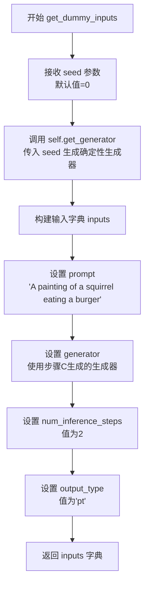

#### 带注释源码

```python
def get_dummy_inputs(self, seed=0):
    """
    生成用于测试 Stable Diffusion XL 模块化流水线的虚拟输入参数。
    
    参数:
        seed (int): 随机种子，用于生成确定性的随机数。默认为0。
    
    返回值:
        dict: 包含测试所需输入参数的字典，包括:
            - prompt: 测试用的提示词
            - generator: PyTorch 生成器，用于确保可重复性
            - num_inference_steps: 推理步数
            - output_type: 输出类型（'pt' 表示 PyTorch 张量）
    """
    # 使用种子生成确定性随机数生成器
    generator = self.get_generator(seed)
    
    # 构建输入参数字典
    inputs = {
        "prompt": "A painting of a squirrel eating a burger",  # 测试用提示词
        "generator": generator,                                 # 确定性生成器
        "num_inference_steps": 2,                               # 快速测试用2步推理
        "output_type": "pt",                                    # 返回PyTorch张量
    }
    return inputs
```


### `TestSDXLModularPipelineFast.test_stable_diffusion_xl_euler`

该方法是 Stable Diffusion XL 模块化管道快速测试的核心测试函数，用于验证管道在 Euler 采样器下的基本推理功能是否正常，通过比较输出的图像切片与期望值来确保模型推理的正确性。

参数：
- `self`：隐式参数，类型为 `TestSDXLModularPipelineFast`（测试类实例），代表测试类本身的引用

返回值：`None`，该方法为测试方法，不返回任何值，通过断言验证结果

#### 流程图

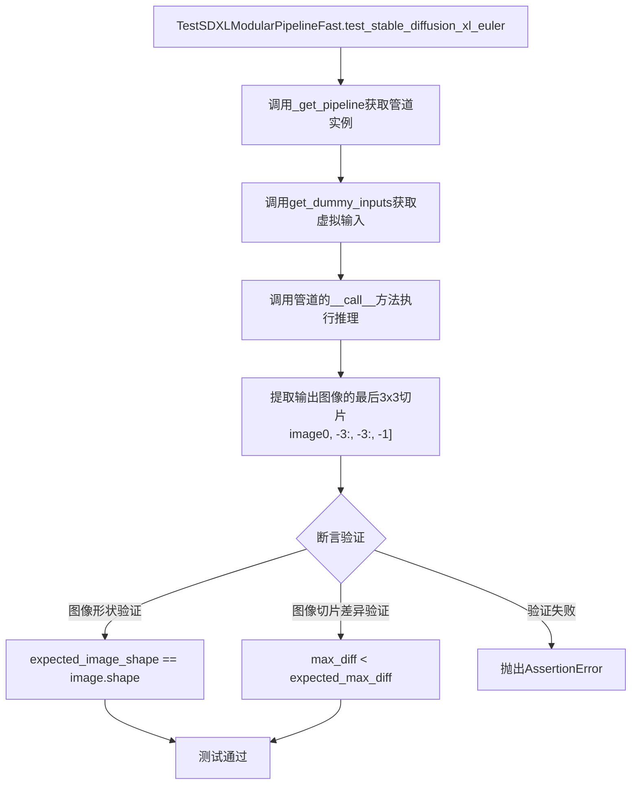

#### 带注释源码

```python
def test_stable_diffusion_xl_euler(self):
    """
    测试 Stable Diffusion XL 模块化管道在 Euler 采样器下的推理功能。
    该测试方法继承自 SDXLModularTesterMixin，调用其 _test_stable_diffusion_xl_euler 方法。
    
    测试流程：
    1. 获取预定义的虚拟输入（包含提示词、生成器、推理步数等）
    2. 使用 Euler 采样器执行管道推理
    3. 验证输出图像的形状是否符合预期
    4. 验证输出图像切片与期望值的差异是否在容忍范围内
    """
    # 调用混合类中的通用测试方法，传入期望的图像形状、期望的图像切片值和最大允许差异
    # expected_image_shape: (1, 3, 64, 64) - 单通道RGB图像，64x64分辨率
    # expected_slice: 包含9个浮点数值的torch.Tensor，代表图像右下角3x3区域的像素值
    # expected_max_diff: 1e-2 = 0.01 - 允许的最大差异阈值
    self._test_stable_diffusion_xl_euler(
        expected_image_shape=self.expected_image_output_shape,  # (1, 3, 64, 64)
        expected_slice=torch.tensor(  # 期望的图像切片值（Euler采样器输出）
            [0.3886, 0.4685, 0.4953, 0.4217, 0.4317, 0.3945, 0.4847, 0.4704, 0.4731],
        ),
        expected_max_diff=1e-2,  # 最大允许差异为0.01
    )
```


### `TestSDXLModularPipelineFast.test_inference_batch_single_identical`

该方法是一个测试用例，用于验证 Stable Diffusion XL 模块化管道在批处理推理（单次传入多个输入）与单次推理（逐个处理相同输入）时产生的结果是否一致，确保管道在两种推理模式下具有数值一致性。

参数：

- `self`：隐式参数，测试类实例本身，无需显式传递

返回值：无返回值（`None`），该方法为测试用例，通过断言验证行为

#### 流程图

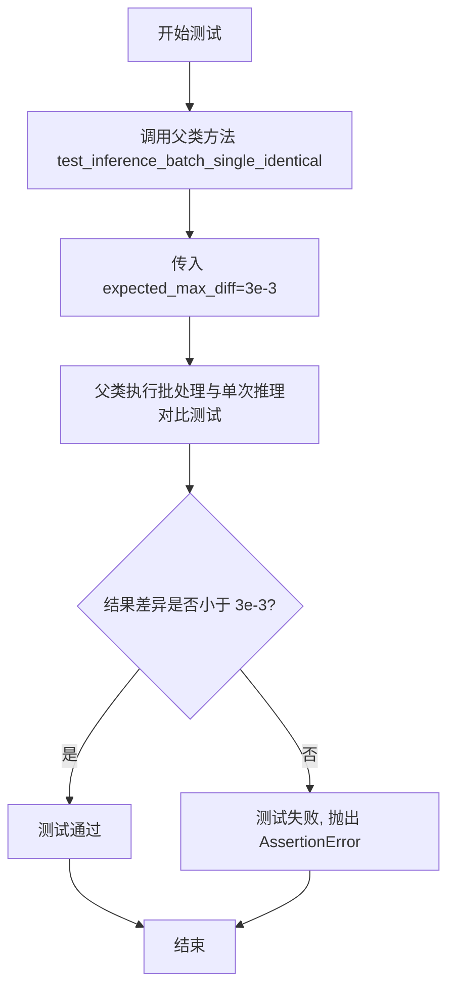

#### 带注释源码

```python
def test_inference_batch_single_identical(self):
    """
    测试方法：验证批处理推理与单次推理结果的一致性。
    
    该测试方法继承自 ModularPipelineTesterMixin，调用父类的 test_inference_batch_single_identical 方法。
    父类方法会执行以下操作：
    1. 使用相同的输入参数分别进行单次推理和批处理推理（批大小为2）
    2. 比较两种推理方式的输出结果
    3. 验证输出差异是否在允许的误差范围内（expected_max_diff=3e-3）
    
    参数:
        self: 测试类实例，包含以下属性：
            - pipeline_class: StableDiffusionXLModularPipeline
            - pipeline_blocks_class: StableDiffusionXLAutoBlocks
            - pretrained_model_name_or_path: "hf-internal-testing/tiny-sdxl-modular"
            - params: 管道参数集合
            - batch_params: 批处理参数集合
            - expected_image_output_shape: 期望输出图像形状 (1, 3, 64, 64)
    
    返回值:
        None: 测试方法，通过断言验证，不返回具体值
    
    异常:
        AssertionError: 当批处理与单次推理结果差异超过 expected_max_diff 时抛出
    """
    # 调用父类的测试方法，验证批处理推理与单次推理的一致性
    # expected_max_diff=3e-3 表示允许的最大差异阈值
    super().test_inference_batch_single_identical(expected_max_diff=3e-3)
```


### `TestSDXLImg2ImgModularPipelineFast.get_dummy_inputs`

该方法用于生成 Stable Diffusion XL Image-to-Image 模块化流水线的虚拟测试输入，创建一个包含提示词、初始图像、生成器和推理参数的字典，以支持流水线测试。

参数：

- `seed`：`int`，随机种子，用于生成确定性的测试数据和随机数生成器

返回值：`Dict[str, Any]`，返回包含图像生成所需参数的字典，包括 prompt、generator、num_inference_steps、output_type、image 和 strength

#### 流程图

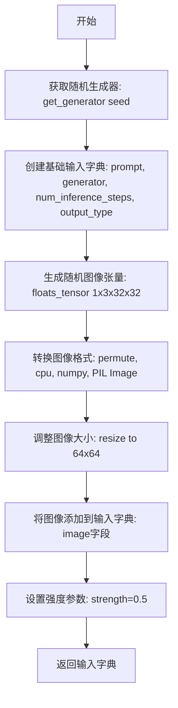

#### 带注释源码

```
def get_dummy_inputs(self, seed=0):
    # 使用种子创建确定性的随机数生成器
    generator = self.get_generator(seed)
    
    # 构建基础输入字典，包含文本提示和生成器配置
    inputs = {
        "prompt": "A painting of a squirrel eating a burger",  # 测试用文本提示
        "generator": generator,                                 # 随机数生成器
        "num_inference_steps": 4,                               # 推理步数
        "output_type": "pt",                                    # 输出为PyTorch张量
    }
    
    # 生成随机浮点张量作为初始图像 (1, 3, 32, 32)
    image = floats_tensor((1, 3, 32, 32), rng=random.Random(seed)).to(torch_device)
    
    # 将张量转换为图像格式: (B, C, H, W) -> (H, W, C) 并转为CPU张量
    image = image.cpu().permute(0, 2, 3, 1)[0]
    
    # 将数值转换为PIL图像并调整为64x64分辨率
    init_image = Image.fromarray(np.uint8(image)).convert("RGB").resize((64, 64))
    
    # 将初始图像添加到输入字典
    inputs["image"] = init_image
    
    # 设置图像到图像转换的强度参数 (0.0-1.0)
    inputs["strength"] = 0.5
    
    # 返回完整的输入字典供流水线测试使用
    return inputs
```


### `TestSDXLImg2ImgModularPipelineFast.test_stable_diffusion_xl_euler`

该方法是 Stable Diffusion XL（SDXL）图像到图像（Image-to-Image）模块化管道的快速测试用例，用于验证 Euler 采样器在图生图任务中的核心功能是否正常，通过比较生成的图像切片与预期值来确保模型输出的正确性。

参数：

- `self`：隐式参数，测试类实例本身，无需显式传递

返回值：无（`None`），该方法为测试方法，通过断言验证图像输出是否符合预期

#### 流程图

```mermaid
flowchart TD
    A[开始测试] --> B[获取测试管道实例]
    B --> C[调用 get_dummy_inputs 获取虚拟输入]
    C --> D[使用 Euler 采样器执行图生图推理]
    D --> E[提取图像右下角 3x3 切片]
    E --> F[断言图像形状是否符合预期]
    F --> G{形状匹配?}
    G -->|是| H[计算切片最大差异]
    G -->|否| I[抛出断言错误]
    H --> I
    I --> J{差异小于阈值?}
    J -->|是| K[测试通过]
    J -->|否| L[抛出断言错误: 图像切片不匹配]
    K --> M[结束测试]
    L --> M
```

#### 带注释源码

```python
def test_stable_diffusion_xl_euler(self):
    """
    测试 Stable Diffusion XL 的 Euler 采样器在图生图任务中的功能。
    该测试方法继承自 SDXLModularTesterMixin，调用其内部 _test_stable_diffusion_xl_euler 方法。
    测试通过比较生成的图像与预期图像切片来验证模型输出的正确性。
    """
    # 调用父类测试方法，传入预期图像形状、预期图像切片和最大允许差异
    # expected_image_shape: (1, 3, 64, 64) - 批量大小1，通道数3，64x64分辨率
    # expected_slice: torch.tensor([0.5246, 0.4466, 0.444, 0.3246, 0.4443, 0.5108, 0.5225, 0.559, 0.5147])
    #                  - 图像右下角3x3=9个像素的预期值，展平为一维张量
    # expected_max_diff: 1e-2 (0.01) - 允许的最大差异阈值
    self._test_stable_diffusion_xl_euler(
        expected_image_shape=self.expected_image_output_shape,  # (1, 3, 64, 64)
        expected_slice=torch.tensor(
            [0.5246, 0.4466, 0.444, 0.3246, 0.4443, 0.5108, 0.5225, 0.559, 0.5147]
        ),
        expected_max_diff=1e-2,
    )
```


### `TestSDXLImg2ImgModularPipelineFast.test_inference_batch_single_identical`

该方法继承自 `ModularPipelineTesterMixin`，用于测试批处理推理（batch inference）与单样本推理（single inference）的一致性，确保在批量处理多张图像时，每张图像的输出与单独处理该图像时的输出一致。

参数：

- `expected_max_diff`：`float`，允许的最大差异阈值，设为 `3e-3`，用于判断批处理与单样本推理的输出是否在可接受范围内

返回值：`None`，该方法为测试用例，通过断言验证结果，不返回具体数值

#### 流程图

```mermaid
flowchart TD
    A[调用 test_inference_batch_single_identical] --> B[调用父类方法 super().test_inference_batch_single_identical]
    B --> C[传入 expected_max_diff=3e-3 参数]
    C --> D[获取测试用虚拟输入 get_dummy_inputs]
    C --> E[分别执行单样本推理和批处理推理]
    E --> F[对比两种推理方式的输出差异]
    F --> G{差异 < expected_max_diff?}
    G -->|是| H[测试通过]
    G -->|否| I[断言失败, 抛出 AssertionError]
```

#### 带注释源码

```python
def test_inference_batch_single_identical(self, expected_max_diff: float = 3e-3):
    """
    测试批处理推理与单样本推理的一致性。
    
    参数:
        expected_max_diff: 允许的最大差异阈值,默认为3e-3
        
    说明:
        该方法继承自ModularPipelineTesterMixin,实际测试逻辑在父类中实现。
        子类重写此方法以设置特定的expected_max_diff阈值。
        验证批量推理时,每个单独的输入所产生的输出应与单独推理时一致。
    """
    # 调用父类的测试方法,传入自定义的差异阈值
    # 父类方法将执行:
    # 1. 获取虚拟输入 (通过 get_dummy_inputs)
    # 2. 执行单样本推理
    # 3. 执行批处理推理 (将单样本输入作为批量大小为1的批次)
    # 4. 比较两种推理方式的输出
    # 5. 断言差异小于 expected_max_diff
    super().test_inference_batch_single_identical(expected_max_diff=3e-3)
```


### `SDXLInpaintingModularPipelineFastTests.get_dummy_inputs`

该方法用于生成 Stable Diffusion XL 图像修复（inpainting）模块化管道的虚拟输入数据，创建一个包含提示词、初始图像、掩码图像和推理参数的字典，以供测试使用。

参数：

- `device`：`torch.device`，目标设备，用于将张量移动到指定的计算设备（如 CPU 或 CUDA 设备）
- `seed`：`int`，随机种子，默认值为 0，用于确保生成可重复的随机数据

返回值：`Dict[str, Any]`，返回包含以下键的字典：
  - `prompt`（str）：文本提示词
  - `generator`（torch.Generator）：随机数生成器
  - `num_inference_steps`（int）：推理步数
  - `output_type`（str）：输出类型（"pt" 表示 PyTorch 张量）
  - `image`（PIL.Image）：初始图像
  - `mask_image`（PIL.Image）：掩码图像
  - `strength`（float）：图像修复强度

#### 流程图

```mermaid
flowchart TD
    A[开始] --> B[获取随机数生成器<br/>generator = self.get_generator seed]
    B --> C[创建基础输入字典<br/>包含 prompt, generator, num_inference_steps, output_type]
    C --> D[生成随机张量<br/>floats_tensor 1x3x32x32]
    D --> E[将张量移到设备<br/>.to device]
    E --> F[转换张量格式<br/>CPU permute 0,2,3,1 并取第0个]
    F --> G[创建初始图像<br/>Image.fromarray uint8<br/>convert RGB resize 64x64]
    G --> H[修改张量创建掩码<br/>image 8: 区域设为255]
    H --> I[创建掩码图像<br/>Image.fromarray convert L<br/>resize 64x64]
    I --> J[添加 image 到输入字典]
    J --> K[添加 mask_image 到输入字典]
    K --> L[添加 strength=1.0]
    L --> M[返回 inputs 字典]
```

#### 带注释源码

```python
def get_dummy_inputs(self, device, seed=0):
    # 使用给定的种子获取随机数生成器，确保测试可重复性
    generator = self.get_generator(seed)
    
    # 初始化基础输入字典，包含管道所需的基本参数
    inputs = {
        "prompt": "A painting of a squirrel eating a burger",  # 文本提示词
        "generator": generator,  # PyTorch 随机生成器，用于控制噪声
        "num_inference_steps": 4,  # 推理步数，较少步数用于快速测试
        "output_type": "pt",  # 输出为 PyTorch 张量
    }
    
    # 生成随机浮点张量 (1, 3, 32, 32) 作为初始图像数据
    image = floats_tensor((1, 3, 32, 32), rng=random.Random(seed)).to(device)
    
    # 将张量从 CHW 格式转换为 HWC 格式，并取第一个样本
    # .cpu() 确保数据移回 CPU 用于 PIL 处理
    # .permute(0, 2, 3, 1) 将 (1,3,32,32) 转换为 (1,32,32,3)
    # [0] 取出第一个batch维度的数据
    image = image.cpu().permute(0, 2, 3, 1)[0]
    
    # 将numpy数组转换为PIL图像
    # np.uint8 将浮点数据转换为 0-255 范围的整数
    # convert('RGB') 确保图像为RGB三通道格式
    # resize((64, 64)) 将图像调整为目标尺寸
    init_image = Image.fromarray(np.uint8(image)).convert("RGB").resize((64, 64))

    # 创建掩码图像：将图像右下区域（从第8行第8列开始）设为白色（255）
    # 这模拟了需要修复的区域
    image[8:, 8:, :] = 255
    
    # 创建掩码图像
    # convert('L') 将RGB图像转换为灰度图，灰度值表示修复区域
    mask_image = Image.fromarray(np.uint8(image)).convert("L").resize((64, 64))

    # 将初始图像添加到输入字典
    inputs["image"] = init_image
    
    # 将掩码图像添加到输入字典
    inputs["mask_image"] = mask_image
    
    # 设置修复强度为1.0，表示完全按照掩码区域进行修复
    inputs["strength"] = 1.0

    # 返回完整的输入字典，用于调用 Stable Diffusion XL Inpainting pipeline
    return inputs
```


### `SDXLInpaintingModularPipelineFastTests.test_stable_diffusion_xl_euler`

该方法是Stable Diffusion XL图像修复（Inpainting）模块化流水线的快速测试用例，用于验证模型在给定提示词（"A painting of a squirrel eating a burger"）下生成的图像输出是否符合预期的形状和数值范围。

参数：此方法无显式参数（仅继承自测试框架的隐式self参数）

返回值：无显式返回值（通过断言进行验证）

#### 流程图

```mermaid
flowchart TD
    A[开始测试] --> B[获取测试管道实例]
    B --> C[调用get_dummy_inputs获取虚拟输入]
    C --> D[将管道移至torch_device设备]
    D --> E[执行管道推理: pipe(**inputs, output='images')]
    E --> F[提取图像切片: image[0, -3:, -3:, -1]]
    F --> G[断言图像形状: assert image.shape == expected_image_shape]
    G --> H[计算最大差异: max_diff = torch.abs(image_slice - expected_slice).max]
    H --> I[断言差异阈值: assert max_diff < expected_max_diff]
    I --> J[测试通过]
    
    style A fill:#f9f,color:#333
    style J fill:#9f9,color:#333
```

#### 带注释源码

```python
def test_stable_diffusion_xl_euler(self):
    """
    测试Stable Diffusion XL图像修复流水线的基本推理功能。
    
    该测试通过以下步骤验证模型:
    1. 创建虚拟输入（提示词、噪声种子等）
    2. 使用Euler采样器执行前向传播
    3. 验证输出图像形状符合预期
    4. 验证输出数值与预期Slice的差异在容忍范围内
    """
    # 调用父类Mixin中定义的通用测试方法
    # 传入三个关键参数:
    #   - expected_image_output_shape: 期望的输出图像形状 (1, 3, 64, 64)
    #   - expected_slice: 期望的图像右下角3x3像素区域的数值
    #   - expected_max_diff: 允许的最大差异阈值 (1e-2 = 0.01)
    self._test_stable_diffusion_xl_euler(
        expected_image_shape=self.expected_image_output_shape,  # (1, 3, 64, 64)
        expected_slice=torch.tensor(
            [
                0.40872607,  # 像素[0]预期值
                0.38842705,  # 像素[1]预期值
                0.34893104,  # 像素[2]预期值
                0.47837183,  # 像素[3]预期值
                0.43792963,  # 像素[4]预期值
                0.5332134,   # 像素[5]预期值
                0.3716843,   # 像素[6]预期值
                0.47274873,  # 像素[7]预期值
                0.45000193,  # 像素[8]预期值
            ],
            device=torch_device,  # 测试设备 (CPU/CUDA)
        ),
        expected_max_diff=1e-2,  # 最大允许误差 0.01
    )
```


### `SDXLInpaintingModularPipelineFastTests.test_inference_batch_single_identical`

该方法用于测试 Stable Diffusion XL 修复（Inpainting）模块化管道的批处理推理一致性，通过对比单样本推理和批处理推理的输出差异，验证管道在两种推理模式下的一致性。

参数：

- `expected_max_diff`：`float`，期望的最大差异阈值，用于判断批处理和单样本推理结果是否足够接近，默认值为 `3e-3`

返回值：`None`，该方法为测试方法，通过断言验证结果一致性，不返回具体数值

#### 流程图

```mermaid
flowchart TD
    A[开始测试] --> B[获取当前测试类的pipeline配置]
    B --> C[调用父类test_inference_batch_single_identical方法]
    C --> D[传入expected_max_diff=3e-3参数]
    D --> E{父类方法执行推理}
    E --> F[单样本推理]
    E --> G[批处理推理]
    F --> H[计算输出差异]
    G --> H
    H --> I{差异 < expected_max_diff?}
    I -->|是| J[测试通过]
    I -->|否| K[断言失败, 抛出异常]
    J --> L[结束测试]
```

#### 带注释源码

```python
def test_inference_batch_single_identical(self, expected_max_diff=3e-3):
    """
    测试批处理推理与单样本推理的一致性
    
    参数:
        expected_max_diff: float, 允许的最大差异阈值,默认为3e-3
        该测试继承自ModularPipelineTesterMixin,用于验证:
        - 同一输入的批处理推理结果应与单样本推理结果一致
        - 用于检测管道中潜在的不确定性问题(如Dropout,非确定性算子等)
    """
    # 调用父类方法执行实际的测试逻辑
    # 父类ModularPipelineTesterMixin中的test_inference_batch_single_identical
    # 会进行以下操作:
    # 1. 使用相同的随机种子获取单样本输入和批处理输入
    # 2. 分别执行单样本推理和批处理推理
    # 3. 提取推理结果并计算差异
    # 4. 使用assert验证差异是否在预期范围内
    super().test_inference_batch_single_identical(expected_max_diff=3e-3)
```

## 关键组件


### 张量索引与图像处理

在`get_dummy_inputs`方法中，通过PIL和numpy处理图像张量，使用`.permute(0, 2, 3, 1)`进行维度转换，将CHW格式转换为HWC格式以便图像显示和处理。

### IP Adapter（图像提示适配器）

`SDXLModularIPAdapterTesterMixin`类提供了IP Adapter的完整测试流程，包括单IP Adapter和多IP Adapter的scale参数测试，支持`ip_adapter_embeds`和`negative_ip_adapter_embeds`嵌入向量，以及`set_ip_adapter_scale`方法控制适配器权重。

### ControlNet（控制网络）

`SDXLModularControlNetTesterMixin`类实现ControlNet功能测试，支持`control_image`条件图像输入和`controlnet_conditioning_scale`控制强度，支持CFG（无分类器引导）组合使用。

### 量化策略与数据类型

在测试中使用`torch.float32`数据类型，通过`torch_dtype=torch.float32`参数加载组件，确保测试的数值稳定性。

### 模块化流水线架构

`StableDiffusionXLModularPipeline`和`StableDiffusionXLAutoBlocks`构成模块化流水线框架，支持文本到图像、图像到图像、图像修复等多种任务的工作流配置。

### 工作流定义

`TEXT2IMAGE_WORKFLOWS`、`IMAGE2IMAGE_WORKFLOWS`和`INPAINTING_WORKFLOWS`三个字典定义了不同任务类型的工作流步骤，包括text_encoder、vae_encoder、denoise、decode等关键步骤。

### 惰性加载与测试数据生成

`get_dummy_inputs`方法使用`floats_tensor`生成随机浮点张量作为测试图像，通过`random.Random`确保可重现性，使用generator实现随机数控制。

### CFG（无分类器引导）

`ClassifierFreeGuidance`类用于实现无分类器引导功能，通过`pipe.update_components`方法动态更新引导参数，支持不同引导尺度的推理。

## 问题及建议


### 已知问题

- **类命名不一致**：`SDXLInpaintingModularPipelineFastTests` 使用 `Tests` 后缀，而其他两个测试类使用 `TesterMixin` 后缀，命名风格不统一。
- **方法签名不一致**：`SDXLInpaintingModularPipelineFastTests.get_dummy_inputs` 方法包含 `device` 参数，但其他测试类的同名方法没有此参数。
- **资源未释放**：测试中创建的管道（pipe）对象在使用后没有显式的资源释放或清理，可能导致内存泄漏。
- **硬编码的魔数**：多处使用硬编码的数值如 `42.0`（缩放因子）、`4`（推理步数）、`64`（图像尺寸）等，降低了代码的可维护性。
- **代码重复**：三个测试类（`TestSDXLModularPipelineFast`、`TestSDXLImg2ImgModularPipelineFast`、`SDXLInpaintingModularPipelineFastTests`）中包含大量重复的配置和逻辑。
- **全局状态影响**：`enable_full_determinism()` 在模块级别调用，可能影响其他测试用例的随机性。
- **缺少错误处理**：管道初始化、权重加载等操作缺少异常处理，测试失败时缺乏明确的错误信息。
- **Mixin过度使用**：虽然Mixin模式提供了灵活性，但过度使用导致类层次结构复杂，增加了理解难度。
- **测试参数化不足**：测试用例的参数（如 `expected_max_diff`、`expected_slice`）硬编码在方法内部，不利于扩展和复用。

### 优化建议

- 统一类命名规范，将 `SDXLInpaintingModularPipelineFastTests` 重命名为 `TestSDXLInpaintingModularPipelineFast`。
- 统一 `get_dummy_inputs` 方法签名，所有测试类使用相同的参数列表。
- 使用上下文管理器或 `tearDown` 方法确保测试资源正确释放。
- 将魔数提取为类属性或配置常量，提高代码可维护性。
- 提取公共逻辑到基类或工具类，减少代码重复。
- 使用 pytest 的 fixture 管理全局状态和资源，避免测试间的相互影响。
- 为关键操作添加 try-except 异常处理，提供有意义的错误信息。
- 考虑使用参数化测试（pytest.mark.parametrize）来减少硬编码，提高测试覆盖率。

## 其它


### 设计目标与约束

本测试模块的设计目标是为Stable Diffusion XL模块化流水线（StableDiffusionXLModularPipeline）提供全面的单元测试和集成测试覆盖，验证IP-Adapter、ControlNet等扩展功能在不同场景下的正确性。约束条件包括：必须使用hf-internal-testing/tiny-sdxl-modular预训练模型进行快速测试，测试必须在CPU和GPU环境下均可运行，且测试必须在确定性条件下执行（通过enable_full_determinism确保可复现性）。

### 错误处理与异常设计

测试用例使用断言（assert）进行验证，当实际输出与预期不符时抛出AssertionError。对于数值比较，使用torch.abs().max()计算最大差异并与阈值（如expected_max_diff=1e-4）比较。CPU环境下运行时会自动放宽容差（expected_max_diff = 9e-4 if torch_device == "cpu" else expected_max_diff），以应对浮点数精度问题。测试假设所有依赖模块（StableDiffusionXLModularPipeline、StableDiffusionXLAutoBlocks等）已正确安装，否则会抛出ImportError或AttributeError。

### 数据流与状态机

测试数据流遵循以下状态机：TestSDXLModularPipelineFast处理text2image场景，数据流经TEXT2IMAGE_WORKFLOWS定义的步骤序列（text_encoder→denoise.input→set_timesteps→prepare_latents→prepare_add_cond→denoise→decode）。TestSDXLImg2ImgModularPipelineFast处理image2image场景，增加vae_encoder步骤。SDXLInpaintingModularPipelineFastTests处理inpainting场景，包含vae_encoder和mask处理步骤。IP-Adapter测试通过_load_ip_adapter_weights加载适配器权重，通过set_ip_adapter_scale设置权重系数（0.0表示无影响，42.0表示强影响）。ControlNet测试通过controlnet_conditioning_scale控制条件强度。

### 外部依赖与接口契约

本模块依赖以下外部组件：diffusers库（StableDiffusionXLModularPipeline、StableDiffusionXLAutoBlocks、ClassifierFreeGuidance、ModularIPAdapterMixin），torch库（张量计算、设备管理），numpy库（数组操作），PIL库（图像处理），random库（随机数生成）。接口契约要求pipeline_class必须支持output="images"参数返回图像列表，pipeline_blocks_class的sub_blocks必须包含ip_adapter和controlnet子模块，__call__方法必须支持ip_adapter_image、control_image、controlnet_conditioning_scale等参数。

### 配置与参数说明

关键配置参数包括：pretrained_model_name_or_path = "hf-internal-testing/tiny-sdxl-modular"（测试用小型模型路径），params定义了单样本推理参数（prompt、height、width、negative_prompt、cross_attention_kwargs），batch_params定义了批处理参数，expected_image_output_shape = (1, 3, 64, 64)（预期输出形状），num_inference_steps控制去噪步数（text2image为2步，image2image/inpainting为4步），output_type指定输出格式（"pt"表示PyTorch张量）。

### 性能特征

本测试模块设计为快速测试（Fast Tests），使用小型模型（tiny-sdxl-modular）以缩短执行时间。text2image测试仅需2步推理，image2image和inpainting测试需4步推理。预期图像形状为(1, 3, 64, 64)，远小于生产环境的(1, 3, 1024, 1024)，显著降低计算开销。批处理测试test_inference_batch_single_identical使用expected_max_diff=3e-3的容差进行验证。

### 兼容性考虑

本测试模块兼容Python 3.x和PyTorch 2.0+。测试同时支持CPU和GPU设备，通过torch_device动态检测运行环境。针对CPU环境使用更宽松的数值容差（9e-4 vs 1e-4），确保在不同硬件平台上测试结果一致性。Pipeline类需继承ModularIPAdapterMixin以支持IP-Adapter测试，ControlNet相关测试要求pipeline支持control_image和controlnet_conditioning_scale参数。

### 部署与运行环境

运行环境要求：Python 3.x、PyTorch 2.0+、diffusers库（包含StableDiffusionXL相关模块）、numpy、PIL、transformers、accelerate等依赖库。测试设备通过torch_device自动检测（优先使用CUDA设备，不可用时回退到CPU）。所有测试类继承自unittest.TestCase，可通过pytest或unittest框架执行。enable_full_determinism()函数确保测试的可复现性，设置随机种子和环境变量。

### 术语表

SDXL（Stable Diffusion XL）：Stability AI发布的下一代文本到图像生成模型。Modular Pipeline：模块化流水线架构，将扩散模型的不同组件解耦为独立模块。IP-Adapter：图像提示适配器，用于将图像特征注入扩散模型。ControlNet：条件控制网络，用于根据额外条件（如边缘图、姿态图）控制生成过程。CFG（Classifier-Free Guidance）：无分类器引导，一种提高生成质量的技术。VAE（Variational Autoencoder）：变分自编码器，用于图像的编码和解码。


    