# `diffusers\tests\modular_pipelines\test_modular_pipelines_common.py` 详细设计文档

这是一个测试文件，包含了用于测试diffusers库中模块化管道（ModularPipeline）功能的多个测试类和混入类，涵盖管道调用签名、批处理推理、模型保存加载、组件自动卸载、模型卡生成等方面的单元测试和集成测试。

## 整体流程


```mermaid
graph TD
    A[开始测试] --> B{测试类型}
B --> C[ModularPipelineTesterMixin测试]
C --> C1[test_pipeline_call_signature: 验证__call__参数]
C --> C2[test_inference_batch_consistent: 验证批处理一致性]
C --> C3[test_inference_batch_single_identical: 验证单次推理与批处理结果一致]
C --> C4[test_float16_inference: 验证float16推理]
C --> C5[test_to_device: 验证设备转换]
C --> C6[test_num_images_per_prompt: 验证每提示生成多图]
C --> C7[test_save_from_pretrained: 验证模型保存加载]
C --> C8[test_workflow_map: 验证工作流映射]
B --> D[ModularGuiderTesterMixin测试]
D --> D1[test_guider_cfg: 验证分类器自由引导]
B --> E[TestModularModelCardContent测试]
E --> E1[test_basic_model_card_content_structure: 验证模型卡基本结构]
E --> E2[test_pipeline_name_generation: 验证管道名称生成]
E --> E3[test_tags_generation: 验证标签生成]
E --> E4[test_components_description_formatting: 验证组件描述格式化]
E --> E5[test_configs_section: 验证配置部分]
E --> E6[test_inputs_outputs_description: 验证输入输出描述]
B --> F[TestAutoModelLoadIdTagging测试]
F --> F1[test_automodel_tags_load_id: 验证加载ID标签]
F --> F2[test_automodel_update_components: 验证组件更新]
B --> G[TestLoadComponentsSkipBehavior测试]
G --> G1[test_load_components_skips_already_loaded: 验证跳过已加载组件]
G --> G2[test_load_components_selective_loading: 验证选择性加载]
G --> G3[test_load_components_skips_invalid_pretrained_path: 验证跳过无效路径]
```

## 类结构

```
ModularPipelineTesterMixin (测试混入类)
├── get_generator()
├── pipeline_class (property)
├── pretrained_model_name_or_path (property)
├── pipeline_blocks_class (property)
├── get_dummy_inputs()
├── params (property)
├── batch_params (property)
├── expected_workflow_blocks (property)
├── setup_method()
├── teardown_method()
├── get_pipeline()
└── test_* (多个测试方法)
ModularGuiderTesterMixin (测试混入类)
└── test_guider_cfg()
TestModularModelCardContent (测试类)
├── create_mock_block()
├── create_mock_blocks()
└── test_* (多个测试方法)
TestAutoModelLoadIdTagging (测试类)
├── test_automodel_tags_load_id()
└── test_automodel_update_components()
TestLoadComponentsSkipBehavior (测试类)
├── test_load_components_skips_already_loaded()
├── test_load_components_selective_loading()
└── test_load_components_skips_invalid_pretrained_path()
```

## 全局变量及字段


### `gc`
    
Python垃圾回收模块，用于显式触发垃圾回收

类型：`module`
    


### `tempfile`
    
Python临时文件和目录创建模块

类型：`module`
    


### `pytest`
    
Python测试框架，提供测试运行和断言功能

类型：`module`
    


### `torch`
    
PyTorch深度学习库，提供张量运算和神经网络功能

类型：`module`
    


### `diffusers`
    
Diffusers库，用于扩散模型的推理和训练

类型：`module`
    


### `logging`
    
Diffusers日志模块，用于控制日志输出级别

类型：`module`
    


### `torch_device`
    
测试设备常量，指定运行测试的计算设备

类型：`str`
    


### `backend_empty_cache`
    
后端缓存清理函数，用于释放GPU内存

类型：`function`
    


### `numpy_cosine_similarity_distance`
    
NumPy余弦相似度距离函数，计算两个向量的余弦距离

类型：`function`
    


### `require_accelerator`
    
需要加速器装饰器，标记需要GPU/加速器才能运行的测试

类型：`decorator`
    


### `ModularPipelineTesterMixin.optional_params`
    
始终传递给__call__的可选参数集合

类型：`frozenset`
    


### `ModularPipelineTesterMixin.intermediate_params`
    
需要作为中间输入的可变参数集合

类型：`frozenset`
    


### `ModularPipelineTesterMixin.output_name`
    
管道的输出类型名称

类型：`str`
    


### `MockBlock.__class__.__name__`
    
块名称

类型：`str`
    


### `MockBlock.description`
    
块描述

类型：`str`
    


### `MockBlock.sub_blocks`
    
子块字典

类型：`dict`
    


### `MockBlocks.__class__.__name__`
    
类名称

类型：`str`
    


### `MockBlocks.description`
    
描述

类型：`str`
    


### `MockBlocks.sub_blocks`
    
子块字典

类型：`dict`
    


### `MockBlocks.expected_components`
    
预期组件列表

类型：`list`
    


### `MockBlocks.expected_configs`
    
预期配置列表

类型：`list`
    


### `MockBlocks.inputs`
    
输入列表

类型：`list`
    


### `MockBlocks.outputs`
    
输出列表

类型：`list`
    


### `MockBlocks.trigger_inputs`
    
触发输入

类型：`list`
    


### `MockBlocks.model_name`
    
模型名称

类型：`str`
    


### `MockBlockWithSubBlocks.__class__.__name__`
    
块名称

类型：`str`
    


### `MockBlockWithSubBlocks.description`
    
块描述

类型：`str`
    


### `MockBlockWithSubBlocks.sub_blocks`
    
子块字典

类型：`dict`
    


### `ChildBlock.__class__.__name__`
    
块名称

类型：`str`
    


### `ChildBlock.description`
    
块描述

类型：`str`
    
    

## 全局函数及方法


### `AutoModel.from_pretrained`

该方法是 `AutoModel` 类的类方法，用于从预训练的模型路径或 Hub 模型 ID 加载模型实例，并附加加载标识信息。在代码中，通过指定 `subfolder` 参数加载特定子文件夹（如 unet）的模型。

参数：
- `pretrained_model_name_or_path`：`str`，预训练模型的名称或本地路径（如 "hf-internal-testing/tiny-stable-diffusion-xl-pipe"）
- `subfolder`：`str`，模型在仓库中的子文件夹路径（可选，如 "unet"）

返回值：`AutoModel`，返回加载的模型实例，具有 `_diffusers_load_id` 属性标识加载信息。

#### 流程图

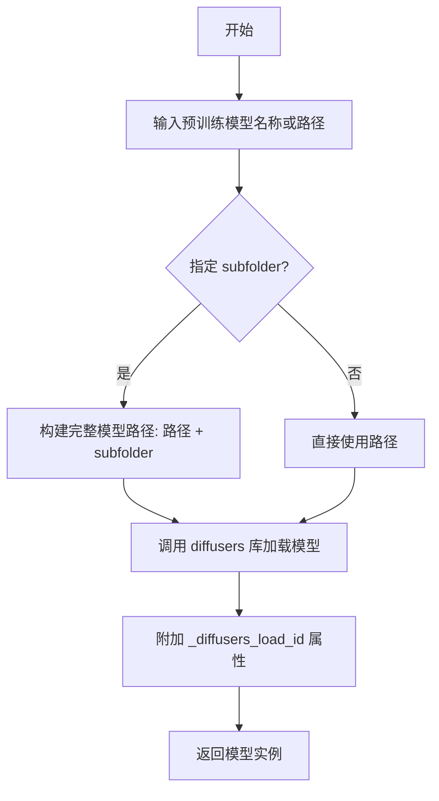
```mermaid
graph TD
    A[开始] --> B[输入预训练模型名称或路径]
    B --> C{指定 subfolder?}
    C -->|是| D[构建完整模型路径: 路径 + subfolder]
    C -->|否| E[直接使用路径]
    D --> F[调用 diffusers 库加载模型]
    E --> F
    F --> G[附加 _diffusers_load_id 属性]
    G --> H[返回模型实例]
```

#### 带注释源码

```python
# 从预训练路径加载 AutoModel 实例
model = AutoModel.from_pretrained(
    "hf-internal-testing/tiny-stable-diffusion-xl-pipe",  # 预训练模型名称或路径
    subfolder="unet"                                        # 指定模型子文件夹（如 unet、vae 等）
)

# 验证模型是否正确加载并包含加载标识
assert hasattr(model, "_diffusers_load_id"), "Model should have _diffusers_load_id attribute"
assert model._diffusers_load_id != "null", "_diffusers_load_id should not be 'null'"

# 检查加载 ID 包含预期字段
load_id = model._diffusers_load_id
assert "hf-internal-testing/tiny-stable-diffusion-xl-pipe" in load_id
assert "unet" in load_id
```


### ComponentsManager

`ComponentsManager` 是 diffusers 库中的一个核心组件管理类，负责管理扩散模型管道的各个组件（如 UNet、VAE、Text Encoder 等），并提供组件的加载、卸载、设备转移以及自动 CPU 卸载等功能。它允许用户灵活地初始化、更新和控制在推理或训练过程中组件的生命周期和资源分配。

参数：

- 无直接公开的构造函数参数（通过默认方式初始化）

返回值：无（构造函数）

#### 流程图

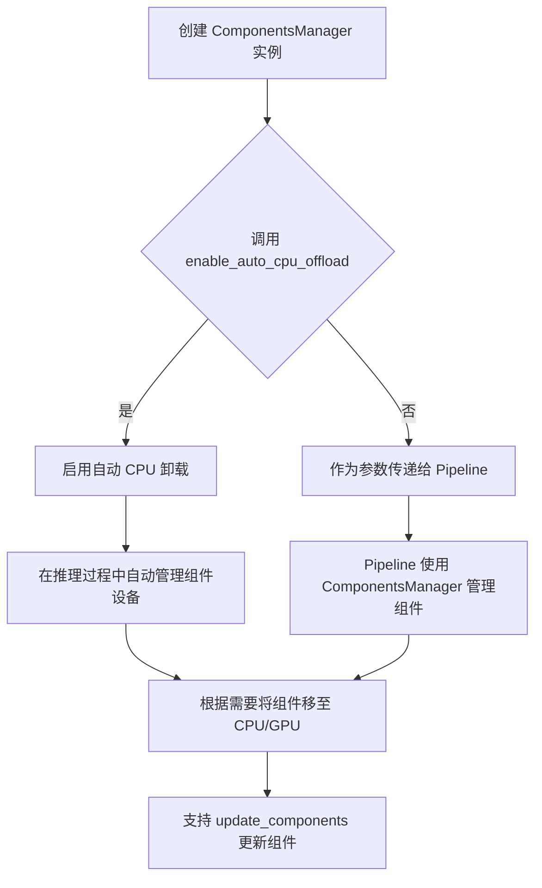
```mermaid
flowchart TD
    A[创建 ComponentsManager 实例] --> B{调用 enable_auto_cpu_offload}
    B -->|是| C[启用自动 CPU 卸载]
    B -->|否| D[作为参数传递给 Pipeline]
    
    C --> E[在推理过程中自动管理组件设备]
    D --> F[Pipeline 使用 ComponentsManager 管理组件]
    
    E --> G[根据需要将组件移至 CPU/GPU]
    F --> G
    
    G --> H[支持 update_components 更新组件]
```

#### 带注释源码

```python
# ComponentsManager 是从 diffusers 库导入的组件管理器类
# 代码中展示的使用方式如下：

# 1. 创建 ComponentsManager 实例
cm = ComponentsManager()

# 2. 启用自动 CPU 卸载功能
# 这允许在推理过程中自动将组件在 CPU 和 GPU 之间转移，以节省 VRAM
cm.enable_auto_cpu_offload(device=torch_device)

# 3. 将 ComponentsManager 传递给 Pipeline
# 在 ModularPipelineTesterMixin.get_pipeline 方法中使用
pipe = self.get_pipeline(components_manager=cm)

# 4. ComponentsManager 还支持通过 update_components 方法更新组件
# 这在 ModularGuiderTesterMixin.test_guider_cfg 测试中有展示：
pipe.update_components(guider=guider)

# 5. 组件更新示例（来自 TestAutoModelUpdateComponents）
pipe.update_components(unet=auto_model)
```

#### 关键方法说明

根据代码中的使用模式，可以推断出 `ComponentsManager` 类包含以下关键方法：

| 方法名称 | 参数 | 返回值 | 功能描述 |
|---------|------|--------|---------|
| `__init__` | 无 | None | 初始化组件管理器 |
| `enable_auto_cpu_offload` | `device: str` | None | 启用自动 CPU 卸载功能 |
| `update_components` | `**components` | None | 更新管道中的特定组件 |

#### 技术债务与优化空间

1. **缺乏完整的源码定义**：代码中仅导入了 `ComponentsManager` 而未展示其完整实现，建议查看 diffusers 库的核心源码以获得完整信息。
2. **自动 CPU 卸载策略**：当前的自动卸载策略可能不够灵活，无法满足所有场景需求（如自定义卸载阈值）。
3. **组件热更新限制**：在推理过程中更新组件可能导致状态不一致，缺乏完善的回滚机制。
4. **设备管理抽象**：组件管理器与特定设备（如 CUDA）耦合较紧，缺乏对多设备/分布式场景的统一抽象。

#### 外部依赖与接口契约

- **依赖库**：`torch`（用于张量操作和设备管理）、`diffusers`（核心库）
- **接口契约**：
  - `ComponentsManager` 实例可作为参数传递给 `ModularPipeline` 的初始化方法
  - 支持通过 `update_components()` 方法动态替换组件
  - 自动 CPU 卸载功能需要与 `torch` 的设备管理 API 配合使用
- **预期行为**：组件管理器应管理组件的生命周期，确保在资源受限环境下（如 VRAM 有限的 GPU）能够正常进行推理。


### ModularPipeline

ModularPipeline 是 diffusers 库中的模块化管道类，用于管理和执行扩散模型的推理流程。它支持动态加载组件（ 如 UNet、VAE、文本编码器等），允许用户通过模块化方式构建和定制扩散管道，并提供组件更新、模型保存和加载等功能。

#### 流程图

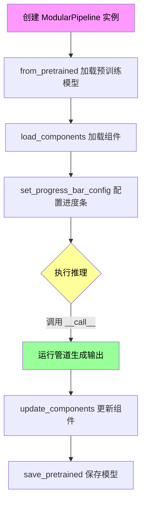
```mermaid
flowchart TD
    A[创建 ModularPipeline 实例] --> B[from_pretrained 加载预训练模型]
    B --> C[load_components 加载组件]
    C --> D[set_progress_bar_config 配置进度条]
    D --> E{执行推理}
    E -->|调用 __call__| F[运行管道生成输出]
    F --> G[update_components 更新组件]
    G --> H[save_pretrained 保存模型]
    
    style A fill:#f9f,color:#000
    style E fill:#ff9,color:#000
    style F fill:#9f9,color:#000
```

#### 带注释源码

```python
# ModularPipeline 类的典型使用模式（基于测试代码推断）

# 1. 从预训练路径加载管道
pipe = ModularPipeline.from_pretrained("hf-internal-testing/tiny-stable-diffusion-xl-pipe")

# 2. 加载组件，可指定数据类型
pipe.load_components(torch_dtype=torch.float32)

# 3. 设置进度条配置
pipe.set_progress_bar_config(disable=None)

# 4. 将管道移动到设备
pipe.to(torch_device)

# 5. 更新组件（如 guider）
guider = ClassifierFreeGuidance(guidance_scale=7.5)
pipe.update_components(guider=guider)

# 6. 执行推理调用
output = pipe(**inputs, output="images")

# 7. 保存预训练模型
pipe.save_pretrained(tmpdirname)

# 访问组件
unet = pipe.unet
vae = pipe.vae
```

#### 核心方法说明

| 方法名称 | 用途 |
|---------|------|
| `from_pretrained` | 类方法，从预训练模型路径加载管道配置和元数据 |
| `load_components` | 加载管道组件（UNet、VAE、文本编码器等），支持指定数据类型和选择性加载 |
| `set_progress_bar_config` | 配置推理过程中的进度条显示行为 |
| `update_components` | 动态更新管道中的特定组件（如替换 guider、unet 等） |
| `save_pretrained` | 将管道保存到指定目录 |
| `to` | 将管道及其所有组件移动到指定设备（CPU/CUDA） |
| `__call__` | 执行管道推理，生成输出（如图像） |

#### 关键组件信息

- **ComponentsManager**: 组件管理器，用于管理管道的各个组件，支持自动 CPU offload 等功能
- **ModularPipelineBlocks**: 模块化管道块定义类，包含管道的子块结构和连接关系
- **ComponentSpec**: 组件规范，定义组件的名称、类型、预训练路径等元信息

#### 潜在技术债务与优化空间

1. **选择性加载粒度**: 当前 `load_components` 支持按名称选择性加载，但可能需要更细粒度的控制（如仅加载权重子集）
2. **组件热更新**: `update_components` 在推理过程中更新组件时可能需要更完善的兼容性检查
3. **内存管理**: 组件管理器的自动 CPU offload 功能需要更详细的文档和错误处理
4. **类型提示完整性**: 部分内部方法的参数和返回值类型提示可以更加精确


### `ModularPipelineBlocks`

`ModularPipelineBlocks` 是 Diffusers 库中用于定义模块化管道（ModularPipeline）结构和逻辑的核心类。它管理管道的子块（Sub-blocks）、工作流映射（Workflow Map）、输入输出规范以及组件配置，提供了从配置初始化管道、获取工作流和调用管道的能力。在测试代码中，它通常作为 `ModularPipeline` 的 `blocks` 属性被使用，通过 `init_pipeline` 方法创建具体的管道实例。

#### 类字段

- `_workflow_map`：`dict` 或 `None`，定义了工作流名称到块配置的映射关系。
- `sub_blocks`：`dict`，存储管道中的各个子块实例，键为块名称，值为块对象。
- `input_names`：`set` 或 `list`，定义了该管道块所接受的输入参数名称列表。
- `description`：`str`，对该管道块功能的描述。
- `expected_components`：`list`，预期包含的组件列表。
- `expected_configs`：`list`，预期包含的配置列表。
- `model_name`：`str`，关联的模型名称。

#### 类方法

##### `init_pipeline`

用于根据当前块配置初始化一个完整的 `ModularPipeline` 实例。

参数：
-  `pretrained_model_name_or_path`：`str`，预训练模型的名称或路径。
-  `components_manager`：`ComponentsManager`，可选，组件管理器实例，用于管理模型组件。

返回值：`ModularPipeline`，返回初始化后的管道实例。

##### `get_workflow`

根据工作流名称获取对应的工作流块配置。

参数：
-  `workflow_name`：`str`，工作流的名称。

返回值：返回对应的工作流块对象（包含 `sub_blocks` 属性）。

#### 流程图

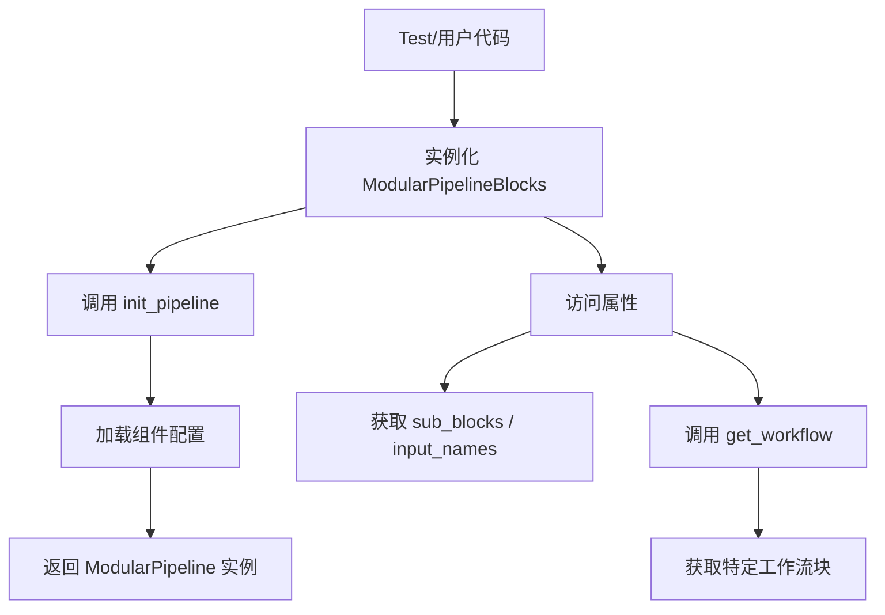
```mermaid
graph TD
    A[Test/用户代码] --> B[实例化 ModularPipelineBlocks]
    B --> C[调用 init_pipeline]
    C --> D[加载组件配置]
    D --> E[返回 ModularPipeline 实例]
    B --> F[访问属性]
    F --> G[获取 sub_blocks / input_names]
    F --> H[调用 get_workflow]
    H --> I[获取特定工作流块]
```

#### 带注释源码

由于提供的代码是测试文件，未包含 `ModularPipelineBlocks` 的具体实现源码。以下源码提取自测试文件中对该类的使用方式，以此展示其接口定义和使用场景。

```python
# 提取自测试代码中的使用方式

# 1. 管道块类的实例化与初始化管道
# 从测试方法 get_pipeline 中提取
pipeline = self.pipeline_blocks_class().init_pipeline(
    self.pretrained_model_name_or_path, components_manager=components_manager
)
# 说明：pipeline_blocks_class 返回 ModularPipelineBlocks 的实例，
# init_pipeline 方法负责构建具体的 ModularPipeline。

# 2. 访问输入参数名称
# 从 test_pipeline_call_signature 中提取
input_parameters = pipe.blocks.input_names
# 说明：通过管道的 blocks 属性访问 input_names，获取输入参数列表。

# 3. 访问工作流映射和获取工作流
# 从 test_workflow_map 中提取
blocks = self.pipeline_blocks_class() # 获取块实例
if blocks._workflow_map is None:
    pytest.skip("Skipping test as _workflow_map is not set")

workflow_blocks = blocks.get_workflow(workflow_name)
actual_blocks = list(workflow_blocks.sub_blocks.items())
# 说明：检查并获取特定工作流下的所有子块。

# 4. 定义预期的组件和配置 (通常在子类或配置中定义)
# 从 create_mock_blocks 方法中提取的 Mock 结构
class MockBlocks:
    def __init__(self):
        self.expected_components = components or [] # e.g., ['unet', 'vae']
        self.expected_configs = configs or []       # e.g., [ConfigSpec(...)]
        self.inputs = inputs or []                  # e.g., [InputParam(...)]
        self.outputs = outputs or []
```


### `ClassifierFreeGuidance`

分类器自由引导（Classifier-Free Guidance）是一种在扩散模型中常用的技术，允许在不使用单独分类器的情况下实现条件生成。该类用于创建引导器，通过调整 guidance_scale 参数来控制无条件和有条件预测之间的插值，从而影响生成结果的质量和多样性。

参数：

- `guidance_scale`：`float`，引导强度系数，控制无条件预测和有条件预测之间的插值。值为 1.0 表示不使用引导（即只使用有条件预测），值越大引导效果越强。

返回值：`ClassifierFreeGuidance` 实例，用于后续传递给管道组件。

#### 流程图

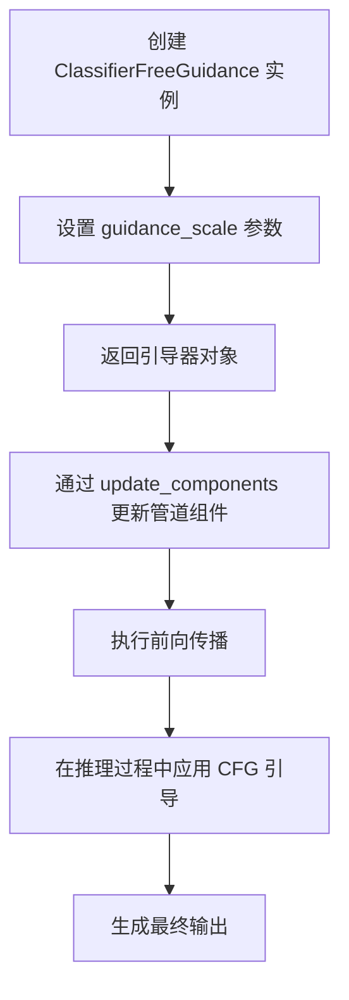
```mermaid
flowchart TD
    A[创建 ClassifierFreeGuidance 实例] --> B[设置 guidance_scale 参数]
    B --> C[返回引导器对象]
    C --> D[通过 update_components 更新管道组件]
    D --> E[执行前向传播]
    E --> F[在推理过程中应用 CFG 引导]
    F --> G[生成最终输出]
```

#### 带注释源码

由于 `ClassifierFreeGuidance` 类定义在 `diffusers` 库中（`diffusers.guiders` 模块），而非当前代码文件内，因此基于代码使用方式进行源码推断：

```python
class ClassifierFreeGuidance:
    """
    分类器自由引导类，用于扩散模型的条件生成。
    
    Classifier-Free Guidance (CFG) 是一种无需训练单独分类器即可实现条件生成的技术。
    它通过在有条件和无条件预测之间进行线性插值来引导生成过程。
    """
    
    def __init__(self, guidance_scale: float = 1.0):
        """
        初始化 ClassifierFreeGuidance 引导器。
        
        参数:
            guidance_scale: float, 引导强度系数。
                - 1.0: 不使用引导，等同于标准条件生成
                - 7.5: 常用的高引导强度，增强提示词遵循度
                - 值越大，生成结果越接近提示词描述，但可能降低图像质量
        """
        self.guidance_scale = guidance_scale
    
    def __call__(self, model_output, **kwargs):
        """
        应用分类器自由引导到模型输出。
        
        参数:
            model_output: 模型的原始输出，通常包含有条件和无条件预测
            
        返回:
            应用引导后的预测结果
        """
        # 典型的 CFG 计算公式:
        # guided_output = unconditional_output + guidance_scale * (conditional_output - unconditional_output)
        pass
```

#### 在测试代码中的使用示例

```python
# 在 ModularGuiderTesterMixin 中的使用方式

# 不使用 CFG 的前向传播
guider = ClassifierFreeGuidance(guidance_scale=1.0)  # guidance_scale=1.0 表示无引导
pipe.update_components(guider=guider)
out_no_cfg = pipe(**inputs, output=self.output_name)

# 使用 CFG 的前向传播
guider = ClassifierFreeGuidance(guidance_scale=7.5)  # 常用的高引导强度
pipe.update_components(guider=guider)
out_cfg = pipe(**inputs, output=self.output_name)
```

#### 关键点说明

1. **guidance_scale 参数**：这是 CFG 的核心参数，控制无条件预测和有条件预测之间的插值权重
2. **update_components 方法**：通过此方法将引导器添加到管道中
3. **预期效果**：CFG 应使输出与输入提示更加匹配，但过高的值可能导致图像伪影


### `generate_modular_model_card_content`

该函数用于生成模块化模型卡的内容，接收一个 `ModularPipelineBlocks` 对象作为输入，并返回一个包含模型卡各个部分内容的字典，包括管道名称、模型描述、组件描述、配置参数、输入输出描述、触发输入和标签等信息。

参数：

- `blocks`：`ModularPipelineBlocks`，包含管道块信息的对象，具有 `__class__.__name__`、`description`、`sub_blocks`、`expected_components`、`expected_configs`、`inputs`、`outputs`、`trigger_inputs`、`model_name` 等属性

返回值：`dict`，返回包含模型卡内容的字典，键包括 `pipeline_name`、`model_description`、`blocks_description`、`components_description`、`configs_section`、`inputs_description`、`outputs_description`、`trigger_inputs_section`、`tags`

#### 流程图

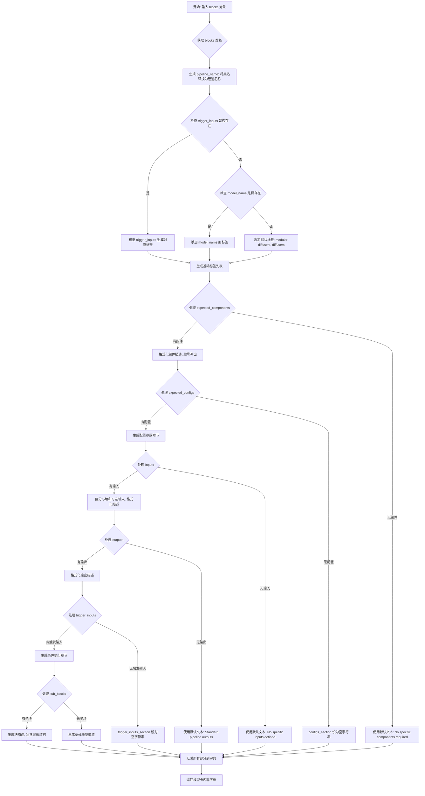
```mermaid
flowchart TD
    A[开始: 输入 blocks 对象] --> B{获取 blocks 类名}
    B --> C[生成 pipeline_name: 将类名转换为管道名称]
    C --> D{检查 trigger_inputs 是否存在}
    D -->|是| E[根据 trigger_inputs 生成对应标签]
    D -->|否| F{检查 model_name 是否存在}
    F -->|是| G[添加 model_name 到标签]
    F -->|否| H[添加默认标签: modular-diffusers, diffusers]
    E --> I[生成基础标签列表]
    G --> I
    H --> I
    I --> J{处理 expected_components}
    J -->|有组件| K[格式化组件描述, 编号列出]
    J -->|无组件| L[使用默认文本: No specific components required]
    K --> M{处理 expected_configs}
    M -->|有配置| N[生成配置参数章节]
    M -->|无配置| O[configs_section 设为空字符串]
    N --> P{处理 inputs}
    P -->|有输入| Q[区分必填和可选输入, 格式化描述]
    P -->|无输入| R[使用默认文本: No specific inputs defined]
    Q --> S{处理 outputs}
    S -->|有输出| T[格式化输出描述]
    S -->|无输出| U[使用默认文本: Standard pipeline outputs]
    T --> V{处理 trigger_inputs}
    V -->|有触发输入| W[生成条件执行章节]
    V -->|无触发输入| X[trigger_inputs_section 设为空字符串]
    W --> Y{处理 sub_blocks}
    Y -->|有子块| Z[生成块描述, 包含层级结构]
    Y -->|无子块| AA[生成基础模型描述]
    Z --> AB[汇总所有部分到字典]
    AA --> AB
    O --> AB
    R --> AB
    U --> AB
    X --> AB
    L --> AB
    AB --> AC[返回模型卡内容字典]
```

#### 带注释源码

```python
# 注意: 此函数来自 diffusers.modular_pipelines.modular_pipeline_utils 模块
# 以下代码基于测试用例中的使用方式推断其功能

def generate_modular_model_card_content(blocks):
    """
    生成模块化模型卡内容
    
    参数:
        blocks: ModularPipelineBlocks 对象，包含管道的所有块信息
        
    返回:
        dict: 包含模型卡各个部分的字典
    """
    content = {}
    
    # 1. 生成 pipeline_name - 从类名转换而来
    # 例如: "StableDiffusionBlocks" -> "Stable Diffusion Pipeline"
    pipeline_name = blocks.__class__.__name__
    # 移除 "Blocks" 后缀并添加 "Pipeline"
    if pipeline_name.endswith("Blocks"):
        pipeline_name = pipeline_name[:-6] + " Pipeline"
    content["pipeline_name"] = pipeline_name
    
    # 2. 生成 tags 列表
    tags = ["modular-diffusers", "diffusers"]
    
    # 根据 trigger_inputs 添加特定标签
    if blocks.trigger_inputs:
        if "mask" in blocks.trigger_inputs and "prompt" in blocks.trigger_inputs:
            tags.append("inpainting")
        if "image" in blocks.trigger_inputs and "prompt" in blocks.trigger_inputs:
            tags.append("image-to-image")
        if "control_image" in blocks.trigger_inputs:
            tags.append("controlnet")
    
    # 根据 model_name 添加标签
    if blocks.model_name:
        tags.append(blocks.model_name)
    
    # 如果没有 trigger_inputs，添加默认的 text-to-image 标签
    if not blocks.trigger_inputs:
        tags.append("text-to-image")
    
    content["tags"] = tags
    
    # 3. 生成 components_description
    if blocks.expected_components:
        # 格式化组件列表，添加编号
        components_desc = []
        for i, comp in enumerate(blocks.expected_components, 1):
            components_desc.append(f"{i}. **{comp.name}**: {comp.description}")
        content["components_description"] = "\n".join(components_desc)
    else:
        content["components_description"] = "No specific components required"
    
    # 4. 生成 configs_section
    if blocks.expected_configs:
        configs_section = "## Configuration Parameters\n\n"
        for config in blocks.expected_configs:
            configs_section += f"- **{config.name}** (default: `{config.default}`): {config.description}\n"
        content["configs_section"] = configs_section
    else:
        content["configs_section"] = ""
    
    # 5. 生成 inputs_description
    if blocks.inputs:
        inputs_desc = "**Required:**\n\n"
        for inp in blocks.inputs:
            if inp.required:
                inputs_desc += f"- `{inp.name}` ({inp.type_hint.__name__}): {inp.description}\n"
        
        optional_inputs = [inp for inp in blocks.inputs if not inp.required]
        if optional_inputs:
            inputs_desc += "\n**Optional:**\n\n"
            for inp in optional_inputs:
                inputs_desc += f"- `{inp.name}` ({inp.type_hint.__name__}): {inp.description}"
                if inp.default is not None:
                    inputs_desc += f" (default: `{inp.default}`)"
                inputs_desc += "\n"
        
        content["inputs_description"] = inputs_desc
    else:
        content["inputs_description"] = "No specific inputs defined"
    
    # 6. 生成 outputs_description
    if blocks.outputs:
        outputs_desc = ""
        for out in blocks.outputs:
            outputs_desc += f"- `{out.name}` ({out.type_hint.__name__}): {out.description}\n"
        content["outputs_description"] = outputs_desc
    else:
        content["outputs_description"] = "Standard pipeline outputs"
    
    # 7. 生成 trigger_inputs_section
    if blocks.trigger_inputs:
        trigger_section = "### Conditional Execution\n\n"
        trigger_section += "This pipeline supports conditional execution based on:\n"
        for trigger in blocks.trigger_inputs:
            trigger_section += f"- `{trigger}`\n"
        content["trigger_inputs_section"] = trigger_section
    else:
        content["trigger_inputs_section"] = ""
    
    # 8. 生成 blocks_description 和 model_description
    num_blocks = len(blocks.sub_blocks)
    model_description = f"This is a {num_blocks}-block modular architecture. {blocks.description}"
    content["model_description"] = model_description
    
    blocks_description = ""
    for block_name, block in blocks.sub_blocks.items():
        blocks_description += f"### {block_name}\n\n"
        blocks_description += f"{block.description}\n\n"
        
        # 如果有子块，递归添加
        if hasattr(block, 'sub_blocks') and block.sub_blocks:
            blocks_description += "#### Sub-blocks:\n\n"
            for sub_name, sub_block in block.sub_blocks.items():
                blocks_description += f"- **{sub_name}**: {sub_block.description}\n"
    
    content["blocks_description"] = blocks_description
    
    return content
```


### ComponentSpec

ComponentSpec是diffusers库中用于定义模块化管道组件规格的类，用于描述组件的元信息（如名称、类型、预训练模型路径、创建方法等），使ModularPipeline能够动态加载和管理组件。

参数：

- `name`：`str`，组件的唯一标识名称
- `type_hint`：`TypeHint (可选)`，组件的类型提示，用于类型检查
- `pretrained_model_name_or_path`：`str | None (可选)`，预训练模型的名称或路径
- `subfolder`：`str (可选)`，模型子文件夹路径
- `default_creation_method`：`str (可选)`，默认的组件创建方法（如"from_pretrained"）
- `description`：`str (可选)`，组件的描述信息

返回值：`ComponentSpec`，返回创建的组件规格对象

#### 流程图

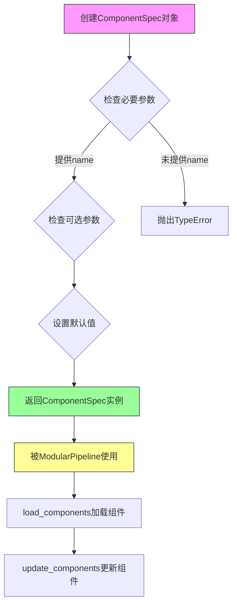
```mermaid
flowchart TD
    A[创建ComponentSpec对象] --> B{检查必要参数}
    B -->|提供name| C{检查可选参数}
    B -->|未提供name| D[抛出TypeError]
    C --> E{设置默认值}
    E --> F[返回ComponentSpec实例]
    
    F --> G[被ModularPipeline使用]
    G --> H[load_components加载组件]
    H --> I[update_components更新组件]
    
    style A fill:#f9f,stroke:#333
    style F fill:#9f9,stroke:#333
    style G fill:#ff9,stroke:#333
```

#### 带注释源码

```python
# ComponentSpec 使用示例（来自测试代码）

# 示例1: 定义VAE和Text Encoder组件规格
components = [
    ComponentSpec(name="vae", description="VAE component"),
    ComponentSpec(name="text_encoder", description="Text encoder component"),
]

# 示例2: 定义测试组件规格（用于测试load_components跳过行为）
pipe._component_specs["test_component"] = ComponentSpec(
    name="test_component",
    type_hint=torch.nn.Module,              # 类型提示为torch.nn.Module
    pretrained_model_name_or_path=None,     # 无预训练模型路径
    default_creation_method="from_pretrained",  # 默认创建方法
)

# ComponentSpec 在 ModularPipeline 中的实际应用
# 来自 TestAutoModelUpdateComponents 测试
spec = pipe._component_specs["unet"]
assert spec.pretrained_model_name_or_path == "hf-internal-testing/tiny-stable-diffusion-xl-pipe"
assert spec.subfolder == "unet"

# 内部实现推测（基于使用方式）
class ComponentSpec:
    """
    组件规格类，用于定义模块化管道的组件元信息
    
    属性:
        name: 组件名称
        type_hint: 组件类型提示
        pretrained_model_name_or_path: 预训练模型路径
        subfolder: 模型子文件夹
        default_creation_method: 默认创建方法
        description: 组件描述
    """
    
    def __init__(
        self,
        name: str,
        type_hint: Optional[type] = None,
        pretrained_model_name_or_path: Optional[str] = None,
        subfolder: str = ".",
        default_creation_method: str = "from_pretrained",
        description: str = "",
    ):
        self.name = name
        self.type_hint = type_hint
        self.pretrained_model_name_or_path = pretrained_model_name_or_path
        self.subfolder = subfolder
        self.default_creation_method = default_creation_method
        self.description = description
```


### ConfigSpec

配置规格类，用于定义模块化管道中的配置参数规范。

参数：

-  `name`：`str`，配置参数的名称
-  `default`：任意类型，配置参数的默认值
-  `description`：`str`，配置参数的描述信息

返回值：`ConfigSpec`，返回配置规格对象

#### 流程图

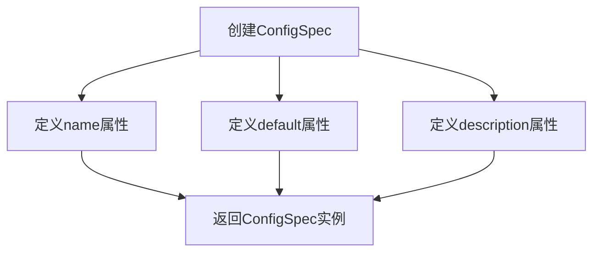
```mermaid
graph TD
    A[创建ConfigSpec] --> B[定义name属性]
    A --> C[定义default属性]
    A --> D[定义description属性]
    B --> E[返回ConfigSpec实例]
    C --> E
    D --> E
```

#### 带注释源码

```python
# ConfigSpec 是从 diffusers.modular_pipelines.modular_pipeline_utils 导入的类
# 用于定义模块化管道中的配置参数规范
# 在测试代码中的使用方式如下：

# 定义配置规格
configs = [
    ConfigSpec(name="num_train_timesteps", default=1000, description="Number of training timesteps"),
]

# 使用配置规格创建模块
blocks = self.create_mock_blocks(configs=configs)

# 生成模型卡片内容
content = generate_modular_model_card_content(blocks)

# 验证配置参数部分是否正确生成
assert "## Configuration Parameters" in content["configs_section"]

# ConfigSpec 类的可能定义（基于使用方式推断）：
# class ConfigSpec:
#     def __init__(self, name: str, default: Any, description: str):
#         self.name = name
#         self.default = default
#         self.description = description
```


### InputParam

输入参数类，用于在模块化管道中定义输入参数的类型、是否必需、默认值和描述。该类用于构建管道的输入参数规范，支持必需参数和可选参数的定义，并通过类型提示、默认值和描述提供完整的参数元数据。

参数：

- `name`：`str`，参数的名称，用于在管道中唯一标识该参数
- `type_hint`：`任意类型`，参数的类型提示，用于类型检查和代码补全
- `required`：`bool`，指示参数是否为必需的。True 表示必需参数，False 表示可选参数
- `default`：`任意类型`，参数的默认值。如果参数是可选的，可以设置默认值；默认为 None
- `description`：`str`，参数的详细描述，用于文档和用户理解

返回值：无返回值，该类是一个数据类，用于创建表示输入参数的数据对象。

#### 流程图

由于 InputParam 是一个简单的数据类（Data Class），主要用于存储参数元数据，不涉及复杂的业务逻辑或流程，因此不提供流程图。

#### 带注释源码

```
# InputParam 类的定义位于 diffusers.modular_pipelines.modular_pipeline_utils 模块中
# 以下源码是基于代码中使用情况推断的可能实现

class InputParam:
    """
    输入参数类，用于定义模块化管道的输入参数规范。
    
    该类封装了参数的名称、类型提示、是否必需、默认值和描述等信息，
    主要用于在生成管道模型卡（Model Card）或进行参数验证时提供元数据。
    """
    
    def __init__(
        self,
        name: str,
        type_hint: Any,
        required: bool,
        default: Any = None,
        description: str
    ):
        """
        初始化 InputParam 实例。
        
        参数：
        - name (str): 输入参数的名称，必须是唯一的标识符。
        - type_hint (Any): 参数的类型提示，通常使用 Python 的类型（如 str, int, torch.Tensor 等）。
        - required (bool): 指示参数是否为必需的。如果为 True，则调用管道时必须提供该参数；如果为 False，则可以使用默认值。
        - default (Any, optional): 参数的默认值。当 required 为 False 时，可以设置此默认值；如果未提供，默认为 None。
        - description (str): 参数的描述信息，用于文档和用户理解。
        
        返回值：
        - 无返回值（构造函数）
        
        使用示例：
        >>> prompt_param = InputParam(
        ...     name="prompt",
        ...     type_hint=str,
        ...     required=True,
        ...     description="The text prompt to guide the generation"
        ... )
        >>> num_steps_param = InputParam(
        ...     name="num_steps",
        ...     type_hint=int,
        ...     required=False,
        ...     default=50,
        ...     description="Number of denoising steps"
        ... )
        """
        self.name = name
        self.type_hint = type_hint
        self.required = required
        self.default = default
        self.description = description
```

**注意**：此源码是根据代码中的使用情况推断得出的。InputParam 类的实际定义位于 diffusers 库的 `diffusers/modular_pipelines/modular_pipeline_utils.py` 文件中。从代码中的使用方式来看，该类应该还可能包含 `__repr__`、`__eq__` 或其他数据类常用方法，但具体实现需要查看原始代码。


### OutputParam

`OutputParam` 是一个数据类，用于描述模块化管道（ModularPipeline）的输出参数。它定义了输出参数的名称、类型提示和描述信息，主要用于生成模型卡片（model card）内容。

参数：

- `name`：`str`，输出参数的名称
- `type_hint`：`Type`，类型提示，表示输出参数的类型（如 `torch.Tensor`）
- `description`：`str`，对输出参数的描述

返回值：`无`，该类是一个数据类，用于存储输出参数元数据

#### 流程图

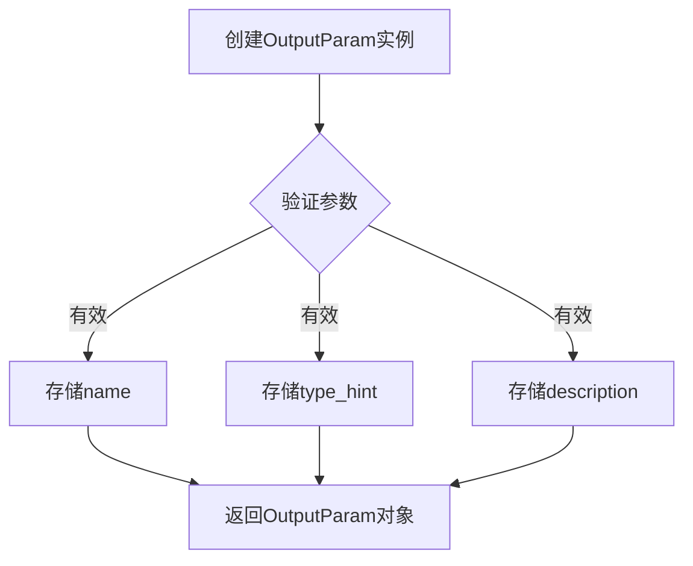
```mermaid
flowchart TD
    A[创建OutputParam实例] --> B{验证参数}
    B -->|有效| C[存储name]
    B -->|有效| D[存储type_hint]
    B -->|有效| E[存储description]
    C --> F[返回OutputParam对象]
    D --> F
    E --> F
```

#### 带注释源码

```python
# OutputParam 是从 diffusers 库导入的数据类
# 位置: diffusers.modular_pipelines.modular_pipeline_utils
# 以下是使用示例，展示了如何创建和使用 OutputParam

# 使用示例 1: 在测试中定义输出参数
outputs = [
    OutputParam(name="images", type_hint=torch.Tensor, description="Generated images"),
]

# 使用示例 2: 创建空的输出参数列表
outputs = []

# OutputParam 类的典型结构（基于使用方式推断）
# class OutputParam:
#     def __init__(self, name: str, type_hint: Type, description: str):
#         self.name = name
#         self.type_hint = type_hint
#         self.description = description
```


### `ModularPipelineTesterMixin.get_generator`

该方法用于创建一个具有指定种子的 PyTorch 随机数生成器，以确保测试过程中的随机性可控且可复现。

参数：

- `seed`：`int`，随机数生成器的种子值，默认为 0，用于确保测试结果的可复现性

返回值：`torch.Generator`，返回配置了指定种子的 PyTorch 随机数生成器对象

#### 流程图

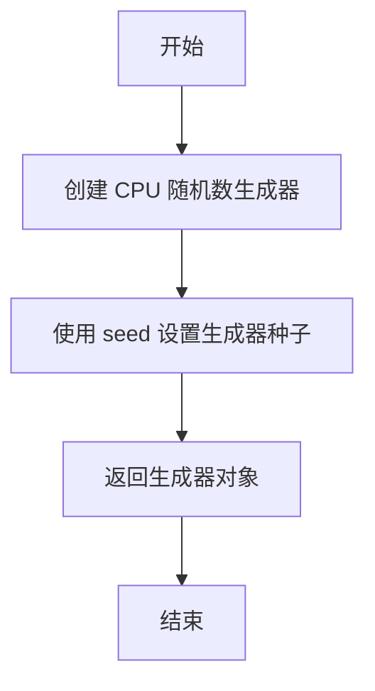
```mermaid
flowchart TD
    A[开始] --> B[创建 CPU 随机数生成器]
    B --> C[使用 seed 设置生成器种子]
    C --> D[返回生成器对象]
    D --> E[结束]
```

#### 带注释源码

```python
def get_generator(self, seed=0):
    """
    创建具有指定种子的随机数生成器。
    
    参数:
        seed (int): 随机数生成器的种子值，默认值为 0。
                   使用相同种子可以确保测试结果的可复现性。
    
    返回:
        torch.Generator: 配置了指定种子的 PyTorch 随机数生成器对象。
    """
    # 创建一个 CPU 设备上的随机数生成器
    generator = torch.Generator("cpu").manual_seed(seed)
    # 返回配置了种子的生成器，确保测试过程中的随机操作可复现
    return generator
```


### `ModularPipelineTesterMixin.pipeline_class`

该属性是一个只读属性，用于返回当前模块化管道测试类所对应的管道类（Pipeline Class），通常在子类中被重写以指定具体的管道实现。

参数：无

返回值：`Callable | ModularPipeline`，返回管道类，该类应该是 `Callable` 类型或 `ModularPipeline` 的子类，用于创建具体的管道实例。

#### 流程图

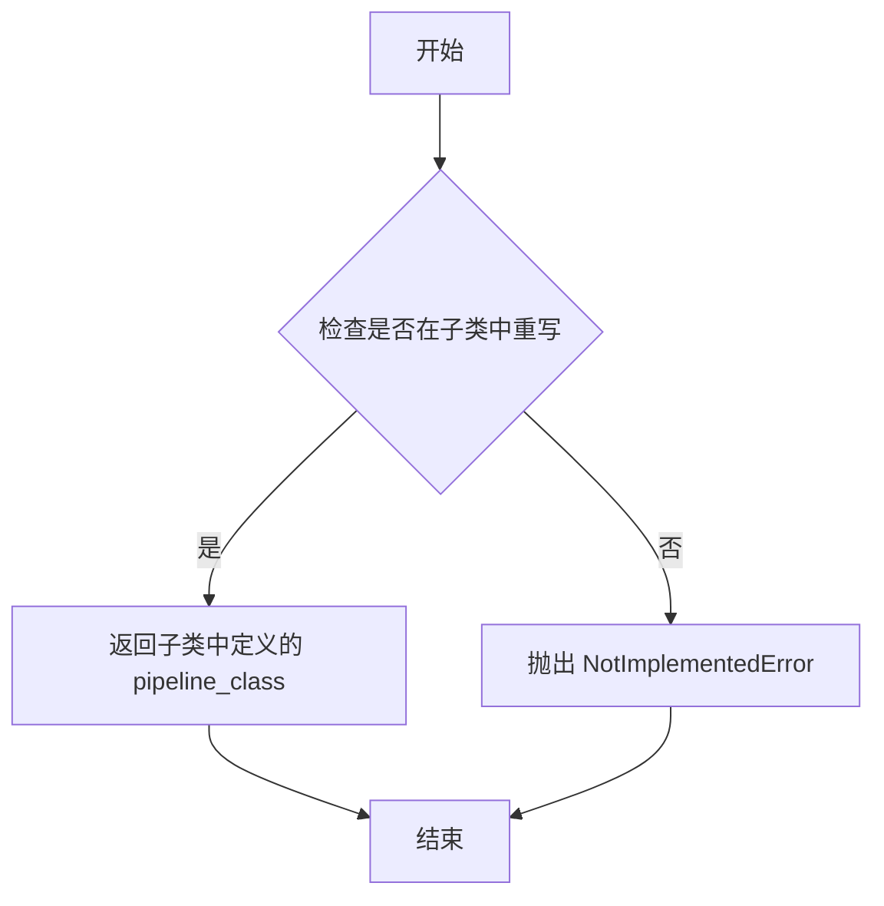
```mermaid
flowchart TD
    A[开始] --> B{检查是否在子类中重写}
    B -->|是| C[返回子类中定义的 pipeline_class]
    B -->|否| D[抛出 NotImplementedError]
    C --> E[结束]
    D --> E
```

#### 带注释源码

```python
@property
def pipeline_class(self) -> Callable | ModularPipeline:
    """
    返回与当前测试类关联的管道类（Pipeline Class）。
    
    这是一个抽象属性，必须在子类中重写。
    子类需要将此属性设置为具体的管道类，例如 StableDiffusionPipeline。
    
    返回:
        Callable | ModularPipeline: 管道类，用于创建管道实例
        
     Raises:
        NotImplementedError: 当子类未重写此属性时抛出
    """
    raise NotImplementedError(
        "You need to set the attribute `pipeline_class = ClassNameOfPipeline` in the child test class. "
        "See existing pipeline tests for reference."
    )
```


### `ModularPipelineTesterMixin.pretrained_model_name_or_path`

该属性是一个只读属性，用于返回预训练模型的名称或路径。它是一个抽象属性，要求子类必须实现，否则抛出 `NotImplementedError`。该属性通常用于在测试类中指定要加载的预训练模型，以便进行模块化管道的各种测试。

参数：

- （无参数，只读属性）

返回值：`str`，预训练模型的名称或路径（例如 `"hf-internal-testing/tiny-stable-diffusion-xl-pipe"` 或本地模型路径）

#### 流程图

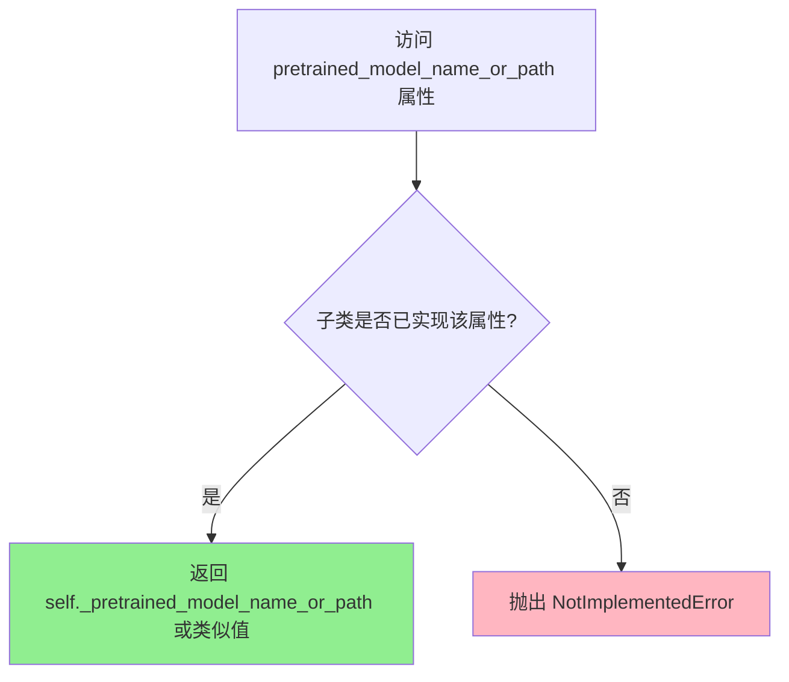
```mermaid
flowchart TD
    A[访问 pretrained_model_name_or_path 属性] --> B{子类是否已实现该属性?}
    B -->|是| C[返回 self._pretrained_model_name_or_path 或类似值]
    B -->|否| D[抛出 NotImplementedError]
    
    style C fill:#90EE90
    style D fill:#FFB6C1
```

#### 带注释源码

```python
@property
def pretrained_model_name_or_path(self) -> str:
    """
    返回预训练模型的名称或路径。
    
    这是一个抽象属性，必须在子类中实现。
    子类需要设置对应的类属性，例如：
    pretrained_model_name_or_path = "hf-internal-testing/tiny-stable-diffusion-xl-pipe"
    
    Returns:
        str: 预训练模型的名称或路径，用于初始化模块化管道
    """
    raise NotImplementedError(
        "You need to set the attribute `pretrained_model_name_or_path` in the child test class. "
        "See existing pipeline tests for reference."
    )
```


### `ModularPipelineTesterMixin.pipeline_blocks_class`

这是一个属性方法（property），用于获取模块化管道的块类（pipeline blocks class）。它是一个抽象属性，要求子类必须实现并提供具体的管道块类。

参数：无（属性不需要参数）

返回值：`Callable | ModularPipelineBlocks`，返回管道块类，该类用于初始化模块化管道实例。

#### 流程图

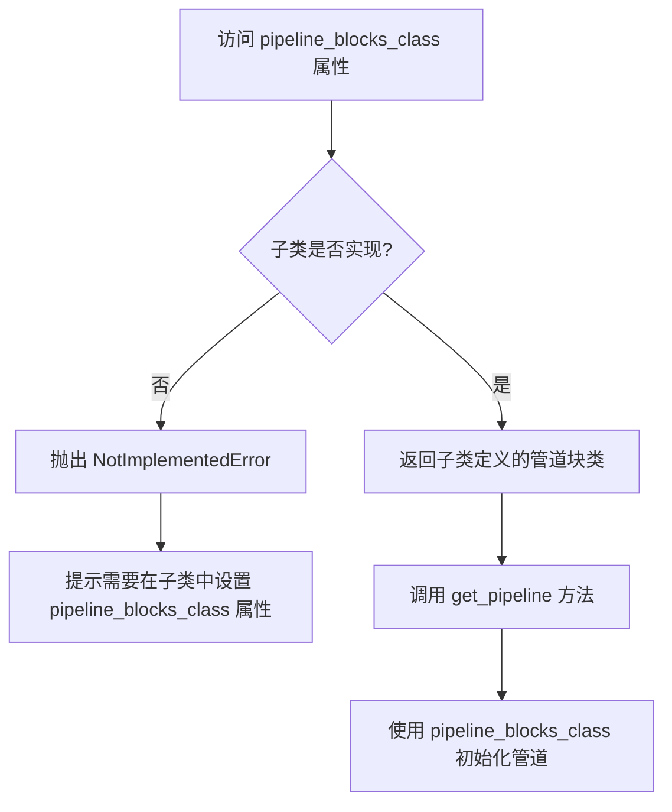
```mermaid
flowchart TD
    A[访问 pipeline_blocks_class 属性] --> B{子类是否实现?}
    B -->|是| C[返回子类定义的管道块类]
    B -->|否| D[抛出 NotImplementedError]
    D --> E[提示需要在子类中设置 pipeline_blocks_class 属性]
    
    C --> F[调用 get_pipeline 方法]
    F --> G[使用 pipeline_blocks_class 初始化管道]
```

#### 带注释源码

```python
@property
def pipeline_blocks_class(self) -> Callable | ModularPipelineBlocks:
    """
    返回模块化管道的块类（pipeline blocks class）。
    
    这是一个抽象属性，必须在子类中实现。
    子类需要设置此属性为具体的 ModularPipelineBlocks 子类，
    例如：pipeline_blocks_class = StableDiffusionBlocks
    
    Returns:
        Callable | ModularPipelineBlocks: 管道块类，用于初始化模块化管道
        
    Raises:
        NotImplementedError: 当子类未实现此属性时抛出
    """
    raise NotImplementedError(
        "You need to set the attribute `pipeline_blocks_class = ClassNameOfPipelineBlocks` in the child test class. "
        "See existing pipeline tests for reference."
    )
```


### `ModularPipelineTesterMixin.get_dummy_inputs`

获取虚拟输入数据，用于测试模块化管道的推理流程。该方法是一个抽象方法，需要在子类中实现具体的逻辑来生成测试所需的虚拟输入参数。

参数：

- `seed`：`int`，默认值 0，用于设置随机数生成器的种子，确保测试结果的可重复性

返回值：`dict`，包含虚拟输入参数的字典，具体键值对取决于子类实现的管道类型（如 prompt、num_inference_steps、guidance_scale 等）

#### 流程图

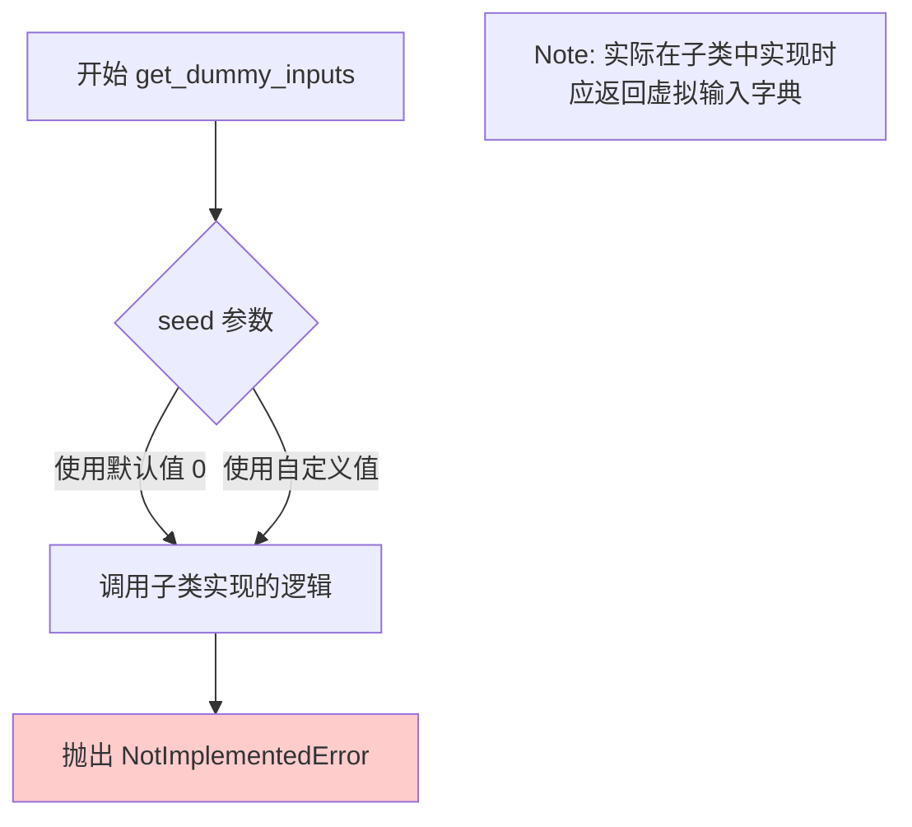
```mermaid
flowchart TD
    A[开始 get_dummy_inputs] --> B{seed 参数}
    B -->|使用默认值 0| C[调用子类实现的逻辑]
    B -->|使用自定义值| C
    C --> D[抛出 NotImplementedError]
    
    style D fill:#ffcccc
    note1[Note: 实际在子类中实现时<br/>应返回虚拟输入字典]
```

#### 带注释源码

```python
def get_dummy_inputs(self, seed=0):
    """
    获取虚拟输入数据，用于测试模块化管道的推理流程。
    
    这是一个抽象方法，定义了获取测试用虚拟输入的接口。
    子类必须实现此方法以提供具体的虚拟输入数据。
    
    参数:
        seed (int): 随机数种子，用于确保测试结果的可重复性。
                   默认为 0。
    
    返回:
        dict: 包含虚拟输入参数的字典，应包含管道推理所需的所有必要参数，
              如 prompt、num_inference_steps、guidance_scale、generator 等。
    
    异常:
        NotImplementedError: 当子类未实现此方法时抛出，提示开发者
                            需要在子测试类中实现具体的虚拟输入生成逻辑。
    
    示例:
        # 子类实现示例
        def get_dummy_inputs(self, seed=0):
            generator = torch.Generator("cpu").manual_seed(seed)
            return {
                "prompt": "a photo of an astronaut riding a horse",
                "num_inference_steps": 50,
                "guidance_scale": 7.5,
                "generator": generator,
            }
    """
    raise NotImplementedError(
        "You need to implement `get_dummy_inputs(self, device, seed)` in the child test class. "
        "See existing pipeline tests for reference."
    )
```


### `ModularPipelineTesterMixin.params`

这是一个属性方法（Property），定义了模块化管道测试中必需的输入参数集合。该属性返回一个 `frozenset`，包含所有必须在管道的 `__call__` 方法签名中存在的输入参数，用于验证管道是否实现了所有必需的参数。

参数：
- 该方法无显式参数，但隐式接收 `self` 参数，表示测试类实例

返回值：`frozenset`，包含必需的输入参数名称集合。如果子类未实现，则抛出 `NotImplementedError`

#### 流程图

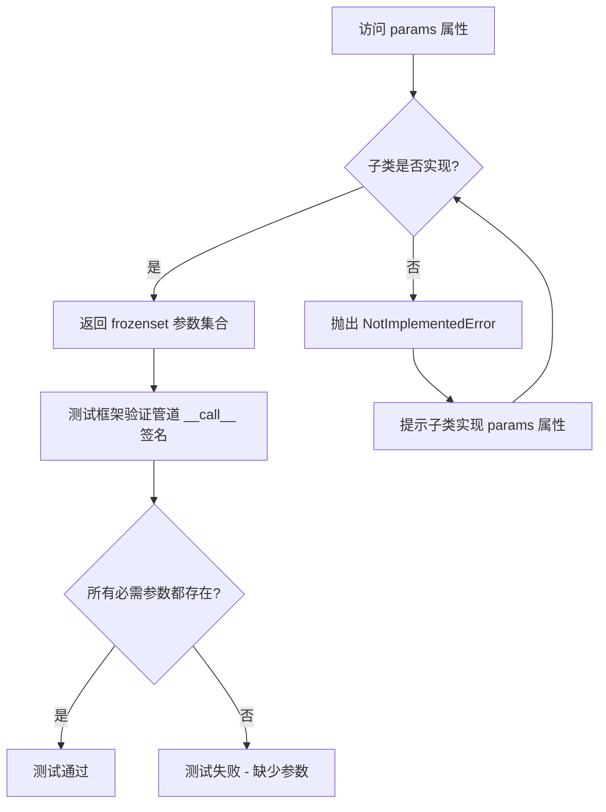
```mermaid
flowchart TD
    A[访问 params 属性] --> B{子类是否实现?}
    B -->|是| C[返回 frozenset 参数集合]
    B -->|否| D[抛出 NotImplementedError]
    
    C --> E[测试框架验证管道 __call__ 签名]
    E --> F{所有必需参数都存在?}
    F -->|是| G[测试通过]
    F -->|否| H[测试失败 - 缺少参数]
    
    D --> I[提示子类实现 params 属性]
    I --> B
```

#### 带注释源码

```python
@property
def params(self) -> frozenset:
    """
    属性方法：返回模块化管道测试必需的输入参数集合
    
    该属性用于验证管道的 __call__ 方法是否包含所有必需的输入参数。
    子类必须实现此属性并返回正确的参数集合，通常使用预定义的参数集
    （如 TEXT_TO_IMAGE_PARAMS）或通过集合运算修改预定义参数集。
    
    Returns:
        frozenset: 包含所有必需输入参数名称的不可变集合
        
    Raises:
        NotImplementedError: 当子类未实现此属性时抛出
    
    Example:
        # 基础用法：直接使用预定义参数集
        params = TEXT_TO_IMAGE_PARAMS
        
        # 扩展用法：移除不需要的参数
        params = TEXT_TO_IMAGE_PARAMS - {'height', 'width'}
        
        # 扩展用法：添加自定义参数
        params = TEXT_TO_IMAGE_PARAMS | {'custom_param'}
    """
    raise NotImplementedError(
        "You need to set the attribute `params` in the child test class. "
        "`params` are checked for if all values are present in `__call__`'s signature."
        " You can set `params` using one of the common set of parameters defined in `pipeline_params.py`"
        " e.g., `TEXT_TO_IMAGE_PARAMS` defines the common parameters used in text to  "
        "image pipelines, including prompts and prompt embedding overrides."
        "If your pipeline's set of arguments has minor changes from one of the common sets of arguments, "
        "do not make modifications to the existing common sets of arguments. I.e. a text to image pipeline "
        "with non-configurable height and width arguments should set the attribute as "
        "`params = TEXT_TO_IMAGE_PARAMS - {'height', 'width'}`. "
        "See existing pipeline tests for reference."
    )
```


### `ModularPipelineTesterMixin.batch_params`

该属性用于返回需要在流水线调用时进行批处理的参数集合。它是一个抽象属性，子类需要重写该属性以提供具体的批处理参数集合。

参数： 无

返回值：`frozenset`，表示需要在 `__call__` 方法中进行批处理的参数名称集合

#### 流程图

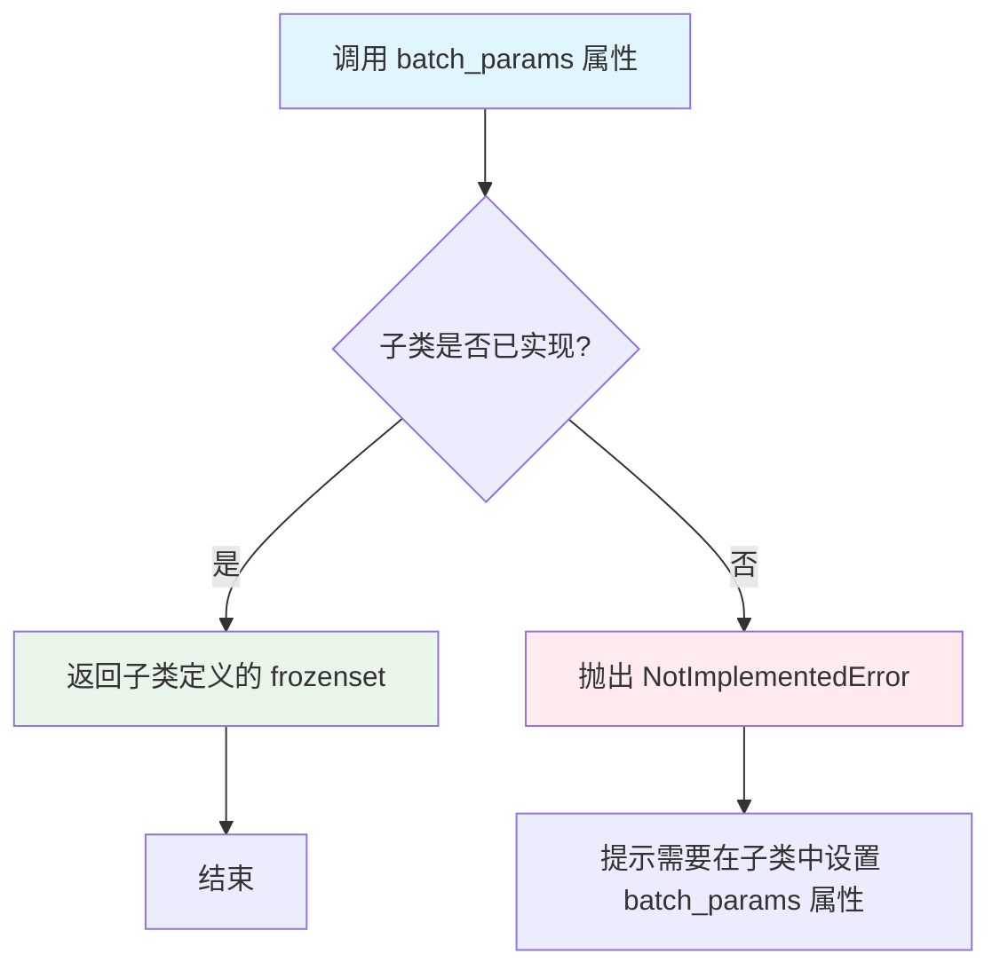
```mermaid
flowchart TD
    A[调用 batch_params 属性] --> B{子类是否已实现?}
    B -->|是| C[返回子类定义的 frozenset]
    B -->|否| D[抛出 NotImplementedError]
    
    C --> E[结束]
    D --> F[提示需要在子类中设置 batch_params 属性]
    
    style A fill:#e1f5fe
    style C fill:#e8f5e8
    style D fill:#ffebee
```

#### 带注释源码

```python
@property
def batch_params(self) -> frozenset:
    """
    返回需要在流水线调用时进行批处理的参数集合。
    
    这是一个抽象属性，需要在子类中重写。
    子类应该根据具体的流水线类型设置相应的批处理参数。
    例如，文本到图像流水线可能需要批处理 'prompt' 参数，
    而图像变体流水线可能需要批处理 'image' 参数。
    
    Returns:
        frozenset: 包含需要批处理的参数名称的集合
        
    Raises:
        NotImplementedError: 当子类未重写该属性时抛出
    """
    raise NotImplementedError(
        "You need to set the attribute `batch_params` in the child test class. "
        "`batch_params` are the parameters required to be batched when passed to the pipeline's "
        "`__call__` method. `pipeline_params.py` provides some common sets of parameters such as "
        "`TEXT_TO_IMAGE_BATCH_PARAMS`, `IMAGE_VARIATION_BATCH_PARAMS`, etc... If your pipeline's "
        "set of batch arguments has minor changes from one of the common sets of batch arguments, "
        "do not make modifications to the existing common sets of batch arguments. I.e. a text to  "
        "image pipeline `negative_prompt` is not batched should set the attribute as "
        "`batch_params = TEXT_TO_IMAGE_BATCH_PARAMS - {'negative_prompt'}`. "
        "See existing pipeline tests for reference."
    )
```


### `ModularPipelineTesterMixin.expected_workflow_blocks`

这是一个属性方法，用于返回预期的工作流块字典。该字典将工作流名称（字符串）映射到对应的块名称列表（包含元组的列表，每个元组包含块名称和类名）。子类必须实现此属性以定义测试预期的模块化管道工作流结构，用于验证工作流映射的正确性。

参数：

- （无参数，作为属性访问）

返回值：`dict`，返回预期工作流块的字典。键为工作流名称（str），值为块名称列表（List[Tuple[str, str]]），每个元素是一个元组 `(block_name, block_class_name)`。

#### 流程图

```mermaid
flowchart TD
    A[访问 expected_workflow_blocks 属性] --> B{子类是否实现?}
    B -->|是| C[返回 dict: {workflow_name: [(block_name, block_class_name), ...]}]
    B -->|否| D[抛出 NotImplementedError]
    
    C --> E[测试方法 test_workflow_map 使用此属性验证工作流]
    
    style D fill:#ffcccc
    style E fill:#ccffcc
```

#### 带注释源码

```python
@property
def expected_workflow_blocks(self) -> dict:
    """
    返回预期的工作流块字典，用于测试验证。
    
    该属性定义了每个工作流名称对应的预期块列表。
    每个块由 (block_name, block_class_name) 元组表示。
    
    Returns:
        dict: 工作流名称到块列表的映射字典
        
    Raises:
        NotImplementedError: 当子类未实现此属性时抛出
        
    Example:
        # 子类实现示例:
        expected_workflow_blocks = {
            "text-to-image": [
                ("preprocessing", "PreProcessingBlock"),
                ("unet", "UNetBlock"),
                ("postprocessing", "PostProcessingBlock"),
            ]
        }
    """
    raise NotImplementedError(
        "You need to set the attribute `expected_workflow_blocks` in the child test class. "
        "`expected_workflow_blocks` is a dictionary that maps workflow names to list of block names. "
        "See existing pipeline tests for reference."
    )
```


### `ModularPipelineTesterMixin.setup_method`

在每个测试方法执行前调用，用于清理VRAM（视频随机存取存储器），重置torch编译器，强制垃圾回收，并清空后端缓存，以确保测试环境干净，避免因显存残留导致的测试干扰。

参数：
- 无

返回值：`None`，无返回值

#### 流程图

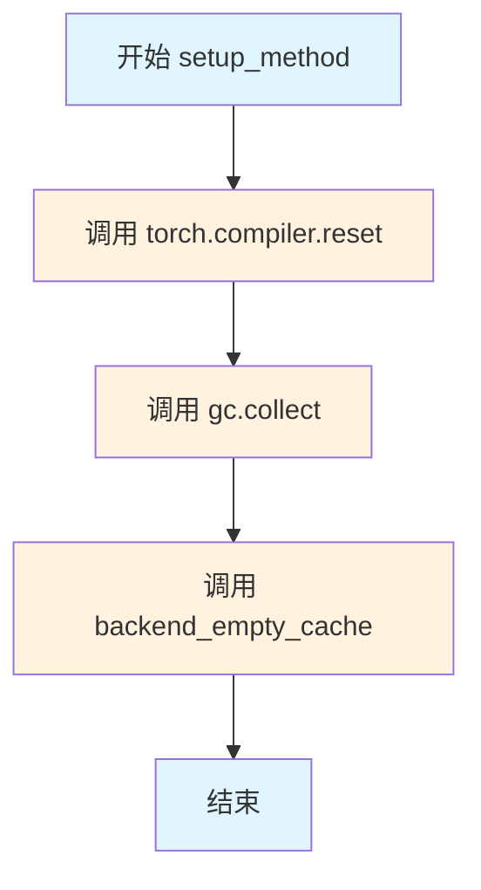
```mermaid
flowchart TD
    A[开始 setup_method] --> B[调用 torch.compiler.reset]
    B --> C[调用 gc.collect]
    C --> D[调用 backend_empty_cache]
    D --> E[结束]
    
    style A fill:#e1f5fe
    style E fill:#e1f5fe
    style B fill:#fff3e0
    style C fill:#fff3e0
    style D fill:#fff3e0
```

#### 带注释源码

```python
def setup_method(self):
    # 在每个测试开始前清理VRAM，以确保测试环境干净
    # 重置torch的JIT编译器，清除任何编译缓存
    torch.compiler.reset()
    
    # 强制Python垃圾回收器运行，释放不再使用的对象内存
    gc.collect()
    
    # 清空GPU/后端缓存，确保显存被释放
    # torch_device 是测试工具类中定义的当前设备（如 'cuda' 或 'cpu'）
    backend_empty_cache(torch_device)
```


### `ModularPipelineTesterMixin.teardown_method`

该方法是 `ModularPipelineTesterMixin` 测试类的清理方法，在每个测试用例执行完成后被自动调用，用于清理 VRAM（显存）以防止 CUDA 运行时错误。它通过重置 torch 编译器、触发垃圾回收和清空 GPU 缓存来确保测试环境干净，避免显存泄漏导致的测试失败。

参数：

- `self`：`ModularPipelineTesterMixin`，表示类的实例本身

返回值：`None`，无返回值，仅执行清理操作

#### 流程图

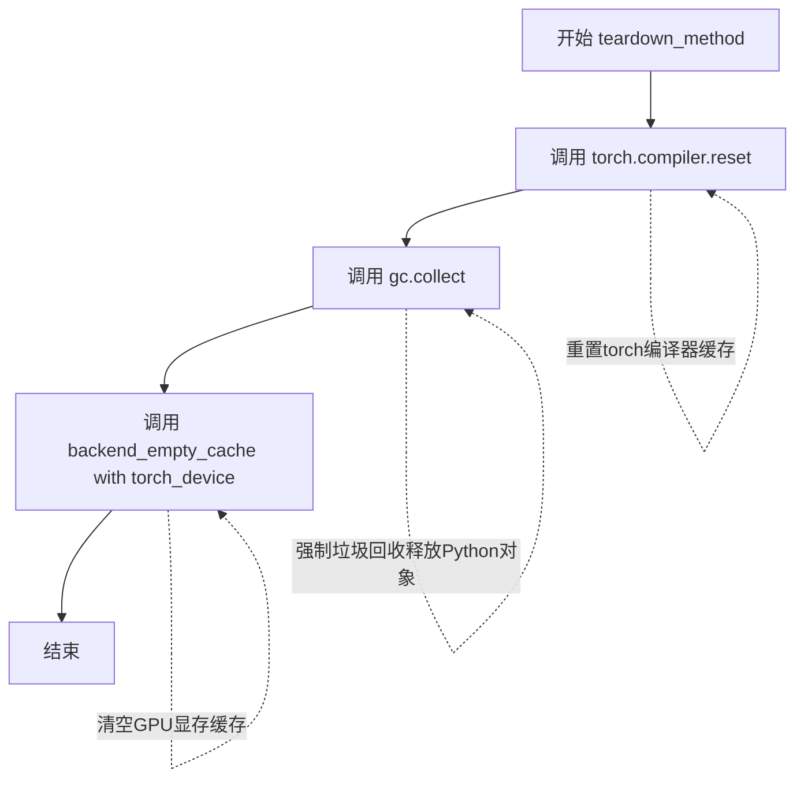
```mermaid
flowchart TD
    A[开始 teardown_method] --> B[调用 torch.compiler.reset]
    B --> C[调用 gc.collect]
    C --> D[调用 backend_empty_cache with torch_device]
    D --> E[结束]
    
    B -.->|重置torch编译器缓存| B
    C -.->|强制垃圾回收释放Python对象| C
    D -.->|清空GPU显存缓存| D
```

#### 带注释源码

```python
def teardown_method(self):
    # clean up the VRAM after each test in case of CUDA runtime errors
    # 目的：防止显存未及时释放导致后续测试出现 CUDA OOM 或运行时错误
    
    # 重置 torch 编译器的缓存状态，清理 JIT 编译产生的临时文件
    torch.compiler.reset()
    
    # 强制调用 Python 垃圾回收器，释放不再引用的对象
    # 配合 VRAM 清理，确保显存中的模型权重等对象被正确释放
    gc.collect()
    
    # 调用后端特定的缓存清理函数，根据 torch_device 设备类型
    # 清空 GPU 显存缓存（对于 CUDA 设备即 torch.cuda.empty_cache）
    backend_empty_cache(torch_device)
```


### `ModularPipelineTesterMixin.get_pipeline`

该方法用于获取并初始化一个模块化管道（ModularPipeline），通过调用 `pipeline_blocks_class` 创建管道实例，加载指定数据类型的组件，并配置进度条后返回可用的管道对象。

参数：

- `components_manager`：`ComponentsManager | None`，可选参数，用于管理管道组件的组件管理器，默认为 None
- `torch_dtype`：`torch.dtype`，可选参数，指定模型权重的数值类型，默认为 torch.float32

返回值：`ModularPipeline`，返回已初始化并加载组件的模块化管道实例

#### 流程图

```mermaid
flowchart TD
    A[开始 get_pipeline] --> B[调用 pipeline_blocks_class().init_pipeline]
    B --> C[创建管道实例]
    C --> D{components_manager 是否为 None?}
    D -->|是| E[使用默认配置]
    D -->|否| F[使用传入的 components_manager]
    E --> G[调用 pipeline.load_components]
    F --> G
    G --> H[加载指定 torch_dtype 的组件]
    H --> I[调用 pipeline.set_progress_bar_config]
    I --> J[配置进度条 disable=None]
    J --> K[返回管道实例]
    K --> L[结束]
```

#### 带注释源码

```python
def get_pipeline(self, components_manager=None, torch_dtype=torch.float32):
    """
    获取并初始化模块化管道

    参数:
        components_manager: 可选的组件管理器，用于管理管道组件
        torch_dtype: 模型权重的数值类型，默认为 torch.float32

    返回:
        已初始化的 ModularPipeline 实例
    """
    # 第一步：使用 pipeline_blocks_class 创建管道块类实例
    # 并调用 init_pipeline 方法初始化管道，传入预训练模型路径和组件管理器
    pipeline = self.pipeline_blocks_class().init_pipeline(
        self.pretrained_model_name_or_path, components_manager=components_manager
    )

    # 第二步：加载管道组件，将模型权重转换为指定的数值类型
    # torch_dtype 可以是 torch.float32, torch.float16, torch.bfloat16 等
    pipeline.load_components(torch_dtype=torch_dtype)

    # 第三步：配置进度条，disable=None 表示不禁用进度条
    pipeline.set_progress_bar_config(disable=None)

    # 返回完全初始化后的管道实例
    return pipeline
```


### `ModularPipelineTesterMixin.test_pipeline_call_signature`

该方法用于测试 ModularPipeline 的 `__call__` 方法签名，检查所有必需的输入参数和可选参数是否都存在于管道的方法签名中，确保管道的调用接口符合预期规范。

参数：

- `self`：测试类实例，包含测试所需的配置信息（如 `params`、`optional_params` 等属性）

返回值：`None`，该方法通过断言验证参数合法性，不返回任何值

#### 流程图

```mermaid
flowchart TD
    A[开始 test_pipeline_call_signature] --> B[调用 get_pipeline 获取 pipeline 实例]
    B --> C[从 pipe.blocks 获取 input_names 和 default_call_parameters]
    C --> D[定义内部函数 _check_for_parameters]
    D --> E[调用 _check_for_parameters 检查 self.params 与 input_parameters]
    E --> F{剩余参数是否为空?}
    F -->|是| G[调用 _check_for_parameters 检查 self.optional_params 与 optional_parameters]
    F -->|否| H[断言失败，抛出 AssertionError]
    G --> I{剩余参数是否为空?}
    I -->|是| J[测试通过，方法结束]
    I -->|否| H
```

#### 带注释源码

```python
def test_pipeline_call_signature(self):
    """
    测试管道的 __call__ 方法签名是否包含所有必需的参数。
    该测试方法执行以下步骤：
    1. 创建一个管道实例
    2. 获取管道的输入参数名称和默认调用参数
    3. 验证必需的参数（self.params）都存在于输入参数中
    4. 验证可选参数（self.optional_params）都存在于默认调用参数中
    """
    # 步骤1：获取管道实例
    pipe = self.get_pipeline()
    
    # 步骤2：从管道blocks中获取输入参数名称和可选参数
    # input_names 包含所有必需的输入参数名称
    input_parameters = pipe.blocks.input_names
    # default_call_parameters 包含所有可选参数的默认值
    optional_parameters = pipe.default_call_parameters

    def _check_for_parameters(parameters, expected_parameters, param_type):
        """
        内部辅助函数，用于检查参数是否存在
        
        参数:
            parameters: 要检查的参数集合（实际存在的参数）
            expected_parameters: 期望存在的参数集合（应该存在的参数）
            param_type: 参数类型描述字符串（用于错误信息）
        """
        # 计算实际参数中不在期望参数中的参数（即缺失的参数）
        remaining_parameters = {param for param in parameters if param not in expected_parameters}
        # 断言剩余参数为空，如果不为空则说明有必需的参数缺失
        assert len(remaining_parameters) == 0, (
            f"Required {param_type} parameters not present: {remaining_parameters}"
        )

    # 步骤3：检查必需的输入参数是否都存在
    # self.params 是测试类定义的必需参数集合（如 prompts、prompt_embdings 等）
    _check_for_parameters(self.params, input_parameters, "input")
    
    # 步骤4：检查可选参数是否都存在
    # self.optional_params 是模块化管道通用的可选参数集合
    # 如 num_inference_steps, num_images_per_prompt, latents, output_type 等
    _check_for_parameters(self.optional_params, optional_parameters, "optional")
```


### `ModularPipelineTesterMixin.test_inference_batch_consistent`

测试批处理推理一致性，验证管道的 `__call__` 方法能够正确处理不同批量大小的输入，并确保输出数量与预期批量大小一致。

参数：

- `self`：`ModularPipelineTesterMixin`，测试 mixin 类实例本身
- `batch_sizes`：`list[int]`，可选，要测试的批量大小列表，默认为 `[2]`
- `batch_generator`：`bool`，可选，是否为每个批量元素生成独立的随机数生成器，默认为 `True`

返回值：`None`，该方法仅执行断言验证，不返回任何值

#### 流程图

```mermaid
flowchart TD
    A[开始测试] --> B[获取 Pipeline 并移至 torch_device]
    C[获取虚拟输入] --> D[设置 generator 为种子 0]
    E[设置日志级别为 FATAL] --> F{遍历每个 batch_size}
    
    F -->|对于每个 batch_size| G[复制基础输入]
    G --> H{遍历 batch_params}
    H -->|参数在输入中| I[将该参数扩展为 batch_size 个元素的列表]
    H -->|参数不在输入中| J[跳过该参数]
    I --> K{检查 batch_generator}
    J --> K
    K -->|True 且存在 generator| L[为每个批次元素创建独立 generator]
    K -->|False| M[保持原有 generator]
    L --> N[设置 batch_size 到输入中]
    M --> N
    N --> O[添加到 batched_inputs 列表]
    O --> P{是否还有更多 batch_size}
    P -->|是| F
    P -->|否| Q[设置日志级别为 WARNING]
    
    Q --> R{遍历 batched_inputs}
    R --> S[调用 pipe 执行推理]
    S --> T{断言输出长度 == batch_size}
    T -->|通过| U[测试通过]
    T -->|失败| V[抛出 AssertionError]
    U --> R
    V --> W[结束测试 失败]
    U --> X[结束测试 成功]
```

#### 带注释源码

```python
def test_inference_batch_consistent(self, batch_sizes=[2], batch_generator=True):
    """
    测试批处理推理一致性，验证管道能正确处理不同批量大小的输入。
    
    参数:
        batch_sizes: 要测试的批量大小列表，默认为 [2]
        batch_generator: 是否为每个批次元素生成独立的随机数生成器，默认为 True
    """
    # 1. 获取 Pipeline 实例并移动到指定的计算设备
    pipe = self.get_pipeline().to(torch_device)

    # 2. 获取虚拟输入数据（由子类实现）
    inputs = self.get_dummy_inputs()
    # 3. 设置随机数生成器，使用种子 0 以确保可重复性
    inputs["generator"] = self.get_generator(0)

    # 4. 获取模块日志记录器并设置为 FATAL 级别以减少测试输出噪音
    logger = logging.get_logger(pipe.__module__)
    logger.setLevel(level=diffusers.logging.FATAL)

    # 5. 准备批处理输入列表
    batched_inputs = []
    for batch_size in batch_sizes:
        # 5.1 为每个批量大小创建新的输入字典
        batched_input = {}
        batched_input.update(inputs)

        # 5.2 扩展批处理参数：将每个批处理参数复制 batch_size 次
        for name in self.batch_params:
            if name not in inputs:
                continue

            value = inputs[name]
            batched_input[name] = batch_size * [value]

        # 5.3 如果启用 batch_generator，为每个批次元素创建独立的 generator
        if batch_generator and "generator" in inputs:
            batched_input["generator"] = [self.get_generator(i) for i in range(batch_size)]

        # 5.4 如果输入中包含 batch_size 参数，更新它
        if "batch_size" in inputs:
            batched_input["batch_size"] = batch_size

        # 5.5 将准备好的批处理输入添加到列表中
        batched_inputs.append(batched_input)

    # 6. 恢复日志级别为 WARNING 以显示重要信息
    logger.setLevel(level=diffusers.logging.WARNING)
    
    # 7. 遍历所有批处理输入，执行推理并验证输出数量
    for batch_size, batched_input in zip(batch_sizes, batched_inputs):
        # 7.1 调用管道执行推理
        output = pipe(**batched_input, output=self.output_name)
        # 7.2 断言输出数量与预期批量大小一致
        assert len(output) == batch_size, "Output is different from expected batch size"
```


### `ModularPipelineTesterMixin.test_inference_batch_single_identical`

该方法用于测试 ModularPipeline 的单次推理与批处理推理结果的一致性。通过构造相同输入参数的单个样本和批量样本，比较两者的输出差异是否在可接受的阈值范围内，以验证管道在批处理模式下能够正确处理输入。

参数：

- `self`：`ModularPipelineTesterMixin`，测试 mixin 类实例本身
- `batch_size`：`int`，批处理大小，默认为 2，指定批量推理时输入的复制数量
- `expected_max_diff`：`float`，期望的最大差异阈值，默认为 1e-4，用于判断单次与批处理推理结果是否一致

返回值：`None`，该方法为测试方法，通过 assert 断言验证结果，不返回任何值

#### 流程图

```mermaid
flowchart TD
    A[开始测试] --> B[获取 Pipeline 并移动到设备]
    B --> C[获取虚拟输入]
    C --> D[重置 generator 为固定种子]
    D --> E[设置日志级别为 FATAL]
    E --> F[复制输入为批处理版本]
    F --> G[对 batch_params 中的参数进行批量复制]
    G --> H[为每个批量创建独立的 generator]
    H --> I[处理 batch_size 参数]
    I --> J[执行单次推理]
    J --> K[执行批处理推理]
    K --> L{批处理输出形状检查}
    L -->|batch_size > 1| M[裁剪批处理输出为单个]
    L -->|batch_size == 1| N[保持原样]
    M --> O
    N --> O
    O[计算输出差异的最大值]
    O --> P{差异是否小于阈值}
    P -->|是| Q[测试通过]
    P -->|否| R[抛出断言错误]
```

#### 带注释源码

```python
def test_inference_batch_single_identical(
    self,
    batch_size=2,
    expected_max_diff=1e-4,
):
    """
    测试单次推理与批处理推理的一致性
    
    参数:
        batch_size: int, 批处理大小, 默认为 2
        expected_max_diff: float, 允许的最大差异, 默认为 1e-4
    
    断言:
        批处理推理结果与单次推理结果的差异必须小于 expected_max_diff
    """
    # 步骤1: 获取 Pipeline 实例并移动到指定设备
    # get_pipeline() 方法创建管道, .to(torch_device) 将其移至计算设备
    pipe = self.get_pipeline().to(torch_device)
    
    # 步骤2: 获取虚拟输入 (由子类实现的 get_dummy_inputs 方法提供)
    # 这些是用于测试的假数据, 不需要真实模型权重
    inputs = self.get_dummy_inputs()
    
    # 步骤3: 重置 generator 以确保可重复性
    # 避免 self.get_dummy_inputs 中可能已经使用了 generator
    inputs["generator"] = self.get_generator(0)
    
    # 步骤4: 设置日志级别为 FATAL 以减少测试输出噪音
    # diffusers 库会输出大量日志, 在测试中需要抑制
    logger = logging.get_logger(pipe.__module__)
    logger.setLevel(level=diffusers.logging.FATAL)
    
    # 步骤5: 准备批处理输入
    # 创建批处理版本的输入字典
    batched_inputs = {}
    batched_inputs.update(inputs)
    
    # 步骤6: 对 batch_params 中的参数进行批量复制
    # batch_params 定义了哪些参数需要被复制成多个副本
    for name in self.batch_params:
        if name not in inputs:
            continue
        
        # 将单个输入值复制为 batch_size 个副本的列表
        value = inputs[name]
        batched_inputs[name] = batch_size * [value]
    
    # 步骤7: 为批处理中的每个样本创建独立的 generator
    # 这确保批处理中的每个样本使用不同的随机种子
    if "generator" in inputs:
        batched_inputs["generator"] = [self.get_generator(i) for i in range(batch_size)]
    
    # 步骤8: 设置批处理大小参数
    if "batch_size" in inputs:
        batched_inputs["batch_size"] = batch_size
    
    # 步骤9: 执行单次推理
    # 使用原始输入执行推理, 输出形状应为 [1, ...]
    output = pipe(**inputs, output=self.output_name)
    
    # 步骤10: 执行批处理推理
    # 使用批处理输入执行推理, 输出形状应为 [batch_size, ...]
    output_batch = pipe(**batched_inputs, output=self.output_name)
    
    # 步骤11: 验证批处理输出的批次大小正确
    assert output_batch.shape[0] == batch_size
    
    # 步骤12: 调整输出形状以便比较
    # 如果批处理大小为2且单次输出为1, 取批处理的第一个结果进行比较
    # 这是为了处理某些实现中批处理和单次输出的维度差异
    if output_batch.shape[0] == batch_size and output.shape[0] == 1:
        output_batch = output_batch[0:1]
    
    # 步骤13: 计算两个输出之间的最大差异
    max_diff = torch.abs(output_batch - output).max()
    
    # 步骤14: 验证差异在允许范围内
    assert max_diff < expected_max_diff, (
        "Batch inference results different from single inference results"
    )
```


### `ModularPipelineTesterMixin.test_float16_inference`

该方法用于测试模块化管道在 float16（半精度）推理模式下的正确性，通过比较 float32 和 float16 两种精度下的输出差异来验证模型在半精度下是否能正常运行。

参数：

- `expected_max_diff`：`float`，默认值 `5e-2`，表示 float16 和 float32 推理输出之间的最大允许差异（基于余弦相似度距离）

返回值：`None`（测试方法，不返回具体值，通过断言验证）

#### 流程图

```mermaid
flowchart TD
    A[开始测试] --> B[获取float32精度管道]
    B --> C[将float32管道移到torch_device]
    D[获取float16精度管道]
    D --> E[将float16管道移到torch_device]
    C --> F[获取dummy输入]
    E --> G[获取dummy输入用于fp16]
    F --> H[重置generator]
    G --> I[重置fp16的generator]
    H --> J[执行float32推理]
    I --> K[执行float16推理]
    J --> L[转换为CPU张量]
    K --> M[转换为CPU张量]
    L --> N{检查NaN}
    M --> N
    N -->|有NaN| O[跳过测试]
    N -->|无NaN| P[计算余弦相似度距离]
    P --> Q{检查是否为NaN}
    Q -->|是NaN| R[跳过测试]
    Q -->|否| S{差异是否小于阈值}
    S -->|是| T[测试通过]
    S -->|否| U[断言失败]
    O --> V[结束]
    R --> V
    T --> V
    U --> V
```

#### 带注释源码

```python
@require_accelerator  # 装饰器：要求加速器（如GPU）才能运行此测试
def test_float16_inference(self, expected_max_diff=5e-2):
    """
    测试float16推理是否正确运行
    
    参数:
        expected_max_diff: 允许的最大差异阈值（基于余弦相似度距离）
    """
    # 创建float32精度的管道
    pipe = self.get_pipeline()
    # 将管道移到指定设备并设置为float32
    pipe.to(torch_device, torch.float32)

    # 创建另一个float16精度的管道
    pipe_fp16 = self.get_pipeline()
    # 将fp16管道移到指定设备并设置为float16
    pipe_fp16.to(torch_device, torch.float16)

    # 获取用于float32推理的dummy输入
    inputs = self.get_dummy_inputs()
    # 重置generator以确保可重复性
    if "generator" in inputs:
        inputs["generator"] = self.get_generator(0)

    # 执行float32推理
    output = pipe(**inputs, output=self.output_name)

    # 获取用于float16推理的dummy输入
    fp16_inputs = self.get_dummy_inputs()
    # 重置generator以确保可重复性
    if "generator" in fp16_inputs:
        fp16_inputs["generator"] = self.get_generator(0)

    # 执行float16推理
    output_fp16 = pipe_fp16(**fp16_inputs, output=self.output_name)

    # 将输出转换为float类型并移到CPU（确保一致性）
    output_tensor = output.float().cpu()
    output_fp16_tensor = output_fp16.float().cpu()

    # 检查输出中是否存在NaN值（tiny模型在FP16下可能出现）
    if torch.isnan(output_tensor).any() or torch.isnan(output_fp16_tensor).any():
        pytest.skip("FP16 inference produces NaN values - this is a known issue with tiny models")

    # 计算float32和float16输出之间的余弦相似度距离
    max_diff = numpy_cosine_similarity_distance(
        output_tensor.flatten().numpy(), output_fp16_tensor.flatten().numpy()
    )

    # 检查余弦相似度是否为NaN（输出向量为零或非常小时可能发生）
    if torch.isnan(torch.tensor(max_diff)):
        pytest.skip("Cosine similarity is NaN - outputs may be too small for reliable comparison")

    # 断言：float16和float32的差异应在允许范围内
    assert max_diff < expected_max_diff, f"FP16 inference is different from FP32 inference (max_diff: {max_diff})"
```


### `ModularPipelineTesterMixin.test_to_device`

该测试方法用于验证模块化管道的设备转换功能，确保所有组件能够正确地从 CPU 移动到指定的加速器设备（如 GPU），并通过断言检查每个组件的设备类型是否符合预期。

参数：

- `self`：测试类实例，由 pytest 自动传入，无需显式传递

返回值：`None`，该方法为测试用例，通过断言验证设备转换，不返回任何值

#### 流程图

```mermaid
flowchart TD
    A[开始 test_to_device 测试] --> B[获取管道并移至 CPU]
    B --> C[获取所有组件的设备类型列表]
    C --> D{所有设备都是 'cpu'?}
    D -->|是 --> E[将管道移至 torch_device]
    D -->|否 --> F[断言失败: 所有组件未在 CPU 上]
    E --> G[再次获取所有组件的设备类型列表]
    G --> H{所有设备都是 torch_device?}
    H -->|是 --> I[测试通过]
    H -->|否 --> J[断言失败: 所有组件未在加速器设备上]
```

#### 带注释源码

```python
@require_accelerator  # 装饰器：仅在有 accelerator（GPU/TPU）时运行此测试
def test_to_device(self):
    """测试管道组件的设备转换功能"""
    
    # 步骤 1: 创建管道并将其移至 CPU 设备
    # self.get_pipeline() 返回一个已加载组件的 ModularPipeline 实例
    pipe = self.get_pipeline().to("cpu")

    # 步骤 2: 收集当前所有组件的设备类型
    # 遍历 pipe.components 字典中的所有组件，过滤出具有 'device' 属性的组件
    # 获取每个组件的 device.type（如 'cpu', 'cuda', 'mps' 等）
    model_devices = [
        component.device.type 
        for component in pipe.components.values() 
        if hasattr(component, "device")
    ]
    
    # 步骤 3: 断言验证所有组件都在 CPU 上
    # 如果有任何组件不在 CPU 上，测试失败并抛出 AssertionError
    assert all(device == "cpu" for device in model_devices), "All pipeline components are not on CPU"

    # 步骤 4: 将管道移至指定的加速器设备（torch_device）
    # torch_device 通常为 'cuda' 或 'mps'，在 testing_utils 模块中定义
    pipe.to(torch_device)

    # 步骤 5: 再次收集所有组件的设备类型
    model_devices = [
        component.device.type 
        for component in pipe.components.values() 
        if hasattr(component, "device")
    ]
    
    # 步骤 6: 断言验证所有组件都已成功移至加速器设备
    # 如果有任何组件仍在 CPU 上或其他设备上，测试失败
    assert all(device == torch_device for device in model_devices), (
        "All pipeline components are not on accelerator device"
    )
```


### `ModularPipelineTesterMixin.test_inference_is_not_nan_cpu`

测试CPU推理不返回NaN，确保在CPU设备上进行推理时，模型输出不包含NaN值，这是验证数值稳定性的关键测试。

参数：

- `self`：`ModularPipelineTesterMixin`，隐式参数，测试mixin类的实例

返回值：`None`，测试方法无返回值，通过断言验证输出不含NaN

#### 流程图

```mermaid
flowchart TD
    A[开始测试] --> B[获取Pipeline实例]
    B --> C[将Pipeline移至CPU设备]
    C --> D[获取虚拟输入]
    D --> E[执行Pipeline推理]
    E --> F{输出是否包含NaN?}
    F -->|是| G[断言失败: CPU Inference returns NaN]
    F -->|否| H[测试通过]
    G --> I[抛出AssertionError]
    H --> J[结束测试]
```

#### 带注释源码

```python
def test_inference_is_not_nan_cpu(self):
    """
    测试CPU推理不返回NaN
    
    该测试验证在CPU设备上进行推理时，模型输出不包含NaN值。
    这是确保数值稳定性的基础测试，防止模型在特定条件下产生无效输出。
    """
    # 获取Pipeline实例并移至CPU设备
    # get_pipeline() 方法初始化并返回pipeline对象
    pipe = self.get_pipeline().to("cpu")

    # 获取虚拟输入数据
    # get_dummy_inputs() 是抽象方法，由子类实现返回测试用的虚拟输入
    inputs = self.get_dummy_inputs()
    
    # 执行推理，传入虚拟输入并指定输出类型
    # output_name 属性指定期望的输出类型（如 "images" 或 "videos"）
    output = pipe(**inputs, output=self.output_name)
    
    # 断言输出中不包含任何NaN值
    # 使用torch.isnan()检查输出张量中是否有任何NaN值
    assert torch.isnan(output).sum() == 0, "CPU Inference returns NaN"
```


### `ModularPipelineTesterMixin.test_inference_is_not_nan`

该方法用于测试在加速器（GPU）上进行推理时，管道输出不包含 NaN 值，确保推理过程的数值稳定性。

参数：

- `self`：`ModularPipelineTesterMixin`，隐式参数，测试类的实例本身

返回值：`None`，该方法为一个测试用例，通过 `assert` 断言验证结果，不返回任何值。若断言失败，则抛出 `AssertionError`。

#### 流程图

```mermaid
flowchart TD
    A[开始测试] --> B[获取Pipeline实例]
    B --> C[将Pipeline移动到加速器设备 torch_device]
    C --> D[获取虚拟输入 get_dummy_inputs]
    D --> E[执行Pipeline推理: pipe]
    E --> F{检查输出是否包含NaN}
    F -->|是| G[断言失败: Accelerator Inference returns NaN]
    F -->|否| H[测试通过]
    G --> I[抛出 AssertionError]
    H --> J[结束测试]
```

#### 带注释源码

```python
@require_accelerator  # 装饰器：仅在有加速器（GPU）可用时运行此测试
def test_inference_is_not_nan(self):
    """
    测试加速器推理不返回 NaN。
    验证在 GPU 等加速器设备上运行管道时，输出张量中不包含 NaN 值，
    以确保推理过程的数值稳定性。
    """
    # 获取 Pipeline 实例并移动到加速器设备
    pipe = self.get_pipeline().to(torch_device)

    # 获取测试用的虚拟输入（由子类实现的具体方法）
    inputs = self.get_dummy_inputs()
    
    # 执行管道推理，传入虚拟输入，指定输出类型（由 output_name 属性定义，如 'images'）
    output = pipe(**inputs, output=self.output_name)
    
    # 断言：输出中 NaN 的数量必须为 0
    # 如果输出包含任何 NaN 值，则抛出 AssertionError 并显示错误信息
    assert torch.isnan(output).sum() == 0, "Accelerator Inference returns NaN"
```


### `ModularPipelineTesterMixin.test_num_images_per_prompt`

该方法用于测试 ModularPipeline 的每提示生成多图功能，验证在不同批次大小（batch_size）和每提示图像数量（num_images_per_prompt）组合下，管道输出的图像数量是否正确。

参数：

- `self`：`ModularPipelineTesterMixin` 类实例，隐式参数，无需显式传递

返回值：`None`，该方法为测试方法，通过 `assert` 语句断言验证，不返回任何值

#### 流程图

```mermaid
flowchart TD
    A[开始测试] --> B[获取 Pipeline 并移至 torch_device]
    B --> C{检查 num_images_per_prompt 是否在输入参数中}
    C -->|不在| D[跳过测试]
    C -->|在| E[初始化 batch_sizes = [1, 2]]
    E --> F[初始化 num_images_per_prompts = [1, 2]]
    F --> G[外层循环: 遍历 batch_size]
    G --> H[内层循环: 遍历 num_images_per_prompt]
    H --> I[获取虚拟输入 get_dummy_inputs]
    I --> J[根据 batch_params 批量处理输入]
    J --> K[调用 pipeline 生成图像]
    K --> L{断言 images.shape[0] == batch_size * num_images_per_prompt}
    L -->|通过| M[继续下一个组合]
    L -->|失败| N[抛出 AssertionError]
    M --> O{是否还有 num_images_per_prompt}
    O -->|是| H
    O -->|否| P{是否还有 batch_size}
    P -->|是| G
    P -->|否| Q[测试结束]
    D --> Q
```

#### 带注释源码

```python
def test_num_images_per_prompt(self):
    """
    测试每提示生成多图功能。
    验证管道在不同的 batch_size 和 num_images_per_prompt 组合下，
    输出的图像数量是否等于 batch_size * num_images_per_prompt。
    """
    # 1. 获取 Pipeline 实例并移至指定设备（torch_device）
    pipe = self.get_pipeline().to(torch_device)

    # 2. 检查 Pipeline 是否支持 num_images_per_prompt 参数
    if "num_images_per_prompt" not in pipe.blocks.input_names:
        # 如果不支持，则跳过该测试
        pytest.mark.skip("Skipping test as `num_images_per_prompt` is not present in input names.")

    # 3. 定义测试参数：批次大小和每提示图像数量的测试组合
    batch_sizes = [1, 2]
    num_images_per_prompts = [1, 2]

    # 4. 外层循环：遍历不同的批次大小
    for batch_size in batch_sizes:
        # 5. 内层循环：遍历不同的每提示图像数量
        for num_images_per_prompt in num_images_per_prompts:
            # 6. 获取虚拟输入（由子类实现的 get_dummy_inputs 方法提供）
            inputs = self.get_dummy_inputs()

            # 7. 根据 batch_params 将输入参数扩展为批次形式
            #    例如：如果 batch_size=2，则将单个 prompt 扩展为 [prompt, prompt]
            for key in inputs.keys():
                if key in self.batch_params:
                    inputs[key] = batch_size * [inputs[key]]

            # 8. 调用 Pipeline 的 __call__ 方法生成图像
            #    传入 num_images_per_prompt 参数指定每提示生成的图像数量
            images = pipe(**inputs, num_images_per_prompt=num_images_per_prompt, output=self.output_name)

            # 9. 断言验证：输出的图像数量应等于 batch_size * num_images_per_prompt
            assert images.shape[0] == batch_size * num_images_per_prompt
```


### `ModularPipelineTesterMixin.test_components_auto_cpu_offload_inference_consistent`

该测试方法验证了在使用 ComponentsManager 启用自动 CPU 卸载功能时，Pipeline 的推理结果与未启用自动卸载时的推理结果保持一致（误差小于 1e-3），确保自动卸载机制不会影响模型的输出质量。

参数：此方法无显式参数（仅包含隐式 `self` 参数）

返回值：`None`，该方法为 pytest 测试方法，通过断言验证自动 CPU 卸载的推理一致性

#### 流程图

```mermaid
flowchart TD
    A[开始测试] --> B[创建基础Pipeline并移至torch_device]
    B --> C[创建ComponentsManager并启用自动CPU卸载]
    C --> D[使用components_manager创建卸载后的Pipeline]
    D --> E[初始化image_slices列表]
    E --> F{遍历两个Pipeline: base_pipe, offload_pipe}
    F -->|当前Pipeline| G[获取虚拟输入get_dummy_inputs]
    G --> H[执行Pipeline推理获取输出图像]
    H --> I[提取图像切片: image[0, -3:, -3:, -1].flatten]
    I --> J[将切片添加到image_slices]
    J --> F
    F -->|遍历完成| K[计算两个输出切片的最大绝对误差]
    K --> L{误差 < 1e-3?}
    L -->|是| M[测试通过]
    L -->|否| N[断言失败, 抛出AssertionError]
    M --> O[结束测试]
    N --> O
```

#### 带注释源码

```python
@require_accelerator  # 装饰器: 仅在有accelerator环境下运行此测试
def test_components_auto_cpu_offload_inference_consistent(self):
    """
    测试组件自动CPU卸载推理一致性
    验证启用自动CPU卸载后,Pipeline的输出与未启用时保持一致
    """
    # 步骤1: 创建基础Pipeline并移至目标设备(torch_device)
    base_pipe = self.get_pipeline().to(torch_device)

    # 步骤2: 创建ComponentsManager并启用自动CPU卸载功能
    cm = ComponentsManager()
    cm.enable_auto_cpu_offload(device=torch_device)
    
    # 步骤3: 使用启用了自动卸载的ComponentsManager创建第二个Pipeline
    offload_pipe = self.get_pipeline(components_manager=cm)

    # 步骤4: 收集两个Pipeline的输出图像切片
    image_slices = []
    for pipe in [base_pipe, offload_pipe]:
        # 获取虚拟测试输入
        inputs = self.get_dummy_inputs()
        # 执行推理,获取输出图像
        image = pipe(**inputs, output=self.output_name)
        # 提取图像切片: 取第一张图的后3x3像素区域,并展平
        # image shape: [batch, height, width, channels]
        image_slices.append(image[0, -3:, -3:, -1].flatten())

    # 步骤5: 断言验证两个输出的最大绝对误差小于阈值1e-3
    assert torch.abs(image_slices[0] - image_slices[1]).max() < 1e-3
```


### `ModularPipelineTesterMixin.test_save_from_pretrained`

测试模型保存和加载功能，将管道保存到磁盘后重新加载，验证保存的模型能够正确恢复并产生与原始模型一致的推理结果。

参数：

- `self`：实例方法，无显式参数，依赖类中定义的 `pipeline_class`、`pretrained_model_name_or_path`、`pipeline_blocks_class`、`params`、`batch_params`、`output_name` 等属性和 `get_pipeline()`、`get_dummy_inputs()` 等方法

返回值：`None`，无返回值，该方法为一个测试用例，通过 `assert` 断言验证保存和加载的正确性

#### 流程图

```mermaid
flowchart TD
    A[开始测试] --> B[创建基础管道并移至 torch_device]
    B --> C[将基础管道加入 pipes 列表]
    C --> D[创建临时目录 tmpdirname]
    D --> E[调用 base_pipe.save_pretrained 保存管道到临时目录]
    E --> F[从保存路径加载 ModularPipeline]
    F --> G[加载组件 components]
    G --> H[将加载的管道移至 torch_device]
    H --> I[将加载的管道加入 pipes 列表]
    I --> J[遍历 pipes 中的所有管道]
    J --> K[获取虚拟输入 get_dummy_inputs]
    K --> L[调用管道推理]
    L --> M[提取图像切片]
    M --> N{所有管道处理完成?}
    N -->|否| J
    N -->|是| O[比较两个管道的输出差异]
    O --> P[断言差异小于阈值 1e-3]
    P --> Q[测试结束]
```

#### 带注释源码

```python
def test_save_from_pretrained(self):
    """
    测试 ModularPipeline 的保存和加载功能。
    验证管道保存到磁盘后能够正确恢复，并且重新加载的管道
    产生的推理结果与原始管道一致。
    """
    # 初始化管道列表，用于保存原始管道和加载后的管道
    pipes = []
    
    # 创建基础管道并移至指定的计算设备
    # get_pipeline() 方法会使用 pipeline_class 和相关属性创建管道
    base_pipe = self.get_pipeline().to(torch_device)
    
    # 将原始管道添加到列表中
    pipes.append(base_pipe)

    # 使用临时目录保存和加载管道
    # tempfile.TemporaryDirectory() 会自动清理临时目录
    with tempfile.TemporaryDirectory() as tmpdirname:
        # 将基础管道保存到临时目录
        # save_pretrained 会保存管道的配置和组件权重
        base_pipe.save_pretrained(tmpdirname)
        
        # 从保存的路径重新加载管道
        pipe = ModularPipeline.from_pretrained(tmpdirname).to(torch_device)
        
        # 加载组件，包括模型权重等
        # torch_dtype 指定加载的权重数据类型为 float32
        pipe.load_components(torch_dtype=torch.float32)
        
        # 确保加载的管道在正确的设备上
        pipe.to(torch_device)

    # 将加载后的管道添加到列表
    pipes.append(pipe)

    # 用于保存每个管道输出的图像切片
    image_slices = []
    
    # 遍历所有管道（包括原始管道和加载后的管道）
    for pipe in pipes:
        # 获取测试用的虚拟输入
        # 具体实现由子类通过 get_dummy_inputs 方法提供
        inputs = self.get_dummy_inputs()
        
        # 调用管道的 __call__ 方法进行推理
        # output=self.output_name 指定输出类型（如 'images'）
        image = pipe(**inputs, output=self.output_name)
        
        # 提取图像的一部分用于比较
        # 取最后一个 3x3 区域并展平
        # image 形状为 [batch, height, width, channels] 或类似格式
        image_slices.append(image[0, -3:, -3:, -1].flatten())

    # 断言：比较两个管道输出的差异
    # 如果差异大于阈值 1e-3，则说明保存/加载过程引入了错误
    assert torch.abs(image_slices[0] - image_slices[1]).max() < 1e-3
```


### `ModularPipelineTesterMixin.test_workflow_map`

该方法用于测试工作流映射功能，验证模块化管道的工作流块（workflow blocks）是否与预期配置一致。它检查每个工作流的块数量、块名称和块类型是否匹配预期。

参数：
- 该方法无显式参数（`self` 为隐式实例引用）

返回值：`None`，该方法通过断言进行验证，不返回任何值

#### 流程图

```mermaid
flowchart TD
    A[开始 test_workflow_map] --> B[创建 pipeline_blocks_class 实例 blocks]
    B --> C{blocks._workflow_map 是否为 None?}
    C -->|是| D[跳过测试 pytest.skip]
    C -->|否| E{self.expected_workflow_blocks 是否存在?}
    E -->|否| F[抛出断言错误: expected_workflow_blocks must be defined]
    E -->|是| G[遍历 expected_workflow_blocks.items]
    G --> H[获取当前工作流: workflow_blocks = blocks.get_workflow]
    I[获取实际块: actual_blocks = list(workflow_blocks.sub_blocks.items)]
    H --> I
    I --> J{实际块数量 == 预期块数量?}
    J -->|否| K[抛出断言错误: 块数量不匹配]
    J -->|是| L[遍历每个实际块与预期块对比]
    L --> M{块名称 == 预期名称?}
    M -->|否| N[抛出断言错误: 块名称不匹配]
    M -->|是| O{块类型名称 == 预期类名?}
    O -->|否| P[抛出断言错误: 块类型不匹配]
    O -->|是| Q[继续检查下一个块]
    Q --> G
    G --> R[所有工作流验证完成]
    R --> S[测试结束]
    
    K --> S
    N --> S
    P --> S
    D --> S
    F --> S
```

#### 带注释源码

```python
def test_workflow_map(self):
    """
    测试工作流映射功能，验证模块化管道的工作流块配置是否与预期一致。
    """
    # 1. 创建 pipeline_blocks_class 的实例
    blocks = self.pipeline_blocks_class()
    
    # 2. 检查 _workflow_map 是否已设置，若未设置则跳过测试
    if blocks._workflow_map is None:
        pytest.skip("Skipping test as _workflow_map is not set")

    # 3. 验证 expected_workflow_blocks 属性已定义
    assert hasattr(self, "expected_workflow_blocks") and self.expected_workflow_blocks, (
        "expected_workflow_blocks must be defined in the test class"
    )

    # 4. 遍历每个预期的工作流进行验证
    for workflow_name, expected_blocks in self.expected_workflow_blocks.items():
        # 获取当前工作流对象
        workflow_blocks = blocks.get_workflow(workflow_name)
        # 将子块转换为列表形式
        actual_blocks = list(workflow_blocks.sub_blocks.items())

        # 5. 检查块数量是否匹配
        assert len(actual_blocks) == len(expected_blocks), (
            f"Workflow '{workflow_name}' has {len(actual_blocks)} blocks, expected {len(expected_blocks)}"
        )

        # 6. 检查每个块的名称和类型是否匹配
        for i, ((actual_name, actual_block), (expected_name, expected_class_name)) in enumerate(
            zip(actual_blocks, expected_blocks)
        ):
            # 验证块名称一致
            assert actual_name == expected_name
            # 验证块类型一致
            assert actual_block.__class__.__name__ == expected_class_name, (
                f"Workflow '{workflow_name}': block '{actual_name}' has type "
                f"{actual_block.__class__.__name__}, expected {expected_class_name}"
            )
```


### `ModularGuiderTesterMixin.test_guider_cfg`

该方法用于测试分类器自由引导（Classifier-Free Guidance, CFG）功能是否正常工作。测试通过比较应用 CFG（guidance_scale=7.5）与不应用 CFG（guidance_scale=1.0）时的输出差异，验证引导机制是否产生预期的影响。

参数：

- `expected_max_diff`：`float`，默认值为 `1e-2`，用于设置期望的最大差异阈值，如果实际差异小于等于该值则测试失败

返回值：`None`，该方法通过断言验证 CFG 效果，不返回任何值

#### 流程图

```mermaid
flowchart TD
    A[开始测试] --> B[获取 Pipeline 并移至 torch_device]
    C[创建 CFG  guider, guidance_scale=1.0] --> D[更新 pipeline 组件]
    D --> E[获取虚拟输入]
    E --> F[执行 pipeline 推理, 不应用 CFG]
    G[创建 CFG guider, guidance_scale=7.5] --> H[更新 pipeline 组件]
    H --> I[获取虚拟输入]
    I --> J[执行 pipeline 推理, 应用 CFG]
    F --> K[断言输出形状一致]
    J --> K
    K --> L[计算输出差异最大值]
    L --> M{差异 > expected_max_diff?}
    M -->|是| N[测试通过]
    M -->|否| O[测试失败: 输出应不同于正常推理]
    N --> P[结束测试]
    O --> P
```

#### 带注释源码

```python
def test_guider_cfg(self, expected_max_diff=1e-2):
    """
    测试分类器自由引导（Classifier-Free Guidance, CFG）功能。
    
    参数:
        expected_max_diff: float, 默认值为 1e-2
            用于设置期望的最大差异阈值。如果 CFG 输出的差异不大于该值，
            则说明 CFG 未产生预期效果，测试将失败。
    """
    # 获取 Pipeline 实例并将其移至指定的计算设备
    pipe = self.get_pipeline().to(torch_device)

    # 第一次推理：不应用 CFG（guidance_scale=1.0 相当于不使用引导）
    guider = ClassifierFreeGuidance(guidance_scale=1.0)  # 创建 CFG guider, scale=1.0 表示不应用引导
    pipe.update_components(guider=guider)  # 更新 pipeline 的 guider 组件

    inputs = self.get_dummy_inputs()  # 获取虚拟输入数据
    out_no_cfg = pipe(**inputs, output=self.output_name)  # 执行推理，获取无 CFG 的输出

    # 第二次推理：应用 CFG（guidance_scale=7.5 是典型的引导强度）
    guider = ClassifierFreeGuidance(guidance_scale=7.5)  # 创建 CFG guider, scale=7.5 表示应用引导
    pipe.update_components(guider=guider)  # 更新 pipeline 的 guider 组件
    inputs = self.get_dummy_inputs()  # 重新获取虚拟输入数据（确保输入独立）
    out_cfg = pipe(**inputs, output=self.output_name)  # 执行推理，获取带 CFG 的输出

    # 验证输出形状是否一致
    assert out_cfg.shape == out_no_cfg.shape, "CFG 输出形状应与普通输出形状一致"
    
    # 计算两个输出之间的最大绝对差异
    max_diff = torch.abs(out_cfg - out_no_cfg).max()
    
    # 断言：CFG 输出必须与普通输出有显著差异，否则说明 CFG 未生效
    assert max_diff > expected_max_diff, "Output with CFG must be different from normal inference"
```


### `TestModularModelCardContent.create_mock_block`

该方法用于创建一个模拟块（MockBlock），该块模拟模块化管道中的子块结构，包含块名称、描述和子块字典。

参数：

- `name`：`str`，块的名称，默认为"TestBlock"
- `description`：`str`，块的描述信息，默认为"Test block description"

返回值：`MockBlock`（内部类），返回一个模拟块对象，包含 `__class__.__name__`（块名称）、`description`（块描述）和 `sub_blocks`（子块字典）属性

#### 流程图

```mermaid
flowchart TD
    A[开始 create_mock_block] --> B[定义内部类 MockBlock]
    B --> C[MockBlock.__init__ 接收 name 和 description]
    C --> D[设置 self.__class__.__name__ = name]
    C --> E[设置 self.description = description]
    C --> F[设置 self.sub_blocks = {}]
    F --> G[返回 MockBlock 实例]
    G --> H[结束]
```

#### 带注释源码

```python
def create_mock_block(self, name="TestBlock", description="Test block description"):
    """
    创建一个模拟块（MockBlock），用于测试模块化模型卡片内容生成。
    
    该方法定义了一个内部类 MockBlock，用于模拟模块化管道中的子块结构。
    MockBlock 会动态设置其类名以匹配传入的 name 参数，并存储描述信息。
    
    参数:
        name (str): 块的名称，用于设置 MockBlock 的类名，默认为 "TestBlock"
        description (str): 块的描述信息，默认为 "Test block description"
    
    返回:
        MockBlock: 一个模拟块对象，包含以下属性:
            - __class__.__name__: 设置为传入的 name 参数
            - description: 存储传入的 description
            - sub_blocks: 空字典，用于存放子块
    """
    # 定义内部类 MockBlock，用于模拟管道中的子块
    class MockBlock:
        def __init__(self, name, description):
            # 动态设置类的名称，使其匹配传入的 name 参数
            self.__class__.__name__ = name
            # 存储块的描述信息
            self.description = description
            # 初始化空的子块字典
            self.sub_blocks = {}

    # 创建并返回 MockBlock 的实例
    return MockBlock(name, description)
```


### `TestModularModelCardContent.create_mock_blocks`

该方法用于在测试模块中创建模拟的 `ModularPipelineBlocks` 对象，以便验证 `generate_modular_model_card_content` 函数能否正确生成模型卡片内容。它通过动态创建内部 `MockBlocks` 类并实例化，同时根据 `num_blocks` 参数生成对应数量的模拟子块，模拟真实模块化管道的结构。

**参数：**

- `self`：`TestModularModelCardContent` 实例方法的标准第一个参数
- `class_name`：`str`，类型为字符串，默认值为 `"TestBlocks"`。用于设置模拟块类的 `__name__` 属性，模拟不同类型的管道块类名（如 `StableDiffusionBlocks`）
- `description`：`str`，类型为字符串，默认值为 `"Test pipeline description"`。设置模拟块的描述信息，对应模型卡片中的模型描述
- `num_blocks`：`int`，类型为整数，默认值为 `2`。指定要创建的子块（`sub_blocks`）数量，每个子块通过 `create_mock_block` 方法生成
- `components`：`list[ComponentSpec] | None`，类型为组件规范列表或 `None`，默认值为 `None`。指定管道期望的组件列表（如 VAE、Text Encoder 等），为空时使用空列表
- `configs`：`list[ConfigSpec] | None`，类型为配置规范列表或 `None`，默认值为 `None`。指定管道的配置参数列表（如 `num_train_timesteps`），为空时使用空列表
- `inputs`：`list[InputParam] | None`，类型为输入参数列表或 `None`，默认值为 `None`。定义管道的输入参数规范（包括必需和可选参数），为空时使用空列表
- `outputs`：`list[OutputParam] | None`，类型为输出参数列表或 `None`，默认值为 `None`。定义管道的输出参数规范（如生成的图像），为空时使用空列表
- `trigger_inputs`：`list[str] | None`，类型为字符串列表或 `None`，默认值为 `None`。指定触发输入参数（如 `mask`、`image`），用于条件执行和标签生成
- `model_name`：`str | None`，类型为字符串或 `None`，默认值为 `None`。指定模型名称（如 `stable-diffusion-xl`），用于标签生成

**返回值：** `MockBlocks`（动态定义的内部类实例），返回创建的模拟管道块对象，包含以下属性：
- `__class__.__name__`：类名
- `description`：描述文本
- `sub_blocks`：子块字典，键为 `block_{i}` 格式，值为 `MockBlock` 实例
- `expected_components`：期望的组件列表
- `expected_configs`：期望的配置列表
- `inputs`：输入参数列表
- `outputs`：输出参数列表
- `trigger_inputs`：触发输入参数
- `model_name`：模型名称

#### 流程图

```mermaid
flowchart TD
    A[开始 create_mock_blocks] --> B[创建 MockBlocks 类定义]
    B --> C[实例化 MockBlocks 对象]
    C --> D[设置类属性: __class__.__name__ = class_name]
    C --> E[设置类属性: description]
    C --> F[设置类属性: expected_components = components or []]
    C --> G[设置类属性: expected_configs = configs or []]
    C --> H[设置类属性: inputs = inputs or []]
    C --> I[设置类属性: outputs = outputs or []]
    C --> J[设置类属性: trigger_inputs]
    C --> K[设置类属性: model_name]
    
    L{遍历 i 从 0 到 num_blocks-1} --> M[生成子块名称: block_{i}]
    M --> N[调用 create_mock_block 方法]
    N --> O[创建 MockBlock 实例]
    O --> P[设置 MockBlock 的 name 和 description]
    P --> Q[将 MockBlock 添加到 sub_blocks 字典]
    Q --> L
    
    L --> R[返回 blocks 对象]
    R --> S[结束]
```

#### 带注释源码

```python
def create_mock_blocks(
    self,
    class_name="TestBlocks",           # str: 模拟块的类名，默认为 "TestBlocks"
    description="Test pipeline description",  # str: 模拟块的描述文本
    num_blocks=2,                      # int: 要创建的子块数量，默认为 2
    components=None,                   # list[ComponentSpec] | None: 期望的组件列表
    configs=None,                      # list[ConfigSpec] | None: 期望的配置列表
    inputs=None,                       # list[InputParam] | None: 输入参数列表
    outputs=None,                      # list[OutputParam] | None: 输出参数列表
    trigger_inputs=None,               # list[str] | None: 触发输入参数列表
    model_name=None,                   # str | None: 模型名称
):
    # 定义内部类 MockBlocks，用于模拟 ModularPipelineBlocks 的结构
    class MockBlocks:
        def __init__(self):
            # 设置类的名称，用于模拟不同的管道块类（如 StableDiffusionBlocks）
            self.__class__.__name__ = class_name
            # 模型描述，对应模型卡片中的 model_description 字段
            self.description = description
            # 子块字典，存储该管道下的所有子块
            self.sub_blocks = {}
            # 期望的组件列表（如 vae, text_encoder, unet 等）
            self.expected_components = components or []
            # 期望的配置参数列表（如 num_train_timesteps 等）
            self.expected_configs = configs or []
            # 输入参数列表（包含必需和可选参数）
            self.inputs = inputs or []
            # 输出参数列表（定义管道返回的内容）
            self.outputs = outputs or []
            # 触发输入，用于条件执行逻辑和标签推断
            self.trigger_inputs = trigger_inputs
            # 模型名称，用于标签生成和模型标识
            self.model_name = model_name

    # 实例化 MockBlocks 对象
    blocks = MockBlocks()

    # 循环创建指定数量的子块
    for i in range(num_blocks):
        # 生成子块的名称，格式为 block_0, block_1, ...
        block_name = f"block_{i}"
        # 调用 create_mock_block 方法创建单个子块
        # 传入块名称（如 Block0, Block1）和描述（如 Description for block 0）
        blocks.sub_blocks[block_name] = self.create_mock_block(
            f"Block{i}", 
            f"Description for block {i}"
        )

    # 返回创建的模拟管道块对象，供测试函数使用
    return blocks
```


### TestModularModelCardContent.test_basic_model_card_content_structure

该测试方法用于验证 `generate_modular_model_card_content` 函数生成的内容包含所有必需的键，确保模块化管道模型卡的基本结构完整性。

参数：
- `self`：无显式参数，这是 Python 类方法的隐式参数，表示 TestModularModelCardContent 类的实例

返回值：`None`，该方法通过 pytest 的 assert 语句进行验证，不返回任何值

#### 流程图

```mermaid
flowchart TD
    A[开始测试] --> B[创建模拟 Blocks 对象]
    B --> C[调用 generate_modular_model_card_content 生成内容]
    C --> D[定义期望的键列表 expected_keys]
    D --> E{遍历 expected_keys 中的每个 key}
    E -->|对于每个 key| F[断言 key 存在于 content 字典中]
    F --> G{遍历完成?}
    G -->|否| E
    G -->|是| H[断言 tags 是列表类型]
    H --> I[测试通过]
    
    style F fill:#ff9999
    style H fill:#99ff99
    style I fill:#99ccff
```

#### 带注释源码

```python
def test_basic_model_card_content_structure(self):
    """Test that all expected keys are present in the output."""
    # 步骤1: 创建一个模拟的 blocks 对象，用于测试
    # 这个模拟对象包含了测试所需的基本属性
    blocks = self.create_mock_blocks()
    
    # 步骤2: 调用 generate_modular_model_card_content 函数
    # 生成模块化模型卡的内容，返回一个包含多个键的字典
    content = generate_modular_model_card_content(blocks)
    
    # 步骤3: 定义期望出现在内容中的键列表
    # 这些键代表了模型卡的不同部分
    expected_keys = [
        "pipeline_name",          # 管道名称
        "model_description",      # 模型描述
        "blocks_description",     # 块描述
        "components_description", # 组件描述
        "configs_section",        # 配置部分
        "inputs_description",     # 输入描述
        "outputs_description",    # 输出描述
        "trigger_inputs_section", # 触发输入部分
        "tags",                   # 标签列表
    ]
    
    # 步骤4: 遍历每个期望的键
    # 验证每个键都存在于生成的内容字典中
    for key in expected_keys:
        assert key in content, f"Expected key '{key}' not found in model card content"
    
    # 步骤5: 额外验证 tags 字段的类型
    # 确保 tags 是一个列表，而不是其他类型
    assert isinstance(content["tags"], list), "Tags should be a list"
```


### `TestModularModelCardContent.test_pipeline_name_generation`

测试管道名称生成函数，验证从 Blocks 类名正确生成管道名称的功能。

参数：

- `self`：`TestModularModelCardContent`，测试类实例本身

返回值：`None`，该函数为 pytest 测试方法，无显式返回值，通过断言验证结果

#### 流程图

```mermaid
flowchart TD
    A[开始测试] --> B[创建 MockBlocks 对象<br/>class_name='StableDiffusionBlocks']
    B --> C[调用 generate_modular_model_card_content<br/>传入 blocks 对象]
    C --> D{生成模型卡片内容}
    D --> E[断言: content['pipeline_name'] == 'StableDiffusion Pipeline']
    E --> F{断言是否通过}
    F -->|通过| G[测试通过]
    F -->|失败| H[测试失败]
    
    style A fill:#f9f,color:#000
    style G fill:#9f9,color:#000
    style H fill:#f99,color:#000
```

#### 带注释源码

```python
def test_pipeline_name_generation(self):
    """Test that pipeline name is correctly generated from blocks class name."""
    # 创建一个 MockBlocks 对象，使用特定的类名 'StableDiffusionBlocks'
    # 该对象模拟 ModularPipelineBlocks 的结构，用于测试 generate_modular_model_card_content 函数
    blocks = self.create_mock_blocks(class_name="StableDiffusionBlocks")
    
    # 调用 generate_modular_model_card_content 函数，传入模拟的 blocks 对象
    # 该函数会根据 blocks 的类名生成对应的管道名称
    content = generate_modular_model_card_content(blocks)
    
    # 断言验证生成的管道名称是否符合预期
    # 预期规则：将类名中的 'Blocks' 后缀替换为 ' Pipeline'
    # 例如: 'StableDiffusionBlocks' -> 'StableDiffusion Pipeline'
    assert content["pipeline_name"] == "StableDiffusion Pipeline"
```


### `TestModularModelCardContent.test_tags_generation_text_to_image`

该方法是一个单元测试，用于验证在文本到图像场景下，`generate_modular_model_card_content` 函数能正确生成包含 "modular-diffusers"、"diffusers" 和 "text-to-image" 的标签列表。

参数： 无显式参数（仅包含 Python 隐式参数 `self`）

返回值：`dict`，返回包含模型卡片内容的字典，其中 `tags` 字段为标签列表，测试通过时包含 "modular-diffusers"、"diffusers" 和 "text-to-image"

#### 流程图

```mermaid
flowchart TD
    A[开始测试] --> B[调用 create_mock_blocks 创建模拟 Blocks 对象]
    B --> C{trigger_inputs 参数}
    C -->|None| D[设置 trigger_inputs 为 None]
    C -->|有值| E[传入具体 trigger_inputs 值]
    D --> F[调用 generate_modular_model_card_content 生成内容]
    E --> F
    F --> G[断言 'modular-diffusers' in content['tags']]
    G --> H[断言 'diffusers' in content['tags']]
    H --> I[断言 'text-to-image' in content['tags']]
    I --> J[测试通过]
```

#### 带注释源码

```python
def test_tags_generation_text_to_image(self):
    """Test that text-to-image tags are correctly generated."""
    # 创建一个模拟的 Blocks 对象，trigger_inputs 设为 None 表示默认的文本到图像场景
    blocks = self.create_mock_blocks(trigger_inputs=None)
    
    # 调用 generate_modular_model_card_content 函数生成模块化模型卡片内容
    content = generate_modular_model_card_content(blocks)
    
    # 验证生成的标签中包含 "modular-diffusers"
    assert "modular-diffusers" in content["tags"]
    
    # 验证生成的标签中包含 "diffusers"
    assert "diffusers" in content["tags"]
    
    # 验证生成的标签中包含 "text-to-image"
    assert "text-to-image" in content["tags"]
```


### TestModularModelCardContent.test_tags_generation_with_trigger_inputs

测试基于触发输入（trigger_inputs）正确生成标签的功能。该方法验证当传入不同的触发输入参数（如"mask"、"prompt"、"image"、"control_image"等）时，系统能够正确识别并生成对应的任务标签（如"inpainting"、"image-to-image"、"controlnet"）。

参数：

- `self`：TestModularModelCardContent，当前测试类实例

返回值：`None`，无返回值（测试方法，通过 pytest 断言验证）

#### 流程图

```mermaid
flowchart TD
    A[开始测试] --> B[创建mock blocks with trigger_inputs=['mask', 'prompt']]
    B --> C[调用 generate_modular_model_card_content 生成内容]
    C --> D{断言 'inpainting' in tags?}
    D -->|Yes| E[创建mock blocks with trigger_inputs=['image', 'prompt']]
    D -->|No| F[测试失败]
    E --> G[调用 generate_modular_model_card_content 生成内容]
    G --> H{断言 'image-to-image' in tags?}
    H -->|Yes| I[创建mock blocks with trigger_inputs=['control_image', 'prompt']]
    H -->|No| F
    I --> J[调用 generate_modular_model_card_content 生成内容]
    J --> K{断言 'controlnet' in tags?}
    K -->|Yes| L[测试通过]
    K -->|No| F
    F --> M[结束]
    L --> M
```

#### 带注释源码

```python
def test_tags_generation_with_trigger_inputs(self):
    """
    Test that tags are correctly generated based on trigger inputs.
    测试基于触发输入正确生成标签的功能。
    """
    # Test inpainting: 当触发输入包含 'mask' 和 'prompt' 时，应生成 'inpainting' 标签
    blocks = self.create_mock_blocks(trigger_inputs=["mask", "prompt"])
    content = generate_modular_model_card_content(blocks)
    assert "inpainting" in content["tags"]

    # Test image-to-image: 当触发输入包含 'image' 和 'prompt' 时，应生成 'image-to-image' 标签
    blocks = self.create_mock_blocks(trigger_inputs=["image", "prompt"])
    content = generate_modular_model_card_content(blocks)
    assert "image-to-image" in content["tags"]

    # Test controlnet: 当触发输入包含 'control_image' 和 'prompt' 时，应生成 'controlnet' 标签
    blocks = self.create_mock_blocks(trigger_inputs=["control_image", "prompt"])
    content = generate_modular_model_card_content(blocks)
    assert "controlnet" in content["tags"]
```


### `TestModularModelCardContent.test_tags_with_model_name`

该测试方法用于验证当模块化管道的模型名称（model_name）被设置时，该模型名称能够正确地被添加到生成模型卡片内容的标签（tags）列表中。

参数：

- `self`：`TestModularModelCardContent` 实例，测试类的上下文引用

返回值：`None`（测试方法无返回值，仅通过断言验证）

#### 流程图

```mermaid
flowchart TD
    A[开始测试] --> B[创建模拟Blocks对象<br/>model_name='stable-diffusion-xl']
    B --> C[调用 generate_modular_model_card_content 函数<br/>传入 blocks 对象]
    C --> D[生成模型卡片内容字典]
    E[提取 content['tags'] 列表] --> F{检查 'stable-diffusion-xl' 是否在 tags 中}
    F -->|是| G[测试通过 ✓]
    F -->|否| H[测试失败 ✗]
```

#### 带注释源码

```python
def test_tags_with_model_name(self):
    """Test that model name is included in tags when present."""
    # 步骤1: 创建模拟的 Blocks 对象，指定 model_name 为 "stable-diffusion-xl"
    # create_mock_blocks 是一个辅助方法，用于构建测试所需的 MockBlocks 实例
    blocks = self.create_mock_blocks(model_name="stable-diffusion-xl")
    
    # 步骤2: 调用 generate_modular_model_card_content 函数
    # 该函数根据传入的 blocks 对象生成包含多种元信息的字典
    # 返回的 content 是一个包含 pipeline_name, tags, model_description 等字段的字典
    content = generate_modular_model_card_content(blocks)
    
    # 步骤3: 断言验证 - 确保 model_name 被正确添加到 tags 列表中
    # 这是测试的核心验证点：检查 'stable-diffusion-xl' 字符串是否存在于
    # 生成的 content['tags'] 列表内
    assert "stable-diffusion-xl" in content["tags"]
```


### `TestModularModelCardContent.test_components_description_formatting`

该测试方法用于验证模块化管道的组件描述能够正确格式化为模型卡片内容，包括组件名称的列表和编号。

参数：

- `self`：`TestModularModelCardContent`，测试类的实例，隐式参数

返回值：`None`，该方法为测试方法，使用 pytest 的 assert 语句进行验证，不返回任何值

#### 流程图

```mermaid
flowchart TD
    A[开始测试] --> B[创建 ComponentSpec 列表]
    B --> C[包含 vae 和 text_encoder 组件]
    C --> D[调用 create_mock_blocks 创建模拟 blocks 对象]
    D --> E[传入 components 参数]
    E --> F[调用 generate_modular_model_card_content 生成模型卡片内容]
    F --> G{检查 components_description}
    G --> H1[验证 'vae' 存在]
    G --> H2[验证 'text_encoder' 存在]
    G --> H3[验证编号 '1.' 存在]
    H1 --> I[测试通过]
    H2 --> I
    H3 --> I
    I --> J[结束测试]
```

#### 带注释源码

```python
def test_components_description_formatting(self):
    """Test that components are correctly formatted."""
    # 步骤1: 创建 ComponentSpec 对象列表，包含两个组件规范
    # - vae: 变分自编码器组件
    # - text_encoder: 文本编码器组件
    components = [
        ComponentSpec(name="vae", description="VAE component"),
        ComponentSpec(name="text_encoder", description="Text encoder component"),
    ]
    
    # 步骤2: 使用辅助方法创建模拟的 Blocks 对象
    # 将 components 作为参数传入，用于后续生成模型卡片内容
    blocks = self.create_mock_blocks(components=components)
    
    # 步骤3: 调用 generate_modular_model_card_content 函数
    # 该函数将 Blocks 对象转换为包含模型卡片各部分的字典
    content = generate_modular_model_card_content(blocks)

    # 步骤4: 验证生成的 components_description 包含组件名称
    # 检查 'vae' 是否在组件描述中
    assert "vae" in content["components_description"]
    
    # 检查 'text_encoder' 是否在组件描述中
    assert "text_encoder" in content["components_description"]
    
    # 验证组件被正确编号枚举（格式如 "1. xxx"）
    # 这是测试组件描述格式化的关键检查点
    assert "1." in content["components_description"]
```


### `TestModularModelCardContent.test_components_description_empty`

测试处理没有组件的管道时，组件描述部分是否能正确生成 "No specific components required" 的提示信息。

参数：

- `self`：`TestModularModelCardContent`，当前测试类实例

返回值：`None`，该方法为测试方法，通过断言验证行为，不返回具体值

#### 流程图

```mermaid
flowchart TD
    A[开始测试] --> B[创建不带组件的 MockBlocks]
    B --> C[调用 generate_modular_model_card_content]
    C --> D{验证结果}
    D -->|通过| E[断言 'No specific components required' 在 components_description 中]
    D -->|失败| F[测试失败]
    E --> G[测试通过]
```

#### 带注释源码

```python
def test_components_description_empty(self):
    """Test handling of pipelines without components."""
    # 创建一个不包含任何组件的 MockBlocks 对象
    # components=None 表示该管道没有定义任何组件
    blocks = self.create_mock_blocks(components=None)
    
    # 调用 generate_modular_model_card_content 函数生成模型卡片内容
    # 该函数会根据 blocks 的属性生成包含各部分描述的字典
    content = generate_modular_model_card_content(blocks)
    
    # 断言验证：当管道没有组件时，
    # 生成的 components_description 应该包含 'No specific components required' 提示文本
    assert "No specific components required" in content["components_description"]
```


### `TestModularModelCardContent.test_configs_section_with_configs`

测试当存在配置时，配置部分是否正确生成。

参数：

-  `self`：`TestModularModelCardContent`，测试类的实例方法，隐含参数

返回值：`None`，该测试方法无返回值，通过 pytest 断言验证结果

#### 流程图

```mermaid
flowchart TD
    A[开始测试] --> B[创建 ConfigSpec 对象]
    B --> C[配置项: name='num_train_timesteps', default=1000, description='Number of training timesteps']
    C --> D[调用 create_mock_blocks 创建模拟 blocks 对象]
    D --> E[调用 generate_modular_model_card_content 生成模型卡片内容]
    E --> F[断言 configs_section 包含 '## Configuration Parameters']
    F --> G{断言结果}
    G -->|通过| H[测试通过]
    G -->|失败| I[测试失败]
```

#### 带注释源码

```python
def test_configs_section_with_configs(self):
    """Test that configs section is generated when configs are present."""
    # 创建一个 ConfigSpec 对象，用于定义配置参数
    # 包含配置名称、默认值和描述
    configs = [
        ConfigSpec(name="num_train_timesteps", default=1000, description="Number of training timesteps"),
    ]
    # 使用配置列表创建模拟的 blocks 对象
    blocks = self.create_mock_blocks(configs=configs)
    # 调用 generate_modular_model_card_content 函数生成模型卡片内容
    content = generate_modular_model_card_content(blocks)
    
    # 断言验证：检查生成的 configs_section 中是否包含配置参数标题
    assert "## Configuration Parameters" in content["configs_section"]
```

#### 上下文关联代码（辅助方法）

```python
def create_mock_blocks(
    self,
    class_name="TestBlocks",
    description="Test pipeline description",
    num_blocks=2,
    components=None,
    configs=None,
    inputs=None,
    outputs=None,
    trigger_inputs=None,
    model_name=None,
):
    """创建模拟的 ModularPipelineBlocks 对象用于测试"""
    class MockBlocks:
        def __init__(self):
            self.__class__.__name__ = class_name
            self.description = description
            self.sub_blocks = {}
            self.expected_components = components or []
            self.expected_configs = configs or []  # 存储配置列表
            self.inputs = inputs or []
            self.outputs = outputs or []
            self.trigger_inputs = trigger_inputs
            self.model_name = model_name

    blocks = MockBlocks()

    # 添加模拟子块
    for i in range(num_blocks):
        block_name = f"block_{i}"
        blocks.sub_blocks[block_name] = self.create_mock_block(f"Block{i}", f"Description for block {i}")

    return blocks
```

#### 依赖的外部函数

`generate_modular_model_card_content(blocks)`：根据传入的 blocks 对象生成模型卡片内容，包含配置部分、输入输出描述等信息。该函数返回字典，其中 `configs_section` 键对应的值包含配置参数的 Markdown 格式文本。


### `TestModularModelCardContent.test_configs_section_empty`

测试当没有配置参数时，configs_section 是否为空字符串。

参数：

-  `self`：`TestModularModelCardContent`，测试类的实例，包含测试所需的辅助方法

返回值：`None`，无返回值（该方法为测试方法，通过断言验证行为）

#### 流程图

```mermaid
flowchart TD
    A[开始测试 test_configs_section_empty] --> B[调用 create_mock_blocks 创建模拟Blocks对象<br/>configs=None]
    B --> C[调用 generate_modular_model_card_content 函数<br/>传入模拟的blocks对象]
    C --> D[获取返回的 content 字典]
    D --> E{断言检查<br/>content['configs_section'] == ''?}
    E -->|通过| F[测试通过]
    E -->|失败| G[测试失败<br/>抛出 AssertionError]
```

#### 带注释源码

```python
def test_configs_section_empty(self):
    """Test that configs section is empty when no configs are present."""
    # 创建一个模拟的 blocks 对象，配置参数为空 (configs=None)
    blocks = self.create_mock_blocks(configs=None)
    
    # 调用 generate_modular_model_card_content 函数生成模型卡片内容
    content = generate_modular_model_card_content(blocks)
    
    # 断言验证：当没有配置参数时，configs_section 应该为空字符串
    assert content["configs_section"] == ""
```


### `TestModularModelCardContent.test_inputs_description_required_and_optional`

该测试方法用于验证 `generate_modular_model_card_content` 函数能否正确生成包含必填参数和可选参数的输入描述部分，包括正确区分必填/可选参数并显示默认值。

参数：

- `self`：无显式参数，这是 TestModularModelCardContent 类的实例方法

返回值：无返回值（`None`），该方法为测试方法，通过断言验证功能正确性

#### 流程图

```mermaid
flowchart TD
    A[开始测试] --> B[创建 InputParam 列表]
    B --> C[创建包含 inputs 的 mock blocks]
    C --> D[调用 generate_modular_model_card_content]
    D --> E[获取返回的 content 字典]
    E --> F{断言: 包含 '**Required:**'}
    F --> G{断言: 包含 '**Optional:**'}
    G --> H{断言: 包含 'prompt'}
    H --> I{断言: 包含 'num_steps'}
    I --> J{断言: 包含 'default: \`50\`'}
    J --> K[测试通过]
    
    F --> L[测试失败]
    G --> L
    H --> L
    I --> L
    J --> L
```

#### 带注释源码

```python
def test_inputs_description_required_and_optional(self):
    """
    测试 generate_modular_model_card_content 函数
    是否能正确生成包含必填参数和可选参数的输入描述。
    """
    # 准备测试数据：创建两个 InputParam 对象
    # 1. prompt: 必填参数，字符串类型
    # 2. num_steps: 可选参数，整数类型，默认值为 50
    inputs = [
        InputParam(name="prompt", type_hint=str, required=True, description="The input prompt"),
        InputParam(name="num_steps", type_hint=int, required=False, default=50, description="Number of steps"),
    ]
    
    # 使用辅助方法创建模拟的 blocks 对象
    # 该对象包含 inputs 配置，用于传递给 generate_modular_model_card_content
    blocks = self.create_mock_blocks(inputs=inputs)
    
    # 调用待测试函数：生成模块化模型卡片内容
    content = generate_modular_model_card_content(blocks)
    
    # 验证返回内容中包含必填参数标记
    assert "**Required:**" in content["inputs_description"]
    
    # 验证返回内容中包含可选参数标记
    assert "**Optional:**" in content["inputs_description"]
    
    # 验证返回内容中包含 prompt 参数
    assert "prompt" in content["inputs_description"]
    
    # 验证返回内容中包含 num_steps 参数
    assert "num_steps" in content["inputs_description"]
    
    # 验证返回内容中包含默认值信息
    assert "default: `50`" in content["inputs_description"]
```


### `TestModularModelCardContent.test_inputs_description_empty`

该测试方法用于验证当管道没有定义任何特定输入参数时，系统能够正确生成包含"No specific inputs defined"提示的模型卡片内容。

参数：

- `self`：隐式参数，TestModularModelCardContent 类的实例，无需额外描述

返回值：`None`，测试方法无返回值，通过 pytest 断言验证逻辑正确性

#### 流程图

```mermaid
flowchart TD
    A[开始测试] --> B[创建空输入的模拟Blocks]
    B --> C[调用generate_modular_model_card_content生成内容]
    C --> D{断言检查}
    D -->|通过| E[测试通过]
    D -->|失败| F[测试失败]
    E --> G[结束测试]
    F --> G
```

#### 带注释源码

```python
def test_inputs_description_empty(self):
    """
    Test handling of pipelines without specific inputs.
    
    该测试方法验证当管道配置中没有定义任何输入参数时，
    generate_modular_model_card_content 函数能够正确处理空输入列表，
    并在生成的 inputs_description 中包含 'No specific inputs defined' 提示文本。
    """
    # 步骤1: 创建一个带有空输入列表的模拟Blocks对象
    # create_mock_blocks 方法会构建一个 MockBlocks 实例
    # inputs=[] 表示该管道没有任何特定的输入参数定义
    blocks = self.create_mock_blocks(inputs=[])
    
    # 步骤2: 调用 generate_modular_model_card_content 函数
    # 该函数会根据传入的 blocks 对象生成完整的模型卡片内容字典
    # 其中包含 pipeline_name, model_description, inputs_description 等字段
    content = generate_modular_model_card_content(blocks)
    
    # 步骤3: 断言验证生成的 inputs_description 包含预期提示文本
    # 验证逻辑：当输入列表为空时，应显示 'No specific inputs defined'
    assert "No specific inputs defined" in content["inputs_description"]
```


### `TestModularModelCardContent.test_outputs_description_formatting`

该方法用于测试模块化管道的输出描述是否被正确格式化。它创建一个包含输出参数的模拟块，调用 `generate_modular_model_card_content` 生成模型卡片内容，并验证输出描述中包含预期的输出名称和描述信息。

参数：

- `self`：测试类实例，无需显式传入

返回值：`None`，该方法为测试方法，执行一系列断言验证，不返回具体数据

#### 流程图

```mermaid
flowchart TD
    A[开始执行 test_outputs_description_formatting] --> B[创建 OutputParam 列表]
    B --> C[包含单个输出参数: name='images', type_hint=torch.Tensor, description='Generated images']
    C --> D[调用 create_mock_blocks 方法]
    D --> E[创建 MockBlocks 实例并设置 outputs 参数]
    E --> F[调用 generate_modular_model_card_content 函数]
    F --> G[生成模型卡片内容字典]
    G --> H{断言验证}
    H --> I[检查 'images' 是否在 content['outputs_description'] 中]
    H --> J[检查 'Generated images' 是否在 content['outputs_description'] 中]
    I --> K[测试通过]
    J --> K
    K --> L[结束]
```

#### 带注释源码

```python
def test_outputs_description_formatting(self):
    """Test that outputs are correctly formatted."""
    # 步骤1: 创建输出参数列表
    # 定义一个 OutputParam 对象，包含输出名称、类型提示和描述
    outputs = [
        OutputParam(name="images", type_hint=torch.Tensor, description="Generated images"),
    ]
    
    # 步骤2: 使用模拟块创建器生成测试用的 blocks 对象
    # 将 outputs 参数传递给 create_mock_blocks 方法
    blocks = self.create_mock_blocks(outputs=outputs)
    
    # 步骤3: 调用 generate_modular_model_card_content 生成模型卡片内容
    # 该函数会根据 blocks 的配置生成包含各部分描述的字典
    content = generate_modular_model_card_content(blocks)
    
    # 步骤4: 断言验证输出描述的正确性
    
    # 验证输出名称 'images' 出现在 outputs_description 中
    assert "images" in content["outputs_description"], \
        "Output name 'images' should be present in outputs_description"
    
    # 验证输出描述 'Generated images' 出现在 outputs_description 中
    assert "Generated images" in content["outputs_description"], \
        "Output description 'Generated images' should be present in outputs_description"
```


### `TestModularModelCardContent.test_outputs_description_empty`

该测试方法用于验证当管道没有定义具体输出时，系统能够正确生成默认的输出描述。具体来说，它创建了一个包含空输出列表的模拟块对象，然后调用 `generate_modular_model_card_content` 函数生成模型卡片内容，最后断言输出描述中包含预期的默认文本 "Standard pipeline outputs"。

参数：
- `self`：TestModularModelCardContent 实例，表示测试类本身（隐含参数，无需显式传递）

返回值：`None`，该测试方法不返回任何值，仅执行断言验证

#### 流程图

```mermaid
flowchart TD
    A[开始测试] --> B[调用 create_mock_blocks 方法创建模拟块对象]
    B --> C[设置 outputs=[] 空列表]
    C --> D[调用 generate_modular_model_card_content 函数生成模型卡片内容]
    D --> E{断言检查}
    E -->|通过| F[测试通过]
    E -->|失败| G[测试失败]
    F --> H[结束测试]
    G --> H
```

#### 带注释源码

```python
def test_outputs_description_empty(self):
    """Test handling of pipelines without specific outputs."""
    # 步骤1: 创建一个模拟的Blocks对象，其中outputs参数为空列表
    # 这模拟了管道没有定义具体输出参数的情况
    blocks = self.create_mock_blocks(outputs=[])
    
    # 步骤2: 调用generate_modular_model_card_content函数
    # 该函数根据传入的blocks对象生成模型卡片内容字典
    content = generate_modular_model_card_content(blocks)
    
    # 步骤3: 断言验证
    # 检查生成的内容中outputs_description字段是否包含默认的输出描述文本
    # 当没有具体输出定义时，应该使用"Standard pipeline outputs"作为默认值
    assert "Standard pipeline outputs" in content["outputs_description"]
```


### `TestModularModelCardContent.test_trigger_inputs_section_with_triggers`

该测试方法用于验证当模块化管道包含触发输入（trigger_inputs）时，生成的模型卡片内容中能够正确包含触发输入部分（Conditional Execution），并正确展示所有触发输入参数。

参数：

- `self`：`TestModularModelCardContent`，测试类的实例，隐式参数，用于访问类方法和属性

返回值：`None`，该测试方法无返回值，仅通过断言验证生成的内容是否符合预期

#### 流程图

```mermaid
flowchart TD
    A[开始测试] --> B[创建MockBlocks实例]
    B --> C[设置trigger_inputs为'mask'和'image']
    C --> D[调用generate_modular_model_card_content生成内容]
    D --> E{检查内容}
    E --> F1[验证包含'### Conditional Execution'标题]
    E --> F2[验证包含'`mask`'触发输入]
    E --> F3[验证包含'`image`'触发输入]
    F1 --> G[所有断言通过则测试通过]
    F2 --> G
    F3 --> G
    G --> H[结束测试]
```

#### 带注释源码

```python
def test_trigger_inputs_section_with_triggers(self):
    """Test that trigger inputs section is generated when present."""
    # 步骤1: 创建一个带有触发输入的MockBlocks对象
    # 触发输入设置为["mask", "image"]，模拟包含掩码和图像输入的管道（如inpainting）
    blocks = self.create_mock_blocks(trigger_inputs=["mask", "image"])
    
    # 步骤2: 调用generate_modular_model_card_content函数生成模型卡片内容
    # 该函数根据blocks对象生成包含各个部分的Markdown格式内容
    content = generate_modular_model_card_content(blocks)
    
    # 步骤3: 断言验证生成的内容包含触发输入部分
    # 验证点1: 确认包含"### Conditional Execution"章节标题
    assert "### Conditional Execution" in content["trigger_inputs_section"]
    
    # 验证点2: 确认包含"mask"触发输入参数（使用反引号格式化）
    assert "`mask`" in content["trigger_inputs_section"]
    
    # 验证点3: 确认包含"image"触发输入参数（使用反引号格式化）
    assert "`image`" in content["trigger_inputs_section"]
```


### `TestModularModelCardContent.test_trigger_inputs_section_empty`

测试空触发输入部分。当模块管道的trigger_inputs为None或未设置时，验证生成的模型卡片内容中的trigger_inputs_section字段为空字符串。

参数：

-  `self`：无（隐式参数），TestModularModelCardContent类的实例方法

返回值：无（`None`），测试方法无返回值，通过`assert`语句验证条件是否满足

#### 流程图

```mermaid
graph TD
    A[开始测试] --> B[创建mock blocks<br/>trigger_inputs=None]
    B --> C[调用generate_modular_model_card_content<br/>生成模型卡片内容]
    C --> D{断言<br/>trigger_inputs_section == ''}
    D -->|通过| E[测试通过]
    D -->|失败| F[测试失败<br/>抛出AssertionError]
```

#### 带注释源码

```
def test_trigger_inputs_section_empty(self):
    """Test that trigger inputs section is empty when not present."""
    # 创建一个mock blocks对象，trigger_inputs参数设为None
    # 模拟没有触发输入的管道场景
    blocks = self.create_mock_blocks(trigger_inputs=None)
    
    # 调用generate_modular_model_card_content函数生成模型卡片内容
    # 该函数会根据blocks的属性生成包含各部分的markdown内容字典
    content = generate_modular_model_card_content(blocks)
    
    # 断言验证：当trigger_inputs为None时，
    # 生成的模型卡片内容中trigger_inputs_section字段应为空字符串
    assert content["trigger_inputs_section"] == ""
```


### `TestModularModelCardContent.test_blocks_description_with_sub_blocks`

测试带子块的块描述是否正确生成

参数： 无

返回值：`dict`，包含模块化模型卡片内容字典，其中 `blocks_description` 键应包含父块和子块的描述信息

#### 流程图

```mermaid
flowchart TD
    A[开始测试] --> B[创建模拟子块类 MockBlockWithSubBlocks]
    B --> C[在模拟块中定义 create_child_block 方法]
    C --> D[创建父块实例并设置子块 child1 和 child2]
    D --> E[调用 create_mock_blocks 创建模拟 blocks 对象]
    E --> F[将父块添加到 blocks.sub_blocks]
    F --> G[调用 generate_modular_model_card_content 生成内容]
    G --> H{断言验证}
    H --> I[检查 'parent' 在 blocks_description 中]
    H --> J[检查 'child1' 在 blocks_description 中]
    H --> K[检查 'child2' 在 blocks_description 中]
    I --> L[测试通过]
    J --> L
    K --> L
```

#### 带注释源码

```python
def test_blocks_description_with_sub_blocks(self):
    """Test that blocks with sub-blocks are correctly described."""

    # 定义一个内部模拟块类，用于测试带有子块的父块
    class MockBlockWithSubBlocks:
        def __init__(self):
            # 设置块类名为 ParentBlock
            self.__class__.__name__ = "ParentBlock"
            # 设置父块描述
            self.description = "Parent block"
            # 创建子块字典，包含两个子块：child1 和 child2
            self.sub_blocks = {
                "child1": self.create_child_block("ChildBlock1", "Child 1 description"),
                "child2": self.create_child_block("ChildBlock2", "Child 2 description"),
            }

        # 创建子块的辅助方法
        def create_child_block(self, name, desc):
            # 定义内部 ChildBlock 类
            class ChildBlock:
                def __init__(self):
                    # 设置子块的类名和描述
                    self.__class__.__name__ = name
                    self.description = desc
            # 返回 ChildBlock 实例
            return ChildBlock()

    # 调用测试类的辅助方法创建模拟 blocks 对象
    blocks = self.create_mock_blocks()
    # 将带有子块的父块添加到 blocks 的 sub_blocks 中
    blocks.sub_blocks["parent"] = MockBlockWithSubBlocks()

    # 调用 generate_modular_model_card_content 函数生成模型卡片内容
    content = generate_modular_model_card_content(blocks)

    # 断言验证生成的内容包含父块名称
    assert "parent" in content["blocks_description"]
    # 断言验证生成的内容包含子块 child1 名称
    assert "child1" in content["blocks_description"]
    # 断言验证生成的内容包含子块 child2 名称
    assert "child2" in content["blocks_description"]
```


### `TestModularModelCardContent.test_model_description_includes_block_count`

该测试方法验证模型描述（model_description）中是否正确包含了块（block）的数量信息。通过创建5个模拟块并生成模型卡片内容，检查内容中是否包含"5-block architecture"字符串来确认功能正确性。

参数：

- `self`：隐式参数，`TestModularModelCardContent` 类的实例方法调用时自动传入

返回值：`None`，该方法为测试方法，无显式返回值，通过 `assert` 断言进行验证

#### 流程图

```mermaid
flowchart TD
    A[开始测试] --> B[调用 create_mock_blocks 方法创建包含5个块的模拟 blocks 对象]
    B --> C[调用 generate_modular_model_card_content 函数生成模型卡片内容]
    C --> D{断言检查: content['model_description'] 是否包含 '5-block architecture'}
    D -->|是| E[测试通过]
    D -->|否| F[测试失败]
```

#### 带注释源码

```python
def test_model_description_includes_block_count(self):
    """Test that model description includes the number of blocks."""
    # 步骤1: 创建一个包含5个块的模拟blocks对象
    # create_mock_blocks 方法会创建一个 MockBlocks 类实例
    # 其中 num_blocks=5 表示创建5个 sub_blocks
    blocks = self.create_mock_blocks(num_blocks=5)
    
    # 步骤2: 调用 generate_modular_model_card_content 函数
    # 该函数根据 blocks 对象生成包含各种描述信息的字典
    # 期望 model_description 字段包含块数量信息
    content = generate_modular_model_card_content(blocks)
    
    # 步骤3: 断言验证模型描述中包含块数量
    # 预期格式为 "X-block architecture" (如 "5-block architecture")
    assert "5-block architecture" in content["model_description"]
```


### TestAutoModelLoadIdTagging.test_automodel_tags_load_id

测试 AutoModel 加载 ID 标签功能，验证模型在加载后是否正确设置了 `_diffusers_load_id` 属性，并且该属性包含了模型路径和子文件夹信息。

参数：

- `self`：测试类的实例方法隐式参数，无需显式传递

返回值：`None`，该测试函数无返回值，通过断言进行验证

#### 流程图

```mermaid
flowchart TD
    A[开始测试] --> B[调用 AutoModel.from_pretrained 加载模型]
    B --> C{检查 _diffusers_load_id 属性是否存在}
    C -->|是| D{检查 _diffusers_load_id 不为 'null'}
    C -->|否| F[测试失败: 缺少属性]
    D -->|是| E{检查 load_id 包含模型路径和子文件夹}
    D -->|否| G[测试失败: _diffusers_load_id 为 'null']
    E -->|是| H[测试通过]
    E -->|否| I[测试失败: load_id 信息不完整]
    
    style F fill:#ffcccc
    style G fill:#ffcccc
    style I fill:#ffcccc
    style H fill:#ccffcc
```

#### 带注释源码

```python
def test_automodel_tags_load_id(self):
    """
    测试 AutoModel 加载 ID 标签功能
    
    该测试验证从预训练模型加载 AutoModel 时，
    模型是否被正确标记了 _diffusers_load_id 属性，
    用于追踪模型的加载来源信息
    """
    # 使用 from_pretrained 加载一个测试用的轻量级 Stable Diffusion XL UNet 模型
    # 参数说明:
    #   - pretrained_model_name_or_path: Hugging Face 模型仓库标识
    #   - subfolder: 指定加载模型中的 unet 子文件夹
    model = AutoModel.from_pretrained(
        "hf-internal-testing/tiny-stable-diffusion-xl-pipe", 
        subfolder="unet"
    )

    # 断言1: 验证模型对象拥有 _diffusers_load_id 属性
    # 这个属性用于存储 diffusers 框架加载模型时的唯一标识信息
    assert hasattr(model, "_diffusers_load_id"), "Model should have _diffusers_load_id attribute"

    # 断言2: 验证 _diffusers_load_id 不为空字符串 "null"
    # 空字符串表示未正确记录加载ID
    assert model._diffusers_load_id != "null", "_diffusers_load_id should not be 'null'"

    # 获取实际的加载ID值进行进一步验证
    # 验证 load_id 包含预期的信息:
    #   - 模型路径: "hf-internal-testing/tiny-stable-diffusion-xl-pipe"
    #   - 子文件夹: "unet"
    load_id = model._diffusers_load_id
    
    # 断言3: 验证加载ID包含模型仓库路径信息
    assert "hf-internal-testing/tiny-stable-diffusion-xl-pipe" in load_id
    
    # 断言4: 验证加载ID包含子文件夹名称
    assert "unet" in load_id
```


### `TestAutoModelLoadIdTagging.test_automodel_update_components`

该测试方法用于验证AutoModel的update_components功能，能够正确更新ModularPipeline中的组件（以unet为例），并确保组件规格信息（ComponentSpec）被正确保存。

参数：

- `self`：隐式参数，TestAutoModelLoadIdTagging类的实例

返回值：`None`，该方法为测试方法，通过assert断言验证功能，无显式返回值

#### 流程图

```mermaid
flowchart TD
    A[开始测试] --> B[创建ModularPipeline并加载预训练模型]
    B --> C[加载组件到Pipeline]
    C --> D[从预训练创建AutoModel实例]
    D --> E[调用update_components更新unet组件]
    E --> F{验证 pipe.unet is auto_model}
    F -->|通过| G[验证unet在_component_specs中]
    G --> H[验证spec的pretrained_model_name_or_path]
    H --> I[验证spec的subfolder]
    I --> J[测试通过]
    F -->|失败| K[抛出AssertionError]
```

#### 带注释源码

```
def test_automodel_update_components(self):
    """
    测试AutoModel更新Pipeline组件的功能
    
    验证点：
    1. update_components能够正确替换Pipeline中的组件
    2. 组件规格信息（ComponentSpec）被正确保存
    """
    
    # 步骤1: 从预训练路径创建ModularPipeline实例
    # 使用hf-internal-testing提供的轻量级测试模型
    pipe = ModularPipeline.from_pretrained("hf-internal-testing/tiny-stable-diffusion-xl-pipe")
    
    # 步骤2: 加载Pipeline的所有组件
    # torch_dtype指定为float32精度
    pipe.load_components(torch_dtype=torch.float32)
    
    # 步骤3: 创建AutoModel实例
    # 从相同的预训练路径加载unet子模块
    auto_model = AutoModel.from_pretrained(
        "hf-internal-testing/tiny-stable-diffusion-xl-pipe", 
        subfolder="unet"
    )
    
    # 步骤4: 调用update_components更新Pipeline中的unet组件
    # 传入关键字参数unet=auto_model
    pipe.update_components(unet=auto_model)
    
    # 验证1: 确认unet组件已被成功替换为新的auto_model实例
    # 使用is比较确保是同一个对象引用
    assert pipe.unet is auto_model
    
    # 验证2: 确认组件规格信息已保存在_component_specs字典中
    assert "unet" in pipe._component_specs
    
    # 获取unet的组件规格信息
    spec = pipe._component_specs["unet"]
    
    # 验证3: 确认预训练模型名称或路径被正确记录
    assert spec.pretrained_model_name_or_path == "hf-internal-testing/tiny-stable-diffusion-xl-pipe"
    
    # 验证4: 确认子文件夹信息被正确记录
    assert spec.subfolder == "unet"
```


### `TestLoadComponentsSkipBehavior.test_load_components_skips_already_loaded`

该测试方法用于验证 ModularPipeline 的 `load_components` 方法在组件已经加载的情况下会跳过已加载的组件，而不是重新加载。通过比较第二次调用前后 unet 对象的内存地址来确认组件未被重新实例化。

参数：无（仅包含隐式参数 `self`）

返回值：`None`，该方法为测试方法，使用 assert 断言验证行为，不返回具体值

#### 流程图

```mermaid
flowchart TD
    A[开始测试] --> B[从预训练模型创建 ModularPipeline 实例]
    B --> C[第一次调用 load_components 加载组件]
    C --> D[保存原始 unet 组件的引用]
    D --> E[第二次调用 load_components 不传参数]
    E --> F{检查 unet 对象是否为同一实例}
    F -->|是| G[断言通过: 组件被跳过未重新加载]
    F -->|否| H[断言失败: 组件被重新加载]
    G --> I[测试结束]
    H --> I
```

#### 带注释源码

```python
def test_load_components_skips_already_loaded(self):
    """
    测试 load_components 方法是否会跳过已加载的组件。
    验证：当组件已经加载时，再次调用 load_components 不会重新加载组件。
    """
    # 从预训练模型路径加载 ModularPipeline 管道
    # 此时组件尚未加载，仅加载了管道的基本结构
    pipe = ModularPipeline.from_pretrained("hf-internal-testing/tiny-stable-diffusion-xl-pipe")
    
    # 第一次调用 load_components，真正加载所有组件（unet, vae, text_encoder 等）
    # torch_dtype=torch.float32 指定加载的模型数据类型为 FP32
    pipe.load_components(torch_dtype=torch.float32)
    
    # 保存当前 unet 组件的引用，用于后续比较
    # 这里获取的是组件的实际对象实例
    original_unet = pipe.unet
    
    # 第二次调用 load_components，不传任何参数
    # 预期行为：应该跳过已经加载的组件，不进行任何重新加载操作
    pipe.load_components()
    
    # 断言验证：调用后 unet 组件应该是同一个对象实例
    # 如果断言失败，说明 load_components 重新创建了 unet 实例
    assert pipe.unet is original_unet, "load_components should skip already loaded components"
```


### `TestLoadComponentsSkipBehavior.test_load_components_selective_loading`

测试 ModularPipeline 的选择性组件加载功能，验证可以通过 `names` 参数只加载指定的组件（如 unet），而其他组件（如 vae）保持未加载状态。

参数：

-  `self`：`TestLoadComponentsSkipBehavior`，测试类实例本身，用于访问测试类的属性和方法

返回值：`None`，测试方法无返回值，通过断言验证行为

#### 流程图

```mermaid
flowchart TD
    A[开始测试] --> B[使用预训练模型创建 ModularPipeline 实例]
    B --> C[调用 load_components 方法并指定 names='unet']
    C --> D[验证 pipe.unet 属性存在且不为 None]
    D --> E[验证 pipe.vae 属性为 None]
    E --> F[测试通过]
    
    style A fill:#f9f,stroke:#333
    style F fill:#9f9,stroke:#333
```

#### 带注释源码

```
def test_load_components_selective_loading(self):
    """
    测试选择性加载组件功能。
    验证可以通过 names 参数只加载指定的组件，其他组件保持未加载状态。
    """
    # 步骤1: 从预训练模型创建 ModularPipeline 实例
    # 此时所有组件都尚未加载
    pipe = ModularPipeline.from_pretrained("hf-internal-testing/tiny-stable-diffusion-xl-pipe")

    # 步骤2: 调用 load_components 方法，指定只加载 'unet' 组件
    # names 参数控制只加载特定组件，跳过其他组件
    pipe.load_components(names="unet", torch_dtype=torch.float32)

    # 步骤3: 验证 unet 组件已成功加载
    # 断言 pipe 对象具有 'unet' 属性
    assert hasattr(pipe, "unet")
    # 断言 unet 属性不为 None（已加载）
    assert pipe.unet is not None
    # 步骤4: 验证 vae 组件未被加载（保持 None 状态）
    # 使用 getattr 安全获取，不存在时返回 None
    assert getattr(pipe, "vae", None) is None
```


### `TestLoadComponentsSkipBehavior.test_load_components_skips_invalid_pretrained_path`

该测试方法用于验证当组件的 `pretrained_model_name_or_path` 为 `None`（无效路径）时，`load_components` 方法能够正确跳过加载该组件，而不是抛出异常或尝试加载。

参数：无需显式参数（使用 `self` 引用测试类实例）

返回值：无返回值（`None`），测试通过时通过 `assert` 语句验证行为

#### 流程图

```mermaid
flowchart TD
    A[开始测试] --> B[创建 ModularPipeline 实例]
    B --> C[向管道添加无效组件规范: pretrained_model_name_or_path=None]
    C --> D[调用 load_components 方法]
    D --> E{检查 test_component 是否存在或为 None}
    E -->|是| F[测试通过: 组件被正确跳过]
    E -->|否| G[测试失败: 组件不应被加载]
    F --> H[结束测试]
    G --> H
```

#### 带注释源码

```python
def test_load_components_skips_invalid_pretrained_path(self):
    # 使用预训练模型路径创建 ModularPipeline 实例
    # 这里使用一个测试用的小型模型
    pipe = ModularPipeline.from_pretrained("hf-internal-testing/tiny-stable-diffusion-xl-pipe")

    # 向管道的组件规范字典中添加一个测试组件
    # 该组件的 pretrained_model_name_or_path 设置为 None（无效路径）
    pipe._component_specs["test_component"] = ComponentSpec(
        name="test_component",                  # 组件名称
        type_hint=torch.nn.Module,              # 类型提示为 PyTorch 模块
        pretrained_model_name_or_path=None,     # 关键：设置为 None 表示无效路径
        default_creation_method="from_pretrained",  # 默认创建方法
    )
    
    # 调用 load_components 方法尝试加载所有组件
    # 预期行为：跳过无效路径的组件，不抛出异常
    pipe.load_components(torch_dtype=torch.float32)

    # 验证 test_component 组件未被加载
    # assert 语句检查：要么管道没有 test_component 属性，要么该属性值为 None
    assert not hasattr(pipe, "test_component") or pipe.test_component is None
```


### `MockBlock.__init__`

初始化 MockBlock 实例，设置块的名称、描述，并初始化子块字典。

参数：

- `name`：`str`，块的名称，用于设置块的类名
- `description`：`str`，块的描述信息，用于描述块的功能

返回值：`None`，无返回值（`__init__` 方法）

#### 流程图

```mermaid
flowchart TD
    A[开始 __init__] --> B[设置 self.__class__.__name__ = name]
    B --> C[设置 self.description = description]
    C --> D[初始化 self.sub_blocks = {}]
    D --> E[结束]
```

#### 带注释源码

```python
def __init__(self, name, description):
    """
    初始化 MockBlock 实例。
    
    参数:
        name: 块的名称，用于设置块的类名
        description: 块的描述信息，用于描述块的功能
    """
    # 将传入的 name 设置为类的 __name__ 属性
    # 这样可以动态改变类的名称
    self.__class__.__name__ = name
    
    # 将传入的 description 存储为实例属性
    # 用于描述该块的功能或用途
    self.description = description
    
    # 初始化子块字典，用于存储该块包含的子块
    # 使用空字典作为初始值，表示当前块没有子块
    self.sub_blocks = {}
```


### `MockBlocks.__init__()`

初始化一个模拟的模块块对象，用于测试模块化管道模型卡内容生成功能。

参数： 无（隐式 `self` 参数）

返回值：无（`None`），构造函数

#### 流程图

```mermaid
flowchart TD
    A[开始 __init__] --> B[设置类名为传入的 class_name]
    B --> C[设置描述为传入的 description]
    C --> D[初始化空子块字典 sub_blocks]
    D --> E[设置预期组件列表 expected_components]
    E --> F[设置预期配置列表 expected_configs]
    F --> G[设置输入列表 inputs]
    G --> H[设置输出列表 outputs]
    H --> I[设置触发输入 trigger_inputs]
    I --> J[设置模型名称 model_name]
    J --> K[结束 __init__]
```

#### 带注释源码

```
def __init__(self):
    # 设置类的名称为传入的 class_name 参数
    # 默认值为 "TestBlocks"
    self.__class__.__name__ = class_name
    
    # 存储块的描述信息
    # 用于生成模型卡的内容描述
    self.description = description
    
    # 初始化空的子块字典
    # 用于存储该块包含的子块
    # 格式: {子块名称: 子块对象}
    self.sub_blocks = {}
    
    # 存储预期的组件列表
    # 如果未提供则默认为空列表
    # 用于模型卡中的组件描述
    self.expected_components = components or []
    
    # 存储预期的配置列表
    # 如果未提供则默认为空列表
    # 用于模型卡中的配置参数描述
    self.expected_configs = configs or []
    
    # 存储输入参数列表
    # 如果未提供则默认为空列表
    # 定义管道可接受的输入参数
    self.inputs = inputs or []
    
    # 存储输出参数列表
    # 如果未提供则默认为空列表
    # 定义管道的输出参数
    self.outputs = outputs or []
    
    # 存储触发输入列表
    # 可用于条件执行或标记管道类型
    # 例如: ["mask", "prompt"] 表示 inpainting
    self.trigger_inputs = trigger_inputs
    
    # 存储模型名称
    # 例如: "stable-diffusion-xl"
    # 用于生成模型卡的标签
    self.model_name = model_name
```


### `MockBlockWithSubBlocks.__init__`

初始化一个带有子块的模拟块对象，创建名为"ParentBlock"的父块，并为其添加两个子块（child1和child2），每个子块具有不同的名称和描述。

参数：

- `self`：当前实例对象，无需显式传递

返回值：`None`，无返回值（构造函数）

#### 流程图

```mermaid
flowchart TD
    A[开始 __init__] --> B[设置类名为 ParentBlock]
    B --> C[设置描述为 Parent block]
    C --> D[创建子块 child1: ChildBlock1]
    D --> E[创建子块 child2: ChildBlock2]
    E --> F[将子块存入 sub_blocks 字典]
    F --> G[结束 __init__]
```

#### 带注释源码

```python
class MockBlockWithSubBlocks:
    def __init__(self):
        # 设置当前类的名称为 "ParentBlock"，用于模拟具有特定名称的父块
        self.__class__.__name__ = "ParentBlock"
        
        # 为该块设置描述信息，标识其为父块
        self.description = "Parent block"
        
        # 初始化 sub_blocks 字典，用于存储子块
        # 子块通过 create_child_block 方法创建
        self.sub_blocks = {
            # 创建第一个子块，名称为 "ChildBlock1"，描述为 "Child 1 description"
            "child1": self.create_child_block("ChildBlock1", "Child 1 description"),
            
            # 创建第二个子块，名称为 "ChildBlock2"，描述为 "Child 2 description"
            "child2": self.create_child_block("ChildBlock2", "Child 2 description"),
        }

    def create_child_block(self, name, desc):
        # 定义内部 ChildBlock 类，用于模拟子块
        class ChildBlock:
            def __init__(self):
                # 设置子块的类名
                self.__class__.__name__ = name
                # 设置子块的描述
                self.description = desc

        # 返回创建的 ChildBlock 实例
        return ChildBlock()
```


### `MockBlockWithSubBlocks.create_child_block`

创建子块，用于在父块中动态生成具有特定名称和描述的子块对象。

参数：

- `name`：`str`，子块的名称
- `desc`：`str`，子块的描述信息

返回值：`ChildBlock`（动态创建的类实例），返回新创建的子块对象

#### 流程图

```mermaid
flowchart TD
    A[开始 create_child_block] --> B[接收 name 和 desc 参数]
    B --> C[定义内部类 ChildBlock]
    C --> D[ChildBlock 初始化方法设置类名和描述]
    D --> E[创建 ChildBlock 实例]
    E --> F[返回子块实例]
```

#### 带注释源码

```python
def create_child_block(self, name, desc):
    # 定义一个内部类 ChildBlock，用于表示子块
    class ChildBlock:
        def __init__(self):
            # 将当前类的名称设置为传入的 name 参数
            self.__class__.__name__ = name
            # 将描述信息存储在实例属性中
            self.description = desc

    # 创建并返回 ChildBlock 的实例
    return ChildBlock()
```


我仔细查阅了整个代码文件，但没有找到名为 `ChildBlock` 的类或 `ChildBlock.__init__()` 方法。

不过，在代码的 `test_blocks_description_with_sub_blocks` 测试方法中，我发现了一个嵌套定义的 `ChildBlock` 类（位于 `MockBlockWithSubBlocks.create_child_block` 方法内部），该类的 `__init__` 方法需要从代码逻辑中提取。

让我基于代码中隐含的信息来提取并生成文档：

### `ChildBlock.__init__`

初始化子块，用于在模块化管道测试中创建模拟的子块对象。

参数：

- `self`：隐式参数，表示实例本身
- 无显式参数（该类的 `__init__` 方法在代码中为空实现，但通过 `create_child_block` 方法调用时传入了 name 和 desc 参数）

返回值：`None`，无返回值

#### 流程图

```mermaid
flowchart TD
    A[创建 ChildBlock 实例] --> B{是否传入参数}
    B -->|是| C[设置 __class__.__name__ 为指定名称]
    B -->|否| D[使用默认类名]
    C --> E[初始化完成]
    D --> E
```

#### 带注释源码

```python
def create_child_block(self, name, desc):
    class ChildBlock:
        def __init__(self):
            # 设置类的名称为传入的 name 参数
            # 用于模拟不同类型的子块
            self.__class__.__name__ = name
            # 存储子块的描述信息
            self.description = desc

    return ChildBlock()
```

---

**注意**：代码中 `ChildBlock` 类没有显式的 `__init__` 方法参数，它是通过 `MockBlockWithSubBlocks.create_child_block()` 工厂方法间接创建的。如果需要提取完整的 `ChildBlock.__init__()` 设计信息，需要补充该方法的完整定义。

## 关键组件


### ModularPipelineTesterMixin

模块化管道测试的基础 Mixin 类，提供对模块化管道的通用测试能力，包括调用签名验证、批处理推理一致性、浮点16推理、设备迁移、图像数量控制等核心功能的测试。

### ComponentsManager

组件管理器，负责管理管道中的各个组件（如 UNet、VAE、文本编码器等），支持自动 CPU 卸载功能（enable_auto_cpu_offload），用于在推理过程中优化内存使用。

### ModularPipeline

模块化管道的核心类，支持从预训练模型路径加载组件（load_components），提供组件更新能力（update_components），并能保存和恢复预训练模型（save_pretrained/from_pretrained）。

### ModularPipelineBlocks

模块化管道的构建块类，定义管道的输入名称（input_names）、工作流映射（_workflow_map），并提供初始化管道的接口（init_pipeline）和获取工作流的方法（get_workflow）。

### ClassifierFreeGuidance

无分类器引导（CFG）实现，通过 guidance_scale 参数控制引导强度，用于在扩散模型推理时平衡样本质量和多样性。

### generate_modular_model_card_content

模型卡内容生成函数，根据 ModularPipelineBlocks 的配置信息生成标准化的模型文档，包含管道名称、模型描述、组件说明、配置参数、输入输出定义等信息。

### ComponentSpec / ConfigSpec / InputParam / OutputParam

用于定义模块化管道的元数据规范类。ComponentSpec 定义组件的预训练模型路径、子文件夹、类型提示等信息；ConfigSpec 定义配置参数的默认值和描述；InputParam/OutputParam 分别定义输入输出参数的名称、类型、是否必填及描述。

### TestModularModelCardContent

测试类，验证模型卡内容生成的正确性，包括管道名称生成、标签生成（text-to-image、inpainting、controlnet 等）、组件描述格式化、配置参数节生成、输入输出描述等功能。

### TestAutoModelLoadIdTagging

测试类，验证 AutoModel 加载时自动添加 _diffusers_load_id 属性，用于追踪模型的加载来源信息，并测试 update_components 方法能够正确更新管道中的组件。

### TestLoadComponentsSkipBehavior

测试类，验证组件加载的优化行为，包括跳过已加载组件、选择性加载指定组件、跳过无效预训练路径等逻辑，确保加载过程的效率和正确性。

### ModularGuiderTesterMixin

测试引导器配置的 Mixin 类，验证 ClassifierFreeGuidance 在不同 guidance_scale 值下的行为差异，确保 CFG 功能正常工作。


## 问题及建议


### 已知问题

- **测试隔离性问题**：`test_inference_batch_consistent` 和 `test_inference_batch_single_identical` 方法中直接修改 `inputs` 字典后再更新 `batched_input`，可能导致测试用例之间的状态污染
- **硬编码的魔法数字**：多处使用硬编码的阈值如 `1e-4`、`5e-2`、`1e-3`，且没有在类级别统一定义，使得维护和理解困难
- **资源清理不完整**：`setup_method` 和 `teardown_method` 只处理了 `torch.compiler.reset()` 和 `gc.collect()`，但没有处理可能残留的 CUDA 异步错误或内存碎片
- **参数验证逻辑重复**：在 `test_pipeline_call_signature` 中的 `_check_for_parameters` 函数逻辑与 `TestModularModelCardContent` 中的参数验证逻辑重复
- **浮点数比较问题**：在 `test_save_from_pretrained` 和 `test_components_auto_cpu_offload_inference_consistent` 中使用 `torch.abs().max() < 1e-3` 进行浮点数相等性判断，忽略了浮点数精度问题
- **日志级别管理混乱**：多个测试方法中反复设置 `logger.setLevel(level=diffusers.logging.FATAL)` 和恢复，代码冗余且容易出错
- **缺少对 None 的处理**：`get_pipeline` 方法中 `components_manager` 默认为 None，但后续代码没有对 None情况进行说明
- **测试覆盖不完整**：`test_num_images_per_prompt` 使用 `pytest.mark.skip` 但实际使用 `pytest.skip()` 函数，两者行为不同可能导致测试被跳过但不会显示原因
- **属性定义不规范**：`pipeline_class`、`pretrained_model_name_or_path` 等属性使用 `raise NotImplementedError`，这导致错误只在运行时而非导入时被发现

### 优化建议

- 将所有硬编码的阈值提取为类常量或配置常量，统一管理测试期望值
- 使用 pytest fixture 替代 `setup_method` 和 `teardown_method` 进行资源管理，提高测试隔离性
- 将日志级别管理抽取为上下文管理器或装饰器，减少重复代码
- 考虑使用 `torch.allclose` 或 `numpy.isclose` 替代直接的 `<` 比较，增加容差范围
- 对 `components_manager` 参数添加类型提示和显式的 None 检查处理
- 将 `pytest.mark.skip` 改为在测试函数开始时使用带有明确消息的 `pytest.skip()`
- 为所有抽象属性添加 `__init_subclass__` 钩子或使用 ABCMeta，使其在类定义时就能检查子类的完整性
- 考虑使用 `copy.deepcopy` 复制输入字典，避免直接修改原始输入
- 添加更多边界情况测试，如空输入、极端batch_size等
- 将 `intermediate_params` 和 `optional_params` 改为类级别常量并在文档中说明其设计意图


## 其它


### 设计目标与约束

本代码的核心设计目标是验证 ModularPipeline（模块化管道）的功能正确性，包括组件加载、推理调用、工作流映射、模型保存与加载等关键能力。约束条件包括：必须使用 pytest 框架、测试需支持 CPU 和 Accelerator 两种设备、依赖 diffusers 库的核心组件（ModularPipeline、ComponentsManager、AutoModel 等）。

### 错误处理与异常设计

测试中的错误处理主要通过以下机制实现：1) 使用 `pytest.skip` 跳过不支持的场景（如 FP16 推理产生 NaN 时）；2) 使用 `assert` 进行断言验证，失败时抛出 AssertionError；3) 使用 `pytest.mark.skip` 装饰器跳过特定测试（如 `_workflow_map` 未设置时）。关键异常场景包括：CUDA 内存溢出（通过 `teardown_method` 清理 VRAM）、模型加载失败（依赖 diffusers 内部异常）、参数不匹配（通过签名检查验证）。

### 数据流与状态机

测试数据流遵循以下路径：1) 测试准备阶段：通过 `get_pipeline()` 初始化管道并加载组件；2) 输入构造阶段：通过 `get_dummy_inputs()` 生成测试输入；3) 执行阶段：调用管道 `__call__` 方法进行推理；4) 验证阶段：比对输出与预期结果。状态机涉及：管道加载状态（未加载→已加载）、设备状态（CPU→GPU）、推理精度状态（FP32→FP16）。

### 外部依赖与接口契约

主要外部依赖包括：1) `diffusers` 库（AutoModel、ModularPipeline、ComponentsManager、ClassifierFreeGuidance）；2) `torch`（张量运算、设备管理）；3) `pytest`（测试框架）；4) `tempfile`（临时文件操作）。接口契约方面：`get_pipeline()` 必须返回可调用的管道对象；`get_dummy_inputs()` 必须返回包含必要参数的字典；测试类必须实现 `pipeline_class`、`pretrained_model_name_or_path`、`pipeline_blocks_class` 等属性。

### 测试覆盖范围与边界条件

测试覆盖了以下边界条件：1) 批量推理一致性（不同 batch_size）；2) 单输入与批量输入结果一致性；3) FP16 与 FP32 推理结果差异（阈值 5e-2）；4) 设备迁移（CPU↔GPU）；5) 组件自动 CPU 卸载；6) 模型保存与加载后推理一致性；7) 工作流映射完整性验证。边界值测试包括：batch_size=[1,2]、num_images_per_prompt=[1,2]、expected_max_diff=[1e-4, 5e-2]。

### 性能基准与资源管理

性能相关设置包括：1) VRAM 管理：通过 `gc.collect()` 和 `backend_empty_cache()` 在每次测试前后清理内存；2) torch.compiler 重置：使用 `torch.compiler.reset()` 避免编译缓存干扰；3) 日志级别控制：将 diffusers 日志级别设置为 FATAL 以减少输出干扰；4) 精度阈值：FP16 推理允许最大差异 5e-2，批量推理允许 1e-4。

### 并发与线程安全性考量

测试设计中未涉及显式的并发测试，但存在隐式并发考量：1) 组件自动 CPU 卸载测试中分别测试基础管道和卸载管道，避免状态污染；2) 每个测试方法通过 `setup_method` 和 `teardown_method` 确保资源隔离；3) 生成器测试中使用独立种子（0 到 batch_size-1）确保可重复性。注意：`test_inference_batch_consistent` 中 `batch_generator=True` 时会为每个 batch 创建独立生成器。

### 兼容性矩阵

测试覆盖以下兼容性场景：1) Python 版本：依赖 typing 模块（Python 3.9+ 特性）；2) PyTorch 版本：支持 torch.float16 和 torch.float32；3) 设备兼容性：CPU 和 Accelerator（CUDA）；4) 管道类型：支持图像管道（output_name="images"）和视频管道（可扩展）；5) 模型格式：HuggingFace Hub 预训练模型。

### 关键算法与数学模型

核心测试算法包括：1) 余弦相似度距离计算（`numpy_cosine_similarity_distance`）：用于比较 FP16 和 FP32 输出差异；2) 批量参数广播：自动将单输入扩展为批量输入；3) 生成器状态管理：通过种子确保随机过程可重复；4) Classifier-Free Guidance：测试引导强度对输出的影响（期望输出在 cfg=7.5 时与 cfg=1.0 有显著差异）。

### 安全性与隐私考量

测试代码本身不涉及敏感数据处理，但包含以下安全相关验证：1) 模型加载 ID 验证（`_diffusers_load_id`）：确保模型来源可追溯；2) 组件跳过逻辑：验证无效预训练路径不会被加载；3) NaN 检测：防止异常输出传播；4) 临时文件管理：使用 `tempfile.TemporaryDirectory` 确保资源清理。

### 可扩展性设计

测试框架的可扩展性体现在：1) Mixin 模式：`ModularPipelineTesterMixin` 和 `ModularGuiderTesterMixin` 可被其他测试类继承；2) 参数化配置：通过 `params`、`batch_params`、`optional_params` 等属性支持不同管道类型；3) 虚拟属性：子类只需实现必要的属性即可运行测试；4) 工作流映射：支持自定义 `expected_workflow_blocks` 验证任意管道结构。

    