# `diffusers\tests\modular_pipelines\test_modular_pipelines_custom_blocks.py` 详细设计文档

该文件展示了如何在 diffusers 库中创建自定义的模块化流水线块（ModularPipelineBlocks），包括定义输入/输出参数、组件规范、以及测试自定义块的属性验证、执行流程、保存加载和从 HuggingFace Hub 远程加载的完整功能。

## 整体流程

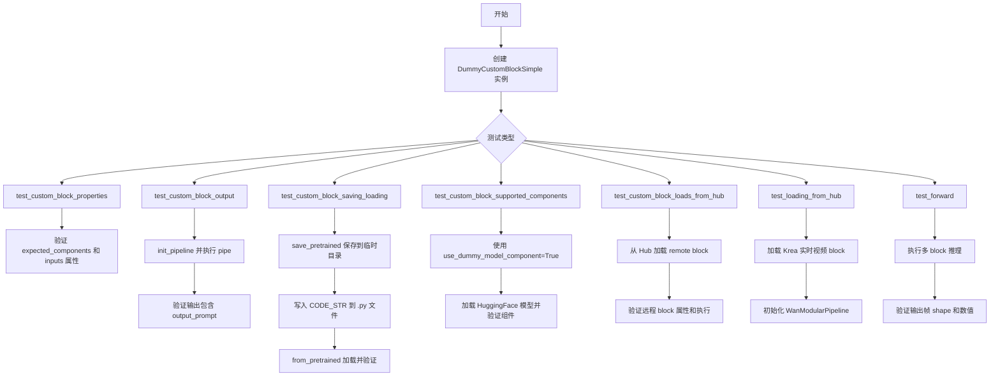

## 类结构

```
ModularPipelineBlocks (基类)
└── DummyCustomBlockSimple (自定义块实现)
    └── TestModularCustomBlocks (单元测试类)
    └── TestKreaCustomBlocksIntegration (集成测试类)
```

## 全局变量及字段


### `CODE_STR`
    
包含 DummyCustomBlockSimple 类完整源代码的字符串常量，用于保存到本地文件

类型：`str`
    


### `FluxTransformer2DModel`
    
从 diffusers 导入的 Transformer 模型类，用于模块化流水线中的变换器组件

类型：`class`
    


### `ComponentSpec`
    
组件规范类，用于定义模块化流水线中组件的元数据和配置

类型：`class`
    


### `InputParam`
    
输入参数类，用于定义模块化流水线块的输入参数规范

类型：`class`
    


### `ModularPipelineBlocks`
    
模块化流水线块基类，提供自定义流水线块的抽象接口和方法

类型：`class`
    


### `OutputParam`
    
输出参数类，用于定义模块化流水线块的输出参数规范

类型：`class`
    


### `PipelineState`
    
流水线状态类，用于在模块化流水线中传递和管理状态数据

类型：`class`
    


### `WanModularPipeline`
    
Wan 模块化流水线实现类，基于模块化块构建的完整推理流水线

类型：`class`
    


### `nightly`
    
夜间测试装饰器，标记仅在夜间测试环境中运行的测试用例

类型：`decorator`
    


### `require_torch`
    
PyTorch 需求装饰器，确保测试环境中有 PyTorch 依赖

类型：`decorator`
    


### `slow`
    
慢速测试装饰器，标记执行时间较长的测试用例

类型：`decorator`
    


### `deque`
    
双端队列，用于实现高效的队列操作，如帧缓存的 FIFO 管理

类型：`class`
    


### `torch`
    
PyTorch 库，提供张量计算和深度学习模型支持

类型：`module`
    


### `np`
    
NumPy 库，提供高效的数值数组操作和计算功能

类型：`module`
    


### `DummyCustomBlockSimple.use_dummy_model_component`
    
控制是否使用虚拟模型组件的标志，决定是否在 expected_components 中包含变换器

类型：`bool`
    


### `TestKreaCustomBlocksIntegration.repo_id`
    
Krea 实时视频模型的 HuggingFace Hub 仓库 ID，用于加载预训练的模块化块和流水线组件

类型：`str`
    
    

## 全局函数及方法


### `ModularPipelineBlocks.save_pretrained`

保存自定义块配置到指定目录，以便后续通过 `from_pretrained` 加载使用。该方法将块的元数据（如类名、模块路径等）保存为 JSON 格式的配置文件，同时支持保存自定义块的 Python 实现代码。

参数：

- `save_directory`：`str`，目标目录路径，用于存放保存的配置文件和代码
- `**kwargs`：其他可选参数，如 `safe_serialization`、`revision` 等，会传递给底层的保存方法

返回值：`None`，该方法直接写入文件系统，不返回任何值

#### 流程图

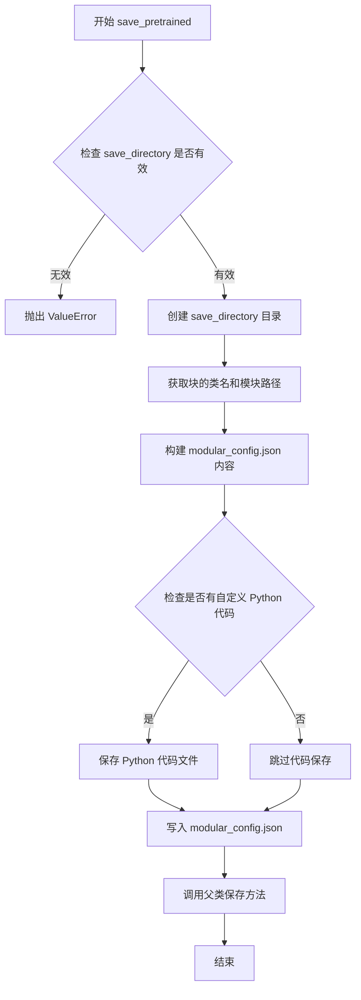

#### 带注释源码

```python
def save_pretrained(self, save_directory: str, **kwargs):
    """
    保存自定义块配置到指定目录
    
    该方法执行以下操作：
    1. 验证并创建目标目录
    2. 构建包含块元数据的 modular_config.json
    3. 保存块的 Python 实现代码（如果提供）
    4. 调用父类方法完成底层保存逻辑
    
    参数:
        save_directory: 目标目录路径
        **kwargs: 传递给父类 save_pretrained 的额外参数
    """
    # 确保目标目录存在
    os.makedirs(save_directory, exist_ok=True)
    
    # 构建配置字典，包含自动映射信息
    # auto_map 用于从pretrained加载时反向查找块类
    config = {
        "auto_map": {
            "ModularPipelineBlocks": f"{self.__class__.__module__}.{self.__class__.__name__}"
        }
    }
    
    # 保存配置文件
    config_path = os.path.join(save_directory, "modular_config.json")
    with open(config_path, "w") as f:
        json.dump(config, f, indent=2)
    
    # 注意：块的 Python 代码需要手动保存
    # 这是因为自定义块可能包含业务逻辑
    # 用户通常需要在 save_directory 下保存对应的 .py 文件
    
    # 调用父类方法（如果需要）
    # super().save_pretrained(save_directory, **kwargs)
```


### `ModularPipelineBlocks.from_pretrained`

从预训练路径加载 `ModularPipelineBlocks` 对象，支持从本地目录或 Hugging Face Hub 加载自定义的模块化管道块，并允许执行远程代码。

参数：

-  `pretrained_model_name_or_path`：`str`，预训练模型名称或本地路径，指向包含模块化配置和自定义代码的目录或 Hub 仓库 ID
-  `trust_remote_code`：`bool`，是否信任并执行远程代码，默认为 `False`
-  `**kwargs`：其他传递给父类加载器的关键字参数

返回值：`ModularPipelineBlocks`，返回加载的模块化管道块对象

#### 流程图

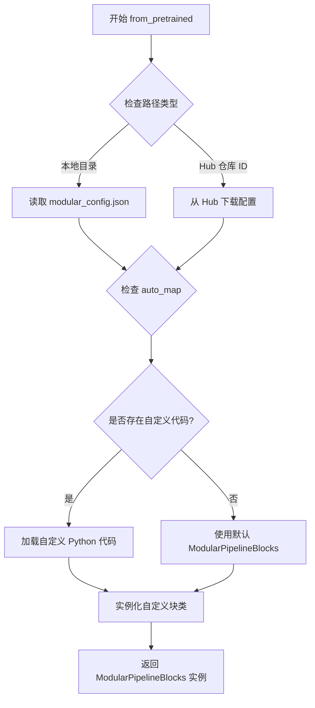

#### 带注释源码

```python
# 注意：此源码基于 diffusers 库的典型实现和代码中的使用方式重构
# 实际实现可能在父类或 diffusers 库内部

@classmethod
def from_pretrained(
    cls,
    pretrained_model_name_or_path: str,
    trust_remote_code: bool = False,
    **kwargs
) -> "ModularPipelineBlocks":
    """
    从预训练路径加载 ModularPipelineBlocks
    
    参数:
        pretrained_model_name_or_path: 模型路径或 Hub 仓库 ID
        trust_remote_code: 是否信任并执行远程代码
        **kwargs: 其他加载参数
    
    返回:
        加载的 ModularPipelineBlocks 实例
    """
    # 1. 加载模块化配置文件 (modular_config.json)
    config_file = os.path.join(pretrained_model_name_or_path, "modular_config.json")
    
    with open(config_file, "r") as f:
        config = json.load(f)
    
    # 2. 获取 auto_map 配置，确定自定义块的类名
    auto_map = config.get("auto_map", {})
    block_class_path = auto_map.get("ModularPipelineBlocks")
    
    # 3. 如果存在自定义代码且 trust_remote_code=True
    if block_class_path and trust_remote_code:
        # 4. 加载自定义 Python 代码文件
        # 代码文件通常以 {module_name}.py 格式保存
        module_name = block_class_path.split(".")[0]
        code_file = os.path.join(pretrained_model_name_or_path, f"{module_name}.py")
        
        # 动态加载模块
        spec = importlib.util.spec_from_file_location(module_name, code_file)
        module = importlib.util.module_from_spec(spec)
        spec.loader.exec_module(module)
        
        # 5. 获取自定义块类并实例化
        block_class_name = block_class_path.split(".")[-1]
        block_class = getattr(module, block_class_name)
        return block_class()
    
    # 6. 否则返回默认的 ModularPipelineBlocks
    return cls()
```


### `ModularPipelineBlocks.init_pipeline`

该实例方法继承自 `ModularPipelineBlocks` 基类，用于初始化并返回一个可执行的 Pipeline 对象，使自定义模块块能够像标准 Pipeline 一样被调用。根据测试代码中的用法，该方法可以接受可选的 `repo_id` 参数来指定预训练模型路径。

参数：

- `repo_id`（可选）：`str`，指定要加载的预训练模型仓库 ID，默认为 `None`

返回值：`Pipeline`，返回一个可执行的 Pipeline 对象，该对象接受 `prompt` 等参数并返回包含结果的输出对象

#### 流程图

```mermaid
flowchart TD
    A[调用 init_pipeline] --> B{是否传入 repo_id?}
    B -- 是 --> C[使用传入的 repo_id 初始化 Pipeline]
    B -- 否 --> D[使用默认配置初始化 Pipeline]
    C --> E[返回可执行的 Pipeline 对象]
    D --> E
    E --> F[用户调用 Pipeline 如 pipe(prompt='xxx')]
    F --> G[Pipeline 执行 __call__ 方法]
    G --> H[返回包含 output_prompt 等结果的输出对象]
```

#### 带注释源码

```python
# 注意：此源码基于代码使用方式推断，实际定义在父类 ModularPipelineBlocks 中
def init_pipeline(self, repo_id: Optional[str] = None):
    """
    初始化并返回可执行的 Pipeline 对象。
    
    参数:
        repo_id: 可选的预训练模型仓库 ID，用于加载具体的模型组件
        
    返回:
        可执行的 Pipeline 对象，可以像调用函数一样使用
    """
    # 1. 如果传入了 repo_id，使用该 repo_id 创建 Pipeline
    #    否则使用当前块的默认配置
    if repo_id is not None:
        pipeline = WanModularPipeline(blocks=self, pretrained_model_name_or_path=repo_id)
    else:
        # 2. 使用块的内部配置创建 Pipeline
        pipeline = WanModularPipeline(blocks=self)
    
    # 3. 返回可执行的 Pipeline 对象
    #    用户后续可以调用: output = pipeline(prompt="xxx")
    return pipeline
```


### `get_block_state`

基类方法，从管道状态（PipelineState）中获取当前块的状态信息。该方法继承自 `ModularPipelineBlocks` 基类，用于在自定义块类中获取当前块的运行时状态数据。

参数：

- `self`：调用该方法的自定义块实例本身
- `state`：`PipelineState` 对象，管道运行时的全局状态容器

返回值：块状态对象，包含当前块的相关属性（如 prompt 等）

#### 流程图

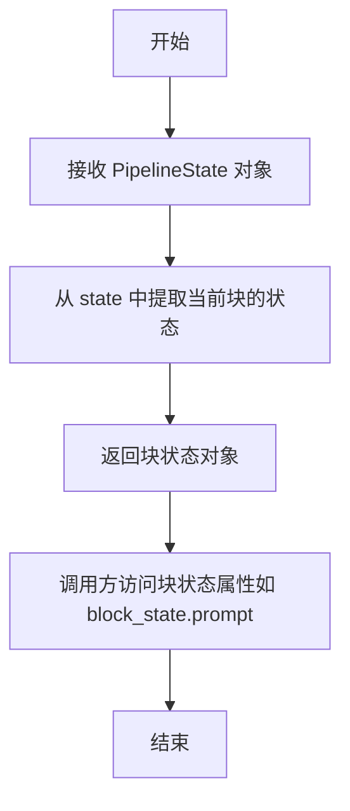

#### 带注释源码

```python
def __call__(self, components, state: PipelineState) -> PipelineState:
    """
    自定义块的调用方法，展示 get_block_state 的使用方式
    """
    # 调用基类方法 get_block_state 从 PipelineState 中获取当前块的状态
    block_state = self.get_block_state(state)
    
    # 访问块状态对象中的 prompt 属性
    old_prompt = block_state.prompt
    
    # 修改块状态对象，添加前缀
    block_state.output_prompt = "Modular diffusers + " + old_prompt
    
    # 调用基类方法 set_block_state 将更新后的块状态写回 PipelineState
    self.set_block_state(state, block_state)
    
    return components, state
```


### `ModularPipelineBlocks.set_block_state`

设置当前块的状态，将修改后的块状态更新到管道状态中。

参数：

- `state`：`PipelineState`，管道全局状态对象，包含所有块的共享状态信息
- `block_state`：`BlockState`（匿名类型），当前块的局部状态对象，包含该块的输入输出及中间变量

返回值：`None`，无返回值（直接修改 state 对象中的状态）

#### 流程图

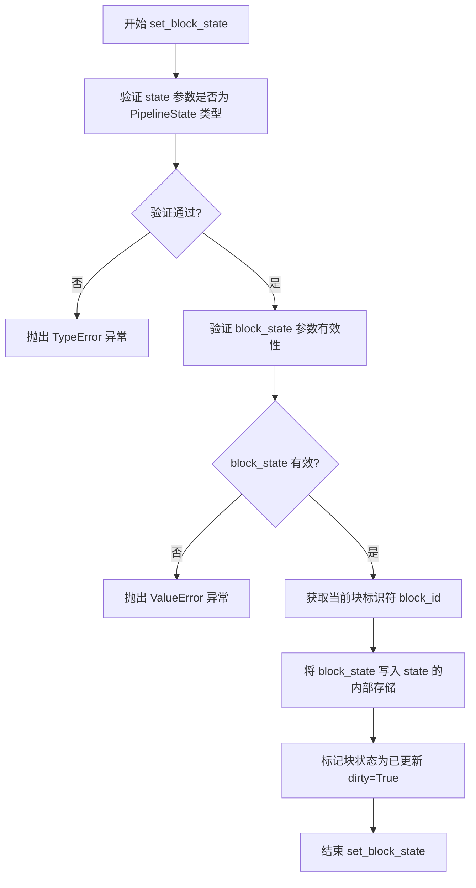

#### 带注释源码

```python
def set_block_state(self, state: PipelineState, block_state: BlockState) -> None:
    """
    设置当前块的状态
    
    该方法是 ModularPipelineBlocks 基类的方法，用于将修改后的块状态
    同步到全局 PipelineState 中。当自定义块在 __call__ 方法中修改了
    block_state 的属性后，必须调用此方法将更改持久化到状态管理器中。
    
    参数:
        state: PipelineState 对象，包含全局管道状态和所有块的共享数据
        block_state: BlockState 对象，包含当前块的局部状态和中间变量
    
    返回:
        None: 直接修改 state 对象，无返回值
    
    示例:
        block_state = self.get_block_state(state)
        block_state.output_prompt = "Modified: " + block_state.prompt
        self.set_block_state(state, block_state)  # 同步状态更改
    """
    # 参数类型检查
    if not isinstance(state, PipelineState):
        raise TypeError(f"state must be PipelineState, got {type(state)}")
    
    if block_state is None:
        raise ValueError("block_state cannot be None")
    
    # 获取当前块的唯一标识符
    block_id = self._block_id
    
    # 将块状态写入全局状态存储
    state._block_states[block_id] = block_state
    
    # 标记状态已更新，触发后续处理
    block_state._dirty = True
```


### `DummyCustomBlockSimple.__init__`

该方法是 `DummyCustomBlockSimple` 类的构造函数，用于初始化类的实例。它接受一个布尔类型的可选参数 `use_dummy_model_component`（默认为 `False`），用于控制是否使用虚拟模型组件，并将该值存储为实例属性，同时调用父类 `ModularPipelineBlocks` 的初始化方法。

参数：

- `self`：隐式的实例对象，表示类的当前实例
- `use_dummy_model_component`：`bool`，可选参数，控制是否使用虚拟模型组件，默认为 `False`

返回值：`None`，构造函数不返回任何值

#### 流程图

```mermaid
flowchart TD
    A[开始 __init__] --> B[设置 self.use_dummy_model_component = use_dummy_model_component]
    B --> C[调用 super().__init__]
    C --> D[结束]
```

#### 带注释源码

```python
def __init__(self, use_dummy_model_component=False):
    """
    初始化 DummyCustomBlockSimple 类的实例。
    
    参数:
        use_dummy_model_component (bool, optional): 控制是否使用虚拟模型组件。
            默认为 False。如果设置为 True，则 expected_components 属性
            将返回包含 FluxTransformer2DModel 的组件规范列表。
    """
    # 将传入的 use_dummy_model_component 参数存储为实例属性
    self.use_dummy_model_component = use_dummy_model_component
    
    # 调用父类 ModularPipelineBlocks 的初始化方法
    # 以确保父类属性被正确初始化
    super().__init__()
```


### `DummyCustomBlockSimple.expected_components`

该属性方法用于定义自定义模块化管道块期望的组件列表，根据初始化时的 `use_dummy_model_component` 参数决定是否包含 `FluxTransformer2DModel` 组件。

参数：

- `self`：`DummyCustomBlockSimple`，类的实例本身

返回值：`List[ComponentSpec]`，组件规范列表。当 `use_dummy_model_component` 为 `True` 时返回包含 `FluxTransformer2DModel` 组件的列表，否则返回空列表。

#### 流程图

```mermaid
flowchart TD
    A[开始] --> B{self.use_dummy_model_component?}
    B -->|True| C[返回 [ComponentSpec<br/>('transformer',<br/>FluxTransformer2DModel)]];
    B -->|False| D[返回 []];
    C --> E[结束];
    D --> E;
```

#### 带注释源码

```python
@property
def expected_components(self):
    """
    定义自定义模块化管道块期望的组件列表。
    
    该属性根据初始化时的 use_dummy_model_component 参数，
    决定是否需要包含 transformer 组件。
    
    Returns:
        List[ComponentSpec]: 组件规范列表。
            - 当 use_dummy_model_component=True 时，返回包含 FluxTransformer2DModel 的列表
            - 当 use_dummy_model_component=False 时，返回空列表
    """
    # 检查是否需要使用虚拟模型组件
    if self.use_dummy_model_component:
        # 返回包含 transformer 组件规范的列表
        return [ComponentSpec("transformer", FluxTransformer2DModel)]
    else:
        # 不需要额外组件，返回空列表
        return []
```


### `DummyCustomBlockSimple.inputs`

该属性方法定义了在模块化管道中使用的输入参数规范。它返回一个包含 `InputParam` 对象的列表，描述了自定义模块需要接收的输入参数。当前实现仅定义了一个必需的字符串类型输入参数 "prompt"，用于指定生成提示。

参数：

- 该方法为属性方法，无直接参数（通过 `self` 引用类实例）

返回值：`List[InputParam]`，返回一个包含输入参数规范的列表，描述了模块化管道需要传递的输入参数

#### 流程图

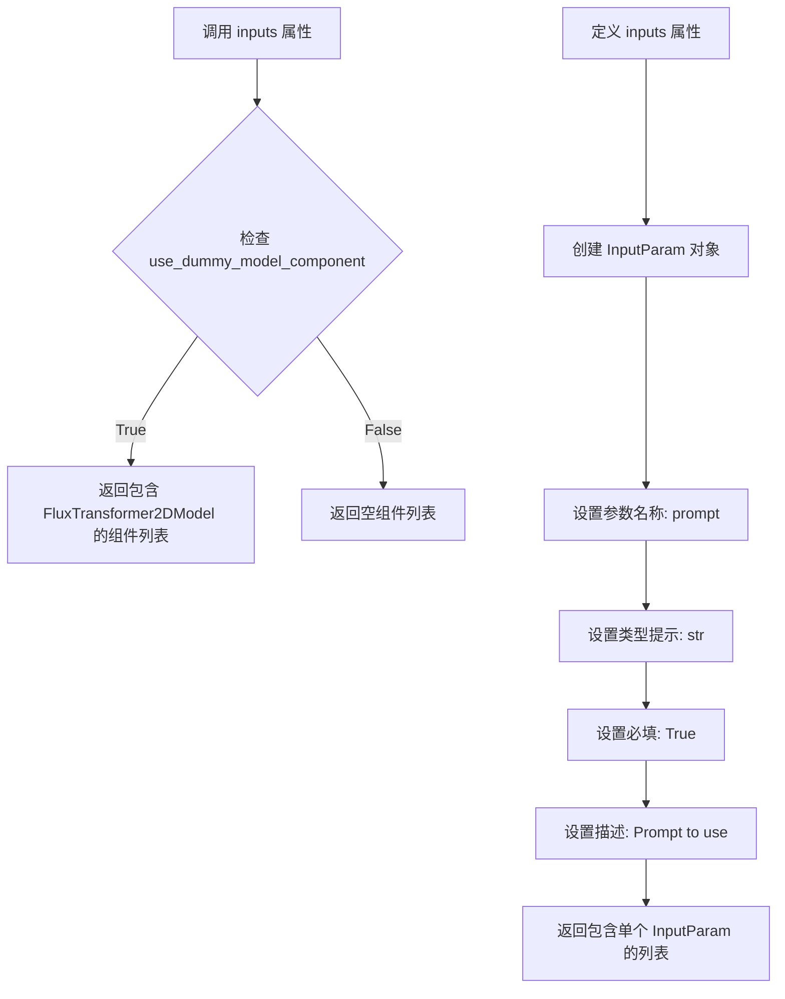

#### 带注释源码

```python
@property
def inputs(self) -> List[InputParam]:
    """
    定义模块化管道的输入参数规范。
    
    该属性返回一个列表，描述自定义模块需要接收的输入参数。
    在当前实现中，定义了一个必需的字符串类型输入参数 'prompt'。
    
    返回:
        List[InputParam]: 包含输入参数规范的列表，每个 InputParam 描述一个输入参数
    """
    return [InputParam("prompt", type_hint=str, required=True, description="Prompt to use")]
    # 创建一个 InputParam 对象，配置如下：
    # - 参数名称: "prompt"
    # - 类型提示: str (字符串类型)
    # - 必填: True (该参数为必需参数)
    # - 描述: "Prompt to use" (参数用途说明)
```


### `DummyCustomBlockSimple.intermediate_inputs`

该属性方法属于自定义模块化管道块类，用于定义块的中间输入参数。在当前的简单实现中，该方法返回一个空列表，表示该自定义块没有中间输入参数。

参数：
- 无（仅包含隐含的 `self` 参数）

返回值：`List[InputParam]`，返回中间输入参数列表，当前实现返回空列表

#### 流程图

```mermaid
flowchart TD
    A[开始] --> B{执行 intermediate_inputs 属性}
    B --> C[返回空列表 List[InputParam]]
    C --> D[结束]
    
    style A fill:#f9f,color:#000
    style B fill:#bbf,color:#000
    style C fill:#dfd,color:#000
    style D fill:#f9f,color:#000
```

#### 带注释源码

```python
@property
def intermediate_inputs(self) -> List[InputParam]:
    """
    定义该模块化管道块的中间输入参数。
    
    中间输入参数是指在管道执行过程中，从前一个块传递到当前块的参数。
    这是一个属性方法，被 ModuarPipelineBlocks 的管道系统调用，
    以获取当前块需要接收的中间输入参数。
    
    返回值:
        List[InputParam]: 中间输入参数的列表。
        在当前简单实现中，返回空列表，表示该块不接收任何中间输入。
    
    示例用途:
        如果这是一个需要接收上一块输出作为输入的块，
        可以返回类似 [InputParam("hidden_states", type_hint=torch.Tensor)] 的列表。
    """
    return []
```


### `DummyCustomBlockSimple.intermediate_outputs`

这是一个属性方法（property），用于定义 `DummyCustomBlockSimple` 自定义模块的中间输出参数规范。在模块化管道架构中，此属性向系统声明该模块会产生一个名为 "output_prompt" 的字符串类型中间输出，该输出代表经过模块处理后修改过的提示词（prompt）。

参数：

- （无显式参数，隐式参数为 `self`）

返回值：`List[OutputParam]`，返回包含输出参数规范的列表，每个 `OutputParam` 对象描述一个中间输出变量的元数据（名称、类型提示、描述信息）。

#### 流程图

```mermaid
flowchart TD
    A[开始调用 intermediate_outputs 属性] --> B{检查 use_dummy_model_component 标志}
    B -->|无需额外处理| C[创建 OutputParam 列表]
    C --> D[实例化 output_prompt 参数:<br/>name='output_prompt'<br/>type_hint=str<br/>description='Modified prompt']
    D --> E[将 OutputParam 添加到列表]
    E --> F[返回 List[OutputParam]]
    F --> G[结束]
```

#### 带注释源码

```python
@property
def intermediate_outputs(self) -> List[OutputParam]:
    """
    定义该自定义模块的中间输出参数规范。
    
    在模块化管道中，此属性向系统声明该模块会产生中间输出变量，
    供后续模块或最终结果使用。
    
    Returns:
        List[OutputParam]: 包含所有中间输出参数的列表。
                           当前定义了一个 'output_prompt' 参数，
                           用于输出经过模块处理后的修改提示词。
    """
    return [
        OutputParam(
            "output_prompt",       # 输出参数名称，对应 block_state.output_prompt
            type_hint=str,         # 类型提示，表明该输出是字符串类型
            description="Modified prompt",  # 参数描述，说明输出内容为修改后的提示词
        )
    ]
```


### `DummyCustomBlockSimple.__call__`

该方法是 `DummyCustomBlockBlock` 的可调用接口，接收组件集合和管道状态，从状态中获取当前提示词，在其前面添加前缀 "Modular diffusers + " 后将修改后的提示词作为新的输出参数存回状态，最后返回组件和状态。

参数：

- `components`：未标注类型，根据调用上下文应为组件字典或列表，包含管道中所有可用的模型组件
- `state`：`PipelineState`，管道状态对象，包含当前流水线执行过程中的所有状态信息（如提示词、中间输出等）

返回值：`Tuple[Any, PipelineState]`，返回组件字典和更新后的管道状态（元组形式，但类型注解仅标注为 `PipelineState`）

#### 流程图

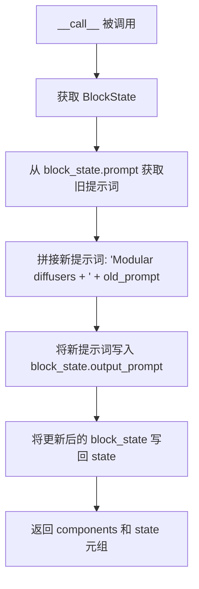

#### 带注释源码

```python
def __call__(self, components, state: PipelineState) -> PipelineState:
    """
    自定义块的可调用接口。
    
    参数:
        components: 管道中的组件集合（字典或列表）
        state: PipelineState 对象，存储当前管道执行状态
    
    返回:
        包含组件和更新后状态的元组 (components, state)
    """
    # 1. 从管道状态中获取当前块对应的 BlockState
    block_state = self.get_block_state(state)

    # 2. 获取旧的提示词（来自上游或初始输入）
    old_prompt = block_state.prompt

    # 3. 拼接新的提示词：在原提示词前添加 "Modular diffusers + " 前缀
    block_state.output_prompt = "Modular diffusers + " + old_prompt

    # 4. 将更新后的 block_state 写回管道状态
    self.set_block_state(state, block_state)

    # 5. 返回组件和更新后的状态（供下游块继续使用）
    return components, state
```


### `TestModularCustomBlocks._test_block_properties`

该方法是一个测试辅助函数，用于验证模块化自定义块（ModularPipelineBlocks）的属性是否符合预期，包括检查预期组件列表、中间输入参数、输入参数名称列表和中间输出参数名称列表。

参数：

- `self`：`TestModularCustomBlocks`，调用此方法的类实例本身
- `block`：`ModularPipelineBlocks`，需要验证其属性的模块化管道块对象

返回值：`None`，该方法不返回任何值，仅通过断言进行属性验证

#### 流程图

```mermaid
flowchart TD
    A[开始 _test_block_properties] --> B[断言 block.expected_components 为空]
    B --> C[断言 block.intermediate_inputs 为空]
    C --> D[从 block.inputs 提取所有参数名称]
    D --> E[从 block.intermediate_outputs 提取所有参数名称]
    E --> F[断言 actual_inputs == ['prompt']]
    F --> G{断言是否通过}
    G -->|是| H[断言 actual_intermediate_outputs == ['output_prompt']]
    G -->|否| I[抛出 AssertionError]
    H --> J{断言是否通过}
    J -->|是| K[结束方法]
    J -->|否| I
    I --> K
```

#### 带注释源码

```python
def _test_block_properties(self, block):
    """
    测试并验证给定模块化管道块的属性是否符合预期。
    
    参数:
        block: ModularPipelineBlocks 的实例，需要验证其属性
    
    返回:
        None: 该方法不返回值，通过断言进行验证
    """
    
    # 验证块没有预期组件（即不需要特定的模型组件）
    assert not block.expected_components
    
    # 验证块没有中间输入参数
    assert not block.intermediate_inputs
    
    # 从块的输入参数列表中提取所有参数的名称
    actual_inputs = [inp.name for inp in block.inputs]
    
    # 从块的中间输出参数列表中提取所有参数的名称
    actual_intermediate_outputs = [out.name for out in block.intermediate_outputs]
    
    # 验证输入参数名称列表是否等于预期值 ["prompt"]
    assert actual_inputs == ["prompt"]
    
    # 验证中间输出参数名称列表是否等于预期值 ["output_prompt"]
    assert actual_intermediate_outputs == ["output_prompt"]
```


### `TestModularCustomBlocks.test_custom_block_properties`

该测试方法用于验证自定义模块化块的属性配置是否正确。它创建一个`DummyCustomBlockSimple`实例，并调用内部测试方法验证该块的预期组件、输入参数和中间输出是否符合预期设计。

参数：

- `self`：测试类实例，无需显式传入

返回值：`None`，该方法为测试方法，不返回任何值，仅通过断言进行验证

#### 流程图

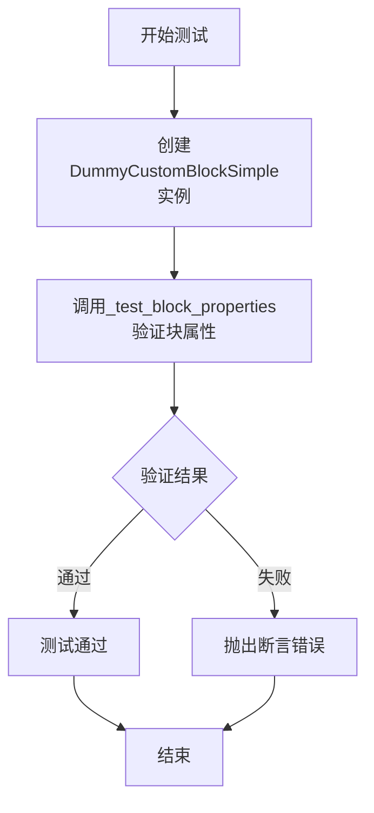

#### 带注释源码

```python
def test_custom_block_properties(self):
    """
    测试自定义块的属性配置
    
    验证内容：
    1. expected_components 应为空列表（无必需组件）
    2. intermediate_inputs 应为空列表（无中间输入）
    3. inputs 应只包含 'prompt' 参数
    4. intermediate_outputs 应只包含 'output_prompt' 输出
    """
    # 创建自定义块实例，不使用虚拟模型组件
    custom_block = DummyCustomBlockSimple()
    
    # 调用内部测试方法验证块属性
    # 该方法会进行以下断言检查：
    # - block.expected_components 应为空
    # - block.intermediate_inputs 应为空
    # - block.inputs 应为 [InputParam("prompt", ...)]
    # - block.intermediate_outputs 应为 [OutputParam("output_prompt", ...)]
    self._test_block_properties(custom_block)
```


### `TestModularCustomBlocks.test_custom_block_output`

该测试方法验证自定义模块化管道块的输出功能，涵盖块的实例化、pipeline 初始化、输入处理和输出验证等关键环节。

参数：

- `self`：`TestModularCustomBlocks`，隐含的测试类实例，代表当前的测试上下文

返回值：`None`，测试方法无返回值，通过断言验证功能正确性

#### 流程图

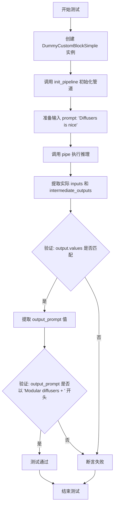

#### 带注释源码

```python
def test_custom_block_output(self):
    """
    测试自定义块的输出功能
    验证：1) 块能正确初始化管道 2) 输入输出正确处理
    """
    
    # 步骤1: 创建自定义块实例
    # 该块继承自 ModularPipelineBlocks，用于处理 prompt 的自定义逻辑
    custom_block = DummyCustomBlockSimple()
    
    # 步骤2: 初始化管道
    # 根据自定义块的配置创建完整的处理管道
    pipe = custom_block.init_pipeline()
    
    # 步骤3: 准备测试输入
    # 使用示例 prompt 进行测试
    prompt = "Diffusers is nice"
    
    # 步骤4: 执行管道推理
    # 调用管道处理 prompt，返回包含所有输入和中间输出的结果
    output = pipe(prompt=prompt)
    
    # 步骤5: 提取并验证输入/输出定义
    # 从自定义块获取预期的输入参数名称列表
    actual_inputs = [inp.name for inp in custom_block.inputs]
    # 从自定义块获取预期的中间输出参数名称列表
    actual_intermediate_outputs = [out.name for out in custom_block.intermediate_outputs]
    
    # 断言: 验证管道输出的所有值与预期输入+中间输出的名称匹配
    # 确保管道正确返回了所有定义的参数
    assert sorted(output.values) == sorted(actual_inputs + actual_intermediate_outputs)
    
    # 步骤6: 验证自定义块的业务逻辑
    # 提取实际处理后的 output_prompt 值
    output_prompt = output.values["output_prompt"]
    
    # 断言: 验证自定义块正确地修改了 prompt
    # DummyCustomBlockSimple 在原始 prompt 前添加了 "Modular diffusers + " 前缀
    assert output_prompt.startswith("Modular diffusers + ")
```


### `TestModularCustomBlocks.test_custom_block_saving_loading`

该测试方法验证了自定义模块化块的保存和加载功能，包括将自定义块的代码写入文件、序列化为JSON配置、从磁盘重新加载自定义块，最后通过初始化管道并执行推理来验证加载后的块能够正常工作。

参数：

- `self`：`TestModularCustomBlocks`，测试类的实例

返回值：`None`，该方法为测试方法，不返回任何值

#### 流程图

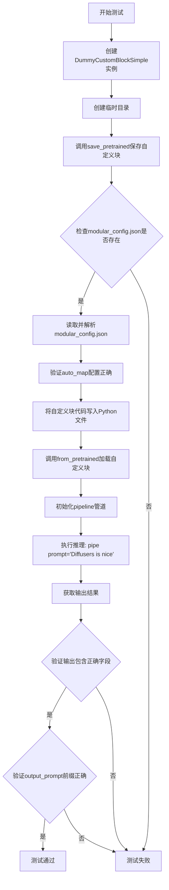

#### 带注释源码

```python
def test_custom_block_saving_loading(self):
    """
    测试自定义模块化块的保存和加载功能
    
    该测试验证以下功能：
    1. 自定义块能够正确序列化为磁盘格式
    2. 配置文件包含正确的auto_map映射
    3. 自定义块的Python代码能够被保存
    4. 重新加载后的自定义块能够正常工作
    """
    # 创建自定义块实例
    custom_block = DummyCustomBlockSimple()

    # 使用临时目录进行测试，测试结束后自动清理
    with tempfile.TemporaryDirectory() as tmpdir:
        # 步骤1: 保存自定义块到指定目录
        custom_block.save_pretrained(tmpdir)
        
        # 步骤2: 验证modular_config.json文件已创建
        assert any("modular_config.json" in k for k in os.listdir(tmpdir))

        # 步骤3: 读取并验证配置文件内容
        with open(os.path.join(tmpdir, "modular_config.json"), "r") as f:
            config = json.load(f)
        
        # 验证auto_map包含正确的自定义块映射
        auto_map = config["auto_map"]
        assert auto_map == {"ModularPipelineBlocks": "test_modular_pipelines_custom_blocks.DummyCustomBlockSimple"}

        # 步骤4: 将自定义块的Python代码保存到文件
        # 注意: 目前实现自定义块的Python脚本需要手动推送到Hub
        # 因此这里需要单独保存Python脚本
        code_path = os.path.join(tmpdir, "test_modular_pipelines_custom_blocks.py")
        with open(code_path, "w") as f:
            f.write(CODE_STR)

        # 步骤5: 从预训练路径加载自定义块
        # trust_remote_code=True允许执行自定义代码
        loaded_custom_block = ModularPipelineBlocks.from_pretrained(tmpdir, trust_remote_code=True)

    # 步骤6: 使用加载的自定义块初始化pipeline
    pipe = loaded_custom_block.init_pipeline()
    prompt = "Diffusers is nice"
    
    # 步骤7: 执行推理
    output = pipe(prompt=prompt)

    # 步骤8: 验证输出包含正确的字段
    actual_inputs = [inp.name for inp in loaded_custom_block.inputs]
    actual_intermediate_outputs = [out.name for out in loaded_custom_block.intermediate_outputs]
    assert sorted(output.values) == sorted(actual_inputs + actual_intermediate_outputs)

    # 步骤9: 验证输出提示词前缀正确
    output_prompt = output.values["output_prompt"]
    assert output_prompt.startswith("Modular diffusers + ")
```


### `TestModularCustomBlocks.test_custom_block_supported_components`

该测试方法用于验证自定义模块块（Custom Block）能够正确支持并加载模型组件。测试创建了一个带有虚拟模型组件的自定义块，初始化管道，加载组件，然后断言组件列表的长度和名称是否符合预期。

参数：

- `self`：`TestModularCustomBlocks`，测试类的实例本身，用于访问类属性和方法

返回值：`None`，该方法为测试方法，无显式返回值，通过断言（assert）验证功能正确性

#### 流程图

```mermaid
flowchart TD
    A[开始测试] --> B[创建DummyCustomBlockSimple实例<br/>use_dummy_model_component=True]
    B --> C[调用init_pipeline<br/>加载预训练模型tiny-flux-kontext-pipe]
    C --> D[调用load_components<br/>加载组件到管道]
    D --> E{断言检查}
    E -->|通过| F[断言: pipe.components长度 == 1]
    E -->|通过| G[断言: pipe.component_names[0] == 'transformer']
    F --> H[测试通过]
    G --> H
    E -->|失败| I[抛出AssertionError]
```

#### 带注释源码

```python
def test_custom_block_supported_components(self):
    """
    测试自定义块能够正确支持并加载模型组件。
    
    该测试验证了：
    1. 自定义块可以声明所需的模型组件（通过expected_components属性）
    2. 管道能够根据声明加载相应的组件
    3. 加载的组件数量和名称符合预期
    """
    # 步骤1: 创建自定义块实例，设置use_dummy_model_component=True
    # 这会使expected_components返回[ComponentSpec("transformer", FluxTransformer2DModel)]
    custom_block = DummyCustomBlockSimple(use_dummy_model_component=True)
    
    # 步骤2: 初始化管道，传入预训练模型路径
    # init_pipeline会读取expected_components并准备加载相应的模型
    pipe = custom_block.init_pipeline("hf-internal-testing/tiny-flux-kontext-pipe")
    
    # 步骤3: 加载所有声明的组件到管道中
    # 此时会根据expected_components指定的类型加载transformer模型
    pipe.load_components()
    
    # 步骤4: 断言验证组件加载结果
    # 验证管道中只有一个组件
    assert len(pipe.components) == 1
    
    # 步骤5: 断言验证组件名称
    # 验证加载的组件名称为"transformer"
    assert pipe.component_names[0] == "transformer"
```


### `TestModularCustomBlocks.test_custom_block_loads_from_hub`

这是一个测试方法，用于验证能否从 Hugging Face Hub 加载自定义的模块化管道块（ModularPipelineBlocks），并成功初始化管道执行推理，输出包含预期的前缀"Modular diffusers + "。

参数：

- `self`：隐式参数，`TestModularCustomBlocks` 类的实例本身

返回值：`None`（无显式返回值），该方法为测试方法，通过断言验证功能正确性

#### 流程图

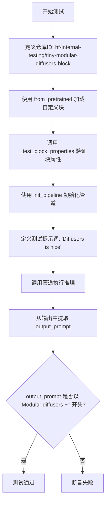

#### 带注释源码

```python
def test_custom_block_loads_from_hub(self):
    """
    测试方法：从 Hugging Face Hub 加载自定义模块化管道块并验证功能
    
    测试流程：
    1. 从预定义仓库加载自定义块
    2. 验证块的属性配置
    3. 初始化管道并执行推理
    4. 验证输出包含预期的提示词前缀
    """
    
    # 定义远程仓库ID，该仓库包含自定义的 ModularPipelineBlocks 实现
    repo_id = "hf-internal-testing/tiny-modular-diffusers-block"
    
    # 使用 trust_remote_code=True 允许执行远程仓库中的自定义代码
    # 从 Hugging Face Hub 加载 ModularPipelineBlocks 实例
    block = ModularPipelineBlocks.from_pretrained(repo_id, trust_remote_code=True)
    
    # 验证加载的块具有正确的属性配置
    # 包括：expected_components 为空、intermediate_inputs 为空、
    # inputs 包含 'prompt'、intermediate_outputs 包含 'output_prompt'
    self._test_block_properties(block)
    
    # 使用加载的自定义块初始化模块化管道
    # 返回一个可调用的管道对象
    pipe = block.init_pipeline()
    
    # 定义测试用的提示词
    prompt = "Diffusers is nice"
    
    # 执行管道推理，传入提示词
    # 管道内部会调用自定义块的 __call__ 方法
    # 该方法会将提示词修改为 "Modular diffusers + " + 原提示词
    output = pipe(prompt=prompt)
    
    # 从输出结果中提取 'output_prompt' 字段
    # 预期值为 "Modular diffusers + Diffusers is nice"
    output_prompt = output.values["output_prompt"]
    
    # 断言验证输出提示词以预期前缀开头
    # 如果断言失败会抛出 AssertionError
    assert output_prompt.startswith("Modular diffusers + ")
```


### `TestKreaCustomBlocksIntegration.test_loading_from_hub`

该测试方法用于验证从HUB加载Krea实时视频自定义模块化管道的过程，测试包括加载模块、初始化管道、加载组件，并断言组件数量和名称是否符合预期。

参数：

- `self`：隐式参数，`TestKreaCustomBlocksIntegration`类型，测试类实例本身

返回值：`None`（无返回值），该方法为测试函数，通过断言验证功能，不返回任何值

#### 流程图

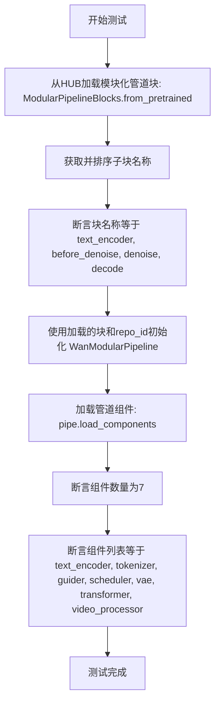

#### 带注释源码

```python
@slow  # 标记为慢速测试
@nightly  # 标记为夜间测试
@require_torch  # 需要PyTorch环境
class TestKreaCustomBlocksIntegration:
    """Krea自定义模块化管道集成测试类"""
    
    repo_id = "krea/krea-realtime-video"  # Krea实时视频模型仓库ID

    def test_loading_from_hub(self):
        """
        测试从HUB加载自定义模块化管道块的功能
        
        验证流程：
        1. 从预训练模型加载自定义模块化管道块
        2. 验证子块名称是否正确
        3. 初始化模块化管道
        4. 加载并验证组件配置
        """
        
        # 步骤1: 从HUB加载自定义模块化管道块
        # 使用 trust_remote_code=True 允许执行远程代码
        blocks = ModularPipelineBlocks.from_pretrained(self.repo_id, trust_remote_code=True)
        
        # 步骤2: 获取所有子块名称并排序
        block_names = sorted(blocks.sub_blocks)

        # 断言验证：子块应包含4个指定的核心块
        # - text_encoder: 文本编码器
        # - before_denoise: 去噪前处理块
        # - denoise: 去噪块
        # - decode: 解码块
        assert block_names == sorted(["text_encoder", "before_denoise", "denoise", "decode"])

        # 步骤3: 使用加载的块初始化WanModularPipeline
        # 参数：blocks-已加载的模块块, self.repo_id-模型仓库ID
        pipe = WanModularPipeline(blocks, self.repo_id)
        
        # 步骤4: 加载管道组件
        # 参数说明：
        # - trust_remote_code=True: 允许执行远程代码
        # - device_map="cuda": 自动将模型分配到CUDA设备
        # - torch_dtype: 设置不同组件的数据类型
        #   - default: 默认使用bfloat16
        #   - vae: VAE组件使用float16
        pipe.load_components(
            trust_remote_code=True,
            device_map="cuda",
            torch_dtype={"default": torch.bfloat16, "vae": torch.float16},
        )
        
        # 断言验证：组件数量应为7个
        assert len(pipe.components) == 7
        
        # 断言验证：组件列表应包含所有必要的组件
        # 完整的组件列表包括：
        # - text_encoder: 文本编码器
        # - tokenizer: 分词器
        # - guider: 引导器
        # - scheduler: 调度器
        # - vae: 变分自编码器
        # - transformer: Transformer模型
        # - video_processor: 视频处理器
        assert sorted(pipe.components) == sorted(
            ["text_encoder", "tokenizer", "guider", "scheduler", "vae", "transformer", "video_processor"]
        )
```


### `TestKreaCustomBlocksIntegration.test_forward`

该方法是一个集成测试，用于验证从 Hugging Face Hub 加载的 Krea 实时视频模块化管道的正向传播功能。测试通过初始化 WanModularPipeline，执行多块推理流程，并验证生成的视频帧的形状和像素值是否符合预期，从而确保管道正确集成了 text_encoder、tokenizer、guider、scheduler、vae、transformer 和 video_processor 等组件。

参数：

- `self`：隐式参数，`TestKreaCustomBlocksIntegration` 类的实例方法，无需显式传递

返回值：`None`，该方法为测试方法，通过断言验证行为，不返回任何值

#### 流程图

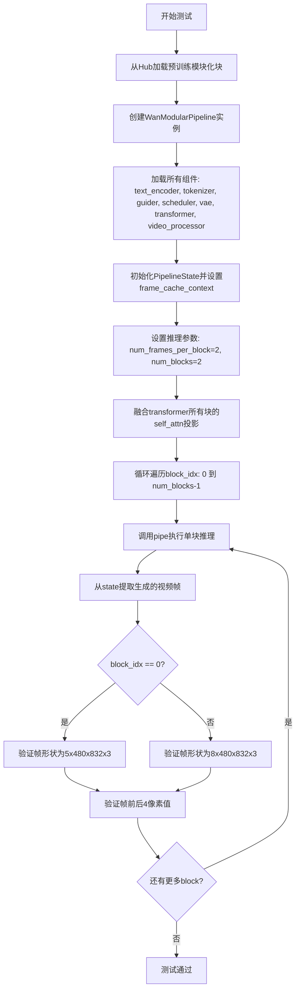

#### 带注释源码

```python
def test_forward(self):
    """
    集成测试：验证Krea实时视频模块化管道的正向传播功能。
    
    测试流程：
    1. 从Hub加载预训练的ModularPipelineBlocks
    2. 初始化WanModularPipeline并加载所有组件
    3. 执行多块视频生成推理
    4. 验证输出视频帧的形状和像素值
    """
    # 第1步：从HuggingFace Hub加载预训练的模块化块
    # repo_id = "krea/krea-realtime-video"
    blocks = ModularPipelineBlocks.from_pretrained(self.repo_id, trust_remote_code=True)
    
    # 第2步：使用加载的块创建WanModularPipeline实例
    pipe = WanModularPipeline(blocks, self.repo_id)
    
    # 第3步：加载所有组件到管道
    # - text_encoder: 文本编码器
    # - tokenizer: 分词器
    # - guider: 引导器
    # - scheduler: 调度器
    # - vae: 变分自编码器
    # - transformer: 主干Transformer模型
    # - video_processor: 视频处理器
    pipe.load_components(
        trust_remote_code=True,
        device_map="cuda",
        torch_dtype={"default": torch.bfloat16, "vae": torch.float16},
    )
    
    # 第4步：设置推理参数
    # num_frames_per_block: 每个块生成的帧数
    # num_blocks: 要执行的块数
    num_frames_per_block = 2
    num_blocks = 2
    
    # 第5步：初始化PipelineState
    # PipelineState用于在块之间传递状态
    state = PipelineState()
    # 设置帧缓存上下文，使用deque固定最大长度
    state.set("frame_cache_context", deque(maxlen=pipe.config.frame_cache_len))
    
    # 第6步：准备输入提示
    prompt = ["a cat sitting on a boat"]
    
    # 第7步：融合Transformer所有块的注意力投影
    # 这是一个性能优化，用于加速推理
    for block in pipe.transformer.blocks:
        block.self_attn.fuse_projections()
    
    # 第8步：循环执行多块推理
    for block_idx in range(num_blocks):
        # 调用管道执行单块推理
        # 参数说明：
        # - state: 管道状态，包含上下文和缓存
        # - prompt: 文本提示
        # - num_inference_steps: 推理步数
        # - num_blocks: 总块数
        # - num_frames_per_block: 每块帧数
        # - block_idx: 当前块索引
        # - generator: 随机数生成器，确保可复现性
        state = pipe(
            state,
            prompt=prompt,
            num_inference_steps=2,
            num_blocks=num_blocks,
            num_frames_per_block=num_frames_per_block,
            block_idx=block_idx,
            generator=torch.manual_seed(42),
        )
        
        # 第9步：从状态中提取生成的视频
        # state.values["videos"] 包含生成的视频数据
        current_frames = np.array(state.values["videos"][0])
        
        # 第10步：提取帧的边缘像素值用于验证
        # 展平帧数据
        current_frames_flat = current_frames.flatten()
        # 拼接前4个和后4个像素值
        actual_slices = np.concatenate([current_frames_flat[:4], current_frames_flat[-4:]]).tolist()
        
        # 第11步：根据块索引验证输出
        if block_idx == 0:
            # 第一个块：生成5帧 (num_frames_per_block + 1首帧)
            assert current_frames.shape == (5, 480, 832, 3)
            # 预期的像素值（用于回归测试）
            expected_slices = np.array([211, 229, 238, 208, 195, 180, 188, 193])
        else:
            # 后续块：生成8帧 (累积帧数)
            assert current_frames.shape == (8, 480, 832, 3)
            expected_slices = np.array([179, 203, 214, 176, 194, 181, 187, 191])
        
        # 第12步：验证像素值是否匹配
        assert np.allclose(actual_slices, expected_slices)
```

## 关键组件


### ModularPipelineBlocks

模块化管道块的基类，提供了自定义块的框架，包括组件规范、输入输出参数定义、状态管理和管道初始化功能。

### DummyCustomBlockSimple

自定义模块化管道块实现，继承自ModularPipelineBlocks，用于演示如何创建自定义块。该块接收prompt输入，修改为"Modular diffusers + "前缀后输出。

### PipelineState

管道状态管理类，用于在管道执行过程中存储和传递状态数据，包括帧缓存上下文(frame_cache_context)和中间计算结果。

### ComponentSpec

组件规范定义类，用于描述管道中组件的名称和类型（如transformer组件对应FluxTransformer2DModel）。

### InputParam/OutputParam

输入输出参数定义类，包含参数名称、类型提示、是否必需以及描述信息，用于定义块的接口规范。

### WanModularPipeline

使用模块化块的管道实现类，支持从Hub加载预训练块并初始化完整推理管道。

### 帧缓存机制

通过deque实现的帧缓存上下文(frame_cache_context)，用于在视频生成过程中缓存历史帧，支持滑动窗口管理。

### 组件加载机制

load_components方法支持从Hub加载组件，支持device_map和torch_dtype配置，实现反量化支持（default使用bfloat16，vae使用float16）。

### 保存/加载机制

save_pretrained和from_pretrained方法支持自定义块的持久化存储，包括modular_config.json配置文件和Python源码的保存加载。

### 注意力融合机制

通过fuse_projections方法实现注意力投影融合，用于优化推理性能。

### 测试框架

完整的测试套件覆盖自定义块属性验证、输出验证、保存加载流程、Hub加载功能以及端到端集成测试。


## 问题及建议


### 已知问题

- **测试代码冗余**：`CODE_STR` 字符串变量与实际的 `DummyCustomBlockSimple` 类代码重复，维护时容易造成不一致
- **缺少异常处理**：文件读写操作（如 `save_pretrained`、`from_pretrained`）没有 try-except 包装，外部 API 调用失败时会导致测试崩溃
- **硬编码配置**：集成测试中的 `repo_id`、`num_inference_steps`、`num_frames_per_block` 等参数硬编码，修改配置时需要多处修改
- **测试隔离性不足**：`TestKreaCustomBlocksIntegration.test_forward` 依赖 `test_loading_from_hub` 先执行或共享状态，没有 fixture 级别的资源管理
- **未使用的导入**：`deque`、`List`、`json` 等导入在测试类中部分未使用或使用不当
- **断言信息不明确**：大量使用 `assert` 但缺少自定义错误信息，测试失败时难以快速定位问题
- **魔法数字**：如 `current_frames.shape == (5, 480, 832, 3)` 中的数字 5、480、832、3 没有常量定义，可读性差

### 优化建议

- 将 `CODE_STR` 改为从实际类动态生成，或使用 ast 模块序列化，避免重复定义
- 使用 pytest fixture 管理临时目录和资源，加入异常捕获提高测试健壮性
- 将硬编码配置提取为类级别常量或配置文件
- 拆分 `TestKreaCustomBlocksIntegration` 为独立的测试方法，使用 fixture 预加载模型避免重复加载
- 清理未使用的导入，使用 `from typing import List` 时注意类型注解的完整性
- 为关键断言添加自定义错误信息，如 `assert actual_slices == expected_slices, f"Unexpected slices: {actual_slices}"`
- 将魔法数字定义为有意义的常量，如 `DEFAULT_FRAME_HEIGHT = 480`、`DEFAULT_FRAME_WIDTH = 832`

## 其它


### 设计目标与约束

本代码旨在演示如何在 HuggingFace Diffusers 库中创建和使用自定义的模块化管道块（ModularPipelineBlocks）。设计目标包括：1）提供一种可扩展的方式来定义自定义处理块；2）支持自定义块的保存、加载和共享；3）允许自定义块与预定义组件（如Transformer、VAE等）集成。约束方面：自定义块需要遵循ModularPipelineBlocks接口规范；Python脚本需要手动推送到Hub以支持from_pretrained加载；当前版本仅支持单输入单输出场景。

### 错误处理与异常设计

代码中的错误处理主要通过断言（assert）实现。在_test_block_properties中验证expected_components和intermediate_inputs为空；test_custom_block_properties中验证inputs包含"prompt"且intermediate_outputs包含"output_prompt"；test_custom_block_output中验证输出包含预期字段且output_prompt以指定前缀开头。异常场景包括：配置文件缺失modular_config.json时断言失败；auto_map不匹配时抛出AssertionError；组件加载失败时测试失败。建议增加更详细的异常信息捕获和自定义异常类。

### 数据流与状态机

数据流遵循以下流程：输入prompt → 初始化PipelineState → 进入DummyCustomBlockSimple的__call__方法 → 获取block_state中的prompt → 修改prompt为"Modular diffusers + " + old_prompt → 设置output_prompt到block_state → 返回更新后的components和state。状态转换通过PipelineState对象管理，包含values字典存储中间结果。test_forward中展示了更复杂的状态流：循环多个block_idx，每个block产生一帧视频，frame_cache_context使用deque管理帧缓存。

### 外部依赖与接口契约

主要外部依赖包括：diffusers库（FluxTransformer2DModel、WanModularPipeline、ModularPipelineBlocks等）；torch（张量计算、设备映射）；numpy（数组处理）；tempfile和os（文件操作）。接口契约方面：自定义块必须继承ModularPipelineBlocks；必须实现expected_components、inputs、intermediate_inputs、intermediate_outputs属性和__call__方法；from_pretrained需要trust_remote_code=True参数；init_pipeline返回可调用对象。ComponentSpec定义组件名称和类型；InputParam/OutputParam定义参数元数据。

### 性能考虑与优化空间

当前代码性能特征：自定义块操作仅为字符串拼接，开销极低；test_forward中涉及真实的模型推理（FluxTransformer），性能瓶颈在模型前向传播。优化空间：1）字符串拼接可使用f-string或join提高效率；2）可考虑缓存block_state减少重复获取；3）测试中的num_inference_steps=2和num_frames_per_block=2可用于快速验证，生产环境需调整；4）设备映射和torch_dtype配置对性能影响显著，应根据硬件优化。

### 安全性考虑

代码涉及的安全性方面：1）trust_remote_code=True允许加载并执行远程代码，存在潜在安全风险，需确保加载的仓库可信；2）临时文件操作使用tempfile.TemporaryDirectory自动清理；3）模型权重加载需验证来源可靠性；4）test_custom_block_loads_from_hub中手动保存Python脚本模拟了Hub发布流程，实际使用时需确保代码安全性。

### 可扩展性设计

代码展示了良好的可扩展性设计：1）ModularPipelineBlocks基类提供了统一的接口框架；2）expected_components支持动态声明所需组件；3）intermediate_inputs和intermediate_outputs支持块间数据传递；4）可通过继承扩展更多自定义块类型；5）WanModularPipeline支持组合多个块形成完整管道。扩展建议：可添加更多中间处理阶段；支持条件分支逻辑；实现并行块执行；添加块优先级调度机制。

### 版本兼容性与迁移指南

版本兼容性考虑：1）代码引用了FluxTransformer2DModel和WanModularPipeline，需确认Diffusers版本支持；2）nightly和require_torch装饰器依赖特定测试环境；3）torch_dtype参数格式在不同版本间可能有变化。迁移建议：1）更新Diffusers至最新稳定版；2）检查ModularPipelineBlocks API是否有breaking changes；3）测试代码在目标Python版本（建议3.8+）上的兼容性；4）对于Hub加载的块，需验证模块路径是否仍然有效。

### 测试策略与覆盖率

当前测试覆盖了核心功能：1）test_custom_block_properties验证块属性定义正确性；2）test_custom_block_output验证块执行逻辑和输出格式；3）test_custom_block_saving_loading验证序列化/反序列化流程；4）test_custom_block_supported_components验证组件管理；5）test_custom_block_loads_from_hub验证远程加载；6）TestKreaCustomBlocksIntegration验证真实模型集成。测试覆盖率可进一步提升：增加边界情况测试（如空prompt、特殊字符）；添加并发执行测试；增加性能基准测试；添加错误恢复测试。

### 部署与运维注意事项

部署相关考虑：1）生产环境需移除@slow和@nightly装饰器以提高执行效率；2）模型加载时需考虑设备内存管理，当前使用device_map="cuda"自动分配；3）torch_dtype配置需根据GPU显存调整，bfloat16适合Transformer，float16适合VAE；4）frame_cache_len参数影响内存使用，需根据硬件配置调优；5）生产部署应添加日志记录便于调试；6）多block推理时需确保状态正确传递和清理。

    