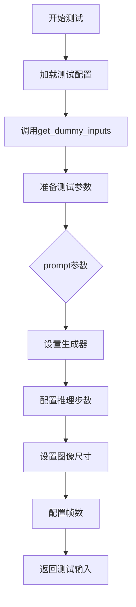
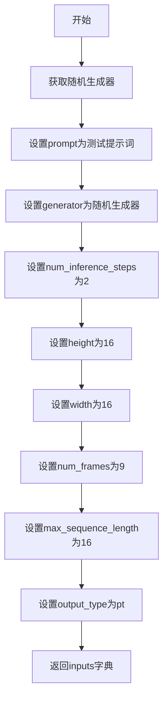
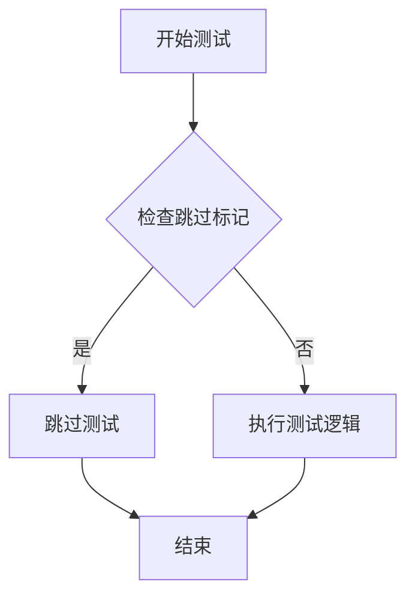

# `diffusers\tests\modular_pipelines\wan\test_modular_pipeline_wan.py` 详细设计文档

这是一个针对WanModularPipeline的快速测试类，继承自ModularPipelineTesterMixin，用于测试Wan模块化流水线的核心功能，包括图像生成、参数处理和批处理能力。

## 整体流程



## 类结构

```
ModularPipelineTesterMixin (测试混入类)
└── TestWanModularPipelineFast (具体测试类)
```

## 全局变量及字段


### `TestWanModularPipelineFast.pipeline_class`
    
被测试的流水线类

类型：`WanModularPipeline`
    


### `TestWanModularPipelineFast.pipeline_blocks_class`
    
模块化流水线使用的块类

类型：`WanBlocks`
    


### `TestWanModularPipelineFast.pretrained_model_name_or_path`
    
预训练模型路径或名称

类型：`str`
    


### `TestWanModularPipelineFast.params`
    
必需参数集合

类型：`frozenset`
    


### `TestWanModularPipelineFast.batch_params`
    
批处理参数集合

类型：`frozenset`
    


### `TestWanModularPipelineFast.optional_params`
    
可选参数集合

类型：`frozenset`
    


### `TestWanModularPipelineFast.output_name`
    
输出名称

类型：`str`
    
    

## 全局函数及方法


### `TestWanModularPipelineFast.get_dummy_inputs`

该方法用于生成WanModularPipeline测试所需的虚拟输入参数字典，包含提示词、随机生成器、推理步数、图像尺寸、帧数等关键配置，用于快速搭建测试环境。

参数：

- `seed`：`int`，随机种子，用于初始化随机生成器，确保测试结果可复现，默认值为 `0`

返回值：`dict`，包含所有测试输入参数的字典，包括prompt（提示词）、generator（随机生成器）、num_inference_steps（推理步数）、height（图像高度）、width（图像宽度）、num_frames（视频帧数）、max_sequence_length（最大序列长度）和output_type（输出类型）。

#### 流程图



#### 带注释源码

```python
def get_dummy_inputs(self, seed=0):
    generator = self.get_generator(seed)  # 获取指定种子的随机生成器，确保测试可复现
    inputs = {
        "prompt": "A painting of a squirrel eating a burger",  # 测试用提示词
        "generator": generator,  # 随机生成器，用于扩散过程的随机性
        "num_inference_steps": 2,  # 推理步数，设置为最小值以加快测试速度
        "height": 16,  # 图像高度，使用最小尺寸减少测试资源消耗
        "width": 16,  # 图像宽度，使用最小尺寸减少测试资源消耗
        "num_frames": 9,  # 视频帧数，生成短视频所需的帧数
        "max_sequence_length": 16,  # 最大序列长度，控制文本嵌入的序列长度
        "output_type": "pt",  # 输出类型为PyTorch张量
    }
    return inputs  # 返回包含所有测试参数的字典
```


### `TestWanModularPipelineFast.test_num_images_per_prompt`

该方法是一个测试用例，用于测试 `num_videos_per_prompt` 参数功能，但由于该功能尚未实现，测试被标记为跳过。

参数：

-  `self`：`TestWanModularPipelineFast`，隐式参数，表示测试类实例本身

返回值：`None`，无返回值描述

#### 流程图



#### 带注释源码

```python
@pytest.mark.skip(reason="num_videos_per_prompt")  # 标记该测试被跳过，原因：num_videos_per_prompt尚未实现
def test_num_images_per_prompt(self):  # 测试方法，测试每个提示词生成的视频数量
    pass  # 测试体为空，直接跳过
```


## 关键组件


### WanModularPipeline

模块化管道类，用于执行Wan模型的推理流程，支持多种参数配置如提示词、图像尺寸和帧数等。

### WanBlocks

模块化块类，包含Wan模型的不同组件（如编码器、解码器、VAE等），通过模块化设计实现灵活组合。

### ModularPipelineTesterMixin

测试混入类，提供通用的模块化管道测试方法，包括参数验证、输出格式检查等功能。

### TestWanModularPipelineFast

具体的测试类，继承自ModularPipelineTesterMixin，用于快速验证WanModularPipeline的功能正确性。

### get_dummy_inputs

生成测试用虚拟输入的方法，返回包含prompt、generator、num_inference_steps、height、width、num_frames、max_sequence_length和output_type等参数的字典。

### params/batch_params/optional_params

定义管道参数类型的集合，分别表示必需参数、批处理参数和可选参数，用于测试验证。


## 问题及建议


### 已知问题

- **文档缺失**：测试类 `TestWanModularPipelineFast` 缺少类级别文档字符串（docstring），未说明测试目的和范围
- **硬编码测试参数**：高度、宽度、帧数等参数（16, 16, 9）直接硬编码在 `get_dummy_inputs` 方法中，缺乏灵活性和可配置性
- **跳过测试说明不清晰**：`test_num_images_per_prompt` 方法使用 `@pytest.mark.skip` 跳过，但理由仅为 "num_videos_per_prompt"，缺乏详细的技术说明或相关 Issue 链接
- **参数命名不一致**：`output_name` 使用驼峰命名，而 `params`、`batch_params`、`optional_params` 使用蛇形命名，风格不统一
- **Mixin 依赖隐式**：代码依赖 `ModularPipelineTesterMixin` 和 `get_generator` 方法，但这些依赖未在代码中明确标注，使用者需要查阅父类才能理解完整功能
- **参数描述缺失**：`get_dummy_inputs` 中的 `max_sequence_length` 参数被使用但未在代码中有任何注释说明其用途和取值依据
- **测试覆盖不足**：仅有一个被跳过的测试方法，缺少对错误输入、边界条件、异常情况的测试用例

### 优化建议

- 为测试类添加详细的 docstring，说明测试目标、适用范围和关键假设
- 将硬编码参数提取为类属性或使用配置文件，提高可维护性和可测试性
- 为 `@pytest.mark.skip` 装饰器添加更详细的 reason，说明跳过的具体原因（如功能未实现、性能问题、已知缺陷等），并考虑添加相关 Issue 链接
- 统一命名风格，建议将 `output_name` 改为 `output_name_` 或将其他参数改为驼峰式
- 为 `get_dummy_inputs` 方法添加参数说明注释，特别是 `max_sequence_length` 这类关键参数
- 考虑添加更多测试用例，包括：错误输入处理测试、边界条件测试（如 num_frames=1）、可选参数缺失时的默认行为测试等

## 其它


### 设计目标与约束

本测试类旨在验证WanModularPipeline和WanBlocks模块化管道的功能正确性，确保管道能够正确处理视频生成任务。设计约束包括：使用tiny-wan-modular-pipe微型模型进行快速测试，仅支持2个推理步数，生成的视频尺寸为16x16像素、9帧画面，输出类型为PyTorch张量。

### 错误处理与异常设计

测试类中使用pytest.mark.skip装饰器跳过不支持的测试用例（如test_num_images_per_prompt），当运行到被跳过的测试时不会报告失败。参数配置使用frozenset确保不可变集合，防止运行时被意外修改。

### 数据流与状态机

测试数据流从get_dummy_inputs方法开始，生成包含prompt、generator、num_inference_steps、height、width、num_frames、max_sequence_length和output_type的字典。该字典作为输入传递给被测试的管道类，管道内部状态机负责将文本提示转换为视频帧序列。

### 外部依赖与接口契约

本测试类依赖以下外部组件：pytest框架提供测试运行基础设施，diffusers.modular_pipelines模块提供WanBlocks和WanModularPipeline类，test_modular_pipelines_common模块中的ModularPipelineTesterMixin提供通用测试方法。管道类需接受prompt字符串、height/width整数值、num_frames整数值等参数，并返回包含videos键的输出字典。

### 测试覆盖范围

本测试类覆盖以下场景：参数批量处理测试（batch_params）、可选参数处理测试（optional_params）、输出格式验证（output_name="videos"）、虚拟输入生成测试（get_dummy_inputs）。测试使用固定随机种子（seed=0）确保测试结果可复现。

### 配置参数说明

params定义主要参数集合包含prompt、height、width、num_frames四个必选参数；batch_params定义支持批处理的参数为prompt；optional_params定义可选参数包括num_inference_steps、num_videos_per_prompt、latents；output_name指定输出键名为"videos"用于结果验证。

### 模型与资源要求

测试使用hf-internal-testing/tiny-wan-modular-pipe预训练模型，该模型为微型版本适合快速测试。max_sequence_length设置为16与模型配置保持一致，确保序列处理不超出模型能力范围。


    