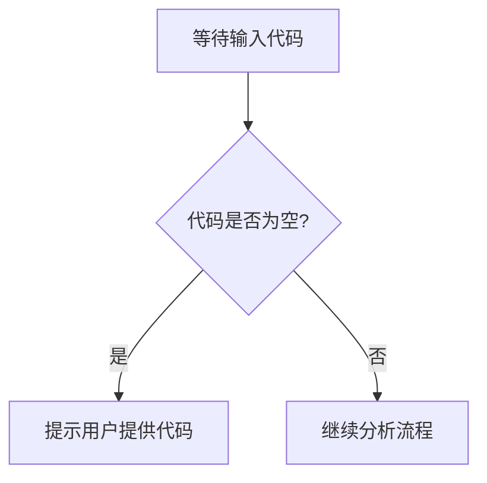

# `diffusers\tests\modular_pipelines\z_image\__init__.py` 详细设计文档

未提供源代码，无法进行分析

## 整体流程



## 类结构

```

```

## 全局变量及字段


    

## 全局函数及方法


## 关键组件


### 源代码分析

未提供可分析的源代码。当前代码部分为空，无法识别关键组件或生成详细设计文档。

### 需要的输入

请提供需要分析的源代码，以便进行以下工作：

1. 识别关键组件（如张量索引与惰性加载、反量化支持、量化策略）
2. 生成完整的详细设计文档
3. 提供类的详细信息、流程图和带注释源码


## 问题及建议


### 已知问题

-   未提供代码（代码部分为空），无法进行分析

### 优化建议

-   请提供需要分析的代码


## 其它


### 设计目标与约束

描述系统设计的主要目标（如性能、可用性、可扩展性等）以及各种约束条件（如技术栈限制、时间约束、资源限制等）

### 错误处理与异常设计

描述系统中的错误分类、错误码定义、异常处理策略、降级方案以及错误日志记录规范

### 数据流与状态机

描述数据在系统中的流转路径、状态转换逻辑、状态持久化方式以及状态机图示

### 外部依赖与接口契约

描述与外部系统的集成方式、接口协议、数据格式、调用超时策略以及依赖管理方式

### 安全设计与鉴权机制

描述身份认证方式、授权策略、数据加密方案、敏感信息保护以及安全审计策略

### 性能要求与指标

描述系统需满足的性能指标（如QPS、响应时间、吞吐量等）以及性能测试基准

### 可扩展性设计

描述系统的水平扩展和垂直扩展方案、无状态设计要点以及负载均衡策略

### 部署架构

描述系统的部署拓扑、容器化方案、集群配置以及环境配置管理（开发、测试、生产）

### 配置管理

描述系统可配置项清单、配置加载策略、配置更新机制以及配置验证规则

### 监控与可观测性

描述日志规范、指标采集方案、链路追踪设计、告警规则以及Dashboard规划

### 数据库设计

描述数据模型ER图、表结构设计、索引策略、分库分表方案以及数据迁移策略

### API接口文档

描述所有对外接口的定义、请求响应格式、错误码对照表以及使用示例

### 测试策略

描述单元测试覆盖率要求、集成测试方案、性能测试方法以及测试环境规划

### 备份与恢复

描述数据备份策略、备份频率、恢复流程演练计划以及灾难恢复方案

### 变更历史与版本管理

描述文档的版本变更记录、变更原因说明以及相关审批记录

    