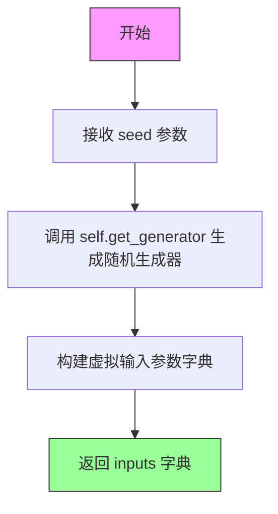

# `diffusers\tests\modular_pipelines\z_image\test_modular_pipeline_z_image.py` 详细设计文档

这是一个用于测试ZImage模块化管道（ZImageModularPipeline）的测试类，包含了text2image和image2image两种工作流程的测试配置，通过继承ModularPipelineTesterMixin提供统一的测试基础设施，用于验证管道推理的正确性和批量处理的一致性。

## 整体流程

```mermaid
graph TD
    A[开始测试] --> B[加载ZImageModularPipeline]
B --> C{测试类型}
C --> D[text2image工作流]
C --> E[image2image工作流]
D --> F[执行ZIMAGE_WORKFLOWS['text2image']步骤]
E --> G[执行ZIMAGE_WORKFLOWS['image2image']步骤]
F --> H[调用get_dummy_inputs获取测试数据]
G --> H
H --> I[执行test_inference_batch_single_identical]
I --> J[验证推理结果一致性]
J --> K[结束测试]
```

## 类结构

```
ModularPipelineTesterMixin (测试基类)
└── TestZImageModularPipelineFast (具体测试类)
    ├── ZImageAutoBlocks (管道块配置)
    └── ZImageModularPipeline (被测管道类)
```

## 全局变量及字段


### `ZIMAGE_WORKFLOWS`
    
工作流配置字典，包含text2image和image2image两种流程的步骤映射

类型：`Dict[str, List[Tuple[str, str]]]`
    


### `TestZImageModularPipelineFast.pipeline_class`
    
被测试的管道类

类型：`Type[ZImageModularPipeline]`
    


### `TestZImageModularPipelineFast.pipeline_blocks_class`
    
管道块配置类

类型：`Type[ZImageAutoBlocks]`
    


### `TestZImageModularPipelineFast.pretrained_model_name_or_path`
    
预训练模型路径

类型：`str`
    


### `TestZImageModularPipelineFast.params`
    
管道参数集合

类型：`FrozenSet[str]`
    


### `TestZImageModularPipelineFast.batch_params`
    
批量参数集合

类型：`FrozenSet[str]`
    


### `TestZImageModularPipelineFast.expected_workflow_blocks`
    
预期工作流块配置

类型：`Dict[str, List[Tuple[str, str]]]`
    
    

## 全局函数及方法


### `TestZImageModularPipelineFast.get_dummy_inputs`

获取虚拟输入数据，用于测试 ZImage 模块化管道的推理流程。

参数：

- `seed`：`int`，随机种子，用于生成器初始化，默认值为 0

返回值：`dict`，包含测试所需的虚拟输入参数字典，包括 prompt、generator、num_inference_steps、height、width、max_sequence_length 和 output_type。

#### 流程图



#### 带注释源码

```python
def get_dummy_inputs(self, seed=0):
    """
    生成用于测试的虚拟输入数据。
    
    参数:
        seed: int, 随机种子, 默认值为 0
        
    返回:
        dict: 包含以下键的字典:
            - prompt: str, 输入提示词
            - generator: torch.Generator, 随机生成器对象
            - num_inference_steps: int, 推理步数
            - height: int, 生成图像高度
            - width: int, 生成图像宽度
            - max_sequence_length: int, 最大序列长度
            - output_type: str, 输出类型
    """
    # 使用 seed 创建随机生成器，确保测试结果可复现
    generator = self.get_generator(seed)
    
    # 构建包含所有测试参数的字典
    inputs = {
        "prompt": "A painting of a squirrel eating a burger",  # 测试用提示词
        "generator": generator,                                  # PyTorch 随机生成器
        "num_inference_steps": 2,                                # 推理步数（快速测试用）
        "height": 32,                                            # 图像高度（像素）
        "width": 32,                                             # 图像宽度（像素）
        "max_sequence_length": 16,                               # 文本编码器最大序列长度
        "output_type": "pt",                                     # 输出类型为 PyTorch 张量
    }
    
    # 返回完整的输入参数字典，供测试调用管道使用
    return inputs
```


### `TestZImageModularPipelineFast.test_inference_batch_single_identical`

该方法用于测试 ZImageModularPipeline 的批量推理（batch inference）与单次推理（single inference）结果的一致性，确保模型在处理批量输入时与逐个处理输入时产生相同的输出结果。

参数：

- `self`：隐式参数，TestZImageModularPipelineFast 实例本身

返回值：`None`，该方法继承自父类，执行测试验证，不返回具体数值

#### 流程图

```mermaid
flowchart TD
    A[开始 test_inference_batch_single_identical] --> B[调用父类方法 super().test_inference_batch_single_identical]
    B --> C[传入参数 expected_max_diff=5e-3]
    C --> D{执行批量与单次推理一致性验证}
    D -->|通过| E[测试通过]
    D -->|失败| F[抛出断言错误]
    E --> G[结束]
    F --> G
```

#### 带注释源码

```python
def test_inference_batch_single_identical(self):
    """
    测试批量推理与单次推理的一致性
    
    该方法继承自 ModularPipelineTesterMixin 父类，用于验证：
    1. 批量推理（一次处理多个输入）与单次推理（逐个处理多个输入）
       产生的输出结果应该一致
    2. 允许的最大差异阈值为 5e-3（0.005）
    
    测试原理：
    - 首先获取一组测试输入（通过 get_dummy_inputs 方法）
    - 将单个输入复制多次形成批量输入
    - 分别执行单次推理和批量推理
    - 比较两种推理方式的输出差异是否在允许范围内
    """
    # 调用父类（ModularPipelineTesterMixin）的同名方法
    # 传入 expected_max_diff=5e-3 参数
    # 表示批量推理与单次推理输出的最大允许差异
    super().test_inference_batch_single_identical(expected_max_diff=5e-3)
```

## 关键组件


### ZImageModularPipeline

模块化管道类，用于实现text2image和image2image的扩散模型推理流程，支持多种步骤的灵活组合。

### ZImageAutoBlocks

自动块类，与ZImageModularPipeline配合使用，定义了管道的各个处理阶段和组件。

### ZIMAGE_WORKFLOWS

工作流配置字典，定义了text2image和image2image两种模式的具体步骤流程，包括文本编码、潜在向量准备、去噪、VAE解码等环节。

### TestZImageModularPipelineFast

测试类，继承自ModularPipelineTesterMixin，用于验证ZImageModularPipeline管道的正确性，包括批次推理测试等功能。

### text2image工作流组件

包含6个步骤：文本编码(ZImageTextEncoderStep)、文本输入(ZImageTextInputStep)、潜在向量准备(ZImagePrepareLatentsStep)、时间步设置(ZImageSetTimestepsStep)、去噪(ZImageDenoiseStep)、VAE解码(ZImageVaeDecoderStep)。

### image2image工作流组件

包含10个步骤：在text2image基础上增加了VAE图像编码(ZImageVaeImageEncoderStep)、额外输入(ZImageAdditionalInputsStep)、带强度的 timesteps 设置(ZImageSetTimestepsWithStrengthStep)、带图像的潜在向量准备(ZImagePrepareLatentswithImageStep)。

### ModularPipelineTesterMixin

测试混入类，提供通用的管道测试方法，包括推理批次一致性验证等测试功能。


## 问题及建议


### 已知问题

-   **硬编码的模型路径**: `pretrained_model_name_or_path` 使用硬编码的测试模型路径 `"hf-internal-testing/tiny-zimage-modular-pipe"`，在不同环境可能不可用
-   **魔法数字和硬编码参数**: `num_inference_steps=2`、`height=32`、`width=32`、`max_sequence_length=16`、`expected_max_diff=5e-3` 等参数硬编码在代码中，缺乏可配置性
-   **文档缺失**: 类和方法缺少文档字符串（docstring），影响代码可读性和可维护性
-   **参数定义不够灵活**: `params` 和 `batch_params` 使用 frozenset 定义，但未包含所有可能的参数（如 `negative_prompt`、`guidance_scale` 等常见参数）
-   **工作流配置重复**: `ZIMAGE_WORKFLOWS` 中 text2image 和 image2image 有重复的步骤定义（如 text_encoder、denoise.* 步骤），可考虑提取公共部分
-   **测试覆盖不足**: 只有一个测试方法 `test_inference_batch_single_identical`，缺少其他关键场景的测试（如 text2image 完整流程、image2image 流程、错误处理等）
-   **对父类强依赖**: 直接调用 `super().test_inference_batch_single_identical()`，父类实现变化会影响此测试

### 优化建议

-   将模型路径改为从环境变量或配置文件读取，提高环境适应性
-   将硬编码的测试参数提取为类常量或配置字典，便于维护和调整
-   为类和关键方法添加文档字符串，说明功能、参数和返回值
-   扩展 `params` 和 `batch_params` 以覆盖更多常用参数，或考虑从 pipeline_class 自动推断
-   抽取工作流中的公共步骤，使用组合或继承方式减少重复定义
-   增加更多测试方法覆盖不同场景：text2image 完整测试、image2image 完整测试、参数验证测试、错误输入测试等
-   考虑添加 setup_class 或 pytest fixture 来管理模型加载和缓存
-   为 `get_dummy_inputs` 添加参数校验和默认值处理逻辑


## 其它


### 设计目标与约束

本测试文件旨在验证 `ZImageModularPipeline` 在不同工作流（text2image 和 image2image）下的功能正确性。测试继承自 `ModularPipelineTesterMixin`，确保管道在批处理推理时输出与单样本推理一致的结果。约束条件包括：使用 `hf-internal-testing/tiny-zimage-modular-pipe` 作为预训练模型，仅支持 `prompt`、`height`、`width` 作为主要参数，`batch_params` 仅包含 `prompt`。

### 错误处理与异常设计

测试代码主要依赖父类 `ModularPipelineTesterMixin` 的 `test_inference_batch_single_identical` 方法进行错误检测。当批处理推理结果与单样本推理结果的差异超过 `expected_max_diff=5e-3` 时，测试将失败。此外，`get_dummy_inputs` 方法通过 `seed` 参数确保输入的可重复性，避免因随机数导致的非确定性错误。

### 数据流与状态机

测试数据流为：构造 `get_dummy_inputs` → 调用管道推理 → 验证输出一致性。工作流由 `ZIMAGE_WORKFLOWS` 定义，text2image 包含 6 个步骤块，image2image 包含 10 个步骤块。测试不直接管理状态机，但通过 `pipeline_blocks_class` 间接验证块的执行顺序。

### 外部依赖与接口契约

主要依赖包括：`diffusers.modular_pipelines` 中的 `ZImageAutoBlocks` 和 `ZImageModularPipeline`；`..test_modular_pipelines_common` 中的 `ModularPipelineTesterMixin`。接口契约要求 `pipeline_class` 必须实现对应的模块化方法（如 `text_encoder`、`denoise`、`decode` 等），且 `expected_workflow_blocks` 必须与实际管道的工作流定义匹配。

### 测试覆盖范围与边界条件

当前测试覆盖了两种工作流的基本推理流程，边界条件包括：最小图像尺寸（height=32, width=32）、最少推理步数（num_inference_steps=2）、最短提示词（"A painting of a squirrel eating a burger"）。未覆盖的边界条件包括：空提示词、超长提示词（超过 max_sequence_length=16）、多批次推理、混合工作流推理等。

### 性能基准与资源需求

测试使用 "tiny" 级别的模型（hf-internal-testing/tiny-zimage-modular-pipe），资源需求较低。由于推理步数仅为 2，测试执行速度较快。性能基准主要关注推理结果一致性（expected_max_diff=5e-3），未包含吞吐量、延迟等性能指标测试。

### 配置与参数说明

关键配置参数包括：`params`（必填参数集：prompt、height、width）、`batch_params`（支持批处理的参数集：prompt）、`expected_workflow_blocks`（预期工作流块映射）、`expected_max_diff`（推理一致性阈值，设为 5e-3）、`seed`（随机种子，默认 0，确保可重复性）。

    