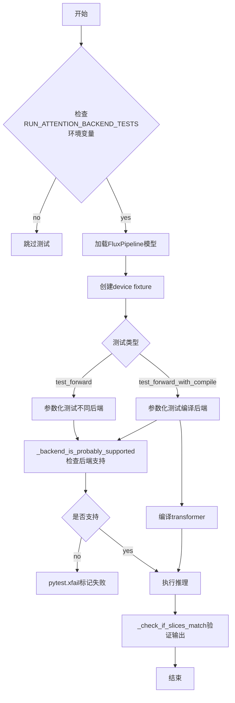
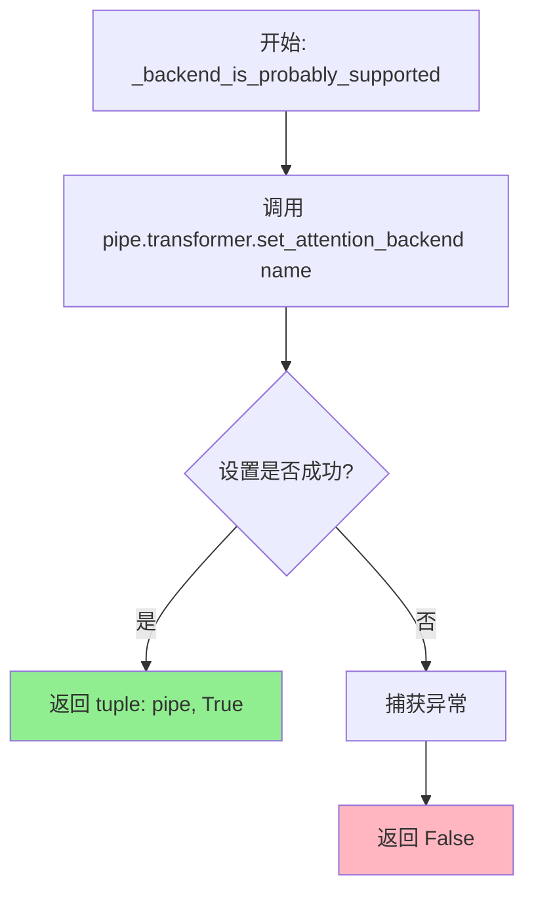
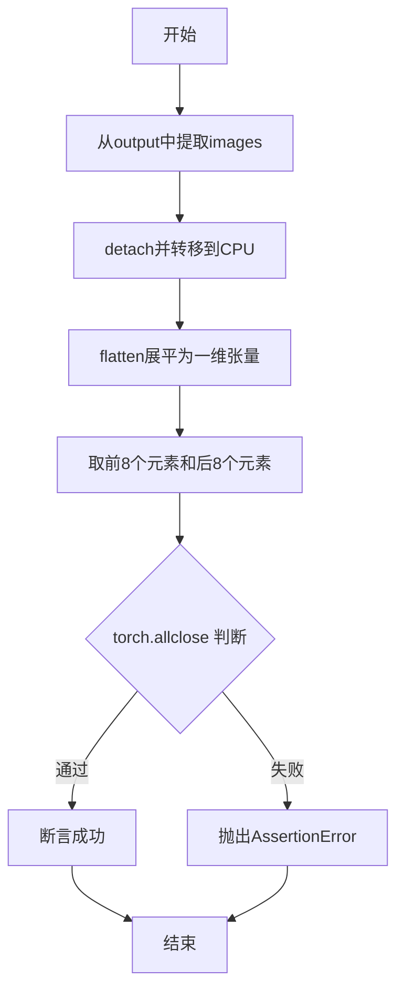
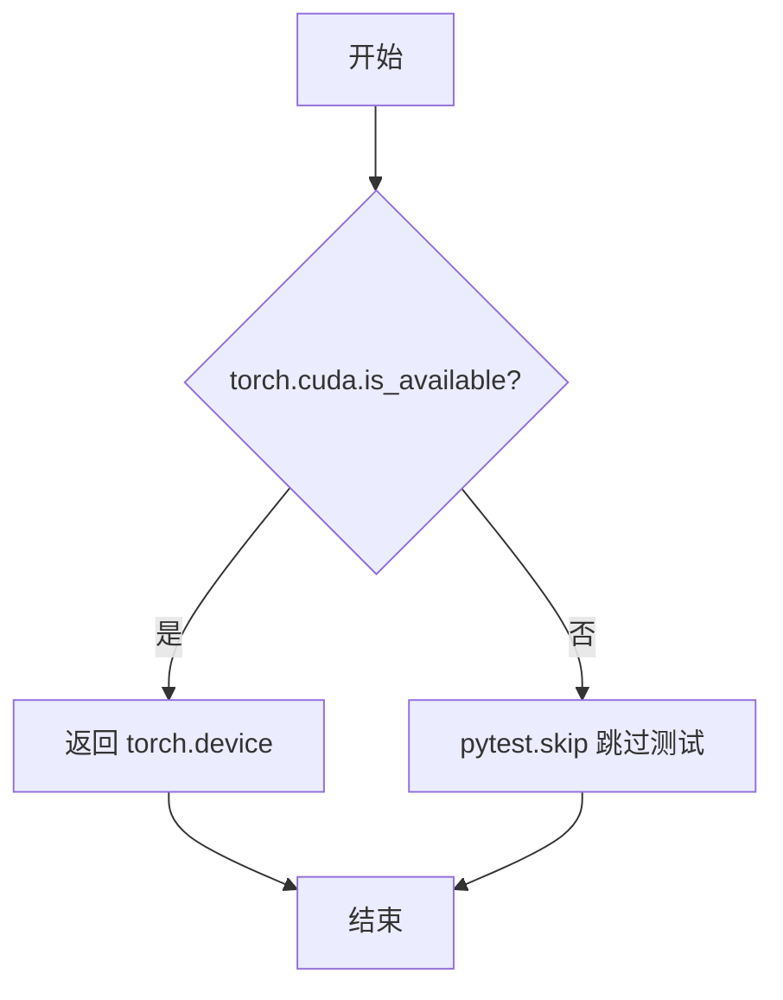
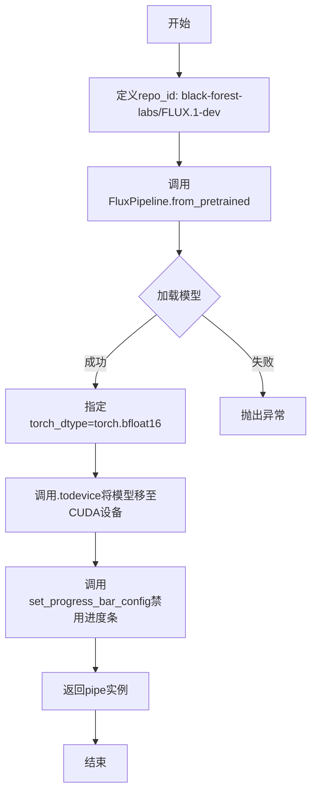
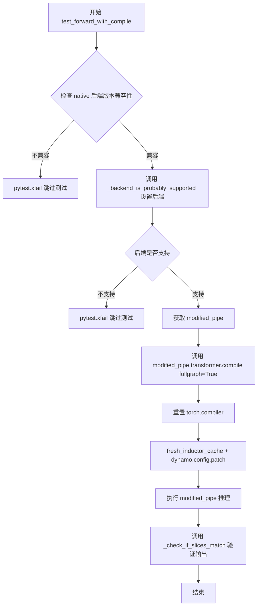

# `diffusers\tests\others\test_attention_backends.py` 详细设计文档

这是一个pytest测试套件，用于验证diffusers库中FluxPipeline的不同注意力后端（flash_hub、_flash_3_hub、native、_native_cudnn、aiter）的前向传播和torch.compile编译功能，通过比较生成图像的slice值来确保各后端输出的一致性和正确性。

## 整体流程



## 类结构

```
测试模块 (无类)
├── Fixtures
│   ├── device (session级CUDA设备)
│   └── pipe (session级FluxPipeline实例)
├── 测试函数
│   ├── test_forward (前向传播测试)
│   └── test_forward_with_compile (编译后前向测试)
└── 辅助函数
    ├── _backend_is_probably_supported
    └── _check_if_slices_match
```

## 全局变量及字段


### `FORWARD_CASES`
    
存储前向传播测试用例的列表，每个元素包含后端名称和期望的输出张量切片

类型：`List[Tuple[str, torch.Tensor]]`
    


### `COMPILE_CASES`
    
存储编译测试用例的列表，每个元素包含后端名称、期望输出切片和是否在重新编译时报错的标志

类型：`List[Tuple[str, torch.Tensor, bool]]`
    


### `INFER_KW`
    
包含FluxPipeline推理所需的关键参数字典，如提示词、图像尺寸、推理步数等

类型：`Dict[str, Any]`
    


### `pytestmark`
    
pytest条件跳过标记，当环境变量RUN_ATTENTION_BACKEND_TESTS不为yes时跳过整个测试文件

类型：`pytest.mark.skipif`
    


### `repo_id`
    
HuggingFace模型仓库标识符，用于加载FLUX.1-dev预训练模型

类型：`str`
    


    

## 全局函数及方法


### `_backend_is_probably_supported`

该函数用于检测给定的注意力后端（attention backend）是否在当前环境中受支持。它通过尝试在管道转换器上设置指定的后端来验证兼容性，如果成功则返回带有 True 标志的管道对象，否则返回 False。

参数：

- `pipe`：`FluxPipeline`，需要设置注意力后端的 Diffusers 管道实例
- `name`：`str`，要测试的注意力后端名称（如 "flash_hub"、"native"、"aiter" 等）

返回值：`tuple[FluxPipeline, bool] | bool`，如果后端受支持返回包含管道对象和 True 的元组，否则返回 False

#### 流程图



#### 带注释源码

```python
def _backend_is_probably_supported(pipe, name: str):
    """
    检测给定的注意力后端是否在当前环境中受支持。
    
    该函数通过尝试在管道的 transformer 上设置指定的后端来验证兼容性。
    这是一种探测式检查，如果后端不支持会抛出异常。
    
    Args:
        pipe: FluxPipeline 实例，需要具备 set_attention_backend 方法的 transformer
        name: 要测试的注意力后端名称字符串
        
    Returns:
        tuple: (pipe, True) - 如果后端成功设置
        bool: False - 如果设置失败（后端不支持）
    """
    try:
        # 尝试在管道的 transformer 上设置指定的注意力后端
        pipe.transformer.set_attention_backend(name)
        # 如果设置成功，返回管道对象和 True 标志
        return pipe, True
    except Exception:
        # 如果发生任何异常（后端不支持、环境不兼容等），返回 False
        return False
```

#### 关键组件信息

| 组件 | 描述 |
|------|------|
| `pipe.transformer.set_attention_backend()` | Diffusers 库中 Transformer 模型的方法，用于动态切换注意力计算后端 |
| `FluxPipeline` | Black Forest Labs 的 FLUX.1-dev 扩散模型管道 |
| 注意力后端 | 可选的实现方式包括：flash_hub、_flash_3_hub、native、_native_cudnn、aiter 等 |

#### 潜在的技术债务或优化空间

1. **异常捕获过于宽泛**：使用 `except Exception` 捕获所有异常，这可能隐藏真正的编程错误（如参数类型错误）。建议根据具体异常类型进行区分处理。

2. **返回值类型不一致**：成功时返回元组 `（pipe, True）`，失败时返回布尔值 `False`，这种不一致的返回值类型会增加调用方的处理复杂度。

3. **缺少详细的错误信息**：失败时仅返回 `False`，没有提供失败原因的详细信息，不利于调试和问题诊断。

4. **函数命名不够精确**：名称中使用 "probably"（可能）表明其不确定性，这种模糊的语义在生产代码中应避免。

#### 其它项目

**错误处理与异常设计**：
- 当前实现采用"静默失败"模式，吞掉所有异常并返回布尔值
- 建议记录具体错误日志或提供更丰富的错误上下文
- 对于不同的异常类型（如 `NotImplementedError`、`RuntimeError`）应区别对待

**使用场景**：
- 在 `test_forward` 和 `test_forward_with_compile` 测试函数中被调用
- 用于在运行测试前筛选出当前环境不支持的后端
- 支持 pytest 的 `xfail` 机制来处理预期失败

**设计约束**：
- 这是一个测试辅助函数，主要用于维护阶段的兼容性检查
- 函数设计考虑了跨不同硬件环境（H100、MI355X）的可移植性测试


### `_check_if_slices_match`

该函数用于验证 FluxPipeline 生成的图像切片与预期切片是否匹配，通过提取输出图像的首尾各 8 个元素并与期望值进行近似相等断言。

参数：

- `output`：`PipelineOutput`（或类似对象），管道输出对象，包含生成的图像
- `expected_slice`：`torch.Tensor`，期望的图像切片值，用于与实际生成的切片进行对比

返回值：`None`，该函数通过 `assert` 语句进行断言，不返回任何值

#### 流程图



#### 带注释源码

```python
def _check_if_slices_match(output, expected_slice):
    """
    检查管道输出的图像切片是否与预期切片匹配
    
    参数:
        output: 管道输出对象,包含.images属性
        expected_slice: torch.Tensor,预期的图像切片值
    """
    # 从输出对象中获取图像,并分离计算图后转到CPU
    img = output.images.detach().cpu()
    
    # 将图像展平为一维张量
    generated_slice = img.flatten()
    
    # 提取展平后张量的前8个和后8个元素,构成切片
    generated_slice = torch.cat([generated_slice[:8], generated_slice[-8:]])
    
    # 断言生成的切片与预期切片在指定容差内近似相等
    assert torch.allclose(generated_slice, expected_slice, atol=1e-4)
```


### `device` (pytest fixture)

这是一个 pytest session 级别的 fixture，用于获取 CUDA 设备实例。如果系统没有可用的 CUDA 设备，则跳过相关测试。

参数：

- 该 fixture 无显式参数（隐式依赖 pytest 框架）

返回值：`torch.device`，返回 CUDA 设备对象（cuda:0），如果 CUDA 不可用则跳过测试

#### 流程图



#### 带注释源码

```python
@pytest.fixture(scope="session")
def device():
    """
    Session级别的fixture，提供CUDA设备对象供测试使用。
    
    检查流程：
    1. 检查CUDA是否可用
    2. 若可用，返回cuda:0设备
    3. 若不可用，跳过整个测试会话
    """
    # 检查CUDA是否可用（PyTorch是否能访问GPU）
    if not torch.cuda.is_available():
        # 若无GPU，则跳过这些需要GPU的测试
        pytest.skip("CUDA is required for these tests.")
    
    # 返回CUDA设备对象，指定使用第一个GPU
    return torch.device("cuda:0")
```

#### 详细说明

| 属性 | 值 |
|------|-----|
| **Scope** | `session` - 整个测试会话只创建一次 |
| **类型** | pytest fixture |
| **依赖** | `torch` 库 |
| **错误处理** | 使用 `pytest.skip()` 跳过测试而非抛出异常 |
| **使用场景** | 为 `pipe` fixture 和其他测试函数提供设备参数 |


### `pipe` (fixture)

这是一个pytest会话级fixture，用于创建并配置FLUX.1-dev模型的推理管道实例，供后续测试使用。

参数：

- `device`：`torch.device`，CUDA设备对象，由device fixture提供

返回值：`FluxPipeline`，配置完成的FluxPipeline实例，可用于图像生成推理

#### 流程图



#### 带注释源码

```python
@pytest.fixture(scope="session")
def pipe(device):
    """
    会话级fixture，创建并配置FluxPipeline实例
    
    Args:
        device: torch.device，CUDA设备对象
        
    Returns:
        FluxPipeline: 配置完成的FluxPipeline实例
    """
    # 定义HuggingFace模型仓库ID
    repo_id = "black-forest-labs/FLUX.1-dev"
    
    # 从预训练模型加载FluxPipeline，指定bfloat16精度以节省显存
    pipe = FluxPipeline.from_pretrained(repo_id, torch_dtype=torch.bfloat16)
    
    # 将pipeline移至指定CUDA设备
    pipe = pipe.to(device)
    
    # 禁用进度条输出，保持测试日志整洁
    pipe.set_progress_bar_config(disable=True)
    
    # 返回配置完成的pipeline供测试使用
    return pipe
```


### `test_forward`

这是一个 PyTorch 测试函数，用于验证不同注意力后端（flash_hub、native、aiter 等）在 FluxPipeline 推理中的正确性，通过比较模型输出的图像切片与预期值来确保各后端的数值一致性。

参数：

- `pipe`：`FluxPipeline`，从会话级 fixture 注入的 Flux 推理管道实例，用于执行模型前向传播
- `backend_name`：`str`，注意力后端名称，来自 `FORWARD_CASES` 参数化列表（如 "flash_hub"、"native"、"aiter" 等），指定要测试的后端类型
- `expected_slice`：`torch.Tensor`，期望的输出图像切片（bfloat16 类型），作为基准参考值用于验证推理结果的数值精度

返回值：无（`None`），该函数为 pytest 测试函数，通过内部 `_check_if_slices_match` 断言验证输出正确性，若后端不支持则调用 `pytest.xfail` 跳过测试

#### 流程图

```mermaid
flowchart TD
    A[开始 test_forward] --> B{检查后端是否支持}
    B --> C[_backend_is_proba...]
    C --> D{后端是否支持?}
    D -->|不支持| E[pytest.xfail 跳过测试]
    D -->|支持| F[获取 modified_pipe]
    F --> G[执行推理 modified_pipe<br/>**INFER_KW generator=manual_seed(0)]
    G --> H[调用 _check_if_slices_match<br/>验证输出与 expected_slice]
    H --> I[结束/断言通过]
```

#### 带注释源码

```python
@pytest.mark.parametrize("backend_name,expected_slice", FORWARD_CASES, ids=[c[0] for c in FORWARD_CASES])
def test_forward(pipe, backend_name, expected_slice):
    """
    测试不同注意力后端的前向传播是否产生正确的输出。
    
    Args:
        pipe: FluxPipeline 实例，已加载到 CUDA 设备
        backend_name: 注意力后端名称 (如 "flash_hub", "native", "aiter")
        expected_slice: 期望的输出图像张量切片，用于数值验证
    
    Returns:
        None (通过断言验证，无返回值)
    """
    # 尝试将管道设置为指定的后端
    out = _backend_is_probably_supported(pipe, backend_name)
    
    # 如果返回布尔值 False，表示后端不支持，跳过该测试
    if isinstance(out, bool):
        pytest.xfail(f"Backend '{backend_name}' not supported in this environment.")

    # 获取修改后的管道（已设置后端）
    modified_pipe = out[0]
    
    # 使用指定后端执行推理，使用固定随机种子确保可复现性
    out = modified_pipe(**INFER_KW, generator=torch.manual_seed(0))
    
    # 验证输出图像切片与预期值匹配（容差 1e-4）
    _check_if_slices_match(out, expected_slice)
```


### `test_forward_with_compile`

该函数是一个 pytest 参数化测试函数，用于验证 FluxPipeline 在使用 `torch.compile` 编译后，不同注意力后端（flash_hub、native、aiter 等）的前向传播结果是否与预期值匹配，确保编译优化后的数值精度在可接受范围内。

**参数：**

- `pipe`：`FluxPipeline`（通过 pytest fixture 传入），预加载的 FLUX.1-dev 模型管道，已移至 CUDA 设备
- `backend_name`：`str`，注意力后端名称，用于设置 `pipe.transformer.set_attention_backend()`
- `expected_slice`：`torch.Tensor`，期望的图像输出切片，用于验证数值精度
- `error_on_recompile`：`bool`，是否在重新编译时抛出错误（用于控制 torch.dynamo 行为）

**返回值：** 无（该函数为测试函数，通过断言验证结果）

#### 流程图



#### 带注释源码

```python
@pytest.mark.parametrize(
    "backend_name,expected_slice,error_on_recompile",
    COMPILE_CASES,
    ids=[c[0] for c in COMPILE_CASES],
)
def test_forward_with_compile(pipe, backend_name, expected_slice, error_on_recompile):
    # 检查 native 后端是否需要更高版本的 PyTorch
    if "native" in backend_name and error_on_recompile and not is_torch_version(">=", "2.9.0"):
        pytest.xfail(f"Test with {backend_name=} is compatible with a higher version of torch.")

    # 尝试设置注意力后端，检查是否支持
    out = _backend_is_probably_supported(pipe, backend_name)
    
    # 如果返回值为 bool (False)，表示后端不支持，跳过测试
    if isinstance(out, bool):
        pytest.xfail(f"Backend '{backend_name}' not supported in this environment.")

    # 获取修改后的管道
    modified_pipe = out[0]
    
    # 使用 torch.compile 编译 transformer，fullgraph=True 强制完整图编译
    modified_pipe.transformer.compile(fullgraph=True)

    # 重置 torch.compiler 编译器状态
    torch.compiler.reset()
    
    # 使用 fresh_inductor_cache 和 dynamo.config.patch 上下文管理器
    # error_on_recompile 控制是否在重新编译时抛出错误
    with (
        torch._inductor.utils.fresh_inductor_cache(),  # 清除 Inductor 缓存
        torch._dynamo.config.patch(error_on_recompile=error_on_recompile),  # 动态配置 dynamo
    ):
        # 执行推理，使用固定随机种子确保可复现性
        out = modified_pipe(**INFER_KW, generator=torch.manual_seed(0))

    # 验证输出图像切片是否与预期值匹配（容差 1e-4）
    _check_if_slices_match(out, expected_slice)
```

## 关键组件


### FluxPipeline

从diffusers库导入的FLUX.1-dev模型流水线，用于图像生成测试，支持设置不同的注意力后端。

### 注意力后端 (Attention Backends)

代码测试了5种不同的注意力后端实现：flash_hub（Flash Hub）、_flash_3_hub（Flash 3 Hub）、native（原生实现）、_native_cudnn（cuDNN原生）、aiter（异步迭代器后端），每种后端都有对应的期望输出张量切片用于验证正确性。

### 测试用例集 (FORWARD_CASES & COMPILE_CASES)

FORWARD_CASES存储了5种后端的前向传播测试参数，每个包含后端名称和期望的bfloat16类型输出切片；COMPILE_CASES存储了带编译选项的测试参数，额外包含error_on_recompile布尔标志用于控制torch.compiler的重新编译行为。

### 推理配置字典 (INFER_KW)

定义了固定的图像生成参数：prompt为"dance doggo dance"、高度宽度256x256、2步推理、guidance_scale 3.5、最大序列长度128、输出类型为PyTorch张量，用于确保测试的可重复性。

### 辅助函数 _backend_is_proparently_supported

尝试为管道设置指定的注意力后端，如果成功返回(pipe, True)，失败则返回False，用于检测当前环境是否支持特定后端。

### 辅助函数 _check_if_slices_match

从输出图像中提取前8个和后8个像素并展平，与期望切片进行torch.allclose比较（容差1e-4），用于验证生成结果的数值正确性。

### 测试函数 test_forward

参数化测试函数，遍历FORWARD_CASES中的每个后端，验证在该后端下的前向传播输出是否与期望切片匹配，若后端不支持则标记为xfail。

### 测试函数 test_forward_with_compile

参数化测试函数，遍历COMPILE_CASES，对管道transformer进行fullgraph=True的torch.compile编译，然后执行推理并验证输出，针对torch 2.9.0以下版本的native后端有特定的xfail处理。

### pytest fixture device

会话级别的CUDA设备fixture，检查CUDA可用性，不可用时跳过测试，返回cuda:0设备。

### pytest fixture pipe

会话级别的FluxPipeline fixture，从black-forest-labs/FLUX.1-dev加载模型到指定设备，设置torch_dtype为bfloat16，并禁用进度条返回管道实例。


## 问题及建议


### 已知问题

-   **环境依赖性强**：测试依赖特定硬件（H100、MI355X）、PyTorch版本（2.8.0、2.9.0+）、CUDA版本（12.9）和aiter版本，跨环境移植困难
-   **内部API调用**：使用了`torch._inductor`和`torch._dynamo`的私有API（如`fresh_inductor_cache()`、`config.patch()`），存在版本兼容性和稳定性风险
-   **硬编码的测试数据**：FORWARD_CASES和COMPILE_CASES中的张量值、INFER_KW参数、repo_id均为硬编码，缺乏灵活性
-   **测试隔离不足**：使用session级别的pipe fixture，且`set_attention_backend`会修改pipe状态，可能导致测试间相互影响
-   **异常处理过于宽泛**：`_backend_is_probably_supported`函数捕获所有异常并返回False，可能隐藏真正的错误信息
-   **魔法数字和字符串**：阈值1e-4、后端名称（如"native"、"flash_hub"）散落多处，无统一常量定义
-   **导入顺序问题**：导入语句在skipif之后，但FluxPipeline的导入在条件跳过块之后，可能导致不必要的模块加载
-   **资源管理缺失**：测试未考虑GPU内存释放和缓存清理，大型模型加载后可能造成资源泄漏

### 优化建议

-   将后端名称、阈值、默认参数等提取为配置文件或常量类，提高可维护性
-   改用pytest fixture的function级别或实现测试间的状态重置逻辑，确保测试隔离
-   使用更稳定的公共API替代私有API，或添加版本检查和回退逻辑
-   将环境变量检查、模型路径等提取为可配置的fixture，减少硬编码
-   改进异常处理，为不同类型的错误提供更具体的处理方式，避免隐藏真实问题
-   考虑添加测试前后的资源清理逻辑，如GPU内存释放和缓存清理
-   将条件跳过逻辑提前，确保不必要的模块不被加载，提高测试启动速度

## 其它


### 设计目标与约束

本测试套件的核心设计目标是为FluxPipeline的不同注意力后端实现提供回归测试和正确性验证。约束条件包括：1）仅在CUDA环境下运行；2）依赖特定的PyTorch版本（2.8.0+用于常规测试，2.9.0+用于native后端的编译测试）；3）需要设置环境变量RUN_ATTENTION_BACKEND_TESTS=yes才能激活测试；4）测试基于特定的硬件配置（H100 GPU、MI355X）。

### 错误处理与异常设计

测试中采用多种错误处理机制：1）使用pytest.mark.skipif在CUDA不可用时跳过整个测试套件；2）使用pytest.xfail标记预期失败的后端测试；3）在_backend_is_proba_by_supported函数中捕获异常并返回False；4）使用torch.allclose进行浮点数近似比较（atol=1e-4）。

### 数据流与状态机

测试数据流：环境变量检查 → CUDA设备检查 → FluxPipeline加载 → 设置注意力后端 → 执行推理 → 输出验证。后端状态转换：uninitialized → set_attention_backend() → compiled（可选）→ inference。

### 外部依赖与接口契约

主要外部依赖包括：1）diffusers库的FluxPipeline；2）PyTorch 2.8.0+（编译测试需要2.9.0+）；3）CUDA 12.9；4）特定后端库（flash-attn、aiter）。接口契约：_backend_is_proba_by_supported(pipe, name)返回(pipe, True)或False；_check_if_slices_match(output, expected_slice)执行断言。

### 性能基准与测试环境

测试在两种硬件环境下进行：H100 GPU（PyTorch 2.8.0, CUDA 12.9）用于flash和native后端测试；MI355X（torch 2025-09-25 nightly）用于aiter后端测试。每个后端提供16维的bfloat16类型期望slice值，用于验证输出正确性。

### 配置管理

测试配置通过以下方式管理：1）环境变量RUN_ATTENTION_BACKEND_TESTS控制测试是否执行；2）INFER_KW字典集中管理推理参数（prompt、height、width、num_inference_steps等）；3）FORWARD_CASES和COMPILE_CASES元组存储测试用例数据；4）使用pytest参数化实现多后端测试。

### 资源管理与生命周期

资源管理：1）pytest fixture管理device和pipe的生命周期（session级别）；2）torch._inductor.utils.fresh_inductor_cache()和torch._dynamo.config.patch()用于管理编译缓存；3）torch.compiler.reset()重置编译状态；4）pipe使用后保留在显存中供多个测试共享。

### 兼容性考虑

版本兼容性：1）native后端编译测试要求PyTorch >= 2.9.0；2）不同后端在不同环境下的支持状态通过_backend_is_proba_by_supported动态检测；3）使用is_torch_version进行版本判断；4）测试slice值针对特定PyTorch版本和后端版本收集。

    