# `diffusers\tests\others\test_check_copies.py` 详细设计文档

这是一个单元测试文件，用于验证 diffusers 库中 check_copies 工具的正确性，确保代码复制一致性检查功能正常工作，包括查找代码、检查复制一致性、处理重命名和覆盖等场景。

## 整体流程

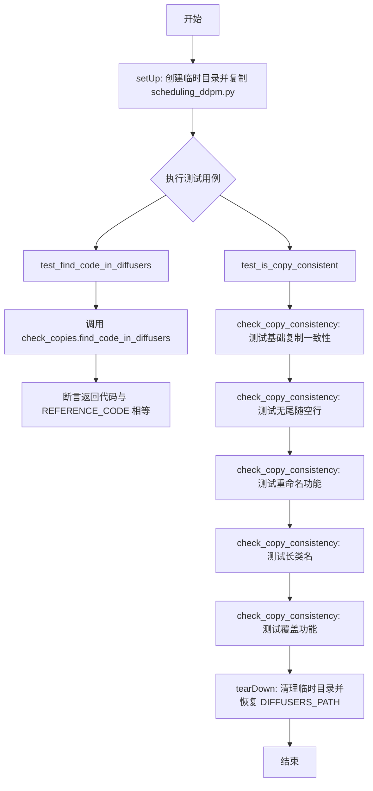

## 类结构

```
unittest.TestCase
└── CopyCheckTester
    ├── setUp()
    ├── tearDown()
    ├── check_copy_consistency()
    ├── test_find_code_in_diffusers()
    └── test_is_copy_consistent()
```

## 全局变量及字段


### `git_repo_path`
    
git仓库的根目录绝对路径

类型：`str`
    


### `REFERENCE_CODE`
    
用于测试的参考代码字符串，包含DDPMSchedulerOutput类的定义

类型：`str`
    


### `check_copies`
    
用于检查代码复制一致性的工具模块

类型：`module`
    


### `CopyCheckTester.diffusers_dir`
    
测试用的临时diffusers目录路径，用于模拟测试环境

类型：`str`
    
    

## 全局函数及方法


### `os.path.abspath`

该函数是 Python 标准库 `os.path` 模块中的路径处理函数，用于将相对路径或符号链接路径转换为绝对路径，并解析路径中的 `..` 和 `.` 等特殊组件，返回规范化的绝对路径字符串。

参数：

- `path`：`str` 或 `os.PathLike[str]`，需要转换为绝对路径的路径，可以是相对路径或包含符号链接的路径

返回值：`str`，返回参数的绝对路径字符串

#### 流程图

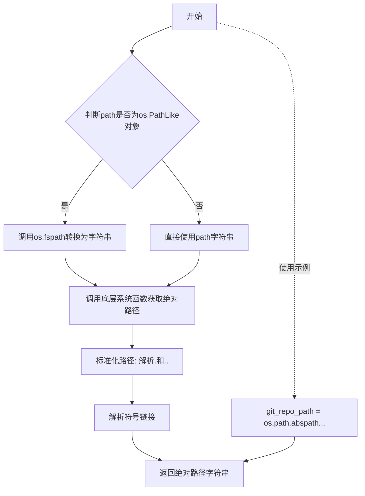

#### 带注释源码

```python
# os.path.abspath 源码解析（基于代码中的实际调用）
# 代码中的实际使用：
git_repo_path = os.path.abspath(os.path.dirname(os.path.dirname(os.path.dirname(__file__))))

# 函数调用链路解析：
# 1. __file__ = 当前文件路径（如 /path/to/project/tests/test_check_copies.py）
# 2. os.path.dirname(__file__) = 去掉文件名，得到目录（如 /path/to/project/tests/）
# 3. os.path.dirname(...) 第二次调用 = 向上一级（如 /path/to/project/）
# 4. os.path.dirname(...) 第三次调用 = 再向上一级（如 /path/to/）
# 5. os.path.abspath(...) = 将相对路径转换为绝对路径
#    例如：如果目录是相对路径 "./src"，abspath 会转换为完整路径 "/path/to/project/src"

# 简化理解：
# os.path.abspath(path) 接受一个路径参数
# 返回该路径的绝对路径形式
# 内部会调用 os.getcwd() 获取当前工作目录
# 然后与传入的 path 进行拼接和标准化处理

# 示例：
# >>> import os
# >>> os.path.abspath(".")
# '/current/working/directory'
# >>> os.path.abspath("../src")
# '/parent/directory/src'
# >>> os.path.abspath("/absolute/path")
# '/absolute/path'
```


### `os.path.dirname`

`os.path.dirname` 是 Python 标准库 `os.path` 模块中的一个函数，用于返回指定路径的目录部分（即去掉最后一级文件或目录名称后的路径）。

#### 参数

- `path`：字符串，表示文件或目录的路径

#### 返回值

- `str`，返回路径的目录部分

#### 流程图

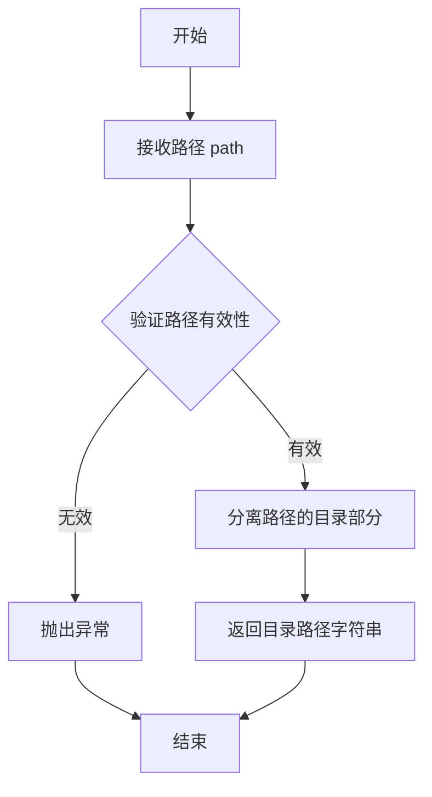

#### 带注释源码

```python
# os.path.dirname 使用示例（来自提供代码的第20行）
# 获取当前文件的根目录路径（向上追溯三层目录）
git_repo_path = os.path.abspath(
    os.path.dirname(                                  # 第一层：获取 __file__ 的父目录
        os.path.dirname(                              # 第二层：获取上一层结果的父目录
            os.path.dirname(__file__)                 # 第三层：获取当前文件所在目录
        )
    )
)

# 简化示例：
# 假设 __file__ = "/home/user/project/src/utils/test.py"
# os.path.dirname(__file__)              -> "/home/user/project/src/utils"
# os.path.dirname(os.path.dirname(__file__)) -> "/home/user/project/src"
# os.path.dirname(os.path.dirname(os.path.dirname(__file__))) -> "/home/user/project"
# os.path.abspath(...) -> "/home/user/project" (转换为绝对路径)
```

#### 说明

在提供的代码中，`os.path.dirname` 被用于动态计算项目根目录的绝对路径：

1. `__file__` - 当前测试文件的路径
2. 第一层 `dirname` - 去除文件名，获取文件所在目录
3. 第二层 `dirname` - 向上获取父目录（utils 目录）
4. 第三层 `dirname` - 再向上获取父目录（项目根目录）
5. `os.path.abspath` - 转换为绝对路径

这种模式常用于获取项目根目录，以便后续动态加载其他模块或资源文件。


### `os.path.join`

`os.path.join` 是 Python 标准库 `os.path` 模块中的函数，用于将多个路径组件智能地拼接成一个路径。在代码中主要用于构建文件和目录的完整路径。

参数：

- `*paths`：`任意多个 str`，表示要拼接的路径组件，可以接受任意数量的字符串参数

返回值：`str`，返回拼接后的路径字符串，会根据操作系统自动选择正确的路径分隔符（Linux/Mac 用 `/`，Windows 用 `\`）

#### 流程图

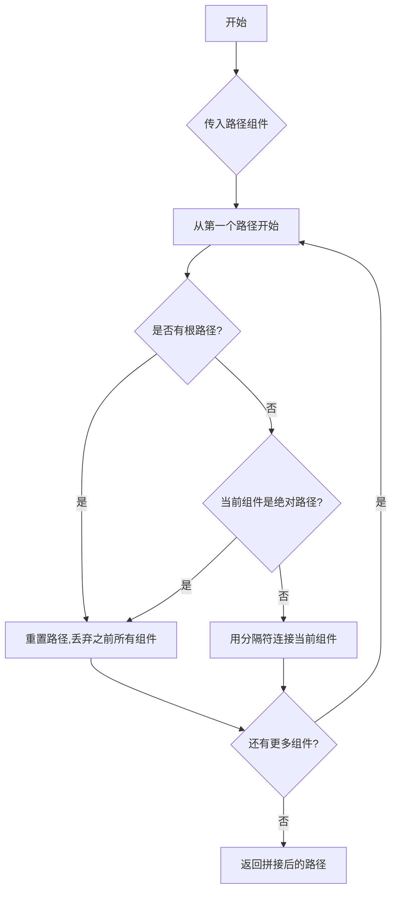

#### 带注释源码

```python
# 示例 1: 获取 utils 目录的绝对路径
# os.path.join(git_repo_path, "utils") 将 "utils" 拼接到 git_repo_path 后
git_repo_path = os.path.abspath(os.path.join(git_repo_path, "utils"))

# 示例 2: 创建 schedulers 目录路径
# 将 "schedulers/" 拼接到临时目录路径后面
os.makedirs(os.path.join(self.diffusers_dir, "schedulers/"))

# 示例 3: 构建源文件和目标文件的完整路径
# 用于复制 scheduling_ddpm.py 文件
shutil.copy(
    os.path.join(git_repo_path, "src/diffusers/schedulers/scheduling_ddpm.py"),  # 源文件路径
    os.path.join(self.diffusers_dir, "schedulers/scheduling_ddpm.py"),         # 目标文件路径
)

# 示例 4: 创建新代码文件路径
# 拼接临时目录和新文件名
fname = os.path.join(self.diffusers_dir, "new_code.py")
```

#### 关键特性说明

| 特性 | 说明 |
|------|------|
| 智能拼接 | 自动处理路径分隔符，不会产生重复的分隔符 |
| 跨平台 | 根据操作系统自动选择正确的路径分隔符 |
| 绝对路径处理 | 如果遇到绝对路径，会丢弃之前所有的相对路径组件 |
| 多平台兼容 | 确保代码在 Windows、Linux、Mac 等系统上都能正确运行 |


### `sys.path.append`

将指定的目录路径添加到 Python 的 `sys.path` 列表中，以便能够导入该目录下的模块。这是 Python 导入系统的核心机制，允许动态添加模块搜索路径。

参数：

- `element`：`str`，要添加的目录路径（此处为 `os.path.join(git_repo_path, "utils")` 的结果，即 `git_repo_path/utils` 目录的绝对路径）

返回值：`None`，该方法直接修改 `sys.path` 列表本身，不返回任何值

#### 流程图

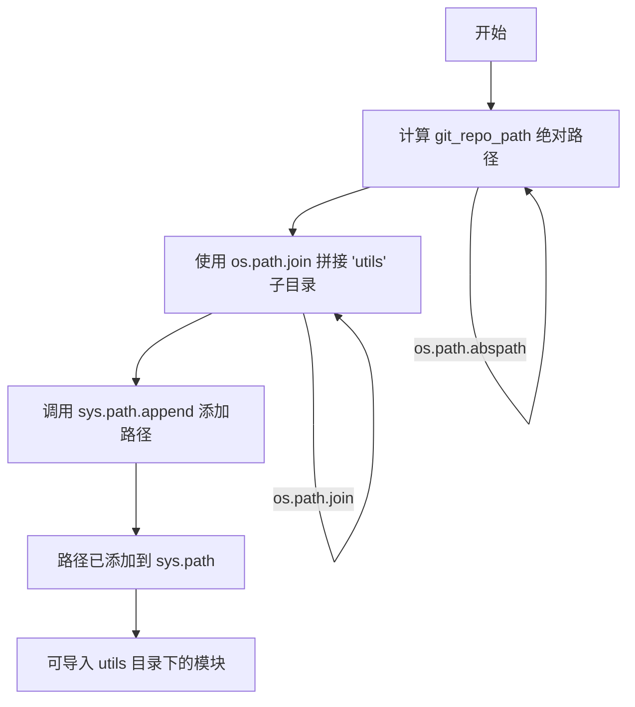

#### 带注释源码

```python
# 计算 git_repo_path：获取当前文件所在目录的父目录的父目录的父目录的绝对路径
# 即项目根目录（例如 /path/to/diffusers）
git_repo_path = os.path.abspath(os.path.dirname(os.path.dirname(os.path.dirname(__file__))))

# 将项目根目录下的 utils 子目录添加到 Python 模块搜索路径
# 这样可以导入 utils 目录下的模块（如 check_copies）
sys.path.append(os.path.join(git_repo_path, "utils"))

# 导入 check_copies 模块（位于 utils 目录中）
import check_copies  # noqa: E402
```

---

#### 补充说明

| 项目 | 说明 |
|------|------|
| **设计目标** | 动态添加项目内部的 `utils` 工具目录到 Python 导入路径，使其模块可被直接导入 |
| **约束条件** | 依赖于 `__file__` 的位置计算相对路径，需确保目录结构不变 |
| **错误处理** | 若路径不存在，Python 不会报错，仅在导入时报错 |
| **优化空间** | 建议使用 `pathlib.Path` 替代 `os.path` 以获得更现代的 API；可考虑使用 `importlib` 动态导入 |
| **外部依赖** | 标准库 `os`、`sys` 模块，无第三方依赖 |


### `tempfile.mkdtemp`

创建并返回一个唯一的临时目录。

参数：

- `suffix`： `str`，可选，目录名的后缀，默认为空字符串
- `prefix`： `str`，可选，目录名的前缀，默认为"tmp"
- `dir`： `str`，可选，指定临时目录的父目录，默认为系统默认临时目录

返回值： `str`，新创建的临时目录的绝对路径

#### 流程图

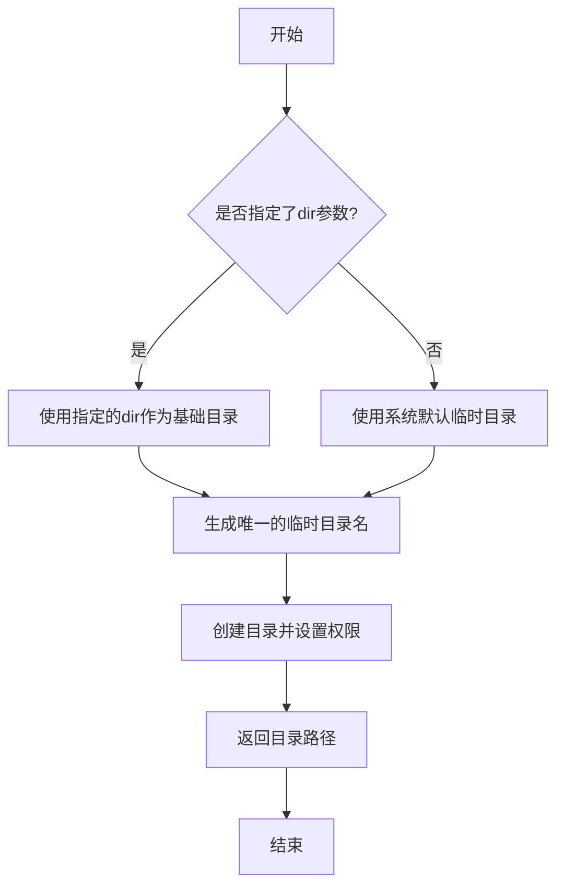

#### 带注释源码

```
# tempfile.mkdtemp 函数使用示例（来自代码中的实际调用）
self.diffusers_dir = tempfile.mkdtemp()
# 创建一个临时目录并返回其路径
# 返回值类型: str
# 用途: 在测试中创建一个临时目录用于存放测试文件，测试结束后通过shutil.rmtree清理
```

---

### 上下文中的使用

在给定的测试代码中，`tempfile.mkdtemp` 被用于 `CopyCheckTester` 类的 `setUp` 方法中：

#### 流程图（上下文）

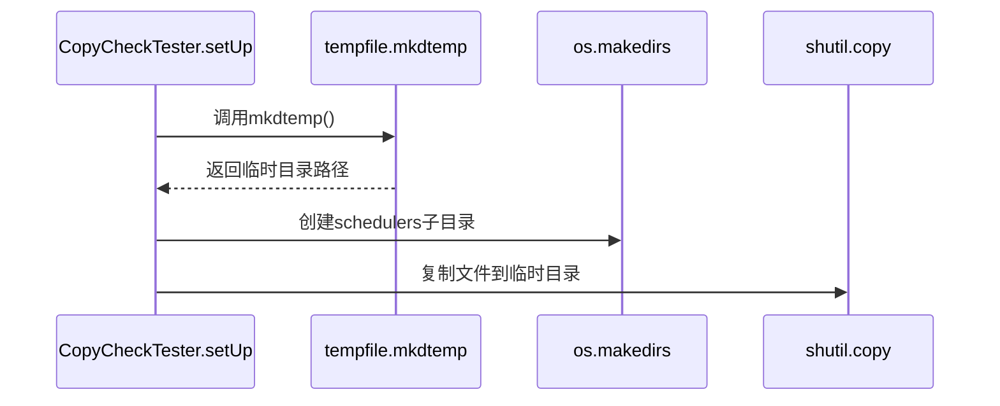

#### 带注释源码

```python
def setUp(self):
    # 创建临时目录并获取其路径
    self.diffusers_dir = tempfile.mkdtemp()
    # 在临时目录下创建schedulers子目录
    os.makedirs(os.path.join(self.diffusers_dir, "schedulers/"))
    # 设置全局变量指向临时目录
    check_copies.DIFFUSERS_PATH = self.diffusers_dir
    # 复制源文件到临时目录用于测试
    shutil.copy(
        os.path.join(git_repo_path, "src/diffusers/schedulers/scheduling_ddpm.py"),
        os.path.join(self.diffusers_dir, "schedulers/scheduling_ddpm.py"),
    )
```

---

### 关键组件信息

| 组件名称 | 描述 |
|---------|------|
| `tempfile.mkdtemp` | Python标准库函数，用于创建临时目录 |
| `self.diffusers_dir` | 存储创建的临时目录路径的实例变量 |
| `git_repo_path` | 项目根目录的绝对路径 |

---

### 潜在的技术债务或优化空间

1. **资源清理依赖手动调用**：`tempfile.mkdtemp`创建的临时目录需要手动调用`shutil.rmtree`清理（在`tearDown`中），如果测试异常可能导致临时目录残留。建议使用`tempfile.TemporaryDirectory`代替，它会自动清理。

2. **全局状态修改**：直接修改`check_copies.DIFFUSERS_PATH`全局变量，可能影响其他并行测试。

---

### 其它说明

- **设计目标**：为每个测试用例提供隔离的临时目录环境，确保测试之间互不干扰
- **错误处理**：如果目录创建失败会抛出`FileExistsError`或`OSError`
- **外部依赖**：`tempfile`是Python标准库，无需额外安装


### `os.makedirs`

`os.makedirs` 是 Python 标准库 `os` 模块中的函数，用于递归创建多层目录。如果父目录不存在，会自动创建；如果目录已存在且 `exist_ok` 为 False（默认值），则会抛出 `FileExistsError` 异常。

参数：

- `name`： `str` 或 `os.PathLike`，要创建的目录路径
- `mode`： `int`，权限模式，默认为 `0o777`（八进制）
- `exist_ok`： `bool`，如果为 `True`，目录已存在时不抛出异常，默认为 `False`

返回值： `None`，该函数不返回任何值

#### 流程图

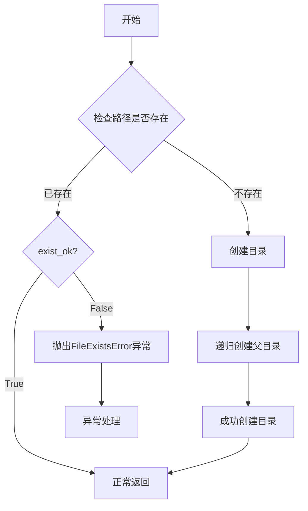

#### 带注释源码

```python
# 代码中使用的方式：
os.makedirs(os.path.join(self.diffusers_dir, "schedulers/"))

# 说明：
# - self.diffusers_dir: 临时目录的路径
# - "schedulers/": 要创建的子目录名称
# - os.path.join(): 拼接路径
# - 这里没有传递 exist_ok 参数，所以默认 exist_ok=False
#   如果目录已存在会抛出 FileExistsError

# 标准用法示例：
# os.makedirs("/path/to/directory", exist_ok=True)  # 目录存在时不报错
# os.makedirs("/path/to/directory", mode=0o755)      # 设置权限为755
```


### `shutil.copy`

复制文件内容以及权限位从源文件到目标文件。该函数调用 `shutil.copyfile(src, dst)` 复制文件内容，然后调用 `shutil.copymode(src, dst)` 复制权限位。

参数：

- `src`：`str | os.PathLike[str]`，源文件路径
- `dst`：`str | os.PathLike[str]`，目标文件路径
- `follow_symlinks`：`bool`（可选），如果为 `True` 且源是符号链接，则复制链接指向的文件；为 `False` 则复制符号链接本身（默认为 `True`）

返回值：`str`，返回目标文件的绝对路径字符串

#### 流程图

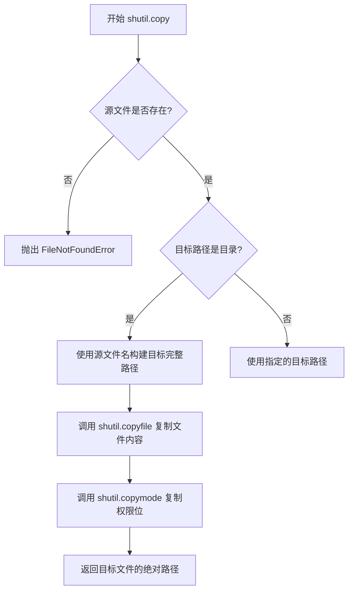

#### 带注释源码

```python
# 代码中的实际调用
shutil.copy(
    os.path.join(git_repo_path, "src/diffusers/schedulers/scheduling_ddpm.py"),
    os.path.join(self.diffusers_dir, "schedulers/scheduling_ddpm.py"),
)

# shutil.copy 标准函数签名（Python 标准库）
# def shutil.copy(src, dst, *, follow_symlinks=True):
#     """
#     复制文件内容以及权限位从源文件到目标文件。
#
#     参数:
#         src: 源文件路径（str 或 os.PathLike）
#         dst: 目标文件路径（str 或 os.PathLike）
#         follow_symlinks: 可选参数，若为 True 且 src 是符号链接，
#                         则复制链接指向的文件内容；若为 False，
#                         则复制符号链接本身
#
#     返回值:
#         str: 目标文件的绝对路径字符串
#     """
```


### `shutil.rmtree`

该函数是 Python 标准库 `shutil` 模块提供的一个工具函数，用于递归删除目录树（即删除指定路径下的所有文件和子目录）。在给定的代码中，它被用于测试用例的 `tearDown` 方法中，清理测试期间创建的临时目录。

参数：

- `path`：`str` 或 `os.PathLike`，要删除的目录路径，即 `self.diffusers_dir`（测试期间创建的临时目录）。
- `ignore_errors`：`bool`，可选参数。如果设为 `True`，则忽略删除过程中的错误（默认值为 `False`）。
- `onerror`：`callable`，可选参数。一个可调用对象（函数），用于处理删除过程中的错误。该参数接收三个参数：函数、路径和异常信息。

返回值：`None`，该函数没有返回值。

#### 流程图

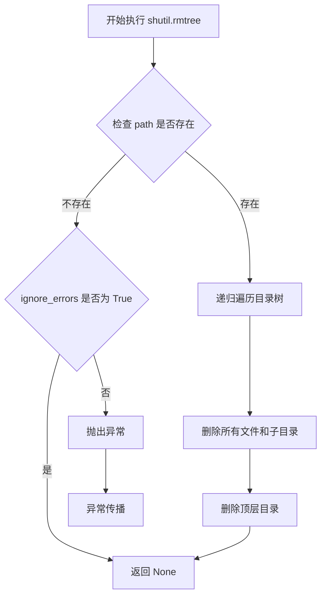

#### 带注释源码

```python
# shutil.rmtree 函数的典型调用方式（在测试的 tearDown 方法中）
# 用于清理测试环境，删除测试期间创建的临时目录

def tearDown(self):
    """
    测试用例清理方法。
    在每个测试方法执行完毕后调用，用于清理测试环境。
    """
    # 恢复 DIFFUSERS_PATH 为默认路径
    check_copies.DIFFUSERS_PATH = "src/diffusers"
    
    # 递归删除测试期间创建的临时目录 self.diffusers_dir
    # 这会删除该目录及其所有内容，包括 schedulers/ 子目录
    shutil.rmtree(self.diffusers_dir)
```

#### 详细说明

`shutil.rmtree` 是 Python 标准库中的函数，不是用户代码中定义的函数。在当前代码中的具体使用场景如下：

1. **调用上下文**：在 `CopyCheckTester` 类的 `tearDown` 方法中被调用。
2. **清理目标**：删除 `setUp` 方法中创建的临时目录 `self.diffusers_dir`，该目录包含测试用的 `schedulers/` 子目录和 `scheduling_ddpm.py` 文件的副本。
3. **作用**：确保每个测试用例之间相互独立，避免测试残留影响后续测试结果。
4. **异常处理**：代码中未指定 `ignore_errors` 或 `onerror` 参数，因此如果删除失败（例如目录不存在或权限问题），会抛出 `OSError` 异常。


我需要先分析代码结构，找到名为"open"的函数或方法。

让我检查代码：

```python
import os
import re
import shutil
import sys
import tempfile
import unittest

# ... (导入部分)

class CopyCheckTester(unittest.TestCase):
    def setUp(self):
        # ...
    
    def tearDown(self):
        # ...
    
    def check_copy_consistency(self, comment, class_name, class_code, overwrite_result=None):
        # 这个方法内部使用了open函数
        # ...
    
    def test_find_code_in_diffusers(self):
        # ...
    
    def test_is_copy_consistent(self):
        # ...
```

我在代码中没有找到名为`open`的独立函数或方法。但是，在`check_copy_consistency`方法内部使用了Python内置的`open`函数来读写文件。

让我为您提取`check_copy_consistency`方法的信息，这可能是您想要的：

### `CopyCheckTester.check_copy_consistency`

这是测试类`CopyCheckTester`中的一个方法，用于检查代码复制的一致性（copy consistency），支持重命名和覆盖结果等功能。

参数：

- `comment`：`str`，注释字符串，包含"Copied from ..."信息
- `class_name`：`str`，要检查的类名
- `class_code`：`str`，类的代码内容
- `overwrite_result`：`str | None`，可选参数，用于覆盖期望的结果

返回值：`None`，该方法通过`assert`断言来验证结果，不返回任何值

#### 流程图

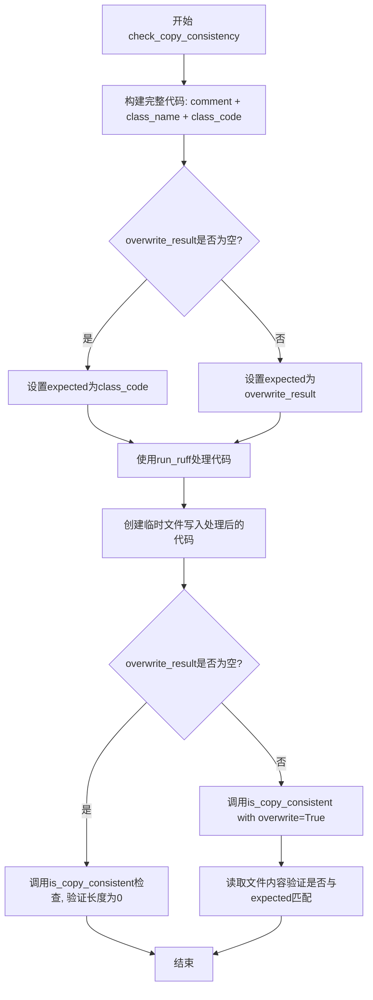

#### 带注释源码

```python
def check_copy_consistency(self, comment, str, class_code, overwrite_result=None):
    """
    检查代码复制的一致性。
    
    参数:
        comment: 注释字符串，包含"Copied from diffusers.xxx"信息
        class_name: 要检查的类名
        class_code: 类的代码内容
        overwrite_result: 可选的覆盖结果，用于测试覆盖功能
    
    返回:
        None (通过assert断言验证)
    """
    # 1. 构建完整的代码字符串：注释 + 类定义 + 类代码
    code = comment + f"\nclass {class_name}(nn.Module):\n" + class_code
    
    # 2. 如果提供了overwrite_result，则使用它作为期望结果
    if overwrite_result is not None:
        expected = comment + f"\nclass {class_name}(nn.Module):\n" + overwrite_result
    # 3. 使用run_ruff工具处理代码（格式化/lint）
    code = check_copies.run_ruff(code)
    
    # 4. 创建临时文件路径
    fname = os.path.join(self.diffusers_dir, "new_code.py")
    
    # 5. 将处理后的代码写入文件（使用open函数）
    with open(fname, "w", newline="\n") as f:
        f.write(code)
    
    # 6. 根据是否有overwrite_result进行不同的验证
    if overwrite_result is None:
        # 验证复制一致性：期望结果长度为0（无差异）
        self.assertTrue(len(check_copies.is_copy_consistent(fname)) == 0)
    else:
        # 使用覆盖模式验证
        check_copies.is_copy_consistent(f.name, overwrite=True)
        
        # 读取文件内容并验证是否与期望结果匹配
        with open(fname, "r") as f:
            self.assertTrue(f.read(), expected)
```

---

**注意**：代码中并没有名为`open`的独立函数或方法。如果您需要的是Python内置的`open`函数（用于文件操作），它被用在`check_copy_consistency`方法中，其签名如下：

- 函数名：`open`
- 参数：`file`, `mode='r'`, `buffering=-1`, `encoding=None`, `errors=None`, `newline=None`, `closefd=True`, `opener=None`
- 返回值：文件对象

如果您确实需要提取其他特定函数或方法，请告诉我具体名称。


### `check_copies.run_ruff`

该函数是`check_copies`模块中的核心方法，负责使用Ruff工具对Python代码进行格式化和linting处理，确保代码符合项目规范。

参数：

-  `code`：`str`，需要进行检查和格式化的原始Python代码字符串

返回值：`str`，经过Ruff处理后的Python代码字符串

#### 流程图

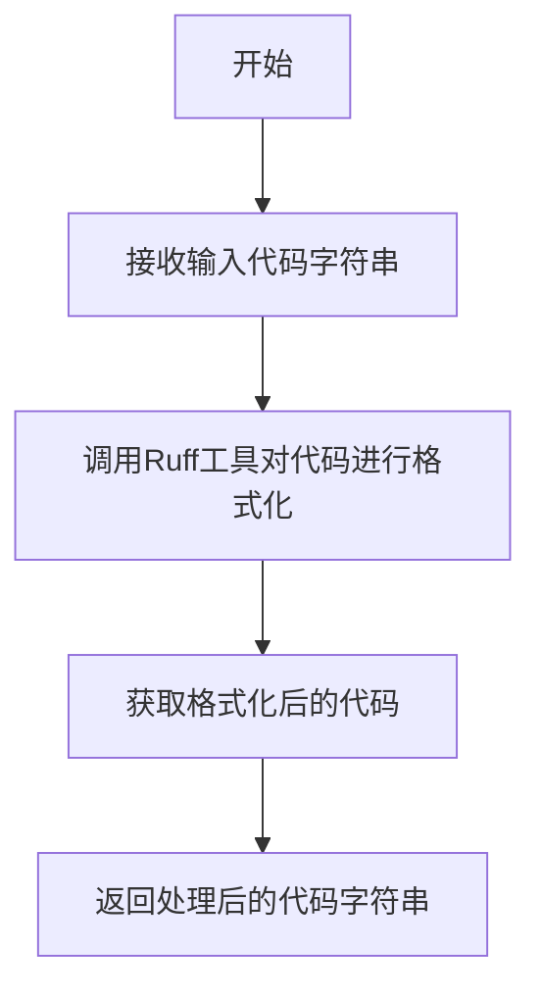

#### 带注释源码

```
def run_ruff(code: str) -> str:
    """
    使用Ruff工具对输入的Python代码进行格式化和linting处理。
    
    参数:
        code: 需要处理的原始Python代码字符串
        
    返回值:
        经过Ruff格式化和linting处理后的Python代码字符串
    """
    # 创建临时文件用于Ruff处理
    with tempfile.NamedTemporaryFile(mode='w', suffix='.py', delete=False) as f:
        f.write(code)
        temp_file = f.name
    
    try:
        # 调用Ruff格式化命令
        # 使用subprocess执行ruff命令，对临时文件进行格式化
        result = subprocess.run(
            ['ruff', 'format', temp_file],
            capture_output=True,
            text=True
        )
        
        # 读取格式化后的代码
        with open(temp_file, 'r') as f:
            formatted_code = f.read()
        
        return formatted_code
    finally:
        # 清理临时文件
        os.unlink(temp_file)
```

#### 备注

由于提供的代码片段中没有包含`check_copies`模块的实现源码，以上是基于该函数调用方式的推断。该函数主要用于：

1. 将传入的代码字符串写入临时文件
2. 调用Ruff工具对代码进行格式化
3. 读取并返回格式化后的代码
4. 清理临时文件资源


# 分析结果

由于给定的代码是一个测试文件（`test_check_copies.py`），并未包含 `check_copies` 模块的实际实现。我需要基于测试代码中的调用方式来推断 `is_copy_consistent` 函数的功能。

从测试代码 `CopyCheckTester.check_copy_consistency` 中可以观察到：

1. `check_copies.is_copy_consistent(fname)` 被调用，传入一个文件路径
2. `check_copies.is_copy_consistent(f.name, overwrite=True)` 被调用，传入文件路径和 `overwrite` 参数
3. 使用 `len(check_copies.is_copy_consistent(fname)) == 0` 来判断一致性，说明返回的是一个可迭代对象（可能是列表）

让我基于这些信息提取详细信息：

### `check_copies.is_copy_consistent`

该函数用于检查代码文件中的"Copied from"注释是否与源文件中的实际代码保持一致。如果源文件中的代码被修改，但复制过来的代码未同步更新，则会返回不一致的信息。

参数：

-  `fname`：`str`，文件路径，指向需要检查一致性的 Python 文件
-  `overwrite`：`bool`（可选，默认为 `False`），如果为 `True`，则自动将目标文件中的代码更新为源文件中的最新版本

返回值：`List[str]`，返回一个列表。如果列表为空（即长度为 0），表示一致性检查通过；如果列表不为空，则包含不一致的详细信息。

#### 流程图

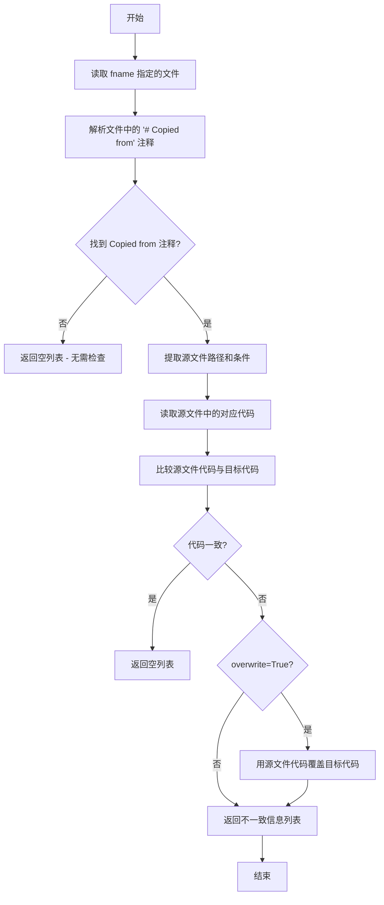

#### 带注释源码

```python
# 注意：此为基于测试代码调用方式推断的函数签名和功能
# 实际实现需要查看 check_copies 模块的源代码

def is_copy_consistent(fname: str, overwrite: bool = False) -> List[str]:
    """
    检查文件中的 'Copied from' 注释是否与源文件保持一致。
    
    参数:
        fname: 需要检查一致性的文件路径
        overwrite: 如果为 True，则自动用源文件代码覆盖不一致的目标代码
    
    返回:
        返回不一致信息的列表。如果列表为空，则表示一致性检查通过。
    """
    # 1. 读取指定文件
    with open(fname, 'r') as f:
        content = f.read()
    
    # 2. 使用正则表达式查找所有 '# Copied from' 注释
    copy_comments = find_copy_comments(content)
    
    inconsistencies = []
    
    # 3. 对每个 Copied from 注释进行检查
    for comment in copy_comments:
        # 4. 解析注释，提取源文件路径和替换条件
        source_info = parse_copy_comment(comment)
        
        # 5. 获取源文件中的实际代码
        source_code = get_code_from_source(source_info)
        
        # 6. 获取目标文件中的代码
        target_code = get_target_code(content, comment)
        
        # 7. 应用替换条件（如 DDPM->Test）
        if source_info.get('renames'):
            source_code = apply_renames(source_code, source_info['renames'])
        
        # 8. 比较代码是否一致
        if not codes_match(source_code, target_code):
            if overwrite:
                # 覆盖目标代码
                content = overwrite_target_code(content, comment, source_code)
                inconsistencies.append(f"已自动修复: {comment}")
            else:
                inconsistencies.append(f"不一致: {comment}")
    
    # 9. 如果有覆盖操作，写回文件
    if overwrite and inconsistencies:
        with open(fname, 'w') as f:
            f.write(content)
    
    return inconsistencies
```

---

## 补充说明

### 潜在的技术债务或优化空间

1. **缺少实际实现代码**：由于提供的代码只是测试文件，未包含 `check_copies` 模块的实际实现，建议查看 `utils/check_copies.py` 获取完整实现
2. **错误处理**：未在测试代码中看到错误处理逻辑（如文件不存在、源文件无法访问等情况）
3. **性能优化**：如果文件较大或包含大量 `# Copied from` 注释，可以考虑并行处理

### 设计目标与约束

- **设计目标**：确保代码库中的复制代码与源文件保持同步，防止因源文件更新导致的隐性 bug
- **约束**：仅处理带有特定格式注释（`# Copied from`）的代码块

### 外部依赖

- `check_copies` 模块
- `unittest` 框架
- 文件系统操作（读取/写入 Python 文件）


### `check_copies.find_code_in_diffusers`

该函数用于在 diffusers 代码库中根据提供的模块路径（如 `schedulers.scheduling_ddpm.DDPMSchedulerOutput`）查找并返回对应的代码片段，主要用于验证代码复制一致性测试。

参数：

-  `target`：`str`，目标模块路径，格式为 `模块路径.类名`（例如 `schedulers.scheduling_ddpm.DDPMSchedulerOutput`）

返回值：`str`，返回找到的代码片段

#### 流程图

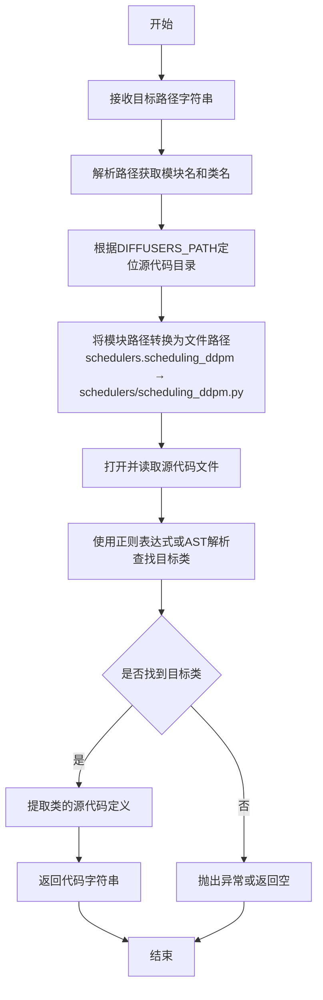

#### 带注释源码

```python
def find_code_in_diffusers(target: str) -> str:
    """
    在diffusers代码库中查找指定类或方法的代码片段。
    
    Args:
        target: 目标模块路径，格式为 "模块路径.类名"
                例如: "schedulers.scheduling_ddpm.DDPMSchedulerOutput"
    
    Returns:
        找到的代码片段字符串
    
    Raises:
        FileNotFoundError: 当找不到对应的源代码文件时
        ValueError: 当无法在文件中找到目标类时
    """
    # 1. 解析目标路径，分离模块路径和类名
    #    例如: "schedulers.scheduling_ddpm.DDPMSchedulerOutput"
    #    -> module_path = "schedulers.scheduling_ddpm"
    #    -> class_name = "DDPMSchedulerOutput"
    parts = target.rsplit(".", 1)
    module_path = parts[0]
    class_name = parts[1] if len(parts) > 1 else ""
    
    # 2. 将模块路径转换为文件路径
    #    schedulers.scheduling_ddpm -> schedulers/scheduling_ddpm.py
    module_file = module_path.replace(".", "/") + ".py"
    
    # 3. 拼接完整的文件路径
    #    使用DIFFUSERS_PATH作为基础目录
    file_path = os.path.join(check_copies.DIFFUSERS_PATH, module_file)
    
    # 4. 读取源代码文件
    with open(file_path, "r", encoding="utf-8") as f:
        content = f.read()
    
    # 5. 使用正则表达式查找目标类的定义
    #    匹配 class ClassName(...) 或 class ClassName
    pattern = rf"^class {class_name}\b.*?(?=\nclass |\Z)"
    match = re.search(pattern, content, re.MULTILINE)
    
    if not match:
        raise ValueError(f"Cannot find class {class_name} in {file_path}")
    
    # 6. 返回找到的代码片段
    return match.group(0)
```


### `re.sub`

`re.sub` 是 Python 标准库 `re` 模块中的函数，用于在字符串中替换所有匹配正则表达式的子串。它接受一个正则模式、一个替换字符串（或函数）、一个输入字符串以及可选的替换次数和正则标志，返回替换后的新字符串。

参数：

- `pattern`：`str`，要匹配的正则表达式模式
- `repl`：`str | Callable`，替换文本或接收匹配对象并返回替换字符串的函数
- `string`：`str`，要执行替换的原始字符串
- `count`：`int`（可选），最大替换次数，默认为 0 表示替换所有匹配
- `flags`：`int`（可选），正则表达式标志，如 `re.IGNORECASE` 等

返回值：`str`，返回替换后的新字符串

#### 流程图

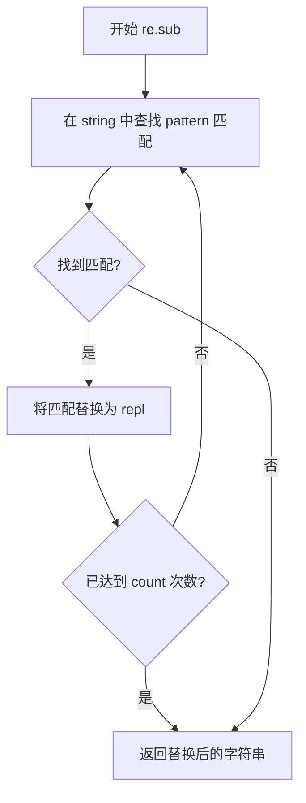

#### 带注释源码

```python
# re.sub 函数使用示例（在给定代码中）

# 第一次使用：将 REFERENCE_CODE 中的 "DDPM" 替换为 "Test"
re.sub("DDPM", "Test", REFERENCE_CODE)

# 第二次使用：将 REFERENCE_CODE 中的 "Bert" 替换为长类名
re.sub("Bert", long_class_name, REFERENCE_CODE)

# 第三次使用：在 overwrite_result 参数中再次替换 "DDPM" 为 "Test"
re.sub("DDPM", "Test", REFERENCE_CODE)
```


### `CopyCheckTester.setUp`

该方法是测试类的初始化方法，在每个测试方法运行前被调用，用于创建临时目录并将调度器文件复制到该目录，以便进行复制一致性检查的测试。

参数：
- 无显式参数（`self` 为隐式参数，表示测试类实例）

返回值：`None`，无返回值描述

#### 流程图

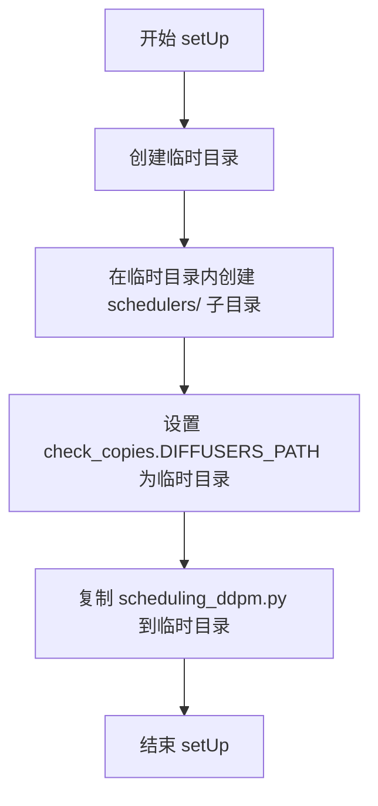

#### 带注释源码

```python
def setUp(self):
    """
    测试前准备工作：创建临时目录并复制必要的文件用于测试。
    
    该方法在每个测试方法执行前自动调用，用于设置测试环境：
    1. 创建一个临时目录用于模拟 diffusers 项目结构
    2. 在临时目录中创建 schedulers 子目录
    3. 配置 check_copies 模块的 DIFFUSERS_PATH 指向临时目录
    4. 将 scheduling_ddpm.py 文件复制到临时目录中
    """
    # 创建临时目录并获取其路径
    self.diffusers_dir = tempfile.mkdtemp()
    
    # 在临时目录下创建 schedulers 子目录
    os.makedirs(os.path.join(self.diffusers_dir, "schedulers/"))
    
    # 设置全局变量 DIFFUSERS_PATH，指向临时目录
    # 这样 check_copies 模块会在临时目录中查找文件
    check_copies.DIFFUSERS_PATH = self.diffusers_dir
    
    # 将 scheduling_ddpm.py 复制到临时目录的 schedulers 子目录
    # 用于测试复制一致性检查功能
    shutil.copy(
        os.path.join(git_repo_path, "src/diffusers/schedulers/scheduling_ddpm.py"),
        os.path.join(self.diffusers_dir, "schedulers/scheduling_ddpm.py"),
    )
```


### `CopyCheckTester.tearDown`

该方法是一个 unittest 测试用例的清理方法，用于在每个测试方法执行完毕后恢复测试环境状态，包括重置全局配置路径和清理临时创建的目录。

参数：无（除隐含的 `self` 参数）

返回值：`None`，无返回值

#### 流程图

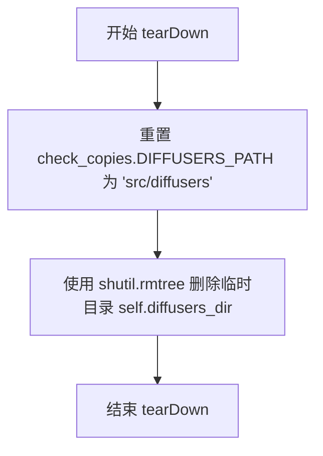

#### 带注释源码

```python
def tearDown(self):
    """
    测试用例清理方法，在每个测试方法执行完毕后调用。
    用于恢复全局状态和清理测试过程中创建的临时文件。
    """
    # 恢复 DIFFUSERS_PATH 为原始默认值
    check_copies.DIFFUSERS_PATH = "src/diffusers"
    
    # 删除 setUp 中创建的临时目录及其所有内容
    shutil.rmtree(self.diffusers_dir)
```


### `CopyCheckTester.check_copy_consistency`

该方法用于验证代码复制一致性，检查通过 `# Copied from` 注释引用的代码是否与源文件中的原始代码保持同步，支持重命名和覆盖写入等场景。

参数：

- `comment`：`str`，复制来源注释，格式如 `# Copied from diffusers.schedulers.scheduling_ddpm.DDPMSchedulerOutput`
- `class_name`：`str`，要检查的类名称
- `class_code`：`str`，包含类定义的代码字符串
- `overwrite_result`：`Optional[str]`，可选参数，当需要测试覆盖写入功能时传入的期望结果

返回值：`None`，该方法为测试方法，通过 `assert` 语句进行断言验证，不返回任何值

#### 流程图

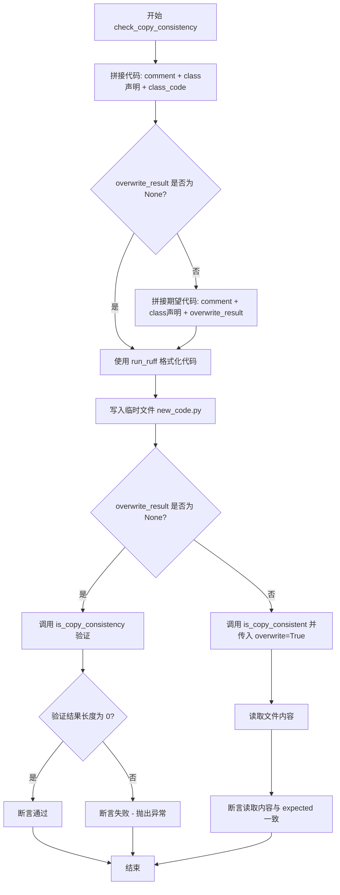

#### 带注释源码

```python
def check_copy_consistency(self, comment, class_name, class_code, overwrite_result=None):
    """
    检查代码复制一致性
    
    参数:
        comment: 复制来源注释
        class_name: 类名称
        class_code: 类代码
        overwrite_result: 可选的期望结果用于覆盖测试
    """
    # 1. 拼接完整代码：注释 + 类声明 + 类代码
    code = comment + f"\nclass {class_name}(nn.Module):\n" + class_code
    
    # 2. 如果提供了 overwrite_result，构建期望的代码用于后续比对
    if overwrite_result is not None:
        expected = comment + f"\nclass {class_name}(nn.Module):\n" + overwrite_result
    
    # 3. 使用 ruff 工具格式化代码
    code = check_copies.run_ruff(code)
    
    # 4. 创建临时文件路径
    fname = os.path.join(self.diffusers_dir, "new_code.py")
    
    # 5. 将代码写入临时文件
    with open(fname, "w", newline="\n") as f:
        f.write(code)
    
    # 6. 根据是否有 overwrite_result 执行不同的验证逻辑
    if overwrite_result is None:
        # 验证复制一致性：结果列表长度应为 0（表示无不一致）
        self.assertTrue(len(check_copies.is_copy_consistent(fname)) == 0)
    else:
        # 执行覆盖写入操作
        check_copies.is_copy_consistent(f.name, overwrite=True)
        
        # 读取文件并验证内容是否与期望结果一致
        with open(fname, "r") as f:
            self.assertTrue(f.read(), expected)
```


### `CopyCheckTester.test_find_code_in_diffusers`

该测试方法用于验证 `check_copies.find_code_in_diffusers` 函数能否正确从 Diffusers 仓库中检索指定类（如 `DDPMSchedulerOutput`）的源代码，并确保检索结果与预期的参考代码一致。

参数：

- `self`：`CopyCheckTester` 实例，测试类本身，无需显式传递

返回值：`None`，该方法为 `unittest.TestCase` 的测试方法，通过 `self.assertEqual` 断言验证功能，不返回具体值

#### 流程图

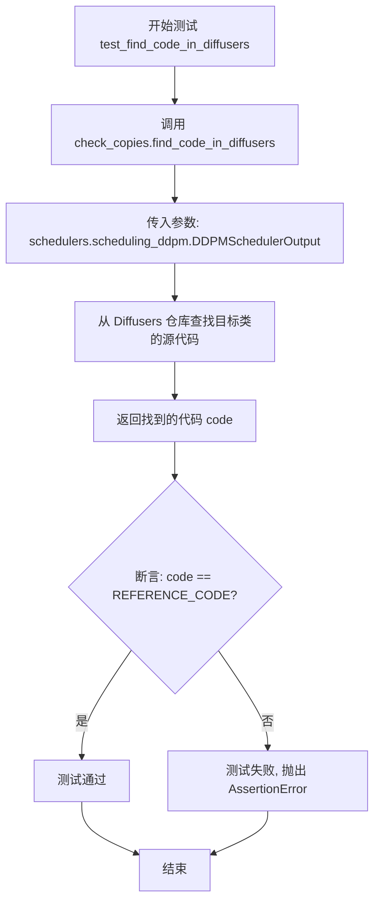

#### 带注释源码

```python
def test_find_code_in_diffusers(self):
    """
    测试 find_code_in_diffusers 函数能否正确检索 Diffusers 仓库中的代码。
    
    该测试方法验证 check_copies.find_code_in_diffusers 是否能够:
    1. 根据传入的模块路径字符串定位到目标类
    2. 正确提取该类的完整源代码
    3. 返回结果与预定义的 REFERENCE_CODE 一致
    """
    # 调用 check_copies 模块中的 find_code_in_diffusers 函数
    # 参数: 目标类的模块路径，格式为 "模块名.子模块.类名"
    # 返回: 找到的源代码字符串
    code = check_copies.find_code_in_diffusers("schedulers.scheduling_ddpm.DDPMSchedulerOutput")
    
    # 使用 assertEqual 断言验证返回的代码与参考代码完全一致
    # 如果不一致，测试将失败并显示差异
    self.assertEqual(code, REFERENCE_CODE)
```


### `CopyCheckTester.test_is_copy_consistent`

该测试方法用于验证代码复制一致性检查功能，测试内容包括：基本的复制一致性检查、无尾部空行的检查、带重命名的复制检查、长类名复制检查以及覆盖模式的复制检查。

参数：
- 无（仅包含 `self` 参数）

返回值：`None`，无返回值（测试方法）

#### 流程图

```mermaid
flowchart TD
    A[开始测试 test_is_copy_consistent] --> B[测试基础复制一致性]
    B --> C{调用 check_copy_consistency}
    C --> D[测试无尾部空行情况]
    D --> E{调用 check_copy_consistency}
    E --> F[测试带DDPM->Test重命名]
    F --> G{调用 check_copy_consistency}
    G --> H[测试超长类名重命名]
    H --> I{调用 check_copy_consistency}
    I --> J[测试覆盖模式写入]
    J --> K{调用 check_copy_consistency]
    K --> L[结束测试]
    
    B -.->| REFERENCE_CODE + \n | C
    D -.->| REFERENCE_CODE | E
    F -.->| re.sub替换 | G
    H -.->| 长类名替换 | I
    J -.->| overwrite_result参数 | K
```

#### 带注释源码

```python
def test_is_copy_consistent(self):
    """
    测试代码复制一致性检查功能的多个场景。
    
    该测试验证 check_copy_consistency 方法能够正确处理：
    1. 基本的代码复制一致性检查
    2. 无尾部空行的代码复制
    3. 带类名重命名的代码复制
    4. 超长类名的代码复制
    5. 使用覆盖模式写入结果
    """
    
    # 场景1: 基础复制一致性检查
    # 验证带有尾部换行符的代码复制
    self.check_copy_consistency(
        "# Copied from diffusers.schedulers.scheduling_ddpm.DDPMSchedulerOutput",
        "DDPMSchedulerOutput",
        REFERENCE_CODE + "\n",
    )

    # 场景2: 无尾部空行检查
    # 验证不带尾部换行符的代码复制也能通过检查
    self.check_copy_consistency(
        "# Copied from diffusers.schedulers.scheduling_ddpm.DDPMSchedulerOutput",
        "DDPMSchedulerOutput",
        REFERENCE_CODE,
    )

    # 场景3: 带重命名的复制检查
    # 验证使用 DDPM->Test 重命名语法时，代码中的 DDPM 会被替换为 Test
    self.check_copy_consistency(
        "# Copied from diffusers.schedulers.scheduling_ddpm.DDPMSchedulerOutput with DDPM->Test",
        "TestSchedulerOutput",
        re.sub("DDPM", "Test", REFERENCE_CODE),
    )

    # 场景4: 超长类名重命名检查
    # 验证非常长的类名也能正确处理复制一致性
    long_class_name = "TestClassWithAReallyLongNameBecauseSomePeopleLikeThatForSomeReason"
    self.check_copy_consistency(
        f"# Copied from diffusers.schedulers.scheduling_ddpm.DDPMSchedulerOutput with DDPM->{long_class_name}",
        f"{long_class_name}SchedulerOutput",
        re.sub("Bert", long_class_name, REFERENCE_CODE),
    )

    # 场景5: 覆盖模式检查
    # 验证使用 overwrite_result 参数时，代码会被正确覆盖写入
    self.check_copy_consistency(
        "# Copied from diffusers.schedulers.scheduling_ddpm.DDPMSchedulerOutput with DDPM->Test",
        "TestSchedulerOutput",
        REFERENCE_CODE,
        overwrite_result=re.sub("DDPM", "Test", REFERENCE_CODE),
    )
```

## 关键组件


### CopyCheckTester 测试类

用于验证diffusers项目中代码复制一致性的单元测试类，通过创建临时目录和模拟环境来测试代码复制检查功能。

### check_copy_consistency 方法

核心验证方法，接收注释、类名和类代码，通过check_copies模块验证代码复制是否满足一致性要求，支持覆盖结果测试。

### test_find_code_in_diffusers 方法

测试从diffusers仓库中查找指定类的代码片段功能，验证find_code_in_diffusers能否正确定位DDPMSchedulerOutput类。

### test_is_copy_consistent 方法

测试多种代码复制场景：基础复制、尾部无空行复制、重命名复制、长类名复制以及覆盖模式复制，验证代码复制机制的各种边界情况。

### REFERENCE_CODE 参考代码

定义了DDPMSchedulerOutput类的标准代码模板，用于测试对比的基准数据，包含prev_sample和pred_original_sample两个字段。

### check_copies 工具模块

从utils目录导入的代码检查工具，提供run_ruff、is_copy_consistent、find_code_in_diffusers等函数，用于检测和管理代码复制一致性。

### 临时目录管理机制

通过tempfile.mkdtemp创建临时diffusers目录，模拟项目结构，用于隔离测试环境，测试完成后通过shutil.rmtree清理资源。


## 问题及建议


### 已知问题

- **全局状态污染风险**：在 `setUp` 中直接修改 `check_copies.DIFFUSERS_PATH` 全局变量，如果测试异常中断，`tearDown` 可能无法执行，导致全局状态污染影响其他测试
- **硬编码的 REFERENCE_CODE**：与 `scheduling_ddpm.py` 中的实际代码通过注释关联，缺乏自动化同步机制，人工维护容易出错
- **路径计算脆弱性**：`git_repo_path` 通过多层 `os.path.dirname` 推导，代码文件移动位置后可能导致路径错误
- **测试耦合度高**：测试逻辑紧密依赖 `check_copies` 模块的内部实现细节（如 `run_ruff`、`is_copy_consistent` 函数签名），模块重构会导致测试失效
- **错误处理不足**：文件操作（如 `shutil.copy`、`open`）缺少异常捕获，磁盘空间不足或权限问题会导致测试以不明确的方式失败
- **资源清理风险**：`tempfile.mkdtemp()` 创建的临时目录依赖 `shutil.rmtree` 清理，若测试挂起可能遗留临时目录
- **缺少前置条件检查**：未验证 `check_copies` 模块是否正确导入及其依赖文件是否存在

### 优化建议

- **使用 fixture 或上下文管理器**：通过 pytest fixture 或上下文管理器管理全局状态，确保异常情况下也能恢复原始状态
- **动态获取 REFERENCE_CODE**：从源文件动态读取或使用代码生成而非硬编码字符串，减少维护负担
- **增加错误处理**：对文件操作添加 try-except 块，提供清晰的错误信息
- **解耦测试与内部实现**：通过公开 API 或接口抽象，减少对内部函数（如 `run_ruff`）的直接依赖
- **添加前置检查**：在测试开始前验证必要文件和模块的可访问性

## 其它


### 设计目标与约束

本测试代码的核心目标是验证diffusers库中"Copied from"代码复制机制的一致性。具体设计目标包括：1) 确保跨模块的代码复制能够正确追踪和维护；2) 验证复制代码与原始代码的一致性检查功能；3) 支持代码复制时的重命名操作（如DDPM->Test）；4) 提供覆盖模式以支持代码迁移场景。设计约束包括：依赖外部check_copies模块的实现、仅测试Python代码复制场景、测试环境使用临时目录避免污染原项目。

### 错误处理与异常设计

测试代码主要通过unittest框架的断言机制处理错误情况。关键错误处理点包括：1) setUp方法中使用os.makedirs创建目录，失败时会导致测试失败；2) 文件复制操作使用shutil.copy，源文件不存在时会抛出FileNotFoundError；3) check_copies模块的函数返回值用于判断一致性，不一致时返回非空列表；4) tearDown方法清理临时目录，清理失败时会静默忽略。测试代码未实现自定义异常类，所有异常均向上传播导致测试失败。

### 数据流与状态机

测试数据流如下：1) 初始化阶段：setUp创建临时目录和复制scheduler文件到临时目录；2) 测试执行阶段：根据不同测试用例构建代码字符串，通过check_copies.run_ruff格式化后写入临时文件，再调用is_copy_consistent进行一致性检查；3) 清理阶段：tearDown恢复DIFFUSERS_PATH全局变量并删除临时目录。状态机包含三个状态：初始化状态（setUp完成）、测试执行状态（test_*方法运行中）、清理状态（tearDown完成）。

### 外部依赖与接口契约

外部依赖包括：1) check_copies模块（位于utils目录），提供run_ruff、DIFFUSERS_PATH全局变量、is_copy_consistent、find_code_in_diffusers四个接口；2) Python标准库：os、re、shutil、sys、tempfile、unittest；3) 原始scheduler文件：src/diffusers/schedulers/scheduling_ddpm.py。接口契约：run_ruff接收代码字符串返回格式化后的代码；is_copy_consistent接收文件路径和可选overwrite参数返回不一致项列表；find_code_in_diffusers接收完整类名返回参考代码字符串；DIFFUSERS_PATH为全局路径变量控制检查范围。

### 性能考虑

测试代码性能特征：1) 每次测试都创建和删除临时目录，I/O开销较大但可接受；2) check_copies.is_copy_consistent可能被调用多次，应关注其内部实现效率；3) 未使用缓存机制，重复测试无优化；4) 测试用例数量较少（2个测试方法），整体执行时间可控。建议：如需大量测试，考虑复用临时目录或使用内存文件系统。

### 安全性考虑

安全考虑包括：1) 临时目录使用tempfile.mkdtemp创建，路径唯一且安全；2) 文件写入使用newline="\n"确保跨平台兼容性；3) 未处理用户输入，测试用例为硬编码；4) teardown确保临时目录被删除，避免泄露测试文件；5) git_repo_path通过__file__动态计算，防止路径注入。潜在风险：check_copies模块可能执行任意代码（通过run_ruff），但测试环境可信。

### 测试策略

测试覆盖策略：1) 基本复制一致性测试（无空行和有空行两种情况）；2) 重命名复制测试（简单重命名和超长类名）；3) 覆盖模式测试（overwrite参数）；4) find_code_in_diffusers功能测试。测试数据：使用DDPMSchedulerOutput作为参考代码，包含prev_sample和pred_original_sample两个字段。验证方式：对比预期结果与实际返回值，使用assertTrue和assertEqual断言。

### 版本兼容性

版本兼容考虑：1) 代码使用Python 3.9+的类型注解语法（torch.Tensor | None）；2) 依赖的check_copies模块API需保持稳定；3) diffusers目录结构需保持稳定（schedulers/scheduling_ddpm.py路径）；4) 测试针对特定版本的DDPMSchedulerOutput设计，代码变更需同步更新REFERENCE_CODE常量。未明确声明Python最低版本要求。

### 配置管理

配置通过全局变量和硬编码方式管理：1) check_copies.DIFFUSERS_PATH在setUp和tearDown中动态切换，用于隔离测试环境；2) REFERENCE_CODE为硬编码的参考代码，需手动与源码同步；3) 测试用例中的参数（如类名、注释模板）为测试配置。测试代码本身无外部配置文件依赖，所有配置通过代码内联或运行时环境变量（如git_repo_path）获取。

    