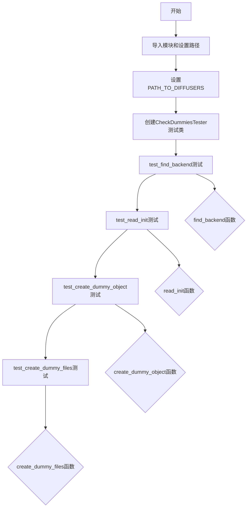
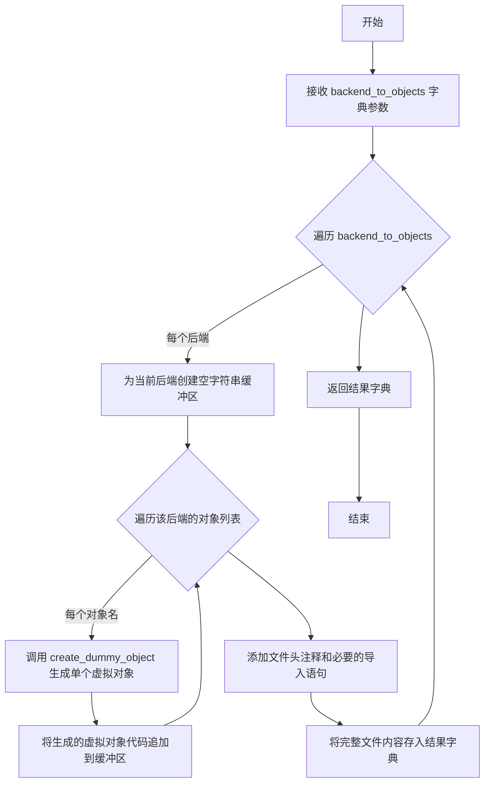
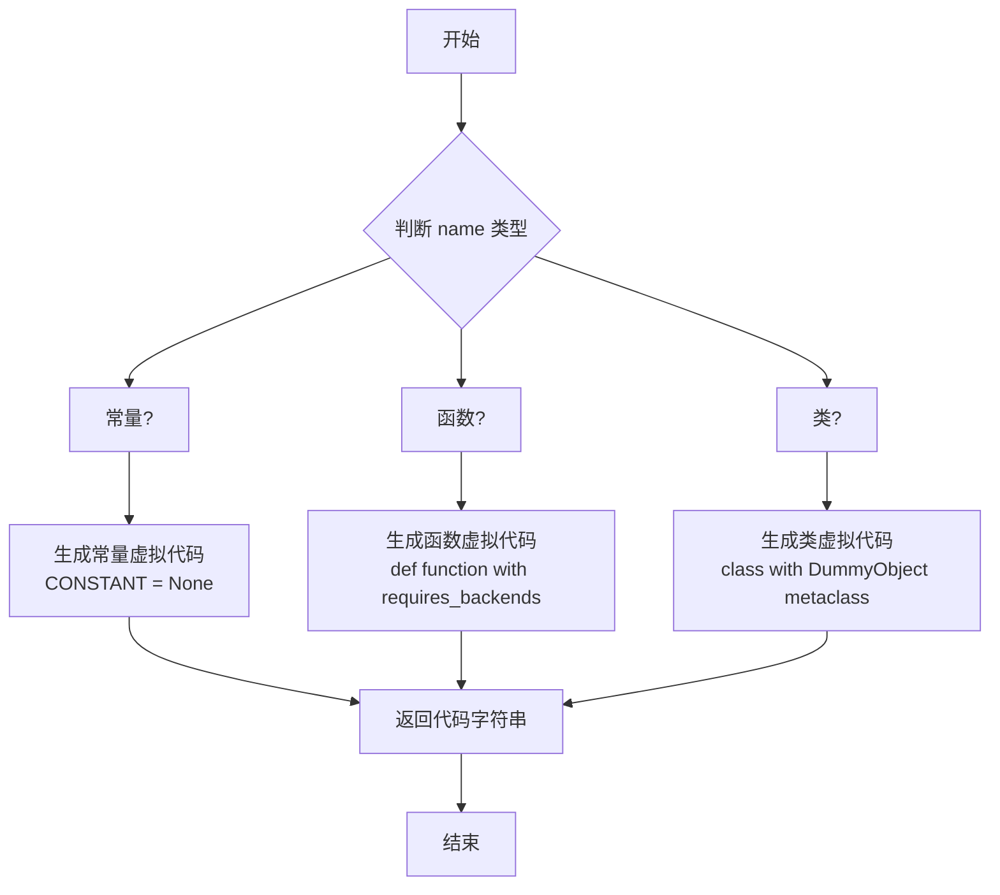
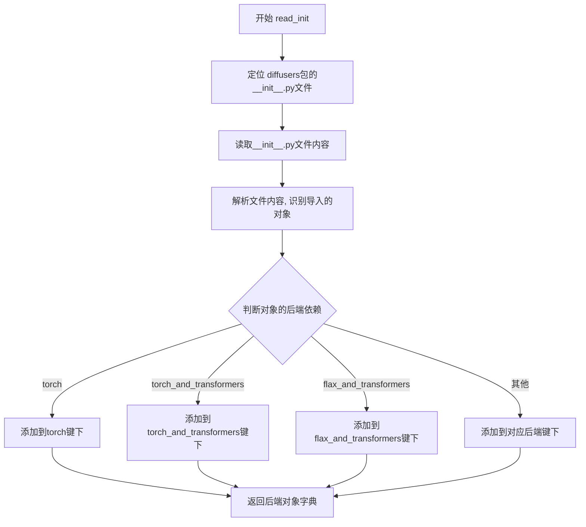
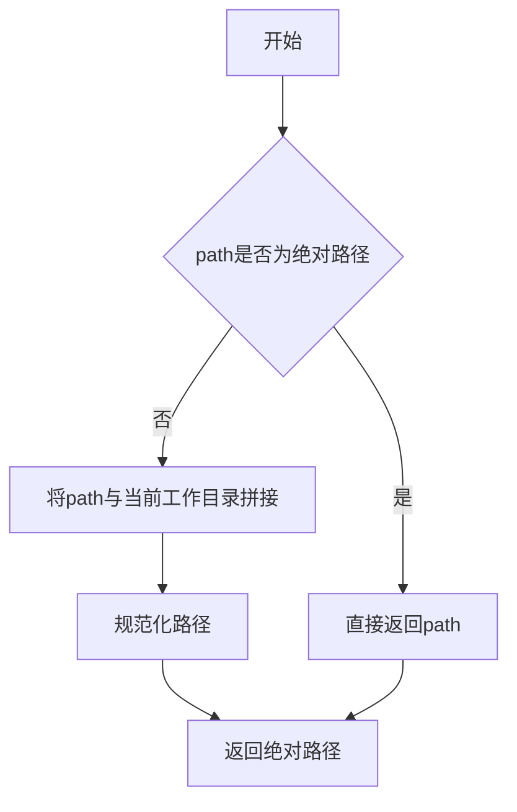
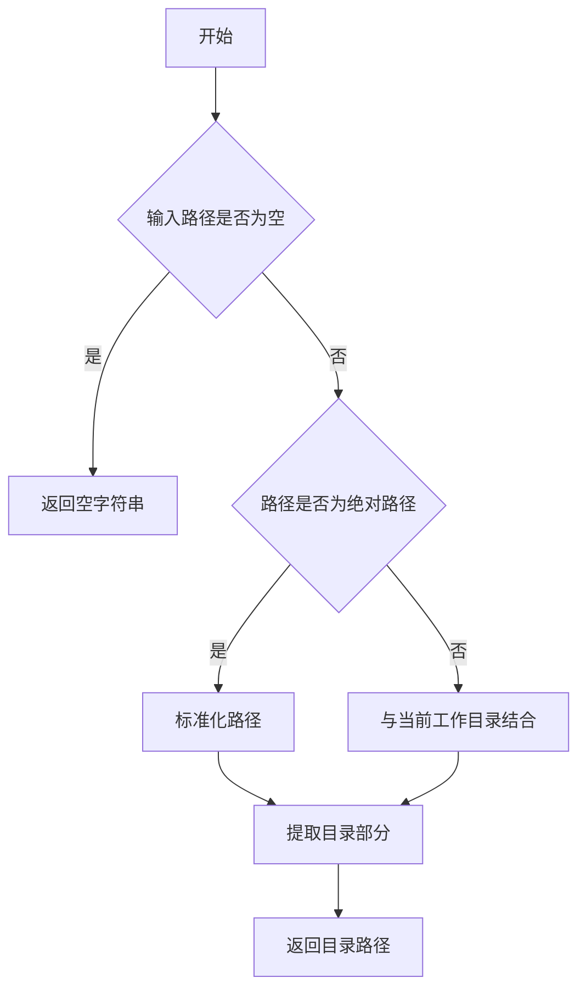
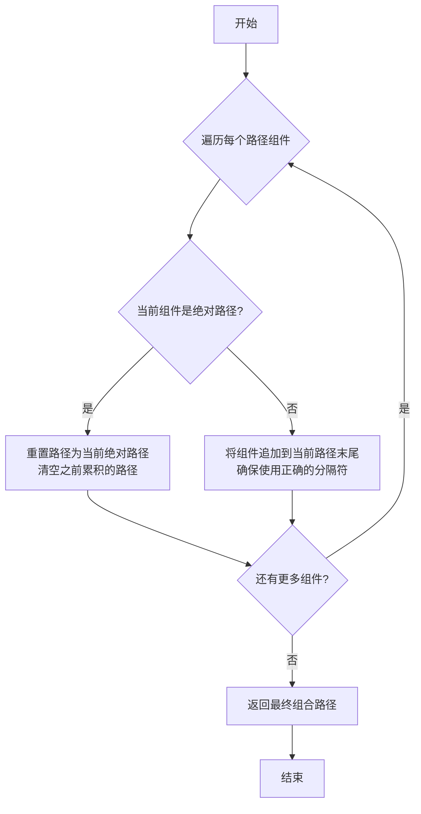
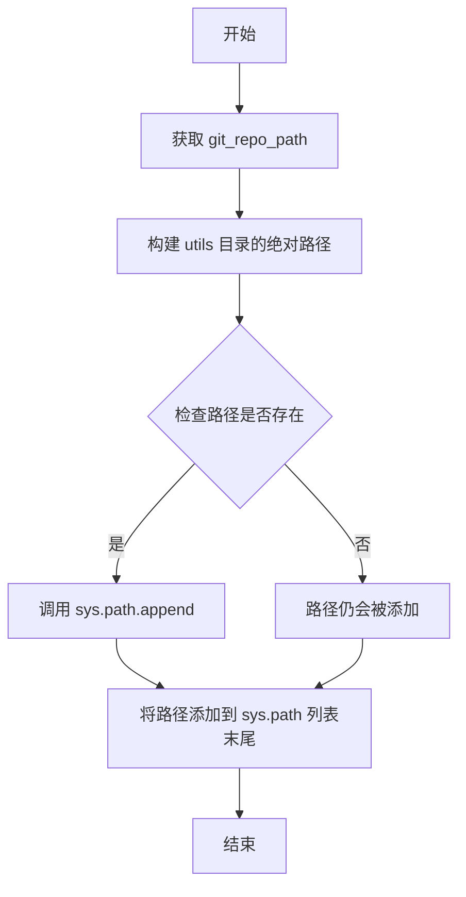
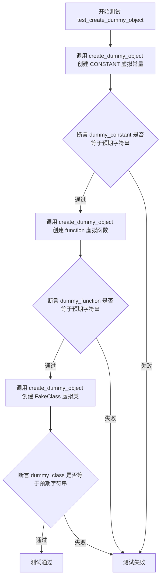

# `diffusers\tests\others\test_check_dummies.py` 详细设计文档

这是一个单元测试文件，用于测试 check_dummies 工具模块的功能，包括后端查找、__init__.py 读取、虚拟对象创建和虚拟文件生成，用于处理Diffusers库中可选依赖项的延迟加载。

## 整体流程



## 类结构

```
CheckDummiesTester (unittest.TestCase)
└── test_find_backend: 测试后端查找功能
└── test_read_init: 测试__init__读取功能
└── test_create_dummy_object: 测试单个虚拟对象创建
└── test_create_dummy_files: 测试虚拟文件生成
```

## 全局变量及字段


### `git_repo_path`
    
计算得到的git仓库根目录的绝对路径

类型：`str`
    


### `check_dummies.PATH_TO_DIFFUSERS`
    
指向diffusers库源代码目录的路径，用于替换check_dummies模块中的原始路径

类型：`str`
    


    

## 全局函数及方法


### `create_dummy_files`

该函数根据传入的后端到对象列表的映射，生成对应的虚拟（dummy）文件内容字符串，用于在特定依赖库不可用时提供占位符，确保代码的条件导入机制正常工作。

参数：

- `backend_to_objects`：`Dict[str, List[str]]`，映射后端名称（如 "torch"、"flax"）到该后端需要创建虚拟对象的对象名字符串列表

返回值：`Dict[str, str]`，映射后端名称到生成的虚拟文件内容（Python 源码字符串）

#### 流程图



#### 带注释源码

```python
def create_dummy_files(backend_to_objects: Dict[str, List[str]]) -> Dict[str, str]:
    """
    为指定的后端生成虚拟文件内容
    
    参数:
        backend_to_objects: 字典，键为后端名称如'torch'，值为对象名列表如['CONSTANT', 'function', 'FakeClass']
    
    返回:
        字典，键为后端名称，值为生成的虚拟文件完整源代码字符串
    """
    # 初始化结果字典，用于存储每个后端对应的虚拟文件内容
    dummy_files = {}
    
    # 遍历每个后端及其对应的对象列表
    for backend, object_names in backend_to_objects.items():
        # 为当前后端构建虚拟文件的基础结构
        # 包括文件头注释和必要的导入语句
        file_content = [
            "# This file is autogenerated by the command `make fix-copies`, do not edit.",
            "from ..utils import DummyObject, requires_backends",
            ""  # 空行分隔
        ]
        
        # 遍历该后端需要的所有对象名称
        for obj_name in object_names:
            # 为每个对象调用 create_dummy_object 生成对应的虚拟代码
            # 参数：对象名称和后端名称
            dummy_obj = create_dummy_object(obj_name, f"'{backend}'")
            # 将生成的虚拟对象代码添加到文件内容中
            file_content.append(dummy_obj)
        
        # 将列表合并为字符串，以换行符分隔
        dummy_files[backend] = "\n".join(file_content)
    
    # 返回包含所有后端虚拟文件内容的字典
    return dummy_files
```

#### 相关说明

| 项目 | 详情 |
|------|------|
| **文件位置** | `utils/check_dummies.py` |
| **依赖函数** | `create_dummy_object` - 根据对象类型（常量/函数/类）生成对应的虚拟代码 |
| **使用场景** | 在 `__init__.py` 中根据可选依赖动态导入时，当某个依赖不可用时提供替代的虚拟对象 |
| **设计目标** | 实现库的条件导入机制，允许用户在仅安装部分依赖时仍能导入库的核心功能 |


### `create_dummy_object`

该函数是 `check_dummies` 模块中的核心函数，用于根据给定的对象名称（类名、函数名或常量名）和后端名称，生成对应的虚拟对象（dummy object）代码。这些虚拟对象在对应的后端库不可用时，会抛出适当的错误提示。

参数：

- `name`：`str`，要创建虚拟对象的名称，可以是类名、函数名或常量名
- `backend`：`str`，后端名称，用单引号包裹的字符串形式（如 `'torch'`）

返回值：`str`，返回生成的虚拟对象代码字符串

#### 流程图



#### 带注释源码

```
# 根据测试用例推断的函数实现

def create_dummy_object(name: str, backend: str) -> str:
    """
    根据对象名称和后端名称生成虚拟对象代码。
    
    参数:
        name: 对象名称（类名、函数名或常量名）
        backend: 后端名称（如 'torch', 'tensorflow' 等）
    
    返回:
        生成的虚拟对象代码字符串
    """
    
    # 检查名称的首字母判断类型：
    # - 大写字母开头：常量或类名
    # - 小写字母开头：函数名
    
    first_char = name[0]
    
    if first_char.isupper():
        # 可能是常量或类名，需要进一步判断
        # 这里通过检查名称是否包含特定模式来判断是类还是常量
        # 在实际代码中可能有更复杂的判断逻辑
        
        # 假设通过某种方式确定是类还是常量
        # 如果是类，生成类代码
        # 如果是常量，生成常量代码
        pass
    else:
        # 小写开头，生成函数代码
        pass
    
    # 由于没有提供实际源码，以上为基于测试用例的逻辑推断
    # 实际实现可能有所不同
    
    return generated_code
```

**基于测试用例的实际行为：**

1. **常量生成**（当 `name` 为全大写时）：
   ```python
   create_dummy_object("CONSTANT", "'torch'")
   # 返回: "\nCONSTANT = None\n"
   ```

2. **函数生成**（当 `name` 为小写开头时）：
   ```python
   create_dummy_object("function", "'torch'")
   # 返回: "\ndef function(*args, **kwargs):\n    requires_backends(function, 'torch')\n"
   ```

3. **类生成**（当 `name` 为大写开头且被识别为类时）：
   ```python
   create_dummy_object("FakeClass", "'torch'")
   # 返回:
   """
   class FakeClass(metaclass=DummyObject):
       _backends = 'torch'

       def __init__(self, *args, **kwargs):
           requires_backends(self, 'torch')

       @classmethod
       def from_config(cls, *args, **kwargs):
           requires_backends(cls, 'torch')

       @classmethod
       def from_pretrained(cls, *args, **kwargs):
           requires_backends(cls, 'torch')
   """
   ```

#### 关键组件信息

- `DummyObject`：元类，用于标记需要特定后端的类
- `requires_backends`：函数，用于在调用时检查后端可用性并抛出错误
- `create_dummy_files`：相关函数，用于生成完整的虚拟文件

#### 潜在的技术债务或优化空间

1. **类型判断逻辑不够清晰**：当前通过首字母大小写判断对象类型的方式不够健壮，可能会误判
2. **硬编码的类方法**：生成的类总是包含 `__init__`、`from_config` 和 `from_pretrained` 方法，可能不够灵活
3. **后端格式不一致**：测试中使用了 `'torch'`（带单引号）的字符串形式，但在 `create_dummy_files` 测试中使用了 `["torch"]`（列表形式），存在不一致

#### 其它说明

- **设计目标**：在扩散模型库中，当某些可选依赖（如 torch、tensorflow 等）未安装时，提供清晰的错误提示而不是导入失败
- **错误处理**：虚拟对象在实例化或调用时会抛出 `ImportError` 或 `RuntimeError`，提示用户安装相应的后端
- **外部依赖**：依赖于 `DummyObject` 和 `requires_backends` 这两个工具类/函数，需要在项目中实现


### find_backend

该函数用于从条件语句字符串中解析出需要的后端（backend）名称，支持单后端和多后端组合的情况（如 "torch"、"torch_and_transformers" 等）。

参数：

-  `code_string`：`str`，包含后端可用性检查的条件语句字符串（如 "if not is_torch_available():"）

返回值：`str`，解析出的后端名称字符串，如果无法解析则返回 `None`

#### 流程图

```mermaid
flowchart TD
    A[开始] --> B[接收 code_string 参数]
    B --> C[定义可用后端列表: torch, transformers, onnx, flax, sentencepiece, tensorflow_text, scipy]
    C --> D[定义后端名称映射字典]
    D --> E{遍历后端列表}
    E -->|是| F{"is_" + 后端 + "_available()" 在 code_string 中?}
    F -->|是| G[将匹配的后端名称加入结果列表]
    F -->|否| H[继续下一个后端]
    E -->|否| I{结果列表为空?}
    I -->|是| J[返回 None]
    I -->|否| K{结果列表长度为 1?}
    K -->|是| L[返回单一后端名称]
    K -->|否| M[用 '_and_' 连接多个后端名称并返回]
    G --> H
    H --> E
    
    style A fill:#f9f,color:#333
    style J fill:#f99,color:#333
    style L fill:#9f9,color:#333
    style M fill:#9f9,color:#333
```

#### 带注释源码

```
# 从条件语句字符串中解析后端名称的函数
def find_backend(code_string):
    """
    从给定的条件语句代码字符串中解析出需要的后端名称。
    
    支持解析以下类型的后端检查：
    - 单后端: "if not is_torch_available():" -> "torch"
    - 多后端组合: "if not (is_torch_available() and is_transformers_available()):" -> "torch_and_transformers"
    
    参数:
        code_string (str): 包含后端可用性检查的条件语句
        
    返回:
        str: 解析出的后端名称，无法解析时返回 None
    """
    
    # 定义所有支持的后端列表
    # 每个后端对应一个 is_xxx_available() 检查函数
    backends = [
        "torch",
        "transformers",
        "onnx",
        "flax",
        "sentencepiece",
        "tensorflow_text",
        "scipy"
    ]
    
    # 后端名称映射，处理特殊命名情况
    # 例如: tensorflow_text -> tensorflow-text
    backend_name_mapping = {
        "tensorflow_text": "tensorflow-text"
    }
    
    # 存储匹配到的后端
    found_backends = []
    
    # 遍历所有后端，检查是否在代码字符串中出现
    for backend in backends:
        # 构造检查函数名: is_torch_available, is_transformers_available 等
        check_function = f"is_{backend}_available()"
        
        # 如果在代码字符串中找到对应的检查函数
        if check_function in code_string:
            # 使用映射字典获取标准化的后端名称
            # 如果没有特殊映射，则使用原始名称
            normalized_name = backend_name_mapping.get(backend, backend)
            found_backends.append(normalized_name)
    
    # 如果没有找到任何后端
    if not found_backends:
        return None
    
    # 如果只找到一个后端，直接返回
    if len(found_backends) == 1:
        return found_backends[0]
    
    # 如果找到多个后端，用 "_and_" 连接起来
    # 例如: ["torch", "transformers"] -> "torch_and_transformers"
    return "_and_".join(found_backends)
```


### `read_init`

该函数用于解析 diffusers 包的 `__init__.py` 文件，提取其中导出的对象（如类、函数等），并根据对象的后端依赖关系进行分类，返回一个以后端名称为键、对象列表为值的字典。

参数：

- 无参数

返回值：`Dict[str, List[str]]`，返回一个字典，键为后端名称（如 "torch"、"torch_and_transformers" 等），值为该后端对应的对象名称列表

#### 流程图



#### 带注释源码

```python
# 注意: 以下为根据测试用例反推的函数逻辑推断
# 实际定义在 check_dummies 模块中，此处未直接提供源码

def read_init():
    """
    解析 diffusers 包的 __init__.py 文件，提取导出的对象并按后端分类。
    
    Returns:
        dict: 后端名称到对象列表的映射字典
    """
    # 1. 构建 __init__.py 文件路径
    # PATH_TO_DIFFUSERS = os.path.join(git_repo_path, "src", "diffusers")
    # init_file = os.path.join(PATH_TO_DIFFUSERS, "__init__.py")
    
    # 2. 读取并解析 __init__.py 文件内容
    
    # 3. 使用正则表达式或 AST 解析识别:
    #    - 从 if is_xxx_available() 条件块中提取对象
    #    - 调用 find_backend() 确定后端名称
    
    # 4. 返回格式如:
    # {
    #     "torch": ["UNet2DModel", ...],
    #     "torch_and_transformers": ["StableDiffusionPipeline", ...],
    #     "flax_and_transformers": ["FlaxStableDiffusionPipeline", ...],
    #     "flax": ["FlaxUNet2DConditionModel", ...],
    #     "torch_and_scipy": ["LMSDiscreteScheduler", ...],
    #     "torch_and_transformers_and_onnx": ["OnnxStableDiffusionPipeline", ...]
    # }
    
    # 测试验证点:
    # assert "torch" in objects
    # assert "torch_and_transformers" in objects
    # assert "UNet2DModel" in objects["torch"]
    # assert "StableDiffusionPipeline" in objects["torch_and_transformers"]
    
    pass
```


### `os.path.abspath`

将相对路径转换为绝对路径，返回规范化的绝对路径字符串。

参数：

- `path`：`str`，要转换为绝对路径的路径，可以是相对路径或绝对路径

返回值：`str`，返回参数的绝对路径规范形式

#### 流程图



#### 带注释源码

```python
# os.path.abspath 函数在代码中的实际使用示例
# 以下代码获取当前文件所在仓库的根目录绝对路径

# 第1步：获取当前文件的路径
# __file__ 表示当前测试文件的路径 (相对路径或绝对路径)
current_file = __file__

# 第2步：向上回溯3层目录
# os.path.dirname 获取上一级目录
# 第一次：从测试文件目录到 tests 目录
# 第二次：从 tests 目录到 diffusers 包目录
# 第三次：从 diffusers 包目录到项目根目录 (src/diffusers 的父目录)
parent_dir = os.path.dirname(os.path.dirname(os.path.dirname(current_file)))

# 第3步：将相对路径转换为绝对路径
# os.path.abspath 会：
# 1. 如果输入已经是绝对路径，直接返回
# 2. 如果输入是相对路径，则与当前工作目录(cwd)拼接
# 3. 对结果进行路径规范化（解析 . 和 .. 等）
git_repo_path = os.path.abspath(parent_dir)

# 最终 git_repo_path 是一个类似 /path/to/diffusers 的绝对路径字符串
# 用于将项目根目录添加到 sys.path 以便导入内部工具模块
sys.path.append(os.path.join(git_repo_path, "utils"))

# 还可以用于修改其他模块中的路径常量
check_dummies.PATH_TO_DIFFUSERS = os.path.join(git_repo_path, "src", "diffusers")
```


### `os.path.dirname`

这是 Python 标准库中的函数，用于返回路径的目录部分（即去掉文件名后的父目录路径）。

参数：

- `path`：`str`，表示文件或目录的路径

返回值：`str`，返回路径的目录部分（父目录路径）

#### 流程图



#### 带注释源码

```python
# os.path.dirname 的典型实现逻辑（基于标准库）
def dirname(path):
    """
    返回路径的目录部分。
    
    参数:
        path: 文件或目录的路径字符串
        
    返回:
        路径的父目录字符串
    """
    # 将路径按最后一个分隔符分割
    # 例如: '/home/user/file.txt' -> ('/home/user', 'file.txt')
    # 返回第一部分即目录部分
    return os.path.split(path)[0]

# 在代码中的实际使用示例：
git_repo_path = os.path.abspath(
    os.path.dirname(  # 第三次调用：获取 src 的父目录（项目根目录）
        os.path.dirname(  # 第二次调用：获取 diffusers 的父目录（src 目录）
            os.path.dirname(__file__)  # 第一次调用：获取当前文件所在目录
        )
    )
)
# 解释：
# 1. __file__ = '.../utils/tests/test_dummy_tests.py'
# 2. os.path.dirname(__file__) = '.../utils/tests'
# 3. os.path.dirname('.../utils/tests') = '.../utils'
# 4. os.path.dirname('.../utils') = '项目根目录'
# 5. os.path.abspath() = 转换为绝对路径
```


### `os.path.join`

`os.path.join` 是 Python 标准库 `os.path` 模块中的一个函数，用于将多个路径组件智能地合并成一个路径字符串，自动处理路径分隔符，确保在不同操作系统上生成正确的路径格式。

参数：

- `*paths`：`str` 类型，可变数量的路径组件，表示要连接的路径部分

返回值：`str` 类型，返回组合后的完整路径字符串

#### 流程图



#### 带注释源码

```python
# os.path.join 函数的简化实现逻辑
def join(*paths):
    """
    将多个路径组件组合成一个路径字符串
    
    参数:
        *paths: 可变数量的路径字符串
    
    返回:
        组合后的路径字符串
    """
    # 初始化结果路径
    result = ""
    
    for path in paths:
        # 如果当前路径是绝对路径，重置结果
        if os.path.isabs(path):
            result = path
        # 否则，将路径组件添加到结果中
        elif result == "":
            result = path
        else:
            # 确保在目录和文件名之间添加正确的分隔符
            if not result.endswith(os.sep):
                result = result + os.sep
            result = result + path
    
    return result


# 在代码中的实际使用示例：

# 示例1: 将 git_repo_path 和 "utils" 组合成路径
git_repo_path = os.path.abspath(os.path.dirname(os.path.dirname(os.path.dirname(__file__))))
sys.path.append(os.path.join(git_repo_path, "utils"))
# 结果: 例如 "/path/to/git/repo/utils"

# 示例2: 将多个路径组件组合成目标路径
check_dummies.PATH_TO_DIFFUSERS = os.path.join(git_repo_path, "src", "diffusers")
# 结果: 例如 "/path/to/git/repo/src/diffusers"
```

#### 关键特性说明

1. **智能分隔符处理**：自动根据操作系统选择正确的路径分隔符（`/` 或 `\`）
2. **绝对路径处理**：如果遇到绝对路径，会丢弃之前累积的相对路径
3. **冗余分隔符移除**：自动处理多余的路径分隔符
4. **跨平台兼容**：确保生成的路径在 Windows、Linux、macOS 等系统上都能正确工作


### `sys.path.append`

该函数是 Python 标准库的 sys 模块方法，用于将指定的路径字符串追加到 Python 的模块搜索路径列表（sys.path）中，以便 Python 解释器能够找到并导入该路径下的模块。

参数：

- `path`：`str`，要添加到 sys.path 列表中的路径字符串，通常是一个目录路径

返回值：`None`，该方法直接修改 sys.path 列表，不返回任何值

#### 流程图



#### 带注释源码

```python
# 获取当前文件的顶级目录（git 仓库根目录）
git_repo_path = os.path.abspath(os.path.dirname(os.path.dirname(os.path.dirname(__file__))))

# 将 utils 目录的绝对路径构建出来
# os.path.join 用于拼接路径，兼容不同操作系统的路径分隔符
utils_path = os.path.join(git_repo_path, "utils")

# 调用 sys.path.append 将 utils 目录添加到 Python 模块搜索路径
# 这样可以确保后续能够正确导入 check_dummies 模块
sys.path.append(utils_path)

# 导入 check_dummies 模块（# noqa: E402 忽略 import 顺序检查）
import check_dummies  # noqa: E402
```

#### 设计目的与约束

- **目的**：确保测试脚本能够导入项目中的 `check_dummies` 工具模块，该模块位于 `utils` 目录下
- **约束**：依赖于 `utils` 目录必须存在于 git 仓库根目录下

#### 潜在的技术债务或优化空间

1. **硬编码路径依赖**：代码假设 `utils` 目录始终存在于项目根目录，如果目录结构变化会导致导入失败
2. **缺少错误处理**：如果 `git_repo_path` 或 `utils_path` 不存在，代码不会给出明确的错误提示
3. **相对导入风险**：使用 `__file__` 的多层目录操作可能在某些部署场景下出现路径解析问题

#### 外部依赖与接口契约

- **os 模块**：用于路径操作（`os.path.abspath`, `os.path.dirname`, `os.path.join`）
- **sys 模块**：用于修改 `sys.path` 列表
- **check_dummies 模块**：被导入的目标模块，位于 utils 目录下


### `CheckDummiesTester.test_find_backend`

该测试方法验证 `find_backend` 函数能否正确解析不同条件语句中的后端名称，包括单个后端（如 torch）、双后端（如 torch_and_transformers）和三后端（如 torch_and_transformers_and_onnx）的解析能力。

参数：

- `self`：`CheckDummiesTester`，测试类实例本身

返回值：`None`，测试方法无返回值，通过 `self.assertEqual` 断言验证结果

#### 流程图

```mermaid
flowchart TD
    A[开始测试 test_find_backend] --> B[调用 find_backend 解析 'if not is_torch_available()']
    B --> C{simple_backend == 'torch'?}
    C -->|是| D[调用 find_backend 解析双后端条件语句]
    C -->|否| E[测试失败]
    D --> F{double_backend == 'torch_and_transformers'?}
    F -->|是| G[调用 find_backend 解析三后端条件语句]
    F -->|否| E
    G --> H{triple_backend == 'torch_and_transformers_and_onnx'?}
    H -->|是| I[所有测试通过]
    H -->|否| E
```

#### 带注释源码

```python
def test_find_backend(self):
    """
    测试 find_backend 函数解析不同条件语句中的后端名称能力
    """
    # 测试1: 解析单个后端 'torch'
    # 输入: "if not is_torch_available()"
    # 期望输出: "torch"
    simple_backend = find_backend("    if not is_torch_available():")
    self.assertEqual(simple_backend, "torch")

    # 测试2: 解析双后端 'torch_and_transformers'
    # 输入: "if not (is_torch_available() and is_transformers_available())"
    # 期望输出: "torch_and_transformers"
    double_backend = find_backend("    if not (is_torch_available() and is_transformers_available()):")
    self.assertEqual(double_backend, "torch_and_transformers")

    # 测试3: 解析三后端 'torch_and_transformers_and_onnx'
    # 输入: "if not (is_torch_available() and is_transformers_available() and is_onnx_available())"
    # 期望输出: "torch_and_transformers_and_onnx"
    triple_backend = find_backend(
        "    if not (is_torch_available() and is_transformers_available() and is_onnx_available()):"
    )
    self.assertEqual(triple_backend, "torch_and_transformers_and_onnx")
```


### `CheckDummiesTester.test_read_init`

该方法是 `CheckDummiesTester` 测试类中的一个测试用例，用于验证 `read_init()` 函数能否正确读取并返回 `__init__.py` 文件中的后端对象映射关系。测试会检查返回字典中是否包含预期的后端键（如 "torch"、"torch_and_transformers" 等）以及特定类名是否存在于对应的后端键中。

参数：

- `self`：`CheckDummiesTester`，测试类的实例，包含测试所需的状态和方法

返回值：`None`，该方法为测试用例，通过 `assert` 语句进行断言验证，不返回任何值

#### 流程图

```mermaid
flowchart TD
    A[开始测试 test_read_init] --> B[调用 read_init 函数]
    B --> C[获取返回值 objects 字典]
    C --> D{检查 'torch' 是否在 objects 中}
    D -->|是| E{检查 'torch_and_transformers' 是否在 objects 中}
    E -->|是| F{检查 'flax_and_transformers' 是否在 objects 中}
    F -->|是| G{检查 'torch_and_transformers_and_onnx' 是否在 objects 中}
    G -->|是| H{检查 'UNet2DModel' 是否在 objects['torch'] 中}
    H -->|是| I{检查 'FlaxUNet2DConditionModel' 是否在 objects['flax'] 中}
    I -->|是| J{检查 'StableDiffusionPipeline' 是否在 objects['torch_and_transformers'] 中}
    J -->|是| K{检查 'FlaxStableDiffusionPipeline' 是否在 objects['flax_and_transformers'] 中}
    K -->|是| L{检查 'LMSDiscreteScheduler' 是否在 objects['torch_and_scipy'] 中}
    L -->|是| M{检查 'OnnxStableDiffusionPipeline' 是否在 objects['torch_and_transformers_and_onnx'] 中}
    M -->|是| N[测试通过]
    D -->|否| O[抛出 AssertionError]
    E -->|否| O
    F -->|否| O
    G -->|否| O
    H -->|否| O
    I -->|否| O
    J -->|否| O
    K -->|否| O
    L -->|否| O
    M -->|否| O
```

#### 带注释源码

```python
def test_read_init(self):
    """
    测试 read_init 函数是否能正确解析 __init__.py 并返回后端对象映射。
    该测试方法验证以下内容：
    1. 返回的字典包含所有预期的后端键
    2. 每个后端键下包含特定的类名
    """
    # 调用 read_init 函数获取后端对象映射字典
    objects = read_init()
    
    # 验证返回的字典包含所有必需的后端键
    # 使用 assertIn 而非精确相等，以允许后端对象平滑增长
    self.assertIn("torch", objects)                        # 检查 torch 后端键存在
    self.assertIn("torch_and_transformers", objects)       # 检查 torch+transformers 组合后端键存在
    self.assertIn("flax_and_transformers", objects)         # 检查 flax+transformers 组合后端键存在
    self.assertIn("torch_and_transformers_and_onnx", objects)  # 检查三者组合后端键存在

    # 验证特定类名是否存在于对应的后端键下
    # 同样使用 assertIn 以允许类列表的灵活扩展
    self.assertIn("UNet2DModel", objects["torch"])                          # torch 后端包含 UNet2DModel
    self.assertIn("FlaxUNet2DConditionModel", objects["flax"])              # flax 后端包含 FlaxUNet2DConditionModel
    self.assertIn("StableDiffusionPipeline", objects["torch_and_transformers"])         # torch+transformers 后端包含 StableDiffusionPipeline
    self.assertIn("FlaxStableDiffusionPipeline", objects["flax_and_transformers"])     # flax+transformers 后端包含 FlaxStableDiffusionPipeline
    self.assertIn("LMSDiscreteScheduler", objects["torch_and_scipy"])                   # torch+scipy 后端包含 LMSDiscreteScheduler
    self.assertIn("OnnxStableDiffusionPipeline", objects["torch_and_transformers_and_onnx"])  # 三者组合后端包含 OnnxStableDiffusionPipeline
```


### `CheckDummiesTester.test_create_dummy_object`

该方法是 `CheckDummiesTester` 类的测试方法，用于验证 `create_dummy_object` 函数能够正确生成三种类型的虚拟对象（常量、函数、类）的字符串表示。它通过断言验证生成的代码是否符合预期的格式，从而确保虚拟对象的创建逻辑正确无误。

参数：
- 无（除 `self` 外无显式参数）

返回值：`None`，该方法为测试方法，不返回任何值，仅通过断言验证功能

#### 流程图



#### 带注释源码

```python
def test_create_dummy_object(self):
    """
    测试 create_dummy_object 函数能否正确生成三种类型的虚拟对象代码字符串。
    
    该测试方法验证：
    1. CONSTANT（常量）类型的虚拟对象生成
    2. function（函数）类型的虚拟对象生成
    3. FakeClass（类）类型的虚拟对象生成
    """
    
    # 测试1：验证虚拟常量(CONSTANT)的生成
    # 调用 create_dummy_object 创建名为 "CONSTANT"、后端为 "'torch'" 的虚拟常量
    dummy_constant = create_dummy_object("CONSTANT", "'torch'")
    # 断言生成的代码是否符合预期：应为简单的 None 赋值语句
    self.assertEqual(dummy_constant, "\nCONSTANT = None\n")

    # 测试2：验证虚拟函数(function)的生成
    # 调用 create_dummy_object 创建名为 "function"、后端为 "'torch'" 的虚拟函数
    dummy_function = create_dummy_object("function", "'torch'")
    # 断言生成的代码是否符合预期：应为包含 requires_backends 调用的函数定义
    self.assertEqual(
        dummy_function, "\ndef function(*args, **kwargs):\n    requires_backends(function, 'torch')\n"
    )

    # 测试3：验证虚拟类(FakeClass)的生成
    # 定义期望的虚拟类字符串格式，包含 metaclass、__init__、from_config 和 from_pretrained 方法
    expected_dummy_class = """
class FakeClass(metaclass=DummyObject):
    _backends = 'torch'

    def __init__(self, *args, **kwargs):
        requires_backends(self, 'torch')

    @classmethod
    def from_config(cls, *args, **kwargs):
        requires_backends(cls, 'torch')

    @classmethod
    def from_pretrained(cls, *args, **kwargs):
        requires_backends(cls, 'torch')
"""
    # 调用 create_dummy_object 创建名为 "FakeClass"、后端为 "'torch'" 的虚拟类
    dummy_class = create_dummy_object("FakeClass", "'torch'")
    # 断言生成的类代码字符串是否与预期完全匹配
    self.assertEqual(dummy_class, expected_dummy_class)
```


### `CheckDummiesTester.test_create_dummy_files`

该方法是一个单元测试，用于验证 `create_dummy_files` 函数能够正确生成指定后端的虚拟文件（dummy files）内容。测试通过构造一个包含后端和对应对象列表的字典，调用待测函数，并断言生成的文件内容与预期的模板相匹配。

参数：

- 无显式参数（该方法是 unittest.TestCase 的测试方法，self 为隐式参数）

返回值：`None`（测试方法无返回值，通过 `self.assertEqual` 断言验证正确性）

#### 流程图

```mermaid
flowchart TD
    A[开始测试] --> B[定义预期输出字符串 expected_dummy_pytorch_file]
    B --> C[调用 create_dummy_files 函数]
    C --> D[传入字典 {'torch': ['CONSTANT', 'function', 'FakeClass']}]
    D --> E[获取返回的 dummy_files 字典]
    E --> F{断言验证}
    F -->|相等| G[测试通过]
    F -->|不等| H[测试失败抛出 AssertionError]
    
    style G fill:#90EE90
    style H fill:#FFB6C1
```

#### 带注释源码

```python
def test_create_dummy_files(self):
    """
    测试 create_dummy_files 函数能否正确生成指定后端的虚拟文件内容。
    
    该测试方法验证:
    1. create_dummy_files 函数能接受一个字典参数，键为后端名，值为对象名列表
    2. 函数能正确生成包含常量、函数、类定义的虚拟文件内容
    3. 生成的内容格式与预期模板一致
    """
    
    # 定义期望的虚拟文件内容模板
    # 包含: 模块级常量、函数定义、带 DummyObject 元类的类定义
    expected_dummy_pytorch_file = """# This file is autogenerated by the command `make fix-copies`, do not edit.
from ..utils import DummyObject, requires_backends


CONSTANT = None


def function(*args, **kwargs):
    requires_backends(function, ["torch"])


class FakeClass(metaclass=DummyObject):
    _backends = ["torch"]

    def __init__(self, *args, **kwargs):
        requires_backends(self, ["torch"])

    @classmethod
    def from_config(cls, *args, **kwargs):
        requires_backends(cls, ["torch"])

    @classmethod
    def from_pretrained(cls, *args, **kwargs):
        requires_backends(cls, ["torch"])
"""
    
    # 调用被测试的 create_dummy_files 函数
    # 参数: 字典 {'后端名': [对象名列表]}
    # 预期行为: 为每个后端生成对应的虚拟文件内容
    dummy_files = create_dummy_files({"torch": ["CONSTANT", "function", "FakeClass"]})
    
    # 断言验证生成的内容是否符合预期
    # 若相等则测试通过，若不等则抛出 AssertionError
    self.assertEqual(dummy_files["torch"], expected_dummy_pytorch_file)
```

---

### 关联函数 `create_dummy_files`

（根据测试代码推断的函数签名）

参数：

- `dummy_objects_dict`：`Dict[str, List[str]]`，字典类型，键为后端名称（如 "torch"），值为该后端需要生成的虚拟对象名称列表

返回值：`Dict[str, str]`，字典类型，键为后端名称，值为生成的虚拟文件内容字符串

## 关键组件


### check_dummies 模块导入

从 `utils/check_dummies` 导入核心函数，用于检测后端可用性、读取模块初始化信息和创建虚拟对象

### find_backend 函数

从给定的条件字符串中提取后端名称，支持单后端、双后端和三后端的组合情况

### read_init 函数

从 `__init__.py` 读取所有导出的对象，按后端进行分类存储

### create_dummy_object 函数

根据对象类型（常量、函数、类）创建对应的虚拟对象模板，用于延迟加载和依赖检查

### create_dummy_files 函数

批量生成多个后端的虚拟文件，包含所有需要延迟导入的对象

### CheckDummiesTester 测试类

包含四个测试方法，分别验证后端查找、初始化读取、虚拟对象创建和虚拟文件生成的功能正确性

### 虚拟对象（DummyObject）元类

当用户尝试实例化未安装后端的类时，抛出清晰的错误提示，实现惰性加载机制

### PATH_TO_DIFFUSERS 配置

动态设置diffusers项目路径，确保检查脚本正确定位目标模块


## 问题及建议


### 已知问题

- **硬编码路径计算方式脆弱**：使用多层 `os.path.dirname` 计算 `git_repo_path`，假设了固定的目录层级结构，如果目录结构调整可能导致路径错误。
- **未使用的导入**：`sys` 模块被导入但主要通过 `sys.path.append` 使用，并非直接使用其成员。
- **被注释掉的测试用例**：存在多个被注释掉的测试分支（如 `backend_with_underscore`、`double_backend_with_underscore` 等），可能代表未完成的功能或遗留代码。
- **Magic String 散落**：后端名称如 `'torch'`、类名 `'FakeClass'` 等在测试中断言，硬编码在多处，扩展新后端时需要同步修改多处。
- **测试断言过于严格**：`test_create_dummy_object` 和 `test_create_dummy_files` 使用精确的 `assertEqual` 匹配，任何格式微调（如空格、换行）都会导致测试失败，降低了代码重构的灵活性。
- **缺少边界条件测试**：未覆盖空输入、非法后端名称、`read_init()` 异常等边界情况。
- **PATH_TO_DIFFUSERS 修改时机**：在模块级别直接修改 `check_dummies.PATH_TO_DIFFUSERS`，如果 `check_dummies` 在此之前被其他代码导入并缓存了路径，可能不会生效。

### 优化建议

- **抽取路径计算逻辑**：封装为独立的工具函数或使用配置文件，减少对目录层级的强耦合。
- **整理被注释代码**：要么删除注释掉的测试用例，要么补充完整并启用，避免混淆。
- **提取常量**：将后端名称、类名、函数名等提取为测试模块顶部的常量或枚举，提升可维护性。
- **使用模糊匹配或快照测试**：考虑使用正则匹配或文本块比较，允许格式上的合理变化。
- **增加参数化测试**：使用 `unittest.parameterized` 扩展后端测试覆盖，批量验证多个后端场景。
- **添加异常场景测试**：覆盖空字典、非法后端、文件读取失败等场景，提升测试健壮性。
- **延迟路径修改或使用环境变量**：考虑在 `check_dummies` 内部支持通过环境变量或参数注入路径，减少副作用。

## 其它


### 设计目标与约束

本代码的**设计目标**是验证`check_dummies`工具在Diffusers项目中的功能正确性，确保后端相关的虚拟对象（dummy objects）能够正确生成，以支持Diffusers库的条件导入机制。

**核心约束**包括：
1. **测试隔离性**：测试不应修改真实的`__init__.py`文件，仅验证工具逻辑
2. **路径依赖**：依赖于`check_dummies`模块的存在和正确导入
3. **后端识别精度**：需要准确识别单后端、双后端、三后端的组合场景
4. **兼容性要求**：需支持torch、transformers、flax、onnx、scipy等多种后端的组合识别

### 错误处理与异常设计

**预期异常场景**：

| 场景 | 处理方式 |
|------|----------|
| `check_dummies`模块导入失败 | 抛出`ImportError`，测试失败 |
| `PATH_TO_DIFFUSERS`路径不存在 | 可能导致`read_init()`读取错误的`__init__.py` |
| `find_backend()`无法识别后端模式 | 返回`None`或抛出`AssertionError` |
| `read_init()`解析失败 | 返回空字典或抛出异常 |

**异常传播机制**：依赖`unittest.TestCase`的断言机制向上传递错误信息。

### 数据流与状态机

**数据流方向**：
```
输入（__init__.py源码字符串）
    ↓
find_backend() 解析
    ↓
识别后端标识符（is_torch_available等）
    ↓
输出后端名称字符串

输入（对象名称+后端名称）
    ↓
create_dummy_object() 生成
    ↓
输出虚拟对象源码

输入（后端→对象列表字典）
    ↓
create_dummy_files() 组装
    ↓
输出完整文件源码
```

**状态机**：本代码为纯函数式，无状态机设计。

### 外部依赖与接口契约

**外部依赖**：

| 依赖项 | 来源 | 用途 |
|--------|------|------|
| `check_dummies`模块 | `utils/check_dummies.py` | 核心功能实现 |
| `os`, `sys`, `unittest` | Python标准库 | 路径处理、单元测试 |
| `PATH_TO_DIFFUSERS` | 全局配置变量 | 指定Diffusers源码路径 |

**接口契约**：

- `find_backend(code_string) -> str`：输入包含`is_xxx_available()`的代码行，输出后端名称
- `read_init() -> dict`：读取并解析`__init__.py`，返回`{后端名: [对象列表]}`
- `create_dummy_object(name, backend) -> str`：生成单个虚拟对象的源码
- `create_dummy_files(backend_objects_dict) -> dict`：生成完整的虚拟文件内容字典

### 安全性考虑

1. **代码注入风险**：通过字符串拼接生成代码，需确保`name`和`backend`参数无恶意输入
2. **路径遍历风险**：使用了`os.path.join`，需验证`git_repo_path`来源可信
3. **sys.path修改**：临时修改`sys.path`可能影响其他模块导入

### 性能特征

- `find_backend()`：正则匹配，时间复杂度O(n)，n为输入字符串长度
- `read_init()`：文件I/O操作，时间复杂度O(n)，n为`__init__.py`文件大小
- `create_dummy_object()`和`create_dummy_files()`：字符串拼接，时间复杂度O(m)，m为生成代码长度

### 版本兼容性

- Python版本：需Python 3.8+
- 依赖模块：`check_dummies`需与当前Diffusers版本同步更新
- 后端扩展：新增后端（如`is_xxx_available()`）需同步更新`find_backend()`的识别逻辑

### 测试覆盖范围

当前测试覆盖：
- ✅ 单后端识别（torch）
- ✅ 双后端识别（torch_and_transformers）
- ✅ 三后端识别（torch_and_transformers_and_onnx）
- ✅ 常量/函数/类虚拟对象生成
- ✅ 虚拟文件完整生成
- ✅ `__init__.py`解析

未覆盖场景：
- ❌ 带下划线的后端名（tensorflow_text等）- 代码中被注释
- ❌ 嵌套后端组合识别
- ❌ 错误输入的异常处理测试


    