# `diffusers\tests\others\test_check_support_list.py` 详细设计文档

这是一个单元测试文件，用于测试check_support_list模块中的check_documentation函数，验证其能否正确识别源代码中未在文档中记录的类（即检查文档覆盖率）。

## 整体流程

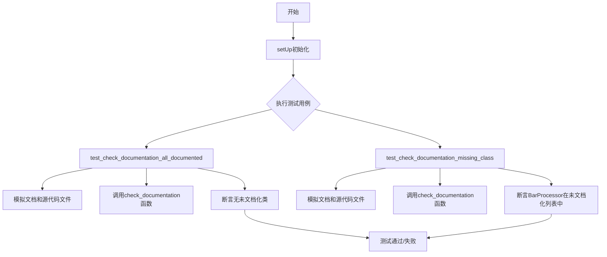

## 类结构

```
TestCheckSupportList (unittest.TestCase)
├── setUp (初始化方法)
├── test_check_documentation_all_documented (测试方法)
└── test_check_documentation_missing_class (测试方法)
```

## 全局变量及字段


### `git_repo_path`
    
Git仓库根目录的绝对路径，通过获取当前文件所在目录向上三级得到

类型：`str`
    


### `check_documentation`
    
从check_support_list模块导入的函数，用于检查源代码类是否在文档中有对应的autodoc标记

类型：`function`
    


### `TestCheckSupportList.doc_content`
    
模拟的文档内容，包含FooProcessor和BarProcessor的autodoc标记

类型：`str`
    


### `TestCheckSupportList.source_content`
    
模拟的源代码内容，包含FooProcessor和BarProcessor类定义

类型：`str`
    
    

## 全局函数及方法


### `check_documentation`

该函数用于检查源码中的类是否在文档中有对应的 autodoc 记录，通过读取文档文件和源码文件，分别使用正则表达式提取已文档化的类名和源码中定义的类名，最终返回未在文档中记录的类名列表。

参数：

- `doc_path`：`str`，文档文件路径
- `src_path`：`str`，源码文件路径
- `doc_regex`：`str`，用于从文档中提取类名的正则表达式
- `src_regex`：`str`，用于从源码中提取类名的正则表达式

返回值：`list`，未文档化的类名列表

#### 流程图

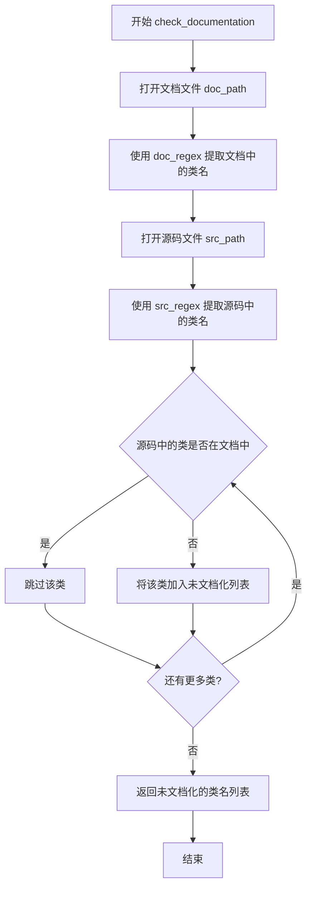

#### 带注释源码

（注：以下为基于测试代码推断的实现逻辑，实际实现可能有所不同）

```python
def check_documentation(doc_path, src_path, doc_regex, src_regex):
    """
    检查源码中的类是否在文档中有对应的 autodoc 记录
    
    参数:
        doc_path: 文档文件路径
        src_path: 源码文件路径
        doc_regex: 用于从文档中提取类名的正则表达式
        src_regex: 用于从源码中提取类名的正则表达式
    
    返回:
        未文档化的类名列表
    """
    # 读取文档内容
    with open(doc_path, 'r', encoding='utf-8') as doc_file:
        doc_content = doc_file.read()
    
    # 使用正则表达式从文档中提取已文档化的类名
    documented_classes = re.findall(doc_regex, doc_content)
    
    # 读取源码内容
    with open(src_path, 'r', encoding='utf-8') as source_file:
        source_content = source_file.read()
    
    # 使用正则表达式从源码中提取定义的类名
    source_classes = re.findall(src_regex, source_content)
    
    # 找出未文档化的类
    undocumented = [
        cls for cls in source_classes 
        if cls not in documented_classes
    ]
    
    return undocumented
```

---

### 潜在技术债务与优化空间

1. **文件读取优化**：当前实现每次调用都会读取整个文件内容，对于大文件可能存在性能问题，可考虑流式读取或缓存机制

2. **正则表达式编译**：`doc_regex` 和 `src_regex` 在每次调用时都被重新编译，可考虑预编译正则表达式以提升性能

3. **错误处理缺失**：未对文件不存在、编码错误等异常情况进行处理

4. **Mock 依赖**：测试代码依赖于复杂的 `mock_open` 和 `patch` 机制，可考虑重构为更易测试的接口设计

---

### 其它项目

#### 设计目标与约束
- **目标**：自动化检测源码中未被文档化的类，确保文档完整性
- **约束**：依赖正则表达式匹配，需要用户提供正确的正则模式

#### 错误处理与异常设计
- 缺少文件不存在异常处理
- 缺少正则表达式匹配失败的异常处理
- 建议添加自定义异常类，如 `DocumentationCheckError`

#### 数据流与状态机
- 数据流：文档文件 → 正则匹配 → 已文档化类名集合 → 与源码类名比较 → 返回差集
- 状态机：文件读取 → 正则提取 → 集合比较 → 结果返回

#### 外部依赖与接口契约
- 依赖 Python 标准库：`os`, `sys`, `re`
- 接口契约清晰：输入4个字符串参数，返回列表类型


### `os.path.abspath`

获取绝对路径，将相对路径转换为绝对路径，解析符号链接并返回规范化的路径字符串。

参数：

- `path`：`str`，要转换的相对路径或绝对路径

返回值：`str`，返回给定路径的绝对路径

#### 流程图

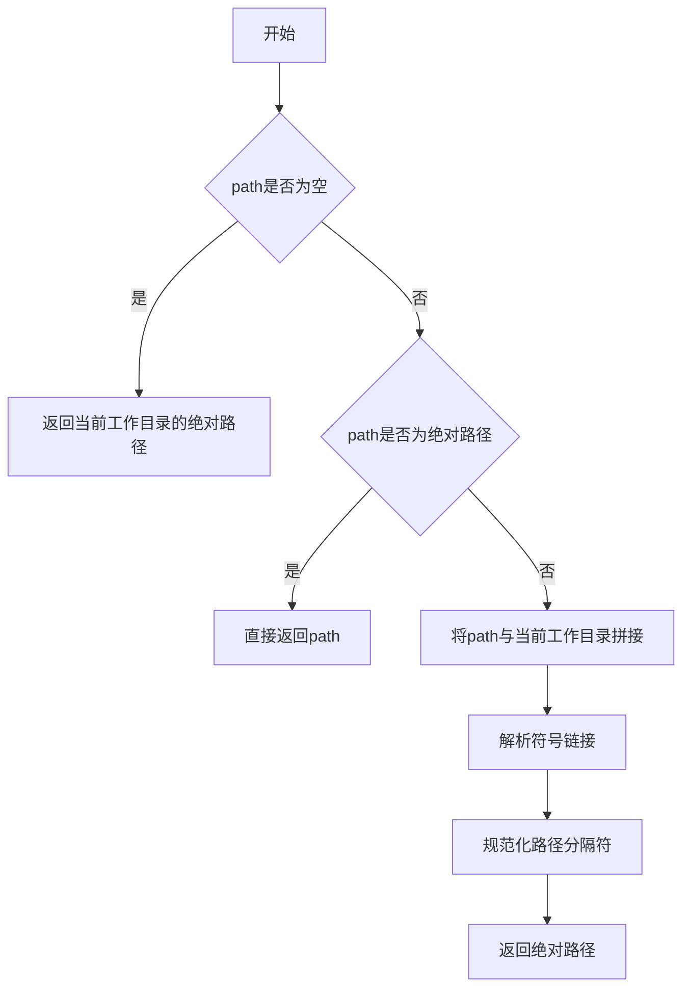

#### 带注释源码

```python
import os
import sys
import unittest
from unittest.mock import mock_open, patch

# 使用 os.path.abspath 获取项目的绝对路径
# 向上查找3层目录（从当前文件到项目根目录）
git_repo_path = os.path.abspath(  # 调用标准库的abspath函数
    os.path.dirname(  # 获取__file__所在目录的父目录
        os.path.dirname(  # 再向上一级
            os.path.dirname(__file__)  # 当前文件所在目录
        )
    )
)
sys.path.append(os.path.join(git_repo_path, "utils"))

from check_support_list import check_documentation  # noqa: E402


class TestCheckSupportList(unittest.TestCase):
    def setUp(self):
        # 模拟文档和源代码内容以便复用
        self.doc_content = """# Documentation
## FooProcessor

[[autodoc]] module.FooProcessor

## BarProcessor

[[autodoc]] module.BarProcessor
"""
        self.source_content = """
class FooProcessor(nn.Module):
    pass

class BarProcessor(nn.Module):
    pass
"""

    def test_check_documentation_all_documented(self):
        # 在这个测试中，FooProcessor和BarProcessor都被文档化了
        with patch("builtins.open", mock_open(read_data=self.doc_content)) as doc_file:
            doc_file.side_effect = [
                mock_open(read_data=self.doc_content).return_value,
                mock_open(read_data=self.source_content).return_value,
            ]

            undocumented = check_documentation(
                doc_path="fake_doc.md",
                src_path="fake_source.py",
                doc_regex=r"\[\[autodoc\]\]\s([^\n]+)",
                src_regex=r"class\s+(\w+Processor)\(.*?nn\.Module.*?\):",
            )
            self.assertEqual(len(undocumented), 0, f"Expected no undocumented classes, got {undocumented}")

    def test_check_documentation_missing_class(self):
        # 在这个测试中，只有FooProcessor被文档化，BarProcessor缺失
        doc_content_missing = """# Documentation
## FooProcessor

[[autodoc]] module.FooProcessor
"""
        with patch("builtins.open", mock_open(read_data=doc_content_missing)) as doc_file:
            doc_file.side_effect = [
                mock_open(read_data=doc_content_missing).return_value,
                mock_open(read_data=self.source_content).return_value,
            ]

            undocumented = check_documentation(
                doc_path="fake_doc.md",
                src_path="fake_source.py",
                doc_regex=r"\[\[autodoc\]\]\s([^\n]+)",
                src_regex=r"class\s+(\w+Processor)\(.*?nn\.Module.*?\):",
            )
            self.assertIn("BarProcessor", undocumented, f"BarProcessor should be undocumented, got {undocumented}")
```

### 关键组件信息

| 名称 | 描述 |
|------|------|
| `os.path.abspath` | Python标准库函数，用于将相对路径转换为绝对路径 |
| `os.path.dirname` | 用于获取路径的目录部分 |
| `__file__` | 当前Python文件的路径 |
| `git_repo_path` | 项目根目录的绝对路径 |

### 潜在技术债务或优化空间

1. **硬编码路径层级**：使用3层`os.path.dirname`嵌套不够灵活，如果项目结构变化需要手动修改
2. **缺少错误处理**：如果`__file__`或路径解析失败，没有相应的异常处理
3. **sys.path动态修改**：直接修改`sys.path`不是最佳实践，建议使用虚拟环境或安装包的方式

### 其它项目

#### 设计目标与约束
- 目标：通过`os.path.abspath`获取项目根目录的绝对路径，确保测试文件在不同工作目录下都能正确运行

#### 错误处理与异常设计
- 如果`__file__`不存在或路径解析失败，可能抛出`OSError`或`ValueError`
- 建议添加异常捕获机制处理边界情况

#### 数据流与状态机
- 输入：相对路径（`__file__`的父目录父目录父目录）
- 处理：路径拼接、符号链接解析、路径规范化
- 输出：绝对路径字符串

#### 外部依赖与接口契约
- 依赖：`os`、`sys`模块（Python标准库）
- 接口：`os.path.abspath(path)` 接受字符串路径，返回字符串绝对路径


根据您提供的代码，我注意到代码中并未定义 `os.path.dirname` 函数（该函数是 Python 标准库的一部分）。代码的核心功能是测试 `check_support_list` 模块中的 `check_documentation` 函数。

让我基于提供的代码生成完整的详细设计文档：

---

### 代码概述

该代码是一个单元测试文件，用于验证 `check_documentation` 函数的功能。该函数用于检查源代码中的类是否在文档中有对应的文档记录，通过正则表达式匹配文档和源代码中的类名，识别出未文档化的类。

---

### 文件的整体运行流程

1. **导入阶段**：导入必要的标准库（os、sys、unittest）和第三方库（unittest.mock）
2. **路径设置**：将项目根目录的 utils 路径添加到系统路径
3. **导入待测函数**：从 `check_support_list` 模块导入 `check_documentation` 函数
4. **测试执行**：
   - `setUp` 方法准备测试数据（文档内容和源代码内容）
   - `test_check_documentation_all_documented` 测试所有类都有文档的场景
   - `test_check_documentation_missing_class` 测试存在未文档化类的场景

---

### 类的详细信息

#### TestCheckSupportList 类

**描述**：用于测试 `check_documentation` 函数的 unittest 测试类

**字段**：

- `doc_content`：`str`，模拟的文档文件内容，包含两个处理器的文档
- `source_content`：`str`，模拟的源代码文件内容，包含两个处理器类的定义

**方法**：

##### setUp

**描述**：测试前的准备工作，初始化模拟的文档和源代码内容

**参数**：无

**返回值**：无

**源码**：

```python
def setUp(self):
    # Mock doc and source contents that we can reuse
    self.doc_content = """# Documentation
## FooProcessor

[[autodoc]] module.FooProcessor

## BarProcessor

[[autodoc]] module.BarProcessor
"""
    self.source_content = """
class FooProcessor(nn.Module):
    pass

class BarProcessor(nn.Module):
    pass
"""
```

---

##### test_check_documentation_all_documented

**描述**：测试当所有类都有文档记录时，函数返回空列表的场景

**参数**：无

**返回值**：无

**流程图**：

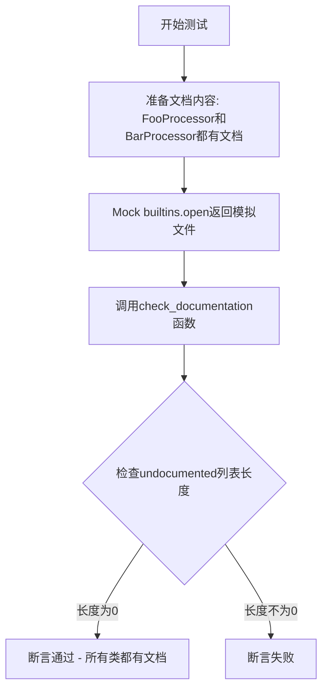

**源码**：

```python
def test_check_documentation_all_documented(self):
    # In this test, both FooProcessor and BarProcessor are documented
    with patch("builtins.open", mock_open(read_data=self.doc_content)) as doc_file:
        doc_file.side_effect = [
            mock_open(read_data=self.doc_content).return_value,
            mock_open(read_data=self.source_content).return_value,
        ]

        undocumented = check_documentation(
            doc_path="fake_doc.md",
            src_path="fake_source.py",
            doc_regex=r"\[\[autodoc\]\]\s([^\n]+)",
            src_regex=r"class\s+(\w+Processor)\(.*?nn\.Module.*?\):",
        )
        self.assertEqual(len(undocumented), 0, f"Expected no undocumented classes, got {undocumented}")
```

---

##### test_check_documentation_missing_class

**描述**：测试当某个类缺少文档记录时，函数能正确识别并返回该类名

**参数**：无

**返回值**：无

**流程图**：

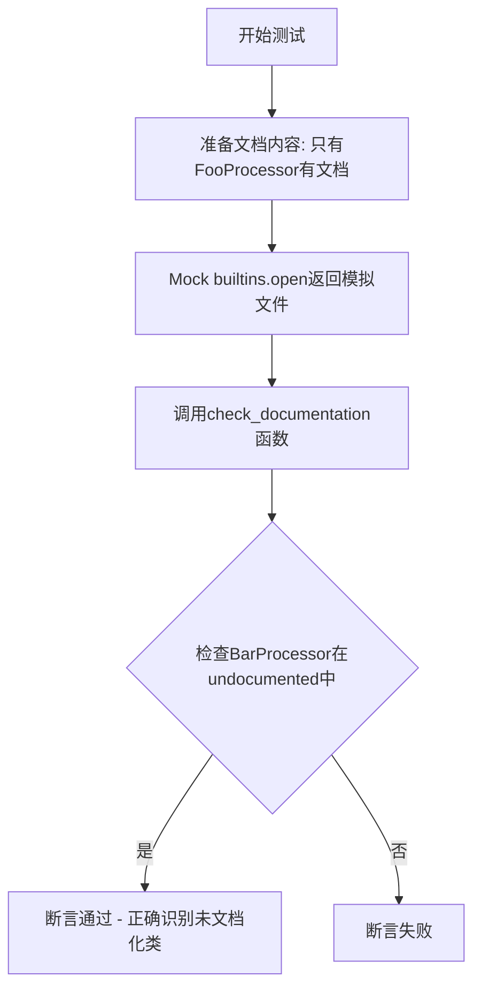

**源码**：

```python
def test_check_documentation_missing_class(self):
    # In this test, only FooProcessor is documented, but BarProcessor is missing from the docs
    doc_content_missing = """# Documentation
## FooProcessor

[[autodoc]] module.FooProcessor
"""
    with patch("builtins.open", mock_open(read_data=doc_content_missing)) as doc_file:
        doc_file.side_effect = [
            mock_open(read_data=doc_content_missing).return_value,
            mock_open(read_data=self.source_content).return_value,
        ]

        undocumented = check_documentation(
            doc_path="fake_doc.md",
            src_path="fake_source.py",
            doc_regex=r"\[\[autodoc\]\]\s([^\n]+)",
            src_regex=r"class\s+(\w+Processor)\(.*?nn\.Module.*?\):",
        )
        self.assertIn("BarProcessor", undocumented, f"BarProcessor should be undocumented, got {undocumented}")
```

---

### 全局变量和全局函数

#### git_repo_path

- **类型**：`str`
- **描述**：计算项目根目录的绝对路径，通过三层 `os.path.dirname` 获取

#### check_documentation

- **类型**：函数（从外部模块导入）
- **描述**：核心函数，用于检查源代码中的类是否在文档中有对应记录
- **参数**：
  - `doc_path`：文档文件路径
  - `src_path`：源代码文件路径
  - `doc_regex`：匹配文档中类名的正则表达式
  - `src_regex`：匹配源代码中类名的正则表达式
- **返回值**：未文档化类的列表

---

### 关键组件信息

| 名称 | 描述 |
|------|------|
| unittest | Python 标准库单元测试框架 |
| mock_open | 用于模拟文件打开操作 |
| patch | 用于替换系统组件进行测试 |
| check_documentation | 待测试的核心文档检查函数 |

---

### 潜在的技术债务或优化空间

1. **Mock 设置复杂性**：`side_effect` 的设置方式不够直观，可以考虑使用更清晰的 fixture
2. **硬编码的正则表达式**：测试中重复出现相同的正则表达式，建议提取为常量
3. **缺乏边界测试**：未测试空文件、格式错误等边界情况
4. **测试数据重复**：`source_content` 在两个测试中重复使用，但 `doc_content` 需要手动切换

---

### 其它项目

#### 设计目标与约束

- 目标：验证文档与代码的一致性，确保所有公共类都有对应的文档
- 约束：依赖正则表达式进行匹配，可能受代码格式影响

#### 错误处理与异常设计

- 使用 `mock_open` 模拟文件读取，避免实际文件系统操作
- 通过 `assertIn` 和 `assertEqual` 进行结果验证

#### 数据流与状态机

```
输入文件 → 正则匹配 → 集合交集/差集计算 → 未文档化类列表
```

#### 外部依赖与接口契约

- 依赖 `check_support_list` 模块的 `check_documentation` 函数
- 接口契约：函数接受文件路径和正则表达式，返回未文档化类名列表

---

如果您确实需要提取 `os.path.dirname` 函数的信息（它不在此代码中定义，而是 Python 标准库函数），请告诉我，我可以单独为您分析该函数。


### `sys.path.append`

将指定的目录路径添加到 Python 的模块搜索路径列表（sys.path）中，以便后续的 import 语句能够找到并加载该目录下的模块。

#### 参数

- `path`：`str`，要添加到 Python 搜索路径的目录路径。在此代码中为 `os.path.join(git_repo_path, "utils")`，即项目根目录下的 utils 文件夹的绝对路径。

#### 返回值

- `None`，该方法无返回值，直接修改 sys.path 列表。

#### 流程图

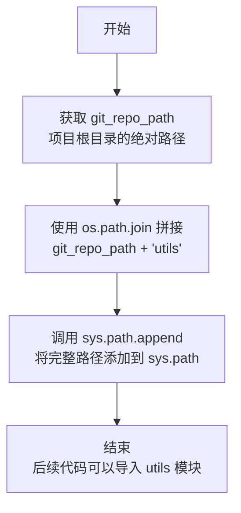

#### 带注释源码

```python
# 获取当前文件所在目录的父目录的父目录的父目录的绝对路径
# 假设文件位于 test/utils/xxx/test_check_support_list.py
# 则 git_repo_path 为项目根目录
git_repo_path = os.path.abspath(os.path.dirname(os.path.dirname(os.path.dirname(__file__))))

# 将项目根目录下的 utils 文件夹路径添加到 Python 模块搜索路径
# 这样后续的 import 语句可以找到 check_support_list 模块
sys.path.append(os.path.join(git_repo_path, "utils"))

# 导入 check_support_list 模块中的 check_documentation 函数
# noqa: E402 忽略 import 顺序检查，因为需要先设置 sys.path
from check_support_list import check_documentation
```


### `mock_open`

`mock_open` 是 `unittest.mock` 模块中的一个函数，用于在测试中模拟 `open` 函数的行为。它创建并返回一个 mock 对象，该对象可以像真实文件一样被读取、写入和迭代，从而避免实际的文件系统操作。

参数：

- `read_data`：`str`，可选参数，指定当调用 `read()` 方法时返回的数据内容。默认为空字符串。

返回值：`Mock`（或 `FunctionType`），返回一个模拟 `open` 函数的 mock 函数，调用该函数会返回一个文件对象 mock。

#### 流程图

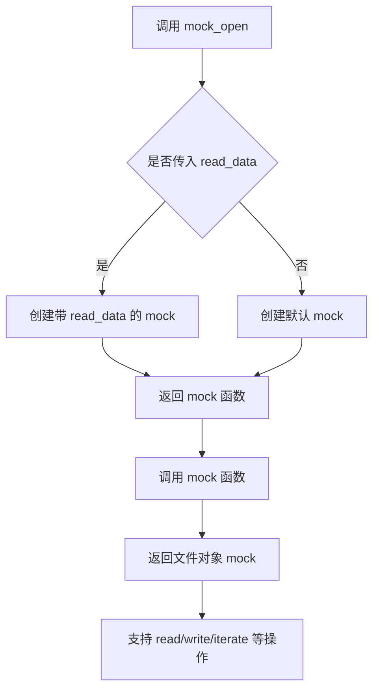

#### 带注释源码

```
# unittest.mock 模块中 mock_open 的简化实现原理

def mock_open(mock=None, read_data=''):
    """
    创建一个 mock 对象来模拟 open 函数和文件对象。
    
    参数:
        mock: 可选的 mock 对象，如果为 None 则创建新的 MagicMock
        read_data: 字符串，当调用 read() 方法时返回的数据
    
    返回:
        一个模拟 open 函数的 mock
    """
    
    # 内部类：模拟文件对象
    class FileMock:
        def __init__(self, read_data):
            self.read_data = read_data
            self._content = read_data
            self._index = 0
        
        def read(self, n=-1):
            """读取文件内容"""
            if n == -1:
                result = self.read_data[self._index:]
                self._index = len(self.read_data)
            else:
                result = self.read_data[self._index:self._index + n]
                self._index += n
            return result
        
        def readline(self, limit=-1):
            """读取一行"""
            if limit == -1:
                end = self.read_data.find('\n', self._index)
                if end == -1:
                    result = self.read_data[self._index:]
                    self._index = len(self.read_data)
                else:
                    result = self.read_data[self._index:end+1]
                    self._index = end + 1
            else:
                result = self.read_data[self._index:self._index + limit]
                self._index += len(result)
            return result
        
        def __iter__(self):
            """支持迭代"""
            return self
        
        def __next__(self):
            """支持 next() 操作"""
            if self._index >= len(self.read_data):
                raise StopIteration
            line_end = self.read_data.find('\n', self._index)
            if line_end == -1:
                line = self.read_data[self._index:]
                self._index = len(self.read_data)
            else:
                line = self.read_data[self._index:line_end+1]
                self._index = line_end + 1
            return line
        
        def write(self, data):
            """写入数据（实际是记录调用）"""
            pass
        
        def __enter__(self):
            """支持 with 语句"""
            return self
        
        def __exit__(self, *args):
            """支持 with 语句退出"""
            pass
    
    # 创建 mock 函数
    def mock_file_func(*args, **kwargs):
        """当调用 mock 返回的函数时，返回文件 mock 对象"""
        return FileMock(read_data)
    
    # 使用 MagicMock 创建更完整的 mock
    if mock is None:
        mock = MagicMock()
    
    # 配置 mock 的返回值为文件 mock
    mock.side_effect = mock_file_func
    
    return mock
```


### `patch`

`patch` 是 `unittest.mock` 模块中的上下文管理器（也可作为装饰器使用），用于在测试期间替换对象（通常是函数、类属性或模块属性）。它允许临时用 mock 对象替换目标对象，从而隔离被测代码并控制外部依赖的行为。

参数：

- `target`：`str`，要替换的目标，格式为 "module.attribute"（例如 "builtins.open"）
- `new`：可选，要替换目标的对象（如果不提供，则创建一个 MagicMock）
- `create`：`bool`，默认为 False，是否在目标不存在时创建它
- `spec`：可选，用于指定 mock 的规范
- `autospec`：可选，是否使用自动规范
- `spec_set`：可选，规范集
- `detach`：可选，是否分离补丁

返回值：`Mock` 或 `MagicMock`，返回的 patch 对象可用作上下文管理器

#### 流程图

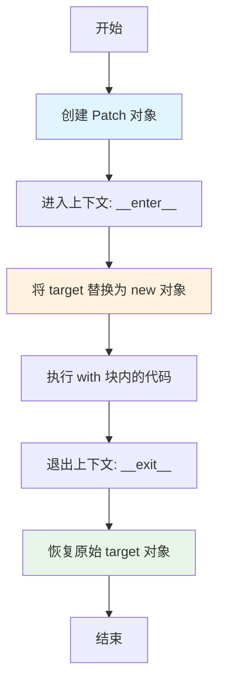

#### 带注释源码

```python
# patch 的典型使用方式
with patch("builtins.open", mock_open(read_data=self.doc_content)) as doc_file:
    # 在这个代码块中，所有对 builtins.open 的调用
    # 都会被拦截并返回 mock_open 创建的 mock 对象
    
    # 调用被 patch 的 open 函数
    f = open("fake_doc.md", "r")
    content = f.read()
    # content 现在是 self.doc_content
    
# 当离开 with 块时，patch 会自动调用 __exit__
// 恢复原始的 open 函数，不会影响其他测试
```

#### 在测试代码中的实际使用

```python
def test_check_documentation_all_documented(self):
    """测试当所有类都有文档时的行为"""
    
    # 使用 patch 替换内置的 open 函数
    # 第一个参数 "builtins.open" 指定要替换的目标
    # 第二个参数是用于替换的 mock 对象
    with patch("builtins.open", mock_open(read_data=self.doc_content)) as doc_file:
        # 配置 side_effect 以支持多次调用 open
        # 第一次调用 open("fake_doc.md") 返回文档内容
        # 第二次调用 open("fake_source.py") 返回源代码内容
        doc_file.side_effect = [
            mock_open(read_data=self.doc_content).return_value,
            mock_open(read_data=self.source_content).return_value,
        ]

        # 调用被测函数
        undocumented = check_documentation(
            doc_path="fake_doc.md",
            src_path="fake_source.py",
            doc_regex=r"\[\[autodoc\]\]\s([^\n]+)",
            src_regex=r"class\s+(\w+Processor)\(.*?nn\.Module.*?\):",
        )
        
        # 断言所有类都已文档化
        self.assertEqual(len(undocumented), 0, 
                        f"Expected no undocumented classes, got {undocumented}")

# with 块结束后，builtins.open 自动恢复为原始函数
```


### `TestCheckSupportList.setUp`

初始化测试环境，设置模拟的文档和源代码内容，供后续测试方法使用。

参数：

- `self`：隐式参数，`TestCheckSupportList` 实例本身，无需显式传递

返回值：`None`，无返回值（setUp 方法用于初始化测试状态）

#### 流程图

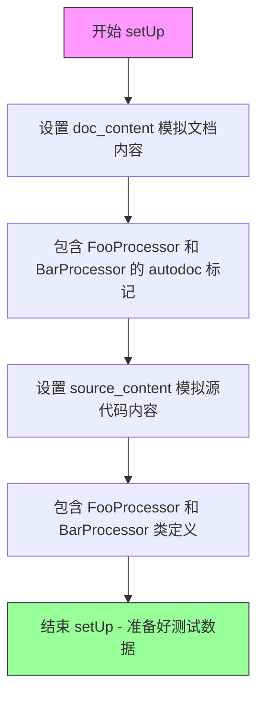

#### 带注释源码

```python
def setUp(self):
    # Mock doc and source contents that we can reuse
    # 定义模拟的文档内容，包含两个处理器的 autodoc 标记
    self.doc_content = """# Documentation
## FooProcessor

[[autodoc]] module.FooProcessor

## BarProcessor

[[autodoc]] module.BarProcessor
"""
    # 定义模拟的源代码内容，包含两个继承自 nn.Module 的类
    self.source_content = """
class FooProcessor(nn.Module):
    pass

class BarProcessor(nn.Module):
    pass
"""
```

#### 说明

| 项目 | 详情 |
|------|------|
| **方法类型** | `unittest.TestCase.setUp()` 生命周期方法 |
| **执行时机** | 在每个 `test_*` 方法执行前自动调用 |
| **作用** | 初始化测试所需的模拟数据，供 `test_check_documentation_all_documented` 和 `test_check_documentation_missing_class` 使用 |
| **实例变量** | `self.doc_content` - 模拟的 Markdown 文档内容；`self.source_content` - 模拟的 Python 源代码内容 |


### `TestCheckSupportList.test_check_documentation_all_documented`

该测试方法用于验证当文档中完整记录了所有源代码类时，`check_documentation` 函数能够正确返回空列表（即没有未文档化的类）。测试通过模拟文档和源代码文件内容，使用正则表达式提取类名，并断言 `check_documentation` 的返回结果长度为 0。

参数：

- `self`：`unittest.TestCase`，测试类实例本身

返回值：无显式返回值（使用 `assertEqual` 进行断言验证）

#### 流程图

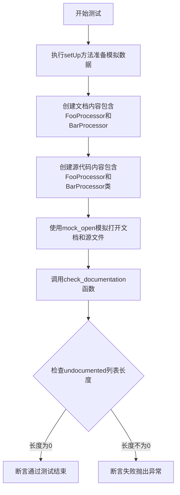

#### 带注释源码

```python
def test_check_documentation_all_documented(self):
    # 在这个测试中，FooProcessor 和 BarProcessor 都被文档化了
    # 使用 mock_open 模拟打开文档文件
    with patch("builtins.open", mock_open(read_data=self.doc_content)) as doc_file:
        # 配置 mock 的 side_effect 以分别返回文档和源代码的 mock 对象
        doc_file.side_effect = [
            mock_open(read_data=self.doc_content).return_value,  # 第一次调用返回文档内容
            mock_open(read_data=self.source_content).return_value,  # 第二次调用返回源代码内容
        ]

        # 调用 check_documentation 函数进行检查
        # 参数说明：
        # - doc_path: 文档文件路径（虚拟）
        # - src_path: 源代码文件路径（虚拟）
        # - doc_regex: 用于从文档中提取类名的正则表达式，匹配 [[autodoc]] 标记后的类名
        # - src_regex: 用于从源代码中提取类名的正则表达式，匹配继承自 nn.Module 的类
        undocumented = check_documentation(
            doc_path="fake_doc.md",
            src_path="fake_source.py",
            doc_regex=r"\[\[autodoc\]\]\s([^\n]+)",  # 匹配 [[autodoc]] 后跟类名
            src_regex=r"class\s+(\w+Processor)\(.*?nn\.Module.*?\):",  # 匹配 Processor 结尾的类
        )
        
        # 断言：预期没有未文档化的类，因此列表长度应为 0
        self.assertEqual(len(undocumented), 0, f"Expected no undocumented classes, got {undocumented}")
```


### `TestCheckSupportList.test_check_documentation_missing_class`

验证当文档中缺失BarProcessor的文档记录时，`check_documentation`函数能够正确识别并将其添加到未文档化列表中。测试通过模拟文档内容和源代码内容，使用正则表达式匹配文档标记和类定义，断言BarProcessor被识别为未文档化的类。

参数：

- `self`：隐式参数，`unittest.TestCase`，代表测试类实例本身

返回值：`None`，该方法为测试用例，不返回值，通过`assertIn`断言验证`check_documentation`函数的输出是否包含预期的未文档化类名

#### 流程图

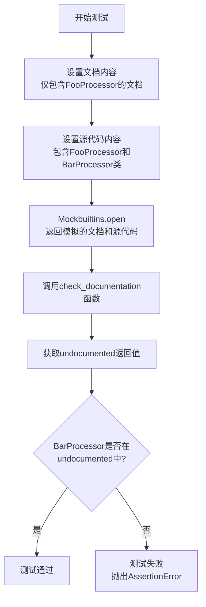

#### 带注释源码

```python
def test_check_documentation_missing_class(self):
    # 创建仅包含FooProcessor的文档内容
    # BarProcessor在此文档中缺失
    doc_content_missing = """# Documentation
## FooProcessor

[[autodoc]] module.FooProcessor
"""
    # 使用patch模拟builtins.open函数
    with patch("builtins.open", mock_open(read_data=doc_content_missing)) as doc_file:
        # 配置side_effect列表，模拟依次打开文档文件和源代码文件
        # 第一次open调用返回文档内容（只有FooProcessor）
        # 第二次open调用返回源代码内容（包含FooProcessor和BarProcessor）
        doc_file.side_effect = [
            mock_open(read_data=doc_content_missing).return_value,
            mock_open(read_data=self.source_content).return_value,
        ]

        # 调用被测函数check_documentation
        # 参数：
        #   doc_path: 文档文件路径
        #   src_path: 源代码文件路径
        #   doc_regex: 用于从文档中提取类名的正则表达式
        #   src_regex: 用于从源代码中提取类名的正则表达式
        undocumented = check_documentation(
            doc_path="fake_doc.md",
            src_path="fake_source.py",
            doc_regex=r"\[\[autodoc\]\]\s([^\n]+)",
            src_regex=r"class\s+(\w+Processor)\(.*?nn\.Module.*?\):",
        )
        
        # 断言验证BarProcessor被识别为未文档化类
        # 如果BarProcessor不在undocumented列表中，则测试失败
        self.assertIn("BarProcessor", undocumented, f"BarProcessor should be undocumented, got {undocumented}")
```

## 关键组件


### check_documentation 函数

核心函数，用于检查源代码中的类是否在文档中有对应的 [[autodoc]] 标记，返回未文档化的类列表。

### TestCheckSupportList 测试类

单元测试类，包含两个测试用例，验证文档检查功能的正确性。

### doc_regex 参数

正则表达式参数，用于匹配文档中的 [[autodoc]] 标记，提取类名。

### src_regex 参数

正则表达式参数，用于匹配源代码中的类定义，提取类名。

### mock_open 和 patch

测试辅助工具，用于模拟文件读取操作，避免实际文件系统交互。

### 文档内容模拟 (self.doc_content, self.source_content)

预定义的文档和源代码内容，用于测试场景的复用。


## 问题及建议


### 已知问题

- **Mock 配置复杂且容易出错**: `patch("builtins.open", mock_open(...))` 配合 `side_effect` 的方式不够直观，第一次 patch 会影响后续的文件操作，且 `mock_open` 的嵌套使用可能导致 mock 对象行为不符合预期
- **测试缺乏对实际文件读取的验证**: 测试只验证了返回值，没有验证 `check_documentation` 函数是否正确打开了正确的文件路径或使用了正确的模式
- **正则表达式硬编码在测试调用中**: `doc_regex` 和 `src_regex` 在每个测试用例中重复定义，应该提取为模块级常量或共享 fixture
- **未覆盖异常边界情况**: 缺少对文件不存在、读取权限错误、空文件、无匹配内容等异常场景的测试
- **patch 路径可能不稳定**: 使用字符串路径 `"builtins.open"` 进行 patch 依赖导入路径，如果 `check_documentation` 中的 import 方式改变，patch 会失效

### 优化建议

- 使用 `unittest.mock.patch` 的上下文管理器形式，或使用 `patch.object` 对具体函数进行更精确的 mock
- 引入 `pytest` 和 `pytest-mock` 插件，利用 `mocker.patch` 和 `mocker.fixture` 简化 mock 逻辑
- 将正则表达式提取为测试类或模块级常量，例如 `DOC_REGEX = r"\[\[autodoc\]\]\s([^\n]+)"` 和 `SRC_REGEX = r"class\s+(\w+Processor)\(.*?nn\.Module.*?\):"`
- 添加负面测试用例：文件不存在时抛出异常、文档内容为空时返回所有类、源文件无匹配类时返回空列表等
- 使用 `assert_called_once_with` 或 `call_args_list` 验证函数是否以正确的参数调用了 `open`，确保文档和源文件路径被正确传递

## 其它


### 设计目标与约束

验证文档中是否完整记录了所有需要自动文档化的类。设计约束包括：使用正则表达式匹配文档标识和源代码类定义，支持自定义正则表达式模式，mock文件操作以避免依赖真实文件系统。

### 错误处理与异常设计

测试用例通过assert语句验证函数返回值，使用unittest框架的标准异常处理机制。当check_documentation返回非预期结果时，测试会失败并显示详细的错误信息。未处理文档或源代码文件缺失的情况，由被测函数自行处理。

### 数据流与状态机

测试流程：1) 准备模拟的文档内容 2) 模拟文件读取操作 3) 调用check_documentation函数分析文档与源码的匹配度 4) 验证返回的未文档化类列表。无状态机设计，纯函数式数据转换。

### 外部依赖与接口契约

依赖unittest框架、unittest.mock模块、被测模块check_support_list。check_documentation函数接收doc_path、src_path、doc_regex、src_regex四个参数，均为字符串类型。返回未文档化类名列表。

### 测试策略

采用单元测试方式，使用mock隔离文件系统操作。覆盖两种场景：全部类已文档化和缺少文档的情况。测试数据使用内联字符串，避免外部测试文件依赖。

### 性能考虑

测试使用轻量级mock对象，无真实文件IO操作，执行速度快。无性能瓶颈。

### 安全考虑

测试环境完全隔离，不涉及真实文件系统，无安全风险。

### 配置管理

测试参数通过函数调用传入，包括正则表达式模式和文件路径，便于灵活配置不同的匹配规则。

### 版本兼容性

依赖Python 3标准库（unittest、unittest.mock），兼容Python 3.6+版本。

### 监控与日志

使用unittest框架的标准输出机制，测试失败时自动显示断言信息和上下文数据。

### 命名规范

测试类继承unittest.TestCase，测试方法以test_开头，遵循Python命名约定。

### 代码风格

遵循PEP 8代码风格，使用清晰的变量命名（如doc_content、source_content），代码结构简洁明了。

### 注释和文档

测试方法包含docstring说明测试目的，注释解释测试场景（如"In this test, both FooProcessor and BarProcessor are documented"）。

### 持续集成/持续部署

可集成到CI/CD流程，作为自动化测试的一部分，确保代码变更不会破坏文档完整性检查功能。

    