# `diffusers\tests\others\test_config.py` 详细设计文档

这是一个测试文件，用于验证diffusers库中ConfigMixin配置混入类的功能，包括配置的注册、保存、加载、默认值处理以及路径类型转换等核心功能。

## 整体流程

```mermaid
graph TD
    A[开始] --> B[定义SampleObject类]
B --> C[使用@register_to_config装饰器]
C --> D[实例化SampleObject]
D --> E{是否传入参数?}
E -- 是 --> F[使用传入参数创建config]
E -- 否 --> G[使用默认参数创建config]
F --> H[保存config到临时目录]
G --> H
H --> I[通过from_config加载config]
I --> J{测试不同场景}
J --> K[test_register_to_config: 测试配置注册]
J --> L[test_save_load: 测试保存和加载]
J --> M[test_use_default_values: 测试默认值处理]
J --> N[test_check_path_types: 测试路径类型转换]
J --> O[test_load_ddim_from_pndm等: 测试调度器兼容性]
K --> P[断言验证]
L --> P
M --> P
N --> P
O --> P
P --> Q[结束]
```

## 类结构

```
unittest.TestCase
└── ConfigTester (测试类)

ConfigMixin (被测试的基类)
└── SampleObject 系列
    ├── SampleObject
    ├── SampleObject2
    ├── SampleObject3
    ├── SampleObject4
    └── SampleObjectPaths
```

## 全局变量及字段


### `SampleObject.a`
    
整型配置参数，默认值为2

类型：`int`
    


### `SampleObject.b`
    
整型配置参数，默认值为5

类型：`int`
    


### `SampleObject.c`
    
元组配置参数，默认值为(2, 5)

类型：`tuple`
    


### `SampleObject.d`
    
字符串配置参数，默认值为'for diffusion'

类型：`str`
    


### `SampleObject.e`
    
列表配置参数，默认值为[1, 3]

类型：`list`
    


### `SampleObject2.a`
    
整型配置参数，默认值为2

类型：`int`
    


### `SampleObject2.b`
    
整型配置参数，默认值为5

类型：`int`
    


### `SampleObject2.c`
    
元组配置参数，默认值为(2, 5)

类型：`tuple`
    


### `SampleObject2.d`
    
字符串配置参数，默认值为'for diffusion'

类型：`str`
    


### `SampleObject2.f`
    
列表配置参数，默认值为[1, 3]

类型：`list`
    


### `SampleObject3.a`
    
整型配置参数，默认值为2

类型：`int`
    


### `SampleObject3.b`
    
整型配置参数，默认值为5

类型：`int`
    


### `SampleObject3.c`
    
元组配置参数，默认值为(2, 5)

类型：`tuple`
    


### `SampleObject3.d`
    
字符串配置参数，默认值为'for diffusion'

类型：`str`
    


### `SampleObject3.e`
    
列表配置参数，默认值为[1, 3]

类型：`list`
    


### `SampleObject3.f`
    
列表配置参数，默认值为[1, 3]

类型：`list`
    


### `SampleObject4.a`
    
整型配置参数，默认值为2

类型：`int`
    


### `SampleObject4.b`
    
整型配置参数，默认值为5

类型：`int`
    


### `SampleObject4.c`
    
元组配置参数，默认值为(2, 5)

类型：`tuple`
    


### `SampleObject4.d`
    
字符串配置参数，默认值为'for diffusion'

类型：`str`
    


### `SampleObject4.e`
    
列表配置参数，默认值为[1, 5]

类型：`list`
    


### `SampleObject4.f`
    
列表配置参数，默认值为[5, 4]

类型：`list`
    


### `SampleObjectPaths.test_file_1`
    
路径类型配置参数，默认值为Path('foo/bar')

类型：`Path`
    


### `SampleObjectPaths.test_file_2`
    
路径类型配置参数，默认值为Path('foo bar\bar')

类型：`Path`
    
    

## 全局函数及方法


### `CaptureLogger`

这是一个测试工具函数，用于捕获指定 logger 的输出内容，通常用于单元测试中验证代码是否按预期产生日志信息。

参数：

-  `logger`：Python `logging.Logger` 对象，需要捕获其输出的 logger 实例

返回值：`CaptureLogger` 上下文管理器对象，该对象包含一个 `out` 属性（`str` 类型），存储捕获的日志输出内容

#### 流程图

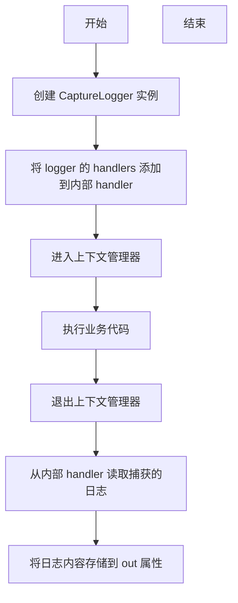

#### 带注释源码

```
# 注意：此函数的实际定义不在当前代码文件中
# 而是从 ..testing_utils 模块导入
from ..testing_utils import CaptureLogger

# 使用示例（来自当前代码）：
logger = logging.get_logger("diffusers.configuration_utils")
# 30 for warning
logger.setLevel(30)

with CaptureLogger(logger) as cap_logger:
    ddim = DDIMScheduler.from_pretrained(
        "hf-internal-testing/tiny-stable-diffusion-torch", subfolder="scheduler"
    )

# 验证日志输出
assert ddim.__class__ == DDIMScheduler
# no warning should be thrown
assert cap_logger.out == ""
```

---

**注意**：该函数的完整源代码定义不在提供的代码块中。根据使用方式可以推断：
- `CaptureLogger` 是 `..testing_utils` 模块中的一个上下文管理器类
- 实现了 `__enter__` 和 `__exit__` 方法
- 内部应该包含一个 `StringIO` 或类似的缓冲区来捕获日志
- `out` 属性用于存储捕获的日志文本内容


### SampleObject.__init__

该方法是 `SampleObject` 类的初始化方法，使用 `@register_to_config` 装饰器修饰，用于初始化对象并将所有参数自动注册到配置对象中，以便后续的序列化与反序列化操作。

参数：

- `a`：`int`，整型参数，默认值为 2，用于测试配置注册的基本类型
- `b`：`int`，整型参数，默认值为 5，用于测试配置注册的基本类型
- `c`：`tuple`，元组参数，默认值为 (2, 5)，用于测试元组类型的配置注册
- `d`：`str`，字符串参数，默认值为 "for diffusion"，用于测试字符串类型的配置注册
- `e`：`list`，列表参数，默认值为 [1, 3]，用于测试列表类型的配置注册

返回值：`None`，该方法没有显式返回值，仅执行 `pass` 语句

#### 流程图

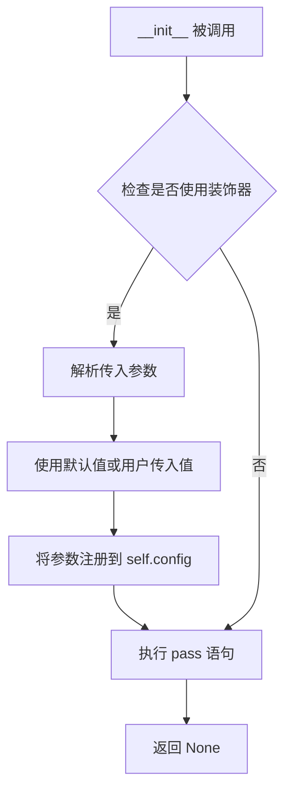

#### 带注释源码

```python
@register_to_config  # 装饰器：将 __init__ 参数自动注册到 self.config 对象中
def __init__(
    self,
    a=2,              # 整型参数，默认值为 2
    b=5,              # 整型参数，默认值为 5
    c=(2, 5),         # 元组参数，默认值为 (2, 5)
    d="for diffusion", # 字符串参数，默认值为 "for diffusion"
    e=[1, 3],         # 列表参数，默认值为 [1, 3]
):
    """
    SampleObject 的初始化方法
    
    参数:
        a: 整型参数，默认值为 2
        b: 整型参数，默认值为 5
        c: 元组参数，默认值为 (2, 5)
        d: 字符串参数，默认值为 "for diffusion"
        e: 列表参数，默认值为 [1, 3]
    
    注意:
        该方法被 @register_to_config 装饰器修饰，
        所有参数会自动注册到 self.config 中，
        用于后续的配置保存和加载
    """
    pass  # 方法体为空，参数注册由装饰器完成
```


### `SampleObject2.__init__`

这个方法是 `SampleObject2` 类的初始化方法，使用 `@register_to_config` 装饰器自动将参数注册到配置对象中，使得这些参数可以被序列化、保存和加载。

参数：

- `a`：`int`，默认值为 `2`，第一个整数参数
- `b`：`int`，默认值为 `5`，第二个整数参数
- `c`：元组，默认值为 `(2, 5)`，元组类型参数
- `d`：`str`，默认值为 `"for diffusion"`，字符串参数，用于描述扩散模型相关配置
- `f`：`list`，默认值为 `[1, 3]`，列表类型参数

返回值：`None`，该方法不返回任何值，仅执行配置注册逻辑

#### 流程图

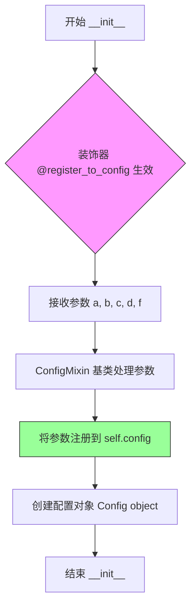

#### 带注释源码

```python
class SampleObject2(ConfigMixin):
    """SampleObject2 类，继承 ConfigMixin，用于测试配置注册功能"""
    
    config_name = "config.json"  # 配置文件名

    @register_to_config  # 装饰器：将参数自动注册到 config 对象中
    def __init__(
        self,
        a=2,              # 参数 a，整数类型，默认值 2
        b=5,              # 参数 b，整数类型，默认值 5
        c=(2, 5),         # 参数 c，元组类型，默认值 (2, 5)
        d="for diffusion", # 参数 d，字符串类型，默认值 "for diffusion"
        f=[1, 3],         # 参数 f，列表类型，默认值 [1, 3]
    ):
        # __init__ 方法体为空，参数注册由 @register_to_config 装饰器完成
        # 装饰器会自动将所有参数（除私有参数外）保存到 self.config 对象中
        pass
```


### `SampleObject3.__init__`

该方法是 `SampleObject3` 类的初始化方法，使用 `@register_to_config` 装饰器装饰，用于初始化配置对象并将参数注册到配置中。

参数：

- `a`：`int`，整数类型参数，默认值为 2
- `b`：`int`，整数类型参数，默认值为 5
- `c`：`tuple`，元组类型参数，默认值为 (2, 5)
- `d`：`str`，字符串类型参数，默认值为 "for diffusion"
- `e`：`list`，列表类型参数，默认值为 [1, 3]
- `f`：`list`，列表类型参数，默认值为 [1, 3]

返回值：`None`，该方法为初始化方法，不返回任何值

#### 流程图

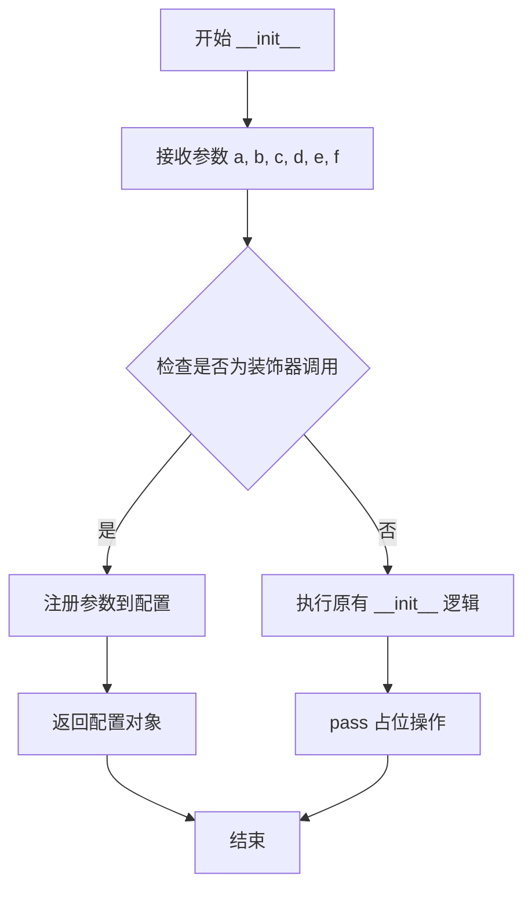

#### 带注释源码

```python
class SampleObject3(ConfigMixin):
    """SampleObject3 类，继承自 ConfigMixin，用于测试配置注册功能"""
    config_name = "config.json"  # 配置文件名

    @register_to_config  # 装饰器：将 __init__ 方法的参数注册到 config 属性中
    def __init__(
        self,
        a=2,              # 参数 a，整数类型，默认值 2
        b=5,              # 参数 b，整数类型，默认值 5
        c=(2, 5),         # 参数 c，元组类型，默认值 (2, 5)
        d="for diffusion",  # 参数 d，字符串类型，默认值 "for diffusion"
        e=[1, 3],         # 参数 e，列表类型，默认值 [1, 3]
        f=[1, 3],         # 参数 f，列表类型，默认值 [1, 3]
    ):
        """
        初始化方法，使用 @register_to_config 装饰器装饰
        该装饰器会将所有带默认值的参数自动注册到 self.config 中
        """
        pass  # 方法体为空，逻辑由装饰器处理
```


### `SampleObject4.__init__`

这是 `SampleObject4` 类的构造函数，使用 `@register_to_config` 装饰器修饰，用于初始化对象并将所有参数注册到配置中。

参数：

- `a`：`int`，参数 a，整数类型参数，默认值为 2
- `b`：`int`，参数 b，整数类型参数，默认值为 5
- `c`：`tuple`，参数 c，元组类型参数，默认值为 (2, 5)
- `d`：`str`，参数 d，字符串类型参数，默认值为 "for diffusion"
- `e`：`list`，参数 e，列表类型参数，默认值为 [1, 5]
- `f`：`list`，参数 f，列表类型参数，默认值为 [5, 4]

返回值：`None`，该方法不返回任何值，但会将参数保存到对象的 config 属性中

#### 流程图

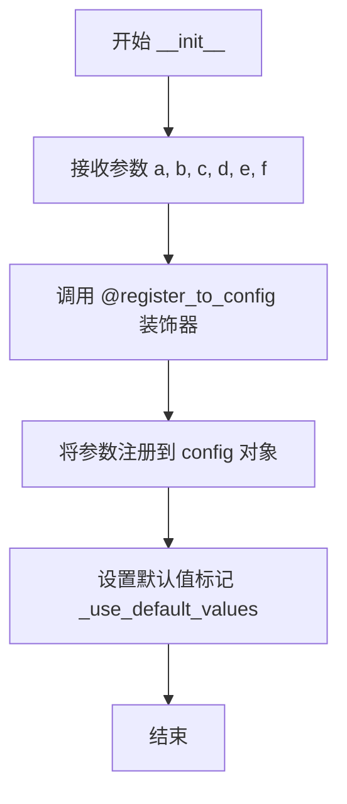

#### 带注释源码

```python
@register_to_config
def __init__(
    self,
    a=2,           # 整数类型参数，默认值为 2
    b=5,           # 整数类型参数，默认值为 5
    c=(2, 5),      # 元组类型参数，默认值为 (2, 5)
    d="for diffusion",  # 字符串类型参数，默认值为 "for diffusion"
    e=[1, 5],      # 列表类型参数，默认值为 [1, 5]
    f=[5, 4],      # 列表类型参数，默认值为 [5, 4]
):
    """
    SampleObject4 类的构造函数
    
    参数:
        a: 整数类型参数，默认值为 2
        b: 整数类型参数，默认值为 5
        c: 元组类型参数，默认值为 (2, 5)
        d: 字符串类型参数，默认值为 "for diffusion"
        e: 列表类型参数，默认值为 [1, 5]
        f: 列表类型参数，默认值为 [5, 4]
    
    注意:
        该方法使用 @register_to_config 装饰器，所有参数会自动注册到 config 属性中
        私有参数（以 _ 开头）会被忽略，不会注册到配置中
    """
    pass
```


### `SampleObjectPaths.__init__`

初始化 `SampleObjectPaths` 对象，并使用 `@register_to_config` 装饰器将构造函数的参数自动注册到配置对象中，支持 Path 类型参数的自动序列化和反序列化。

参数：

- `test_file_1`：`Path`，默认值 `Path("foo/bar")`，测试文件路径参数1
- `test_file_2`：`Path`，默认值 `Path("foo bar\\bar")`，测试文件路径参数2

返回值：`None`，无返回值（`__init__` 方法）

#### 流程图

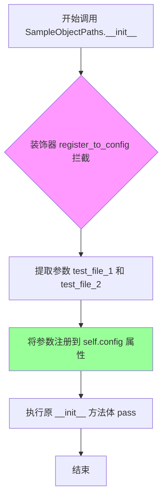

#### 带注释源码

```python
class SampleObjectPaths(ConfigMixin):
    """测试 Path 类型参数序列化与反序列化的示例类"""
    
    config_name = "config.json"  # 配置文件名称

    @register_to_config  # 装饰器：自动将 __init__ 参数注册到 config 属性
    def __init__(
        self, 
        test_file_1=Path("foo/bar"),      # 第一个测试文件路径，默认值 POSIX 风格
        test_file_2=Path("foo bar\\bar")  # 第二个测试文件路径，默认值 Windows 风格
    ):
        """
        初始化方法：
        - 使用 @register_to_config 装饰器将参数自动保存到 self.config
        - 支持 Path 类型参数的序列化（to_json_string）
        - Path 对象会被转换为字符串（使用 as_posix() 方法）
        
        参数:
            test_file_1: Path 类型，默认 Path("foo/bar")
            test_file_2: Path 类型，默认 Path("foo bar\\bar")
        """
        pass  # 方法体为空，配置注册由装饰器完成
```


### `ConfigTester.test_load_not_from_mixin`

验证 ConfigMixin.load_config 在未正确继承或非Mixin类调用时抛出 ValueError 异常，确保配置加载的边界条件检查正确工作。

参数：

- `self`：`ConfigTester`，测试类实例本身，包含测试上下文和断言方法

返回值：`None`，无返回值（测试方法通过 assertRaises 检查异常，不返回任何值）

#### 流程图

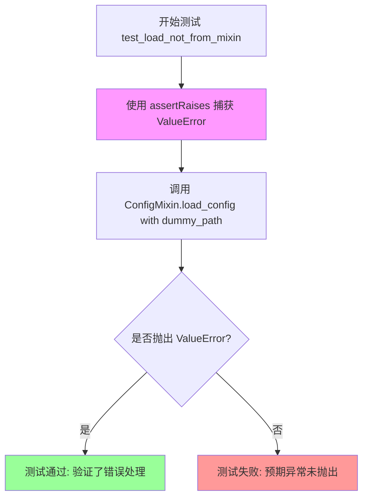

#### 带注释源码

```python
def test_load_not_from_mixin(self):
    """
    测试 ConfigMixin.load_config 在非Mixin类调用时的错误处理。
    
    该测试验证了 ConfigMixin.load_config 方法对非法调用的边界检查，
    确保当直接调用 ConfigMixin.load_config 而非通过继承它的类时，
    会正确抛出 ValueError 异常。
    """
    # 使用 unittest 的 assertRaises 上下文管理器
    # 期望 ConfigMixin.load_config("dummy_path") 抛出 ValueError
    with self.assertRaises(ValueError):
        # 尝试直接调用 ConfigMixin 的类方法，而不是通过子类实例
        # 这应该失败并抛出 ValueError，因为 "dummy_path" 不是有效路径
        # 且该方法设计为通过子类调用
        ConfigMixin.load_config("dummy_path")
```

#### 设计意图与约束

- **测试目标**：验证 ConfigMixin 的静态方法 `load_config` 在直接调用（非通过继承类）时的错误处理机制
- **边界条件**：确保配置加载系统对不合法的调用方式有明确的错误提示
- **预期行为**：当路径参数无效或调用方式不正确时，应抛出 `ValueError` 以告知调用者

#### 潜在的技术债务或优化空间

1. **测试覆盖不足**：该测试仅验证了异常被抛出，未验证具体的错误消息内容，建议增加对错误消息具体内容的断言
2. **缺乏参数化测试**：可以考虑将类似的错误场景参数化，减少重复代码
3. **测试文档缺失**：测试方法缺少详细的文档说明，建议添加 docstring 描述测试的具体场景和预期结果


### `ConfigTester.test_register_to_config`

该方法用于测试`ConfigMixin`类中的`register_to_config`装饰器功能，验证通过该装饰器装饰的`__init__`方法的参数是否能正确注册为配置对象的属性，并正确处理默认值、私有参数覆盖以及位置参数传递等场景。

参数：

- `self`：`unittest.TestCase`，测试用例实例本身

返回值：`None`，无返回值（测试方法）

#### 流程图

```mermaid
flowchart TD
    A[开始测试] --> B[创建SampleObject实例-使用默认参数]
    B --> C[获取obj.config]
    C --> D{断言 config['a'] == 2}
    D -->|是| E{断言 config['b'] == 5}
    D -->|否| F[测试失败]
    E -->|是| G{断言 config['c'] == (2, 5)}
    E -->|否| F
    G -->|是| H{断言 config['d'] == 'for diffusion'}
    G -->|否| F
    H -->|是| I{断言 config['e'] == [1, 3]}
    H -->|否| F
    I -->|是| J[创建SampleObject实例-传入私有参数_name_or_path]
    I -->|否| F
    J --> K[获取config]
    K --> L{验证私有参数被忽略且配置正确}
    L -->|是| M[创建SampleObject实例-c=6覆盖默认值]
    L -->|否| F
    M --> N[获取config]
    N --> O{断言 config['c'] == 6 其他参数保持默认值}
    O -->|是| P[创建SampleObject实例-使用位置参数和关键字参数]
    O -->|否| F
    P --> Q[获取config]
    Q --> R{断言 config['a'] == 1, config['c'] == 6]
    R -->|是| S[测试通过]
    R -->|否| F
```

#### 带注释源码

```python
def test_register_to_config(self):
    """
    测试 register_to_config 装饰器的功能：
    1. 验证默认参数能正确注册到config
    2. 验证私有参数（如_name_or_path）被正确忽略
    3. 验证可以通过关键字参数覆盖默认值
    4. 验证可以使用位置参数
    """
    
    # 测试1：验证默认参数正确注册
    # 创建SampleObject实例，使用所有参数的默认值
    obj = SampleObject()
    # 获取该对象的配置字典
    config = obj.config
    
    # 断言验证配置中的各项值是否符合预期
    assert config["a"] == 2       # 整数默认值
    assert config["b"] == 5       # 整数默认值
    assert config["c"] == (2, 5)  # 元组默认值
    assert config["d"] == "for diffusion"  # 字符串默认值
    assert config["e"] == [1, 3]  # 列表默认值

    # 测试2：验证私有参数被忽略
    # _name_or_path 是一个私有参数，应该被 register_to_config 忽略
    # 即使传入该参数，也不应该影响配置
    obj = SampleObject(_name_or_path="lalala")
    config = obj.config
    # 验证配置保持默认值，私有参数被正确忽略
    assert config["a"] == 2
    assert config["b"] == 5
    assert config["c"] == (2, 5)
    assert config["d"] == "for diffusion"
    assert config["e"] == [1, 3]

    # 测试3：验证可以通过关键字参数覆盖默认值
    # 传入 c=6 覆盖默认的元组 (2, 5)
    obj = SampleObject(c=6)
    config = obj.config
    # 验证 c 被成功覆盖为 6，其他参数保持默认值
    assert config["a"] == 2
    assert config["b"] == 5
    assert config["c"] == 6
    assert config["d"] == "for diffusion"
    assert config["e"] == [1, 3]

    # 测试4：验证可以使用位置参数
    # 第一个位置参数 1 传递给参数 a
    # 关键字参数 c=6 覆盖默认值
    obj = SampleObject(1, c=6)
    config = obj.config
    # 验证位置参数和关键字参数都正确生效
    assert config["a"] == 1
    assert config["b"] == 5
    assert config["c"] == 6
    assert config["d"] == "for diffusion"
    assert config["e"] == [1, 3]
```


### ConfigTester.test_save_load

该测试方法用于验证 ConfigMixin 的配置保存和加载功能是否正常工作。它创建 SampleObject 实例，保存配置到临时目录，然后重新加载配置，最后通过断言比较保存前后的配置值是否一致，同时检查 JSON 序列化/反序列化对数据类型（如元组转换为列表）的影响。

参数：

- `self`：无，显式的 unittest.TestCase 实例参数

返回值：`None`，无返回值，通过 assert 断言验证配置的保存和加载逻辑

#### 流程图

```mermaid
flowchart TD
    A[开始测试] --> B[创建 SampleObject 实例 obj]
    B --> C[获取 obj 的 config 属性]
    C --> D[断言 config 中的初始值: a=2, b=5, c=(2,5), d='for diffusion', e=[1,3]]
    D --> E[创建临时目录 tmpdirname]
    E --> F[调用 obj.save_config 保存配置到临时目录]
    F --> G[调用 SampleObject.load_config 读取配置]
    G --> H[调用 SampleObject.from_config 重新创建对象 new_obj]
    H --> I[获取 new_obj 的 config 属性 new_config]
    I --> J[将 config 和 new_config 转换为 dict]
    J --> K[从 config 中弹出 c 并断言为元组 (2,5)]
    K --> L[从 new_config 中弹出 c 并断言为列表 [2,5]]
    L --> M[弹出 _use_default_values 键]
    M --> N[断言 config 与 new_config 相等]
    N --> O[结束测试]
```

#### 带注释源码

```python
def test_save_load(self):
    # 1. 创建一个 SampleObject 实例，使用默认参数
    obj = SampleObject()
    # 2. 获取该对象的配置对象（ConfigMixin 会将 init 参数存储在 config 属性中）
    config = obj.config

    # 3. 断言初始配置值是否符合预期
    assert config["a"] == 2          # 默认整数参数 a=2
    assert config["b"] == 5          # 默认整数参数 b=5
    assert config["c"] == (2, 5)     # 默认元组参数 c=(2, 5)
    assert config["d"] == "for diffusion"  # 默认字符串参数 d
    assert config["e"] == [1, 3]     # 默认列表参数 e=[1, 3]

    # 4. 使用 tempfile 创建临时目录用于保存配置
    with tempfile.TemporaryDirectory() as tmpdirname:
        # 5. 调用 save_config 方法将配置保存到指定目录
        #    这会创建一个 config.json 文件，包含所有配置参数
        obj.save_config(tmpdirname)
        
        # 6. 使用 load_config 读取保存的配置文件，返回字典
        # 7. 使用 from_config 根据配置字典创建新的 SampleObject 实例
        new_obj = SampleObject.from_config(SampleObject.load_config(tmpdirname))
        # 8. 获取新对象的配置
        new_config = new_obj.config

    # 9. 将配置对象转换为普通字典（解冻配置，以便进行比较）
    #    ConfigMixin 的 config 默认可能是特殊对象
    config = dict(config)
    new_config = dict(new_config)

    # 10. 验证 JSON 序列化/反序列化对数据类型的影响
    #     元组 (2, 5) 在 JSON 中保存为列表 [2, 5]，加载后也是列表
    assert config.pop("c") == (2, 5)        # 原始配置中 c 是元组
    assert new_config.pop("c") == [2, 5]    # 加载后 c 变成列表（JSON 序列化导致）

    # 11. 移除内部使用的默认值为 _use_default_values，不参与比较
    config.pop("_use_default_values")
    
    # 12. 断言除 c 之外的其他配置值完全一致
    assert config == new_config
```


### `ConfigTester.test_load_ddim_from_pndm`

这是一个单元测试方法，用于验证从预训练模型加载 DDIMScheduler 时能够正确加载且不产生任何警告。该测试确保在将配置从一个调度器（如 PNDM）加载到另一个调度器（DDIM）时，系统不会发出弃用或兼容性警告。

参数：

- `self`：`unittest.TestCase`，代表测试用例的实例本身

返回值：`None`，该方法为测试方法，不返回任何值

#### 流程图

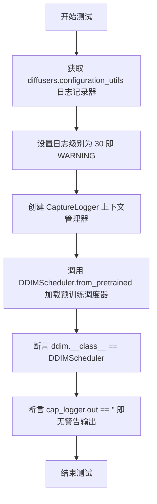

#### 带注释源码

```python
def test_load_ddim_from_pndm(self):
    """
    测试从预训练模型加载 DDIMScheduler 调度器时不会产生警告。
    
    该测试验证从 PNDM 调度器的配置加载到 DDIM 调度器时，
    ConfigMixin 的配置兼容性能正常工作且不触发弃用警告。
    """
    # 获取 diffusers 配置工具的日志记录器
    logger = logging.get_logger("diffusers.configuration_utils")
    
    # 30 对应 logging.WARNING 级别，仅捕获警告及以上级别的日志
    # 这样可以确保测试不会因为信息级别的日志而失败
    logger.setLevel(30)

    # 使用 CaptureLogger 上下文管理器捕获日志输出
    # CaptureLogger 是测试工具类，用于拦截并保存日志消息
    with CaptureLogger(logger) as cap_logger:
        # 从 HuggingFace Hub 加载预训练的 DDIM 调度器配置
        # subfolder="scheduler" 指定在模型仓库的 scheduler 目录下查找配置
        ddim = DDIMScheduler.from_pretrained(
            "hf-internal-testing/tiny-stable-diffusion-torch", 
            subfolder="scheduler"
        )

    # 断言1：验证加载的调度器实例类型正确
    assert ddim.__class__ == DDIMScheduler
    
    # 断言2：验证在加载过程中没有产生任何警告日志
    # 如果配置不兼容或存在弃用问题，会产生警告并被 CaptureLogger 捕获
    assert cap_logger.out == ""
```


### `ConfigTester.test_load_euler_from_pndm`

该测试方法用于验证从预训练模型加载 EulerDiscreteScheduler 调度器时能够正确配置且不产生任何警告。通过设置日志级别为 WARNING（30），并使用 CaptureLogger 捕获日志输出，最后断言调度器类型正确且无警告信息输出，从而确保调度器加载流程符合预期。

参数：

- `self`：`ConfigTester`，代表测试类实例本身，无需显式传递

返回值：`None`，该方法为测试方法，不返回任何值

#### 流程图

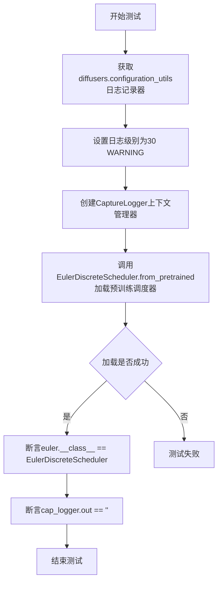

#### 带注释源码

```python
def test_load_euler_from_pndm(self):
    """
    测试从预训练模型加载 EulerDiscreteScheduler 调度器时不会产生警告。
    该测试确保调度器能够正确从 HuggingFace Hub 的预训练模型中加载，
    并且在加载过程中不会触发任何弃用或配置警告。
    """
    # 获取 diffusers.configuration_utils 模块的日志记录器
    # 用于后续捕获调度器加载过程中的日志输出
    logger = logging.get_logger("diffusers.configuration_utils")
    
    # 30 对应 logging.WARNING 级别
    # 设置日志级别为 WARNING，这样 INFO 和 DEBUG 级别的日志不会被记录
    # 确保只有 WARNING 及以上级别的日志会被 CaptureLogger 捕获
    logger.setLevel(30)

    # 使用 CaptureLogger 上下文管理器捕获日志输出
    # CaptureLogger 是 diffusers.testing_utils 提供的测试工具
    # 用于在测试中拦截和验证日志消息
    with CaptureLogger(logger) as cap_logger:
        # 从预训练模型加载 EulerDiscreteScheduler 调度器
        # "hf-internal-testing/tiny-stable-diffusion-torch" 是测试用的虚拟模型仓库
        # subfolder="scheduler" 指定从模型的 scheduler 子目录加载配置
        euler = EulerDiscreteScheduler.from_pretrained(
            "hf-internal-testing/tiny-stable-diffusion-torch", subfolder="scheduler"
        )

    # 断言调度器实例的类型正确
    # 验证返回的确实是 EulerDiscreteScheduler 类而非其他调度器
    assert euler.__class__ == EulerDiscreteScheduler
    
    # 断言没有产生任何警告日志
    # 如果在加载过程中有任何警告信息，cap_logger.out 将不为空
    # no warning should be thrown
    assert cap_logger.out == ""
```


### `ConfigTester.test_load_euler_ancestral_from_pndm`

该测试方法用于验证从预训练模型加载 EulerAncestralDiscreteScheduler 调度器时不会产生任何警告，确保调度器能够正确地从 PNDM 配置进行转换。

参数：

- `self`：`unittest.TestCase`，代表测试类实例本身，用于访问测试框架的各种断言方法

返回值：`None`，测试方法无返回值，通过断言验证预期行为

#### 流程图

```mermaid
graph TD
    A[开始测试] --> B[获取 diffusers 配置日志记录器]
    B --> C[设置日志级别为 30 (WARNING)]
    C --> D[使用 CaptureLogger 上下文管理器捕获日志]
    D --> E[调用 from_pretrained 加载 EulerAncestralDiscreteScheduler]
    E --> F{断言: 加载的类是否为 EulerAncestralDiscreteScheduler}
    F -->|是| G{断言: 日志输出是否为空}
    F -->|否| H[测试失败]
    G -->|是| I[测试通过]
    G -->|否| H[测试失败]
```

#### 带注释源码

```python
def test_load_euler_ancestral_from_pndm(self):
    """
    测试从 PNDM 配置加载 EulerAncestralDiscreteScheduler 调度器时是否产生警告。
    该测试验证调度器能够正确地从 PNDM 配置格式转换为 Euler Ancestral 格式。
    """
    # 获取 diffusers.configuration_utils 模块的日志记录器
    logger = logging.get_logger("diffusers.configuration_utils")
    # 30 for warning
    # 设置日志级别为 30 (WARNING 级别)，只记录警告及以上级别的日志
    logger.setLevel(30)

    # 使用 CaptureLogger 上下文管理器捕获日志输出
    # CaptureLogger 是 testing_utils 提供的辅助工具，用于捕获日志消息
    with CaptureLogger(logger) as cap_logger:
        # 从预训练模型加载 Euler Ancestral 离散调度器
        # 使用 hf-internal-testing/tiny-stable-diffusion-torch 模型的 scheduler 子目录
        euler = EulerAncestralDiscreteScheduler.from_pretrained(
            "hf-internal-testing/tiny-stable-diffusion-torch", subfolder="scheduler"
        )

    # 断言：验证加载的调度器类类型正确
    assert euler.__class__ == EulerAncestralDiscreteScheduler
    # no warning should be thrown
    # 断言：验证在加载过程中没有产生任何警告
    # 这确保了 PNDM 到 Euler Ancestral 的配置转换是兼容的
    assert cap_logger.out == ""
```


### `ConfigTester.test_load_pndm`

该方法是一个单元测试，用于验证从预训练模型加载 PNDMScheduler 时的行为是否正确，确保加载的调度器类型正确且不会产生警告。

参数：

- `self`：`unittest.TestCase`，代表测试类实例本身，无需显式传递

返回值：`None`，该方法为测试用例，通过断言验证行为，不返回值

#### 流程图

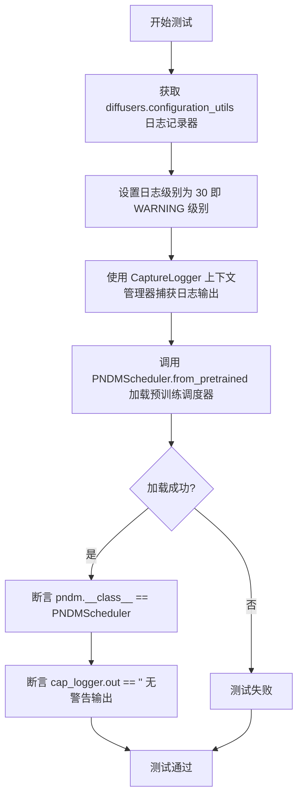

#### 带注释源码

```python
def test_load_pndm(self):
    """
    测试从预训练模型加载 PNDMScheduler 的功能。
    验证调度器能够正确加载且不会产生警告。
    """
    # 获取 diffusers.configuration_utils 模块的日志记录器
    logger = logging.get_logger("diffusers.configuration_utils")
    # 30 对应 WARNING 日志级别，用于抑制警告输出
    # 30 for warning
    logger.setLevel(30)

    # 使用 CaptureLogger 上下文管理器捕获日志输出
    # 加载预训练的 PNDMScheduler，从测试用的小型 stable diffusion 模型
    with CaptureLogger(logger) as cap_logger:
        pndm = PNDMScheduler.from_pretrained(
            "hf-internal-testing/tiny-stable-diffusion-torch", subfolder="scheduler"
        )

    # 断言加载的调度器类型为 PNDMScheduler
    assert pndm.__class__ == PNDMScheduler
    # 验证没有产生任何警告日志
    # no warning should be thrown
    assert cap_logger.out == ""
```


### `ConfigTester.test_overwrite_config_on_load`

该测试方法用于验证在使用 `from_pretrained` 方法加载调度器（如 DDPMScheduler）时，用户提供的额外配置参数（如 `prediction_type`、`beta_end`、`beta_start`）能够正确覆盖默认配置值，并确保整个过程中不会产生任何警告。

参数：

- `self`：`unittest.TestCase`，测试类的实例方法，代表测试用例本身

返回值：`None`，测试方法不返回任何值，仅通过断言验证行为

#### 流程图

```mermaid
flowchart TD
    A[开始测试] --> B[获取 diffusers.configuration_utils logger]
    B --> C[设置 logger 级别为 30 (WARNING)]
    C --> D[使用 CaptureLogger 捕获日志]
    D --> E[调用 DDPMScheduler.from_pretrained<br/>参数: prediction_type='sample', beta_end=8]
    E --> F[使用另一个 CaptureLogger 捕获日志]
    F --> G[调用 DDPMScheduler.from_pretrained<br/>参数: beta_start=88]
    G --> H{断言验证}
    H --> I[ddpm.__class__ == DDPMScheduler]
    I --> J[ddpm.config.prediction_type == 'sample']
    J --> K[ddpm.config.beta_end == 8]
    K --> L[ddpm_2.config.beta_start == 88]
    L --> M[cap_logger.out == '' (无警告)]
    M --> N[cap_logger_2.out == '' (无警告)]
    N --> O[测试通过]
```

#### 带注释源码

```python
def test_overwrite_config_on_load(self):
    """
    测试在使用 from_pretrained 加载调度器时，用户提供的配置参数
    能够正确覆盖默认配置，且不产生任何警告。
    """
    # 获取 diffusers 配置工具的日志记录器
    logger = logging.get_logger("diffusers.configuration_utils")
    # 30 对应 WARNING 级别，用于抑制警告输出
    logger.setLevel(30)

    # 第一次加载：使用 prediction_type 和 beta_end 参数覆盖默认配置
    with CaptureLogger(logger) as cap_logger:
        ddpm = DDPMScheduler.from_pretrained(
            "hf-internal-testing/tiny-stable-diffusion-torch",  # HuggingFace 模型路径
            subfolder="scheduler",                                # 子文件夹路径
            prediction_type="sample",                             # 覆盖默认的 prediction_type
            beta_end=8,                                           # 覆盖默认的 beta_end
        )

    # 第二次加载：使用 beta_start 参数覆盖默认配置
    with CaptureLogger(logger) as cap_logger_2:
        ddpm_2 = DDPMScheduler.from_pretrained(
            "google/ddpm-celebahq-256",  # 另一个预训练模型路径
            beta_start=88,               # 覆盖默认的 beta_start
        )

    # 验证加载的调度器类型正确
    assert ddpm.__class__ == DDPMScheduler
    # 验证第一个加载的配置覆盖生效：prediction_type 被成功覆盖
    assert ddpm.config.prediction_type == "sample"
    # 验证第一个加载的配置覆盖生效：beta_end 被成功覆盖为 8
    assert ddpm.config.beta_end == 8
    # 验证第二个加载的配置覆盖生效：beta_start 被成功覆盖为 88
    assert ddpm_2.config.beta_start == 88

    # 验证两次加载过程中没有产生任何警告
    assert cap_logger.out == ""
    assert cap_logger_2.out == ""
```


### `ConfigTester.test_load_dpmsolver`

这是一个单元测试方法，用于验证 `DPMSolverMultistepScheduler` 能够正确从预训练模型加载配置，且在加载过程中不产生任何警告。

参数：

- `self`：`ConfigTester`（继承自 `unittest.TestCase`），表示测试类的实例本身

返回值：`None`，因为这是测试方法，通过断言来验证功能，不返回任何值

#### 流程图

```mermaid
flowchart TD
    A[开始测试 test_load_dpmsolver] --> B[获取 diffusers.configuration_utils 日志记录器]
    B --> C[设置日志级别为 30 (WARNING)]
    C --> D[使用 CaptureLogger 捕获日志输出]
    D --> E[调用 DPMSolverMultistepScheduler.from_pretrained 加载预训练模型]
    E --> F{检查加载是否成功}
    F -->|成功| G[断言 dpm.__class__ == DPMSolverMultistepScheduler]
    F -->|失败| H[测试失败]
    G --> I[断言 cap_logger.out == '']
    I --> J[测试通过]
    
    style A fill:#f9f,stroke:#333
    style J fill:#9f9,stroke:#333
    style H fill:#f99,stroke:#333
```

#### 带注释源码

```python
def test_load_dpmsolver(self):
    """
    测试 DPMSolverMultistepScheduler 能否正确从预训练模型加载配置，
    并验证加载过程中不产生任何警告日志。
    """
    # 获取 diffusers 配置工具的日志记录器
    logger = logging.get_logger("diffusers.configuration_utils")
    # 30 对应 logging.WARNING 级别，仅捕获警告及以上级别日志
    logger.setLevel(30)

    # 使用 CaptureLogger 上下文管理器捕获日志输出
    with CaptureLogger(logger) as cap_logger:
        # 从预训练模型加载 DPMSolverMultistepScheduler 配置
        # 使用 Hugging Face Hub 上的微小稳定扩散模型进行测试
        dpm = DPMSolverMultistepScheduler.from_pretrained(
            "hf-internal-testing/tiny-stable-diffusion-torch", 
            subfolder="scheduler"
        )

    # 断言：验证加载的调度器类型正确
    assert dpm.__class__ == DPMSolverMultistepScheduler
    # 断言：确保加载过程中没有产生任何警告日志
    # no warning should be thrown
    assert cap_logger.out == ""
```


### `ConfigTester.test_use_default_values`

该方法是一个测试用例，用于验证 ConfigMixin 的默认配置值功能是否正常工作，包括 `_use_default_values` 属性的正确设置和使用。

参数：该方法无参数（继承自 unittest.TestCase，使用 self）

返回值：`None`（测试方法无返回值）

#### 流程图

```mermaid
flowchart TD
    A[开始测试] --> B[创建 SampleObject 实例]
    B --> C[获取配置字典, 过滤掉下划线开头的键]
    C --> D[断言: 配置键集合等于 _use_default_values 集合]
    D --> E[创建临时目录]
    E --> F[保存配置到临时目录]
    F --> G[使用 SampleObject2 从临时目录加载配置]
    G --> H[断言: 'f' 在 _use_default_values 中]
    H --> I[断言: config.f == [1, 3]]
    I --> J[使用 SampleObject4 从配置加载]
    J --> K[断言: new_config.config.f == [5, 4] 使用默认值]
    K --> L[从 _use_default_values 弹出一个值]
    L --> M[再次使用 SampleObject4 加载]
    M --> N[断言: new_config_2.config.f == [1, 3]]
    N --> O[断言: new_config_2.config.e == [1, 3] 保留原值]
    O --> P[测试结束]
```

#### 带注释源码

```python
def test_use_default_values(self):
    """
    测试 ConfigMixin 的默认配置值功能
    验证 _use_default_values 属性在配置加载时的正确行为
    """
    
    # 创建 SampleObject 实例,使用所有默认值
    # 默认值: a=2, b=5, c=(2, 5), d="for diffusion", e=[1, 3]
    config = SampleObject()

    # 从 config 中过滤掉以下划线('_')开头的键,获取普通配置项
    config_dict = {k: v for k, v in config.config.items() if not k.startswith("_")}

    # 断言: 确保默认配置的所有键都在 _use_default_values 中
    # _use_default_values 是一个特殊的内部属性,用于跟踪哪些配置使用了默认值
    assert set(config_dict.keys()) == set(config.config._use_default_values)

    # 创建临时目录用于保存配置
    with tempfile.TemporaryDirectory() as tmpdirname:
        # 将配置保存到临时目录的 config.json 文件中
        config.save_config(tmpdirname)

        # 使用 SampleObject2 从保存的配置加载
        # SampleObject2 与 SampleObject 的区别是:
        #   - SampleObject 有 e 参数
        #   - SampleObject2 有 f 参数(没有 e 参数)
        # 这里会触发新参数 f 被添加到 _use_default_values
        config = SampleObject2.from_config(SampleObject2.load_config(tmpdirname))

        # 断言: f 是新参数,应该在 _use_default_values 中(因为它是新引入的)
        assert "f" in config.config._use_default_values
        # 断言: f 使用了默认值 [1, 3]
        assert config.config.f == [1, 3]

    # 现在使用 SampleObject4 加载配置
    # SampleObject4 的默认值是: e=[1, 5], f=[5, 4]
    # 由于 f 在 _use_default_values 中,应该使用 SampleObject4 的默认值 [5, 4]
    new_config = SampleObject4.from_config(config.config)
    assert new_config.config.f == [5, 4]

    # 从 _use_default_values 中移除最后一个元素
    # 现在 f 不再被视为"使用默认值",应该使用传入的值 [1, 3]
    config.config._use_default_values.pop()
    new_config_2 = SampleObject4.from_config(config.config)
    assert new_config_2.config.f == [1, 3]

    # "e" 参数应该正确加载为 [1, 3](来自 SampleObject2)
    # 而不是默认回 SampleObject4 的 [1, 5]
    assert new_config_2.config.e == [1, 3]
```


### `ConfigTester.test_check_path_types`

该方法用于验证 `ConfigMixin` 能够正确处理 `Path` 类型的配置参数。在将包含 `Path` 对象（如 `Path("foo/bar")` 或 `Path("foo bar\\bar")`）的配置序列化为 JSON 字符串后，再解析回来时，能够正确转换为 POSIX 格式的路径字符串。

参数：

- 该方法无参数（继承自 `unittest.TestCase` 的测试方法）

返回值：`None`，该方法为单元测试方法，通过断言验证功能，不返回任何值

#### 流程图

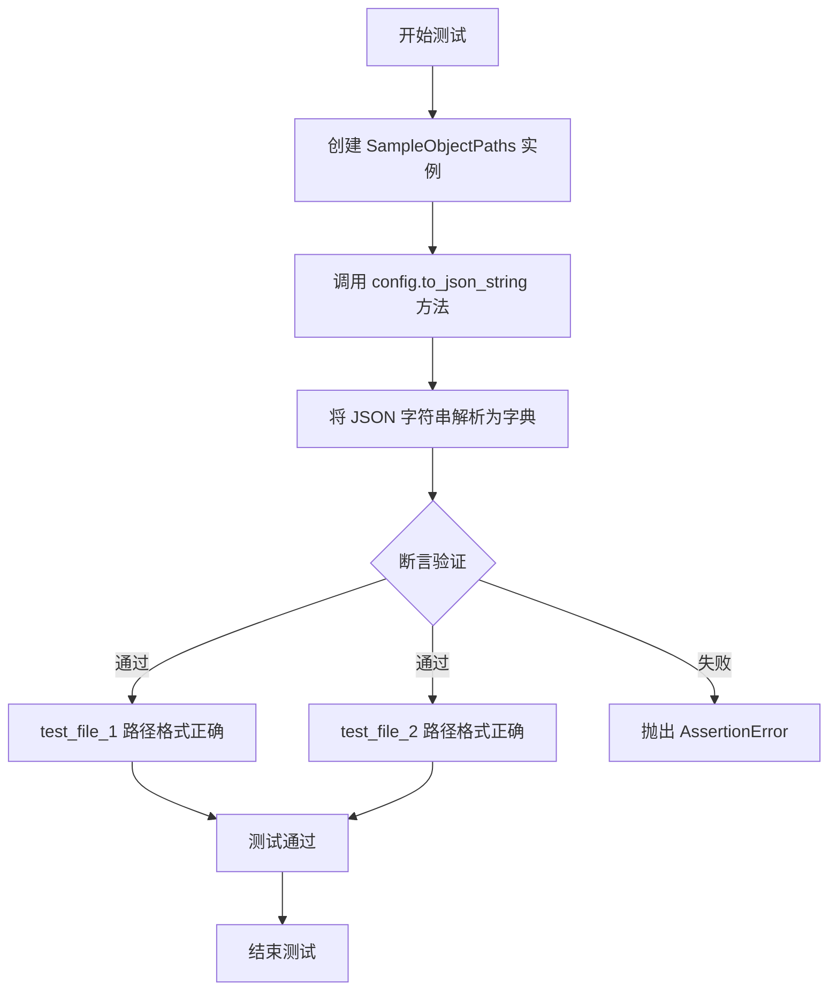

#### 带注释源码

```python
def test_check_path_types(self):
    """
    测试 ConfigMixin 对 Path 类型配置项的序列化和反序列化能力。
    验证 Path 对象在转换为 JSON 字符串后再解析，能正确保持路径格式。
    """
    # 步骤1: 创建 SampleObjectPaths 实例，该类继承自 ConfigMixin
    # 初始化时包含两个 Path 类型的配置项:
    # - test_file_1: Path("foo/bar")
    # - test_file_2: Path("foo bar\\bar")
    config = SampleObjectPaths()
    
    # 步骤2: 调用 to_json_string 方法将配置转换为 JSON 字符串
    # 该方法会遍历所有配置项，对 Path 类型调用 as_posix() 转换为字符串
    json_string = config.to_json_string()
    
    # 步骤3: 解析 JSON 字符串为 Python 字典
    result = json.loads(json_string)
    
    # 步骤4: 验证 test_file_1 的路径转换正确
    # 使用 as_posix() 确保无论在 Windows 还是 Linux 系统上，
    # 都使用统一的 POSIX 格式（正斜杠分隔）
    assert result["test_file_1"] == config.config.test_file_1.as_posix()
    
    # 步骤5: 验证 test_file_2 的路径转换正确
    # test_file_2 包含反斜杠（Windows 风格路径），需要正确转换
    assert result["test_file_2"] == config.config.test_file_2.as_posix()
```

## 关键组件


### ConfigMixin

配置混入类，提供配置保存、加载和管理的核心功能。通过继承该类，对象可以自动将初始化参数保存为配置文件，并支持从配置文件恢复对象状态。

### register_to_config

装饰器，用于将类的 `__init__` 方法参数自动注册为配置属性。被装饰的方法参数会自动存储在 `config` 属性中，支持默认值覆盖和序列化。

### SampleObject / SampleObject2 / SampleObject3 / SampleObject4

测试用示例类，继承自 ConfigMixin。用于测试配置注册、默认值处理和配置加载逻辑，验证不同配置参数组合的行为。

### SampleObjectPaths

路径类型测试类，用于验证 Path 对象（WindowsPath/PosixPath）在配置序列化和反序列化过程中的正确处理，确保路径格式化为跨平台兼容的 POSIX 字符串。

### _use_default_values

内部机制，用于追踪哪些配置参数使用了默认值。当从旧版本配置加载时，可以正确区分显式设置的值和默认值为后续的默认值替换提供依据。

### save_config / from_config / load_config

配置持久化方法组。save_config 将配置保存为 JSON 文件；from_config 根据配置字典创建对象实例；load_config 从指定路径加载配置文件。

### ConfigTester

单元测试类，验证 ConfigMixin 的各项功能，包括：配置注册、默认值处理、配置保存加载、路径类型序列化、配置覆盖等场景。


## 问题及建议


### 已知问题

-   **硬编码日志级别**：多处使用 `logger.setLevel(30)` 而非 `logging.WARNING`，30 是 magic number，可读性差
-   **代码重复**：多个测试方法中重复相同的 logger 设置代码（获取 logger、设置级别），违反 DRY 原则
-   **外部依赖导致测试不稳定**：`test_load_ddim_from_pndm`、`test_load_euler_from_pndm` 等测试依赖远程模型 `"hf-internal-testing/tiny-stable-diffusion-torch"`，网络不可用时测试会失败
-   **测试状态污染**：`test_use_default_values` 中直接修改 `config.config._use_default_values.pop()`，可能影响后续测试的执行结果
-   **测试隔离性不足**：测试用例之间存在隐式依赖，缺乏独立的 setup/teardown 机制
-   **路径处理跨平台问题**：`SampleObjectPaths` 中 `test_file_2=Path("foo bar\\bar")` 混用正反斜杠，在不同操作系统上行为可能不一致
-   **Magic String**：`"diffusers.configuration_utils"` 在多个测试中重复出现，应提取为常量
-   **注释与代码不一致**：`test_save_load` 中注释 `# unfreeze configs` 语义不清，实际上是转换为字典类型
-   **缺少类型注解**：所有类和方法都缺少类型注解，不利于静态分析和 IDE 支持

### 优化建议

-   将日志级别常量提取为 `LOGGER_NAME = "diffusers.configuration_utils"` 和 `LOG_LEVEL = logging.WARNING`
-   使用 `@unittest.skipIf` 或 mock 机制处理外部模型依赖，或使用本地 fixtures
-   为每个测试方法添加独立的 setup/teardown，确保测试间状态隔离
-   使用 `pathlib.Path` 时统一使用正斜杠或使用 `os.path.join` 增强跨平台兼容性
-   添加类型注解（PEP 484）提升代码可维护性和 IDE 智能提示
-   将重复的 logger 设置逻辑提取为测试基类或测试工具函数
-   改进注释准确度，或使用更清晰的变量名替代注释说明

## 其它


### 设计目标与约束

本代码的设计目标是验证`ConfigMixin`配置混入类的功能正确性，确保配置对象能够正确保存、加载、注册默认配置，并处理配置默认值覆盖和路径类型转换等场景。约束条件包括：测试仅覆盖Python原生类型（int、str、tuple、list、Path）和diffusers库中的调度器配置，不涉及自定义复杂类型；配置保存使用JSON格式，因此tuple会被序列化为list；配置文件名固定为`config.json`。

### 错误处理与异常设计

代码中的错误处理主要通过`unittest.TestCase`的断言机制实现。具体包括：1）`test_load_not_from_mixin`测试使用`self.assertRaises(ValueError)`验证非ConfigMixin类调用`load_config`时抛出ValueError异常；2）配置加载时的警告通过捕获logger输出进行验证，确保无意外警告；3）配置字段类型转换错误（如tuple转list）通过断言比较进行隐式验证。异常信息未显式定义，返回值描述依赖于测试框架的默认行为。

### 数据流与状态机

配置对象的数据流如下：1）创建阶段：用户实例化SampleObject系列类，通过`__init__`接收参数并调用`@register_to_config`装饰器将参数注册到`config`属性；2）保存阶段：调用`save_config(tmpdirname)`将config序列化为JSON文件存储；3）加载阶段：调用`load_config(path)`读取JSON文件，通过`from_config`重新实例化对象；4）默认值覆盖：`_use_default_values`集合记录加载时使用的默认值字段，支持部分覆盖默认配置。状态转换通过`SampleObject` -> `save_config` -> `load_config` -> `SampleObject.from_config`闭环。

### 外部依赖与接口契约

本代码依赖以下外部模块：1）`diffusers.configuration_utils.ConfigMixin`：配置混入基类，提供`save_config`、`load_config`、`from_config`等方法；2）`diffusers.configuration_utils.register_to_config`：装饰器，用于将`__init__`参数注册为配置字段；3）`diffusers`调度器类（DDIMScheduler、DDPMScheduler等）：用于验证配置加载的互操作性；4）`pathlib.Path`：处理跨平台路径类型；5）`tempfile`：创建临时目录用于测试文件操作。接口契约要求：ConfigMixin子类必须定义`config_name = "config.json"`；`from_config`接收dict类型的config字典；`save_config`接受目录路径并在该目录下创建config.json文件。

### 配置版本管理与兼容性

代码未显式实现配置版本管理机制，但通过`_use_default_values`字段实现了默认值兼容性处理。当加载的config缺少某些字段时，系统从类定义中获取默认值并加入`_use_default_values`集合，后续实例化时使用默认值。配置向前兼容性通过`ConfigMixin`的基础实现自动处理，未在测试中显式验证版本迁移场景。建议增加配置版本号字段和版本迁移逻辑测试。

### 测试覆盖与边界条件

当前测试覆盖以下场景：1）基本配置保存/加载；2）默认值覆盖；3）位置参数和关键字参数混合；4）私有参数（以`_`开头）忽略；5）不同调度器配置加载；6）路径类型序列化；7）默认值使用逻辑。边界条件测试缺失包括：1）空配置加载；2）损坏的JSON文件处理；3）配置文件权限错误；4）超大配置对象；5）循环引用配置字段。建议补充边界条件和异常场景测试。

### 性能考虑与基准

测试使用临时目录进行文件IO操作，性能开销主要集中在JSON序列化/反序列化和对象实例化上。未包含性能基准测试。关键性能点：1）`save_config`和`load_config`的IO操作；2）`from_config`的反射实例化；3）`_use_default_values`集合操作。建议在生产环境中对大型配置对象进行性能测试。

### 安全考量

代码主要涉及配置文件的读写操作，安全考量包括：1）路径遍历风险：`save_config`和`load_config`直接接受路径参数，未验证路径合法性；2）配置文件内容验证：JSON反序列化未进行schema验证；3）敏感信息泄露：配置中可能包含模型路径等敏感信息，当前以明文存储于JSON文件。建议增加路径验证和配置加密机制。

### 跨平台兼容性

`SampleObjectPaths`测试类验证了Path类型在不同操作系统下的兼容性，通过`as_posix()`方法统一路径格式。但测试中的路径`"foo bar\\bar"`包含反斜杠，仅在Windows下有意义，跨平台测试覆盖不完整。建议增加CI多平台测试验证。

### 可扩展性设计

当前设计支持通过继承`ConfigMixin`创建新配置类，配置字段通过`@register_to_config`自动注册。扩展建议：1）支持自定义配置类型转换器；2）支持配置验证器；3）支持配置继承链。建议在文档中明确扩展接口和使用示例。


    