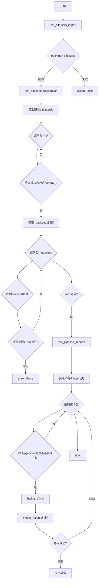
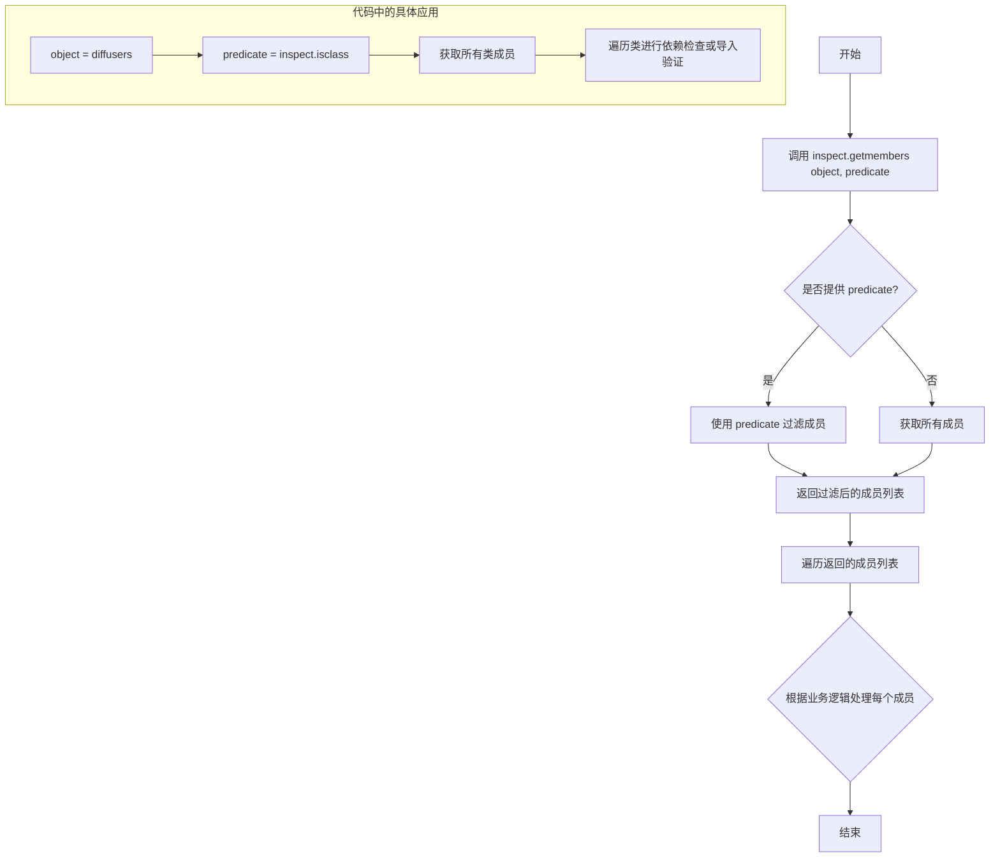
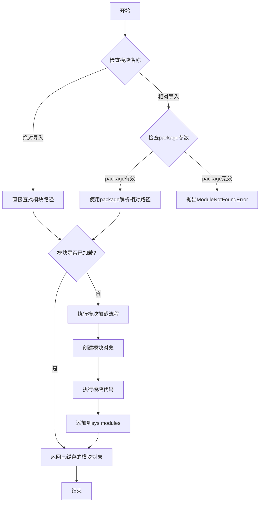
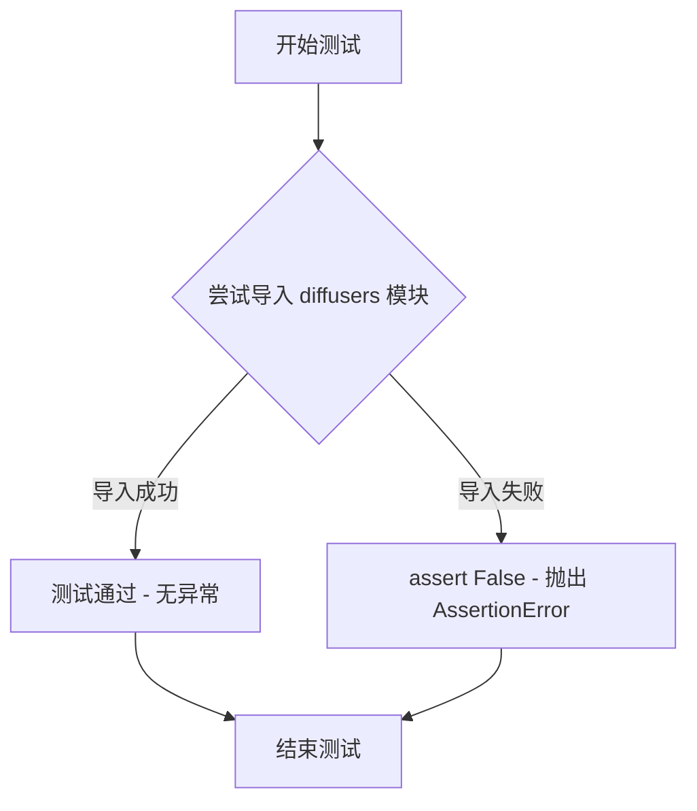
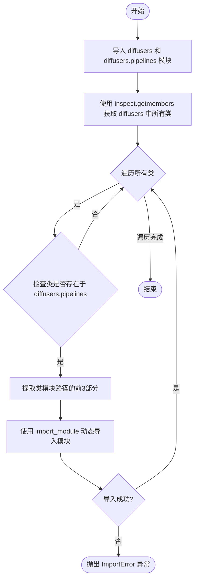
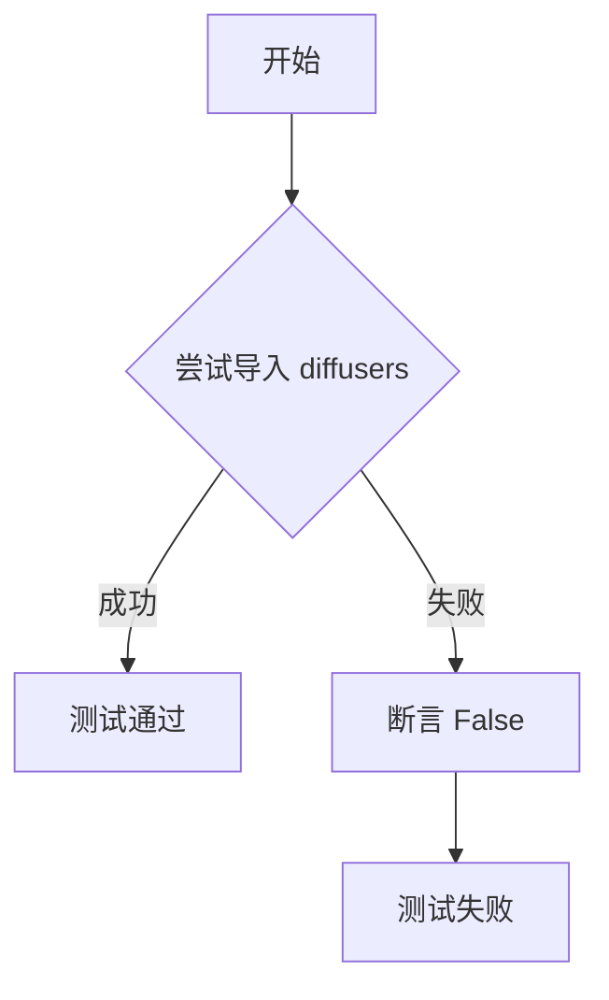
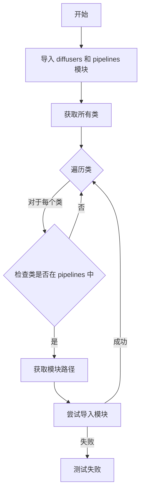

# `diffusers\tests\others\test_dependencies.py` 详细设计文档

这是一个用于验证diffusers库依赖项完整性、后端注册正确性以及管道模块可导入性的单元测试类，通过反射机制检查所有类及其后端依赖是否正确配置。

## 整体流程



## 类结构

```
unittest.TestCase
└── DependencyTester
    ├── test_diffusers_import()
    ├── test_backend_registration()
    └── test_pipeline_imports()
```

## 全局变量及字段


### `inspect`
    
Python module for inspecting live objects, used to get class members

类型：`module`
    


### `unittest`
    
Python testing framework for unit tests

类型：`module`
    


### `import_module`
    
Dynamic module importer from importlib

类型：`function`
    


### `diffusers`
    
The diffusers library being tested for dependencies and imports

类型：`module`
    


### `deps`
    
Dependency versions table from diffusers.dependency_versions_table containing available backend dependencies

类型：`dict`
    


### `DependencyTester.test_diffusers_import`
    
Test method that verifies the diffusers library can be imported successfully

类型：`method`
    


### `DependencyTester.test_backend_registration`
    
Test method that verifies all backend dependencies (k-diffusion, opencv-python, etc.) are properly registered in the dependency versions table

类型：`method`
    


### `DependencyTester.test_pipeline_imports`
    
Test method that verifies all pipeline classes in diffusers can be dynamically imported from their respective modules

类型：`method`
    
    

## 全局函数及方法


### `inspect.getmembers`

`inspect.getmembers` 是 Python 标准库 `inspect` 模块中的一个函数，用于获取指定对象的所有成员（属性和方法）。在代码中，它被用于从 `diffusers` 模块中提取所有类，以便进行依赖项检查和管道导入验证。

参数：

- `object`：对象，要获取其成员的对象。在代码中为 `diffusers` 模块。
- `predicate`：可调用对象（可选），用于过滤成员的断言函数。在代码中为 `inspect.isclass`，用于仅返回类成员。

返回值：`list[tuple]`，返回由成员名称和成员值组成的元组列表。在代码中，每个元组包含 `(cls_name, cls_module)`，其中 `cls_name` 是类名（字符串），`cls_module` 是类本身（类型对象）。

#### 流程图



#### 带注释源码

```python
# inspect.getmembers 函数原型（简化版）
# inspect.getmembers(object, predicate=None)

# 在代码中的实际使用：
import inspect
import diffusers

# 获取 diffusers 模块中的所有类成员
# predicate=inspect.isclass 确保只返回类，不返回函数、变量等
all_classes = inspect.getmembers(diffusers, inspect.isclass)

# all_classes 是一个列表，元素为 (类名, 类对象) 元组
# 例如：[('StableDiffusionPipeline', <class 'diffusers.pipelines.stable_diffusion...'>), ...]

# 第一次使用：检查后端依赖注册
for cls_name, cls_module in all_classes:
    # 过滤掉 dummy_ 开头的模块（测试用虚拟类）
    if "dummy_" in cls_module.__module__:
        # 获取该类注册的所有后端
        for backend in cls_module._backends:
            # 处理后端名称映射（将模块名转为包名）
            if backend == "k_diffusion":
                backend = "k-diffusion"
            elif backend == "invisible_watermark":
                backend = "invisible-watermark"
            elif backend == "opencv":
                backend = "opencv-python"
            elif backend == "nvidia_modelopt":
                backend = "nvidia_modelopt[hf]"
            # 验证后端是否在依赖表中
            assert backend in deps, f"{backend} is not in the deps table!"

# 第二次使用：验证管道导入
for cls_name, cls_module in all_classes:
    # 检查类是否存在于 diffusers.pipelines 模块中
    if hasattr(diffusers.pipelines, cls_name):
        # 构建模块路径并尝试导入
        pipeline_folder_module = ".".join(str(cls_module.__module__).split(".")[:3])
        _ = import_module(pipeline_folder_module, str(cls_name))
```


### `import_module`

`import_module` 是 Python 标准库 `importlib` 模块中的一个函数，用于动态导入指定的模块。该函数接收模块名称作为字符串参数，支持绝对导入和相对导入，并返回导入的模块对象。

参数：

- `name`：`str`，要导入的模块名称，可以是绝对模块名或相对模块名（以点开头）。
- `package`：`str | None`，可选参数，用于解析相对导入的基准包，默认为 `None`。

返回值：`module`，返回导入的模块对象。

#### 流程图



#### 带注释源码

```python
# import_module 源码位于 Python 标准库的 importlib 模块中
# 以下为简化版本的核心逻辑展示

def import_module(name, package=None):
    """
    动态导入指定名称的模块
    
    参数:
        name: 模块名称字符串，支持绝对导入（如 'os.path'）和相对导入（如 '.submodule'）
        package: 用于解析相对导入的基准包名称
    
    返回:
        导入的模块对象
    """
    # 1. 处理相对导入的情况
    # 如果模块名以 '.' 开头，则为相对导入
    if name.startswith('.'):
        # 需要 package 参数来解析相对路径
        if package is None:
            # 没有提供 package 参数，抛出异常
            raise ModuleNotFoundError(
                "relative imports require the 'package' argument"
            )
        
        # 计算模块的层级深度
        level = 0
        for char in name:
            if char == '.':
                level += 1
            else:
                break
        
        # 获取基准包的父模块
        # package='diffusers.pipelines', level=1 => parent='diffusers'
        parent = package.split('.')[:-level] if level else list(package.split('.'))
        if not parent:
            parent = ['']
        
        # 拼接完整的模块路径
        # name='.utils', package='diffusers.pipelines' => 'diffusers.utils'
        fullname = '.'.join(parent + [name.lstrip('.')])
    else:
        fullname = name
        package = None  # 绝对导入不使用 package
    
    # 2. 检查模块是否已缓存（避免重复导入）
    # sys.modules 是 Python 维护的已导入模块缓存字典
    import sys
    if fullname in sys.modules:
        return sys.modules[fullname]
    
    # 3. 执行实际的模块加载
    # 使用默认的 importlib._bootstrap 模块进行加载
    from importlib._bootstrap import _load_module_shim
    
    # _load_module_shim 会：
    # a. 查找模块路径（sys.path）
    # b. 创建模块对象
    # c. 执行模块代码（初始化模块）
    # d. 将模块添加到 sys.modules
    return _load_module_shim(fullname)
```

**实际使用示例（来自提供的代码）：**

```python
# 在代码中的实际调用
pipeline_folder_module = ".".join(str(cls_module.__module__).split(".")[:3])
_ = import_module(pipeline_folder_module, str(cls_name))

# 例如：
# cls_module.__module__ = "diffusers.pipelines.stable_diffusion.pipeline_stable_diffusion"
# pipeline_folder_module = "diffusers.pipelines.stable_diffusion"
# 导入 "diffusers.pipelines.stable_diffusion" 模块
```


### `DependencyTester.test_diffusers_import`

该方法用于测试 `diffusers` 库是否可以成功导入，是依赖检查测试用例。如果 `diffusers` 未安装或导入失败，则测试用例失败。

参数：

- 该方法无显式参数（隐含参数 `self` 为 unittest.TestCase 实例）

返回值：`None`，无返回值（测试方法通过断言完成验证）

#### 流程图



#### 带注释源码

```
def test_diffusers_import(self):
    """
    测试 diffusers 库是否可导入。
    该方法作为冒烟测试，验证 diffusers 依赖是否正确安装。
    """
    try:
        # 尝试导入 diffusers 模块
        # 如果模块不存在或安装不完整，会抛出 ImportError
        import diffusers  # noqa: F401
        # F401 表示忽略 'import but unused' 警告，因为仅需验证可导入性
    except ImportError:
        # 如果导入失败，断言 False 使测试失败
        # 明确提示 diffusers 依赖缺失
        assert False
```


### `DependencyTester.test_backend_registration`

这是一个单元测试方法，用于验证 diffusers 库中所有可选依赖（backends）是否正确注册在依赖版本表中。它通过检查 dummy 类的后端映射，确保每个可选依赖都有对应的包名定义。

参数：此方法无显式参数（继承自 unittest.TestCase 的 self 为隐式参数）

返回值：`None`，无返回值（测试方法）

#### 流程图

```mermaid
flowchart TD
    A[开始 test_backend_registration] --> B[导入 diffusers 模块]
    B --> C[从 diffusers.dependency_versions_table 导入 deps]
    C --> D[使用 inspect.getmembers 获取 diffusers 所有类]
    D --> E{遍历所有类}
    E -->|cls_module.__module__ 包含 'dummy_'| F[获取该类的 _backends 列表]
    E -->|不包含| K[继续下一轮]
    F --> G{遍历 _backends 中的每个 backend}
    G --> H{映射 backend 名称}
    H -->|k_diffusion| I[转换为 k-diffusion]
    H -->|invisible_watermark| J[转换为 invisible-watermark]
    H -->|opencv| L[转换为 opencv-python]
    H -->|nvidia_modelopt| M[转换为 nvidia_modelopt[hf]]
    H -->|其他| N[保持原名]
    I --> O[断言 backend 在 deps 中]
    J --> O
    L --> O
    M --> O
    N --> O
    O -->|失败| P[抛出 AssertionError]
    O -->|成功| G
    G -->|遍历完成| K
    K --> Q[测试结束]
```

#### 带注释源码

```python
def test_backend_registration(self):
    """
    测试后端注册：验证所有 dummy 类中引用的可选依赖都已在依赖版本表中注册。
    
    该测试方法通过以下步骤进行验证：
    1. 获取 diffusers 库中所有的类定义
    2. 筛选出模块名包含 "dummy_" 的类（这些类用于检测可选依赖）
    3. 检查这些 dummy 类所需的后端是否都在 dependency_versions_table 中定义
    """
    # 导入 diffusers 库，这是待测试的核心库
    import diffusers
    
    # 从 diffusers.dependency_versions_table 导入依赖版本表字典 deps
    # 该表包含了所有可选依赖与其版本信息的映射
    from diffusers.dependency_versions_table import deps

    # 使用 inspect 模块获取 diffusers 中所有的类成员
    # 返回格式为 [(类名, 类对象), ...]
    all_classes = inspect.getmembers(diffusers, inspect.isclass)

    # 遍历 diffusers 中的所有类
    for cls_name, cls_module in all_classes:
        # 仅处理模块名包含 "dummy_" 的类
        # dummy 类是 diffusers 用于可选依赖检测的占位类
        if "dummy_" in cls_module.__module__:
            # 遍历该 dummy 类支持的后端列表
            # _backends 属性包含了该类所需的所有可选依赖
            for backend in cls_module._backends:
                # 将内部后端名称映射为 PyPI 包名
                # 这是因为内部名称与 pip 安装的包名可能不同
                if backend == "k_diffusion":
                    backend = "k-diffusion"
                elif backend == "invisible_watermark":
                    backend = "invisible-watermark"
                elif backend == "opencv":
                    backend = "opencv-python"
                elif backend == "nvidia_modelopt":
                    backend = "nvidia_modelopt[hf]"
                
                # 断言验证：确保该 backend 已在依赖版本表中注册
                # 如果未注册，抛出 AssertionError 并显示错误信息
                assert backend in deps, f"{backend} is not in the deps table!"
```


### `DependencyTester.test_pipeline_imports`

该方法用于测试 diffusers 库中所有管道的导入功能是否正常。它会遍历 diffusers 模块中的所有类，检查哪些类存在于 diffusers.pipelines 中，并尝试动态导入这些类所在的模块，以验证管道模块的可导入性。

参数：

- `self`：`DependencyTester`，测试类的实例，隐式参数，用于访问类属性和方法

返回值：`None`，该方法为 unittest 测试方法，不返回任何值（测试结果通过断言或异常自动判定）

#### 流程图



#### 带注释源码

```python
def test_pipeline_imports(self):
    """
    测试 diffusers 库中所有管道的导入功能。
    该方法验证 diffusers.pipelines 中的类是否能正确从其模块路径导入。
    """
    # 导入主模块和管道子模块
    import diffusers
    import diffusers.pipelines

    # 使用 inspect 模块获取 diffusers 中的所有类
    # inspect.getmembers 返回 (name, value) 元组列表
    all_classes = inspect.getmembers(diffusers, inspect.isclass)

    # 遍历所有类，筛选出存在于 diffusers.pipelines 中的类
    for cls_name, cls_module in all_classes:
        # 检查当前类是否在 diffusers.pipelines 模块中
        if hasattr(diffusers.pipelines, cls_name):
            # 构建模块路径：取类模块名的前3部分
            # 例如：diffusers.pipelines.stable_diffusion.pipeline_output -> diffusers.pipelines.stable_diffusion
            pipeline_folder_module = ".".join(str(cls_module.__module__).split(".")[:3])
            
            # 动态导入模块，验证模块可导入性
            # _ 表示忽略导入结果，仅验证导入过程是否成功
            _ = import_module(pipeline_folder_module, str(cls_name))
```

## 关键组件


这段代码是一个单元测试类，用于验证diffusers库的依赖完整性、后端注册正确性以及管道模块的可导入性，确保库在部署前满足所有依赖要求。

### 文件的整体运行流程
该文件定义了一个`DependencyTester`测试类，继承自`unittest.TestCase`。运行测试时，unittest框架会自动发现并执行该类中的三个测试方法：`test_diffusers_import`验证diffusers库可导入，`test_backend_registration`检查所有类的后端注册情况，`test_pipeline_imports`确保管道类可正确导入。这些测试方法依次运行，任何失败都会导致测试不通过。

### 类的详细信息
#### 类：DependencyTester
- **类字段**：无自定义字段，继承自`unittest.TestCase`的字段（如`skipTest`等）。
- **类方法**：
  - `test_diffusers_import`：测试diffusers库导入。
  - `test_backend_registration`：测试后端注册。
  - `test_pipeline_imports`：测试管道导入。

#### 方法：test_diffusers_import
- **名称**：test_diffusers_import
- **参数名称**：self
- **参数类型**：DependencyTester 实例
- **参数描述**：测试方法的标准参数，表示当前测试实例。
- **返回值类型**：None
- **返回值描述**：该方法不返回任何值，仅通过断言验证导入结果。
- **Mermaid 流程图**：

- **带注释源码**：
```python
def test_diffusers_import(self):
    try:
        import diffusers  # noqa: F401
    except ImportError:
        assert False  # 如果导入失败，测试失败
```

#### 方法：test_backend_registration
- **名称**：test_backend_registration
- **参数名称**：self
- **参数类型**：DependencyTester 实例
- **参数描述**：测试方法的标准参数。
- **返回值类型**：None
- **返回值描述**：该方法不返回任何值，仅通过断言验证后端注册。
- **Mermaid 流程图**：
```mermaid
flowchart TD
    A[开始] --> B[导入 diffusers 和依赖版本表]
    B --> C[获取所有类]
    C --> D{遍历类}
    D -->|对于每个类| E{检查是否有 dummy 后端}
    E -->|是| F[获取后端列表]
    E -->|否| D
    F --> G{映射后端名称}
    G -->|k_diffusion| H[映射为 k-diffusion]
    G -->|invisible_watermark| I[映射为 invisible-watermark]
    G -->|opencv| J[映射为 opencv-python]
    G -->|nvidia_modelopt| K[映射为 nvidia_modelopt[hf]]
    G -->|其他| L[保持原名]
    H --> M{断言后端在依赖表中}
    M -->|是| D
    M -->|否| N[测试失败]
```
- **带注释源码**：
```python
def test_backend_registration(self):
    import diffusers
    from diffusers.dependency_versions_table import deps

    all_classes = inspect.getmembers(diffusers, inspect.isclass)  # 获取所有类

    for cls_name, cls_module in all_classes:
        if "dummy_" in cls_module.__module__:  # 检查模块名是否包含 dummy
            for backend in cls_module._backends:  # 遍历后端列表
                # 映射特殊后端名称
                if backend == "k_diffusion":
                    backend = "k-diffusion"
                elif backend == "invisible_watermark":
                    backend = "invisible-watermark"
                elif backend == "opencv":
                    backend = "opencv-python"
                elif backend == "nvidia_modelopt":
                    backend = "nvidia_modelopt[hf]"
                assert backend in deps, f"{backend} is not in the deps table!"  # 断言后端在依赖表中
```

#### 方法：test_pipeline_imports
- **名称**：test_pipeline_imports
- **参数名称**：self
- **参数类型**：DependencyTester 实例
- **参数描述**：测试方法的标准参数。
- **返回值类型**：None
- **返回值描述**：该方法不返回任何值，仅通过断言验证导入。
- **Mermaid 流程图**：

- **带注释源码**：
```python
def test_pipeline_imports(self):
    import diffusers
    import diffusers.pipelines

    all_classes = inspect.getmembers(diffusers, inspect.isclass)  # 获取所有类
    for cls_name, cls_module in all_classes:
        if hasattr(diffusers.pipelines, cls_name):  # 检查类是否在 pipelines 模块中
            pipeline_folder_module = ".".join(str(cls_module.__module__).split(".")[:3])  # 构建模块路径
            _ = import_module(pipeline_folder_module, str(cls_name))  # 尝试导入模块
```

### 全局变量和全局函数
- **全局变量**：无自定义全局变量。
- **全局函数**：代码中使用了`inspect.getmembers`和`import_module`函数，这些是从`inspect`和`importlib`模块导入的标准库函数，非自定义。

### 关键组件信息
- **DependencyTester 类**：核心测试类，用于验证 diffusers 库的依赖和导入。
- **test_diffusers_import 方法**：确保 diffusers 库可导入，是基础性检查。
- **test_backend_registration 方法**：验证后端注册和依赖版本表的一致性，防止依赖缺失。
- **test_pipeline_imports 方法**：确保管道模块正确导入，保证库结构完整性。
- **后端名称映射逻辑**：处理特殊后端名称映射（如 k_diffusion 到 k-diffusion），避免命名冲突。

### 潜在的技术债务或优化空间
- **硬编码后端映射**：后端名称映射逻辑硬编码在测试方法中，如果新增后端需要手动修改代码，建议将其提取为配置或数据文件。
- **缺乏灵活性**：测试仅检查特定后端，可能无法适应动态变化，建议增加通用验证逻辑。
- **模块路径假设**：在 test_pipeline_imports 中，模块路径假设为前三个部分，可能不适用于所有结构，建议动态计算。

### 其它项目
- **设计目标与约束**：确保 diffusers 库在部署时所有依赖和模块可用，约束是必须通过所有测试。
- **错误处理与异常设计**：使用 try-except 捕获导入错误，使用断言验证条件，失败时直接抛出异常。
- **数据流与状态机**：测试数据流是从导入模块到验证依赖，状态机简单：导入 -> 遍历 -> 断言 -> 结束。
- **外部依赖与接口契约**：依赖外部模块 `diffusers` 和 `diffusers.dependency_versions_table`，接口契约是测试方法无返回值，通过副作用（断言）验证。


## 问题及建议


### 已知问题

-   `test_diffusers_import` 测试方法仅使用 `assert False` 抛出异常，未提供有意义的错误信息，调试困难
-   `test_diffusers_import` 导入 `diffusers` 后未使用，存在冗余导入操作
-   `test_backend_registration` 中的后端名称映射硬编码在循环内部，每次迭代都重复执行相同的条件判断，效率低下
-   `test_pipeline_imports` 中使用 `".".join(str(cls_module.__module__).split(".")[:3])` 解析模块路径方式脆弱，依赖特定命名规范，假设前三个点分字段构成管道文件夹模块
-   `test_pipeline_imports` 对导入失败仅使用 `import_module` 而未捕获异常，可能导致测试意外终止
-   三个测试方法均在方法内部导入模块，未利用 `unittest` 的 `setUpClass` 或类级别导入，造成重复导入开销
-   `test_backend_registration` 假设 `cls_module` 必有 `_backends` 属性，若不存在会抛出 `AttributeError`
-   硬编码的后端名称映射列表（如 `k_diffusion` → `k-diffusion`）缺乏可扩展性，新增后端需修改源码

### 优化建议

-   将 `test_diffusers_import` 重命名为 `test_diffusers_available`，并改进异常信息为 `self.fail("diffusers package is not installed")`
-   提取后端名称映射为字典或配置常量，使用 `dict.get()` 或映射表统一处理，避免重复条件判断
-   使用 `unittest.setUpClass` 或类级别导入模块，减少重复导入开销
-   在 `test_pipeline_imports` 中添加 `try-except` 捕获 `ImportError`，提供更友好的测试反馈
-   增加对 `_backends` 属性的存在性检查，使用 `getattr(cls_module, '_backends', None)` 防止属性缺失错误
-   考虑将后端映射配置外部化或从 `dependency_versions_table` 动态读取，减少硬编码

## 其它


### 设计目标与约束

确保 diffusers 库的依赖项正确安装，后端注册机制正常工作，且所有 pipeline 类能够被正确导入。通过 unittest 框架实现自动化测试，验证库的完整性和可用性。约束条件为需要 Python unittest 框架、inspect 模块和 importlib 模块的支持。

### 错误处理与异常设计

使用 try-except 块捕获 ImportError，当 diffusers 库未安装时主动触发断言失败。使用 inspect.getmembers 遍历类成员时，通过 hasattr 检查属性存在性，避免 AttributeError。import_module 失败时会抛出异常，测试会自动失败并提示具体的模块导入错误。

### 数据流与状态机

测试流程为顺序执行：首先验证基础导入（test_diffusers_import），然后检查后端注册表（test_backend_registration），最后验证 pipeline 导入（test_pipeline_imports）。无状态机设计，测试之间相互独立，可并行执行。

### 外部依赖与接口契约

依赖外部库：diffusers（被测库）、Python 内置库（inspect、unittest、importlib）。接口契约：diffusers.dependency_versions_table.deps 字典必须包含所有注册的后端名称（k-diffusion、invisible-watermark、opencv-python、nvidia_modelopt[hf]），diffusers.pipelines 模块必须可访问且包含所有 pipeline 类。

### 关键假设与前置条件

测试假设 diffusers 库已安装或可安装。假设 dependency_versions_table.py 中定义了 deps 字典。假设所有 pipeline 类在 diffusers.pipelines 模块中可访问。测试运行时需要网络访问以安装依赖（非必需，仅验证已安装的包）。

### 测试覆盖范围

测试覆盖了 diffusers 库的核心导入功能、后端注册机制的完整性验证、以及 pipeline 类的可用性检查。未覆盖具体功能逻辑测试，属于集成测试层面的依赖验证。

    