# `diffusers\tests\others\test_ema.py` 详细设计文档

这是一个用于测试diffusers库中EMAModel（指数移动平均模型）的单元测试文件，包含对EMA模型的保存/加载、优化步骤计数、影子参数更新、连续更新、零衰减和序列化等功能的全面测试，同时覆盖了foreach和非foreach两种更新方式。

## 整体流程

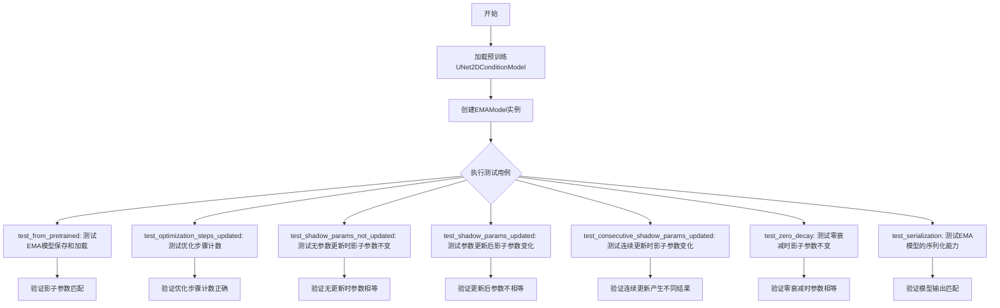

## 类结构

```
unittest.TestCase
├── EMAModelTests (EMA模型标准测试)
│   ├── get_models()
│   ├── get_dummy_inputs()
│   ├── simulate_backprop()
│   ├── test_from_pretrained()
│   ├── test_optimization_steps_updated()
│   ├── test_shadow_params_not_updated()
│   ├── test_shadow_params_updated()
│   ├── test_consecutive_shadow_params_updated()
│   ├── test_zero_decay()
│   └── test_serialization()
└── EMAModelTestsForeach (EMA模型foreach测试)
    ├── get_models()
    ├── get_dummy_inputs()
    ├── simulate_backprop()
    ├── test_from_pretrained()
    ├── test_optimization_steps_updated()
    ├── test_shadow_params_not_updated()
    ├── test_shadow_params_updated()
    ├── test_consecutive_shadow_params_updated()
    ├── test_zero_decay()
    └── test_serialization()
```

## 全局变量及字段


### `enable_full_determinism`
    
启用完全确定性测试的函数引用

类型：`function`
    


### `skip_mps`
    
跳过MPS设备的装饰器

类型：`decorator`
    


### `torch_device`
    
torch设备变量

类型：`str`
    


### `UNet2DConditionModel`
    
UNet2D条件模型类

类型：`class`
    


### `EMAModel`
    
指数移动平均模型类

类型：`class`
    


### `tempfile`
    
Python临时文件模块

类型：`module`
    


### `unittest`
    
Python单元测试模块

类型：`module`
    


### `torch`
    
PyTorch深度学习库

类型：`module`
    


### `EMAModelTests.model_id`
    
测试用的小型Stable Diffusion模型ID

类型：`str`
    


### `EMAModelTests.batch_size`
    
批处理大小，值为1

类型：`int`
    


### `EMAModelTests.prompt_length`
    
提示词长度，值为77

类型：`int`
    


### `EMAModelTests.text_encoder_hidden_dim`
    
文本编码器隐藏维度，值为32

类型：`int`
    


### `EMAModelTests.num_in_channels`
    
输入通道数，值为4

类型：`int`
    


### `EMAModelTests.latent_height`
    
潜在空间高度，值为64

类型：`int`
    


### `EMAModelTests.latent_width`
    
潜在空间宽度，值为64

类型：`int`
    


### `EMAModelTests.generator`
    
随机数生成器，用于复现性

类型：`torch.Generator`
    


### `EMAModelTestsForeach.model_id`
    
测试用的小型Stable Diffusion模型ID

类型：`str`
    


### `EMAModelTestsForeach.batch_size`
    
批处理大小，值为1

类型：`int`
    


### `EMAModelTestsForeach.prompt_length`
    
提示词长度，值为77

类型：`int`
    


### `EMAModelTestsForeach.text_encoder_hidden_dim`
    
文本编码器隐藏维度，值为32

类型：`int`
    


### `EMAModelTestsForeach.num_in_channels`
    
输入通道数，值为4

类型：`int`
    


### `EMAModelTestsForeach.latent_height`
    
潜在空间高度，值为64

类型：`int`
    


### `EMAModelTestsForeach.latent_width`
    
潜在空间宽度，值为64

类型：`int`
    


### `EMAModelTestsForeach.generator`
    
随机数生成器，用于复现性

类型：`torch.Generator`
    
    

## 全局函数及方法


### `enable_full_determinism`

该函数用于启用 PyTorch 的完全确定性模式，通过设置随机种子和强制使用确定性算法，确保测试结果在多次运行中保持完全一致，从而保证测试的可复现性。

参数： 无

返回值： 无（直接调用，无返回值）

#### 流程图

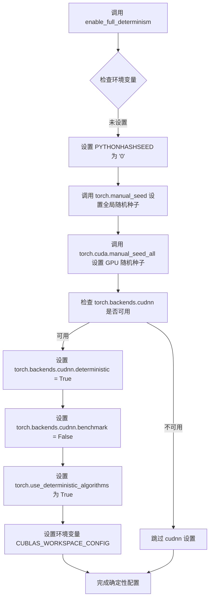

#### 带注释源码

```
# enable_full_determinism 函数源码（基于 diffusers 库的典型实现）
# 位置：diffusers/testing_utils.py

def enable_full_determinism(seed: int = 0, verbose: bool = True):
    """
    启用完全确定性模式以保证测试可复现
    
    参数：
    - seed: int, 随机种子值，默认为 0
    - verbose: bool, 是否打印详细信息，默认为 True
    
    返回值：
    - 无返回值
    
    实现步骤：
    """
    
    # 1. 设置 Python 哈希种子，确保 Python 层面的随机性可控
    import os
    os.environ["PYTHONHASHSEED"] = str(seed)
    
    # 2. 设置 PyTorch CPU 全局随机种子
    # 这会影响所有基于 torch.randn 等随机函数的结果
    torch.manual_seed(seed)
    
    # 3. 设置所有 GPU 的随机种子
    # 如果使用多 GPU，确保每个 GPU 都有相同的随机种子
    if torch.cuda.is_available():
        torch.cuda.manual_seed_all(seed)
    
    # 4. 配置 cuDNN 使用确定性算法
    # - deterministic=True 确保每次运行使用相同的卷积算法
    # - benchmark=False 禁用自动选择最快的算法（因为最快的算法可能不稳定）
    if torch.backends.cudnn.is_available():
        torch.backends.cudnn.deterministic = True
        torch.backends.cudnn.benchmark = False
    
    # 5. 强制 PyTorch 使用确定性算法
    # 这会阻止使用非确定性的操作（如某些自适应算法）
    torch.use_deterministic_algorithms(True)
    
    # 6. 配置 CUDA 库的工作区设置
    # 确保 GPU 计算也使用确定性算法
    os.environ["CUBLAS_WORKSPACE_CONFIG"] = ":4096:8"
    
    # 7. 如果需要，打印配置信息
    if verbose:
        print(f"Full determinism enabled with seed: {seed}")
```

---

### 补充信息

**技术债务与优化空间：**

1. **环境变量覆盖问题**：函数直接修改全局环境变量，可能与用户代码中设置的其他随机性配置冲突
2. **性能损失**：强制使用确定性算法通常会导致约 10-30% 的性能下降
3. **兼容性限制**：某些高级操作（如某些自定义层）可能不完全支持确定性模式，导致运行时错误
4. **测试隔离性**：全局状态修改后未提供恢复机制，可能影响后续测试用例

**设计目标与约束：**

- **主要目标**：确保测试结果的可复现性，定位随机性导致的 flaky 测试
- **约束**：牺牲部分运行时性能以换取确定性
- **适用范围**：主要针对单元测试和集成测试，不建议在生产环境中使用

**外部依赖与接口契约：**

- 依赖 `torch` 库
- 依赖 `os` 标准库进行环境变量配置
- 不返回任何值，直接修改全局状态


### `skip_mps`

`skip_mps` 是一个测试装饰器，用于在检测到运行环境使用 MPS (Metal Performance Shaders) 设备时跳过被装饰的测试方法。这是因为 MPS 后端可能不支持某些测试场景或存在兼容性问题。

参数：无（装饰器语法，不直接传递参数）

返回值：无返回值（装饰器直接返回 wrapper 函数或原函数）

#### 流程图

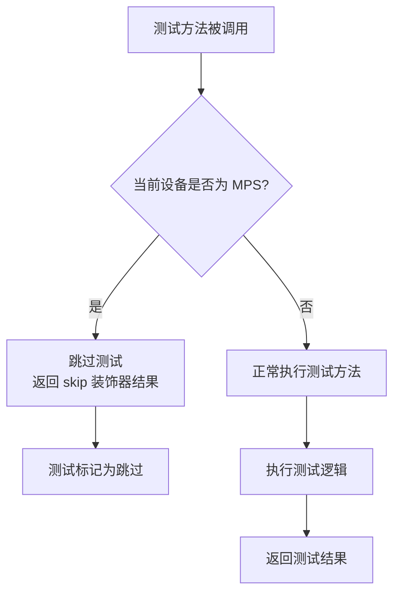

#### 带注释源码

```python
# 从 testing_utils 模块导入 skip_mps 装饰器
# 该装饰器定义在 diffusers.testing_utils 模块中
from ..testing_utils import enable_full_determinism, skip_mps, torch_device


# 使用示例：在 EMAModelTests 类中
# skip_mps 装饰器应用于 test_serialization 方法
# 当测试运行在 MPS (Apple Silicon GPU) 设备上时，该测试会被跳过
@skip_mps
def test_serialization(self):
    """
    测试 EMA 模型的序列化功能
    包括保存和加载模型参数
    """
    unet, ema_unet = self.get_models()
    noisy_latents, timesteps, encoder_hidden_states = self.get_dummy_inputs()

    with tempfile.TemporaryDirectory() as tmpdir:
        # 保存 EMA 模型到临时目录
        ema_unet.save_pretrained(tmpdir)
        # 从保存的目录加载模型
        loaded_unet = UNet2DConditionModel.from_pretrained(tmpdir, model_cls=UNet2DConditionModel)
        loaded_unet = loaded_unet.to(unet.device)

    # 由于没有执行 EMA 步骤，输出应该匹配
    output = unet(noisy_latents, timesteps, encoder_hidden_states).sample
    output_loaded = loaded_unet(noisy_latents, timesteps, encoder_hidden_states).sample

    # 验证输出在给定容差范围内相等
    assert torch.allclose(output, output_loaded, atol=1e-4)
```

> **注意**：`skip_mps` 装饰器的完整实现在 `diffusers.testing_utils` 模块中，当前代码文件仅导入了该装饰器。从代码使用方式可以推断，其核心功能是检测当前计算设备是否为 Apple MPS (Metal Performance Shaders)，如果是则跳过被装饰的测试方法，以确保测试套件在不支持的硬件平台上能够正常运行。


### `torch_device`

获取当前 PyTorch 可用设备的辅助变量/函数，用于将模型和张量移动到计算设备上。

参数： 无

返回值：`str`，返回当前 PyTorch 可用的设备标识符（如 "cuda"、"cpu" 或 "mps"）

#### 流程图

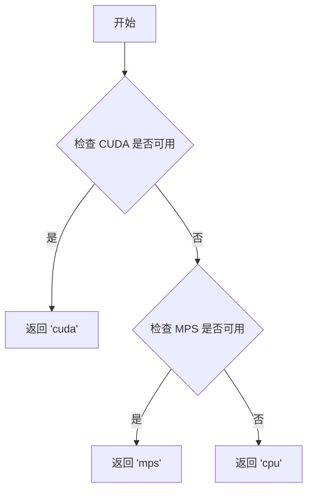

#### 带注释源码

```python
# torch_device 的实际实现位于 diffusers.testing_utils 模块中
# 以下为从代码使用方式推断的实现逻辑：

def get_torch_device():
    """
    获取当前 PyTorch 可用的设备。
    
    优先级顺序：
    1. CUDA (GPU) - 如果可用则返回 'cuda'
    2. MPS (Apple Silicon) - 如果可用则返回 'mps'
    3. CPU - 默认返回 'cpu'
    
    Returns:
        str: 可用的设备标识符
    """
    if torch.cuda.is_available():
        return "cuda"
    elif hasattr(torch.backends, 'mps') and torch.backends.mps.is_available():
        return "mps"
    else:
        return "cpu"

# 在代码中的实际使用方式：
# from ..testing_utils import torch_device
# 
# unet = unet.to(torch_device)  # 将模型移动到设备
# noisy_latents = torch.randn(...).to(torch_device)  # 将张量移动到设备
```

#### 实际源码位置

`torch_device` 实际上是从 `diffusers` 包的 `testing_utils` 模块导入的。其典型实现位于 `src/diffusers/testing_utils.py` 中，是一个根据环境自动判断返回合适设备字符串的函数或变量。该变量使得测试代码能够自动适配不同的硬件环境（CPU、GPU 或 Apple Silicon MPS）。


### `EMAModelTests.get_models`

该方法用于创建并初始化UNet模型和对应的EMA（指数移动平均）模型实例，为后续的EMA测试提供模型对象支持。

参数：

- `decay`：`float`，指数移动平均的衰减率，默认值为0.9999，用于控制EMA模型参数更新的速度

返回值：`tuple`，返回包含UNet模型和EMA模型实例的元组 (unet, ema_unet)

#### 流程图

```mermaid
flowchart TD
    A[开始 get_models] --> B[从预训练模型加载 UNet2DConditionModel]
    B --> C[将 UNet 移动到指定设备 torch_device]
    C --> D[创建 EMAModel 实例]
    D --> E[使用 UNet 参数初始化 EMA 模型]
    E --> F[返回 (unet, ema_unet) 元组]
```

#### 带注释源码

```python
def get_models(self, decay=0.9999):
    """
    创建并返回 UNet 模型和对应的 EMA 模型实例
    
    参数:
        decay: float, 指数移动平均的衰减率，默认 0.9999
              值越接近 1 表示 EMA 更新越慢，模型参数越稳定
    
    返回:
        tuple: (unet, ema_unet) - UNet模型实例和对应的EMA模型实例
    """
    # 从预训练模型加载 UNet2DConditionModel
    # 使用 self.model_id 指定的模型路径，加载 subfolder="unet" 的模型
    unet = UNet2DConditionModel.from_pretrained(self.model_id, subfolder="unet")
    
    # 将加载的 UNet 模型移动到指定的计算设备（CPU/CUDA/MPS等）
    unet = unet.to(torch_device)
    
    # 创建 EMA 模型实例
    # 参数:
    #   - unet.parameters(): 原始模型的参数迭代器
    #   - decay: 衰减率，控制 EMA 更新的速度
    #   - model_cls: 模型类别，用于 EMA 模型的类型推断
    #   - model_config: 模型配置，用于保存和加载 EMA 模型
    ema_unet = EMAModel(
        unet.parameters(), 
        decay=decay, 
        model_cls=UNet2DConditionModel, 
        model_config=unet.config
    )
    
    # 返回 UNet 模型和 EMA 模型实例的元组
    return unet, ema_unet
```


### `EMAModelTests.get_dummy_inputs`

生成用于测试 EMA（指数移动平均）模型的虚拟输入数据，包括带噪声的潜在变量、时间步和编码器隐藏状态。

参数：
- 无

返回值：`tuple`，返回三个元素的元组：
- `noisy_latents`：`torch.Tensor`，形状为 (batch_size, num_in_channels, latent_height, latent_width)，表示带噪声的潜在变量
- `timesteps`：`torch.Tensor`，形状为 (batch_size,)，表示扩散过程中的时间步
- `encoder_hidden_states`：`torch.Tensor`，形状为 (batch_size, prompt_length, text_encoder_hidden_dim)，表示文本编码器的隐藏状态

#### 流程图

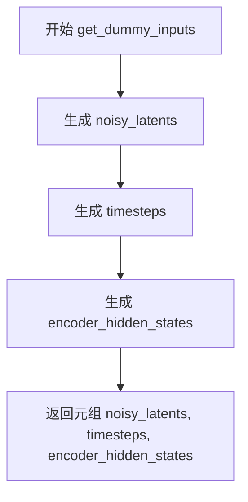

#### 带注释源码

```python
def get_dummy_inputs(self):
    """
    生成用于测试的虚拟输入数据。
    
    Returns:
        tuple: 包含以下三个元素的元组
            - noisy_latents: 带噪声的潜在变量，形状为 (batch_size, num_in_channels, latent_height, latent_width)
            - timesteps: 时间步，形状为 (batch_size,)
            - encoder_hidden_states: 编码器隐藏状态，形状为 (batch_size, prompt_length, text_encoder_hidden_dim)
    """
    # 使用类属性 batch_size, num_in_channels, latent_height, latent_width 生成带噪声的潜在变量
    # 使用 generator 确保随机数可重复生成，便于测试复现
    noisy_latents = torch.randn(
        self.batch_size, 
        self.num_in_channels, 
        self.latent_height, 
        self.latent_width, 
        generator=self.generator
    ).to(torch_device)
    
    # 生成随机时间步，范围在 [0, 1000) 之间，模拟扩散模型的采样过程
    timesteps = torch.randint(0, 1000, size=(self.batch_size,), generator=self.generator).to(torch_device)
    
    # 生成文本编码器的隐藏状态，用于条件生成
    encoder_hidden_states = torch.randn(
        self.batch_size, 
        self.prompt_length, 
        self.text_encoder_hidden_dim, 
        generator=self.generator
    ).to(torch_device)
    
    # 返回三个虚拟输入数据
    return noisy_latents, timesteps, encoder_hidden_states
```


### `EMAModelTests.simulate_backprop`

该方法是一个测试辅助函数，用于模拟模型在训练过程中的参数更新（反向传播效果），通过对模型参数添加随机扰动来创建"伪更新"的模型状态，以便测试 EMA（指数移动平均）机制是否正确追踪参数变化。

参数：

- `unet`：`UNet2DConditionModel`，输入的 UNet2D 条件模型实例，需要模拟参数更新的原始模型

返回值：`UNet2DConditionModel`，返回参数被随机扰动后的模型实例，模拟了训练过程中的参数变化

#### 流程图

```mermaid
flowchart TD
    A[开始: 输入 unet 模型] --> B[创建空字典 updated_state_dict]
    B --> C{遍历 unet.state_dict 的每个参数}
    C -->|对于每个参数 k, param| D[生成随机扰动: param * torch.randn_like(param)]
    D --> E[生成新参数: torch.randn_like(param) + 扰动]
    E --> F[更新状态字典: updated_state_dict[k] = updated_param]
    F --> C
    C -->|遍历结束| G[调用 unet.load_state_dict加载更新后的状态字典]
    G --> H[返回更新后的 unet 模型]
```

#### 带注释源码

```python
def simulate_backprop(self, unet):
    """
    模拟模型参数更新（反向传播效果）
    
    该方法通过以下步骤模拟训练过程中的参数变化：
    1. 遍历模型的所有参数
    2. 对每个参数添加随机扰动（模拟梯度更新）
    3. 将扰动后的参数加载回模型
    """
    # 初始化空字典用于存储更新后的参数
    updated_state_dict = {}
    
    # 遍历模型当前的状态字典（包含所有参数）
    for k, param in unet.state_dict().items():
        # 生成与原参数形状相同的随机噪声
        # torch.randn_like(param) 生成均值为0、标准差为1的随机数
        random_noise = torch.randn_like(param)
        
        # 计算扰动：原参数值 * 随机噪声（模拟梯度更新方向和幅度的随机性）
        perturbation = param * random_noise
        
        # 新参数 = 随机噪声 + 扰动
        # 这样既保留了原始参数的一些信息，又添加了随机变化
        updated_param = random_noise + perturbation
        
        # 将更新后的参数存入字典，键为原参数名称
        updated_state_dict.update({k: updated_param})
    
    # 将更新后的状态字典加载回模型
    # 这模拟了训练中optimizer.step()后的参数更新
    unet.load_state_dict(updated_state_dict)
    
    # 返回参数已更新的模型实例
    return unet
```

#### 设计说明

该方法主要用于 EMA（指数移动平均）模型的单元测试中：

1. **测试目的**：在无需实际执行耗时的训练过程的情况下，创建参数已更新的模型状态，用于验证 EMA 机制能否正确追踪参数变化

2. **参数更新策略**：
   - 使用 `torch.randn_like` 生成随机噪声，模拟梯度的不确定性
   - 通过 `param * torch.randn_like(param)` 引入参数依赖的扰动，使更新更接近真实训练场景
   - 对于可能初始化为零的参数（如偏置），通过相加操作确保不会保持为零

3. **潜在改进空间**：
   - 当前实现每次调用都会产生完全不同的随机更新，可考虑添加随机种子控制以提高测试可重复性
   - 可以增加参数扰动幅度的控制（如通过 decay 参数），更精确地模拟不同训练阶段的参数变化程度


### `EMAModelTests.test_from_pretrained`

该测试方法用于验证 EMA（指数移动平均）模型的保存和加载功能，确保加载后的 shadow parameters、optimization_step 和 decay 参数与原始模型一致。

参数：此方法为实例方法，无需显式传入参数（隐式接收 `self`）。

返回值：`None`，因为该方法为测试方法，通过断言验证结果而非返回值。

#### 流程图

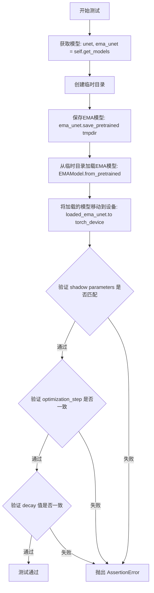

#### 带注释源码

```python
def test_from_pretrained(self):
    # 获取原始模型和EMA模型实例
    # unet: 原始的UNet2DConditionModel模型
    # ema_unet: 基于unet参数创建的EMA模型
    unet, ema_unet = self.get_models()
    
    # 使用临时目录来保存和加载模型，避免污染文件系统
    with tempfile.TemporaryDirectory() as tmpdir:
        # 步骤1: 将EMA模型保存到临时目录
        # 保存内容包含: shadow_params, optimization_step, decay等EMA相关状态
        ema_unet.save_pretrained(tmpdir)

        # 步骤2: 从保存的目录加载EMA模型
        # 参数:
        #   - tmpdir: 保存路径
        #   - model_cls: 模型类别，用于反序列化
        #   - foreach: False表示不使用foreach优化加载
        loaded_ema_unet = EMAModel.from_pretrained(tmpdir, model_cls=UNet2DConditionModel, foreach=False)
        
        # 将加载的模型移动到指定的计算设备（CPU/GPU）
        loaded_ema_unet.to(torch_device)

    # 验证1: 检查加载后的shadow parameters是否与原始EMA模型的shadow parameters匹配
    # shadow_params: EMA在训练过程中维护的模型参数的指数移动平均值
    for original_param, loaded_param in zip(ema_unet.shadow_params, loaded_ema_unet.shadow_params):
        # 使用torch.allclose进行近似比较，容差为1e-4
        assert torch.allclose(original_param, loaded_param, atol=1e-4)

    # 验证2: 检查优化步骤数是否被正确保存和加载
    # optimization_step: EMA模型已经执行的更新步数
    assert loaded_ema_unet.optimization_step == ema_unet.optimization_step

    # 验证3: 检查衰减因子是否被正确保存和加载
    # decay: 用于计算指数移动平均的衰减系数，通常接近1.0（如0.9999）
    assert loaded_ema_unet.decay == ema_unet.decay
```


### `EMAModelTests.test_optimization_steps_updated`

该测试方法用于验证 EMA（指数移动平均）模型的优化步骤计数器在每次调用 `step()` 方法时是否正确递增，确保 EMA 训练过程中的步数记录准确无误。

参数：

- `self`：`EMAModelTests`（隐式参数），unittest.TestCase 实例，表示测试类本身

返回值：`None`，该方法为测试方法，无返回值，通过断言验证逻辑正确性

#### 流程图

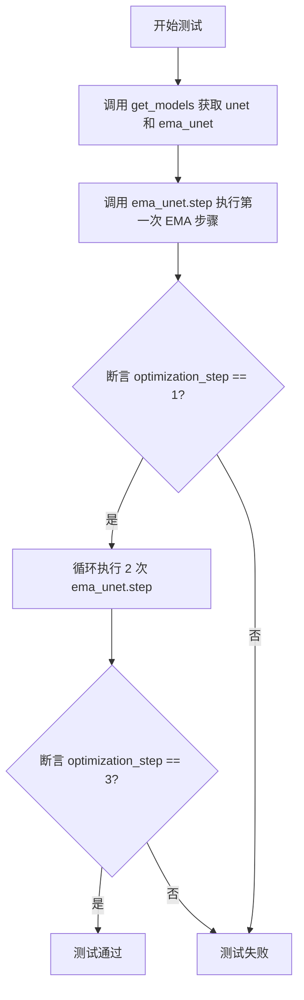

#### 带注释源码

```python
def test_optimization_steps_updated(self):
    """
    测试优化步骤计数是否正确更新
    
    该测试验证 EMA 模型在训练过程中每调用一次 step() 方法，
    optimization_step 计数器就会正确递增。
    """
    # 获取原始模型和 EMA 模型实例
    unet, ema_unet = self.get_models()
    
    # Take the first (hypothetical) EMA step.
    # 执行第一次 EMA 步骤更新
    ema_unet.step(unet.parameters())
    
    # 验证优化步骤计数为 1
    assert ema_unet.optimization_step == 1

    # Take two more.
    # 再执行两次 EMA 步骤（共三次）
    for _ in range(2):
        ema_unet.step(unet.parameters())
    
    # 验证优化步骤计数为 3
    assert ema_unet.optimization_step == 3
```


### `EMAModelTests.test_shadow_params_not_updated`

该测试方法用于验证当模型参数未发生更新（即未进行反向传播）时，EMA（指数移动平均）的影子参数（shadow_params）应保持与原始模型参数一致。测试通过模拟 EMA 更新步骤前后对比影子参数与原始参数，验证在无参数变化场景下影子参数不会发生改变。

参数：此方法为测试类方法，无显式输入参数，使用类实例属性（`self`）获取模型和数据。

返回值：`None`，该方法为单元测试，不返回任何值，仅通过断言验证逻辑正确性。

#### 流程图

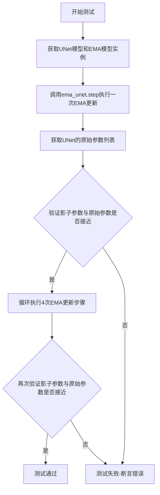

#### 带注释源码

```python
def test_shadow_params_not_updated(self):
    """
    测试无参数更新时影子参数保持不变
    
    该测试验证当模型参数未发生实际更新（未进行反向传播）时，
    EMA的影子参数应该与原始模型参数保持一致。
    """
    # 步骤1：获取UNet模型和对应的EMA模型实例
    # 使用get_models方法创建原始模型和EMA包装器
    unet, ema_unet = self.get_models()
    
    # 步骤2：执行一次EMA更新步骤
    # 注意：此处UNet参数未被更新（未模拟反向传播）
    # 即使调用step方法，由于参数无变化，影子参数应保持不变
    ema_unet.step(unet.parameters())
    
    # 步骤3：获取当前UNet模型的原始参数列表
    # 这些参数将作为基准与EMA影子参数进行对比
    orig_params = list(unet.parameters())
    
    # 步骤4：验证每个影子参数是否与对应的原始参数接近
    # 使用torch.allclose进行数值比较（考虑浮点误差）
    for s_param, param in zip(ema_unet.shadow_params, orig_params):
        # 断言：影子参数应与原始参数保持一致
        assert torch.allclose(s_param, param)
    
    # 步骤5：额外测试——连续执行4次EMA更新步骤
    # 即使多次调用step，由于UNet参数始终未更新，
    # 影子参数仍应保持与原始参数一致
    for _ in range(4):
        ema_unet.step(unet.parameters())
    
    # 步骤6：再次验证多次更新后影子参数仍保持不变
    for s_param, param in zip(ema_unet.shadow_params, orig_params):
        assert torch.allclose(s_param, param)
```


### `EMAModelTests.test_shadow_params_updated`

该测试方法验证了在模拟模型参数更新后，EMA（指数移动平均）的影子参数会发生相应变化，确保 EMA 机制正确追踪模型参数的更新。

参数：

- `self`：隐式参数，测试类实例本身，无需显式传递

返回值：`None`，测试方法不返回任何值，仅通过断言验证逻辑

#### 流程图

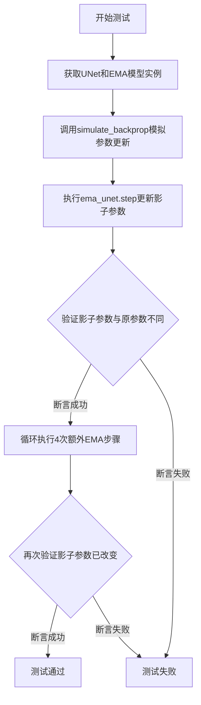

#### 带注释源码

```python
def test_shadow_params_updated(self):
    """
    测试当模型参数发生更新后，EMA的影子参数是否正确更新。
    验证EMA机制能够追踪模型参数的变化。
    """
    # 步骤1：获取原始UNet模型和EMA模型实例
    # get_models()方法会加载预训练模型并初始化EMA模型
    unet, ema_unet = self.get_models()
    
    # 步骤2：模拟参数更新（模拟反向传播后的参数变化）
    # 由于某些参数可能初始化为零，在乘法前需确保值非零
    # simulate_backprop方法通过添加随机噪声来模拟参数更新
    unet_pseudo_updated_step_one = self.simulate_backprop(unet)

    # 步骤3：执行EMA更新步骤
    # 使用更新后的模型参数调用step方法，更新影子参数
    ema_unet.step(unet_pseudo_updated_step_one.parameters())

    # 步骤4：验证影子参数与原始参数不再相等
    # 获取更新后的模型参数
    orig_params = list(unet_pseudo_updated_step_one.parameters())
    # 遍历比较每个影子参数与对应模型参数
    for s_param, param in zip(ema_unet.shadow_params, orig_params):
        # 断言：使用按位取反的allclose检查参数不再相等
        # 注意：~torch.allclose() 在新版本PyTorch中可能行为有变
        assert ~torch.allclose(s_param, param)

    # 步骤5：多次执行EMA步骤，进一步验证
    # 连续执行4次额外的EMA更新
    for _ in range(4):
        ema_unet.step(unet.parameters())
    
    # 步骤6：再次验证影子参数已发生改变
    for s_param, param in zip(ema_unet.shadow_params, orig_params):
        assert ~torch.allclose(s_param, param)
```


### `EMAModelTests.test_consecutive_shadow_params_updated`

测试连续多次更新产生不同的影子参数，验证在两次连续的反向传播和 EMA 步骤后，EMA 模型的影子参数会发生变化。

参数：

- `self`：`EMAModelTests`，测试类的实例，包含测试所需的状态和方法

返回值：`None`，无返回值（测试方法）

#### 流程图

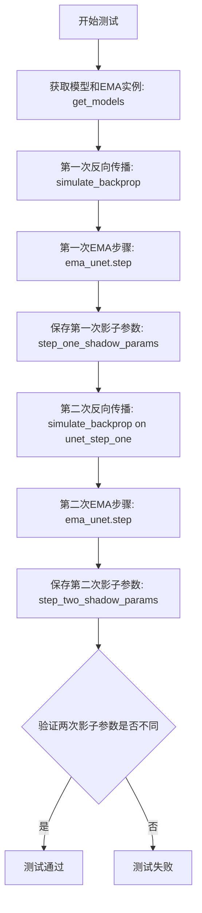

#### 带注释源码

```python
def test_consecutive_shadow_params_updated(self):
    """
    测试连续多次更新产生不同的影子参数
    
    验证逻辑：如果连续调用两次 EMA step（在两次反向传播之后），
    两次产生的影子参数应该是不同的。
    """
    # 获取 UNet 模型和 EMA 模型实例
    # 使用默认 decay=0.9999
    unet, ema_unet = self.get_models()

    # ====== 第一次反向传播 + EMA ======
    # 模拟第一次反向传播后的参数更新
    # simulate_backprop 会随机更新 unet 的参数
    unet_step_one = self.simulate_backprop(unet)
    
    # 执行第一次 EMA 更新步骤
    ema_unet.step(unet_step_one.parameters())
    
    # 保存第一次 EMA 更新后的影子参数
    step_one_shadow_params = ema_unet.shadow_params

    # ====== 第二次反向传播 + EMA ======
    # 基于第一次更新后的模型进行第二次反向传播
    unet_step_two = self.simulate_backprop(unet_step_one)
    
    # 执行第二次 EMA 更新步骤
    ema_unet.step(unet_step_two.parameters())
    
    # 保存第二次 EMA 更新后的影子参数
    step_two_shadow_params = ema_unet.shadow_params

    # ====== 验证 ======
    # 确保两次 EMA 步骤产生的影子参数不同
    # 使用 ~torch.allclose() 验证参数不全部相等
    for step_one, step_two in zip(step_one_shadow_params, step_two_shadow_params):
        assert ~torch.allclose(step_one, step_two)
```


### `EMAModelTests.test_zero_decay`

该测试方法验证了当 EMA（指数移动平均）的衰减系数（decay）设置为 0 时，即使模型参数通过反向传播发生更新，EMA 的影子参数（shadow parameters）也不会被更新，始终保持初始值不变。

参数：

- `self`：隐式参数，`EMAModelTests` 类的实例，表示测试用例本身

返回值：`None`，该方法为单元测试方法，无返回值，通过断言验证逻辑正确性

#### 流程图

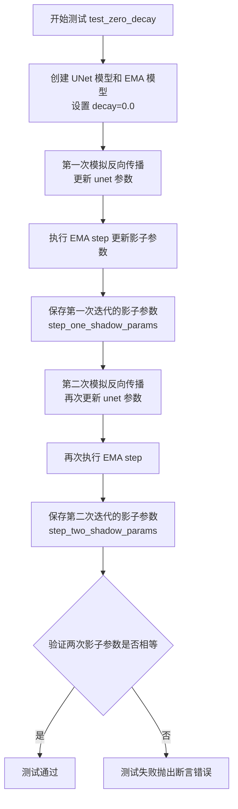

#### 带注释源码

```python
def test_zero_decay(self):
    # 如果没有衰减（decay=0.0），即使有反向传播更新，
    # EMA 步骤也不会产生任何效果，即影子参数保持不变。
    # 本测试用例验证这一行为。
    
    # 步骤1: 创建模型，设置衰减系数为 0.0
    # get_models(decay=0.0) 创建 UNet 模型和对应的 EMA 模型
    unet, ema_unet = self.get_models(decay=0.0)
    
    # 步骤2: 模拟第一次反向传播，更新 unet 的参数
    # simulate_backprop 会给参数添加随机噪声来模拟梯度更新
    unet_step_one = self.simulate_backprop(unet)
    
    # 步骤3: 执行 EMA step，由于 decay=0.0，影子参数理论上不应更新
    # step() 方法会根据当前的模型参数更新影子参数
    ema_unet.step(unet_step_one.parameters())
    
    # 步骤4: 保存第一次 EMA step 后的影子参数副本
    step_one_shadow_params = ema_unet.shadow_params
    
    # 步骤5: 模拟第二次反向传播，再次更新 unet 的参数
    unet_step_two = self.simulate_backprop(unet_step_one)
    
    # 步骤6: 再次执行 EMA step
    ema_unet.step(unet_step_two.parameters())
    
    # 步骤7: 保存第二次 EMA step 后的影子参数副本
    step_two_shadow_params = ema_unet.shadow_params
    
    # 步骤8: 断言验证
    # 由于 decay=0.0，两次迭代的影子参数应该完全相等
    # torch.allclose 检查两个张量是否在容差范围内相等
    for step_one, step_two in zip(step_one_shadow_params, step_two_shadow_params):
        assert torch.allclose(step_one, step_two)
```


### `EMAModelTests.test_serialization`

该测试方法用于验证 EMA（指数移动平均）模型的序列化功能，确保模型在保存和加载后能够正确恢复，且加载后的模型输出与原始模型输出一致（当未执行 EMA 更新步骤时）。

参数：

- `self`：`unittest.TestCase`，测试类的实例本身，包含测试所需的上下文和断言方法

返回值：`None`，测试方法不返回任何值，通过断言验证正确性

#### 流程图

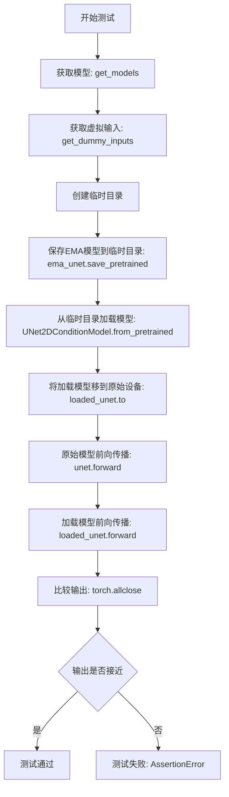

#### 带注释源码

```python
@skip_mps  # 跳过MPS设备测试（Apple Silicon）
def test_serialization(self):
    """
    测试EMA模型的序列化功能。
    验证保存和加载模型后，由于未执行EMA更新步骤，
    加载的模型应该与原始模型输出一致。
    """
    # 1. 获取原始UNet模型和EMA包装器
    unet, ema_unet = self.get_models()
    
    # 2. 获取虚拟输入数据（用于前向传播测试）
    noisy_latents, timesteps, encoder_hidden_states = self.get_dummy_inputs()

    # 3. 使用临时目录进行序列化测试
    with tempfile.TemporaryDirectory() as tmpdir:
        # 3.1 将EMA模型的参数保存到指定目录
        ema_unet.save_pretrained(tmpdir)
        
        # 3.2 从保存的目录加载UNet模型
        loaded_unet = UNet2DConditionModel.from_pretrained(
            tmpdir, 
            model_cls=UNet2DConditionModel
        )
        
        # 3.3 将加载的模型移到与原始模型相同的设备
        loaded_unet = loaded_unet.to(unet.device)

    # 4. 由于未执行EMA更新步骤，两个模型的参数应该相同
    #    因此输出也应该相同
    output = unet(noisy_latents, timesteps, encoder_hidden_states).sample
    output_loaded = loaded_unet(noisy_latents, timesteps, encoder_hidden_states).sample

    # 5. 断言：验证两个输出在给定容差范围内相等
    assert torch.allclose(output, output_loaded, atol=1e-4)
```


### `EMAModelTestsForeach.get_models`

该方法用于在 foreach 模式下创建 UNet 模型和对应的 EMA（指数移动平均）模型实例，以便测试 EMA 模型的 foreach 功能是否正常工作。

参数：

- `decay`：`float`，指数移动平均的衰减率，默认为 0.9999，控制 EMA 模型参数更新的速度

返回值：`tuple[UNet2DConditionModel, EMAModel]`，返回原始 UNet 模型和其对应的 EMA 模型实例组成的元组

#### 流程图

```mermaid
flowchart TD
    A[开始 get_models] --> B[从预训练模型加载 UNet2DConditionModel]
    B --> C[将 UNet 移动到 torch_device]
    C --> D[创建 EMAModel 实例<br/>参数: unet.parameters<br/>decay: 传入的衰减率<br/>model_cls: UNet2DConditionModel<br/>model_config: unet.config<br/>foreach: True]
    D --> E[返回元组 (unet, ema_unet)]
```

#### 带注释源码

```python
def get_models(self, decay=0.9999):
    """
    创建 UNet 模型和 EMA 模型实例（foreach 模式）
    
    参数:
        decay: float, EMA 衰减率，默认为 0.9999
        
    返回:
        tuple: (unet, ema_unet) - 原始 UNet 模型和 EMA 模型实例
    """
    # 从预训练模型加载 UNet2DConditionModel
    unet = UNet2DConditionModel.from_pretrained(self.model_id, subfolder="unet")
    # 将 UNet 移动到指定的计算设备（如 CUDA）
    unet = unet.to(torch_device)
    # 创建 EMA 模型，使用 foreach=True 启用 foreach 优化模式
    ema_unet = EMAModel(
        unet.parameters(),  # 传入 UNet 的参数迭代器
        decay=decay,        # 指数移动平均衰减率
        model_cls=UNet2DConditionModel,  # 模型类别
        model_config=unet.config,        # 模型配置
        foreach=True  # 启用 foreach 模式进行优化
    )
    # 返回 UNet 和 EMA 模型元组
    return unet, ema_unet
```


### `EMAModelTestsForeach.get_dummy_inputs`

该方法用于生成测试用的虚拟输入数据，包括噪声潜在向量、时间步和文本编码器隐藏状态，以支持对 UNet2DConditionModel 进行 EMA（指数移动平均）相关功能的单元测试。

参数：无（仅包含隐式参数 `self`）

返回值：`tuple[torch.Tensor, torch.Tensor, torch.Tensor]`，返回包含三个元素的元组——`noisy_latents`（噪声潜在向量）、`timesteps`（时间步）和 `encoder_hidden_states`（文本编码器隐藏状态）

#### 流程图

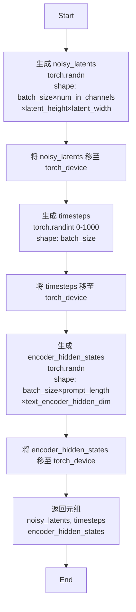

#### 带注释源码

```python
def get_dummy_inputs(self):
    """
    生成用于测试的虚拟输入数据。
    
    该方法创建三个张量用于模拟 UNet2DConditionModel 的前向传播输入：
    - noisy_latents: 噪声潜在向量，表示加噪后的潜在表示
    - timesteps: 时间步，用于控制去噪过程的当前步骤
    - encoder_hidden_states: 文本编码器的隐藏状态，用于条件生成
    """
    # 使用类属性 batch_size, num_in_channels, latent_height, latent_width
    # 生成形状为 (batch_size, num_in_channels, latent_height, latent_width) 的随机噪声张量
    noisy_latents = torch.randn(
        self.batch_size, self.num_in_channels, self.latent_height, self.latent_width, generator=self.generator
    ).to(torch_device)
    
    # 生成形状为 (batch_size,) 的随机整数时间步，范围 [0, 1000)
    timesteps = torch.randint(0, 1000, size=(self.batch_size,), generator=self.generator).to(torch_device)
    
    # 使用类属性 prompt_length 和 text_encoder_hidden_dim
    # 生成形状为 (batch_size, prompt_length, text_encoder_hidden_dim) 的随机文本隐藏状态
    encoder_hidden_states = torch.randn(
        self.batch_size, self.prompt_length, self.text_encoder_hidden_dim, generator=self.generator
    ).to(torch_device)
    
    # 返回三个张量组成的元组，供后续测试使用
    return noisy_latents, timesteps, encoder_hidden_states
```


### `EMAModelTestsForeach.simulate_backprop`

该方法是一个测试辅助函数，用于模拟神经网络模型在反向传播后的参数更新过程。通过对模型参数添加随机噪声来模拟参数变化，并将更新后的参数重新加载到模型中。

参数：

- `unet`：`UNet2DConditionModel`，需要模拟参数更新的UNet2DConditionModel模型实例

返回值：`UNet2DConditionModel`，完成参数模拟更新后的UNet模型实例

#### 流程图

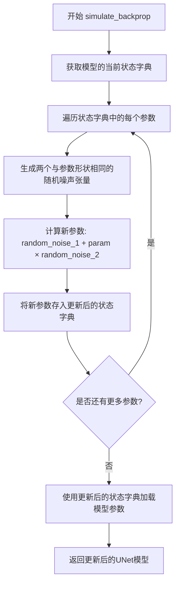

#### 带注释源码

```python
def simulate_backprop(self, unet):
    """
    模拟模型参数的反向传播更新
    
    该方法通过添加随机噪声来模拟神经网络训练过程中的参数更新。
    用于测试场景中，当无法执行真实反向传播时，生成不同的参数状态。
    
    参数:
        unet (UNet2DConditionModel): 需要模拟参数更新的UNet模型
        
    返回:
        UNet2DConditionModel: 参数被模拟更新后的UNet模型
    """
    # 初始化一个空字典，用于存储更新后的参数
    updated_state_dict = {}
    
    # 遍历模型当前状态字典中的所有参数（键值对）
    # k: 参数名称, param: 参数张量
    for k, param in unet.state_dict().items():
        # 生成两个与原参数形状和设备相同的随机张量
        # torch.randn_like(param) 生成标准正态分布的随机值
        random_noise_1 = torch.randn_like(param)
        random_noise_2 = torch.randn_like(param)
        
        # 计算更新后的参数: 原参数 + 原参数×随机噪声
        # 这种方式模拟了参数在梯度下降后的变化趋势
        # (参数被修改为加上一个扰动项，模拟参数更新的效果)
        updated_param = random_noise_1 + (param * random_noise_2)
        
        # 将更新后的参数添加到状态字典中
        # 使用字典的update方法添加键值对
        updated_state_dict.update({k: updated_param})
    
    # 将更新后的状态字典重新加载到模型中
    # 这会替换模型的所有参数为新生成的值
    unet.load_state_dict(updated_state_dict)
    
    # 返回参数已更新的模型实例，供后续测试使用
    return unet
```


### `EMAModelTestsForeach.test_from_pretrained`

该测试方法用于验证 EMA 模型（foreach 模式）的保存和加载功能，确保 `shadow_params`、`optimization_step` 和 `decay` 等关键属性在序列化/反序列化过程中正确保留。

参数：

- `self`：`EMAModelTestsForeach` 实例，测试类本身，无需显式传递

返回值：`None`，该方法为测试用例，无返回值

#### 流程图

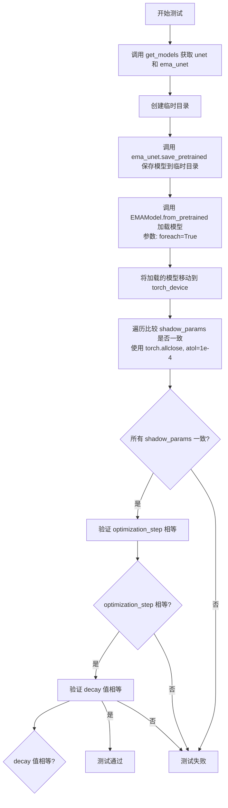

#### 带注释源码

```python
def test_from_pretrained(self):
    # 保存模型参数到临时目录
    # 1. 获取 UNet 和 EMA 模型实例
    unet, ema_unet = self.get_models()
    
    # 2. 使用临时目录上下文管理器
    with tempfile.TemporaryDirectory() as tmpdir:
        # 将 EMA 模型保存到指定目录
        # 保存内容包含: shadow_params, optimization_step, decay 等
        ema_unet.save_pretrained(tmpdir)

        # 从保存的目录加载 EMA 模型
        # 参数 foreach=True 指定使用 foreach 优化方式
        loaded_ema_unet = EMAModel.from_pretrained(
            tmpdir, 
            model_cls=UNet2DConditionModel, 
            foreach=True
        )
        # 将加载的模型移动到计算设备
        loaded_ema_unet.to(torch_device)

    # 3. 验证加载模型的 shadow parameters 与原始 EMA 模型一致
    # 逐参数比较，使用容差 1e-4
    for original_param, loaded_param in zip(ema_unet.shadow_params, loaded_ema_unet.shadow_params):
        assert torch.allclose(original_param, loaded_param, atol=1e-4)

    # 4. 验证优化步骤数被正确保留
    assert loaded_ema_unet.optimization_step == ema_unet.optimization_step

    # 5. 验证衰减系数被正确保留
    assert loaded_ema_unet.decay == ema_unet.decay
```


### `EMAModelTestsForeach.test_optimization_steps_updated`

该测试方法用于验证 EMA（指数移动平均）模型的优化步骤计数器在每次调用 `step()` 方法后是否正确递增，确保 EMA 类的 `optimization_step` 属性能够准确追踪模型更新的次数。

参数：

- `self`：`EMAModelTestsForeach`，测试类实例本身，包含测试所需的模型配置和工具方法

返回值：`None`，该方法为单元测试，不返回任何值，仅通过断言验证优化步骤计数器的正确性

#### 流程图

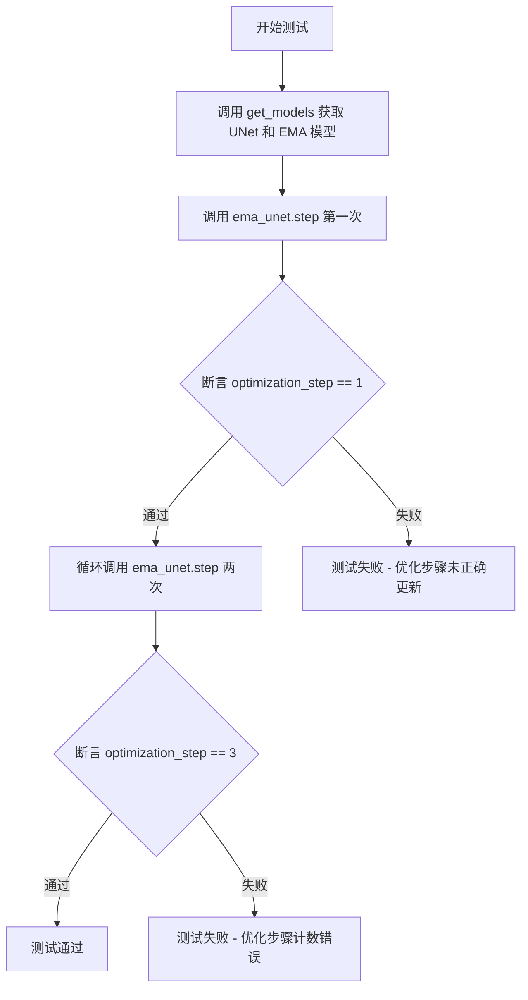

#### 带注释源码

```python
def test_optimization_steps_updated(self):
    """
    测试优化步骤计数是否正确更新。
    
    该测试验证 EMA 模型的 optimization_step 属性在每次调用 step() 方法后
    能够正确递增，确保 EMA 训练过程中的步骤计数准确无误。
    """
    # 获取模型实例：原始 UNet 模型和对应的 EMA 模型
    unet, ema_unet = self.get_models()
    
    # 第一次 EMA 步骤调用
    # 模拟一次模型参数更新后的 EMA 更新
    ema_unet.step(unet.parameters())
    
    # 验证第一次调用后优化步骤计数为 1
    assert ema_unet.optimization_step == 1

    # 连续调用两次 EMA 步骤
    # 模拟多轮训练迭代
    for _ in range(2):
        ema_unet.step(unet.parameters())
    
    # 验证经过三次 step 调用后，优化步骤计数应为 3
    assert ema_unet.optimization_step == 3
```

#### 关键组件信息

| 组件名称 | 一句话描述 |
|---------|-----------|
| `EMAModel` | Diffusers 库中的指数移动平均模型封装类，用于在训练过程中维护模型参数的 EMA 版本 |
| `optimization_step` | EMA 模型内部维护的优化步骤计数器，记录已执行的 EMA 更新次数 |
| `get_models()` | 测试辅助方法，用于创建 UNet2DConditionModel 实例及其对应的 EMA 模型 |
| `step()` | EMA 模型的核心方法，执行一次参数更新并递增优化步骤计数器 |

#### 潜在技术债务或优化空间

1. **测试覆盖不足**：当前测试仅验证了计数器递增的正确性，未验证在边界条件（如计数器溢出、大量步骤累积）下的行为
2. **重复代码**：`EMAModelTests` 和 `EMAModelTestsForeach` 两个测试类中存在大量重复的测试方法，可考虑使用参数化测试或基类继承来减少冗余
3. **模拟方式简化**：`simulate_backprop` 方法使用随机噪声模拟参数更新，与实际反向传播的梯度更新机制存在差异，可能无法完全覆盖真实场景

#### 其它项目

**设计目标与约束**：
- 目标：确保 EMA 模型的优化步骤计数机制正确工作，为训练过程中的模型检查点保存和加载提供准确的步骤信息
- 约束：依赖 `diffusers` 库的 `EMAModel` 实现，测试需在 CPU 或 CUDA 设备上运行（已通过 `@skip_mps` 装饰器跳过 MPS 设备）

**错误处理与异常设计**：
- 测试失败时将抛出 `AssertionError`，表明 `optimization_step` 的值与预期不符
- 可能的异常来源：`step()` 方法内部错误、模型参数不匹配等

**数据流与状态机**：
- 初始状态：`optimization_step = 0`
- 每次调用 `step()` 后状态转换为 `optimization_step = optimization_step + 1`
- 测试验证状态转换的正确性

**外部依赖与接口契约**：
- 依赖 `diffusers.training_utils.EMAModel` 类的 `step()` 方法和 `optimization_step` 属性
- 依赖 `UNet2DConditionModel` 作为测试用的模型类
- 使用 `torch_device` 决定计算设备（CPU/CUDA）


### `EMAModelTestsForeach.test_shadow_params_not_updated`

该测试方法用于验证当模型参数未进行更新（即未执行反向传播）时，EMA（指数移动平均）的影子参数（shadow_params）保持与原始模型参数相同，不发生变化。

参数：

- 该方法无显式参数，使用类属性 `self`

返回值：`None`，测试方法无返回值，仅执行断言验证

#### 流程图

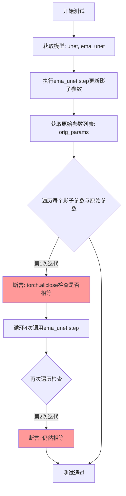

#### 带注释源码

```python
def test_shadow_params_not_updated(self):
    """
    测试无参数更新时影子参数保持不变
    
    验证逻辑：
    1. 当模型参数未发生改变时（未执行反向传播）
    2. 调用EMA的step方法后，影子参数应与原始参数保持一致
    3. 多次调用step方法后，结果仍然一致
    """
    # 获取模型实例：原始unet和ema包装后的unet
    unet, ema_unet = self.get_models()
    
    # 执行EMA的step方法进行参数更新
    # 此时unet参数未被更新（无反向传播），影子参数应该等于原始参数
    ema_unet.step(unet.parameters())
    
    # 记录更新前的原始参数
    orig_params = list(unet.parameters())
    
    # 验证：每个影子参数应该与对应的原始参数相等
    # 使用torch.allclose进行浮点数近似相等判断
    for s_param, param in zip(ema_unet.shadow_params, orig_params):
        assert torch.allclose(s_param, param)

    # 重复执行4次step操作，进一步验证
    # 由于unet参数始终未更新，影子参数应始终保持与原始参数一致
    for _ in range(4):
        ema_unet.step(unet.parameters())
    
    # 再次验证所有影子参数与原始参数仍然相等
    for s_param, param in zip(ema_unet.shadow_params, orig_params):
        assert torch.allclose(s_param, param)
```


### `EMAModelTestsForeach.test_shadow_params_updated`

该测试方法用于验证在使用 foreach 模式时，EMA 模型的影子参数（shadow parameters）在模型参数更新后会发生变化。测试通过模拟模型的反向传播过程来更新参数，然后执行 EMA step，并断言影子参数与原始参数不再相同，以确保 EMA 机制正确地跟踪了参数的变化。

参数：无（除隐含的 `self` 参数外）

返回值：`None`，无返回值

#### 流程图

```mermaid
flowchart TD
    A[开始测试] --> B[调用 get_models 获取 unet 和 ema_unet 实例]
    B --> C[调用 simulate_backprop 模拟参数更新]
    C --> D[调用 ema_unet.step 执行 EMA 更新]
    D --> E[获取更新后的模型参数列表 orig_params]
    E --> F{遍历每对参数}
    F -->|对于每对| G[断言影子参数与模型参数不接近: not torch.allclose]
    F -->|遍历完成| H[执行 4 次额外的 ema_unet.step]
    H --> I{再次遍历每对参数}
    I -->|对于每对| J[断言影子参数与原始参数仍不接近]
    I -->|遍历完成| K[测试通过 - 影子参数已更新]
    G --> K
    J --> K
```

#### 带注释源码

```python
def test_shadow_params_updated(self):
    """
    测试在使用 foreach 模式时，EMA 的影子参数在参数更新后会发生改变。
    """
    # 1. 获取模型实例：原始的 UNet 和对应的 EMA 模型
    unet, ema_unet = self.get_models()
    
    # 2. 模拟参数更新：模拟一次反向传播后的参数更新
    #    （因为可能存在初始化为零的参数，需要确保乘积操作后值非零）
    unet_pseudo_updated_step_one = self.simulate_backprop(unet)

    # 3. 执行 EMA step，使用更新后的参数
    ema_unet.step(unet_pseudo_updated_step_one.parameters())

    # 4. 获取更新后的模型参数
    orig_params = list(unet_pseudo_updated_step_one.parameters())
    
    # 5. 验证 EMA 影子参数与当前模型参数不同（EMA 已生效）
    for s_param, param in zip(ema_unet.shadow_params, orig_params):
        # 断言：影子参数与模型参数不接近（即已更新）
        assert ~torch.allclose(s_param, param)

    # 6. 额外测试：再执行 4 次 EMA step，确保多次更新后仍保持不同
    for _ in range(4):
        ema_unet.step(unet.parameters())
    for s_param, param in zip(ema_unet.shadow_params, orig_params):
        # 断言：影子参数仍与原始参数不接近
        assert ~torch.allclose(s_param, param)
```


### `EMAModelTestsForeach.test_consecutive_shadow_params_updated`

测试连续多次更新产生不同的影子参数，验证EMA模型在连续两次反向传播+EMA步骤后，影子参数应该不同，以确保EMA在每一步都正确更新。

参数：

- `self`：`EMAModelTestsForeach`，测试类的实例

返回值：`None`，无返回值（测试方法）

#### 流程图

```mermaid
flowchart TD
    A[Start test_consecutive_shadow_params_updated] --> B[获取UNet和EMA模型]
    B --> C[第一次反向传播+EMA更新]
    C --> C1[调用simulate_backprop模拟参数更新<br/>得到unet_step_one]
    C1 --> C2[调用ema_unet.step更新影子参数]
    C2 --> C3[保存当前影子参数<br/>step_one_shadow_params]
    C3 --> D[第二次反向传播+EMA更新]
    D --> D1[在unet_step_one基础上再次模拟参数更新<br/>得到unet_step_two]
    D1 --> D2[再次调用ema_unet.step更新影子参数]
    D2 --> D3[保存更新后的影子参数<br/>step_two_shadow_params]
    D3 --> E[循环断言: 每对影子参数应该不同<br/>验证连续两次更新产生不同结果]
    E --> F[End]
```

#### 带注释源码

```python
def test_consecutive_shadow_params_updated(self):
    """
    测试连续多次更新产生不同的影子参数
    
    如果我们连续两次在反向传播后调用EMA步骤，
    来自这两个步骤的影子参数应该不同。
    """
    # 获取UNet模型和EMA模型实例
    unet, ema_unet = self.get_models()

    # ========== 第一次反向传播 + EMA ==========
    # 模拟第一次反向传播后的参数更新
    unet_step_one = self.simulate_backprop(unet)
    # 执行EMA步骤，将更新后的参数应用到影子参数
    ema_unet.step(unet_step_one.parameters())
    # 保存第一次EMA更新后的影子参数
    step_one_shadow_params = ema_unet.shadow_params

    # ========== 第二次反向传播 + EMA ==========
    # 基于第一次更新后的模型，再模拟一次反向传播参数更新
    unet_step_two = self.simulate_backprop(unet_step_one)
    # 再次执行EMA步骤
    ema_unet.step(unet_step_two.parameters())
    # 保存第二次EMA更新后的影子参数
    step_two_shadow_params = ema_unet.shadow_params

    # ========== 验证 ==========
    # 断言：连续两次EMA更新产生的影子参数应该不同
    # 使用zip并行遍历两套影子参数进行对比
    for step_one, step_two in zip(step_one_shadow_params, step_two_shadow_params):
        # assert ~torch.allclose() 表示两者不应该接近
        assert ~torch.allclose(step_one, step_two)
```


### `EMAModelTestsForeach.test_zero_decay`

测试当衰减系数为0时，即使存在反向传播更新，EMA的影子参数也不会被更新（即影子参数保持不变）。

参数：

- `self`：`EMAModelTestsForeach`，测试类的实例，隐式参数

返回值：`None`，无返回值（测试方法）

#### 流程图

```mermaid
flowchart TD
    A[开始测试] --> B[调用get_models decay=0.0创建unet和ema_unet]
    B --> C[调用simulate_backprop模拟第一次反向传播更新unet]
    C --> D[调用ema_unet.step执行EMA更新]
    D --> E[获取第一次EMA步骤后的影子参数 step_one_shadow_params]
    E --> F[调用simulate_backprop模拟第二次反向传播]
    F --> G[再次调用ema_unet.step执行EMA更新]
    G --> H[获取第二次EMA步骤后的影子参数 step_two_shadow_params]
    H --> I{校验: step_one与step_two是否相等}
    I -->|是| J[测试通过]
    I -->|否| K[测试失败]
```

#### 带注释源码

```python
def test_zero_decay(self):
    # 测试目的：如果没有衰减系数(decay=0)，即使进行了反向传播更新模型参数，
    # EMA步骤也不会产生任何效果，即影子参数保持不变。
    
    # 1. 创建模型，decay设置为0.0
    unet, ema_unet = self.get_models(decay=0.0)
    
    # 2. 模拟第一次反向传播，更新unet的参数
    unet_step_one = self.simulate_backprop(unet)
    
    # 3. 执行第一次EMA步骤
    ema_unet.step(unet_step_one.parameters())
    
    # 4. 保存第一次EMA步骤后的影子参数
    step_one_shadow_params = ema_unet.shadow_params

    # 5. 模拟第二次反向传播，再次更新unet的参数
    unet_step_two = self.simulate_backprop(unet_step_one)
    
    # 6. 执行第二次EMA步骤
    ema_unet.step(unet_step_two.parameters())
    
    # 7. 保存第二次EMA步骤后的影子参数
    step_two_shadow_params = ema_unet.shadow_params

    # 8. 断言：验证两次影子参数完全相等（因为decay=0，不会更新）
    for step_one, step_two in zip(step_one_shadow_params, step_two_shadow_params):
        assert torch.allclose(step_one, step_two)
```


### `EMAModelTestsForeach.test_serialization`

该方法测试EMA（指数移动平均）模型的序列化与反序列化功能，验证保存和加载EMA模型后，模型的输出与原始模型一致（因未执行EMA步骤，参数相同）。

参数：

- `self`：`EMAModelTestsForeach`，测试类的实例，隐含参数

返回值：`None`，无返回值

#### 流程图

```mermaid
flowchart TD
    A[开始测试] --> B[调用get_models获取unet和ema_unet]
    B --> C[调用get_dummy_inputs获取虚拟输入]
    C --> D[创建临时目录tmpdir]
    D --> E[调用ema_unet.save_pretrained保存模型到tmpdir]
    E --> F[调用UNet2DConditionModel.from_pretrained加载模型到loaded_unet]
    F --> G[将loaded_unet移动到unet所在的设备]
    G --> H[执行unet前向传播得到output]
    H --> I[执行loaded_unet前向传播得到output_loaded]
    I --> J[使用torch.allclose验证输出是否匹配]
    J --> K{输出是否匹配?}
    K -->|是| L[测试通过]
    K -->|否| M[测试失败]
```

#### 带注释源码

```python
@skip_mps
def test_serialization(self):
    # 获取UNet模型和对应的EMA模型
    # unet: 原始UNet2DConditionModel模型
    # ema_unet: EMA包装后的模型，使用foreach=True优化
    unet, ema_unet = self.get_models()
    
    # 获取虚拟输入数据用于测试
    # noisy_latents: 噪声潜在向量 (batch_size, num_in_channels, height, width)
    # timesteps: 时间步 (batch_size,)
    # encoder_hidden_states: 文本编码器隐藏状态 (batch_size, prompt_length, hidden_dim)
    noisy_latents, timesteps, encoder_hidden_states = self.get_dummy_inputs()

    # 使用临时目录保存和加载模型
    with tempfile.TemporaryDirectory() as tmpdir:
        # 将EMA模型保存到临时目录
        # 保存内容包含shadow_params、优化步数、decay等EMA相关参数
        ema_unet.save_pretrained(tmpdir)
        
        # 从保存的目录加载模型
        # 加载后的模型包含EMA的shadow parameters
        loaded_unet = UNet2DConditionModel.from_pretrained(tmpdir, model_cls=UNet2DConditionModel)
        
        # 确保加载的模型在相同的设备上（CPU/CUDA）
        loaded_unet = loaded_unet.to(unet.device)

    # 由于没有执行过EMA step，原始模型和EMA模型的参数相同
    # 因此前向传播的输出应该完全一致
    output = unet(noisy_latents, timesteps, encoder_hidden_states).sample
    output_loaded = loaded_unet(noisy_latents, timesteps, encoder_hidden_states).sample

    # 验证两个输出在容差1e-4内相等
    # 如果相等，说明序列化/反序列化过程正确保存了模型参数
    assert torch.allclose(output, output_loaded, atol=1e-4)
```

## 关键组件


### EMAModel

指数移动平均（EMA）模型类，用于在训练过程中维护模型参数的EMA版本，通过对参数进行指数加权移动平均来提高模型的稳定性和泛化能力。

### UNet2DConditionModel

条件二维UNet模型，是Stable Diffusion等扩散模型的核心组件，用于根据文本条件生成图像。

### shadow_params

EMA模型维护的影子参数副本，存储模型参数的指数移动平均值，用于在推理时提供更稳定的模型输出。

### decay

EMA衰减因子，控制历史参数对当前移动平均的影响程度，值越接近1表示历史信息保留越多。

### optimization_step

优化步数计数器，记录EMA更新的次数，用于调整衰减率和计算正确的移动平均。

### foreach参数

控制是否使用PyTorch的foreach优化方法进行参数更新，可加速多参数的张量运算。

### simulate_backprop

模拟反向传播的参数更新过程，通过对原始参数添加随机噪声来模拟训练过程中的参数变化。

### step方法

执行单步EMA更新，根据当前模型参数和衰减因子更新影子参数，同时递增优化步数计数器。

### save_pretrained和from_pretrained

模型持久化方法，支持将EMA模型保存到磁盘并重新加载，保留所有影子参数和优化状态。

### 张量索引与惰性加载

在测试中通过`torch.randn_like`和`torch_device`实现张量的惰性创建和设备分配。

### 反量化支持与量化策略

代码中未直接涉及反量化或量化策略，但EMA模型本身可与量化模型配合使用以保持精度。

## 问题及建议


### 已知问题

- **代码重复严重**：两个测试类（`EMAModelTests` 和 `EMAModelTestsForeach`）的代码几乎完全相同，仅在 `get_models` 方法中的 `foreach` 参数不同。这违反了 DRY（Don't Repeat Yourself）原则，导致维护成本增加。
- **重复的辅助方法**：`get_models`、`get_dummy_inputs`、`simulate_backprop` 方法在两个测试类中完全重复，可通过参数化测试或继承方式复用。
- **模型重复加载**：每个测试方法都通过 `get_models()` 重新加载模型，导致测试执行效率低下，增加 CI/CD 运行时间。
- **断言使用不规范**：在 `test_shadow_params_updated` 和 `test_consecutive_shadow_params_updated` 中使用 `~torch.allclose()` 进行否定断言，这种写法不够直观且可能产生意外行为，应使用 `not torch.allclose()` 或显式的布尔否定。
- **测试覆盖不足**：缺少对边界情况（如 `decay` 为极端值 0.0 或 1.0 时的行为）、异常输入（如 `None` 参数）的测试，以及对并发调用 `step` 方法的场景测试。
- **硬编码配置**：模型 ID (`model_id`)、批次大小、潜在空间尺寸等参数硬编码在类属性中，缺乏灵活的配置机制，难以适配不同测试场景。
- **资源清理不明确**：测试中虽然使用 `tempfile.TemporaryDirectory`，但未显式验证临时文件的清理是否成功，可能存在资源泄漏风险。

### 优化建议

- **采用参数化测试**：使用 `unittest.parameterized` 或 `pytest.mark.parametrize` 装饰器，将 `foreach` 参数化，避免创建两个完全相同的测试类。
- **提取公共基类**：将 `get_models`、`get_dummy_inputs`、`simulate_backprop` 等通用方法提取到基类中，让两个测试类继承以减少重复代码。
- **优化模型加载策略**：使用类级别的 `setUpClass` 方法加载模型一次，或使用 pytest 的 fixture 机制缓存模型实例，减少重复加载开销。
- **改进断言写法**：将 `~torch.allclose(s_param, param)` 替换为 `not torch.allclose(s_param, param)` 或 `assert not torch.allclose(...)`，提升代码可读性。
- **增加边界测试**：添加针对 `decay` 极端值（0.0、1.0）、模型参数为空、设备兼容性（MPS、CPU、CUDA）等场景的测试用例。
- **外部化配置**：将模型 ID、批次大小等配置通过 pytest fixture 或配置文件注入，提高测试的灵活性。
- **添加资源清理验证**：在测试结束后显式检查临时目录是否被正确删除，或使用上下文管理器确保资源释放。

## 其它


### 设计目标与约束

EMAModel的核心设计目标是实现模型参数的指数移动平均（Exponential Moving Average），用于在训练过程中稳定模型性能并提升推理时的模型表现。约束包括：1) 仅支持PyTorch张量参数；2) 需要提供模型配置信息用于序列化/反序列化；3) foreach参数控制是否使用优化后的批量更新策略；4) decay参数控制EMA更新速率，取值范围[0,1]。

### 错误处理与异常设计

代码中的错误处理主要通过断言实现。在`test_from_pretrained`中验证加载后的shadow parameters与原始参数的一致性（使用`torch.allclose`），验证`optimization_step`和`decay`属性正确恢复。在`test_optimization_steps_updated`中验证step计数器的正确性。异常情况包括：1) 模型参数维度不匹配；2) decay值超出[0,1]范围；3) 序列化目录不存在；4) model_cls与实际模型类型不一致。

### 数据流与状态机

EMAModel的核心状态转换包括：1) 初始化状态：创建shadow_params副本；2) step()调用：执行EMA更新，optimization_step递增；3) save_pretrained()：持久化shadow_params和优化状态；4) from_pretrained()：恢复EMA模型状态。数据流向：原始模型参数 → shadow_params（EMA加权） → 更新后的模型参数。

### 外部依赖与接口契约

主要依赖包括：1) `torch` - PyTorch张量运算；2) `diffusers.UNet2DConditionModel` - 测试用模型类；3) `diffusers.training_utils.EMAModel` - 被测EMA实现；4) `tempfile` - 临时目录管理。接口契约：`step(params)`方法接受模型参数迭代器并更新shadow参数；`save_pretrained(path)`和`from_pretrained(path, model_cls)`实现序列化/反序列化。

### 配置参数说明

关键配置参数：1) `decay` - EMA衰减系数，默认0.9999，值越大表示历史权重越高；2) `model_cls` - 模型类用于反序列化；3) `model_config` - 模型配置字典；4) `foreach` - 布尔值，控制是否使用torch.no_grad()优化的批量更新。

### 并发与线程安全性

测试代码未涉及多线程场景。EMAModel的step()方法通常在单线程训练循环中调用，若在多线程环境使用需注意：1) shadow_params的更新操作非原子性；2) optimization_step计数器可能存在竞态条件；3) 建议在训练循环的主线程中统一调用step()。

### 性能考虑

性能关键点：1) foreach=True使用优化路径，可显著提升大规模模型的EMA更新速度；2) shadow_params的复制操作涉及全模型参数拷贝，内存开销约为原模型两倍；3) step()调用频率影响训练速度与EMA质量平衡。

### 兼容性考虑

兼容性考虑：1) 仅支持PyTorch框架；2) 模型类必须实现`state_dict()`和`config`属性；3) 序列化格式与HuggingFace Hub兼容；4) MPS设备被跳过（`@skip_mps`装饰器）。

### 测试策略

测试覆盖场景：1) from_pretrained/序列化完整性；2) optimization_step计数正确性；3) 无参数更新时shadow_params保持不变；4) 参数更新后shadow_params正确反映EMA；5) 连续多次更新的差异性；6) zero_decay的特殊行为；7) foreach开启与关闭的行为一致性。

    